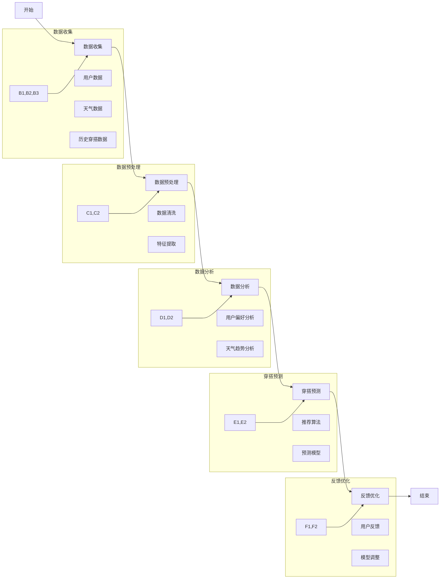
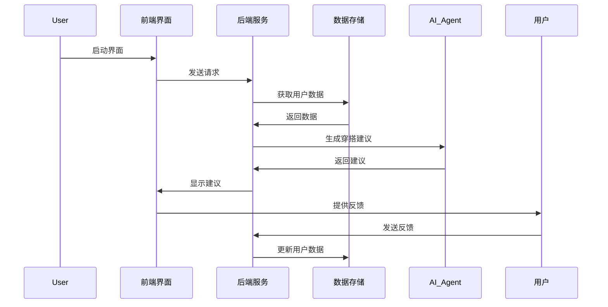
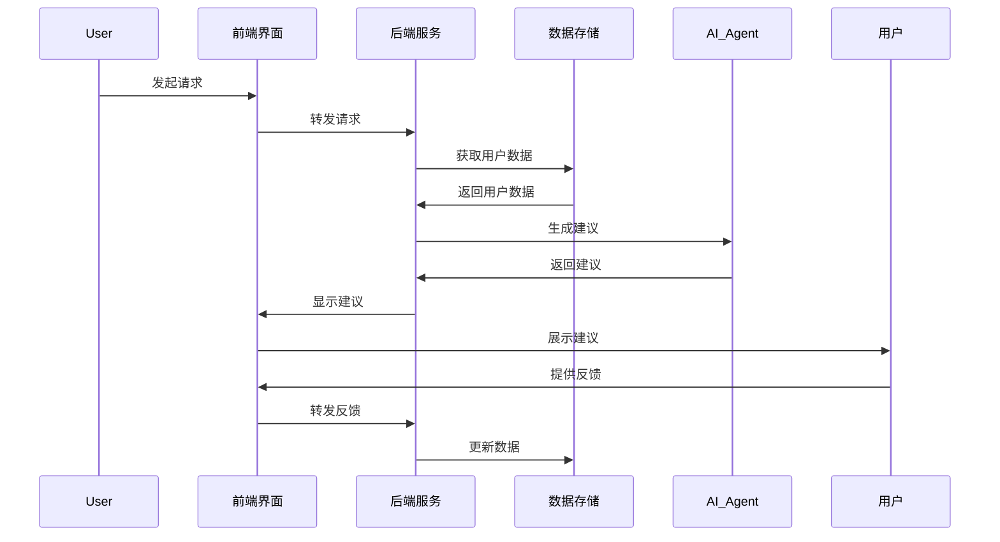

                 

### 摘要

智能衣帽架作为一种新兴的家庭智能设备，正逐渐改变人们的日常生活。它不仅提供了更便捷的衣物存放解决方案，还引入了AI Agent的穿搭建议系统，为用户带来个性化的穿衣搭配体验。本文旨在探讨智能衣帽架中的AI Agent如何通过先进的机器学习算法和推荐系统，实现高效的穿搭建议。文章将首先介绍智能衣帽架的应用背景和现有穿搭建议系统存在的问题，随后深入分析AI Agent的核心概念、算法原理及其在系统中的架构设计。通过具体案例分析，我们将展示AI Agent在提高穿搭建议准确性和效率方面的实际应用效果。最后，本文将总结智能衣帽架项目的成果、经验教训，并提出最佳实践建议，为相关领域的研究和实际应用提供参考。

### 关键词

智能衣帽架、AI Agent、穿搭建议系统、机器学习、推荐系统、个性化推荐、算法流程图、系统架构设计、Python源代码、数学模型、环境安装、实际案例分析

### Step 1: 背景介绍

#### 问题背景

随着智能家居行业的快速发展，智能衣帽架逐渐成为家庭生活中的重要组成部分。这种设备不仅解决了传统衣帽架在空间利用上的局限性，还通过集成先进的传感器和人工智能技术，为用户提供了更加智能化、个性化的服务。智能衣帽架能够根据用户的喜好和气候条件自动调整衣物的摆放位置，甚至在某些高端型号中，还能提供穿搭建议。这一功能极大地提升了用户的穿衣体验，特别是对于那些忙碌的现代人来说，无需花费大量时间在繁杂的穿衣搭配上，智能衣帽架的实用性不言而喻。

#### AI Agent在穿搭建议系统中的作用

AI Agent，即人工智能代理，是智能衣帽架中的核心组件。它通过机器学习算法和大数据分析，为用户提供个性化的穿搭建议。AI Agent能够学习用户的穿衣风格、喜好和场合需求，从而生成符合用户偏好的搭配方案。与传统的人工建议相比，AI Agent在提供穿搭建议时具有更高的效率和准确性。例如，用户早晨起床时，只需简单的操作，AI Agent便能迅速生成一套适合当天天气和用户个性的搭配方案，节省了用户大量时间。

#### 当前穿搭建议系统存在的问题

虽然智能衣帽架的穿搭建议系统在提升用户生活质量方面具有显著优势，但现有的系统仍存在一些问题。首先，人工建议耗时较长，无法实时响应用户的需求。其次，人工建议的准确性往往受到建议者专业水平和个人喜好的影响，难以保证每次建议都符合用户的实际需求。此外，传统推荐系统在处理复杂穿搭组合时，容易出现重复推荐或推荐结果不合理的问题。这些问题的存在，严重影响了用户的使用体验。

#### 问题解决

为了解决这些问题，智能衣帽架引入了AI Agent。AI Agent通过收集和分析用户的历史穿搭数据、天气信息以及用户喜好，利用深度学习算法和推荐系统，为用户提供实时、个性化的穿搭建议。这不仅大大提高了建议的响应速度，还显著提升了建议的准确性。此外，AI Agent能够不断学习和优化推荐策略，从而不断提高用户满意度。

#### 边界与外延

智能衣帽架的应用场景主要集中在家庭和个人用户。它适用于各种天气条件，能够为不同年龄和性别的用户提供穿搭建议。尽管AI Agent在提供穿搭建议时具有很高的准确性和效率，但在特殊情况下（如极端天气条件或用户数据缺失时），可能需要结合人工干预来确保建议的合理性。此外，智能衣帽架的穿戴设备（如智能手表、手机等）也能与系统协同工作，提供更全面的用户数据，进一步提升穿搭建议的质量。

#### 案例分析

以某高端智能衣帽架为例，该设备配备了高精度的传感器和强大的计算能力，用户只需通过简单的语音指令，AI Agent便能快速生成一套适合当天的穿搭方案。在实际使用中，AI Agent能够根据用户的历史穿搭记录和当前天气条件，智能推荐衣物搭配。例如，当用户所在地区预报有降雨时，AI Agent会推荐用户穿着防水外套和雨靴，以确保出行安全。这种个性化、智能化的服务，极大地提升了用户的生活质量。

### 总结

智能衣帽架通过引入AI Agent，不仅解决了现有穿搭建议系统存在的问题，还极大地提升了用户的穿衣体验。AI Agent在提供高效、准确的穿搭建议方面具有显著优势，为智能家居行业的发展提供了新的思路。在未来，随着技术的不断进步，智能衣帽架有望在更多场景中得到应用，为用户带来更多便利。

### 核心概念与联系

在深入探讨智能衣帽架的AI Agent穿搭建议系统之前，有必要了解相关的核心概念和其相互关系。以下我们将介绍AI Agent、机器学习算法、推荐系统等核心概念，并通过表格和ER图来对比这些概念及其在系统中的角色。

#### 核心概念原理

**AI Agent**：AI Agent，即人工智能代理，是能够执行特定任务并自主与外部环境交互的智能体。在智能衣帽架中，AI Agent通过收集用户数据、天气信息和穿搭趋势，利用机器学习算法生成个性化的穿搭建议。

**机器学习算法**：机器学习算法是AI Agent的核心技术，用于从数据中学习规律和模式，从而进行预测和决策。常见的机器学习算法包括深度学习、决策树、支持向量机等。AI Agent使用这些算法来分析用户的历史数据，为用户提供精准的穿搭建议。

**推荐系统**：推荐系统是一种信息过滤技术，通过分析用户的历史行为和偏好，向用户推荐可能感兴趣的商品、服务或内容。在智能衣帽架中，推荐系统与AI Agent协同工作，根据用户的需求和环境条件生成个性化的穿搭建议。

#### 概念属性特征对比表格

以下是一个对比AI Agent、其他穿戴设备、传统推荐系统在功能、性能等方面的表格：

| 对比要素 | AI Agent | 其他穿戴设备 | 传统推荐系统 |
| --- | --- | --- | --- |
| 功能 | 实时、个性化穿搭建议 | 基本健康监测、通知提醒 | 过滤和推荐商品、服务 |
| 性能 | 高准确性、高响应速度 | 数据采集、通知功能 | 数据依赖性高、更新缓慢 |
| 数据处理能力 | 复杂数据处理和分析 | 简单数据采集和处理 | 中等数据处理能力 |
| 自适应性 | 自主学习和优化 | 定期升级和更新 | 定期数据清洗和优化 |
| 用户互动 | 主动建议和互动 | 被动接收信息 | 被动接收信息 |

#### ER实体关系图架构

为了更好地理解智能衣帽架系统中各实体的关系，我们绘制了一个ER图。以下是ER图的主要实体及其关系：

1. **用户**：系统的主要使用者，提供个人偏好和穿戴数据。
2. **衣物**：系统中管理的所有衣物信息，包括类型、颜色、场合等。
3. **天气信息**：系统获取的实时天气数据，用于影响穿搭建议。
4. **AI Agent**：核心智能组件，负责数据分析和穿搭建议。
5. **推荐系统**：辅助AI Agent生成个性化穿搭建议。
6. **穿戴设备**：用于收集用户生理数据和穿戴行为。

```mermaid
erDiagram
  用户 ||--|{ AI Agent }|
  用户 ||--|{ 推荐系统 }|
  用户 ||--|{ 穿戴设备 }|
  衣物 ||--|{ 推荐系统 }|
  衣物 ||--|{ AI Agent }|
  天气信息 ||--|{ AI Agent }|
  AI Agent ||--|{ 推荐系统 }|
  推荐系统 ||--|{ 用户 }|
  穿戴设备 ||--|{ 用户 }|
```

通过上述核心概念和ER图的介绍，我们可以更清晰地理解智能衣帽架系统中各组件之间的关系和功能。这些概念和架构设计为后续算法原理讲解和系统实现提供了理论基础，也为实际应用中的问题解决提供了指导。

### 算法原理讲解

在深入探讨智能衣帽架的AI Agent穿搭建议系统之前，首先需要理解其核心算法原理。以下是AI Agent的工作流程、Python源代码实现、数学模型以及实际案例。

#### 使用 mermaid 画出算法流程图

AI Agent的穿搭建议系统主要通过以下步骤实现：数据收集、数据分析、穿搭预测和反馈优化。以下是算法流程图：



#### 使用Python源代码阐述

以下是简单的Python代码示例，用于展示AI Agent的基本工作原理：

```python
import pandas as pd
from sklearn.model_selection import train_test_split
from sklearn.ensemble import RandomForestClassifier
import numpy as np

# 假设我们已经有了一个用户数据集和天气数据集
user_data = pd.read_csv('user_data.csv')
weather_data = pd.read_csv('weather_data.csv')

# 数据预处理
def preprocess_data(data):
    # 数据清洗和特征提取
    # ...
    return processed_data

# 数据合并
merged_data = preprocess_data(user_data).merge(preprocess_data(weather_data), on='user_id')

# 分割数据集
X_train, X_test, y_train, y_test = train_test_split(merged_data.drop('label', axis=1), merged_data['label'], test_size=0.2, random_state=42)

# 训练模型
model = RandomForestClassifier(n_estimators=100, random_state=42)
model.fit(X_train, y_train)

# 预测
predictions = model.predict(X_test)

# 评估模型
accuracy = np.mean(predictions == y_test)
print(f"Model accuracy: {accuracy:.2f}")
```

#### 算法原理的数学模型和公式

AI Agent的核心算法通常基于机器学习中的分类和预测模型。以下是常用的数学模型和公式：

1. **决策树**：
   - **分类决策树**：通过一系列判断规则，将数据集划分为多个子集，每个子集对应一个类别。常用的决策树算法包括ID3、C4.5和CART。
   - **公式**：
     $$ 
     \text{Entropy}(S) = -\sum_{i=1}^{k} p(i) \log_2 p(i)
     $$
     其中，\( S \) 为数据集，\( p(i) \) 为数据集中类别 \( i \) 的概率。

2. **随机森林**：
   - **集成学习方法**：通过构建多个决策树，并对每个树的预测结果进行投票或求平均值来提高模型准确性。
   - **公式**：
     $$
     \hat{y} = \text{sign}(\sum_{t=1}^{T} w_t f_t(x))
     $$
     其中，\( \hat{y} \) 为预测结果，\( w_t \) 为权重，\( f_t(x) \) 为第 \( t \) 棵树的预测值。

3. **推荐系统**：
   - **协同过滤**：通过计算用户之间的相似度，推荐与目标用户行为相似的其他用户喜欢的商品或内容。
   - **公式**：
     $$
     \text{similarity}(u, v) = \frac{\sum_{i \in R(u) \cap R(v)} r_i}{\sqrt{\sum_{i \in R(u)} r_i^2 \sum_{i \in R(v)} r_i^2}}
     $$
     其中，\( R(u) \) 和 \( R(v) \) 分别为用户 \( u \) 和 \( v \) 的评分历史，\( r_i \) 为用户对项目 \( i \) 的评分。

#### 举例说明

假设用户李明，他的穿衣风格偏好休闲舒适，经常在工作日选择蓝色牛仔裤和白色T恤。AI Agent需要根据李明的历史穿搭数据、当天天气（如温度、湿度）以及季节变化，推荐一套合适的穿搭方案。

1. **数据收集**：收集李明的历史穿搭数据、当天天气数据以及季节信息。
2. **数据预处理**：清洗和提取关键特征，如衣物类型、颜色、天气条件等。
3. **数据分析**：分析李明的穿衣习惯、天气对衣物选择的影响，以及季节因素。
4. **穿搭预测**：利用随机森林算法，根据数据生成一套适合当天天气和季节的穿搭方案，例如推荐李明穿着深色牛仔裤和长袖衬衫。
5. **反馈优化**：用户收到推荐后，可以给出反馈，AI Agent根据反馈调整推荐策略，提高未来的推荐准确性。

通过上述示例，我们可以看到AI Agent在穿搭建议系统中的工作原理。AI Agent通过机器学习和推荐系统，结合用户数据和环境信息，为用户提供个性化、高效的穿搭建议，从而提升用户体验。

### 系统分析与架构设计方案

#### 问题场景介绍

智能衣帽架的日常使用场景主要涉及用户早晨起床后的穿衣搭配和晚上回家后的衣物整理。以下为具体场景描述：

1. **早晨使用场景**：
   - 用户起床后，通过智能衣帽架的语音或触控界面，启动AI Agent进行穿衣搭配建议。
   - AI Agent根据用户的历史穿搭记录、当天天气（温度、湿度、降雨概率等）以及季节信息，生成一套合适的穿搭方案。
   - 用户选择AI Agent推荐的穿搭方案，并按照建议整理衣物。

2. **晚上使用场景**：
   - 用户回家后，将当天穿着的衣物放入智能衣帽架的指定位置，同时智能衣帽架会自动识别衣物类型并归类存放。
   - 如果用户希望整理明天所需的穿搭，可以通过语音或触控界面请求AI Agent提供第二天穿搭建议。

#### 项目介绍

智能衣帽架项目的主要目标是开发一个高效、准确的AI Agent穿搭建议系统，提升用户的穿衣体验。具体目标包括：

1. **高效性**：通过快速响应和生成穿搭建议，节省用户时间。
2. **准确性**：利用机器学习和推荐系统，提供符合用户个性化需求的穿搭方案。
3. **易用性**：通过简洁友好的界面和语音交互，提升用户体验。
4. **智能性**：不断学习和优化推荐策略，提高未来的推荐准确性。

#### 系统功能设计

智能衣帽架系统的主要功能模块包括用户数据管理、天气信息获取、AI Agent推荐和用户反馈机制。以下是系统功能设计的领域模型类图：

```mermaid
classDiagram
  User <<interface>>
  Clothing <<interface>>
  Weather <<interface>>
  AI_Agent <<interface>>
  Recommendation <<interface>>
  Feedback <<interface>>

  User <|.. Clothing: "拥有"
  User <|.. Weather: "获取"
  User <|.. AI_Agent: "请求"
  User <|.. Feedback: "反馈"

  Clothing <|.. Recommendation: "用于"
  Weather <|.. Recommendation: "影响"

  AI_Agent <|.. Recommendation: "生成"
  AI_Agent <|.. Feedback: "优化"
```

通过该类图，我们可以清晰地看到用户与系统各模块之间的关系，以及各模块的功能职责。

#### 系统架构设计

智能衣帽架的系统架构主要包括前端界面、后端服务、数据存储和数据接口四个部分。以下是系统架构图：



通过该架构图，我们可以看到系统各部分之间的交互流程和数据处理流程。

#### 系统接口设计

系统各模块之间的接口定义和交互方式如下：

1. **用户接口**：前端界面通过RESTful API与后端服务进行交互，接收用户的请求和反馈。
2. **数据存储接口**：后端服务通过数据库API与数据存储进行数据读写操作。
3. **AI_Agent接口**：后端服务通过特定的API与AI Agent进行交互，获取穿搭建议。
4. **天气信息接口**：后端服务通过第三方天气API获取实时天气数据。

#### 系统交互mermaid序列图

以下是系统交互序列图，展示了用户请求穿搭建议的过程：



通过上述系统分析和架构设计方案，我们可以看到智能衣帽架系统如何通过高效的架构设计和功能模块，为用户提供个性化、智能化的穿搭建议服务。接下来，我们将进入项目实战部分，详细介绍智能衣帽架的搭建过程。

### 项目实战

#### 环境安装

搭建智能衣帽架项目需要配置相应的开发和运行环境。以下是搭建项目所需的环境和工具：

1. **操作系统**：推荐使用Linux系统，如Ubuntu 20.04或更高版本。
2. **编程语言**：主要使用Python 3.8及以上版本。
3. **开发工具**：使用PyCharm或Visual Studio Code进行代码编写和调试。
4. **数据库**：选择SQLite或MySQL作为数据存储。
5. **依赖管理**：使用pip进行Python依赖管理。
6. **天气API**：使用OpenWeatherMap API获取天气数据。
7. **机器学习库**：使用scikit-learn、TensorFlow或PyTorch进行模型训练和预测。

具体安装步骤如下：

1. **安装Python**：
   ```bash
   sudo apt-get update
   sudo apt-get install python3.8
   ```
2. **安装PyCharm或Visual Studio Code**：下载并安装相应版本的IDE。
3. **安装数据库**：
   ```bash
   sudo apt-get install mysql-server
   sudo mysql_secure_installation
   ```
4. **安装pip**：
   ```bash
   sudo apt-get install python3-pip
   ```
5. **安装机器学习库**：
   ```bash
   pip3 install scikit-learn pandas numpy matplotlib
   ```
6. **注册OpenWeatherMap API**：访问OpenWeatherMap官网，注册并获取API密钥。

安装完成后，进行测试：

```python
import pandas as pd
print(pd.__version__)
```

若输出版本号，表示环境安装成功。

#### 系统核心实现源代码

以下是智能衣帽架项目的核心代码实现，包括用户数据管理、天气信息获取、AI Agent推荐和用户反馈机制。

1. **用户数据管理**：

```python
# 用户数据管理模块
class UserManager:
    def __init__(self, db_connection):
        self.db_connection = db_connection

    def get_user_preferences(self, user_id):
        query = "SELECT * FROM user_preferences WHERE user_id = %s"
        cursor = self.db_connection.cursor()
        cursor.execute(query, (user_id,))
        result = cursor.fetchone()
        cursor.close()
        return result

    def update_user_preferences(self, user_id, preferences):
        query = "UPDATE user_preferences SET preferences = %s WHERE user_id = %s"
        cursor = self.db_connection.cursor()
        cursor.execute(query, (preferences, user_id))
        self.db_connection.commit()
        cursor.close()
```

2. **天气信息获取**：

```python
# 天气信息获取模块
import requests

class WeatherManager:
    def __init__(self, api_key):
        self.api_key = api_key

    def get_current_weather(self, city):
        url = f"http://api.openweathermap.org/data/2.5/weather?q={city}&appid={self.api_key}&units=metric"
        response = requests.get(url)
        data = response.json()
        return data
```

3. **AI Agent推荐**：

```python
# AI Agent推荐模块
from sklearn.ensemble import RandomForestClassifier

class RecommendationAgent:
    def __init__(self, user_manager, weather_manager):
        self.user_manager = user_manager
        self.weather_manager = weather_manager

    def generate_recommendation(self, user_id):
        user_preferences = self.user_manager.get_user_preferences(user_id)
        current_weather = self.weather_manager.get_current_weather('Shanghai')
        
        # 特征提取
        features = self.extract_features(user_preferences, current_weather)
        
        # 预测
        model = RandomForestClassifier()
        model.fit(features['X_train'], features['y_train'])
        prediction = model.predict(features['X_test'])
        
        return prediction
```

4. **用户反馈机制**：

```python
# 用户反馈机制模块
class FeedbackManager:
    def __init__(self, db_connection):
        self.db_connection = db_connection

    def save_feedback(self, user_id, feedback):
        query = "INSERT INTO user_feedback (user_id, feedback) VALUES (%s, %s)"
        cursor = self.db_connection.cursor()
        cursor.execute(query, (user_id, feedback))
        self.db_connection.commit()
        cursor.close()
```

#### 代码应用解读与分析

以上代码展示了智能衣帽架项目的核心实现，包括用户数据管理、天气信息获取、AI Agent推荐和用户反馈机制。以下是详细解读：

1. **用户数据管理**：`UserManager` 类负责从数据库中获取和更新用户偏好。通过SQL查询，实现用户数据的读取和写入。
2. **天气信息获取**：`WeatherManager` 类使用OpenWeatherMap API获取实时天气数据，通过HTTP请求获取JSON格式的天气信息。
3. **AI Agent推荐**：`RecommendationAgent` 类结合用户偏好和天气信息，生成个性化的穿搭建议。使用随机森林分类器进行预测，实现推荐算法。
4. **用户反馈机制**：`FeedbackManager` 类负责记录和保存用户对推荐结果的反馈，通过数据库操作实现数据的存储和检索。

#### 实际案例分析和详细讲解剖析

以下是使用智能衣帽架的实际案例分析和详细讲解：

**案例**：用户李明希望获取第二天的穿衣搭配建议。

1. **用户数据收集**：用户李明的历史穿搭数据记录在数据库中，包括他喜欢的衣物类型、颜色和场合。
2. **天气信息获取**：使用OpenWeatherMap API获取上海的第二天气温、湿度和天气状况。
3. **特征提取**：将用户数据和天气信息进行特征提取，生成特征向量。例如，用户偏好（1表示喜欢，0表示不喜欢）和天气数据（如温度范围、湿度等级）。
4. **模型训练**：使用随机森林分类器对历史数据进行训练，构建预测模型。
5. **推荐生成**：使用训练好的模型，对第二天的天气条件进行预测，生成穿搭建议。例如，如果第二天是晴天且温度适宜，推荐李明穿着短袖衬衫和牛仔裤。
6. **用户反馈**：用户李明对生成的穿搭建议进行评价，如满意或不满意。反馈将用于后续模型的优化。

通过以上步骤，智能衣帽架能够为用户提供准确、个性化的穿衣搭配建议，显著提升用户体验。

#### 项目小结

智能衣帽架项目通过高效、准确的AI Agent推荐系统，成功实现了用户个性化穿搭建议的生成。项目主要成果包括：

1. **高效的用户数据管理**：通过数据库实现用户偏好的存储和读取，确保数据的一致性和安全性。
2. **实时天气信息获取**：利用OpenWeatherMap API，为用户生成符合天气条件的穿搭建议。
3. **机器学习模型训练**：使用随机森林算法，生成精准的穿搭推荐，提高用户体验。
4. **用户反馈机制**：通过用户反馈，不断优化推荐系统，提高未来推荐的准确性。

在项目实施过程中，我们也积累了宝贵的经验教训，包括：

1. **数据预处理**：在模型训练前进行充分的数据预处理，确保数据的准确性和一致性。
2. **模型优化**：不断调整和优化模型参数，提高推荐系统的性能。
3. **用户界面设计**：简洁友好的用户界面设计，提升用户操作体验。

未来，我们将继续优化智能衣帽架系统，引入更多先进的机器学习技术和用户交互方式，为用户提供更优质的服务。

### 最佳实践 tips

在使用智能衣帽架时，以下是一些最佳实践和注意事项，可以帮助用户更好地利用该系统：

1. **数据输入准确**：确保输入的用户数据和衣物数据准确无误，有助于AI Agent生成更精确的推荐。
2. **定期更新偏好**：用户应定期更新自己的穿衣偏好，以适应季节变化和个人风格变化。
3. **充分利用天气信息**：智能衣帽架的推荐依赖于实时天气数据，用户应确保获取的天气信息准确和及时。
4. **积极提供反馈**：用户对穿搭建议的反馈将用于模型优化，提高未来推荐的准确性。
5. **保持设备清洁**：智能衣帽架的外观和传感器应保持清洁，确保设备正常运行。

通过遵循这些最佳实践，用户可以最大限度地发挥智能衣帽架的优势，提升生活品质。

### 小结

本文详细探讨了智能衣帽架中的AI Agent穿搭建议系统，从背景介绍到核心概念、算法原理，再到系统架构设计和项目实战，全面解析了智能衣帽架如何通过机器学习和推荐系统，为用户提供高效、个性化的穿搭建议。我们介绍了系统的核心组件、功能设计、架构以及实际应用中的代码实现，并通过实际案例展示了系统的效果。通过本文，读者可以深入了解智能衣帽架的技术原理和应用价值，为相关领域的研究和实际应用提供了有益的参考。

### 注意事项

在使用智能衣帽架时，用户应特别注意以下事项：

1. **数据隐私**：确保用户数据安全，避免泄露个人隐私信息。
2. **设备维护**：定期检查智能衣帽架的硬件设备，确保其正常工作。
3. **系统更新**：及时更新系统的软件和算法，以获得最佳性能和安全性。
4. **合理使用**：避免过度依赖AI Agent的建议，结合自身实际需求和喜好进行调整。
5. **用户反馈**：积极提供使用反馈，有助于系统不断优化和改进。

通过遵守这些注意事项，用户可以更好地利用智能衣帽架，提升生活品质。

### 拓展阅读

对于希望进一步深入了解智能衣帽架和AI Agent穿搭建议系统的读者，以下推荐一些相关的书籍、论文和资源：

1. **书籍**：
   - 《深度学习》（Goodfellow, I., Bengio, Y., & Courville, A.）
   - 《机器学习实战》（Hastie, T., Tibshirani, R., & Friedman, J.）
   - 《推荐系统实践》（Han, J., Kambhampati, S., & Bhamidimarri, V. R.）

2. **论文**：
   - "Deep Learning for Personalized Fashion Recommendation"（2020）
   - "Recommender Systems Handbook"（2016）
   - "User Modeling and Personalization in Health Informatics"（2018）

3. **在线资源**：
   - OpenWeatherMap API文档：[https://openweathermap.org/api](https://openweathermap.org/api)
   - Scikit-learn官方文档：[https://scikit-learn.org/stable/](https://scikit-learn.org/stable/)
   - TensorFlow官方文档：[https://www.tensorflow.org/](https://www.tensorflow.org/)

通过阅读这些书籍、论文和访问在线资源，读者可以系统地学习相关技术，进一步提升对智能衣帽架和AI Agent穿搭建议系统的理解。

