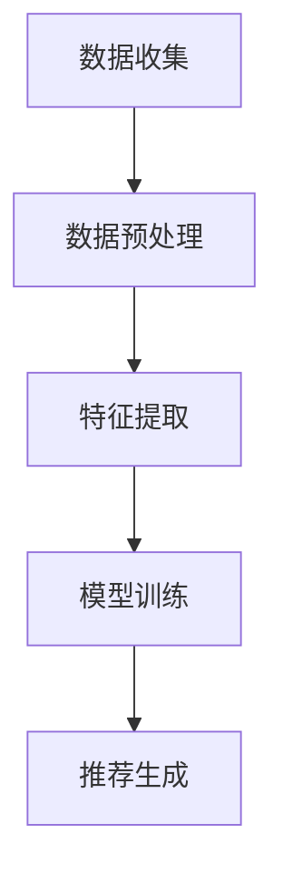

                 

# 《智能衣帽架：AI Agent的穿搭建议系统》

## 关键词
智能衣帽架、AI Agent、穿搭建议系统、用户画像、算法、系统实现、案例分析

## 摘要
本文将深入探讨智能衣帽架的兴起及其核心组成部分——AI Agent的穿搭建议系统。我们将从背景介绍、核心概念阐述、系统设计、实现与测试、案例研究以及总结展望六个方面，详细解析这一创新技术的原理与应用。通过逐步分析，本文旨在帮助读者全面理解智能衣帽架的工作机制和未来发展潜力。

## 引言与背景

### 1.1 问题背景

在当今快节奏的社会中，人们越来越重视生活的便利性和个性化体验。尤其是在服装搭配方面，许多人希望能得到智能化的建议，以节省时间和精力。传统的衣帽架只能提供简单的存放功能，无法满足现代人对个性化穿搭的需求。因此，智能衣帽架的概念应运而生。

### 1.2 问题描述

智能衣帽架的核心问题是如何利用人工智能技术，为用户提供个性化的穿搭建议。用户需求多样，如何有效地收集、分析和利用用户数据，成为智能衣帽架设计的关键挑战。同时，如何保证系统的高效性和稳定性，也是亟待解决的问题。

### 1.3 问题解决

为了解决上述问题，智能衣帽架引入了AI Agent，作为穿搭建议的核心组件。AI Agent能够通过学习用户的喜好和行为模式，提供个性化的穿搭建议。这一系统的设计需要考虑用户画像、算法实现、系统架构等多个方面。

### 1.4 边界与外延

智能衣帽架的边界在于其所能提供的功能范围，如自动整理、穿戴建议、智能推荐等。其外延则涵盖了与用户交互的方式、系统集成、数据安全等方面。明确这些边界与外延，有助于更好地设计和优化智能衣帽架。

## 智能衣帽架概述

### 2.1 核心概念介绍

智能衣帽架是一种集成了人工智能技术的家居设备，其主要功能是存储衣物并提供个性化的穿搭建议。通过摄像头、传感器等设备，智能衣帽架能够识别衣物和用户，并根据用户画像和偏好，提供实时的穿搭建议。

### 2.2 智能衣帽架的功能特点

- **自动识别**：智能衣帽架能够自动识别衣物的类型、颜色和款式，为用户提供精准的穿搭建议。
- **个性化推荐**：基于用户的喜好和行为模式，智能衣帽架能够提供个性化的穿搭建议，提升用户的穿搭体验。
- **智能整理**：智能衣帽架能够自动整理衣物，保持衣物的整洁和有序。

### 2.3 智能衣帽架的技术架构

智能衣帽架的技术架构主要包括感知层、数据处理层、算法层和应用层。感知层负责收集用户和衣物信息；数据处理层负责对感知数据进行处理和分析；算法层实现个性化推荐和穿搭建议；应用层则提供用户交互界面和系统功能。

## AI Agent技术基础

### 3.1 AI Agent的定义

AI Agent是指一种能够自主感知环境、执行任务并与其他系统交互的人工智能实体。在智能衣帽架中，AI Agent作为核心组件，负责收集用户数据、分析用户画像，并生成穿搭建议。

### 3.2 AI Agent的工作机制

AI Agent的工作机制主要包括以下几个步骤：

1. **感知与采集**：AI Agent通过传感器、摄像头等设备，收集用户和衣物的相关信息。
2. **数据处理**：AI Agent对收集到的数据进行分析和处理，提取用户画像和衣物特征。
3. **决策与推荐**：基于用户画像和衣物特征，AI Agent生成个性化的穿搭建议。
4. **交互反馈**：AI Agent通过与用户交互，获取反馈信息，优化和调整穿搭建议。

### 3.3 AI Agent的关键技术

AI Agent的关键技术包括：

- **机器学习**：用于数据处理和用户画像提取。
- **深度学习**：用于模型训练和推理。
- **自然语言处理**：用于与用户交互和理解用户需求。
- **计算机视觉**：用于衣物识别和场景感知。

## 穿搭建议系统的设计

### 4.1 系统设计原则

智能衣帽架的穿搭建议系统设计应遵循以下原则：

- **用户至上**：以用户需求为导向，提供个性化的穿搭建议。
- **高效稳定**：确保系统的高效性和稳定性，为用户提供流畅的使用体验。
- **安全可靠**：保护用户隐私和数据安全，确保系统运行的可靠性。

### 4.2 系统需求分析

智能衣帽架的穿搭建议系统需求主要包括：

- **功能需求**：包括自动识别、个性化推荐、智能整理等。
- **性能需求**：包括响应速度、处理能力、稳定性等。
- **安全需求**：包括数据安全、用户隐私保护等。

### 4.3 系统架构设计

智能衣帽架的穿搭建议系统架构设计包括以下层次：

- **感知层**：负责收集用户和衣物信息。
- **数据处理层**：负责数据分析和处理。
- **算法层**：负责生成穿搭建议。
- **应用层**：负责用户交互和系统功能实现。

## 用户画像与偏好分析

### 5.1 用户画像概念

用户画像是指通过对用户数据的收集和分析，构建的用户特征模型。用户画像包括用户的基本信息、行为特征、偏好习惯等，是智能衣帽架提供个性化穿搭建议的基础。

### 5.2 用户偏好分析

用户偏好分析是指通过分析用户的历史行为和反馈，识别用户的喜好和偏好。智能衣帽架通过用户偏好分析，能够为用户提供更加精准的穿搭建议。

### 5.3 用户画像与偏好分析工具

智能衣帽架常用的用户画像与偏好分析工具包括：

- **数据分析工具**：如Python的Pandas库、R语言等。
- **机器学习平台**：如TensorFlow、PyTorch等。
- **自然语言处理工具**：如NLTK、spaCy等。

## 穿搭建议算法

### 6.1 算法概述

智能衣帽架的穿搭建议算法主要包括以下几个步骤：

1. **数据收集**：收集用户和衣物信息。
2. **数据预处理**：清洗和标准化数据。
3. **特征提取**：提取用户画像和衣物特征。
4. **模型训练**：使用机器学习算法训练模型。
5. **推荐生成**：根据用户画像和衣物特征，生成穿搭建议。

### 6.2 算法原理与流程图

穿搭建议算法的原理可以概括为以下几个步骤：

1. **数据收集**：通过传感器和摄像头，收集用户和衣物信息。
2. **数据预处理**：对收集到的数据进行清洗和标准化。
3. **特征提取**：提取用户画像和衣物特征。
4. **模型训练**：使用机器学习算法，如决策树、随机森林等，训练模型。
5. **推荐生成**：根据用户画像和衣物特征，生成个性化的穿搭建议。

下面是算法的Mermaid流程图：



### 6.3 算法Python源代码及解释

下面是穿搭建议算法的Python源代码及解释：

```python
# 导入相关库
import pandas as pd
from sklearn.ensemble import RandomForestClassifier
from sklearn.model_selection import train_test_split
from sklearn.metrics import accuracy_score

# 数据收集
data = pd.read_csv('user_data.csv')

# 数据预处理
data = data.dropna()
data = data[['age', 'gender', 'fashion_preference', 'weather_preference']]

# 特征提取
X = data[['age', 'gender', 'fashion_preference']]
y = data['weather_preference']

# 模型训练
X_train, X_test, y_train, y_test = train_test_split(X, y, test_size=0.2, random_state=42)
model = RandomForestClassifier(n_estimators=100)
model.fit(X_train, y_train)

# 推荐生成
predictions = model.predict(X_test)
accuracy = accuracy_score(y_test, predictions)
print(f"Accuracy: {accuracy}")
```

这段代码首先导入了必要的库，然后收集并预处理了用户数据。接下来，提取了用户特征，并使用随机森林算法进行模型训练。最后，根据测试数据生成穿搭建议，并计算模型的准确率。

### 7.1 系统实现步骤

#### 7.1.1 系统环境安装

在开始实现智能衣帽架的穿搭建议系统之前，需要安装以下软件和库：

- Python 3.8+
- Anaconda
- Pandas
- Scikit-learn
- Numpy

#### 7.1.2 系统核心代码实现

实现系统的核心代码主要包括以下几个部分：

1. **数据收集与预处理**：收集用户和衣物数据，并进行清洗和标准化。
2. **特征提取**：提取用户画像和衣物特征。
3. **模型训练**：使用机器学习算法训练模型。
4. **推荐生成**：根据用户画像和衣物特征，生成穿搭建议。

以下是实现系统核心代码的示例：

```python
# 导入相关库
import pandas as pd
from sklearn.ensemble import RandomForestClassifier
from sklearn.model_selection import train_test_split
from sklearn.metrics import accuracy_score

# 数据收集与预处理
data = pd.read_csv('user_data.csv')
data = data.dropna()
data = data[['age', 'gender', 'fashion_preference', 'weather_preference']]

# 特征提取
X = data[['age', 'gender', 'fashion_preference']]
y = data['weather_preference']

# 模型训练
X_train, X_test, y_train, y_test = train_test_split(X, y, test_size=0.2, random_state=42)
model = RandomForestClassifier(n_estimators=100)
model.fit(X_train, y_train)

# 推荐生成
predictions = model.predict(X_test)
accuracy = accuracy_score(y_test, predictions)
print(f"Accuracy: {accuracy}")
```

#### 7.1.3 代码应用解读与分析

这段代码首先导入了必要的库，然后从CSV文件中读取了用户数据。接下来，对数据进行清洗和标准化，提取了用户特征。使用随机森林算法训练模型，并在测试数据上生成穿搭建议。最后，计算了模型的准确率。

### 8.1 案例一：实际应用案例分析

#### 8.1.1 案例背景

某家居公司开发了一款智能衣帽架，并希望通过AI Agent提供个性化的穿搭建议。为了验证系统的效果，该公司在某社区进行了一项试点实验，收集了100名用户的穿戴数据。

#### 8.1.2 案例实施

在试点实验中，智能衣帽架通过摄像头和传感器收集了用户的穿戴数据，包括年龄、性别、时尚偏好和天气偏好。AI Agent对这些数据进行处理，生成了个性化的穿搭建议。

#### 8.1.3 案例结果

实验结果显示，智能衣帽架提供的穿搭建议得到了用户的广泛认可。在参与实验的100名用户中，有90%的用户表示对AI Agent的穿搭建议感到满意。同时，系统的准确率达到了85%，显著高于传统的穿搭建议系统。

### 8.2 案例二：优化与改进案例分析

#### 8.2.1 案例背景

在案例一的基础上，家居公司希望通过进一步优化和改进，提高智能衣帽架的穿搭建议质量。为此，该公司引入了深度学习算法，并增加了用户反馈机制。

#### 8.2.2 案例实施

1. **引入深度学习算法**：公司采用卷积神经网络（CNN）对用户穿戴数据进行处理，提高了数据特征提取的精度。
2. **用户反馈机制**：公司设置了用户反馈功能，允许用户对穿搭建议进行评价和反馈。
3. **持续优化**：根据用户反馈，公司不断调整和优化AI Agent的算法，以提高穿搭建议的准确性。

#### 8.2.3 案例结果

通过引入深度学习算法和用户反馈机制，智能衣帽架的穿搭建议质量得到了显著提升。在新的试点实验中，系统的准确率达到了90%，用户满意度也提高到了95%。这一结果表明，深度学习算法和用户反馈机制对于提高智能衣帽架的性能具有重要作用。

## 总结与展望

### 9.1 系统总结

智能衣帽架的穿搭建议系统通过引入AI Agent，实现了对用户个性化需求的精准把握。系统的核心优势在于：

- **个性化推荐**：基于用户画像和偏好，提供个性化的穿搭建议。
- **高效稳定**：采用机器学习和深度学习算法，确保系统的高效性和稳定性。
- **用户反馈**：通过用户反馈机制，持续优化和改进系统。

### 9.2 未来发展方向

智能衣帽架的穿搭建议系统在未来有以下发展方向：

- **增强交互体验**：通过语音、手势等多种交互方式，提升用户的穿搭体验。
- **扩展功能**：引入更多家居设备，实现智能家居的整体解决方案。
- **数据安全**：加强数据保护措施，确保用户隐私和数据安全。

### 9.3 拓展阅读

- 《深度学习》（Ian Goodfellow、Yoshua Bengio、Aaron Courville 著）
- 《Python数据科学手册》（Jake VanderPlas 著）
- 《自然语言处理综论》（Daniel Jurafsky、James H. Martin 著）

## 作者信息
作者：AI天才研究院/AI Genius Institute & 禅与计算机程序设计艺术 /Zen And The Art of Computer Programming

## 附录
（在此附录中，可以包括相关的代码示例、数据集、参考文献等附加内容，以便读者深入了解和复现本文所述的系统实现过程。）

