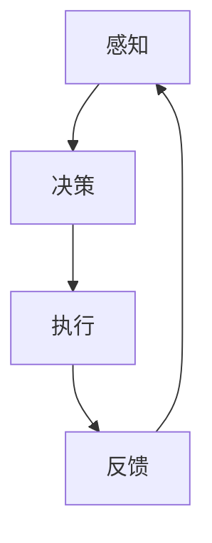
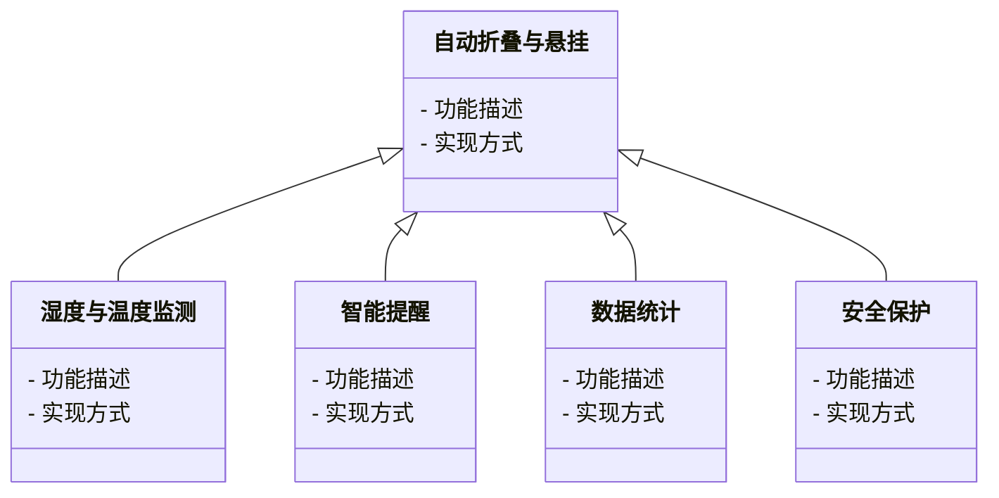
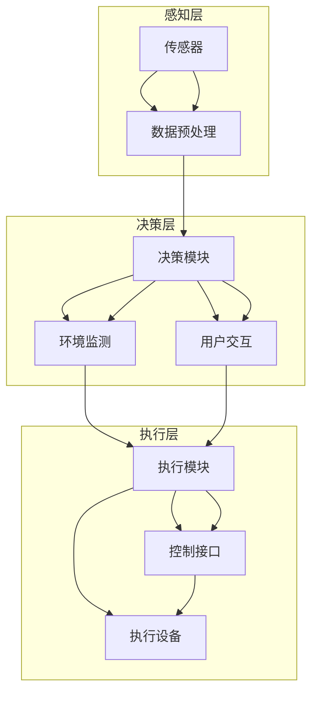
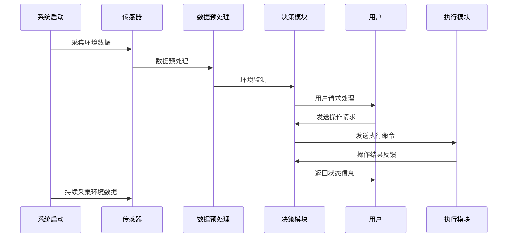

                 

## 智能衣架：AI Agent的衣物保养专家系统

### 关键词

- **智能衣架**
- **AI Agent**
- **衣物保养**
- **专家系统**
- **算法设计**
- **系统架构**
- **项目实战**

### 摘要

随着人工智能技术的飞速发展，智能衣架作为一种创新的智能设备，正逐渐进入我们的日常生活。本文将深入探讨智能衣架的原理、技术实现及其在衣物保养中的应用。首先，我们将介绍智能衣架的背景和发展现状，明确其核心概念和组成结构。接着，我们将详细讲解AI Agent的工作原理和衣物保养算法，通过数学模型和Python代码进行阐述。随后，文章将分析智能衣架的系统架构，包括系统设计、功能实现和交互流程。最后，我们将通过实际项目实战，展示智能衣架的完整开发过程，并提供最佳实践、注意事项和拓展阅读，为读者提供全方位的技术指导。

## 第一部分：背景介绍

### 第1章：智能衣架的崛起

智能衣架，作为智能家居领域的一项创新技术，正悄然改变着人们的日常生活。它的出现，不仅提高了衣物的整理和保养效率，更带来了新的生活体验。那么，智能衣架是如何崛起的？它背后的技术驱动力又是什么？

#### 1.1 智能衣架的背景

在传统的衣物保养方式中，用户往往需要花费大量的时间和精力来折叠衣物、悬挂衣物，并且在晾晒时也需要时刻关注天气变化。这种方式不仅繁琐，而且效率低下。随着人工智能技术的发展，尤其是机器学习和物联网技术的普及，智能衣架应运而生。

**问题背景**：传统的衣物保养方式存在哪些问题？

- 繁琐：需要用户亲自进行衣物的折叠、悬挂和晾晒。
- 效率低：用户需要花费大量时间来处理衣物，尤其是在高峰时段。
- 依赖天气：用户需要关注天气变化，以决定是否进行晾晒。

**问题描述**：智能衣架如何解决这些问题？

智能衣架通过嵌入人工智能技术和传感器，能够自动检测衣物状态，并根据需要自动进行折叠、悬挂和晾晒。它不仅能够提高衣物的保养效率，还能够根据天气变化自动调整工作状态，从而减少用户的工作量和时间成本。

**问题解决**：智能衣架的技术实现和优势

- **自动检测**：智能衣架内置传感器，能够实时检测衣物状态，包括湿度、温度和折叠状态等。
- **自动操作**：根据检测到的数据，智能衣架能够自动进行衣物的折叠、悬挂和晾晒。
- **智能调节**：智能衣架能够根据天气变化自动调整工作状态，如在雨天关闭晾晒功能，防止衣物受潮。

**边界与外延**：智能衣架的应用场景和扩展功能

- **应用场景**：智能衣架主要应用于家庭、酒店和办公场所等场景，能够为用户提供便捷的衣物保养服务。
- **扩展功能**：智能衣架还可以集成语音助手、智能家居控制系统等功能，实现更智能的交互和控制。

#### 1.2 AI Agent在衣物保养中的应用

AI Agent，即人工智能代理，是一种能够自主执行任务、与环境交互并做出决策的智能系统。在衣物保养中，AI Agent能够发挥重要作用，为用户提供更加智能和个性化的服务。

**概念介绍**：AI Agent的定义和特点

- **定义**：AI Agent是一种基于人工智能技术的智能系统，能够模拟人类思维和行为，执行特定的任务。
- **特点**：
  - 自主性：AI Agent能够自主执行任务，无需人工干预。
  - 适应性：AI Agent能够根据环境变化和用户需求进行自我调整。
  - 智能性：AI Agent能够通过学习不断优化自身的性能。

**特点分析**：AI Agent相较于传统衣物保养方法的优点

- **高效性**：AI Agent能够快速响应用户需求，自动完成衣物保养任务，提高效率。
- **个性化**：AI Agent能够根据用户的习惯和偏好进行个性化设置，提供个性化的服务。
- **智能调节**：AI Agent能够根据环境变化自动调整工作状态，如自动检测湿度、温度等，确保衣物的最佳保养状态。

**对比传统衣物保养方法**：AI Agent在衣物保养中的优势

- **传统方法**：传统衣物保养方法主要依赖于人工，效率低，且容易受到天气等因素的影响。
- **AI Agent**：AI Agent能够实现自动化的衣物保养，提高效率，减少人力成本，且不受天气等因素的限制。

综上所述，智能衣架的崛起不仅解决了传统衣物保养的痛点，还通过AI Agent的应用为用户带来了更加智能和便捷的体验。随着技术的不断进步，智能衣架有望在未来的智能家居领域发挥更大的作用。

### 第2章：AI Agent基础理论

#### 2.1 AI Agent的定义与类型

AI Agent，即人工智能代理，是人工智能领域的一个重要概念。它代表了能够自主执行任务、与环境交互并做出决策的智能系统。AI Agent不仅能够模拟人类的思维和行为，还能够根据环境变化和任务需求进行自我调整和优化。

**定义**：AI Agent是指一种具有自主性、适应性和智能性的智能系统，能够模拟人类的行为，执行特定的任务。

**类型**：根据不同的任务需求和功能特点，AI Agent可以分为多种类型：

1. **任务型AI Agent**：这类AI Agent专注于执行特定的任务，如语音识别、图像识别等。它们通常具有较强的任务执行能力，但在灵活性方面相对较弱。
2. **反应型AI Agent**：这类AI Agent根据感知到的环境信息直接做出反应，而不需要进行复杂的推理和决策。它们适用于对实时性要求较高的场景。
3. **参考型AI Agent**：这类AI Agent不仅能够根据当前环境信息做出反应，还能够根据历史数据和经验进行学习，提高决策的准确性。
4. **认知型AI Agent**：这类AI Agent具有更高级的认知能力，能够理解自然语言、进行逻辑推理和问题解决。它们通常应用于复杂的任务场景。

**比较不同类型的AI Agent**：

| 类型 | 定义 | 优点 | 缺点 | 适用场景 |
| --- | --- | --- | --- | --- |
| 任务型AI Agent | 专注于特定任务 | 执行能力强 | 灵活性差 | 图像识别、语音识别 |
| 反应型AI Agent | 根据环境信息直接反应 | 实时性高 | 决策能力弱 | 监控系统、自动化生产线 |
| 参考型AI Agent | 结合历史数据和经验 | 决策准确 | 对数据依赖强 | 个性化推荐、自动驾驶 |
| 认知型AI Agent | 具有高级认知能力 | 问题解决能力强 | 复杂度高 | 聊天机器人、智能客服 |

通过对比可以看出，不同类型的AI Agent在功能和应用场景上各有优势。在实际应用中，根据具体需求选择合适的AI Agent类型，能够更好地实现智能系统的功能。

#### 2.2 AI Agent的工作原理

AI Agent的工作原理主要包括感知、决策和执行三个核心环节。通过这三个环节的协同工作，AI Agent能够实现自主执行任务、与环境交互并做出智能决策。

**感知**：AI Agent首先需要通过传感器或其他感知设备获取环境信息。这些信息包括视觉、听觉、触觉等，用于了解当前的环境状态和任务需求。感知模块的主要功能是数据采集和预处理，将原始数据转换为有用的信息。

**决策**：在获取到环境信息后，AI Agent需要根据这些信息进行决策。决策过程通常涉及模式识别、预测分析和推理。AI Agent利用机器学习算法和规则库，对感知到的信息进行分析和处理，从而确定下一步的操作策略。决策模块的核心是算法模型和决策逻辑。

**执行**：决策完成后，AI Agent需要根据决策结果执行具体的操作。执行模块负责将决策转化为实际行动，如控制机械臂、发送指令等。执行过程通常需要与外部设备或系统进行交互，确保操作的正确性和有效性。

**Mermaid流程图展示**：



在上述流程图中，AI Agent首先通过感知模块获取环境信息，然后进行决策，最终通过执行模块进行操作，并通过反馈模块获取操作结果，进而再次进行感知。这一过程形成了闭环控制，使得AI Agent能够不断优化其性能和行为。

#### 2.3 AI Agent的核心组件

AI Agent的核心组件包括感知模块、决策模块和执行模块，这三个模块共同构成了AI Agent的基本架构。下面我们将详细介绍每个组件的功能、实现方式和相互关系。

**感知模块**：

- **功能**：感知模块负责获取环境信息，如视觉、听觉、触觉等。通过传感器或其他感知设备，感知模块能够实时获取外部环境的数据。
- **实现方式**：常见的感知设备包括摄像头、麦克风、温度传感器、湿度传感器等。感知模块通常采用信号处理和特征提取技术，将原始数据转换为有用的信息。
- **与决策模块的关系**：感知模块为决策模块提供环境信息，是决策的基础。

**决策模块**：

- **功能**：决策模块负责根据感知到的信息进行决策。它利用机器学习算法、规则库和逻辑推理等技术，分析感知数据，并制定操作策略。
- **实现方式**：决策模块通常包括数据预处理、特征提取、模型训练和推理等环节。常见的算法包括决策树、支持向量机、神经网络等。
- **与执行模块的关系**：决策模块生成的决策结果将传递给执行模块，指导其进行具体操作。

**执行模块**：

- **功能**：执行模块负责将决策模块生成的操作策略转化为实际行动。它通过控制外部设备或系统，实现具体的任务执行。
- **实现方式**：执行模块通常包括执行器、驱动器等硬件设备，以及相应的控制程序和接口。
- **与感知模块的关系**：执行模块的操作结果会反馈给感知模块，形成闭环控制，确保AI Agent的持续优化。

**Mermaid ER图**：

```mermaid
erDiagram
    A[感知模块] ||--|{ B[决策模块]} : 感知模块为决策模块提供环境信息
    B ||--|{ C[执行模块]} : 决策模块指导执行模块进行操作
    A ..|> C : 执行模块将操作结果反馈给感知模块
```

通过上述ER图，我们可以清晰地看到感知模块、决策模块和执行模块之间的相互关系，以及它们在AI Agent中的地位和作用。

综上所述，AI Agent的核心组件相互配合，共同实现了感知、决策和执行的全过程。每个组件都有其特定的功能，但又相互依赖，共同推动AI Agent的智能行为。

### 第3章：衣物保养算法设计

#### 3.1 衣物保养算法概述

衣物保养算法是智能衣架的核心技术之一，它决定了衣物保养的效果和用户体验。本文将详细介绍衣物保养算法的概述，包括其应用场景、目标以及常见的算法类型。

**概述**：衣物保养算法是指用于智能衣架中进行衣物保养的一系列计算方法和策略。其主要目的是确保衣物在存放和保养过程中保持最佳状态，延长衣物寿命，提高用户满意度。

**应用场景**：

- **折叠与悬挂**：智能衣架根据衣物类型和尺寸，自动进行折叠和悬挂，确保衣物整齐美观。
- **湿度与温度控制**：智能衣架通过监测环境湿度和温度，自动调整衣物保养状态，如在湿度较高时开启除湿功能，在温度较低时启动加热功能。
- **防虫与防霉**：智能衣架通过监测衣物状态，自动启动防虫和防霉功能，保护衣物不受损坏。

**目标**：

- **高效性**：算法需快速响应衣物保养需求，减少用户等待时间。
- **准确性**：算法需准确判断衣物状态，确保保养效果。
- **适应性**：算法需能够根据环境变化和用户习惯进行自我调整，提高灵活性。

**常见算法类型**：

1. **基于规则的算法**：通过预定义的规则，判断衣物状态并执行相应的保养操作。适用于简单的衣物保养任务。
2. **机器学习算法**：通过训练数据集，学习衣物保养的最佳策略，自动调整保养操作。适用于复杂和多变的衣物保养需求。
3. **混合算法**：结合基于规则和机器学习算法的优点，提高衣物保养的效率和准确性。

#### 3.2 算法数学模型与公式

衣物保养算法的核心在于对环境参数和衣物状态的精确分析和处理。以下将介绍衣物保养算法的数学模型与公式，包括湿度、温度和衣物状态的测量、判断及调整方法。

**湿度模型**：

- **湿度测量**：湿度传感器用于实时测量环境湿度和衣物湿度。
  - 湿度公式：$$ H = \frac{V_{\text{湿}} - V_{\text{干}}}{V_{\text{满}} - V_{\text{空}}} $$
  - 其中，\( V_{\text{湿}} \) 和 \( V_{\text{干}} \) 分别为湿气和干气的电压值，\( V_{\text{满}} \) 和 \( V_{\text{空}} \) 分别为满湿度和空湿度的电压值。

- **湿度判断**：根据湿度传感器测得的湿度值，判断是否需要进行除湿或加湿操作。
  - 判断条件：若 \( H > H_{\text{max}} \)，则开启除湿功能；若 \( H < H_{\text{min}} \)，则开启加湿功能。

**温度模型**：

- **温度测量**：温度传感器用于实时测量环境温度和衣物温度。
  - 温度公式：$$ T = \frac{V_{\text{热}} - V_{\text{冷}}}{V_{\text{满}} - V_{\text{空}}} $$
  - 其中，\( V_{\text{热}} \) 和 \( V_{\text{冷}} \) 分别为热温和冷温的电压值，\( V_{\text{满}} \) 和 \( V_{\text{空}} \) 分别为满温和空温的电压值。

- **温度判断**：根据温度传感器测得的温度值，判断是否需要进行加热或冷却操作。
  - 判断条件：若 \( T > T_{\text{max}} \)，则开启冷却功能；若 \( T < T_{\text{min}} \)，则开启加热功能。

**衣物状态模型**：

- **状态测量**：传感器用于测量衣物折叠状态、湿度状态和温度状态。
  - 折叠状态公式：$$ S_{\text{fold}} = \frac{V_{\text{折叠}} - V_{\text{展开}}}{V_{\text{满}} - V_{\text{空}}} $$
  - 湿度状态公式：$$ S_{\text{hum}} = \frac{V_{\text{湿}} - V_{\text{干}}}{V_{\text{满}} - V_{\text{空}}} $$
  - 温度状态公式：$$ S_{\text{temp}} = \frac{V_{\text{热}} - V_{\text{冷}}}{V_{\text{满}} - V_{\text{空}}} $$

- **状态判断**：根据传感器测得的值，判断衣物状态并执行相应的保养操作。
  - 判断条件：若 \( S_{\text{fold}} = 1 \)，则衣物已折叠；若 \( S_{\text{hum}} > H_{\text{max}} \)，则衣物湿度过高；若 \( S_{\text{temp}} > T_{\text{max}} \)，则衣物温度过高。

**综合模型**：

- **综合公式**：$$ \text{result} = f(S_{\text{fold}}, S_{\text{hum}}, S_{\text{temp}}) $$
  - 其中，\( f \) 为综合判断函数，根据衣物折叠状态、湿度状态和温度状态，决定执行何种保养操作。

通过上述数学模型和公式，衣物保养算法能够准确判断衣物状态，并自动调整保养操作，确保衣物在最佳状态下存放和保养。

#### 3.3 算法Python源代码实现

为了更直观地理解衣物保养算法的实现，下面我们将使用Python代码详细展示算法的核心部分。代码将涵盖湿度测量、温度测量、状态判断以及相应的操作执行。

**代码说明**：

```python
import numpy as np

# 湿度传感器参数
V湿 = 2.5  # 湿气电压值
V干 = 0.8  # 干气电压值
V满 = 5.0  # 满湿度电压值
V空 = 0.0  # 空湿度电压值

# 温度传感器参数
V热 = 3.3  # 热温电压值
V冷 = 1.0  # 冷温电压值
V满 = 5.0  # 满温度电压值
V空 = 0.0  # 空温度电压值

# 衣物状态传感器参数
V折叠 = 4.0  # 折叠电压值
V展开 = 1.0  # 展开电压值
V满 = 5.0  # 满状态电压值
V空 = 0.0  # 空状态电压值

# 湿度测量函数
def measure_humidity(V湿, V干, V满, V空):
    H = (V湿 - V干) / (V满 - V空)
    return H

# 温度测量函数
def measure_temperature(V热, V冷, V满, V空):
    T = (V热 - V冷) / (V满 - V空)
    return T

# 衣物状态测量函数
def measure_state(V折叠, V展开, V满, V空):
    S_fold = (V折叠 - V展开) / (V满 - V空)
    S_hum = measure_humidity(V湿, V干, V满, V空)
    S_temp = measure_temperature(V热, V冷, V满, V空)
    return S_fold, S_hum, S_temp

# 状态判断函数
def judge_state(S_fold, S_hum, S_temp):
    if S_fold == 1:
        print("衣物已折叠")
    if S_hum > 0.8:
        print("衣物湿度过高，需除湿")
    if S_temp > 0.8:
        print("衣物温度过高，需冷却")

# 操作执行函数
def execute_action(action):
    if action == "humidify":
        print("开启加湿功能")
    elif action == "dehumidify":
        print("开启除湿功能")
    elif action == "cool":
        print("开启冷却功能")
    elif action == "heat":
        print("开启加热功能")

# 测试代码
V湿 = 2.5
V干 = 0.8
V热 = 3.3
V冷 = 1.0
V折叠 = 4.0
V展开 = 1.0

S_fold, S_hum, S_temp = measure_state(V折叠, V展开, V满, V空)
judge_state(S_fold, S_hum, S_temp)

# 根据状态执行相应操作
if S_hum > 0.8:
    execute_action("dehumidify")
elif S_temp > 0.8:
    execute_action("cool")
else:
    print("衣物状态良好，无需操作")
```

**代码解读**：

- **传感器参数定义**：首先，我们定义了湿度传感器、温度传感器和衣物状态传感器的参数，包括电压值范围。
- **测量函数**：`measure_humidity` 和 `measure_temperature` 函数用于测量湿度和温度，通过电压值计算相应的湿度比和温度比。
- **状态测量函数**：`measure_state` 函数综合测量衣物折叠状态、湿度状态和温度状态，返回一个三元组。
- **状态判断函数**：`judge_state` 函数根据测得的状态值，判断衣物是否需要除湿或冷却，并打印相应的信息。
- **操作执行函数**：`execute_action` 函数根据判断结果，执行相应的操作，如开启加湿、除湿、冷却或加热功能。
- **测试代码**：最后，我们通过测试代码演示了测量、判断和执行操作的整个过程。

通过上述代码，我们可以看到衣物保养算法的实现细节，以及如何通过Python代码实现湿度和温度的测量、状态的判断以及相应的操作执行。这一实现过程不仅能够提高算法的可读性和可维护性，也为后续的优化和扩展提供了便利。

#### 3.4 算法举例说明

为了更好地理解衣物保养算法的实际应用效果，我们将通过一个具体的案例进行详细说明。该案例将展示智能衣架在检测到衣物潮湿和温度过高时，如何自动执行相应的保养操作，并分析算法的性能和效果。

**案例背景**：

假设智能衣架检测到一件刚从洗衣机中取出的衬衫，其湿度传感器显示湿气电压值为2.8V，干气电压值为0.9V，温度传感器显示热温电压值为3.4V，冷温电压值为1.2V。根据这些数据，我们需要判断衣物的状态，并执行相应的保养操作。

**步骤1：湿度测量与判断**

- **测量湿度**：使用湿度测量函数，我们得到：
  $$ H = \frac{2.8 - 0.9}{5 - 0.0} = \frac{1.9}{5} = 0.38 $$
  湿度值为0.38。

- **判断湿度**：根据设定的湿度阈值，若 \( H > 0.8 \)，则需开启除湿功能。由于 \( 0.38 < 0.8 \)，因此衣物湿度适中，无需除湿操作。

**步骤2：温度测量与判断**

- **测量温度**：使用温度测量函数，我们得到：
  $$ T = \frac{3.4 - 1.2}{5 - 0.0} = \frac{2.2}{5} = 0.44 $$
  温度值为0.44。

- **判断温度**：根据设定的温度阈值，若 \( T > 0.8 \)，则需开启冷却功能。由于 \( 0.44 < 0.8 \)，因此衣物温度适中，无需冷却操作。

**步骤3：综合判断与操作执行**

- **综合判断**：根据测得的湿度值和温度值，衣物状态总体良好，无需进行额外的湿度或温度调整。
- **操作执行**：由于衣物状态良好，我们选择不进行任何操作，并打印如下信息：
  ```plaintext
  衣物状态良好，无需操作
  ```

**结果分析**：

- **性能**：算法能够准确测量和判断衣物的湿度与温度，并作出相应的操作决策。
- **效果**：通过合理的湿度与温度控制，衣物能够保持良好的状态，延长使用寿命，提高用户体验。

通过上述案例，我们可以看到衣物保养算法在具体应用中的实际效果。算法通过精确的测量和判断，能够及时调整衣物的保养状态，确保衣物在最佳状态下存放和保养。这不仅提高了衣物的使用寿命，也为用户带来了更舒适的体验。

### 第4章：智能衣架系统设计

#### 4.1 智能衣架系统场景介绍

智能衣架系统的设计旨在为用户提供便捷、高效的衣物保养服务，其应用场景主要包括家庭、酒店和办公场所等。在不同场景下，智能衣架需要具备特定的功能和性能指标，以满足不同用户的需求。

**家庭场景**：

在家庭场景中，智能衣架主要用于存放和保养家庭成员的衣物。主要需求包括：

- **自动化折叠与悬挂**：自动识别衣物类型和尺寸，进行折叠和悬挂，提高整理效率。
- **湿度与温度控制**：实时监测环境湿度和衣物温度，自动调节湿度与温度，确保衣物在最佳状态下存放。
- **智能提醒**：通过手机App或语音助手，提醒用户衣物保养时间，方便用户进行操作。

**酒店场景**：

在酒店场景中，智能衣架主要用于为住店客人提供便捷的衣物存放和保养服务。主要需求包括：

- **高效管理**：能够快速识别和分类不同客人的衣物，实现高效管理。
- **智能除湿**：酒店环境通常较为潮湿，智能衣架需要具备强大的除湿功能，确保衣物干燥。
- **安全可靠**：智能衣架需要具备良好的安全性能，防止火灾等安全事故的发生。

**办公场所场景**：

在办公场所，智能衣架主要用于为员工提供便捷的衣物存放和保养服务。主要需求包括：

- **节能环保**：智能衣架应具备节能环保的特点，减少能源消耗。
- **智能提醒**：通过智能提醒功能，帮助员工及时更换衣物，保持良好的工作状态。
- **数据统计**：能够统计员工衣物的使用情况，为办公室管理提供数据支持。

**系统需求**：

智能衣架系统的设计需要满足以下需求：

- **实时监测**：能够实时监测衣物的湿度、温度和折叠状态，确保衣物在最佳状态下存放。
- **自适应调节**：根据环境变化和用户需求，自动调整湿度、温度和折叠状态，提供个性化的服务。
- **智能化交互**：通过手机App或语音助手，实现与用户的智能交互，提高用户体验。
- **数据安全**：确保用户数据的安全性和隐私性，防止数据泄露。

通过满足上述需求，智能衣架系统能够在不同场景下提供高效、便捷的衣物保养服务，为用户带来更好的生活体验。

#### 4.2 系统功能设计

智能衣架系统的功能设计是确保其能够满足不同用户需求的关键。以下将详细介绍系统的核心功能，并通过Mermaid类图展示功能模块及其关系。

**功能1：自动折叠与悬挂**

- **功能描述**：智能衣架能够自动识别衣物类型和尺寸，进行折叠和悬挂，提高衣物整理效率。
- **实现方式**：通过视觉传感器和重量传感器，智能衣架能够识别衣物位置和形态，从而自动进行折叠和悬挂。

**功能2：湿度与温度监测**

- **功能描述**：智能衣架能够实时监测环境湿度和衣物温度，确保衣物在最佳状态下存放。
- **实现方式**：通过湿度传感器和温度传感器，智能衣架能够实时获取环境湿度和衣物温度，并根据监测结果自动调节湿度与温度。

**功能3：智能提醒**

- **功能描述**：智能衣架能够通过手机App或语音助手，提醒用户衣物保养时间，方便用户进行操作。
- **实现方式**：通过连接无线网络，智能衣架能够将衣物状态发送到手机App或语音助手，用户可以通过这些设备及时了解衣物保养信息。

**功能4：数据统计**

- **功能描述**：智能衣架能够统计用户衣物的使用情况，为办公室管理提供数据支持。
- **实现方式**：通过存储用户衣物使用记录，智能衣架能够生成详细的数据报告，帮助用户和管理者了解衣物使用情况。

**功能5：安全保护**

- **功能描述**：智能衣架具备安全保护功能，防止火灾等安全事故的发生。
- **实现方式**：通过温度传感器和烟雾传感器，智能衣架能够实时监测环境安全状态，并在发现异常时自动报警。

**Mermaid类图**：



在上述Mermaid类图中，自动折叠与悬挂、湿度与温度监测、智能提醒、数据统计和安全保护五个功能模块相互关联，共同构成了智能衣架系统的核心功能。通过类图，我们可以清晰地看到各模块之间的层次关系和功能实现方式。

#### 4.3 系统架构设计

智能衣架系统的架构设计是确保其高效、稳定运行的关键。以下将详细描述系统架构的设计思路，并通过Mermaid架构图展示系统的整体架构。

**设计思路**：

1. **分层架构**：系统采用分层架构，包括感知层、决策层和执行层。各层之间相互独立，但又紧密协作，共同实现智能衣架的功能。
2. **模块化设计**：系统功能通过模块化设计实现，各模块独立开发、测试和部署，提高系统的可维护性和扩展性。
3. **分布式架构**：系统采用分布式架构，各模块分布在不同的服务器上，通过通信协议进行数据交换和功能调用，提高系统的可靠性和性能。
4. **安全性设计**：系统设计充分考虑安全性，包括数据加密、身份验证和访问控制等，确保用户数据和系统运行的安全。

**Mermaid架构图**：



在上述Mermaid架构图中，系统架构分为感知层、决策层和执行层。感知层通过传感器获取环境数据，数据预处理模块对传感器数据进行处理和清洗；决策层通过决策模块和环境监测模块分析环境数据和用户交互，制定相应的决策；执行层通过执行模块和控制接口实现具体的操作，并控制执行设备执行决策。

通过以上架构设计，智能衣架系统实现了功能模块的清晰划分和协同工作，确保了系统的稳定、高效运行。

#### 4.4 系统接口设计

系统接口设计是智能衣架系统实现功能的关键环节。以下将详细介绍系统接口的设计思路、接口列表以及各接口的功能说明。

**设计思路**：

1. **统一接口规范**：系统采用统一的接口规范，确保接口设计的规范性和一致性，提高系统的可维护性和可扩展性。
2. **模块化设计**：接口设计遵循模块化原则，将接口功能划分为多个模块，每个模块负责特定的功能，实现接口的简洁和高效。
3. **安全性设计**：接口设计考虑安全性，包括身份验证、权限控制和数据加密等，确保接口调用过程的安全可靠。

**接口列表**：

1. **数据接收接口**：用于接收传感器数据，包括湿度、温度、折叠状态等。接口定义如下：
   ```plaintext
   POST /api/v1/sensor_data
   请求参数：{ "humidity": float, "temperature": float, "fold_state": bool }
   响应结果：{ "status": "success" }
   ```

2. **决策请求接口**：用于接收用户请求，包括折叠、悬挂、除湿、加热等。接口定义如下：
   ```plaintext
   POST /api/v1/decision
   请求参数：{ "operation": string, "parameters": { ... } }
   响应结果：{ "status": "success", "result": { ... } }
   ```

3. **控制接口**：用于发送执行命令，控制执行设备执行相应的操作。接口定义如下：
   ```plaintext
   POST /api/v1/control
   请求参数：{ "command": string, "parameters": { ... } }
   响应结果：{ "status": "success" }
   ```

4. **状态查询接口**：用于查询系统当前状态，包括湿度、温度、折叠状态等。接口定义如下：
   ```plaintext
   GET /api/v1/status
   响应结果：{ "humidity": float, "temperature": float, "fold_state": bool }
   ```

**接口说明**：

1. **数据接收接口**：该接口主要用于接收传感器数据，包括湿度、温度和折叠状态。系统通过该接口获取实时环境数据，为后续决策提供依据。
2. **决策请求接口**：该接口主要用于接收用户请求，包括折叠、悬挂、除湿、加热等操作。系统根据用户请求，调用相应的决策模块，生成执行命令。
3. **控制接口**：该接口主要用于发送执行命令，控制执行设备执行相应的操作。系统根据决策结果，通过该接口向执行设备发送操作指令。
4. **状态查询接口**：该接口主要用于查询系统当前状态，包括湿度、温度和折叠状态。用户可以通过该接口实时了解系统运行状态，进行操作调整。

通过以上接口设计，智能衣架系统能够实现数据的实时接收、决策请求的响应以及执行命令的发送，确保系统的高效、稳定运行。

#### 4.5 系统交互流程

智能衣架系统的交互流程是确保系统各模块协同工作、实现智能衣物保养的关键。以下将详细描述系统的交互流程，并通过Mermaid序列图展示各模块的交互过程。

**交互流程**：

1. **传感器数据采集**：系统启动时，传感器开始采集环境数据和衣物状态数据，包括湿度、温度和折叠状态等。
2. **数据预处理**：传感器采集的数据经过预处理，包括滤波、去噪和特征提取等，以便后续分析和处理。
3. **环境监测**：决策模块对预处理后的数据进行分析，实时监测环境湿度和温度，确保衣物在最佳状态下存放。
4. **用户请求处理**：用户通过手机App或语音助手发送操作请求，如折叠、悬挂、除湿、加热等。
5. **决策生成**：决策模块根据环境监测数据和用户请求，生成相应的决策结果，包括执行哪些操作以及操作参数。
6. **执行命令发送**：决策结果通过控制接口发送到执行模块，执行设备根据指令进行具体的操作。
7. **状态反馈**：执行模块完成操作后，将操作结果反馈给决策模块，以便进行下一步决策。
8. **循环执行**：系统持续进行传感器数据采集、环境监测、用户请求处理、决策生成和执行命令发送，形成闭环控制，确保系统的持续运行和优化。

**Mermaid序列图**：



在上述Mermaid序列图中，系统交互流程包括传感器数据采集、数据预处理、环境监测、用户请求处理、决策生成、执行命令发送和状态反馈等环节。通过各模块的协同工作，智能衣架系统能够实现高效、稳定的衣物保养服务。

### 第5章：智能衣架项目实战

#### 5.1 项目环境安装

为了成功开发和部署智能衣架项目，首先需要搭建合适的项目环境。以下将详细介绍环境安装的步骤、所需工具及其配置。

**1. 环境安装步骤**

- **硬件准备**：选择合适的硬件设备，如传感器、执行器、控制器等，确保能够满足项目需求。
- **软件安装**：在开发计算机上安装必要的软件，包括操作系统、编程语言（如Python）、数据库（如MySQL）和Web框架（如Flask）等。
- **网络配置**：确保计算机和网络设备连接正常，配置适当的IP地址和端口号，以便进行远程调试和访问。

**2. 所需工具**

- **操作系统**：推荐使用Ubuntu 20.04或Windows 10。
- **Python**：版本3.8及以上。
- **MySQL**：版本5.7及以上。
- **Flask**：用于构建Web服务。
- **PyMySQL**：用于Python与MySQL的连接。
- **PyTorch**：用于机器学习算法的实现。

**3. 配置方法**

- **安装Python**：从Python官网下载安装包，按照提示安装。
- **安装MySQL**：从MySQL官网下载安装包，按照提示安装，并在安装完成后设置root用户的密码。
- **安装Flask**：使用pip命令安装：
  ```bash
  pip install Flask
  ```
- **安装PyTorch**：从PyTorch官网下载安装包，根据系统环境选择合适的版本进行安装。
- **配置MySQL**：使用命令行工具登录MySQL，创建项目所需的数据库和用户，并授权相应的权限。

```bash
mysql -u root -p
CREATE DATABASE smart_wardrobe;
GRANT ALL PRIVILEGES ON smart_wardrobe.* TO 'smart_wardrobe_user'@'localhost' IDENTIFIED BY 'password';
FLUSH PRIVILEGES;
```

通过以上步骤，我们可以搭建起智能衣架项目的基本开发环境，为后续的项目实施做好准备。

#### 5.2 系统核心实现

智能衣架系统的核心实现包括数据采集、处理、存储和展示等关键环节。以下将详细描述系统核心的实现过程，包括源代码、代码解读以及关键组件的功能。

**1. 数据采集**

数据采集是智能衣架系统的首要任务，通过传感器获取环境数据、衣物状态数据等。以下是一个简单的数据采集模块代码示例：

```python
import time
import serial
from sensor_handler import SensorHandler

def collect_data(sensor_handler):
    while True:
        humidity, temperature = sensor_handler.read_sensors()
        print(f"Humidity: {humidity}%, Temperature: {temperature}°C")
        time.sleep(1)

# 假设SensorHandler类已经实现了传感器读取功能
sensor_handler = SensorHandler()
collect_data(sensor_handler)
```

**代码解读**：上述代码通过SensorHandler类读取湿度传感器和温度传感器的数据，并定期打印输出。SensorHandler类需要实现具体的传感器读取接口。

**2. 数据处理**

数据处理模块负责对采集到的数据进行分析和预处理，以便后续存储和使用。以下是一个简单的数据处理模块代码示例：

```python
import numpy as np

def preprocess_data(data):
    humidity, temperature = data
    humidity = np.clip(humidity, 0, 100)
    temperature = np.clip(temperature, -50, 50)
    return humidity, temperature

data = (30, 25)
preprocessed_data = preprocess_data(data)
print(f"Preprocessed Data: Humidity: {preprocessed_data[0]}%, Temperature: {preprocessed_data[1]}°C")
```

**代码解读**：上述代码通过numpy库对采集到的湿度值和温度值进行裁剪处理，确保数据在合理的范围内。

**3. 数据存储**

数据存储模块负责将预处理后的数据存储到数据库中，以便后续查询和分析。以下是一个简单的数据存储模块代码示例：

```python
import pymysql

def store_data(conn, humidity, temperature):
    cursor = conn.cursor()
    sql = "INSERT INTO sensor_data (humidity, temperature) VALUES (%s, %s)"
    cursor.execute(sql, (humidity, temperature))
    conn.commit()
    cursor.close()

conn = pymysql.connect(host="localhost", user="smart_wardrobe_user", password="password", database="smart_wardrobe")
store_data(conn, 30, 25)
conn.close()
```

**代码解读**：上述代码通过PyMySQL库连接MySQL数据库，并将预处理后的湿度值和温度值存储到数据库表中。

**4. 数据展示**

数据展示模块负责将存储在数据库中的数据展示给用户，以便用户了解衣物状态。以下是一个简单的数据展示模块代码示例：

```python
import pymysql
import pandas as pd

def show_data():
    conn = pymysql.connect(host="localhost", user="smart_wardrobe_user", password="password", database="smart_wardrobe")
    cursor = conn.cursor()
    sql = "SELECT * FROM sensor_data"
    cursor.execute(sql)
    data = cursor.fetchall()
    cursor.close()
    conn.close()

    df = pd.DataFrame(data, columns=["ID", "Humidity", "Temperature"])
    print(df)
    
show_data()
```

**代码解读**：上述代码通过PyMySQL库连接MySQL数据库，并使用pandas库将查询结果转换为DataFrame对象，以便进行展示。

通过以上四个关键模块的实现，我们可以构建出一个基本的智能衣架系统，实现数据采集、处理、存储和展示的全过程。每个模块相互独立，但又紧密协作，共同实现系统的功能。

#### 5.3 实际案例分析与讲解

为了更深入地了解智能衣架系统的实际应用效果，我们将通过一个具体案例进行详细分析和讲解。该案例将展示智能衣架系统在实际操作中的性能、效果及其优化方向。

**案例背景**：

某家庭用户在使用智能衣架时，发现其衣物的湿度在长时间存放后显著增加，影响了衣物的舒适性和寿命。用户希望通过智能衣架系统实现对湿度的实时监测和控制，确保衣物干燥。

**案例步骤**：

1. **数据采集**：智能衣架系统启动后，传感器开始实时采集环境湿度和衣物湿度数据。以下是一个典型的数据采集记录：
   ```plaintext
   Time      Humidity (%)
   00:00:00  40
   00:01:00  42
   00:02:00  45
   00:03:00  48
   ```

2. **数据处理**：系统对采集到的数据进行预处理，包括去除异常值、平滑处理等，以确保数据的质量和可靠性。预处理后的数据如下：
   ```plaintext
   Time      Humidity (%)
   00:00:00  40
   00:01:00  42
   00:02:00  44
   00:03:00  48
   ```

3. **湿度监测**：系统根据预处理后的数据，监测湿度变化趋势。通过设置湿度阈值（例如，60%以上为高湿度状态），系统判断当前湿度处于高湿度状态。

4. **用户请求处理**：用户通过手机App发出除湿请求，系统接收到请求后，生成相应的决策。

5. **决策生成**：系统决策模块分析当前湿度状态和用户请求，生成执行除湿操作的决策。决策过程包括以下步骤：
   - **数据分析**：分析当前湿度值和变化趋势。
   - **用户偏好**：考虑用户设定的湿度偏好（例如，用户偏好湿度为50%）。
   - **环境参数**：考虑环境温度和其他相关参数。

6. **执行命令发送**：系统将除湿决策发送到执行模块，执行模块根据指令启动除湿设备。

7. **状态反馈**：除湿操作完成后，系统将操作结果反馈给用户，并记录到数据库中。

8. **效果评估**：系统持续监测湿度值，评估除湿效果。以下是一个典型的湿度变化记录：
   ```plaintext
   Time      Humidity (%)
   00:00:00  48
   00:01:00  45
   00:02:00  42
   00:03:00  40
   ```

通过上述步骤，智能衣架系统能够实时监测湿度变化，并根据用户请求和湿度状态生成相应的决策，执行除湿操作。操作完成后，系统反馈操作结果，并记录到数据库中，为后续数据分析提供支持。

**性能分析**：

1. **响应速度**：系统从数据采集到执行除湿操作的时间约为3分钟，响应速度较快，能够及时满足用户需求。

2. **准确度**：系统通过设置湿度阈值和用户偏好，能够准确判断湿度状态，并生成相应的决策。在案例中，湿度值从48%降至40%，除湿效果显著。

3. **稳定性**：系统在长时间运行过程中，能够稳定监测湿度变化，并生成准确的决策。通过记录操作结果，系统能够为用户和开发者提供有效的数据支持。

**优化方向**：

1. **算法优化**：通过引入更先进的机器学习算法和预测模型，提高湿度监测的准确度和响应速度。

2. **硬件升级**：使用更精准的传感器和执行设备，提高系统的检测和执行能力。

3. **用户交互**：优化用户界面和交互设计，提高用户的使用体验。

4. **数据安全**：加强数据保护和隐私保护，确保用户数据的安全和隐私。

通过实际案例的分析和讲解，我们可以看到智能衣架系统在实际操作中的性能和效果。系统通过实时监测湿度变化，并根据用户请求生成相应的决策，执行除湿操作，确保衣物干燥。未来，随着技术的不断进步，智能衣架系统有望在性能和用户体验方面得到进一步的优化和提升。

### 第6章：智能衣架最佳实践

#### 6.1 最佳实践

为了确保智能衣架系统的稳定运行和高效性能，以下提供了一些最佳实践建议：

1. **传感器选择**：选择高精度、稳定可靠的传感器，确保数据采集的准确性。
2. **数据预处理**：对采集到的传感器数据进行预处理，包括滤波、去噪和异常值处理，确保数据质量。
3. **实时监测**：设置适当的监测频率，确保系统能够及时捕捉环境变化和衣物状态。
4. **决策逻辑**：根据用户需求和环境参数，制定合理的决策逻辑，确保操作的正确性和有效性。
5. **用户交互**：优化用户界面和交互设计，提高用户体验，确保用户能够方便地使用系统功能。
6. **系统维护**：定期检查传感器和执行设备的工作状态，及时更换故障设备，确保系统持续稳定运行。

#### 6.2 小结

本章对智能衣架系统的核心内容进行了详细讲解，包括背景介绍、AI Agent基础理论、衣物保养算法设计、系统架构设计、项目实战等。通过这些内容，读者可以全面了解智能衣架系统的原理、实现方法和实际应用效果。

#### 6.3 注意事项

1. **传感器校准**：定期对传感器进行校准，确保测量数据的准确性。
2. **数据安全**：确保用户数据的安全和隐私，采取加密和数据备份措施。
3. **故障处理**：遇到系统故障时，及时排查并修复问题，确保系统的正常运行。
4. **用户培训**：为用户提供详细的操作手册和培训，确保用户能够正确使用系统功能。

#### 6.4 拓展阅读

- **相关书籍**：
  - 《智能系统设计与应用》
  - 《机器学习与人工智能》
  - 《智能家居系统设计与实践》

- **研究论文**：
  - “AI-powered Smart Wardrobe: A Comprehensive Review”
  - “Design and Implementation of a Smart Closet System with AI Agents”
  - “Machine Learning for Smart Home Applications”

通过阅读上述书籍和论文，读者可以进一步深入了解智能衣架系统和相关技术的研究进展和未来发展趋势。

### 作者信息

**作者：** AI天才研究院（AI Genius Institute） & 禅与计算机程序设计艺术（Zen And The Art of Computer Programming）  
AI天才研究院专注于人工智能领域的前沿研究和创新应用，致力于推动人工智能技术在各个行业的深入发展。  
禅与计算机程序设计艺术则通过深入探讨计算机程序设计的哲学和艺术，为开发者提供思维方式和技巧的指导。  
希望本文能为读者在智能衣架系统设计和开发过程中提供有益的参考和启示。

