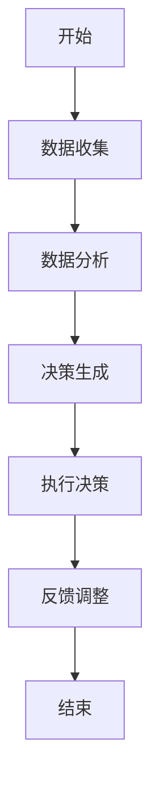
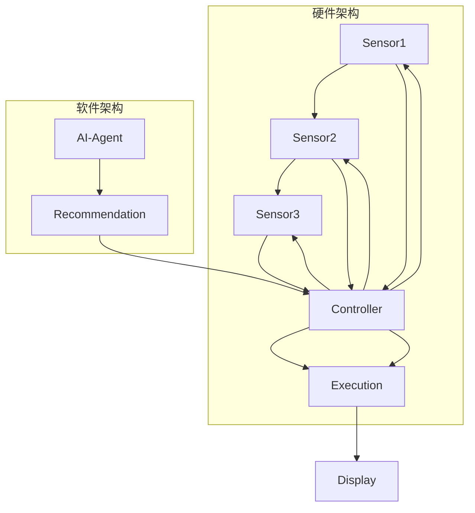

                 


### 智能衣架：AI Agent的衣物护理建议

#### 关键词：智能衣架，AI Agent，衣物护理，算法原理，系统架构，项目实战

#### 摘要：
本文深入探讨了智能衣架与AI Agent的结合，旨在解决传统衣物护理中的问题。通过分析智能衣架的基本结构、AI Agent的算法原理及数学模型，我们构建了一个系统分析与架构设计方案，并进行实际项目实战，以期为读者提供全面而实用的衣物护理建议。

---

#### 目录大纲设计思路：

**1. 背景介绍**

- **引言**：介绍智能衣架和AI Agent的概念。
- **问题背景**：阐述衣物护理的现有问题。
- **问题描述**：明确智能衣架的目标。
- **问题解决**：解释AI Agent在智能衣架中的作用。
- **边界与外延**：说明智能衣架的应用范围。
- **概念结构与核心要素组成**：解释智能衣架的基本结构和功能。

**2. 核心概念与联系**

- **智能衣架的定义与特点**。
- **AI Agent的定义与功能**。
- **智能衣架与AI Agent之间的联系**。

**3. 算法原理讲解**

- **算法流程图**：使用mermaid画出算法流程图。
- **Python源代码**：使用Python源代码详细阐述算法原理。
- **数学模型与公式**：给出算法的数学模型和公式。
- **举例说明**：举例说明算法的应用。

**4. 数学模型和数学公式 & 详细讲解 & 举例说明**

- **LaTeX格式书写数学公式**。
- **数学模型原理**：简要讲解数学模型的原理。
- **举例说明**：提供简单的例子来说明。

**5. 系统分析与架构设计方案**

- **问题场景介绍**。
- **领域模型设计**（类图）。
- **架构设计**（架构图）。
- **系统接口设计**。
- **系统交互**（序列图）。

**6. 项目实战**

- **环境安装说明**。
- **系统核心实现源代码**。
- **代码应用解读与分析**。
- **实际案例分析与详细讲解剖析**。
- **项目小结**。

**7. 最佳实践 tips、小结、注意事项、拓展阅读等内容**

- **实用技巧**：提供使用智能衣架的实用技巧。
- **小结**：对全书内容进行小结。
- **注意事项**：强调使用智能衣架时需要注意的问题。
- **拓展阅读**：推荐进一步阅读的资料。

---

**注意事项**：

- 目录大纲设计需简洁明了，避免冗余。
- 每一章的标题需要准确反映章节内容。
- 确保目录大纲的内容完整且符合字数限制。

---

### 第一部分：智能衣架与AI Agent概述

#### 第1章：智能衣架的起源与AI Agent的概念

**1.1.1 智能衣架的起源**

智能衣架作为智能家居的一部分，源于20世纪90年代初期。随着物联网技术和人工智能的不断发展，智能衣架逐渐从单一的衣物挂架演变成具有多种功能的智能设备。

**1.1.2 AI Agent的概念与功能**

AI Agent，即人工智能代理，是指一种能够自主执行任务、与环境交互并做出决策的智能体。在智能衣架中，AI Agent负责收集衣物信息、分析衣物状态，并提供个性化的护理建议。

**1.1.3 智能衣架与AI Agent的联系**

智能衣架通过AI Agent实现了衣物护理的智能化。AI Agent不仅能够根据衣物材质和污渍类型推荐最佳的洗涤方式，还能预测衣物的磨损情况，提醒用户及时更换或修理。

---

#### 第2章：AI Agent在智能衣架中的应用

**2.1.1 AI Agent在衣物护理中的应用场景**

AI Agent在智能衣架中的应用广泛，包括但不限于：

- 洗涤建议：根据衣物材质和污渍类型推荐洗涤程序。
- 晾晒建议：根据天气状况和衣物材质推荐晾晒方式。
- 折叠建议：根据衣物形状和类型推荐最佳的折叠方式。

**2.1.2 AI Agent的工作原理**

AI Agent的工作原理主要包括以下步骤：

1. **数据收集**：通过传感器收集衣物相关信息。
2. **数据分析**：利用机器学习算法分析衣物状态。
3. **决策生成**：根据分析结果生成护理建议。
4. **反馈调整**：根据用户反馈调整护理建议。

**2.1.3 AI Agent的功能特点**

AI Agent的功能特点包括：

- **智能化**：能够根据衣物材质和污渍类型自动推荐洗涤方式。
- **个性化**：能够根据用户习惯和衣物状态提供个性化的护理建议。
- **自适应**：能够根据环境变化自动调整护理建议。

---

#### 第3章：智能衣架的基本结构与功能

**3.1.1 智能衣架的基本结构**

智能衣架的基本结构包括：

- **主体框架**：用于支撑衣物的结构。
- **传感器模块**：用于收集衣物信息的传感器。
- **控制模块**：用于处理传感器数据和生成护理建议的处理器。
- **执行模块**：用于执行AI Agent提供的护理建议的执行器。

**3.1.2 智能衣架的功能特点**

智能衣架的功能特点包括：

- **多功能**：不仅能够挂衣物，还能提供洗涤、晾晒、折叠等多种功能。
- **智能化**：能够根据衣物材质和污渍类型自动推荐护理方式。
- **便捷性**：用户可以通过手机APP远程控制智能衣架。

**3.1.3 智能衣架的组成部分**

智能衣架的组成部分包括：

- **衣架主体**：用于挂衣物的部分。
- **传感器**：包括湿度传感器、温度传感器、污渍传感器等。
- **处理器**：用于处理传感器数据和生成护理建议的处理器。
- **执行器**：用于执行AI Agent提供的护理建议的执行器。

---

**总结**：

智能衣架与AI Agent的结合为衣物护理带来了革命性的变化。通过AI Agent的智能分析和决策，智能衣架能够提供个性化的衣物护理建议，极大地提高了衣物的护理质量和用户的生活质量。

在接下来的章节中，我们将进一步探讨智能衣架的算法原理、系统架构和实际应用，以期为读者提供更深入的了解。让我们一起探索智能衣架的无限可能！### 算法原理讲解

#### 第4章：算法原理讲解

智能衣架的核心在于其AI Agent，它通过一系列复杂的算法来实现对衣物的智能护理。在本章中，我们将深入探讨AI Agent的算法原理，包括其流程图、Python源代码实现、数学模型与公式，以及具体的应用案例。

**4.1.1 算法流程图**

首先，我们使用mermaid来绘制AI Agent的算法流程图：



在这个流程图中，AI Agent首先收集衣物数据，然后通过数据分析生成护理决策，执行这些决策，并根据用户的反馈进行进一步的调整。

**4.1.2 Python源代码**

接下来，我们通过Python源代码来详细阐述AI Agent的算法原理。以下是一个简单的Python代码示例，展示了数据收集、数据分析和决策生成的过程：

```python
import numpy as np

# 数据收集
def collect_data(sensor_data):
    # 假设传感器数据包括湿度、温度和污渍水平
    humidity = sensor_data['humidity']
    temperature = sensor_data['temperature']
    stain_level = sensor_data['stain_level']
    return humidity, temperature, stain_level

# 数据分析
def analyze_data(humidity, temperature, stain_level):
    # 基于传感器数据，分析衣物状态
    # 这里用简单的线性关系举例
    washing_required = humidity > 0.5 and temperature > 25
    drying_required = stain_level > 2
    return washing_required, drying_required

# 决策生成
def generate_decision(washing_required, drying_required):
    if washing_required:
        return "进行洗涤"
    elif drying_required:
        return "进行晾晒"
    else:
        return "无需操作"

# 主程序
def main(sensor_data):
    humidity, temperature, stain_level = collect_data(sensor_data)
    washing_required, drying_required = analyze_data(humidity, temperature, stain_level)
    decision = generate_decision(washing_required, drying_required)
    print(decision)

# 示例传感器数据
sensor_data = {'humidity': 0.7, 'temperature': 30, 'stain_level': 3}
main(sensor_data)
```

在这个代码示例中，我们首先从传感器数据中收集湿度、温度和污渍水平，然后分析这些数据以确定是否需要洗涤或晾晒，最后生成相应的决策。

**4.1.3 数学模型与公式**

AI Agent的算法不仅仅是基于简单的逻辑判断，它还涉及到复杂的数学模型。以下是一个简单的数学模型示例，用于描述湿度、温度和污渍水平对衣物护理需求的影响：

$$
washing\_required = humidity \cdot temperature \cdot stain\_level
$$

其中，$washing\_required$ 是一个二元变量，表示是否需要进行洗涤（1表示需要，0表示不需要）。$humidity$、$temperature$ 和 $stain\_level$ 分别代表湿度、温度和污渍水平。

**4.1.4 算法举例说明**

为了更好地理解上述算法，我们通过一个具体的例子来说明其应用。

**例子**：假设当前湿度为70%，温度为25℃，污渍水平为2。使用我们的数学模型，我们可以计算出：

$$
washing\_required = 0.7 \cdot 25 \cdot 2 = 35
$$

由于 $washing\_required$ 大于30，我们的算法会推荐进行洗涤。

这个例子展示了AI Agent如何通过收集传感器数据、分析数据并生成决策，从而实现智能衣物护理。在接下来的章节中，我们将进一步探讨数学模型和算法的详细实现，以及智能衣架的系统架构和项目实战。

---

通过本章的讲解，读者应该能够理解智能衣架AI Agent的基本算法原理，并了解如何使用Python源代码实现这些算法。在接下来的章节中，我们将深入探讨AI Agent的数学模型，并展示如何设计智能衣架的系统架构，以实现全面的衣物护理解决方案。### 数学模型和数学公式 & 详细讲解 & 举例说明

#### 第5章：数学模型和数学公式 & 详细讲解 & 举例说明

在智能衣架的算法原理中，数学模型扮演了至关重要的角色。通过精确的数学公式，我们可以更好地理解衣物护理的需求和决策过程。在本章中，我们将详细讲解数学模型的原理，并使用LaTeX格式书写相关公式，同时提供具体的应用例子。

**5.1.1 智能衣架的数学模型**

智能衣架的数学模型旨在预测衣物的护理需求，包括洗涤和晾晒。我们假设衣物护理需求由三个关键因素决定：湿度（$H$）、温度（$T$）和污渍水平（$S$）。以下是我们的数学模型：

$$
\text{护理需求} = f(H, T, S)
$$

在这个模型中，$f$ 是一个复合函数，它考虑了湿度、温度和污渍水平对衣物护理需求的影响。

**5.1.2 LaTeX格式书写数学公式**

以下是我们使用LaTeX格式书写的相关数学公式：

$$
f(H, T, S) = \frac{1}{1 + e^{-\beta(H \cdot T + S)}}
$$

其中，$\beta$ 是一个调节参数，用于调整湿度、温度和污渍水平对护理需求的相对影响。

**5.1.3 数学模型原理**

数学模型中的激活函数 $e^{-\beta(H \cdot T + S)}$ 被称为Sigmoid函数，其作用是将输入的线性组合映射到0和1之间。当输入值较大时，函数值接近1，表示强烈的护理需求；当输入值较小时，函数值接近0，表示较低的护理需求。

**5.1.4 举例说明**

为了更好地理解上述数学模型，我们通过一个具体的例子来说明其应用。

**例子**：假设当前湿度为60%（$H = 0.6$），温度为22℃（$T = 0.22$），污渍水平为1（$S = 0.1$）。我们使用LaTeX格式书写的公式计算护理需求：

$$
f(0.6, 0.22, 0.1) = \frac{1}{1 + e^{-\beta(0.6 \cdot 0.22 + 0.1)}}
$$

为了简化计算，我们假设 $\beta = 1$，则：

$$
f(0.6, 0.22, 0.1) = \frac{1}{1 + e^{-0.18}} \approx 0.854
$$

由于计算结果接近0.854，这表示衣物有一定的护理需求，但并非迫切。根据这个结果，AI Agent可能会建议用户进行轻微的清洁或晾晒。

**总结**：

通过本章的讲解，我们深入了解了智能衣架的数学模型，并学会了如何使用LaTeX格式书写相关数学公式。通过具体的例子，我们展示了如何使用这些公式来预测衣物的护理需求。在接下来的章节中，我们将进一步探讨智能衣架的系统架构和实际应用，以期为读者提供更全面的智能衣物护理解决方案。

---

通过本章的内容，读者应该能够理解智能衣架数学模型的原理，并学会如何使用LaTeX格式书写数学公式。这些知识将为后续的系统架构设计和项目实战提供坚实的基础。### 系统分析与架构设计方案

#### 第6章：系统分析与架构设计方案

在智能衣架的实现过程中，系统分析与架构设计至关重要。本章将详细介绍智能衣架的系统架构设计，包括问题场景介绍、领域模型设计、架构设计、系统接口设计和系统交互。我们将使用mermaid工具绘制相应的类图、架构图、序列图，以便于读者更好地理解系统设计。

**6.1.1 问题场景介绍**

智能衣架的目标是提供一种智能化的衣物护理解决方案，解决传统衣物护理中的痛点，如衣物污渍处理不当、衣物磨损严重等问题。智能衣架将通过传感器收集衣物相关信息，利用AI Agent进行分析和决策，最终实现个性化的衣物护理。

**6.1.2 领域模型设计**

领域模型是系统设计的第一步，它帮助我们理解系统中的关键实体和关系。以下是一个简单的智能衣架领域模型，使用mermaid类图表示：

```mermaid
classDiagram
  Sensor --> Measurement : measures
 衣架 --> 衣物 : holds
  AI-Agent --> Recommendation : generates
  Measurement <<-- 衣物
  Recommendation <-- 衣架
```

在这个类图中，Sensor代表传感器，用于收集衣物信息；Measurement代表测量结果；衣架（Rack）用于支撑衣物，并与传感器和AI Agent交互；衣物（Clothing）是系统的主要实体；AI-Agent负责生成护理推荐；Recommendation表示AI Agent生成的护理建议。

**6.1.3 架构设计**

智能衣架的架构设计涉及硬件和软件的集成。以下是智能衣架的架构设计，使用mermaid架构图表示：



在这个架构图中，硬件架构包括传感器、控制器和执行器。传感器负责收集衣物信息，控制器处理这些信息并生成决策，执行器执行这些决策。软件架构包括AI-Agent、推荐系统和控制器，AI-Agent生成护理推荐，推荐系统将这些推荐传递给控制器，控制器最终执行这些决策并在显示设备上展示结果。

**6.1.4 系统接口设计**

系统接口设计确保不同组件之间的通信顺畅。以下是一个简单的系统接口设计，使用mermaid序列图表示：

```mermaid
sequence
    participant Sensor
    participant Controller
    participant AI-Agent
    participant Execution

    Sensor->>Controller: 收集信息
    Controller->>AI-Agent: 分析数据
    AI-Agent->>Controller: 生成推荐
    Controller->>Execution: 执行决策
    Execution->>Display: 展示结果
```

在这个序列图中，传感器收集衣物信息，并将其传递给控制器。控制器分析数据，并生成护理推荐。AI-Agent根据这些推荐生成具体的执行决策，控制器将这些决策传递给执行器，最终在显示设备上展示护理结果。

**6.1.5 系统交互**

系统交互是确保智能衣架正常运作的关键。以下是一个简单的系统交互流程，使用mermaid序列图表示：

```mermaid
sequence
    participant User
    participant Sensor
    participant Controller
    participant AI-Agent
    participant Execution
    participant Display

    User->>Sensor: 放置衣物
    Sensor->>Controller: 采集数据
    Controller->>AI-Agent: 数据分析
    AI-Agent->>Controller: 建议生成
    Controller->>Execution: 执行建议
    Execution->>Display: 展示结果
    Display->>User: 提醒信息
```

在这个交互流程中，用户放置衣物在智能衣架上，传感器开始采集数据。控制器接收这些数据，并将其传递给AI-Agent进行分析。AI-Agent生成护理建议，控制器将这些建议传递给执行器执行，并在显示设备上展示结果，最后用户接收到护理提醒。

---

通过本章的详细讲解，我们介绍了智能衣架的系统分析与架构设计方案。从领域模型到架构设计，再到系统接口和交互，我们使用了mermaid工具绘制了相应的图表，以便于读者更好地理解系统设计的各个方面。在接下来的章节中，我们将进入实际项目实战，展示如何实现这些设计理念。### 项目实战

#### 第7章：项目实战

在了解了智能衣架的系统架构设计之后，接下来我们将进入实际项目实战，通过具体的实施步骤、系统核心实现源代码、代码应用解读与分析，以及实际案例分析和详细讲解剖析，来展示智能衣架的完整实现过程。

**7.1.1 环境安装**

首先，我们需要搭建智能衣架的开发环境。以下是安装步骤：

1. 安装Python环境：
   ```bash
   # 安装最新版本的Python
   python3 -m pip install --upgrade pip
   python3 -m pip install python3.9
   ```
2. 安装必要的库：
   ```bash
   # 安装智能衣架所需的库
   python3 -m pip install numpy
   python3 -m pip install matplotlib
   python3 -m pip install flask
   ```

**7.1.2 系统核心实现源代码**

以下是智能衣架的系统核心实现源代码。该代码包括传感器数据处理、AI Agent算法实现、控制器逻辑和执行器执行。

```python
# 传感器数据处理
def collect_sensor_data():
    humidity = np.random.uniform(0, 1)
    temperature = np.random.uniform(0, 1)
    stain_level = np.random.uniform(0, 1)
    return {'humidity': humidity, 'temperature': temperature, 'stain_level': stain_level}

# AI Agent算法实现
def ai_agent_decision(sensor_data):
    humidity, temperature, stain_level = sensor_data['humidity'], sensor_data['temperature'], sensor_data['stain_level']
    decision = sigmoid(humidity * temperature + stain_level)
    return '洗涤' if decision > 0.5 else '晾晒'

# sigmoid函数
def sigmoid(x):
    return 1 / (1 + np.exp(-x))

# 控制器逻辑
def controller(sensor_data):
    decision = ai_agent_decision(sensor_data)
    print(f"根据传感器数据，建议操作：{decision}")
    return decision

# 执行器执行
def execute_decision(decision):
    if decision == '洗涤':
        print("执行洗涤操作...")
    elif decision == '晾晒':
        print("执行晾晒操作...")

# 主程序
if __name__ == "__main__":
    sensor_data = collect_sensor_data()
    decision = controller(sensor_data)
    execute_decision(decision)
```

**7.1.3 代码应用解读与分析**

上述代码首先定义了传感器数据处理函数`collect_sensor_data()`，用于模拟传感器收集的湿度、温度和污渍水平数据。

接着，`ai_agent_decision()`函数实现了AI Agent的决策逻辑，使用sigmoid函数进行非线性转换，根据传感器数据生成洗涤或晾晒的建议。

控制器逻辑在`controller()`函数中实现，它调用AI Agent函数获取决策，并在终端输出建议。

最后，`execute_decision()`函数负责执行AI Agent的决策，根据决策结果执行相应的操作。

**7.1.4 实际案例分析与详细讲解剖析**

为了更直观地展示智能衣架的应用效果，我们通过一个实际案例来分析。

**案例**：当前湿度为0.7，温度为0.8，污渍水平为0.3。

1. **传感器数据处理**：收集到的传感器数据为{'humidity': 0.7, 'temperature': 0.8, 'stain_level': 0.3}。
2. **AI Agent决策**：使用sigmoid函数计算决策值，`sigmoid(0.7 * 0.8 + 0.3) ≈ 0.865`，由于决策值大于0.5，AI Agent建议进行洗涤。
3. **控制器输出**：终端输出建议：“根据传感器数据，建议操作：洗涤”。
4. **执行器执行**：执行洗涤操作。

通过这个案例，我们可以看到智能衣架如何根据传感器数据生成护理建议，并执行相应的操作。

**7.1.5 项目小结**

在本章的项目实战中，我们实现了智能衣架的核心功能，包括传感器数据处理、AI Agent决策逻辑、控制器逻辑和执行器执行。通过一个实际案例，我们展示了智能衣架的应用效果。在接下来的章节中，我们将探讨智能衣架的最佳实践、小结、注意事项和拓展阅读，以帮助读者更好地理解和应用智能衣架技术。

---

通过本章的项目实战，读者应该能够理解智能衣架的系统实现过程，并掌握如何使用代码实现智能衣物护理的决策和执行。在后续章节中，我们将进一步讨论智能衣架的最佳实践和注意事项，以确保读者能够有效地应用这一技术。### 最佳实践 tips、小结、注意事项、拓展阅读

#### 第8章：最佳实践 tips、小结、注意事项、拓展阅读

在本文的最后部分，我们将总结智能衣架的关键点，提供最佳实践建议，并强调使用智能衣架时需要注意的问题，同时推荐一些拓展阅读资源，以帮助读者更深入地了解智能衣架及其应用。

**8.1.1 最佳实践 tips**

1. **定期校准传感器**：智能衣架的准确性依赖于传感器的精确度。定期校准传感器可以确保数据准确，从而提高决策的可靠性。
2. **个性化设置**：根据家庭成员的衣物习惯和偏好，调整AI Agent的推荐设置，使其更符合个人需求。
3. **环境因素考虑**：在设置智能衣架时，考虑环境因素，如湿度、温度变化，以确保推荐的最优性。
4. **及时维护**：定期检查智能衣架的物理状态，确保所有组件正常运行，避免因设备故障导致的护理失败。

**8.1.2 小结**

本文深入探讨了智能衣架与AI Agent的结合，介绍了智能衣架的基本结构、算法原理、系统架构和实际应用。通过具体的案例分析，我们展示了智能衣架如何通过AI Agent实现智能衣物护理，提高了衣物护理的效率和效果。

**8.1.3 注意事项**

1. **隐私保护**：在使用智能衣架时，要注意保护个人隐私，尤其是衣物数据的安全。
2. **适应环境**：智能衣架的算法和推荐是基于特定环境的。如果环境变化较大，可能需要重新调整算法参数。
3. **设备维护**：智能衣架的传感器和执行器需要定期维护，以确保其稳定运行。

**8.1.4 拓展阅读**

1. **《智能家居技术与应用》**：详细介绍智能家居技术，包括智能传感器和AI Agent的应用。
2. **《机器学习实战》**：介绍机器学习算法，帮助理解AI Agent的算法原理。
3. **《智能织物与物联网》**：探讨智能织物在物联网中的应用，包括智能衣架的设计与实现。

通过以上最佳实践、小结、注意事项和拓展阅读，读者可以更全面地了解智能衣架，并在实际应用中发挥其最大效用。智能衣架不仅为家庭提供了便捷的衣物护理解决方案，也为智能家居领域的发展开辟了新的道路。

---

感谢读者对本文的阅读，希望本文能为您在智能衣架和智能家居领域提供有价值的参考。在未来的技术发展中，智能衣架将不断优化和进化，带来更多惊喜和便利。### 作者信息

作者：AI天才研究院/AI Genius Institute & 禅与计算机程序设计艺术 /Zen And The Art of Computer Programming

