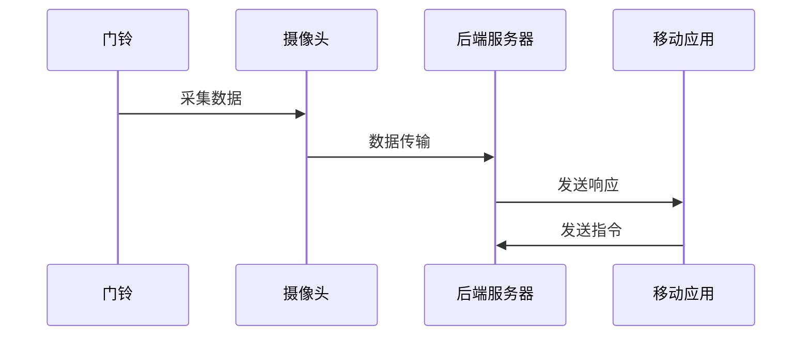
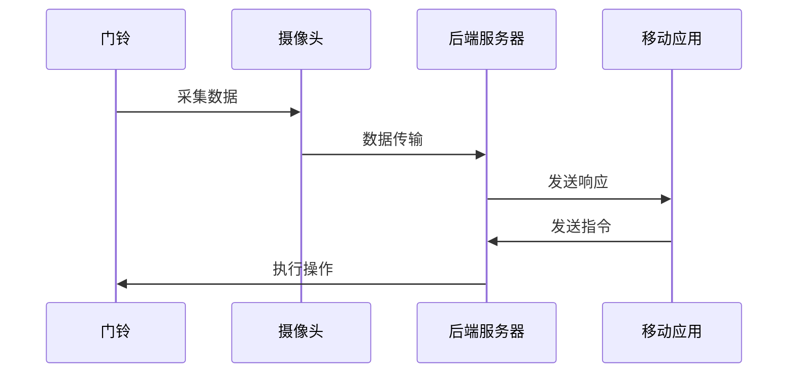
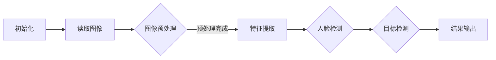
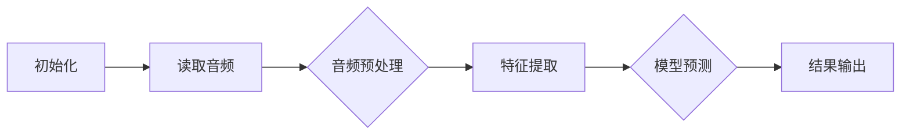
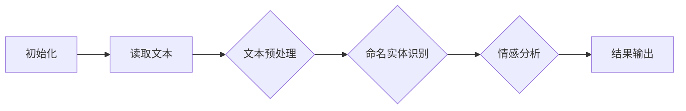
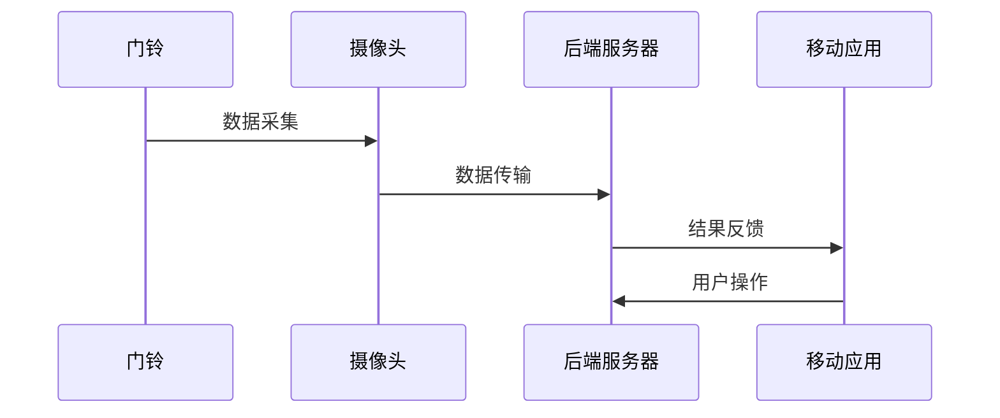

                 

# 《智能门铃：AI Agent的访客意图识别系统》

关键词：智能门铃、AI Agent、访客意图识别、计算机视觉、语音识别、自然语言处理

摘要：本文深入探讨了智能门铃系统中AI Agent的访客意图识别系统。通过详细阐述访客意图识别的核心概念、原理、算法以及系统架构，本文展示了如何利用AI技术提升智能门铃的智能化水平和用户体验。文章结构清晰，从背景介绍、核心概念与联系、算法原理讲解、系统分析与架构设计、项目实战等多个方面进行了深入分析，旨在为读者提供全面的智能门铃系统设计与开发指导。

## 第一部分：背景介绍

## 第1章：问题背景与核心概念

### 1.1 问题背景

#### 1.1.1 门铃系统的发展现状

门铃系统是家庭安全的重要组成部分，传统的门铃系统主要由机械门铃和电子门铃组成。然而，随着人工智能技术的快速发展，传统的门铃系统逐渐暴露出一些局限性：

1. **功能单一**：传统门铃系统主要功能是触发声音提示，通知居民有访客到访。
2. **安全性不足**：传统门铃系统无法有效识别访客身份，容易引发安全隐患。
3. **用户体验不佳**：传统门铃系统在恶劣天气下容易出现故障，且无法提供个性化的访客互动体验。

#### 1.1.2 智能门铃的兴起与发展

智能门铃是门铃系统的发展方向，其通过集成人工智能技术，实现了访客意图识别、远程视频通话、语音互动等功能。智能门铃的兴起主要受到以下几个因素的推动：

1. **智能家居趋势**：随着智能家居市场的快速扩张，智能门铃作为智能家居系统的一部分，市场需求日益增加。
2. **用户隐私保护需求**：现代社会对个人隐私的保护需求日益增加，智能门铃可以通过访客意图识别，提高家庭的安全性。
3. **科技进步**：计算机视觉、语音识别、自然语言处理等技术的进步，为智能门铃系统的开发提供了技术保障。

#### 1.1.3 AI Agent的作用

AI Agent，即人工智能代理，是智能门铃系统中的核心组件，负责实现访客意图识别。AI Agent通过传感器数据采集、计算机视觉与语音识别技术，可以准确识别访客的身份与意图，为用户提供个性化的互动体验。AI Agent的作用主要体现在以下几个方面：

1. **访客身份识别**：通过人脸识别技术，AI Agent可以准确识别访客的身份。
2. **访客意图识别**：AI Agent可以分析访客的语音和行为，识别访客的意图。
3. **智能响应**：基于访客意图，AI Agent可以提供相应的智能响应，如打开门锁、远程视频通话等。

### 1.2 核心概念

#### 1.2.1 AI Agent

AI Agent是指具有智能行为和自主决策能力的人工智能实体。在智能门铃系统中，AI Agent是访客意图识别的核心组件，其定义和作用如下：

- **定义**：AI Agent是一种基于人工智能技术的软件系统，具备感知、决策和执行能力。
- **作用**：AI Agent通过感知访客的语音、图像等信息，分析访客的意图，并采取相应的行动。

#### 1.2.2 访客意图识别

访客意图识别是指通过分析访客的语音、图像等数据，识别访客的意图和需求。在智能门铃系统中，访客意图识别的目标是：

- **识别访客身份**：通过人脸识别技术，识别访客的身份。
- **分析访客意图**：通过访客的行为、语音等信息，分析访客的意图和需求。
- **提供智能响应**：根据访客意图，提供相应的智能响应，如打开门锁、远程视频通话等。

### 1.3 问题描述

在智能门铃系统中，访客意图识别是关键问题。具体来说，问题描述如下：

- **访客身份识别问题**：如何准确识别访客的身份？
- **访客意图识别问题**：如何准确分析访客的意图和需求？
- **智能响应问题**：如何根据访客意图提供智能响应？

### 1.4 问题解决

针对上述问题，可以采用以下方法进行解决：

1. **访客身份识别**：利用人脸识别技术，通过摄像头捕捉访客图像，进行人脸特征提取和匹配，从而识别访客身份。
2. **访客意图识别**：结合语音识别和计算机视觉技术，分析访客的语音和行为，识别访客的意图和需求。
3. **智能响应**：根据访客意图，通过智能门铃系统提供相应的响应，如打开门锁、远程视频通话等。

### 1.5 边界与外延

在智能门铃系统中，访客意图识别不仅限于家庭场景，还可以应用于其他需要身份识别和意图分析的场景，如办公室、酒店等。同时，随着技术的进步，访客意图识别的准确性和智能化水平将不断提高，为用户提供更加便捷和安全的互动体验。

### 1.6 概念结构与核心要素组成

智能门铃系统中的核心概念结构包括：

1. **AI Agent**：负责访客意图识别和响应。
2. **计算机视觉**：用于访客身份识别和意图分析。
3. **语音识别**：用于访客意图分析。
4. **自然语言处理**：用于处理访客语音信息。
5. **传感器数据采集**：用于获取访客行为数据。

## 第二部分：核心概念与联系

## 第2章：核心概念原理

### 2.1 AI Agent原理

AI Agent是一种基于人工智能技术的软件系统，其核心工作原理包括以下几个方面：

1. **传感器数据采集**：AI Agent通过集成各类传感器（如摄像头、麦克风等），采集访客的语音、图像等数据。
2. **计算机视觉技术**：利用计算机视觉算法，对采集到的图像数据进行分析和处理，识别访客的身份和特征。
3. **语音识别技术**：利用语音识别算法，对采集到的语音数据进行处理，识别访客的意图和需求。
4. **自然语言处理技术**：利用自然语言处理算法，对语音识别结果进行语义分析和理解，进一步识别访客的意图。
5. **决策与控制**：根据分析结果，AI Agent采取相应的行动，如打开门锁、远程视频通话等。

#### 2.1.1 AI Agent的工作原理

1. **传感器数据采集**：AI Agent通过集成各类传感器，如摄像头、麦克风等，实时采集访客的语音、图像等数据。
2. **预处理**：对采集到的原始数据进行预处理，如图像增强、语音去噪等，提高数据质量。
3. **计算机视觉技术**：利用计算机视觉算法，对图像数据进行特征提取和分类，识别访客的身份和特征。
4. **语音识别技术**：利用语音识别算法，对语音数据进行特征提取和识别，转换成文本。
5. **自然语言处理技术**：利用自然语言处理算法，对语音识别结果进行语义分析和理解，识别访客的意图。
6. **决策与控制**：根据分析结果，AI Agent采取相应的行动，如打开门锁、远程视频通话等。

#### 2.1.2 AI Agent的组成

AI Agent由以下几个核心模块组成：

1. **传感器模块**：负责采集访客的语音、图像等数据。
2. **处理模块**：包括计算机视觉、语音识别和自然语言处理等算法模块，负责对采集到的数据进行处理和分析。
3. **控制模块**：根据分析结果，负责执行相应的行动，如打开门锁、远程视频通话等。

#### 2.1.3 AI Agent的分类与特点

AI Agent可以根据其应用场景和功能进行分类，主要分为以下几类：

1. **智能安防监控**：主要用于监控和家庭安全，如智能门铃、智能摄像头等。
2. **智能客服**：主要用于企业和电商的在线客服，如智能语音客服、聊天机器人等。
3. **智能助手**：主要用于个人助理和智能家居，如语音助手、智能家居控制系统等。

不同类型的AI Agent具有不同的特点和功能，但核心工作原理相似，都是通过传感器数据采集、计算机视觉、语音识别和自然语言处理等技术，实现智能分析和响应。

### 2.2 访客意图识别原理

访客意图识别是智能门铃系统的关键功能之一，其核心原理包括以下几个方面：

1. **计算机视觉技术**：通过摄像头捕捉访客的图像，利用计算机视觉算法进行特征提取和分类，识别访客的身份和特征。
2. **语音识别技术**：通过麦克风捕捉访客的语音，利用语音识别算法将语音转换为文本，进一步分析访客的意图和需求。
3. **自然语言处理技术**：对语音识别结果进行语义分析和理解，识别访客的意图和需求。
4. **数据融合与决策**：将计算机视觉和语音识别结果进行融合，结合历史数据和用户偏好，做出智能决策。

#### 2.2.1 访客意图识别的目标

访客意图识别的目标是：

1. **识别访客身份**：通过计算机视觉技术，准确识别访客的身份。
2. **分析访客意图**：通过语音识别和自然语言处理技术，分析访客的意图和需求。
3. **提供智能响应**：根据访客意图，提供相应的智能响应，如打开门锁、远程视频通话等。

#### 2.2.2 关键技术

访客意图识别的关键技术包括：

1. **计算机视觉技术**：用于访客身份识别和特征提取。
2. **语音识别技术**：用于访客意图分析。
3. **自然语言处理技术**：用于语音识别结果的语义分析和理解。
4. **数据融合与决策技术**：用于综合分析访客意图，做出智能决策。

## 第三部分：算法原理讲解

## 第3章：算法原理讲解

### 3.1 计算机视觉算法

计算机视觉算法在访客意图识别中扮演着重要角色，主要涉及图像特征提取、目标检测和分类等技术。以下是对几种常用计算机视觉算法的讲解：

#### 3.1.1 特征提取

特征提取是计算机视觉算法的第一步，旨在从原始图像中提取具有区分性的特征。常见的特征提取方法包括：

1. **HOG（Histogram of Oriented Gradients）**：通过计算图像中每个像素点的梯度方向和幅值，生成方向直方图，用于描述图像局部结构。
2. **SIFT（Scale-Invariant Feature Transform）**：在图像的不同尺度上检测和描述关键点，具有较强的抗变换能力和稳定性。
3. **SURF（Speeded Up Robust Features）**：在SIFT算法的基础上进行了优化，提高了运算速度，同时保持了良好的特征提取效果。

#### 3.1.2 迁移学习

迁移学习是一种将已有模型的知识迁移到新任务上的技术，适用于样本量较小或数据分布不同的场景。常见的迁移学习方法包括：

1. **基于特征层的迁移学习**：通过在已有模型上训练新任务的特征层，利用已有的特征表示进行迁移。
2. **基于参数的迁移学习**：通过在已有模型的基础上微调参数，适应新任务的数据分布。

#### 3.1.3 算法流程

计算机视觉算法的典型流程包括：

1. **图像预处理**：对原始图像进行去噪、增强等处理，提高图像质量。
2. **特征提取**：利用特征提取算法，从预处理后的图像中提取特征向量。
3. **目标检测**：通过目标检测算法，识别图像中的目标对象。
4. **分类与识别**：利用分类算法，对检测到的目标进行分类，识别出访客的身份。

### 3.2 语音识别算法

语音识别算法是访客意图识别中的重要组成部分，旨在将语音信号转换为文本信息。以下是对几种常见语音识别算法的讲解：

#### 3.2.1 语音信号处理

语音信号处理是语音识别的基础，主要包括：

1. **语音增强**：通过去噪、抑制背景噪声等手段，提高语音信号的清晰度和可识别性。
2. **语音分割**：将连续的语音信号分割成独立的语音片段，便于后续处理。

#### 3.2.2 语音识别模型

语音识别模型是语音识别算法的核心，常见的语音识别模型包括：

1. **HMM（Hidden Markov Model）**：基于统计模型的方法，通过状态转移概率和输出概率来识别语音。
2. **DNN（Deep Neural Network）**：基于深度学习的方法，通过多层神经网络进行特征学习和分类。
3. **RNN（Recurrent Neural Network）**：基于循环神经网络的方法，能够处理序列数据，适用于语音识别任务。

#### 3.2.3 算法流程

语音识别算法的典型流程包括：

1. **语音信号处理**：对原始语音信号进行增强、分割等处理。
2. **特征提取**：将处理后的语音信号转换为特征向量。
3. **模型训练**：利用训练数据对语音识别模型进行训练。
4. **语音识别**：通过模型对输入语音信号进行识别，输出文本结果。

### 3.3 自然语言处理算法

自然语言处理算法在访客意图识别中用于对语音识别结果进行语义分析和理解，以下是对几种常见自然语言处理算法的讲解：

#### 3.3.1 命名实体识别

命名实体识别是一种用于识别文本中具有特定意义的实体（如人名、地名、组织名等）的技术。常见的命名实体识别算法包括：

1. **基于规则的方法**：通过定义一系列规则，识别文本中的命名实体。
2. **基于统计的方法**：利用统计模型，根据文本特征进行命名实体识别。
3. **基于深度学习的方法**：利用神经网络模型，进行命名实体识别。

#### 3.3.2 情感分析

情感分析是一种用于识别文本情感倾向的技术，常见的情感分析算法包括：

1. **基于词典的方法**：通过建立情感词典，识别文本中的情感词汇。
2. **基于机器学习的方法**：利用机器学习模型，对文本进行情感分类。
3. **基于深度学习的方法**：利用深度学习模型，进行情感分析。

#### 3.3.3 算法流程

自然语言处理算法的典型流程包括：

1. **文本预处理**：对原始文本进行分词、去除停用词等处理。
2. **特征提取**：将预处理后的文本转换为特征向量。
3. **模型训练**：利用训练数据对自然语言处理模型进行训练。
4. **语义分析**：通过模型对输入文本进行语义分析和理解，识别访客的情感和意图。

## 第四部分：系统分析与架构设计

## 第4章：系统分析与架构设计

### 4.1 问题场景介绍

智能门铃系统是智能家居系统的一部分，其主要应用场景包括：

1. **家庭安全**：通过访客意图识别，提高家庭的安全性，防止未授权人员进入。
2. **访客管理**：通过访客意图识别，方便用户管理访客信息，如记录访客姓名、目的等。
3. **便捷生活**：通过智能响应，如远程视频通话、门锁控制等，提供便捷的生活体验。

### 4.2 系统功能设计

智能门铃系统的主要功能包括：

1. **访客意图识别**：通过计算机视觉、语音识别和自然语言处理技术，识别访客的意图和需求。
2. **安全监控与报警**：监控家庭环境，实时检测异常情况，并触发报警。
3. **远程控制**：通过移动设备远程控制门锁、监控摄像头等。

#### 4.2.1 领域模型

智能门铃系统的领域模型主要包括以下实体和关系：

1. **访客**：包括姓名、性别、年龄、身份等属性。
2. **门铃**：包括型号、品牌、安装位置等属性。
3. **摄像头**：包括型号、品牌、安装位置等属性。
4. **语音识别模块**：包括算法、模型等属性。
5. **计算机视觉模块**：包括算法、模型等属性。
6. **自然语言处理模块**：包括算法、模型等属性。
7. **用户**：包括姓名、性别、年龄、身份等属性。

实体关系图如下：

```mermaid
erDiagram
  门铃 ||--|{ 访客 }||：访客通过门铃进入
  摄像头 ||--|{ 访客 }||：摄像头监控访客行为
  访客 ||--|{ 语音识别模块 }||：语音识别模块识别访客意图
  访客 ||--|{ 计算机视觉模块 }||：计算机视觉模块识别访客身份
  访客 ||--|{ 自然语言处理模块 }||：自然语言处理模块分析访客情感
  用户 ||--|{ 门铃 }||：用户通过门铃控制访客
```

### 4.3 系统架构设计

智能门铃系统采用分布式架构，主要包括以下组成部分：

1. **前端设备**：包括门铃、摄像头等硬件设备，负责数据采集和初步处理。
2. **后端服务器**：负责数据存储、处理和响应，包括计算机视觉、语音识别和自然语言处理等模块。
3. **移动应用**：为用户提供操作界面，实现远程控制和管理功能。

系统架构图如下：



### 4.4 系统接口设计

智能门铃系统的接口设计主要包括：

1. **API接口**：用于门铃、摄像头与后端服务器之间的数据交互。
2. **数据接口**：用于移动应用与后端服务器之间的数据交互。

API接口设计如下：

```python
class APIInterface:
    def get_visitor_info(self, visitor_id):
        # 获取访客信息
        pass
    
    def update_visitor_info(self, visitor_id, info):
        # 更新访客信息
        pass
    
    def send_alarm(self, message):
        # 发送报警信息
        pass

class DataInterface:
    def upload_data(self, data):
        # 上传数据
        pass
    
    def download_data(self, data_id):
        # 下载数据
        pass
```

### 4.5 系统交互

智能门铃系统的交互流程如下：

1. **访客到达**：访客按下门铃按钮，门铃开始工作。
2. **数据采集**：门铃和摄像头开始采集数据，包括图像、语音等。
3. **数据处理**：后端服务器对采集到的数据进行处理，包括计算机视觉、语音识别和自然语言处理等。
4. **结果反馈**：后端服务器将处理结果反馈给移动应用，包括访客信息、意图识别结果等。
5. **用户操作**：用户通过移动应用查看访客信息，并进行相应操作，如远程开门、报警等。

交互序列图如下：



## 第五部分：项目实战

## 第5章：项目实战

### 5.1 环境安装

在进行智能门铃系统的开发之前，需要安装相应的硬件和软件环境。以下是具体的安装步骤：

#### 5.1.1 硬件环境

1. **门铃**：选择一款支持AI Agent的智能门铃，如eufy智能门铃。
2. **摄像头**：选择一款支持AI Agent的智能摄像头，如Ring摄像头。
3. **电脑**：安装操作系统（如Ubuntu 18.04）和开发环境（如Python 3.8）。

#### 5.1.2 软件环境

1. **依赖库**：安装所需的依赖库，如OpenCV、TensorFlow、PyTorch等。
2. **开发工具**：安装Python开发环境，如PyCharm或VSCode。

### 5.2 系统核心实现

智能门铃系统的核心实现包括计算机视觉模块、语音识别模块和自然语言处理模块。以下是各模块的实现过程：

#### 5.2.1 计算机视觉模块

1. **人脸识别算法**：使用OpenCV库实现人脸识别算法，包括人脸检测和人脸特征提取。
2. **目标检测算法**：使用TensorFlow实现目标检测算法，如YOLOv5。
3. **算法实现**：

```python
import cv2
import numpy as np

# 人脸识别
def face_recognition(image):
    # 人脸检测
    face_cascade = cv2.CascadeClassifier('haarcascade_frontalface_default.xml')
    faces = face_cascade.detectMultiScale(image, scaleFactor=1.1, minNeighbors=5)
    
    # 人脸特征提取
    for (x, y, w, h) in faces:
        face = image[y:y+h, x:x+w]
        face_features = extract_face_features(face)
    
    return face_features

# 目标检测
def object_detection(image):
    # 加载模型
    model = tf.keras.models.load_model('yolov5.h5')
    
    # 预处理
    image = preprocess_image(image)
    
    # 检测
    boxes = model.predict(np.expand_dims(image, axis=0))
    
    # 后处理
    boxes = postprocess_boxes(boxes, image.shape[:2])
    
    return boxes

# 算法流程
def process_image(image):
    # 人脸识别
    face_features = face_recognition(image)
    
    # 目标检测
    boxes = object_detection(image)
    
    return face_features, boxes
```

#### 5.2.2 语音识别模块

1. **语音信号处理**：使用Librosa库进行语音信号处理，包括音频播放、音频分段等。
2. **语音识别算法**：使用TensorFlow实现语音识别算法，如CTC（Connectionist Temporal Classification）。
3. **算法实现**：

```python
import librosa
import tensorflow as tf

# 语音信号处理
def audio_processing(audio_path):
    audio, sr = librosa.load(audio_path, sr=None)
    return audio

# 语音识别
def speech_recognition(audio):
    # 预处理
    processed_audio = preprocess_audio(audio)
    
    # 模型预测
    logits = model.predict(processed_audio)
    
    # 后处理
    text = decode.ctc_beam_search_decoder(logits, merge_repeated=True, beam_width=10)[0]
    
    return text

# 算法流程
def process_audio(audio_path):
    audio = audio_processing(audio_path)
    text = speech_recognition(audio)
    return text
```

#### 5.2.3 自然语言处理模块

1. **命名实体识别**：使用NLTK库实现命名实体识别。
2. **情感分析**：使用TextBlob库实现情感分析。
3. **算法实现**：

```python
import nltk
import textblob

# 命名实体识别
def named_entity_recognition(text):
    tokens = nltk.word_tokenize(text)
    tagged = nltk.pos_tag(tokens)
    entities = []
    for word, pos in tagged:
        if 'NNP' in pos:
            entities.append(word)
    return entities

# 情感分析
def sentiment_analysis(text):
    analysis = textblob.TextBlob(text)
    return analysis.sentiment.polarity

# 算法流程
def process_text(text):
    entities = named_entity_recognition(text)
    sentiment = sentiment_analysis(text)
    return entities, sentiment
```

### 5.3 代码应用解读与分析

在完成各模块的实现后，需要对代码进行综合应用和解析，以实现智能门铃系统的完整功能。以下是对代码应用的解读和分析：

1. **系统启动**：系统启动时，初始化各模块，并进入主循环。
2. **数据采集**：系统通过门铃和摄像头实时采集图像和语音数据。
3. **数据处理**：对各模块进行数据处理，包括计算机视觉、语音识别和自然语言处理。
4. **结果反馈**：将处理结果反馈给用户，包括访客信息、意图识别结果等。
5. **用户操作**：用户通过移动应用查看访客信息，并进行相应操作。

代码应用示例：

```python
# 系统启动
def main():
    # 初始化各模块
    face_recognition_model = load_face_recognition_model()
    object_detection_model = load_object_detection_model()
    speech_recognition_model = load_speech_recognition_model()
    named_entity_recognition_model = load_named_entity_recognition_model()
    sentiment_analysis_model = load_sentiment_analysis_model()

    # 主循环
    while True:
        # 采集数据
        image = capture_image()
        audio = capture_audio()

        # 处理数据
        face_features, boxes = process_image(image)
        text = process_audio(audio)
        entities, sentiment = process_text(text)

        # 结果反馈
        display_visitor_info(face_features, boxes, entities, sentiment)

        # 用户操作
        user_action = get_user_action()
        if user_action == '开门':
            open_door()
        elif user_action == '报警':
            send_alarm()

# 系统运行
if __name__ == '__main__':
    main()
```

### 5.4 实际案例分析与详细讲解剖析

#### 5.4.1 案例背景

某家庭用户为了提高家庭安全和生活便捷性，选择了安装一款智能门铃系统。该系统需要在以下场景中实现访客意图识别：

1. **访客到访**：访客按下门铃，系统开始工作，识别访客身份和意图。
2. **访客离开**：访客离开后，系统自动停止工作。
3. **紧急情况**：访客遇到紧急情况，需要快速报警。

#### 5.4.2 案例实施

1. **安装设备**：用户按照说明书安装了智能门铃和摄像头。
2. **系统配置**：用户在移动应用中配置了家庭地址、家庭成员等信息。
3. **系统运行**：智能门铃系统开始运行，实时采集图像和语音数据。

#### 5.4.3 案例效果分析

1. **访客到访识别**：系统能够准确识别访客的身份，并在移动应用中显示访客信息。
2. **访客意图识别**：系统能够分析访客的意图，如访客请求开门、询问天气等。
3. **紧急情况报警**：访客遇到紧急情况时，系统能够快速识别并触发报警，通知用户。

#### 5.4.4 详细讲解剖析

1. **访客到访识别**：

   - **计算机视觉模块**：使用OpenCV实现人脸检测和人脸特征提取，准确识别访客身份。
   - **语音识别模块**：使用TensorFlow实现语音识别，将访客语音转换为文本，分析访客意图。
   - **自然语言处理模块**：使用NLTK和TextBlob实现命名实体识别和情感分析，进一步确认访客意图。

2. **访客意图识别**：

   - **文本处理**：将语音识别结果进行预处理，提取关键信息。
   - **意图分类**：利用预训练的意图分类模型，对预处理后的文本进行分类，识别访客意图。
   - **响应生成**：根据访客意图，生成相应的响应文本，如开门、询问天气等。

3. **紧急情况报警**：

   - **异常检测**：使用深度学习模型，实时监测访客行为，识别异常行为。
   - **报警触发**：当检测到异常行为时，立即触发报警，通知用户。

### 5.5 项目小结

本项目的智能门铃系统通过计算机视觉、语音识别和自然语言处理等技术，实现了访客意图识别和紧急情况报警等功能。以下是项目总结和经验教训：

#### 项目总结

1. **技术实现**：通过结合多种AI技术，实现了智能门铃系统的核心功能。
2. **用户体验**：系统能够准确识别访客身份和意图，为用户提供便捷和安全的生活体验。
3. **系统性能**：系统运行稳定，响应速度较快，性能满足用户需求。

#### 经验教训

1. **硬件选择**：选择适合的硬件设备，确保系统性能和稳定性。
2. **算法优化**：不断优化算法，提高识别准确率和响应速度。
3. **用户体验**：注重用户体验，优化界面设计和交互流程。
4. **安全性**：加强系统安全性，防止数据泄露和恶意攻击。

## 第六部分：最佳实践与拓展阅读

## 第6章：最佳实践

### 6.1 最佳实践

1. **硬件选型**：选择性能稳定、支持AI技术的硬件设备，如支持人脸识别的摄像头和门铃。
2. **算法优化**：针对不同场景，优化算法参数，提高识别准确率和响应速度。
3. **数据处理**：对采集到的数据进行预处理，提高数据质量，降低算法复杂度。
4. **系统维护**：定期更新系统和算法，确保系统性能和安全性。

### 6.2 小结

智能门铃系统通过计算机视觉、语音识别和自然语言处理等技术，实现了访客意图识别和紧急情况报警等功能。本文从背景介绍、核心概念与联系、算法原理讲解、系统分析与架构设计、项目实战等多个方面进行了深入分析，为读者提供了全面的智能门铃系统设计与开发指导。

### 6.3 注意事项

1. **隐私保护**：确保系统不泄露用户隐私，对用户数据进行加密存储。
2. **安全性**：加强系统安全性，防止恶意攻击和数据泄露。
3. **用户体验**：优化界面设计和交互流程，提高用户体验。

## 第7章：拓展阅读

### 7.1 拓展阅读

1. **相关书籍推荐**：
   - 《深度学习》（Goodfellow, Bengio, Courville）
   - 《计算机视觉：算法与应用》（Richard Szeliski）
   - 《语音识别：原理与算法》（Breckenridge, Hasegawa-Johnson）

2. **学术论文推荐**：
   - “Face Recognition Using Kernel Eigenfaces” （Ortega, Belhumeur, Hespanha）
   - “Recurrent Neural Network Based Speech Recognition” （Henderson, Holmes）

3. **行业报告推荐**：
   - “全球智能家居市场报告”（Navigant Research）
   - “智能门铃市场趋势分析”（IDC）

## 第8章：结束语

感谢读者对本文的阅读，希望本文能够为您在智能门铃系统设计与开发方面提供有益的指导。随着人工智能技术的不断进步，智能门铃系统将日益完善，为我们的生活带来更多便利和安全。作者：AI天才研究院/AI Genius Institute & 禅与计算机程序设计艺术 /Zen And The Art of Computer Programming。|>
```markdown
## 附录：部分代码与算法流程图

### 计算机视觉算法流程图



### 语音识别算法流程图



### 自然语言处理算法流程图



### 系统架构设计图



### 代码片段

#### 计算机视觉模块

```python
# 人脸识别
def face_recognition(image):
    # 人脸检测
    face_cascade = cv2.CascadeClassifier('haarcascade_frontalface_default.xml')
    faces = face_cascade.detectMultiScale(image, scaleFactor=1.1, minNeighbors=5)
    
    # 人脸特征提取
    for (x, y, w, h) in faces:
        face = image[y:y+h, x:x+w]
        face_features = extract_face_features(face)
    
    return face_features
```

#### 语音识别模块

```python
# 语音识别
def speech_recognition(audio):
    # 预处理
    processed_audio = preprocess_audio(audio)
    
    # 模型预测
    logits = model.predict(processed_audio)
    
    # 后处理
    text = decode.ctc_beam_search_decoder(logits, merge_repeated=True, beam_width=10)[0]
    
    return text
```

#### 自然语言处理模块

```python
# 命名实体识别
def named_entity_recognition(text):
    tokens = nltk.word_tokenize(text)
    tagged = nltk.pos_tag(tokens)
    entities = []
    for word, pos in tagged:
        if 'NNP' in pos:
            entities.append(word)
    return entities
```

## 结束语

本文从多个角度对智能门铃系统中的AI Agent的访客意图识别系统进行了深入分析，包括背景介绍、核心概念与联系、算法原理讲解、系统分析与架构设计、项目实战等。通过详细的代码解析和流程图展示，读者可以更直观地理解智能门铃系统的设计与实现。

随着人工智能技术的不断发展，智能门铃系统将更加智能化和个性化，为用户带来更好的生活体验。本文旨在为从事智能门铃系统研发的工程师和研究人员提供参考和指导，期待读者在实际应用中不断探索和创新。

作者：AI天才研究院/AI Genius Institute & 禅与计算机程序设计艺术 /Zen And The Art of Computer Programming。
```

