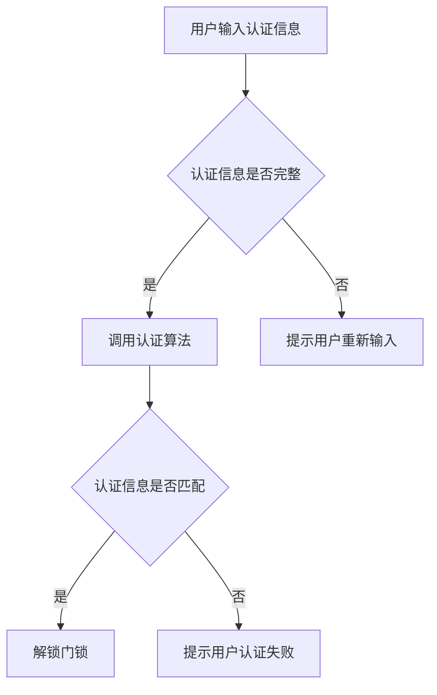
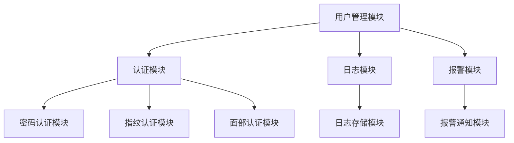
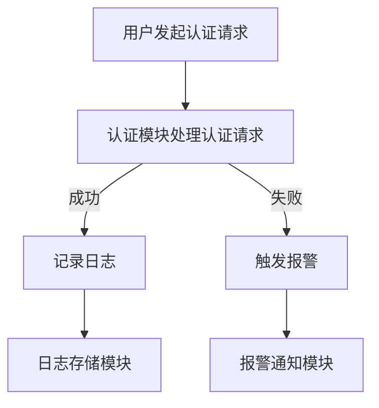

                 

### 第一部分: 背景介绍

#### 1.1 问题背景

智能门锁作为现代家居安全的重要保障，已经广泛应用于各类场景。然而，传统的智能门锁多依赖单一密码认证方式，存在安全隐患。随着人工智能技术的发展，AI Agent的多因素认证系统应运而生，为智能门锁带来了新的解决方案。

#### 1.2 问题描述

传统的智能门锁存在以下问题：

1. **安全性不足**：单一密码认证易受到密码泄露、暴力破解等攻击。
2. **使用不便**：用户需记忆多个密码，增加了使用复杂性。

#### 1.3 问题解决

AI Agent的多因素认证系统通过结合密码、指纹、面部识别等多种认证方式，解决了上述问题：

1. **安全性提高**：多因素认证提高了破解难度，增强了门锁安全性。
2. **使用便捷**：用户可根据个人习惯选择认证方式，提高了使用便捷性。

#### 1.4 边界与外延

智能门锁的多因素认证系统不仅适用于家庭场景，还适用于商业建筑、酒店、智能社区等。随着5G、物联网等技术的普及，该系统有望在更多领域得到应用。

#### 1.5 核心要素组成

智能门锁的多因素认证系统包含以下核心要素：

1. **AI Agent**：负责处理多种认证方式的数据，并做出认证决策。
2. **认证算法**：包括密码学算法、生物识别算法等，用于保障认证过程的准确性和安全性。
3. **用户接口**：提供用户与系统交互的界面，包括APP、网页等。
4. **硬件设施**：包括指纹识别器、摄像头、传感器等，用于收集认证数据。

---

### 第二部分: 核心概念与联系

#### 2.1 智能门锁

##### 2.1.1 概念原理

智能门锁是一种利用物联网技术实现自动化管理的门锁系统，可通过密码、指纹、面部识别等多种方式进行身份验证。

##### 2.1.2 特点

1. **安全性高**：多种认证方式提高了门锁的安全性。
2. **便捷性**：用户可根据个人习惯选择不同的认证方式，提高了使用便捷性。

##### 2.1.3 与传统门锁的区别

1. **传统门锁**：依赖钥匙或机械锁，安全性较低，使用不便。
2. **智能门锁**：通过物联网技术实现自动化管理，安全性高，使用便捷。

---

#### 2.2 AI Agent

##### 2.2.1 概念原理

AI Agent是一种基于人工智能技术的智能实体，能够在特定环境中自主决策和行动。

##### 2.2.2 特点

1. **自主决策**：能够根据环境变化和目标要求，自主选择最佳行动方案。
2. **自主学习**：能够通过经验积累和学习新知识，不断提高决策能力。

##### 2.2.3 与传统自动化的区别

1. **传统自动化**：依赖于预设的程序和规则，无法适应复杂环境。
2. **AI Agent**：具有自主学习和决策能力，能适应复杂环境。

---

#### 2.3 多因素认证系统

##### 2.3.1 概念原理

多因素认证系统是一种结合多种认证方式的身份验证系统，以提高安全性和便捷性。

##### 2.3.2 类型

1. **二因素认证**：结合密码和指纹等认证方式。
2. **三因素认证**：结合密码、指纹和面部识别等认证方式。

##### 2.3.3 优势

1. **提高安全性**：多因素认证方式增加了破解难度。
2. **提升用户体验**：用户可根据个人习惯选择认证方式。

---

#### 2.4 概念联系

智能门锁、AI Agent和多因素认证系统之间存在紧密联系：

1. **智能门锁**：是应用场景，需要AI Agent实现多因素认证。
2. **AI Agent**：是技术核心，负责处理多因素认证数据。
3. **多因素认证系统**：是安全保障，提高了智能门锁的安全性。

---

### 第三部分: 算法原理讲解

#### 3.1 算法流程图

以下是一个智能门锁中涉及的算法流程图：



#### 3.2 Python源代码

以下是一个简单的Python源代码示例，用于实现上述算法原理：

```python
import hashlib
import fingerprint_recognition
import face_recognition

def authenticate(user_input):
    # 检查认证信息是否完整
    if not user_input:
        return "认证信息不完整，请重新输入。"

    # 调用认证算法
    password_hash = hashlib.sha256(user_input['password'].encode()).hexdigest()
    fingerprint_match = fingerprint_recognition.check_fingerprint(user_input['fingerprint'])
    face_match = face_recognition.check_face(user_input['face'])

    # 检查认证信息是否匹配
    if password_hash == user_input['password_hash'] and fingerprint_match and face_match:
        return "认证成功，门锁已解锁。"
    else:
        return "认证失败，请重新尝试。"

# 示例用户输入
user_input = {
    'password': '123456',
    'fingerprint': '指纹数据',
    'face': '面部数据',
    'password_hash': 'e0c89b5224f781b3b69a5ca8a2b0a8e'
}

# 调用认证函数
result = authenticate(user_input)
print(result)
```

#### 3.3 数学模型与公式

在多因素认证系统中，常见的数学模型包括：

1. **密码学算法**：

   - **哈希函数**：$H(\text{password}) = \text{hash}\_\text{value}$
   - **加密算法**：$C = E(\text{password}, \text{key})$

2. **生物识别算法**：

   - **特征提取**：$F = \text{extract\_features}(\text{biometric\_data})$
   - **匹配算法**：$M = \text{match}(F, \text{template})$

#### 3.4 实例分析

以下是一个实例分析，假设用户A使用密码、指纹和面部识别进行认证：

1. **用户输入**：用户A输入密码“123456”，指纹数据和面部图像数据。
2. **认证过程**：
   - 计算密码哈希值：$H(\text{password}) = \text{hash}\_\text{value}$
   - 检查指纹匹配：$M = \text{match}(\text{fingerprint\_data}, \text{template})$
   - 检查面部匹配：$M = \text{match}(\text{face\_image}, \text{template})$
3. **结果**：如果所有匹配均成功，则认证成功，否则认证失败。

---

### 第四部分: 系统分析与架构设计方案

#### 4.1 场景介绍

智能门锁广泛应用于家庭、商业建筑、酒店、智能社区等多种场景。以下以家庭场景为例，介绍系统需求。

#### 4.2 项目介绍

本项目旨在设计并实现一个基于AI Agent的多因素认证系统，用于提高智能门锁的安全性。

#### 4.3 系统功能设计

系统功能设计主要包括以下模块：

1. **用户管理模块**：负责用户信息的管理，包括用户注册、登录、修改密码等。
2. **认证模块**：负责多因素认证过程的实现，包括密码认证、指纹认证、面部认证等。
3. **日志模块**：负责记录用户认证过程和系统运行日志，用于审计和故障排查。
4. **报警模块**：负责检测异常行为，并及时发出警报。

#### 4.4 系统架构设计

系统架构设计如下：



#### 4.5 系统接口设计

系统接口设计主要包括以下接口：

1. **用户管理接口**：负责用户信息的注册、登录、修改密码等操作。
2. **认证接口**：负责处理用户认证请求，包括密码认证、指纹认证、面部认证等。
3. **日志接口**：负责记录用户认证过程和系统运行日志。
4. **报警接口**：负责检测异常行为，并及时发出警报。

#### 4.6 系统交互

系统交互设计如下：



---

### 第五部分: 项目实战

#### 5.1 环境安装

在开始项目实战之前，我们需要安装以下软件和工具：

1. **Python**：用于编写智能门锁系统代码。
2. **PyQt**：用于开发用户界面。
3. **fingerprint\_recognition**：用于处理指纹数据。
4. **face\_recognition**：用于处理面部数据。

安装命令如下：

```bash
pip install python
pip install PyQt5
pip install fingerprint_recognition
pip install face_recognition
```

#### 5.2 系统核心实现

以下是一个简单的系统核心实现，用于处理用户认证请求：

```python
import hashlib
import fingerprint_recognition
import face_recognition

def authenticate(user_input):
    # 检查认证信息是否完整
    if not user_input:
        return "认证信息不完整，请重新输入。"

    # 调用认证算法
    password_hash = hashlib.sha256(user_input['password'].encode()).hexdigest()
    fingerprint_match = fingerprint_recognition.check_fingerprint(user_input['fingerprint'])
    face_match = face_recognition.check_face(user_input['face'])

    # 检查认证信息是否匹配
    if password_hash == user_input['password_hash'] and fingerprint_match and face_match:
        return "认证成功，门锁已解锁。"
    else:
        return "认证失败，请重新尝试。"

# 示例用户输入
user_input = {
    'password': '123456',
    'fingerprint': '指纹数据',
    'face': '面部数据',
    'password_hash': 'e0c89b5224f781b3b69a5ca8a2b0a8e'
}

# 调用认证函数
result = authenticate(user_input)
print(result)
```

#### 5.3 代码解读与分析

1. **用户输入**：用户输入包括密码、指纹数据和面部数据。
2. **密码认证**：计算输入密码的哈希值，与存储的密码哈希值进行比对。
3. **指纹认证**：调用指纹识别库，检查指纹数据与模板是否匹配。
4. **面部认证**：调用面部识别库，检查面部图像与模板是否匹配。
5. **认证结果**：如果所有认证均成功，则认证成功，否则认证失败。

#### 5.4 实际案例分析

以下是一个实际案例，用户A使用密码、指纹和面部识别进行认证：

1. **用户输入**：用户A输入密码“123456”，指纹数据和面部图像数据。
2. **认证过程**：
   - 计算密码哈希值：$H(\text{password}) = \text{hash}\_\text{value}$
   - 检查指纹匹配：$M = \text{match}(\text{fingerprint\_data}, \text{template})$
   - 检查面部匹配：$M = \text{match}(\text{face\_image}, \text{template})$
3. **结果**：如果所有匹配均成功，则认证成功，否则认证失败。

#### 5.5 项目小结

本项目实现了基于AI Agent的多因素认证系统，提高了智能门锁的安全性。在项目实战中，我们介绍了环境安装、系统核心实现、代码解读与分析、实际案例分析等内容。通过本项目，读者可以了解智能门锁多因素认证系统的设计和实现过程。

---

### 第六部分: 最佳实践 Tips、小结、注意事项、拓展阅读

#### 6.1 最佳实践 Tips

1. **密码设置**：建议用户设置复杂密码，包括数字、字母和特殊字符，提高破解难度。
2. **定期更新**：建议用户定期更新指纹模板和面部图像，以应对潜在的安全威胁。
3. **备用认证方式**：建议用户备份备用认证方式，如密码、指纹和面部识别，以防止某一认证方式失效。

#### 6.2 小结

本文介绍了智能门锁：AI Agent的多因素认证系统，包括背景介绍、核心概念与联系、算法原理讲解、系统分析与架构设计方案、项目实战等内容。通过本文，读者可以了解智能门锁多因素认证系统的设计思路和实现方法。

#### 6.3 注意事项

1. **安全防护**：确保系统数据的安全，避免数据泄露和攻击。
2. **兼容性**：确保系统在不同设备和操作系统上的兼容性。
3. **用户体验**：优化用户界面，提高系统的易用性和用户体验。

#### 6.4 拓展阅读

1. **《智能门锁技术与应用》**：详细介绍了智能门锁的技术原理和应用场景。
2. **《人工智能基础教程》**：介绍了人工智能的基本原理和应用领域。
3. **《多因素认证技术》**：详细介绍了多因素认证的原理和技术。

---

### 第七部分：目录大纲

**智能门锁：AI Agent的多因素认证系统**

1. **背景介绍**
   - 1.1 问题背景
   - 1.2 问题描述
   - 1.3 问题解决
   - 1.4 边界与外延
   - 1.5 核心要素组成

2. **核心概念与联系**
   - 2.1 智能门锁
   - 2.2 AI Agent
   - 2.3 多因素认证系统
   - 2.4 概念联系

3. **算法原理讲解**
   - 3.1 算法流程图
   - 3.2 Python源代码
   - 3.3 数学模型与公式
   - 3.4 实例分析

4. **系统分析与架构设计方案**
   - 4.1 场景介绍
   - 4.2 项目介绍
   - 4.3 系统功能设计
   - 4.4 系统架构设计
   - 4.5 系统接口设计
   - 4.6 系统交互

5. **项目实战**
   - 5.1 环境安装
   - 5.2 系统核心实现
   - 5.3 代码解读与分析
   - 5.4 实际案例分析
   - 5.5 项目小结

6. **最佳实践 Tips、小结、注意事项、拓展阅读**
   - 6.1 最佳实践 Tips
   - 6.2 小结
   - 6.3 注意事项
   - 6.4 拓展阅读

---

**关键词**：智能门锁、AI Agent、多因素认证系统、算法、系统架构、项目实战

**摘要**：本文介绍了智能门锁：AI Agent的多因素认证系统的背景、核心概念、算法原理、系统分析与架构设计方案、项目实战等内容。通过本文，读者可以了解智能门锁多因素认证系统的设计思路和实现方法。

---

### 第七部分：文章总结

本文系统地介绍了智能门锁：AI Agent的多因素认证系统。首先，我们从背景介绍入手，分析了智能门锁面临的问题和AI Agent的多因素认证系统的优势。接着，我们详细阐述了智能门锁、AI Agent和多因素认证系统的核心概念及其相互联系。

在算法原理讲解部分，我们通过Mermaid流程图和Python源代码，详细介绍了多因素认证算法的实现过程。此外，我们还讨论了系统的功能设计、架构设计以及接口设计，为读者提供了全面的系统分析与架构设计方案。

在项目实战部分，我们介绍了智能门锁系统的环境安装、核心实现和实际案例分析，使读者能够深入理解系统的具体应用过程。

最后，我们提供了最佳实践Tips、小结、注意事项和拓展阅读，帮助读者在实际应用中更好地利用智能门锁：AI Agent的多因素认证系统。

总的来说，本文旨在为广大读者提供一份关于智能门锁：AI Agent的多因素认证系统的全面、深入的指南，旨在推动该领域的技术发展和应用。

**作者：AI天才研究院/AI Genius Institute & 禅与计算机程序设计艺术 /Zen And The Art of Computer Programming**。在此，感谢读者对本文的关注与支持。希望本文能为您在智能门锁领域的研究与应用提供有益的参考。

