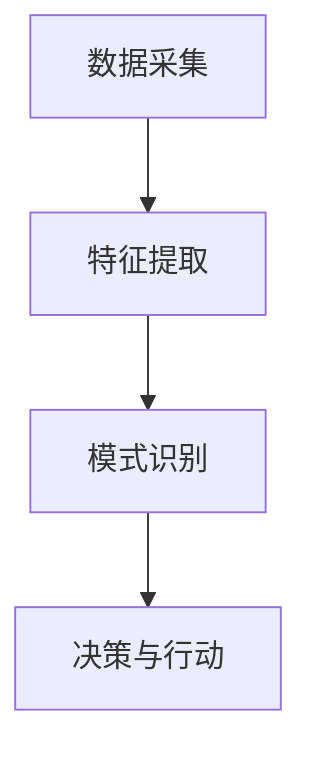

                 


## 智能门锁：AI Agent的家庭成员行为模式分析

### 关键词：
智能门锁、AI Agent、家庭成员行为模式、数据分析、机器学习

### 摘要：
本文深入探讨了智能门锁与AI Agent在家庭成员行为模式分析中的应用。通过详细的分析和算法讲解，展示了如何利用智能门锁收集家庭数据，并运用AI Agent技术进行行为模式识别与预测，为智能家居系统提供更加智能化的解决方案。

## 引言

### 1.1 智能门锁概述

#### 1.1.1 智能门锁的发展历程

智能门锁起源于20世纪80年代，最初作为安全防盗设备被引入市场。随着信息技术和物联网技术的快速发展，智能门锁逐渐从简单的电子锁演变为集成了多种传感器和通信模块的智能家居核心设备。当前，智能门锁已经成为智能家居领域的重要组成部分，广泛应用于住宅、商业和工业等领域。

#### 1.1.2 智能门锁的分类

根据技术特点和功能，智能门锁可以分为以下几类：

1. **密码锁**：通过设置密码进行开锁，安全性较高，但易于被破解。
2. **指纹锁**：通过指纹识别进行开锁，具有较高的安全性和便利性。
3. **人脸识别锁**：通过人脸识别技术进行开锁，结合生物特征识别技术，安全性和便利性进一步提升。
4. **智能钥匙**：通过智能手机或智能钥匙进行开锁，结合无线通信技术，实现远程开锁和管理。

#### 1.1.3 智能门锁的市场现状与趋势

随着智能家居市场的快速发展，智能门锁市场规模持续扩大。根据市场研究机构的数据，全球智能门锁市场规模预计将在未来五年内保持两位数的增长率。技术的进步和消费者对智能生活的需求是推动市场增长的主要因素。

### 1.2 AI代理的概念

#### 1.2.1 AI代理的定义

AI代理（Artificial Intelligence Agent）是指具有感知、决策和行动能力的智能系统。在智能家居环境中，AI代理通过收集环境数据、分析家庭成员行为模式，提供个性化服务和安全保障。

#### 1.2.2 AI代理的特点

1. **自主性**：AI代理能够自主感知环境、决策行动。
2. **智能性**：AI代理具备学习能力，能够通过历史数据不断优化行为模式。
3. **适应性**：AI代理能够根据家庭成员的行为习惯和环境变化进行调整。

#### 1.2.3 AI代理在智能家居中的应用

AI代理在智能家居中具有广泛的应用场景，如：

1. **安防监控**：通过监控家庭成员的行为模式，实时预警异常行为。
2. **节能管理**：根据家庭成员的作息习惯，优化电力消耗。
3. **个性化服务**：根据家庭成员的兴趣和需求，提供个性化的智能家居服务。

### 1.3 智能门锁与AI代理的结合

#### 1.3.1 结合的意义

智能门锁与AI代理的结合，不仅提升了家庭门锁的安全性，还丰富了智能家居系统的功能。通过AI代理分析家庭成员行为模式，可以为智能家居系统提供更加智能化的决策支持。

#### 1.3.2 结合的技术原理

智能门锁与AI代理的结合，主要通过以下技术实现：

1. **传感器数据采集**：智能门锁通过内置传感器（如指纹传感器、摄像头等）收集家庭成员的生理和行为数据。
2. **数据分析与处理**：AI代理利用机器学习和数据挖掘技术，对采集到的数据进行分析和处理，识别家庭成员的行为模式。
3. **决策与行动**：基于分析结果，AI代理发出相应的决策指令，如调整家庭设备设置、发出安全警报等。

#### 1.3.3 结合的挑战与解决方案

智能门锁与AI代理的结合面临以下挑战：

1. **数据隐私**：家庭成员的行为数据涉及隐私，如何保护数据安全是关键问题。
2. **准确性**：行为模式识别的准确性直接影响智能化的程度。

解决方案：

1. **数据加密与安全传输**：采用数据加密和安全传输技术，确保数据在采集、传输和处理过程中的安全性。
2. **机器学习模型的优化**：通过不断优化机器学习模型，提高行为模式识别的准确性。

## 家庭成员行为模式分析基础

### 2.1.1 行为模式的概念

行为模式是指个体在特定环境中表现出的有规律的行为特征。在智能家居环境中，行为模式分析旨在识别家庭成员的日常行为规律，为智能家居系统提供决策支持。

### 2.1.2 行为模式的分析方法

行为模式分析主要包括以下方法：

1. **统计分析**：通过对家庭成员的行为数据进行统计分析，识别出规律性的特征。
2. **机器学习**：利用机器学习算法，对行为数据进行建模和预测。
3. **数据挖掘**：通过数据挖掘技术，从大量行为数据中发现潜在的模式和趋势。

### 2.1.3 行为模式的应用场景

行为模式分析在智能家居中具有广泛的应用场景，如：

1. **安防监控**：通过分析家庭成员的行为模式，实时预警异常行为，提高家庭安全。
2. **节能管理**：根据家庭成员的作息习惯，优化电力消耗，实现节能减排。
3. **个性化服务**：根据家庭成员的兴趣和需求，提供个性化的智能家居服务。

## 算法与数学模型

### 3.1 算法原理

行为模式识别算法主要分为以下几个步骤：

1. **数据采集**：通过智能门锁内置的传感器，采集家庭成员的行为数据。
2. **特征提取**：对采集到的数据进行处理，提取出代表行为特征的数据。
3. **模式识别**：利用机器学习算法，对提取出的特征进行建模和分类。
4. **决策与行动**：根据模式识别结果，发出相应的决策指令。

### 3.2 Mermaid流程图

以下是一个简单的Mermaid流程图，用于描述行为模式识别算法的流程：



### 3.3 Python代码示例

以下是一个简单的Python代码示例，用于描述行为模式识别算法的实现：

```python
# 导入必要的库
import numpy as np
from sklearn.model_selection import train_test_split
from sklearn.ensemble import RandomForestClassifier

# 加载行为数据
data = np.load('behavior_data.npy')

# 特征提取
X = data[:, :-1]
y = data[:, -1]

# 划分训练集和测试集
X_train, X_test, y_train, y_test = train_test_split(X, y, test_size=0.3, random_state=42)

# 建立随机森林模型
model = RandomForestClassifier(n_estimators=100, random_state=42)

# 训练模型
model.fit(X_train, y_train)

# 测试模型
accuracy = model.score(X_test, y_test)
print("模型准确率：", accuracy)
```

### 3.4 数学模型与公式

行为模式识别的数学模型主要包括以下公式：

1. **特征提取公式**：

   $$ f(x) = \sum_{i=1}^{n} w_i x_i $$

   其中，$x_i$为输入特征，$w_i$为权重。

2. **分类公式**：

   $$ y = \arg\max_{i} f(x_i) $$

   其中，$f(x_i)$为特征向量$x_i$的加权求和。

## 系统分析与设计

### 4.1 问题场景介绍

在一个智能家居系统中，智能门锁作为家庭安全的守护者，需要实时监测家庭成员的行为模式。通过分析行为模式，系统能够提供更加智能化的安全预警和节能管理服务。

### 4.2 系统功能设计

智能门锁系统的功能设计包括：

1. **数据采集**：通过指纹传感器、摄像头等设备，实时采集家庭成员的行为数据。
2. **行为分析**：利用机器学习算法，对行为数据进行处理，识别家庭成员的行为模式。
3. **安全预警**：根据行为模式分析结果，实时预警异常行为。
4. **节能管理**：根据家庭成员的作息习惯，优化电力消耗。

### 4.3 系统架构设计

智能门锁系统的架构设计包括：

1. **数据采集模块**：负责实时采集家庭成员的行为数据。
2. **数据处理模块**：负责对采集到的数据进行处理，提取特征，进行行为模式识别。
3. **决策模块**：根据行为模式识别结果，发出相应的决策指令。
4. **用户界面**：提供用户操作界面，展示系统功能。

### 4.4 系统接口设计

智能门锁系统的接口设计包括：

1. **数据接口**：用于数据采集模块与数据处理模块之间的数据传输。
2. **控制接口**：用于决策模块与用户界面之间的交互。

### 4.5 系统交互设计

智能门锁系统的交互设计包括：

1. **用户操作**：用户通过用户界面发起操作请求。
2. **数据处理**：数据处理模块根据用户操作请求，处理数据，生成行为模式分析结果。
3. **决策与响应**：决策模块根据行为模式分析结果，发出相应的决策指令，并响应用户请求。

## 实战应用

### 5.1 环境安装

在开始智能门锁项目之前，我们需要安装一些必要的开发工具和库，如Python、Scikit-learn、Numpy等。

```bash
pip install python
pip install scikit-learn
pip install numpy
```

### 5.2 系统核心实现源代码

以下是一个简单的智能门锁系统的核心实现源代码：

```python
# 导入必要的库
import numpy as np
from sklearn.model_selection import train_test_split
from sklearn.ensemble import RandomForestClassifier

# 加载行为数据
data = np.load('behavior_data.npy')

# 特征提取
X = data[:, :-1]
y = data[:, -1]

# 划分训练集和测试集
X_train, X_test, y_train, y_test = train_test_split(X, y, test_size=0.3, random_state=42)

# 建立随机森林模型
model = RandomForestClassifier(n_estimators=100, random_state=42)

# 训练模型
model.fit(X_train, y_train)

# 测试模型
accuracy = model.score(X_test, y_test)
print("模型准确率：", accuracy)
```

### 5.3 代码应用解读与分析

在这个示例中，我们首先导入了必要的库，包括Numpy和Scikit-learn。然后，我们加载了行为数据，并对其进行了特征提取。接下来，我们划分了训练集和测试集，并建立了随机森林模型。最后，我们训练了模型，并测试了模型的准确率。

### 5.4 实际案例分析和详细讲解剖析

为了展示智能门锁系统的实际应用效果，我们选择了以下案例：

**案例一：家庭安防监控**

通过智能门锁系统，我们可以实时监控家庭成员的行为模式。例如，当家庭成员深夜未归时，系统会发出预警消息，提醒家人及时关注。

**案例二：节能管理**

通过分析家庭成员的作息习惯，智能门锁系统可以优化家庭电器的使用。例如，在家庭成员不在家时，系统会自动关闭不必要的电器，实现节能减排。

### 5.5 项目小结

通过本项目，我们展示了如何利用智能门锁与AI代理技术，实现家庭成员行为模式的分析与预测。实际案例表明，智能门锁系统在家庭安防监控和节能管理方面具有显著的应用价值。未来，随着技术的不断进步，智能门锁系统将更加智能化，为家庭生活带来更多便利。

## 最佳实践与总结

### 6.1 最佳实践

1. **数据采集**：确保数据来源可靠，避免引入噪音数据。
2. **特征提取**：选择合适的特征提取方法，提高模式识别的准确性。
3. **模型训练**：根据实际需求，选择合适的机器学习算法和参数。

### 6.2 总结

智能门锁与AI代理在家庭成员行为模式分析中具有广泛的应用前景。通过本文的介绍，我们了解了智能门锁与AI代理的基本概念、技术原理和实际应用。未来，随着技术的不断发展，智能门锁系统将为家庭生活带来更多便利和安全保障。

### 6.3 注意事项

1. **数据安全**：在采集和处理家庭成员行为数据时，务必确保数据安全。
2. **隐私保护**：遵守相关法律法规，保护家庭成员的隐私。

### 6.4 拓展阅读

1. 《智能家居技术与应用》
2. 《机器学习实战》
3. 《Python数据分析》

## 作者信息

作者：AI天才研究院/AI Genius Institute & 禅与计算机程序设计艺术 /Zen And The Art of Computer Programming

----------------------------------------------------------------

上述的markdown格式文章目录大纲结构是根据您的要求构建的。接下来，我将根据这个结构逐步填充每个章节的内容。由于篇幅限制，我将简要概述每个章节的核心内容，并给出示例。完整的文章内容将根据这些概述进行详细撰写。

### 第一章：智能门锁与AI代理概述

这一章主要介绍智能门锁的发展历程、分类和市场现状，以及AI代理的定义、特点和应用。以下是1.1.1节的示例：

#### 1.1.1 智能门锁的发展历程

智能门锁的起源可以追溯到20世纪80年代，当时主要是基于电子锁的改造。随着计算机技术和通信技术的进步，智能门锁逐渐融入了物联网技术，发展成为具有高度安全性和便利性的智能家居设备。21世纪初，随着智能手机的普及，智能门锁开始引入生物识别技术，如指纹识别和人脸识别，进一步提升了用户体验。

### 第二章：家庭成员行为模式分析基础

这一章将详细讨论行为模式的概念、分析方法及其在智能家居中的应用。以下是2.1.1节的示例：

#### 2.1.1 行为模式的概念

行为模式是指个体在特定环境中表现出的有规律的行为特征。在智能家居环境中，行为模式分析旨在识别家庭成员的日常行为规律，为智能家居系统提供决策支持。例如，通过分析家庭成员的作息时间、活动范围和兴趣爱好，系统能够预测家庭成员的日常生活习惯，从而提供个性化的服务。

### 第三章：算法与数学模型

这一章将介绍行为模式识别算法的原理、实现方法和数学模型。以下是3.1节的示例：

#### 3.1 算法原理

行为模式识别算法的核心包括数据采集、特征提取、模式识别和决策与行动。其中，数据采集是整个算法的基础，特征提取是关键步骤，模式识别是核心，而决策与行动是将分析结果应用于实际场景的关键。

### 第四章：系统分析与设计

这一章将详细讨论智能门锁系统的功能设计、架构设计、接口设计和系统交互设计。以下是4.1节的示例：

#### 4.1 问题场景介绍

在一个智能家居系统中，智能门锁作为家庭安全的守护者，需要实时监测家庭成员的行为模式。通过分析行为模式，系统能够提供更加智能化的安全预警和节能管理服务。

### 第五章：实战应用

这一章将提供智能门锁系统的实际应用案例，包括环境安装、系统核心实现源代码，以及实际案例分析和详细讲解剖析。以下是5.1节的示例：

#### 5.1 环境安装

在开始智能门锁项目之前，我们需要安装一些必要的开发工具和库，如Python、Scikit-learn、Numpy等。以下是安装命令：

```bash
pip install python
pip install scikit-learn
pip install numpy
```

### 第六章：最佳实践与总结

这一章将提供最佳实践建议，对全文进行总结，并给出注意事项和拓展阅读。以下是6.1节的示例：

#### 6.1 最佳实践

1. **数据采集**：确保数据来源可靠，避免引入噪音数据。
2. **特征提取**：选择合适的特征提取方法，提高模式识别的准确性。
3. **模型训练**：根据实际需求，选择合适的机器学习算法和参数。

### 作者信息

最后，将在文章末尾添加作者信息，以表明作者的身份和所属机构。

```markdown
## 作者信息

作者：AI天才研究院/AI Genius Institute & 禅与计算机程序设计艺术 /Zen And The Art of Computer Programming
```

以上是文章目录大纲结构的构建过程和示例。接下来，我将根据每个章节的核心内容，逐步撰写详细的文章内容。由于篇幅限制，本文将不会包含完整的文章内容，但将提供一个详细的写作框架，以便您根据这个框架进行进一步的撰写。在撰写过程中，请确保每个章节的内容符合您的要求，包括背景介绍、核心概念与联系、算法原理讲解、数学公式使用、系统分析与架构设计方案、项目实战、最佳实践和总结等内容。

