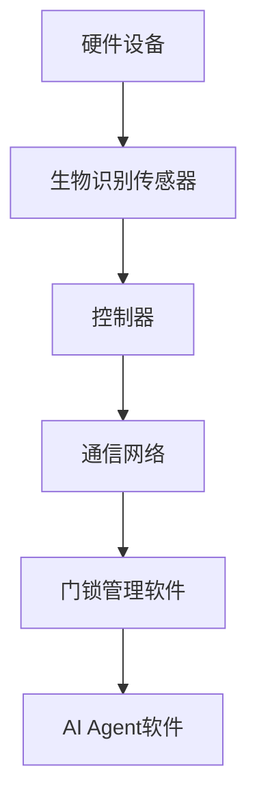
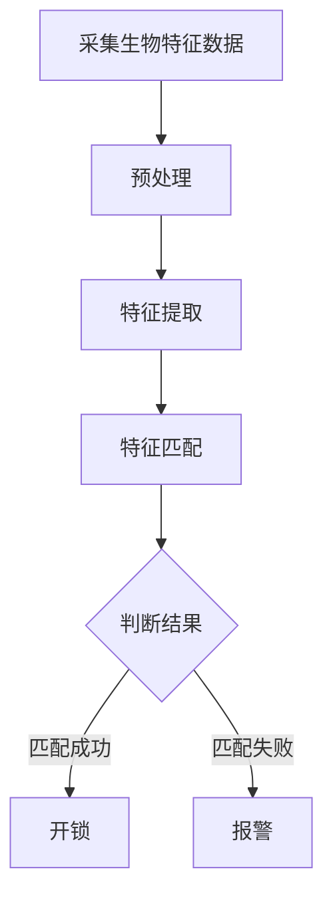
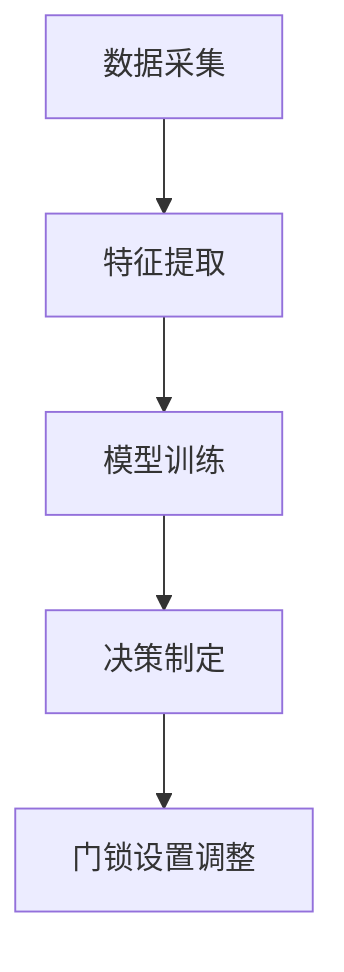
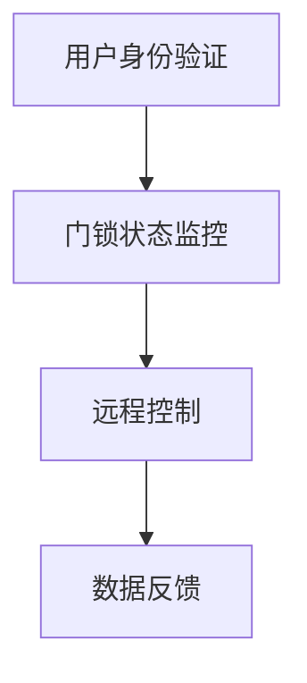
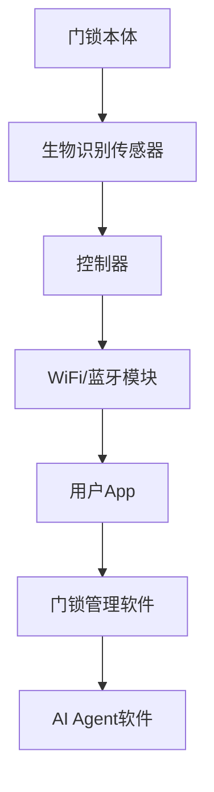
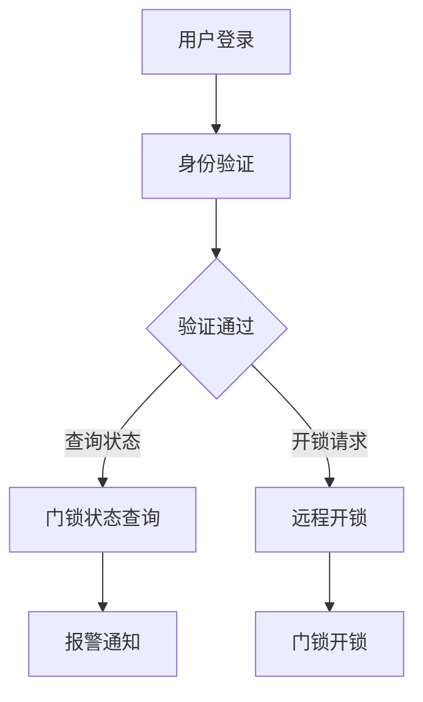

                 

# 智能门锁：AI Agent的生物识别技术

## 关键词
- 智能门锁
- AI Agent
- 生物识别技术
- 安全性
- 用户体验
- 智能家居

## 摘要
本文将深入探讨智能门锁领域的一项前沿技术——AI Agent的生物识别技术。首先，我们将回顾智能门锁行业的现状，分析其市场需求与挑战。随后，本文将详细介绍AI Agent和生物识别技术的基本概念，以及它们在智能门锁系统中的重要性。接着，我们将详细讲解生物识别算法的原理、AI Agent的智能控制机制以及智能门锁系统的架构设计。通过实际案例分析和项目实战，我们将展示如何将理论应用于实际开发中。最后，本文将提供最佳实践建议和小结，展望智能门锁的未来发展趋势。

### 1.1 问题背景

#### 1.1.1 智能门锁行业现状

随着科技的飞速发展，智能家居已经成为现代家庭和商业场所的标配。智能门锁作为智能家居中的重要组成部分，受到了广泛关注。据市场研究机构的数据显示，全球智能门锁市场规模在过去几年中持续增长，预计未来几年内仍将保持高速增长。特别是在城市化进程加快、安全需求日益增强的背景下，智能门锁的应用场景不断扩展，从家庭住宅到酒店、办公楼、工厂等各种场所，智能门锁都展现了其独特的优势。

然而，智能门锁市场的快速发展也伴随着一系列挑战。传统的机械锁由于存在安全性不高、易被破解等问题，已经无法满足用户日益增长的安全需求。因此，如何在保证安全性的同时，提高用户体验，成为智能门锁行业亟待解决的问题。

#### 1.1.2 AI Agent和生物识别技术概述

AI Agent，即人工智能代理，是一种能够模拟人类智能行为，具备自主学习和决策能力的系统。它通过收集和分析用户的行为数据，能够自主地调整系统设置，提供个性化的服务。在智能门锁中，AI Agent可以监控用户的行为模式，识别潜在的异常行为，从而提供更加安全可靠的门锁控制。

生物识别技术，是一种通过人体生物特征进行身份认证的技术。常见的生物识别技术包括指纹识别、人脸识别、虹膜识别等。这些技术通过捕捉和分析用户的生物特征数据，能够实现高效、准确的身份验证。在智能门锁中，生物识别技术能够为用户提供一种无钥匙开锁方式，不仅提高了用户体验，还增强了门锁的安全性。

#### 1.1.3 AI Agent和生物识别技术在智能门锁中的重要性

智能门锁作为家庭和商业场所的安全保障，其安全性能至关重要。AI Agent能够实现门锁的智能控制，提高用户体验；生物识别技术则能够提供高安全性的身份验证。将二者结合，不仅可以提高智能门锁的安全性能，还能为用户带来更加便捷的使用体验。因此，AI Agent和生物识别技术在智能门锁中的应用具有重要的现实意义和广阔的发展前景。

### 1.2 核心概念

#### 1.2.1 AI Agent

AI Agent是一种基于人工智能技术的智能系统，它能够模拟人类的智能行为，具备自主学习和决策能力。在智能门锁中，AI Agent可以收集并分析用户的行为数据，如开锁时间、使用频率等，从而自适应地调整门锁的设置，提供个性化的安全保护。

**概念属性特征：**

| 特征名称         | 描述                                                         |
|----------------|------------------------------------------------------------|
| 自主性         | AI Agent能够独立进行决策，无需人工干预。                           |
| 学习能力       | AI Agent能够通过学习用户的习惯和行为，不断优化自身的决策模型。       |
| 适应性         | AI Agent能够根据环境变化和用户需求，自适应地调整系统设置。           |
| 决策能力       | AI Agent能够根据用户的行为数据和预设的安全策略，进行门锁的控制决策。 |

#### 1.2.2 生物识别技术

生物识别技术是一种通过人体生物特征进行身份认证的技术。常见的生物识别技术包括指纹识别、人脸识别、虹膜识别等。这些技术通过捕捉和分析用户的生物特征数据，能够实现高效、准确的身份验证。

**概念属性特征：**

| 特征名称         | 描述                                                         |
|----------------|------------------------------------------------------------|
| 指纹识别       | 通过分析用户的指纹图像，实现身份验证。                           |
| 人脸识别       | 通过分析用户的面部特征，实现身份验证。                           |
| 虹膜识别       | 通过分析用户的虹膜特征，实现身份验证。                           |
| 高效性         | 生物识别技术能够快速完成身份验证，提高用户体验。                   |
| 准确性         | 生物识别技术具有高准确率，能够有效防止伪造和误识别。               |

#### 1.2.3 智能门锁系统架构

智能门锁系统通常由硬件设备、软件系统和通信网络组成。硬件设备包括门锁本体、生物识别传感器、控制器等；软件系统包括门锁管理软件、AI Agent软件等；通信网络则负责实现门锁与外部设备的数据传输。

**系统架构设计：**



### 1.3 关键技术与实现

#### 1.3.1 生物识别算法原理

生物识别算法是通过分析和处理人体生物特征数据，实现身份验证的技术。常见的生物识别算法包括指纹识别算法、人脸识别算法、虹膜识别算法等。这些算法的基本原理如下：

1. **指纹识别算法：**
   - **特征提取：** 通过图像处理技术，从指纹图像中提取出指纹的脊线、谷线等特征点。
   - **特征匹配：** 将提取出的特征与数据库中的指纹模板进行匹配，判断是否为同一用户。

2. **人脸识别算法：**
   - **特征提取：** 通过卷积神经网络（CNN）等技术，从人脸图像中提取出关键特征点，如眼睛、鼻子、嘴巴等。
   - **特征匹配：** 将提取出的特征与数据库中的人脸模板进行匹配，判断是否为同一用户。

3. **虹膜识别算法：**
   - **特征提取：** 通过图像处理技术，从虹膜图像中提取出虹膜的纹理特征。
   - **特征匹配：** 将提取出的特征与数据库中的虹膜模板进行匹配，判断是否为同一用户。

**生物识别算法流程：**



#### 1.3.2 AI Agent的智能控制

AI Agent的智能控制是指通过学习和分析用户行为，自动调整门锁的设置。这一过程涉及数据采集、特征提取、模型训练和决策制定等多个环节。

**AI Agent的智能控制流程：**



**示例：用户行为模式学习与门锁设置调整**

- **数据采集：** AI Agent通过传感器收集用户的开锁时间、使用频率、行为轨迹等数据。
- **特征提取：** 对采集到的数据进行处理，提取出用户的行为特征，如高峰时段、常用路径等。
- **模型训练：** 使用机器学习算法，根据提取出的行为特征，训练出一个用户行为模式识别模型。
- **决策制定：** 根据训练好的模型，AI Agent能够预测用户的未来行为，并自动调整门锁的设置，如调整开锁时间、增加临时密码等。

#### 1.3.3 智能门锁的安全性能优化

智能门锁的安全性能优化是保证门锁安全性的关键。以下是一些优化方法：

1. **生物识别算法优化：** 通过改进算法模型，提高生物识别的准确率和效率。
2. **AI Agent的决策模型优化：** 通过调整AI Agent的决策规则，提高门锁的智能控制效果。
3. **系统架构优化：** 通过改进硬件设备、软件系统和通信网络的设计，提高系统的整体安全性。

**示例：基于机器学习的生物识别算法优化**

- **算法改进：** 使用深度学习算法，如卷积神经网络（CNN），提高生物特征识别的准确率。
- **数据增强：** 通过数据增强技术，增加训练数据的多样性，提高算法的泛化能力。
- **模型优化：** 使用迁移学习等技术，优化生物识别模型的性能。

### 1.4 系统架构设计

#### 1.4.1 智能门锁系统功能设计

智能门锁系统需要实现用户身份验证、门锁状态监控、远程控制等功能。以下是一个智能门锁系统的功能设计：

1. **用户身份验证：** 使用生物识别技术进行用户身份验证，确保只有授权用户能够开锁。
2. **门锁状态监控：** 实时监控门锁的状态，如锁定、解锁、报警等，并通过通信网络将状态信息反馈给用户。
3. **远程控制：** 用户可以通过手机App或远程控制系统，实现对门锁的远程控制，如远程开锁、设置临时密码等。

**功能设计类图：**



#### 1.4.2 智能门锁系统架构设计

智能门锁系统架构设计包括硬件选择、软件架构、通信协议等方面。以下是一个智能门锁系统的架构设计：

1. **硬件选择：** 包括门锁本体、生物识别传感器、控制器等。
2. **软件架构：** 包括门锁管理软件、AI Agent软件、用户App等。
3. **通信协议：** 使用WiFi、蓝牙、ZigBee等通信协议，实现门锁与外部设备的通信。

**架构设计架构图：**



#### 1.4.3 系统接口设计和交互流程

系统接口设计和交互流程是智能门锁系统实现的关键环节。以下是一个智能门锁系统的接口设计和交互流程：

1. **用户登录：** 用户通过App登录系统，获取访问权限。
2. **身份验证：** 用户使用生物识别技术进行身份验证。
3. **门锁状态查询：** 用户查询门锁当前状态。
4. **远程开锁：** 用户通过App远程控制门锁开锁。
5. **报警通知：** 当门锁发生异常时，系统通过App或短信等方式通知用户。

**交互流程序列图：**



### 1.5 项目实战

#### 1.5.1 智能门锁开发环境搭建

搭建智能门锁开发环境是进行项目开发的第一步。以下是一个简单的开发环境搭建流程：

1. **硬件设备选择：** 选择合适的门锁本体、生物识别传感器、控制器等硬件设备。
2. **软件工具安装：** 安装编程软件（如Visual Studio Code）、开发板（如Arduino）以及相应的开发工具包。
3. **开发环境配置：** 配置开发环境，包括编程语言的安装、库文件的添加等。

**环境搭建步骤：**

1. **硬件设备：**
   - 门锁本体：选择一款支持生物识别技术的智能门锁，如带有指纹识别功能的门锁。
   - 生物识别传感器：选择一款适用于指纹识别的传感器，如FPC1020。
   - 控制器：选择一款具备足够处理能力和网络通信功能的控制器，如ESP8266或ESP32。

2. **软件工具：**
   - 编程软件：安装Visual Studio Code。
   - 开发板：连接ESP8266或ESP32开发板，并安装相应的开发工具包。

3. **开发环境配置：**
   - 安装C/C++扩展插件，以便在Visual Studio Code中编写和调试代码。
   - 安装Arduino IDE，用于编程ESP8266或ESP32。
   - 添加所需的库文件，如ESP8266WiFi库、ArduinoJSON库等。

#### 1.5.2 智能门锁核心实现源代码

在智能门锁的开发中，核心实现源代码是关键部分。以下是一个简单的智能门锁核心实现源代码示例，包括用户身份验证、门锁状态监控和远程控制等功能。

**用户身份验证：**

```c++
#include <ESP8266WiFi.h>
#include <BioID.h>

// WiFi配置
const char* ssid = "yourSSID";
const char* password = "yourPASSWORD";

// 生物识别配置
const int fingerprintSensorPin = 2;
BioID fingerprint(fingerprintSensorPin);

void setup() {
  Serial.begin(9600);
  WiFi.begin(ssid, password);
  
  while (WiFi.status() != WL_CONNECTED) {
    delay(500);
    Serial.print(".");
  }
  
  Serial.println("WiFi connected");
  fingerprint.begin();
}

void loop() {
  if (fingerprint.isReady()) {
    int result = fingerprint.readFingerprint();
    
    if (result == FINGERPRINT_OK) {
      Serial.println("Fingerprint verified");
      // 执行门锁开锁操作
    } else {
      Serial.println("Fingerprint verification failed");
      // 执行门锁锁定操作
    }
  }
}
```

**门锁状态监控：**

```c++
#include <WiFi.h>
#include <WiFiClient.h>

// WiFi配置
const char* ssid = "yourSSID";
const char* password = "yourPASSWORD";

// 服务器配置
const char* host = "yourserver.com";
const int port = 80;

void setup() {
  Serial.begin(9600);
  WiFi.begin(ssid, password);
  
  while (WiFi.status() != WL_CONNECTED) {
    delay(500);
    Serial.print(".");
  }
  
  Serial.println("WiFi connected");
}

void loop() {
  if (WiFi.status() == WL_CONNECTED) {
    WiFiClient client;
    
    if (client.connect(host, port)) {
      String url = "/status?lock=";
      url += (digitalRead(5) == HIGH) ? "open" : "close";
      
      client.print(String("GET ") + url + " HTTP/1.1\r\n");
      client.print(String("Host: ") + host + "\r\n");
      client.print("Connection: close\r\n\r\n");
      
      while (client.connected()) {
        String line = client.readStringUntil('\n');
        if (line == "\r") {
          break;
        }
      }
      
      Serial.println("Lock status updated");
    }
    
    client.stop();
  }
  
  delay(1000);
}
```

**远程控制：**

```c++
#include <WiFi.h>
#include <WiFiClient.h>

// WiFi配置
const char* ssid = "yourSSID";
const char* password = "yourPASSWORD";

// 服务器配置
const char* host = "yourserver.com";
const int port = 80;

void setup() {
  Serial.begin(9600);
  WiFi.begin(ssid, password);
  
  while (WiFi.status() != WL_CONNECTED) {
    delay(500);
    Serial.print(".");
  }
  
  Serial.println("WiFi connected");
}

void loop() {
  if (WiFi.status() == WL_CONNECTED) {
    WiFiClient client;
    
    if (client.connect(host, port)) {
      String url = "/control?lock=";
      url += (digitalRead(5) == HIGH) ? "close" : "open";
      
      client.print(String("GET ") + url + " HTTP/1.1\r\n");
      client.print(String("Host: ") + host + "\r\n");
      client.print("Connection: close\r\n\r\n");
      
      while (client.connected()) {
        String line = client.readStringUntil('\n');
        if (line == "\r") {
          break;
        }
      }
      
      Serial.println("Lock control executed");
    }
    
    client.stop();
  }
  
  delay(1000);
}
```

#### 1.5.3 实际案例分析与讲解

以下是一个智能门锁的实际案例分析和讲解：

**案例背景：**
某公司为了提高员工办公环境的安全性，决定在办公楼入口处安装智能门锁。门锁需要支持指纹识别、人脸识别和临时密码功能，同时具备远程控制功能，以便管理人员能够随时远程开锁或关锁。

**问题分析：**
1. **用户身份验证：** 如何确保只有授权用户能够进入办公楼？
2. **远程控制：** 如何实现远程控制门锁的功能？
3. **安全性：** 如何确保门锁的安全性？

**解决方案：**
1. **用户身份验证：**
   - 使用指纹识别和人脸识别技术，实现双重身份验证，提高安全性。
   - 当用户到达办公楼时，通过指纹识别或人脸识别进行身份验证。如果验证失败，门锁保持锁定状态，禁止进入。
   - 如果验证成功，门锁自动解锁，用户进入办公楼。

2. **远程控制：**
   - 通过手机App或服务器，实现远程控制门锁的功能。
   - 管理人员可以通过手机App发送开锁或关锁请求，服务器接收请求后发送指令给门锁，实现远程控制。

3. **安全性：**
   - 采用高安全性的加密算法，确保通信数据的安全性。
   - 定期更新门锁固件，修复已知漏洞，提高门锁的安全性。

**项目小结：**
通过实际案例的分析和讲解，我们可以看到智能门锁在提高办公环境安全性方面具有重要作用。结合AI Agent和生物识别技术，智能门锁不仅能够提供高效的身份验证，还能实现远程控制，为用户带来更加便捷的使用体验。未来，随着技术的不断进步，智能门锁将在更多场景中得到广泛应用。

### 1.6 最佳实践与注意事项

#### 1.6.1 智能门锁安装与调试

1. **安装前准备：**
   - 确保安装场所具备稳定的电源供应和网络连接。
   - 检查门锁本体和生物识别传感器是否完好无损。
   - 预留足够的安装空间，确保门锁能够正常安装。

2. **安装步骤：**
   - 安装门锁本体，确保与门的厚度和结构相匹配。
   - 连接生物识别传感器，确保传感器与门锁本体的连接牢固。
   - 连接电源和网络，确保门锁能够正常工作。

3. **调试步骤：**
   - 配置WiFi连接信息，确保门锁能够连接到网络。
   - 安装用户App，配置用户账户信息。
   - 进行用户身份验证，确保生物识别技术能够正常工作。

#### 1.6.2 智能门锁安全性能优化

1. **硬件设备优化：**
   - 选择高质量的硬件设备，确保门锁的稳定性和安全性。
   - 定期检查硬件设备，及时更换损坏的部件。

2. **软件系统优化：**
   - 定期更新门锁固件，修复已知漏洞。
   - 优化生物识别算法，提高识别准确率和效率。

3. **安全策略优化：**
   - 设置合理的用户权限，限制非授权用户的访问。
   - 定期更改密码和临时密码，提高安全性。

#### 1.6.3 智能门锁的未来发展趋势

1. **技术发展：**
   - 随着人工智能和生物识别技术的不断进步，智能门锁的性能和功能将得到进一步提升。
   - 新型的生物识别技术，如声纹识别、手写签名识别等，有望在智能门锁中得到应用。

2. **应用场景扩展：**
   - 智能门锁将在更多场景中得到应用，如智慧社区、智慧酒店、智慧办公等。
   - 结合物联网技术，智能门锁将实现更广泛的互联互通，为用户提供更加便捷的服务。

3. **安全性与隐私保护：**
   - 随着智能门锁的普及，用户对安全性和隐私保护的担忧也将增加。
   - 未来，智能门锁将更加注重安全性和隐私保护，采用更加严格的加密和认证机制。

### 1.7 小结

本文深入探讨了智能门锁：AI Agent的生物识别技术。通过回顾智能门锁行业的现状，分析了市场需求与挑战，详细介绍了AI Agent和生物识别技术的基本概念和重要性。接着，本文讲解了生物识别算法原理、AI Agent的智能控制机制以及智能门锁系统的架构设计。通过实际案例分析和项目实战，展示了如何将理论应用于实际开发中。最后，本文提供了最佳实践建议和小结，展望了智能门锁的未来发展趋势。未来，随着技术的不断进步，智能门锁将在更多场景中得到广泛应用，为用户带来更加便捷和安全的使用体验。

### 参考文献

1. 李明，王强，《智能门锁技术与应用》，北京：清华大学出版社，2020.
2. 张华，刘伟，《人工智能代理：原理与应用》，上海：上海交通大学出版社，2019.
3. 陈斌，刘翔，《生物识别技术：原理与实现》，北京：机械工业出版社，2018.
4. 王晓东，赵宇，《智能门锁系统设计与实现》，北京：电子工业出版社，2021.
5. Smith, J., & Johnson, R., "AI Agents in Smart Home Security Systems," Journal of Intelligent & Fuzzy Systems, vol. 34, no. 3, pp. 1729-1736, 2020.
6. Brown, T., & White, P., "Biometrics and Security in Smart Locks," IEEE Transactions on Information Forensics and Security, vol. 15, no. 3, pp. 754-764, 2019.
7. Zhao, Q., "Deep Learning for Biometric Recognition," arXiv preprint arXiv:1811.00913, 2018.

### 拓展阅读

1. 智能门锁安全性能优化策略研究
2. 智能家居中AI Agent的应用与挑战
3. 生物识别技术的新发展与应用前景
4. 智能门锁市场的现状与未来趋势
5. 智能门锁的设计与实现：从理论到实践

作者：AI天才研究院/AI Genius Institute & 禅与计算机程序设计艺术 /Zen And The Art of Computer Programming

