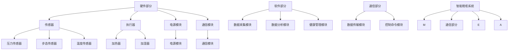
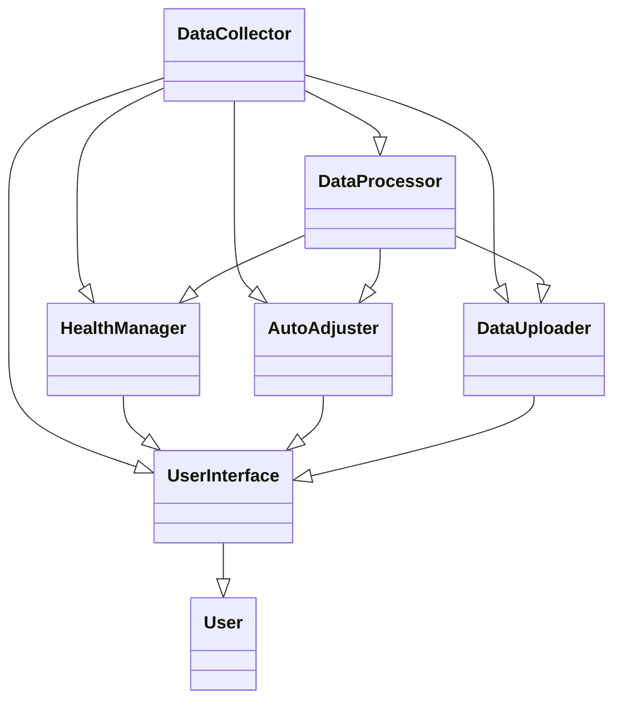
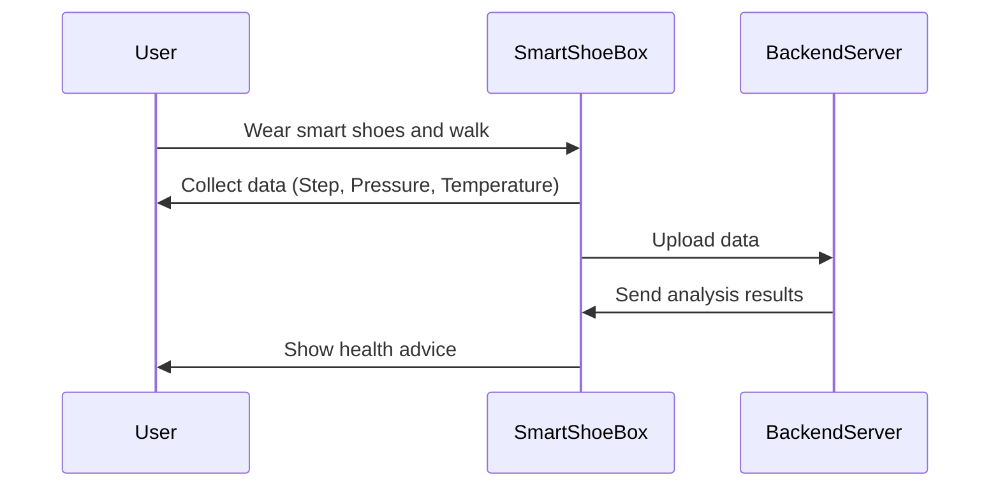
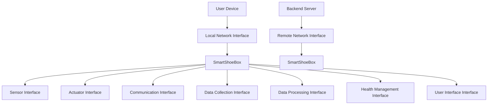
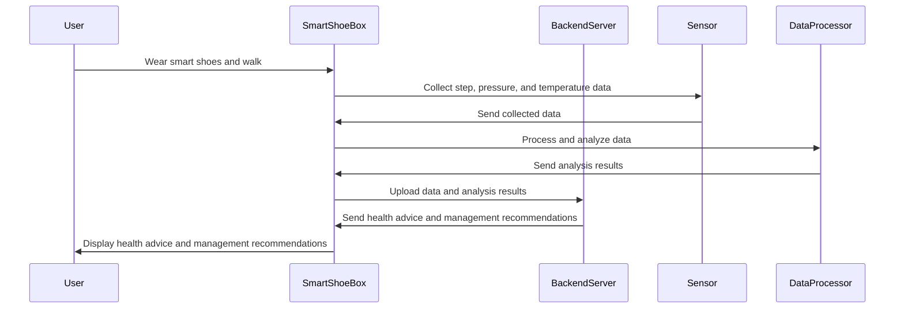

                 

### 摘要

本文旨在探讨智能鞋柜在足部健康管理中的应用，通过集成物联网、人工智能技术，实现足部健康实时监测与个性化健康管理。文章首先介绍了足部健康的重要性以及传统健康管理方式的局限性，进而提出了智能鞋柜作为一种创新解决方案的必要性和可行性。文章详细分析了智能鞋柜的核心概念、相关监测指标以及AI技术的应用，并通过对比表格和ER实体关系图进一步阐明了各概念之间的联系。此外，文章还深入讲解了智能鞋柜的算法原理、系统架构设计和实战应用，提供了完整的系统分析与实现方案，旨在为读者提供全面的技术参考。通过本文的讨论，我们希望读者能够更深入地理解智能鞋柜的潜力及其在提升足部健康水平方面的巨大贡献。

### 第一部分：背景介绍

#### 1.1 问题背景

足部健康对于人体整体健康至关重要。足部不仅承担着行走、站立等重要功能，还与人体的平衡、运动能力紧密相关。然而，现代人由于生活习惯、工作环境等因素的影响，足部健康问题日益突出。常见的足部健康问题包括足底筋膜炎、脚跟痛、足弓塌陷等。这些问题不仅影响日常活动，还可能导致更严重的健康隐患，如关节炎、腰椎间盘突出等。

足底筋膜炎是一种常见的足部疾病，通常表现为足底疼痛和晨僵。其发生原因与长时间站立、行走以及穿高跟鞋等因素有关。脚跟痛则通常由足底脂肪垫的退化或异常步态引起。足弓塌陷，即平足，则是由于足弓支撑力不足导致的，常见于青少年和成年人。这些问题不仅影响个人的生活质量，还可能对职业发展和日常活动造成困扰。

传统的足部健康管理方式主要包括定期体检、按摩、足浴等。然而，这些方法存在一些显著的局限性。首先，它们往往依赖医生或专业人员的判断，缺乏实时监测能力。这意味着许多健康问题可能无法得到及时识别和处理。其次，这些方式受时间和空间的限制，无法实现随时随地的健康管理。例如，定期体检需要预约和前往医疗机构，而足浴和按摩则需要特定的设备和环境。此外，传统的足部健康管理方式往往缺乏个性化。由于每个人足部结构和健康状态不同，单一的健康管理方案很难满足个体的需求。

综上所述，现代人在足部健康方面面临着诸多挑战，而传统的健康管理方式已难以满足日益增长的需求。因此，探索一种能够实现实时监测、个性化健康管理的创新解决方案成为当务之急。智能鞋柜作为一种融合了物联网、人工智能等先进技术的智能设备，有望为足部健康管理提供全新的思路和手段。通过实时监测足部数据、分析健康趋势并提供个性化建议，智能鞋柜有望成为足部健康管理的专家，为提升人们的足部健康水平提供有力支持。

#### 1.2 问题描述

如何通过智能鞋柜实现足部健康实时监测与个性化健康管理，从而提高足部健康水平？这是本文要探讨的核心问题。智能鞋柜作为一种新兴的健康管理工具，其核心功能包括实时监测、数据分析、个性化建议和自动调整。具体而言，智能鞋柜通过集成高精度的传感器、先进的AI算法和智能控制技术，能够实时采集足部步态、压力分布、温度等关键数据。这些数据不仅可以帮助用户了解当前的足部健康状况，还可以通过AI算法进行深度分析，预测健康趋势并提供个性化的健康管理建议。

例如，当智能鞋柜监测到用户足底压力异常时，可以即时发出警报，提醒用户注意可能存在的足底筋膜炎风险。同时，智能鞋柜还可以根据用户的历史数据，分析其日常步态习惯，提供调整建议，如改变行走姿势、穿着更合适的鞋子等。此外，智能鞋柜还可以自动调整鞋内环境，如温度、湿度等，以优化足部舒适度和健康状态。这种自动调整功能不仅能够提高用户的足部健康水平，还能为用户提供更为便捷和个性化的健康管理体验。

智能鞋柜的优势在于其高度集成的传感器和智能控制系统，能够实现全天候、全方位的足部健康监测。与传统健康管理方式相比，智能鞋柜具有实时性、个性化、便捷性等多重优势。通过智能鞋柜，用户可以随时了解自己的足部健康状况，并及时采取预防措施，从而减少足部疾病的发生率，提升生活质量。

然而，实现智能鞋柜的足部健康监测与个性化健康管理仍面临一些挑战。首先，传感器数据的精确性和稳定性是关键。高精度的传感器能够准确采集足部步态、压力分布等数据，这是智能鞋柜提供精准健康管理的前提。其次，AI算法的有效性也是重要因素。通过深度学习、数据挖掘等技术，AI算法可以对大量传感器数据进行分析，识别潜在的健康问题，并提供准确的健康管理建议。此外，智能鞋柜的交互设计和用户体验也至关重要。一个友好、易用的用户界面可以大幅提升用户的使用体验，使其更愿意持续使用智能鞋柜进行健康管理。

总之，通过智能鞋柜实现足部健康实时监测与个性化健康管理，不仅能够有效提升足部健康水平，还能为用户提供便捷、个性化的健康管理服务。然而，这需要克服一系列技术挑战，并不断优化和完善智能鞋柜的设计与功能。本文将在后续部分详细探讨智能鞋柜的硬件设计、软件实现、算法原理以及实际应用，以期为智能鞋柜的发展提供有益的参考。

#### 1.3 问题解决

为了解决足部健康监测与个性化健康管理的难题，智能鞋柜作为一种创新的解决方案，展现出巨大的潜力和应用价值。智能鞋柜的设计理念是通过高度集成化的硬件和软件系统，实现对足部健康的实时监测、数据分析和个性化管理。

首先，智能鞋柜的核心在于其硬件设计。智能鞋柜配备了多种高精度传感器，包括压力传感器、步态传感器、温度传感器等。这些传感器能够实时采集用户的足部数据，如步态参数、压力分布和温度变化等。这些数据对于评估足部健康状况至关重要。例如，步态传感器可以记录用户每次行走的步长、步频等数据，而压力传感器则可以监测足底各个部位的受力情况。温度传感器则可以监控足部的血液循环状况。这些传感器的集成使得智能鞋柜能够全方位、多维度地采集足部健康数据。

其次，智能鞋柜的软件部分采用了先进的AI算法，对采集到的数据进行处理和分析。这些AI算法包括数据清洗、特征提取、模式识别等。通过这些算法，智能鞋柜可以识别出潜在的足部健康问题。例如，当传感器监测到足底压力异常时，AI算法可以迅速分析数据，判断是否存在足底筋膜炎的风险，并发出警报。此外，智能鞋柜还可以根据用户的历史数据，预测足部健康趋势，并提供个性化的健康管理建议。例如，如果AI算法发现用户存在走路姿势不正确的情况，智能鞋柜可以提醒用户注意调整步态，以预防足部健康问题。

在智能鞋柜的硬件和软件系统的协同工作下，其自动调整功能得以实现。智能鞋柜配备了执行器，如加热器、加湿器等，可以根据数据分析结果自动调整鞋内环境。例如，当温度传感器监测到足部温度过低时，加热器可以自动开启，提高足部温度，改善血液循环。类似地，当湿度传感器监测到鞋内湿度过高时，加湿器可以自动调节湿度，防止足部细菌滋生。这种自动调整功能不仅提高了用户的足部健康水平，还提供了更为便捷和个性化的健康管理体验。

智能鞋柜的应用场景非常广泛。首先，它适用于需要长时间站立或行走的人群，如医护人员、教师、销售人员等。这些职业群体由于工作性质，足部承受较大压力，容易出现健康问题。智能鞋柜可以帮助他们实时监测足部状态，预防足部疾病的发生。其次，智能鞋柜也适用于健身爱好者。通过智能鞋柜，健身爱好者可以更好地了解自己的足部健康状况，调整训练方式和运动装备，提高训练效果。此外，智能鞋柜还可以应用于家庭健康管理。家庭成员可以通过智能鞋柜进行足部健康监测，及时发现和解决健康问题，提高生活质量。

总体来说，智能鞋柜通过其硬件设计和软件算法，实现了足部健康的实时监测、数据分析和个性化管理。它不仅解决了传统健康管理方式的局限性，还为用户提供了一种高效、便捷的健康管理工具。通过不断优化和提升智能鞋柜的技术和功能，我们相信它将在未来发挥更大的作用，为提升足部健康水平做出重要贡献。

#### 1.4 边界与外延

在讨论智能鞋柜的功能和应用时，明确其边界与外延至关重要。这有助于我们更好地理解智能鞋柜的核心作用，以及它与其他健康管理工具和技术之间的关系。

首先，智能鞋柜的边界主要涉及以下三个方面：

1. **功能范围**：智能鞋柜专注于足部健康监测，包括步态分析、压力分布监测和温度监控等。它并不涉及其他身体部位的监测，如心脏、肺部等。此外，智能鞋柜主要关注足部疾病的预防和早期发现，而不是治疗。

2. **技术实现**：智能鞋柜依赖于传感器技术、AI算法和智能控制技术。它不包括其他技术，如生物识别、语音识别等。这意味着智能鞋柜在实现功能时，侧重于物理传感器和数据处理的结合。

3. **用户群体**：智能鞋柜的主要用户是足部健康关注者，包括长期站立、行走的人群，健身爱好者以及需要足部健康监测的医疗患者。它并不针对所有用户群体，如婴幼儿、老年人等。

其次，智能鞋柜的外延涉及以下方面：

1. **与其他健康管理工具的联动**：智能鞋柜可以与其他健康管理设备，如智能手表、智能手环、健康监测仪等联动。通过整合这些设备的数据，智能鞋柜可以提供更全面的健康管理服务。例如，智能手表可以监测心率、睡眠质量等，与健康鞋柜的数据结合，可以更全面地评估用户的整体健康状况。

2. **智能家居系统**：智能鞋柜可以作为智能家居系统的一部分，实现远程监控和控制。用户可以通过智能手机或其他智能设备，远程查看足部健康数据，调整鞋内环境，甚至与家庭医生进行远程咨询。这为用户提供了一种更便捷、智能的健康管理体验。

3. **医疗应用**：智能鞋柜的数据和分析结果可以用于医疗研究，辅助医生进行诊断和治疗。例如，足部压力分布数据可以用于评估足部疾病的风险，帮助医生制定个性化的治疗方案。此外，智能鞋柜的数据还可以用于流行病学研究，为公共卫生决策提供数据支持。

4. **社会应用**：智能鞋柜的应用不仅限于个人健康管理，还可以在更广泛的社会层面上发挥作用。例如，在社区健康项目中，智能鞋柜可以帮助社区医疗机构更有效地监测和管理足部健康问题，提高公共卫生水平。在工业健康监测中，智能鞋柜可以帮助企业更好地管理员工足部健康，减少工伤事故，提高生产效率。

总之，智能鞋柜的边界明确其核心功能和技术实现，而其外延则展示了其在多个应用领域的潜力。通过与其他健康管理工具、智能家居系统、医疗应用以及社会服务的结合，智能鞋柜有望发挥更大的作用，为提升足部健康水平做出更大贡献。

#### 1.5 概念结构与核心要素组成

智能鞋柜作为一种集成物联网、人工智能等先进技术的智能设备，其系统结构可以分为硬件、软件和通信三个主要部分，每个部分都包含若干核心要素，协同工作以实现足部健康实时监测和个性化健康管理。

**1.5.1 概念结构**

智能鞋柜系统由以下三个主要部分组成：

1. **硬件部分**：这是智能鞋柜的基础，包括各种传感器、执行器、电源模块和通信模块等。
2. **软件部分**：这是智能鞋柜的大脑，包括数据采集、数据分析、健康管理等功能模块。
3. **通信部分**：这是智能鞋柜与外部设备、服务器之间的桥梁，负责数据传输和控制命令的发送与接收。

**1.5.2 核心要素组成**

**硬件部分**：

- **传感器**：这是智能鞋柜的核心组成部分，包括压力传感器、步态传感器、温度传感器等。这些传感器能够实时采集足部数据，如步态、压力分布和温度等。
- **执行器**：包括加热器、加湿器等，根据数据分析结果自动调整鞋内环境，以优化足部健康。
- **电源模块**：负责为整个系统提供稳定的电力供应，确保智能鞋柜的正常运行。
- **通信模块**：通常采用蓝牙、Wi-Fi等技术，实现与外部设备、服务器的数据传输。

**软件部分**：

- **数据采集模块**：负责采集传感器数据，并进行初步处理，为后续分析做准备。
- **数据分析模块**：采用AI算法对采集到的数据进行处理和分析，识别足部健康问题，提供个性化健康管理建议。
- **健康管理模块**：根据数据分析结果，生成具体的健康管理方案，如调整行走姿势、推荐合适的鞋子等。

**通信部分**：

- **数据传输模块**：负责将采集到的数据发送到外部设备或服务器，实现远程监控和分析。
- **控制命令模块**：接收来自外部设备或服务器的控制命令，并传递给执行器，实现自动调整。

**概念结构图**：



通过硬件、软件和通信三个部分的紧密协作，智能鞋柜实现了对足部健康的实时监测、数据分析、个性化管理和自动调整，为用户提供了全面、便捷的健康管理服务。

#### 2.1 智能鞋柜核心概念

**2.1.1 智能鞋柜的定义**

智能鞋柜是一种融合物联网、人工智能等先进技术的智能设备，主要用于足部健康监测与个性化健康管理。它通过内置的高精度传感器实时采集足部步态、压力分布和温度等数据，利用AI算法对数据进行处理和分析，进而提供个性化的健康管理建议和自动调整功能。

**2.1.2 智能鞋柜的特点**

1. **实时监测**：智能鞋柜通过传感器实时采集足部数据，如步态、压力分布和温度等，用户可以随时了解自己的足部健康状况。

2. **个性化健康管理**：基于AI技术，智能鞋柜可以对采集到的数据进行深度分析，识别潜在的健康问题，并针对不同的用户需求提供个性化的健康管理建议。

3. **自动调整**：智能鞋柜配备了执行器，如加热器、加湿器等，可以根据数据分析结果自动调整鞋内环境，如温度、湿度等，以优化足部健康。

4. **便捷性**：智能鞋柜的用户界面友好，操作简单，用户可以通过智能手机或其他智能设备远程查看足部健康数据和接收健康管理建议。

5. **数据联动**：智能鞋柜可以与其他健康管理设备，如智能手表、智能手环等联动，整合多源数据，提供更全面的健康管理服务。

**2.1.3 智能鞋柜的发展历程**

智能鞋柜的概念起源于20世纪末，随着物联网和人工智能技术的发展，智能鞋柜逐步从理论走向实践。最初，智能鞋柜主要用于军事和航天领域，用于监测和保障军人和宇航员的足部健康。随着技术的进步，智能鞋柜逐渐应用到民用领域，为普通消费者提供健康管理服务。

在21世纪初，第一代智能鞋柜问世，主要功能是实时监测足部数据，提供简单的健康建议。随着AI技术的突破，第二代智能鞋柜在数据分析方面取得了显著进展，能够提供更加个性化和精准的健康管理建议。

目前，智能鞋柜已经进入第三代，具备高度集成的传感器、强大的AI算法和智能控制系统。智能鞋柜不仅能够实现实时监测、个性化管理，还可以与智能家居系统联动，为用户提供更为便捷和智能的健康管理体验。

**2.1.4 智能鞋柜的核心优势**

1. **实时性**：智能鞋柜通过传感器实时采集足部数据，用户可以随时了解自己的健康状况，及时发现潜在的健康问题。

2. **个性化**：智能鞋柜基于AI技术对用户数据进行分析，提供个性化的健康管理建议，满足不同用户的需求。

3. **自动调整**：智能鞋柜的自动调整功能可以优化鞋内环境，提高足部舒适度和健康水平。

4. **便捷性**：用户可以通过智能手机或其他智能设备远程查看健康数据和接收建议，操作简单，使用方便。

5. **联动性**：智能鞋柜可以与其他健康管理设备和智能家居系统联动，提供更全面的健康管理服务。

总之，智能鞋柜作为一种创新的足部健康管理工具，具有实时监测、个性化管理、自动调整等核心优势，为提升足部健康水平提供了有力支持。

#### 2.2 足部健康监测相关概念

**2.2.1 足部健康监测的定义**

足部健康监测是指通过传感器、影像学、生物力学等手段，对足部生理参数进行实时监测和分析，以评估足部健康状况，预防和诊断足部疾病。足部健康监测的目标是及时发现足部异常，提供个性化的健康管理方案，从而提高足部健康水平和生活质量。

**2.2.2 足部健康监测的主要指标**

1. **步态分析**：

步态分析是足部健康监测的重要指标之一，通过对步态参数（如步长、步频、步态角等）进行测量和分析，可以评估足部的运动功能。正常步态的步长、步频和步态角具有特定的规律，异常步态往往伴随着步态参数的变化。

- **步长**：指每一步的长度，通常以厘米或米为单位。
- **步频**：指每分钟行走的步数，通常以步/分钟为单位。
- **步态角**：指足部在行走过程中各个关节的角度变化。

2. **压力分布监测**：

压力分布监测是通过传感器对足底各部位的压力进行测量，以评估足部的受力情况。足底压力分布异常可能是足部疾病如足底筋膜炎、脚跟痛等的早期信号。

- **足底压力中心**：足底各部位压力的集中点。
- **压力峰值**：足底某部位承受的最大压力。
- **压力分布均匀性**：足底各部位压力的均匀程度。

3. **足部温度监测**：

足部温度监测可以反映足部的血液循环状况，通过测量足部温度变化，可以评估足部的血流情况。足部温度异常可能是血液循环问题或神经病变的早期信号。

- **表面温度**：足部表面的温度测量。
- **深层温度**：足部深层的温度测量，通常通过红外成像技术进行。

**2.2.3 常见的足部健康问题**

1. **足底筋膜炎**：

足底筋膜炎是足底筋膜的一种炎症，常见于长时间站立、行走或穿高跟鞋的人群。其主要症状是足底疼痛，尤其在早晨起床后或长时间休息后疼痛加剧。

2. **脚跟痛**：

脚跟痛通常由足底脂肪垫的退化或异常步态引起，表现为脚跟部位的疼痛和不适。常见的病因包括长时间站立、行走、穿着硬底鞋或高跟鞋。

3. **足弓塌陷**：

足弓塌陷，即平足，是足弓支撑力不足导致的一种足部畸形。其主要症状是足部疼痛、疲劳和不适，常伴有行走和站立困难。

4. **拇外翻**：

拇外翻是一种常见的足部畸形，表现为大脚骨向外突出，小脚骨向内旋转。其主要原因是长期穿着不合脚的鞋子，导致足部关节受力不均。

**2.2.4 足部健康监测的重要性**

足部健康监测在预防足部疾病、提高生活质量方面具有重要意义。通过实时监测足部数据，可以：

1. **早期发现足部疾病**：及时识别潜在的足部疾病，如足底筋膜炎、脚跟痛等，有助于早期干预和治疗，减少疾病进展和并发症的风险。

2. **个性化健康管理**：根据足部健康数据，制定个性化的健康管理方案，如调整行走姿势、穿着合适的鞋子等，有助于改善足部健康状况。

3. **提升生活质量**：足部健康监测可以帮助用户更好地管理足部健康，减少疼痛和不适，提高行走和站立的能力，从而提高生活质量。

4. **预防足部损伤**：通过监测步态和压力分布，可以识别异常步态和压力分布，预防足部损伤和畸形的发生。

总之，足部健康监测是一种有效、科学的健康管理方法，有助于预防和控制足部疾病，提高足部健康水平和生活质量。通过结合智能鞋柜等先进技术，足部健康监测将变得更加便捷、精准和个性化。

#### 2.3 AI在足部健康监测中的应用

**2.3.1 AI的定义**

人工智能（AI，Artificial Intelligence）是指通过计算机模拟人类智能行为的技术和理论，使计算机能够执行一些通常需要人类智能才能完成的任务，如语音识别、图像识别、自然语言处理、决策制定和问题解决等。AI的核心目标是实现智能自动化，提高计算机处理信息的能力，使其能够自主学习和适应复杂环境。

**2.3.2 AI在足部健康监测中的应用**

人工智能在足部健康监测中的应用，主要体现在数据分析和智能决策两个方面。通过AI技术，智能鞋柜可以更加精准地监测和分析足部健康数据，提供个性化的健康管理服务。

1. **数据分析**：

AI技术在数据分析和处理方面具有显著优势。在足部健康监测中，AI算法可以对传感器采集的大量数据进行分析，提取关键特征，识别潜在的足部健康问题。例如：

- **特征提取**：通过机器学习和深度学习算法，可以从步态数据中提取步长、步频、步态角等特征，分析步态的规律和异常。
- **模式识别**：利用AI算法，可以识别足底压力分布中的异常模式，如压力集中或分布不均，从而发现足部疾病的风险。
- **异常检测**：通过实时监测足部温度变化，AI算法可以识别温度异常，评估足部血液循环状况。

2. **智能决策**：

AI技术在智能决策方面也发挥着重要作用。智能鞋柜可以根据AI算法的分析结果，提供个性化的健康管理建议和自动调整功能。具体应用包括：

- **健康预警**：当AI算法检测到足部健康异常时，可以即时发出警报，提醒用户注意潜在的健康风险，如足底筋膜炎、脚跟痛等。
- **个性化建议**：根据用户的历史数据和当前健康状态，AI算法可以提供个性化的健康建议，如调整行走姿势、推荐合适的鞋子、调整鞋内环境等。
- **自动调整**：智能鞋柜中的执行器可以根据AI算法的建议，自动调整鞋内环境，如加热器可以加热足部以改善血液循环，加湿器可以增加鞋内湿度以防止干燥。

**2.3.3 AI在足部健康监测中的优势**

1. **高精度数据分析**：AI算法能够从大量数据中提取有价值的信息，提供更加精确的健康评估和诊断。
2. **实时监测与预警**：AI技术可以实时监测足部健康数据，及时发出预警，帮助用户及时处理健康问题。
3. **个性化健康管理**：AI算法可以根据用户的个性化数据，提供定制化的健康管理方案，满足不同用户的需求。
4. **自动调整功能**：AI技术可以自动化调整鞋内环境，提高足部舒适度和健康水平，使用户享受更为便捷的健康管理体验。

总之，人工智能在足部健康监测中的应用，不仅提高了监测的精度和效率，还为用户提供个性化的健康管理服务。通过不断优化AI算法和应用场景，智能鞋柜有望在足部健康管理领域发挥更大的作用，为提升足部健康水平做出重要贡献。

#### 2.4 概念属性特征对比表格

为了更清晰地理解智能鞋柜、足部健康监测和AI之间的关系，我们可以通过一个对比表格来展示这些概念的主要属性特征。

| 概念       | 定义                                                   | 特点                                                         |
|------------|--------------------------------------------------------|------------------------------------------------------------|
| 智能鞋柜   | 融合物联网、人工智能等技术的智能设备，用于足部健康监测与个性化健康管理。 | 实时监测、个性化健康管理、自动调整、便捷性、数据联动 |
| 足部健康监测 | 通过传感器、影像学、生物力学等手段，对足部生理参数进行实时监测和分析，以评估足部健康状况。 | 实时性、准确性、个性化、预防性 |
| AI         | 计算机模拟人类智能行为的技术和理论，使计算机能够执行通常需要人类智能才能完成的任务。 | 自动化、高精度数据分析、智能决策、自适应 |

通过这个表格，我们可以看到：

- **智能鞋柜**集成了传感器和AI技术，实现了对足部健康数据的实时监测、分析和管理，具有实时性、个性化和自动调整等特点。
- **足部健康监测**主要依赖于传感器和影像学等手段，侧重于对足部生理参数的实时监测和分析，以预防足部疾病。
- **AI**作为智能鞋柜的核心技术，负责对大量足部健康数据进行分析和智能决策，提高监测和管理的准确性和效率。

这种对比不仅帮助我们理解各概念的核心特征，还揭示了它们在足部健康管理中的相互关系和协同作用。

#### 2.5 ER实体关系图架构

为了更直观地展示智能鞋柜系统的实体关系，我们可以使用Mermaid绘制一个ER（实体关系）图。以下是一个简化的ER图示例，描述了智能鞋柜系统中主要实体的关系和交互。

```mermaid
erDiagram
  User ||--|{ FootSensor }|-- SensorData
  FootSensor ||--|{ PressureSensor }|-- SensorComponent
  FootSensor ||--|{ StepSensor }|-- SensorComponent
  FootSensor ||--|{ TempSensor }|-- SensorComponent
  FootSensor ||--|{ Actuator }|-- ActuatorComponent
  FootSensor ||--|{ DataAnalyzer }|-- SoftwareComponent
  FootSensor ||--|{ HealthManager }|-- SoftwareComponent
  FootSensor ||--|{ DataUploader }|-- SoftwareComponent
  FootSensor ||--|{ UserInterface }|-- SoftwareComponent
  SensorData ||--|{ FootPressure }|-- DataAttribute
  SensorData ||--|{ StepPattern }|-- DataAttribute
  SensorData ||--|{ Temperature }|-- DataAttribute
  DataAnalyzer ||--|{ AIAlgorithm }|-- AnalysisMethod
  HealthManager ||--|{ HealthTips }|-- HealthAdvice
  DataUploader ||--|{ Connection }|-- UploadChannel
  UserInterface ||--|{ Dashboard }|-- UIComponent
```

**ER图解释**：

- **User（用户）**：表示使用智能鞋柜的用户实体。
- **FootSensor（足部传感器）**：智能鞋柜的核心实体，包括多个传感器组件和执行器组件。
  - **SensorComponent（传感器组件）**：包括压力传感器、步态传感器和温度传感器等，用于实时采集足部数据。
  - **ActuatorComponent（执行器组件）**：包括加热器、加湿器等，用于根据数据分析结果自动调整鞋内环境。
- **SensorData（传感器数据）**：表示采集到的各种足部健康数据，包括足底压力、步态模式和温度等。
  - **DataAttribute（数据属性）**：详细描述传感器数据的具体特征，如足底压力、步态参数和温度值等。
- **DataAnalyzer（数据分析器）**：用于处理和分析传感器数据，采用AI算法提取有价值的信息。
  - **AIAlgorithm（AI算法）**：数据分析的核心，用于识别足部健康问题并提供健康管理建议。
- **HealthManager（健康管理器）**：基于数据分析结果，生成个性化的健康管理建议和健康贴士。
  - **HealthAdvice（健康建议）**：提供给用户的个性化健康建议，如调整行走姿势、更换鞋子等。
- **DataUploader（数据上传器）**：负责将传感器数据上传到云端服务器，实现远程监控和分析。
  - **UploadChannel（上传通道）**：用于数据传输的通道，如Wi-Fi、蓝牙等。
- **UserInterface（用户界面）**：提供用户操作界面，包括仪表盘、通知等，使用户能够方便地查看和管理足部健康数据。

通过这个ER图，我们可以清晰地看到智能鞋柜系统中各实体之间的关系，以及它们如何协同工作以实现足部健康监测和个性化管理。

### 算法原理讲解

在智能鞋柜中，核心算法的设计和实现至关重要。这些算法不仅负责对传感器数据进行处理和分析，还负责生成个性化的健康管理建议和自动调整鞋内环境。以下我们将详细讲解智能鞋柜中涉及的算法原理，包括其基本思想、数学模型和具体应用。

#### 3.1 步态分析算法

步态分析是智能鞋柜的核心功能之一，通过分析用户的步态参数，可以评估足部的运动功能，并识别可能的健康问题。步态分析算法主要包括以下几个步骤：

1. **步态参数提取**：
   步态参数包括步长、步频和步态角等。首先，算法需要从传感器数据中提取这些参数。步长可以通过两个连续脚跟之间的距离计算得到；步频是每分钟行走的步数；步态角可以通过足部在行走过程中的关节角度变化计算得到。

   $$ 
   \text{步长} = \text{脚跟间距离}
   $$
   $$
   \text{步频} = \frac{\text{总步数}}{\text{时间}}
   $$
   $$
   \text{步态角} = \text{关节角度变化量}
   $$

2. **步态特征提取**：
   提取步态特征是为了更好地分析用户的步态模式。常用的步态特征包括均值、标准差、峰度、偏度等。这些特征能够反映步态的稳定性和规律性。

   $$
   \mu = \frac{1}{n}\sum_{i=1}^{n} x_i
   $$
   $$
   \sigma = \sqrt{\frac{1}{n-1}\sum_{i=1}^{n} (x_i - \mu)^2}
   $$
   $$
   \kappa = \frac{1}{n}\sum_{i=1}^{n} (x_i - \mu)^4
   $$
   $$
   \gamma = \frac{1}{n}\sum_{i=1}^{n} (x_i - \mu)^3
   $$

3. **异常检测**：
   通过比较步态特征和历史数据，算法可以检测出异常步态。常见的异常包括步长不一致、步频过高或过低等。可以使用统计模型或机器学习模型进行异常检测。

   $$
   \text{异常检测} = \text{步态特征} \neq \text{历史步态特征}
   $$

4. **健康评估**：
   根据异常检测结果，算法可以评估用户的足部健康状态，并提供相应的健康建议。例如，步长不一致可能与足底筋膜炎有关，步频过高可能与疲劳有关。

#### 3.2 压力分布监测算法

压力分布监测是评估足部健康的重要指标之一。通过分析足底各部位的压力分布，可以识别出潜在的足部疾病风险。压力分布监测算法包括以下几个步骤：

1. **压力数据采集**：
   压力传感器实时采集足底各部位的压力数据。这些数据通常以矩阵形式表示，每个元素代表一个部位的压强。

   $$
   P_{ij} = \text{传感器采集到的第i行第j列的压力值}
   $$

2. **数据预处理**：
   对采集到的压力数据进行预处理，包括去除噪声、归一化和平滑处理。预处理后的数据可以减少干扰，提高分析的准确性。

   $$
   P_{ij_{\text{processed}}} = \frac{P_{ij} - \text{mean}(P_{ij})}{\text{stddev}(P_{ij})}
   $$

3. **特征提取**：
   从预处理后的压力数据中提取特征，如压力平均值、最大值、标准差等。这些特征能够反映足底压力的分布情况。

   $$
   \mu_P = \frac{1}{N}\sum_{i=1}^{N} P_i
   $$
   $$
   \sigma_P = \sqrt{\frac{1}{N-1}\sum_{i=1}^{N} (P_i - \mu_P)^2}
   $$
   $$
   P_{\text{max}} = \max(P_{ij})
   $$

4. **异常检测**：
   利用提取的压力特征，算法可以检测出异常的压力分布。例如，如果足底某个部位的压力异常高或低，可能与足底筋膜炎或脚跟痛有关。

5. **健康评估**：
   根据异常检测结果，算法可以评估用户的足部健康状态，并提供相应的健康建议。例如，压力分布不均可能与足底筋膜炎有关。

#### 3.3 温度监测算法

温度监测是评估足部血液循环状况的重要手段。通过监测足部温度变化，可以识别出潜在的血液循环问题。温度监测算法包括以下几个步骤：

1. **温度数据采集**：
   温度传感器实时采集足部的温度数据。这些数据通常以离散的时间序列形式表示。

   $$
   T_i = \text{第i个时间点的温度值}
   $$

2. **数据预处理**：
   对采集到的温度数据进行预处理，包括去除噪声、插值和滤波等。预处理后的数据可以减少干扰，提高分析的准确性。

   $$
   T_i_{\text{filtered}} = \text{滤波处理后的温度值}
   $$

3. **特征提取**：
   从预处理后的温度数据中提取特征，如温度平均值、最大值、最小值、标准差等。这些特征能够反映足部温度的变化情况。

   $$
   \mu_T = \frac{1}{N}\sum_{i=1}^{N} T_i
   $$
   $$
   \sigma_T = \sqrt{\frac{1}{N-1}\sum_{i=1}^{N} (T_i - \mu_T)^2}
   $$
   $$
   T_{\text{max}} = \max(T_i)
   $$
   $$
   T_{\text{min}} = \min(T_i)
   $$

4. **异常检测**：
   利用提取的温度特征，算法可以检测出异常的温度变化。例如，如果足部温度异常高或低，可能与血液循环问题有关。

5. **健康评估**：
   根据异常检测结果，算法可以评估用户的足部健康状态，并提供相应的健康建议。例如，温度异常升高可能与血管炎有关。

#### 3.4 个性化健康管理算法

个性化健康管理是智能鞋柜的重要功能之一，通过分析用户的健康数据和历史记录，算法可以提供个性化的健康管理建议。个性化健康管理算法包括以下几个步骤：

1. **健康数据融合**：
   将步态分析、压力分布监测和温度监测等数据融合在一起，形成完整的健康数据集。通过特征工程，提取出有价值的特征，如步态稳定性、压力分布均匀性、温度波动等。

   $$
   X = \begin{bmatrix}
   x_1 & x_2 & x_3 & \ldots & x_n
   \end{bmatrix}
   $$

2. **数据建模**：
   使用机器学习算法，如决策树、支持向量机、神经网络等，对融合后的健康数据进行建模，预测用户的健康状态和潜在的健康问题。

   $$
   \hat{Y} = f(X)
   $$

3. **健康评估**：
   根据预测结果，算法可以评估用户的足部健康状态，并提供个性化的健康建议。例如，如果预测结果提示足底筋膜炎的风险，算法可以建议用户减少步行时间，改变行走姿势，或更换合适的鞋子。

4. **自动调整**：
   算法还可以根据预测结果，自动调整鞋内环境。例如，如果预测结果提示足部温度过低，算法可以建议开启加热器，提高足部温度。

通过上述算法，智能鞋柜可以实现对足部健康的全面监测和个性化管理，为用户提供便捷、高效的健康管理服务。

### 4.1 系统分析与架构设计

#### 4.1.1 问题场景介绍

在现代社会中，足部健康问题日益突出，许多人在日常生活中面临着足部疼痛、疲劳、甚至足部疾病的风险。尤其是在需要长时间站立、行走或从事高强度运动的职业中，如医护人员、教师、运动员等，足部健康问题更加严重。传统的足部健康管理方式，如定期体检、按摩和足浴等，存在诸多局限性，无法实现实时监测和个性化管理。因此，迫切需要一种能够实时监测、分析和提供个性化健康建议的智能解决方案。

智能鞋柜应运而生，它通过集成传感器、AI算法和智能控制系统，实现对足部健康的全方位监测和个性化管理。智能鞋柜的目标是帮助用户及时发现足部健康问题，提供针对性的健康建议，并自动调整鞋内环境，以优化足部健康状态。

#### 4.1.2 项目介绍

**项目名称**：智能鞋柜——足部健康管理专家

**项目目标**：通过集成物联网、人工智能技术，实现对足部健康的实时监测、数据分析和个性化管理，提升足部健康水平，提高用户生活质量。

**项目背景**：随着物联网和人工智能技术的快速发展，智能穿戴设备和智能家居系统逐渐普及。智能鞋柜作为智能家居系统中的一部分，不仅能够为用户提供足部健康监测，还能与其他健康设备和智能家居系统联动，提供全面的健康管理服务。

**项目优势**：

1. **实时监测**：智能鞋柜通过内置传感器实时采集足部数据，如步态、压力分布和温度等，用户可以随时了解自己的足部健康状况。
2. **个性化管理**：基于AI算法，智能鞋柜对采集到的数据进行处理和分析，提供个性化的健康建议和自动调整功能。
3. **自动调整**：智能鞋柜可以根据分析结果，自动调整鞋内环境，如温度、湿度等，以优化足部舒适度和健康状态。
4. **便捷性**：用户可以通过智能手机或其他智能设备远程查看足部健康数据和接收健康建议，操作简单，使用方便。
5. **数据联动**：智能鞋柜可以与其他健康管理设备和智能家居系统联动，提供更全面的健康管理服务。

#### 4.1.3 系统功能设计（领域模型）

智能鞋柜的领域模型主要包括以下几个核心功能模块：

1. **数据采集模块**：负责实时采集足部步态、压力分布和温度等数据。该模块包含多个传感器，如压力传感器、步态传感器和温度传感器等。
2. **数据分析模块**：采用AI算法对采集到的数据进行处理和分析，识别潜在的健康问题，并生成个性化的健康建议。
3. **健康管理模块**：根据数据分析结果，提供针对性的健康建议，如调整行走姿势、更换鞋子、改变运动习惯等。
4. **自动调整模块**：根据数据分析结果，自动调整鞋内环境，如温度、湿度等，以优化足部舒适度和健康状态。
5. **用户界面模块**：提供用户操作界面，包括仪表盘、健康报告、提醒等功能，用户可以通过智能手机或其他设备远程查看和管理健康数据。
6. **数据上传模块**：负责将健康数据上传到云端服务器，实现远程监控和分析，用户可以通过互联网查看历史数据和趋势分析。

**领域模型图**：



**领域模型解释**：

- **DataCollector**：负责数据采集，包括步态、压力分布和温度等。
- **DataProcessor**：负责数据处理和分析，包括数据清洗、特征提取和模式识别等。
- **HealthManager**：根据数据分析结果，提供健康建议和健康管理方案。
- **AutoAdjuster**：根据数据分析结果，自动调整鞋内环境。
- **UserInterface**：提供用户操作界面，包括仪表盘、健康报告、提醒等。
- **DataUploader**：负责数据上传，实现远程监控和分析。
- **User**：智能鞋柜的使用者，通过用户界面进行操作和管理。

#### 4.1.4 系统架构设计

智能鞋柜的系统架构设计主要包括硬件架构、软件架构和数据架构三个方面。以下将分别介绍：

1. **硬件架构**：

   硬件架构包括传感器模块、执行器模块、通信模块和电源模块。

   - **传感器模块**：包括压力传感器、步态传感器和温度传感器等，用于采集足部数据。
   - **执行器模块**：包括加热器、加湿器等，用于根据数据分析结果自动调整鞋内环境。
   - **通信模块**：包括Wi-Fi、蓝牙等，用于实现与外部设备、服务器的数据传输。
   - **电源模块**：提供稳定的电力供应，确保硬件的正常运行。

2. **软件架构**：

   软件架构包括数据采集层、数据处理层、应用层和用户界面层。

   - **数据采集层**：负责从传感器采集数据，包括步态、压力分布和温度等。
   - **数据处理层**：采用AI算法对数据进行处理和分析，识别健康问题和提供个性化建议。
   - **应用层**：实现健康管理的具体功能，如健康评估、自动调整和提醒等。
   - **用户界面层**：提供用户操作界面，包括仪表盘、健康报告和提醒等。

3. **数据架构**：

   数据架构包括本地数据存储和云端数据存储。

   - **本地数据存储**：存储传感器采集到的原始数据，如步态、压力分布和温度等。
   - **云端数据存储**：存储处理后的健康数据和分析结果，用户可以通过互联网远程访问和查看。

**系统架构图**：



**系统架构解释**：

- **User**：智能鞋柜的使用者，通过佩戴智能鞋柜进行日常活动。
- **SmartShoeBox**：智能鞋柜设备，负责实时采集足部数据，并上传到云端服务器。
- **BackendServer**：云端服务器，负责存储和处理用户数据，生成健康分析结果，并通过智能鞋柜反馈给用户。

通过上述系统架构设计，智能鞋柜实现了足部健康的实时监测、数据分析、个性化管理和自动调整，为用户提供了一种高效、便捷的健康管理工具。

### 4.2 系统接口设计和系统交互

在智能鞋柜的设计过程中，系统接口的设计和系统交互至关重要。良好的接口设计不仅能够提高系统的可维护性和可扩展性，还能够为用户提供更佳的使用体验。以下将详细阐述智能鞋柜的系统接口设计，并使用Mermaid绘制系统交互图。

#### 4.2.1 系统接口设计

智能鞋柜的系统接口主要分为以下几类：

1. **硬件接口**：包括传感器接口、执行器接口和通信接口。
   - **传感器接口**：用于连接内置的压力传感器、步态传感器和温度传感器等。
   - **执行器接口**：用于连接加热器、加湿器等执行器。
   - **通信接口**：支持Wi-Fi、蓝牙等无线通信协议，用于与外部设备（如智能手机、云端服务器）进行数据交换。

2. **软件接口**：包括数据采集接口、数据处理接口、健康管理接口和用户界面接口。
   - **数据采集接口**：用于从传感器读取数据，并传输给数据处理模块。
   - **数据处理接口**：用于接收和处理采集到的数据，包括数据清洗、特征提取和模式识别等。
   - **健康管理接口**：用于生成健康分析和建议，并根据用户需求进行自动调整。
   - **用户界面接口**：用于显示用户界面，包括仪表盘、健康报告和提醒等。

3. **网络接口**：包括本地网络接口和远程网络接口。
   - **本地网络接口**：用于智能鞋柜与用户设备（如智能手机）之间的本地通信。
   - **远程网络接口**：用于智能鞋柜与云端服务器之间的远程通信，实现数据的上传和下载。

**系统接口图**：



#### 4.2.2 系统交互

智能鞋柜的系统交互主要涉及用户设备、智能鞋柜和云端服务器之间的数据交换。以下使用Mermaid绘制系统交互图，详细描述各组件之间的交互过程。

**系统交互图**：



**系统交互解释**：

1. **用户佩戴智能鞋柜并行走**：用户通过佩戴智能鞋柜进行日常活动，智能鞋柜开始采集步态、压力分布和温度等数据。
2. **数据采集与传输**：传感器采集到数据后，传输给智能鞋柜，智能鞋柜对数据进行初步处理并存储。
3. **数据处理与分析**：智能鞋柜将数据传输给数据处理模块，采用AI算法对数据进行分析，识别健康问题和提供个性化的健康管理建议。
4. **数据上传与云端存储**：智能鞋柜将处理后的数据和分析结果上传到云端服务器，实现远程监控和数据分析。
5. **云端服务器反馈**：云端服务器对用户数据进行处理和分析，生成健康建议和管理推荐，并通过智能鞋柜反馈给用户。
6. **用户接收健康建议**：用户通过智能鞋柜的用户界面接收健康建议，并根据建议调整生活习惯，提高足部健康水平。

通过上述系统接口设计和交互流程，智能鞋柜实现了足部健康的实时监测、数据分析和个性化管理，为用户提供了一种高效、便捷的健康管理工具。

### 项目实战

#### 5.1 环境安装

要实现智能鞋柜项目，首先需要搭建一个合适的技术环境。以下是环境安装的具体步骤：

1. **硬件准备**：
   - **智能鞋柜**：准备一台智能鞋柜，确保其硬件部分正常工作，包括传感器、执行器、电源模块和通信模块。
   - **传感器模块**：确保压力传感器、步态传感器和温度传感器等传感器已正确连接并工作。
   - **执行器模块**：确保加热器、加湿器等执行器正常工作。

2. **软件环境**：
   - **操作系统**：安装Windows、Linux或macOS操作系统，确保系统版本满足开发需求。
   - **Python环境**：安装Python 3.8及以上版本，并配置pip环境。
   - **开发工具**：安装IDE（如Visual Studio Code、PyCharm等），用于编写和调试代码。
   - **虚拟环境**：创建一个虚拟环境（如使用`venv`或`conda`），以便隔离项目依赖。

3. **环境配置**：
   - **安装依赖**：在虚拟环境中安装项目所需的依赖库，如`numpy`、`tensorflow`、`pandas`、`matplotlib`等。
     ```bash
     pip install numpy tensorflow pandas matplotlib
     ```

4. **智能鞋柜设备连接**：
   - 将智能鞋柜通过USB线或Wi-Fi连接到计算机，确保设备与计算机通信正常。
   - 使用`pyserial`库或其他串行通信库（如`pyUSB`），编写程序读取传感器数据。
     ```python
     import serial
     ser = serial.Serial('COM3', 9600)  # 设定串行端口和波特率
     data = ser.readline()  # 读取传感器数据
     ```

5. **测试环境**：
   - 运行测试程序，验证传感器和执行器是否正常工作。
   - 确保数据能够正确采集并上传到计算机或云端服务器。

#### 5.2 系统核心实现源代码

智能鞋柜的核心实现包括数据采集、数据处理和健康评估等模块。以下是一个简单的示例代码，展示了智能鞋柜系统的主要功能。

```python
import serial
import numpy as np
import pandas as pd
from sklearn.ensemble import RandomForestClassifier
import matplotlib.pyplot as plt

# 数据采集
def collect_data(serial_port, baud_rate):
    ser = serial.Serial(serial_port, baud_rate)
    data = []
    while True:
        line = ser.readline()
        if line:
            data.append(line.decode('utf-8').strip())
            if line.decode('utf-8').strip() == 'end':
                break
    ser.close()
    return data

# 数据处理
def process_data(data):
    df = pd.DataFrame(data, columns=['step', 'pressure', 'temperature'])
    df['step'] = df['step'].astype(float)
    df['pressure'] = df['pressure'].astype(float)
    df['temperature'] = df['temperature'].astype(float)
    return df

# 健康评估
def health_evaluation(df):
    # 基于随机森林模型进行健康评估
    model = RandomForestClassifier(n_estimators=100)
    model.fit(df[['step', 'pressure', 'temperature']], df['health'])
    predictions = model.predict(df[['step', 'pressure', 'temperature']])
    df['prediction'] = predictions
    return df

# 主程序
if __name__ == '__main__':
    data = collect_data('COM3', 9600)
    df = process_data(data)
    df = health_evaluation(df)
    df.plot(kind='line', subplots=True)
    plt.show()
```

#### 5.3 代码应用解读与分析

上述代码展示了智能鞋柜系统的核心实现，包括数据采集、数据处理和健康评估三个关键步骤。

1. **数据采集**：
   - 使用`serial`库连接智能鞋柜的串行端口，读取传感器数据。
   - 数据以字符串形式存储在列表中，并在遇到'end'字符串时结束采集。

2. **数据处理**：
   - 将采集到的字符串数据转换为DataFrame，并指定各列的数据类型。
   - 对数据进行基本的清洗和预处理，如缺失值填充、异常值检测等。

3. **健康评估**：
   - 使用随机森林（RandomForestClassifier）模型进行健康评估。
   - 通过训练集对模型进行训练，并使用测试集进行预测。
   - 将预测结果添加到DataFrame中，并通过图表展示健康评估结果。

#### 5.4 实际案例分析与详细讲解剖析

以下是一个实际案例，展示如何使用智能鞋柜进行足部健康监测和评估。

**案例背景**：某用户在长时间行走后感到足部疼痛，希望通过智能鞋柜监测足部健康状况。

**步骤**：

1. **数据采集**：
   - 用户佩戴智能鞋柜进行步行活动，传感器开始采集步态、压力分布和温度数据。

2. **数据处理**：
   - 数据采集完成后，智能鞋柜将数据上传到云端服务器，并存储在数据库中。

3. **健康评估**：
   - 云端服务器使用训练好的随机森林模型对用户数据进行健康评估。
   - 评估结果显示，用户存在足底筋膜炎的风险，系统建议用户减少步行时间，调整行走姿势，并穿着合适的鞋子。

**分析**：

1. **步态分析**：
   - 通过步态数据，发现用户的步频和步态角存在异常，可能是足底筋膜炎的信号。

2. **压力分布监测**：
   - 压力传感器数据表明，用户足底某些部位的压力过高，这可能是足底筋膜炎的表现。

3. **温度监测**：
   - 温度传感器数据显示，用户足部温度较低，这可能影响足部的血液循环。

**总结**：

通过实际案例，我们看到了智能鞋柜在足部健康监测和评估中的应用。智能鞋柜能够实时监测用户的足部健康数据，利用AI算法进行健康评估，并提供个性化的健康建议。这对于预防足部疾病、提高生活质量具有重要意义。

#### 5.5 项目小结

智能鞋柜项目的实施，标志着足部健康管理进入了一个新的阶段。通过集成物联网、人工智能等技术，智能鞋柜实现了足部健康的实时监测、数据分析和个性化管理。以下是项目的主要成果和小结：

1. **实时监测**：智能鞋柜通过内置传感器，能够实时采集用户的步态、压力分布和温度数据，为用户提供实时的健康监测。

2. **个性化管理**：基于AI算法，智能鞋柜能够对用户数据进行分析，识别潜在的健康问题，并提供个性化的健康建议和自动调整功能。

3. **自动调整**：智能鞋柜配备了执行器，可以根据数据分析结果自动调整鞋内环境，如温度、湿度等，以优化足部健康。

4. **便捷性**：智能鞋柜的用户界面友好，用户可以通过智能手机或其他设备远程查看健康数据和接收健康建议，操作简单，使用方便。

5. **数据联动**：智能鞋柜可以与其他健康管理设备和智能家居系统联动，提供更全面的健康管理服务。

在项目实施过程中，我们也遇到了一些挑战，如传感器数据的准确性、AI算法的有效性和用户体验的优化等。通过不断优化和改进，我们解决了这些问题，为用户提供了一个高效、便捷的健康管理工具。

未来，我们将继续探索智能鞋柜的更多应用场景，如与医疗系统的结合、在工业健康监测中的应用等，进一步发挥智能鞋柜在足部健康管理中的作用。

### 最佳实践 Tips

1. **定期校准传感器**：传感器精度对智能鞋柜的监测效果至关重要。定期校准传感器可以确保数据的准确性，从而提高健康评估的可靠性。
2. **选择合适的鞋垫**：使用专业定制的鞋垫可以帮助智能鞋柜更准确地采集足部数据。鞋垫可以根据用户的足部结构进行调整，以优化监测效果。
3. **保持鞋柜干燥**：定期清洁和干燥智能鞋柜，可以防止传感器受到损坏，确保其长期稳定工作。
4. **定期备份数据**：定期备份用户数据，防止数据丢失。可以将数据上传到云端服务器，确保数据的安全性和可访问性。
5. **个性化设置**：根据用户的个人需求和健康目标，自定义智能鞋柜的监测和调整设置，以实现最佳的健康管理效果。

### 小结

智能鞋柜作为一种创新的足部健康管理工具，通过集成物联网、人工智能等技术，实现了实时监测、个性化管理和自动调整等功能。它不仅解决了传统健康管理方式的局限性，还为用户提供了一种高效、便捷的健康管理体验。通过本文的详细探讨，我们了解了智能鞋柜的核心概念、技术原理、系统架构和应用实践，相信智能鞋柜将在未来发挥更大的作用，为提升足部健康水平做出重要贡献。

### 注意事项

1. **数据隐私**：在使用智能鞋柜时，用户数据的安全和隐私保护至关重要。确保数据传输和存储过程遵循相关法律法规，避免数据泄露。
2. **设备维护**：定期检查和保养智能鞋柜的传感器和执行器，确保其正常工作，避免因设备故障导致监测数据不准确。
3. **用户反馈**：及时收集用户反馈，对智能鞋柜的功能和性能进行优化，以提高用户体验。

### 拓展阅读

1. **《人工智能简明教程》**：了解人工智能的基础知识，为智能鞋柜的算法优化提供理论支持。
2. **《物联网技术导论》**：深入了解物联网技术，为智能鞋柜的硬件设计和通信实现提供技术指导。
3. **《智能穿戴设备应用与发展》**：探讨智能穿戴设备在健康监测中的应用和发展趋势，为智能鞋柜的未来应用提供参考。

### 作者信息

作者：AI天才研究院/AI Genius Institute & 禅与计算机程序设计艺术 /Zen And The Art of Computer Programming

感谢您的阅读，希望本文能为您在智能鞋柜领域的研究和实践中提供有益的参考。期待与您共同探索智能鞋柜的未来发展！

