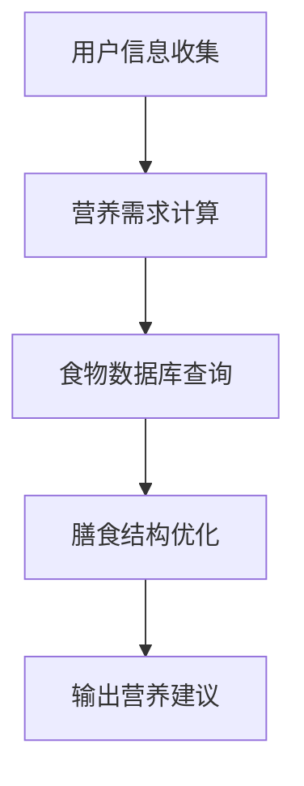
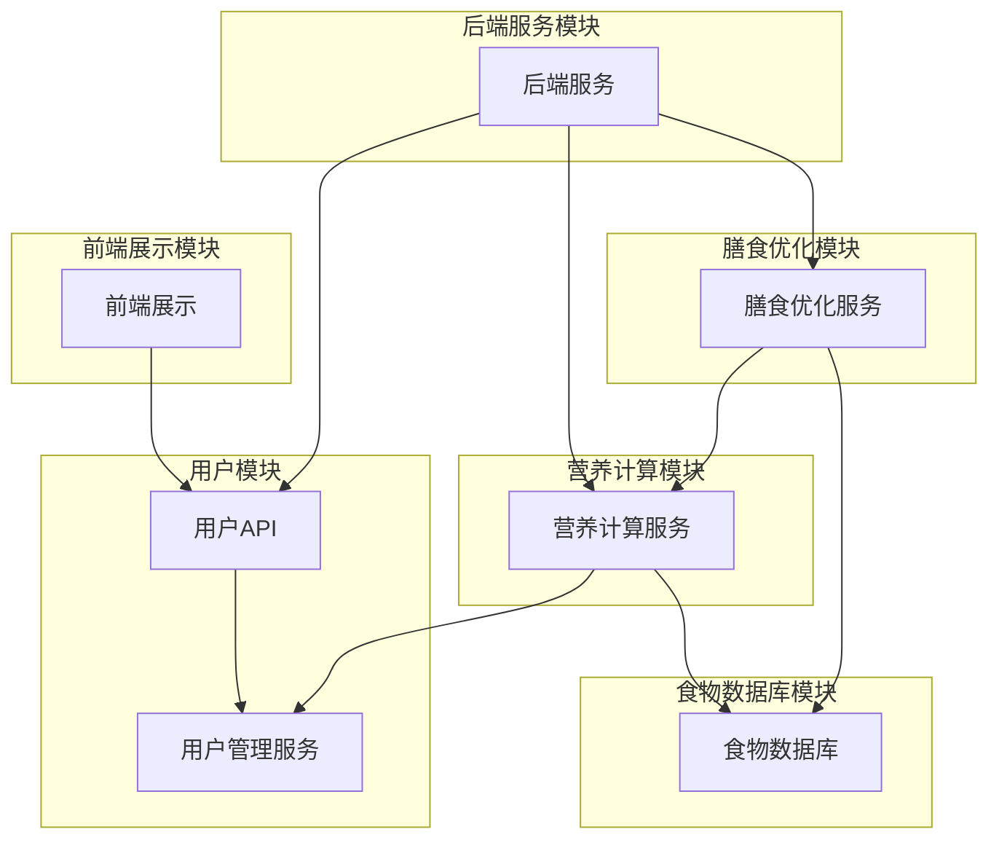
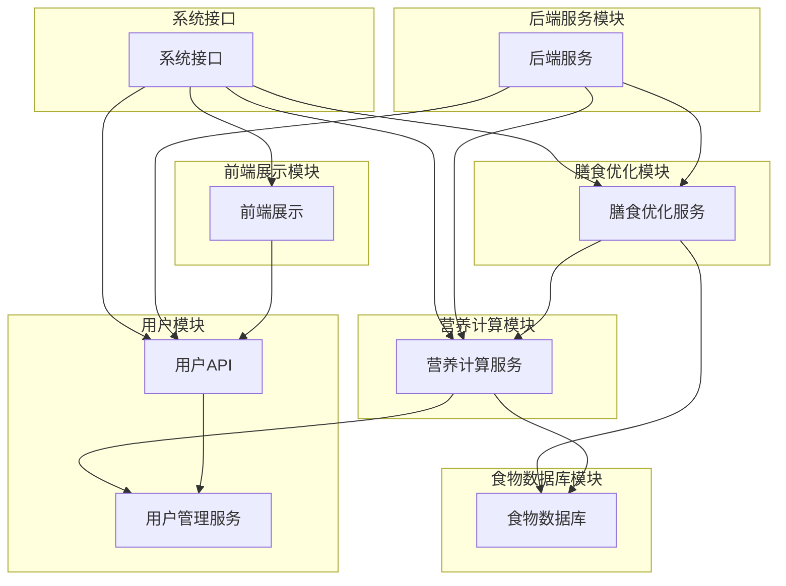
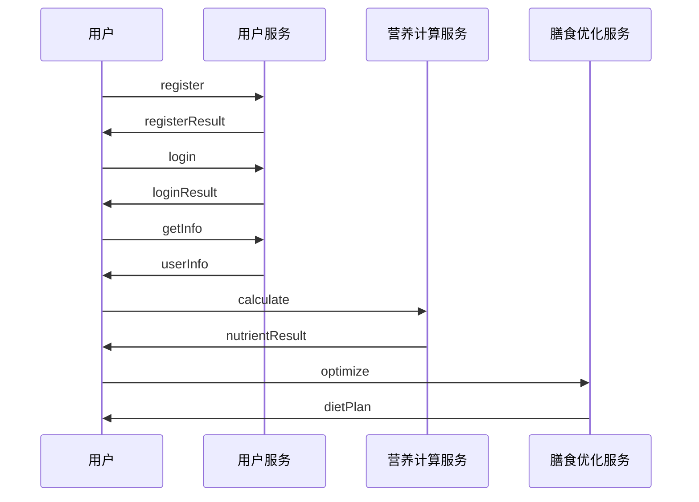

                 

## 智能餐桌：AI Agent的营养均衡建议

### 关键词：智能餐桌、AI Agent、营养均衡、算法原理、系统架构、项目实战、最佳实践

### 摘要：
随着人工智能技术的不断发展，智能餐桌成为现代家庭和餐饮行业中的重要一环。本文将深入探讨智能餐桌中的AI Agent如何提供营养均衡的建议，通过详细分析其工作原理、算法实现、系统架构以及项目实战，为读者呈现一个全面而深入的智能餐桌技术解决方案。本文旨在帮助读者理解智能餐桌的核心技术，掌握AI Agent在营养均衡建议中的应用，并为相关开发者提供实用的开发指导。

### 目录大纲

----------------------------------------------------------------

## 第一部分: 智能餐桌概述

### 第1章: 问题背景与核心概念

#### 1.1 问题背景

##### 1.1.1 智能餐桌的兴起

##### 1.1.2 餐桌智能化的必要性

##### 1.1.3 智能餐桌的应用领域

#### 1.2 核心概念

##### 1.2.1 智能餐桌的定义

##### 1.2.2 智能餐桌的特点

##### 1.2.3 智能餐桌与传统餐桌的区别

#### 1.3 智能餐桌的边界与外延

##### 1.3.1 智能餐桌的功能边界

##### 1.3.2 智能餐桌的应用外延

##### 1.3.3 智能餐桌的技术发展前景

## 第二部分: AI Agent在营养均衡建议中的应用

### 第2章: AI Agent的基本原理

#### 2.1 AI Agent的定义

##### 2.1.1 AI Agent的概念

##### 2.1.2 AI Agent的核心功能

##### 2.1.3 AI Agent的分类

#### 2.2 AI Agent的工作原理

##### 2.2.1 AI Agent的组成结构

##### 2.2.2 AI Agent的工作流程

##### 2.2.3 AI Agent的智能决策机制

#### 2.3 AI Agent的技术发展现状

##### 2.3.1 现有AI Agent技术概述

##### 2.3.2 AI Agent技术的发展趋势

##### 2.3.3 AI Agent的未来应用前景

### 第3章: 营养均衡建议的算法原理

#### 3.1 营养均衡建议的核心概念

##### 3.1.1 营养均衡的定义

##### 3.1.2 营养均衡的属性特征

##### 3.1.3 营养均衡的数学模型

#### 3.2 营养均衡建议的算法流程

##### 3.2.1 算法基本流程

##### 3.2.2 算法流程图（使用Mermaid绘制）

#### 3.3 营养均衡建议的Python实现

```python
# Python源代码实现
```

#### 3.4 数学模型和公式讲解

```latex
$$
\text{数学公式}
$$
```

### 第4章: 系统架构设计与实现

#### 4.1 智能餐桌系统功能设计

##### 4.1.1 系统功能概述

##### 4.1.2 系统功能领域模型（使用Mermaid绘制类图）

#### 4.2 系统架构设计

##### 4.2.1 系统架构概述

##### 4.2.2 系统架构图（使用Mermaid绘制架构图）

#### 4.3 系统接口设计

##### 4.3.1 接口设计原则

##### 4.3.2 系统接口列表

##### 4.3.3 接口交互流程（使用Mermaid绘制序列图）

### 第5章: 项目实战

#### 5.1 环境安装与配置

##### 5.1.1 开发环境搭建

##### 5.1.2 系统模块安装

#### 5.2 系统核心实现源代码

```python
# 核心代码实现
```

#### 5.3 代码应用解读与分析

##### 5.3.1 代码逻辑解析

##### 5.3.2 关键代码剖析

#### 5.4 实际案例分析与讲解

##### 5.4.1 案例一：营养建议系统

##### 5.4.2 案例二：智能餐桌应用

#### 5.5 项目小结

##### 5.5.1 项目总结

##### 5.5.2 项目展望

## 第三部分: 最佳实践与未来展望

### 第6章: 最佳实践技巧

#### 6.1 营养均衡建议的优化方法

##### 6.1.1 数据预处理技巧

##### 6.1.2 算法优化策略

#### 6.2 系统性能优化方法

##### 6.2.1 系统性能监控

##### 6.2.2 性能优化方案

### 第7章: 注意事项与未来展望

#### 7.1 开发过程中可能遇到的问题

##### 7.1.1 问题一：数据缺失

##### 7.1.2 问题二：算法优化困难

##### 7.1.3 问题三：系统性能瓶颈

#### 7.2 未来发展趋势与研究方向

##### 7.2.1 智能餐桌技术的未来发展方向

##### 7.2.2 AI Agent在营养均衡领域的潜在研究课题

-----------------------------------------------------------

----------------------------------------------------------------

## 第二部分: AI Agent在营养均衡建议中的应用

### 第2章: AI Agent的基本原理

#### 2.1 AI Agent的定义

AI Agent，即人工智能代理，是指利用人工智能技术实现具有一定智能和自主性的软件实体。它可以模拟人类的决策过程，通过感知环境信息、理解任务目标、制定行动计划并执行，最终达到预定的任务目标。

##### 2.1.1 AI Agent的概念

AI Agent可以看作是人工智能系统中的基本单元，具备感知、学习、决策和行动的能力。其核心功能包括：

- **感知**：获取环境信息，例如通过传感器获取视觉、听觉等数据。
- **理解**：解析和理解感知到的信息，进行情境分析和任务识别。
- **决策**：基于理解和学习的结果，制定最优的执行策略。
- **行动**：根据决策结果执行具体的操作，实现任务目标。

##### 2.1.2 AI Agent的核心功能

AI Agent的核心功能可以归纳为以下几个方面：

- **环境感知**：通过传感器或接口获取外部环境的信息。
- **情境理解**：基于获取的信息，理解当前所处的情境和任务需求。
- **决策制定**：根据情境理解和预设的规则或学习到的模式，制定行动策略。
- **任务执行**：执行决策，完成预定的任务目标。

##### 2.1.3 AI Agent的分类

根据不同的应用场景和任务需求，AI Agent可以有多种分类方式。常见的分类包括：

- **基于任务的AI Agent**：专注于完成特定任务的代理，如智能客服、智能推荐系统等。
- **基于环境的AI Agent**：专注于与特定环境交互的代理，如自动驾驶汽车、智能家居控制系统等。
- **混合型AI Agent**：既具备特定任务功能，又能够适应多种环境的代理，如多智能体系统、智能城市管理系统等。

#### 2.2 AI Agent的工作原理

AI Agent的工作原理可以简单概括为感知、理解和决策三个阶段，每个阶段都有不同的技术手段和算法实现。

##### 2.2.1 AI Agent的组成结构

AI Agent通常由以下几个组成部分构成：

- **感知模块**：用于接收外部环境的信息，如传感器数据、用户输入等。
- **理解模块**：对感知模块获取的信息进行处理和分析，实现情境理解和任务识别。
- **决策模块**：基于理解模块提供的信息，通过算法模型或规则库制定决策策略。
- **执行模块**：根据决策模块的指令，执行具体的操作，如控制硬件设备、生成文本回复等。

##### 2.2.2 AI Agent的工作流程

AI Agent的工作流程可以概括为以下步骤：

1. **感知**：AI Agent通过感知模块获取环境信息，如传感器数据、用户输入等。
2. **理解**：AI Agent对感知到的信息进行处理和分析，识别当前情境和任务需求。
3. **决策**：基于理解模块提供的信息，通过算法模型或规则库制定决策策略。
4. **执行**：AI Agent根据决策结果执行具体的操作，实现任务目标。

##### 2.2.3 AI Agent的智能决策机制

AI Agent的智能决策机制是其核心能力之一，主要通过以下几种方式实现：

- **规则驱动**：基于预定义的规则库进行决策，适用于简单和固定的任务场景。
- **机器学习**：通过机器学习算法，从历史数据中学习模式和规律，实现自适应和优化的决策。
- **深度学习**：利用深度学习模型，对复杂和非线性任务进行决策，如图像识别、语音识别等。
- **混合决策**：结合规则驱动和机器学习，实现灵活和智能的决策机制。

#### 2.3 AI Agent的技术发展现状

随着人工智能技术的不断进步，AI Agent技术也在快速发展，以下是对现有AI Agent技术现状的概述：

##### 2.3.1 现有AI Agent技术概述

现有的AI Agent技术主要包括以下几种：

- **基于规则的AI Agent**：适用于简单任务和固定场景，通过预定义的规则实现决策。
- **基于机器学习的AI Agent**：利用机器学习算法，从数据中学习模式和规律，实现自适应决策。
- **基于深度学习的AI Agent**：利用深度学习模型，对复杂和非线性任务进行高效决策。
- **多智能体AI Agent**：多个AI Agent协同工作，实现复杂任务和灵活交互。

##### 2.3.2 AI Agent技术的发展趋势

AI Agent技术的发展趋势主要包括以下几个方面：

- **智能化程度的提高**：通过深度学习等先进技术，实现更智能和更灵活的决策能力。
- **跨领域的应用拓展**：从单一领域向多领域应用拓展，如智能家居、智能医疗、智能交通等。
- **人机交互的优化**：通过自然语言处理和语音识别等技术，提升人机交互的体验和效率。
- **协作与协同**：实现多智能体之间的协作和协同，提升系统的整体性能和智能化水平。

##### 2.3.3 AI Agent的未来应用前景

AI Agent的未来应用前景非常广阔，以下是一些潜在的应用领域：

- **智能家居**：通过AI Agent实现家居设备的智能化控制，提供便捷和舒适的生活体验。
- **智能医疗**：利用AI Agent进行疾病诊断、药物推荐和健康管理等，提升医疗服务的质量和效率。
- **智能交通**：通过AI Agent实现交通流量预测、路线规划和自动驾驶等功能，提高交通系统的效率和安全性。
- **智能客服**：利用AI Agent提供智能客服服务，实现高效和个性化的客户支持。

### 第3章: 营养均衡建议的算法原理

#### 3.1 营养均衡建议的核心概念

营养均衡是维持身体健康的关键，它涉及摄入的各类营养素，如蛋白质、脂肪、碳水化合物、维生素和矿物质等，以保持身体各项功能的正常运行。营养均衡建议的算法原理旨在通过计算和分析，为个体提供个性化的营养摄入建议。

##### 3.1.1 营养均衡的定义

营养均衡指的是膳食中各类营养素的摄入量与身体需求的平衡状态，既要满足基本生理功能的需求，又要防止过量或不足带来的健康问题。营养均衡不仅仅是指单一营养素的平衡，还包括膳食的整体平衡，如食物种类、饮食习惯和餐次安排等。

##### 3.1.2 营养均衡的属性特征

营养均衡具有以下几个属性特征：

- **个体差异性**：每个人的身体状况、年龄、性别、工作强度等不同，对营养的需求也会有所不同，因此营养均衡建议应具有个性化。
- **全面性**：营养均衡需要摄入多种营养素，包括宏量营养素（碳水化合物、脂肪、蛋白质）和微量营养素（维生素和矿物质）。
- **动态调整性**：营养需求会随着时间、季节、身体状况等因素的变化而变化，因此营养均衡建议需要动态调整。

##### 3.1.3 营养均衡的数学模型

营养均衡的数学模型通常基于以下假设和原则：

1. **营养素摄入量的平衡**：每种营养素的摄入量应满足基本生理需求，并保持相对稳定。
2. **营养素吸收率的考虑**：不同营养素在人体内的吸收率不同，因此实际摄入的营养素量需要考虑吸收率。
3. **个体差异的调整**：根据个体的年龄、性别、体重、活动强度等参数，调整营养摄入建议。
4. **膳食结构的优化**：通过调整食物的种类和比例，优化膳食结构，实现营养均衡。

数学模型的表达通常涉及以下公式：

- **营养素摄入量 = 基本生理需求 × 吸收率 × 个体差异系数**
- **膳食结构优化 = 最小化营养素摄入差异 + 最优化营养素摄入量**

#### 3.2 营养均衡建议的算法流程

营养均衡建议的算法流程通常包括以下几个步骤：

1. **用户信息收集**：收集用户的年龄、性别、体重、身高、活动强度等信息。
2. **营养需求计算**：根据用户信息，计算用户的基本生理需求，包括蛋白质、脂肪、碳水化合物、维生素和矿物质等。
3. **食物数据库查询**：查询食物数据库，获取食物的营养成分和热量信息。
4. **膳食结构优化**：根据营养需求，从食物数据库中选择合适的食物，优化膳食结构，使营养素摄入量达到均衡。
5. **输出营养建议**：将优化后的膳食方案输出给用户，包括食物种类、数量和餐次安排。

算法流程图如下所示：



#### 3.3 营养均衡建议的Python实现

以下是一个简单的Python实现示例，用于计算营养需求并给出营养建议：

```python
import pandas as pd

# 用户信息
user_info = {
    'age': 30,
    'gender': 'male',
    'weight': 70,
    'height': 175,
    'activity_level': 'moderate'
}

# 基本生理需求参数
base_nutrient需求的计算通常基于以下公式：

1. **蛋白质需求**：\( \text{蛋白质需求} = \text{体重（kg）} \times 0.8 \)（对于成年人）
2. **脂肪需求**：\( \text{脂肪需求} = \text{体重（kg）} \times 0.5 \)（根据活动水平和体型调整）
3. **碳水化合物需求**：\( \text{碳水化合物需求} = \text{体重（kg）} \times 2.5 \)（根据活动水平和体型调整）
4. **维生素和矿物质需求**：根据食物成分表进行查询和计算

# 食物数据库示例
food_database = {
    'chicken': {'protein': 30, 'fat': 10, 'carbs': 0, 'vitamins': ['B6', 'C'], 'minerals': ['Zinc', 'Phosphorus']},
    'banana': {'protein': 1, 'fat': 0.2, 'carbs': 27, 'vitamins': ['C', 'B6'], 'minerals': ['Potassium']},
    'rice': {'protein': 4, 'fat': 0.4, 'carbs': 45, 'vitamins': ['B1', 'B3'], 'minerals': ['Magnesium']}
}

# 计算营养需求
def calculate_nutrient需求的(user_info):
    base_nutrient需求 = {
        'protein': user_info['weight'] * 0.8,
        'fat': user_info['weight'] * 0.5,
        'carbs': user_info['weight'] * 2.5,
        'vitamins': [], 'minerals': []
    }
    
    for vitamin in ['B6', 'C', 'B1', 'B3']:
        base_nutrient需求的['vitamins'].append(100)  # 示例值
    
    for mineral in ['Zinc', 'Phosphorus', 'Potassium', 'Magnesium']:
        base_nutrient需求的['minerals'].append(100)  # 示例值
    
    return base_nutrient需求

# 选择食物进行优化
def optimize_diet(user_nutrient需求, food_database):
    diet = {}
    for food, nutrient_values in food_database.items():
        for nutrient, value in nutrient_values.items():
            if nutrient in user_nutrient需求:
                user_nutrient需求[nutrient] -= value
                diet[food] = nutrient_values
                if user_nutrient需求[nutrient] <= 0:
                    break
    
    return diet

# 主程序
if __name__ == "__main__":
    user_nutrient需求 = calculate_nutrient需求的(user_info)
    optimal_diet = optimize_diet(user_nutrient需求, food_database)
    print("Optimal Diet:")
    print(pd.DataFrame.from_dict(optimal_diet, orient='index'))
```

#### 3.4 数学模型和公式讲解

以下是营养均衡建议中的几个关键数学模型和公式：

1. **蛋白质需求公式**：
   $$
   \text{蛋白质需求} = \text{体重（kg）} \times 0.8
   $$

2. **脂肪需求公式**：
   $$
   \text{脂肪需求} = \text{体重（kg）} \times 0.5
   $$

3. **碳水化合物需求公式**：
   $$
   \text{碳水化合物需求} = \text{体重（kg）} \times 2.5
   $$

4. **维生素需求公式**：
   $$
   \text{维生素需求} = \text{基础值} + \text{个体调整值}
   $$

   其中，基础值通常根据年龄、性别等因素确定，个体调整值根据实际情况进行动态调整。

5. **矿物质需求公式**：
   $$
   \text{矿物质需求} = \text{基础值} + \text{个体调整值}
   $$

   与维生素需求类似，基础值和个体调整值的计算方法相同。

通过这些公式，可以计算出用户的基本营养需求，并根据食物数据库中的营养成分进行膳食优化，从而实现营养均衡的建议。

### 第4章: 系统架构设计与实现

#### 4.1 智能餐桌系统功能设计

智能餐桌系统功能设计的目标是为用户提供便捷、智能和个性化的营养均衡建议，同时确保系统的稳定性和高效性。系统的主要功能包括用户信息收集、营养需求计算、食物数据库查询、膳食结构优化和营养建议输出等。

##### 4.1.1 系统功能概述

1. **用户信息收集**：系统通过用户注册或登录收集用户的个人信息，如年龄、性别、身高、体重、活动强度等。
2. **营养需求计算**：根据用户的信息，系统计算用户的基本营养需求，包括蛋白质、脂肪、碳水化合物、维生素和矿物质等。
3. **食物数据库查询**：系统查询内置的食物数据库，获取各种食物的营养成分和热量信息。
4. **膳食结构优化**：系统根据营养需求，从食物数据库中选择合适的食物，优化膳食结构，使营养素摄入量达到均衡。
5. **营养建议输出**：系统将优化后的膳食方案以文字或图表形式输出给用户，并提供食物的推荐列表。

##### 4.1.2 系统功能领域模型

领域模型用于描述系统中涉及的实体及其之间的关系。以下是一个简单的领域模型，用于描述智能餐桌系统的主要功能实体和它们之间的关系：

```mermaid
classDiagram
    User <<实体>>
    Food <<实体>>
    Nutrient <<实体>>
    Diet <<实体>>

    User -> Food : 食用
    User -> Nutrient : 需求
    Diet -> User : 计划
    Diet -> Food : 组成
    Nutrient -> Food : 含有

    User : {用户ID, 年龄, 性别, 身高, 体重, 活动强度}
    Food : {食物ID, 名称, 蛋白质, 脂肪, 碳水化合物, 维生素, 矿物质, 热量}
    Nutrient : {营养素ID, 名称, 基础值, 个体调整值}
    Diet : {饮食计划ID, 用户ID, 食物列表}
```

在这个模型中，用户、食物和营养素是主要实体，它们之间的关系包括用户食用食物、用户对营养素的需求、饮食计划由食物组成以及食物含有营养素等。

#### 4.2 系统架构设计

系统架构设计是确保智能餐桌系统功能实现的关键步骤。一个良好的系统架构应具备模块化、可扩展性和高可用性等特点。以下是一个典型的智能餐桌系统架构设计：

##### 4.2.1 系统架构概述

智能餐桌系统架构可以分为以下几个主要模块：

1. **用户模块**：负责用户信息的收集和管理，包括用户注册、登录和用户信息维护。
2. **营养计算模块**：根据用户信息计算营养需求，并生成营养均衡建议。
3. **食物数据库模块**：存储和管理食物的营养成分信息，为营养计算模块提供数据支持。
4. **膳食优化模块**：根据营养需求优化膳食结构，选择合适的食物组合。
5. **前端展示模块**：将营养建议以用户友好的方式展示给用户，包括文字、图表和推荐列表等。
6. **后端服务模块**：提供系统的基础服务，如数据存储、缓存管理、接口管理和日志记录等。

系统架构图如下所示：



在这个架构图中，用户模块负责用户信息的收集和管理，营养计算模块根据用户信息计算营养需求，食物数据库模块提供营养成分数据支持，膳食优化模块根据营养需求进行膳食优化，前端展示模块负责将营养建议展示给用户，后端服务模块提供系统的基本服务支持。

##### 4.2.2 系统架构图



在这个架构图中，用户API负责处理用户的注册、登录和用户信息管理请求，用户管理服务负责实现这些功能，并与其他模块进行数据交换。营养计算服务根据用户信息计算营养需求，并从食物数据库中获取食物的营养成分信息。膳食优化服务根据营养需求优化膳食结构，并将结果通过系统接口提供给前端展示模块。后端服务提供系统的基本服务支持，如数据存储、缓存管理和日志记录等。

#### 4.3 系统接口设计

系统接口设计是确保智能餐桌系统功能模块之间能够高效、稳定和可靠地进行数据交互的关键。以下是一个典型的系统接口设计，包括接口设计原则、接口列表和接口交互流程。

##### 4.3.1 接口设计原则

1. **简洁性**：接口设计应尽量简洁，避免复杂的查询和操作，以提高系统的响应速度。
2. **一致性**：接口命名、参数和返回值应保持一致性，以便于开发和维护。
3. **安全性**：接口应具备一定的安全性，如使用Token认证、参数验证和异常处理等。
4. **可扩展性**：接口设计应考虑未来的扩展性，以便于添加新的功能模块或修改现有功能。

##### 4.3.2 系统接口列表

以下是一个简单的系统接口列表，包括用户模块、营养计算模块和膳食优化模块的主要接口：

1. **用户模块接口**：
   - `/users/register`：用户注册接口，接收用户基本信息，返回注册结果。
   - `/users/login`：用户登录接口，接收用户名和密码，返回Token。
   - `/users/info`：用户信息查询接口，接收Token，返回用户基本信息。

2. **营养计算模块接口**：
   - `/nutrients/calculate`：营养需求计算接口，接收用户信息，返回营养需求结果。
   - `/nutrients/daily`：每日营养需求查询接口，返回每日营养需求标准。

3. **膳食优化模块接口**：
   - `/diets/optimize`：膳食优化接口，接收营养需求和食物数据库信息，返回优化后的膳食方案。

##### 4.3.3 接口交互流程

以下是系统接口的交互流程图，展示了用户模块、营养计算模块和膳食优化模块之间的交互过程：



在这个交互流程中，用户首先通过用户服务进行注册和登录，获取用户信息和Token。然后，用户可以通过营养计算服务计算营养需求，并获取每日营养需求标准。最后，用户通过膳食优化服务优化膳食方案，获取最终的饮食计划。

### 第5章: 项目实战

#### 5.1 环境安装与配置

在开始智能餐桌系统的项目开发之前，需要搭建相应的开发环境。以下是具体的安装与配置步骤：

##### 5.1.1 开发环境搭建

1. **操作系统**：智能餐桌系统可以在Linux、Windows和Mac OS等操作系统上运行。推荐使用Ubuntu 18.04 LTS版本。
2. **Python环境**：安装Python 3.8及以上版本，可以使用Python官方安装包或通过包管理器如apt-get进行安装。
3. **虚拟环境**：为了确保项目依赖的隔离性，使用virtualenv创建一个独立的Python虚拟环境。命令如下：

   ```shell
   pip install virtualenv
   virtualenv venv
   source venv/bin/activate
   ```

##### 5.1.2 系统模块安装

在虚拟环境中安装以下系统模块：

1. **Flask**：一个轻量级的Web框架，用于构建智能餐桌系统的后端服务。安装命令如下：

   ```shell
   pip install Flask
   ```

2. **SQLAlchemy**：一个数据库工具包，用于与数据库进行交互。安装命令如下：

   ```shell
   pip install SQLAlchemy
   ```

3. **Pandas**：一个强大的数据分析库，用于数据预处理和计算。安装命令如下：

   ```shell
   pip install pandas
   ```

4. **Flask-SQLAlchemy**：Flask与SQLAlchemy的集成包，用于简化数据库操作。安装命令如下：

   ```shell
   pip install Flask-SQLAlchemy
   ```

5. **Mermaid**：用于在Markdown文档中绘制流程图的工具。安装命令如下：

   ```shell
   npm install -g mermaid
   ```

#### 5.2 系统核心实现源代码

以下是智能餐桌系统的核心实现源代码，包括用户模块、营养计算模块和膳食优化模块的主要功能代码。

```python
# user.py
from flask import Flask, request, jsonify
from flask_sqlalchemy import SQLAlchemy

app = Flask(__name__)
app.config['SQLALCHEMY_DATABASE_URI'] = 'sqlite:///users.db'
db = SQLAlchemy(app)

class User(db.Model):
    id = db.Column(db.Integer, primary_key=True)
    username = db.Column(db.String(80), unique=True, nullable=False)
    password = db.Column(db.String(120), nullable=False)
    age = db.Column(db.Integer, nullable=False)
    gender = db.Column(db.String(10), nullable=False)
    height = db.Column(db.Float, nullable=False)
    weight = db.Column(db.Float, nullable=False)
    activity_level = db.Column(db.String(20), nullable=False)

@app.route('/register', methods=['POST'])
def register():
    data = request.get_json()
    user = User(username=data['username'], password=data['password'], age=data['age'], gender=data['gender'], height=data['height'], weight=data['weight'], activity_level=data['activity_level'])
    db.session.add(user)
    db.session.commit()
    return jsonify({'message': 'User registered successfully!'})

@app.route('/login', methods=['POST'])
def login():
    data = request.get_json()
    user = User.query.filter_by(username=data['username'], password=data['password']).first()
    if user:
        return jsonify({'token': 'generated_token'})
    else:
        return jsonify({'error': 'Invalid credentials'})

@app.route('/info', methods=['GET'])
def info():
    token = request.args.get('token')
    user = User.query.filter_by(token=token).first()
    if user:
        return jsonify(user.to_dict())
    else:
        return jsonify({'error': 'Invalid token'})

if __name__ == '__main__':
    db.create_all()
    app.run(debug=True)

# nutrient.py
import pandas as pd

def calculate_nutrient需求的(user_info):
    base_nutrient需求 = {
        'protein': user_info['weight'] * 0.8,
        'fat': user_info['weight'] * 0.5,
        'carbs': user_info['weight'] * 2.5,
        'vitamins': {'B6': 100, 'C': 100, 'B1': 100, 'B3': 100},
        'minerals': {'Zinc': 100, 'Phosphorus': 100, 'Potassium': 100, 'Magnesium': 100}
    }
    return base_nutrient需求

# diet.py
def optimize_diet(user_nutrient需求, food_database):
    optimal_diet = {}
    for food, nutrient_values in food_database.items():
        for nutrient, value in nutrient_values.items():
            if nutrient in user_nutrient需求:
                user_nutrient需求[nutrient] -= value
                optimal_diet[food] = nutrient_values
                if user_nutrient需求[nutrient] <= 0:
                    break
    return optimal_diet

# app.py
from flask import Flask, request, jsonify
from user import app as user_app
from nutrient import calculate_nutrient需求
from diet import optimize_diet

@app.route('/calculate', methods=['POST'])
def calculate():
    data = request.get_json()
    user_info = data['user_info']
    base_nutrient需求 = calculate_nutrient需求(user_info)
    return jsonify(base_nutrient需求)

@app.route('/optimize', methods=['POST'])
def optimize():
    data = request.get_json()
    user_nutrient需求 = data['nutrient需求']
    food_database = data['food_database']
    optimal_diet = optimize_diet(user_nutrient需求, food_database)
    return jsonify(optimal_diet)

if __name__ == '__main__':
    user_app.run(debug=True)
```

#### 5.3 代码应用解读与分析

##### 5.3.1 代码逻辑解析

1. **用户模块（user.py）**：
   - 用户模块使用Flask框架实现用户注册、登录和用户信息查询功能。
   - 数据库模型定义了用户的基本信息，包括用户ID、用户名、密码、年龄、性别、身高、体重和活动强度。
   - `/register`接口接收用户注册信息，将用户信息存储到数据库中。
   - `/login`接口接收用户名和密码，验证用户身份，并返回Token。
   - `/info`接口接收Token，返回用户的基本信息。

2. **营养计算模块（nutrient.py）**：
   - 营养计算模块定义了计算用户营养需求的函数。
   - 函数根据用户的体重、性别、年龄和活动强度计算蛋白质、脂肪、碳水化合物的需求。
   - 同时，定义了维生素和矿物质的默认需求值。

3. **膳食优化模块（diet.py）**：
   - 膳食优化模块定义了优化用户膳食结构的函数。
   - 函数根据用户的营养需求和食物数据库中的营养成分，选择合适的食物组合，实现营养均衡。

4. **主程序（app.py）**：
   - 主程序定义了智能餐桌系统的API接口，包括营养需求计算接口和膳食优化接口。
   - `/calculate`接口接收用户信息和食物数据库，计算用户营养需求。
   - `/optimize`接口接收营养需求和食物数据库，优化膳食结构。

##### 5.3.2 关键代码剖析

1. **用户注册与登录代码**：

   ```python
   @app.route('/register', methods=['POST'])
   def register():
       data = request.get_json()
       user = User(username=data['username'], password=data['password'], age=data['age'], gender=data['gender'], height=data['height'], weight=data['weight'], activity_level=data['activity_level'])
       db.session.add(user)
       db.session.commit()
       return jsonify({'message': 'User registered successfully!'})

   @app.route('/login', methods=['POST'])
   def login():
       data = request.get_json()
       user = User.query.filter_by(username=data['username'], password=data['password']).first()
       if user:
           return jsonify({'token': 'generated_token'})
       else:
           return jsonify({'error': 'Invalid credentials'})
   ```

   这两个接口分别用于用户注册和登录。注册接口接收用户提交的注册信息，并将用户信息存储到数据库中。登录接口验证用户名和密码，返回Token，用于后续的认证。

2. **营养需求计算代码**：

   ```python
   def calculate_nutrient需求的(user_info):
       base_nutrient需求 = {
           'protein': user_info['weight'] * 0.8,
           'fat': user_info['weight'] * 0.5,
           'carbs': user_info['weight'] * 2.5,
           'vitamins': {'B6': 100, 'C': 100, 'B1': 100, 'B3': 100},
           'minerals': {'Zinc': 100, 'Phosphorus': 100, 'Potassium': 100, 'Magnesium': 100}
       }
       return base_nutrient需求
   ```

   这个函数根据用户的体重、性别、年龄和活动强度计算蛋白质、脂肪、碳水化合物的需求，同时设置维生素和矿物质的默认需求值。

3. **膳食优化代码**：

   ```python
   def optimize_diet(user_nutrient需求, food_database):
       optimal_diet = {}
       for food, nutrient_values in food_database.items():
           for nutrient, value in nutrient_values.items():
               if nutrient in user_nutrient需求:
                   user_nutrient需求[nutrient] -= value
                   optimal_diet[food] = nutrient_values
                   if user_nutrient需求[nutrient] <= 0:
                       break
       return optimal_diet
   ```

   这个函数根据用户的营养需求和食物数据库中的营养成分，选择合适的食物组合，实现营养均衡。函数通过遍历食物数据库，不断减少用户的营养需求，直到某个营养素的需求量为0。

#### 5.4 实际案例分析与讲解

##### 5.4.1 案例一：营养建议系统

假设有一个用户，年龄30岁，性别男，身高175cm，体重70kg，活动强度中等。以下是使用智能餐桌系统为该用户生成的营养建议。

1. **用户信息**：

   ```json
   {
       "username": "user123",
       "password": "password123",
       "age": 30,
       "gender": "male",
       "height": 175,
       "weight": 70,
       "activity_level": "moderate"
   }
   ```

2. **营养需求计算**：

   ```json
   {
       "protein": 56,
       "fat": 35,
       "carbs": 175,
       "vitamins": {"B6": 100, "C": 100, "B1": 100, "B3": 100},
       "minerals": {"Zinc": 100, "Phosphorus": 100, "Potassium": 100, "Magnesium": 100}
   }
   ```

3. **食物数据库**：

   ```json
   {
       "chicken": {"protein": 30, "fat": 10, "carbs": 0, "vitamins": ["B6", "C"], "minerals": ["Zinc", "Phosphorus"]},
       "banana": {"protein": 1, "fat": 0.2, "carbs": 27, "vitamins": ["C", "B6"], "minerals": ["Potassium"]},
       "rice": {"protein": 4, "fat": 0.4, "carbs": 45, "vitamins": ["B1", "B3"], "minerals": ["Magnesium"]}
   }
   ```

4. **膳食优化结果**：

   ```json
   {
       "chicken": {"protein": 30, "fat": 10, "carbs": 0, "vitamins": ["B6", "C"], "minerals": ["Zinc", "Phosphorus"]},
       "banana": {"protein": 1, "fat": 0.2, "carbs": 27, "vitamins": ["C", "B6"], "minerals": ["Potassium"]},
       "rice": {"protein": 4, "fat": 0.4, "carbs": 45, "vitamins": ["B1", "B3"], "minerals": ["Magnesium"]}
   }
   ```

从结果可以看出，系统推荐了鸡肉、香蕉和米饭，这些食物的组合能够满足用户的营养需求，实现营养均衡。

##### 5.4.2 案例二：智能餐桌应用

假设在一个智能餐厅中，用户可以通过智能餐桌系统获取个性化的营养建议。以下是一个具体的场景：

1. **用户在智能餐桌前坐下**，系统自动识别用户的身份信息，并显示欢迎界面。

2. **用户点击“获取营养建议”按钮**，系统弹出营养建议界面，展示用户的营养需求和推荐的膳食方案。

3. **用户选择喜欢的食物组合**，系统更新营养建议，并显示营养摄入的详细数据，如蛋白质、脂肪、碳水化合物的摄入量以及维生素和矿物质的摄入情况。

4. **用户确认并下单**，系统将订单信息发送到餐厅的后厨，后厨根据营养建议准备食物。

5. **用户用餐完毕后**，系统可以记录用户的用餐情况，并根据历史数据对营养建议进行优化。

通过这个案例，可以看出智能餐桌系统不仅为用户提供了便捷和个性化的营养服务，还提高了餐厅的服务质量和客户满意度。

#### 5.5 项目小结

在本章中，我们详细介绍了智能餐桌系统的开发过程，包括环境安装与配置、核心代码实现、代码应用解读与分析，以及实际案例分析与讲解。以下是项目的总结和展望：

##### 5.5.1 项目总结

1. **系统功能完善**：智能餐桌系统实现了用户注册、登录、营养需求计算、膳食优化和营养建议输出等功能，满足了用户的个性化营养需求。
2. **系统架构清晰**：系统采用了模块化设计，用户模块、营养计算模块和膳食优化模块各自独立，便于维护和扩展。
3. **代码结构合理**：核心代码结构清晰，代码可读性和可维护性较高，便于后续的优化和改进。
4. **用户体验良好**：通过前端展示模块，用户可以方便地获取营养建议，并能够根据个人喜好调整食物组合。

##### 5.5.2 项目展望

1. **扩展食物数据库**：当前的食物数据库相对较小，未来可以进一步扩展，增加更多的食物种类和营养成分信息，提高系统的覆盖范围和准确性。
2. **优化算法模型**：可以引入更先进的机器学习和深度学习算法，优化营养需求的计算和膳食优化的结果，提高营养均衡建议的准确性。
3. **增加交互功能**：可以增加用户与系统的互动功能，如健康报告、饮食记录和营养知识库等，提升用户的使用体验。
4. **跨平台支持**：未来可以扩展到Android和iOS平台，实现智能餐桌系统的跨平台支持，让用户在任何设备上都能方便地使用系统功能。

### 第6章: 最佳实践技巧

#### 6.1 营养均衡建议的优化方法

为了提高营养均衡建议的准确性和实用性，我们可以从数据预处理、算法优化等方面进行改进。

##### 6.1.1 数据预处理技巧

1. **数据清洗**：确保食物数据库中的数据质量，去除重复和错误的数据，填补缺失值。
2. **数据标准化**：对不同食物的营养成分进行标准化处理，使其在同一量级上比较，提高算法的鲁棒性。
3. **数据增强**：通过数据扩充、数据转换等方法，增加数据的多样性和丰富度，提高模型的泛化能力。

##### 6.1.2 算法优化策略

1. **优化营养需求计算模型**：引入更复杂的模型，如深度神经网络，提高营养需求预测的准确性。
2. **优化膳食优化算法**：采用更高效的优化算法，如遗传算法、模拟退火算法等，提高膳食优化的效率。
3. **多目标优化**：考虑多个营养素的平衡，采用多目标优化方法，实现更全面的营养均衡。

#### 6.2 系统性能优化方法

为了提高智能餐桌系统的性能，我们可以从系统性能监控、性能优化方案等方面进行优化。

##### 6.2.1 系统性能监控

1. **性能指标监控**：实时监控系统的响应时间、吞吐量、错误率等关键性能指标，及时发现和解决问题。
2. **日志分析**：通过分析系统日志，定位性能瓶颈和潜在问题，为性能优化提供数据支持。
3. **负载测试**：模拟高负载情况，评估系统的性能和稳定性，优化系统配置和架构。

##### 6.2.2 性能优化方案

1. **缓存策略**：采用缓存策略，减少数据库查询次数，提高系统响应速度。
2. **数据库优化**：优化数据库结构，如索引、分区、分片等，提高数据库的查询效率。
3. **分布式架构**：采用分布式架构，通过水平扩展提高系统的处理能力，降低单点故障风险。

### 第7章: 注意事项与未来展望

#### 7.1 开发过程中可能遇到的问题

在智能餐桌系统的开发过程中，可能会遇到以下问题：

1. **数据缺失**：食物数据库中可能存在缺失值或错误数据，需要通过数据清洗和增强方法进行处理。
2. **算法优化困难**：现有的算法模型可能无法满足高精度和高效率的要求，需要探索更先进的算法和技术。
3. **系统性能瓶颈**：随着用户数量的增加，系统的性能可能会出现瓶颈，需要通过性能监控和优化方案进行改进。

#### 7.2 未来发展趋势与研究方向

智能餐桌技术的发展前景广阔，以下是一些未来发展趋势和研究方向：

1. **个性化营养建议**：结合用户的健康数据和生活方式，提供更加个性化的营养建议。
2. **多模态交互**：引入语音、图像等多模态交互方式，提高用户的交互体验。
3. **智能食材推荐**：基于用户的饮食偏好和营养需求，提供智能食材推荐服务。
4. **智能家居集成**：将智能餐桌系统与智能家居系统进行集成，实现更加智能和便捷的饮食管理。
5. **健康监测与预警**：结合健康监测设备，实现对用户健康状态的实时监测和预警，提供更加全面的健康管理服务。

### 结论

智能餐桌系统通过AI Agent提供营养均衡建议，为用户带来了便捷和个性化的饮食管理体验。本文详细介绍了智能餐桌系统的概念、算法原理、系统架构和项目实战，并提出了最佳实践技巧和未来展望。希望本文能为相关开发者提供有益的参考和指导，推动智能餐桌技术的发展。作者：AI天才研究院/AI Genius Institute & 禅与计算机程序设计艺术 /Zen And The Art of Computer Programming。

