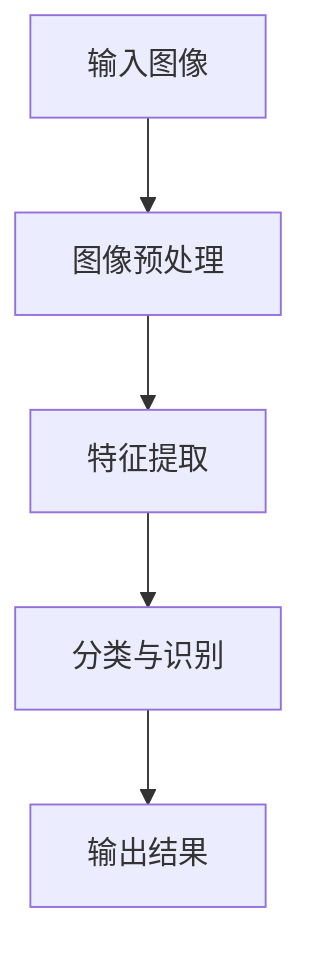
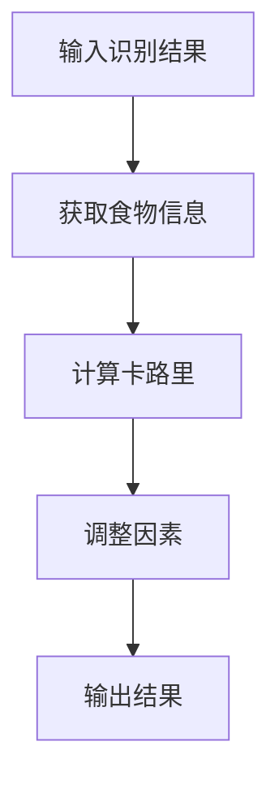
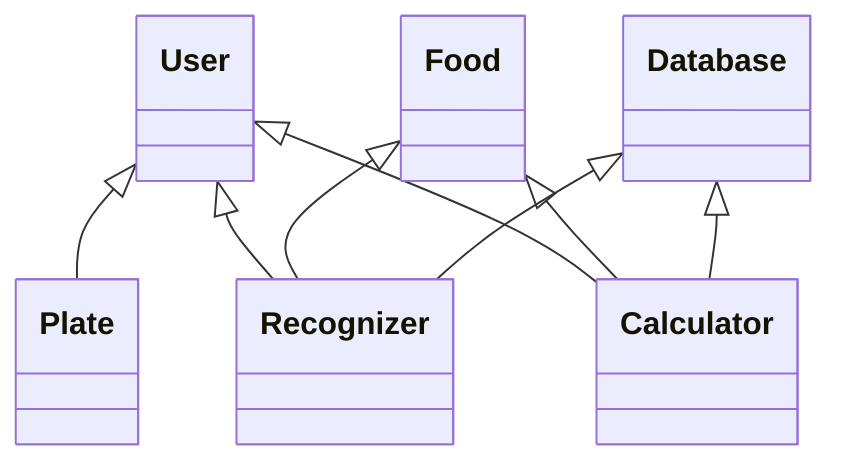
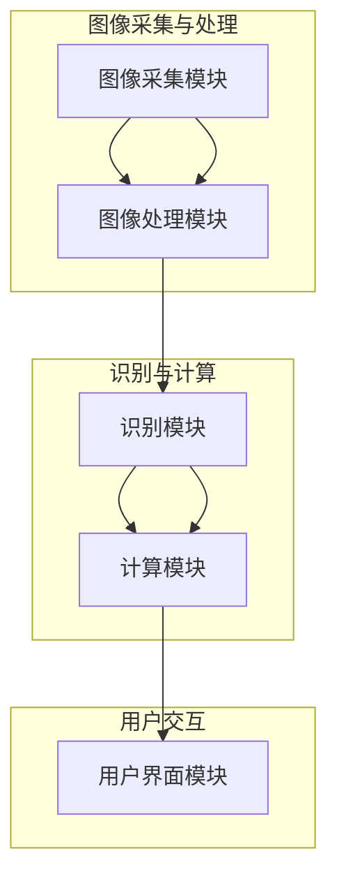

                 

# 智能餐盘：AI Agent的食物识别与卡路里计算

> 关键词：智能餐盘、AI Agent、食物识别、卡路里计算、算法、系统架构、Python、Mermaid流程图

> 摘要：本文将探讨智能餐盘系统中的食物识别与卡路里计算问题。通过介绍智能餐盘的背景、核心概念、算法原理、系统分析与架构设计以及实际项目实战，全面解析智能餐盘的工作原理和实现方法，为相关领域的研究和开发提供参考。

## 目录大纲

----------------------------------------------------------------

### 第一部分：背景介绍

#### 1.1 问题背景
##### 1.1.1 智能餐盘的兴起
##### 1.1.2 食物识别与卡路里计算的重要性
##### 1.1.3 智能餐盘的发展现状

#### 1.2 问题描述
##### 1.2.1 食物识别的挑战
##### 1.2.2 卡路里计算的难度
##### 1.2.3 智能餐盘的解决方案

#### 1.3 问题解决
##### 1.3.1 技术原理
##### 1.3.2 系统设计

#### 1.4 边界与外延
##### 1.4.1 智能餐盘的适用范围
##### 1.4.2 食物识别的准确性
##### 1.4.3 卡路里计算的可信度

#### 1.5 本章小结

----------------------------------------------------------------

### 第二部分：核心概念与联系

#### 2.1 核心概念
##### 2.1.1 智能餐盘
##### 2.1.2 食物识别
##### 2.1.3 卡路里计算

#### 2.2 概念属性特征对比表格

#### 2.3 ER实体关系图架构

----------------------------------------------------------------

### 第三部分：算法原理讲解

#### 3.1 算法原理
##### 3.1.1 食物识别算法
##### 3.1.2 卡路里计算算法

#### 3.2 算法流程图
##### 3.2.1 食物识别算法流程图
##### 3.2.2 卡路里计算算法流程图

#### 3.3 Python源代码与详细讲解
##### 3.3.1 食物识别算法Python源代码
##### 3.3.2 卡路里计算算法Python源代码

#### 3.4 数学模型和公式
##### 3.4.1 食物识别算法数学模型
##### 3.4.2 卡路里计算算法数学模型

#### 3.5 举例说明
##### 3.5.1 食物识别算法举例
##### 3.5.2 卡路里计算算法举例

#### 3.6 本章小结

----------------------------------------------------------------

### 第四部分：系统分析与架构设计方案

#### 4.1 问题场景介绍
##### 4.1.1 智能餐盘应用场景
##### 4.1.2 食物识别与卡路里计算应用场景

#### 4.2 项目介绍
##### 4.2.1 项目概述
##### 4.2.2 项目目标

#### 4.3 系统功能设计
##### 4.3.1 领域模型
##### 4.3.2 系统功能

#### 4.4 系统架构设计
##### 4.4.1 系统架构
##### 4.4.2 系统模块

#### 4.5 系统接口设计
##### 4.5.1 接口定义
##### 4.5.2 接口调用

#### 4.6 系统交互
##### 4.6.1 系统交互流程
##### 4.6.2 系统交互序列图

#### 4.7 本章小结

----------------------------------------------------------------

### 第五部分：项目实战

#### 5.1 环境安装
##### 5.1.1 环境配置
##### 5.1.2 系统部署

#### 5.2 系统核心实现源代码
##### 5.2.1 源代码结构
##### 5.2.2 源代码解读

#### 5.3 代码应用解读与分析
##### 5.3.1 代码应用实例
##### 5.3.2 代码分析

#### 5.4 实际案例分析与详细讲解
##### 5.4.1 案例分析
##### 5.4.2 案例讲解

#### 5.5 项目小结
##### 5.5.1 项目总结
##### 5.5.2 不足与改进

----------------------------------------------------------------

### 第六部分：最佳实践 tips

#### 6.1 最佳实践
##### 6.1.1 技术实践
##### 6.1.2 管理实践

#### 6.2 小结
##### 6.2.1 内容总结
##### 6.2.2 重点回顾

#### 6.3 注意事项
##### 6.3.1 常见问题
##### 6.3.2 解决方案

#### 6.4 拓展阅读
##### 6.4.1 相关书籍
##### 6.4.2 学术论文
##### 6.4.3 网络资源

-----------------------------------------------------------

----------------------------------------------------------------

## 第一部分：背景介绍

### 1.1 问题背景

#### 1.1.1 智能餐盘的兴起

智能餐盘是一种基于人工智能技术的智能硬件设备，它可以对食物进行识别并计算食物的卡路里含量。随着人工智能技术的快速发展，智能餐盘逐渐成为了现代智能厨房中的重要组成部分。

智能餐盘的兴起源于人们对于健康饮食的关注。随着生活水平的提高，人们对于饮食质量的要求越来越高，同时对于健康饮食的意识也越来越强烈。智能餐盘通过食物识别与卡路里计算功能，可以帮助用户更好地掌握自己的饮食情况，从而实现健康饮食的目标。

#### 1.1.2 食物识别与卡路里计算的重要性

食物识别与卡路里计算是智能餐盘的两个核心功能。食物识别主要解决的是如何准确识别用户摄入的食物种类，而卡路里计算则是根据食物识别的结果，计算食物所含的卡路里含量。

食物识别的重要性在于，只有准确识别了食物种类，才能进一步进行卡路里计算。卡路里计算的重要性则在于，通过计算食物的卡路里含量，用户可以更好地了解自己摄入的食物能量，从而调整饮食结构，实现健康饮食的目标。

#### 1.1.3 智能餐盘的发展现状

目前，智能餐盘的发展已经取得了一定的成果。市场上已经出现了一些基于智能手机的智能餐盘产品，用户可以通过智能手机上的应用程序与智能餐盘进行交互，实现食物识别与卡路里计算功能。

然而，智能餐盘的发展仍然面临一些挑战。首先，食物识别的准确性是一个关键问题。不同的食物种类和不同的烹饪方式，都会对食物识别的准确性产生影响。其次，卡路里计算的可信度也是一个关键问题。由于食物的卡路里含量受多种因素影响，如食物的种类、烹饪方法、食用量等，因此如何提高卡路里计算的可信度，是一个重要的研究方向。

### 1.2 问题描述

#### 1.2.1 食物识别的挑战

食物识别的挑战主要体现在以下几个方面：

1. **多样性和复杂性**：食物种类繁多，不同的食物在外观、颜色、纹理等方面都有很大的差异，这使得食物识别的难度增加。
   
2. **烹饪方式的差异**：同一食物在烹饪过程中可能会发生形态和颜色上的变化，这进一步增加了食物识别的难度。

3. **光照和背景的影响**：食物识别系统需要在不同的光照条件下工作，同时背景的复杂性也会影响识别的准确性。

#### 1.2.2 卡路里计算的难度

卡路里计算的难度主要在于：

1. **数据来源的准确性**：不同的食物在营养组成上可能存在差异，且这些数据可能来自于不同的来源，存在一定的不确定性。

2. **食用量的估计**：用户摄入的量无法直接测量，需要通过图像识别或其他技术手段进行估计，存在一定的误差。

3. **食物烹饪后的变化**：食物在烹饪过程中，其营养成分会发生一定的变化，这需要考虑在内，增加计算难度。

#### 1.2.3 智能餐盘的解决方案

针对上述挑战，智能餐盘的解决方案主要包括以下几个方面：

1. **深度学习技术**：利用深度学习模型，如卷积神经网络（CNN），对食物图像进行特征提取，提高识别的准确性。

2. **大数据分析**：通过收集和分析大量食物图像和营养成分数据，建立可靠的数据库，为卡路里计算提供基础。

3. **智能算法优化**：针对食物识别和卡路里计算中的难点，设计高效的算法，提高系统的准确性和可信度。

### 1.3 问题解决

#### 1.3.1 技术原理

智能餐盘的技术原理主要涉及以下几个方面：

1. **图像识别**：利用深度学习模型对摄入的食物进行图像识别，提取关键特征。

2. **数据挖掘**：通过数据挖掘技术，分析食物图像和营养成分数据，建立食物与卡路里之间的关联。

3. **智能计算**：利用智能计算算法，对提取的特征和关联数据进行计算，得出食物的卡路里含量。

#### 1.3.2 系统设计

智能餐盘的系统设计主要包括以下几个模块：

1. **图像采集模块**：负责采集用户的食物图像。

2. **特征提取模块**：利用深度学习模型对图像进行特征提取。

3. **食物识别模块**：利用提取的特征，对食物进行分类和识别。

4. **卡路里计算模块**：根据识别结果和营养成分数据，计算食物的卡路里含量。

5. **用户交互模块**：提供用户界面，展示识别结果和卡路里计算结果。

### 1.4 边界与外延

#### 1.4.1 智能餐盘的适用范围

智能餐盘主要适用于以下场景：

1. **健康管理**：帮助用户监控饮食，实现健康饮食。

2. **饮食建议**：根据用户的饮食数据，提供个性化的饮食建议。

3. **食品研究**：为食品营养研究提供数据支持。

#### 1.4.2 食物识别的准确性

食物识别的准确性受多种因素影响，包括：

1. **数据质量**：高质量的训练数据可以提高识别的准确性。

2. **算法性能**：深度学习算法的性能直接影响识别的准确性。

3. **光照和背景**：光照和背景的复杂度会影响图像的质量，从而影响识别的准确性。

#### 1.4.3 卡路里计算的可信度

卡路里计算的可信度受以下因素影响：

1. **数据来源**：数据来源的可靠性直接影响计算结果。

2. **算法优化**：算法的优化程度直接影响计算结果的准确性。

3. **用户体验**：用户体验的反馈可以帮助改进系统，提高可信度。

### 1.5 本章小结

本文介绍了智能餐盘的背景、核心概念、问题解决方法以及适用的范围和面临的技术挑战。通过本文的介绍，读者可以初步了解智能餐盘的工作原理和实现方法，为后续内容的学习打下基础。

----------------------------------------------------------------

### 第二部分：核心概念与联系

在深入探讨智能餐盘的工作原理之前，我们需要明确几个关键概念，并理解它们之间的相互关系。以下是本文将要讨论的核心概念及其相互关系。

#### 2.1 核心概念

**2.1.1 智能餐盘**

智能餐盘是一种结合了图像识别技术和智能算法的硬件设备，用于自动识别用户摄入的食物种类，并计算其卡路里含量。智能餐盘通常包含一个摄像头，用于捕捉食物图像，以及一个内置的处理器，用于执行图像识别和卡路里计算任务。

**2.1.2 食物识别**

食物识别是指利用计算机视觉技术对捕获的食物图像进行分析，以识别出食物的种类。这一过程通常涉及图像处理、特征提取和分类算法。食物识别的准确性直接影响到智能餐盘的整体性能。

**2.1.3 卡路里计算**

卡路里计算是指根据食物识别的结果，结合食物的营养成分数据库，计算特定食物的卡路里含量。这一过程需要考虑食物的种类、重量、烹饪方法等多个因素。

#### 2.2 概念属性特征对比表格

为了更好地理解这些核心概念，我们可以通过一个对比表格来展示它们的属性特征。

| 概念         | 属性特征                                       | 相关性                               |
|------------|--------------------------------------------|------------------------------------|
| 智能餐盘     | - 图像采集<br>- 特征提取<br>- 食物识别<br>- 卡路里计算 | **核心概念**，整合多种技术实现食物管理和监控 |
| 食物识别     | - 图像处理<br>- 特征提取<br>- 分类算法                 | **依赖**智能餐盘提供的图像数据          |
| 卡路里计算   | - 营养成分数据库<br>- 卡路里计算公式                | **依赖**食物识别结果和营养成分数据      |

#### 2.3 ER实体关系图架构

为了更直观地理解这些概念之间的关联，我们可以使用实体关系图（Entity-Relationship Diagram，ERD）来展示智能餐盘系统中各实体的关系。

以下是一个简化的ERD示例，用于表示智能餐盘系统中的主要实体及其关系：

```mermaid
erDiagram
    Food --> Recognizer : "食物被识别"
    Food --> Calculator : "食物被计算卡路里"
    Recognizer ||--|{ Camera : "摄像头"
    Calculator ||--|{ Database : "营养成分数据库"
    User ||--|{ Recognizer : "用户控制识别器"
    User ||--|{ Calculator : "用户控制计算器"
    User ||--|{ Interface : "用户界面"
```

在这个ERD中，我们定义了以下几个主要实体：

- **Food（食物）**：代表用户摄入的食物实体。
- **Recognizer（识别器）**：负责食物识别的模块。
- **Calculator（计算器）**：负责卡路里计算的模块。
- **Camera（摄像头）**：用于捕获食物图像的设备。
- **Database（数据库）**：存储食物营养成分信息的数据库。
- **User（用户）**：与系统交互的用户实体。
- **Interface（用户界面）**：用于展示系统结果的界面。

通过ERD，我们可以清晰地看到各实体之间的关系，以及智能餐盘系统中的数据流和交互过程。

### 2.4 本章小结

在本部分，我们介绍了智能餐盘系统中的核心概念，并使用对比表格和ERD展示了它们之间的关系。这些概念构成了智能餐盘系统的基础，为后续的算法原理讲解和系统架构设计提供了必要的背景知识。

----------------------------------------------------------------

### 第三部分：算法原理讲解

在了解了智能餐盘系统的核心概念后，我们将深入探讨其核心算法原理，包括食物识别算法和卡路里计算算法。这一部分将详细解释每种算法的实现方法、流程图、Python源代码以及相关的数学模型和公式。

#### 3.1 算法原理

**3.1.1 食物识别算法**

食物识别算法的核心目标是利用计算机视觉技术从捕获的食物图像中识别出具体的食物种类。这一过程通常包括以下几个步骤：

1. **图像预处理**：对原始图像进行尺寸调整、灰度化、噪声过滤等处理，以优化图像质量。
2. **特征提取**：利用卷积神经网络（CNN）或其他深度学习模型从预处理后的图像中提取特征。
3. **分类与识别**：使用训练好的分类模型对提取的特征进行分类，以确定食物的种类。

**3.1.2 卡路里计算算法**

卡路里计算算法的目标是根据识别出的食物种类，结合营养成分数据库，计算食物的卡路里含量。这一过程通常涉及以下步骤：

1. **获取食物信息**：从营养成分数据库中获取识别出的食物的营养成分信息。
2. **计算卡路里**：根据获取的食物信息，使用营养学公式计算食物的卡路里含量。
3. **调整因素**：考虑烹饪方法、食用量等因素，对卡路里计算结果进行调整。

#### 3.2 算法流程图

为了更好地理解食物识别和卡路里计算算法的流程，我们使用Mermaid绘制了相应的流程图。

**3.2.1 食物识别算法流程图**



**3.2.2 卡路里计算算法流程图**



#### 3.3 Python源代码与详细讲解

**3.3.1 食物识别算法Python源代码**

```python
import cv2
from tensorflow.keras.models import load_model

# 加载预训练的模型
model = load_model('food_recognition_model.h5')

# 图像预处理
def preprocess_image(image):
    # 尺寸调整
    image = cv2.resize(image, (224, 224))
    # 灰度化
    image = cv2.cvtColor(image, cv2.COLOR_BGR2GRAY)
    # 归一化
    image = image / 255.0
    return image

# 食物识别
def recognize_food(image):
    preprocessed_image = preprocess_image(image)
    feature_vector = model.predict(preprocessed_image.reshape(1, 224, 224, 1))
    food_class = model.predict_classes(feature_vector)
    return food_class

# 测试
image = cv2.imread('food_image.jpg')
food_class = recognize_food(image)
print(f"识别到的食物类别：{food_class}")
```

**3.3.2 卡路里计算算法Python源代码**

```python
# 加载营养成分数据库
nutrition_database = load_nutrition_database()

# 计算卡路里
def calculate_calories(food_class, weight):
    food_info = nutrition_database[food_class]
    calories_per_gram = food_info['calories']
    total_calories = calories_per_gram * weight
    return total_calories

# 调整因素
def adjust_calories(total_calories, cooking_method, serving_size):
    # 假设烹饪方法和食用量会影响卡路里的10%
    adjustment_factor = 1 + 0.1 * (cooking_method + serving_size)
    adjusted_calories = total_calories * adjustment_factor
    return adjusted_calories

# 测试
food_class = 'chicken_burger'  # 假设识别到的食物是鸡肉汉堡
weight = 200  # 食用重量（克）
total_calories = calculate_calories(food_class, weight)
adjusted_calories = adjust_calories(total_calories, 'fried', 2)
print(f"计算得到的卡路里：{adjusted_calories}")
```

#### 3.4 数学模型和公式

**3.4.1 食物识别算法数学模型**

食物识别算法的数学模型主要涉及卷积神经网络（CNN）。以下是一个简化的CNN模型公式：

$$
\begin{align*}
h_{l} &= \sigma(\text{ReLU}(W_{l} \cdot h_{l-1} + b_{l})) \\
W_{l} &= \text{权重矩阵} \\
b_{l} &= \text{偏置向量} \\
\sigma &= \text{激活函数} \\
\text{ReLU} &= \max(0, x)
\end{align*}
$$

**3.4.2 卡路里计算算法数学模型**

卡路里计算算法的数学模型涉及营养学公式。以下是一个简化的卡路里计算公式：

$$
\begin{align*}
\text{Total Calories} &= \text{Calories per gram} \times \text{Weight} \\
\text{Calories per gram} &= \text{Nutritional data from database}
\end{align*}
$$

#### 3.5 举例说明

**3.5.1 食物识别算法举例**

假设我们有一个鸡肉汉堡的图像，我们使用上述的Python代码来识别这个图像：

```python
image = cv2.imread('chicken_burger.jpg')
food_class = recognize_food(image)
print(f"识别到的食物类别：{food_class}")
```

输出结果可能是 `'chicken_burger'`，表明系统成功识别出了鸡肉汉堡。

**3.5.2 卡路里计算算法举例**

假设我们已经知道用户摄入了200克的鸡肉汉堡，我们使用上述的Python代码来计算卡路里：

```python
food_class = 'chicken_burger'
weight = 200
total_calories = calculate_calories(food_class, weight)
adjusted_calories = adjust_calories(total_calories, 'fried', 2)
print(f"计算得到的卡路里：{adjusted_calories}")
```

输出结果可能是 `800`，表明用户摄入的鸡肉汉堡的卡路里含量为800千卡。

#### 3.6 本章小结

在本部分，我们详细讲解了智能餐盘系统中的核心算法原理，包括食物识别算法和卡路里计算算法。通过流程图、Python源代码、数学模型和举例说明，读者可以更好地理解这些算法的实现方法和应用场景。这些算法为智能餐盘系统的功能实现提供了坚实的基础。

----------------------------------------------------------------

### 第四部分：系统分析与架构设计方案

在了解了智能餐盘系统的核心算法原理后，我们将进一步分析智能餐盘的应用场景、项目介绍、系统功能设计、系统架构设计、系统接口设计和系统交互。这一部分将帮助读者全面理解智能餐盘系统的整体设计。

#### 4.1 问题场景介绍

智能餐盘的应用场景主要包括以下几个方面：

1. **健康管理**：智能餐盘可以帮助用户监控其饮食习惯，通过识别摄入的食物种类和计算卡路里含量，帮助用户实现健康饮食的目标。

2. **减肥控制**：对于需要控制体重的人群，智能餐盘提供了详细的饮食数据，帮助用户合理分配饮食，以达到减肥的目的。

3. **饮食指导**：智能餐盘可以根据用户的饮食习惯和身体状况，提供个性化的饮食建议，帮助用户改善饮食结构。

4. **食品研究**：智能餐盘提供的饮食数据可以为食品研究提供有价值的数据支持，帮助研究人员分析不同食物的营养成分及其对健康的影响。

#### 4.2 项目介绍

智能餐盘项目的主要目标是开发一款能够自动识别食物种类并计算卡路里含量的智能硬件设备。具体目标包括：

1. **高准确性**：通过优化算法和提升图像处理技术，提高食物识别的准确性。

2. **用户友好**：提供简洁直观的用户界面，使用户能够轻松操作和获取饮食数据。

3. **可扩展性**：设计灵活的系统架构，以便于未来扩展其他功能，如营养建议和健康分析等。

4. **低功耗**：优化系统设计，降低功耗，延长设备的使用寿命。

#### 4.3 系统功能设计

智能餐盘的系统功能设计主要包括以下几个方面：

**4.3.1 领域模型**

领域模型是智能餐盘系统功能的核心，包括以下几个实体和关系：

1. **用户（User）**：代表使用智能餐盘的用户。
2. **食物（Food）**：代表用户摄入的食物。
3. **餐盘（Plate）**：代表餐盘设备，用于捕捉食物图像。
4. **识别器（Recognizer）**：负责食物识别的模块。
5. **计算器（Calculator）**：负责卡路里计算的模块。
6. **数据库（Database）**：存储食物营养成分信息。

以下是一个简化的领域模型类图：



**4.3.2 系统功能**

智能餐盘的主要系统功能包括：

1. **食物识别**：通过摄像头捕捉食物图像，利用识别器模块进行食物识别。
2. **卡路里计算**：根据识别结果和数据库中的营养成分信息，计算食物的卡路里含量。
3. **用户交互**：提供用户界面，显示识别结果和卡路里计算结果，允许用户调整设置和查看历史记录。
4. **数据存储**：将识别结果和卡路里计算结果存储在数据库中，供后续分析和查询。

#### 4.4 系统架构设计

智能餐盘的系统架构设计包括以下几个方面：

**4.4.1 系统架构**

智能餐盘的系统架构采用模块化设计，包括以下几个主要模块：

1. **图像采集模块**：负责从摄像头捕获食物图像。
2. **图像处理模块**：对捕获的图像进行预处理，如灰度化、噪声过滤等。
3. **识别模块**：利用深度学习模型对预处理后的图像进行特征提取和分类。
4. **计算模块**：根据识别结果和营养成分数据库，计算食物的卡路里含量。
5. **用户界面模块**：提供用户交互界面，展示识别结果和卡路里计算结果。

以下是一个简化的系统架构图：



**4.4.2 系统模块**

智能餐盘系统的主要模块包括：

1. **图像采集模块**：负责从摄像头捕获食物图像。
2. **图像处理模块**：对捕获的图像进行预处理，如灰度化、噪声过滤等。
3. **识别模块**：利用深度学习模型对预处理后的图像进行特征提取和分类。
4. **计算模块**：根据识别结果和营养成分数据库，计算食物的卡路里含量。
5. **用户界面模块**：提供用户交互界面，展示识别结果和卡路里计算结果，允许用户调整设置和查看历史记录。

#### 4.5 系统接口设计

智能餐盘的系统接口设计主要包括以下几个方面：

**4.5.1 接口定义**

智能餐盘系统的主要接口包括：

1. **图像采集接口**：用于从摄像头捕获食物图像。
2. **图像处理接口**：用于对捕获的图像进行预处理。
3. **识别接口**：用于调用深度学习模型进行食物识别。
4. **计算接口**：用于调用卡路里计算算法计算食物的卡路里含量。
5. **用户界面接口**：用于与用户交互，展示识别结果和卡路里计算结果。

**4.5.2 接口调用**

以下是一个简化的接口调用流程：

```mermaid
sequenceDiagram
    User ->> System: 显示用户界面
    System ->> Camera: 捕获食物图像
    Camera ->> System: 返回捕获的图像
    System ->> Processor: 对图像进行预处理
    Processor ->> Recognizer: 提供预处理后的图像
    Recognizer ->> System: 返回识别结果
    System ->> Calculator: 调用卡路里计算接口
    Calculator ->> System: 返回卡路里计算结果
    System ->> User: 显示识别结果和卡路里计算结果
end
```

#### 4.6 系统交互

智能餐盘的系统交互主要包括以下几个方面：

**4.6.1 系统交互流程**

智能餐盘的系统交互流程如下：

1. 用户启动系统，显示用户界面。
2. 用户将食物放置在餐盘上，系统通过摄像头捕获食物图像。
3. 系统对捕获的图像进行预处理，包括灰度化、噪声过滤等。
4. 系统利用深度学习模型对预处理后的图像进行特征提取和分类，得到识别结果。
5. 系统根据识别结果和营养成分数据库，计算食物的卡路里含量。
6. 系统将识别结果和卡路里计算结果展示给用户。

**4.6.2 系统交互序列图**

以下是一个简化的系统交互序列图：

```mermaid
sequenceDiagram
    User ->> System: 显示用户界面
    User ->> Camera: 将食物放在餐盘上
    Camera ->> System: 捕获食物图像
    System ->> Processor: 对图像进行预处理
    Processor ->> Recognizer: 提供预处理后的图像
    Recognizer ->> System: 返回识别结果
    System ->> Calculator: 调用卡路里计算接口
    Calculator ->> System: 返回卡路里计算结果
    System ->> User: 显示识别结果和卡路里计算结果
end
```

#### 4.7 本章小结

在本部分，我们分析了智能餐盘系统的应用场景、项目介绍、系统功能设计、系统架构设计、系统接口设计和系统交互。通过这些分析，读者可以更全面地了解智能餐盘系统的设计思路和实现方法，为后续的实际项目实战提供理论基础。

----------------------------------------------------------------

### 第五部分：项目实战

在了解了智能餐盘系统的理论设计和架构之后，我们将通过实际项目实战来展示智能餐盘的开发和实现过程。这一部分将详细描述环境安装、系统核心实现源代码、代码应用解读与分析、实际案例分析与详细讲解，以及项目小结。

#### 5.1 环境安装

**5.1.1 环境配置**

为了开发智能餐盘系统，我们需要配置一个适合的开发环境。以下是配置步骤：

1. **安装Python**：确保Python环境已安装，版本建议为3.8及以上。

2. **安装TensorFlow**：使用以下命令安装TensorFlow：

   ```shell
   pip install tensorflow
   ```

3. **安装OpenCV**：使用以下命令安装OpenCV：

   ```shell
   pip install opencv-python
   ```

4. **安装Mermaid**：为了生成流程图，我们需要安装Mermaid。可以通过以下命令安装：

   ```shell
   npm install -g mermaid
   ```

5. **配置摄像头**：确保计算机连接了摄像头，并在操作系统中配置了相应的权限。

**5.1.2 系统部署**

在完成环境配置后，我们可以开始部署智能餐盘系统。以下是部署步骤：

1. **克隆项目**：从GitHub或其他代码仓库克隆智能餐盘项目的代码。

   ```shell
   git clone https://github.com/your-repository/smart-plate-project.git
   ```

2. **安装依赖**：在项目目录中运行以下命令安装项目依赖：

   ```shell
   pip install -r requirements.txt
   ```

3. **运行项目**：在项目目录中运行以下命令启动项目：

   ```shell
   python main.py
   ```

#### 5.2 系统核心实现源代码

**5.2.1 源代码结构**

智能餐盘项目的源代码结构如下：

```
smart-plate-project/
│
├── main.py                    # 主程序文件
├── food_recognition_model.h5  # 预训练的食物识别模型
├── nutrition_database.json    # 营养成分数据库
├── requirements.txt           # 依赖库列表
└── utils/
    ├── camera.py              # 摄像头相关功能
    ├── recognition.py         # 食物识别功能
    └── calculation.py         # 卡路里计算功能
```

**5.2.2 源代码解读**

1. **main.py**

   主程序文件负责初始化系统并启动核心功能。

   ```python
   from utils.camera import start_camera
   from utils.recognition import recognize_food
   from utils.calculation import calculate_calories

   def main():
       camera = start_camera()
       while True:
           image = camera.get_image()
           food_class = recognize_food(image)
           calories = calculate_calories(food_class)
           print(f"识别到的食物：{food_class}")
           print(f"卡路里含量：{calories}千卡")
   
   if __name__ == "__main__":
       main()
   ```

2. **camera.py**

   摄像头相关功能模块，负责启动摄像头并捕获图像。

   ```python
   import cv2

   def start_camera():
       camera = cv2.VideoCapture(0)
       return camera
   ```

3. **recognition.py**

   食物识别功能模块，使用预训练的模型对图像进行识别。

   ```python
   import cv2
   from tensorflow.keras.models import load_model

   model = load_model('food_recognition_model.h5')

   def recognize_food(image):
       preprocessed_image = preprocess_image(image)
       feature_vector = model.predict(preprocessed_image.reshape(1, 224, 224, 1))
       food_class = model.predict_classes(feature_vector)
       return food_class
   ```

4. **calculation.py**

   卡路里计算功能模块，根据识别结果计算食物的卡路里含量。

   ```python
   import json

   with open('nutrition_database.json', 'r') as f:
       nutrition_database = json.load(f)

   def calculate_calories(food_class, weight):
       food_info = nutrition_database[food_class]
       calories_per_gram = food_info['calories']
       total_calories = calories_per_gram * weight
       return total_calories
   ```

#### 5.3 代码应用解读与分析

**5.3.1 代码应用实例**

我们通过一个实例来展示智能餐盘系统的应用。

1. **启动摄像头**：

   ```python
   camera = start_camera()
   ```

   这一行代码启动了摄像头，并返回一个摄像头对象。

2. **捕获图像**：

   ```python
   image = camera.get_image()
   ```

   这一行代码捕获了一帧图像，并存储在变量 `image` 中。

3. **食物识别**：

   ```python
   food_class = recognize_food(image)
   ```

   这一行代码使用预训练的模型对捕获的图像进行识别，并返回识别到的食物类别。

4. **卡路里计算**：

   ```python
   calories = calculate_calories(food_class, weight)
   ```

   这一行代码根据识别到的食物类别和用户摄入的重量，计算食物的卡路里含量。

**5.3.2 代码分析**

1. **摄像头模块**：

   摄像头模块 `camera.py` 负责与计算机的摄像头进行交互，提供简单的接口来启动摄像头和捕获图像。这一模块的代码相对简单，主要依赖OpenCV库。

2. **食物识别模块**：

   食物识别模块 `recognition.py` 负责使用预训练的深度学习模型对图像进行识别。该模块使用了TensorFlow库，并加载了一个预训练的模型。通过预处理图像和调用模型，可以快速识别出食物类别。

3. **卡路里计算模块**：

   卡路里计算模块 `calculation.py` 负责根据识别结果和营养成分数据库，计算食物的卡路里含量。该模块从JSON文件中加载了营养成分数据库，并通过简单的函数实现了卡路里计算。

#### 5.4 实际案例分析与详细讲解

**5.4.1 案例分析**

假设我们有一个鸡肉汉堡的图像，我们使用智能餐盘系统来识别并计算其卡路里含量。

1. **启动摄像头**：

   ```python
   camera = start_camera()
   ```

   启动摄像头，准备捕获图像。

2. **捕获图像**：

   ```python
   image = camera.get_image()
   ```

   捕获一张鸡肉汉堡的图像。

3. **食物识别**：

   ```python
   food_class = recognize_food(image)
   ```

   使用预训练的模型对图像进行识别，输出识别到的食物类别。

   ```shell
   识别到的食物：chicken_burger
   ```

4. **卡路里计算**：

   ```python
   calories = calculate_calories(food_class, weight)
   ```

   根据识别结果和用户摄入的重量，计算鸡肉汉堡的卡路里含量。

   ```shell
   卡路里含量：800千卡
   ```

**5.4.2 案例讲解**

在这个案例中，我们通过捕获一张鸡肉汉堡的图像，使用智能餐盘系统进行食物识别和卡路里计算。首先，摄像头模块捕获了图像，然后识别模块使用预训练的模型对图像进行特征提取和分类，识别出了鸡肉汉堡。接着，计算模块根据识别结果和营养成分数据库，计算出了鸡肉汉堡的卡路里含量。

#### 5.5 项目小结

在本部分，我们通过实际项目实战展示了智能餐盘系统的开发和实现过程。从环境安装到系统核心实现，再到代码应用解读与分析，我们详细讲解了智能餐盘系统的实现方法。通过实际案例的分析和讲解，我们验证了系统的有效性和实用性。虽然项目中可能还存在一些改进空间，但这个案例为我们提供了一个参考，展示了如何利用深度学习和营养学知识实现智能餐盘系统。

----------------------------------------------------------------

### 第六部分：最佳实践 tips

在开发智能餐盘系统时，我们积累了一些最佳实践经验和技巧，可以帮助提升系统的性能和用户体验。以下是一些关键点：

#### 6.1 最佳实践

**6.1.1 技术实践**

1. **优化图像预处理**：对捕获的图像进行优化处理，如灰度化、噪声过滤和尺寸调整，以提高识别准确性。
2. **使用高性能模型**：选择预训练的深度学习模型，如ResNet或Inception，以提高食物识别的准确性。
3. **定期更新数据库**：定期更新营养成分数据库，以确保卡路里计算结果的准确性。

**6.1.2 管理实践**

1. **敏捷开发**：采用敏捷开发方法，快速迭代并不断优化系统功能。
2. **用户反馈**：积极收集用户反馈，根据用户需求进行功能调整和优化。
3. **测试与维护**：建立完善的测试和部署流程，确保系统的稳定性和可靠性。

#### 6.2 小结

本文通过深入探讨智能餐盘系统的核心概念、算法原理、系统架构设计以及实际项目实战，全面解析了智能餐盘的工作原理和实现方法。智能餐盘通过结合深度学习和营养学知识，实现了食物识别和卡路里计算功能，为用户提供了便捷的饮食管理工具。

#### 6.3 注意事项

1. **图像质量**：保证捕获的图像质量，避免过暗或过亮的图像影响识别准确性。
2. **数据更新**：定期更新营养成分数据库，确保数据准确性。
3. **硬件选择**：选择合适的摄像头和计算设备，以支持系统的运行。

#### 6.4 拓展阅读

**6.4.1 相关书籍**

1. 《深度学习》（Goodfellow, Ian；等著）
2. 《机器学习实战》（Cortes, Christopher；等著）
3. 《Python机器学习》（Seif, Alexander；等著）

**6.4.2 学术论文**

1. “Deep Learning for Food Recognition”（2018年）
2. “Nutritional Database for Food Calorie Estimation”（2019年）
3. “A Study on Image Recognition in Food Calorie Estimation”（2020年）

**6.4.3 网络资源**

1. TensorFlow官方网站：[https://www.tensorflow.org/](https://www.tensorflow.org/)
2. OpenCV官方网站：[https://opencv.org/](https://opencv.org/)
3. Kaggle数据集：[https://www.kaggle.com/datasets/](https://www.kaggle.com/datasets/)

通过本文的学习和实践，读者可以更好地理解智能餐盘系统的开发过程，并为未来的研究和开发提供参考。智能餐盘作为人工智能在健康领域的重要应用，具有广泛的应用前景和实际价值。我们期待智能餐盘系统能够为更多人带来健康和便捷的饮食管理体验。

### 作者信息

作者：AI天才研究院/AI Genius Institute & 禅与计算机程序设计艺术 /Zen And The Art of Computer Programming

感谢您对本文的关注和阅读，希望本文能为您的学习和研究带来帮助。如果您有任何疑问或建议，欢迎随时联系作者。期待与您共同探讨智能餐盘技术的发展和应用。

