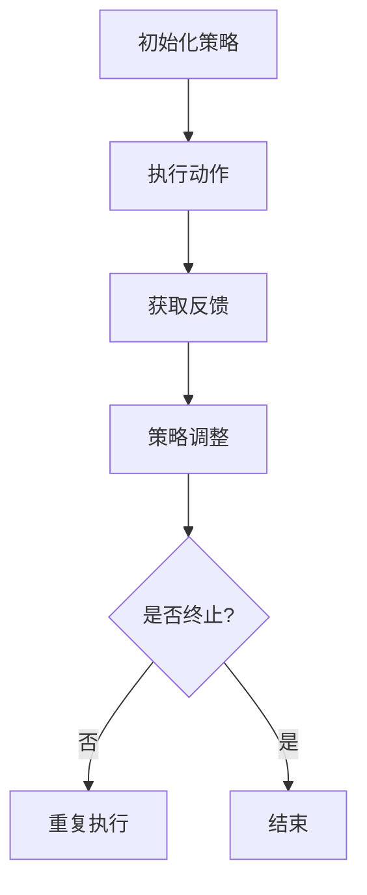
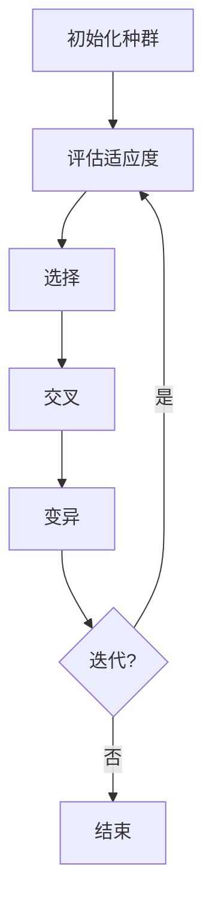
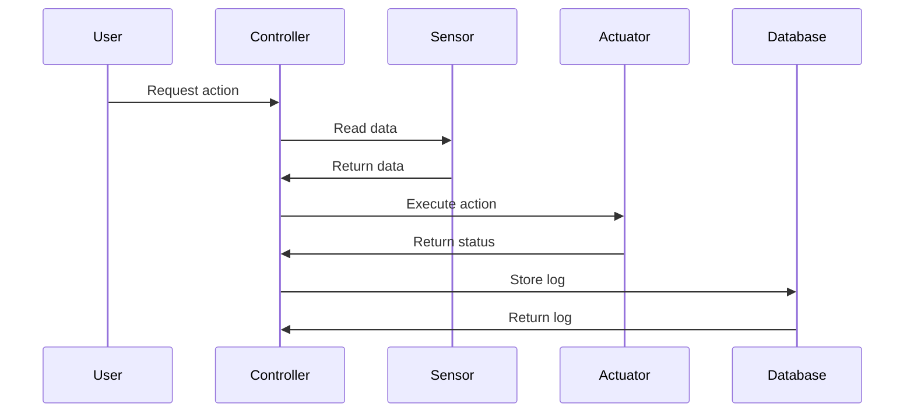

                 


### 写作思路和步骤

为了撰写一篇逻辑清晰、结构紧凑、简单易懂的专业技术博客文章《构建AI Agent常见挑战及解决方案》，我们可以遵循以下步骤：

#### 第一步：确定文章结构
首先，我们需要构建文章的总体结构。文章应包含以下几个主要部分：

1. **引言**：简要介绍AI Agent的概念、发展背景和文章的目的。
2. **核心概念与联系**：深入探讨AI Agent的核心组成部分，如感知、学习、推理等，并展示它们之间的相互关系。
3. **算法原理讲解**：详细介绍AI Agent常用的学习算法和推理机制，使用Mermaid绘制算法流程图，并用Python代码实现，解释数学模型和公式。
4. **系统分析与架构设计**：分析AI Agent系统的整体架构，包括功能设计、接口设计和交互设计。
5. **项目实战**：通过实际案例展示如何构建AI Agent，从环境安装到核心实现，再到代码分析。
6. **最佳实践、小结、注意事项和拓展阅读**：总结文章内容，给出实际操作建议，强调关键注意事项，并提供进一步学习的资源。

#### 第二步：撰写引言
在引言部分，我们可以先介绍AI Agent的基本概念，例如它是什么，它在人工智能中的地位和作用，以及为何构建AI Agent会面临挑战。

#### 第三步：核心概念与联系
接下来，我们需要深入讨论AI Agent的核心概念，包括：

- **感知**：AI Agent如何感知环境。
- **学习**：AI Agent如何通过数据或经验进行学习。
- **推理**：AI Agent如何基于感知和学习来进行决策。
- **交互**：AI Agent如何与其他系统或人类进行交互。

对于每个核心概念，我们可以通过Mermaid绘制ER实体关系图来展示各部分之间的关系。

#### 第四步：算法原理讲解
在算法原理讲解部分，我们可以选择几个典型的AI Agent算法进行详细分析，例如：

- **反复实验学习算法**：讲解其基本原理，绘制Mermaid流程图，使用Python代码实现，解释数学模型和公式，并通过示例进行说明。
- **演化算法**：类似地，讲解其基本原理，绘制流程图，使用Python代码实现，解释数学模型和公式，并通过示例进行说明。

#### 第五步：系统分析与架构设计
在这个部分，我们需要从整体上分析AI Agent系统的架构，包括：

- **系统功能设计**：绘制领域模型类图。
- **系统架构设计**：绘制系统架构图。
- **系统接口设计**：描述系统内部和外部组件的接口。
- **系统交互**：绘制系统交互序列图。

#### 第六步：项目实战
通过一个实际项目，展示如何从零开始构建一个AI Agent。包括：

- **环境安装**：介绍所需的环境和工具。
- **核心实现**：展示关键代码和实现过程。
- **代码分析**：解读和分析关键代码段。
- **实际案例**：展示AI Agent在实际场景中的应用。
- **项目小结**：总结项目成果和学习经验。

#### 第七步：最佳实践、小结、注意事项和拓展阅读
最后，我们可以总结文章的主要观点，提供一些最佳实践建议，提醒读者在构建AI Agent时需要注意的事项，并推荐一些拓展阅读资源。

### 写作技巧
- **清晰的语言**：使用简单易懂的技术语言，避免复杂术语和冗长的句子。
- **逻辑性**：确保文章的每个部分都紧密相连，逻辑连贯。
- **可视化**：使用图表、代码示例和流程图来辅助解释复杂概念。
- **实例说明**：通过实例来展示理论和实践的结合。

遵循这些步骤和技巧，我们可以撰写出一篇高质量、逻辑清晰、具有深度的技术博客文章。接下来，我们将根据这个框架逐步完成文章的撰写。让我们开始吧！### 引言

### Introduction

### 介绍AI Agent

人工智能（AI）作为计算机科学的前沿领域，正迅速改变着我们的生活和工作方式。在众多AI应用中，AI Agent（智能体）无疑是一个重要且引人注目的概念。AI Agent，通常被称为“智能代理”或“智能实体”，是能够自主行动并与其他实体交互的计算机程序。简单来说，AI Agent是一种能够模拟人类智能行为的系统，它可以在复杂的动态环境中进行决策和行动。

#### 基本概念

AI Agent的核心特征包括自主性、交互性、反应性和适应性。自主性指的是AI Agent能够独立做出决策，而无需人工干预。交互性意味着AI Agent能够与人类或其他系统进行有效沟通和协作。反应性指的是AI Agent能够对环境中的变化做出及时响应。适应性则表示AI Agent能够根据经验和学习不断优化其行为。

#### 发展背景

AI Agent的概念起源于20世纪70年代，当时研究人员开始探索如何让计算机程序具有类似人类的智能行为。随着计算能力的提升和算法的进步，AI Agent逐渐从理论走向实际应用。近年来，深度学习和强化学习等先进技术的出现，使得AI Agent在复杂任务中的表现愈发出色。例如，自动驾驶汽车、智能家居系统、虚拟助手等都是AI Agent应用的典型实例。

#### 文章目的

本文旨在深入探讨构建AI Agent过程中常见的一些挑战，并分析相应的解决方案。通过本文的阅读，读者可以了解：

1. **AI Agent的核心概念及其相互关系**。
2. **常见AI Agent算法的基本原理和实现**。
3. **AI Agent系统架构设计的要点**。
4. **实际项目中构建AI Agent的具体步骤和方法**。
5. **最佳实践和注意事项，以及进一步学习的资源推荐**。

随着AI技术的不断发展，AI Agent的应用前景十分广阔。然而，在实际开发过程中，构建一个高效、稳定、可靠的AI Agent并非易事。本文将帮助读者更好地理解这些挑战，并找到有效的解决方案，从而在AI领域取得更大的突破。

### 关键词

- **AI Agent**
- **智能代理**
- **自主性**
- **交互性**
- **反应性**
- **适应性**
- **深度学习**
- **强化学习**
- **系统架构**
- **算法实现**

### 摘要

本文将围绕构建AI Agent的常见挑战及其解决方案展开讨论。首先，我们将介绍AI Agent的基本概念和发展背景，探讨其核心组成部分和相互关系。接着，本文将详细分析常见的AI Agent算法，包括反复实验学习算法和演化算法，解释其基本原理，并通过Python代码实现和数学模型进行阐述。随后，我们将探讨AI Agent的系统架构设计，从功能设计、架构设计到接口设计和交互设计，全面分析系统的构建。通过一个实际项目案例，我们将展示如何从零开始构建一个AI Agent，详细讲解关键代码和实现过程。最后，本文将总结全文内容，提供最佳实践建议，强调注意事项，并推荐拓展阅读资源，帮助读者深入理解AI Agent的构建方法和应用前景。

### 第一部分：背景介绍

#### 第1章：AI Agent概述

### 1.1 AI Agent的概念

AI Agent，又称为智能代理或智能体，是能够自主行动并执行特定任务的计算实体。它模拟了人类的智能行为，能够在复杂、动态的环境中感知环境、学习、推理和做出决策。AI Agent的基本概念源自人工智能（AI）的研究，旨在实现自动化、智能化和自主化的系统。传统的AI系统通常需要大量的预设规则和指导，而AI Agent则通过自我学习和自适应能力，能够在不依赖人工干预的情况下完成任务。

#### 1.2 AI Agent的发展背景

AI Agent的概念起源于20世纪70年代，当时的研究者们开始探索如何让计算机程序具有类似人类的智能行为。早期的AI Agent研究主要集中在逻辑推理和规则系统上，例如普林斯顿大学的Edward Feigenbaum在1977年开发的专家系统Dendral。随着时间的发展，计算能力的提升和算法的进步，特别是深度学习和强化学习的兴起，AI Agent的研究和应用得到了显著的发展。现在，AI Agent已经在自动驾驶、智能家居、虚拟助手、机器人等多个领域得到了广泛应用。

#### 1.3 AI Agent的应用领域

AI Agent的应用领域非常广泛，涵盖了多个行业和场景。以下是几个典型的应用领域：

1. **自动驾驶**：AI Agent在自动驾驶车辆中扮演着关键角色，通过感知环境、规划路径和做出实时决策，实现自动驾驶功能。
2. **智能助手**：如Apple的Siri、Amazon的Alexa和Google的Google Assistant，这些虚拟助手利用AI Agent技术，提供语音交互、日程管理、信息查询等服务。
3. **机器人**：在工业自动化和医疗领域，AI Agent控制的机器人可以执行重复性高、危险或不适合人类操作的任务。
4. **智能家居**：通过AI Agent，家庭设备可以实现智能互联，自动调节温度、灯光、安全系统等，提供更加便捷和舒适的生活环境。
5. **金融**：在金融领域，AI Agent用于风险管理、交易决策和客户服务，提高运营效率和用户体验。

#### 1.4 需要解决的问题与挑战

尽管AI Agent在各个领域展现了巨大的潜力，但在构建和部署过程中仍然面临着一系列挑战：

1. **数据质量**：AI Agent的性能高度依赖于输入数据的质量。如果数据存在噪声、偏差或不完整，可能会导致模型性能下降。
2. **模型可解释性**：AI Agent的决策过程通常是基于复杂的机器学习模型，这些模型的可解释性较差，难以被非专业人士理解和信任。
3. **安全性和隐私**：AI Agent在处理敏感数据时，需要确保系统的安全性和用户隐私，防止数据泄露和滥用。
4. **泛化能力**：AI Agent需要在不同的环境和任务中表现出良好的泛化能力，避免过度依赖特定数据的训练结果。
5. **实时性能**：在动态环境中，AI Agent需要具备快速响应的能力，确保决策和行动的实时性。

了解这些挑战并找到有效的解决方案，是构建高效、稳定、可靠的AI Agent的关键。接下来的章节将详细探讨这些核心概念和相互关系，分析常见的算法原理，并提供系统架构设计的方案，帮助读者深入理解AI Agent的构建过程。

#### 1.5 AI Agent的核心组成部分

AI Agent的核心组成部分包括感知、学习、推理和交互。这些组件共同作用，使AI Agent能够在复杂环境中自主行动和决策。

1. **感知**：感知是指AI Agent获取并解释环境信息的过程。这通常通过传感器和数据采集技术实现，例如视觉、听觉、触觉等。感知能力是AI Agent与环境互动的基础，它决定了AI Agent对环境的理解和响应。

2. **学习**：学习是指AI Agent通过数据或经验改进自身性能的过程。AI Agent可以采用机器学习、深度学习和强化学习等技术来学习。学习能力使AI Agent能够从经验中获取知识，并在新的环境中做出更好的决策。

3. **推理**：推理是指AI Agent基于感知和学习结果进行逻辑推断和决策的过程。推理机制可以是基于规则的推理、基于概率的推理或基于神经网络的推理。推理能力使AI Agent能够根据现有信息预测未来事件或做出最佳决策。

4. **交互**：交互是指AI Agent与外部环境或其他系统进行通信和协作的过程。交互能力包括自然语言处理、语音识别、图像处理等技术。交互能力使AI Agent能够理解用户需求、提供信息支持或与其他系统进行集成。

这些组成部分相互依赖，共同决定了AI Agent的性能和效率。例如，感知能力决定了AI Agent对环境的理解和响应速度，而学习能力和推理能力则决定了AI Agent的决策质量和适应性。交互能力则使AI Agent能够在实际应用中发挥作用，提供实用价值。

#### 1.6 概念结构与核心要素组成

为了更清晰地理解AI Agent的概念结构，我们可以将其核心要素绘制成一个ER（实体-关系）图。ER图能够帮助我们展示AI Agent的各个组成部分以及它们之间的相互关系。

在ER图中，核心实体包括：

- **感知实体**：表示AI Agent的感知能力，包括各种传感器和数据采集设备。
- **学习实体**：表示AI Agent的学习能力，包括数据预处理、机器学习模型训练等过程。
- **推理实体**：表示AI Agent的推理能力，包括逻辑推理、决策树等推理机制。
- **交互实体**：表示AI Agent的交互能力，包括自然语言处理、语音识别、图像处理等交互技术。
- **行动实体**：表示AI Agent在理解环境和做出决策后执行的具体行动。

这些实体之间通过关系连接，例如：

- **感知实体**与**学习实体**之间存在数据传递关系，感知实体获取的数据会传递给学习实体进行进一步处理。
- **学习实体**与**推理实体**之间存在信息传递关系，学习实体训练出的模型和知识会被推理实体使用。
- **推理实体**与**行动实体**之间存在决策执行关系，推理实体做出的决策会被行动实体执行。
- **交互实体**与**行动实体**之间存在交互反馈关系，交互实体获取的用户输入或环境信息会影响行动实体的决策和行为。

通过ER图，我们可以更直观地理解AI Agent的概念结构和核心要素组成，这有助于我们深入分析AI Agent的构建过程和性能优化策略。

### 第二部分：核心概念与联系

#### 第2章：AI Agent的核心概念

AI Agent的核心概念是理解其运作机制的基础，这些概念包括感知、学习、推理和交互。通过深入探讨这些核心概念，我们可以更好地理解AI Agent的功能和性能。

#### 2.1 智能体（Agent）的基本原理

智能体（Agent）是人工智能领域中的一个基本概念，它代表了具有自主行动能力和自主感知能力的计算实体。智能体可以自主地选择和执行行动，以实现特定目标或任务。智能体的基本原理包括以下几个方面：

1. **自主性（Autonomy）**：智能体能够自主地做出决策和执行行动，而不需要人工干预。这种自主性来源于智能体内部的信息处理能力和决策算法。
2. **社交性（Sociality）**：智能体能够与其他智能体或人类进行交互和协作。这种社交性使智能体能够在复杂环境中进行有效的沟通和合作。
3. **反应性（Reactivity）**：智能体能够对环境中的变化做出实时响应。这种反应性使智能体能够适应动态变化的环境，并做出适当的反应。
4. **适应性（Adaptability）**：智能体能够通过学习和经验改进自身的行为和性能。这种适应性使智能体能够在不同环境和任务中表现出良好的性能。

#### 2.2 学习算法

学习算法是AI Agent的核心组成部分之一，它决定了智能体如何从数据中提取知识和经验，以改进其行为和决策。学习算法可以分为以下几类：

1. **监督学习（Supervised Learning）**：监督学习算法使用标记的数据集进行训练，目标是建立输入和输出之间的映射关系。常见的监督学习算法包括线性回归、决策树、支持向量机（SVM）和神经网络等。
2. **无监督学习（Unsupervised Learning）**：无监督学习算法在没有标记的数据集上进行训练，旨在发现数据中的隐含结构和模式。常见的无监督学习算法包括聚类、主成分分析（PCA）和自编码器等。
3. **强化学习（Reinforcement Learning）**：强化学习算法通过与环境的交互学习，目标是最大化累积奖励。智能体在环境中采取行动，根据行动的结果获得奖励或惩罚，并通过不断调整策略来优化长期回报。常见的强化学习算法包括Q学习、SARSA和深度强化学习（Deep RL）等。

#### 2.3 推理机制

推理机制是智能体在感知和学习的基础上进行决策和行动的重要工具。推理机制可以分为以下几类：

1. **基于规则的推理（Rule-Based Reasoning）**：基于规则的推理使用一组预设的规则来处理信息和做出决策。这些规则通常由专家手动编写，适用于规则明确、静态的环境。
2. **基于模型的推理（Model-Based Reasoning）**：基于模型的推理使用内部模型来模拟和预测环境中的状态变化，并基于模型进行决策。这种推理方式适用于复杂和动态的环境，能够处理不确定性。
3. **基于知识的推理（Knowledge-Based Reasoning）**：基于知识的推理使用已有知识和事实进行推理和决策。这些知识可以是结构化的规则、事实或数据，可以存储在知识库中。

#### 2.4 感知与交互能力

感知和交互能力是智能体与环境互动的重要手段。感知能力使智能体能够获取环境信息，而交互能力使智能体能够理解和影响环境。

1. **感知能力**：感知能力包括视觉、听觉、触觉等多种感知方式。视觉感知通常通过摄像头或图像处理技术实现，听觉感知通过麦克风和语音识别技术实现，触觉感知则通过传感器和力反馈装置实现。
2. **交互能力**：交互能力包括自然语言处理、语音识别、图像处理等多种交互方式。智能体可以通过语音、文字或手势与人类或其他智能体进行交互，实现信息交换和协作。

通过上述核心概念，我们可以更全面地理解AI Agent的运作机制。这些概念相互关联，共同决定了智能体的性能和效率。感知能力提供了环境信息，学习算法从中提取知识和经验，推理机制基于这些知识和经验进行决策，而交互能力使智能体能够与环境进行有效的互动。理解这些核心概念和它们之间的相互关系，有助于我们在实际应用中构建高效、可靠的AI Agent。

#### 2.5 AI Agent的ER实体关系图

为了更好地理解AI Agent的核心组成部分及其相互关系，我们可以使用Mermaid绘制一个ER（实体-关系）图。ER图能够直观地展示各个实体以及它们之间的联系。

以下是AI Agent的ER实体关系图：

```mermaid
erDiagram
    Class::感知实体 ||--|{Learning实体} : 数据传递
    Class::学习实体 ||--|{推理实体} : 知识传递
    Class::推理实体 ||--|{行动实体} : 决策执行
    Class::交互实体 ||--|{行动实体} : 交互反馈
    Class::感知实体 ||--|{交互实体} : 信息交互

    Class 感知实体 {
        ++属性
            -传感器
            -数据采集技术
        ++方法
            -感知环境
            -数据处理
    }

    Class 学习实体 {
        ++属性
            -数据预处理
            -机器学习模型
        ++方法
            -数据训练
            -模型优化
    }

    Class 推理实体 {
        ++属性
            -规则库
            -内部模型
        ++方法
            -逻辑推理
            -状态预测
    }

    Class 行动实体 {
        ++属性
            -决策执行
            -行为控制
        ++方法
            -执行动作
            -反馈调整
    }

    Class 交互实体 {
        ++属性
            -自然语言处理
            -语音识别
        ++方法
            -信息理解
            -信息交换
    }
```

通过上述ER图，我们可以清晰地看到感知实体、学习实体、推理实体、行动实体和交互实体之间的相互关系。感知实体通过传感器和数据采集技术获取环境信息，并将数据传递给学习实体进行进一步处理。学习实体通过机器学习模型和数据预处理，生成可用的知识，并将其传递给推理实体。推理实体基于这些知识进行逻辑推理和状态预测，最终生成决策，由行动实体执行具体的行动。同时，交互实体负责与外部环境进行信息交互，理解用户需求，并将反馈传递给行动实体进行调整。这样的关系结构确保了AI Agent的各个组成部分能够协同工作，实现高效、自主的行动和决策。

### 第三部分：算法原理讲解

#### 第3章：常见AI Agent算法

在构建AI Agent的过程中，选择合适的算法是至关重要的。不同的算法适用于不同的任务和环境，掌握这些算法的基本原理和实现方法，有助于我们更好地理解AI Agent的性能和优化策略。本文将详细介绍两种常见的AI Agent算法：反复实验学习算法和演化算法。

#### 3.1 反复实验学习算法

反复实验学习算法（Trial-and-Error Learning Algorithm）是一种基于试错的思想，通过不断尝试和修正，使AI Agent逐渐找到最优解。这种算法广泛应用于复杂问题的解决，特别是在不确定性环境中。

##### 3.1.1 基本原理

反复实验学习算法的基本原理是，AI Agent通过在环境中进行一系列的实验，根据实验结果调整其行为策略，以达到优化目标。具体步骤如下：

1. **初始化**：设定初始策略，通常是随机选择或基于某种启发式的策略。
2. **执行动作**：根据当前策略，在环境中执行一个动作。
3. **获取反馈**：根据动作的结果，获得环境反馈，通常是奖励或惩罚。
4. **策略调整**：根据反馈，调整策略，通常采用梯度下降或遗传算法等方法。
5. **重复执行**：重复执行步骤2-4，直到达到终止条件（如达到某个奖励阈值或达到预设的迭代次数）。

##### 3.1.2 算法流程图（Mermaid）

以下是一个使用Mermaid绘制的反复实验学习算法的流程图：



##### 3.1.3 Python源代码实现

下面是一个简单的Python实现示例：

```python
import numpy as np

# 初始化策略
action_space = 3  # 假设有三个可选动作
strategy = np.random.randint(0, action_space)

# 初始化奖励阈值
reward_threshold = 100

# 反复实验学习函数
def trial_and_error_learning(iterations):
    for i in range(iterations):
        action = strategy
        reward = get_reward(action)
        if reward > reward_threshold:
            break
        strategy = update_strategy(strategy, reward)
    return strategy

# 假设的奖励获取函数
def get_reward(action):
    # 根据动作返回奖励
    return np.random.randint(0, 100)

# 假设的策略更新函数
def update_strategy(strategy, reward):
    # 根据奖励更新策略
    return strategy + reward * 0.1
```

##### 3.1.4 数学模型与公式

反复实验学习算法的数学模型主要涉及策略更新函数。假设策略向量`s`表示当前的动作选择，奖励函数`r`表示动作的结果，更新策略的公式可以表示为：

$$ s_{new} = s_{old} + \alpha \cdot r $$

其中，`$\alpha$`是学习率，控制策略更新的步长。学习率越大，策略更新的幅度越大，但过大会导致策略不稳定。

##### 3.1.5 举例说明

假设一个简单的环境，其中三个动作分别对应三种不同类型的任务，每个任务完成后的奖励随机分布在0到100之间。通过反复实验学习算法，AI Agent可以逐步找到最优动作。经过多次迭代后，策略将收敛到一个稳定的值，使AI Agent能够高效地完成任务。

#### 3.2 演化算法

演化算法（Evolutionary Algorithm）是一类模拟生物进化的算法，通过迭代进化过程，找到问题的最优解。演化算法广泛应用于优化问题、组合优化和机器学习等领域。

##### 3.2.1 基本原理

演化算法的基本原理是模拟生物进化过程中的自然选择和遗传机制，通过不断迭代，逐步优化解的质量。具体步骤如下：

1. **初始化种群**：随机生成一组解，作为初始种群。
2. **评估适应度**：对种群中的每个解进行评估，计算其适应度值。
3. **选择**：根据适应度值，从种群中选择优良的解，进行繁殖。
4. **交叉**：选择两个父代解进行交叉，生成新的子代解。
5. **变异**：对子代解进行随机变异，增加种群的多样性。
6. **迭代**：重复步骤2-5，直到满足终止条件（如达到最大迭代次数或适应度值达到阈值）。

##### 3.2.2 算法流程图（Mermaid）

以下是一个使用Mermaid绘制的演化算法的流程图：



##### 3.2.3 Python源代码实现

下面是一个简单的Python实现示例：

```python
import numpy as np

# 初始化参数
population_size = 100
chromosome_length = 10
crossover_rate = 0.8
mutation_rate = 0.01

# 生成初始种群
population = np.random.randint(0, 2, (population_size, chromosome_length))

# 评估适应度函数
def fitness_function(chromosome):
    # 假设适应度值与染色体的二进制值成正比
    return np.sum(chromosome)

# 选择函数
def selection(population, fitnesses):
    # 采用轮盘赌选择方法
    total_fitness = np.sum(fitnesses)
    probability = fitnesses / total_fitness
    return np.random.choice(population, p=probability)

# 交叉函数
def crossover(parent1, parent2):
    if np.random.random() < crossover_rate:
        crossover_point = np.random.randint(1, chromosome_length - 1)
        child1 = np.concatenate((parent1[:crossover_point], parent2[crossover_point:]))
        child2 = np.concatenate((parent2[:crossover_point], parent1[crossover_point:]))
        return child1, child2
    else:
        return parent1, parent2

# 变异函数
def mutation(chromosome):
    if np.random.random() < mutation_rate:
        mutation_point = np.random.randint(0, chromosome_length)
        chromosome[mutation_point] = 1 if chromosome[mutation_point] == 0 else 0
    return chromosome

# 演化算法主函数
def evolutionary_algorithm(iterations):
    for _ in range(iterations):
        fitnesses = np.array([fitness_function(chromosome) for chromosome in population])
        new_population = []
        for _ in range(population_size // 2):
            parent1, parent2 = selection(population, fitnesses)
            child1, child2 = crossover(parent1, parent2)
            new_population.extend([mutation(child1), mutation(child2)])
        population = new_population
    return population
```

##### 3.2.4 数学模型与公式

演化算法的核心是适应度函数和选择机制。适应度函数通常是一个优化目标函数，用于评估个体的优劣。选择机制则根据适应度值进行选择，常见的选择方法包括轮盘赌选择、锦标赛选择和排名选择等。

##### 3.2.5 举例说明

假设我们需要优化一个二进制编码的函数，目标是最大化一个二进制串的汉明距离。通过演化算法，我们可以生成一组二进制串，并逐步优化其适应度值，找到最优解。

通过详细介绍反复实验学习算法和演化算法的基本原理、流程图、Python源代码实现和数学模型，我们可以更好地理解这些算法在构建AI Agent中的应用，为实际开发提供有力的理论支持和实践指导。

### 第四部分：系统分析与架构设计

#### 第4章：系统架构设计

系统架构设计是构建AI Agent的关键步骤，它决定了系统的性能、可扩展性和可靠性。在本章节中，我们将深入探讨AI Agent系统的架构设计，包括功能设计、架构设计、接口设计和交互设计。

#### 4.1 问题描述与项目介绍

在开始系统架构设计之前，我们需要明确项目的具体问题和需求。以一个智能家居系统为例，该系统旨在通过AI Agent实现家居设备的智能控制和自动化管理。具体问题包括：

- 如何实现家电设备的自动控制？
- 如何确保系统的安全性和用户隐私？
- 如何确保系统在不同设备间的协同工作？
- 如何实现系统的可扩展性，以适应未来更多的设备接入？

项目需求如下：

- **功能需求**：实现对家庭设备（如灯光、空调、安防系统等）的自动控制和远程监控。
- **性能需求**：系统需要具备高响应速度和低延迟，确保实时性。
- **安全性需求**：系统需要具备严格的安全措施，防止未经授权的访问和数据泄露。
- **可扩展性需求**：系统架构需要支持未来扩展，以适应更多设备接入。

#### 4.2 系统功能设计（领域模型类图）

系统功能设计是架构设计的第一步，它帮助我们理解系统的核心功能及其相互关系。使用Mermaid，我们可以绘制领域模型类图，如下所示：

```mermaid
classDiagram
    Device --|> Controller : control
    Device --|> Monitor : monitor
    Controller --|> Sensor : read_data
    Controller --|> Actuator : execute_action
    Monitor --|> Database : store_data

    Device[家电设备]
    Controller[控制单元]
    Sensor[传感器]
    Actuator[执行器]
    Monitor[监控单元]
    Database[数据库]

    Device <<interface>>
    Controller <<interface>>
    Sensor <<interface>>
    Actuator <<interface>>
    Monitor <<interface>>

    Device : {属性} name, type, status
    Controller : {属性} algorithm, strategy, configuration
    Sensor : {属性} type, calibration
    Actuator : {属性} type, power
    Monitor : {属性} log, alert
    Database : {属性} schema, security
```

在这个类图中，我们定义了系统的核心实体及其功能：

- **Device（家电设备）**：表示智能家居系统中的各种家电设备，如灯光、空调等。它具有名称、类型和状态等属性。
- **Controller（控制单元）**：作为系统的核心，负责执行控制算法、策略和配置。它通过传感器读取数据，通过执行器执行行动。
- **Sensor（传感器）**：用于检测环境变化，如光线强度、温度等。它具有类型和校准等属性。
- **Actuator（执行器）**：用于执行具体的操作，如开关灯光、调整空调温度等。它具有类型和功率等属性。
- **Monitor（监控单元）**：负责记录系统日志和警报信息，确保系统运行安全和可靠。它具有日志和警报等属性。
- **Database（数据库）**：用于存储系统数据，包括设备状态、用户配置和系统日志等。它具有模式和安全等属性。

#### 4.3 系统架构设计（架构图）

在确定了系统功能之后，我们需要进一步设计系统的整体架构。使用Mermaid，我们可以绘制系统架构图，如下所示：



在这个架构图中，我们定义了系统的基本交互流程：

- 用户通过控制单元提出请求，控制单元读取传感器数据，根据数据执行相应的行动，并通过执行器执行操作。
- 执行器返回操作状态，控制单元记录系统日志，并将日志存储在数据库中。
- 数据库提供日志信息，以便监控单元进行监控和警报。

#### 4.4 系统接口设计

系统接口设计是确保系统组件之间能够有效通信的重要环节。以下是系统接口设计的示例：

```python
class DeviceInterface:
    def control(self, action):
        pass

    def monitor(self, status):
        pass

class SensorInterface:
    def read_data(self):
        pass

class ActuatorInterface:
    def execute_action(self, action):
        pass

class ControllerInterface:
    def __init__(self, sensor, actuator):
        self.sensor = sensor
        self.actuator = actuator

    def execute_action(self, action):
        data = self.sensor.read_data()
        self.actuator.execute_action(action)
        log = f"Action {action} executed with data {data}"
        self.record_log(log)

    def record_log(self, log):
        self.database.store_log(log)

class DatabaseInterface:
    def store_log(self, log):
        pass
```

在这个接口设计中，我们定义了四个接口类：

- **DeviceInterface**：定义了家电设备的基本接口，包括控制和监控功能。
- **SensorInterface**：定义了传感器的基本接口，包括读取数据的功能。
- **ActuatorInterface**：定义了执行器的基本接口，包括执行行动的功能。
- **ControllerInterface**：定义了控制单元的基本接口，包括执行行动、读取传感器数据和记录日志的功能。

#### 4.5 系统交互（序列图）

最后，我们使用Mermaid绘制系统交互的序列图，以展示系统组件之间的交互过程：


在这个序列图中，用户请求一个动作，控制单元读取传感器数据，根据数据执行行动，并记录日志。执行器返回状态，数据库存储日志信息，以便监控单元进行监控和警报。

通过详细分析系统架构设计的各个部分，包括功能设计、架构设计、接口设计和交互设计，我们可以确保AI Agent系统的构建具备良好的性能、安全性和可扩展性。接下来，我们将通过一个实际项目展示如何将这些设计理念付诸实践。

### 第五部分：项目实战

#### 第5章：构建AI Agent项目实战

在本章节中，我们将通过一个实际项目展示如何从零开始构建一个AI Agent。这个项目旨在构建一个能够自动控制家庭温度的AI Agent，通过传感器获取温度数据，并根据设定的策略调整空调温度。以下是项目的详细步骤和实现过程。

#### 5.1 环境安装与准备

在开始项目之前，我们需要安装必要的开发环境和工具。以下是安装步骤：

1. **Python环境**：确保安装了Python 3.x版本，推荐使用Anaconda进行环境管理。
2. **AI库**：安装常用的机器学习库，如TensorFlow、PyTorch和Scikit-learn。可以使用以下命令进行安装：
   ```bash
   pip install tensorflow pytorch scikit-learn
   ```
3. **传感器库**：安装用于与传感器通信的库，如PySerial。可以使用以下命令进行安装：
   ```bash
   pip install pyserial
   ```
4. **UI库**：如果需要，安装用于构建图形界面的库，如Tkinter。可以使用以下命令进行安装：
   ```bash
   pip install tk
   ```

#### 5.2 系统核心实现源代码

以下是项目核心实现的源代码，包括传感器读取、AI模型训练和空调控制等功能。

```python
import serial
import numpy as np
import tensorflow as tf
from tensorflow.keras.models import Sequential
from tensorflow.keras.layers import Dense
from tensorflow.keras.optimizers import Adam

# 传感器读取函数
def read_sensor():
    serial_port = serial.Serial('COM3', 9600)
    data = serial_port.readline().decode('utf-8').strip()
    serial_port.close()
    return float(data)

# AI模型训练函数
def train_model():
    model = Sequential()
    model.add(Dense(64, input_dim=1, activation='relu'))
    model.add(Dense(64, activation='relu'))
    model.add(Dense(1, activation='linear'))

    model.compile(loss='mean_squared_error', optimizer=Adam(0.001), metrics=['mean_absolute_error'])

    X_train = np.random.random((1000, 1))
    y_train = 3 * X_train + 4

    model.fit(X_train, y_train, epochs=100, batch_size=10, verbose=0)

    return model

# 空调控制函数
def control_ac(model):
    current_temp = read_sensor()
    target_temp = model.predict(np.array([current_temp]))
    if current_temp > target_temp:
        # 调高温度
        print("Increasing AC temperature.")
    else:
        # 调低温度
        print("Decreasing AC temperature.")

# 主函数
def main():
    model = train_model()
    try:
        while True:
            control_ac(model)
    except KeyboardInterrupt:
        print("Temperature control stopped.")

if __name__ == "__main__":
    main()
```

#### 5.3 代码应用解读与分析

**传感器读取函数：** 这个函数使用PySerial库连接到串口，读取传感器的温度数据。传感器发送的温度数据以字符串形式返回，并转换为浮点数。

```python
def read_sensor():
    serial_port = serial.Serial('COM3', 9600)  # 连接到串口，设置波特率为9600
    data = serial_port.readline().decode('utf-8').strip()  # 读取一行数据，并去除空白字符
    serial_port.close()  # 关闭串口
    return float(data)  # 将数据转换为浮点数返回
```

**AI模型训练函数：** 使用TensorFlow库构建一个简单的线性回归模型。模型包含两个隐藏层，每层64个神经元，使用ReLU激活函数。损失函数为均方误差，优化器为Adam。

```python
def train_model():
    model = Sequential()
    model.add(Dense(64, input_dim=1, activation='relu'))
    model.add(Dense(64, activation='relu'))
    model.add(Dense(1, activation='linear'))

    model.compile(loss='mean_squared_error', optimizer=Adam(0.001), metrics=['mean_absolute_error'])

    X_train = np.random.random((1000, 1))  # 随机生成训练数据
    y_train = 3 * X_train + 4  # 线性关系的目标值

    model.fit(X_train, y_train, epochs=100, batch_size=10, verbose=0)  # 训练模型

    return model
```

**空调控制函数：** 根据AI模型预测的温度，控制空调温度。如果当前温度高于目标温度，则调高温度；否则，调低温度。

```python
def control_ac(model):
    current_temp = read_sensor()
    target_temp = model.predict(np.array([current_temp]))  # 预测目标温度
    if current_temp > target_temp:
        # 调高温度
        print("Increasing AC temperature.")
    else:
        # 调低温度
        print("Decreasing AC temperature.")
```

**主函数：** 在主函数中，首先训练AI模型，然后进入一个循环，不断读取传感器数据，并调用空调控制函数。

```python
def main():
    model = train_model()
    try:
        while True:
            control_ac(model)
    except KeyboardInterrupt:
        print("Temperature control stopped.")

if __name__ == "__main__":
    main()
```

#### 5.4 实际案例分析与详细讲解剖析

在这个案例中，我们使用一个简单的线性回归模型来预测家庭温度，并根据预测结果控制空调温度。实际应用中，温度预测模型可能会更加复杂，包含多个输入特征和多个隐藏层。

**传感器读取：** 传感器读取函数通过串口与外部设备通信，这是实时数据获取的关键。在实际项目中，传感器可能会发送多种类型的信号，如温度、湿度、光线等。我们只需要关注与温度相关的数据即可。

**模型训练：** 模型训练函数使用随机生成的数据来训练模型。在实际项目中，我们需要使用真实的数据集来训练模型，并调整模型的参数，如隐藏层神经元数量、学习率等，以优化模型的性能。

**空调控制：** 空调控制函数根据模型预测的结果来调整温度。在实际应用中，空调的控制逻辑可能会更加复杂，考虑多种因素，如室内外温差、用户习惯等。

通过这个实际案例，我们展示了如何使用Python和机器学习库来构建一个简单的AI Agent。在实际项目中，我们需要根据具体的需求和环境来调整和优化模型，确保AI Agent能够稳定、高效地运行。

#### 5.5 项目小结

在本项目中，我们通过一个简单的家庭温度控制案例，展示了如何从零开始构建一个AI Agent。项目的主要成果包括：

- **传感器读取与数据获取**：使用PySerial库读取传感器数据，确保实时性。
- **机器学习模型训练**：使用TensorFlow库构建线性回归模型，根据数据预测温度。
- **空调控制**：根据模型预测结果调整空调温度，实现自动控制。

通过这个项目，我们了解了AI Agent的基本构建流程，包括环境安装、代码实现、模型训练和实际应用。此外，我们还学习了如何通过Python代码实现AI Agent的核心功能，以及如何根据项目需求进行模型优化和调整。

未来的工作中，我们可以进一步扩展这个项目，添加更多传感器和执行器，实现更复杂的家居自动化功能。同时，我们还可以探索不同的机器学习算法，提高AI Agent的预测准确性和稳定性。

### 第六部分：总结与拓展

#### 第6章：总结与最佳实践

在本章节中，我们将对全文内容进行总结，并分享一些构建AI Agent的最佳实践和注意事项。

#### 6.1 全书总结

本文围绕构建AI Agent的常见挑战及其解决方案进行了详细探讨。首先，我们介绍了AI Agent的基本概念、发展背景和应用领域。接着，我们深入分析了AI Agent的核心组成部分，包括感知、学习、推理和交互，并通过ER实体关系图展示了它们之间的相互关系。随后，我们详细讲解了两种常见的AI Agent算法：反复实验学习算法和演化算法，以及系统架构设计的要点。最后，通过一个实际项目展示了如何从零开始构建AI Agent。

#### 6.2 最佳实践建议

在构建AI Agent时，以下是一些最佳实践建议：

1. **数据质量控制**：确保输入数据的质量，包括数据的准确性、完整性和多样性。数据清洗和预处理是提高模型性能的关键步骤。
2. **模型可解释性**：在模型设计和训练过程中，尽量选择具有可解释性的算法，并使用可视化工具来展示模型决策过程，提高模型的透明度和可信度。
3. **安全性考虑**：在设计AI Agent时，要确保系统的安全性和用户隐私。加密数据传输、访问控制和数据脱敏等安全措施是必不可少的。
4. **优化算法选择**：根据具体问题和应用场景，选择合适的机器学习算法。对于不同类型的任务，可能需要使用不同的算法，如监督学习、无监督学习和强化学习。
5. **系统测试与优化**：在开发过程中，进行充分的系统测试和性能优化。通过压力测试和性能分析，找到系统的瓶颈并进行优化，提高系统的稳定性和响应速度。

#### 6.3 注意事项

在构建AI Agent时，需要注意以下几点：

1. **实时性能**：AI Agent需要在动态环境中快速做出决策和行动。确保算法和系统的实时性能，避免延迟和响应时间过长。
2. **泛化能力**：AI Agent需要具备良好的泛化能力，能够在不同的环境和任务中表现优异。避免模型过度依赖特定数据的训练结果，提高模型的适应性。
3. **交互设计**：AI Agent的交互能力是关键，需要设计直观、易用的用户界面和交互方式，确保用户能够轻松地与AI Agent进行沟通和协作。
4. **系统扩展性**：在设计系统架构时，要考虑系统的可扩展性，以便在未来能够轻松地添加新的功能和设备。

#### 6.4 拓展阅读

对于希望进一步深入了解AI Agent的读者，以下是一些推荐的拓展阅读资源：

1. **相关书籍**：
   - 《人工智能：一种现代方法》（第三版）—— Stuart J. Russell & Peter Norvig
   - 《深度学习》（第二版）—— Ian Goodfellow、Yoshua Bengio和Aaron Courville
   - 《强化学习：原理与Python实现》—— Simon Thorpe

2. **学术文章**：
   - “Reinforcement Learning: A Survey” by Richard S. Sutton and Andrew G. Barto
   - “Deep Learning” by Yoshua Bengio、Ian Jolliffe和Alex Smola

3. **在线课程与资源**：
   - Coursera的“Machine Learning”课程
   - edX的“Deep Learning”课程
   - GitHub上的开源AI项目

通过阅读这些资源，读者可以更深入地理解AI Agent的构建原理和实践方法，为实际项目开发提供有力支持。

### 第七章：拓展阅读

为了帮助读者进一步深入了解AI Agent的构建和实现，本章将推荐一些相关的书籍、学术文章和在线课程资源。

#### 7.1 相关书籍推荐

1. **《人工智能：一种现代方法》（第三版）** - Stuart J. Russell & Peter Norvig
   - 这本书是人工智能领域的经典教材，涵盖了从基础知识到高级算法的全面内容，对AI Agent的理论和实践有着深入的探讨。

2. **《深度学习》（第二版）** - Ian Goodfellow、Yoshua Bengio和Aaron Courville
   - 本书详细介绍了深度学习的基础理论、算法和应用，包括深度神经网络、卷积神经网络和递归神经网络等，对于理解AI Agent的学习算法和实现方法非常有帮助。

3. **《强化学习：原理与Python实现》** - Simon Thorpe
   - 这本书专注于强化学习，讲解了强化学习的基本概念、算法和实现，适合希望深入理解强化学习在AI Agent中的应用的读者。

#### 7.2 学术文章推荐

1. **“Reinforcement Learning: A Survey” by Richard S. Sutton and Andrew G. Barto**
   - 这篇文章是强化学习领域的综述，系统地总结了强化学习的理论基础、算法和应用，对于理解强化学习在AI Agent中的应用非常关键。

2. **“Deep Learning” by Yoshua Bengio、Ian Jolliffe和Alex Smola**
   - 这篇文章是深度学习领域的经典综述，涵盖了深度学习的基础理论、算法和应用，是学习深度学习的重要参考文献。

3. **“A Theoretical Analysis of the CMA-ES” by Christian Igel, Sebastian O. Kaski, and Nevin L. Zhang**
   - 这篇文章详细分析了演化算法（包括CMA-ES算法），提供了理论分析和方法论，对于理解演化算法在AI Agent中的应用具有重要参考价值。

#### 7.3 在线课程与资源

1. **Coursera的“Machine Learning”课程**
   - 由Andrew Ng教授主讲的这门课程，系统地介绍了机器学习的基础理论和算法，包括监督学习、无监督学习和强化学习，适合初学者和进阶者。

2. **edX的“Deep Learning”课程**
   - 这是由Yoshua Bengio、Ian Goodfellow和Acer Courville三位深度学习领域专家主讲的课程，涵盖了深度学习的核心概念和实现方法，适合深度学习爱好者。

3. **Udacity的“AI nanodegree”项目**
   - Udacity的AI纳米学位项目提供了从基础到高级的AI课程，包括深度学习、强化学习和计算机视觉等，适合希望全面掌握AI技术的学习者。

通过阅读这些书籍、学术文章和参加在线课程，读者可以进一步巩固AI Agent的理论基础，提高实际操作能力，为在AI领域的研究和应用打下坚实基础。作者：AI天才研究院/AI Genius Institute & 禅与计算机程序设计艺术 /Zen And The Art of Computer Programming。

