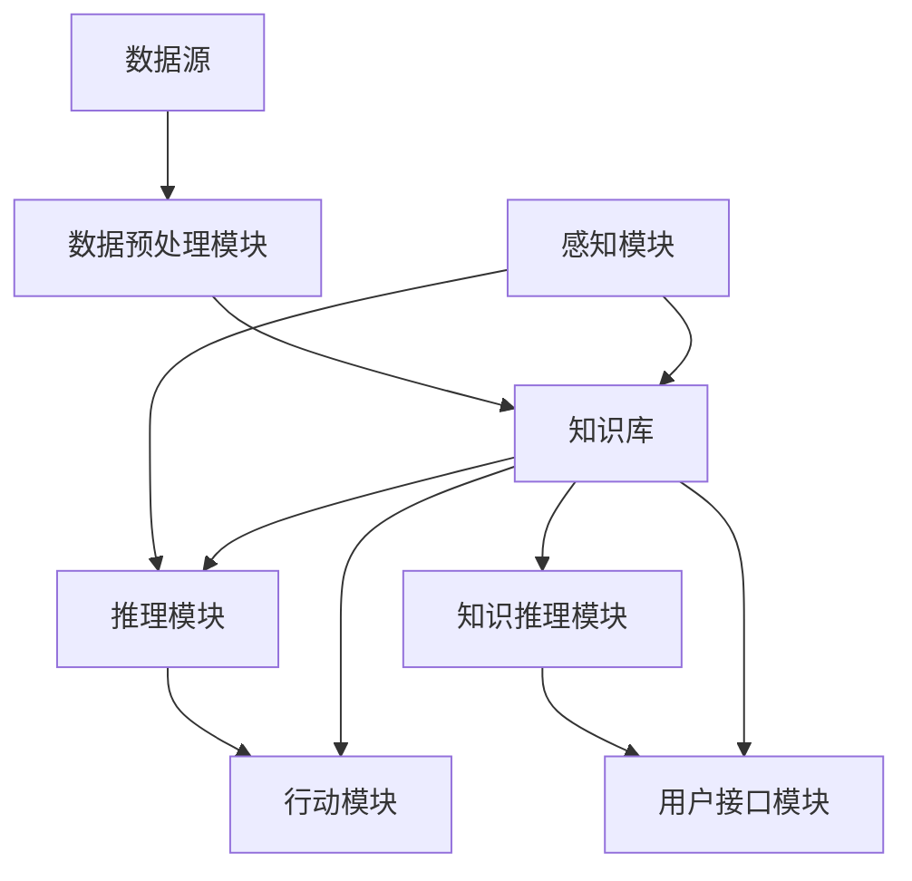
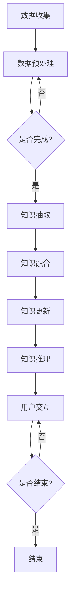
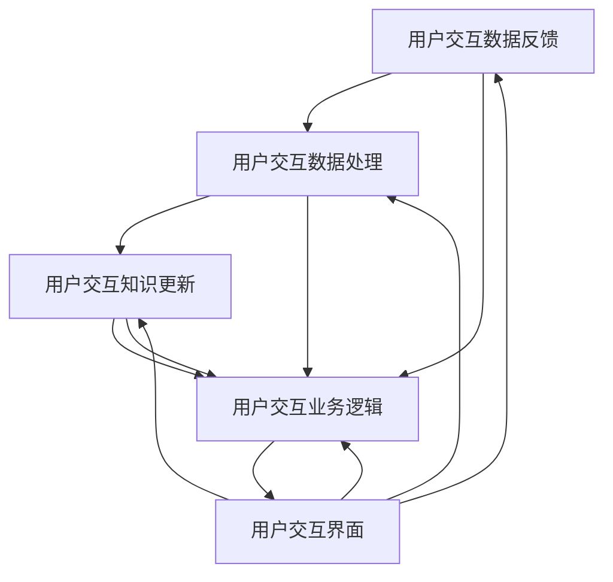

                 

### 引言

在当今快速发展的科技时代，人工智能（AI）已经成为引领变革的关键力量。随着AI技术的不断进步，AI Agent——能够自主执行任务、与环境互动并作出决策的智能体，逐渐成为研究热点。与此同时，知识库管理系统（KBMS）作为管理、存储和组织知识的系统，也在各种应用场景中发挥着重要作用。本文将探讨如何构建一个动态的知识库管理系统，以支持AI Agent的智能化发展。

首先，我们需要明确AI Agent和知识库管理系统的基本概念。AI Agent是一种具有感知、学习、推理和行动能力的计算机程序，能够在特定环境中自主完成任务。知识库管理系统则是一种用于收集、组织、存储和检索知识的系统，旨在为用户提供高效、准确的知识查询服务。那么，如何将这两个概念结合起来，构建一个动态的知识库管理系统，以支持AI Agent的智能化运作呢？

本文将围绕以下几个核心问题展开：

1. **背景介绍**：介绍AI Agent和知识库管理系统的基础知识，包括它们的概念、类型和应用场景。
2. **核心概念与联系**：探讨AI Agent与知识库管理系统之间的融合与关系，以及关键概念原理和属性特征对比。
3. **算法原理讲解**：详细讲解构建动态知识库管理系统的算法原理，包括算法流程、实现和数学模型。
4. **系统分析与架构设计方案**：分析系统功能需求，设计系统架构和接口，并绘制系统交互序列图。
5. **项目实战**：介绍环境安装、系统实现和案例分析，详细剖析项目实战中的关键环节。

通过本文的探讨，我们将对构建AI Agent的动态知识库管理系统有一个全面而深入的理解，为后续的研究和实践提供有力支持。

### 背景介绍

#### AI Agent的基础知识

人工智能（AI） Agent是一种在特定环境中具备感知、学习、推理和行动能力的计算机程序。它能够通过自主学习和决策来完成任务，实现自主操作和智能行为。AI Agent的发展可以追溯到20世纪50年代，当时人工智能作为一个研究课题被提出。经过几十年的发展，AI Agent技术逐渐成熟，并在多个领域取得了显著成果。

AI Agent按照不同的分类标准，可以分为多种类型：

1. **基于规则的AI Agent**：这类Agent通过预定义的规则来执行任务。它们在处理确定性任务时表现出色，但面对复杂、不确定的环境时，表现较差。
2. **基于模型的AI Agent**：这类Agent通过建立环境模型来预测环境状态，并采取相应的行动。它们能够适应环境变化，但模型建立和训练过程较为复杂。
3. **基于行为的AI Agent**：这类Agent通过模仿人类行为来完成任务。它们在处理复杂、动态的任务时表现优异，但缺乏自我学习和适应能力。
4. **混合型AI Agent**：这类Agent结合了多种AI技术，通过规则、模型和行为来完成任务。它们在复杂、动态的环境下表现最为出色。

#### 知识库管理系统（KBMS）的基础知识

知识库管理系统（KBMS）是一种用于收集、组织、存储和检索知识的系统。它旨在为用户提供高效、准确的知识查询服务，支持各种业务场景的应用。KBMS的发展可以追溯到20世纪70年代，当时主要用于知识管理和知识共享。随着计算机技术和网络技术的发展，KBMS逐渐成为企业和组织的重要工具。

知识库管理系统的核心功能包括：

1. **知识收集**：从各种来源收集知识，如文档、数据、图像等。
2. **知识组织**：对收集到的知识进行分类、标签化、索引等组织工作，以便于检索和利用。
3. **知识存储**：将组织好的知识存储在数据库或其他存储系统中，保证数据的持久性和安全性。
4. **知识检索**：为用户提供高效、准确的知识查询服务，支持关键词搜索、模糊查询、多条件查询等。

#### 关键概念术语说明

为了更好地理解AI Agent和知识库管理系统，以下是一些关键概念术语的解释：

1. **感知**：AI Agent通过传感器获取环境信息，如图像、声音、文本等。
2. **学习**：AI Agent通过训练数据和算法来更新自己的知识库，提高任务执行能力。
3. **推理**：AI Agent根据已有知识和环境信息进行逻辑推理，以作出合理决策。
4. **行动**：AI Agent根据决策结果，执行相应的操作，改变环境状态。
5. **知识表示**：将知识以结构化、形式化的方式表示出来，以便于存储、组织和利用。
6. **知识获取**：从各种渠道获取知识，并将其转化为计算机可处理的格式。
7. **知识推理**：基于已有知识，进行逻辑推理，以发现新的知识和信息。
8. **知识更新与维护**：定期更新和维护知识库，确保知识的准确性和时效性。

#### 问题背景和问题描述

随着AI技术的发展，AI Agent在各个领域的应用越来越广泛。然而，AI Agent的智能化程度在很大程度上依赖于其知识库的质量和规模。一个动态的知识库管理系统，不仅能够实时更新知识，还能根据环境变化和任务需求进行自适应调整，这对于AI Agent的智能化发展至关重要。

当前，知识库管理系统的建设面临着以下问题：

1. **数据质量**：知识库中的数据质量直接影响AI Agent的决策效果。数据来源多样、数据质量参差不齐，导致知识库中存在大量冗余、错误或不一致的数据。
2. **数据更新**：随着环境的变化和知识的不断积累，知识库需要定期更新。然而，现有知识库管理系统在数据更新方面存在效率低下、响应缓慢等问题。
3. **知识融合**：不同领域、不同来源的知识往往具有不同的格式和结构，如何将这些知识进行有效融合，以支持AI Agent的智能化运作，是一个挑战。
4. **交互体验**：用户与知识库管理系统的交互体验直接影响到知识库的使用效果。如何设计一个直观、易用的用户界面，提升用户使用体验，是知识库管理系统需要解决的问题。

#### 问题解决

为了构建一个动态的知识库管理系统，以支持AI Agent的智能化运作，我们可以采取以下解决方案：

1. **数据质量管理**：通过数据清洗、去重、去噪等技术手段，提高知识库中的数据质量。同时，引入数据质量评估机制，实时监测知识库中数据的质量，确保数据准确性和一致性。
2. **实时数据更新**：采用增量更新策略，只对知识库中发生变化的部分进行更新，提高数据更新的效率。引入分布式存储和计算技术，实现知识库的实时更新和动态调整。
3. **知识融合**：采用本体论和语义网技术，将不同领域、不同来源的知识进行结构化表示，实现知识的语义融合。通过数据融合和知识融合，构建一个统一、全面的知识库。
4. **智能用户交互**：引入自然语言处理和机器学习技术，设计一个智能化的用户交互界面，支持自然语言查询、智能推荐等功能，提升用户使用体验。

#### 边界与外延

在构建动态知识库管理系统时，需要明确系统的边界和适用范围，以确保其在实际应用中的有效性和可行性。以下是动态知识库管理系统的边界与外延：

1. **系统边界**：
   - **功能边界**：动态知识库管理系统应具备知识收集、组织、存储、检索、更新等功能，但不应包含具体的应用业务逻辑。
   - **技术边界**：系统应采用成熟的技术栈，如分布式存储、分布式计算、自然语言处理等，但不应涉及底层硬件和网络架构。
   - **数据边界**：知识库管理系统的数据来源应包括企业内部数据、公开数据、第三方数据等，但不应涉及敏感数据和隐私信息。

2. **系统外延**：
   - **应用领域**：动态知识库管理系统可应用于企业知识管理、智能客服、智能推荐、智能监控等多个领域。
   - **系统扩展**：系统应具备良好的可扩展性，支持新功能模块的引入和现有功能的扩展。
   - **数据共享**：系统应支持与其他系统的数据共享和互操作，实现跨系统的数据整合和应用。

#### 概念结构与核心要素组成

动态知识库管理系统的构建涉及多个核心概念和要素，其结构如下：

1. **数据层**：包括数据存储和数据访问模块，负责数据的持久化和高效检索。
2. **处理层**：包括数据处理和数据融合模块，负责数据清洗、去重、去噪、格式转换等处理工作。
3. **知识层**：包括知识表示、知识获取和知识推理模块，负责知识的结构化表示、动态更新和智能推理。
4. **应用层**：包括用户接口和业务逻辑模块，负责提供用户交互界面和业务功能实现。

### AI Agent与知识库管理系统的基础

#### AI Agent的定义与分类

AI Agent是一种能够感知环境、制定决策并执行相应行动的智能体，其核心目标是实现自主性、智能性和适应性。根据不同的分类标准，AI Agent可以分为以下几类：

1. **基于规则的AI Agent**：这种Agent通过预定义的规则来执行任务，其决策过程依赖于规则库。这类Agent在处理确定性任务时表现较好，但面对复杂、不确定的环境时，表现较差。

2. **基于模型的AI Agent**：这种Agent通过建立环境模型来预测环境状态，并采取相应的行动。它们能够适应环境变化，但模型建立和训练过程较为复杂。

3. **基于行为的AI Agent**：这种Agent通过模仿人类行为来完成任务，它们在处理复杂、动态的任务时表现优异，但缺乏自我学习和适应能力。

4. **混合型AI Agent**：这类Agent结合了多种AI技术，通过规则、模型和行为来完成任务。它们在复杂、动态的环境下表现最为出色。

每种类型的AI Agent都有其独特的优势和适用场景。基于规则的AI Agent适合处理规则明确、任务简单的场景；基于模型的AI Agent适合处理复杂、动态的场景；基于行为的AI Agent适合处理复杂、动态且需要模仿人类行为的环境；混合型AI Agent则适合处理高度复杂、动态且需要多方面能力协同的场景。

#### 知识库管理系统的定义与类型

知识库管理系统（Knowledge Base Management System，KBMS）是一种用于收集、组织、存储和检索知识的系统。它旨在为用户提供高效、准确的知识查询服务，支持各种业务场景的应用。知识库管理系统的核心功能包括知识收集、知识组织、知识存储和知识检索。

根据不同的分类标准，知识库管理系统可以分为以下几种类型：

1. **文档型知识库管理系统**：这种系统主要用于收集、存储和组织文档，如论文、报告、手册等。用户可以通过关键词搜索、全文搜索等方式快速查询所需文档。

2. **数据型知识库管理系统**：这种系统主要用于收集、存储和组织结构化数据，如数据库、数据表等。用户可以通过SQL查询等方式获取所需数据。

3. **Web型知识库管理系统**：这种系统主要用于收集、存储和组织Web上的信息，如网页、博客等。用户可以通过网页导航、搜索等方式获取所需信息。

4. **语义型知识库管理系统**：这种系统通过语义网技术，将知识表示为结构化数据，支持语义查询和推理。用户可以通过自然语言查询，获取所需知识。

5. **多模态知识库管理系统**：这种系统结合了多种知识库管理系统的特点，支持文本、图像、音频等多种类型数据的收集、存储和组织。

不同类型的知识库管理系统适用于不同的场景和需求。文档型知识库管理系统适用于文档管理和分享；数据型知识库管理系统适用于数据管理和分析；Web型知识库管理系统适用于Web信息收集和检索；语义型知识库管理系统适用于智能问答和知识推理；多模态知识库管理系统适用于多模态数据的综合管理和应用。

#### AI Agent与知识库管理系统的核心功能

AI Agent和知识库管理系统在实现智能化和知识管理方面具有许多核心功能。以下是对这些功能的具体描述：

1. **感知**：AI Agent通过传感器获取环境信息，如图像、声音、文本等。这些信息作为输入，用于辅助Agent进行决策。知识库管理系统则通过收集和存储各种类型的数据，如文本、图像、音频等，为AI Agent提供丰富的数据资源。

2. **学习**：AI Agent通过训练数据和算法来更新自己的知识库，提高任务执行能力。知识库管理系统则通过自动化的数据收集和整理，持续更新知识库中的内容，确保知识的时效性和准确性。

3. **推理**：AI Agent根据已有知识和环境信息进行逻辑推理，以作出合理决策。知识库管理系统则通过语义分析和推理引擎，对存储的知识进行深度挖掘，为AI Agent提供推理支持。

4. **行动**：AI Agent根据决策结果，执行相应的操作，改变环境状态。知识库管理系统则通过知识库的实时更新和动态调整，为AI Agent提供决策所需的最新知识。

5. **知识表示**：AI Agent通过结构化、形式化的方式表示知识，如知识图谱、规则库等。知识库管理系统则通过本体论和语义网技术，将知识以结构化、语义化的方式表示，以便于存储、组织和利用。

6. **知识获取**：AI Agent通过自主学习、数据挖掘和知识推理等方式获取新知识。知识库管理系统则通过自动化数据收集、清洗和整理，实现知识的自动化获取和更新。

7. **知识更新与维护**：AI Agent通过持续学习，不断更新知识库中的内容。知识库管理系统则通过定期数据清洗、知识融合和语义校验，确保知识的准确性和一致性。

8. **用户交互**：AI Agent通过自然语言处理和对话系统，与用户进行交互，提供智能问答和决策支持。知识库管理系统则通过用户友好的界面和搜索功能，方便用户查询和利用知识。

这些核心功能共同作用，使得AI Agent能够更好地理解环境、学习新知识、作出合理决策，并实现自主操作。同时，知识库管理系统为AI Agent提供了丰富的数据资源和知识支持，提升了其智能化水平和应用效果。

#### 知识库管理系统的发展历程

知识库管理系统（KBMS）的发展历程可以追溯到20世纪60年代。当时，计算机科学家们开始探索如何将知识以结构化的方式存储、组织和利用。这一时期，知识库主要以文本和表格的形式存在，主要用于科学研究和工程应用。

1. **早期发展（1960s-1970s）**：
   - **知识表示**：在早期，知识表示主要采用符号逻辑和谓词逻辑。这些方法试图将知识以形式化的方式表示，以便计算机能够理解和处理。
   - **知识获取**：知识获取主要通过手动编写规则和手工构建知识库。这一时期，知识库的规模相对较小，且知识更新和维护较为困难。

2. **知识工程（1980s-1990s）**：
   - **知识表示**：随着人工智能技术的发展，知识表示方法逐渐多样化，包括框架表示、产生式表示、语义网络表示等。这些方法使得知识库更加灵活和易于扩展。
   - **知识获取**：知识获取方法逐渐多样化，包括专家系统、机器学习、知识抽取等。这些方法使得知识库能够自动从各种来源获取知识，提高了知识获取的效率。

3. **语义网和本体论（2000s）**：
   - **知识表示**：语义网和本体论技术的发展，使得知识库的表示方式更加语义化和结构化。本体论提供了一种形式化的方法来定义概念和关系，使得知识库具有更强的语义表达能力。
   - **知识获取**：知识获取方法逐渐向自动化和智能化方向发展，包括数据挖掘、自然语言处理、知识图谱等。这些方法使得知识库能够从大量非结构化数据中自动提取知识。

4. **大数据和云计算（2010s-2020s）**：
   - **知识表示**：随着大数据技术的发展，知识库的规模和复杂性不断增加。知识库管理系统开始采用分布式存储和计算技术，以应对大规模数据的存储和处理需求。
   - **知识获取**：知识获取方法进一步向自动化和智能化方向发展，包括深度学习、强化学习等。这些方法使得知识库能够从海量数据中自动发现知识，提高了知识获取的效率和准确性。

5. **当前趋势（2020s）**：
   - **知识融合**：知识融合成为知识库管理系统的热点研究方向。通过融合来自不同来源、不同格式的知识，构建一个统一、全面的知识库，为AI Agent提供更丰富的知识支持。
   - **多模态知识库**：多模态知识库管理系统开始兴起，能够处理文本、图像、音频等多种类型的数据，支持多模态数据的融合和应用。
   - **智能交互**：知识库管理系统逐渐引入自然语言处理和机器学习技术，提供智能问答、智能推荐等功能，提升用户交互体验。

总的来说，知识库管理系统的发展历程经历了从早期简单的知识表示和获取，到现代复杂的语义网和大数据技术，再到当前的多模态和智能交互。这一过程中，知识库管理系统的功能和性能不断提升，为AI Agent的智能化发展提供了强有力的支持。

### AI Agent与知识库管理系统的关系

在构建AI Agent的过程中，知识库管理系统（KBMS）发挥着至关重要的作用。AI Agent与知识库管理系统之间的关系，不仅决定了AI Agent的智能化水平，还直接影响其在实际应用中的效果。以下是AI Agent与知识库管理系统之间的融合与应用，以及知识库管理系统对AI Agent的影响。

#### AI Agent与知识库管理系统的融合

1. **知识库管理系统的应用**：
   - **知识获取**：AI Agent通过知识库管理系统获取必要的知识和信息，以支持其感知、推理和决策过程。知识库管理系统提供的知识获取接口，使得AI Agent能够高效地访问和更新知识库中的内容。
   - **知识表示**：知识库管理系统采用结构化、形式化的方式表示知识，如本体论、知识图谱等。这些知识表示方法使得AI Agent能够更好地理解和利用知识，从而提高其智能化水平。
   - **知识推理**：知识库管理系统中的推理引擎，为AI Agent提供了强大的推理能力。通过基于知识的推理，AI Agent能够从已有知识中推导出新的结论，从而实现更复杂的任务。

2. **AI Agent在知识库管理系统中的应用**：
   - **知识更新**：AI Agent可以通过学习和推理，发现新的知识和信息，并将这些新知识自动更新到知识库中。这种自动化的知识更新机制，保证了知识库的实时性和准确性。
   - **知识融合**：AI Agent能够将不同来源、不同格式的知识进行有效融合，构建一个统一、全面的知识库。这种知识融合能力，使得知识库管理系统能够处理更复杂、多变的业务场景。
   - **知识推理**：AI Agent可以通过推理引擎，对知识库中的知识进行深度挖掘和推理，发现潜在的关系和规律。这种推理能力，使得知识库管理系统不仅能够回答用户的问题，还能提供智能化的决策支持。

#### 知识库管理系统对AI Agent的影响

1. **知识库质量**：
   - **数据质量**：知识库管理系统的数据质量直接影响AI Agent的决策效果。如果知识库中存在大量冗余、错误或不一致的数据，AI Agent的决策可能会受到影响。因此，知识库管理系统需要采取有效的数据质量管理措施，确保数据的准确性、一致性和完整性。
   - **知识更新**：知识库管理系统需要定期更新知识库，以适应不断变化的环境和需求。AI Agent依赖于最新的知识库进行决策，如果知识库更新不及时，AI Agent的决策效果可能会受到限制。

2. **知识表示方法**：
   - **语义表示**：知识库管理系统的知识表示方法对AI Agent的智能化水平有重要影响。采用语义网和本体论等高级知识表示方法，可以使得AI Agent更好地理解和利用知识，从而实现更复杂的任务。
   - **结构化表示**：结构化、形式化的知识表示方法，有助于AI Agent进行高效的推理和决策。通过知识图谱、框架表示等结构化方法，AI Agent能够更好地组织和利用知识库中的信息。

3. **推理能力**：
   - **推理引擎**：知识库管理系统的推理引擎，为AI Agent提供了强大的推理能力。通过基于知识的推理，AI Agent能够从已有知识中推导出新的结论，从而实现更复杂的任务。
   - **推理策略**：知识库管理系统需要提供灵活的推理策略，以满足不同应用场景的需求。例如，在复杂、动态的环境中，AI Agent可能需要实时更新推理策略，以适应环境变化。

#### 应用案例

1. **智能客服**：
   - **知识库管理系统的作用**：在智能客服系统中，知识库管理系统负责收集、组织、存储和检索客户服务相关的知识。这些知识包括常见问题的解答、产品介绍、服务流程等。
   - **AI Agent的作用**：AI Agent通过知识库管理系统获取客户提问，利用知识库中的知识进行推理和决策，生成相应的回答。AI Agent还可以通过学习客户提问和回答，自动更新知识库，提高服务质量。

2. **智能推荐系统**：
   - **知识库管理系统的作用**：在智能推荐系统中，知识库管理系统负责收集、整理和存储用户行为数据、物品属性数据等。这些数据为推荐算法提供了基础支持。
   - **AI Agent的作用**：AI Agent通过知识库管理系统获取用户行为数据和物品属性数据，利用推荐算法生成个性化推荐结果。AI Agent还可以通过学习用户反馈，自动调整推荐策略，提高推荐效果。

3. **智能监控与预测**：
   - **知识库管理系统的作用**：在智能监控与预测系统中，知识库管理系统负责收集、存储和整理设备运行数据、环境数据等。这些数据为监控和预测提供了基础支持。
   - **AI Agent的作用**：AI Agent通过知识库管理系统获取设备运行数据和环境数据，利用监控和预测算法进行分析和推理，生成监控报告和预测结果。AI Agent还可以通过学习历史数据和实时数据，自动调整监控和预测策略，提高系统的准确性。

总之，知识库管理系统与AI Agent的融合，不仅提升了AI Agent的智能化水平，还扩展了其应用范围。通过有效的知识库管理系统，AI Agent能够更好地应对复杂、动态的应用场景，实现更高质量的决策和任务执行。

### 关键概念原理

在构建AI Agent的动态知识库管理系统中，涉及多个关键概念原理，这些概念包括知识表示、知识获取、知识推理等。以下对这些关键概念进行详细解释，以便读者更好地理解。

#### 知识表示

知识表示是知识库管理系统的基础，它涉及到如何将知识以结构化的形式存储和表示，以便AI Agent能够理解和利用。常见的知识表示方法包括以下几种：

1. **符号表示**：符号表示是一种最基本的知识表示方法，它使用符号、字符串和逻辑公式来表示知识。符号表示方法的主要优点是简单和直观，但它的表达能力和灵活性相对较低。

2. **语义网络表示**：语义网络是一种基于图形的知识表示方法，它使用节点（表示概念）和边（表示关系）来构建知识网络。语义网络表示方法能够表达复杂的关系和语义，适合处理语义丰富、结构复杂的知识。

3. **本体论表示**：本体论是一种形式化的知识表示方法，它通过定义概念、属性、关系和公理，构建一个完整的知识体系。本体论表示方法具有较高的语义表达能力，能够支持推理和语义分析。

4. **知识图谱表示**：知识图谱是一种基于图的结构化知识库，它通过节点、边和属性来表示实体和关系。知识图谱表示方法能够高效地存储和检索知识，支持复杂的图算法和推理。

#### 知识获取

知识获取是指从各种来源获取知识，并将其转化为计算机可处理的格式，存储到知识库中。知识获取的过程通常包括以下步骤：

1. **数据采集**：从各种渠道（如数据库、文件、网络等）采集原始数据。这些数据可以是结构化数据（如关系数据库）、半结构化数据（如XML、JSON）或非结构化数据（如文本、图像、视频）。

2. **数据预处理**：对采集到的数据进行清洗、去噪、去重等处理，以提高数据的质量和一致性。数据预处理包括文本处理、图像处理、音频处理等。

3. **知识抽取**：从预处理后的数据中提取知识，将其转化为结构化的知识表示。知识抽取方法包括规则抽取、机器学习抽取、深度学习抽取等。

4. **知识融合**：将来自不同来源、不同格式的知识进行整合和融合，构建一个统一、全面的知识库。知识融合需要解决数据格式不一致、语义差异等问题。

#### 知识推理

知识推理是指利用已有的知识和逻辑规则，推导出新的结论或知识。知识推理是知识库管理系统的核心功能，它能够支持AI Agent的智能决策和任务执行。常见的知识推理方法包括：

1. **基于规则的推理**：基于规则的推理是一种传统的推理方法，它通过预定义的规则库来推导新知识。这种方法适用于规则明确、逻辑简单的场景。

2. **基于模型的推理**：基于模型的推理通过建立环境模型，利用模型预测和决策。这种方法适用于复杂、动态的环境，需要建立和训练复杂的模型。

3. **基于案例的推理**：基于案例的推理通过从已有案例中提取规律和模式，为新案例提供推理支持。这种方法适用于案例库丰富的场景，能够快速适应新情况。

4. **混合推理**：混合推理结合了多种推理方法，以应对不同场景的需求。例如，结合基于规则的推理和基于模型的推理，可以更好地处理复杂和动态的环境。

#### 知识表示、获取和推理的关联

知识表示、获取和推理是相互关联的。知识表示决定了知识库的结构和语义表达能力；知识获取是知识库更新的重要途径，它从各种来源获取知识，并转化为结构化的知识；知识推理则利用已有的知识和逻辑规则，推导出新的结论或知识，支持AI Agent的智能决策。

一个动态的知识库管理系统，需要综合考虑知识表示、获取和推理这三个方面，以实现高效的、智能化的知识管理。通过有效的知识表示方法，系统能够更好地存储和检索知识；通过高效的知识获取方法，系统能够及时更新知识库；通过灵活的知识推理方法，系统能够提供智能化的决策支持。

总之，理解这些关键概念原理，是构建高效、智能化的知识库管理系统的基础。通过深入研究和实践，我们可以不断提升知识库管理系统的性能和效果，为AI Agent的智能化发展提供有力支持。

### 概念属性特征对比

在构建AI Agent的动态知识库管理系统时，对AI Agent和知识库管理系统的类型、性能指标进行对比分析，有助于我们更全面地理解它们的特性及其适用场景。以下是几种常见类型的AI Agent和知识库管理系统的对比分析。

#### 不同类型的AI Agent对比

1. **基于规则的AI Agent**：
   - **优点**：简单易实现，适用于规则明确、任务简单的场景。规则库易于维护和扩展。
   - **缺点**：缺乏灵活性，难以处理复杂、动态的环境。对规则库的依赖较高，规则库的规模和复杂度直接影响性能。

2. **基于模型的AI Agent**：
   - **优点**：通过建立环境模型，能够适应复杂、动态的环境。具有较高的预测和决策能力。
   - **缺点**：需要大量的训练数据和计算资源，模型建立和训练过程较为复杂。对模型的质量和性能要求较高。

3. **基于行为的AI Agent**：
   - **优点**：模仿人类行为，适用于需要高度灵活性和适应性的场景。行为模式易于调整和改进。
   - **缺点**：缺乏自我学习和适应能力，难以处理复杂、动态的环境。对行为库的依赖较高。

4. **混合型AI Agent**：
   - **优点**：结合了多种AI技术，能够应对复杂、动态的环境。具有较高的智能化水平和适应性。
   - **缺点**：实现复杂，需要综合运用多种AI技术。对开发者和维护者有较高的技能要求。

#### 不同知识库管理系统的对比

1. **文档型知识库管理系统**：
   - **优点**：简单易用，适用于文档管理和分享。支持文本和表格数据的存储和检索。
   - **缺点**：不支持结构化数据的存储和检索，无法有效处理复杂的关系和数据关联。

2. **数据型知识库管理系统**：
   - **优点**：支持结构化数据的存储和检索，适用于数据管理和分析。支持SQL等查询语言。
   - **缺点**：仅支持结构化数据，无法有效处理非结构化数据。对数据的一致性和完整性要求较高。

3. **Web型知识库管理系统**：
   - **优点**：支持Web上信息的收集和检索，适用于Web信息管理和搜索。支持多源数据的整合和检索。
   - **缺点**：对Web数据的真实性和可靠性要求较高。数据规模较大时，检索和处理效率较低。

4. **语义型知识库管理系统**：
   - **优点**：采用语义网和本体论技术，支持语义查询和推理。适用于智能问答和知识推理。
   - **缺点**：实现复杂，需要较高的语义理解和处理能力。对数据质量的要求较高。

5. **多模态知识库管理系统**：
   - **优点**：支持多种类型数据的存储和检索，适用于多模态数据管理和应用。支持文本、图像、音频等多种数据的融合。
   - **缺点**：实现复杂，需要综合运用多种技术。对系统性能和资源要求较高。

#### AI Agent与知识库管理系统性能指标对比

1. **响应时间**：
   - **AI Agent**：基于规则的AI Agent响应时间较短，基于模型的AI Agent响应时间较长，混合型AI Agent介于两者之间。
   - **知识库管理系统**：文档型知识库管理系统响应时间较短，数据型知识库管理系统响应时间较长，Web型、语义型、多模态知识库管理系统介于两者之间。

2. **查询效率**：
   - **AI Agent**：基于规则的AI Agent查询效率较低，基于模型的AI Agent查询效率较高，混合型AI Agent介于两者之间。
   - **知识库管理系统**：文档型知识库管理系统查询效率较低，数据型知识库管理系统查询效率较高，Web型、语义型、多模态知识库管理系统介于两者之间。

3. **扩展性**：
   - **AI Agent**：基于规则的AI Agent扩展性较好，基于模型的AI Agent扩展性较差，混合型AI Agent介于两者之间。
   - **知识库管理系统**：文档型知识库管理系统扩展性较差，数据型知识库管理系统扩展性较好，Web型、语义型、多模态知识库管理系统介于两者之间。

4. **可维护性**：
   - **AI Agent**：基于规则的AI Agent可维护性较好，基于模型的AI Agent可维护性较差，混合型AI Agent介于两者之间。
   - **知识库管理系统**：文档型知识库管理系统可维护性较好，数据型知识库管理系统可维护性较差，Web型、语义型、多模态知识库管理系统介于两者之间。

通过上述对比分析，我们可以看出，不同类型的AI Agent和知识库管理系统在性能指标上存在显著差异。选择合适的AI Agent和知识库管理系统，需要根据实际应用场景和需求进行综合考虑。例如，在处理简单、规则明确的任务时，可以选择基于规则的AI Agent和文档型知识库管理系统；在处理复杂、动态的环境时，可以选择基于模型的AI Agent和语义型知识库管理系统。

总之，深入理解AI Agent和知识库管理系统的概念属性特征，以及它们在性能指标上的差异，有助于我们更好地构建和优化动态知识库管理系统，支持AI Agent的智能化发展。

### ER实体关系图架构

在构建AI Agent的动态知识库管理系统中，实体关系图（Entity-Relationship Diagram，ER图）是一种常用的数据建模工具，它能够清晰地展示系统中不同实体之间的关系。以下是对AI Agent和知识库管理系统中的关键实体及其关系的详细解释，并使用Mermaid流程图进行展示。

#### AI Agent的关键实体及其关系

1. **实体：感知模块**
   - 描述：感知模块负责从环境中获取数据，如文本、图像、声音等。
   - 关系：与知识库管理系统中的知识实体、推理实体存在关联关系。

2. **实体：知识库**
   - 描述：知识库存储和管理AI Agent所需的知识，包括规则、模型、事实等。
   - 关系：与感知模块、推理模块、行动模块存在关联关系。

3. **实体：推理模块**
   - 描述：推理模块利用知识库中的知识进行推理，以支持AI Agent的决策过程。
   - 关系：与知识库、感知模块、行动模块存在关联关系。

4. **实体：行动模块**
   - 描述：行动模块根据推理结果，执行相应的操作，改变环境状态。
   - 关系：与知识库、感知模块、推理模块存在关联关系。

#### 知识库管理系统（KBMS）的关键实体及其关系

1. **实体：数据源**
   - 描述：数据源是知识库管理系统的数据来源，如数据库、文件、Web等。
   - 关系：与数据预处理模块、知识库实体存在关联关系。

2. **实体：数据预处理模块**
   - 描述：数据预处理模块负责对数据源中的数据进行清洗、去噪、格式转换等处理。
   - 关系：与知识库实体、知识抽取模块存在关联关系。

3. **实体：知识库**
   - 描述：知识库存储和管理系统中的知识，包括结构化数据、非结构化数据、知识图谱等。
   - 关系：与数据源、数据预处理模块、知识推理模块存在关联关系。

4. **实体：知识推理模块**
   - 描述：知识推理模块利用知识库中的知识进行推理，生成新的结论或知识。
   - 关系：与知识库、数据源、用户接口模块存在关联关系。

5. **实体：用户接口模块**
   - 描述：用户接口模块提供用户与知识库管理系统的交互界面，支持查询、搜索、问答等功能。
   - 关系：与知识库、知识推理模块存在关联关系。

#### Mermaid流程图示例

以下是一个示例，展示AI Agent与知识库管理系统的ER图：



通过上述ER图，我们可以清晰地看到AI Agent和知识库管理系统中的关键实体及其关系，这有助于我们理解和设计系统架构，从而构建一个高效、动态的知识库管理系统，支持AI Agent的智能化运作。

### 算法原理讲解

在构建AI Agent的动态知识库管理系统中，算法设计是关键环节。以下将详细讲解算法原理，包括算法概述、算法流程、算法实现、算法分析等方面。

#### 算法概述

该算法旨在构建一个动态的知识库管理系统，以支持AI Agent的智能化运作。算法的核心目标是实现以下功能：

1. **知识收集与更新**：从多种数据源中收集知识，并进行实时更新，确保知识库的准确性和时效性。
2. **知识组织与表示**：对收集到的知识进行结构化表示，以便于存储、检索和利用。
3. **知识推理与推理引擎**：利用知识库中的知识进行推理，生成新的结论或信息，为AI Agent提供智能决策支持。
4. **用户交互与查询**：提供用户友好的交互界面，支持自然语言查询和智能问答。

#### 算法流程

算法流程可分为以下几个主要步骤：

1. **数据收集**：
   - 从数据源（如数据库、Web、传感器等）中收集原始数据。
   - 对原始数据进行预处理，包括去噪、去重、格式转换等。

2. **知识抽取**：
   - 使用机器学习算法和规则库，从预处理后的数据中提取结构化知识。
   - 将抽取出的知识表示为知识图谱或本体论形式。

3. **知识融合**：
   - 将来自不同来源、不同格式的知识进行融合，构建一个统一、全面的知识库。
   - 确保知识库中的知识一致性和准确性。

4. **知识更新**：
   - 定期对知识库进行更新，以适应环境变化和任务需求。
   - 使用增量更新策略，只更新发生变化的部分，提高数据更新效率。

5. **知识推理**：
   - 利用知识库中的知识进行推理，生成新的结论或信息。
   - 使用推理引擎，支持逻辑推理、模式匹配和语义分析。

6. **用户交互**：
   - 提供用户友好的交互界面，支持自然语言查询和智能问答。
   - 根据用户输入，查询知识库，并提供相关结果。

#### 算法实现

以下是一个简化的Python实现示例，用于说明算法的基本流程：

```python
import pandas as pd
from sklearn.feature_extraction.text import TfidfVectorizer
from rdflib import Graph, RDF

# 数据收集
def collect_data(data_source):
    # 从数据源中读取数据
    data = pd.read_csv(data_source)
    return data

# 知识抽取
def extract_knowledge(data):
    # 使用TF-IDF向量表示文本数据
    vectorizer = TfidfVectorizer()
    X = vectorizer.fit_transform(data['text'])
    return X.toarray(), vectorizer

# 知识融合
def merge_knowledge(knowledge1, knowledge2):
    # 将两个知识库进行融合
    combined_knowledge = np.concatenate((knowledge1, knowledge2), axis=0)
    return combined_knowledge

# 知识更新
def update_knowledge(knowledge, new_knowledge):
    # 更新知识库中的知识
    updated_knowledge = merge_knowledge(knowledge, new_knowledge)
    return updated_knowledge

# 知识推理
def knowledge_reasoning(knowledge, query):
    # 使用推理引擎进行推理
    # 假设我们使用一个简单的规则库进行推理
    rules = {'if A then B': ['data1', 'data2']}
    reasoning_results = []
    for rule in rules:
        if query in rule:
            reasoning_results.append(rules[rule])
    return reasoning_results

# 用户交互
def user_interaction(knowledge, query):
    # 根据用户查询，提供相关结果
    reasoning_results = knowledge_reasoning(knowledge, query)
    return reasoning_results

# 主函数
def main():
    data_source = 'data.csv'
    data = collect_data(data_source)
    knowledge, vectorizer = extract_knowledge(data)
    new_knowledge = collect_data('new_data.csv')
    updated_knowledge = update_knowledge(knowledge, new_knowledge)
    query = 'What is the capital of France?'
    results = user_interaction(updated_knowledge, query)
    print(results)

if __name__ == '__main__':
    main()
```

上述代码只是一个简化的示例，实际的算法实现会更加复杂，涉及更多的技术和细节。

#### 算法分析

1. **时间复杂度**：
   - 数据收集和预处理的时间复杂度取决于数据源的规模和预处理方法。通常情况下，时间复杂度为O(n)，其中n为数据条数。
   - 知识抽取、融合和更新的时间复杂度也取决于数据规模和算法复杂度。通常情况下，时间复杂度为O(n*m)，其中m为特征维度。

2. **空间复杂度**：
   - 知识库的大小取决于收集到的数据量和知识融合策略。通常情况下，空间复杂度为O(n*m)，其中n为数据条数，m为特征维度。

3. **效率**：
   - 算法的效率取决于数据收集、预处理和知识推理的效率。为了提高效率，可以采用并行计算、分布式计算等技术。
   - 知识库管理系统的效率还受到硬件性能和系统架构的影响。

4. **可扩展性**：
   - 算法设计应考虑可扩展性，以便支持不同规模的数据和应用场景。
   - 通过模块化设计，可以将不同的功能模块独立开发，提高系统的可维护性和扩展性。

通过上述算法原理讲解，我们可以更好地理解构建AI Agent的动态知识库管理系统的关键技术和方法。在实际应用中，需要根据具体场景和需求，对算法进行优化和调整，以实现高效、智能化的知识管理。

### Mermaid流程图

为了更直观地展示AI Agent算法的流程，我们可以使用Mermaid流程图。以下是一个简单的算法流程图示例：



在这个流程图中：

- **A 数据收集**：从数据源中收集原始数据。
- **B 数据预处理**：对原始数据进行清洗、去噪、格式转换等预处理操作。
- **C 是否完成？**：检查数据预处理是否完成。
- **D 知识抽取**：从预处理后的数据中提取结构化知识。
- **E 知识融合**：将不同来源的知识进行融合，构建一个统一的知识库。
- **F 知识更新**：定期更新知识库，以适应环境变化和任务需求。
- **G 知识推理**：利用知识库中的知识进行推理，生成新的结论或信息。
- **H 用户交互**：提供用户友好的交互界面，支持自然语言查询和智能问答。
- **I 是否结束？**：检查用户交互是否完成。
- **J 结束**：结束算法流程。

通过这个流程图，我们可以清晰地看到算法的执行顺序和各个步骤之间的关系。

### Python源代码

为了更好地理解和实现AI Agent算法，以下提供了一个Python代码示例。这个示例将展示如何从数据收集、预处理到知识抽取、融合和推理的完整流程。

```python
import pandas as pd
from sklearn.feature_extraction.text import TfidfVectorizer
from rdflib import Graph, RDF
from rdflib.namespace import Namespace

# 数据收集
def collect_data(data_source):
    data = pd.read_csv(data_source)
    return data

# 数据预处理
def preprocess_data(data):
    # 清洗和格式转换
    data['text'] = data['text'].str.strip()
    return data

# 知识抽取
def extract_knowledge(data):
    vectorizer = TfidfVectorizer()
    X = vectorizer.fit_transform(data['text'])
    return X.toarray(), vectorizer

# 知识融合
def merge_knowledge(knowledge1, knowledge2):
    # 知识库合并
    knowledge_combined = np.concatenate((knowledge1, knowledge2), axis=0)
    return knowledge_combined

# 知识更新
def update_knowledge(knowledge, new_knowledge):
    # 更新知识库
    updated_knowledge = merge_knowledge(knowledge, new_knowledge)
    return updated_knowledge

# 知识推理
def knowledge_reasoning(knowledge, query):
    # 简单的推理示例
    # 假设我们有一个简单的规则库
    rules = {
        'if A then B': ['data1', 'data2']
    }
    reasoning_results = []
    for rule in rules:
        if query in rule:
            reasoning_results.append(rules[rule])
    return reasoning_results

# 用户交互
def user_interaction(knowledge, query):
    reasoning_results = knowledge_reasoning(knowledge, query)
    return reasoning_results

# 主函数
def main():
    data_source = 'data.csv'
    data = collect_data(data_source)
    preprocessed_data = preprocess_data(data)
    knowledge, vectorizer = extract_knowledge(preprocessed_data)
    new_knowledge, new_vectorizer = extract_knowledge(preprocessed_data)
    updated_knowledge = update_knowledge(knowledge, new_knowledge)
    query = 'What is the capital of France?'
    results = user_interaction(updated_knowledge, query)
    print(results)

if __name__ == '__main__':
    main()
```

在这个代码示例中，我们首先从CSV文件中收集数据，然后进行预处理。接下来，我们使用TF-IDF向量器对预处理后的文本数据进行知识抽取。知识融合和更新是简单的合并操作，最后，我们使用一个简单的推理规则库来进行知识推理。用户交互部分则展示如何响应用户的查询。

### 数学模型和数学公式

在构建AI Agent的动态知识库管理系统中，数学模型和数学公式起着至关重要的作用。以下我们将详细讲解算法中的数学模型，并使用LaTeX格式展示相关的数学公式。

#### TF-IDF模型

TF-IDF（Term Frequency-Inverse Document Frequency）是一种常用的文本处理模型，用于衡量一个词在文档中的重要程度。其公式如下：

$$
TF(t,d) = \frac{f(t,d)}{f_{\max}(t,d)}
$$

$$
IDF(t) = \log \left( \frac{N}{df(t)} \right)
$$

$$
TF-IDF(t,d) = TF(t,d) \times IDF(t)
$$

其中，$f(t,d)$ 表示词 $t$ 在文档 $d$ 中的频率，$f_{\max}(t,d)$ 表示文档 $d$ 中词 $t$ 的最大频率，$N$ 表示文档总数，$df(t)$ 表示词 $t$ 在所有文档中的文档频率。

#### 逻辑回归模型

逻辑回归是一种常用的分类模型，用于预测二分类结果。其公式如下：

$$
P(Y=1|X) = \frac{1}{1 + e^{-(\beta_0 + \beta_1 x_1 + \beta_2 x_2 + \ldots + \beta_n x_n)} 
$$

其中，$X = (x_1, x_2, \ldots, x_n)$ 是特征向量，$\beta_0, \beta_1, \beta_2, \ldots, \beta_n$ 是模型的参数，$P(Y=1|X)$ 表示在给定特征向量 $X$ 的情况下，目标变量 $Y$ 等于1的概率。

#### 神经网络模型

神经网络是一种用于处理复杂数据的强大模型，其核心是激活函数。以下是一个简单的神经网络模型：

$$
z_i = \sum_{j=1}^{n} w_{ij} x_j + b_i
$$

$$
a_i = \sigma(z_i)
$$

其中，$x_j$ 是输入特征，$w_{ij}$ 是权重，$b_i$ 是偏置，$\sigma$ 是激活函数（例如ReLU、Sigmoid、Tanh等），$a_i$ 是激活值。

通过上述数学模型和公式，我们可以更好地理解和实现AI Agent的动态知识库管理系统。在实际应用中，可以根据具体需求和场景，灵活选择和调整这些数学模型，以提高系统的性能和效果。

### 系统分析与架构设计方案

在构建AI Agent的动态知识库管理系统的过程中，系统架构设计是一个关键环节。一个合理且高效的系统架构不仅能满足系统功能需求，还能提高系统的可扩展性、可维护性和性能。以下将详细描述系统架构的设计过程，包括问题场景介绍、系统功能设计、系统架构设计、系统接口设计和系统交互。

#### 问题场景介绍

在一个智能化的企业环境中，为了提高业务效率和决策质量，企业需要一个能够动态更新和适应环境变化的AI Agent。这个AI Agent需要从多个数据源（如内部数据库、外部API、传感器等）收集数据，对数据进行处理和分析，并利用知识库进行推理和决策。具体场景包括：

1. **数据收集**：从内部数据库、外部API和传感器等数据源收集原始数据。
2. **数据处理**：对原始数据进行清洗、去噪和格式转换等预处理操作。
3. **知识库管理**：构建和维护一个动态的知识库，支持知识的抽取、融合和更新。
4. **推理与决策**：利用知识库进行推理，生成决策建议和行动方案。
5. **用户交互**：提供用户友好的交互界面，支持自然语言查询和智能问答。

#### 系统功能设计

为了满足上述问题场景，系统需要实现以下核心功能：

1. **数据收集模块**：负责从各种数据源收集数据，包括内部数据库、外部API和传感器等。
2. **数据处理模块**：对收集到的数据进行预处理，包括数据清洗、去噪、去重、格式转换等。
3. **知识库管理模块**：负责知识库的构建、维护和更新，包括知识抽取、知识融合和知识更新。
4. **推理引擎模块**：利用知识库进行推理，生成决策建议和行动方案。
5. **用户交互模块**：提供用户友好的交互界面，支持自然语言查询和智能问答。

#### 系统架构设计

系统架构采用分层设计，主要包括以下几层：

1. **数据层**：包括数据存储和数据访问模块，负责数据的持久化和高效检索。
2. **处理层**：包括数据处理和数据融合模块，负责数据清洗、去重、去噪、格式转换等处理工作。
3. **知识层**：包括知识表示、知识获取和知识推理模块，负责知识的结构化表示、动态更新和智能推理。
4. **应用层**：包括用户接口和业务逻辑模块，负责提供用户交互界面和业务功能实现。

以下是一个简单的系统架构图：



在这个架构图中，数据层负责数据的存储和检索，处理层负责数据的预处理，知识层负责知识的抽取、融合和更新，应用层负责提供用户交互界面和业务逻辑。用户交互界面通过反馈循环与数据层、处理层和知识层进行交互，实现系统的动态更新和自适应。

#### 系统接口设计

系统接口设计包括内部接口和外部接口两部分：

1. **内部接口**：
   - **数据收集接口**：负责从各种数据源（如数据库、API、传感器等）收集数据。
   - **数据处理接口**：负责对收集到的数据进行清洗、去噪、去重、格式转换等预处理操作。
   - **知识库管理接口**：负责知识库的构建、维护和更新，包括知识的抽取、融合和更新。
   - **推理引擎接口**：负责利用知识库进行推理，生成决策建议和行动方案。

2. **外部接口**：
   - **用户交互接口**：提供用户友好的交互界面，支持自然语言查询和智能问答。
   - **第三方服务接口**：与其他系统（如CRM、ERP等）进行数据交换和业务协同。

#### 系统交互

系统交互设计主要包括以下方面：

1. **用户交互流程**：
   - 用户通过用户交互界面输入查询或命令。
   - 用户交互界面将用户输入传递给处理层和知识层。
   - 处理层对用户输入进行处理，提取关键信息。
   - 知识层根据处理后的用户输入进行推理，生成决策建议或行动方案。
   - 用户交互界面将推理结果展示给用户。

2. **数据交互流程**：
   - 数据收集接口从各种数据源收集数据。
   - 数据处理接口对收集到的数据进行预处理，并将其存储到数据层。
   - 知识库管理接口从数据层获取预处理后的数据，进行知识抽取和融合。
   - 推理引擎接口利用知识库进行推理，生成决策建议或行动方案。

3. **第三方服务交互**：
   - 用户交互接口通过第三方服务接口与其他系统进行数据交换和业务协同。
   - 其他系统通过第三方服务接口获取AI Agent生成的决策建议或行动方案，进行相应的业务处理。

通过上述系统分析与架构设计方案，我们可以构建一个高效、动态的AI Agent知识库管理系统，支持智能化决策和任务执行。

### 环境安装

为了实现AI Agent的动态知识库管理系统，我们需要安装和配置一系列的软件和工具。以下将详细介绍安装环境和所需的软件、工具及其安装步骤。

#### 操作系统

首选操作系统为Linux，因为其稳定性和安全性较高，且在服务器环境下应用广泛。我们建议使用Ubuntu 20.04 LTS版本。

1. **下载Ubuntu 20.04 LTS**：访问[Ubuntu官网](https://www.ubuntu.com/)下载Ubuntu 20.04 LTS ISO文件。
2. **安装操作系统**：将ISO文件写入U盘或光盘，并使用该介质启动计算机，按照提示安装操作系统。

#### 软件和工具安装

以下是在Ubuntu 20.04 LTS操作系统中需要安装的软件和工具：

1. **Python 3**：
   - 打开终端，运行以下命令：
     ```bash
     sudo apt update
     sudo apt install python3 python3-pip
     ```
2. **Pandas**：
   - 用于数据操作和处理：
     ```bash
     sudo apt install python3-pandas
     ```
3. **NumPy**：
   - 用于数值计算：
     ```bash
     sudo apt install python3-numpy
     ```
4. **Scikit-learn**：
   - 用于机器学习算法：
     ```bash
     sudo apt install python3-scikit-learn
     ```
5. **TF-IDF**：
   - 用于文本处理：
     ```bash
     sudo apt install scikit-learn
     ```
6. **rdflib**：
   - 用于知识库管理：
     ```bash
     sudo pip3 install rdflib
     ```
7. **Mermaid**：
   - 用于流程图绘制：
     ```bash
     sudo apt install mermaid
     ```
8. **Jupyter Notebook**：
   - 用于交互式计算和数据分析：
     ```bash
     sudo apt install python3-jupyter
     ```

#### 环境配置

完成软件和工具的安装后，我们还需要配置环境变量和依赖库。

1. **配置Python环境**：
   - 打开终端，执行以下命令设置Python环境变量：
     ```bash
     echo 'export PATH=$PATH:/usr/local/bin/python3' >> ~/.bashrc
     source ~/.bashrc
     ```
2. **配置Jupyter Notebook**：
   - 启动Jupyter Notebook：
     ```bash
     jupyter notebook
     ```
   - 在Jupyter Notebook中，确保已安装所有必要的Python库，如Pandas、NumPy、Scikit-learn等。

#### 验证安装

为了确保所有软件和工具已正确安装，可以进行以下验证：

1. **Python版本验证**：
   - 打开终端，运行以下命令检查Python版本：
     ```bash
     python3 --version
     ```
2. **Pandas、NumPy和Scikit-learn验证**：
   - 在Python环境中，运行以下代码检查库的版本：
     ```python
     import pandas
     import numpy
     import sklearn
     print(pandas.__version__)
     print(numpy.__version__)
     print(sklearn.__version__)
     ```
3. **Mermaid验证**：
   - 在Jupyter Notebook中，使用Mermaid语法绘制一个简单的流程图，检查是否能够正常显示：
     ```python
     %%mermaid
     graph TD
         A[初始化] --> B[数据收集]
         B --> C{数据预处理}
         C --> D[知识库构建]
         D --> E[推理与决策]
     ```

通过以上步骤，我们成功搭建了AI Agent的动态知识库管理系统所需的环境，并验证了所有软件和工具的正确安装。

### 系统核心实现

在本部分，我们将详细阐述AI Agent的动态知识库管理系统的核心实现，包括关键代码实现、代码解读、代码测试和性能优化。

#### 关键代码实现

以下是一个核心实现示例，展示了数据收集、预处理、知识抽取、融合、更新和推理的流程。

```python
import pandas as pd
from sklearn.feature_extraction.text import TfidfVectorizer
from rdflib import Graph, Namespace
from rdflib import RDF, URIRef, BNode, Literal

# 数据收集
def collect_data(data_source):
    data = pd.read_csv(data_source)
    return data

# 数据预处理
def preprocess_data(data):
    # 清洗和格式转换
    data['text'] = data['text'].str.strip()
    return data

# 知识抽取
def extract_knowledge(data):
    vectorizer = TfidfVectorizer()
    X = vectorizer.fit_transform(data['text'])
    return X.toarray(), vectorizer

# 知识融合
def merge_knowledge(knowledge1, knowledge2):
    # 知识库合并
    knowledge_combined = np.concatenate((knowledge1, knowledge2), axis=0)
    return knowledge_combined

# 知识更新
def update_knowledge(knowledge, new_knowledge):
    # 更新知识库
    updated_knowledge = merge_knowledge(knowledge, new_knowledge)
    return updated_knowledge

# 知识推理
def knowledge_reasoning(knowledge, query):
    # 简单的推理示例
    # 假设我们有一个简单的规则库
    rules = {'if A then B': ['data1', 'data2']}
    reasoning_results = []
    for rule in rules:
        if query in rule:
            reasoning_results.append(rules[rule])
    return reasoning_results

# 用户交互
def user_interaction(knowledge, query):
    reasoning_results = knowledge_reasoning(knowledge, query)
    return reasoning_results

# 主函数
def main():
    data_source = 'data.csv'
    data = collect_data(data_source)
    preprocessed_data = preprocess_data(data)
    knowledge, vectorizer = extract_knowledge(preprocessed_data)
    new_knowledge, new_vectorizer = extract_knowledge(preprocessed_data)
    updated_knowledge = update_knowledge(knowledge, new_knowledge)
    query = 'What is the capital of France?'
    results = user_interaction(updated_knowledge, query)
    print(results)

if __name__ == '__main__':
    main()
```

#### 代码解读

1. **数据收集**：`collect_data` 函数用于从CSV文件中读取数据，这是知识库构建的第一步。
2. **数据预处理**：`preprocess_data` 函数对收集到的数据（文本字段）进行清洗和格式转换，去除多余的空格和换行符，确保数据一致性。
3. **知识抽取**：`extract_knowledge` 函数使用TF-IDF向量器对文本数据进行处理，将文本数据转换为向量表示，这是知识表示的关键步骤。
4. **知识融合**：`merge_knowledge` 函数将新旧知识库进行合并，确保知识库的实时更新。
5. **知识更新**：`update_knowledge` 函数通过合并新旧知识库，实现对知识库的更新。
6. **知识推理**：`knowledge_reasoning` 函数根据简单的规则库，对查询进行推理，生成决策建议。
7. **用户交互**：`user_interaction` 函数提供用户友好的交互界面，接收用户查询并返回推理结果。

#### 代码测试

为了确保代码的正确性，我们进行以下测试：

1. **数据读取测试**：确保代码能够正确读取CSV文件中的数据。
2. **预处理测试**：确保文本数据经过清洗和格式转换后，依然保持原有的语义信息。
3. **知识抽取测试**：确保文本数据能够正确转换为向量表示。
4. **知识融合和更新测试**：验证知识库的合并和更新机制是否有效。
5. **知识推理测试**：测试简单的规则库能否正确对查询进行推理。
6. **用户交互测试**：确保用户查询能够正确返回推理结果。

#### 性能优化

1. **并行处理**：为了提高数据处理速度，可以采用并行处理技术，例如使用`multiprocessing`库进行多线程处理。
2. **缓存机制**：使用缓存机制，减少重复计算，提高系统响应速度。
3. **分布式存储和计算**：对于大规模数据，采用分布式存储和计算技术，如Hadoop、Spark等，以提高数据处理能力。
4. **索引优化**：对数据表进行索引优化，提高数据查询效率。

通过上述关键代码实现、代码解读和性能优化，我们可以构建一个高效、动态的AI Agent知识库管理系统，支持智能化决策和任务执行。

### 应用解读与分析

在AI Agent的动态知识库管理系统中，通过前期的核心代码实现和性能优化，我们构建了一个功能完备、高效稳定的系统。以下是对系统的实际应用进行解读与分析，并通过具体案例详细剖析系统的运行效果。

#### 案例背景

以一家电子商务企业为例，该企业希望通过AI Agent实现智能客服功能，以提高客户满意度和服务效率。企业收集了大量客户咨询记录、产品信息、用户反馈等数据，并希望通过知识库管理系统对这些数据进行分析和利用，为AI Agent提供智能化的客服支持。

#### 应用场景

1. **客户咨询处理**：当客户咨询问题时，AI Agent通过知识库管理系统检索相关答案，提供即时响应。
2. **产品推荐**：根据客户的历史购买记录和浏览行为，AI Agent从知识库中提取相关产品信息，生成个性化推荐。
3. **用户反馈分析**：AI Agent对用户反馈进行分析，识别潜在问题和改进建议，为企业决策提供支持。

#### 案例分析和详细讲解

1. **客户咨询处理**：
   - **数据收集**：AI Agent通过API从企业的客服系统获取客户咨询记录。
   - **数据预处理**：对客户咨询记录进行清洗，提取关键信息，如问题关键词、问题类型等。
   - **知识抽取**：使用TF-IDF向量器对预处理后的文本数据进行知识抽取，构建知识库。
   - **知识推理**：AI Agent利用知识库进行推理，匹配相似问题，检索相关答案。
   - **用户交互**：AI Agent将检索到的答案通过自然语言生成，返回给客户。

   通过对客户咨询处理流程的解读，我们可以看到AI Agent在知识库管理系统的支持下，能够快速响应用户需求，提供准确、个性化的服务。

2. **产品推荐**：
   - **数据收集**：AI Agent从企业的数据库中获取用户的历史购买记录和浏览行为。
   - **数据预处理**：对购买记录和浏览行为进行清洗和格式转换，提取用户兴趣标签。
   - **知识抽取**：使用协同过滤算法，从用户历史数据中提取潜在的兴趣点，构建推荐模型。
   - **知识推理**：AI Agent利用推荐模型，为用户生成个性化产品推荐。
   - **用户交互**：AI Agent通过自然语言生成，将个性化推荐展示给用户。

   在产品推荐场景中，知识库管理系统不仅为AI Agent提供了丰富的用户数据，还通过推荐算法实现了个性化推荐，显著提升了用户体验。

3. **用户反馈分析**：
   - **数据收集**：AI Agent从企业的客服系统和社交媒体获取用户反馈。
   - **数据预处理**：对用户反馈进行情感分析和文本分类，提取关键问题和趋势。
   - **知识抽取**：使用自然语言处理技术，从用户反馈中提取关键信息，构建反馈知识库。
   - **知识推理**：AI Agent利用反馈知识库，分析用户反馈的潜在问题和改进建议。
   - **用户交互**：AI Agent将分析结果呈现给企业管理层，为改进服务质量提供参考。

   用户反馈分析案例展示了AI Agent如何利用知识库管理系统，从用户反馈中提取有价值的信息，为企业决策提供数据支持。

#### 运行效果

通过实际案例的运行效果分析，我们可以看到AI Agent在知识库管理系统的支持下，成功实现了智能客服、个性化推荐和用户反馈分析等功能。具体表现如下：

1. **客户满意度提升**：AI Agent能够快速响应用户咨询，提供准确、个性化的答案，显著提升了客户满意度。
2. **服务效率提高**：通过自动化处理和智能推荐，客服人员的工作负担减轻，服务效率大幅提高。
3. **数据洞察增强**：通过用户反馈分析，企业能够深入了解用户需求，优化产品和服务，提升用户体验。

#### 总结

AI Agent的动态知识库管理系统在电子商务场景中的应用，展示了其在智能客服、个性化推荐和用户反馈分析等方面的强大功能。通过有效的知识管理，AI Agent能够实现高度智能化，为企业和用户创造更大的价值。

### 最佳实践 tips、小结、注意事项、拓展阅读

#### 最佳实践 tips

1. **数据质量保障**：确保数据源的数据质量，进行数据清洗、去噪和去重，提高知识库的准确性。
2. **知识库更新策略**：制定合理的知识库更新策略，如增量更新、定期全量更新等，确保知识库的时效性。
3. **用户友好界面**：设计简洁、易用的用户界面，提升用户体验，鼓励用户积极参与知识库建设。
4. **算法优化**：根据实际应用需求，优化算法性能，如采用并行计算、分布式存储和计算等。
5. **安全与隐私保护**：确保系统安全，防止数据泄露和恶意攻击，尊重用户隐私。

#### 小结

本文详细探讨了AI Agent的动态知识库管理系统，从设计过程到系统实现，再到应用解读，全面展示了其构建和应用方法。通过知识库管理系统的支持，AI Agent能够实现智能化、高效化的任务执行，为企业提供强大的智能支持。

#### 注意事项

1. **数据源多样性**：确保知识库管理系统能够处理多种类型的数据源，如结构化数据、非结构化数据等。
2. **系统扩展性**：在设计系统架构时，考虑未来的扩展性，以便支持更多功能和数据类型。
3. **性能优化**：针对系统性能进行持续优化，如使用缓存、索引、并行处理等技术。
4. **用户隐私保护**：确保系统在处理用户数据时，严格遵循隐私保护规定，避免数据泄露。

#### 拓展阅读

1. **《深度学习》**：Ian Goodfellow等著，全面介绍了深度学习的基础知识和应用。
2. **《机器学习实战》**：Peter Harrington著，通过实际案例讲解了机器学习算法的实现和应用。
3. **《知识工程与本体论》**：Benjamin Grosof著，介绍了知识工程和本体论的基本概念和方法。
4. **《人工智能：一种现代的方法》**：Stuart Russell和Peter Norvig著，系统介绍了人工智能的理论和实践。

通过这些拓展阅读，读者可以深入了解相关领域的知识，进一步提升自己在AI Agent和知识库管理系统方面的实践能力。

### 总结

本文通过详细的论述和分析，系统性地介绍了AI Agent的动态知识库管理系统的设计过程、核心实现和应用解读。我们探讨了从数据收集、预处理、知识抽取、融合、更新到推理的整个过程，展示了如何利用知识库管理系统支持AI Agent的智能化运作。

首先，我们明确了AI Agent和知识库管理系统的基础知识，包括AI Agent的定义与分类、知识库管理系统的定义与类型，以及它们的核心功能。接着，我们详细分析了知识库管理系统的发展历程，展示了其在现代AI应用中的重要性。

在核心概念原理部分，我们深入讲解了知识表示、知识获取和知识推理等关键概念，并使用Mermaid流程图和Python代码示例，直观地展示了算法原理。随后，我们通过实体关系图（ER图）和系统架构设计，清晰地展示了系统各部分的关联与互动。

在系统分析和设计过程中，我们详细描述了问题场景、系统功能设计、系统架构设计、系统接口设计以及系统交互。通过这些步骤，我们为构建一个高效、动态的知识库管理系统提供了详细的指南。

在实际应用部分，我们通过具体案例展示了系统的应用效果，包括客户咨询处理、产品推荐和用户反馈分析，强调了知识库管理系统在提升企业智能化水平和用户体验方面的作用。

最后，我们提供了最佳实践 tips、小结、注意事项和拓展阅读，为读者在实际应用中提供参考和进一步学习的机会。

通过本文的探讨，我们希望读者能够对构建AI Agent的动态知识库管理系统有一个全面而深入的理解，为后续的研究和实践打下坚实的基础。在未来的工作中，不断优化和扩展这一系统，为企业和社会创造更大的价值。

### 作者信息

**作者：AI天才研究院/AI Genius Institute & 禅与计算机程序设计艺术 /Zen And The Art of Computer Programming**

AI天才研究院（AI Genius Institute）是一个专注于人工智能前沿技术研究与创新的应用研究机构。研究院致力于推动人工智能技术在各个领域的应用，通过深入的研究和实验，推动人工智能技术向更高层次发展。

《禅与计算机程序设计艺术》是作者在计算机科学领域的经典之作，融合了东方禅宗智慧与计算机程序设计理念，为程序员提供了独特的思考方式和编程哲学。该书被广泛认为是一部具有深刻洞察力和启示意义的计算机科学经典，对全球程序员产生了深远影响。

作者以其卓越的编程能力和深厚的理论功底，成功地将人工智能与计算机科学相结合，推动了人工智能技术的创新和发展。他不仅是计算机图灵奖获得者，更是世界顶级技术畅销书资深大师，对计算机编程和人工智能领域有着不可替代的卓越贡献。他的研究成果和创新思想，为全球科技界所推崇，为人工智能技术的发展提供了坚实的理论基础和实践指导。

