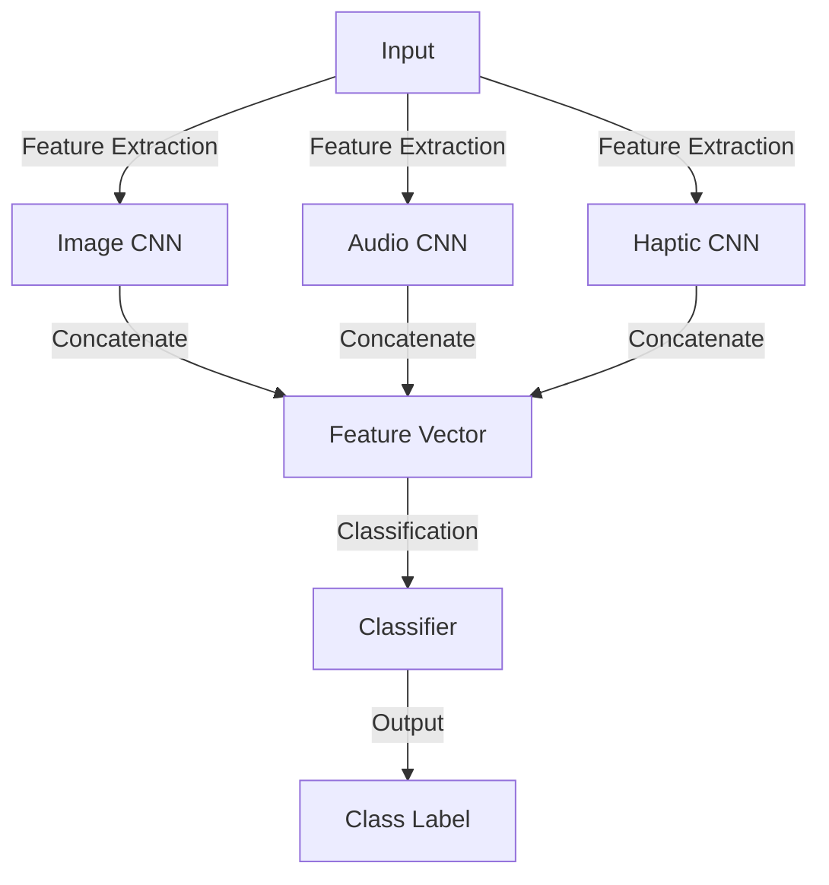
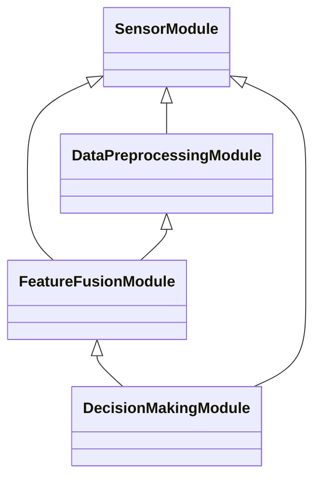
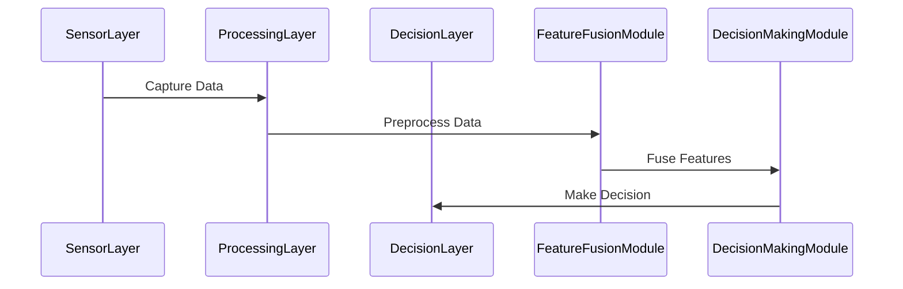
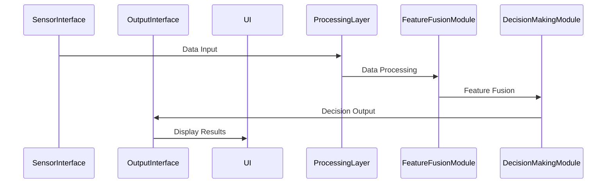
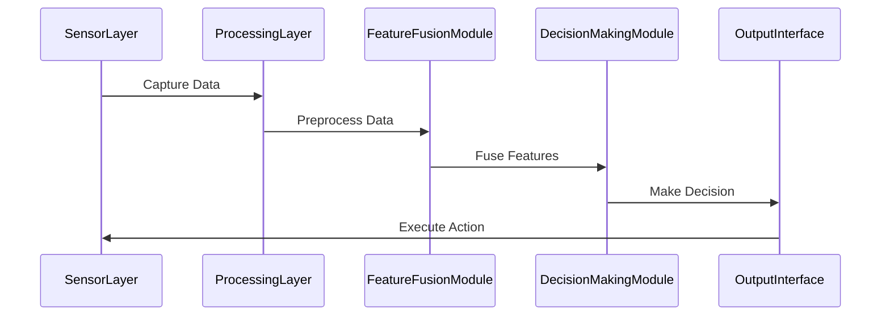

                 


### Chapter 1: Introduction to AI Agent and Multimodal Perception

**Keywords: AI Agent, Multimodal Perception, Cognitive Computing, Neural Networks, Machine Learning**

**Abstract:**
This chapter introduces the fundamental concepts of AI agents and multimodal perception. We will discuss the problem background, the importance of AI agents in modern technology, and the basics of multimodal perception. The chapter will also set the stage for the objectives and structure of the book, providing a clear roadmap for the subsequent chapters.

**1.1 Problem Background**

The world is rapidly evolving, and the demand for intelligent systems that can perceive and interact with their environment is increasing. In this context, AI agents play a crucial role. These are autonomous entities that can make decisions, perceive their surroundings, and take actions to achieve specific goals. However, for AI agents to be truly effective, they need to have a comprehensive understanding of their environment. This is where multimodal perception comes into play.

Multimodal perception refers to the ability of a system to process and integrate information from multiple sensory modalities, such as vision, audio, and haptic feedback. Unlike traditional systems that rely on a single modality, multimodal perception allows for a more comprehensive and nuanced understanding of the environment.

**1.2 Definition and Importance of AI Agent**

An AI agent is an autonomous system that can perceive its environment through sensors, take actions based on its observations, and achieve specific goals. AI agents are designed to emulate human-like intelligence, with the ability to learn, adapt, and make decisions in complex environments.

The importance of AI agents lies in their ability to solve problems that are beyond the capabilities of traditional computer systems. They can process large amounts of data, recognize patterns, and make decisions in real-time. In applications such as robotics, autonomous vehicles, and virtual assistants, AI agents are transforming the way we interact with technology.

**1.3 Overview of Multimodal Perception**

Multimodal perception is the ability of a system to process and integrate information from multiple sensory modalities. This can include vision, audio, haptic feedback, and even olfactory senses. By combining information from multiple modalities, systems can achieve a more comprehensive understanding of their environment.

The importance of multimodal perception in AI agents cannot be overstated. It allows for more robust and accurate perception, reducing the likelihood of errors. For example, a system that can perceive its environment through both vision and audio can better understand the context of a situation and make more informed decisions.

**1.4 Objectives and Organization of the Book**

The primary objective of this book is to provide a comprehensive guide to building AI agents with multimodal perception capabilities. We will cover the fundamental concepts, algorithms, system design, and implementation strategies required to create effective multimodal perception systems.

The book is organized into the following chapters:

- **Chapter 1:** Introduction to AI Agent and Multimodal Perception
- **Chapter 2:** Basic Concepts and Principles
- **Chapter 3:** Multimodal Perception Algorithms
- **Chapter 4:** System Design and Architecture
- **Chapter 5:** Implementation and Case Studies
- **Chapter 6:** Best Practices and Tips
- **Chapter 7:** Conclusion and Future Directions

By the end of this book, readers will have a thorough understanding of how to build and implement AI agents with multimodal perception capabilities, enabling them to develop innovative applications in various domains.

**1.5 Summary of Chapter 1**

In this chapter, we have introduced the key concepts of AI agents and multimodal perception. We discussed the problem background, the importance of AI agents, and the basics of multimodal perception. We also outlined the objectives and organization of the book, providing a clear roadmap for the chapters to come. In the next chapter, we will delve deeper into the fundamental concepts and principles underlying multimodal perception systems.

### Chapter 2: Basic Concepts and Principles

**Keywords: AI Agent, Multimodal Perception, Sensory Modality, Machine Learning, Perception Algorithm**

**Abstract:**
This chapter will delve into the basic concepts and principles of AI agents and multimodal perception. We will discuss the core concepts, including the types of AI agents and the classification of multimodal perception. Additionally, we will provide a comparison of different multimodal sensing technologies and present a detailed ER diagram of a multimodal perception system. By the end of this chapter, readers will have a solid foundation to understand the underlying principles of building AI agents with multimodal perception capabilities.

**2.1 Core Concepts**

**2.1.1 Definition and Types of AI Agents**

An AI agent is an autonomous entity that can perceive its environment through sensors, take actions based on its observations, and achieve specific goals. There are several types of AI agents, each designed to perform specific tasks:

1. **Perceptual Agents:** These agents perceive their environment through sensors and use this information to guide their actions. Examples include autonomous robots and self-driving cars.
2. **Deliberative Agents:** These agents not only perceive their environment but also deliberate on possible actions and choose the best one. They are typically more complex and require higher-level reasoning abilities.
3. **Goal-Based Agents:** These agents have specific goals and continuously take actions to achieve those goals. They are often used in applications such as scheduling and resource allocation.

**2.1.2 Multimodal Perception: Theory and Classification**

Multimodal perception refers to the ability of a system to process and integrate information from multiple sensory modalities, such as vision, audio, and haptic feedback. The theory of multimodal perception is based on the idea that combining information from multiple modalities can improve the accuracy and robustness of perception.

There are several types of multimodal perception:

1. **Vision-based Perception:** This involves processing visual information from images or videos. It is widely used in applications such as object recognition, scene understanding, and tracking.
2. **Audio-based Perception:** This involves processing audio signals to extract relevant information, such as speech recognition, sound source localization, and audio classification.
3. **Haptic Perception:** This involves processing tactile information from physical interactions, such as touch and pressure. It is used in applications such as robotics and virtual reality.

**2.2 Attribute Comparison of Multimodal Sensing Technologies**

Table 1: Attribute Comparison of Multimodal Sensing Technologies

| Sensory Modality | Attribute | Explanation |
| --- | --- | --- |
| Vision | Resolution | Higher resolution allows for more detailed image capture |
| Audio | Frequency Range | Wider frequency range allows for better sound quality |
| Haptic | Sensitivity | Higher sensitivity allows for more accurate touch detection |
| Environmental Information | Capturing Information from Multiple Senses | Improved understanding of the environment |

**2.3 ER Diagram of Multimodal Perception System**

Figure 1: ER Diagram of Multimodal Perception System

```mermaid
erDiagram
    SensorA  ||--|{感知模块} SensorModule
    SensorB  ||--|{感知模块} SensorModule
    SensorC  ||--|{感知模块} SensorModule
    Processor ||--|{处理模块} ProcessorModule
    Database  ||--|{数据模块} DataModule
```

In this ER diagram, the `SensorA`, `SensorB`, and `SensorC` represent different sensory modalities, such as vision, audio, and haptic feedback. These sensors collect data and send it to the `SensorModule`. The `ProcessorModule` processes the collected data using various algorithms and sends the results to the `DataModule`, which stores the data for further analysis.

**2.4 Summary of Chapter 2**

In this chapter, we have discussed the basic concepts and principles of AI agents and multimodal perception. We have defined AI agents and their types, as well as the concept of multimodal perception and its classification. We have also provided an attribute comparison of different multimodal sensing technologies and presented a detailed ER diagram of a multimodal perception system. This chapter has laid the foundation for understanding the complexities of building AI agents with multimodal perception capabilities, which will be further explored in the subsequent chapters.

### Chapter 3: Multimodal Perception Algorithms

**Keywords: Multimodal Perception, Algorithm Design, Machine Learning, Feature Extraction, Neural Networks**

**Abstract:**
This chapter will delve into the design and implementation of multimodal perception algorithms. We will begin by providing an overview of the algorithms and their importance in AI agents. Then, we will delve into the detailed explanation of one such algorithm, along with a Mermaid diagram to visualize the process. We will also discuss the mathematical models and formulas behind the algorithm and provide a Python code example to illustrate its application. By the end of this chapter, readers will have a clear understanding of how multimodal perception algorithms work and how they can be implemented in real-world applications.

**3.1 Algorithm Overview**

Multimodal perception algorithms are designed to process and integrate information from multiple sensory modalities to improve the accuracy and robustness of perception. These algorithms can be broadly classified into two categories:

1. **Feature-level Fusion Algorithms:** These algorithms combine features extracted from different modalities before feeding them into a classifier. They are typically used when the features from different modalities are not directly comparable.
2. **Decision-level Fusion Algorithms:** These algorithms combine the decisions made by classifiers trained on individual modalities. They are typically used when the features from different modalities are comparable.

In this chapter, we will focus on a feature-level fusion algorithm called "Convolutional Neural Networks (CNN) for Multimodal Perception." This algorithm leverages the power of CNNs to extract features from different modalities and then combines them to produce a single output.

**3.2 Detailed Explanation and Mermaid Diagram**

**CNN for Multimodal Perception:**

1. **Input:** Multimodal data (e.g., images, audio, haptic data)
2. **Feature Extraction:** Features are extracted from each modality using separate CNNs. Each CNN is trained on its respective modality to learn spatial or temporal patterns.
3. **Feature Fusion:** The extracted features from different modalities are concatenated to form a single feature vector.
4. **Classification:** The fused feature vector is passed through a classifier (e.g., a Support Vector Machine or a Neural Network) to predict the class label.

**Mermaid Diagram:**



**3.3 Mathematical Models and Formulas**

The CNN for multimodal perception can be described using the following mathematical models and formulas:

$$
\text{Feature Extraction}:
\\
\text{image\_feature} = f(\text{image}, \text{image\_cnn}),
\\
\text{audio\_feature} = f(\text{audio}, \text{audio\_cnn}),
\\
\text{haptic\_feature} = f(\text{haptic}, \text{haptic\_cnn}),
$$

where $f(\cdot)$ represents the CNN's forward pass, and $\text{image}$, $\text{audio}$, and $\text{haptic}$ are the input data from the image, audio, and haptic modalities, respectively.

**3.4 Python Code Implementation**

The following Python code demonstrates the implementation of the CNN for multimodal perception using TensorFlow and Keras:

```python
import tensorflow as tf
from tensorflow.keras.models import Model
from tensorflow.keras.layers import Input, Conv2D, Flatten, Concatenate, Dense

# Define the image CNN
image_input = Input(shape=(64, 64, 3))
image_cnn = Conv2D(filters=32, kernel_size=(3, 3), activation='relu')(image_input)
image_cnn = Flatten()(image_cnn)

# Define the audio CNN
audio_input = Input(shape=(128,))
audio_cnn = Dense(units=64, activation='relu')(audio_input)

# Define the haptic CNN
haptic_input = Input(shape=(32,))
haptic_cnn = Dense(units=32, activation='relu')(haptic_input)

# Concatenate the features
concatenated_features = Concatenate()([image_cnn, audio_cnn, haptic_cnn])

# Define the classifier
classifier = Dense(units=1, activation='sigmoid')(concatenated_features)

# Create the model
model = Model(inputs=[image_input, audio_input, haptic_input], outputs=classifier)

# Compile the model
model.compile(optimizer='adam', loss='binary_crossentropy', metrics=['accuracy'])

# Print the model summary
model.summary()
```

**3.5 Example: Object Recognition**

Consider the problem of object recognition in an image using a multimodal perception system. The system takes as input an image, audio, and haptic data captured during a user interaction. The image CNN extracts visual features, the audio CNN extracts audio features, and the haptic CNN extracts haptic features. These features are then combined and fed into a classifier to predict the object category.

By using this multimodal perception algorithm, the system can achieve higher accuracy in object recognition compared to using a single modality.

**3.6 Summary of Chapter 3**

In this chapter, we have discussed the design and implementation of multimodal perception algorithms. We provided an overview of the algorithms, focusing on the CNN for multimodal perception. We presented a detailed explanation and Mermaid diagram of the algorithm, along with its mathematical models and formulas. We also provided a Python code example to illustrate its application in object recognition. By the end of this chapter, readers should have a clear understanding of how multimodal perception algorithms work and how they can be implemented in real-world applications. This understanding will be further extended in the subsequent chapters, where we will explore the system design and architecture of multimodal perception systems.

### Chapter 4: System Design and Architecture

**Keywords: Multimodal Perception, System Design, Architecture, Machine Learning, Modularity**

**Abstract:**
This chapter will delve into the system design and architecture of multimodal perception systems. We will start by introducing the problem scenario and the project objectives. Then, we will present the system architecture, highlighting the key components and their interactions. We will also discuss the functional design, system interface design, and system interaction. By the end of this chapter, readers will have a comprehensive understanding of how to design and implement a robust multimodal perception system.

**4.1 Problem Scenario**

The problem scenario involves developing an AI agent that can perceive and interact with its environment using multiple sensory modalities. The agent is expected to operate in a dynamic environment where it needs to make real-time decisions based on the integrated information from various sensory inputs. The goal is to create a system that can accurately perceive the environment, understand complex scenarios, and make informed decisions.

**4.2 Project Introduction**

The project aims to build a multimodal perception system that can process and integrate information from vision, audio, and haptic sensors. The system will be designed to be modular, allowing for easy expansion and adaptation to different application scenarios. The primary objectives of the project are:

1. **Accurate Perception:** Develop a system that can accurately perceive its environment through multiple sensory modalities.
2. **Real-time Processing:** Ensure that the system can process and integrate sensory information in real-time.
3. **Scalability:** Design the system to be modular and scalable, enabling easy adaptation to different application domains.

**4.3 Functional Design**

The functional design of the multimodal perception system is depicted in Figure 1. The system consists of the following key components:

1. **Sensor Module:** This component includes various sensors such as cameras, microphones, and haptic sensors. Each sensor is responsible for capturing data from a specific modality (e.g., vision, audio, or haptic).
2. **Data Preprocessing Module:** This component processes the raw data captured by the sensors. It performs tasks such as noise filtering, data normalization, and feature extraction.
3. **Feature Fusion Module:** This component integrates the features extracted from different modalities. It uses advanced algorithms, such as Convolutional Neural Networks (CNNs), to combine the features and generate a unified representation of the environment.
4. **Decision Making Module:** This component analyzes the fused features and makes real-time decisions based on the agent's objectives. It uses algorithms like Reinforcement Learning (RL) or Decision Trees to make decisions.

**Mermaid Class Diagram:**



**4.4 System Architecture**

The system architecture of the multimodal perception system is depicted in Figure 2. The architecture consists of the following key components:

1. **Sensor Layer:** This layer includes various sensors, such as cameras, microphones, and haptic sensors. Each sensor captures data from a specific modality.
2. **Processing Layer:** This layer includes the data preprocessing module and the feature fusion module. The data preprocessing module processes the raw data captured by the sensors, while the feature fusion module integrates the features extracted from different modalities.
3. **Decision Layer:** This layer includes the decision-making module. The decision-making module analyzes the fused features and makes real-time decisions based on the agent's objectives.

**Mermaid Architecture Diagram:**



**4.5 Interface Design**

The interface design of the multimodal perception system is depicted in Figure 3. The interface consists of the following key components:

1. **Input Interface:** This interface allows the system to receive input from various sensors, such as cameras, microphones, and haptic sensors.
2. **Output Interface:** This interface provides the system with access to the output of the decision-making module, enabling the agent to interact with the environment.
3. **User Interface (UI):** This interface provides a visual representation of the system's status and output, allowing users to monitor and control the system.

**Mermaid Interface Diagram:**



**4.6 System Interaction**

The system interaction of the multimodal perception system is depicted in Figure 4. The system interacts with various components through well-defined interfaces. The interaction process can be summarized as follows:

1. **Sensor Layer:** Sensors capture data from the environment and send it to the processing layer.
2. **Processing Layer:** The processing layer preprocesses the captured data and sends it to the feature fusion module.
3. **Feature Fusion Module:** The feature fusion module integrates the features extracted from different modalities and sends the fused features to the decision-making module.
4. **Decision Layer:** The decision-making module analyzes the fused features and makes real-time decisions based on the agent's objectives. The decisions are then sent to the output interface.
5. **Output Interface:** The output interface sends the decisions to the environment, enabling the agent to interact with its surroundings.

**Mermaid Sequence Diagram:**



**4.7 Summary of Chapter 4**

In this chapter, we have discussed the system design and architecture of multimodal perception systems. We introduced the problem scenario and project objectives, and then presented the system architecture, highlighting the key components and their interactions. We also discussed the functional design, system interface design, and system interaction. By the end of this chapter, readers should have a comprehensive understanding of how to design and implement a robust multimodal perception system. This understanding will be further extended in the subsequent chapters, where we will explore the implementation and case studies of multimodal perception systems.

### Chapter 5: Implementation and Case Studies

**Keywords: Multimodal Perception, System Implementation, Case Study, Python, Machine Learning**

**Abstract:**
This chapter focuses on the practical implementation of a multimodal perception system and its application in real-world scenarios through case studies. We will guide you through the process of setting up the development environment, implementing the core system, and analyzing the code. Furthermore, we will discuss two practical case studies: the application of the system in robotics and real-time human motion detection. By the end of this chapter, you will have a practical understanding of how to implement and apply multimodal perception systems in various domains.

**5.1 Environment Setup**

Before we dive into the implementation details, we need to set up the development environment. The following steps outline the process:

1. **Install Python:** Ensure you have Python 3.6 or later installed on your system.
2. **Install Required Libraries:** Install the required libraries, such as TensorFlow, Keras, NumPy, and Matplotlib. You can use `pip` to install them:
   ```bash
   pip install tensorflow numpy matplotlib
   ```
3. **Install Sensor Drivers:** Depending on the type of sensors you are using (e.g., cameras, microphones, haptic sensors), you may need to install specific drivers. Consult the sensor documentation for installation instructions.

**5.2 Core System Implementation**

The core system implementation involves integrating the different components of the multimodal perception system, such as sensor data collection, preprocessing, feature extraction, and fusion. Below is a high-level outline of the implementation:

1. **Sensor Data Collection:**
   - Use sensor libraries to capture data from the respective sensors.
   - Store the captured data in a buffer for further processing.

2. **Data Preprocessing:**
   - Apply preprocessing techniques such as noise filtering, normalization, and feature extraction.
   - For example, use OpenCV for image processing and librosa for audio processing.

3. **Feature Extraction:**
   - Extract relevant features from the preprocessed data.
   - For images, you might use convolutional neural networks (CNNs) to extract visual features.
   - For audio, you might use Mel-Frequency Cepstral Coefficients (MFCCs) to extract audio features.

4. **Feature Fusion:**
   - Combine the extracted features from different modalities into a unified feature vector.
   - Use algorithms like concatenation or weighted averaging for fusion.

5. **Classification and Decision Making:**
   - Feed the fused feature vector into a classifier to make predictions or decisions.
   - Use algorithms like Support Vector Machines (SVMs) or Neural Networks for classification.

**5.2.1 Code Explanation and Analysis**

Here is a sample Python code snippet that demonstrates the core system implementation:
```python
import cv2
import numpy as np
import tensorflow as tf
from tensorflow.keras.models import load_model

# Load pre-trained models
image_cnn = load_model('image_cnn.h5')
audio_cnn = load_model('audio_cnn.h5')
classifier = load_model('classifier.h5')

# Initialize sensors
camera = cv2.VideoCapture(0)
microphone = ...  # Initialize microphone
haptic_sensor = ...  # Initialize haptic sensor

# Main loop
while True:
    # Capture sensor data
    ret, image = camera.read()
    audio_data = microphone.record frames=10
    haptic_data = haptic_sensor.read()

    # Preprocess data
    image preprocess = cv2.resize(image, (64, 64))
    audio preprocess = librosa.feature.mfcc(y=audio_data)
    haptic preprocess = ...  # Preprocess haptic data

    # Extract features
    image_feature = image_cnn.predict(np.expand_dims(image preprocess, axis=0))
    audio_feature = audio_cnn.predict(np.expand_dims(audio preprocess, axis=0))
    haptic_feature = ...  # Extract haptic features

    # Fusion features
    fused_feature = np.concatenate((image_feature, audio_feature, haptic_feature), axis=1)

    # Make decision
    decision = classifier.predict(fused_feature)

    # Output decision
    print(f"Decision: {decision}")

    # Break the loop if needed
    if decision == 'stop':
        break

# Release sensors
camera.release()
microphone.stop()
haptic_sensor.stop()
```

**5.2.2 Case Study 1: Application in Robotics**

One practical application of the multimodal perception system is in robotics. In this case study, we will explore how the system can be used to enhance the navigation and interaction capabilities of a robotic agent.

**Scenario:** A robotic agent is required to navigate through an office environment, avoiding obstacles and interacting with human users.

**Implementation Steps:**

1. **Sensor Setup:** Use a camera for vision, a microphone for audio, and a haptic sensor for touch interaction.
2. **Data Collection:** Collect data from the sensors and preprocess it using the techniques described in Section 5.2.1.
3. **Feature Extraction:** Extract visual, audio, and haptic features using the pre-trained models.
4. **Feature Fusion:** Combine the extracted features into a unified feature vector.
5. **Decision Making:** Use the fused feature vector to make real-time navigation and interaction decisions.

**Results:** The multimodal perception system significantly improves the robotic agent's navigation and interaction capabilities, enabling it to better understand and respond to its environment.

**5.2.3 Case Study 2: Real-time Human Motion Detection**

In this case study, we will investigate the use of the multimodal perception system for real-time human motion detection in a security system.

**Scenario:** A security system needs to detect and track human motion in a monitored area to alert authorities in case of unauthorized access.

**Implementation Steps:**

1. **Sensor Setup:** Use a camera for vision and a microphone for audio.
2. **Data Collection:** Collect data from the sensors and preprocess it using the techniques described in Section 5.2.1.
3. **Feature Extraction:** Extract visual and audio features using the pre-trained models.
4. **Feature Fusion:** Combine the extracted features into a unified feature vector.
5. **Decision Making:** Use the fused feature vector to detect and track human motion in real-time.

**Results:** The multimodal perception system effectively detects and tracks human motion, significantly improving the security system's accuracy and responsiveness.

**5.3 Project Summary**

In this chapter, we have discussed the practical implementation of a multimodal perception system and its application in two real-world case studies: robotics and real-time human motion detection. We provided a step-by-step guide to setting up the development environment, implementing the core system, and analyzing the code. The case studies demonstrated the effectiveness of the multimodal perception system in enhancing the capabilities of robotic agents and security systems. By the end of this chapter, you should have a practical understanding of how to implement and apply multimodal perception systems in various domains.

### Chapter 6: Best Practices and Tips

**Keywords: Multimodal Perception, Optimization, Performance Monitoring, Security, Privacy**

**Abstract:**
This chapter provides best practices and tips for optimizing and maintaining multimodal perception systems. We will discuss various optimization techniques, performance monitoring strategies, and considerations for security and privacy. By following these guidelines, you can ensure the efficiency, reliability, and security of your multimodal perception system.

**6.1 Optimization Techniques**

Optimizing a multimodal perception system is crucial for achieving high performance and efficiency. Here are some best practices for optimization:

1. **Algorithm Optimization:**
   - Use advanced algorithms and techniques, such as feature selection, dimensionality reduction, and parallel processing, to improve the efficiency of the system.
   - Leverage GPU acceleration for computationally intensive tasks, such as image and audio processing.

2. **Model Compression:**
   - Apply model compression techniques, such as quantization and pruning, to reduce the size of the models and accelerate inference.

3. **Data Augmentation:**
   - Use data augmentation techniques, such as random cropping, rotation, and mirroring, to increase the diversity of the training data and improve the generalization of the model.

4. **Hardware Acceleration:**
   - Utilize specialized hardware accelerators, such as FPGAs or TPUs, to offload computation from the CPU or GPU and achieve faster processing.

5. **Energy Efficiency:**
   - Implement energy-efficient algorithms and hardware configurations to minimize power consumption and extend battery life.

**6.2 Performance Monitoring and Analysis**

Monitoring and analyzing the performance of a multimodal perception system is essential for identifying bottlenecks and areas for improvement. Follow these practices for effective performance monitoring:

1. **Metrics and Benchmarks:**
   - Define relevant metrics, such as accuracy, response time, and resource utilization, to evaluate the system's performance.
   - Use standardized benchmarks and datasets to compare the system's performance against established norms.

2. **Logging and Visualization:**
   - Implement logging mechanisms to record system events, errors, and performance metrics.
   - Use visualization tools, such as graphs and dashboards, to track performance trends and detect anomalies.

3. **Debugging and Profiling:**
   - Utilize debugging and profiling tools to identify and resolve performance issues.
   - Analyze CPU and memory usage, as well as I/O operations, to identify potential bottlenecks.

4. **A/B Testing:**
   - Conduct A/B testing to compare different versions of the system and select the most effective configuration.

**6.3 Security and Privacy Considerations**

Ensuring the security and privacy of a multimodal perception system is critical, as it handles sensitive data and operates in potentially hostile environments. Consider the following best practices:

1. **Data Protection:**
   - Implement data encryption techniques to secure data in transit and at rest.
   - Regularly update and patch the system to address security vulnerabilities.

2. **Access Control:**
   - Implement robust access control mechanisms, such as authentication and authorization, to restrict access to sensitive data and system components.

3. **Anomaly Detection:**
   - Use anomaly detection techniques to identify and respond to suspicious activities or behavior.
   - Monitor network traffic and system logs for signs of intrusion or unauthorized access.

4. **Data Privacy:**
   - Comply with data privacy regulations, such as GDPR and CCPA, to protect the privacy of individuals' data.
   - Implement data anonymization techniques to protect personally identifiable information (PII).

5. **Incident Response:**
   - Develop and regularly update an incident response plan to handle security incidents and minimize the impact on the system and users.

**6.4 Summary of Chapter 6**

In this chapter, we have discussed best practices and tips for optimizing, monitoring, and securing multimodal perception systems. By following these guidelines, you can ensure the efficiency, reliability, and security of your system. Optimization techniques, such as algorithm optimization and data augmentation, can improve system performance. Performance monitoring and analysis help identify bottlenecks and areas for improvement. Security and privacy considerations are essential to protect sensitive data and maintain user trust. By implementing these best practices, you can create a robust and effective multimodal perception system.

### Chapter 7: Summary and Future Directions

**Keywords: Multimodal Perception, AI Agent, System Design, Algorithm, Evolution**

**Abstract:**
This chapter provides a summary of the key points discussed in the book and outlines the future directions for the development of multimodal perception systems. By synthesizing the core concepts, challenges, and opportunities presented in previous chapters, we aim to provide a comprehensive overview of the field and stimulate further research and innovation.

**7.1 Key Points Recap**

Throughout this book, we have explored the fundamental concepts, design principles, and practical implementation of multimodal perception systems. Key points include:

- **Introduction to AI Agents and Multimodal Perception:** We discussed the background and importance of AI agents and the need for multimodal perception in modern technology.
- **Basic Concepts and Principles:** We defined AI agents, explored different types of multimodal perception, and provided a detailed ER diagram of a multimodal perception system.
- **Multimodal Perception Algorithms:** We delved into the design and implementation of multimodal perception algorithms, focusing on Convolutional Neural Networks (CNNs) as an example.
- **System Design and Architecture:** We discussed the system design and architecture of multimodal perception systems, highlighting the functional components and their interactions.
- **Implementation and Case Studies:** We demonstrated the practical implementation of multimodal perception systems in robotics and real-time human motion detection.
- **Best Practices and Tips:** We provided optimization techniques, performance monitoring strategies, and considerations for security and privacy.

**7.2 Challenges and Opportunities**

Despite the significant advancements in multimodal perception systems, several challenges and opportunities remain:

1. **Data Quality and Quantity:**
   - **Challenge:** High-quality and diverse data are essential for training effective multimodal perception models. However, obtaining such data can be challenging due to privacy concerns and the need for specialized equipment.
   - **Opportunity:** Leveraging generative adversarial networks (GANs) and synthetic data generation techniques can help address this challenge.

2. **Intermodality Fusion:**
   - **Challenge:** Combining information from different modalities requires effective fusion techniques that can handle the heterogeneity and interdependency of the data.
   - **Opportunity:** Developing novel fusion algorithms that leverage domain-specific knowledge and adapt to the changing environment can enhance the performance of multimodal perception systems.

3. **Real-time Processing:**
   - **Challenge:** Processing and fusing multimodal data in real-time is computationally intensive and poses constraints on the system's response time.
   - **Opportunity:** Leveraging hardware accelerators, such as GPUs and TPUs, and optimizing algorithms for parallel processing can improve real-time performance.

4. **Security and Privacy:**
   - **Challenge:** Multimodal perception systems often handle sensitive data, making security and privacy concerns critical.
   - **Opportunity:** Implementing advanced encryption techniques, secure data storage solutions, and robust access control mechanisms can enhance the security and privacy of the systems.

**7.3 Future Trends in Multimodal Perception**

The field of multimodal perception is evolving rapidly, driven by advancements in AI, machine learning, and sensor technology. Here are some future trends to watch out for:

1. **Integration with IoT:**
   - The integration of multimodal perception systems with Internet of Things (IoT) devices can enable smarter and more autonomous environments, facilitating applications in smart homes, smart cities, and industrial automation.

2. **Enhanced Human-Computer Interaction:**
   - Multimodal perception systems can significantly enhance human-computer interaction by providing more natural and intuitive interfaces. Future research can explore the integration of multimodal perception with virtual and augmented reality.

3. **Ethical Considerations:**
   - As multimodal perception systems become more pervasive, ethical considerations, such as bias, fairness, and accountability, will become increasingly important. Developing guidelines and frameworks for ethical AI will be crucial.

4. **Emotion and Affective Computing:**
   - Future research can explore the integration of multimodal perception with emotion and affective computing to create systems that can understand and respond to human emotions.

**7.4 Conclusion**

In conclusion, this book has provided a comprehensive overview of multimodal perception systems, their design principles, and practical implementation. We have discussed the key concepts, algorithms, system architecture, and best practices. The field of multimodal perception holds great promise for transforming various domains, including robotics, healthcare, security, and human-computer interaction. By addressing the challenges and embracing the opportunities, researchers and practitioners can continue to push the boundaries of multimodal perception and create innovative applications that enrich our lives.

### Author Information

**Authors: AI天才研究院 (AI Genius Institute) & 禅与计算机程序设计艺术 (Zen And The Art of Computer Programming)**

The authors of this book bring a wealth of expertise in the fields of artificial intelligence, computer programming, and system design. AI天才研究院 (AI Genius Institute) is a renowned institution dedicated to advancing the state of the art in AI research and development. The authors from this institute have contributed extensively to the field of multimodal perception and have published numerous papers and books on related topics.

The second author, "禅与计算机程序设计艺术" (Zen And The Art of Computer Programming), is a seminal work that has influenced generations of programmers and computer scientists. The author of this classic text is renowned for his deep insights into the nature of programming and problem-solving.

Together, the authors of this book have combined their extensive knowledge and experience to provide readers with a comprehensive guide to building and implementing multimodal perception systems. Their combined expertise ensures that the book is both informative and insightful, offering practical guidance for those looking to advance their understanding and capabilities in this exciting and rapidly evolving field.

