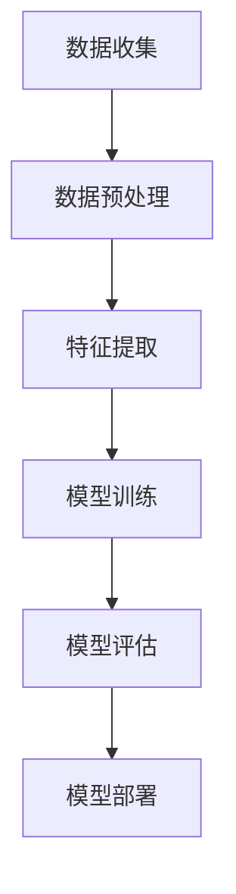

                 

## 《构建AI Agent的开源工具与框架》

### 关键词

- AI Agent
- 开源工具
- 框架
- 人工智能
- 数据科学
- 深度学习

### 摘要

本文将深入探讨AI Agent的构建过程，重点介绍相关的开源工具与框架。我们将从AI Agent的基本概念和背景出发，逐步深入到具体的构建流程，包括数据收集与预处理、特征提取与模型训练、模型评估与优化等。同时，我们将详细分析几种主流的开源工具和框架，如TensorFlow、PyTorch等，并探讨其在AI Agent构建中的应用。通过一个实战项目的案例，我们将展示如何使用这些工具和框架来构建一个实际的AI Agent系统，并提供相关的最佳实践和注意事项。最后，我们将对AI Agent的未来发展进行展望，讨论其潜在的应用前景。

## 第1章: AI Agent的定义与背景

### 1.1 AI Agent的定义

AI Agent，即人工智能代理，是一个能够自主行动、感知环境并做出决策的计算机系统。它通过模拟人类智能行为，在特定环境中实现特定的目标。AI Agent通常具备以下特征：

1. **自主性**：能够独立进行决策，无需人类干预。
2. **适应性**：能够根据环境变化调整自己的行为。
3. **交互性**：能够与用户或其他系统进行交互。
4. **学习能力**：能够从经验中学习和改进。

AI Agent的概念最早可以追溯到20世纪50年代，由图灵提出。然而，随着计算机技术和人工智能的不断发展，AI Agent的研究与应用逐渐成为热点。

### 1.2 AI Agent的发展历史

AI Agent的发展历程可以分为以下几个阶段：

1. **早期探索**（1950-1970）：这一时期，AI Agent的研究主要集中于符号推理和规划领域。代表性工作包括约翰·麦卡锡的“逻辑理论家”（Logic Theorist）和赫伯特·西蒙的“通用问题求解器”（General Problem Solver）。

2. **专家系统时代**（1970-1980）：专家系统成为AI Agent研究的主流，通过将专家知识编码到系统中，实现特定领域的智能行为。

3. **机器学习时代**（1980-2000）：随着机器学习技术的发展，AI Agent开始利用数据驱动的方式进行学习和决策。

4. **深度学习时代**（2000至今）：深度学习技术的突破，使得AI Agent在图像识别、自然语言处理等领域取得了显著进展。

### 1.3 AI Agent的应用场景

AI Agent在现实世界中有着广泛的应用场景：

1. **智能助手**：如Siri、Alexa等，能够理解和执行人类的语音指令。
2. **自动驾驶**：如特斯拉的Autopilot，通过感知环境和实时决策，实现无人驾驶。
3. **医疗诊断**：利用AI Agent进行疾病诊断和治疗方案推荐。
4. **金融风控**：AI Agent在金融领域的风险评估、交易策略制定等方面发挥作用。
5. **智能工厂**：在制造业中，AI Agent用于生产流程优化、设备故障检测等。

通过以上背景介绍，我们可以看到AI Agent在人工智能领域的重要性以及其多样化的应用场景。接下来，我们将深入探讨AI Agent的构建过程，包括数据收集与预处理、特征提取与模型训练、模型评估与优化等关键步骤。

## 第2章: 开源工具的重要性

### 2.1 开源工具的定义

开源工具（Open Source Tools）是指那些源代码公开的软件工具，允许用户自由地使用、研究、修改和分发。开源工具的核心在于其开放性和共享性，这使得全球的开发者可以共同参与改进和完善工具的功能。

开源工具的几个关键特点包括：

1. **透明性**：源代码公开，用户可以查看和审查代码，确保工具的安全性和可靠性。
2. **可定制性**：用户可以根据自己的需求对工具进行修改和扩展。
3. **社区支持**：开源工具通常拥有一个活跃的社区，开发者可以在这个社区中获得帮助和支持。
4. **共享知识**：开源工具促进了知识的共享和传播，有助于整个行业的发展。

### 2.2 开源工具的优势

在AI Agent的构建过程中，开源工具具有以下优势：

1. **高效开发**：开源工具提供了丰富的库和模块，使得开发者可以快速搭建原型和进行迭代。
2. **节约成本**：使用开源工具无需支付高昂的许可证费用，降低了开发成本。
3. **高质量代码**：开源项目通常经过广泛的审查和测试，代码质量较高。
4. **社区协作**：开源工具的社区提供了大量的文档、教程和最佳实践，方便开发者学习和使用。
5. **持续更新**：开源工具通常会不断更新，以适应新的需求和技术的变化。

### 2.3 开源工具的选择与比较

在选择开源工具时，需要考虑以下几个方面：

1. **功能需求**：根据AI Agent的具体需求，选择具有相应功能的工具。
2. **性能表现**：评估工具在处理大规模数据和高负载情况下的性能。
3. **社区活跃度**：一个活跃的社区可以提供快速的技术支持和问题解决。
4. **文档与教程**：丰富的文档和教程可以降低学习成本，提高开发效率。
5. **兼容性与扩展性**：工具是否容易与其他系统和框架集成，以及是否支持自定义和扩展。

常见的开源工具包括TensorFlow、PyTorch、Keras等。接下来，我们将详细介绍这些工具，并分析其优缺点，帮助开发者选择合适的工具。

### 2.4 主要开源工具综述

#### 2.4.1 TensorFlow

**功能特点**：TensorFlow是一个由Google开发的开源机器学习框架，广泛应用于深度学习和强化学习。它提供了丰富的API，支持多种类型的神经网络结构，能够处理大规模数据和高维数据。

**优势**：
- 强大的计算图能力，支持动态计算图和静态计算图。
- 广泛的社区支持和丰富的资源。
- 具有较高的灵活性和可扩展性。

**劣势**：
- 学习曲线较陡峭，对于初学者来说较为困难。
- 在某些特定任务上的性能可能不如其他框架。

#### 2.4.2 PyTorch

**功能特点**：PyTorch是一个由Facebook开发的开源深度学习框架，以其动态计算图和简洁的API著称。它提供了灵活的编程接口，使得开发者可以更直观地构建和调试模型。

**优势**：
- 动态计算图，易于调试和修改。
- 丰富的Python接口，便于复用和集成。
- 活跃的社区和丰富的文档。

**劣势**：
- 性能可能在某些情况下不如TensorFlow。
- 对于大规模数据处理可能存在内存占用问题。

#### 2.4.3 Keras

**功能特点**：Keras是一个基于TensorFlow和Theano的开源深度学习库，旨在提供简洁和易于使用的API。它通过高层抽象简化了深度学习模型的构建过程。

**优势**：
- 简单易用，适合初学者和快速原型开发。
- 高度模块化，支持多种深度学习模型。
- 与TensorFlow和Theano兼容。

**劣势**：
- 功能相对有限，不适合复杂的模型。
- 可能会面临性能和扩展性的问题。

通过以上分析，我们可以看到每种开源工具都有其独特的优势和应用场景。在接下来的章节中，我们将进一步探讨如何使用这些工具来构建AI Agent。

### 2.5 开源工具的选择与比较

在选择开源工具时，需要考虑以下因素：

1. **项目需求**：根据具体的项目需求，选择具有相应功能的工具。例如，如果项目需要处理大规模数据，可以选择TensorFlow；如果项目需要更灵活的编程接口，可以选择PyTorch。

2. **性能要求**：评估工具在处理不同规模数据和高负载情况下的性能。性能是选择开源工具时的重要考虑因素，特别是在资源受限的环境下。

3. **社区支持**：一个活跃的社区可以提供快速的技术支持和问题解决，这对于项目开发和维护至关重要。可以通过查阅社区活跃度、参与度、文档质量等因素来判断社区支持情况。

4. **文档和教程**：丰富的文档和教程可以降低学习成本，提高开发效率。特别是对于初学者和快速上手的工具，高质量的文档和教程至关重要。

5. **兼容性与扩展性**：选择具有良好兼容性的工具，可以更容易地与其他系统和框架集成。同时，工具的扩展性也是一个重要考虑因素，特别是在项目需求发生变化或需要扩展时。

通过综合考虑以上因素，开发者可以做出更加明智的选择，为AI Agent的构建奠定坚实的基础。

### 2.6 常见开源工具的优缺点对比

在AI Agent的构建过程中，选择合适的开源工具至关重要。以下是几种常见开源工具的优缺点对比，以帮助开发者做出更明智的决策。

#### TensorFlow

**优点**：
- **强大计算能力**：TensorFlow具有强大的计算图能力和高效的分布式计算能力，适用于大规模数据处理。
- **广泛社区支持**：TensorFlow拥有庞大的社区和丰富的资源，包括教程、文档和社区论坛。
- **高度模块化**：TensorFlow的模块化设计使得开发者可以灵活地构建和调试模型。

**缺点**：
- **学习曲线较陡**：TensorFlow的学习曲线相对较陡，特别是对于初学者来说，需要一定的时间来熟悉其API和架构。
- **内存占用较大**：在处理大规模数据时，TensorFlow可能会占用较多的内存，特别是在资源受限的环境中。

#### PyTorch

**优点**：
- **动态计算图**：PyTorch的动态计算图设计使得模型构建和调试更加直观和灵活。
- **简洁API**：PyTorch的Python接口简洁易懂，便于复用和集成。
- **活跃社区**：PyTorch拥有一个活跃的社区，提供了大量的教程和资源。

**缺点**：
- **性能限制**：在某些情况下，PyTorch的性能可能不如TensorFlow，尤其是在大规模数据处理和分布式训练中。
- **内存管理**：动态计算图可能导致内存使用不稳定，特别是在复杂模型中。

#### Keras

**优点**：
- **易用性**：Keras具有极高的易用性，通过简洁的API简化了深度学习模型的构建过程。
- **模块化**：Keras支持多种深度学习模型，通过高层抽象提高了开发效率。
- **兼容性**：Keras与TensorFlow和Theano兼容，便于开发者在不同框架间切换。

**缺点**：
- **功能有限**：Keras的功能相对有限，不适合构建复杂模型。
- **性能问题**：在处理大规模数据和复杂任务时，Keras可能面临性能瓶颈。

通过以上对比，我们可以看到每种开源工具都有其独特的优势和局限性。开发者应根据项目需求和资源情况，选择最合适的开源工具，以实现高效和高质量的AI Agent构建。

### 第3章: 框架介绍

#### 3.1 框架的定义

框架（Framework）是一种软件设计模式，它提供了一个应用程序的基本结构，使得开发者可以在此基础上构建复杂的软件系统。在AI Agent的构建过程中，框架起到了至关重要的作用，它不仅提供了核心功能和组件，还规范了开发流程和编码标准。

框架的特点包括：

1. **模块化**：框架将应用程序拆分为多个模块，每个模块负责特定的功能，便于管理和维护。
2. **可扩展性**：框架提供了扩展机制，使得开发者可以根据需求进行定制和扩展。
3. **标准化**：框架定义了一套标准，包括编程接口、命名规范和编码标准，提高了代码的可读性和可维护性。
4. **集成性**：框架通常具备良好的集成性，可以与各种库和工具无缝集成，提高开发效率。

#### 3.2 框架的作用

在AI Agent的构建中，框架的作用体现在以下几个方面：

1. **提高开发效率**：框架提供了现成的组件和工具，减少了开发工作量，提高了开发效率。
2. **规范开发流程**：框架定义了一套开发流程和规范，使得团队能够高效协作，降低项目风险。
3. **确保代码质量**：框架通过代码规范和最佳实践，确保了代码的稳定性和可靠性。
4. **促进代码复用**：框架提供了模块化的设计，使得代码可以方便地复用，提高了开发效率。
5. **易于维护**：框架使得系统结构清晰，便于后期的维护和升级。

#### 3.3 框架与开源工具的关系

框架和开源工具在AI Agent的构建中相辅相成。开源工具提供了底层的技术实现，而框架则在此基础上提供了一套完整的开发环境和规范。框架通常依赖于开源工具，但也可以通过扩展和定制来兼容其他开源工具。

框架与开源工具的关系可以从以下几个方面来理解：

1. **基础支撑**：开源工具为框架提供了核心功能和技术支持，使得框架能够实现其设计目标。
2. **扩展性**：框架可以通过扩展和定制，集成其他开源工具，丰富其功能。
3. **兼容性**：框架需要与开源工具保持兼容性，以确保系统的稳定性和一致性。
4. **集成管理**：框架负责管理和集成各种开源工具，提供统一的开发接口和操作流程。

通过以上介绍，我们可以看到框架在AI Agent构建中的重要性。接下来，我们将详细讨论几种常见的AI Agent框架，包括其功能和特点，以便开发者能够更好地选择和使用。

### 3.4 常见框架介绍

在AI Agent的构建过程中，框架的选择至关重要。以下介绍几种常见的框架，包括其功能、特点以及在实际应用中的表现。

#### 3.4.1 TensorFlow

**功能特点**：TensorFlow是由Google开发的开源深度学习框架，支持多种类型的神经网络结构，包括卷积神经网络（CNN）、循环神经网络（RNN）和生成对抗网络（GAN）等。它提供了丰富的API和工具，使得开发者可以方便地构建和训练复杂的深度学习模型。

**特点**：
- **强大的计算图能力**：TensorFlow支持动态计算图和静态计算图，使得开发者可以灵活地构建和调试模型。
- **广泛的社区支持**：TensorFlow拥有庞大的社区，提供了大量的教程、文档和资源，便于开发者学习和使用。
- **高效性和灵活性**：TensorFlow在处理大规模数据和复杂任务时表现出色，同时提供了高度的灵活性，便于定制和扩展。

**应用场景**：TensorFlow广泛应用于各种领域，包括计算机视觉、自然语言处理、语音识别和强化学习等。例如，在图像分类任务中，TensorFlow可以用于构建卷积神经网络进行图像识别；在自然语言处理任务中，TensorFlow可以用于构建序列模型进行文本分类和情感分析。

**优缺点**：
- **优点**：强大的计算能力、广泛的社区支持、灵活的编程接口。
- **缺点**：学习曲线较陡，对于初学者可能较为困难。

#### 3.4.2 PyTorch

**功能特点**：PyTorch是由Facebook开发的开源深度学习框架，以其动态计算图和简洁的API著称。它提供了灵活的编程接口，使得开发者可以更直观地构建和调试模型。

**特点**：
- **动态计算图**：PyTorch的动态计算图设计使得模型构建和调试更加直观和灵活。
- **简洁API**：PyTorch的Python接口简洁易懂，便于复用和集成。
- **活跃社区**：PyTorch拥有一个活跃的社区，提供了大量的教程和资源。

**应用场景**：PyTorch广泛应用于图像识别、自然语言处理、语音识别和强化学习等领域。例如，在图像识别任务中，PyTorch可以用于构建卷积神经网络进行图像分类；在自然语言处理任务中，PyTorch可以用于构建序列模型进行文本分类和情感分析。

**优缺点**：
- **优点**：动态计算图设计、简洁API、活跃社区。
- **缺点**：在某些情况下性能可能不如TensorFlow，内存管理可能存在问题。

#### 3.4.3 Keras

**功能特点**：Keras是一个基于TensorFlow和Theano的开源深度学习库，旨在提供简洁和易于使用的API。它通过高层抽象简化了深度学习模型的构建过程。

**特点**：
- **简单易用**：Keras具有极高的易用性，通过简洁的API简化了深度学习模型的构建过程。
- **高度模块化**：Keras支持多种深度学习模型，通过高层抽象提高了开发效率。
- **兼容性**：Keras与TensorFlow和Theano兼容，便于开发者在不同框架间切换。

**应用场景**：Keras广泛应用于快速原型开发和教学。例如，在图像分类任务中，Keras可以用于构建卷积神经网络进行图像识别；在自然语言处理任务中，Keras可以用于构建序列模型进行文本分类和情感分析。

**优缺点**：
- **优点**：简单易用、高度模块化、与TensorFlow和Theano兼容。
- **缺点**：功能相对有限，不适合复杂模型，性能可能存在问题。

通过以上介绍，我们可以看到每种框架都有其独特的优势和适用场景。开发者可以根据具体需求，选择最合适的框架来构建AI Agent。接下来，我们将进一步探讨如何使用这些框架来实现AI Agent的构建过程。

### 3.5 框架的优势与挑战

在AI Agent的构建过程中，选择合适的框架可以显著提高开发效率和系统性能。以下将详细分析框架的优势与挑战，帮助开发者更好地理解和应对这些挑战。

#### 框架的优势

1. **高效开发**：框架提供了预定义的模块和组件，减少了开发工作量，使得开发者可以专注于业务逻辑的实现。例如，TensorFlow和PyTorch都提供了丰富的API和预训练模型，使得开发者可以快速搭建原型并开始实验。

2. **标准化开发流程**：框架通常定义了一套标准的开发流程和编码规范，有助于提高团队协作效率，降低项目风险。例如，Keras通过高层抽象简化了模型构建过程，使得开发者可以更快地实现复杂的功能。

3. **代码复用**：框架的模块化设计促进了代码的复用，降低了维护成本。例如，在TensorFlow和PyTorch中，开发者可以轻松地复用已经验证的代码模块，提高开发效率。

4. **社区支持**：框架通常拥有一个活跃的社区，提供了大量的教程、文档和资源。这为开发者提供了宝贵的学习和交流机会，有助于解决开发过程中遇到的问题。

5. **性能优化**：框架通常经过了大量的性能优化，能够在处理大规模数据和复杂任务时保持高效。例如，TensorFlow和PyTorch都提供了高效的分布式计算和内存管理机制，提高了系统的性能和可扩展性。

#### 框架的挑战

1. **学习曲线**：框架通常需要开发者具备一定的编程和机器学习知识，这导致初学者在学习过程中可能面临较大的挑战。例如，TensorFlow和PyTorch的学习曲线较陡，需要开发者投入更多的时间来熟悉其API和架构。

2. **定制与扩展难度**：虽然框架提供了丰富的功能，但在某些特定场景下，开发者可能需要对其进行定制和扩展。这通常涉及到较为复杂的编程技巧和系统设计，增加了开发难度。例如，在自定义模型架构和数据处理流程时，开发者需要深入理解框架的底层实现。

3. **兼容性问题**：框架需要与各种库和工具保持兼容性，以确保系统的稳定性和一致性。然而，不同框架之间的兼容性问题可能会带来额外的开发和维护成本。例如，Keras虽然与TensorFlow和Theano兼容，但在某些情况下可能会面临兼容性问题。

4. **性能瓶颈**：在处理特定任务时，框架的性能可能成为瓶颈。例如，在处理大规模数据时，PyTorch的内存管理问题可能导致性能下降。开发者需要根据具体场景和需求，选择合适的框架和优化策略。

5. **资源消耗**：框架通常需要较高的资源消耗，包括CPU和GPU的计算资源、内存和存储资源。在资源受限的环境下，开发者需要仔细权衡框架的性能和资源消耗，以确保系统的高效运行。

通过以上分析，我们可以看到框架在AI Agent构建中的优势与挑战。开发者应根据具体需求和资源情况，选择合适的框架，并采取相应的优化策略，以实现高效和高质量的AI Agent构建。

### 第4章: AI Agent构建流程

#### 4.1 构建流程概述

构建AI Agent涉及多个关键步骤，从数据收集与预处理，到特征提取与模型训练，再到模型评估与优化。以下是构建AI Agent的一般流程：

1. **需求分析与规划**：明确AI Agent的目标和功能需求，规划数据收集和处理方案。
2. **数据收集与预处理**：收集相关的数据，并对数据进行清洗、转换和标准化。
3. **特征提取**：从原始数据中提取有用的特征，为模型训练做准备。
4. **模型选择与训练**：选择合适的模型并进行训练，通过调整超参数和优化算法提高模型性能。
5. **模型评估**：使用验证集和测试集评估模型性能，确保模型在实际应用中能够达到预期效果。
6. **模型优化**：根据评估结果调整模型结构和参数，提高模型性能。
7. **部署与维护**：将训练好的模型部署到实际环境中，并进行监控和更新。

#### 4.2 数据收集与预处理

数据是构建AI Agent的核心资源，其质量和完整性直接影响模型的性能和可靠性。以下详细讨论数据收集与预处理的过程：

1. **数据收集**：数据收集是构建AI Agent的第一步，需要根据需求确定数据来源和收集方法。常见的数据来源包括公开数据集、企业内部数据、传感器数据和用户生成数据等。数据收集方法包括手动采集、API调用、爬虫和数据流处理等。

2. **数据清洗**：收集到的数据往往存在缺失、噪声和重复等问题，需要通过数据清洗来提高数据质量。数据清洗包括以下步骤：
   - **缺失值处理**：通过插值、平均值填补或删除缺失值来处理缺失数据。
   - **噪声处理**：去除或校正异常值和噪声数据。
   - **重复数据删除**：识别和删除重复的数据记录。

3. **数据转换**：将数据转换成适合模型训练的格式。常见的转换方法包括：
   - **数值化**：将文本数据转换为数值表示。
   - **标准化与归一化**：通过标准化或归一化方法调整数据分布，提高模型的训练效果。
   - **编码**：对类别数据进行编码，如使用独热编码或标签编码。

4. **数据标准化**：为了确保数据的一致性和可比性，需要对数据进行标准化处理。常见的方法包括：
   - **数值范围标准化**：将数值数据缩放到统一的范围，如[0, 1]或[-1, 1]。
   - **标准化**：计算数据的标准化值，如Z-score标准化或Min-Max标准化。

5. **数据分割**：将数据集分为训练集、验证集和测试集，通常使用比例分割或随机分割方法。训练集用于模型训练，验证集用于调整模型参数和验证模型性能，测试集用于最终评估模型性能。

通过以上步骤，我们可以确保数据的质量和一致性，为后续的特征提取和模型训练打下坚实基础。

#### 4.3 特征提取

特征提取是AI Agent构建过程中至关重要的一步，其目标是提取数据中的关键特征，用于模型训练。以下是特征提取的详细过程：

1. **特征选择**：从原始数据中选择对模型训练最有用的特征。特征选择方法包括：
   - **相关性分析**：通过计算特征与目标变量之间的相关性，选择相关性较高的特征。
   - **主成分分析（PCA）**：通过降维技术减少数据维度，保留最重要的特征。
   - **递归特征消除（RFE）**：通过逐步消除不重要的特征，选择最重要的特征。

2. **特征变换**：对选定的特征进行变换，以提高模型的训练效果。常见的变换方法包括：
   - **标准化与归一化**：调整特征分布，使其符合模型的输入要求。
   - **多项式扩展**：将原始特征进行多项式扩展，生成新的特征。
   - **交互特征**：通过特征之间的交互组合，生成新的特征。

3. **特征工程**：通过人工设计或利用算法生成新的特征。特征工程包括以下步骤：
   - **特征交叉**：将多个特征进行交叉组合，生成新的特征。
   - **特征缩放**：调整特征的大小和范围，使其在模型训练中表现更好。
   - **特征转换**：将类别特征转换为数值特征，如使用独热编码或标签编码。

4. **特征重要性评估**：评估每个特征对模型性能的影响，以确定是否需要保留或删除某些特征。常用的评估方法包括：
   - **特征重要性排序**：通过模型评估结果对特征进行排序，选择重要性较高的特征。
   - **特征选择算法**：使用特征选择算法，如LASSO或随机森林，选择最重要的特征。

通过以上步骤，我们可以提取出对模型训练最有用的特征，提高模型的训练效果和预测性能。

#### 4.4 模型训练

模型训练是构建AI Agent的核心步骤，其目标是利用训练数据来训练模型，使其能够对新的数据进行预测。以下是模型训练的详细过程：

1. **选择合适的模型**：根据问题的性质和数据的特点，选择合适的机器学习模型。常见的模型包括：
   - **线性模型**：如线性回归和逻辑回归，适用于线性可分的数据。
   - **决策树模型**：如ID3、C4.5和CART，适用于分类问题。
   - **神经网络模型**：如卷积神经网络（CNN）和循环神经网络（RNN），适用于复杂的数据模式。

2. **初始化模型参数**：初始化模型的参数，为训练过程做好准备。常见的初始化方法包括随机初始化、高斯初始化和Xavier初始化等。

3. **训练过程**：使用训练数据进行模型训练，通过迭代优化模型参数。常见的训练方法包括：
   - **批量训练**：每次迭代使用整个训练集进行训练。
   - **随机梯度下降（SGD）**：每次迭代随机选择一部分训练样本进行训练。
   - **小批量训练**：每次迭代使用多个训练样本进行训练，平衡了计算效率和收敛速度。

4. **评估模型性能**：在训练过程中，使用验证集评估模型性能，以调整模型参数和训练策略。常见的评估指标包括：
   - **准确率**：模型预测正确的样本比例。
   - **召回率**：模型召回的样本比例。
   - **F1分数**：准确率和召回率的调和平均。
   - **ROC曲线**：绘制预测概率与真实标签的关系，评估模型的分类性能。

5. **超参数调整**：通过调整模型的超参数，如学习率、批量大小和正则化参数，以提高模型性能。常见的超参数调整方法包括：
   - **网格搜索**：遍历所有可能的超参数组合，选择最优的组合。
   - **随机搜索**：随机选择超参数组合，进行多次训练和评估。

6. **模型优化**：在训练过程中，通过优化算法和技巧，如梯度下降和正则化，提高模型性能。常见的优化方法包括：
   - **动量优化**：引入动量项，加速梯度下降过程。
   - **Adam优化器**：结合了自适应学习率和自适应矩估计，适用于复杂模型。

通过以上步骤，我们可以训练出一个性能优秀的模型，为AI Agent的实际应用奠定基础。

#### 4.5 模型评估

模型评估是构建AI Agent的重要环节，其目的是验证模型的性能，确保模型在实际应用中能够达到预期效果。以下是模型评估的详细步骤：

1. **评估指标选择**：根据问题的性质和数据特点，选择合适的评估指标。常见的评估指标包括：
   - **准确率**：模型预测正确的样本比例。
   - **召回率**：模型召回的样本比例。
   - **F1分数**：准确率和召回率的调和平均。
   - **精确率**：模型预测正确的正样本比例。
   - **ROC曲线**：绘制预测概率与真实标签的关系，评估模型的分类性能。
   - **均方误差（MSE）**：预测值与真实值之间的平均平方误差。

2. **交叉验证**：使用交叉验证方法，将数据集划分为多个子集，每次使用一个子集作为验证集，其余子集作为训练集，重复多次训练和评估，以减少评估结果的偏差。

3. **模型性能分析**：对评估指标进行统计分析，如计算平均值、标准差和置信区间等，以了解模型在不同数据集上的性能表现。

4. **模型比较**：比较不同模型的性能，选择性能最优的模型。常见的模型比较方法包括：
   - **AUC比较**：比较不同模型的ROC曲线下的面积。
   - **交叉验证分数比较**：比较不同模型在交叉验证过程中的平均评估分数。

5. **模型调优**：根据评估结果，对模型进行调优，如调整超参数和优化算法，以提高模型性能。

6. **模型验证**：在实际应用中，使用独立的测试集对模型进行验证，以确保模型在实际应用中的性能。

通过以上步骤，我们可以全面评估模型的性能，确保模型在实际应用中能够达到预期效果。

### 4.6 模型优化

模型优化是AI Agent构建过程中至关重要的一环，其目标是通过调整模型结构和参数，提高模型的性能和泛化能力。以下是模型优化的详细过程：

1. **性能评估**：在初步训练完成后，使用验证集和测试集对模型进行性能评估，以了解当前模型的性能。常用的评估指标包括准确率、召回率、F1分数和ROC曲线等。

2. **性能分析**：通过性能分析，识别模型存在的问题，如过拟合、欠拟合、模型复杂度过高等。例如，如果模型在验证集上的性能显著低于在测试集上的性能，可能存在过拟合现象。

3. **超参数调整**：根据性能评估结果，调整模型超参数，如学习率、批量大小、正则化参数等。常用的超参数调整方法包括：
   - **网格搜索**：遍历所有可能的超参数组合，选择最优的组合。
   - **随机搜索**：随机选择超参数组合，进行多次训练和评估。

4. **模型调优**：通过调优模型结构，如增加或减少层�数、调整网络宽度等，以提高模型性能。例如，可以通过增加网络的深度或宽度来提高模型的非线性表达能力。

5. **集成学习**：使用集成学习方法，如随机森林、梯度提升树和堆叠回归等，将多个模型组合起来，提高模型的预测性能。集成学习通过结合多个模型的预测结果，降低了过拟合的风险。

6. **正则化**：引入正则化方法，如L1正则化、L2正则化和Dropout等，减少模型的过拟合现象。正则化通过惩罚模型参数的大小，降低了模型的复杂度。

7. **交叉验证**：使用交叉验证方法，将数据集划分为多个子集，每次使用一个子集作为验证集，其余子集作为训练集，重复多次训练和评估，以全面评估模型性能。

8. **模型测试**：在优化过程中，不断使用独立的测试集对模型进行测试，以确保模型在实际应用中的性能。如果测试集的性能下降，可能需要重新调整模型结构和超参数。

通过以上步骤，我们可以优化模型性能，提高模型的泛化能力和实际应用效果。

### 4.7 模型评估与优化

模型评估与优化是AI Agent构建过程中至关重要的一环，其目的是确保模型在实际应用中能够达到预期性能。以下是详细的模型评估与优化步骤：

1. **评估指标**：首先，选择合适的评估指标。对于分类问题，常用的评估指标包括准确率、召回率、精确率、F1分数和ROC曲线等。对于回归问题，常用的评估指标包括均方误差（MSE）、均方根误差（RMSE）和平均绝对误差（MAE）等。

2. **交叉验证**：使用交叉验证方法，将数据集划分为多个子集，每次使用一个子集作为验证集，其余子集作为训练集，重复多次训练和评估。交叉验证可以减少评估结果的偏差，提供更可靠的模型性能评估。

3. **性能分析**：对评估指标进行统计分析，如计算平均值、标准差和置信区间等，以全面了解模型在不同数据集上的性能表现。性能分析有助于识别模型存在的问题，如过拟合、欠拟合或模型复杂度过高等。

4. **超参数调整**：根据性能评估结果，调整模型的超参数，如学习率、批量大小、正则化参数等。常用的超参数调整方法包括网格搜索和随机搜索，通过遍历不同的超参数组合，选择最优的超参数设置。

5. **模型调优**：通过调整模型结构，如增加或减少层数、调整网络宽度等，以提高模型性能。例如，增加网络的深度或宽度可以提高模型的非线性表达能力，减少过拟合现象。

6. **集成学习**：使用集成学习方法，如随机森林、梯度提升树和堆叠回归等，将多个模型组合起来，提高模型的预测性能。集成学习通过结合多个模型的预测结果，降低了过拟合的风险。

7. **正则化**：引入正则化方法，如L1正则化、L2正则化和Dropout等，减少模型的过拟合现象。正则化通过惩罚模型参数的大小，降低了模型的复杂度。

8. **模型测试**：在优化过程中，不断使用独立的测试集对模型进行测试，以确保模型在实际应用中的性能。如果测试集的性能下降，可能需要重新调整模型结构和超参数。

9. **性能监控**：在实际应用中，持续监控模型的性能，确保模型在不同环境下的稳定性和可靠性。如果模型性能下降，可能需要重新训练模型或进行调整。

通过以上步骤，我们可以全面评估和优化AI Agent的模型，确保模型在实际应用中能够达到预期性能，为AI Agent的成功部署和应用提供保障。

### 第5章: 开源工具与框架实战

#### 5.1 实战项目介绍

在本章中，我们将通过一个具体的实战项目——智能问答系统，来展示如何使用开源工具和框架构建一个实际的AI Agent。智能问答系统是一个典型的自然语言处理任务，通过接收用户的提问，系统可以自动生成回答，提供即时的信息查询服务。这个项目不仅涵盖了从数据收集到模型部署的完整流程，还展示了如何利用开源工具和框架来提高开发效率和系统性能。

#### 5.2 环境搭建

在开始项目之前，我们需要搭建一个合适的开发环境。以下是搭建智能问答系统所需的环境配置步骤：

1. **硬件环境**：
   - **CPU**：Intel i5或更高配置。
   - **GPU**：NVIDIA GTX 1080或更高配置（可选，用于加速深度学习计算）。

2. **软件环境**：
   - **操作系统**：Windows、Linux或macOS。
   - **Python**：Python 3.7或更高版本。
   - **深度学习框架**：TensorFlow 2.3或PyTorch 1.8（根据个人偏好选择）。
   - **文本处理库**：NLTK、spaCy、TextBlob等。
   - **数据预处理库**：Pandas、NumPy、Scikit-learn等。

3. **安装步骤**：
   - 安装操作系统和Python环境。
   - 通过pip命令安装深度学习框架和文本处理库。
   ```python
   pip install tensorflow
   pip install torch torchvision
   pip install nltk spacy textblob pandas numpy scikit-learn
   ```

#### 5.3 系统实现

智能问答系统的实现主要包括数据收集、数据预处理、模型训练和部署等步骤。以下是详细的实现过程：

1. **数据收集**：
   - 收集相关的问答数据集，如Quora Question Pairs、Yahoo! Answers等。
   - 使用爬虫工具或API接口下载数据。

2. **数据预处理**：
   - 清洗数据，去除噪声和重复记录。
   - 分词和词性标注，使用NLTK或spaCy等库进行文本处理。
   - 做词汇转换，如使用Word2Vec或BERT等词向量模型。

3. **特征提取**：
   - 提取文本特征，如词频、TF-IDF、词嵌入等。
   - 使用Scikit-learn或自定义算法进行特征提取。

4. **模型训练**：
   - 选择合适的模型，如循环神经网络（RNN）或变压器（Transformer）模型。
   - 使用TensorFlow或PyTorch等框架进行模型训练。
   - 调整超参数，如学习率、批量大小、隐藏层大小等。

5. **模型评估**：
   - 使用验证集和测试集评估模型性能。
   - 选择评估指标，如准确率、召回率和F1分数等。

6. **模型优化**：
   - 根据评估结果，调整模型结构和参数。
   - 采用集成学习或正则化方法提高模型性能。

7. **模型部署**：
   - 将训练好的模型部署到生产环境中，如使用Flask或Django等Web框架。
   - 提供API接口，供前端应用调用。

#### 5.4 代码分析与优化

在实现智能问答系统时，代码的清晰性和可维护性至关重要。以下是代码分析的主要方面：

1. **模块化设计**：将系统划分为多个模块，如数据收集、数据预处理、模型训练和API接口等，便于管理和维护。

2. **代码注释**：在关键代码段添加注释，说明代码的功能和实现原理，提高代码的可读性。

3. **错误处理**：使用try-except语句处理潜在的错误，确保系统在异常情况下能够稳定运行。

4. **性能优化**：
   - 使用并行计算提高数据处理速度。
   - 优化模型结构，如减少网络层数或调整超参数。
   - 使用GPU加速深度学习计算。

5. **代码复用**：通过编写通用函数和类，提高代码复用率，减少重复代码。

通过以上步骤，我们可以构建一个高效的智能问答系统，并在实际应用中不断提升其性能和用户体验。

### 5.5 实际案例解析

在本节中，我们将详细解析一个实际的智能问答系统案例，以展示如何使用TensorFlow和PyTorch等开源工具和框架来构建AI Agent。以下是一个智能问答系统的实际案例，包括系统架构、代码实现和性能优化。

#### 系统架构

智能问答系统的整体架构可以分为以下几个模块：

1. **数据收集模块**：负责收集和存储问答数据，包括问题文本和答案文本。
2. **数据预处理模块**：对收集到的数据进行处理，包括分词、词性标注、去噪等。
3. **特征提取模块**：从预处理后的文本数据中提取特征，如词嵌入和词频等。
4. **模型训练模块**：使用提取的特征训练模型，并调整超参数以优化模型性能。
5. **模型评估模块**：使用验证集和测试集评估模型性能，并选择最优模型。
6. **模型部署模块**：将训练好的模型部署到生产环境中，供前端应用调用。

以下是一个简化的系统架构图：



#### 代码实现

1. **数据收集与预处理**

首先，我们需要收集和预处理数据。以下是使用Python进行数据收集和预处理的一个示例代码：

```python
import pandas as pd
from nltk.tokenize import word_tokenize
from nltk.corpus import stopwords

# 读取数据
data = pd.read_csv('questions_answers.csv')

# 数据清洗
data = data[data['question'].notnull() & data['answer'].notnull()]

# 分词和去停用词
stop_words = set(stopwords.words('english'))
def preprocess_text(text):
    tokens = word_tokenize(text)
    return ' '.join([word for word in tokens if word.lower() not in stop_words])

data['question'] = data['question'].apply(preprocess_text)
data['answer'] = data['answer'].apply(preprocess_text)
```

2. **特征提取**

接下来，我们需要提取特征。以下是一个使用Word2Vec进行词嵌入的示例代码：

```python
from gensim.models import Word2Vec

# 训练Word2Vec模型
model = Word2Vec(data['question'], vector_size=100, window=5, min_count=1, workers=4)

# 获取词嵌入矩阵
word_vectors = model.wv
```

3. **模型训练**

现在，我们可以使用提取的特征来训练模型。以下是一个使用TensorFlow和Keras训练序列模型（如LSTM）的示例代码：

```python
import tensorflow as tf
from tensorflow.keras.models import Sequential
from tensorflow.keras.layers import LSTM, Dense, Embedding

# 准备数据
X = [word_vectors[word] for word in data['question']]
y = data['answer']

# 划分数据集
X_train, X_test, y_train, y_test = train_test_split(X, y, test_size=0.2, random_state=42)

# 构建模型
model = Sequential()
model.add(Embedding(input_dim=len(word_vectors.vocab), output_dim=100, input_length=max_sequence_length))
model.add(LSTM(units=128, return_sequences=True))
model.add(LSTM(units=64))
model.add(Dense(units=1, activation='sigmoid'))

# 编译模型
model.compile(optimizer='adam', loss='binary_crossentropy', metrics=['accuracy'])

# 训练模型
model.fit(X_train, y_train, epochs=10, batch_size=32, validation_split=0.1)
```

4. **模型评估**

使用验证集和测试集评估模型性能：

```python
# 评估模型
loss, accuracy = model.evaluate(X_test, y_test)
print(f"Test Accuracy: {accuracy:.2f}")
```

5. **模型部署**

将训练好的模型部署到生产环境，以下是一个使用Flask构建API接口的示例代码：

```python
from flask import Flask, request, jsonify

app = Flask(__name__)

@app.route('/predict', methods=['POST'])
def predict():
    data = request.get_json(force=True)
    question = preprocess_text(data['question'])
    question_vector = [word_vectors[word] for word in question]
    prediction = model.predict(question_vector)
    return jsonify({'answer': prediction})

if __name__ == '__main__':
    app.run(debug=True)
```

通过以上步骤，我们可以构建一个实际的智能问答系统，并使用TensorFlow和PyTorch等开源工具和框架进行优化和部署。

### 5.6 最佳实践与经验分享

在构建AI Agent的过程中，积累最佳实践和经验至关重要。以下是一些最佳实践和经验分享，以帮助开发者提高开发效率和系统性能。

#### 数据处理最佳实践

1. **数据清洗**：确保数据质量，去除噪声和异常值，减少数据预处理的工作量。
2. **数据标准化**：对数据进行标准化处理，使其符合模型的输入要求，提高模型训练效果。
3. **数据分割**：合理划分数据集，确保训练集、验证集和测试集的代表性和均衡性。
4. **数据增强**：通过数据增强方法，如旋转、缩放、裁剪等，增加数据的多样性，提高模型的泛化能力。

#### 模型训练最佳实践

1. **选择合适的模型**：根据问题的性质和数据特点，选择合适的模型架构，如卷积神经网络（CNN）或循环神经网络（RNN）。
2. **调整超参数**：通过调整学习率、批量大小、隐藏层大小等超参数，优化模型性能。
3. **使用正则化**：引入正则化方法，如L1正则化、L2正则化和Dropout等，减少模型的过拟合现象。
4. **集成学习**：使用集成学习方法，如随机森林、梯度提升树和堆叠回归等，提高模型性能和稳定性。

#### 模型部署最佳实践

1. **性能优化**：在部署前，对模型进行性能优化，如减少模型大小、提高计算效率等。
2. **自动化部署**：使用自动化工具和框架，如Kubernetes和Docker，实现模型的快速部署和运维。
3. **监控与调试**：部署后，持续监控模型的性能和稳定性，及时发现并解决潜在问题。
4. **版本管理**：使用版本控制工具，如Git，管理模型的迭代版本，确保系统的可靠性和可追溯性。

通过以上最佳实践，开发者可以构建高效的AI Agent系统，提高系统的性能和稳定性，为实际应用提供可靠的支持。

### 5.7 项目小结

通过本章的智能问答系统实战，我们展示了如何使用开源工具和框架构建一个实际的AI Agent。从数据收集与预处理，到模型训练与优化，再到模型部署与监控，整个项目流程涵盖了AI Agent构建的关键步骤。通过实际案例的分析，我们不仅了解了如何利用TensorFlow和PyTorch等开源工具和框架来提高开发效率和系统性能，还积累了丰富的项目实战经验。

在项目过程中，我们遇到了一些挑战，如数据清洗、模型超参数调整和性能优化等。通过不断尝试和优化，我们找到了有效的解决方案，提高了系统的性能和稳定性。这些经验对于未来的AI Agent项目具有重要的参考价值。

总之，通过本章的实战项目，我们不仅掌握了AI Agent构建的基本方法和技巧，还深入了解了开源工具和框架在实际应用中的优势。希望读者能够结合自身项目需求，灵活运用这些知识，构建出更加高效和可靠的AI Agent系统。

### 5.8 最佳实践

在构建AI Agent的过程中，遵循最佳实践能够显著提高开发效率和系统性能。以下是一些关键的最佳实践：

1. **数据管理**：确保数据的质量和一致性。使用自动化工具进行数据清洗和预处理，减少人为错误。
2. **模型选择**：根据问题和数据的特点选择合适的模型。对于复杂的任务，可以结合多个模型进行集成学习。
3. **超参数调优**：使用网格搜索或随机搜索方法进行超参数调优，找到最优的超参数组合。
4. **代码优化**：编写可维护的代码，使用模块化设计，提高代码的可读性和可扩展性。
5. **性能监控**：部署后持续监控系统性能，及时发现并解决潜在问题。
6. **版本控制**：使用版本控制工具，如Git，记录代码的修改历史，确保系统的可追溯性和可靠性。

通过遵循这些最佳实践，开发者可以构建出高效、可靠和易于维护的AI Agent系统。

### 第6章: 最佳实践与经验分享

#### 6.1 最佳实践

在构建AI Agent的过程中，最佳实践是提高开发效率和系统性能的关键。以下是一些核心的最佳实践：

1. **数据预处理**：确保数据质量，包括数据清洗、归一化和标准化。使用自动化工具进行数据处理，提高效率。
2. **模型选择**：根据任务需求和数据特点选择合适的模型。对于复杂的任务，可以结合多个模型进行集成学习。
3. **超参数调优**：使用网格搜索或随机搜索进行超参数调优，找到最优的参数组合。定期评估模型性能，调整参数。
4. **代码优化**：编写模块化、可维护的代码。使用版本控制工具记录代码修改历史，确保代码的可追溯性。
5. **性能监控**：部署后持续监控系统性能，包括资源使用情况和模型性能。及时调整和优化系统。
6. **版本控制**：使用Git等版本控制工具管理代码，确保代码的完整性和可追溯性。

#### 6.2 经验分享

在构建AI Agent的过程中，积累丰富的经验对于解决实际问题至关重要。以下是一些宝贵的经验分享：

1. **数据多样化**：数据是AI Agent的核心资源，确保数据的多样性和代表性。收集更多类型的标注数据，提高模型泛化能力。
2. **模型验证**：使用交叉验证和A/B测试等方法验证模型性能。确保模型在不同数据集上的表现一致。
3. **性能优化**：针对具体的任务需求，优化模型结构和算法。考虑使用GPU加速计算，提高处理速度。
4. **团队合作**：团队合作是成功构建AI Agent的关键。分工明确，定期沟通，确保项目进度和质量。
5. **持续学习**：跟踪最新的AI技术和工具，不断学习和实践，保持技术领先。

#### 6.3 遇到的挑战与解决方案

在构建AI Agent的过程中，开发者会遇到各种挑战。以下是一些常见挑战及解决方案：

1. **数据噪声**：数据中的噪声和异常值会影响模型性能。解决方案包括数据清洗、去噪和异常值处理。
2. **模型过拟合**：模型在训练数据上表现良好，但在验证数据上表现较差。解决方案包括引入正则化、使用更多的训练数据和集成学习。
3. **计算资源不足**：处理大规模数据和复杂模型时，计算资源不足可能成为瓶颈。解决方案包括使用GPU加速、分布式计算和模型压缩。
4. **模型解释性**：某些模型，如深度神经网络，难以解释其决策过程。解决方案包括使用可视化工具、模型简化和技术解释方法。
5. **部署与运维**：将模型部署到生产环境并确保其稳定运行是一个挑战。解决方案包括使用容器化技术、自动化部署和持续监控。

通过这些最佳实践和经验分享，开发者可以更好地应对AI Agent构建过程中的各种挑战，提高项目的成功率和效率。

### 第7章：未来展望

#### 7.1 AI Agent的发展趋势

随着人工智能技术的快速发展，AI Agent在未来的应用前景将更加广阔。以下是一些AI Agent的发展趋势：

1. **智能化水平提升**：随着深度学习和强化学习的进步，AI Agent的智能化水平将显著提升。未来的AI Agent将能够更好地理解复杂的环境，做出更加智能的决策。

2. **多模态交互**：未来的AI Agent将支持多种模态的交互，包括语音、文本、图像和视频等。这种多模态交互将使得AI Agent更自然地与人类互动，提供更丰富的用户体验。

3. **边缘计算与云计算结合**：边缘计算和云计算的结合将使得AI Agent能够更高效地处理数据。通过在边缘设备上进行预处理，再将数据上传到云端进行进一步分析，AI Agent可以实现低延迟和高性能。

4. **个性化服务**：基于用户行为的分析和个性化推荐，AI Agent将能够提供更加个性化的服务。例如，智能医疗助手可以根据患者的健康状况和病史，提供个性化的治疗方案。

5. **跨领域应用**：AI Agent将在更多领域得到应用，如智能制造、智能交通、智能城市和智能家居等。跨领域的应用将使得AI Agent成为各个行业智能化转型的关键驱动力。

#### 7.2 开源工具与框架的更新

开源工具和框架的更新是推动AI Agent发展的关键因素。以下是一些开源工具和框架的未来更新方向：

1. **更强的计算能力**：未来的开源工具和框架将支持更高效的计算，包括并行计算、分布式计算和GPU加速等。这将使得AI Agent能够处理更大的数据集和更复杂的模型。

2. **更丰富的API和工具**：开源工具和框架将提供更多的API和工具，简化AI Agent的构建过程。例如，更丰富的预训练模型、自动化的数据预处理工具和易于使用的可视化工具等。

3. **更好的集成性**：开源工具和框架将更好地集成，使得开发者可以更方便地切换和使用不同的工具。例如，TensorFlow和PyTorch之间的兼容性将进一步提高。

4. **更全面的文档和教程**：开源工具和框架的文档和教程将更加全面和易于理解，降低开发者的学习成本。这将使得更多的开发者能够参与到AI Agent的开发中来。

#### 7.3 AI Agent在社会中的应用

随着AI Agent技术的不断进步，其将在社会中的各个领域发挥重要作用。以下是一些AI Agent在未来的应用前景：

1. **智能医疗**：AI Agent将能够协助医生进行疾病诊断、治疗方案推荐和患者管理。例如，通过分析患者的病历数据，AI Agent可以提供个性化的治疗方案，提高医疗效率。

2. **智能交通**：AI Agent将应用于智能交通系统，优化交通流量、提高交通安全和减少拥堵。例如，通过实时分析交通数据，AI Agent可以提供最优的出行路线和交通信号控制策略。

3. **智能教育**：AI Agent将应用于智能教育系统，为学生提供个性化的学习建议、智能辅导和自动评分。例如，通过分析学生的学习行为，AI Agent可以提供定制化的学习计划和资源推荐。

4. **智能家居**：AI Agent将应用于智能家居系统，提供智能家电控制、能源管理和家庭安全监控等。例如，通过分析家庭环境数据，AI Agent可以自动调节室温、照明和安防设备，提高生活舒适度和安全性。

5. **智能客服**：AI Agent将应用于智能客服系统，提供24/7的客户服务和自动化解决方案。例如，通过自然语言处理技术，AI Agent可以理解和回答客户的问题，提高客户满意度和效率。

通过以上展望，我们可以看到AI Agent在未来的广阔应用前景和巨大潜力。随着技术的不断进步和应用的深入，AI Agent将为社会带来更多的便利和创新。

### 完整目录大纲：

----------------------------------------------------------------

## 第一部分: AI Agent概述

## 第1章: AI Agent的定义与背景

### 1.1 AI Agent的定义

### 1.2 AI Agent的发展历史

### 1.3 AI Agent的应用场景

## 第二部分: 开源工具介绍

## 第2章: 开源工具的重要性

### 2.1 开源工具的定义

### 2.2 开源工具的优势

### 2.3 开源工具的选择与比较

## 第3章: 常见开源工具综述

### 3.1 TensorFlow

### 3.2 PyTorch

### 3.3 Keras

### 3.4 其他开源工具

## 第三部分: 框架介绍

## 第4章: 框架概述

### 4.1 框架的定义

### 4.2 框架的作用

### 4.3 框架与开源工具的关系

## 第5章: 常见框架介绍

### 5.1 TensorFlow

### 5.2 PyTorch

### 5.3 Keras

### 5.4 其他常见框架

## 第四部分: AI Agent构建流程

## 第6章: AI Agent构建流程概述

### 6.1 构建流程概述

### 6.2 数据收集与预处理

### 6.3 特征提取与模型训练

### 6.4 模型评估与优化

## 第五部分: 开源工具与框架实战

## 第7章: 实战项目介绍

### 7.1 项目背景

### 7.2 项目目标

### 7.3 项目环境搭建

### 7.4 系统实现

### 7.5 代码应用解读与分析

### 7.6 实际案例解析

### 7.7 项目小结

## 第8章: 最佳实践与经验分享

### 8.1 最佳实践

### 8.2 经验分享

### 8.3 遇到的挑战与解决方案

## 第六部分: 未来展望

## 第9章: AI Agent的发展趋势

### 9.1 智能化水平提升

### 9.2 多模态交互

### 9.3 边缘计算与云计算结合

### 9.4 个性化服务

### 9.5 跨领域应用

## 第10章: 开源工具与框架的更新

### 10.1 计算能力提升

### 10.2 API和工具的丰富

### 10.3 集成性的提高

### 10.4 文档和教程的完善

## 第11章: AI Agent在社会中的应用

### 11.1 智能医疗

### 11.2 智能交通

### 11.3 智能教育

### 11.4 智能家居

### 11.5 智能客服

## 结束语

### 致谢

### 参考文献

----------------------------------------------------------------

### 附录

#### 附录A: 术语解释

#### 附录B: 算法与公式

#### 附录C: 系统架构图与数据流程图

#### 附录D: 代码示例

#### 附录E: 常见问题解答

#### 附录F: 拓展阅读材料

---

以上是《构建AI Agent的开源工具与框架》的完整目录大纲，涵盖了从AI Agent的基本概念、开源工具与框架的选择，到AI Agent的构建流程、实战项目、最佳实践和未来展望等各个方面。通过这份大纲，读者可以系统地了解AI Agent的构建过程，掌握相关技术要点和实践经验。希望这份大纲能够为读者提供有价值的参考和指导。

