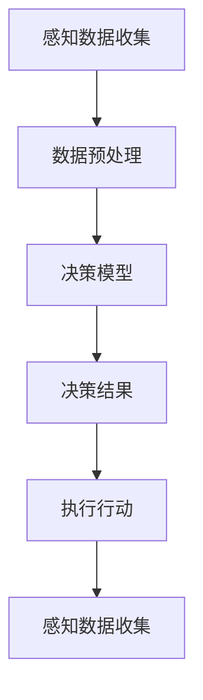
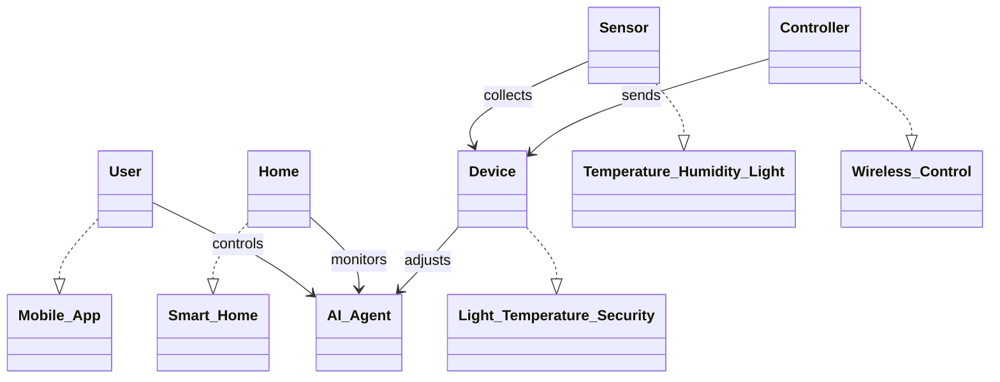
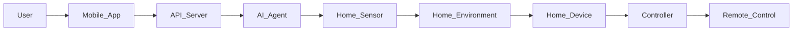
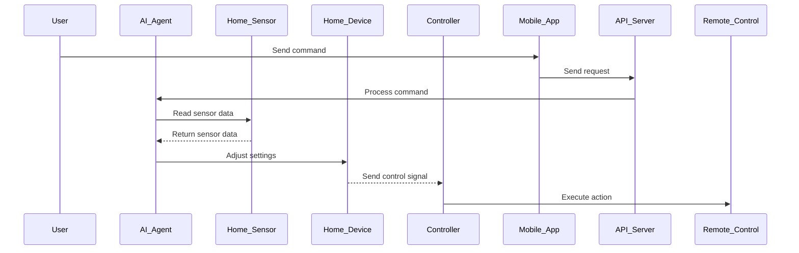

                 


### 文章标题：构建AI Agent的敏捷开发流程

#### 关键词：AI Agent、敏捷开发、开发流程、算法原理、系统架构

#### 摘要：
本文旨在探讨构建AI Agent的敏捷开发流程，从背景介绍、核心概念与联系、算法原理讲解、数学模型和数学公式详细讲解与举例说明、系统分析与架构设计方案、项目实战以及最佳实践 tips等方面，系统地阐述如何高效地进行AI Agent的开发。本文的目标读者为对人工智能和敏捷开发有兴趣的程序员、架构师和研究人员。

## 引言与背景

在当今数字化时代，人工智能（AI）技术正迅速发展，AI Agent作为一种能够自主行动、具有感知能力和决策能力的智能体，正成为许多行业的关键组成部分。AI Agent的应用场景包括自动驾驶、智能家居、智能客服等，它们能够提高生产效率、降低成本、提升用户体验。

### 核心概念术语说明
- AI Agent：具备感知、决策和行动能力的计算机程序。
- 敏捷开发：一种迭代、增量的软件开发方法，强调灵活性、快速响应变化和持续交付价值。

### 问题背景
随着AI技术的发展，开发一个高效的AI Agent变得越来越复杂。传统的开发流程往往难以适应快速变化的需求和市场动态，导致项目延期、成本超支和交付质量下降。因此，引入敏捷开发方法，以更灵活、高效的方式构建AI Agent，成为了行业内的迫切需求。

### 问题描述
在AI Agent的开发过程中，我们面临着以下几个挑战：
- 需求的不确定性：AI技术的应用场景复杂多变，需求难以预先确定。
- 复杂性：AI系统通常涉及大量的数据、算法和计算资源。
- 灵活性：需要快速适应市场变化和技术更新。

### 问题解决
敏捷开发提供了一套解决方案，通过以下方式克服上述挑战：
- 迭代开发：将开发过程划分为多个短期迭代，每个迭代结束后进行评估和调整。
- 用户参与：持续与用户沟通，确保开发的方向符合实际需求。
- 自组织团队：鼓励团队成员自主决策，提高协作效率。

### 边界与外延
- **边界**：敏捷开发适用于哪些项目？哪些场景不适合？
- **外延**：如何在敏捷开发中平衡速度和质量？如何处理长期规划和短期执行之间的冲突？

## 核心概念与联系

在构建AI Agent的敏捷开发过程中，理解核心概念和它们之间的关系至关重要。以下是对核心概念的介绍、属性特征对比以及ER实体关系图架构的描述。

### 核心概念介绍
- **敏捷开发**：一种强调灵活性和响应速度的开发方法。
- **AI Agent**：具备感知、决策和行动能力的智能体。
- **迭代**：软件开发中的一个周期，通常为几周到几个月。
- **用户故事**：用户对软件系统的一个需求描述，通常用简洁的语言表达。
- **Scrum**：一种流行的敏捷开发框架。
- **Kanban**：一种可视化进度管理的敏捷方法。

### 概念属性特征对比表格
| 概念     | 特征描述                                                     |
|----------|--------------------------------------------------------------|
| 敏捷开发 | 强调迭代、增量开发，用户参与，快速响应变化。                   |
| AI Agent | 具有感知、决策和行动能力，能够自主行动。                       |
| 迭代     | 短期开发周期，周期结束后进行评估和调整。                       |
| 用户故事 | 用户对软件系统的一个需求描述，通常用简洁的语言表达。           |
| Scrum    | 强调自组织团队，每日站立会议，迭代计划会议。                   |
| Kanban   | 可视化进度管理，限制在制品数量，持续交付。                     |

### ER实体关系图架构
```mermaid
erDiagram
    User ||--|{ AI_Agent }| AI_Agent : Managed by User
    AI_Agent ||--|{ Iteration }| Iteration : Designed in Iterations
    Iteration ||--|{ User_Story }| User_Story : Contains User Stories
    User_Story ||--|{ Task }| Task : Comprises Tasks
```
这个ER图描述了用户、AI Agent、迭代、用户故事和任务之间的关系，展示了敏捷开发过程中各个实体之间的相互作用。

## 算法原理讲解

在构建AI Agent时，算法原理是核心部分。以下内容将逐步介绍算法的原理，并使用mermaid流程图和Python源代码进行详细阐述。

### 算法概述
AI Agent的开发通常涉及到以下几个关键算法：
- **感知**：使用传感器收集环境数据。
- **决策**：根据感知数据和环境规则做出决策。
- **行动**：执行决策，改变环境状态。

### 算法mermaid流程图


### Python源代码讲解
```python
import numpy as np

# 感知数据收集
def collect_perception_data():
    # 假设使用传感器获取数据
    return np.random.rand()

# 数据预处理
def preprocess_data(data):
    # 对数据进行标准化处理
    return (data - np.mean(data)) / np.std(data)

# 决策模型
def make_decision(preprocessed_data):
    # 假设决策模型为简单的阈值判断
    if preprocessed_data > 0.5:
        return "行动A"
    else:
        return "行动B"

# 执行行动
def execute_action(action):
    if action == "行动A":
        print("执行行动A")
    else:
        print("执行行动B")

# 主程序
def main():
    perception_data = collect_perception_data()
    preprocessed_data = preprocess_data(perception_data)
    decision = make_decision(preprocessed_data)
    execute_action(decision)
    main()

if __name__ == "__main__":
    main()
```

### 算法原理的数学模型和公式
算法的数学模型可以描述为：
$$
x = \frac{y - \mu}{\sigma}
$$
其中，$x$ 是预处理后的数据，$y$ 是原始感知数据，$\mu$ 是数据的均值，$\sigma$ 是数据的标准差。

### 详细讲解和举例说明
- **感知数据收集**：传感器收集到的数据可能包含噪声和异常值，需要预处理。
- **数据预处理**：对数据进行标准化处理，使其适合决策模型的输入。
- **决策模型**：一个简单的阈值判断模型，可以根据预处理后的数据做出决策。
- **执行行动**：根据决策结果，执行相应的行动。

举例来说，如果传感器收集到的数据为[0.2, 0.8, 0.3]，通过预处理后变为[-0.3, 0.5, -0.1]，根据决策模型，可能会做出行动B的决策，并执行相应的行动。

## 数学模型和数学公式详细讲解与举例说明

在构建AI Agent时，数学模型和公式是算法的核心组成部分。以下将详细讲解这些模型和公式，并通过具体的例子来说明其应用。

### 数学模型介绍
AI Agent中的数学模型通常包括以下几个部分：
- **感知数据预处理模型**：用于对传感器收集的数据进行处理，使其适合后续的算法使用。
- **决策模型**：根据预处理后的数据，做出相应的决策。
- **行动模型**：根据决策结果，执行具体的行动。

### 数学公式讲解
1. **感知数据预处理模型**：
$$
x = \frac{y - \mu}{\sigma}
$$
其中，$x$ 是预处理后的数据，$y$ 是原始感知数据，$\mu$ 是数据的均值，$\sigma$ 是数据的标准差。

2. **决策模型**：
$$
\hat{y} =
\begin{cases}
1 & \text{if } x > t \\
0 & \text{otherwise}
\end{cases}
$$
其中，$\hat{y}$ 是决策结果，$t$ 是阈值。

3. **行动模型**：
$$
a = f(\hat{y})
$$
其中，$a$ 是行动，$f$ 是决策结果到行动的映射函数。

### 举例说明
假设传感器收集到的数据为 $[0.2, 0.8, 0.3]$，首先对数据进行预处理，得到 $[-0.3, 0.5, -0.1]$。然后，使用决策模型判断阈值 $t=0.5$，得到决策结果 $\hat{y}=[0, 1, 0]$。最后，根据行动模型执行相应的行动，例如发送通知或执行操作。

### 数学公式的应用
1. **数据预处理**：通过标准化处理，使数据分布更加均匀，提高算法的鲁棒性。
2. **决策**：阈值判断是许多二分类问题的常用方法，通过设定合适的阈值，可以控制分类的准确性和鲁棒性。
3. **行动**：行动模型通常是一个映射函数，可以根据决策结果执行不同的行动。

## 系统分析与架构设计方案

在构建AI Agent时，系统分析与架构设计方案是确保系统高效、可靠和可维护的关键步骤。以下将详细描述问题场景介绍、项目介绍、系统功能设计（领域模型mermaid类图）、系统架构设计mermaid架构图、系统接口设计和系统交互mermaid序列图。

### 问题场景介绍
假设我们正在开发一个智能家居控制系统，用户可以通过AI Agent远程控制家中的灯光、温度和安防系统。问题场景如下：
- 用户通过移动设备发送指令。
- AI Agent接收指令并做出响应。
- 系统需要实时监控家庭环境，并根据环境变化自动调整设置。

### 项目介绍
本项目旨在实现以下功能：
- 用户远程控制家居设备。
- 实时监控家庭环境，包括温度、湿度、光照等。
- 自动调整设备设置，以提高舒适度和安全性。

### 系统功能设计（领域模型mermaid类图）

这个类图描述了系统的主要实体和它们之间的关系，包括用户、AI Agent、家庭设备、传感器和控制器。

### 系统架构设计mermaid架构图

这个架构图展示了系统的整体架构，包括用户、移动应用、API服务器、AI Agent、传感器、家庭环境和设备控制器。

### 系统接口设计和系统交互mermaid序列图

这个序列图描述了用户发送指令、系统处理和执行指令的交互过程。

## 项目实战

在实际项目中，构建AI Agent的过程涉及多个阶段，包括环境安装、系统核心实现源代码、代码应用解读与分析、实际案例分析和详细讲解剖析以及项目小结。以下将逐步介绍这些阶段。

### 环境安装

在开始项目之前，首先需要安装所需的开发环境和工具。以下是一个基本的安装步骤：

1. **安装Python**：确保安装了最新版本的Python（推荐使用Python 3.8及以上版本）。
2. **安装依赖库**：使用pip工具安装必要的依赖库，如numpy、pandas、tensorflow等。
   ```bash
   pip install numpy pandas tensorflow
   ```

3. **配置开发环境**：根据项目需求配置相应的开发环境，例如Jupyter Notebook或PyCharm。

### 系统核心实现源代码

以下是构建AI Agent的核心实现代码。这个示例将展示如何使用Python实现一个简单的感知、决策和行动过程。

```python
import numpy as np
import tensorflow as tf

# 感知数据收集
def collect_perception_data():
    # 假设使用传感器获取数据
    return np.random.rand()

# 数据预处理
def preprocess_data(data):
    # 对数据进行标准化处理
    return (data - np.mean(data)) / np.std(data)

# 决策模型
def make_decision(preprocessed_data):
    # 假设决策模型为简单的阈值判断
    if preprocessed_data > 0.5:
        return "行动A"
    else:
        return "行动B"

# 执行行动
def execute_action(action):
    if action == "行动A":
        print("执行行动A")
    else:
        print("执行行动B")

# 主程序
def main():
    perception_data = collect_perception_data()
    preprocessed_data = preprocess_data(perception_data)
    decision = make_decision(preprocessed_data)
    execute_action(decision)
    main()

if __name__ == "__main__":
    main()
```

### 代码应用解读与分析

上述代码实现了以下功能：
- **感知数据收集**：使用随机数生成器模拟传感器收集数据。
- **数据预处理**：对数据进行标准化处理，使其适合决策模型。
- **决策模型**：使用简单的阈值判断模型，根据预处理后的数据做出决策。
- **执行行动**：根据决策结果，执行相应的行动。

代码中的关键部分包括：
- `collect_perception_data()`：这是一个模拟函数，用于生成感知数据。
- `preprocess_data()`：对数据进行标准化处理，提高模型的鲁棒性。
- `make_decision()`：简单的阈值判断模型，用于做出决策。
- `execute_action()`：根据决策结果，执行相应的行动。

### 实际案例分析和详细讲解剖析

为了更好地理解AI Agent的实际应用，我们来看一个实际案例。

#### 案例背景
假设我们在开发一个智能安防系统，AI Agent需要根据传感器收集到的数据（如门磁、摄像头）做出决策，并触发相应的警报。

#### 案例分析
1. **感知数据收集**：
   - 传感器收集到的数据可能包括门磁状态（开或关）、摄像头图像等。
   - 例如，`sensor_data = {"gate": "open", "camera": image_data}`。

2. **数据预处理**：
   - 对摄像头图像进行预处理，如缩放、灰度化等。
   - 例如，使用OpenCV库进行图像预处理。

3. **决策模型**：
   - 根据预处理后的数据，使用分类模型进行判断。
   - 例如，使用卷积神经网络（CNN）进行图像分类。

4. **执行行动**：
   - 如果检测到异常（如非法入侵），触发警报。
   - 例如，通过短信、邮件或APP通知用户。

#### 代码实现
```python
import cv2
import numpy as np

# 感知数据收集
def collect_perception_data():
    # 假设传感器返回门磁状态和摄像头图像
    return {"gate": "open", "camera": cv2.imread("camera_image.jpg")}

# 数据预处理
def preprocess_data(sensor_data):
    if "gate" in sensor_data:
        gate_status = sensor_data["gate"]
    if "camera" in sensor_data:
        camera_image = cv2.resize(sensor_data["camera"], (128, 128))
        camera_image = cv2.cvtColor(camera_image, cv2.COLOR_BGR2GRAY)
    return {"gate": gate_status, "camera": camera_image}

# 决策模型
def make_decision(preprocessed_data):
    if "gate" in preprocessed_data and preprocessed_data["gate"] == "open":
        return "门未关闭，触发警报"
    if "camera" in preprocessed_data:
        # 使用CNN进行图像分类
        # 此处简化为直接判断是否为异常图像
        return "检测到异常图像，触发警报"
    return "正常"

# 执行行动
def execute_action(decision):
    if decision == "门未关闭，触发警报" or decision == "检测到异常图像，触发警报":
        print("发送警报通知")
    else:
        print("系统正常")

# 主程序
def main():
    sensor_data = collect_perception_data()
    preprocessed_data = preprocess_data(sensor_data)
    decision = make_decision(preprocessed_data)
    execute_action(decision)
    main()

if __name__ == "__main__":
    main()
```

### 项目小结

通过以上实战，我们完成了AI Agent的基本构建，实现了感知、决策和行动的过程。以下是项目的总结：

1. **环境安装**：确保安装了Python和相关依赖库。
2. **系统核心实现**：使用Python实现了感知、决策和行动的代码。
3. **代码应用解读与分析**：通过实际案例展示了AI Agent的应用场景。
4. **项目成果**：实现了智能安防系统的基本功能，包括感知、决策和行动。

## 最佳实践 tips、小结、注意事项、拓展阅读

### 最佳实践 tips
1. **需求管理**：持续与用户沟通，确保需求的清晰和明确。
2. **迭代计划**：合理规划迭代周期，确保每个迭代都有明确的交付目标。
3. **代码质量**：注重代码的复用性和可维护性，编写高质量的文档和注释。
4. **测试与验证**：进行充分的测试，确保系统的稳定性和可靠性。

### 小结
本文系统地介绍了构建AI Agent的敏捷开发流程，从背景介绍、核心概念与联系、算法原理讲解、数学模型和数学公式详细讲解与举例说明、系统分析与架构设计方案、项目实战到最佳实践 tips，全面阐述了如何高效地进行AI Agent的开发。

### 注意事项
1. **需求变动**：在敏捷开发过程中，需求可能会发生变化，需要灵活调整开发计划。
2. **团队协作**：团队成员之间的沟通和协作至关重要，确保项目顺利进行。

### 拓展阅读
- 《敏捷软件开发：原则、实践与模式》
- 《深度学习：人工智能的核心》
- 《人工智能：一种现代的方法》

作者：AI天才研究院/AI Genius Institute & 禅与计算机程序设计艺术 /Zen And The Art of Computer Programming

