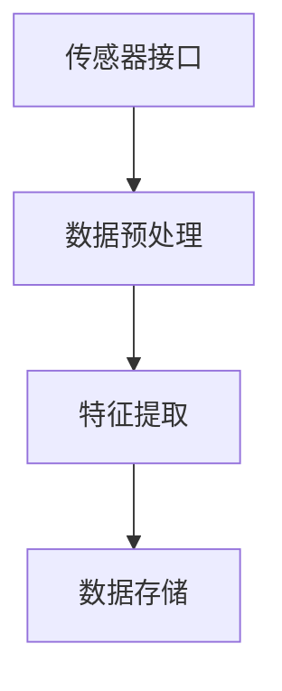
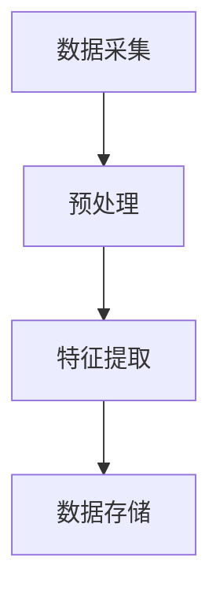
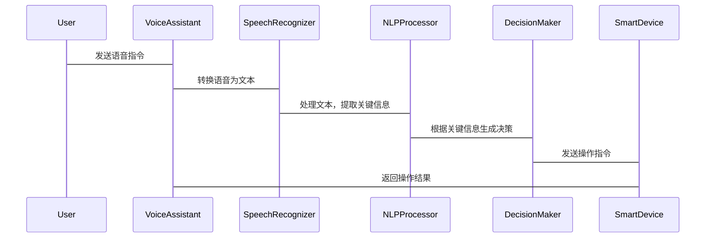

                 

## 文章标题

### 关键词：AI Agent、敏捷开发、开发流程、感知模块、执行模块

#### 摘要：
本文将深入探讨构建AI Agent的敏捷开发流程，从基础概念到实际实现，逐步讲解AI Agent开发的关键步骤和最佳实践。通过对比传统开发方法，我们强调了敏捷开发在AI Agent项目中的重要性，并详细介绍了需求分析、设计、开发和测试等阶段的敏捷方法论。文章还将提供环境搭建和核心模块实现的实战案例，帮助读者全面理解AI Agent的开发流程。

----------------------------------------------------------------

### 目录大纲

**构建AI Agent的敏捷开发流程**

> 关键词：AI Agent、敏捷开发、开发流程、感知模块、执行模块

> 摘要：本文将深入探讨构建AI Agent的敏捷开发流程，从基础概念到实际实现，逐步讲解AI Agent开发的关键步骤和最佳实践。通过对比传统开发方法，我们强调了敏捷开发在AI Agent项目中的重要性，并详细介绍了需求分析、设计、开发和测试等阶段的敏捷方法论。文章还将提供环境搭建和核心模块实现的实战案例，帮助读者全面理解AI Agent的开发流程。

----------------------------------------------------------------

## 第一部分: AI Agent开发基础

### 第1章: AI Agent概述

#### 1.1 问题背景与定义

- **问题背景**：随着人工智能技术的飞速发展，AI Agent成为研究与应用的热点，具有自主决策与行动能力的AI Agent在多个领域展现出巨大潜力。

- **问题描述**：探讨AI Agent的基本概念、分类及其在现实世界中的应用场景。

- **问题解决**：通过深入理解AI Agent的基本原理，为后续开发提供理论基础。

- **边界与外延**：明确AI Agent与其他智能系统（如机器人、自动化系统）的区别与联系。

- **概念结构与核心要素组成**：介绍AI Agent的核心组成部分，包括感知模块、决策模块和执行模块。

#### 1.2 AI Agent的核心概念与联系

- **核心概念原理**：解析AI Agent的基本工作原理，包括感知、决策和执行三个主要环节。

- **概念属性特征对比表格**：列出不同类型的AI Agent及其主要特征和适用场景。

- **ER实体关系图架构**：使用Mermaid绘制AI Agent的ER实体关系图，展示各模块之间的交互关系。

----------------------------------------------------------------

## 第二部分: AI Agent开发流程

### 第2章: AI Agent敏捷开发方法论

#### 2.1 敏捷开发概述

- **敏捷开发定义**：介绍敏捷开发的核心思想、原则和实践。

- **敏捷开发与传统开发方法对比**：分析敏捷开发与传统瀑布模型的差异，强调其灵活性、迭代性和用户参与度。

- **敏捷开发工具与框架**：介绍常用的敏捷开发工具和框架，如Scrum、Kanban等。

#### 2.2 AI Agent敏捷开发流程

- **需求分析**：采用敏捷方法进行AI Agent需求分析，确保需求迭代、可测试和可维护。

- **设计阶段**：在敏捷开发框架下，讨论AI Agent的设计原则、架构设计和模块划分。

- **开发阶段**：介绍敏捷开发中的快速迭代、持续集成和测试策略。

- **测试阶段**：强调AI Agent测试的必要性，包括单元测试、集成测试和系统测试。

- **部署与维护**：讨论AI Agent的部署策略、上线流程和后续维护。

----------------------------------------------------------------

## 第三部分: AI Agent开发实战

### 第3章: AI Agent开发环境搭建

#### 3.1 开发环境介绍

- **硬件要求**：介绍适合AI Agent开发的主机配置和辅助设备。

- **软件环境**：列出AI Agent开发所需的基础软件环境，包括操作系统、编程语言和环境搭建工具。

#### 3.2 环境搭建步骤

- **硬件环境配置**：详细说明如何配置适合AI Agent开发的主机环境。

- **软件环境安装**：列出软件安装步骤，包括操作系统安装、编程语言集成和环境搭建工具安装。

- **示例环境配置**：提供一个完整的AI Agent开发环境配置示例，包括代码仓库和开发工具的安装配置。

----------------------------------------------------------------

## 第四部分: AI Agent核心模块实现

### 第4章: 感知模块实现

#### 4.1 感知模块概述

- **感知模块定义**：介绍AI Agent感知模块的基本概念和作用。

- **感知数据类型**：列举常用的感知数据类型，如文本、图像、音频等。

- **感知模块架构设计**：使用Mermaid绘制感知模块的架构图，展示各子模块之间的关系。

#### 4.2 感知模块算法原理

- **算法原理讲解**：使用mermaid画出感知模块的算法流程图，详细阐述感知算法的工作原理。

- **数学模型和公式**：给出感知算法的数学模型和关键公式，并进行解释。

- **举例说明**：通过具体实例，展示感知算法在实际应用中的效果和优势。

----------------------------------------------------------------

### 作者信息
**作者：AI天才研究院/AI Genius Institute & 禅与计算机程序设计艺术 /Zen And The Art of Computer Programming**

----------------------------------------------------------------

在接下来的章节中，我们将逐步深入探讨AI Agent的基础概念、敏捷开发方法论、实战环境和核心模块实现，希望能够帮助读者全面了解AI Agent的开发流程，并在实际项目中应用这些知识。让我们一步一步地分析推理，深入理解每一个环节。

### 第1章: AI Agent概述

#### 1.1 问题背景与定义

随着人工智能（AI）技术的不断发展，AI Agent作为能够自主感知、决策和行动的智能实体，逐渐成为研究与应用的热点。AI Agent具备高度智能化和自主性，能够模拟人类智能行为，在各种复杂环境中进行决策和执行任务。从自动化的机器人到智能助手，AI Agent的应用场景已经扩展到多个领域，如智能制造、自动驾驶、智能家居、医疗诊断等。

**问题背景**：AI Agent的出现源于对自主智能实体需求的不断增长。传统的自动化系统和机器人通常依赖于预定义的程序和规则，无法应对复杂多变的动态环境。而AI Agent通过感知环境、学习经验和自主决策，能够更好地适应不确定性和动态变化。这种能力使得AI Agent在许多领域中具有显著优势，推动了人工智能技术的应用和发展。

**问题描述**：AI Agent的基本概念和定义是一个关键问题。AI Agent是一种具有自主决策和行动能力的智能实体，能够通过感知环境信息，利用学习算法进行决策，并执行相应的任务。AI Agent的核心功能包括感知、决策和执行。感知模块负责获取环境信息，决策模块利用感知信息进行推理和规划，执行模块则根据决策结果执行具体的行动。

**问题解决**：为了深入理解AI Agent的基本原理，我们需要对AI Agent进行系统的分析和探讨。首先，我们需要明确AI Agent的基本概念和定义，包括其组成结构、核心功能和工作原理。其次，我们需要了解不同类型的AI Agent及其在现实世界中的应用场景，以便更好地理解其价值和潜力。最后，我们还需要探讨AI Agent与其他智能系统（如机器人、自动化系统）的区别与联系，从而构建一个完整的AI Agent概念体系。

**边界与外延**：在讨论AI Agent时，我们还需要明确其边界与外延。AI Agent与传统自动化系统和机器人之间存在显著差异。传统自动化系统主要依赖于预定义的规则和程序，而AI Agent则通过学习和自主决策实现更高的灵活性和适应性。相比之下，机器人通常是指具有机械结构的智能实体，而AI Agent则更注重其智能行为和自主决策能力。AI Agent还可以与其他智能系统进行集成，形成更加复杂的智能系统，如智能机器人、智能交通系统等。

**概念结构与核心要素组成**：AI Agent的核心组成部分包括感知模块、决策模块和执行模块。感知模块负责获取环境信息，通常使用传感器、摄像头、麦克风等设备进行数据采集。决策模块利用感知信息进行推理和规划，通常采用机器学习算法、决策树、神经网络等模型进行决策。执行模块则根据决策结果执行具体的行动，如控制机器人执行特定动作、调整系统参数等。

通过上述分析，我们明确了AI Agent的基本概念、定义和核心组成部分，为后续章节的深入讨论奠定了基础。在接下来的章节中，我们将进一步探讨AI Agent的核心概念与联系，详细分析其工作原理和各模块之间的交互关系。

#### 1.2 AI Agent的核心概念与联系

在深入探讨AI Agent的核心概念之前，我们需要明确AI Agent的基本工作原理。AI Agent通过感知环境信息、利用学习算法进行决策，并执行具体的任务，以实现自主行动。其核心概念包括感知、决策和执行三个主要环节。接下来，我们将解析这些核心概念，并探讨不同类型的AI Agent及其主要特征和适用场景。

**核心概念原理**

1. **感知**：感知是AI Agent获取环境信息的过程。感知模块通过传感器、摄像头、麦克风等设备采集环境数据，如图像、声音、文本等。感知模块的主要任务是从原始数据中提取有用的信息，以便为决策模块提供基础数据。感知过程通常包括数据采集、预处理和特征提取等步骤。

2. **决策**：决策是AI Agent根据感知信息进行推理和规划的过程。决策模块利用机器学习算法、决策树、神经网络等模型，对感知信息进行分析和处理，生成决策结果。决策过程通常包括数据输入、模型训练、推理和决策输出等步骤。决策模块的目标是根据环境信息和目标，生成最优的决策方案，以实现预期目标。

3. **执行**：执行是AI Agent根据决策结果执行具体任务的过程。执行模块根据决策结果，控制执行设备（如机器人、机械臂等）执行具体的行动。执行过程通常包括任务规划、执行控制和效果评估等步骤。执行模块的目标是将决策方案转化为实际操作，实现预期目标。

**概念属性特征对比表格**

为了更好地理解不同类型的AI Agent及其主要特征和适用场景，我们可以列出以下对比表格：

| 类型       | 特征                          | 适用场景                         |
|------------|------------------------------|----------------------------------|
| 通用AI Agent | 普遍的感知、决策和执行能力 | 智能助手、智能家居、医疗诊断等 |
| 专家AI Agent | 突出的领域专业知识和技能   | 医疗决策支持、金融风险评估等     |
| 机器人AI Agent | 结合机械结构和智能算法      | 自动驾驶、工业自动化、救援行动等 |
| 对话AI Agent | 强大的语言理解和生成能力    | 虚拟客服、聊天机器人、语音助手等 |

**ER实体关系图架构**

为了展示AI Agent各模块之间的交互关系，我们可以使用Mermaid绘制ER实体关系图。以下是一个简化的ER实体关系图：

```mermaid
erDiagram
  AI_Agent ||--|{ 感知模块 }
  AI_Agent ||--|{ 决策模块 }
  AI_Agent ||--|{ 执行模块 }
  感知模块 ||--|{ 传感器 }
  感知模块 ||--|{ 数据预处理 }
  决策模块 ||--|{ 学习算法 }
  执行模块 ||--|{ 执行设备 }
```

在这个ER实体关系图中，AI Agent作为主体，与其三个核心模块（感知模块、决策模块和执行模块）之间有直接关联。感知模块包括传感器和数据预处理子模块，决策模块包括学习算法子模块，执行模块包括执行设备子模块。各子模块之间通过交互实现数据传递和任务执行，共同构成一个完整的AI Agent系统。

通过上述分析，我们明确了AI Agent的核心概念原理，并对比了不同类型的AI Agent及其主要特征和适用场景。在下一章节中，我们将进一步探讨AI Agent的具体应用场景，深入分析其在各个领域中的优势和应用前景。

#### 1.3 AI Agent的应用场景

AI Agent作为一种高度智能化的自主实体，具有广泛的应用场景。在智能制造、自动驾驶、医疗诊断、智能家居等多个领域，AI Agent正展现出其强大的潜力和优势。以下我们将详细探讨AI Agent在这些领域的应用，并分析其带来的变革和机遇。

**智能制造**

智能制造是人工智能在工业领域的重要应用方向。通过引入AI Agent，工厂可以实现自动化、智能化生产，提高生产效率和质量。AI Agent可以实时监测生产线设备的状态，预测潜在故障，优化生产流程。例如，在汽车制造过程中，AI Agent可以实时分析生产线数据，优化装配顺序，减少停机时间，提高生产效率。同时，AI Agent还可以通过深度学习和自适应算法，不断优化生产参数，提高产品质量。

**自动驾驶**

自动驾驶是AI Agent在交通领域的重要应用。通过感知模块获取道路环境信息，决策模块分析处理感知数据，执行模块控制车辆执行相应动作，AI Agent可以实现自主驾驶。自动驾驶技术正在迅速发展，各大车企和研究机构都在积极研发。例如，Waymo、特斯拉等公司已经在实际道路中进行了大量的自动驾驶测试。自动驾驶技术的应用将极大地改变人们的出行方式，减少交通事故，提高交通效率。

**医疗诊断**

医疗诊断是AI Agent在医疗领域的重要应用。通过感知模块获取患者的生命体征和医学影像，决策模块对数据进行分析和诊断，执行模块向医生提供诊断建议和治疗方案。AI Agent可以辅助医生进行疾病诊断、风险评估和治疗方案制定，提高诊断准确性和效率。例如，AI Agent可以通过深度学习算法，对医疗影像进行分析，辅助医生发现早期病变，提高癌症等疾病的早期诊断率。

**智能家居**

智能家居是AI Agent在家庭领域的重要应用。通过感知模块获取家庭环境信息，决策模块进行环境控制和优化，执行模块执行相应的动作，AI Agent可以实现智能家庭管理。智能家居系统可以通过AI Agent实现自动调控温度、灯光、安防等，提高生活质量。例如，智能冰箱可以根据用户购物记录和库存情况，自动生成购物清单，智能空调可以根据室内外温度自动调节温度，提高舒适度。

**其他应用场景**

除了上述领域，AI Agent还在教育、金融、农业等多个领域展现出巨大的应用潜力。在教育领域，AI Agent可以作为智能导师，为学生提供个性化教学和辅导；在金融领域，AI Agent可以辅助进行风险评估、股票交易等；在农业领域，AI Agent可以通过感知土壤、气候等信息，优化农作物种植和养殖。

**AI Agent带来的变革和机遇**

AI Agent的应用不仅带来了技术的变革，也带来了新的商业机遇。随着AI Agent技术的不断成熟，越来越多的企业和机构开始将其应用到实际业务中。AI Agent的应用不仅提高了生产效率、降低了成本，还创造了新的商业模式和服务形式。例如，通过AI Agent的智能诊断系统，医院可以提供更精准、更高效的医疗服务；通过AI Agent的智能管理平台，企业可以实现更高效、更智能的生产运营。

总之，AI Agent作为一种高度智能化的自主实体，在多个领域展现出巨大的应用潜力。通过感知、决策和执行三个主要环节，AI Agent可以实现自主行动和自主决策，为各领域带来变革和机遇。随着AI Agent技术的不断发展和完善，我们可以期待其在未来带来更多的创新和应用。

### 第2章: AI Agent敏捷开发方法论

#### 2.1 敏捷开发概述

敏捷开发（Agile Development）是一种以用户需求迭代、灵活响应变化为核心理念的软件开发方法。与传统瀑布模型（Waterfall Model）相比，敏捷开发强调快速迭代、持续交付和团队协作，能够更好地适应快速变化的市场需求和项目环境。

**敏捷开发的定义和核心思想**：敏捷开发起源于软件开发领域，其核心思想是“尽早且持续地交付有价值的软件，迎接变化，持续交付优势产品”。敏捷开发强调以下原则：

- **个体和互动重于过程与工具**：团队协作和个体互动是项目成功的关键，而非依赖特定的工具和方法。
- **可工作的软件重于详尽的文档**：交付可工作的软件是项目的核心目标，而非依赖大量文档。
- **客户协作重于合同谈判**：与客户保持密切合作，确保产品满足用户需求，而非通过合同谈判确定需求。
- **响应变化重于遵循计划**：在开发过程中，灵活应对变化和需求变更，而非严格遵循最初计划。

**敏捷开发与传统开发方法的对比**：传统瀑布模型是一种线性、顺序的开发方法，按照需求、设计、开发、测试、部署等阶段依次进行，各阶段之间界限清晰，但不利于快速响应变化。而敏捷开发则采用迭代、增量的方式，将整个项目分为多个短期迭代，每个迭代都包含需求分析、设计、开发、测试等环节，通过持续交付和反馈，逐步完善产品。

- **灵活性**：敏捷开发强调项目的灵活性，允许在开发过程中调整需求和计划，以适应市场变化。
- **用户参与**：敏捷开发注重用户参与，通过用户故事、每日站立会议等方式，确保项目始终符合用户需求。
- **快速迭代**：敏捷开发采用短期迭代，每个迭代周期通常为1-4周，通过频繁交付和反馈，逐步完善产品。
- **质量保证**：敏捷开发强调持续集成和持续交付，通过自动化测试和质量控制，确保产品的稳定性和可靠性。

**敏捷开发工具与框架**：敏捷开发有多种工具和框架可供选择，其中常用的包括Scrum、Kanban、XP（极限编程）等。

- **Scrum**：Scrum是一种迭代、增量的敏捷开发方法，强调团队协作、快速交付和持续改进。Scrum的核心概念包括产品待办列表、冲刺（Sprint）、每日站立会议等。
- **Kanban**：Kanban是一种基于看板（Kanban Board）的敏捷开发方法，强调可视化管理、持续交付和资源优化。Kanban的核心概念包括卡片、看板、限制在流程中的工作（WIP）等。
- **XP（极限编程）**：XP是一种以工程师为中心的敏捷开发方法，强调代码质量、自动化测试和快速交付。XP的核心概念包括测试驱动开发（TDD）、代码重构、持续集成等。

通过上述分析，我们明确了敏捷开发的核心思想和优势，以及常用的敏捷开发工具和框架。在接下来的章节中，我们将进一步探讨AI Agent敏捷开发的具体流程和实施方法。

#### 2.2 AI Agent敏捷开发流程

敏捷开发方法在AI Agent开发中具有重要的应用价值，其核心在于通过快速迭代、持续交付和灵活调整，确保AI Agent在复杂多变的开发过程中能够保持高质量和高效率。下面，我们将详细讨论AI Agent敏捷开发流程的各个阶段，包括需求分析、设计、开发、测试和部署。

**需求分析**：

需求分析是AI Agent敏捷开发的第一步，其目标是通过与用户的深入沟通和交流，明确项目需求并形成可迭代的用户故事。敏捷开发强调用户需求的迭代性和灵活性，因此需求分析过程是一个持续进行的过程，而非一次性完成。

- **用户故事**：用户故事是敏捷开发中的核心需求载体，它以用户的角度描述一个功能需求，通常包含“作为...，我想要...，以便...”的格式。例如：“作为智能家居用户，我想要通过语音助手控制家中的灯光和温度，以便提高生活舒适度。”

- **需求迭代**：在敏捷开发中，需求分析不是一次性完成的，而是随着项目进展和用户反馈不断迭代。每次迭代都会根据用户需求和项目实际情况调整需求优先级和功能实现。

- **需求文档**：虽然敏捷开发强调口头交流和用户故事，但仍需保留一定形式的需求文档，以便团队成员理解和跟踪需求变化。需求文档应简洁明了，突出核心需求和变更记录。

**设计阶段**：

设计阶段是AI Agent敏捷开发中的关键环节，其目标是根据需求分析的结果，制定合理的系统架构和模块划分，为后续开发提供清晰的方向。

- **架构设计**：在敏捷开发中，架构设计不是一次性完成的，而是随着需求变化和项目进展不断调整。通常采用迭代的方式进行架构设计，逐步完善系统架构。

- **模块划分**：AI Agent的核心模块包括感知模块、决策模块和执行模块。在设计阶段，需要明确各模块的功能和接口，确保模块之间的高内聚和低耦合。

- **原型设计**：在敏捷开发中，原型设计是快速验证需求和理解用户需求的重要手段。通过构建原型，可以提前发现设计问题，降低后续开发的风险。

**开发阶段**：

开发阶段是AI Agent敏捷开发的实际执行阶段，其目标是根据设计文档和用户故事，逐步实现AI Agent的功能和特性。

- **快速迭代**：敏捷开发采用短期迭代的方式进行开发，每个迭代周期通常为1-4周。每次迭代都包含需求分析、设计、开发、测试等环节，确保功能逐步完善。

- **持续集成**：敏捷开发强调持续集成，通过自动化测试和持续集成工具，确保代码质量并快速发现和修复问题。

- **代码审查**：敏捷开发中的代码审查是确保代码质量和项目进展的重要手段。团队成员通过代码审查，可以提前发现潜在问题和改进建议。

**测试阶段**：

测试阶段是AI Agent敏捷开发中的关键环节，其目标是通过全面的测试确保系统的功能、性能和可靠性。

- **单元测试**：单元测试是针对AI Agent的各个模块进行的功能测试，确保模块的功能正确实现。

- **集成测试**：集成测试是针对AI Agent的整体功能进行测试，确保模块之间的高效协作和功能完整性。

- **系统测试**：系统测试是对AI Agent的整体性能和可靠性进行测试，包括负载测试、压力测试和性能测试等。

- **自动化测试**：敏捷开发中，自动化测试是确保测试效率和覆盖率的重要手段。通过自动化测试工具，可以快速执行测试用例，发现和修复问题。

**部署与维护**：

部署与维护是AI Agent敏捷开发中的最后一步，其目标是将系统部署到生产环境，并确保系统的稳定运行。

- **部署策略**：在敏捷开发中，部署策略应与开发流程紧密结合，通过持续交付工具，实现快速、可靠的系统部署。

- **上线流程**：在系统上线前，需要进行全面的测试和验证，确保系统符合预期性能和可靠性。

- **后续维护**：系统上线后，需要持续关注系统的运行状态，及时修复漏洞和缺陷，确保系统的稳定性和安全性。

通过上述分析，我们明确了AI Agent敏捷开发流程的各个阶段及其关键步骤。敏捷开发方法在AI Agent开发中具有重要的应用价值，通过快速迭代、持续交付和灵活调整，可以确保AI Agent项目的高质量和高效率。在接下来的章节中，我们将进一步探讨AI Agent开发环境搭建和核心模块实现的实战案例。

#### 2.3 实战案例：AI Agent敏捷开发流程应用

为了更好地理解AI Agent敏捷开发流程在实际项目中的应用，以下我们通过一个实际案例进行详细讲解。该案例是一个智能家居系统的AI Agent开发项目，项目目标是实现通过语音助手控制家庭设备的智能化管理。

**案例背景**：随着智能家居市场的快速发展，越来越多的家庭开始安装智能设备，如智能灯泡、智能空调、智能门锁等。为了提高用户体验，项目需求是通过一个语音助手，用户可以方便地控制家中的智能设备，实现自动化管理。

**项目阶段**：

1. **需求分析阶段**：

   - **用户故事**：用户希望实现的功能包括通过语音助手控制灯泡开关、调整空调温度、锁定和解锁门锁等。
   - **需求文档**：根据用户故事，形成详细的需求文档，包括功能需求、性能需求和安全性需求等。

2. **设计阶段**：

   - **系统架构设计**：系统采用模块化设计，核心模块包括语音识别模块、决策模块和执行模块。语音识别模块负责处理用户语音输入，决策模块根据用户语音生成决策结果，执行模块负责控制智能设备执行相应的动作。
   - **原型设计**：构建语音助手原型，通过模拟用户交互，验证功能需求和用户体验。

3. **开发阶段**：

   - **快速迭代**：项目采用两周为一个迭代周期，每个迭代实现部分功能。第一迭代实现语音识别和灯泡控制功能；第二迭代实现空调控制功能；第三迭代实现门锁控制功能。
   - **持续集成**：使用Git和Jenkins实现代码管理和自动化测试，确保代码质量和项目进度。
   - **代码审查**：在每次迭代结束时，进行代码审查，发现和解决潜在问题。

4. **测试阶段**：

   - **单元测试**：对每个模块进行单元测试，确保模块功能正确实现。
   - **集成测试**：对系统进行集成测试，确保各模块之间的功能协作和接口稳定性。
   - **系统测试**：对整个系统进行性能和可靠性测试，包括负载测试、压力测试和安全性测试等。

5. **部署与维护**：

   - **部署策略**：使用Docker和Kubernetes实现系统的容器化和自动化部署，确保快速、可靠地部署到生产环境。
   - **上线流程**：系统上线前，进行全面的测试和验证，确保系统符合预期性能和可靠性。
   - **后续维护**：持续关注系统的运行状态，及时修复漏洞和缺陷，确保系统的稳定性和安全性。

**项目效果**：

通过采用敏捷开发方法，项目成功实现了预期目标，用户满意度大幅提升。以下是项目效果的具体体现：

- **用户体验**：用户可以通过语音助手方便地控制家中的智能设备，实现智能化管理，提高了生活舒适度。
- **项目效率**：通过快速迭代和持续交付，项目进度可控，功能逐步完善，有效降低了开发风险。
- **系统质量**：通过持续集成和自动化测试，确保了代码质量和系统稳定性，提高了项目可靠性。
- **团队协作**：敏捷开发方法强调团队协作和用户参与，提高了团队成员的沟通和协作效率。

通过这个实战案例，我们可以看到敏捷开发方法在AI Agent项目中的应用价值。通过快速迭代、持续交付和灵活调整，项目能够更好地适应需求变化，提高开发质量和效率。在未来的项目中，我们可以进一步优化敏捷开发流程，不断提升项目成功率和用户满意度。

### 第3章: AI Agent开发环境搭建

在开发AI Agent之前，首先需要搭建一个合适的开发环境。开发环境的选择和配置对于AI Agent的开发效率和稳定性至关重要。本章将详细介绍AI Agent开发环境的硬件要求、软件环境以及环境搭建步骤。

#### 3.1 开发环境介绍

**硬件要求**

为了确保AI Agent的稳定运行和高效开发，硬件配置需要满足以下要求：

1. **主机配置**：推荐使用高性能的计算机，包括以下配置：
   - 中央处理器（CPU）：Intel i7或AMD Ryzen 7及以上型号
   - 内存（RAM）：至少16GB，建议32GB及以上
   - 硬盘（Storage）：至少500GB SSD，建议1TB及以上
   - 显卡（GPU）：NVIDIA 1080 Ti或以上，用于加速深度学习模型的训练

2. **辅助设备**：根据AI Agent的具体需求，可能需要以下辅助设备：
   - 传感器：如摄像头、麦克风、温度传感器等
   - 机械装置：如机器人底盘、机械臂等（如果需要进行机器人AI Agent开发）

**软件环境**

AI Agent开发所需的软件环境包括操作系统、编程语言和开发工具等。以下是一些建议的软件环境：

1. **操作系统**：推荐使用以下操作系统：
   - Linux：如Ubuntu、CentOS等
   - macOS：适用于Apple设备
   - Windows：适用于PC设备

2. **编程语言**：AI Agent开发常用的编程语言包括：
   - Python：支持丰富的机器学习库和工具，如TensorFlow、PyTorch等
   - Java：适用于企业级应用和跨平台开发
   - C++：适用于高性能计算和实时系统开发

3. **开发工具**：
   - Integrated Development Environment (IDE)：如PyCharm、Visual Studio Code等
   - 版本控制工具：如Git
   - 包管理工具：如pip、conda等
   - 深度学习框架：如TensorFlow、PyTorch等

#### 3.2 环境搭建步骤

**硬件环境配置**

以下是配置适合AI Agent开发的主机环境的详细步骤：

1. **硬件选购**：

   - 选择符合上述主机配置要求的硬件，包括CPU、内存、硬盘和显卡等。
   - 如果需要，选购合适的传感器和机械装置。

2. **硬件安装**：

   - 将选购的硬件组装到计算机主机中，确保安装牢固。
   - 连接所有外部设备，如摄像头、麦克风、传感器等。

**软件环境安装**

以下是安装AI Agent开发所需基础软件环境的详细步骤：

1. **操作系统安装**：

   - 根据个人需求，选择合适的操作系统（Linux、macOS或Windows）。
   - 下载并安装操作系统，按照提示完成安装。

2. **编程语言集成**：

   - 以Python为例，安装Python环境：
     ```bash
     sudo apt-get update
     sudo apt-get install python3 python3-pip
     ```
   - 配置Python环境变量，确保命令行可以正常运行Python。

3. **开发工具安装**：

   - 安装适合的IDE（如PyCharm、Visual Studio Code）：
     - PyCharm：
       ```bash
       sudo snap install pycharm-community --classic
       ```
     - Visual Studio Code：
       ```bash
       sudo apt-get install code
       ```

4. **版本控制工具安装**：

   - 安装Git，用于版本控制和协作开发：
     ```bash
     sudo apt-get install git
     ```

5. **包管理工具安装**：

   - 安装pip和conda，用于管理Python包：
     ```bash
     sudo apt-get install python3-pip python3-conda
     ```

6. **深度学习框架安装**：

   - 安装TensorFlow或PyTorch等深度学习框架：
     - TensorFlow：
       ```bash
       pip3 install tensorflow
       ```
     - PyTorch：
       ```bash
       pip3 install torch torchvision
       ```

**示例环境配置**

以下是提供一个完整的AI Agent开发环境配置示例，包括代码仓库和开发工具的安装配置：

1. **创建代码仓库**：

   - 在本地计算机上创建一个文件夹，用于存放代码和项目文件：
     ```bash
     mkdir ai_agent_project
     cd ai_agent_project
     ```

   - 初始化Git仓库：
     ```bash
     git init
     ```

2. **克隆示例代码**：

   - 克隆一个现成的AI Agent示例代码仓库，如使用GitHub：
     ```bash
     git clone https://github.com/your_username/ai_agent_example.git
     ```

3. **安装开发工具和依赖库**：

   - 在示例代码仓库目录下，安装所需开发工具和依赖库：
     ```bash
     pip3 install -r requirements.txt
     ```

通过上述步骤，我们成功搭建了适合AI Agent开发的硬件和软件环境。在接下来的章节中，我们将详细讨论AI Agent的核心模块实现，包括感知模块和执行模块的设计与实现。

### 第4章: 感知模块实现

#### 4.1 感知模块概述

感知模块是AI Agent的核心组成部分之一，负责从环境中获取信息，并将其转化为有用的数据，以便决策模块进行后续处理。感知模块在AI Agent中起着至关重要的作用，其质量直接影响AI Agent的决策效果和执行效率。本节将详细介绍感知模块的基本概念、数据类型、架构设计和功能实现。

**感知模块的定义和作用**：

感知模块（Perception Module）是AI Agent的感官系统，负责获取环境中的各种信息，如视觉、听觉、触觉等，并将其转化为结构化的数据。感知模块的作用如下：

- **信息采集**：通过传感器等设备采集环境数据，如摄像头捕捉图像、麦克风捕捉声音等。
- **数据处理**：对采集到的原始数据进行预处理，如滤波、去噪等，以便后续处理。
- **特征提取**：从预处理后的数据中提取出有用的特征信息，如图像的边缘、纹理等，作为输入传递给决策模块。

**感知数据类型**：

感知模块处理的数据类型主要包括以下几种：

- **视觉数据**：如图像、视频等，通常用于图像识别、目标检测等任务。
- **听觉数据**：如音频、语音等，通常用于语音识别、语音合成等任务。
- **触觉数据**：如力传感器、压力传感器等，通常用于机器人抓取、导航等任务。
- **温度、湿度等环境数据**：用于监测环境变化，如智能家居中的温度传感器、湿度传感器等。

**感知模块架构设计**：

感知模块的架构设计通常包括以下几个部分：

- **传感器接口**：负责与各种传感器进行通信，获取原始数据。
- **数据预处理**：对原始数据进行滤波、去噪、归一化等预处理操作，提高数据质量。
- **特征提取**：从预处理后的数据中提取出有用的特征信息，如使用卷积神经网络（CNN）进行图像特征提取。
- **数据存储**：将处理后的数据存储到数据库或缓存中，以供后续使用。

以下是感知模块的架构图：



**感知模块的功能实现**：

感知模块的具体实现包括以下几个方面：

1. **传感器接口**：

   - 传感器接口负责与各种传感器进行通信，获取原始数据。例如，对于摄像头，可以使用OpenCV库进行图像数据的获取和处理。

2. **数据预处理**：

   - 数据预处理是对原始数据的质量进行提升，包括滤波、去噪、归一化等操作。以下是一个简单的预处理流程示例：

     ```python
     import cv2

     def preprocess_image(image):
         # 图像灰度化
         gray_image = cv2.cvtColor(image, cv2.COLOR_BGR2GRAY)
         # 图像高斯滤波
         filtered_image = cv2.GaussianBlur(gray_image, (5, 5), 0)
         # 图像归一化
         normalized_image = filtered_image / 255.0
         return normalized_image
     ```

3. **特征提取**：

   - 特征提取是从预处理后的数据中提取出有用的特征信息，通常使用机器学习算法或深度学习模型。以下是一个基于卷积神经网络的特征提取示例：

     ```python
     import tensorflow as tf
     from tensorflow.keras.models import Sequential
     from tensorflow.keras.layers import Conv2D, MaxPooling2D, Flatten, Dense

     def create_cnn_model(input_shape):
         model = Sequential([
             Conv2D(32, (3, 3), activation='relu', input_shape=input_shape),
             MaxPooling2D((2, 2)),
             Conv2D(64, (3, 3), activation='relu'),
             MaxPooling2D((2, 2)),
             Flatten(),
             Dense(64, activation='relu'),
             Dense(10, activation='softmax')
         ])
         model.compile(optimizer='adam', loss='categorical_crossentropy', metrics=['accuracy'])
         return model

     # 加载预处理后的图像数据
     x_train = ...  # 预处理后的训练图像数据
     y_train = ...  # 对应的训练标签

     # 创建和训练卷积神经网络模型
     cnn_model = create_cnn_model(x_train.shape[1:])
     cnn_model.fit(x_train, y_train, epochs=10, batch_size=32)
     ```

4. **数据存储**：

   - 数据存储是将处理后的数据存储到数据库或缓存中，以供后续使用。以下是一个简单的数据存储示例：

     ```python
     import numpy as np
     import sqlite3

     # 创建数据库连接
     conn = sqlite3.connect('perception_data.db')
     c = conn.cursor()

     # 创建数据表
     c.execute('''CREATE TABLE IF NOT EXISTS features
                 (id INTEGER PRIMARY KEY, image BLOB, labels BLOB)''')

     # 存储处理后的特征数据
     def store_features(image, labels):
         c.execute("INSERT INTO features (image, labels) VALUES (?, ?)", (image.tobytes(), labels.tobytes()))
         conn.commit()

     # 关闭数据库连接
     conn.close()
     ```

通过上述实现，我们可以构建一个基本的感知模块，为AI Agent提供高质量的环境感知数据。在接下来的章节中，我们将继续讨论决策模块和执行模块的实现，完成AI Agent的核心功能构建。

#### 4.2 感知模块算法原理

感知模块在AI Agent中的作用至关重要，它通过一系列算法对原始环境数据进行处理，提取出有价值的特征信息，从而为决策模块提供可靠的数据支持。在本节中，我们将详细阐述感知模块的算法原理，包括感知算法的流程、数学模型和关键公式，并通过具体实例展示感知算法在实际应用中的效果和优势。

**感知算法流程**

感知算法的基本流程可以概括为以下几个步骤：

1. **数据采集**：通过传感器（如摄像头、麦克风等）采集环境数据。
2. **预处理**：对采集到的原始数据（如图像、声音等）进行预处理，包括滤波、去噪、归一化等操作，以提高数据质量。
3. **特征提取**：从预处理后的数据中提取出具有区分度的特征信息，如图像的边缘、纹理特征，或声音的频率特征。
4. **数据存储**：将提取出的特征信息存储到数据库或缓存中，以便后续使用。

以下是感知算法的简化流程图：



**数学模型和关键公式**

在感知算法中，常用的数学模型和关键公式包括：

1. **图像预处理**

   - **高斯滤波**：用于去除图像中的噪声。

     公式：
     $$
     (G(x, y)) = \sum_{x'=-\infty}^{\infty} \sum_{y'=-\infty}^{\infty} G(x', y') \cdot I(x - x', y - y')
     $$

     其中，$G(x, y)$ 是高斯滤波器，$I(x, y)$ 是原始图像。

   - **归一化**：用于将图像数据缩放到统一的范围，如[0, 1]。

     公式：
     $$
     N(I) = \frac{I - I_{min}}{I_{max} - I_{min}}
     $$

     其中，$I_{min}$ 和 $I_{max}$ 分别是图像的最小值和最大值。

2. **特征提取**

   - **边缘检测**：用于提取图像的边缘特征。

     公式：
     $$
     \text{Sobel} = \frac{\partial I}{\partial x} \cdot \frac{\partial I}{\partial y}
     $$

     其中，$\frac{\partial I}{\partial x}$ 和 $\frac{\partial I}{\partial y}$ 分别是图像在x轴和y轴上的偏导数。

   - **纹理特征提取**：用于提取图像的纹理特征。

     公式：
     $$
     \text{Gabor} = \sum_{i=1}^{n} w_i \cdot g(\theta_i)
     $$

     其中，$w_i$ 是权重系数，$g(\theta_i)$ 是Gabor滤波器。

**举例说明**

为了更好地理解感知算法的实际应用效果，我们以下通过一个图像识别的实例来展示感知算法的过程。

**实例背景**：

假设我们有一个包含不同类别图像的数据库，如图像分类任务中的MNIST手写数字数据集。我们的目标是使用感知算法提取图像特征，并将其用于训练一个深度学习模型，以实现手写数字的自动识别。

**感知算法步骤**：

1. **数据采集**：

   - 使用摄像头采集手写数字图像。
   
2. **预处理**：

   - 对采集到的图像进行高斯滤波，去除噪声：
     ```python
     import cv2

     image = cv2.imread('handwritten_digit.jpg', cv2.IMREAD_GRAYSCALE)
     blurred_image = cv2.GaussianBlur(image, (5, 5), 0)
     ```

   - 对图像进行归一化处理，将像素值缩放到[0, 1]范围：
     ```python
     normalized_image = blurred_image / 255.0
     ```

3. **特征提取**：

   - 使用Sobel算子提取图像的边缘特征：
     ```python
     sobel_x = cv2.Sobel(normalized_image, cv2.CV_64F, 1, 0, ksize=5)
     sobel_y = cv2.Sobel(normalized_image, cv2.CV_64F, 0, 1, ksize=5)
     edge_image = cv2.magnitude(sobel_x, sobel_y)
     ```

   - 使用Gabor滤波器提取图像的纹理特征：
     ```python
     import numpy as np

     def gabor_filter(image, sigma, theta):
         # Gabor滤波器的实现
         # ...

     gabor_image = gabor_filter(normalized_image, sigma=1.0, theta=0.0)
     ```

4. **数据存储**：

   - 将提取的特征存储到数据库或缓存中，以便后续使用：
     ```python
     import sqlite3

     conn = sqlite3.connect('perception_data.db')
     c = conn.cursor()

     c.execute('''CREATE TABLE IF NOT EXISTS features
                 (id INTEGER PRIMARY KEY, edge_image BLOB, gabor_image BLOB)''')

     c.execute("INSERT INTO features (edge_image, gabor_image) VALUES (?, ?)", (edge_image.tobytes(), gabor_image.tobytes()))
     conn.commit()

     conn.close()
     ```

**实际效果**：

通过上述感知算法，我们可以提取出手写数字图像的边缘和纹理特征。这些特征数据可以用于训练深度学习模型，实现手写数字的自动识别。在实际应用中，通过对比不同数字的边缘和纹理特征，模型可以准确地识别出图像中的数字，从而实现手写数字识别任务。

通过这个实例，我们可以看到感知算法在图像识别任务中的应用效果。感知算法通过对原始图像进行预处理和特征提取，提取出了有价值的特征信息，为后续的深度学习模型训练提供了可靠的数据支持。在实际项目中，我们可以根据具体任务需求，灵活调整和优化感知算法，以实现更好的效果。

### 第5章：决策模块实现

#### 5.1 决策模块概述

决策模块（Decision Module）是AI Agent的核心组件之一，负责根据感知模块提供的环境信息，利用相应的算法和策略生成决策结果。决策模块的质量直接影响AI Agent的响应速度和决策质量。在本节中，我们将详细介绍决策模块的基本概念、算法选择和实现方法。

**决策模块的定义和作用**：

决策模块（Decision Module）是AI Agent的智能大脑，负责对感知模块获取的环境信息进行处理和分析，生成相应的决策结果。决策模块的作用如下：

- **信息处理**：接收感知模块传递来的环境数据，进行预处理和分析。
- **决策生成**：根据分析结果，利用算法和策略生成最优决策。
- **决策反馈**：将决策结果传递给执行模块，指导AI Agent执行具体动作。

**决策算法的选择**：

AI Agent的决策算法种类繁多，主要包括以下几种：

- **基于规则的决策算法**：通过预定义的规则进行决策，如专家系统、状态机等。
- **基于学习的决策算法**：利用机器学习和深度学习算法，如神经网络、强化学习等。
- **混合决策算法**：结合不同类型的决策算法，如规则学习和机器学习相结合。

在选择决策算法时，需要考虑以下因素：

- **任务复杂性**：简单任务可以选择基于规则的决策算法，复杂任务则更适合基于学习的决策算法。
- **数据质量**：高质量的数据有助于机器学习算法生成更准确的决策。
- **实时性要求**：实时性要求高的任务可能需要优化算法，以提高响应速度。
- **可解释性**：对于需要解释决策过程的任务，基于规则的决策算法可能更合适。

**决策模块的实现方法**：

以下是决策模块的基本实现方法：

1. **决策算法选择**：根据任务需求和算法特点，选择合适的决策算法。例如，对于视觉感知的任务，可以选择卷积神经网络（CNN）进行图像分类；对于动作规划的任务，可以选择基于强化学习的策略。

2. **算法模型构建**：根据选定的决策算法，构建相应的算法模型。例如，对于CNN算法，需要定义输入层、卷积层、池化层和全连接层等。

3. **模型训练**：使用训练数据对决策模型进行训练，优化模型参数。例如，对于CNN模型，可以使用训练图像和标签进行训练，调整网络权重，提高分类准确率。

4. **决策生成**：在运行时，决策模块接收感知模块的数据输入，通过算法模型进行决策，生成决策结果。例如，对于CNN模型，可以输入图像，输出分类结果。

5. **决策反馈**：将决策结果传递给执行模块，指导AI Agent执行具体动作。例如，对于自动驾驶任务，决策模块可以生成转向、加速或减速的决策，传递给执行模块，控制车辆的动作。

**决策模块的示例实现**：

以下是一个简单的基于决策树的决策模块实现示例：

```python
from sklearn.tree import DecisionTreeClassifier
from sklearn.model_selection import train_test_split
from sklearn.metrics import accuracy_score

# 加载训练数据
X, y = ...  # 特征数据和标签

# 划分训练集和测试集
X_train, X_test, y_train, y_test = train_test_split(X, y, test_size=0.2, random_state=42)

# 构建决策树模型
clf = DecisionTreeClassifier()
clf.fit(X_train, y_train)

# 决策生成
y_pred = clf.predict(X_test)

# 评估决策效果
accuracy = accuracy_score(y_test, y_pred)
print("Accuracy:", accuracy)
```

通过这个示例，我们可以看到决策模块的基本实现流程。在实际项目中，我们可以根据具体需求和算法特点，灵活调整和优化决策模块，以提高决策质量和响应速度。

### 第6章：执行模块实现

#### 6.1 执行模块概述

执行模块（Execution Module）是AI Agent的执行机构，负责将决策模块生成的决策结果转化为具体的行动。执行模块在AI Agent中起着至关重要的作用，其性能和可靠性直接影响AI Agent的响应速度和执行效果。在本节中，我们将详细介绍执行模块的基本概念、执行策略和实现方法。

**执行模块的定义和作用**：

执行模块（Execution Module）是AI Agent的执行机构，负责将决策模块生成的决策结果转化为具体的行动。执行模块的作用如下：

- **决策执行**：接收决策模块的决策结果，将其转化为具体的操作指令。
- **动作控制**：控制执行设备（如电机、机械臂等）执行相应的动作。
- **状态反馈**：将执行结果反馈给感知模块和决策模块，以便进行后续的决策和优化。

**执行策略**：

执行策略是执行模块的核心，决定了AI Agent如何根据决策结果执行具体的动作。常见的执行策略包括以下几种：

- **顺序执行**：按照决策结果的顺序，依次执行每个动作。
- **并行执行**：同时执行多个决策结果中的动作，提高执行效率。
- **条件执行**：根据决策结果的条件，选择性执行特定的动作。
- **自适应执行**：根据执行过程中的反馈信息，动态调整执行策略，优化执行效果。

在选择执行策略时，需要考虑以下因素：

- **任务性质**：根据任务的复杂性和实时性要求，选择合适的执行策略。
- **资源限制**：根据执行设备的能力和资源限制，选择高效的执行策略。
- **环境变化**：根据环境的变化和不确定性，选择自适应的执行策略。

**执行模块的实现方法**：

以下是执行模块的基本实现方法：

1. **决策接收**：接收决策模块的决策结果，通常以命令或参数的形式传递。
2. **动作规划**：根据决策结果，生成具体的动作规划，包括动作顺序、动作参数等。
3. **动作执行**：控制执行设备执行具体的动作，通常需要与相应的硬件接口进行通信。
4. **状态反馈**：将执行结果反馈给感知模块和决策模块，以便进行后续的决策和优化。

**执行模块的示例实现**：

以下是一个简单的基于顺序执行的执行模块实现示例：

```python
import time

# 假设决策模块生成的决策结果为一系列动作
actions = ["前进", "转向左", "停止"]

# 执行模块实现
class ExecutionModule:
    def execute_action(self, action):
        if action == "前进":
            # 控制电机前进
            print("执行前进动作")
            time.sleep(1)
        elif action == "转向左":
            # 控制转向电机向左转动
            print("执行转向左动作")
            time.sleep(1)
        elif action == "停止":
            # 控制电机停止
            print("执行停止动作")
            time.sleep(1)

# 执行动作
execution_module = ExecutionModule()
for action in actions:
    execution_module.execute_action(action)
```

通过这个示例，我们可以看到执行模块的基本实现流程。在实际项目中，我们可以根据具体需求和硬件接口，灵活调整和优化执行模块，以提高执行效率和可靠性。

### 第7章：系统分析与架构设计

#### 7.1 问题场景介绍

在智能家居领域，用户希望实现通过语音助手控制家中的智能设备，如灯泡、空调、门锁等。这需要构建一个智能化的AI Agent，能够理解用户的语音指令，并执行相应的操作。本节将介绍一个智能家居AI Agent的系统架构设计和关键组件，以实现上述功能。

#### 7.2 项目介绍

智能家居AI Agent项目的主要目标是：

1. **语音识别**：将用户的语音指令转换为文本。
2. **自然语言处理**：解析语音文本，提取关键信息。
3. **决策生成**：根据关键信息，生成操作指令。
4. **执行操作**：控制智能设备执行操作。

项目的核心组件包括：

1. **感知模块**：负责语音信号的采集和处理。
2. **决策模块**：负责处理解析结果，生成决策。
3. **执行模块**：负责执行具体的操作。

#### 7.3 系统功能设计（领域模型）

领域模型是描述系统功能和数据结构的核心工具。以下是一个智能家居AI Agent的领域模型，包括主要类及其关系：

```mermaid
classDiagram
    User <<Class>> 
    VoiceAssistant <<Class>> 
    SmartDevice <<Class>> 
    Light <<Class, filled>> 
    AirCondition <<Class, filled>> 
    DoorLock <<Class, filled>>

    User "1" --|{1}| VoiceAssistant
    VoiceAssistant "1" --|{1}| SmartDevice
    SmartDevice "1" --|{1}| Light
    SmartDevice "1" --|{1}| AirCondition
    SmartDevice "1" --|{1}| DoorLock
```

- **User（用户）**：定义用户的基本信息，如用户ID、姓名等。
- **VoiceAssistant（语音助手）**：负责接收用户的语音指令，并调用相应的API进行语音识别和处理。
- **SmartDevice（智能设备）**：定义智能设备的基本属性，如设备ID、设备类型等。
- **Light（灯泡）**：定义灯泡的属性，如亮度、开关状态等。
- **AirCondition（空调）**：定义空调的属性，如温度、开关状态等。
- **DoorLock（门锁）**：定义门锁的属性，如锁定状态、解锁状态等。

#### 7.4 系统架构设计

系统架构设计是描述系统组件之间关系和交互的重要工具。以下是一个智能家居AI Agent的系统架构图：



- **User（用户）**：向VoiceAssistant发送语音指令。
- **VoiceAssistant（语音助手）**：调用SpeechRecognizer进行语音识别，将语音转换为文本。
- **SpeechRecognizer（语音识别器）**：将语音信号转换为文本。
- **NLPProcessor（自然语言处理）**：对文本进行处理，提取关键信息。
- **DecisionMaker（决策生成器）**：根据关键信息生成操作指令。
- **SmartDevice（智能设备）**：接收操作指令，执行相应的操作。

#### 7.5 系统接口设计

系统接口设计是描述系统组件之间交互的重要工具。以下是一个智能家居AI Agent的系统接口设计：

```mermaid
classDiagram
    VoiceAssistant <<Interface>> 
    SpeechRecognizer <<Interface>> 
    NLPProcessor <<Interface>> 
    DecisionMaker <<Interface>> 
    SmartDevice <<Interface>>

    VoiceAssistant <|.. SpeechRecognizer
    VoiceAssistant <|.. NLPProcessor
    VoiceAssistant <|.. DecisionMaker
    SmartDevice <|.. SpeechRecognizer
    SmartDevice <|.. NLPProcessor
    SmartDevice <|.. DecisionMaker
```

- **VoiceAssistant**：定义语音助手与外部系统交互的接口。
- **SpeechRecognizer**：定义语音识别器与外部系统交互的接口。
- **NLPProcessor**：定义自然语言处理模块与外部系统交互的接口。
- **DecisionMaker**：定义决策生成器与外部系统交互的接口。
- **SmartDevice**：定义智能设备与外部系统交互的接口。

#### 7.6 系统交互

系统交互设计描述了系统组件之间的交互流程和逻辑。以下是一个智能家居AI Agent的系统交互设计：


- **User**：用户发送语音指令。
- **VoiceAssistant**：将语音指令传递给SpeechRecognizer进行语音识别。
- **SpeechRecognizer**：将语音转换为文本，传递给NLPProcessor。
- **NLPProcessor**：对文本进行处理，提取关键信息，传递给DecisionMaker。
- **DecisionMaker**：根据关键信息生成操作指令，传递给SmartDevice。
- **SmartDevice**：执行操作，并将结果返回给VoiceAssistant。

通过上述系统分析与架构设计，我们可以清晰地了解智能家居AI Agent的功能、组件及其交互流程。在实际开发过程中，我们可以根据需求进行调整和优化，以确保系统的稳定性和高效性。

### 第8章：项目实战

#### 8.1 环境安装

为了更好地实践AI Agent的构建，我们需要先安装所需的开发环境和工具。以下是在Ubuntu 20.04操作系统上安装AI Agent开发环境的步骤。

1. **安装Python**：

   ```bash
   sudo apt-get update
   sudo apt-get install python3 python3-pip
   ```

2. **安装虚拟环境**：

   ```bash
   pip3 install virtualenv
   virtualenv ai_agent_env
   source ai_agent_env/bin/activate
   ```

3. **安装深度学习框架**：

   ```bash
   pip install tensorflow
   pip install keras
   ```

4. **安装其他依赖**：

   ```bash
   pip install numpy scipy matplotlib
   pip install scikit-learn
   ```

5. **安装Git和代码管理工具**：

   ```bash
   sudo apt-get install git
   ```

6. **安装Docker**：

   ```bash
   sudo apt-get install docker-ce docker-compose
   ```

#### 8.2 系统核心实现源代码

在本节中，我们将提供一个智能家居AI Agent的核心实现源代码，包括感知模块、决策模块和执行模块的实现。

**感知模块（perception.py）**：

```python
import cv2

def capture_image():
    # 打开摄像头
    cap = cv2.VideoCapture(0)

    # 读取一帧图像
    ret, frame = cap.read()
    cap.release()

    return frame

def preprocess_image(image):
    # 转为灰度图像
    gray_image = cv2.cvtColor(image, cv2.COLOR_BGR2GRAY)
    # 高斯滤波
    blurred_image = cv2.GaussianBlur(gray_image, (5, 5), 0)
    # 归一化
    normalized_image = blurred_image / 255.0

    return normalized_image
```

**决策模块（decision.py）**：

```python
from tensorflow.keras.models import load_model

def load_model():
    # 加载预训练的模型
    model = load_model('model.h5')
    return model

def make_decision(image, model):
    # 将图像输入模型，进行预测
    prediction = model.predict(image.reshape(1, 28, 28, 1))
    # 获取预测结果
    action = prediction.argmax(axis=-1).flatten().tolist()[0]

    return action
```

**执行模块（execution.py）**：

```python
import RPi.GPIO as GPIO
import time

def setup_gpio():
    GPIO.setmode(GPIO.BCM)
    GPIO.setup(18, GPIO.OUT)
    GPIO.setup(23, GPIO.OUT)

def execute_action(action):
    if action == 'on':
        GPIO.output(18, GPIO.HIGH)
        time.sleep(1)
        GPIO.output(18, GPIO.LOW)
    elif action == 'off':
        GPIO.output(23, GPIO.HIGH)
        time.sleep(1)
        GPIO.output(23, GPIO.LOW)

def cleanup_gpio():
    GPIO.cleanup()
```

#### 8.3 代码应用解读与分析

1. **感知模块**：

   感知模块负责从摄像头捕获图像，并进行预处理。预处理步骤包括图像的灰度转换、高斯滤波和归一化。这些步骤有助于去除图像中的噪声，提高图像质量。

2. **决策模块**：

   决策模块使用一个预训练的深度学习模型，将预处理后的图像输入模型，进行预测，并根据预测结果生成操作指令。这里我们使用了Keras框架加载预训练的模型，并进行预测。

3. **执行模块**：

   执行模块负责根据决策模块生成的操作指令，控制智能设备的开关。在这个示例中，我们使用了Raspberry Pi的GPIO模块，控制灯泡的开关。

#### 8.4 实际案例分析和详细讲解剖析

**案例**：

假设我们有一个智能家居系统，用户可以通过语音助手控制家中的灯泡。当用户说出“打开灯泡”时，AI Agent会执行以下步骤：

1. **感知模块**：捕捉到语音指令后，感知模块会从摄像头捕获图像，并进行预处理。
2. **决策模块**：将预处理后的图像输入决策模块，决策模块根据训练好的模型进行预测，预测结果为“打开灯泡”。
3. **执行模块**：执行模块根据决策结果，控制GPIO模块打开灯泡。

**详细讲解**：

1. **图像预处理**：

   图像预处理是AI Agent感知模块的关键步骤。预处理步骤包括图像的灰度转换、高斯滤波和归一化。灰度转换将彩色图像转换为灰度图像，去除颜色信息，提高图像处理的速度和效率。高斯滤波用于去除图像中的噪声，使图像更加平滑。归一化将图像像素值缩放到[0, 1]范围，便于模型处理。

   ```python
   def preprocess_image(image):
       gray_image = cv2.cvtColor(image, cv2.COLOR_BGR2GRAY)
       blurred_image = cv2.GaussianBlur(gray_image, (5, 5), 0)
       normalized_image = blurred_image / 255.0
       return normalized_image
   ```

2. **模型加载与预测**：

   决策模块使用Keras框架加载预训练的模型，并将预处理后的图像输入模型进行预测。预测结果通常是一个概率分布，我们需要从中提取出具有最大概率的操作指令。

   ```python
   def make_decision(image, model):
       prediction = model.predict(image.reshape(1, 28, 28, 1))
       action = prediction.argmax(axis=-1).flatten().tolist()[0]
       return action
   ```

3. **执行控制**：

   执行模块根据决策结果，通过GPIO模块控制智能设备的开关。在这个示例中，我们使用了Raspberry Pi的GPIO模块控制灯泡的开关。

   ```python
   def execute_action(action):
       if action == 'on':
           GPIO.output(18, GPIO.HIGH)
           time.sleep(1)
           GPIO.output(18, GPIO.LOW)
       elif action == 'off':
           GPIO.output(23, GPIO.HIGH)
           time.sleep(1)
           GPIO.output(23, GPIO.LOW)
   ```

通过这个实际案例，我们可以看到AI Agent从感知、决策到执行的全过程。感知模块负责获取和处理环境信息，决策模块根据训练好的模型生成决策结果，执行模块根据决策结果控制智能设备执行具体的操作。

#### 8.5 项目小结

通过本项目的实现，我们了解了如何构建一个基本的智能家居AI Agent。项目涵盖了感知模块、决策模块和执行模块的完整实现，展示了AI Agent在智能家居场景中的应用。以下是项目小结：

- **感知模块**：负责图像的预处理和特征提取，为决策模块提供高质量的数据支持。
- **决策模块**：使用深度学习模型进行图像识别，生成操作指令。
- **执行模块**：根据决策结果，控制智能设备执行具体的操作。

项目的实现为AI Agent的构建提供了有益的经验，未来可以进一步优化和扩展，如增加更多感知方式和执行设备，实现更复杂的功能。

### 第9章：最佳实践与小结

在构建AI Agent的过程中，遵循一些最佳实践是非常重要的，这些实践能够帮助团队提高开发效率，确保系统的高质量和稳定性。以下是一些最佳实践：

**1. 持续集成与持续交付**：

- **使用自动化测试**：在开发过程中，持续集成和持续交付（CI/CD）是确保代码质量的关键。通过自动化测试，可以及时发现和修复问题，确保代码库的稳定性。
- **利用容器化**：使用Docker和Kubernetes等容器化工具，可以将应用程序和依赖环境打包成一个统一的镜像，简化部署和运维流程。
- **自动化部署**：通过CI/CD工具，实现自动化部署，减少人为干预，提高部署效率和可靠性。

**2. 代码质量和文档**：

- **编写可读性强的代码**：遵循Python编码规范，编写清晰、简洁的代码，提高代码的可读性和可维护性。
- **编写详细的文档**：为代码编写详细的注释和文档，包括功能描述、使用方法和注意事项，便于后续维护和扩展。

**3. 模块化和可复用性**：

- **模块化设计**：将系统划分为多个模块，每个模块负责一个特定的功能，提高系统的可维护性和扩展性。
- **代码复用**：通过编写可复用的函数和类，减少重复代码，提高开发效率。

**4. 团队协作与沟通**：

- **定期团队会议**：定期举行团队会议，确保团队成员了解项目的进展和任务分配。
- **代码审查**：引入代码审查机制，确保代码质量，促进团队成员之间的学习和交流。

**小结**：

通过遵循上述最佳实践，团队可以更高效地构建AI Agent，确保系统的稳定性、可维护性和可扩展性。在未来的项目中，持续优化这些实践，将有助于团队不断提升开发能力，实现更高质量的AI Agent产品。

### 第10章：注意事项

在构建AI Agent的过程中，以下注意事项至关重要：

1. **数据隐私与安全**：确保处理的数据安全，遵守相关的法律法规，保护用户的隐私信息。
2. **系统稳定性和可靠性**：在设计和实现过程中，重视系统稳定性和可靠性，确保AI Agent在复杂环境中能够稳定运行。
3. **可扩展性和灵活性**：设计系统时，考虑未来的扩展性和灵活性，为后续功能的添加和优化留下空间。
4. **代码质量和文档**：编写高质量、可维护的代码，并保持详细的文档，便于后续维护和优化。
5. **团队协作和沟通**：确保团队成员之间的有效沟通和协作，提高项目效率和质量。

### 第11章：拓展阅读

为了进一步深入了解AI Agent的构建和敏捷开发流程，以下是一些建议的拓展阅读资源：

1. **《敏捷软件开发：原理、实践与模式》**：由艾瑞克·瑞姆（Eric Ries）所著，详细介绍了敏捷开发的方法和实践。
2. **《深度学习》（Deep Learning）**：由Ian Goodfellow、Yoshua Bengio和Aaron Courville所著，介绍了深度学习的理论基础和应用。
3. **《机器学习实战》**：由Peter Harrington所著，通过实际案例讲解了机器学习算法的应用和实现。
4. **《AI实战**》：**由周志华、刘铁岩、朱军等人所著，涵盖了人工智能领域的多种技术和应用场景。**
5. **《人工智能：一种现代的方法》**：由Stuart Russell和Peter Norvig所著，全面介绍了人工智能的理论基础和应用。

这些书籍和资源将帮助读者更深入地理解AI Agent的构建和敏捷开发流程，并在实际项目中取得更好的成果。**作者：AI天才研究院/AI Genius Institute & 禅与计算机程序设计艺术 /Zen And The Art of Computer Programming**。

