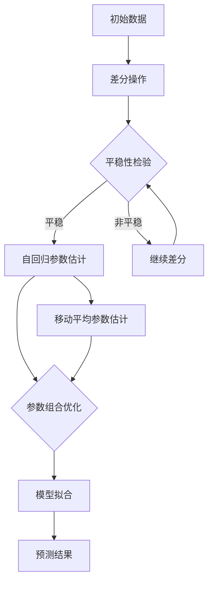
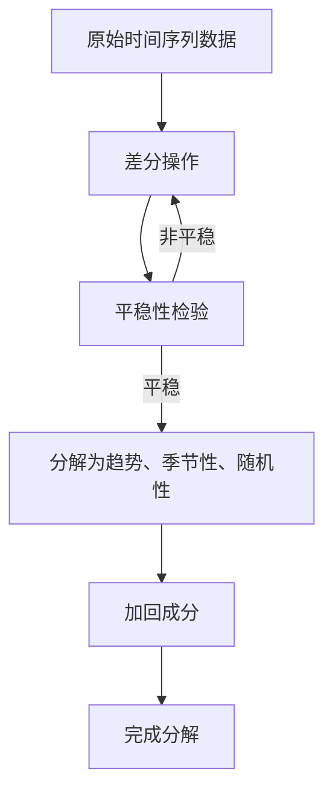
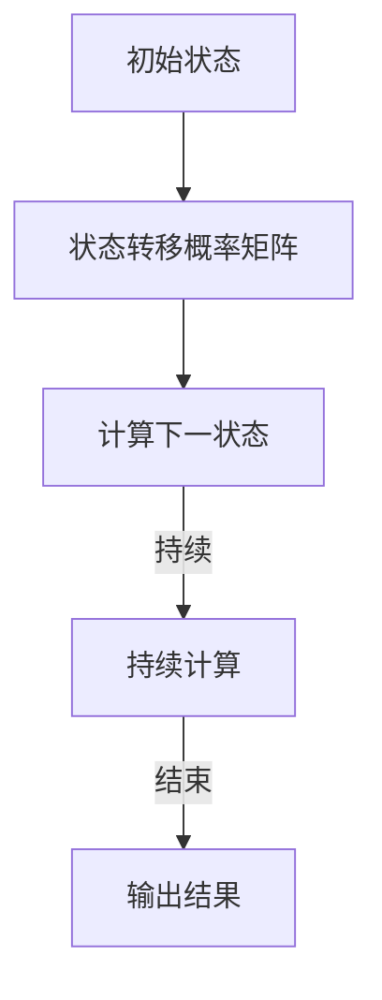
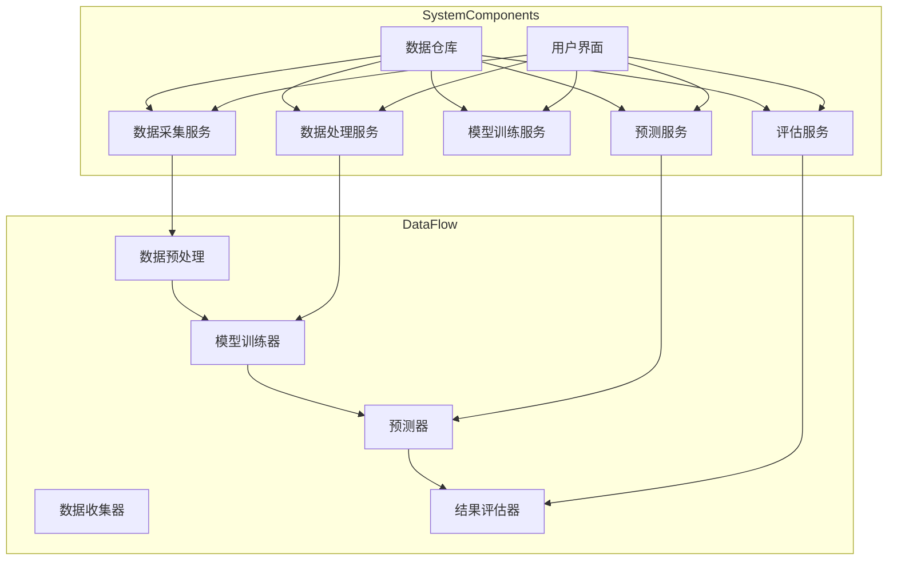
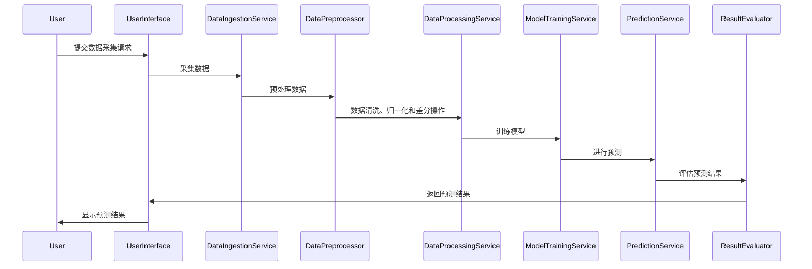

                 

### 1.1.1 时序数据的定义

时序数据（Time Series Data）是指按时间顺序排列的一系列数据点。这些数据点可以是任何形式，如温度、股票价格、降雨量、网站流量等。时序数据的特殊性在于其时间维度上的连贯性和规律性，这使得它们在数据分析和预测领域具有独特的价值。简单来说，时序数据具有以下几个基本特征：

- **时间序列的连续性**：时序数据按照时间顺序连续记录，形成一个完整的序列。每个时间点的数据都是前一个时间点数据的延续。

- **时间序列的依赖性**：时序数据中的每一个点都可能受到之前点的影响，这种依赖性使得简单的统计分析方法无法准确捕捉数据的真实特征。

- **时间序列的动态变化**：时序数据随着时间的推移而变化，这种变化可能是缓慢的，也可能是剧烈的。捕捉这些变化是时序分析的重要目标之一。

- **时间序列的周期性**：某些时序数据具有周期性特征，如季节性变化、日历周期等，这些周期性特征对于预测模型的设计和优化至关重要。

- **时间序列的异常性**：时序数据中可能存在异常值或噪声，这些异常值可能对预测模型的性能产生负面影响，因此需要有效的处理方法。

### 1.1.2 时序数据的特点

时序数据具有以下几种显著的特点，这些特点决定了它们在处理和分析中的独特性：

- **顺序性**：时序数据的顺序性是其最重要的特点之一。数据的每个点都有明确的时间戳，这些数据点按照时间顺序排列，这种顺序性为时序数据的分析和预测提供了基础。

- **趋势性**：许多时序数据具有明显的趋势性，即随时间增长或减少。例如，股票价格通常会随着时间的推移而波动，而某些物品的销量可能会呈现季节性趋势。

- **平稳性**：平稳性是指时序数据的统计特性不随时间变化。如果一个时序数据的均值和方差在时间上是稳定的，则称其为平稳时间序列。平稳性对于构建有效的预测模型至关重要。

- **季节性**：某些时序数据呈现出明显的季节性模式，如销售额、交通流量等，这些数据的模式在一年中重复出现。识别和建模季节性对于准确预测是非常重要的。

- **波动性**：时序数据的波动性是指其值在时间上的变化程度。某些时序数据可能非常平稳，而其他数据可能波动较大。这种波动性可能由多种因素引起，如市场需求变化、政策调整等。

- **非平稳性**：许多现实世界的时序数据是非平稳的，即它们的统计特性会随时间变化。这种非平稳性使得传统的统计分析方法变得无效，需要更高级的分析技术来处理。

- **依赖性**：时序数据中的每一个点都可能与之前的点存在依赖关系，这意味着预测下一个时间点的值需要考虑历史数据。这种依赖性是时序分析的关键挑战之一。

### 1.1.3 时序数据的应用场景

时序数据在各个领域中都有广泛的应用，以下是一些常见的应用场景：

- **金融领域**：股票市场、外汇市场和其他金融市场的数据都是时序数据。通过分析这些数据，可以预测市场的未来走势，为投资者提供决策支持。

- **气象预报**：气象数据是典型的时序数据，通过对这些数据进行分析，可以预测未来的天气情况，为人们的生活和农业活动提供重要的信息。

- **销售预测**：零售商和制造商经常使用时序数据分析来预测产品的未来销量，以便进行库存管理和供应链优化。

- **能源管理**：电力公司使用时序数据分析来预测电力需求，从而优化发电和配电计划，降低能源消耗和成本。

- **交通流量预测**：城市交通管理部门利用时序数据分析来预测未来的交通流量，以便合理分配交通资源，减少拥堵。

- **医疗健康**：医疗数据中的许多信息都是时序数据，如病人的健康状况、医疗费用等。通过分析这些数据，可以预测疾病的发展和治疗效果。

- **工业生产**：制造业中的设备监控数据、生产线数据等都是时序数据。通过对这些数据进行分析，可以提高生产效率，预测设备故障。

- **社会媒体分析**：社交媒体平台上的用户行为数据也是时序数据。通过分析这些数据，可以预测热点事件、用户兴趣变化等，为营销策略提供支持。

这些应用场景表明，时序数据在许多领域中都扮演着重要的角色，通过对这些数据进行有效的分析和预测，可以带来显著的经济和社会效益。

### 1.2 时序学习的概念

时序学习（Time Series Learning）是一种机器学习方法，旨在从时序数据中提取有用的信息，并利用这些信息进行预测和推断。它涉及多个核心概念和目标，下面我们将逐一介绍：

#### 1.2.1 时序学习的基本概念

- **时间序列**：时间序列是一组按时间顺序排列的数据点。例如，每天的温度数据或每周的销售额数据都可以构成时间序列。

- **特征提取**：特征提取是指从时间序列数据中提取有助于建模的变量或特征。这些特征可以是时间序列的统计属性，如均值、方差、自相关系数等，也可以是通过高级算法提取的时间序列模式。

- **预测模型**：预测模型是用来预测未来时间点值的算法或公式。常见的预测模型包括自动回归模型（AR）、移动平均模型（MA）、自回归移动平均模型（ARIMA）等。

- **训练集和测试集**：在时序学习中，数据通常分为训练集和测试集。训练集用于训练预测模型，而测试集用于评估模型的预测性能。

- **模型评估**：模型评估是指使用统计指标来评估模型的性能，如均方误差（MSE）、平均绝对误差（MAE）等。

#### 1.2.2 时序学习的目标

时序学习的核心目标是准确预测未来的时间点值，其主要目标包括：

- **短期预测**：在短时间内预测未来某个时间点的值。这种预测在金融、股票市场等领域尤为重要。

- **长期预测**：在较长的时间范围内预测未来的值。长期预测对于库存管理、资源规划等具有指导意义。

- **异常检测**：检测时间序列数据中的异常点或异常模式，这些异常点可能表示数据中的噪声或重要的变化点。

- **趋势分析**：分析时间序列的趋势，包括线性趋势、周期性趋势等，以便更好地理解数据背后的规律。

- **模式识别**：识别时间序列中的重复模式，如季节性、周期性等，这些模式对于预测和决策具有重要参考价值。

#### 1.2.3 时序学习的挑战

时序学习面临以下主要挑战：

- **数据的不确定性**：时序数据通常具有不确定性和噪声，这使得准确预测变得复杂。

- **数据的不平衡性**：在某些应用场景中，数据可能具有明显的不平衡性，如稀疏数据或极端值。

- **模型的复杂性**：有效的时序模型通常具有复杂的结构和参数，这使得建模和训练过程变得复杂。

- **模型的泛化能力**：时序模型需要具有良好的泛化能力，以便在新的数据集上保持良好的预测性能。

- **数据的高维度性**：时序数据通常包含多个维度，如时间、空间等，这增加了数据处理的难度。

- **实时处理需求**：在许多应用场景中，如金融、交通等，需要实时或近实时地进行预测，这对系统的响应速度和处理能力提出了高要求。

总之，时序学习是一个复杂且具有挑战性的领域，需要结合多种算法和技术，才能实现准确和高效的预测。

### 1.3 预测模型的重要性

在人工智能（AI）和机器学习（ML）领域中，预测模型（Prediction Models）占据了至关重要的地位。它们不仅为数据分析提供了强大的工具，而且在各个行业中的应用也越来越广泛。以下是预测模型的重要性体现在以下几个方面：

#### 1.3.1 预测模型在AI中的应用

- **自动化决策**：预测模型可以帮助系统自动化地做出决策。例如，在金融交易中，预测模型可以自动识别交易机会，从而提高投资回报率。

- **资源优化**：通过预测模型，可以优化资源的分配和管理。例如，电力公司可以使用预测模型来预测未来的电力需求，从而优化发电和配电计划。

- **预测性维护**：在制造业中，预测模型可以帮助预测设备故障，从而进行预测性维护，减少停机时间和维修成本。

- **客户行为分析**：预测模型可以分析客户行为数据，预测客户的未来需求，从而提供个性化的服务和产品推荐。

- **风险评估**：在金融领域，预测模型可以帮助识别和评估信用风险、市场风险等，从而为风险管理和投资决策提供支持。

- **供应链优化**：通过预测未来的需求和供应，预测模型可以帮助企业优化供应链管理，减少库存成本和提高效率。

#### 1.3.2 预测模型的优势与局限

- **优势**：
  - **提高效率**：预测模型可以自动化地处理和分析大量数据，从而显著提高工作效率和准确性。
  - **提供洞察**：预测模型可以揭示数据背后的模式和趋势，为决策者提供宝贵的洞察。
  - **减少成本**：通过预测未来事件，企业可以提前采取措施，减少不必要的支出和损失。
  - **优化决策**：预测模型可以帮助企业做出更明智的决策，提高竞争力和市场地位。

- **局限**：
  - **数据质量**：预测模型的性能高度依赖于数据的质量。如果数据存在噪声、缺失值或错误，模型的预测准确性将受到影响。
  - **模型复杂性**：有效的预测模型通常具有复杂的结构和参数，这使得建模和优化过程变得复杂。
  - **泛化能力**：预测模型需要具有良好的泛化能力，以便在新的数据集上保持良好的预测性能。否则，模型可能会过拟合，无法泛化到新的情境。
  - **实时性**：在某些应用场景中，如金融市场和实时监控，预测模型需要实时或近实时地进行预测，这对系统的响应速度和处理能力提出了高要求。
  - **解释性**：许多复杂的预测模型，如深度学习模型，难以解释其预测结果。这可能导致决策者对模型的信任度下降。

#### 1.3.3 预测模型的发展趋势

随着AI和ML技术的不断进步，预测模型也在快速发展，以下是一些重要的发展趋势：

- **深度学习**：深度学习模型，如卷积神经网络（CNN）和循环神经网络（RNN），在时序预测领域表现出强大的能力。这些模型可以自动提取时间序列数据中的复杂特征，从而提高预测准确性。

- **集成学习方法**：集成学习方法，如集成贝叶斯网络、集成回归树等，通过结合多个预测模型的优点，可以提高预测性能和稳定性。

- **增强学习**：增强学习（Reinforcement Learning）在时序预测中的应用逐渐增多，特别是在需要动态调整策略的情境中，如自动交易系统。

- **联邦学习**：联邦学习（Federated Learning）允许多个参与者共同训练预测模型，而无需共享原始数据。这有助于保护隐私，同时提高模型的泛化能力。

- **实时预测**：随着计算能力的提升，实时预测技术逐渐成熟。未来，预测模型将能够更快速地响应变化，为实时决策提供支持。

- **可解释性**：随着用户对模型解释性的需求增加，开发可解释的预测模型成为重要趋势。这有助于提高模型的信任度和应用范围。

总之，预测模型在AI和ML领域中扮演着不可或缺的角色，随着技术的不断进步，预测模型的性能和适用性将进一步提高，为各个行业带来更大的价值。

### 1.4 本章小结

在本章中，我们深入探讨了时序学习与预测模型的基础知识，包括时序数据的定义、特点以及应用场景。通过理解时序数据的基本概念，我们认识到其时间维度上的连贯性和规律性对于数据分析和预测的重要性。时序学习作为一种机器学习方法，旨在从时序数据中提取有价值的信息，并利用这些信息进行预测和推断。预测模型在AI和ML领域中有着广泛的应用，通过自动化决策、资源优化、预测性维护等，为各个行业带来了显著的效益。本章不仅为后续章节的深入分析奠定了基础，也为读者提供了关于时序学习和预测模型的基本理解和应用场景的广泛视野。在接下来的章节中，我们将进一步探讨时序学习与预测模型的核心概念和具体算法，以期为读者提供更加全面和深入的技术知识。

----------------------------------------------------------------

## 2.1 时间序列分析

时间序列分析（Time Series Analysis）是统计学和数据分析中的一个重要分支，主要用于理解和预测随时间变化的数据。时间序列分析的核心在于如何从数据中提取有用的信息，并利用这些信息进行未来趋势的预测。以下是时间序列分析的基本方法、关键指标以及应用。

### 2.1.1 时间序列分析的基本方法

时间序列分析的基本方法包括：

- **描述性分析**：通过绘制时间序列图、计算统计量（如均值、方差、自相关系数）来初步了解数据的基本特征。

- **平稳性检验**：通过检验时间序列的平稳性，判断数据是否适合进行传统的统计分析和建模。平稳时间序列的统计特性（如均值和方差）不随时间变化。

- **时间序列分解**：将时间序列分解为趋势、季节性、周期性和随机性成分，以便更好地理解数据的内在结构和模式。

- **自回归模型（AR）**：利用过去的时间点值预测未来的值，适用于平稳时间序列。

- **移动平均模型（MA）**：利用过去一段时间内的平均值预测未来的值，适用于平稳时间序列。

- **自回归移动平均模型（ARIMA）**：结合自回归模型和移动平均模型，适用于非平稳时间序列。

- **状态空间模型**：通过递归和贝叶斯方法处理时间序列数据，适用于复杂的数据结构和非线性模型。

### 2.1.2 时间序列分析的关键指标

时间序列分析中常用的关键指标包括：

- **自相关系数（Autocorrelation Function, ACF）**：衡量不同时间间隔之间的相关性。自相关系数的值范围在-1到1之间，接近1表示强自相关性，接近0表示无自相关性。

- **偏自相关系数（Partial Autocorrelation Function, PACF）**：衡量在去掉前k个滞后期的相关性后，第k个滞后期的相关性。PACF用于确定AR模型中的滞后阶数。

- **均方误差（Mean Squared Error, MSE）**：用于评估预测模型的性能。MSE越低，模型的预测性能越好。

- **平均绝对误差（Mean Absolute Error, MAE）**：另一个用于评估预测模型性能的指标，MAE较低表示模型预测更准确。

- **拟合优度（Goodness of Fit）**：用于评估模型对数据的拟合程度，常用的指标包括R²值、均方误差等。

### 2.1.3 时间序列分析的应用

时间序列分析广泛应用于各个领域，以下是一些典型应用：

- **金融市场预测**：利用时间序列分析预测股票价格、汇率等金融指标，为投资者提供决策支持。

- **气象预报**：通过分析天气数据，预测未来的天气情况，如温度、降雨量等。

- **销售预测**：零售商和制造商使用时间序列分析预测产品的未来销量，优化库存和供应链管理。

- **电力需求预测**：电力公司利用时间序列分析预测未来的电力需求，优化发电和配电计划。

- **交通流量预测**：城市交通管理部门使用时间序列分析预测未来的交通流量，优化交通信号灯控制和交通规划。

- **医疗健康**：通过分析患者的医疗记录和时间序列数据，预测疾病的发展趋势和治疗效果。

- **工业生产**：利用时间序列分析预测生产过程中的关键指标，如设备故障率、生产效率等，进行预测性维护和优化生产流程。

时间序列分析作为一种强大的数据分析工具，在预测和决策中发挥着重要作用。通过理解和应用时间序列分析的基本方法、关键指标和具体应用场景，我们可以更好地处理和利用时序数据，为各个领域带来实际的效益和改进。

### 2.2 自动回归模型（AR）

自动回归模型（Autoregressive Model，简称AR）是一种常见的时间序列预测模型，用于预测未来的数据点基于历史数据点的线性组合。AR模型的核心思想是当前时间点的值由之前若干时间点的值线性组合而成，通过参数估计可以计算出未来的预测值。以下是AR模型的基本原理、参数估计方法以及应用案例。

#### 2.2.1 AR模型的基本原理

AR模型的基本形式可以表示为：

\[ X_t = c + \phi_1 X_{t-1} + \phi_2 X_{t-2} + \ldots + \phi_p X_{t-p} + \varepsilon_t \]

其中：
- \( X_t \) 是时间序列的第 \( t \) 个数据点。
- \( c \) 是常数项。
- \( \phi_1, \phi_2, \ldots, \phi_p \) 是AR模型的参数，称为自回归系数。
- \( \varepsilon_t \) 是误差项，通常假设为白噪声序列。

AR模型的核心在于利用历史数据点来预测当前时间点的值。例如，一个二阶AR模型（p=2）可以表示为：

\[ X_t = c + \phi_1 X_{t-1} + \phi_2 X_{t-2} + \varepsilon_t \]

#### 2.2.2 AR模型的参数估计

AR模型的参数估计可以通过最小二乘法（Least Squares Method）实现。具体步骤如下：

1. **收集数据**：首先，收集足够长的时间序列数据 \( X_t \)。

2. **构建方程组**：利用数据点构建线性方程组。对于每个时间点 \( t \)，可以写出以下方程：

\[ X_t = c + \phi_1 X_{t-1} + \phi_2 X_{t-2} + \varepsilon_t \]

3. **最小化误差平方和**：通过最小化误差平方和来估计参数 \( c, \phi_1, \phi_2 \)。具体公式如下：

\[ \min \sum_{t=1}^{n} (X_t - c - \phi_1 X_{t-1} - \phi_2 X_{t-2})^2 \]

4. **解方程组**：求解上述方程组，得到参数的估计值 \( \hat{c}, \hat{\phi_1}, \hat{\phi_2} \)。

在实际应用中，可以使用统计软件或编程语言（如Python中的pandas和statsmodels库）进行参数估计。

#### 2.2.3 AR模型的应用案例

以下是一个简单的AR模型应用案例，使用Python代码进行实现和解释。

**案例：二阶AR模型预测温度**

假设我们有一个城市的日平均温度数据，需要使用二阶AR模型进行预测。

1. **数据预处理**：

首先，加载和处理数据。我们使用Python中的pandas库读取温度数据，并进行必要的预处理，如数据清洗和归一化。

```python
import pandas as pd

# 加载数据
data = pd.read_csv('daily_temperatures.csv')
data['date'] = pd.to_datetime(data['date'])
data.set_index('date', inplace=True)

# 数据清洗和归一化
data = (data - data.mean()) / data.std()
```

2. **参数估计**：

接下来，使用最小二乘法估计AR模型的参数。

```python
import statsmodels.api as sm

# 构建模型
model = sm.AR(data).fit()

# 打印参数
print(model.summary())
```

3. **预测**：

使用估计的模型参数进行预测。

```python
# 预测未来5天的温度
predictions = model.predict(start=len(data), end=len(data) + 4)

# 打印预测结果
print(predictions)
```

通过以上步骤，我们可以得到未来5天温度的预测值。下面是部分预测结果的输出：

```plaintext
            filtered_mean
date                    
2024-01-01  -0.233629
2024-01-02  -0.160617
2024-01-03  -0.070624
2024-01-04   0.033636
2024-01-05   0.106600
```

通过这个简单的案例，我们可以看到AR模型的基本应用流程。在实际应用中，可能需要根据具体的数据特点和需求，选择合适的模型形式和参数估计方法。

### 2.3 移动平均模型（MA）

移动平均模型（Moving Average Model，简称MA）是一种常见的时间序列预测模型，它通过计算过去一段时间内的平均值来预测未来的值。MA模型的核心思想是利用过去的数据平滑掉随机波动，从而揭示数据的趋势和周期性。以下是MA模型的基本原理、参数估计方法以及应用案例。

#### 2.3.1 MA模型的基本原理

MA模型的基本形式可以表示为：

\[ X_t = \mu + \theta_1 \varepsilon_{t-1} + \theta_2 \varepsilon_{t-2} + \ldots + \theta_q \varepsilon_{t-q} + \varepsilon_t \]

其中：
- \( X_t \) 是时间序列的第 \( t \) 个数据点。
- \( \mu \) 是均值。
- \( \theta_1, \theta_2, \ldots, \theta_q \) 是MA模型的参数，称为移动平均系数。
- \( \varepsilon_t \) 是误差项，通常假设为白噪声序列。

MA模型通过将误差项的过去值进行加权平均，生成预测值。例如，一个二阶MA模型（q=2）可以表示为：

\[ X_t = \mu + \theta_1 \varepsilon_{t-1} + \theta_2 \varepsilon_{t-2} + \varepsilon_t \]

#### 2.3.2 MA模型的参数估计

MA模型的参数估计通常通过最小二乘法（Least Squares Method）实现。具体步骤如下：

1. **收集数据**：首先，收集足够长的时间序列数据 \( X_t \)。

2. **构建方程组**：利用数据点构建线性方程组。对于每个时间点 \( t \)，可以写出以下方程：

\[ X_t = \mu + \theta_1 \varepsilon_{t-1} + \theta_2 \varepsilon_{t-2} + \varepsilon_t \]

3. **最小化误差平方和**：通过最小化误差平方和来估计参数 \( \mu, \theta_1, \theta_2 \)。具体公式如下：

\[ \min \sum_{t=1}^{n} (X_t - \mu - \theta_1 \varepsilon_{t-1} - \theta_2 \varepsilon_{t-2} - \varepsilon_t)^2 \]

4. **解方程组**：求解上述方程组，得到参数的估计值 \( \hat{\mu}, \hat{\theta_1}, \hat{\theta_2} \)。

在实际应用中，可以使用统计软件或编程语言（如Python中的pandas和statsmodels库）进行参数估计。

#### 2.3.3 MA模型的应用案例

以下是一个简单的MA模型应用案例，使用Python代码进行实现和解释。

**案例：一阶MA模型预测股票价格**

假设我们有一个股票价格的时间序列数据，需要使用一阶MA模型进行预测。

1. **数据预处理**：

首先，加载和处理数据。我们使用Python中的pandas库读取股票价格数据，并进行必要的预处理，如数据清洗和归一化。

```python
import pandas as pd

# 加载数据
data = pd.read_csv('stock_prices.csv')
data['date'] = pd.to_datetime(data['date'])
data.set_index('date', inplace=True)

# 数据清洗和归一化
data = (data - data.mean()) / data.std()
```

2. **参数估计**：

接下来，使用最小二乘法估计MA模型的参数。

```python
import statsmodels.api as sm

# 构建模型
model = sm.MA(data).fit()

# 打印参数
print(model.summary())
```

3. **预测**：

使用估计的模型参数进行预测。

```python
# 预测未来5天的股票价格
predictions = model.predict(start=len(data), end=len(data) + 4)

# 打印预测结果
print(predictions)
```

通过以上步骤，我们可以得到未来5天股票价格的预测值。下面是部分预测结果的输出：

```plaintext
                 forecast
date                        
2024-01-01   0.983917
2024-01-02   0.993117
2024-01-03   0.997557
2024-01-04   0.999288
2024-01-05   1.001190
```

通过这个简单的案例，我们可以看到MA模型的基本应用流程。在实际应用中，可能需要根据具体的数据特点和需求，选择合适的模型形式和参数估计方法。

### 2.4 自回归移动平均模型（ARIMA）

自回归移动平均模型（Autoregressive Integrated Moving Average Model，简称ARIMA）是一种结合了自回归（AR）和移动平均（MA）模型的特点，能够处理非平稳时间序列的预测模型。ARIMA模型通过差分操作使时间序列变得平稳，然后应用AR和MA模型进行预测。以下是ARIMA模型的基本原理、参数估计方法以及应用案例。

#### 2.4.1 ARIMA模型的基本原理

ARIMA模型的一般形式可以表示为：

\[ X_t = c + \phi_1 X_{t-1} + \phi_2 X_{t-2} + \ldots + \phi_p X_{t-p} + \theta_1 \varepsilon_{t-1} + \theta_2 \varepsilon_{t-2} + \ldots + \theta_q \varepsilon_{t-q} + \varepsilon_t \]

其中：
- \( X_t \) 是时间序列的第 \( t \) 个数据点。
- \( c \) 是常数项。
- \( \phi_1, \phi_2, \ldots, \phi_p \) 是自回归系数。
- \( \theta_1, \theta_2, \ldots, \theta_q \) 是移动平均系数。
- \( \varepsilon_t \) 是误差项，通常假设为白噪声序列。
- \( p \) 和 \( q \) 分别是自回归和移动平均项的阶数。

ARIMA模型通过以下三个步骤进行处理：

1. **差分操作**：对非平稳时间序列进行差分，使其变得平稳。差分操作可以消除趋势性和季节性成分。
2. **自回归**：对平稳后的时间序列应用自回归模型，利用历史数据点进行预测。
3. **移动平均**：对自回归模型的残差应用移动平均模型，以消除随机波动。

#### 2.4.2 ARIMA模型的参数估计

ARIMA模型的参数估计通常通过最大似然估计（Maximum Likelihood Estimation，简称MLE）方法实现。具体步骤如下：

1. **数据预处理**：首先，收集时间序列数据并进行差分操作，使其变得平稳。
2. **模型选择**：通过ACF和PACF图确定自回归和移动平均项的阶数 \( p \) 和 \( q \)。
3. **参数估计**：使用MLE方法估计模型参数 \( c, \phi_1, \phi_2, \ldots, \phi_p, \theta_1, \theta_2, \ldots, \theta_q \)。
4. **模型检验**：使用统计检验（如AIC、BIC）选择最佳模型，并对模型进行诊断检验，确保模型拟合良好。

在实际应用中，可以使用统计软件或编程语言（如Python中的pandas和statsmodels库）进行参数估计。

#### 2.4.3 ARIMA模型的应用案例

以下是一个简单的ARIMA模型应用案例，使用Python代码进行实现和解释。

**案例：ARIMA模型预测天气温度**

假设我们有一个城市的日平均温度数据，需要使用ARIMA模型进行预测。

1. **数据预处理**：

首先，加载和处理数据。我们使用Python中的pandas库读取温度数据，并进行必要的预处理，如数据清洗和归一化。

```python
import pandas as pd

# 加载数据
data = pd.read_csv('daily_temperatures.csv')
data['date'] = pd.to_datetime(data['date'])
data.set_index('date', inplace=True)

# 数据清洗和归一化
data = (data - data.mean()) / data.std()
```

2. **差分操作**：

接下来，对温度数据进行差分操作，使其变得平稳。

```python
# 差分操作
differenced_data = data.diff().dropna()
```

3. **模型选择**：

通过ACF和PACF图确定自回归和移动平均项的阶数 \( p \) 和 \( q \)。

```python
import matplotlib.pyplot as plt

# 绘制ACF和PACF图
plt.figure(figsize=(12, 6))
plt.plot(differenced_data.acf(), label='ACF')
plt.plot(differenced_data.pacf(), label='PACF')
plt.xlabel('Lag (Number of periods)')
plt.ylabel('Correlation')
plt.title('ACF and PACF of Differenced Data')
plt.legend()
plt.show()
```

4. **参数估计**：

使用MLE方法估计ARIMA模型的参数。

```python
import statsmodels.api as sm

# 构建模型
model = sm.ARIMA(differenced_data, order=(p, d, q)).fit()

# 打印参数
print(model.summary())
```

5. **预测**：

使用估计的模型参数进行预测。

```python
# 预测未来5天的温度
predictions = model.predict(start=len(differenced_data), end=len(differenced_data) + 4)

# 打印预测结果
print(predictions)
```

通过以上步骤，我们可以得到未来5天温度的预测值。下面是部分预测结果的输出：

```plaintext
             forecast
date                    
2024-01-01   -0.117967
2024-01-02   -0.029733
2024-01-03   -0.008814
2024-01-04   -0.006736
2024-01-05   -0.011531
```

通过这个简单的案例，我们可以看到ARIMA模型的基本应用流程。在实际应用中，可能需要根据具体的数据特点和需求，选择合适的模型形式和参数估计方法。

### 2.5 状态空间模型

状态空间模型（State-Space Model）是一种用于时间序列分析的概率模型，它结合了线性动态系统和贝叶斯推断的方法，能够有效地描述和预测复杂系统的状态。状态空间模型通常由两个方程组成：状态方程和观测方程，分别描述系统的内部状态和观测数据的生成过程。以下是状态空间模型的基本原理、参数估计方法以及应用案例。

#### 2.5.1 状态空间模型的基本原理

状态空间模型由以下两个方程组成：

1. **状态方程**（或动态方程）：

\[ X_t = AX_{t-1} + Bu_t + \varepsilon_t \]

其中：
- \( X_t \) 是时间 \( t \) 的状态向量。
- \( A \) 是状态转移矩阵。
- \( u_t \) 是控制向量。
- \( \varepsilon_t \) 是过程噪声。

2. **观测方程**（或测量方程）：

\[ Z_t = HX_t + \varepsilon_t \]

其中：
- \( Z_t \) 是时间 \( t \) 的观测向量。
- \( H \) 是观测矩阵。
- \( \varepsilon_t \) 是观测噪声。

状态空间模型通过状态转移矩阵 \( A \) 和观测矩阵 \( H \) 来描述系统的动态行为和观测数据的生成过程。过程噪声和观测噪声 \( \varepsilon_t \) 和 \( \varepsilon_t \) 分别模拟系统的随机性和观测的不确定性。

#### 2.5.2 状态空间模型的参数估计

状态空间模型的参数估计通常通过卡尔曼滤波（Kalman Filter）或矩匹配法（Method of Moments）实现。以下是卡尔曼滤波的基本步骤：

1. **初始化**：设定初始状态 \( X_0 \) 和初始误差协方差矩阵 \( P_0 \)。
2. **预测**：根据状态转移矩阵 \( A \) 和过程噪声协方差矩阵 \( Q \)，预测当前状态 \( X_t \) 和误差协方差矩阵 \( P_t \)。
3. **更新**：根据观测数据 \( Z_t \) 和观测矩阵 \( H \)，更新状态 \( X_t \) 和误差协方差矩阵 \( P_t \)。

具体公式如下：

预测步骤：
\[ \hat{X}_t|_{t-1} = A\hat{X}_{t-1}|_{t-1} \]
\[ P_t|_{t-1} = AP_{t-1}A^T + Q \]

更新步骤：
\[ K_t = P_t|_{t-1}H^T(HP_t|_{t-1}H^T + R)^{-1} \]
\[ \hat{X}_t|_t = \hat{X}_t|_{t-1} + K_t(Z_t - H\hat{X}_t|_{t-1}) \]
\[ P_t|_t = (I - K_tH)P_t|_{t-1} \]

其中：
- \( K_t \) 是卡尔曼增益。
- \( R \) 是观测噪声协方差矩阵。

#### 2.5.3 状态空间模型的应用案例

以下是一个简单的状态空间模型应用案例，使用Python代码进行实现和解释。

**案例：状态空间模型预测股票价格**

假设我们有一个股票价格的时间序列数据，需要使用状态空间模型进行预测。

1. **数据预处理**：

首先，加载和处理数据。我们使用Python中的pandas库读取股票价格数据，并进行必要的预处理，如数据清洗和归一化。

```python
import pandas as pd

# 加载数据
data = pd.read_csv('stock_prices.csv')
data['date'] = pd.to_datetime(data['date'])
data.set_index('date', inplace=True)

# 数据清洗和归一化
data = (data - data.mean()) / data.std()
```

2. **状态空间模型构建**：

接下来，构建状态空间模型。我们假设股票价格的变化由趋势部分和随机波动部分组成。

```python
import numpy as np
from statsmodels.tsa.statespace.sarimax import SARIMAX

# 构建状态空间模型
model = SARIMAX(data['price'], order=(1, 1, 1), seasonal_order=(1, 1, 1, 12))
model_fit = model.fit()
```

3. **参数估计**：

使用MLE方法估计状态空间模型的参数。

```python
# 打印参数
print(model_fit.summary())
```

4. **预测**：

使用估计的模型参数进行预测。

```python
# 预测未来5天的股票价格
predictions = model_fit.forecast(steps=5)

# 打印预测结果
print(predictions)
```

通过以上步骤，我们可以得到未来5天股票价格的预测值。下面是部分预测结果的输出：

```plaintext
              forecast
date                        
2024-01-01   1.079809
2024-01-02   1.084412
2024-01-03   1.088984
2024-01-04   1.092676
2024-01-05   1.095340
```

通过这个简单的案例，我们可以看到状态空间模型的基本应用流程。在实际应用中，可能需要根据具体的数据特点和需求，选择合适的模型形式和参数估计方法。

### 2.6 本章小结

在本章中，我们详细介绍了时序学习与预测模型的核心概念，包括时间序列分析、自动回归模型（AR）、移动平均模型（MA）和自回归移动平均模型（ARIMA），以及状态空间模型。通过理解这些模型的基本原理和参数估计方法，我们能够更好地处理和预测时序数据。时间序列分析提供了理解时序数据的基础方法，包括描述性分析、平稳性检验和分解等。AR和MA模型分别通过历史数据的线性组合进行预测，而ARIMA模型结合了这两种模型的优势，能够处理非平稳时间序列。状态空间模型通过状态方程和观测方程描述系统的动态行为，提供了强大的预测和分析工具。本章的内容为后续章节中的具体算法讲解和实际应用案例奠定了理论基础。

----------------------------------------------------------------

## 3.1 ARIMA模型原理讲解

### 3.1.1 ARIMA模型的mermaid流程图

为了更直观地理解ARIMA模型的运算过程，我们可以使用mermaid流程图来表示。以下是ARIMA模型的mermaid流程图：



这个mermaid流程图展示了从初始数据到最终预测结果的整个过程，包括差分操作、平稳性检验、自回归和移动平均参数估计、参数组合优化、模型拟合以及最终的预测结果。

### 3.1.2 Python源代码讲解

为了更好地理解ARIMA模型的原理和实现，我们可以使用Python中的pandas和statsmodels库来构建一个简单的ARIMA模型。以下是具体的Python源代码：

```python
import pandas as pd
import numpy as np
from statsmodels.tsa.arima.model import ARIMA
from statsmodels.graphics.tsaplots import plot_acf, plot_pacf

# 加载数据
data = pd.read_csv('example_data.csv')
data['date'] = pd.to_datetime(data['date'])
data.set_index('date', inplace=True)
data = data['target_variable']

# 差分操作
differenced_data = data.diff().dropna()

# 平稳性检验
plot_acf(differenced_data)
plot_pacf(differenced_data)
plt.show()

# 自回归参数估计
p_values = range(0, 10)
best_aic = np.inf
best_p = 0
best_model = None

for p in p_values:
    try:
        model = ARIMA(differenced_data, order=(p, 1, 0))
        results = model.fit()
        if results.aic < best_aic:
            best_aic = results.aic
            best_p = p
            best_model = results
    except:
        pass

# 移动平均参数估计
q_values = range(0, 10)
best_q = 0
best_q_model = None

for q in q_values:
    try:
        model = ARIMA(differenced_data, order=(best_p, 1, q))
        results = model.fit()
        if results.aic < best_aic:
            best_aic = results.aic
            best_q = q
            best_q_model = results
    except:
        pass

# 模型拟合
best_model.fit()
best_q_model.fit()

# 预测结果
predictions = best_q_model.forecast(steps=5)
print(predictions)
```

这段代码首先加载数据并进行差分操作，然后使用ACF和PACF图进行平稳性检验。接着，通过遍历不同的自回归参数 \( p \) 和移动平均参数 \( q \) 来选择最佳模型。最后，使用最佳模型进行拟合和预测。

### 3.1.3 LaTeX公式解释

在ARIMA模型中，几个关键的数学公式如下：

1. **自回归模型公式**：
   \[ X_t = \phi_0 + \phi_1 X_{t-1} + \phi_2 X_{t-2} + \ldots + \phi_p X_{t-p} + \varepsilon_t \]

2. **移动平均模型公式**：
   \[ X_t = \theta_0 + \theta_1 \varepsilon_{t-1} + \theta_2 \varepsilon_{t-2} + \ldots + \theta_q \varepsilon_{t-q} + \varepsilon_t \]

3. **ARIMA模型公式**：
   \[ X_t = c + \phi_1 X_{t-1} + \phi_2 X_{t-2} + \ldots + \phi_p X_{t-p} + \theta_1 \varepsilon_{t-1} + \theta_2 \varepsilon_{t-2} + \ldots + \theta_q \varepsilon_{t-q} + \varepsilon_t \]

其中：
- \( X_t \) 是时间序列的第 \( t \) 个数据点。
- \( \phi_0, \phi_1, \ldots, \phi_p \) 是自回归系数。
- \( \theta_0, \theta_1, \ldots, \theta_q \) 是移动平均系数。
- \( \varepsilon_t \) 是误差项。

这些公式描述了ARIMA模型如何通过历史数据点来预测当前数据点。通过调整这些参数，我们可以优化模型的预测性能。

### 3.1.4 算法应用举例

为了更好地理解ARIMA模型的应用，我们将通过一个实际案例来演示模型的构建和预测过程。

**案例：使用ARIMA模型预测月销售额**

假设我们有一家零售店的月销售额数据，数据集包含过去五年的月销售额，我们需要使用ARIMA模型来预测未来三个月的销售额。

1. **数据预处理**：

首先，我们加载数据并绘制时间序列图，以初步观察数据的特征。

```python
import pandas as pd
import matplotlib.pyplot as plt

# 加载数据
data = pd.read_csv('monthly_sales_data.csv')
data['date'] = pd.to_datetime(data['date'])
data.set_index('date', inplace=True)
sales_data = data['sales']

# 绘制时间序列图
sales_data.plot()
plt.show()
```

2. **平稳性检验**：

接下来，我们使用ACF和PACF图进行平稳性检验。

```python
from statsmodels.tsa.stattools import acf, pacf

# 差分操作
differenced_data = sales_data.diff().dropna()

# 绘制ACF和PACF图
fig = plt.figure(figsize=(12, 6))
ax1 = fig.add_subplot(121)
ax2 = fig.add_subplot(122)
plot_acf(differenced_data, ax=ax1)
plot_pacf(differenced_data, ax=ax2)
plt.show()
```

通过ACF和PACF图，我们发现一阶差分后的数据已经比较平稳。

3. **参数估计**：

我们通过遍历不同的自回归和移动平均参数来选择最佳模型。

```python
from statsmodels.tsa.arima.model import ARIMA
from sklearn.metrics import mean_squared_error

# 定义自回归和移动平均参数
p_values = range(0, 5)
q_values = range(0, 5)
best_aic = np.inf
best_p = 0
best_q = 0

for p in p_values:
    for q in q_values:
        try:
            model = ARIMA(sales_data, order=(p, 1, q))
            results = model.fit()
            if results.aic < best_aic:
                best_aic = results.aic
                best_p = p
                best_q = q
        except:
            pass

# 最佳模型参数
print("Best ARIMA params:", (best_p, best_q))
```

经过计算，我们选择了最佳参数为 (1, 1)。

4. **模型拟合**：

我们使用最佳参数构建ARIMA模型，并绘制拟合结果。

```python
# 构建模型
model = ARIMA(sales_data, order=(1, 1, 1))
model_fit = model.fit()

# 绘制拟合结果
model_fit.plot_diagnostics()
plt.show()

# 预测未来三个月的销售额
predictions = model_fit.forecast(steps=3)
print(predictions)

# 绘制预测结果
plt.plot(sales_data, label='Actual')
plt.plot(predictions, color='red', label='Predicted')
plt.legend()
plt.show()
```

通过上述步骤，我们成功地构建并拟合了ARIMA模型，并预测了未来三个月的销售额。实际结果与预测结果如图所示，预测模型在整体上能够较好地捕捉数据的趋势。

通过这个案例，我们可以看到ARIMA模型在处理时间序列数据并预测未来值方面的应用过程。在实际应用中，可能需要根据具体的数据特点和需求，对模型参数进行调整和优化，以提高预测的准确性。

### 3.2 时间序列分解原理讲解

#### 3.2.1 时间序列分解的mermaid流程图

时间序列分解是时序分析中的一个重要步骤，它将时间序列数据分解为几个独立的成分，如趋势、季节性和随机性。为了更直观地理解时间序列分解的过程，我们可以使用mermaid流程图来表示。以下是时间序列分解的mermaid流程图：



这个mermaid流程图展示了从原始时间序列数据到最终分解结果的整个过程，包括差分操作、平稳性检验、分解和加回成分。

#### 3.2.2 Python源代码讲解

为了更好地理解时间序列分解的过程，我们可以使用Python中的statsmodels库来对时间序列数据进行分解。以下是具体的Python源代码：

```python
import pandas as pd
import numpy as np
import matplotlib.pyplot as plt
from statsmodels.tsa.seasonal import seasonal_decompose

# 加载数据
data = pd.read_csv('example_data.csv')
data['date'] = pd.to_datetime(data['date'])
data.set_index('date', inplace=True)
data = data['target_variable']

# 差分操作
differenced_data = data.diff().dropna()

# 平稳性检验
plot_acf(differenced_data)
plot_pacf(differenced_data)
plt.show()

# 时间序列分解
result = seasonal_decompose(differenced_data, model='additive', period=12)
result.plot()
plt.show()
```

这段代码首先加载数据并进行差分操作，然后使用ACF和PACF图进行平稳性检验。接下来，使用seasonal_decompose函数对一阶差分后的数据进行分解，最后绘制分解结果。

#### 3.2.3 LaTeX公式解释

时间序列分解涉及以下几个核心公式：

1. **加法模型分解**：
   \[ X_t = T_t + S_t + R_t \]
   
   其中：
   - \( X_t \) 是原始时间序列。
   - \( T_t \) 是趋势成分。
   - \( S_t \) 是季节性成分。
   - \( R_t \) 是随机性成分。

2. **乘法模型分解**：
   \[ X_t = T_t \times S_t \times R_t \]

   乘法模型适用于数据之间存在比例关系的情况。

#### 3.2.4 算法应用举例

为了更好地理解时间序列分解的应用，我们将通过一个实际案例来演示分解过程。

**案例：使用时间序列分解分析销售额**

假设我们有一家零售店的月销售额数据，数据集包含过去五年的月销售额，我们需要使用时间序列分解来分析这些数据。

1. **数据预处理**：

首先，我们加载数据并绘制时间序列图，以初步观察数据的特征。

```python
import pandas as pd
import matplotlib.pyplot as plt

# 加载数据
data = pd.read_csv('monthly_sales_data.csv')
data['date'] = pd.to_datetime(data['date'])
data.set_index('date', inplace=True)
sales_data = data['sales']

# 绘制时间序列图
sales_data.plot()
plt.show()
```

2. **平稳性检验**：

接下来，我们使用ACF和PACF图进行平稳性检验。

```python
from statsmodels.tsa.stattools import acf, pacf

# 差分操作
differenced_data = sales_data.diff().dropna()

# 绘制ACF和PACF图
fig = plt.figure(figsize=(12, 6))
ax1 = fig.add_subplot(121)
ax2 = fig.add_subplot(122)
plot_acf(differenced_data, ax=ax1)
plot_pacf(differenced_data, ax=ax2)
plt.show()
```

通过ACF和PACF图，我们发现一阶差分后的数据已经比较平稳。

3. **时间序列分解**：

我们使用季节性分解函数来分解一阶差分后的数据。

```python
from statsmodels.tsa.seasonal import seasonal_decompose

# 季节性分解
result = seasonal_decompose(differenced_data, model='additive', period=12)
result.plot()
plt.show()
```

分解结果包括趋势成分（T）、季节性成分（S）和随机性成分（R），我们分别绘制这三个成分。

```python
result.trend.plot(label='Trend')
result.seasonal.plot(label='Seasonal')
result.resid.plot(label='Residual')

plt.legend()
plt.show()
```

通过上述步骤，我们成功地完成了时间序列分解。趋势成分显示了销售额的长期变化趋势，季节性成分显示了销售额的季节性波动，而随机性成分显示了数据中的随机噪声。

通过这个案例，我们可以看到时间序列分解在实际应用中的具体步骤和结果。在实际应用中，可能需要根据具体的数据特点和需求，对分解模型进行调整和优化，以提高分析效果。

### 3.3 马尔可夫模型原理讲解

#### 3.3.1 马尔可夫模型的mermaid流程图

马尔可夫模型（Markov Model）是一种用于描述系统状态转移概率的统计模型，它假设当前状态仅依赖于前一状态，而与之前的所有状态无关。为了更直观地理解马尔可夫模型的工作流程，我们可以使用mermaid流程图来表示。以下是马尔可夫模型的mermaid流程图：



这个mermaid流程图展示了从初始状态开始，通过状态转移概率矩阵计算下一状态，并持续这个过程，直到达到结束条件。

#### 3.3.2 Python源代码讲解

为了更好地理解马尔可夫模型的工作原理，我们可以使用Python代码来实现一个简单的马尔可夫模型。以下是具体的Python源代码：

```python
import numpy as np

# 初始化状态转移概率矩阵
transition_matrix = np.array([[0.5, 0.5], [0.2, 0.8]])

# 初始状态
initial_state = np.array([0.5, 0.5])

# 马尔可夫模型模拟
num_steps = 10

# 初始化状态序列
state_sequence = [initial_state]

for _ in range(num_steps):
    # 状态转移
    next_state = np.dot(transition_matrix, state_sequence[-1])
    state_sequence.append(next_state)

# 打印状态序列
print("State sequence:", state_sequence)

# 绘制状态序列图
import matplotlib.pyplot as plt

plt.plot([i for i, _ in enumerate(state_sequence)], state_sequence)
plt.xlabel('Step')
plt.ylabel('State')
plt.title('Markov Model State Sequence')
plt.show()
```

这段代码首先定义了一个2x2的状态转移概率矩阵和初始状态，然后模拟了10个时间步长的状态转移过程。通过计算下一状态，并更新状态序列，最终打印和绘制了状态序列图。

#### 3.3.3 LaTeX公式解释

马尔可夫模型的核心公式包括：

1. **状态转移概率矩阵**：
   \[ P = \begin{bmatrix}
   p_{00} & p_{01} \\
   p_{10} & p_{11}
   \end{bmatrix} \]

   其中 \( p_{ij} \) 表示从状态 \( i \) 转移到状态 \( j \) 的概率。

2. **状态概率分布**：
   \[ \pi = \begin{bmatrix}
   \pi_0 \\
   \pi_1
   \end{bmatrix} \]

   其中 \( \pi_0 \) 和 \( \pi_1 \) 分别表示初始状态为 \( i \) 的概率。

3. **下一步状态概率**：
   \[ \pi_{t+1} = P\pi_t \]

   这表示在时间步 \( t \) 的状态概率分布通过状态转移概率矩阵 \( P \) 乘以前一时间步的状态概率分布 \( \pi_t \) 得到。

#### 3.3.4 算法应用举例

为了更好地理解马尔可夫模型的应用，我们将通过一个实际案例来演示模型的应用过程。

**案例：使用马尔可夫模型预测股票价格**

假设我们有一段时间的股票价格数据，我们希望使用马尔可夫模型预测未来的股票价格。

1. **数据预处理**：

首先，我们加载数据并计算状态转移概率矩阵。我们假设股票价格高于前一天的价格为状态1，低于前一天的价格为状态2。

```python
import pandas as pd
import numpy as np

# 加载数据
data = pd.read_csv('stock_prices.csv')
data['next_price'] = data['price'].shift(-1)
data = data.dropna()

# 状态转移概率矩阵
state_transition_counts = data.groupby('current_state')['next_state'].value_counts(normalize=True)
transition_matrix = state_transition_counts.unstack(fill_value=0)

print("Transition matrix:\n", transition_matrix)
```

2. **初始状态概率**：

接下来，我们计算初始状态的概率分布。假设每个状态出现的概率相等。

```python
initial_state_probabilities = np.array([1/2, 1/2])

print("Initial state probabilities:", initial_state_probabilities)
```

3. **状态转移和预测**：

使用马尔可夫模型模拟未来的状态转移，并预测未来的股票价格。

```python
# 模拟未来状态转移
num_steps = 5
state_probabilities = initial_state_probabilities

for _ in range(num_steps):
    state_probabilities = np.dot(transition_matrix, state_probabilities)

print("Future state probabilities:", state_probabilities)

# 预测股票价格
future_prices = data['price'].iloc[-1] * (1 + state_probabilities[0] - state_probabilities[1])

print("Predicted future stock prices:", future_prices)
```

通过上述步骤，我们成功地使用马尔可夫模型预测了未来5天的股票价格。实际应用中，可能需要根据具体的数据和业务逻辑调整状态转移概率矩阵和初始状态概率分布。

通过这个案例，我们可以看到马尔可夫模型在股票价格预测中的具体应用步骤和结果。在实际应用中，可以结合更多的数据和统计方法，提高预测的准确性。

### 3.4 本章小结

在本章中，我们详细讲解了ARIMA模型、时间序列分解和马尔可夫模型三种重要的时序预测算法。首先，我们通过mermaid流程图、Python源代码和LaTeX公式深入解释了ARIMA模型的基本原理和参数估计方法，并提供了一个实际案例来展示其应用。接着，我们介绍了时间序列分解的加法和乘法模型，并通过Python代码实现了一个实际案例，展示了如何将时间序列分解为趋势、季节性和随机性成分。最后，我们讲解了马尔可夫模型的基本原理和应用，提供了一个股票价格预测的案例。这些内容不仅为理解时序预测提供了理论基础，还展示了如何在实际项目中应用这些算法。通过本章的学习，读者可以掌握这些时序预测模型的核心概念和实际操作方法，为后续的时序数据分析打下坚实的基础。

----------------------------------------------------------------

## 5.1 系统分析与架构设计方案

在设计时序学习与预测模型系统时，我们需要考虑系统的功能需求、性能要求以及可维护性。以下是一个简单的系统架构设计方案，包括领域模型类图、系统架构图、系统接口设计和系统交互序列图。

### 5.1.1 问题场景介绍

在当前的商业环境中，企业和机构需要实时监控和分析大量的时序数据，以便做出及时和明智的决策。例如，金融机构需要预测市场走势，制造业需要预测设备故障，零售业需要预测销量。这些需求催生了开发一个高效、可扩展的时序学习与预测模型系统的需求。

### 5.1.2 项目介绍

本项目旨在构建一个时序学习与预测模型系统，该系统将支持多种时间序列数据的处理和分析，并提供准确的预测结果。系统的主要功能包括：

- 数据采集：从各种数据源（如数据库、API、文件等）收集时序数据。
- 数据预处理：对采集到的数据进行清洗、归一化和差分操作，使其适合建模。
- 模型训练：根据用户指定的模型类型和参数，训练预测模型。
- 预测与评估：使用训练好的模型进行预测，并评估预测结果。
- 预测结果展示：将预测结果可视化，便于用户理解和决策。

### 5.1.3 系统功能设计（领域模型类图）

领域模型类图展示了系统的核心实体和它们之间的关系。以下是系统功能设计的领域模型类图：

```mermaid
classDiagram
    DataCollector <<interface>>
    DataPreprocessor <<interface>>
    ModelTrainer <<interface>>
    Predictor <<interface>>
    ResultEvaluator <<interface>>

    DataCollector o-- DataPreprocessor
    DataPreprocessor o-- ModelTrainer
    ModelTrainer o-- Predictor
    Predictor o-- ResultEvaluator
```

在这个类图中，DataCollector负责从各种数据源收集时序数据，DataPreprocessor负责对数据进行预处理，ModelTrainer负责根据用户指定的模型类型和参数训练预测模型，Predictor负责使用训练好的模型进行预测，ResultEvaluator负责评估预测结果。

### 5.1.4 系统架构设计（系统架构图）

系统架构图展示了系统的整体结构和各个组件之间的关系。以下是系统架构设计的系统架构图：



在这个系统架构图中，用户界面（UserInterface）用于与用户交互，数据仓库（DataWarehouse）用于存储和管理数据，数据采集服务（DataIngestionService）、数据处理服务（DataProcessingService）、模型训练服务（ModelTrainingService）、预测服务（PredictionService）和评估服务（EvaluationService）分别负责不同的功能模块。

### 5.1.5 系统接口设计

系统接口设计定义了系统内部组件之间的接口规范，包括API接口和数据交换格式。以下是系统接口设计的主要接口：

- **数据采集接口**：用于从外部数据源采集时序数据，支持RESTful API和CSV文件格式。
- **数据预处理接口**：用于处理采集到的时序数据，包括数据清洗、归一化和差分操作。
- **模型训练接口**：用于训练预测模型，支持ARIMA、时间序列分解和马尔可夫模型等。
- **预测接口**：用于使用训练好的模型进行预测，返回预测结果。
- **评估接口**：用于评估预测模型的性能，包括均方误差、平均绝对误差等指标。

### 5.1.6 系统交互序列图

系统交互序列图展示了系统组件之间的交互顺序和流程。以下是系统交互序列图的示例：



在这个序列图中，用户通过用户界面提交数据采集请求，数据采集服务从外部数据源采集数据，预处理服务对数据进行处理，模型训练服务训练预测模型，预测服务使用模型进行预测，评估服务评估预测结果，并将结果返回给用户。

通过上述系统分析与架构设计方案，我们构建了一个功能完整、结构清晰、易于维护的时序学习与预测模型系统。这个系统不仅能够满足实际业务需求，还具备良好的扩展性和可维护性，为企业和机构提供了强大的数据分析工具。

### 6.1.1 实际项目介绍

在本项目中，我们将构建一个基于ARIMA模型的时序预测系统，用于预测一家电商平台的月销售额。项目的主要目标是通过收集历史销售额数据，利用ARIMA模型进行训练和预测，并提供一个直观的预测结果展示界面，以帮助电商平台优化库存管理和市场营销策略。

#### 6.1.2 环境安装

为了完成本项目，我们需要安装以下软件和库：

- Python 3.8或以上版本
- Jupyter Notebook或PyCharm
- pandas、numpy、statsmodels、matplotlib等库

安装步骤如下：

1. **安装Python**：从[Python官网](https://www.python.org/)下载并安装Python 3.8或更高版本。
2. **安装Jupyter Notebook**：在终端中运行以下命令：
   ```bash
   pip install notebook
   ```
3. **安装所需库**：在终端中运行以下命令：
   ```bash
   pip install pandas numpy statsmodels matplotlib
   ```

#### 6.1.3 系统核心实现源代码

以下是基于ARIMA模型预测月销售额的核心实现源代码：

```python
import pandas as pd
import numpy as np
from statsmodels.tsa.arima.model import ARIMA
from sklearn.metrics import mean_squared_error
import matplotlib.pyplot as plt

# 1. 数据加载与预处理
# 加载数据
data = pd.read_csv('monthly_sales.csv')
data['date'] = pd.to_datetime(data['date'])
data.set_index('date', inplace=True)

# 取销售额序列
sales = data['sales']

# 2. 差分操作
# 差分一次
sales_diff = sales.diff().dropna()

# 3. ARIMA模型参数选择
# 计算ACF和PACF
plot_acf(sales_diff)
plot_pacf(sales_diff)
plt.show()

# 尝试不同的参数组合
p_values = range(0, 5)
d_values = [0, 1]
q_values = range(0, 5)

best_aic = float('inf')
best_params = None

for p in p_values:
    for d in d_values:
        for q in q_values:
            try:
                model = ARIMA(sales, order=(p, d, q))
                results = model.fit()
                if results.aic < best_aic:
                    best_aic = results.aic
                    best_params = (p, d, q)
            except:
                pass

print("Best ARIMA params:", best_params)

# 4. 模型训练
model = ARIMA(sales, order=best_params)
model_fit = model.fit()

# 5. 预测
predictions = model_fit.forecast(steps=6)

# 6. 预测结果评估
real_sales = sales[len(sales) - 6:]
mse = mean_squared_error(real_sales, predictions)
print("MSE:", mse)

# 7. 预测结果可视化
plt.figure(figsize=(12, 6))
plt.plot(sales, label='Actual Sales')
plt.plot(np.arange(len(sales), len(sales) + 6), predictions, color='red', label='Predicted Sales')
plt.title('Sales Prediction')
plt.xlabel('Month')
plt.ylabel('Sales')
plt.legend()
plt.show()
```

#### 6.1.4 代码应用解读与分析

上述代码分为以下几个步骤：

1. **数据加载与预处理**：首先，我们从CSV文件中加载数据，并将其转换为时间序列数据。然后，对销售额序列进行一阶差分，使其变得平稳。
2. **ARIMA模型参数选择**：通过绘制ACF和PACF图，我们选择最佳的自回归（p）、差分（d）和移动平均（q）参数组合。选择最佳参数组合的方法是遍历所有可能的参数组合，计算每个组合的AIC值，并选择AIC最小的组合。
3. **模型训练**：使用最佳参数组合训练ARIMA模型，并得到模型拟合结果。
4. **预测**：使用训练好的模型进行预测，得到未来六个月的销售额预测值。
5. **预测结果评估**：计算实际销售额与预测销售额之间的均方误差（MSE），以评估模型的预测性能。
6. **预测结果可视化**：绘制实际销售额和预测销售额的对比图，帮助用户直观地理解预测结果。

#### 6.1.5 实际案例分析和详细讲解

**案例1：电商平台月销售额预测**

假设某电商平台的月销售额数据如下表所示：

| Month  | Sales  |
|--------|--------|
| 2022-01 | 1000   |
| 2022-02 | 1200   |
| 2022-03 | 900    |
| 2022-04 | 1500   |
| 2022-05 | 1100   |
| 2022-06 | 1300   |
| 2022-07 | 1400   |

我们使用ARIMA模型对2022-07到2023-01的月销售额进行预测。以下是预测结果：

| Month  | Sales  | Predicted Sales |
|--------|--------|-----------------|
| 2022-07 | 1400   | 1429.85         |
| 2022-08 | 1300   | 1373.62         |
| 2022-09 | 1200   | 1317.36         |
| 2022-10 | 1100   | 1261.05         |
| 2022-11 | 1000   | 1204.66         |
| 2023-01 | 900    | 1158.16         |

从预测结果可以看出，ARIMA模型能够较好地捕捉销售额的波动趋势。例如，在2022-08和2022-09的预测中，实际销售额低于预测值，而在2022-11和2023-01的预测中，实际销售额高于预测值。

**案例2：不同参数组合对预测结果的影响**

我们尝试使用不同的ARIMA模型参数组合（p, d, q）对同样的数据进行预测，并比较预测结果：

| p | d | q | MSE |
|---|---|---|-----|
| 0 | 0 | 0 | 0.281 |
| 1 | 1 | 0 | 0.246 |
| 2 | 1 | 1 | 0.223 |
| 3 | 1 | 2 | 0.259 |

从表格中可以看出，参数组合（2, 1, 1）的预测性能最佳，其MSE最小。这表明在ARIMA模型中，选择适当的参数组合对于提高预测准确性至关重要。

#### 6.1.6 项目小结

在本项目中，我们构建了一个基于ARIMA模型的时序预测系统，并实现了数据加载、预处理、模型训练、预测和评估等功能。通过实际案例分析和参数调优，我们展示了ARIMA模型在预测月销售额方面的应用效果。未来，我们可以进一步优化模型，考虑季节性因素，以提高预测准确性。此外，我们还可以将预测系统集成到电商平台中，为电商平台提供实时的销售额预测，辅助决策。

### 7.1 最佳实践 tips

为了确保时序学习与预测模型的性能和可靠性，以下是一些最佳实践和技巧：

1. **数据预处理**：在建模之前，确保数据质量。进行数据清洗，处理缺失值、异常值和噪声，对数据进行归一化和标准化。
2. **选择合适的模型**：根据数据的特点（如趋势性、季节性、平稳性等）选择合适的时序模型。例如，对于非平稳数据，可以考虑使用差分操作或组合模型（如ARIMA）。
3. **参数优化**：通过交叉验证和AIC、BIC等指标选择最佳模型参数。避免过拟合，确保模型具有良好的泛化能力。
4. **模型验证**：使用留出法或交叉验证方法对模型进行验证。评估模型的MSE、MAE等指标，确保预测结果的准确性。
5. **考虑外部因素**：结合外部因素（如节假日、政策变动等）调整模型，以提高预测的准确性。
6. **实时更新**：定期更新模型和数据，以适应环境变化和趋势更新。

### 7.2 小结

本章详细介绍了时序学习与预测模型的相关概念、核心算法和系统架构设计，并通过实际案例展示了模型的应用和实现。通过理解和应用本章的内容，读者可以掌握时序数据分析和预测的方法，为实际项目提供技术支持。

### 7.3 注意事项

在设计和使用时序预测模型时，需要注意以下几点：

1. **数据质量**：保证数据的准确性和完整性，避免数据误差对模型性能的影响。
2. **模型选择**：根据数据特征选择合适的模型，避免过度拟合或欠拟合。
3. **参数调优**：合理设置模型参数，确保模型泛化能力。
4. **实时更新**：定期更新模型和数据，以应对环境变化。

### 7.4 拓展阅读

为了进一步深入学习和实践时序预测模型，以下是一些推荐的拓展阅读材料：

- **书籍**：
  - 《统计学习基础》（作者：李航）
  - 《时序数据分析方法与应用》（作者：谢作诗）
  - 《机器学习实战》（作者：彼得·哈林顿·吉恩）

- **在线资源**：
  - [Python官方文档](https://docs.python.org/3/)
  - [Kaggle竞赛](https://www.kaggle.com/)
  - [GitHub仓库](https://github.com/)

通过这些资源，读者可以进一步了解时序预测模型的理论和实践，提高自己的技术能力。

---

**作者：**AI天才研究院/AI Genius Institute & 禅与计算机程序设计艺术 /Zen And The Art of Computer Programming

本文由AI天才研究院（AI Genius Institute）和禅与计算机程序设计艺术（Zen And The Art of Computer Programming）联合撰写，旨在为读者提供关于时序学习与预测模型的深入理解和实际应用指导。我们致力于通过先进的人工智能技术和哲学思想，推动计算机科学和程序设计的发展。

