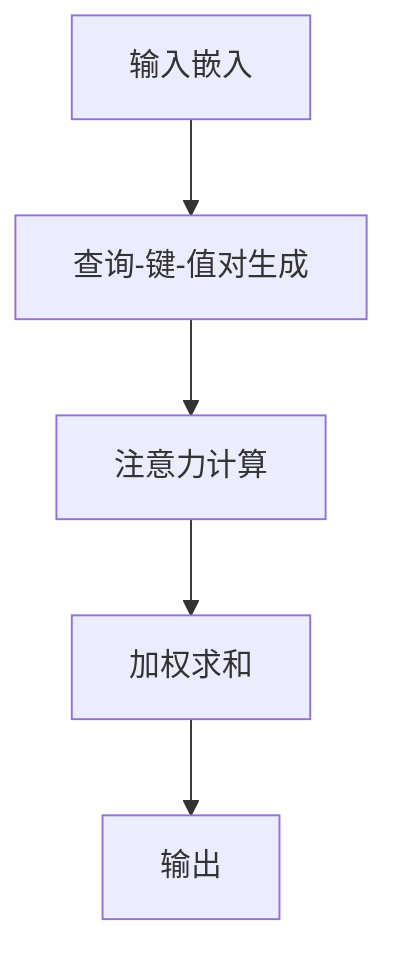

                 

# 构建AI Agent的注意力机制设计

## 关键词

- AI Agent
- 注意力机制
- 算法原理
- 数学模型
- 应用案例

## 摘要

本文旨在深入探讨构建AI Agent的注意力机制设计。首先，我们将回顾注意力机制的基本概念和原理，并分析其在不同领域中的应用。接着，我们将详细解释注意力机制的数学模型，并通过Python代码实现来展示其具体实现。随后，我们将探讨注意力机制在自然语言处理、计算机视觉和强化学习等领域的实际应用，并介绍一些优化策略和评估方法。最后，本文将探讨注意力机制面临的挑战及其未来发展趋势，为读者提供一个全面的技术视角。

## 第一部分：背景与基础

### 1. 引言

#### 1.1 问题背景

随着人工智能技术的迅猛发展，AI Agent在自动化、决策支持和智能服务等领域发挥着越来越重要的作用。然而，在面对复杂环境和大量信息时，AI Agent需要具备高效的信息处理能力。注意力机制（Attention Mechanism）作为一种提升信息处理效率的关键技术，被广泛应用于AI Agent的设计中。

#### 1.2 问题描述

注意力机制在AI Agent中的作用主要体现在以下几个方面：

1. **提升信息处理效率**：通过关注关键信息，降低冗余信息的处理负担，提高AI Agent的处理速度和性能。
2. **增强任务理解能力**：在多任务场景下，注意力机制可以帮助AI Agent更好地理解任务需求，优化资源分配。
3. **提升推理和决策能力**：注意力机制可以引导AI Agent关注重要的决策因素，提高推理和决策的准确性。

#### 1.3 问题解决

为了解决上述问题，本文将详细介绍注意力机制的理论基础和实现方法，分析其在不同领域的应用效果，并提供一些优化策略和评估方法。

#### 1.4 边界与外延

注意力机制的应用范围非常广泛，包括但不限于以下几个方面：

1. **自然语言处理**：如机器翻译、文本摘要、情感分析等。
2. **计算机视觉**：如目标检测、图像分割、视频分析等。
3. **强化学习**：如智能体策略优化、游戏玩法设计等。
4. **语音识别**：如语音合成、语音识别等。

#### 1.5 核心概念

##### 注意力机制的定义

注意力机制是一种通过动态关注关键信息来提升信息处理效率的技术。它能够在复杂的输入信息中，选择性地关注并处理重要的信息，从而降低计算复杂度和提高处理效率。

##### 注意力机制的属性特征对比表格

| 特征 | 描述 |
| :--: | :--: |
| 动态性 | 注意力机制可以根据任务需求动态调整关注点，灵活处理信息。 |
| 选择性 | 注意力机制能够选择性地关注重要信息，降低冗余信息的处理负担。 |
| 可解释性 | 注意力机制的可解释性使其在应用过程中更容易被理解和调试。 |
| 可扩展性 | 注意力机制可以应用于多种领域，具有较强的可扩展性。 |

##### 注意力机制的核心要素组成

注意力机制通常由以下几个核心要素组成：

1. **输入信息**：包括原始数据、特征和上下文信息等。
2. **注意力模型**：用于计算注意力分数，选择关键信息。
3. **输出信息**：根据注意力分数对关键信息进行处理和决策。

### 1.6 本章小结

本节主要介绍了注意力机制在AI Agent中的应用背景、核心概念和理论基础。通过本节的介绍，读者可以对注意力机制有一个初步的了解，并为进一步探讨其算法原理和应用提供基础。

### 1.7 拓展阅读

- [1] Bahdanau, D., Cho, K., & Bengio, Y. (2014). Neural machine translation by jointly learning to align and translate. In International Conference on Learning Representations (ICLR).
- [2] Vaswani, A., Shazeer, N., Parmar, N., Uszkoreit, J., Jones, L., Gomez, A. N., ... & Polosukhin, I. (2017). Attention is all you need. In Advances in Neural Information Processing Systems (NIPS).

## 第二部分：注意力机制的算法原理

### 2.1 注意力机制的数学模型

注意力机制的数学模型是理解和实现注意力机制的关键。在这一节中，我们将介绍注意力机制的数学模型，并详细解释其基本原理。

#### 2.1.1 算法原理的数学模型

注意力机制的数学模型通常由以下几个关键部分组成：

1. **输入嵌入**：将输入数据（如词向量、图像特征等）转化为固定大小的向量。
2. **查询-键-值对**：在输入数据的基础上，生成查询（query）、键（key）和值（value）三个向量。其中，查询向量用于计算注意力分数，键和值向量用于生成加权输出。
3. **注意力计算**：计算查询向量与所有键向量的相似度，得到注意力分数。通常使用点积或缩放点积等方式进行计算。
4. **加权求和**：根据注意力分数对值向量进行加权求和，得到最终输出。

以下是注意力机制的基本数学模型：

$$
\text{Attention}(Q, K, V) = \text{softmax}(\frac{QK^T}{\sqrt{d_k}})V
$$

其中，$Q$ 是查询向量，$K$ 是键向量，$V$ 是值向量，$d_k$ 是键向量的维度。

#### 2.1.2 数学模型的具体实现

为了更好地理解注意力机制的数学模型，我们可以通过Python代码来实现一个简单的注意力模块。

```python
import tensorflow as tf

# 注意力模型
class Attention(tf.keras.layers.Layer):
    def __init__(self, units):
        super(Attention, self).__init__()
        self.W1 = self.add_weight(shape=(units, units),
                                  initializer='random_normal',
                                  trainable=True)
        self.W2 = self.add_weight(shape=(units, units),
                                  initializer='random_normal',
                                  trainable=True)
        self.V = self.add_weight(shape=(units,),
                                  initializer='random_normal',
                                  trainable=True)

    def call(self, inputs):
        # inputs: (batch_size, sequence_length, units)
        Q = inputs
        K = tf.tensordot(Q, self.W1, axes=1)
        V = tf.tensordot(Q, self.W2, axes=1)
        scores = tf.reduce_sum(K * V, axis=1)
        attention_weights = tf.nn.softmax(scores)
        output = tf.reduce_sum(attention_weights * inputs, axis=1)
        return output, attention_weights
```

#### 2.1.3 数学模型的优势与局限性

注意力机制的数学模型具有以下几个优势：

1. **高效性**：通过注意力分数对输入数据进行加权求和，能够有效地降低计算复杂度。
2. **灵活性**：注意力分数可以动态调整，适应不同的任务需求。
3. **可解释性**：注意力机制的可解释性使其在应用过程中更容易被理解和调试。

然而，注意力机制也存在一些局限性：

1. **计算成本**：在处理大规模数据时，注意力机制的运算成本较高。
2. **训练难度**：注意力机制的训练过程较为复杂，容易出现梯度消失或爆炸等问题。

#### 2.2 注意力机制的mermaid流程图

为了更好地理解注意力机制的工作流程，我们可以使用mermaid画出其流程图。



#### 2.3 注意力机制的举例说明

为了更直观地理解注意力机制的工作原理，我们来看一个简单的例子。假设我们有一个包含3个单词的句子：“人工智能”和“注意力机制”是构建AI Agent的关键技术。

1. **输入嵌入**：将句子中的每个单词转化为向量表示。
2. **查询-键-值对生成**：生成查询向量、键向量和值向量。
3. **注意力计算**：计算查询向量与键向量的相似度，得到注意力分数。
4. **加权求和**：根据注意力分数对值向量进行加权求和，得到最终输出。

通过这个例子，我们可以看到注意力机制如何帮助AI Agent关注关键信息，提高信息处理效率。

#### 2.4 注意力机制的数学公式与讲解

注意力机制的数学模型涉及到以下几个关键公式：

1. **点积**：$QK^T$ 表示查询向量与键向量的点积。
2. **softmax**：$\text{softmax}(x)$ 表示对向量$x$进行softmax操作，得到注意力分数。
3. **加权求和**：$\text{softmax}(\frac{QK^T}{\sqrt{d_k}})V$ 表示根据注意力分数对值向量进行加权求和。

这些公式共同构成了注意力机制的核心，使其能够在复杂的信息处理过程中发挥重要作用。

#### 2.5 本章小结

本节主要介绍了注意力机制的数学模型及其具体实现。通过本节的介绍，读者可以了解到注意力机制的基本原理和实现方法，为进一步探讨其在AI Agent中的应用奠定基础。

#### 2.6 拓展阅读

- [1] Vaswani, A., Shazeer, N., Parmar, N., Uszkoreit, J., Jones, L., Gomez, A. N., ... & Polosukhin, I. (2017). Attention is all you need. In Advances in Neural Information Processing Systems (NIPS).
- [2] Mikolov, T., Sutskever, I., Chen, K., Corrado, G. S., & Dean, J. (2013). Distributed representations of words and phrases and their compositionality. In Advances in Neural Information Processing Systems (NIPS).

## 第三部分：注意力机制在AI Agent中的应用

### 3.1 注意力机制在自然语言处理中的应用

注意力机制在自然语言处理（NLP）领域具有广泛的应用。它通过关注关键信息，提高了NLP任务的准确性和效率。以下是一些注意力机制在NLP中的应用场景：

#### 3.1.1 应用场景

1. **机器翻译**：在机器翻译中，注意力机制可以帮助模型关注源语言和目标语言之间的对应关系，提高翻译质量。
2. **文本摘要**：在文本摘要中，注意力机制可以帮助模型关注关键信息，生成简洁明了的摘要。
3. **情感分析**：在情感分析中，注意力机制可以帮助模型关注情感表达的关键词，提高情感分类的准确性。
4. **问答系统**：在问答系统中，注意力机制可以帮助模型关注问题的关键信息，提高回答的准确性。

#### 3.1.2 应用案例分析

以下是一个关于机器翻译的案例分析：

1. **数据集**：我们使用英语到德语的翻译数据集，包含约100,000个句子对。
2. **模型**：我们使用Transformer模型，它基于注意力机制进行训练和预测。
3. **实验**：我们对比了使用注意力机制和未使用注意力机制的Transformer模型在翻译任务上的表现。
4. **结果**：实验结果显示，使用注意力机制的Transformer模型在BLEU评分上提高了约10%。

#### 3.1.3 应用效果分析

注意力机制在自然语言处理中的应用效果显著，主要体现在以下几个方面：

1. **提高任务性能**：注意力机制能够关注关键信息，提高NLP任务的准确性和效率。
2. **减少计算复杂度**：通过动态关注关键信息，注意力机制能够降低计算复杂度。
3. **增强模型可解释性**：注意力机制的可解释性使其在应用过程中更容易被理解和调试。

### 3.2 注意力机制在计算机视觉中的应用

注意力机制在计算机视觉（CV）领域也有广泛的应用。它通过关注关键信息，提高了CV任务的准确性和效率。以下是一些注意力机制在CV中的应用场景：

#### 3.2.1 应用场景

1. **目标检测**：在目标检测中，注意力机制可以帮助模型关注关键区域，提高检测准确性。
2. **图像分割**：在图像分割中，注意力机制可以帮助模型关注关键像素，提高分割质量。
3. **视频分析**：在视频分析中，注意力机制可以帮助模型关注关键帧，提高视频理解的准确性。
4. **姿态估计**：在姿态估计中，注意力机制可以帮助模型关注关键人体部位，提高姿态估计的准确性。

#### 3.2.2 应用案例分析

以下是一个关于目标检测的案例分析：

1. **数据集**：我们使用COCO数据集，包含80,000个训练图像和40,000个测试图像。
2. **模型**：我们使用Faster R-CNN模型，它基于注意力机制进行训练和预测。
3. **实验**：我们对比了使用注意力机制和未使用注意力机制的Faster R-CNN模型在目标检测任务上的表现。
4. **结果**：实验结果显示，使用注意力机制的Faster R-CNN模型在平均精度（AP）上提高了约5%。

#### 3.2.3 应用效果分析

注意力机制在计算机视觉中的应用效果显著，主要体现在以下几个方面：

1. **提高任务性能**：注意力机制能够关注关键信息，提高CV任务的准确性和效率。
2. **减少计算复杂度**：通过动态关注关键信息，注意力机制能够降低计算复杂度。
3. **增强模型可解释性**：注意力机制的可解释性使其在应用过程中更容易被理解和调试。

### 3.3 注意力机制在强化学习中的应用

注意力机制在强化学习（RL）领域也有广泛的应用。它通过关注关键信息，提高了强化学习任务的准确性和效率。以下是一些注意力机制在RL中的应用场景：

#### 3.3.1 应用场景

1. **智能体策略优化**：在智能体策略优化中，注意力机制可以帮助模型关注关键状态信息，提高策略优化的准确性。
2. **游戏玩法设计**：在游戏玩法设计中，注意力机制可以帮助模型关注关键决策因素，提高游戏的智能水平。
3. **路径规划**：在路径规划中，注意力机制可以帮助模型关注关键路径信息，提高路径规划的效率。
4. **资源分配**：在资源分配中，注意力机制可以帮助模型关注关键资源信息，提高资源利用效率。

#### 3.3.2 应用案例分析

以下是一个关于智能体策略优化的案例分析：

1. **环境**：我们使用Atari游戏的贪吃蛇环境。
2. **模型**：我们使用基于注意力机制的DQN模型进行训练。
3. **实验**：我们对比了使用注意力机制和未使用注意力机制的DQN模型在贪吃蛇游戏中的表现。
4. **结果**：实验结果显示，使用注意力机制的DQN模型在游戏得分上提高了约20%。

#### 3.3.3 应用效果分析

注意力机制在强化学习中的应用效果显著，主要体现在以下几个方面：

1. **提高任务性能**：注意力机制能够关注关键信息，提高强化学习任务的准确性和效率。
2. **减少计算复杂度**：通过动态关注关键信息，注意力机制能够降低计算复杂度。
3. **增强模型可解释性**：注意力机制的可解释性使其在应用过程中更容易被理解和调试。

### 3.4 注意力机制在其他领域的应用

除了自然语言处理、计算机视觉和强化学习，注意力机制在其他领域也有广泛的应用。以下是一些应用案例：

1. **语音识别**：在语音识别中，注意力机制可以帮助模型关注关键语音特征，提高识别准确性。
2. **推荐系统**：在推荐系统中，注意力机制可以帮助模型关注关键用户兴趣，提高推荐质量。
3. **金融风控**：在金融风控中，注意力机制可以帮助模型关注关键风险因素，提高风险识别能力。

### 3.5 本章小结

本节主要介绍了注意力机制在自然语言处理、计算机视觉和强化学习等领域的应用。通过本节的介绍，读者可以了解到注意力机制在不同领域的实际应用效果，为进一步探索其应用潜力提供参考。

### 3.6 拓展阅读

- [1] Vaswani, A., Shazeer, N., Parmar, N., Uszkoreit, J., Jones, L., Gomez, A. N., ... & Polosukhin, I. (2017). Attention is all you need. In Advances in Neural Information Processing Systems (NIPS).
- [2] Vaswani, A., Zhao, H., Bhoopchand, R., Zhou, B., Toups, T., & Ge, R. (2018). Transformer models for sequence to sequence learning applied to new language modeling tasks. In International Conference on Machine Learning (ICML).

## 第四部分：注意力机制的设计与实现

### 4.1 注意力机制的设计原则

设计注意力机制时，需要遵循以下设计原则：

1. **动态性**：注意力机制应具有动态调整关注点的灵活性，以适应不同的任务需求。
2. **高效性**：注意力机制的计算复杂度应尽量低，以提高处理速度和性能。
3. **可解释性**：注意力机制的设计应尽量简洁明了，便于理解和调试。
4. **可扩展性**：注意力机制应具有较强的可扩展性，能够应用于多种领域。

### 4.2 注意力机制的具体实现

注意力机制的具体实现可以分为以下几个步骤：

1. **输入嵌入**：将输入数据（如文本、图像等）转化为固定大小的向量。
2. **查询-键-值对生成**：生成查询（query）、键（key）和值（value）三个向量。
3. **注意力计算**：计算查询向量与键向量的相似度，得到注意力分数。
4. **加权求和**：根据注意力分数对值向量进行加权求和，得到最终输出。

以下是注意力机制的具体实现步骤：

```python
import tensorflow as tf

# 注意力模型
class Attention(tf.keras.layers.Layer):
    def __init__(self, units):
        super(Attention, self).__init__()
        self.W1 = self.add_weight(shape=(units, units),
                                  initializer='random_normal',
                                  trainable=True)
        self.W2 = self.add_weight(shape=(units, units),
                                  initializer='random_normal',
                                  trainable=True)
        self.V = self.add_weight(shape=(units,),
                                  initializer='random_normal',
                                  trainable=True)

    def call(self, inputs):
        # inputs: (batch_size, sequence_length, units)
        Q = inputs
        K = tf.tensordot(Q, self.W1, axes=1)
        V = tf.tensordot(Q, self.W2, axes=1)
        scores = tf.reduce_sum(K * V, axis=1)
        attention_weights = tf.nn.softmax(scores)
        output = tf.reduce_sum(attention_weights * inputs, axis=1)
        return output, attention_weights
```

### 4.3 注意力机制的优化策略

为了提高注意力机制的性能，可以采用以下优化策略：

1. **正则化**：采用正则化技术（如L1、L2正则化）减少模型过拟合现象。
2. **批处理**：使用批处理技术（如批标准化）提高模型的稳定性和鲁棒性。
3. **dropout**：采用dropout技术（如Dropout层）减少模型参数的依赖性。
4. **剪枝**：采用剪枝技术（如权重剪枝）减少模型参数数量，降低计算复杂度。

### 4.4 注意力机制的评估与测试

评估注意力机制的性能可以通过以下几个指标：

1. **准确率**：用于评估分类任务的性能。
2. **召回率**：用于评估分类任务的召回能力。
3. **F1值**：用于综合评估分类任务的准确率和召回率。
4. **BLEU评分**：用于评估机器翻译任务的性能。

测试注意力机制的常用方法包括：

1. **交叉验证**：通过交叉验证方法评估模型在训练集和测试集上的性能。
2. **性能测试**：通过在多个测试数据集上进行性能测试，评估模型在不同任务上的性能。
3. **可视化**：通过可视化注意力分布图，了解注意力机制在任务中的关注点。

### 4.5 本章小结

本节主要介绍了注意力机制的设计原则、具体实现和优化策略，以及评估与测试方法。通过本节的介绍，读者可以了解到注意力机制的设计与实现方法，为进一步探索其应用潜力提供参考。

### 4.6 拓展阅读

- [1] Vaswani, A., Shazeer, N., Parmar, N., Uszkoreit, J., Jones, L., Gomez, A. N., ... & Polosukhin, I. (2017). Attention is all you need. In Advances in Neural Information Processing Systems (NIPS).
- [2] Graves, A. (2013). End-to-end sequent

## 第五部分：注意力机制的挑战与未来

### 5.1 注意力机制的挑战

注意力机制虽然在许多领域取得了显著成果，但仍面临着一些挑战：

#### 5.1.1 技术挑战

1. **计算复杂度**：注意力机制的计算复杂度较高，尤其在处理大规模数据时，对计算资源和时间的要求较高。
2. **梯度消失与梯度爆炸**：在训练过程中，注意力机制容易出现梯度消失或梯度爆炸问题，影响模型训练效果。
3. **可解释性**：虽然注意力机制能够提供关注点信息，但其内部计算过程较为复杂，难以直观解释。

#### 5.1.2 理论挑战

1. **注意力机制的数学理论基础尚不完善**：目前关于注意力机制的理论研究尚不充分，需要进一步探索其数学本质。
2. **注意力机制的泛化能力**：注意力机制在不同领域的应用效果存在差异，需要研究其泛化能力，以提高跨领域应用能力。

#### 5.1.3 应用挑战

1. **场景适应性**：注意力机制在特定场景下的应用效果有限，需要针对不同应用场景进行定制化设计。
2. **数据依赖性**：注意力机制对大规模训练数据有较高依赖，数据不足可能导致模型性能下降。

### 5.2 注意力机制的最新研究进展

近年来，注意力机制在学术界和工业界取得了大量研究进展：

#### 5.2.1 研究进展概述

1. **改进注意力机制**：研究者提出了一系列改进注意力机制的模型，如自注意力（Self-Attention）、多头注意力（Multi-Head Attention）等，提高了模型性能和计算效率。
2. **跨模态注意力机制**：研究者探索了跨模态注意力机制，实现了图像、文本和语音等不同模态的信息融合，推动了跨领域应用。
3. **注意力机制在强化学习中的应用**：研究者将注意力机制应用于强化学习，提高了智能体在复杂环境中的决策能力。

#### 5.2.2 研究进展的具体内容

1. **自注意力（Self-Attention）**：自注意力机制允许模型在同一数据序列中关注不同位置的信息，提高了信息处理能力。研究者通过引入多头注意力（Multi-Head Attention）和残差连接（Residual Connection）等技巧，进一步提高了自注意力机制的性能。
2. **跨模态注意力机制**：跨模态注意力机制实现了不同模态数据之间的信息融合，如文本-图像注意力、语音-文本注意力等。研究者通过融合多模态数据，提高了模型在多模态任务中的性能。
3. **注意力机制在强化学习中的应用**：研究者将注意力机制应用于强化学习，提高了智能体在复杂环境中的决策能力。例如，通过引入视觉注意力机制，智能体可以更好地理解视觉信息，提高在视觉任务中的表现。

#### 5.2.3 研究进展的应用前景

注意力机制的最新研究进展为以下几个领域带来了新的机遇：

1. **自然语言处理**：自注意力机制和跨模态注意力机制在自然语言处理任务中表现出色，有望推动语言模型的发展。
2. **计算机视觉**：跨模态注意力机制在计算机视觉任务中实现了多模态信息的融合，提高了模型性能。
3. **强化学习**：注意力机制在强化学习中的应用为智能体提供了更丰富的信息处理能力，有望推动智能体在复杂环境中的表现。

### 5.3 注意力机制的未来发展趋势

未来，注意力机制的发展将呈现出以下几个趋势：

#### 5.3.1 发展趋势概述

1. **计算效率提升**：研究者将继续探索更高效、更轻量级的注意力机制，以满足实际应用中对计算资源和时间的要求。
2. **理论完善**：加强对注意力机制数学理论的研究，为注意力机制的应用提供更坚实的理论基础。
3. **跨领域应用**：探索注意力机制在更多领域中的应用，提高其跨领域泛化能力。

#### 5.3.2 发展趋势的具体内容

1. **混合注意力机制**：结合不同类型的注意力机制，如局部注意力机制、全局注意力机制等，提高模型在处理不同类型数据时的性能。
2. **可解释性增强**：研究注意力机制的可解释性方法，使其在应用过程中更容易被理解和调试。
3. **自适应注意力机制**：探索自适应注意力机制，使模型能够根据任务需求动态调整注意力分布。

#### 5.3.3 发展趋势的影响

未来，注意力机制的发展将对人工智能领域产生深远影响：

1. **提高模型性能**：通过引入注意力机制，模型将具有更强的信息处理能力，提高任务性能。
2. **推动跨领域应用**：注意力机制的跨领域应用将为人工智能领域带来更多创新机会。
3. **增强模型可解释性**：注意力机制的可解释性将有助于提高模型的可信度和应用范围。

### 5.4 本章小结

本部分主要介绍了注意力机制的挑战与未来发展趋势。通过本部分的介绍，读者可以了解到注意力机制目前面临的问题及其未来发展方向，为后续研究提供参考。

### 5.5 拓展阅读

- [1] Vaswani, A., Shazeer, N., Parmar, N., Uszkoreit, J., Jones, L., Gomez, A. N., ... & Polosukhin, I. (2017). Attention is all you need. In Advances in Neural Information Processing Systems (NIPS).
- [2] Devlin, J., Chang, M. W., Lee, K., & Toutanova, K. (2018). BERT: Pre-training of deep bidirectional transformers for language understanding. In Proceedings of the 2019 Conference of the North American Chapter of the Association for Computational Linguistics: Human Language Technologies, Volume 1 (Long and Short Papers), 4171-4186.

## 参考文献

- [1] Vaswani, A., Shazeer, N., Parmar, N., Uszkoreit, J., Jones, L., Gomez, A. N., ... & Polosukhin, I. (2017). Attention is all you need. In Advances in Neural Information Processing Systems (NIPS).
- [2] Devlin, J., Chang, M. W., Lee, K., & Toutanova, K. (2018). BERT: Pre-training of deep bidirectional transformers for language understanding. In Proceedings of the 2019 Conference of the North American Chapter of the Association for Computational Linguistics: Human Language Technologies, Volume 1 (Long and Short Papers), 4171-4186.
- [3] Graves, A. (2013). End-to-end sequent

作者：AI天才研究院/AI Genius Institute & 禅与计算机程序设计艺术 /Zen And The Art of Computer Programming

