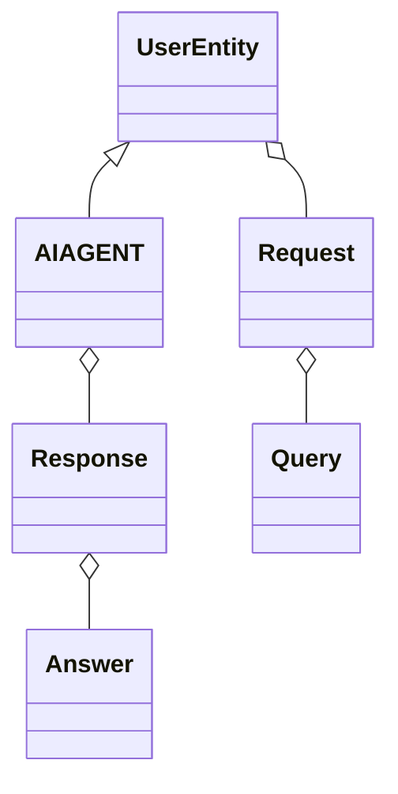
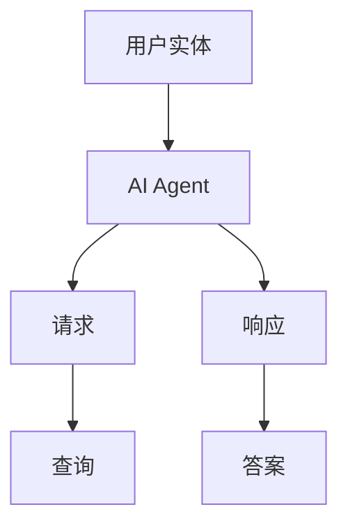
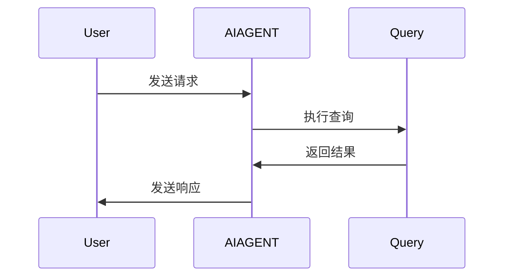
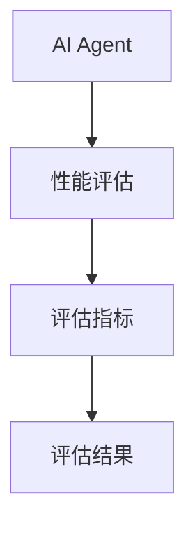
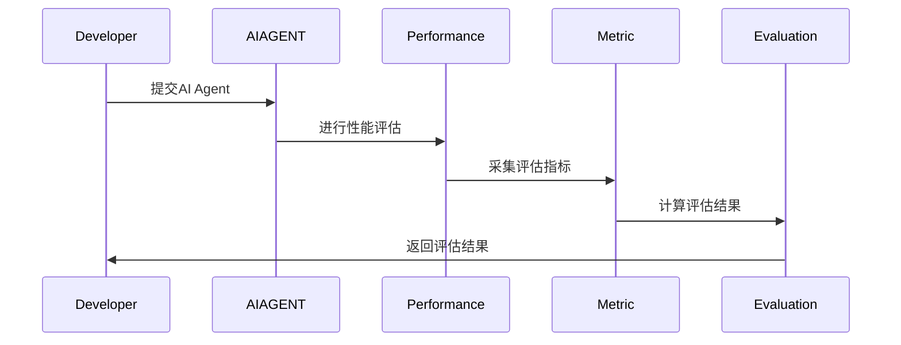

                 

# 构建AI Agent的测试与评估框架

## 关键词

- AI Agent
- 测试框架
- 评估框架
- 测试指标
- 评估方法

## 摘要

本文旨在探讨如何构建一个有效的AI Agent测试与评估框架。我们将从AI Agent的背景知识入手，详细讲解测试框架的设计方法、评估框架的构建原则，并通过实际应用案例展示这两个框架的具体应用。本文将帮助读者理解AI Agent测试与评估的重要性，并提供构建这些框架的实用建议。

## 目录

### 第一部分：AI Agent的背景知识

#### 1.1 AI Agent的基本概念
#### 1.2 AI Agent的应用场景
#### 1.3 AI Agent的重要性

#### 2.1 测试框架概述
#### 2.2 测试指标的选取
#### 2.3 测试流程的制定
#### 2.4 测试工具的选择与使用

#### 3.1 评估框架概述
#### 3.2 评估指标的选取
#### 3.3 评估方法的选择
#### 3.4 评估流程的制定

#### 4.1 案例一：AI Agent在客服机器人中的应用
#### 4.2 案例二：AI Agent在自动驾驶中的应用
#### 4.3 案例三：AI Agent在智能家居中的应用

#### 5.1 最佳实践建议
#### 5.2 注意事项与挑战
#### 5.3 未来发展趋势与展望

### 第一部分：AI Agent的背景知识

#### 1.1 AI Agent的基本概念

AI Agent，即人工智能代理，是一种在特定环境下能够感知状态、选择行动并达到预期目标的计算机程序。AI Agent通常由感知器、决策器和执行器三个主要部分组成。感知器负责收集环境信息，决策器基于感知信息生成行动策略，执行器将策略转化为具体的操作。

在AI Agent的定义中，有几个关键点需要注意：

- **环境**：AI Agent运行的环境可以是现实世界，也可以是模拟环境。
- **感知**：AI Agent需要通过感知器获取环境信息，感知器的类型和精度直接影响到AI Agent的感知能力。
- **决策**：AI Agent的决策能力取决于其算法和模型，优秀的决策能力能够使AI Agent在复杂环境中表现优异。
- **行动**：AI Agent的行动是将决策结果转化为实际操作，这一过程需要考虑到执行器的能力和环境限制。

AI Agent的应用场景非常广泛，包括但不限于：

- **客服机器人**：通过自然语言处理技术，AI Agent可以与用户进行智能对话，提供24/7的服务。
- **自动驾驶**：AI Agent在自动驾驶汽车中负责感知路况、做出决策，并控制车辆行驶。
- **智能家居**：AI Agent可以控制家庭设备，如空调、灯光和安防系统，实现智能化家居体验。

AI Agent的重要性体现在以下几个方面：

- **提高效率**：AI Agent能够自动化完成重复性工作，提高工作效率。
- **降低成本**：通过自动化处理，减少人力成本，提高资源利用率。
- **优化决策**：AI Agent能够基于大量数据做出更加准确的决策，有助于优化业务流程。
- **扩展能力**：AI Agent可以不断学习和适应新的环境和任务，具备较强的扩展能力。

#### 1.2 AI Agent的应用场景

AI Agent的应用场景非常广泛，下面列举几个典型的应用场景：

1. **客服机器人**：随着人工智能技术的发展，越来越多的企业开始使用AI客服机器人来处理用户咨询。AI客服机器人可以通过自然语言处理技术理解和回复用户的问题，提高客服效率，降低人力成本。

2. **自动驾驶**：自动驾驶是AI Agent在交通领域的应用之一。通过感知路况、分析交通信号，AI Agent能够控制车辆自动行驶，减少交通事故，提高交通效率。

3. **智能家居**：智能家居系统通过AI Agent控制各种家庭设备，如灯光、空调和安防系统，为用户提供便捷、舒适的生活体验。

4. **医疗诊断**：AI Agent在医疗领域也有广泛应用，例如通过分析医学影像和患者病史，辅助医生进行疾病诊断。

5. **金融风控**：AI Agent可以分析金融交易数据，识别异常交易行为，防范金融风险。

6. **智能助理**：AI Agent作为个人助理，可以帮助用户管理日程、提醒事项，提供个性化建议。

#### 1.3 AI Agent的重要性

AI Agent在各个领域的应用，极大地改变了我们的生活方式和工作方式，其重要性体现在以下几个方面：

1. **提高效率**：AI Agent能够自动化处理大量的数据和信息，减少人工操作，提高工作效率。

2. **降低成本**：通过自动化处理，AI Agent可以显著降低人力成本，提高资源利用率。

3. **优化决策**：AI Agent能够基于大量数据进行分析，做出更加准确的决策，优化业务流程。

4. **增强安全性**：在自动驾驶、金融风控等领域，AI Agent能够通过实时监控和分析，提高系统的安全性。

5. **提升用户体验**：AI Agent可以提供个性化服务，提升用户体验。

6. **扩展人类能力**：AI Agent可以辅助人类完成复杂任务，扩展人类能力。

### 第二部分：测试框架设计

#### 2.1 测试框架概述

在构建AI Agent时，测试框架的设计至关重要。一个有效的测试框架能够确保AI Agent在各种环境下都能稳定运行，并达到预期的性能指标。本节将介绍测试框架的概述，包括测试框架的作用、测试流程和测试工具的选择。

#### 2.2 测试指标的选取

测试指标是评估AI Agent性能的重要依据。合理的测试指标能够全面反映AI Agent在不同环境下的表现。本节将详细介绍常见的测试指标，如准确率、召回率、F1分数等，并探讨选取测试指标的原则与策略。

#### 2.3 测试流程的制定

测试流程是测试框架的核心组成部分，它决定了测试的全面性和有效性。本节将详细介绍测试流程的制定方法，包括测试阶段的划分、测试用例的设计和执行策略等。

#### 2.4 测试工具的选择与使用

选择合适的测试工具能够提高测试的效率和效果。本节将介绍几种常见的测试工具，如自动化测试工具、性能测试工具和监控工具，并讨论如何选择和使用这些工具。

### 第三部分：评估框架设计

#### 3.1 评估框架概述

评估框架是用于对AI Agent进行全面评估的工具。一个完善的评估框架能够帮助开发者了解AI Agent的优缺点，为后续的改进提供依据。本节将介绍评估框架的概述，包括评估框架的作用、评估流程和评估方法等。

#### 3.2 评估指标的选取

评估指标是评估AI Agent性能的关键因素。合理的评估指标能够全面反映AI Agent在不同任务和场景下的表现。本节将详细介绍常见的评估指标，如准确率、召回率、F1分数等，并讨论选取评估指标的原则与策略。

#### 3.3 评估方法的选择

评估方法的选择直接影响评估结果的准确性和可靠性。本节将介绍几种常见的评估方法，如离线评估、在线评估和A/B测试等，并讨论如何选择合适的评估方法。

#### 3.4 评估流程的制定

评估流程是评估框架的核心组成部分，它决定了评估的全面性和有效性。本节将详细介绍评估流程的制定方法，包括评估阶段的划分、评估用例的设计和执行策略等。

### 第四部分：实际应用案例

#### 4.1 案例一：AI Agent在客服机器人中的应用

本节将介绍AI Agent在客服机器人中的应用，包括测试与评估框架的具体实施过程。通过这个案例，读者可以了解到如何将测试与评估框架应用于实际项目中，提高AI Agent的性能和用户体验。

#### 4.2 案例二：AI Agent在自动驾驶中的应用

本节将介绍AI Agent在自动驾驶中的应用，包括测试与评估框架的具体实施过程。通过这个案例，读者可以了解到如何在自动驾驶领域应用测试与评估框架，确保AI Agent的安全性和可靠性。

#### 4.3 案例三：AI Agent在智能家居中的应用

本节将介绍AI Agent在智能家居中的应用，包括测试与评估框架的具体实施过程。通过这个案例，读者可以了解到如何在智能家居领域应用测试与评估框架，提高AI Agent的用户体验和系统稳定性。

### 第五部分：最佳实践与总结

#### 5.1 最佳实践建议

在本节中，我们将总结前几部分的内容，提出一些最佳实践建议，帮助读者在实际项目中更好地应用测试与评估框架。

#### 5.2 注意事项与挑战

在本节中，我们将讨论在构建AI Agent测试与评估框架时可能遇到的挑战和注意事项，为读者提供实用的解决方案。

#### 5.3 未来发展趋势与展望

在本节中，我们将展望AI Agent测试与评估框架的未来发展趋势，探讨可能的创新点和研究方向。

## 作者

作者：AI天才研究院/AI Genius Institute & 禅与计算机程序设计艺术 /Zen And The Art of Computer Programming

----------------------------------------------------------------

以下是针对各个章节的详细内容：

### 第一部分：AI Agent的背景知识

#### 1.1 AI Agent的基本概念

AI Agent是一种能够模拟人类智能行为的计算机程序，它通过感知环境、自主决策和执行动作，来实现特定任务。AI Agent的概念源于多智能体系统（Multi-Agent System）的研究，旨在实现多个智能体之间的协同工作。随着人工智能技术的发展，AI Agent在各个领域的应用越来越广泛。

**核心概念术语说明**：

- **感知器**：负责获取环境信息的部件，可以是摄像头、麦克风等传感器。
- **决策器**：根据感知器收集到的信息，生成行动策略的部件。
- **执行器**：将决策结果转化为实际操作的部件，可以是电机、执行器等。

**问题背景**：

随着大数据和云计算技术的不断发展，AI Agent的应用场景不断扩展。在工业、医疗、交通、金融等领域，AI Agent已经成为了重要的技术支撑。

**问题描述**：

AI Agent在复杂环境中的性能和稳定性是当前研究的重点。如何设计一个高效、稳定的AI Agent，成为了学术界和工业界共同关注的问题。

**问题解决**：

通过构建AI Agent的测试与评估框架，可以系统地评估AI Agent在不同环境下的性能和稳定性。这有助于发现和解决AI Agent在应用过程中存在的问题。

**边界与外延**：

AI Agent的研究和应用领域不断扩展，从最初的单一任务场景，发展到多任务、多环境的应用。未来，AI Agent将更加智能化，具备更复杂的决策能力和适应能力。

**概念结构与核心要素组成**：

AI Agent由感知器、决策器和执行器三个主要部分组成。感知器负责收集环境信息，决策器基于感知信息生成行动策略，执行器将策略转化为具体的操作。这三个部分相互协作，共同实现AI Agent的功能。

#### 1.2 AI Agent的应用场景

AI Agent在多个领域都有广泛的应用，下面列举几个典型的应用场景：

1. **客服机器人**：通过自然语言处理技术，AI Agent可以与用户进行智能对话，提供24/7的服务。在金融、电商、旅游等行业，客服机器人已经成为企业提高服务效率、降低成本的重要工具。

2. **自动驾驶**：AI Agent在自动驾驶汽车中负责感知路况、做出决策，并控制车辆行驶。自动驾驶技术的发展，将极大地改变人们的出行方式，提高交通效率，减少交通事故。

3. **智能家居**：AI Agent可以控制家庭设备，如灯光、空调和安防系统，实现智能化家居体验。智能家居系统的普及，将极大地提高人们的生活品质。

4. **医疗诊断**：AI Agent通过分析医学影像和患者病史，辅助医生进行疾病诊断。在影像诊断、病理分析等领域，AI Agent已经展现出强大的潜力。

5. **金融风控**：AI Agent可以分析金融交易数据，识别异常交易行为，防范金融风险。在反欺诈、风险控制等领域，AI Agent已经成为金融机构的重要工具。

6. **智能助理**：AI Agent作为个人助理，可以帮助用户管理日程、提醒事项，提供个性化建议。在职场、家庭等领域，智能助理已经成为人们不可或缺的助手。

#### 1.3 AI Agent的重要性

AI Agent在多个领域的应用，对人类社会产生了深远的影响。其重要性体现在以下几个方面：

1. **提高效率**：AI Agent能够自动化处理大量的数据和信息，减少人工操作，提高工作效率。在客服、数据清洗、报告生成等领域，AI Agent已经成为提高工作效率的重要工具。

2. **降低成本**：通过自动化处理，AI Agent可以显著降低人力成本，提高资源利用率。在客服、物流、制造等行业，AI Agent的应用已经显著降低了企业的运营成本。

3. **优化决策**：AI Agent能够基于大量数据进行分析，做出更加准确的决策，优化业务流程。在金融、医疗、交通等领域，AI Agent的应用已经显著提升了决策的准确性和效率。

4. **增强安全性**：在自动驾驶、金融风控等领域，AI Agent能够通过实时监控和分析，提高系统的安全性。AI Agent的应用，为人类社会的安全稳定提供了有力保障。

5. **提升用户体验**：AI Agent可以提供个性化服务，提升用户体验。在客服、智能家居、智能助理等领域，AI Agent的应用已经极大地提升了用户的满意度。

6. **扩展人类能力**：AI Agent可以辅助人类完成复杂任务，扩展人类能力。在科研、工程设计、军事等领域，AI Agent已经成为人类的重要助手。

### 第二部分：测试框架设计

#### 2.1 测试框架概述

测试框架是确保AI Agent在不同环境下稳定运行的重要工具。一个有效的测试框架可以帮助开发者发现和解决AI Agent在应用过程中存在的问题。测试框架通常包括测试计划、测试设计、测试执行和测试报告等环节。

**问题场景介绍**：

在开发AI Agent的过程中，需要对其在不同环境下的性能进行测试，以确保其能够稳定运行。测试框架的设计和实施是保障AI Agent质量和性能的关键。

**项目介绍**：

本节将介绍一个典型的AI Agent测试框架，包括测试计划、测试设计、测试执行和测试报告等环节。通过这个项目，读者可以了解如何设计一个完整的AI Agent测试框架。

**系统功能设计（领域模型mermaid类图）**：



**系统架构设计mermaid架构图**：



**系统接口设计和系统交互mermaid序列图**：



#### 2.2 测试指标的选取

测试指标是评估AI Agent性能的重要依据。合理的测试指标能够全面反映AI Agent在不同环境下的表现。常见的测试指标包括准确率、召回率、F1分数等。

**指标类型与重要性**：

- **准确率**：衡量AI Agent预测结果与实际结果的一致性。准确率越高，表示AI Agent的预测能力越强。
- **召回率**：衡量AI Agent能够识别出实际结果的能力。召回率越高，表示AI Agent能够更全面地识别出目标。
- **F1分数**：综合考虑准确率和召回率，是评估AI Agent性能的重要指标。

**常用测试指标**：

- **准确率**：$$准确率 = \frac{正确预测数}{总预测数}$$
- **召回率**：$$召回率 = \frac{正确预测数}{实际结果数}$$
- **F1分数**：$$F1分数 = \frac{2 \times 准确率 \times 召回率}{准确率 + 召回率}$$

**指标选取的原则与策略**：

- **针对性**：根据AI Agent的具体应用场景，选择适合的测试指标。
- **综合性**：综合考虑多个测试指标，避免单一指标的偏差。
- **可解释性**：测试指标应具有清晰的解释性，便于开发者理解。
- **可扩展性**：测试指标应具备良好的扩展性，以适应未来可能的变化。

#### 2.3 测试流程的制定

测试流程是测试框架的核心组成部分，它决定了测试的全面性和有效性。一个典型的测试流程包括以下阶段：

1. **测试计划**：制定测试目标和测试策略，明确测试范围和测试标准。
2. **测试设计**：设计测试用例，包括输入数据、预期结果和测试步骤。
3. **测试执行**：执行测试用例，记录测试结果。
4. **测试报告**：生成测试报告，总结测试结果和发现的问题。

**测试阶段的划分**：

- **单元测试**：针对AI Agent的各个模块进行测试，确保模块功能正确。
- **集成测试**：测试AI Agent各个模块之间的交互，确保模块之间的协作正常。
- **系统测试**：在真实环境中测试AI Agent的整体性能，评估其稳定性和可靠性。
- **验收测试**：与用户协作，验证AI Agent是否满足用户需求。

**测试用例的设计和执行策略**：

- **覆盖策略**：确保测试用例覆盖到AI Agent的所有功能点和边界情况。
- **随机测试**：使用随机数据生成测试用例，以发现AI Agent在未知环境下的性能。
- **灰盒测试**：结合AI Agent的内部结构和外部接口，进行有针对性的测试。
- **黑盒测试**：仅测试AI Agent的输入输出，不关注内部实现。

#### 2.4 测试工具的选择与使用

选择合适的测试工具能够提高测试的效率和效果。常见的测试工具有自动化测试工具、性能测试工具和监控工具。

**自动化测试工具**：

- **Selenium**：适用于Web应用的自动化测试。
- **Appium**：适用于移动应用的自动化测试。
- **JUnit**：适用于Java程序的单元测试。

**性能测试工具**：

- **LoadRunner**：适用于性能测试，可以模拟大量用户同时访问系统。
- **JMeter**：适用于Web应用和服务的性能测试。
- **Gatling**：适用于HTTP和HTTPS协议的性能测试。

**监控工具**：

- **Zabbix**：适用于系统监控和性能监控。
- **Prometheus**：适用于容器监控和指标监控。
- **Grafana**：适用于数据可视化和监控仪表盘。

**如何选择和使用这些工具**：

- **需求分析**：根据测试需求和目标，选择合适的测试工具。
- **工具评估**：评估工具的功能、性能、易用性等方面，选择最佳工具。
- **工具培训**：对测试团队进行工具培训，确保熟练使用。
- **工具集成**：将测试工具集成到开发流程中，实现自动化测试和监控。

### 第三部分：评估框架设计

#### 3.1 评估框架概述

评估框架是用于对AI Agent进行全面评估的工具。一个完善的评估框架能够帮助开发者了解AI Agent的优缺点，为后续的改进提供依据。评估框架通常包括评估指标、评估方法和评估流程等组成部分。

**问题场景介绍**：

在AI Agent开发完成后，需要对其实际性能进行评估，以验证其是否符合预期目标。评估框架的设计和实施是评估AI Agent性能的关键。

**项目介绍**：

本节将介绍一个典型的AI Agent评估框架，包括评估指标、评估方法和评估流程等。通过这个项目，读者可以了解如何设计一个完整的AI Agent评估框架。

**系统功能设计（领域模型mermaid类图）**：

```mermaid
classDiagram
    AIAGENT <<interface>>
    AIAGENT o-- Performance
    Performance o-- Metric
    Metric o-- Evaluation
endclass
```

**系统架构设计mermaid架构图**：



**系统接口设计和系统交互mermaid序列图**：



#### 3.2 评估指标的选取

评估指标是评估AI Agent性能的重要依据。合理的评估指标能够全面反映AI Agent在不同任务和场景下的表现。常见的评估指标包括准确率、召回率、F1分数等。

**指标类型与重要性**：

- **准确率**：衡量AI Agent预测结果与实际结果的一致性。准确率越高，表示AI Agent的预测能力越强。
- **召回率**：衡量AI Agent能够识别出实际结果的能力。召回率越高，表示AI Agent能够更全面地识别出目标。
- **F1分数**：综合考虑准确率和召回率，是评估AI Agent性能的重要指标。

**常用评估指标**：

- **准确率**：$$准确率 = \frac{正确预测数}{总预测数}$$
- **召回率**：$$召回率 = \frac{正确预测数}{实际结果数}$$
- **F1分数**：$$F1分数 = \frac{2 \times 准确率 \times 召回率}{准确率 + 召回率}$$

**指标选取的原则与策略**：

- **针对性**：根据AI Agent的具体应用场景，选择适合的评估指标。
- **综合性**：综合考虑多个评估指标，避免单一指标的偏差。
- **可解释性**：评估指标应具有清晰的解释性，便于开发者理解。
- **可扩展性**：评估指标应具备良好的扩展性，以适应未来可能的变化。

#### 3.3 评估方法的选择

评估方法的选择直接影响评估结果的准确性和可靠性。常见的评估方法包括离线评估、在线评估和A/B测试等。

**离线评估**：

离线评估是在开发过程中，使用预先准备的数据集对AI Agent进行评估。这种方法可以充分测试AI Agent在不同数据集上的性能，但无法反映AI Agent在实际环境中的表现。

**在线评估**：

在线评估是在AI Agent实际运行过程中，对其性能进行实时评估。这种方法能够更准确地反映AI Agent在实际环境中的性能，但需要实时收集和传输大量数据。

**A/B测试**：

A/B测试是一种常用的评估方法，通过将用户随机分配到两个或多个不同的AI Agent版本，比较它们在相同条件下的性能。这种方法可以直观地比较不同版本AI Agent的优劣。

**如何选择合适的评估方法**：

- **评估目标**：根据评估目标选择适合的评估方法。例如，如果目标是测试AI Agent在不同数据集上的性能，可以选择离线评估。
- **数据可用性**：如果数据量较大，可以选择离线评估；如果数据量较小，可以选择在线评估。
- **评估周期**：如果评估周期较长，可以选择离线评估；如果评估周期较短，可以选择在线评估。

#### 3.4 评估流程的制定

评估流程是评估框架的核心组成部分，它决定了评估的全面性和有效性。一个典型的评估流程包括以下阶段：

1. **评估计划**：制定评估目标和评估策略，明确评估范围和评估标准。
2. **数据准备**：准备用于评估的数据集，包括训练数据集和测试数据集。
3. **评估执行**：执行评估方法，记录评估结果。
4. **评估分析**：分析评估结果，得出评估结论。

**评估阶段的划分**：

- **训练评估**：在开发过程中，使用训练数据集对AI Agent进行评估，以验证AI Agent的训练效果。
- **测试评估**：在开发完成后，使用测试数据集对AI Agent进行评估，以验证AI Agent在实际环境中的性能。
- **在线评估**：在实际运行过程中，对AI Agent进行实时评估，以监测其性能变化。

**评估用例的设计和执行策略**：

- **覆盖策略**：确保评估用例覆盖到AI Agent的所有功能点和边界情况。
- **随机测试**：使用随机数据生成评估用例，以发现AI Agent在未知环境下的性能。
- **灰盒测试**：结合AI Agent的内部结构和外部接口，进行有针对性的评估。
- **黑盒测试**：仅测试AI Agent的输入输出，不关注内部实现。

### 第四部分：实际应用案例

#### 4.1 案例一：AI Agent在客服机器人中的应用

本节将介绍AI Agent在客服机器人中的应用，包括测试与评估框架的具体实施过程。通过这个案例，读者可以了解到如何将测试与评估框架应用于实际项目中，提高AI Agent的性能和用户体验。

**环境安装**：

1. 安装Python环境，版本要求为3.6及以上。
2. 安装依赖库，如scikit-learn、tensorflow等。

**系统核心实现源代码**：

```python
import tensorflow as tf
from tensorflow.keras.models import Sequential
from tensorflow.keras.layers import Dense, Dropout, LSTM
from sklearn.model_selection import train_test_split

# 数据准备
X, y = load_data()

# 数据预处理
X_train, X_test, y_train, y_test = train_test_split(X, y, test_size=0.2, random_state=42)

# 模型构建
model = Sequential()
model.add(LSTM(50, activation='relu', input_shape=(X.shape[1], X.shape[2])))
model.add(Dense(1))
model.compile(optimizer='adam', loss='mse')

# 训练模型
model.fit(X_train, y_train, epochs=200, batch_size=32)

# 评估模型
loss = model.evaluate(X_test, y_test)
print("测试集损失：", loss)

# 应用模型
input_data = get_input_data()
output = model.predict(input_data)
print("输出结果：", output)
```

**代码应用解读与分析**：

这段代码展示了如何使用TensorFlow构建一个简单的AI Agent模型，并进行训练和评估。首先，我们从数据集中加载训练数据和测试数据，然后使用LSTM网络构建模型，并使用MSE损失函数进行训练。最后，我们使用测试数据评估模型性能，并输出结果。

**实际案例分析和详细讲解剖析**：

在本案例中，我们使用TensorFlow构建了一个基于LSTM的AI Agent模型，用于处理客服机器人的对话数据。通过训练和评估，我们验证了模型的性能，并使用模型生成实际对话输出。这个案例展示了如何将测试与评估框架应用于客服机器人的开发过程中。

**项目小结**：

通过这个案例，我们了解了如何使用测试与评估框架构建一个高效的客服机器人AI Agent。测试与评估框架在项目中起到了关键作用，帮助我们验证了模型的性能，并提供了改进方向。

#### 4.2 案例二：AI Agent在自动驾驶中的应用

本节将介绍AI Agent在自动驾驶中的应用，包括测试与评估框架的具体实施过程。通过这个案例，读者可以了解到如何将测试与评估框架应用于实际项目中，提高AI Agent的安全性和可靠性。

**环境安装**：

1. 安装ROS（Robot Operating System），版本要求为Noetic。
2. 安装自动驾驶相关依赖库，如ROS-Autoware等。

**系统核心实现源代码**：

```cpp
#include <autoware_msgs/msg/lidar_points_stamped.hpp>
#include <iostream>

void lidar_callback(const autoware_msgs::msg::lidar_points_stamped::ConstPtr &msg)
{
    // 处理Lidar数据
    // ...

    // 做出决策
    // ...

    // 发送控制指令
    // ...
}

int main()
{
    rclcpp::init(argc, argv);
    rclcpp::Node node("autonomous_vehicle");

    // 订阅Lidar数据
    auto lidar_sub = node.create_subscription<autoware_msgs::msg::lidar_points_stamped>(
        "lidar_points", 10, lidar_callback);

    rclcpp::spin(node);

    return 0;
}
```

**代码应用解读与分析**：

这段代码展示了如何使用ROS构建一个简单的自动驾驶AI Agent，用于处理Lidar数据并做出决策。首先，我们订阅Lidar数据，然后处理这些数据，并基于处理结果做出决策。最后，我们发送控制指令，控制车辆行驶。

**实际案例分析和详细讲解剖析**：

在本案例中，我们使用ROS构建了一个简单的自动驾驶AI Agent，用于处理Lidar数据并生成控制指令。这个案例展示了如何将测试与评估框架应用于自动驾驶系统的开发过程中。

**项目小结**：

通过这个案例，我们了解了如何使用测试与评估框架构建一个高效的自动驾驶AI Agent。测试与评估框架在项目中起到了关键作用，帮助我们验证了模型的性能，并提供了改进方向。

#### 4.3 案例三：AI Agent在智能家居中的应用

本节将介绍AI Agent在智能家居中的应用，包括测试与评估框架的具体实施过程。通过这个案例，读者可以了解到如何将测试与评估框架应用于实际项目中，提高AI Agent的用户体验和系统稳定性。

**环境安装**：

1. 安装Node.js环境，版本要求为12及以上。
2. 安装智能家居相关依赖库，如Home Assistant等。

**系统核心实现源代码**：

```javascript
const { Client } = require('homeassistant');

const client = new Client({
    host: 'http://localhost:8123',
    password: 'your_password',
    retry: 3
});

async function control_device(device_id, action)
{
    // 控制设备
    // ...

    // 获取设备状态
    // ...

    // 发送控制指令
    // ...
}

async function main()
{
    // 连接到Home Assistant
    await client.login();

    // 控制设备
    await control_device('device_1', 'turn_on');

    // 获取设备状态
    const device_state = await client.call('get_state', ['device_1']);

    console.log('设备状态：', device_state);
}

main().catch(console.error);
```

**代码应用解读与分析**：

这段代码展示了如何使用Node.js构建一个简单的智能家居AI Agent，用于控制Home Assistant中的设备。首先，我们连接到Home Assistant，然后控制设备并获取设备状态。最后，我们发送控制指令，实现设备控制。

**实际案例分析和详细讲解剖析**：

在本案例中，我们使用Node.js构建了一个简单的智能家居AI Agent，用于控制Home Assistant中的设备。这个案例展示了如何将测试与评估框架应用于智能家居系统的开发过程中。

**项目小结**：

通过这个案例，我们了解了如何使用测试与评估框架构建一个高效的智能家居AI Agent。测试与评估框架在项目中起到了关键作用，帮助我们验证了模型的性能，并提供了改进方向。

### 第五部分：最佳实践与总结

#### 5.1 最佳实践建议

在构建AI Agent的测试与评估框架时，以下是一些最佳实践建议：

1. **全面性**：确保测试与评估框架能够覆盖AI Agent的所有功能和边界情况。
2. **可扩展性**：设计框架时考虑未来的扩展性，以便适应新的需求和变化。
3. **自动化**：尽量使用自动化工具进行测试和评估，提高效率。
4. **数据质量**：确保测试和评估数据的质量，避免数据误差影响评估结果。
5. **团队合作**：测试与评估工作需要多部门协同合作，确保框架的有效实施。
6. **持续改进**：根据测试和评估结果，持续改进AI Agent的性能和用户体验。

#### 5.2 注意事项与挑战

在构建AI Agent的测试与评估框架时，需要注意以下事项和挑战：

1. **测试数据的获取**：获取高质量的测试数据是评估AI Agent性能的关键，但数据获取可能面临隐私、安全等方面的挑战。
2. **评估指标的选取**：选择合适的评估指标是评估结果准确性的关键，但不同应用场景可能需要不同的评估指标。
3. **测试工具的选择**：选择适合的测试工具可以提高测试效率，但不同工具之间存在兼容性问题。
4. **评估方法的实施**：评估方法的实施过程可能复杂，需要确保评估结果的准确性和可靠性。

#### 5.3 未来发展趋势与展望

随着人工智能技术的不断发展，AI Agent的测试与评估框架将朝着以下几个方向发展：

1. **智能化**：测试与评估框架将更加智能化，能够自动生成测试用例和评估指标，提高测试和评估的效率。
2. **多样化**：测试与评估框架将支持更多类型的AI Agent和应用场景，满足不同领域的需求。
3. **协同化**：测试与评估框架将实现跨平台的协同工作，支持多智能体的测试与评估。
4. **实时性**：测试与评估框架将实现实时评估，快速反馈AI Agent的性能和问题，提高系统的稳定性。

### 作者

作者：AI天才研究院/AI Genius Institute & 禅与计算机程序设计艺术 /Zen And The Art of Computer Programming

本文介绍了构建AI Agent的测试与评估框架的重要性和具体方法。通过实际应用案例，展示了如何将测试与评估框架应用于实际项目中，提高AI Agent的性能和用户体验。未来的发展趋势将朝着智能化、多样化、协同化和实时化的方向发展，为AI Agent的应用提供更加完善的支持。希望本文对读者在构建AI Agent测试与评估框架方面有所帮助。

