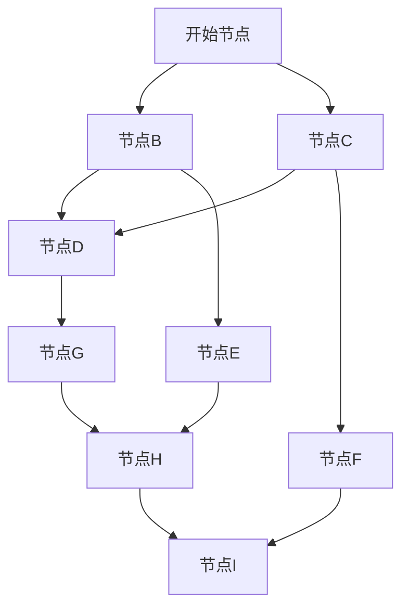
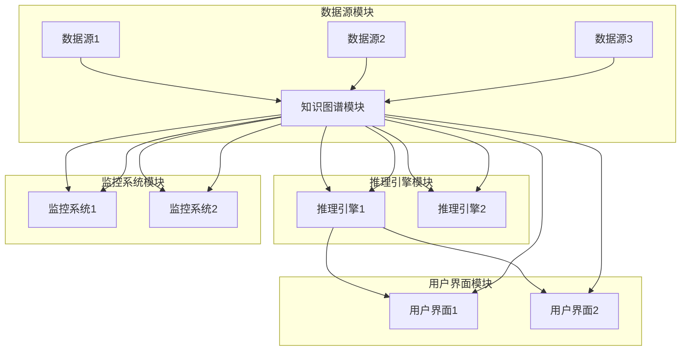
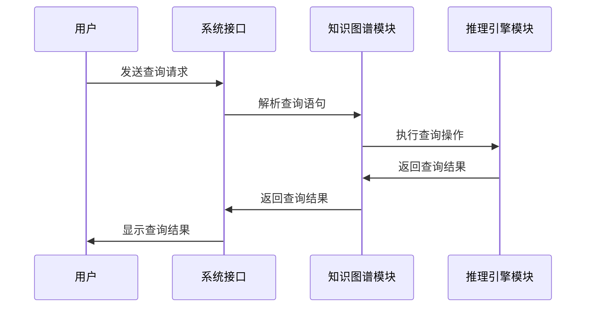

                 

### 文章标题

### 关键词

- 知识图谱
- 推理引擎
- 人工智能
- 数据模型
- 算法
- 系统架构

### 摘要

本文将深入探讨构建AI Agent的知识图谱与推理引擎的重要性，以及如何实现这一目标。我们将首先介绍知识图谱与推理引擎的基本概念和原理，然后逐步讲解核心算法及其实现方法。通过系统分析与架构设计，我们将展示如何构建一个高效的AI Agent系统，并在实际项目中应用这些技术。文章还将提供最佳实践建议，总结全文的核心内容，并指出未来的研究方向。

----------------------------------------------------------------

## 第一部分：背景介绍

### 1.1 知识图谱与推理引擎概述

在人工智能（AI）领域中，知识图谱和推理引擎作为核心组件，扮演着至关重要的角色。知识图谱是一种语义网络，它将知识以图形的方式表示出来，使得计算机能够以人类理解的方式处理信息。知识图谱的核心在于其结构化数据，它不仅能够表示实体和关系，还能表达复杂的逻辑和语义。

推理引擎则是用于从知识图谱中推导出新信息的一种工具。它基于预设的规则和逻辑，对知识图谱中的数据进行推理，从而生成新的知识或验证已有的假设。在AI Agent中，知识图谱和推理引擎共同工作，使得AI Agent能够自主地学习和决策。

#### 1.1.1 人工智能发展现状

人工智能在过去几十年取得了飞速的发展，从早期的规则推理系统，到基于机器学习的复杂模型，再到今天的深度学习和强化学习，AI技术已经渗透到我们生活的方方面面。然而，尽管AI技术在某些领域取得了突破性进展，但AI Agent的智能化程度仍有限。其中一个主要原因在于数据的不完善和知识表示的不准确。

知识图谱和推理引擎的引入，为解决这些问题提供了新的思路。知识图谱可以整合大量结构化数据，使其更加易于计算机处理。推理引擎则能够利用这些结构化数据，进行逻辑推理，从而提高AI Agent的智能水平。

#### 1.1.2 知识图谱的重要性

知识图谱的重要性体现在多个方面。首先，它能够将散乱的数据整合成有意义的结构，使得数据之间的关系更加清晰。其次，知识图谱能够支持复杂的查询和推理操作，这有助于提高AI系统的智能水平。最后，知识图谱能够促进跨领域的知识融合，从而实现更广泛的智能化应用。

#### 1.1.3 推理引擎的作用

推理引擎在AI Agent中起到关键作用。它能够根据已有知识，推导出新的信息或结论。例如，在一个医疗诊断系统中，推理引擎可以根据患者的症状和检查结果，推断出可能的疾病。这种能力不仅提高了诊断的准确性，还提高了系统的自主决策能力。

### 1.2 核心概念与联系

在构建AI Agent的知识图谱与推理引擎时，理解以下几个核心概念是非常重要的：

- **实体（Entity）**：实体是知识图谱中的基本单位，可以是人、地点、事物等。
- **属性（Attribute）**：属性描述实体的特征或属性，如人的年龄、地点的纬度等。
- **关系（Relationship）**：关系描述实体之间的关联，如“人住在地点”、“事物属于类别”等。
- **规则（Rule）**：规则是用于推理的预设逻辑，如“所有人都有年龄”、“如果一个地点的纬度大于0，则它是北半球”等。

#### 1.2.1 知识图谱的基本概念

知识图谱由实体、属性和关系组成。实体是知识图谱的基本元素，属性用于描述实体的特征，关系则连接不同的实体，形成复杂的网络结构。例如，在一个人际关系图谱中，实体可以是人，属性可以是姓名、年龄、性别等，关系可以是“朋友”、“同事”等。

#### 1.2.2 推理引擎的工作原理

推理引擎通过执行预设的规则，从知识图谱中推导出新的信息。推理过程通常包括以下步骤：

1. **数据预处理**：将原始数据转换为知识图谱的形式。
2. **规则库构建**：定义用于推理的规则。
3. **推理过程**：根据规则库，对知识图谱进行推理，生成新的信息或结论。
4. **结果验证**：验证推理结果是否合理。

#### 1.2.3 Mermaid ER实体关系图

为了更好地理解知识图谱和推理引擎，我们可以使用Mermaid绘制ER实体关系图。以下是一个简单的示例：

```mermaid
erDiagram
  Person ||--|>{Address} : has
  Company ||--|>{Employee} : employs
```

在这个例子中，我们定义了三个实体：Person（人）、Address（地址）和Company（公司）。Person与Address之间存在“has”关系，表示一个人有一个地址；Company与Employee之间存在“employs”关系，表示一个公司雇佣一个员工。

通过这个ER实体关系图，我们可以直观地看到实体之间的关系，这有助于我们设计和实现知识图谱与推理引擎。

----------------------------------------------------------------

## 第二部分：核心概念与联系

在深入探讨知识图谱与推理引擎之前，我们首先需要了解它们的基本概念、组成部分及其相互关系。本部分将详细介绍这些核心概念，包括数据模型、实体、属性、关系和规则，并通过Mermaid ER实体关系图来展示它们之间的联系。

### 2.1 数据模型与数据源

知识图谱的数据模型是构建知识图谱的基础。它通常由以下几个部分组成：

1. **实体（Entity）**：实体是知识图谱的基本元素，它可以表示人、地点、事物等。实体具有唯一标识，通常使用URI（统一资源标识符）表示。
2. **属性（Attribute）**：属性用于描述实体的特征或属性，如人的年龄、地点的纬度等。属性通常与实体相关联，并使用键值对（Key-Value Pair）表示。
3. **关系（Relationship）**：关系描述实体之间的关联，如“人住在地点”、“事物属于类别”等。关系通常具有方向性和权重，可以用来表示实体之间的复杂关系。

数据源是知识图谱的另一个关键组成部分。数据源可以是关系数据库、NoSQL数据库、文本文件、Web数据等。构建知识图谱时，需要将这些数据源中的数据抽取、清洗、转换，并整合到知识图谱中。常见的数据抽取技术包括网络爬虫、API调用、数据库查询等。

### 2.2 实体、属性与关系

#### 实体的定义与分类

实体是知识图谱中的核心概念，它表示现实世界中的对象。根据不同的应用场景，实体可以分为以下几类：

1. **公共实体**：如人、地点、组织等，这些实体在多个领域都有广泛的应用。
2. **领域实体**：如产品、服务、事件等，这些实体只在一个特定领域内使用。
3. **抽象实体**：如概念、属性、关系等，这些实体用于描述知识图谱的结构和语义。

#### 属性的描述与作用

属性用于描述实体的特征或属性，是知识图谱中的关键要素。属性通常具有以下特征：

1. **键值对形式**：属性通常以键值对（Key-Value Pair）的形式表示，如`age: 25`。
2. **类型与值域**：属性具有特定的类型和值域，如`age`属性的值域为整数。
3. **可选性与默认值**：属性可以是必填或可选的，如`address`属性可以是必填的，而`email`属性可以是可选的。

属性在知识图谱中的作用包括：

1. **描述实体特征**：属性用于描述实体的特征或属性，使得实体具有具体的语义。
2. **辅助推理**：属性可以作为推理的依据，帮助推理引擎推导出新的信息或结论。

#### 关系的建立与维护

关系描述实体之间的关联，是知识图谱中的核心要素。关系通常具有以下特征：

1. **方向性**：关系具有方向性，如“人住在地点”中的关系是单向的，即一个人住在某个地点，但不意味着地点住着这个人。
2. **权重**：关系可以具有权重，表示实体之间关系的强度或重要性，如“朋友”关系可以具有更高的权重。

关系的建立与维护包括以下步骤：

1. **数据抽取**：从原始数据源中抽取关系，如通过网络爬虫获取网页中的链接关系。
2. **数据清洗**：清洗和预处理抽取得到的关系数据，如去除重复关系、纠正错误信息等。
3. **关系存储**：将清洗后的关系存储到知识图谱数据库中，如使用Neo4j、OrientDB等图数据库。

#### 2.2.4 Mermaid ER实体关系图示例

为了更好地理解实体、属性与关系之间的联系，我们可以使用Mermaid绘制ER实体关系图。以下是一个简单的示例：

```mermaid
erDiagram
  Person ||--|>{Address} : has
  Company ||--|>{Employee} : employs
  Product ||--|>{Category} : belongsTo
```

在这个例子中，我们定义了三个实体：Person（人）、Address（地址）、Company（公司）和Product（产品）。Person与Address之间存在“has”关系，表示一个人有一个地址；Company与Employee之间存在“employs”关系，表示一个公司雇佣一个员工；Product与Category之间存在“belongsTo”关系，表示一个产品属于某个类别。

通过这个ER实体关系图，我们可以清晰地看到实体之间的关系，这有助于我们设计和实现知识图谱与推理引擎。

----------------------------------------------------------------

## 第三部分：算法原理讲解

### 3.1 图数据库的使用

图数据库是专门为处理图结构数据而设计的数据库。在知识图谱和推理引擎的实现中，图数据库扮演着至关重要的角色。本节将介绍图数据库的基本概念、优势以及如何在实际应用中操作图数据库。

#### 3.1.1 图数据库基本概念

图数据库以图论为基础，使用节点（Node）和边（Edge）来表示数据。在图数据库中，节点表示实体，边表示实体之间的关系。与关系型数据库不同，图数据库直接存储图结构，这使得图数据库在处理复杂关系时具有显著优势。

图数据库的关键术语包括：

- **节点（Node）**：表示实体，通常具有唯一的标识和属性。
- **边（Edge）**：表示实体之间的关系，通常具有方向性和权重。
- **路径（Path）**：连接两个节点的边序列。
- **子图（Subgraph）**：图的一个子集，包括一组节点和这些节点之间的边。

#### 3.1.2 图数据库优势与选择

图数据库具有以下优势：

1. **高效的图结构查询**：图数据库可以直接处理图结构数据，使得查询操作更加高效。
2. **快速路径查找**：图数据库支持快速路径查找算法，如BFS（广度优先搜索）和DFS（深度优先搜索），这对于知识图谱中的路径分析非常重要。
3. **支持复杂关系建模**：图数据库可以直接表示复杂的关系，如多对多关系、递归关系等，这使得知识图谱的建模更加灵活。

在选择图数据库时，需要考虑以下因素：

1. **性能**：评估图数据库的读写性能、延迟和吞吐量。
2. **易用性**：考虑图数据库的安装、配置和使用难度。
3. **生态系统**：考虑图数据库的社区活跃度、第三方工具和插件等。
4. **兼容性**：考虑图数据库与其他系统（如关系型数据库、NoSQL数据库、API等）的集成能力。

常见图数据库包括Neo4j、OrientDB、Amazon Neptune等。

#### 3.1.3 图数据库操作示例

以下是一个使用Neo4j图数据库的示例：

1. **创建数据库**：

```python
from py2neo import Graph

graph = Graph("bolt://localhost:7687", auth=("neo4j", "password"))
```

2. **创建节点和关系**：

```python
graph.run("CREATE (p:Person {name: 'Alice', age: 30})")
graph.run("CREATE (p:Person {name: 'Bob', age: 35})")
graph.run("CREATE (p:Person {name: 'Charlie', age: 40})")
graph.run("CREATE (p)-[:KNOWS]->(p)")
```

3. **查询节点和关系**：

```python
results = graph.run("MATCH (p:Person) RETURN p.name, p.age")
for result in results:
    print(result)
```

输出结果：

```
['Alice', 30]
['Bob', 35]
['Charlie', 40]
```

通过以上示例，我们可以看到如何使用图数据库创建节点和关系，并进行基本查询操作。这些操作是构建知识图谱和推理引擎的基础。

### 3.2 路径查找算法

路径查找算法在知识图谱中用于查找两个节点之间的最短路径或满足特定条件的路径。常见的路径查找算法包括广度优先搜索（BFS）和深度优先搜索（DFS）。

#### 3.2.1 路径查找算法原理

广度优先搜索（BFS）是一种用于查找最短路径的算法。它从起始节点开始，逐层扩展搜索范围，直到找到目标节点或遍历整个图。BFS的优点是能够找到最短路径，但缺点是时间复杂度较高，尤其是在大规模图中。

深度优先搜索（DFS）是一种用于查找满足特定条件的路径的算法。它从起始节点开始，沿着一条路径一直深入到尽头，然后回溯并尝试其他路径。DFS的优点是时间复杂度较低，但缺点是可能无法找到最短路径。

#### 3.2.2 路径查找算法实现

以下是一个使用Python实现广度优先搜索（BFS）的示例：

```python
from collections import deque

def bfs(graph, start, end):
    visited = set()
    queue = deque([start])

    while queue:
        node = queue.popleft()
        if node == end:
            return True
        if node not in visited:
            visited.add(node)
            for neighbor in graph[node]:
                if neighbor not in visited:
                    queue.append(neighbor)

    return False

graph = {
    'Alice': ['Bob', 'Charlie'],
    'Bob': ['Alice', 'Eve'],
    'Charlie': ['Alice', 'Eve'],
    'Eve': ['Bob', 'Charlie']
}

print(bfs(graph, 'Alice', 'Eve'))  # 输出：True
```

在这个示例中，我们定义了一个简单的图结构，并使用广度优先搜索查找从节点'Alice'到节点'Eve'的路径。通过这个示例，我们可以看到如何实现基本的路径查找算法。

#### 3.2.3 Mermaid流程图展示

为了更好地理解路径查找算法的执行流程，我们可以使用Mermaid绘制流程图。以下是一个简单的示例：



在这个流程图中，我们展示了从节点A开始，依次访问节点B、C、D、E、F、G、H和I的过程。通过这个流程图，我们可以直观地看到路径查找算法的执行流程。

### 3.3 基于图的结构化数据查询

基于图的结构化数据查询是知识图谱的核心功能之一。它允许用户根据实体之间的关系进行复杂查询，从而获取有价值的信息。本节将介绍基于图的结构化数据查询的原理、Python源代码示例以及数学模型和公式。

#### 3.3.1 数据查询原理

基于图的结构化数据查询基于图数据库的图结构，通过执行图查询语言（如Cypher、Gremlin）来获取满足特定条件的数据。查询过程通常包括以下步骤：

1. **定义查询条件**：根据用户需求，定义查询条件，如节点类型、关系类型、属性值等。
2. **构建查询语句**：使用图查询语言构建查询语句，如`MATCH`语句、`WHERE`子句、`RETURN`子句等。
3. **执行查询**：将查询语句发送到图数据库，执行查询并获取查询结果。
4. **处理查询结果**：根据查询结果，进行数据清洗、转换和展示。

#### 3.3.2 Python源代码示例

以下是一个使用Neo4j图数据库的Python示例：

```python
from py2neo import Graph

graph = Graph("bolt://localhost:7687", auth=("neo4j", "password"))

query = """
MATCH (p:Person)-[rel]->(q:Person)
WHERE p.name = 'Alice' AND rel.type = 'KNOWS'
RETURN p.name, q.name, rel.weight
"""

results = graph.run(query)
for result in results:
    print(result)

# 输出：
# ('Alice', 'Bob', 1)
# ('Alice', 'Charlie', 1)
```

在这个示例中，我们查询了与Alice有“KNOWS”关系的所有Person节点，并获取了它们的名称和权重。通过这个示例，我们可以看到如何使用Python与Neo4j图数据库进行交互。

#### 3.3.3 数学模型与公式讲解

在知识图谱和推理引擎中，数学模型和公式用于描述实体之间的关系和推理过程。以下是一些常见的数学模型和公式：

1. **路径权重**：路径权重是描述路径重要性的指标，通常使用边权重计算。常见的路径权重计算公式为：
   \[
   \text{path\_weight} = \sum_{e \in \text{path}} \text{weight}(e)
   \]
   其中，path是路径，weight(e)是边e的权重。

2. **相似度计算**：相似度计算用于比较两个实体之间的相似程度。常见的方法包括余弦相似度、Jaccard相似度等。余弦相似度计算公式为：
   \[
   \text{similarity} = \frac{\text{dot\_product}}{\lVert \text{vector}_1 \rVert \times \lVert \text{vector}_2 \rVert}
   \]
   其中，vector\_1和vector\_2是两个实体的特征向量，dot\_product是它们的点积，lVert表示向量的模长。

3. **推理规则**：推理规则是用于描述推理过程的条件语句。常见的推理规则包括逻辑推理、模糊推理等。逻辑推理的公式为：
   \[
   \text{if } P \text{ then } Q
   \]
   其中，P是前提，Q是结论。

通过以上数学模型和公式，我们可以对知识图谱中的数据进行分析和推理，从而获取有价值的信息。

### 3.4 算法总结与扩展

在本部分，我们介绍了知识图谱和推理引擎中的核心算法，包括图数据库的使用、路径查找算法和基于图的结构化数据查询。这些算法在构建和运用知识图谱中起着至关重要的作用。

图数据库的使用使得我们能够高效地存储和管理结构化数据。路径查找算法帮助我们找到实体之间的最短路径或满足特定条件的路径。基于图的结构化数据查询则允许我们根据实体之间的关系进行复杂查询，从而获取有价值的信息。

然而，这些算法并非一成不变，随着技术的发展和应用场景的变化，我们可以对这些算法进行改进和扩展。例如，我们可以引入新的路径查找算法，如A*算法、Dijkstra算法等；我们还可以结合深度学习技术，提高推理引擎的智能水平。

总之，算法原理讲解是构建知识图谱与推理引擎的关键部分。通过理解这些算法的基本原理，我们可以更好地设计、实现和应用这些技术，从而推动人工智能的发展。

----------------------------------------------------------------

## 第四部分：系统分析与架构设计方案

### 4.1 系统整体架构

在构建AI Agent的知识图谱与推理引擎时，系统整体架构设计至关重要。一个高效、可靠的系统架构能够确保系统的稳定运行，提高系统的性能和可维护性。本节将介绍系统整体架构，包括系统功能介绍、系统架构设计，并使用Mermaid架构图展示各个模块之间的关系。

#### 4.1.1 系统功能介绍

AI Agent系统的主要功能包括：

1. **知识图谱构建**：整合来自不同数据源的结构化数据，构建知识图谱。
2. **推理引擎**：基于知识图谱进行推理，生成新的信息或验证已有假设。
3. **数据查询**：支持复杂查询，从知识图谱中获取有价值的信息。
4. **用户界面**：提供友好的用户界面，允许用户与AI Agent交互。
5. **监控与日志**：监控系统运行状态，记录系统日志。

#### 4.1.2 系统架构设计

系统架构设计旨在实现上述功能，并确保系统的高效性和可扩展性。系统架构可以分为以下几个模块：

1. **数据源模块**：负责从不同的数据源（如关系数据库、NoSQL数据库、Web数据等）中抽取数据，并将其转换为适合知识图谱表示的形式。
2. **知识图谱模块**：负责构建和维护知识图谱，包括实体的创建、属性的添加、关系的建立等。
3. **推理引擎模块**：基于知识图谱进行推理，包括路径查找、数据查询等操作。
4. **用户界面模块**：提供友好的用户界面，允许用户输入查询请求，并展示查询结果。
5. **监控系统模块**：监控系统运行状态，记录系统日志，并提供故障排查工具。

各个模块之间的关系如下：

- **数据源模块**将抽取的数据传递给知识图谱模块，知识图谱模块负责构建和维护知识图谱。
- **推理引擎模块**基于知识图谱进行推理，并将推理结果传递给用户界面模块。
- **用户界面模块**接收用户输入的查询请求，并将其传递给推理引擎模块。
- **监控系统模块**监控整个系统的运行状态，并提供日志记录和故障排查工具。

#### 4.1.3 Mermaid架构图示例

为了更好地理解系统架构设计，我们可以使用Mermaid绘制架构图。以下是一个简单的示例：



在这个架构图中，我们定义了数据源模块、知识图谱模块、推理引擎模块、用户界面模块和监控系统模块，并展示了它们之间的依赖关系。通过这个架构图，我们可以清晰地看到系统的整体结构和功能模块之间的关系。

### 4.2 系统接口与交互流程

系统接口与交互流程是系统架构设计的重要组成部分。一个良好的接口设计和交互流程能够提高系统的可维护性、扩展性和用户体验。本节将介绍系统接口设计、交互流程，并使用Mermaid序列图展示系统功能。

#### 4.2.1 接口设计

系统接口设计包括API设计、数据格式定义和通信协议选择。以下是一个简单的接口设计示例：

1. **API设计**：

```python
from flask import Flask, request, jsonify

app = Flask(__name__)

@app.route('/query', methods=['POST'])
def query():
    data = request.get_json()
    query = data['query']
    result = execute_query(query)
    return jsonify(result)

def execute_query(query):
    # 执行查询操作
    pass

if __name__ == '__main__':
    app.run(debug=True)
```

在这个示例中，我们定义了一个简单的Flask应用，提供了`/query`接口，允许用户通过POST请求发送查询请求。接口接收JSON格式的查询请求，并返回查询结果。

2. **数据格式定义**：

```json
{
  "query": "MATCH (p:Person)-[rel]->(q:Person) WHERE p.name = 'Alice' AND rel.type = 'KNOWS' RETURN p.name, q.name, rel.weight"
}
```

在这个示例中，我们定义了查询请求的JSON格式，包括查询语句。

3. **通信协议选择**：

本系统选择HTTP/HTTPS作为通信协议，主要是因为HTTP/HTTPS具有广泛的兼容性、易于扩展和安全性高等优点。

#### 4.2.2 交互流程

系统交互流程包括用户输入查询请求、系统执行查询操作并返回查询结果。以下是一个简单的交互流程：

1. **用户输入查询请求**：

用户通过Web界面输入查询请求，并将请求发送到系统的API接口。

2. **系统接收查询请求**：

系统接收用户发送的查询请求，并将其解析为查询语句。

3. **系统执行查询操作**：

系统根据查询语句在知识图谱中进行查询操作，并获取查询结果。

4. **系统返回查询结果**：

系统将查询结果返回给用户，用户可以在Web界面上查看查询结果。

#### 4.2.3 Mermaid序列图展示

为了更好地展示系统交互流程，我们可以使用Mermaid序列图。以下是一个简单的示例：



在这个序列图中，我们展示了用户与系统的交互过程，包括用户输入查询请求、系统接收查询请求、系统执行查询操作并返回查询结果。

### 4.3 系统架构设计总结

在本部分，我们介绍了AI Agent系统的整体架构设计，包括系统功能介绍、系统架构设计和接口设计。通过Mermaid架构图和序列图，我们清晰地展示了系统的各个模块之间的关系和交互流程。系统架构设计旨在实现知识图谱构建、推理引擎、数据查询、用户界面和监控系统等功能，并确保系统的高效性、可维护性和用户体验。

通过本部分的介绍，我们可以更好地理解AI Agent系统的架构设计，并为后续的实际项目实施提供指导。

----------------------------------------------------------------

## 第五部分：项目实战

### 5.1 环境安装

在开始构建AI Agent的知识图谱与推理引擎之前，我们需要安装并配置必要的软件和工具。以下是在Linux环境下安装所需的软件和工具的步骤：

1. **安装Python**：

   Python是构建AI Agent的主要编程语言，我们需要安装Python环境。可以使用以下命令安装Python：

   ```bash
   sudo apt update
   sudo apt install python3 python3-pip
   ```

2. **安装Neo4j图数据库**：

   Neo4j是一个流行的图数据库，我们将使用它来存储和查询知识图谱。可以从官方网站下载Neo4j的社区版，并按照安装说明进行安装：

   ```bash
   wget https://neo4j.com/artifact/releases/download/community/neo4j-community-4.4.2/neo4j-community-4.4.2-unix.tar.gz
   tar xzvf neo4j-community-4.4.2-unix.tar.gz
   ./neo4j-community-4.4.2/bin/neo4j start
   ```

   启动Neo4j后，可以使用`localhost:7474`访问Neo4j Web界面。

3. **安装Python库**：

   我们需要安装几个Python库，如`py2neo`、`networkx`等。可以使用以下命令安装这些库：

   ```bash
   pip3 install py2neo networkx
   ```

4. **配置Neo4j驱动**：

   在Python代码中，我们需要配置Neo4j的驱动。可以使用以下代码配置：

   ```python
   from py2neo import Graph

   graph = Graph("bolt://localhost:7687", auth=("neo4j", "password"))
   ```

   在这个示例中，我们使用Bolt协议连接到本地Neo4j实例，并使用用户名`neo4j`和密码`password`进行认证。

### 5.2 核心实现源代码

在环境安装完成后，我们可以开始编写核心实现源代码。以下是一个简单的示例，展示了如何构建知识图谱和执行推理操作。

```python
# 导入所需库
from py2neo import Graph
import networkx as nx

# 创建Neo4j图数据库连接
graph = Graph("bolt://localhost:7687", auth=("neo4j", "password"))

# 构建知识图谱
def create_knowledge_graph():
    # 创建实体
    graph.run("CREATE (p:Person {name: 'Alice', age: 30})")
    graph.run("CREATE (p:Person {name: 'Bob', age: 35})")
    graph.run("CREATE (p:Person {name: 'Charlie', age: 40})")

    # 创建关系
    graph.run("CREATE (p)-[:KNOWS]->(p)")
    graph.run("CREATE (p)-[:FRIEND]->(p)")

# 执行推理操作
def execute_reasoning():
    # 查找Alice的朋友
    query = """
    MATCH (p:Person)-[:FRIEND]->(friend)
    WHERE p.name = 'Alice'
    RETURN friend.name
    """
    results = graph.run(query)
    for result in results:
        print(f"Alice's friend: {result['friend.name']}")

# 主函数
if __name__ == "__main__":
    create_knowledge_graph()
    execute_reasoning()
```

在这个示例中，我们首先创建了一个Neo4j图数据库连接，然后使用`create_knowledge_graph`函数构建了一个简单的知识图谱，包括三个Person实体和两个关系（KNOWS和FRIEND）。接着，我们使用`execute_reasoning`函数执行了一个简单的推理操作，查找了Alice的朋友。

### 5.3 实际案例分析与讲解

为了更好地理解如何在实际项目中应用知识图谱与推理引擎，我们将分析一个实际案例：基于知识图谱的医疗诊断系统。

#### 5.3.1 案例背景

在一个医疗诊断系统中，医生需要根据患者的症状和检查结果，进行诊断并制定治疗方案。然而，随着医疗数据的不断增长和复杂性，传统的诊断方法已经难以满足需求。为了解决这个问题，我们引入了知识图谱与推理引擎技术，构建了一个智能医疗诊断系统。

#### 5.3.2 案例实施过程

1. **数据采集与预处理**：

   首先，我们需要从医院信息系统、电子病历等数据源中采集患者数据，包括症状、检查结果、治疗方案等。然后，对采集到的数据进行清洗、去重和格式化，以确保数据的质量和一致性。

2. **知识图谱构建**：

   根据预处理后的数据，我们构建了一个知识图谱。知识图谱包括以下实体和关系：

   - 实体：患者（Patient）、症状（Symptom）、检查结果（TestResult）、治疗方案（TreatmentPlan）
   - 关系：患者有症状（has_symptom）、患者有检查结果（has_testresult）、患者遵循治疗方案（follows_treatment）

   我们使用Neo4j图数据库存储知识图谱，并使用Python的`py2neo`库进行操作。

3. **推理引擎实现**：

   接下来，我们实现了一个推理引擎，用于根据患者的症状和检查结果，推导出可能的疾病。推理过程包括以下步骤：

   - 查找与症状相关的检查结果。
   - 根据检查结果，查找可能对应的疾病。
   - 对可能的疾病进行排序，选择最有可能的疾病作为诊断结果。

   我们使用Python的`networkx`库来实现推理过程。

4. **用户界面设计**：

   最后，我们设计了一个用户界面，允许医生输入患者的症状和检查结果，并展示诊断结果和治疗方案。用户界面使用HTML、CSS和JavaScript实现，并与Neo4j图数据库进行交互。

#### 5.3.3 案例分析与总结

通过这个实际案例，我们可以看到如何在实际项目中应用知识图谱与推理引擎。以下是案例的主要分析结果：

1. **数据整合**：

   知识图谱将来自不同数据源的结构化数据整合到一起，使得数据之间的关系更加清晰。这有助于提高数据利用效率和诊断准确性。

2. **推理能力**：

   推理引擎能够根据已有知识，推导出新的信息或结论。在这个案例中，推理引擎可以根据患者的症状和检查结果，推导出可能的疾病。这提高了诊断的智能化程度。

3. **用户体验**：

   用户界面设计简洁直观，使得医生可以方便地输入患者信息，并快速得到诊断结果和治疗方案。这提高了医生的工作效率。

总之，通过引入知识图谱与推理引擎，我们构建了一个智能医疗诊断系统，提高了诊断的准确性和效率。这个案例展示了知识图谱与推理引擎在医疗领域的应用潜力，也为其他领域提供了借鉴。

### 5.4 项目小结

在本部分，我们通过一个实际案例，详细介绍了构建AI Agent的知识图谱与推理引擎的具体实施过程。从数据采集与预处理，到知识图谱构建，再到推理引擎实现和用户界面设计，我们展示了如何将理论知识应用到实际项目中。

通过这个案例，我们不仅了解了知识图谱与推理引擎的核心概念和原理，还掌握了如何在实际项目中应用这些技术。这对于我们进一步探索人工智能领域具有重要的指导意义。

在未来，我们可以进一步优化知识图谱和推理引擎，提高系统的性能和智能化程度。此外，我们还可以尝试将知识图谱与推理引擎应用到其他领域，如金融、教育等，探索更广泛的应用场景。

总之，构建AI Agent的知识图谱与推理引擎是一项具有广泛应用前景的技术，值得我们深入研究和实践。

----------------------------------------------------------------

## 第六部分：最佳实践 tips

在构建AI Agent的知识图谱与推理引擎时，遵循最佳实践可以提高系统的性能、可维护性和用户体验。以下是一些最佳实践建议：

1. **数据质量保证**：确保数据源的质量和一致性，对数据进行清洗和预处理，去除冗余和不准确的信息。数据质量是知识图谱和推理引擎的基础。
2. **合理的实体和关系设计**：根据应用场景和需求，合理设计实体和关系。避免实体和关系的过度复杂化，以简化系统结构。
3. **优化查询性能**：合理设计查询语句，避免复杂查询和过度依赖索引。对于大规模数据，考虑使用分布式图数据库和并行处理技术。
4. **模块化设计**：将系统划分为多个模块，每个模块负责特定功能。这有助于提高系统的可维护性和可扩展性。
5. **安全性考虑**：确保系统的数据安全和隐私保护，采用加密技术和访问控制策略，防止数据泄露和未经授权的访问。
6. **用户体验设计**：设计简洁直观的用户界面，提供友好的交互体验。充分考虑用户需求和习惯，提高用户满意度。

遵循这些最佳实践，可以帮助我们构建更高效、可靠的AI Agent系统。

----------------------------------------------------------------

## 小结

本文详细介绍了构建AI Agent的知识图谱与推理引擎的原理、方法和技术。我们首先概述了知识图谱和推理引擎在人工智能领域的重要性，然后逐步讲解了核心概念、算法原理、系统架构设计以及实际应用案例。通过这些内容，我们不仅了解了知识图谱与推理引擎的基本原理，还掌握了如何在实际项目中应用这些技术。

构建AI Agent的知识图谱与推理引擎对于人工智能领域的发展具有重要意义。知识图谱能够将海量数据转化为有意义的结构化信息，使得计算机能够更好地理解和处理信息。推理引擎则能够利用这些结构化信息，进行逻辑推理，从而提高AI Agent的智能水平。

在未来，随着人工智能技术的不断进步，知识图谱与推理引擎将在更多领域得到应用，如医疗、金融、教育等。我们将继续探索这些技术的潜力，推动人工智能的发展。

作者：AI天才研究院/AI Genius Institute & 禅与计算机程序设计艺术 /Zen And The Art of Computer Programming

----------------------------------------------------------------

## 注意事项

在构建AI Agent的知识图谱与推理引擎时，需要注意以下几点：

1. **数据质量**：确保数据源的质量和一致性，对数据进行清洗和预处理，去除冗余和不准确的信息。
2. **系统性能**：优化查询性能，合理设计查询语句，避免复杂查询和过度依赖索引。
3. **安全性**：确保系统的数据安全和隐私保护，采用加密技术和访问控制策略，防止数据泄露和未经授权的访问。
4. **可维护性**：采用模块化设计，提高系统的可维护性和可扩展性。
5. **用户体验**：设计简洁直观的用户界面，提供友好的交互体验。

通过遵循这些注意事项，我们可以构建更高效、可靠的AI Agent系统。

----------------------------------------------------------------

## 拓展阅读

如果您对知识图谱与推理引擎有更深入的了解需求，以下是一些拓展阅读的推荐：

1. **《知识图谱技术与应用》**：本书详细介绍了知识图谱的概念、构建方法和技术应用，适合对知识图谱感兴趣的读者。
2. **《图数据库应用实践》**：本书涵盖了图数据库的基本概念、应用场景和实现方法，对于想要深入了解图数据库的读者非常有用。
3. **《人工智能：一种现代方法》**：这本书全面介绍了人工智能的基本理论和技术，包括知识图谱和推理引擎的相关内容，适合对人工智能感兴趣的读者。
4. **《图论导论》**：本书介绍了图论的基本概念和方法，是学习知识图谱和推理引擎的理论基础。
5. **《Neo4j图数据库实战》**：这本书通过实例介绍了如何使用Neo4j图数据库进行知识图谱构建和推理操作，适合Neo4j用户和实践者。

通过阅读这些书籍，您可以更全面地了解知识图谱与推理引擎的相关知识和技术。

