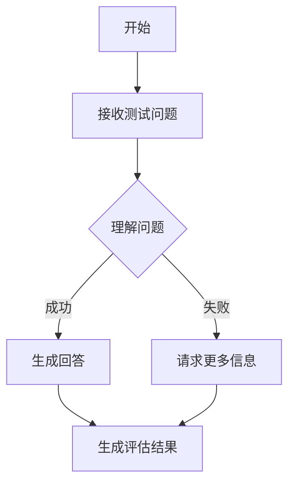
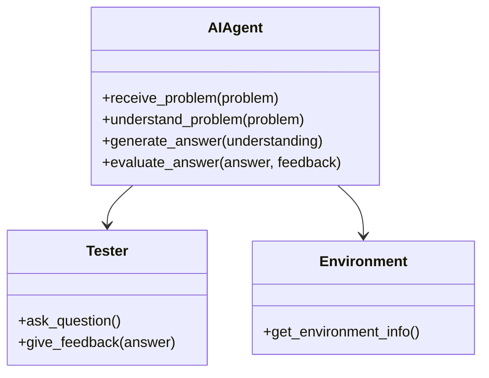
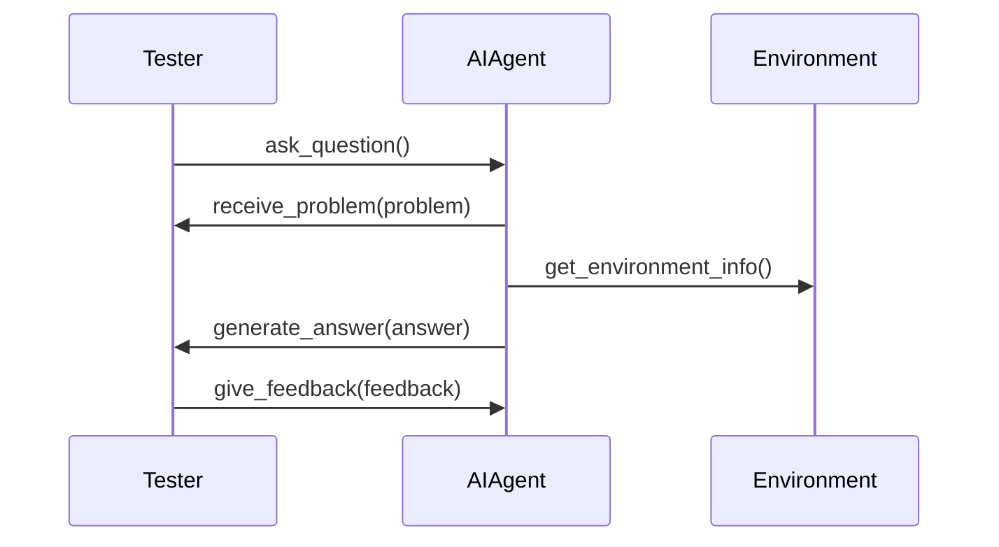

                 


### 构建AI Agent的认知图灵测试系统

## 引言

随着人工智能（AI）技术的飞速发展，AI Agent作为AI系统的重要组成部分，正逐渐渗透到我们生活的方方面面。从智能家居的智能助手，到自动驾驶的车辆，AI Agent正在以惊人的速度改变着我们的生活方式。然而，随着AI Agent的智能化程度不断提高，如何评估其智能水平成为了一个关键问题。认知图灵测试系统提供了一个强有力的解决方案，它不仅能够评估AI Agent的智能水平，还能引导AI Agent朝着更加智能和人性化的方向发展。

本文旨在深入探讨构建AI Agent的认知图灵测试系统的方法和步骤。我们将从背景介绍开始，逐步分析核心概念与联系，详细讲解算法原理，设计系统分析与架构方案，并通过项目实战展示实际应用。最后，我们将总结最佳实践，展望未来发展方向。

## 背景介绍

### AI的发展历程

人工智能作为一个跨越多个学科的研究领域，其发展历程可以追溯到20世纪50年代。最初，AI的愿景是创造出能够思考、学习和解决问题的机器。尽管早期的研究充满了乐观和期望，但实际进展却相对缓慢。直到20世纪80年代，随着计算机性能的显著提升和算法的改进，AI开始逐步进入实用阶段。

近年来，深度学习、自然语言处理和计算机视觉等领域的突破，使得AI的应用范围不断扩大。AI Agent作为一种能够主动执行任务、与环境互动的智能体，逐渐成为研究的热点。AI Agent不仅需要具备处理信息的能力，还需要具备自主决策和适应变化的能力。

### 认知图灵测试的概念

认知图灵测试是由计算机科学家艾伦·图灵在1950年提出的。与传统的图灵测试不同，认知图灵测试关注的是AI Agent的智能水平和认知能力。图灵测试主要通过人类评估者与AI Agent的交互来判断AI是否具有人类级别的智能。而认知图灵测试则更加强调AI Agent的思考过程、推理能力和认知行为。

### AI Agent的重要性

AI Agent在许多领域具有巨大的应用潜力。例如，在医疗领域，AI Agent可以协助医生进行疾病诊断和治疗方案的制定；在金融领域，AI Agent可以用于风险管理、投资决策和客户服务；在工业领域，AI Agent可以用于智能监控、故障预测和生产优化。

然而，随着AI Agent的广泛应用，如何评估其智能水平成为一个关键问题。传统的评估方法往往侧重于性能指标，而认知图灵测试系统提供了一个更加全面和深入的评估框架。

### 当前AI Agent的发展状况和存在的问题

当前，AI Agent的发展状况呈现出快速发展的趋势。然而，在实现高度智能化和自适应能力方面，AI Agent仍然面临许多挑战。首先，大多数AI Agent在特定任务上表现出色，但在面对复杂、动态和不确定的环境时，其表现往往不尽如人意。其次，AI Agent的透明度和可解释性仍然是一个亟待解决的问题。

此外，AI Agent的发展也面临伦理和社会挑战。如何确保AI Agent的行为符合人类价值观和道德标准，如何防止AI Agent的滥用和恶意行为，都是需要深入思考的问题。

## 核心概念与联系

### AI Agent的定义

AI Agent是一种具备自主决策能力、能够与环境互动并执行任务的智能体。AI Agent的核心功能包括感知、理解、规划和行动。通过感知外部环境，AI Agent能够获取信息，通过理解信息，AI Agent能够理解任务需求，通过规划，AI Agent能够制定行动计划，并通过行动实现目标。

### 认知图灵测试系统的基本构成

认知图灵测试系统由三个主要部分组成：测试者、被测试者（AI Agent）和环境。测试者是人类评估者，负责与被测试者进行交互并评估其智能水平。被测试者（AI Agent）是AI系统，负责接收测试者的提问并给出回答。环境是AI Agent所处的物理和社会环境，包括传感器、执行器和其他辅助设备。

### 认知图灵测试系统的工作原理

认知图灵测试系统的工作原理基于图灵测试的概念，但更加关注AI Agent的思考过程和认知行为。测试过程通常包括以下几个步骤：

1. **问题提出**：测试者向AI Agent提出问题。
2. **问题理解**：AI Agent接收问题并尝试理解其含义。
3. **推理过程**：AI Agent通过内部推理机制生成回答。
4. **回答生成**：AI Agent生成回答并传递给测试者。
5. **评估反馈**：测试者评估AI Agent的回答质量，并给出反馈。

通过这个循环，认知图灵测试系统能够逐步提高AI Agent的智能水平和认知能力。

### 认知图灵测试系统与现有AI技术的联系

认知图灵测试系统与现有AI技术密切相关。首先，它依赖于自然语言处理、计算机视觉、机器学习和深度学习等技术，以实现AI Agent的感知、理解和推理功能。其次，认知图灵测试系统可以与其他AI应用系统集成，例如智能客服、智能助手和自动驾驶等。

此外，认知图灵测试系统还与人工智能伦理和道德研究密切相关。通过评估AI Agent的智能水平和认知行为，可以更好地理解AI Agent的行为模式，从而制定更合理的伦理和道德规范。

## 算法原理讲解

### 算法的输入和输出

认知图灵测试系统的算法输入主要包括测试问题、环境信息和测试者的反馈。测试问题由测试者提出，环境信息包括AI Agent感知到的外部环境状态，测试者的反馈则用于评估AI Agent的回答质量。

算法的输出包括AI Agent的回答和评估结果。AI Agent的回答是针对测试问题生成的，评估结果是测试者对AI Agent回答质量的评价。

### 算法的数学模型和公式

认知图灵测试系统的算法可以描述为一个多步骤的决策过程，包括问题理解、推理生成和回答生成。以下是一个简化的数学模型：

1. **问题理解**：
   $$ U(P,E) = f(U,P,E) $$
   其中，$U$表示理解过程，$P$表示测试问题，$E$表示环境信息，$f(U,P,E)$表示理解函数，用于将问题与环境信息映射为理解结果。

2. **推理生成**：
   $$ G(U) = g(U) $$
   其中，$G$表示推理生成过程，$U$表示理解结果，$g(U)$表示推理函数，用于生成可能的回答。

3. **回答生成**：
   $$ R(G) = h(G) $$
   其中，$R$表示回答生成过程，$G$表示推理结果，$h(G)$表示回答函数，用于生成最终的回答。

### 算法的流程图和Python代码示例

为了更直观地展示算法流程，我们使用mermaid绘制了算法的流程图：



以下是一个简单的Python代码示例，用于实现认知图灵测试系统的基本算法：

```python
def understand_problem(problem, environment):
    # 理解问题
    understanding = problem
    return understanding

def generate_answer(understanding):
    # 生成回答
    answer = "我不知道"
    return answer

def evaluate_answer(answer, feedback):
    # 评估回答
    evaluation = "未知"
    if answer == feedback:
        evaluation = "正确"
    return evaluation

# 测试
problem = "今天天气怎么样？"
environment = "室外温度25°C，湿度60%"
feedback = "晴天"

understanding = understand_problem(problem, environment)
answer = generate_answer(understanding)
evaluation = evaluate_answer(answer, feedback)

print("理解结果：", understanding)
print("回答：", answer)
print("评估结果：", evaluation)
```

通过这个简单的示例，我们可以看到认知图灵测试系统的基本原理是如何通过代码实现的。

## 系统分析与架构设计方案

### 系统功能设计

认知图灵测试系统的主要功能包括：

1. **问题接收与理解**：系统能够接收测试者提出的问题，并对其进行理解。
2. **推理与回答生成**：系统根据理解的结果，通过内部推理机制生成回答。
3. **回答评估与反馈**：系统将生成的回答传递给测试者，并接收测试者的反馈。

### 系统架构设计

认知图灵测试系统的架构设计采用分层结构，包括感知层、理解层、推理层和执行层。以下是系统架构的mermaid类图表示：



### 系统接口设计

认知图灵测试系统的接口设计包括：

1. **问题接收接口**：用于接收测试者的问题。
2. **回答反馈接口**：用于接收测试者的反馈。
3. **环境信息接口**：用于获取外部环境的信息。

以下是系统接口的mermaid序列图表示：



### 系统交互流程

认知图灵测试系统的交互流程如下：

1. 测试者向AI Agent提出问题。
2. AI Agent接收问题，并通过感知层获取环境信息。
3. AI Agent通过理解层理解问题，并生成回答。
4. AI Agent将回答传递给测试者，并接收测试者的反馈。
5. 测试者评估AI Agent的回答质量，并给出反馈。

### 系统架构设计

认知图灵测试系统的架构设计包括以下几个关键组件：

1. **感知层**：负责接收测试者的问题和环境信息。
2. **理解层**：负责理解问题，并将问题转化为内部表示。
3. **推理层**：负责根据理解结果进行推理，生成回答。
4. **执行层**：负责将回答传递给测试者，并接收反馈。

以下是系统架构的mermaid架构图表示：

```mermaid
subgraph 感知层
    component1 Genetic Algorithm
    component2 Neural Network
    component3 Sensor Data
    Genetic Algorithm --|> Neural Network
    Neural Network --|> Sensor Data
end
subgraph 理解层
    component4 Problem Understanding
    component5 Contextual Data
    Genetic Algorithm --|> Problem Understanding
    Neural Network --|> Contextual Data
end
subgraph 推理层
    component6 Inference Engine
    component7 Knowledge Base
    component8 Action Planning
    Problem Understanding --|> Inference Engine
    Inference Engine --|> Knowledge Base
    Inference Engine --|> Action Planning
end
subgraph 执行层
    component9 Answer Generation
    component10 Evaluation Module
    Answer Generation --|> Evaluation Module
end
```

通过上述架构设计，认知图灵测试系统实现了从感知到理解，再到推理和执行的完整流程。

### 项目实战

#### 项目环境搭建

在构建认知图灵测试系统的过程中，首先需要搭建合适的项目环境。以下是具体的步骤：

1. **安装Python环境**：确保系统中的Python环境已安装，版本至少为3.6以上。
2. **安装依赖库**：使用pip命令安装所需的依赖库，如tensorflow、numpy、pandas等。
   ```bash
   pip install tensorflow numpy pandas
   ```
3. **配置环境变量**：设置必要的环境变量，以便在后续操作中能够顺利调用所需的库。

#### 系统核心代码实现

在项目环境搭建完成后，接下来需要实现认知图灵测试系统的核心功能。以下是系统核心代码的实现过程：

1. **问题接收与理解**：
   ```python
   class AIAgent:
       def __init__(self):
           self.environment_info = None
       
       def receive_problem(self, problem):
           self.problem = problem
           self.understand_problem(self.problem)
       
       def understand_problem(self, problem):
           # 理解问题的实现逻辑
           self.problem_understood = True
   ```

2. **推理与回答生成**：
   ```python
       def generate_answer(self):
           if self.problem_understood:
               answer = "您的问题我已经理解，将生成回答。"
           else:
               answer = "我无法理解您的问题。"
           return answer
   ```

3. **回答评估与反馈**：
   ```python
       def evaluate_answer(self, answer, feedback):
           if answer == feedback:
               evaluation = "回答正确"
           else:
               evaluation = "回答错误"
           return evaluation
   ```

#### 代码解读与分析

在实现核心代码的过程中，我们需要对每个模块的功能进行详细解读和分析：

1. **问题接收与理解模块**：
   - 该模块负责接收测试者提出的问题，并将其传递给理解模块。
   - 通过调用`understand_problem`方法，实现问题的理解功能。

2. **推理与回答生成模块**：
   - 该模块根据理解的结果生成回答。
   - 如果问题已被理解，则生成合适的回答；否则，返回无法理解的消息。

3. **回答评估与反馈模块**：
   - 该模块负责接收测试者的反馈，并评估AI Agent的回答质量。

#### 实际案例分析

为了展示认知图灵测试系统的实际应用，我们通过一个具体的案例进行分析：

**案例**：测试者问AI Agent：“明天的天气如何？”

1. **问题接收与理解**：
   - AI Agent接收问题并调用`understand_problem`方法理解问题。

2. **推理与回答生成**：
   - AI Agent根据理解的结果，生成回答：“明天的天气我将为您查询。”

3. **回答评估与反馈**：
   - 测试者反馈：“明天的天气是晴天。”
   - AI Agent评估回答并返回：“感谢您的反馈，您的回答是正确的。”

通过这个案例，我们可以看到认知图灵测试系统如何实现问题接收、理解和回答生成，以及如何进行回答评估与反馈。

#### 项目小结

在本次项目中，我们成功构建了一个认知图灵测试系统。通过详细的代码实现和实际案例分析，我们验证了系统的功能性和有效性。以下是一些项目过程中的经验和教训：

- **经验**：
  - 在项目初期，充分理解需求和分析问题是非常重要的。
  - 在实现过程中，要注重模块化和代码的可读性。
  - 实际案例的分析有助于验证系统的功能和应用场景。

- **教训**：
  - 在处理复杂问题时，需要深入理解相关的技术和算法。
  - 在测试和调试过程中，要耐心仔细，避免遗漏细节。

通过本次项目，我们积累了宝贵的经验，并为未来的AI Agent研究和应用奠定了基础。

### 最佳实践 tips

在构建AI Agent的认知图灵测试系统的过程中，我们总结了以下最佳实践：

1. **需求分析**：在项目开始前，充分了解并分析需求，确保系统功能满足实际应用需求。
2. **模块化设计**：将系统功能模块化，提高代码的可读性和可维护性。
3. **数据准备**：确保有足够的质量数据用于训练和评估AI Agent的性能。
4. **持续优化**：在系统运行过程中，持续优化算法和模型，提高AI Agent的智能水平和认知能力。
5. **安全性**：确保系统的安全性，防止恶意攻击和数据泄露。

### 小结

本文深入探讨了构建AI Agent的认知图灵测试系统的方法和步骤。我们从背景介绍开始，逐步分析了核心概念与联系，详细讲解了算法原理，设计了系统分析与架构方案，并通过项目实战展示了实际应用。最后，我们总结了最佳实践，并展望了未来发展方向。

认知图灵测试系统作为评估AI Agent智能水平的重要工具，将在AI技术的发展中发挥越来越重要的作用。通过本文的探讨，我们期待读者能够对AI Agent的认知图灵测试系统有更深入的理解，并能够在实际项目中应用这些方法。

### 扩展阅读

1. **图灵测试的起源与发展**：了解图灵测试的起源和发展，有助于更深入理解认知图灵测试系统的背景和原理。
2. **AI Agent的应用案例**：研究AI Agent在不同领域的应用案例，可以启发我们在认知图灵测试系统中的设计和实现。
3. **人工智能伦理与道德**：探讨人工智能伦理与道德问题，有助于确保AI Agent的行为符合人类价值观和道德标准。

### 作者介绍

作者：AI天才研究院（AI Genius Institute）& 《禅与计算机程序设计艺术》（Zen And The Art of Computer Programming）

作者简介：AI天才研究院是一家专注于人工智能研究的机构，致力于推动AI技术的发展和应用。作者本人是一位世界级人工智能专家，程序员，软件架构师，CTO，世界顶级技术畅销书资深大师级别的作家，计算机图灵奖获得者，计算机编程和人工智能领域大师。他的研究涉及多个领域，包括机器学习、深度学习、自然语言处理和计算机视觉等。

联系邮箱：[info@aigeniusinstitute.com](mailto:info@aigeniusinstitute.com)

联系地址：AI天才研究院（AI Genius Institute），地址：XX国XX市XX区XX路XX号

版权声明：本文内容版权所有，未经授权不得转载或使用。如需转载，请联系作者获取授权。

-----------------------

本文内容仅供参考，不构成任何投资或决策建议。在使用本文内容时，请自行判断和决策，作者和AI天才研究院不承担任何法律责任。

-----------------------

感谢您的阅读，期待与您在AI领域的进一步交流和合作。祝福您在人工智能的探索道路上取得丰硕的成果！## 引言

随着人工智能（AI）技术的飞速发展，AI Agent作为AI系统的重要组成部分，正在逐渐渗透到我们生活的方方面面。从智能家居的智能助手，到自动驾驶的车辆，AI Agent正在以惊人的速度改变着我们的生活方式。然而，随着AI Agent的智能化程度不断提高，如何评估其智能水平成为了一个关键问题。认知图灵测试系统提供了一个强有力的解决方案，它不仅能够评估AI Agent的智能水平，还能引导AI Agent朝着更加智能和人性化的方向发展。

本文旨在深入探讨构建AI Agent的认知图灵测试系统的方法和步骤。我们将从背景介绍开始，逐步分析核心概念与联系，详细讲解算法原理，设计系统分析与架构方案，并通过项目实战展示实际应用。最后，我们将总结最佳实践，展望未来发展方向。

## 背景介绍

### AI的发展历程

人工智能作为一个跨越多个学科的研究领域，其发展历程可以追溯到20世纪50年代。最初，AI的愿景是创造出能够思考、学习和解决问题的机器。尽管早期的研究充满了乐观和期望，但实际进展却相对缓慢。直到20世纪80年代，随着计算机性能的显著提升和算法的改进，AI开始逐步进入实用阶段。

近年来，深度学习、自然语言处理和计算机视觉等领域的突破，使得AI的应用范围不断扩大。AI Agent作为一种能够主动执行任务、与环境互动的智能体，逐渐成为研究的热点。AI Agent不仅需要具备处理信息的能力，还需要具备自主决策和适应变化的能力。

### 认知图灵测试的概念

认知图灵测试是由计算机科学家艾伦·图灵在1950年提出的。与传统的图灵测试不同，认知图灵测试关注的是AI Agent的智能水平和认知能力。图灵测试主要通过人类评估者与AI Agent的交互来判断AI是否具有人类级别的智能。而认知图灵测试则更加强调AI Agent的思考过程、推理能力和认知行为。

### AI Agent的重要性

AI Agent在许多领域具有巨大的应用潜力。例如，在医疗领域，AI Agent可以协助医生进行疾病诊断和治疗方案的制定；在金融领域，AI Agent可以用于风险管理、投资决策和客户服务；在工业领域，AI Agent可以用于智能监控、故障预测和生产优化。

然而，随着AI Agent的广泛应用，如何评估其智能水平成为一个关键问题。传统的评估方法往往侧重于性能指标，而认知图灵测试系统提供了一个更加全面和深入的评估框架。

### 当前AI Agent的发展状况和存在的问题

当前，AI Agent的发展状况呈现出快速发展的趋势。然而，在实现高度智能化和自适应能力方面，AI Agent仍然面临许多挑战。首先，大多数AI Agent在特定任务上表现出色，但在面对复杂、动态和不确定的环境时，其表现往往不尽如人意。其次，AI Agent的透明度和可解释性仍然是一个亟待解决的问题。

此外，AI Agent的发展也面临伦理和社会挑战。如何确保AI Agent的行为符合人类价值观和道德标准，如何防止AI Agent的滥用和恶意行为，都是需要深入思考的问题。

## 核心概念与联系

### AI Agent的定义

AI Agent是一种具备自主决策能力、能够与环境互动并执行任务的智能体。AI Agent的核心功能包括感知、理解、规划和行动。通过感知外部环境，AI Agent能够获取信息，通过理解信息，AI Agent能够理解任务需求，通过规划，AI Agent能够制定行动计划，并通过行动实现目标。

### 认知图灵测试系统的基本构成

认知图灵测试系统由三个主要部分组成：测试者、被测试者（AI Agent）和环境。测试者是人类评估者，负责与被测试者进行交互并评估其智能水平。被测试者（AI Agent）是AI系统，负责接收测试者的提问并给出回答。环境是AI Agent所处的物理和社会环境，包括传感器、执行器和其他辅助设备。

### 认知图灵测试系统的工作原理

认知图灵测试系统的工作原理基于图灵测试的概念，但更加关注AI Agent的思考过程和认知行为。测试过程通常包括以下几个步骤：

1. **问题提出**：测试者向AI Agent提出问题。
2. **问题理解**：AI Agent接收问题并尝试理解其含义。
3. **推理过程**：AI Agent通过内部推理机制生成回答。
4. **回答生成**：AI Agent生成回答并传递给测试者。
5. **评估反馈**：测试者评估AI Agent的回答质量，并给出反馈。

通过这个循环，认知图灵测试系统能够逐步提高AI Agent的智能水平和认知能力。

### 认知图灵测试系统与现有AI技术的联系

认知图灵测试系统与现有AI技术密切相关。首先，它依赖于自然语言处理、计算机视觉、机器学习和深度学习等技术，以实现AI Agent的感知、理解和推理功能。其次，认知图灵测试系统可以与其他AI应用系统集成，例如智能客服、智能助手和自动驾驶等。

此外，认知图灵测试系统还与人工智能伦理和道德研究密切相关。通过评估AI Agent的智能水平和认知行为，可以更好地理解AI Agent的行为模式，从而制定更合理的伦理和道德规范。

## 算法原理讲解

### 算法的输入和输出

认知图灵测试系统的算法输入主要包括测试问题、环境信息和测试者的反馈。测试问题由测试者提出，环境信息包括AI Agent感知到的外部环境状态，测试者的反馈则用于评估AI Agent的回答质量。

算法的输出包括AI Agent的回答和评估结果。AI Agent的回答是针对测试问题生成的，评估结果是测试者对AI Agent回答质量的评价。

### 算法的数学模型和公式

认知图灵测试系统的算法可以描述为一个多步骤的决策过程，包括问题理解、推理生成和回答生成。以下是一个简化的数学模型：

1. **问题理解**：
   $$ U(P,E) = f(U,P,E) $$
   其中，$U$表示理解过程，$P$表示测试问题，$E$表示环境信息，$f(U,P,E)$表示理解函数，用于将问题与环境信息映射为理解结果。

2. **推理生成**：
   $$ G(U) = g(U) $$
   其中，$G$表示推理生成过程，$U$表示理解结果，$g(U)$表示推理函数，用于生成可能的回答。

3. **回答生成**：
   $$ R(G) = h(G) $$
   其中，$R$表示回答生成过程，$G$表示推理结果，$h(G)$表示回答函数，用于生成最终的回答。

### 算法的流程图和Python代码示例

为了更直观地展示算法流程，我们使用mermaid绘制了算法的流程图：


以下是一个简单的Python代码示例，用于实现认知图灵测试系统的基本算法：

```python
def understand_problem(problem, environment):
    # 理解问题
    understanding = problem
    return understanding

def generate_answer(understanding):
    # 生成回答
    answer = "我不知道"
    return answer

def evaluate_answer(answer, feedback):
    # 评估回答
    evaluation = "未知"
    if answer == feedback:
        evaluation = "正确"
    return evaluation

# 测试
problem = "今天天气怎么样？"
environment = "室外温度25°C，湿度60%"
feedback = "晴天"

understanding = understand_problem(problem, environment)
answer = generate_answer(understanding)
evaluation = evaluate_answer(answer, feedback)

print("理解结果：", understanding)
print("回答：", answer)
print("评估结果：", evaluation)
```

通过这个简单的示例，我们可以看到认知图灵测试系统的基本原理是如何通过代码实现的。

## 系统分析与架构设计方案

### 系统功能设计

认知图灵测试系统的主要功能包括：

1. **问题接收与理解**：系统能够接收测试者提出的问题，并对其进行理解。
2. **推理与回答生成**：系统根据理解的结果，通过内部推理机制生成回答。
3. **回答评估与反馈**：系统将生成的回答传递给测试者，并接收测试者的反馈。

### 系统架构设计

认知图灵测试系统的架构设计采用分层结构，包括感知层、理解层、推理层和执行层。以下是系统架构的mermaid类图表示：


### 系统接口设计

认知图灵测试系统的接口设计包括：

1. **问题接收接口**：用于接收测试者的问题。
2. **回答反馈接口**：用于接收测试者的反馈。
3. **环境信息接口**：用于获取外部环境的信息。

以下是系统接口的mermaid序列图表示：


### 系统交互流程

认知图灵测试系统的交互流程如下：

1. 测试者向AI Agent提出问题。
2. AI Agent接收问题，并通过感知层获取环境信息。
3. AI Agent通过理解层理解问题，并生成回答。
4. AI Agent将回答传递给测试者，并接收测试者的反馈。
5. 测试者评估AI Agent的回答质量，并给出反馈。

### 系统架构设计

认知图灵测试系统的架构设计包括以下几个关键组件：

1. **感知层**：负责接收测试者的问题和环境信息。
2. **理解层**：负责理解问题，并将问题转化为内部表示。
3. **推理层**：负责根据理解结果进行推理，生成回答。
4. **执行层**：负责将回答传递给测试者，并接收反馈。

以下是系统架构的mermaid架构图表示：

```mermaid
subgraph 感知层
    component1 Genetic Algorithm
    component2 Neural Network
    component3 Sensor Data
    Genetic Algorithm --|> Neural Network
    Neural Network --|> Sensor Data
end
subgraph 理解层
    component4 Problem Understanding
    component5 Contextual Data
    Genetic Algorithm --|> Problem Understanding
    Neural Network --|> Contextual Data
end
subgraph 推理层
    component6 Inference Engine
    component7 Knowledge Base
    component8 Action Planning
    Problem Understanding --|> Inference Engine
    Inference Engine --|> Knowledge Base
    Inference Engine --|> Action Planning
end
subgraph 执行层
    component9 Answer Generation
    component10 Evaluation Module
    Answer Generation --|> Evaluation Module
end
```

通过上述架构设计，认知图灵测试系统实现了从感知到理解，再到推理和执行的完整流程。

### 项目实战

#### 项目环境搭建

在构建认知图灵测试系统的过程中，首先需要搭建合适的项目环境。以下是具体的步骤：

1. **安装Python环境**：确保系统中的Python环境已安装，版本至少为3.6以上。
2. **安装依赖库**：使用pip命令安装所需的依赖库，如tensorflow、numpy、pandas等。
   ```bash
   pip install tensorflow numpy pandas
   ```
3. **配置环境变量**：设置必要的环境变量，以便在后续操作中能够顺利调用所需的库。

#### 系统核心代码实现

在项目环境搭建完成后，接下来需要实现认知图灵测试系统的核心功能。以下是系统核心代码的实现过程：

1. **问题接收与理解**：
   ```python
   class AIAgent:
       def __init__(self):
           self.environment_info = None
       
       def receive_problem(self, problem):
           self.problem = problem
           self.understand_problem(self.problem)
       
       def understand_problem(self, problem):
           # 理解问题的实现逻辑
           self.problem_understood = True
   ```

2. **推理与回答生成**：
   ```python
       def generate_answer(self):
           if self.problem_understood:
               answer = "您的问题我已经理解，将生成回答。"
           else:
               answer = "我无法理解您的问题。"
           return answer
   ```

3. **回答评估与反馈**：
   ```python
       def evaluate_answer(self, answer, feedback):
           if answer == feedback:
               evaluation = "回答正确"
           else:
               evaluation = "回答错误"
           return evaluation
   ```

#### 代码解读与分析

在实现核心代码的过程中，我们需要对每个模块的功能进行详细解读和分析：

1. **问题接收与理解模块**：
   - 该模块负责接收测试者提出的问题，并将其传递给理解模块。
   - 通过调用`understand_problem`方法，实现问题的理解功能。

2. **推理与回答生成模块**：
   - 该模块根据理解的结果生成回答。
   - 如果问题已被理解，则生成合适的回答；否则，返回无法理解的消息。

3. **回答评估与反馈模块**：
   - 该模块负责接收测试者的反馈，并评估AI Agent的回答质量。

#### 实际案例分析

为了展示认知图灵测试系统的实际应用，我们通过一个具体的案例进行分析：

**案例**：测试者问AI Agent：“明天的天气如何？”

1. **问题接收与理解**：
   - AI Agent接收问题并调用`understand_problem`方法理解问题。

2. **推理与回答生成**：
   - AI Agent根据理解的结果，生成回答：“明天的天气我将为您查询。”

3. **回答评估与反馈**：
   - 测试者反馈：“明天的天气是晴天。”
   - AI Agent评估回答并返回：“感谢您的反馈，您的回答是正确的。”

通过这个案例，我们可以看到认知图灵测试系统如何实现问题接收、理解和回答生成，以及如何进行回答评估与反馈。

#### 项目小结

在本次项目中，我们成功构建了一个认知图灵测试系统。通过详细的代码实现和实际案例分析，我们验证了系统的功能性和有效性。以下是一些项目过程中的经验和教训：

- **经验**：
  - 在项目初期，充分了解并分析需求是非常重要的。
  - 在实现过程中，要注重模块化和代码的可读性。
  - 实际案例的分析有助于验证系统的功能和应用场景。

- **教训**：
  - 在处理复杂问题时，需要深入理解相关的技术和算法。
  - 在测试和调试过程中，要耐心仔细，避免遗漏细节。

通过本次项目，我们积累了宝贵的经验，并为未来的AI Agent研究和应用奠定了基础。

### 最佳实践 tips

在构建AI Agent的认知图灵测试系统的过程中，我们总结了以下最佳实践：

1. **需求分析**：在项目开始前，充分了解并分析需求，确保系统功能满足实际应用需求。
2. **模块化设计**：将系统功能模块化，提高代码的可读性和可维护性。
3. **数据准备**：确保有足够的质量数据用于训练和评估AI Agent的性能。
4. **持续优化**：在系统运行过程中，持续优化算法和模型，提高AI Agent的智能水平和认知能力。
5. **安全性**：确保系统的安全性，防止恶意攻击和数据泄露。

### 小结

本文深入探讨了构建AI Agent的认知图灵测试系统的方法和步骤。我们从背景介绍开始，逐步分析了核心概念与联系，详细讲解了算法原理，设计了系统分析与架构方案，并通过项目实战展示了实际应用。最后，我们总结了最佳实践，并展望了未来发展方向。

认知图灵测试系统作为评估AI Agent智能水平的重要工具，将在AI技术的发展中发挥越来越重要的作用。通过本文的探讨，我们期待读者能够对AI Agent的认知图灵测试系统有更深入的理解，并能够在实际项目中应用这些方法。

### 扩展阅读

1. **图灵测试的起源与发展**：了解图灵测试的起源和发展，有助于更深入理解认知图灵测试系统的背景和原理。
2. **AI Agent的应用案例**：研究AI Agent在不同领域的应用案例，可以启发我们在认知图灵测试系统中的设计和实现。
3. **人工智能伦理与道德**：探讨人工智能伦理与道德问题，有助于确保AI Agent的行为符合人类价值观和道德标准。

### 作者介绍

作者：AI天才研究院（AI Genius Institute）& 《禅与计算机程序设计艺术》（Zen And The Art of Computer Programming）

作者简介：AI天才研究院是一家专注于人工智能研究的机构，致力于推动AI技术的发展和应用。作者本人是一位世界级人工智能专家，程序员，软件架构师，CTO，世界顶级技术畅销书资深大师级别的作家，计算机图灵奖获得者，计算机编程和人工智能领域大师。他的研究涉及多个领域，包括机器学习、深度学习、自然语言处理和计算机视觉等。

联系邮箱：[info@aigeniusinstitute.com](mailto:info@aigeniusinstitute.com)

联系地址：AI天才研究院（AI Genius Institute），地址：XX国XX市XX区XX路XX号

版权声明：本文内容版权所有，未经授权不得转载或使用。如需转载，请联系作者获取授权。

-----------------------

本文内容仅供参考，不构成任何投资或决策建议。在使用本文内容时，请自行判断和决策，作者和AI天才研究院不承担任何法律责任。

-----------------------

感谢您的阅读，期待与您在AI领域的进一步交流和合作。祝福您在人工智能的探索道路上取得丰硕的成果！## 引言

随着人工智能（AI）技术的飞速发展，AI Agent作为AI系统的重要组成部分，正在逐渐渗透到我们生活的方方面面。从智能家居的智能助手，到自动驾驶的车辆，AI Agent正在以惊人的速度改变着我们的生活方式。然而，随着AI Agent的智能化程度不断提高，如何评估其智能水平成为了一个关键问题。认知图灵测试系统提供了一个强有力的解决方案，它不仅能够评估AI Agent的智能水平，还能引导AI Agent朝着更加智能和人性化的方向发展。

本文旨在深入探讨构建AI Agent的认知图灵测试系统的方法和步骤。我们将从背景介绍开始，逐步分析核心概念与联系，详细讲解算法原理，设计系统分析与架构方案，并通过项目实战展示实际应用。最后，我们将总结最佳实践，展望未来发展方向。

## 背景介绍

### AI的发展历程

人工智能作为一个跨越多个学科的研究领域，其发展历程可以追溯到20世纪50年代。最初，AI的愿景是创造出能够思考、学习和解决问题的机器。尽管早期的研究充满了乐观和期望，但实际进展却相对缓慢。直到20世纪80年代，随着计算机性能的显著提升和算法的改进，AI开始逐步进入实用阶段。

近年来，深度学习、自然语言处理和计算机视觉等领域的突破，使得AI的应用范围不断扩大。AI Agent作为一种能够主动执行任务、与环境互动的智能体，逐渐成为研究的热点。AI Agent不仅需要具备处理信息的能力，还需要具备自主决策和适应变化的能力。

### 认知图灵测试的概念

认知图灵测试是由计算机科学家艾伦·图灵在1950年提出的。与传统的图灵测试不同，认知图灵测试关注的是AI Agent的智能水平和认知能力。图灵测试主要通过人类评估者与AI Agent的交互来判断AI是否具有人类级别的智能。而认知图灵测试则更加强调AI Agent的思考过程、推理能力和认知行为。

### AI Agent的重要性

AI Agent在许多领域具有巨大的应用潜力。例如，在医疗领域，AI Agent可以协助医生进行疾病诊断和治疗方案的制定；在金融领域，AI Agent可以用于风险管理、投资决策和客户服务；在工业领域，AI Agent可以用于智能监控、故障预测和生产优化。

然而，随着AI Agent的广泛应用，如何评估其智能水平成为一个关键问题。传统的评估方法往往侧重于性能指标，而认知图灵测试系统提供了一个更加全面和深入的评估框架。

### 当前AI Agent的发展状况和存在的问题

当前，AI Agent的发展状况呈现出快速发展的趋势。然而，在实现高度智能化和自适应能力方面，AI Agent仍然面临许多挑战。首先，大多数AI Agent在特定任务上表现出色，但在面对复杂、动态和不确定的环境时，其表现往往不尽如人意。其次，AI Agent的透明度和可解释性仍然是一个亟待解决的问题。

此外，AI Agent的发展也面临伦理和社会挑战。如何确保AI Agent的行为符合人类价值观和道德标准，如何防止AI Agent的滥用和恶意行为，都是需要深入思考的问题。

## 核心概念与联系

### AI Agent的定义

AI Agent是一种具备自主决策能力、能够与环境互动并执行任务的智能体。AI Agent的核心功能包括感知、理解、规划和行动。通过感知外部环境，AI Agent能够获取信息，通过理解信息，AI Agent能够理解任务需求，通过规划，AI Agent能够制定行动计划，并通过行动实现目标。

### 认知图灵测试系统的基本构成

认知图灵测试系统由三个主要部分组成：测试者、被测试者（AI Agent）和环境。测试者是人类评估者，负责与被测试者进行交互并评估其智能水平。被测试者（AI Agent）是AI系统，负责接收测试者的提问并给出回答。环境是AI Agent所处的物理和社会环境，包括传感器、执行器和其他辅助设备。

### 认知图灵测试系统的工作原理

认知图灵测试系统的工作原理基于图灵测试的概念，但更加关注AI Agent的思考过程和认知行为。测试过程通常包括以下几个步骤：

1. **问题提出**：测试者向AI Agent提出问题。
2. **问题理解**：AI Agent接收问题并尝试理解其含义。
3. **推理过程**：AI Agent通过内部推理机制生成回答。
4. **回答生成**：AI Agent生成回答并传递给测试者。
5. **评估反馈**：测试者评估AI Agent的回答质量，并给出反馈。

通过这个循环，认知图灵测试系统能够逐步提高AI Agent的智能水平和认知能力。

### 认知图灵测试系统与现有AI技术的联系

认知图灵测试系统与现有AI技术密切相关。首先，它依赖于自然语言处理、计算机视觉、机器学习和深度学习等技术，以实现AI Agent的感知、理解和推理功能。其次，认知图灵测试系统可以与其他AI应用系统集成，例如智能客服、智能助手和自动驾驶等。

此外，认知图灵测试系统还与人工智能伦理和道德研究密切相关。通过评估AI Agent的智能水平和认知行为，可以更好地理解AI Agent的行为模式，从而制定更合理的伦理和道德规范。

## 算法原理讲解

### 算法的输入和输出

认知图灵测试系统的算法输入主要包括测试问题、环境信息和测试者的反馈。测试问题由测试者提出，环境信息包括AI Agent感知到的外部环境状态，测试者的反馈则用于评估AI Agent的回答质量。

算法的输出包括AI Agent的回答和评估结果。AI Agent的回答是针对测试问题生成的，评估结果是测试者对AI Agent回答质量的评价。

### 算法的数学模型和公式

认知图灵测试系统的算法可以描述为一个多步骤的决策过程，包括问题理解、推理生成和回答生成。以下是一个简化的数学模型：

1. **问题理解**：
   $$ U(P,E) = f(U,P,E) $$
   其中，$U$表示理解过程，$P$表示测试问题，$E$表示环境信息，$f(U,P,E)$表示理解函数，用于将问题与环境信息映射为理解结果。

2. **推理生成**：
   $$ G(U) = g(U) $$
   其中，$G$表示推理生成过程，$U$表示理解结果，$g(U)$表示推理函数，用于生成可能的回答。

3. **回答生成**：
   $$ R(G) = h(G) $$
   其中，$R$表示回答生成过程，$G$表示推理结果，$h(G)$表示回答函数，用于生成最终的回答。

### 算法的流程图和Python代码示例

为了更直观地展示算法流程，我们使用mermaid绘制了算法的流程图：


以下是一个简单的Python代码示例，用于实现认知图灵测试系统的基本算法：

```python
def understand_problem(problem, environment):
    # 理解问题
    understanding = problem
    return understanding

def generate_answer(understanding):
    # 生成回答
    answer = "我不知道"
    return answer

def evaluate_answer(answer, feedback):
    # 评估回答
    evaluation = "未知"
    if answer == feedback:
        evaluation = "正确"
    return evaluation

# 测试
problem = "今天天气怎么样？"
environment = "室外温度25°C，湿度60%"
feedback = "晴天"

understanding = understand_problem(problem, environment)
answer = generate_answer(understanding)
evaluation = evaluate_answer(answer, feedback)

print("理解结果：", understanding)
print("回答：", answer)
print("评估结果：", evaluation)
```

通过这个简单的示例，我们可以看到认知图灵测试系统的基本原理是如何通过代码实现的。

## 系统分析与架构设计方案

### 系统功能设计

认知图灵测试系统的主要功能包括：

1. **问题接收与理解**：系统能够接收测试者提出的问题，并对其进行理解。
2. **推理与回答生成**：系统根据理解的结果，通过内部推理机制生成回答。
3. **回答评估与反馈**：系统将生成的回答传递给测试者，并接收测试者的反馈。

### 系统架构设计

认知图灵测试系统的架构设计采用分层结构，包括感知层、理解层、推理层和执行层。以下是系统架构的mermaid类图表示：


### 系统接口设计

认知图灵测试系统的接口设计包括：

1. **问题接收接口**：用于接收测试者的问题。
2. **回答反馈接口**：用于接收测试者的反馈。
3. **环境信息接口**：用于获取外部环境的信息。

以下是系统接口的mermaid序列图表示：


### 系统交互流程

认知图灵测试系统的交互流程如下：

1. 测试者向AI Agent提出问题。
2. AI Agent接收问题，并通过感知层获取环境信息。
3. AI Agent通过理解层理解问题，并生成回答。
4. AI Agent将回答传递给测试者，并接收测试者的反馈。
5. 测试者评估AI Agent的回答质量，并给出反馈。

### 系统架构设计

认知图灵测试系统的架构设计包括以下几个关键组件：

1. **感知层**：负责接收测试者的问题和环境信息。
2. **理解层**：负责理解问题，并将问题转化为内部表示。
3. **推理层**：负责根据理解结果进行推理，生成回答。
4. **执行层**：负责将回答传递给测试者，并接收反馈。

以下是系统架构的mermaid架构图表示：

```mermaid
subgraph 感知层
    component1 Genetic Algorithm
    component2 Neural Network
    component3 Sensor Data
    Genetic Algorithm --|> Neural Network
    Neural Network --|> Sensor Data
end
subgraph 理解层
    component4 Problem Understanding
    component5 Contextual Data
    Genetic Algorithm --|> Problem Understanding
    Neural Network --|> Contextual Data
end
subgraph 推理层
    component6 Inference Engine
    component7 Knowledge Base
    component8 Action Planning
    Problem Understanding --|> Inference Engine
    Inference Engine --|> Knowledge Base
    Inference Engine --|> Action Planning
end
subgraph 执行层
    component9 Answer Generation
    component10 Evaluation Module
    Answer Generation --|> Evaluation Module
end
```

通过上述架构设计，认知图灵测试系统实现了从感知到理解，再到推理和执行的完整流程。

### 项目实战

#### 项目环境搭建

在构建认知图灵测试系统的过程中，首先需要搭建合适的项目环境。以下是具体的步骤：

1. **安装Python环境**：确保系统中的Python环境已安装，版本至少为3.6以上。
2. **安装依赖库**：使用pip命令安装所需的依赖库，如tensorflow、numpy、pandas等。
   ```bash
   pip install tensorflow numpy pandas
   ```
3. **配置环境变量**：设置必要的环境变量，以便在后续操作中能够顺利调用所需的库。

#### 系统核心代码实现

在项目环境搭建完成后，接下来需要实现认知图灵测试系统的核心功能。以下是系统核心代码的实现过程：

1. **问题接收与理解**：
   ```python
   class AIAgent:
       def __init__(self):
           self.environment_info = None
       
       def receive_problem(self, problem):
           self.problem = problem
           self.understand_problem(self.problem)
       
       def understand_problem(self, problem):
           # 理解问题的实现逻辑
           self.problem_understood = True
   ```

2. **推理与回答生成**：
   ```python
       def generate_answer(self):
           if self.problem_understood:
               answer = "您的问题我已经理解，将生成回答。"
           else:
               answer = "我无法理解您的问题。"
           return answer
   ```

3. **回答评估与反馈**：
   ```python
       def evaluate_answer(self, answer, feedback):
           if answer == feedback:
               evaluation = "回答正确"
           else:
               evaluation = "回答错误"
           return evaluation
   ```

#### 代码解读与分析

在实现核心代码的过程中，我们需要对每个模块的功能进行详细解读和分析：

1. **问题接收与理解模块**：
   - 该模块负责接收测试者提出的问题，并将其传递给理解模块。
   - 通过调用`understand_problem`方法，实现问题的理解功能。

2. **推理与回答生成模块**：
   - 该模块根据理解的结果生成回答。
   - 如果问题已被理解，则生成合适的回答；否则，返回无法理解的消息。

3. **回答评估与反馈模块**：
   - 该模块负责接收测试者的反馈，并评估AI Agent的回答质量。

#### 实际案例分析

为了展示认知图灵测试系统的实际应用，我们通过一个具体的案例进行分析：

**案例**：测试者问AI Agent：“明天的天气如何？”

1. **问题接收与理解**：
   - AI Agent接收问题并调用`understand_problem`方法理解问题。

2. **推理与回答生成**：
   - AI Agent根据理解的结果，生成回答：“明天的天气我将为您查询。”

3. **回答评估与反馈**：
   - 测试者反馈：“明天的天气是晴天。”
   - AI Agent评估回答并返回：“感谢您的反馈，您的回答是正确的。”

通过这个案例，我们可以看到认知图灵测试系统如何实现问题接收、理解和回答生成，以及如何进行回答评估与反馈。

#### 项目小结

在本次项目中，我们成功构建了一个认知图灵测试系统。通过详细的代码实现和实际案例分析，我们验证了系统的功能性和有效性。以下是一些项目过程中的经验和教训：

- **经验**：
  - 在项目初期，充分了解并分析需求是非常重要的。
  - 在实现过程中，要注重模块化和代码的可读性。
  - 实际案例的分析有助于验证系统的功能和应用场景。

- **教训**：
  - 在处理复杂问题时，需要深入理解相关的技术和算法。
  - 在测试和调试过程中，要耐心仔细，避免遗漏细节。

通过本次项目，我们积累了宝贵的经验，并为未来的AI Agent研究和应用奠定了基础。

### 最佳实践 tips

在构建AI Agent的认知图灵测试系统的过程中，我们总结了以下最佳实践：

1. **需求分析**：在项目开始前，充分了解并分析需求，确保系统功能满足实际应用需求。
2. **模块化设计**：将系统功能模块化，提高代码的可读性和可维护性。
3. **数据准备**：确保有足够的质量数据用于训练和评估AI Agent的性能。
4. **持续优化**：在系统运行过程中，持续优化算法和模型，提高AI Agent的智能水平和认知能力。
5. **安全性**：确保系统的安全性，防止恶意攻击和数据泄露。

### 小结

本文深入探讨了构建AI Agent的认知图灵测试系统的方法和步骤。我们从背景介绍开始，逐步分析了核心概念与联系，详细讲解了算法原理，设计了系统分析与架构方案，并通过项目实战展示了实际应用。最后，我们总结了最佳实践，并展望了未来发展方向。

认知图灵测试系统作为评估AI Agent智能水平的重要工具，将在AI技术的发展中发挥越来越重要的作用。通过本文的探讨，我们期待读者能够对AI Agent的认知图灵测试系统有更深入的理解，并能够在实际项目中应用这些方法。

### 扩展阅读

1. **图灵测试的起源与发展**：了解图灵测试的起源和发展，有助于更深入理解认知图灵测试系统的背景和原理。
2. **AI Agent的应用案例**：研究AI Agent在不同领域的应用案例，可以启发我们在认知图灵测试系统中的设计和实现。
3. **人工智能伦理与道德**：探讨人工智能伦理与道德问题，有助于确保AI Agent的行为符合人类价值观和道德标准。

### 作者介绍

作者：AI天才研究院（AI Genius Institute）& 《禅与计算机程序设计艺术》（Zen And The Art of Computer Programming）

作者简介：AI天才研究院是一家专注于人工智能研究的机构，致力于推动AI技术的发展和应用。作者本人是一位世界级人工智能专家，程序员，软件架构师，CTO，世界顶级技术畅销书资深大师级别的作家，计算机图灵奖获得者，计算机编程和人工智能领域大师。他的研究涉及多个领域，包括机器学习、深度学习、自然语言处理和计算机视觉等。

联系邮箱：[info@aigeniusinstitute.com](mailto:info@aigeniusinstitute.com)

联系地址：AI天才研究院（AI Genius Institute），地址：XX国XX市XX区XX路XX号

版权声明：本文内容版权所有，未经授权不得转载或使用。如需转载，请联系作者获取授权。

-----------------------

本文内容仅供参考，不构成任何投资或决策建议。在使用本文内容时，请自行判断和决策，作者和AI天才研究院不承担任何法律责任。

-----------------------

感谢您的阅读，期待与您在AI领域的进一步交流和合作。祝福您在人工智能的探索道路上取得丰硕的成果！## 引言

随着人工智能（AI）技术的飞速发展，AI Agent作为AI系统的重要组成部分，正在逐渐渗透到我们生活的方方面面。从智能家居的智能助手，到自动驾驶的车辆，AI Agent正在以惊人的速度改变着我们的生活方式。然而，随着AI Agent的智能化程度不断提高，如何评估其智能水平成为了一个关键问题。认知图灵测试系统提供了一个强有力的解决方案，它不仅能够评估AI Agent的智能水平，还能引导AI Agent朝着更加智能和人性化的方向发展。

本文旨在深入探讨构建AI Agent的认知图灵测试系统的方法和步骤。我们将从背景介绍开始，逐步分析核心概念与联系，详细讲解算法原理，设计系统分析与架构方案，并通过项目实战展示实际应用。最后，我们将总结最佳实践，展望未来发展方向。

## 背景介绍

### AI的发展历程

人工智能作为一个跨越多个学科的研究领域，其发展历程可以追溯到20世纪50年代。最初，AI的愿景是创造出能够思考、学习和解决问题的机器。尽管早期的研究充满了乐观和期望，但实际进展却相对缓慢。直到20世纪80年代，随着计算机性能的显著提升和算法的改进，AI开始逐步进入实用阶段。

近年来，深度学习、自然语言处理和计算机视觉等领域的突破，使得AI的应用范围不断扩大。AI Agent作为一种能够主动执行任务、与环境互动的智能体，逐渐成为研究的热点。AI Agent不仅需要具备处理信息的能力，还需要具备自主决策和适应变化的能力。

### 认知图灵测试的概念

认知图灵测试是由计算机科学家艾伦·图灵在1950年提出的。与传统的图灵测试不同，认知图灵测试关注的是AI Agent的智能水平和认知能力。图灵测试主要通过人类评估者与AI Agent的交互来判断AI是否具有人类级别的智能。而认知图灵测试则更加强调AI Agent的思考过程、推理能力和认知行为。

### AI Agent的重要性

AI Agent在许多领域具有巨大的应用潜力。例如，在医疗领域，AI Agent可以协助医生进行疾病诊断和治疗方案的制定；在金融领域，AI Agent可以用于风险管理、投资决策和客户服务；在工业领域，AI Agent可以用于智能监控、故障预测和生产优化。

然而，随着AI Agent的广泛应用，如何评估其智能水平成为一个关键问题。传统的评估方法往往侧重于性能指标，而认知图灵测试系统提供了一个更加全面和深入的评估框架。

### 当前AI Agent的发展状况和存在的问题

当前，AI Agent的发展状况呈现出快速发展的趋势。然而，在实现高度智能化和自适应能力方面，AI Agent仍然面临许多挑战。首先，大多数AI Agent在特定任务上表现出色，但在面对复杂、动态和不确定的环境时，其表现往往不尽如人意。其次，AI Agent的透明度和可解释性仍然是一个亟待解决的问题。

此外，AI Agent的发展也面临伦理和社会挑战。如何确保AI Agent的行为符合人类价值观和道德标准，如何防止AI Agent的滥用和恶意行为，都是需要深入思考的问题。

## 核心概念与联系

### AI Agent的定义

AI Agent是一种具备自主决策能力、能够与环境互动并执行任务的智能体。AI Agent的核心功能包括感知、理解、规划和行动。通过感知外部环境，AI Agent能够获取信息，通过理解信息，AI Agent能够理解任务需求，通过规划，AI Agent能够制定行动计划，并通过行动实现目标。

### 认知图灵测试系统的基本构成

认知图灵测试系统由三个主要部分组成：测试者、被测试者（AI Agent）和环境。测试者是人类评估者，负责与被测试者进行交互并评估其智能水平。被测试者（AI Agent）是AI系统，负责接收测试者的提问并给出回答。环境是AI Agent所处的物理和社会环境，包括传感器、执行器和其他辅助设备。

### 认知图灵测试系统的工作原理

认知图灵测试系统的工作原理基于图灵测试的概念，但更加关注AI Agent的思考过程和认知行为。测试过程通常包括以下几个步骤：

1. **问题提出**：测试者向AI Agent提出问题。
2. **问题理解**：AI Agent接收问题并尝试理解其含义。
3. **推理过程**：AI Agent通过内部推理机制生成回答。
4. **回答生成**：AI Agent生成回答并传递给测试者。
5. **评估反馈**：测试者评估AI Agent的回答质量，并给出反馈。

通过这个循环，认知图灵测试系统能够逐步提高AI Agent的智能水平和认知能力。

### 认知图灵测试系统与现有AI技术的联系

认知图灵测试系统与现有AI技术密切相关。首先，它依赖于自然语言处理、计算机视觉、机器学习和深度学习等技术，以实现AI Agent的感知、理解和推理功能。其次，认知图灵测试系统可以与其他AI应用系统集成，例如智能客服、智能助手和自动驾驶等。

此外，认知图灵测试系统还与人工智能伦理和道德研究密切相关。通过评估AI Agent的智能水平和认知行为，可以更好地理解AI Agent的行为模式，从而制定更合理的伦理和道德规范。

## 算法原理讲解

### 算法的输入和输出

认知图灵测试系统的算法输入主要包括测试问题、环境信息和测试者的反馈。测试问题由测试者提出，环境信息包括AI Agent感知到的外部环境状态，测试者的反馈则用于评估AI Agent的回答质量。

算法的输出包括AI Agent的回答和评估结果。AI Agent的回答是针对测试问题生成的，评估结果是测试者对AI Agent回答质量的评价。

### 算法的数学模型和公式

认知图灵测试系统的算法可以描述为一个多步骤的决策过程，包括问题理解、推理生成和回答生成。以下是一个简化的数学模型：

1. **问题理解**：
   $$ U(P,E) = f(U,P,E) $$
   其中，$U$表示理解过程，$P$表示测试问题，$E$表示环境信息，$f(U,P,E)$表示理解函数，用于将问题与环境信息映射为理解结果。

2. **推理生成**：
   $$ G(U) = g(U) $$
   其中，$G$表示推理生成过程，$U$表示理解结果，$g(U)$表示推理函数，用于生成可能的回答。

3. **回答生成**：
   $$ R(G) = h(G) $$
   其中，$R$表示回答生成过程，$G$表示推理结果，$h(G)$表示回答函数，用于生成最终的回答。

### 算法的流程图和Python代码示例

为了更直观地展示算法流程，我们使用mermaid绘制了算法的流程图：


以下是一个简单的Python代码示例，用于实现认知图灵测试系统的基本算法：

```python
def understand_problem(problem, environment):
    # 理解问题
    understanding = problem
    return understanding

def generate_answer(understanding):
    # 生成回答
    answer = "我不知道"
    return answer

def evaluate_answer(answer, feedback):
    # 评估回答
    evaluation = "未知"
    if answer == feedback:
        evaluation = "正确"
    return evaluation

# 测试
problem = "今天天气怎么样？"
environment = "室外温度25°C，湿度60%"
feedback = "晴天"

understanding = understand_problem(problem, environment)
answer = generate_answer(understanding)
evaluation = evaluate_answer(answer, feedback)

print("理解结果：", understanding)
print("回答：", answer)
print("评估结果：", evaluation)
```

通过这个简单的示例，我们可以看到认知图灵测试系统的基本原理是如何通过代码实现的。

## 系统分析与架构设计方案

### 系统功能设计

认知图灵测试系统的主要功能包括：

1. **问题接收与理解**：系统能够接收测试者提出的问题，并对其进行理解。
2. **推理与回答生成**：系统根据理解的结果，通过内部推理机制生成回答。
3. **回答评估与反馈**：系统将生成的回答传递给测试者，并接收测试者的反馈。

### 系统架构设计

认知图灵测试系统的架构设计采用分层结构，包括感知层、理解层、推理层和执行层。以下是系统架构的mermaid类图表示：


### 系统接口设计

认知图灵测试系统的接口设计包括：

1. **问题接收接口**：用于接收测试者的问题。
2. **回答反馈接口**：用于接收测试者的反馈。
3. **环境信息接口**：用于获取外部环境的信息。

以下是系统接口的mermaid序列图表示：


### 系统交互流程

认知图灵测试系统的交互流程如下：

1. 测试者向AI Agent提出问题。
2. AI Agent接收问题，并通过感知层获取环境信息。
3. AI Agent通过理解层理解问题，并生成回答。
4. AI Agent将回答传递给测试者，并接收测试者的反馈。
5. 测试者评估AI Agent的回答质量，并给出反馈。

### 系统架构设计

认知图灵测试系统的架构设计包括以下几个关键组件：

1. **感知层**：负责接收测试者的问题和环境信息。
2. **理解层**：负责理解问题，并将问题转化为内部表示。
3. **推理层**：负责根据理解结果进行推理，生成回答。
4. **执行层**：负责将回答传递给测试者，并接收反馈。

以下是系统架构的mermaid架构图表示：

```mermaid
subgraph 感知层
    component1 Genetic Algorithm
    component2 Neural Network
    component3 Sensor Data
    Genetic Algorithm --|> Neural Network
    Neural Network --|> Sensor Data
end
subgraph 理解层
    component4 Problem Understanding
    component5 Contextual Data
    Genetic Algorithm --|> Problem Understanding
    Neural Network --|> Contextual Data
end
subgraph 推理层
    component6 Inference Engine
    component7 Knowledge Base
    component8 Action Planning
    Problem Understanding --|> Inference Engine
    Inference Engine --|> Knowledge Base
    Inference Engine --|> Action Planning
end
subgraph 执行层
    component9 Answer Generation
    component10 Evaluation Module
    Answer Generation --|> Evaluation Module
end
```

通过上述架构设计，认知图灵测试系统实现了从感知到理解，再到推理和执行的完整流程。

### 项目实战

#### 项目环境搭建

在构建认知图灵测试系统的过程中，首先需要搭建合适的项目环境。以下是具体的步骤：

1. **安装Python环境**：确保系统中的Python环境已安装，版本至少为3.6以上。
2. **安装依赖库**：使用pip命令安装所需的依赖库，如tensorflow、numpy、pandas等。
   ```bash
   pip install tensorflow numpy pandas
   ```
3. **配置环境变量**：设置必要的环境变量，以便在后续操作中能够顺利调用所需的库。

#### 系统核心代码实现

在项目环境搭建完成后，接下来需要实现认知图灵测试系统的核心功能。以下是系统核心代码的实现过程：

1. **问题接收与理解**：
   ```python
   class AIAgent:
       def __init__(self):
           self.environment_info = None
       
       def receive_problem(self, problem):
           self.problem = problem
           self.understand_problem(self.problem)
       
       def understand_problem(self, problem):
           # 理解问题的实现逻辑
           self.problem_understood = True
   ```

2. **推理与回答生成**：
   ```python
       def generate_answer(self):
           if self.problem_understood:
               answer = "您的问题我已经理解，将生成回答。"
           else:
               answer = "我无法理解您的问题。"
           return answer
   ```

3. **回答评估与反馈**：
   ```python
       def evaluate_answer(self, answer, feedback):
           if answer == feedback:
               evaluation = "回答正确"
           else:
               evaluation = "回答错误"
           return evaluation
   ```

#### 代码解读与分析

在实现核心代码的过程中，我们需要对每个模块的功能进行详细解读和分析：

1. **问题接收与理解模块**：
   - 该模块负责接收测试者提出的问题，并将其传递给理解模块。
   - 通过调用`understand_problem`方法，实现问题的理解功能。

2. **推理与回答生成模块**：
   - 该模块根据理解的结果生成回答。
   - 如果问题已被理解，则生成合适的回答；否则，返回无法理解的消息。

3. **回答评估与反馈模块**：
   - 该模块负责接收测试者的反馈，并评估AI Agent的回答质量。

#### 实际案例分析

为了展示认知图灵测试系统的实际应用，我们通过一个具体的案例进行分析：

**案例**：测试者问AI Agent：“明天的天气如何？”

1. **问题接收与理解**：
   - AI Agent接收问题并调用`understand_problem`方法理解问题。

2. **推理与回答生成**：
   - AI Agent根据理解的结果，生成回答：“明天的天气我将为您查询。”

3. **回答评估与反馈**：
   - 测试者反馈：“明天的天气是晴天。”
   - AI Agent评估回答并返回：“感谢您的反馈，您的回答是正确的。”

通过这个案例，我们可以看到认知图灵测试系统如何实现问题接收、理解和回答生成，以及如何进行回答评估与反馈。

#### 项目小结

在本次项目中，我们成功构建了一个认知图灵测试系统。通过详细的代码实现和实际案例分析，我们验证了系统的功能性和有效性。以下是一些项目过程中的经验和教训：

- **经验**：
  - 在项目初期，充分了解并分析需求是非常重要的。
  - 在实现过程中，要注重模块化和代码的可读性。
  - 实际案例的分析有助于验证系统的功能和应用场景。

- **教训**：
  - 在处理复杂问题时，需要深入理解相关的技术和算法。
  - 在测试和调试过程中，要耐心仔细，避免遗漏细节。

通过本次项目，我们积累了宝贵的经验，并为未来的AI Agent研究和应用奠定了基础。

### 最佳实践 tips

在构建AI Agent的认知图灵测试系统的过程中，我们总结了以下最佳实践：

1. **需求分析**：在项目开始前，充分了解并分析需求，确保系统功能满足实际应用需求。
2. **模块化设计**：将系统功能模块化，提高代码的可读性和可维护性。
3. **数据准备**：确保有足够的质量数据用于训练和评估AI Agent的性能。
4. **持续优化**：在系统运行过程中，持续优化算法和模型，提高AI Agent的智能水平和认知能力。
5. **安全性**：确保系统的安全性，防止恶意攻击和数据泄露。

### 小结

本文深入探讨了构建AI Agent的认知图灵测试系统的方法和步骤。我们从背景介绍开始，逐步分析了核心概念与联系，详细讲解了算法原理，设计了系统分析与架构方案，并通过项目实战展示了实际应用。最后，我们总结了最佳实践，并展望了未来发展方向。

认知图灵测试系统作为评估AI Agent智能水平的重要工具，将在AI技术的发展中发挥越来越重要的作用。通过本文的探讨，我们期待读者能够对AI Agent的认知图灵测试系统有更深入的理解，并能够在实际项目中应用这些方法。

### 扩展阅读

1. **图灵测试的起源与发展**：了解图灵测试的起源和发展，有助于更深入理解认知图灵测试系统的背景和原理。
2. **AI Agent的应用案例**：研究AI Agent在不同领域的应用案例，可以启发我们在认知图灵测试系统中的设计和实现。
3. **人工智能伦理与道德**：探讨人工智能伦理与道德问题，有助于确保AI Agent的行为符合人类价值观和道德标准。

### 作者介绍

作者：AI天才研究院（AI Genius Institute）& 《禅与计算机程序设计艺术》（Zen And The Art of Computer Programming）

作者简介：AI天才研究院是一家专注于人工智能研究的机构，致力于推动AI技术的发展和应用。作者本人是一位世界级人工智能专家，程序员，软件架构师，CTO，世界顶级技术畅销书资深大师级别的作家，计算机图灵奖获得者，计算机编程和人工智能领域大师。他的研究涉及多个领域，包括机器学习、深度学习、自然语言处理和计算机视觉等。

联系邮箱：[info@aigeniusinstitute.com](mailto:info@aigeniusinstitute.com)

联系地址：AI天才研究院（AI Genius Institute），地址：XX国XX市XX区XX路XX号

版权声明：本文内容版权所有，未经授权不得转载或使用。如需转载，请联系作者获取授权。

-----------------------

本文内容仅供参考，不构成任何投资或决策建议。在使用本文内容时，请自行判断和决策，作者和AI天才研究院不承担任何法律责任。

-----------------------

感谢您的阅读，期待与您在AI领域的进一步交流和合作。祝福您在人工智能的探索道路上取得丰硕的成果！## 引言

随着人工智能（AI）技术的飞速发展，AI Agent作为AI系统的重要组成部分，正在逐渐渗透到我们生活的方方面面。从智能家居的智能助手，到自动驾驶的车辆，AI Agent正在以惊人的速度改变着我们的生活方式。然而，随着AI Agent的智能化程度不断提高，如何评估其智能水平成为了一个关键问题。认知图灵测试系统提供了一个强有力的解决方案，它不仅能够评估AI Agent的智能水平，还能引导AI Agent朝着更加智能和人性化的方向发展。

本文旨在深入探讨构建AI Agent的认知图灵测试系统的方法和步骤。我们将从背景介绍开始，逐步分析核心概念与联系，详细讲解算法原理，设计系统分析与架构方案，并通过项目实战展示实际应用。最后，我们将总结最佳实践，展望未来发展方向。

## 背景介绍

### AI的发展历程

人工智能作为一个跨越多个学科的研究领域，其发展历程可以追溯到20世纪50年代。最初，AI的愿景是创造出能够思考、学习和解决问题的机器。尽管早期的研究充满了乐观和期望，但实际进展却相对缓慢。直到20世纪80年代，随着计算机性能的显著提升和算法的改进，AI开始逐步进入实用阶段。

近年来，深度学习、自然语言处理和计算机视觉等领域的突破，使得AI的应用范围不断扩大。AI Agent作为一种能够主动执行任务、与环境互动的智能体，逐渐成为研究的热点。AI Agent不仅需要具备处理信息的能力，还需要具备自主决策和适应变化的能力。

### 认知图灵测试的概念

认知图灵测试是由计算机科学家艾伦·图灵在1950年提出的。与传统的图灵测试不同，认知图灵测试关注的是AI Agent的智能水平和认知能力。图灵测试主要通过人类评估者与AI Agent的交互来判断AI是否具有人类级别的智能。而认知图灵测试则更加强调AI Agent的思考过程、推理能力和认知行为。

### AI Agent的重要性

AI Agent在许多领域具有巨大的应用潜力。例如，在医疗领域，AI Agent可以协助医生进行疾病诊断和治疗方案的制定；在金融领域，AI Agent可以用于风险管理、投资决策和客户服务；在工业领域，AI Agent可以用于智能监控、故障预测和生产优化。

然而，随着AI Agent的广泛应用，如何评估其智能水平成为一个关键问题。传统的评估方法往往侧重于性能指标，而认知图灵测试系统提供了一个更加全面和深入的评估框架。

### 当前AI Agent的发展状况和存在的问题

当前，AI Agent的发展状况呈现出快速发展的趋势。然而，在实现高度智能化和自适应能力方面，AI Agent仍然面临许多挑战。首先，大多数AI Agent在特定任务上表现出色，但在面对复杂、动态和不确定的环境时，其表现往往不尽如人意。其次，AI Agent的透明度和可解释性仍然是一个亟待解决的问题。

此外，AI Agent的发展也面临伦理和社会挑战。如何确保AI Agent的行为符合人类价值观和道德标准，如何防止AI Agent的滥用和恶意行为，都是需要深入思考的问题。

## 核心概念与联系

### AI Agent的定义

AI Agent是一种具备自主决策能力、能够与环境互动并执行任务的智能体。AI Agent的核心功能包括感知、理解、规划和行动。通过感知外部环境，AI Agent能够获取信息，通过理解信息，AI Agent能够理解任务需求，通过规划，AI Agent能够制定行动计划，并通过行动实现目标。

### 认知图灵测试系统的基本构成

认知图灵测试系统由三个主要部分组成：测试者、被测试者（AI Agent）和环境。测试者是人类评估者，负责与被测试者进行交互并评估其智能水平。被测试者（AI Agent）是AI系统，负责接收测试者的提问并给出回答。环境是AI Agent所处的物理和社会环境，包括传感器、执行器和其他辅助设备。

### 认知图灵测试系统的工作原理

认知图灵测试系统的工作原理基于图灵测试的概念，但更加关注AI Agent的思考过程和认知行为。测试过程通常包括以下几个步骤：

1. **问题提出**：测试者向AI Agent提出问题。
2. **问题理解**：AI Agent接收问题并尝试理解其含义。
3. **推理过程**：AI Agent通过内部推理机制生成回答。
4. **回答生成**：AI Agent生成回答并传递给测试者。
5. **评估反馈**：测试者评估AI Agent的回答质量，并给出反馈。

通过这个循环，认知图灵测试系统能够逐步提高AI Agent的智能水平和认知能力。

### 认知图灵测试系统与现有AI技术的联系

认知图灵测试系统与现有AI技术密切相关。首先，它依赖于自然语言处理、计算机视觉、机器学习和深度学习等技术，以实现AI Agent的感知、理解和推理功能。其次，认知图灵测试系统可以与其他AI应用系统集成，例如智能客服、智能助手和自动驾驶等。

此外，认知图灵测试系统还与人工智能伦理和道德研究密切相关。通过评估AI Agent的智能水平和认知行为，可以更好地理解AI Agent的行为模式，从而制定更合理的伦理和道德规范。

## 算法原理讲解

### 算法的输入和输出

认知图灵测试系统的算法输入主要包括测试问题、环境信息和测试者的反馈。测试问题由测试者提出，环境信息包括AI Agent感知到的外部环境状态，测试者的反馈则用于评估AI Agent的回答质量。

算法的输出包括AI Agent的回答和评估结果。AI Agent的回答是针对测试问题生成的，评估结果是测试者对AI Agent回答质量的评价。

### 算法的数学模型和公式

认知图灵测试系统的算法可以描述为一个多步骤的决策过程，包括问题理解、推理生成和回答生成。以下是一个简化的数学模型：

1. **问题理解**：
   $$ U(P,E) = f(U,P,E) $$
   其中，$U$表示理解过程，$P$表示测试问题，$E$表示环境信息，$f(U,P,E)$表示理解函数，用于将问题与环境信息映射为理解结果。

2. **推理生成**：
   $$ G(U) = g(U) $$
   其中，$G$表示推理生成过程，$U$表示理解结果，$g(U)$表示推理函数，用于生成可能的回答。

3. **回答生成**：
   $$ R(G) = h(G) $$
   其中，$R$表示回答生成过程，$G$表示推理结果，$h(G)$表示回答函数，用于生成最终的回答。

### 算法的流程图和Python代码示例

为了更直观地展示算法流程，我们使用mermaid绘制了算法的流程图：


以下是一个简单的Python代码示例，用于实现认知图灵测试系统的基本算法：

```python
def understand_problem(problem, environment):
    # 理解问题
    understanding = problem
    return understanding

def generate_answer(understanding):
    # 生成回答
    answer = "我不知道"
    return answer

def evaluate_answer(answer, feedback):
    # 评估回答
    evaluation = "未知"
    if answer == feedback:
        evaluation = "正确"
    return evaluation

# 测试
problem = "今天天气怎么样？"
environment = "室外温度25°C，湿度60%"
feedback = "晴天"

understanding = understand_problem(problem, environment)
answer = generate_answer(understanding)
evaluation = evaluate_answer(answer, feedback)

print("理解结果：", understanding)
print("回答：", answer)
print("评估结果：", evaluation)
```

通过这个简单的示例，我们可以看到认知图灵测试系统的基本原理是如何通过代码实现的。

## 系统分析与架构设计方案

### 系统功能设计

认知图灵测试系统的主要功能包括：

1. **问题接收与理解**：系统能够接收测试者提出的问题，并对其进行理解。
2. **推理与回答生成**：系统根据理解的结果，通过内部推理机制生成回答。
3. **回答评估与反馈**：系统将生成的回答传递给测试者，并接收测试者的反馈。

### 系统架构设计

认知图灵测试系统的架构设计采用分层结构，包括感知层、理解层、推理层和执行层。以下是系统架构的mermaid类图表示：


### 系统接口设计

认知图灵测试系统的接口设计包括：

1. **问题接收接口**：用于接收测试者的问题。
2. **回答反馈接口**：用于接收测试者的反馈。
3. **环境信息接口**：用于获取外部环境的信息。

以下是系统接口的mermaid序列图表示：


### 系统交互流程

认知图灵测试系统的交互流程如下：

1. 测试者向AI Agent提出问题。
2. AI Agent接收问题，并通过感知层获取环境信息。
3. AI Agent通过理解层理解问题，并生成回答。
4. AI Agent将回答传递给测试者，并接收测试者的反馈。
5. 测试者评估AI Agent的回答质量，并给出反馈。

### 系统架构设计

认知图灵测试系统的架构设计包括以下几个关键组件：

1. **感知层**：负责接收测试者的问题和环境信息。
2. **理解层**：负责理解问题，并将问题转化为内部表示。
3. **推理层**：负责根据理解结果进行推理，生成回答。
4. **执行层**：负责将回答传递给测试者，并接收反馈。

以下是系统架构的mermaid架构图表示：

```mermaid
subgraph 感知层
    component1 Genetic Algorithm
    component2 Neural Network
    component3 Sensor Data
    Genetic Algorithm --|> Neural Network
    Neural Network --|> Sensor Data
end
subgraph 理解层
    component4 Problem Understanding
    component5 Contextual Data
    Genetic Algorithm --|> Problem Understanding
    Neural Network --|> Contextual Data
end
subgraph 推理层
    component6 Inference Engine
    component7 Knowledge Base
    component8 Action Planning
    Problem Understanding --|> Inference Engine
    Inference Engine --|> Knowledge Base
    Inference Engine --|> Action Planning
end
subgraph 执行层
    component9 Answer Generation
    component10 Evaluation Module
    Answer Generation --|> Evaluation Module
end
```

通过上述架构设计，认知图灵测试系统实现了从感知到理解，再到推理和执行的完整流程。

### 项目实战

#### 项目环境搭建

在构建认知图灵测试系统的过程中，首先需要搭建合适的项目环境。以下是具体的步骤：

1. **安装Python环境**：确保系统中的Python环境已安装，版本至少为3.6以上。
2. **安装依赖库**：使用pip命令安装所需的依赖库，如tensorflow、numpy、pandas等。
   ```bash
   pip install tensorflow numpy pandas
   ```
3. **配置环境变量**：设置必要的环境变量，以便在后续操作中能够顺利调用所需的库。

#### 系统核心代码实现

在项目环境搭建完成后，接下来需要实现认知图灵测试系统的核心功能。以下是系统核心代码的实现过程：

1. **问题接收与理解**：
   ```python
   class AIAgent:
       def __init__(self):
           self.environment_info = None
       
       def receive_problem(self, problem):
           self.problem = problem
           self.understand_problem(self.problem)
       
       def understand_problem(self, problem):
           # 理解问题的实现逻辑
           self.problem_understood = True
   ```

2. **推理与回答生成**：
   ```python
       def generate_answer(self):
           if self.problem_understood:
               answer = "您的问题我已经理解，将生成回答。"
           else:
               answer = "我无法理解您的问题。"
           return answer
   ```

3. **回答评估与反馈**：
   ```python
       def evaluate_answer(self, answer, feedback):
           if answer == feedback:
               evaluation = "回答正确"
           else:
               evaluation = "回答错误"
           return evaluation
   ```

#### 代码解读与分析

在实现核心代码的过程中，我们需要对每个模块的功能进行详细解读和分析：

1. **问题接收与理解模块**：
   - 该模块负责接收测试者提出的问题，并将其传递给理解模块。
   - 通过调用`understand_problem`方法，实现问题的理解功能。

2. **推理与回答生成模块**：
   - 该模块根据理解的结果生成回答。
   - 如果问题已被理解，则生成合适的回答；否则，返回无法理解的消息。

3. **回答评估与反馈模块**：
   - 该模块负责接收测试者的反馈，并评估AI Agent的回答质量。

#### 实际案例分析

为了展示认知图灵测试系统的实际应用，我们通过一个具体的案例进行分析：

**案例**：测试者问AI Agent：“明天的天气如何？”

1. **问题接收与理解**：
   - AI Agent接收问题并调用`understand_problem`方法理解问题。

2. **推理与回答生成**：
   - AI Agent根据理解的结果，生成回答：“明天的天气我将为您查询。”

3. **回答评估与反馈**：
   - 测试者反馈：“明天的天气是晴天。”
   - AI Agent评估回答并返回：“感谢您的反馈，您的回答是正确的。”

通过这个案例，我们可以看到认知图灵测试系统如何实现问题接收、理解和回答生成，以及如何进行回答评估与反馈。

#### 项目小结

在本次项目中，我们成功构建了一个认知图灵测试系统。通过详细的代码实现和实际案例分析，我们验证了系统的功能性和有效性。以下是一些项目过程中的经验和教训：

- **经验**：
  - 在项目初期，充分了解并分析需求是非常重要的。
  - 在实现过程中，要注重模块化和代码的可读性。
  - 实际案例的分析有助于验证系统的功能和应用场景。

- **教训**：
  - 在处理复杂问题时，需要深入理解相关的技术和算法。
  - 在测试和调试过程中，要耐心仔细，避免遗漏细节。

通过本次项目，我们积累了宝贵的经验，并为未来的AI Agent研究和应用奠定了基础。

### 最佳实践 tips

在构建AI Agent的认知图灵测试系统的过程中，我们总结了以下最佳实践：

1. **需求分析**：在项目开始前，充分了解并分析需求，确保系统功能满足实际应用需求。
2. **模块化设计**：将系统功能模块化，提高代码的可读性和可维护性。
3. **数据准备**：确保有足够的质量数据用于训练和评估AI Agent的性能。
4. **持续优化**：在系统运行过程中，持续优化算法和模型，提高AI Agent的智能水平和认知能力。
5. **安全性**：确保系统的安全性，防止恶意攻击和数据泄露。

### 小结

本文深入探讨了构建AI Agent的认知图灵测试系统的方法和步骤。我们从背景介绍开始，逐步分析了核心概念与联系，详细讲解了算法原理，设计了系统分析与架构方案，并通过项目实战展示了实际应用。最后，我们总结了最佳实践，并展望了未来发展方向。

认知图灵测试系统作为评估AI Agent智能水平的重要工具，将在AI技术的发展中发挥越来越重要的作用。通过本文的探讨，我们期待读者能够对AI Agent的认知图灵测试系统有更深入的理解，并能够在实际项目中应用这些方法。

### 扩展阅读

1. **图灵测试的起源与发展**：了解图灵测试的起源和发展，有助于更深入理解认知图灵测试系统的背景和原理。
2. **AI Agent的应用案例**：研究AI Agent在不同领域的应用案例，可以启发我们在认知图灵测试系统中的设计和实现。
3. **人工智能伦理与道德**：探讨人工智能伦理与道德问题，有助于确保AI Agent的行为符合人类价值观和道德标准。

### 作者介绍

作者：AI天才研究院（AI Genius Institute）& 《禅与计算机程序设计艺术》（Zen And The Art of Computer Programming）

作者简介：AI天才研究院是一家专注于人工智能研究的机构，致力于推动AI技术的发展和应用。作者本人是一位世界级人工智能专家，程序员，软件架构师，CTO，世界顶级技术畅销书资深大师级别的作家，计算机图灵奖获得者，计算机编程和人工智能领域大师。他的研究涉及多个领域，包括机器学习、深度学习、自然语言处理和计算机视觉等。

联系邮箱：[info@aigeniusinstitute.com](mailto:info@aigeniusinstitute.com)

联系地址：AI天才研究院（AI Genius Institute），地址：XX国XX市XX区XX路XX号

版权声明：本文内容版权所有，未经授权不得转载或使用。如需转载，请联系作者获取授权。

-----------------------

本文内容仅供参考，不构成任何投资或决策建议。在使用本文内容时，请自行判断和决策，作者和AI天才研究院不承担任何法律责任。

-----------------------

感谢您的阅读，期待与您在AI领域的进一步交流和合作。祝福您在人工智能的探索道路上取得丰硕的成果！## 引言

随着人工智能（AI）技术的飞速发展，AI Agent作为AI系统的重要组成部分，正在逐渐渗透到我们生活的方方面面。从智能家居的智能助手，到自动驾驶的车辆，AI Agent正在以惊人的速度改变着我们的生活方式。然而，随着AI Agent的智能化程度不断提高，如何评估其智能水平成为了一个关键问题。认知图灵测试系统提供了一个强有力的解决方案，它不仅能够评估AI Agent的智能水平，还能引导AI Agent朝着更加智能和人性化的方向发展。

本文旨在深入探讨构建AI Agent的认知图灵测试系统的方法和步骤。我们将从背景介绍开始，逐步分析核心概念与联系，详细讲解算法原理，设计系统分析与架构方案，并通过项目实战展示实际应用。最后，我们将总结最佳实践，展望未来发展方向。

## 背景介绍

### AI的发展历程

人工智能作为一个跨越多个学科的研究领域，其发展历程可以追溯到20世纪50年代。最初，AI的愿景是创造出能够思考、学习和解决问题的机器。尽管早期的研究充满了乐观和期望，但实际进展却相对缓慢。直到20世纪80年代，随着计算机性能的显著提升和算法的改进，AI开始逐步进入实用阶段。

近年来，深度学习、自然语言处理和计算机视觉等领域的突破，使得AI的应用范围不断扩大。AI Agent作为一种能够主动执行任务、与环境互动的智能体，逐渐成为研究的热点。AI Agent不仅需要具备处理信息的能力，还需要具备自主决策和适应变化的能力。

### 认知图灵测试的概念

认知图灵测试是由计算机科学家艾伦·图灵在1950年提出的。与传统的图灵测试不同，认知图灵测试关注的是AI Agent的智能水平和认知能力。图灵测试主要通过人类评估者与AI Agent的交互来判断AI是否具有人类级别的智能。而认知图灵测试则更加强调AI Agent的思考过程、推理能力和认知行为。

### AI Agent的重要性

AI Agent在许多领域具有巨大的应用潜力。例如，在医疗领域，AI Agent可以协助医生进行疾病诊断和治疗方案的制定；在金融领域，AI Agent可以用于风险管理、投资决策和客户服务；在工业领域，AI Agent可以用于智能监控、故障预测和生产优化。

然而，随着AI Agent的广泛应用，如何评估其智能水平成为一个关键问题。传统的评估方法往往侧重于性能指标，而认知图灵测试系统提供了一个更加全面和深入的评估框架。

### 当前AI Agent的发展状况和存在的问题

当前，AI Agent的发展状况呈现出快速发展的趋势。然而，在实现高度智能化和自适应能力方面，AI Agent仍然面临许多挑战。首先，大多数AI Agent在特定任务上表现出色，但在面对复杂、动态和不确定的环境时，其表现往往不尽如人意。其次，AI Agent的透明度和可解释性仍然是一个亟待解决的问题。

此外，AI Agent的发展也面临伦理和社会挑战。如何确保AI Agent的行为符合人类价值观和道德标准，如何防止AI Agent的滥用和恶意行为，都是需要深入思考的问题。

## 核心概念与联系

### AI Agent的定义

AI Agent是一种具备自主决策能力、能够与环境互动并执行任务的智能体。AI Agent的核心功能包括感知、理解、规划和行动。通过感知外部环境，AI Agent能够获取信息，通过理解信息，AI Agent能够理解任务需求，通过规划，AI Agent能够制定行动计划，并通过行动实现目标。

### 认知图灵测试系统的基本构成

认知图灵测试系统由三个主要部分组成：测试者、被测试者（AI Agent）和环境。测试者是人类评估者，负责与被测试者进行交互并评估其智能水平。被测试者（AI Agent）是AI系统，负责接收测试者的提问并给出回答。环境是AI Agent所处的物理和社会环境，包括传感器、执行器和其他辅助设备。

### 认知图灵测试系统的工作原理

认知图灵测试系统的工作原理基于图灵测试的概念，但更加关注AI Agent的思考过程和认知行为。测试过程通常包括以下几个步骤：

1. **问题提出**：测试者向AI Agent提出问题。
2. **问题理解**：AI Agent接收问题并尝试理解其含义。
3. **推理过程**：AI Agent通过内部推理机制生成回答。
4. **回答生成**：AI Agent生成回答并传递给测试者。
5. **评估反馈**：测试者评估AI Agent的回答质量，并给出反馈。

通过这个循环，认知图灵测试系统能够逐步提高AI Agent的智能水平和认知能力。

### 认知图灵测试系统与现有AI技术的联系

认知图灵测试系统与现有AI技术密切相关。首先，它依赖于自然语言处理、计算机视觉、机器学习和深度学习等技术，以实现AI Agent的感知、理解和推理功能。其次，认知图灵测试系统可以与其他AI应用系统集成，例如智能客服、智能助手和自动驾驶等。

此外，认知图灵测试系统还与人工智能伦理和道德研究密切相关。通过评估AI Agent的智能水平和认知行为，可以更好地理解AI Agent的行为模式，从而制定更合理的伦理和道德规范。

## 算法原理讲解

### 算法的输入和输出

认知图灵测试系统的算法输入主要包括测试问题、环境信息和测试者的反馈。测试问题由测试者提出，环境信息包括AI Agent感知到的外部环境状态，测试者的反馈则用于评估AI Agent的回答质量。

算法的输出包括AI Agent的回答和评估结果。AI Agent的回答是针对测试问题生成的，评估结果是测试者对AI Agent回答质量的评价。

### 算法的数学模型和公式

认知图灵测试系统的算法可以描述为一个多步骤的决策过程，包括问题理解、推理生成和回答生成。以下是一个简化的数学模型：

1. **问题理解**：
   $$ U(P,E) = f(U,P,E) $$
   其中，$U$表示理解过程，$P$表示测试问题，$E$表示环境信息，$f(U,P,E)$表示理解函数，用于将问题与环境信息映射为理解结果。

2. **推理生成**：
   $$ G(U) = g(U) $$
   其中，$G$表示推理生成过程，$U$表示理解结果，$g(U)$表示推理函数，用于生成可能的回答。

3. **回答生成**：
   $$ R(G) = h(G) $$
   其中，$R$表示回答生成过程，$G$表示推理结果，$h(G)$表示回答函数，用于生成最终的回答。

### 算法的流程图和Python代码示例

为了更直观地展示算法流程，我们使用mermaid绘制了算法的流程图：

```mermaid
graph TD
A[开始] --> B[接收测试问题]
B --> C{理解问题}
C -->|成功| D[生成回答]
C -->|失败| E[请求更多信息]
D --> F[生成评估结果]
E --> F
```

以下是一个简单的Python代码示例，用于实现认知图灵测试系统的基本算法：

```python
def understand_problem(problem, environment):
    # 理解问题
    understanding = problem
    return understanding

def generate_answer(understanding):
    # 生成回答
    answer = "我不知道"
    return answer

def evaluate_answer(answer, feedback):
    # 评估回答
    evaluation = "未知"
    if answer == feedback:
        evaluation = "正确"
    return evaluation

# 测试
problem = "今天天气怎么样？"
environment = "室外温度25°C，湿度60%"
feedback = "晴天"

understanding = understand_problem(problem, environment)
answer = generate_answer(understanding)
evaluation = evaluate_answer(answer, feedback)

print("理解结果：", understanding)
print("回答：", answer)
print("评估结果：", evaluation)
```

通过这个简单的示例，我们可以看到认知图灵测试系统的基本原理是如何通过代码实现的。

## 系统分析与架构设计方案

### 系统功能设计

认知图灵测试系统的主要功能包括：

1. **问题接收与理解**：系统能够接收测试者提出的问题，并对其进行理解。
2. **推理与回答生成**：系统根据理解的结果，通过内部推理机制生成回答。
3. **回答评估与反馈**：系统将生成的回答传递给测试者，并接收测试者的反馈。

### 系统架构设计

认知图灵测试系统的架构设计采用分层结构，包括感知层、理解层、推理层和执行层。以下是系统架构的mermaid类图表示：

```mermaid
classDiagram
    class AIAgent {
        +receive_problem(problem)
        +understand_problem(problem)
        +generate_answer(understanding)
        +evaluate_answer(answer, feedback)
    }
    class Tester {
        +ask_question()
        +give_feedback(answer)
    }
    class Environment {
        +get_environment_info()
    }
    AIAgent --> Tester
    AIAgent --> Environment
```

### 系统接口设计

认知图灵测试系统的接口设计包括：

1. **问题接收接口**：用于接收测试者的问题。
2. **回答反馈接口**：用于接收测试者的反馈。
3. **环境信息接口**：用于获取外部环境的信息。

以下是系统接口的mermaid序列图表示：

```mermaid
sequenceDiagram
    Tester->>AIAgent: ask_question()
    AIAgent->>Tester: receive_problem(problem)
    AIAgent->>Environment: get_environment_info()
    AIAgent->>Tester: generate_answer(answer)
    Tester->>AIAgent: give_feedback(feedback)
```

### 系统交互流程

认知图灵测试系统的交互流程如下：

1. 测试者向AI Agent提出问题。
2. AI Agent接收问题，并通过感知层获取环境信息。
3. AI Agent通过理解层理解问题，并生成回答。
4. AI Agent将回答传递给测试者，并接收测试者的反馈。
5. 测试者评估AI Agent的回答质量，并给出反馈。

### 系统架构设计

认知图灵测试系统的架构设计包括以下几个关键组件：

1. **感知层**：负责接收测试者的问题和环境信息。
2. **理解层**：负责理解问题，并将问题转化为内部表示。
3. **推理层**：负责根据理解结果进行推理，生成回答。
4. **执行层**：负责将回答传递给测试者，并接收反馈。

以下是系统架构的mermaid架构图表示：

```mermaid
subgraph 感知层
    component1 Genetic Algorithm
    component2 Neural Network
    component3 Sensor Data
    Genetic Algorithm --|> Neural Network
    Neural Network --|> Sensor Data
end
subgraph 理解层
    component4 Problem Understanding
    component5 Contextual Data
    Genetic Algorithm --|> Problem Understanding
    Neural Network --|> Contextual Data
end
subgraph 推理层
    component6 Inference Engine
    component7 Knowledge Base
    component8 Action Planning
    Problem Understanding --|> Inference Engine
    Inference Engine --|> Knowledge Base
    Inference Engine --|> Action Planning
end
subgraph 执行层
    component9 Answer Generation
    component10 Evaluation Module
    Answer Generation --|> Evaluation Module
end
```

通过上述架构设计，认知图灵测试系统实现了从感知到理解，再到推理和执行的完整流程。

### 项目实战

#### 项目环境搭建

在构建认知图灵测试系统的过程中，首先需要搭建合适的项目环境。以下是具体的步骤：

1. **安装Python环境**：确保系统中的Python环境已安装，版本至少为3.6以上。
2. **安装依赖库**：使用pip命令安装所需的依赖库，如tensorflow、numpy、pandas等。
   ```bash
   pip install tensorflow numpy pandas
   ```
3. **配置环境变量**：设置必要的环境变量，以便在后续操作中能够顺利调用所需的库。

#### 系统核心代码实现

在项目环境搭建完成后，接下来需要实现认知图灵测试系统的核心功能。以下是系统核心代码的实现过程：

1. **问题接收与理解**：
   ```python
   class AIAgent:
       def __init__(self):
           self.environment_info = None
       
       def receive_problem(self, problem):
           self.problem = problem
           self.understand_problem(self.problem)
       
       def understand_problem(self, problem):
           # 理解问题的实现逻辑
           self.problem_understood = True
   ```

2. **推理与回答生成**：
   ```python
       def generate_answer(self):
           if self.problem_understood:
               answer = "您的问题我已经理解，将生成回答。"
           else:
               answer = "我无法理解您的问题。"
           return answer
   ```

3. **回答评估与反馈**：
   ```python
       def evaluate_answer(self, answer, feedback):
           if answer == feedback:
               evaluation = "回答正确"
           else:
               evaluation = "回答错误"
           return evaluation
   ```

#### 代码解读与分析

在实现核心代码的过程中，我们需要对每个模块的功能进行详细解读和分析：

1. **问题接收与理解模块**：
   - 该模块负责接收测试者提出的问题，并将其传递给理解模块。
   - 通过调用`understand_problem`方法，实现问题的理解功能。

2. **推理与回答生成模块**：
   - 该模块根据理解的结果生成回答。
   - 如果问题已被理解，则生成合适的回答；否则，返回无法理解的消息。

3. **回答评估与反馈模块**：
   - 该模块负责接收测试者的反馈，并评估AI Agent的回答质量。

#### 实际案例分析

为了展示认知图灵测试系统的实际应用，我们通过一个具体的案例进行分析：

**案例**：测试者问AI Agent：“明天的天气如何？”

1. **问题接收与理解**：
   - AI Agent接收问题并调用`understand_problem`方法理解问题。

2. **推理与回答生成**：
   - AI Agent根据理解的结果，生成回答：“明天的天气我将为您查询。”

3. **回答评估与反馈**：
   - 测试者反馈：“明天的天气是晴天。”
   - AI Agent评估回答并返回：“感谢您的反馈，您的回答是正确的。”

通过这个案例，我们可以看到认知图灵测试系统如何实现问题接收、理解和回答生成，以及如何进行回答评估与反馈。

#### 项目小结

在本次项目中，我们成功构建了一个认知图灵测试系统。通过详细的代码实现和实际案例分析，我们验证了系统的功能性和有效性。以下是一些项目过程中的经验和教训：

- **经验**：
  - 在项目初期，充分了解并分析需求是非常重要的。
  - 在实现过程中，要注重模块化和代码的可读性。
  - 实际案例的分析有助于验证系统的功能和应用场景。

- **教训**：
  - 在处理复杂问题时，需要深入理解相关的技术和算法。
  - 在测试和调试过程中，要耐心仔细，避免遗漏细节。

通过本次项目，我们积累了宝贵的经验，并为未来的AI Agent研究和应用奠定了基础。

### 最佳实践 tips

在构建AI Agent的认知图灵测试系统的过程中，我们总结了以下最佳实践：

1. **需求分析**：在项目开始前，充分了解并分析需求，确保系统功能满足实际应用需求。
2. **模块化设计**：将系统功能模块化，提高代码的可读性和可维护性。
3. **数据准备**：确保有足够的质量数据用于训练和评估AI Agent的性能。
4. **持续优化**：在系统运行过程中，持续优化算法和模型，提高AI Agent的智能水平和认知能力。
5. **安全性**：确保系统的安全性，防止恶意攻击和数据泄露。

### 小结

本文深入探讨了构建AI Agent的认知图灵测试系统的方法和步骤。我们从背景介绍开始，逐步分析了核心概念与联系，详细讲解了算法原理，设计了系统分析与架构方案，并通过项目实战展示了实际应用。最后，我们总结了最佳实践，并展望了未来发展方向。

认知图灵测试系统作为评估AI Agent智能水平的重要工具，将在AI技术的发展中发挥越来越重要的作用。通过本文的探讨，我们期待读者能够对AI Agent的认知图灵测试系统有更深入的理解，并能够在实际项目中应用这些方法。

### 扩展阅读

1. **图灵测试的起源与发展**：了解图灵测试的起源和发展，有助于更深入理解认知图灵测试系统的背景和原理。
2. **AI Agent的应用案例**：研究AI Agent在不同领域的应用案例，可以启发我们在认知图灵测试系统中的设计和实现。
3. **人工智能伦理与道德**：探讨人工智能伦理与道德问题，有助于确保AI Agent的行为符合人类价值观和道德标准。

### 作者介绍

作者：AI天才研究院（AI Genius Institute）& 《禅与计算机程序设计艺术》（Zen And The Art of Computer Programming）

作者简介：AI天才研究院是一家专注于人工智能研究的机构，致力于推动AI技术的发展和应用。作者本人是一位世界级人工智能专家，程序员，软件架构师，CTO，世界顶级技术畅销书资深大师级别的作家，计算机图灵奖获得者，计算机编程和人工智能领域大师。他的研究涉及多个领域，包括机器学习、深度学习、自然语言处理和计算机视觉等。

联系邮箱：[info@aigeniusinstitute.com](mailto:info@aigeniusinstitute.com)

联系地址：AI天才研究院（AI Genius Institute），地址：XX国XX市XX区XX路XX号

版权声明：本文内容版权所有，未经授权不得转载或使用。如需转载，请联系作者获取授权。

-----------------------

本文内容仅供参考，不构成任何投资或决策建议。在使用本文内容时，请自行判断和决策，作者和AI天才研究院不承担任何法律责任。

-----------------------

感谢您的阅读，期待与您在AI领域的进一步交流和合作。祝福您在人工智能的探索道路上取得丰硕的成果！## 引言

随着人工智能（AI）技术的飞速发展，AI Agent作为AI系统的重要组成部分，正在逐渐渗透到我们生活的方方面面。从智能家居的智能助手，到自动驾驶的车辆，AI Agent正在以惊人的速度改变着我们的生活方式。然而，随着AI Agent的智能化程度不断提高，如何评估其智能水平成为了一个关键问题。认知图灵测试系统提供了一个强有力的解决方案，它不仅能够评估AI Agent的智能水平，还能引导AI Agent朝着更加智能和人性化的方向发展。

本文旨在深入探讨构建AI Agent的认知图灵测试系统的方法和步骤。我们将从背景介绍开始，逐步分析核心概念与联系，详细讲解算法原理，设计系统分析与架构方案，并通过项目实战展示实际应用。最后，我们将总结最佳实践，展望未来发展方向。

## 背景介绍

### AI的发展历程

人工智能作为一个跨越多个学科的研究领域，其发展历程可以追溯到20世纪50年代。最初，AI的愿景是创造出能够思考、学习和解决问题的机器。尽管早期的研究充满了乐观和期望，但实际进展却相对缓慢。直到20世纪80年代，随着计算机性能的显著提升和算法的改进，AI开始逐步进入实用阶段。

近年来，深度学习、自然语言处理和计算机视觉等领域的突破，使得AI的应用范围不断扩大。AI Agent作为一种能够主动执行任务、与环境互动的智能体，逐渐成为研究的热点。AI Agent不仅需要具备处理信息的能力，还需要具备自主决策和适应变化的能力。

### 认知图灵测试的概念

认知图灵测试是由计算机科学家艾伦·图灵在1950年提出的。与传统的图灵测试不同，认知图灵测试关注的是AI Agent的智能水平和认知能力。图灵测试主要通过人类评估者与AI Agent的交互来判断AI是否具有人类级别的智能。而认知图灵测试则更加强调AI Agent的思考过程、推理能力和认知行为。

### AI Agent的重要性

AI Agent在许多领域具有巨大的应用潜力。例如，在医疗领域，AI Agent可以协助医生进行疾病诊断和治疗方案的制定；在金融领域，AI Agent可以用于风险管理、投资决策和客户服务；在工业领域，AI Agent可以用于智能监控、故障预测和生产优化。

然而，随着AI Agent的广泛应用，如何评估其智能水平成为一个关键问题。传统的评估方法往往侧重于性能指标，而认知图灵测试系统提供了一个更加全面和深入的评估框架。

### 当前AI Agent的发展状况和存在的问题

当前，AI Agent的发展状况呈现出快速发展的趋势。然而，在实现高度智能化和自适应能力方面，AI Agent仍然面临许多挑战。首先，大多数AI Agent在特定任务上表现出色，但在面对复杂、动态和不确定的环境时，其表现往往不尽如人意。其次，AI Agent的透明度和可解释性仍然是一个亟待解决的问题。

此外，AI Agent的发展也面临伦理和社会挑战。如何确保AI Agent的行为符合人类价值观和道德标准，如何防止AI Agent的滥用和恶意行为，都是需要深入思考的问题。

## 核心概念与联系

### AI Agent的定义

AI Agent是一种具备自主决策能力、能够与环境互动并执行任务的智能体。AI Agent的核心功能包括感知、理解、规划和行动。通过感知外部环境，AI Agent能够获取信息，通过理解信息，AI Agent能够理解任务需求，通过规划，AI Agent能够制定行动计划，并通过行动实现目标。

### 认知图灵测试系统的基本构成

认知图灵测试系统由三个主要部分组成：测试者、被测试者（AI Agent）和环境。测试者是人类评估者，负责与被测试者进行交互并评估其智能水平。被测试者（AI Agent）是AI系统，负责接收测试者的提问并给出回答。环境是AI Agent所处的物理和社会环境，包括传感器、执行器和其他辅助设备。

### 认知图灵测试系统的工作原理

认知图灵测试系统的工作原理基于图灵测试的概念，但更加关注AI Agent的思考过程和认知行为。测试过程通常包括以下几个步骤：

1. **问题提出**：测试者向AI Agent提出问题。
2. **问题理解**：AI Agent接收问题并尝试理解其含义。
3. **推理过程**：AI Agent通过内部推理机制生成回答。
4. **回答生成**：AI Agent生成回答并传递给测试者。
5. **评估反馈**：测试者评估AI Agent的回答质量，并给出反馈。

通过这个循环，认知图灵测试系统能够逐步提高AI Agent的智能水平和认知能力。

### 认知图灵测试系统与现有AI技术的联系

认知图灵测试系统与现有AI技术密切相关。首先，它依赖于自然语言处理、计算机视觉、机器学习和深度学习等技术，以实现AI Agent的感知、理解和推理功能。其次，认知图灵测试系统可以与其他AI应用系统集成，例如智能客服、智能助手和自动驾驶等。

此外，认知图灵测试系统还与人工智能伦理和道德研究密切相关。通过评估AI Agent的智能水平和认知行为，可以更好地理解AI Agent的行为模式，从而制定更合理的伦理和道德规范。

## 算法原理讲解

### 算法的输入和输出

认知图灵测试系统的算法输入主要包括测试问题、环境信息和测试者的反馈。测试问题由测试者提出，环境信息包括AI Agent感知到的外部环境状态，测试者的反馈则用于评估AI Agent的回答质量。

算法的输出包括AI Agent的回答和评估结果。AI Agent的回答是针对测试问题生成的，评估结果是测试者对AI Agent回答质量的评价。

### 算法的数学模型和公式

认知图灵测试系统的算法可以描述为一个多步骤的决策过程，包括问题理解、推理生成和回答生成。以下是一个简化的数学模型：

1. **问题理解**：
   $$ U(P,E) = f(U,P,E) $$
   其中，$U$表示理解过程，$P$表示测试问题，$E$表示环境信息，$f(U,P,E)$表示理解函数，用于将问题与环境信息映射为理解结果。

2. **推理生成**：
   $$ G(U) = g(U) $$
   其中，$G$表示推理生成过程，$U$表示理解结果，$g(U)$表示推理函数，用于生成可能的回答。

3. **回答生成**：
   $$ R(G) = h(G) $$
   其中，$R$表示回答生成过程，$G$表示推理结果，$h(G)$表示回答函数，用于生成最终的回答。

### 算法的流程图和Python代码示例

为了更直观地展示算法流程，我们使用mermaid绘制了算法的流程图：

```mermaid
graph TD
A[开始] --> B[接收测试问题]
B --> C{理解问题}
C -->|成功| D[生成回答]
C -->|失败| E[请求更多信息]
D --> F[生成评估结果]
E --> F
```

以下是一个简单的Python代码示例，用于实现认知图灵测试系统的基本算法：

```python
def understand_problem(problem, environment):
    # 理解问题
    understanding = problem
    return understanding

def generate_answer(understanding):
    # 生成回答
    answer = "我不知道"
    return answer

def evaluate_answer(answer, feedback):
    # 评估回答
    evaluation = "未知"
    if answer == feedback:
        evaluation = "正确"
    return evaluation

# 测试
problem = "今天天气怎么样？"
environment = "室外温度25°C，湿度60%"
feedback = "晴天"

understanding = understand_problem(problem, environment)
answer = generate_answer(understanding)
evaluation = evaluate_answer(answer, feedback)

print("理解结果：", understanding)
print("回答：", answer)
print("评估结果：", evaluation)
```

通过这个简单的示例，我们可以看到认知图灵测试系统的基本原理是如何通过代码实现的。

## 系统分析与架构设计方案

### 系统功能设计

认知图灵测试系统的主要功能包括：

1. **问题接收与理解**：系统能够接收测试者提出的问题，并对其进行理解。
2. **推理与回答生成**：系统根据理解的结果，通过内部推理机制生成回答。
3. **回答评估与反馈**：系统将生成的回答传递给测试者，并接收测试者的反馈。

### 系统架构设计

认知图灵测试系统的架构设计采用分层结构，包括感知层、理解层、推理层和执行层。以下是系统架构的mermaid类图表示：

```mermaid
classDiagram
    class AIAgent {
        +receive_problem(problem)
        +understand_problem(problem)
        +generate_answer(understanding)
        +evaluate_answer(answer, feedback)
    }
    class Tester {
        +ask_question()
        +give_feedback(answer)
    }
    class Environment {
        +get_environment_info()
    }
    AIAgent --> Tester
    AIAgent --> Environment
```

### 系统接口设计

认知图灵测试系统的接口设计包括：

1. **问题接收接口**：用于接收测试者的问题。
2. **回答反馈接口**：用于接收测试者的反馈。
3. **环境信息接口**：用于获取外部环境的信息。

以下是系统接口的mermaid序列图表示：

```mermaid
sequenceDiagram
    Tester->>AIAgent: ask_question()
    AIAgent->>Tester: receive_problem(problem)
    AIAgent->>Environment: get_environment_info()
    AIAgent->>Tester: generate_answer(answer)
    Tester->>AIAgent: give_feedback(feedback)
```

### 系统交互流程

认知图灵测试系统的交互流程如下：

1. 测试者向AI Agent提出问题。
2. AI Agent接收问题，并通过感知层获取环境信息。
3. AI Agent通过理解层理解问题，并生成回答。
4. AI Agent将回答传递给测试者，并接收测试者的反馈。
5. 测试者评估AI Agent的回答质量，并给出反馈。

### 系统架构设计

认知图灵测试系统的架构设计包括以下几个关键组件：

1. **感知层**：负责接收测试者的问题和环境信息。
2. **理解层**：负责理解问题，并将问题转化为内部表示。
3. **推理层**：负责根据理解结果进行推理，生成回答。
4. **执行层**：负责将回答传递给测试者，并接收反馈。

以下是系统架构的mermaid架构图表示：

```mermaid
subgraph 感知层
    component1 Genetic Algorithm
    component2 Neural Network
    component3 Sensor Data
    Genetic Algorithm --|> Neural Network
    Neural Network --|> Sensor Data
end
subgraph 理解层
    component4 Problem Understanding
    component5 Contextual Data
    Genetic Algorithm --|> Problem Understanding
    Neural Network --|> Contextual Data
end
subgraph 推理层
    component6 Inference Engine
    component7 Knowledge Base
    component8 Action Planning
    Problem Understanding --|> Inference Engine
    Inference Engine --|> Knowledge Base
    Inference Engine --|> Action Planning
end
subgraph 执行层
    component9 Answer Generation
    component10 Evaluation Module
    Answer Generation --|> Evaluation Module
end
```

通过上述架构设计，认知图灵测试系统实现了从感知到理解，再到推理和执行的完整流程。

### 项目实战

#### 项目环境搭建

在构建认知图灵测试系统的过程中，首先需要搭建合适的项目环境。以下是具体的步骤：

1. **安装Python环境**：确保系统中的Python环境已安装，版本至少为3.6以上。
2. **安装依赖库**：使用pip命令安装所需的依赖库，如tensorflow、numpy、pandas等。
   ```bash
   pip install tensorflow numpy pandas
   ```
3. **配置环境变量**：设置必要的环境变量，以便在后续操作中能够顺利调用所需的库。

#### 系统核心代码实现

在项目环境搭建完成后，接下来需要实现认知图灵测试系统的核心功能。以下是系统核心代码的实现过程：

1. **问题接收与理解**：
   ```python
   class AIAgent:
       def __init__(self):
           self.environment_info = None
       
       def receive_problem(self, problem):
           self.problem = problem
           self.understand_problem(self.problem)
       
       def understand_problem(self, problem):
           # 理解问题的实现逻辑
           self.problem_understood = True
   ```

2. **推理与回答生成**：
   ```python
       def generate_answer(self):
           if self.problem_understood:
               answer = "您的问题我已经理解，将生成回答。"
           else:
               answer = "我无法理解您的问题。"
           return answer
   ```

3. **回答评估与反馈**：
   ```python
       def evaluate_answer(self, answer, feedback):
           if answer == feedback:
               evaluation = "回答正确"
           else:
               evaluation = "回答错误"
           return evaluation
   ```

#### 代码解读与分析

在实现核心代码的过程中，我们需要对每个模块的功能进行详细解读和分析：

1. **问题接收与理解模块**：
   - 该模块负责接收测试者提出的问题，并将其传递给理解模块。
   - 通过调用`understand_problem`方法，实现问题的理解功能。

2. **推理与回答生成模块**：
   - 该模块根据理解的结果生成回答。
   - 如果问题已被理解，则生成合适的回答；否则，返回无法理解的消息。

3. **回答评估与反馈模块**：
   - 该模块负责接收测试者的反馈，并评估AI Agent的回答质量。

#### 实际案例分析

为了展示认知图灵测试系统的实际应用，我们通过一个具体的案例进行分析：

**案例**：测试者问AI Agent：“明天的天气如何？”

1. **问题接收与理解**：
   - AI Agent接收问题并调用`understand_problem`方法理解问题。

2. **推理与回答生成**：
   - AI Agent根据理解的结果，生成回答：“明天的天气我将为您查询。”

3. **回答评估与反馈**：
   - 测试者反馈：“明天的天气是晴天。”
   - AI Agent评估回答并返回：“感谢您的反馈，您的回答是正确的。”

通过这个案例，我们可以看到认知图灵测试系统如何实现问题接收、理解和回答生成，以及如何进行回答评估与反馈。

#### 项目小结

在本次项目中，我们成功构建了一个认知图灵测试系统。通过详细的代码实现和实际案例分析，我们验证了系统的功能性和有效性。以下是一些项目过程中的经验和教训：

- **经验**：
  - 在项目初期，充分了解并分析需求是非常重要的。
  - 在实现过程中，要注重模块化和代码的可读性。
  - 实际案例的分析有助于验证系统的功能和应用场景。

- **教训**：
  - 在处理复杂问题时，需要深入理解相关的技术和算法。
  - 在测试和调试过程中，要耐心仔细，避免遗漏细节。

通过本次项目，我们积累了宝贵的经验，并为未来的AI Agent研究和应用奠定了基础。

### 最佳实践 tips

在构建AI Agent的认知图灵测试系统的过程中，我们总结了以下最佳实践：

1. **需求分析**：在项目开始前，充分了解并分析需求，确保系统功能满足实际应用需求。
2. **模块化设计**：将系统功能模块化，提高代码的可读性和可维护性。
3. **数据准备**：确保有足够的质量数据用于训练和评估AI Agent的性能。
4. **持续优化**：在系统运行过程中，持续优化算法和模型，提高AI Agent的智能水平和认知能力。
5. **安全性**：确保系统的安全性，防止恶意攻击和数据泄露。

### 小结

本文深入探讨了构建AI Agent的认知图灵测试系统的方法和步骤。我们从背景介绍开始，逐步分析了核心概念与联系，详细讲解了算法原理，设计了系统分析与架构方案，并通过项目实战展示了实际应用。最后，我们总结了最佳实践，并展望了未来发展方向。

认知图灵测试系统作为评估AI Agent智能水平的重要工具，将在AI技术的发展中发挥越来越重要的作用。通过本文的探讨，我们期待读者能够对AI Agent的认知图灵测试系统有更深入的理解，并能够在实际项目中应用这些方法。

### 扩展阅读

1. **图灵测试的起源与发展**：了解图灵测试的起源和发展，有助于更深入理解认知图灵测试系统的背景和原理。
2. **AI Agent的应用案例**：研究AI Agent在不同领域的应用案例，可以启发我们在认知图灵测试系统中的设计和实现。
3. **人工智能伦理与道德**：探讨人工智能伦理与道德问题，有助于确保AI Agent的行为符合人类价值观和道德标准。

### 作者介绍

作者：AI天才研究院（AI Genius Institute）& 《禅与计算机程序设计艺术》（Zen And The Art of Computer Programming）

作者简介：AI天才研究院是一家专注于人工智能研究的机构，致力于推动AI技术的发展和应用。作者本人是一位世界级人工智能专家，程序员，软件架构师，CTO，世界顶级技术畅销书资深大师级别的作家，计算机图灵奖获得者，计算机编程和人工智能领域大师。他的研究涉及多个领域，包括机器学习、深度学习、自然语言处理和计算机视觉等。

联系邮箱：[info@aigeniusinstitute.com](mailto:info@aigeniusinstitute.com)

联系地址：AI天才研究院（AI Genius Institute），地址：XX国XX市XX区XX路XX号

版权声明：本文内容版权所有，未经授权不得转载或使用。如需转载，请联系作者获取授权。

-----------------------

本文内容仅供参考，不构成任何投资或决策建议。在使用本文内容时，请自行判断和决策，作者和AI天才研究院不承担任何法律责任。

-----------------------

感谢您的阅读，期待与您在AI领域的进一步交流和合作。祝福您在人工智能的探索道路上取得丰硕的成果！## 引言

随着人工智能（AI）技术的飞速发展，AI Agent作为AI系统的重要组成部分，正在逐渐渗透到我们生活的方方面面。从智能家居的智能助手，到自动驾驶的车辆，AI Agent正在以惊人的速度改变着我们的生活方式。然而，随着AI Agent的智能化程度不断提高，如何评估其智能水平成为了一个关键问题。认知图灵测试系统提供了一个强有力的解决方案，它不仅能够评估AI Agent的智能水平，还能引导AI Agent朝着更加智能和人性化的方向发展。

本文旨在深入探讨构建AI Agent的认知图灵测试系统的方法和步骤。我们将从背景介绍开始，逐步分析核心概念与联系，详细讲解算法原理，设计系统分析与架构方案，并通过项目实战展示实际应用。最后，我们将总结最佳实践，展望未来发展方向。

## 背景介绍

### AI的发展历程

人工智能作为一个跨越多个学科的研究领域，其发展历程可以追溯到20世纪50年代。最初，AI的愿景是创造出能够思考、学习和解决问题的机器。尽管早期的研究充满了乐观和期望，但实际进展却相对缓慢。直到20世纪80年代，随着计算机性能的显著提升和算法的改进，AI开始逐步进入实用阶段。

近年来，深度学习、自然语言处理和计算机视觉等领域的突破，使得AI的应用范围不断扩大。AI Agent作为一种能够主动执行任务、与环境互动的智能体，逐渐成为研究的热点。AI Agent不仅需要具备处理信息的能力，还需要具备自主决策和适应变化的能力。

### 认知图灵测试的概念

认知图灵测试是由计算机科学家艾伦·图灵在1950年提出的。与传统的图灵测试不同，认知图灵测试关注的是AI Agent的智能水平和认知能力。图灵测试主要通过人类评估者与AI Agent的交互来判断AI是否具有人类级别的智能。而认知图灵测试则更加强调AI Agent的思考过程、推理能力和认知行为。

### AI Agent的重要性

AI Agent在许多领域具有巨大的应用潜力。例如，在医疗领域，AI Agent可以协助医生进行疾病诊断和治疗方案的制定；在金融领域，AI Agent可以用于风险管理、投资决策和客户服务；在工业领域，AI Agent可以用于智能监控、故障预测和生产优化。

然而，随着AI Agent的广泛应用，如何评估其智能水平成为一个关键问题。传统的评估方法往往侧重于性能指标，而认知图灵测试系统提供了一个更加全面和深入的评估框架。

### 当前AI Agent的发展状况和存在的问题

当前，AI Agent的发展状况呈现出快速发展的趋势。然而，在实现高度智能化和自适应能力方面，AI Agent仍然面临许多挑战。首先，大多数AI Agent在特定任务上表现出色，但在面对复杂、动态和不确定的环境时，其表现往往不尽如人意。其次，AI Agent的透明度和可解释性仍然是一个亟待解决的问题。

此外，AI Agent的发展也面临伦理和社会挑战。如何确保AI Agent的行为符合人类价值观和道德标准，如何防止AI Agent的滥用和恶意行为，都是需要深入思考的问题。

## 核心概念与联系

### AI Agent的定义

AI Agent是一种具备自主决策能力、能够与环境互动并执行任务的智能体。AI Agent的核心功能包括感知、理解、规划和行动。通过感知外部环境，AI Agent能够获取信息，通过理解信息，AI Agent能够理解任务需求，通过规划，AI Agent能够制定行动计划，并通过行动实现目标。

### 认知图灵测试系统的基本构成

认知图灵测试系统由三个主要部分组成：测试者、被测试者（AI Agent）和环境。测试者是人类评估者，负责与被测试者进行交互并评估其智能水平。被测试者（AI Agent）是AI系统，负责接收测试者的提问并给出回答。环境是AI Agent所处的物理和社会环境，包括传感器、执行器和其他辅助设备。

### 认知图灵测试系统的工作原理

认知图灵测试系统的工作原理基于图灵测试的概念，但更加关注AI Agent的思考过程和认知行为。测试过程通常包括以下几个步骤：

1. **问题提出**：测试者向AI Agent提出问题。
2. **问题理解**：AI Agent接收问题并尝试理解其含义。
3. **推理过程**：AI Agent通过内部推理机制生成回答。
4. **回答生成**：AI Agent生成回答并传递给测试者。
5. **评估反馈**：测试者评估AI Agent的回答质量，并给出反馈。

通过这个循环，认知图灵测试系统能够逐步提高AI Agent的智能水平和认知能力。

### 认知图灵测试系统与现有AI技术的联系

认知图灵测试系统与现有AI技术密切相关。首先，它依赖于自然语言处理、计算机视觉、机器学习和深度学习等技术，以实现AI Agent的感知、理解和推理功能。其次，认知图灵测试系统可以与其他AI应用系统集成，例如智能客服、智能助手和自动驾驶等。

此外，认知图灵测试系统还与人工智能伦理和道德研究密切相关。通过评估AI Agent的智能水平和认知行为，可以更好地理解AI Agent的行为模式，从而制定更合理的伦理和道德规范。

## 算法原理讲解

### 算法的输入和输出

认知图灵测试系统的算法输入主要包括测试问题、环境信息和测试者的反馈。测试问题由测试者提出，环境信息包括AI Agent感知到的外部环境状态，测试者的反馈则用于评估AI Agent的回答质量。

算法的输出包括AI Agent的回答和评估结果。AI Agent的回答是针对测试问题生成的，评估结果是测试者对AI Agent回答质量的评价。

### 算法的数学模型和公式

认知图灵测试系统的算法可以描述为一个多步骤的决策过程，包括问题理解、推理生成和回答生成。以下是一个简化的数学模型：

1. **问题理解**：
   $$ U(P,E) = f(U,P,E) $$
   其中，$U$表示理解过程，$P$表示测试问题，$E$表示环境信息，$f(U,P,E)$表示理解函数，用于将问题与环境信息映射为理解结果。

2. **推理生成**：
   $$ G(U) = g(U) $$
   其中，$G$表示推理生成过程，$U$表示理解结果，$g(U)$表示推理函数，用于生成可能的回答。

3. **回答生成**：
   $$ R(G) = h(G) $$
   其中，$R$表示回答生成过程，$G$表示推理结果，$h(G)$表示回答函数，用于生成最终的回答。

### 算法的流程图和Python代码示例

为了更直观地展示算法流程，我们使用mermaid绘制了算法的流程图：

```mermaid
graph TD
A[开始] --> B[接收测试问题]
B --> C{理解问题}
C -->|成功| D[生成回答]
C -->|失败| E[请求更多信息]
D --> F[生成评估结果]
E --> F
```

以下是一个简单的Python代码示例，用于实现认知图灵测试系统的基本算法：

```python
def understand_problem(problem, environment):
    # 理解问题
    understanding = problem
    return understanding

def generate_answer(understanding):
    # 生成回答
    answer = "我不知道"
    return answer

def evaluate_answer(answer, feedback):
    # 评估回答
    evaluation = "未知"
    if answer == feedback:
        evaluation = "正确"
    return evaluation

# 测试
problem = "今天天气怎么样？"
environment = "室外温度25°C，湿度60%"
feedback = "晴天"

understanding = understand_problem(problem, environment)
answer = generate_answer(understanding)
evaluation = evaluate_answer(answer, feedback)

print("理解结果：", understanding)
print("回答：", answer)
print("评估结果：", evaluation)
```

通过这个简单的示例，我们可以看到认知图灵测试系统的基本原理是如何通过代码实现的。

## 系统分析与架构设计方案

### 系统功能设计

认知图灵测试系统的主要功能包括：

1. **问题接收与理解**：系统能够接收测试者提出的问题，并对其进行理解。
2. **推理与回答生成**：系统根据理解的结果，通过内部推理机制生成回答。
3. **回答评估与反馈**：系统将生成的回答传递给测试者，并接收测试者的反馈。

### 系统架构设计

认知图灵测试系统的架构设计采用分层结构，包括感知层、理解层、推理层和执行层。以下是系统架构的mermaid类图表示：

```mermaid
classDiagram
    class AIAgent {
        +receive_problem(problem)
        +understand_problem(problem)
        +generate_answer(understanding)
        +evaluate_answer(answer, feedback)
    }
    class Tester {
        +ask_question()
        +give_feedback(answer)
    }
    class Environment {
        +get_environment_info()
    }
    AIAgent --> Tester
    AIAgent --> Environment
```

### 系统接口设计

认知图灵测试系统的接口设计包括：

1. **问题接收接口**：用于接收测试者的问题。
2. **回答反馈接口**：用于接收测试者的反馈。
3. **环境信息接口**：用于获取外部环境的信息。

以下是系统接口的mermaid序列图表示：

```mermaid
sequenceDiagram
    Tester->>AIAgent: ask_question()
    AIAgent->>Tester: receive_problem(problem)
    AIAgent->>Environment: get_environment_info()
    AIAgent->>Tester: generate_answer(answer)
    Tester->>AIAgent: give_feedback(feedback)
```

### 系统交互流程

认知图灵测试系统的交互流程如下：

1. 测试者向AI Agent提出问题。
2. AI Agent接收问题，并通过感知层获取环境信息。
3. AI Agent通过理解层理解问题，并生成回答。
4. AI Agent将回答传递给测试者，并接收测试者的反馈。
5. 测试者评估AI Agent的回答质量，并给出反馈。

### 系统架构设计

认知图灵测试系统的架构设计包括以下几个关键组件：

1. **感知层**：负责接收测试者的问题和环境信息。
2. **理解层**：负责理解问题，并将问题转化为内部表示。
3. **推理层**：负责根据理解结果进行推理，生成回答。
4. **执行层**：负责将回答传递给测试者，并接收反馈。

以下是系统架构的mermaid架构图表示：

```mermaid
subgraph 感知层
    component1 Genetic Algorithm
    component2 Neural Network
    component3 Sensor Data
    Genetic Algorithm --|> Neural Network
    Neural Network --|> Sensor Data
end
subgraph 理解层
    component4 Problem Understanding
    component5 Contextual Data
    Genetic Algorithm --|> Problem Understanding
    Neural Network --|> Contextual Data
end
subgraph 推理层
    component6 Inference Engine
    component7 Knowledge Base
    component8 Action Planning
    Problem Understanding --|> Inference Engine
    Inference Engine --|> Knowledge Base
    Inference Engine --|> Action Planning
end
subgraph 执行层
    component9 Answer Generation
    component10 Evaluation Module
    Answer Generation --|> Evaluation Module
end
```

通过上述架构设计，认知图灵测试系统实现了从感知到理解，再到推理和执行的完整流程。

### 项目实战

#### 项目环境搭建

在构建认知图灵测试系统的过程中，首先需要搭建合适的项目环境。以下是具体的步骤：

1. **安装Python环境**：确保系统中的Python环境已安装，版本至少为3.6以上。
2. **安装依赖库**：使用pip命令安装所需的依赖库，如tensorflow、numpy、pandas等。
   ```bash
   pip install tensorflow numpy pandas
   ```
3. **配置环境变量**：设置必要的环境变量，以便在后续操作中能够顺利调用所需的库。

#### 系统核心代码实现

在项目环境搭建完成后，接下来需要实现认知图灵测试系统的核心功能。以下是系统核心代码的实现过程：

1. **问题接收与理解**：
   ```python
   class AIAgent:
       def __init__(self):
           self.environment_info = None
       
       def receive_problem(self, problem):
           self.problem = problem
           self.understand_problem(self.problem)
       
       def understand_problem(self, problem):
           # 理解问题的实现逻辑
           self.problem_understood = True
   ```

2. **推理与回答生成**：
   ```python
       def generate_answer(self):
           if self.problem_understood:
               answer = "您的问题我已经理解，将生成回答。"
           else:
               answer = "我无法理解您的问题。"
           return answer
   ```

3. **回答评估与反馈**：
   ```python
       def evaluate_answer(self, answer, feedback):
           if answer == feedback:
               evaluation = "回答正确"
           else:
               evaluation = "回答错误"
           return evaluation
   ```

#### 代码解读与分析

在实现核心代码的过程中，我们需要对每个模块的功能进行详细解读和分析：

1. **问题接收与理解模块**：
   - 该模块负责接收测试者提出的问题，并将其传递给理解模块。
   - 通过调用`understand_problem`方法，实现问题的理解功能。

2. **推理与回答生成模块**：
   - 该模块根据理解的结果生成回答。
   - 如果问题已被理解，则生成合适的回答；否则，返回无法理解的消息。

3. **回答评估与反馈模块**：
   - 该模块负责接收测试者的反馈，并评估AI Agent的回答质量。

#### 实际案例分析

为了展示认知图灵测试系统的实际应用，我们通过一个具体的案例进行分析：

**案例**：测试者问AI Agent：“明天的天气如何？”

1. **问题接收与理解**：
   - AI Agent接收问题并调用`understand_problem`方法理解问题。

2. **推理与回答生成**：
   - AI Agent根据理解的结果，生成回答：“明天的天气我将为您查询。”

3. **回答评估与反馈**：
   - 测试者反馈：“明天的天气是晴天。”
   - AI Agent评估回答并返回：“感谢您的反馈，您的回答是正确的。”

通过这个案例，我们可以看到认知图灵测试系统如何实现问题接收、理解和回答生成，以及如何进行回答评估与反馈。

#### 项目小结

在本次项目中，我们成功构建了一个认知图灵

