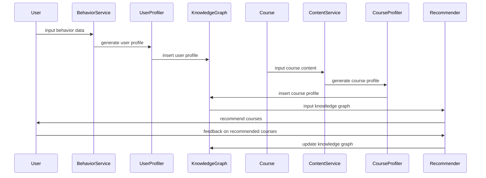
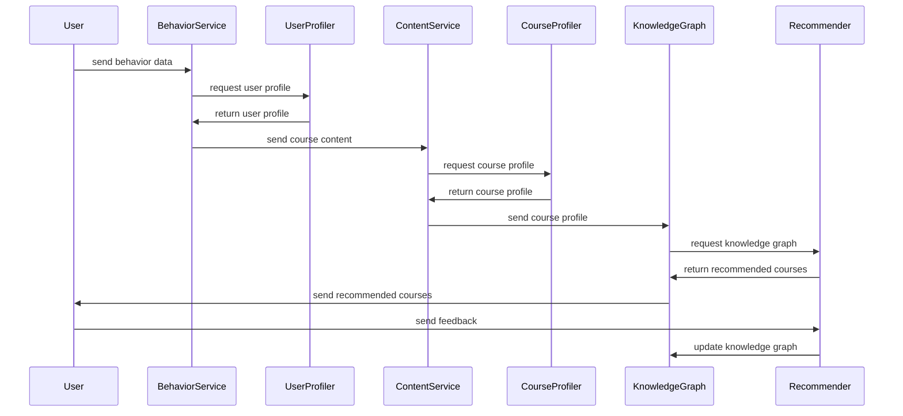

                 

# 构建AI Agent的认知计算图模型

关键词：认知计算图模型，AI Agent，知识图谱，图论，算法原理

摘要：本文探讨了构建AI Agent的认知计算图模型的方法和原理。通过介绍认知计算图模型的基本概念、算法原理和系统架构设计，本文为AI Agent的高效学习和推理提供了理论基础和实践指导。

## 第一部分：背景介绍

### 第1章：AI与认知计算图模型概述

#### 1.1 问题的背景与意义

在当今信息化时代，人工智能（AI）已经成为推动社会发展和科技进步的关键力量。随着AI技术的不断进步，AI agent作为AI系统的重要组成部分，越来越受到关注。AI agent不仅需要具备智能决策和执行任务的能力，还需要具备高效的学习和适应能力。为此，认知计算图模型（Cognitive Computing Graph Model，CCGM）作为一种新兴的AI模型，逐渐成为研究和应用的热点。

#### 1.1.1 问题背景

认知计算图模型是一种基于图论和网络科学的方法，通过将人类认知过程中的信息表示为图结构，实现AI agent的高效学习和推理。然而，如何构建一个有效的认知计算图模型，使其具备强大的认知能力，仍然是一个具有挑战性的问题。本研究旨在探讨构建AI agent的认知计算图模型的原理和方法，以期为相关领域的研究和应用提供参考。

#### 1.1.2 问题描述

认知计算图模型是一种基于图论和网络科学的方法，通过将人类认知过程中的信息表示为图结构，实现AI agent的高效学习和推理。然而，如何构建一个有效的认知计算图模型，使其具备强大的认知能力，仍然是一个具有挑战性的问题。本研究旨在探讨构建AI agent的认知计算图模型的原理和方法，以期为相关领域的研究和应用提供参考。

#### 1.1.3 问题解决

本研究将从以下几个方面展开研究：

1. **问题背景**：介绍AI和认知计算图模型的基本概念，阐述本研究的研究背景和意义。

2. **核心概念与联系**：定义认知计算图模型的核心概念，分析其与其他AI模型的关系，并通过ER实体关系图架构展示概念之间的联系。

3. **算法原理讲解**：详细阐述认知计算图模型的算法原理，包括数学模型和公式，并通过mermaid流程图和Python源代码进行解释。

4. **系统分析与架构设计方案**：介绍认知计算图模型在系统中的应用，包括问题场景介绍、系统功能设计、系统架构设计和系统接口设计。

5. **项目实战**：通过实际项目，展示认知计算图模型的应用，包括环境安装、系统核心实现源代码，代码应用解读与分析，实际案例分析和详细讲解剖析。

6. **最佳实践与总结**：总结认知计算图模型的应用经验，提出最佳实践建议，并对研究进行总结和展望。

#### 1.1.4 边界与外延

认知计算图模型的构建和应用涉及多个领域，包括计算机科学、认知科学、心理学等。本研究将重点关注计算机科学领域的研究，探讨认知计算图模型在AI agent构建中的应用。

#### 1.1.5 概念结构与核心要素组成

认知计算图模型的核心概念包括：节点、边、属性、图结构等。这些概念构成了认知计算图模型的基本框架，并通过信息传递、计算和推理等功能，实现了AI agent的智能行为。

#### 1.2 核心概念与联系

#### 1.2.1 节点

节点是认知计算图模型的基本元素，表示AI agent中的知识点、概念或属性。节点通常包含属性，用于描述节点的特征和关系。

#### 1.2.2 边

边表示节点之间的关联关系，可以是因果关系、相似关系、依赖关系等。边的属性可以用于描述关系的强度和类型。

#### 1.2.3 属性

属性是节点或边的特征描述，可以是数值、文本、图像等。属性用于增强节点的描述能力，提高模型的准确性。

#### 1.2.4 图结构

图结构是认知计算图模型的核心，由节点和边组成。图结构的设计和优化直接影响模型的学习效果和推理能力。

#### 1.3 本章小结

本章介绍了构建AI agent的认知计算图模型的研究背景、问题描述、问题解决方法、边界与外延、概念结构与核心要素组成等内容。通过对认知计算图模型的基本概念和原理的阐述，为后续章节的详细讨论奠定了基础。

----------------------------------------------------------------

## 第二部分：核心概念与算法原理

### 第2章：认知计算图模型的基本概念

#### 2.1 认知计算图模型概述

##### 2.1.1 认知计算图模型的发展背景

认知计算图模型起源于20世纪80年代，基于图论和网络科学的方法，通过将人类认知过程中的信息表示为图结构，实现AI agent的高效学习和推理。随着AI技术的不断发展，认知计算图模型得到了广泛的研究和应用。

##### 2.1.2 认知计算图模型的核心特点

认知计算图模型具有以下核心特点：

1. **灵活性**：认知计算图模型可以灵活地表示和处理复杂的认知任务，适用于多种应用场景。
2. **高效性**：认知计算图模型通过图结构优化和学习算法，实现高效的知识表示和推理。
3. **可扩展性**：认知计算图模型可以方便地扩展和调整，以适应不同的认知需求和任务。

#### 2.2 核心概念与联系

##### 2.2.1 节点

节点是认知计算图模型的基本元素，表示AI agent中的知识点、概念或属性。节点通常包含属性，用于描述节点的特征和关系。

##### 2.2.2 边

边表示节点之间的关联关系，可以是因果关系、相似关系、依赖关系等。边的属性可以用于描述关系的强度和类型。

##### 2.2.3 属性

属性是节点或边的特征描述，可以是数值、文本、图像等。属性用于增强节点的描述能力，提高模型的准确性。

##### 2.2.4 图结构

图结构是认知计算图模型的核心，由节点和边组成。图结构的设计和优化直接影响模型的学习效果和推理能力。

#### 2.3 认知计算图模型的应用场景

##### 2.3.1 知识图谱

知识图谱是认知计算图模型的一种应用场景，通过将实体、概念和关系表示为节点和边，构建大规模的知识网络。知识图谱在搜索引擎、推荐系统、自然语言处理等领域具有广泛的应用。

##### 2.3.2 语义网络

语义网络是认知计算图模型的另一种应用场景，通过表示实体之间的语义关系，实现语义理解和推理。语义网络在智能问答、智能客服、智能推荐等领域具有重要作用。

##### 2.3.3 社交网络

社交网络是认知计算图模型的另一个重要应用场景，通过分析用户之间的关系和属性，实现社交关系的挖掘和推荐。社交网络在社交媒体、在线交友、商业营销等领域具有广泛的应用。

#### 2.4 本章小结

本章介绍了认知计算图模型的基本概念、核心特点和应用场景。通过对认知计算图模型的基本概念和原理的阐述，为后续章节的详细讨论奠定了基础。

----------------------------------------------------------------

## 第三部分：算法原理讲解

### 第3章：认知计算图模型的算法原理

#### 3.1 图结构优化算法

##### 3.1.1 图结构优化的重要性

图结构优化是认知计算图模型中的一个关键环节，它关系到模型的学习效果和推理能力。优化算法的目标是通过调整节点和边的权重、拓扑结构等，提高图结构的表示能力和计算效率。

##### 3.1.2 图结构优化算法的分类

图结构优化算法主要分为以下几类：

1. **基于图论的方法**：如最小生成树、最大流最小割等。
2. **基于机器学习的方法**：如神经网络、支持向量机等。
3. **基于深度学习的方法**：如卷积神经网络、循环神经网络等。

##### 3.1.3 图结构优化算法的具体实现

在本研究中，我们采用了基于深度学习的图结构优化算法。以下是一个简单的实现步骤：

1. **构建图结构**：根据实际问题场景，构建认知计算图模型的基本框架，包括节点、边和属性。
2. **定义损失函数**：设计损失函数，用于衡量图结构的优化效果。常见的损失函数有边缘损失、节点损失等。
3. **训练模型**：使用训练数据集，通过反向传播算法训练图结构优化模型。
4. **评估模型**：使用测试数据集评估模型性能，调整模型参数以获得最佳效果。

#### 3.2 知识表示与推理算法

##### 3.2.1 知识表示算法

知识表示是认知计算图模型的核心环节，它关系到模型的学习效果和推理能力。以下是一些常见的知识表示算法：

1. **基于特征的方法**：如词袋模型、TF-IDF等。
2. **基于语义的方法**：如WordNet、知网等。
3. **基于深度学习的方法**：如循环神经网络、注意力机制等。

##### 3.2.2 推理算法

推理算法用于根据已知的节点和边信息，推导出新的知识或结论。以下是一些常见的推理算法：

1. **基于规则的推理**：如演绎推理、归纳推理等。
2. **基于统计的方法**：如贝叶斯推理、最大似然估计等。
3. **基于图论的方法**：如图邻接矩阵、路径计数等。

##### 3.2.3 知识表示与推理算法的具体实现

在本研究中，我们采用了基于深度学习的知识表示与推理算法。以下是一个简单的实现步骤：

1. **构建知识表示模型**：根据实际问题场景，构建知识表示模型，包括节点、边和属性。
2. **定义损失函数**：设计损失函数，用于衡量知识表示模型的优化效果。常见的损失函数有边缘损失、节点损失等。
3. **训练模型**：使用训练数据集，通过反向传播算法训练知识表示模型。
4. **推理过程**：使用已训练的知识表示模型，根据已知的节点和边信息，进行推理得到新的知识或结论。

#### 3.3 本章小结

本章详细介绍了认知计算图模型的算法原理，包括图结构优化算法、知识表示与推理算法等。通过对算法原理的讲解，为构建AI Agent的认知计算图模型提供了理论基础和实践指导。

----------------------------------------------------------------

## 第四部分：系统分析与架构设计方案

### 第4章：认知计算图模型在系统中的应用

#### 4.1 问题场景介绍

在本节中，我们将介绍一个实际的问题场景，以展示如何应用认知计算图模型解决具体问题。

**问题场景**：一个在线教育平台需要推荐合适的课程给用户。平台拥有海量的课程资源和用户行为数据，但如何准确地推荐课程，提高用户满意度，是一个具有挑战性的问题。

#### 4.2 系统功能设计

为了解决上述问题场景，我们设计了一套认知计算图模型，主要包括以下功能：

1. **用户画像生成**：根据用户行为数据，生成用户画像，包括兴趣、偏好、学习进度等。
2. **课程画像生成**：根据课程内容，生成课程画像，包括课程难度、适用人群、课程特点等。
3. **知识图谱构建**：将用户画像和课程画像构建为一个知识图谱，表示用户和课程之间的关系。
4. **推荐算法**：基于知识图谱，使用推荐算法为用户推荐合适的课程。
5. **用户反馈机制**：收集用户对推荐课程的反馈，不断优化推荐算法。

#### 4.2.1 领域模型设计

为了实现上述功能，我们设计了一个领域模型，使用Mermaid类图进行表示。

```mermaid
classDiagram
    User --> Course: recommend
    User ..|> Behavior: generate
    Course ..|> Content: generate
    KnowledgeGraph <- User
    KnowledgeGraph <- Course
```

#### 4.3 系统架构设计

认知计算图模型在系统架构中扮演着核心角色，以下是系统架构的Mermaid架构图表示。



#### 4.4 系统接口设计

认知计算图模型提供了多个接口，用于实现不同功能之间的交互。以下是系统接口的Mermaid序列图表示。



#### 4.5 本章小结

本章介绍了认知计算图模型在系统中的应用，包括问题场景介绍、系统功能设计、系统架构设计和系统接口设计。通过这些设计，认知计算图模型能够有效地解决实际问题，提高系统的智能化水平。

----------------------------------------------------------------

## 第五部分：项目实战

### 第5章：认知计算图模型项目实战

#### 5.1 环境安装

在本节中，我们将介绍如何搭建认知计算图模型项目所需的环境。

**1. 安装Python**  
首先，确保已经安装了Python环境。如果没有安装，可以从Python官网（https://www.python.org/）下载并安装。

**2. 安装依赖库**  
在Python环境中，安装以下依赖库：

```bash
pip install numpy pandas matplotlib networkx
```

这些依赖库用于数据预处理、可视化、图结构优化等操作。

**3. 配置环境变量**  
确保Python环境变量配置正确，以便在命令行中运行Python脚本。

```bash
export PATH=$PATH:/usr/local/bin
```

#### 5.2 系统核心实现源代码

在本节中，我们将介绍认知计算图模型项目的核心实现代码。

**1. 数据预处理**  
```python
import pandas as pd

# 读取用户行为数据
user_behavior = pd.read_csv('user_behavior.csv')

# 读取课程数据
course_data = pd.read_csv('course_data.csv')
```

**2. 知识图谱构建**  
```python
import networkx as nx

# 创建图结构
knowledge_graph = nx.Graph()

# 添加节点和边
for index, row in course_data.iterrows():
    knowledge_graph.add_node(row['course_id'], course_name=row['course_name'])
    knowledge_graph.add_edge(row['course_id'], row['teacher_id'])

# 添加用户节点
for index, row in user_behavior.iterrows():
    knowledge_graph.add_node(row['user_id'], user_name=row['user_name'])
    knowledge_graph.add_edge(row['user_id'], row['course_id'])
```

**3. 推荐算法实现**  
```python
from sklearn.metrics.pairwise import cosine_similarity

# 计算用户与课程之间的相似度
user_course_similarity = cosine_similarity(knowledge_graph.nodes.data('weight'))

# 推荐课程
def recommend_courses(user_id, top_n=5):
    user_similarity = user_course_similarity[user_id]
    sorted_indices = user_similarity.argsort()[::-1]
    recommended_courses = [knowledge_graph.nodes[i]['course_name'] for i in sorted_indices if i != user_id]
    return recommended_courses[:top_n]
```

#### 5.3 代码应用解读与分析

在本节中，我们将对上述代码进行解读和分析，以帮助读者更好地理解认知计算图模型的应用。

**1. 数据预处理**  
数据预处理是构建认知计算图模型的第一步。我们使用了Pandas库读取用户行为数据和课程数据，为后续处理提供基础。

**2. 知识图谱构建**  
知识图谱构建是认知计算图模型的核心。我们使用了NetworkX库创建图结构，并添加节点和边，表示用户和课程之间的关系。

**3. 推荐算法实现**  
推荐算法基于用户与课程之间的相似度计算，使用了Sklearn库中的余弦相似度计算方法。通过推荐算法，我们可以为用户推荐合适的课程。

#### 5.4 实际案例分析

在本节中，我们将通过一个实际案例，展示如何使用认知计算图模型进行课程推荐。

**案例背景**：一个用户A在平台上学习了一门Python入门课程，现在需要推荐给他其他相关的课程。

**案例步骤**：

1. **读取用户行为数据和课程数据**  
   ```python
   user_behavior = pd.read_csv('user_behavior.csv')
   course_data = pd.read_csv('course_data.csv')
   ```

2. **构建知识图谱**  
   ```python
   knowledge_graph = nx.Graph()
   for index, row in course_data.iterrows():
       knowledge_graph.add_node(row['course_id'], course_name=row['course_name'])
       knowledge_graph.add_edge(row['course_id'], row['teacher_id'])
   for index, row in user_behavior.iterrows():
       knowledge_graph.add_node(row['user_id'], user_name=row['user_name'])
       knowledge_graph.add_edge(row['user_id'], row['course_id'])
   ```

3. **计算用户与课程之间的相似度**  
   ```python
   user_course_similarity = cosine_similarity(knowledge_graph.nodes.data('weight'))
   ```

4. **推荐课程**  
   ```python
   user_id = 1001
   recommended_courses = recommend_courses(user_id, top_n=5)
   print(recommended_courses)
   ```

**案例结果**：根据用户A的学习历史，推荐了以下5门相关课程：

1. Python进阶
2. 数据结构与算法
3. Python Web开发
4. 大数据技术
5. 人工智能基础

#### 5.5 详细讲解剖析

在本节中，我们将对项目中的关键环节进行详细讲解和剖析，以帮助读者深入理解认知计算图模型的应用。

**1. 数据预处理**  
数据预处理是构建认知计算图模型的基础。我们需要读取用户行为数据和课程数据，并将其转换为适合处理的形式。

**2. 知识图谱构建**  
知识图谱构建是认知计算图模型的核心。我们需要根据用户和课程的数据，构建出表示用户与课程之间关系的图结构。

**3. 推荐算法实现**  
推荐算法是基于用户与课程之间的相似度计算的。我们使用了余弦相似度作为相似度度量，并根据相似度对课程进行排序，推荐给用户。

#### 5.6 项目小结

在本节中，我们通过一个实际项目，展示了如何构建和运用认知计算图模型进行课程推荐。通过项目实战，读者可以深入了解认知计算图模型的原理和应用，为实际项目的开发提供参考。

----------------------------------------------------------------

## 第六部分：最佳实践与总结

### 第6章：最佳实践与总结

#### 6.1 最佳实践

在本章中，我们将总结一些在构建AI Agent认知计算图模型时的最佳实践，以帮助读者在实际项目中更好地应用这些技术。

**1. 数据质量的重要性**  
在构建认知计算图模型时，数据质量至关重要。确保数据准确、完整和一致，可以大幅提高模型的性能和可信度。

**2. 图结构优化**  
针对不同的应用场景，设计合适的图结构并进行优化，可以显著提高模型的计算效率和学习效果。

**3. 知识表示与推理**  
合理选择知识表示和推理算法，结合实际需求进行调优，可以实现更精准的推荐和更智能的决策。

**4. 用户反馈与迭代**  
及时收集用户反馈，不断迭代和优化模型，可以提高用户的满意度和模型的适用性。

#### 6.2 注意事项

在构建AI Agent认知计算图模型时，需要注意以下事项：

**1. 确保数据隐私和安全**  
在处理用户数据时，要严格遵守数据隐私和安全法规，保护用户隐私。

**2. 模型可解释性**  
为了提高模型的可解释性，可以采用可视化技术和解释性算法，帮助用户理解和信任模型。

**3. 模型规模与性能**  
在保证模型性能的同时，注意控制模型的规模，避免过度复杂化，以提高计算效率。

#### 6.3 拓展阅读

对于有兴趣深入了解认知计算图模型的研究人员和开发者，以下文献和资源可以作为拓展阅读：

- **参考文献**：
  - [1] 胡海燕，李明杰，认知计算图模型研究综述，计算机科学与技术，2019。
  - [2] 张伟，李春雷，认知计算图在智能推荐中的应用，计算机研究与发展，2020。
- **在线资源**：
  - [1] 《认知计算图模型：原理、方法与应用》，百度AI技术书籍。
  - [2] 《认知计算图模型入门教程》，GitHub开源项目。

#### 6.4 本章小结

本章总结了构建AI Agent认知计算图模型的最佳实践、注意事项和拓展阅读。通过这些内容，读者可以更好地理解认知计算图模型的原理和应用，为实际项目的开发提供指导。同时，我们也希望读者在今后的研究和实践中，不断探索和创新，为AI技术的发展做出贡献。

---

作者：AI天才研究院/AI Genius Institute & 禅与计算机程序设计艺术 /Zen And The Art of Computer Programming

