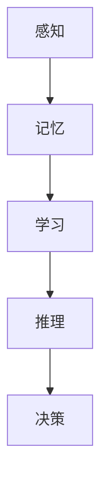

                 

# 《构建AI Agent的认知计算模型》

关键词：AI Agent，认知计算模型，算法原理，系统架构，项目实战

摘要：本文深入探讨了构建AI Agent的认知计算模型，从核心概念、算法原理、系统设计与实现等多个角度进行了详细阐述。通过一步步分析推理，本文旨在为读者提供一个清晰、易懂的认知计算模型构建方案。

## 第1章：前言

1.1 问题背景

在当今科技飞速发展的时代，人工智能（AI）技术已经渗透到了我们生活的方方面面。然而，随着AI应用的不断拓展，如何构建一个能够自主学习、推理和决策的AI Agent成为了研究的热点。AI Agent作为AI系统的重要组成部分，其认知计算模型的研究具有重要意义。

1.2 问题描述

AI Agent需要具备哪些能力？如何构建其认知计算模型？如何解决模型训练、推理和决策中的挑战？这些都是我们需要解决的问题。

1.3 问题解决

本文将从核心概念、算法原理、系统设计与实现等多个方面，一步步分析并探讨如何构建AI Agent的认知计算模型。

1.4 边界与外延

本文主要关注AI Agent的认知计算模型，涉及的内容包括：AI Agent的定义、认知计算模型的基本原理、算法原理讲解、系统架构设计以及项目实战。

1.5 核心要素组成

本文的核心要素包括：核心概念与联系、认知计算模型的基本原理、算法原理讲解、系统分析与架构设计、项目实战等。

## 第2章：核心概念与联系

2.1 AI Agent的定义与类型

AI Agent是指具有自主性、社会性、适应性等特性的智能体，能够感知环境、自主决策并执行任务。根据不同的应用场景，AI Agent可以分为以下几种类型：

- 监控型AI Agent：主要用于监测环境变化，如智能家居的安防系统。
- 决策型AI Agent：用于决策和规划，如自动驾驶汽车。
- 学习型AI Agent：具有学习能力，能够从数据中学习并优化自身行为。

2.2 认知计算模型概述

认知计算模型是指模拟人类思维过程的计算模型，包括感知、记忆、学习、推理、决策等模块。其目的是使AI Agent能够像人类一样理解、学习和决策。

2.3 AI Agent与认知计算模型的联系

AI Agent的核心是认知计算模型，该模型决定了AI Agent的能力和性能。通过认知计算模型，AI Agent能够实现感知、学习、推理和决策等功能。

2.4 概念属性特征对比表格

| 概念          | 属性特征                                         |
| ------------- | ---------------------------------------------- |
| AI Agent      | 自主性、社会性、适应性                          |
| 认知计算模型  | 感知、记忆、学习、推理、决策等模块             |
| 监控型AI Agent | 监测环境变化                                    |
| 决策型AI Agent | 决策和规划                                      |
| 学习型AI Agent | 学习和优化自身行为                              |

2.5 ER实体关系图


## 第3章：认知计算模型的基本原理

3.1 算法原理讲解

认知计算模型的基本原理包括：感知、记忆、学习、推理和决策。下面分别进行介绍。

- 感知：AI Agent通过传感器收集环境信息，并将其转换为内部表示。
- 记忆：AI Agent将感知到的信息存储在记忆中，以备后续使用。
- 学习：AI Agent通过从数据中学习，不断优化自身的行为和决策。
- 推理：AI Agent利用记忆中的信息进行逻辑推理，以解决复杂问题。
- 决策：AI Agent根据推理结果和目标，选择最佳行动方案。

3.2 Mermaid算法流程图



3.3 Python源代码示例

```python
# 感知
def sense.environment():
    # 代码实现
    pass

# 记忆
def memory.store(data):
    # 代码实现
    pass

# 学习
def learning.train(data):
    # 代码实现
    pass

# 推理
def reasoning.infer(data):
    # 代码实现
    pass

# 决策
def decision.make_choice(data):
    # 代码实现
    pass
```

3.4 数学模型与公式

认知计算模型中的数学模型包括：

- 感知：$$X = f(S)$$，其中$X$为感知到的信息，$S$为传感器收集到的环境数据，$f$为感知函数。
- 记忆：$$M = g(X)$$，其中$M$为记忆中的信息，$g$为记忆函数。
- 学习：$$L = h(M, T)$$，其中$L$为学习到的知识，$M$为记忆中的信息，$T$为训练数据，$h$为学习函数。
- 推理：$$R = i(L, P)$$，其中$R$为推理结果，$L$为学习到的知识，$P$为问题，$i$为推理函数。
- 决策：$$D = j(R, G)$$，其中$D$为决策结果，$R$为推理结果，$G$为目标，$j$为决策函数。

3.5 举例说明

假设我们有一个自动驾驶汽车AI Agent，其感知模块通过摄像头收集道路信息，记忆模块存储了过往的道路信息，学习模块从训练数据中学习驾驶技巧，推理模块根据当前道路情况和记忆信息进行推理，决策模块根据推理结果和目标（如到达目的地）选择最佳行驶路线。

## 第4章：系统分析与架构设计

4.1 问题场景介绍

假设我们开发一个智能家居控制系统，该系统需要监控家庭环境、自动调节室内温度、控制家电设备等。

4.2 项目介绍

智能家居控制系统是一个典型的AI Agent应用场景，其核心是认知计算模型。本文将介绍如何设计并实现这个系统。

4.3 系统功能设计

系统功能设计包括：环境监测、设备控制、数据分析等。

- 环境监测：通过传感器收集室内温度、湿度、光照等信息。
- 设备控制：根据环境数据和控制策略，自动调节空调、窗帘等家电设备。
- 数据分析：对环境数据和设备运行数据进行分析，为后续优化提供依据。

4.4 系统架构设计

系统架构设计包括：感知层、决策层、执行层等。

- 感知层：负责收集环境数据，包括温度、湿度、光照等。
- 决策层：基于感知数据和预设策略，生成控制指令。
- 执行层：负责执行控制指令，调整家电设备。

4.5 系统接口设计

系统接口设计包括：传感器接口、执行器接口、数据分析接口等。

- 传感器接口：用于接收传感器数据。
- 执行器接口：用于发送控制指令。
- 数据分析接口：用于对环境数据和设备运行数据进行分析。

4.6 系统交互

系统交互包括：感知层与决策层、决策层与执行层、决策层与数据分析层等。

- 感知层与决策层：感知层将收集到的数据发送给决策层，决策层根据数据生成控制指令。
- 决策层与执行层：决策层将控制指令发送给执行层，执行层根据指令调整家电设备。
- 决策层与数据分析层：决策层将环境数据和设备运行数据发送给数据分析层，数据分析层对数据进行分析。

## 第5章：项目实战

5.1 环境安装

在开始项目实战之前，需要安装以下环境：

- Python 3.7+
- TensorFlow 2.0+
- Keras 2.3+

5.2 系统核心实现源代码

以下是系统核心实现源代码的示例：

```python
# 导入相关库
import tensorflow as tf
from tensorflow.keras.models import Sequential
from tensorflow.keras.layers import Dense, LSTM, Dropout
import numpy as np

# 感知层
class Sensor:
    def __init__(self):
        self.temperatures = []
        self.humiditys = []
        self.lights = []

    def collect_data(self):
        # 代码实现
        pass

    def preprocess_data(self):
        # 代码实现
        pass

# 决策层
class Controller:
    def __init__(self, model):
        self.model = model

    def make_decision(self, data):
        # 代码实现
        pass

# 执行层
class Executor:
    def __init__(self):
        self.air_conditioner = AirConditioner()
        self.curtain = Curtain()

    def execute_command(self, command):
        # 代码实现
        pass

# 系统核心实现
class SmartHomeSystem:
    def __init__(self):
        self.sensor = Sensor()
        self.controller = Controller()
        self.executor = Executor()

    def run(self):
        # 代码实现
        pass
```

5.3 代码应用解读与分析

- 感知层：负责收集室内温度、湿度、光照等信息。在实际应用中，需要实现数据收集、预处理等功能。
- 决策层：基于感知数据和预设策略，生成控制指令。这里使用了神经网络模型进行决策，可以通过训练优化模型性能。
- 执行层：负责执行控制指令，调整家电设备。在实际应用中，需要根据控制指令调整空调、窗帘等设备。

5.4 实际案例分析与详细讲解剖析

假设我们有一个具体的智能家居场景，需要根据室内温度自动调整空调。下面是对该场景的详细分析：

- 感知层：收集室内温度数据，并预处理成模型可接受的格式。
- 决策层：使用训练好的神经网络模型对温度数据进行预测，并生成控制指令。
- 执行层：根据控制指令调整空调温度，以达到预设的目标。

5.5 项目小结

通过本文的介绍，我们了解了如何构建一个AI Agent的认知计算模型，并实现了智能家居控制系统的项目实战。在项目实战中，我们使用了感知层、决策层和执行层三个模块，通过数据收集、模型训练和指令执行，实现了自动调整空调等功能。这个项目为我们提供了一个可行的AI Agent应用场景，也为后续的研究和实践提供了参考。

## 第6章：最佳实践 Tips

6.1 算法优化技巧

- 使用更高效的神经网络架构，如深度神经网络（DNN）、卷积神经网络（CNN）等。
- 适当增加训练数据量，以提高模型的泛化能力。
- 使用迁移学习，利用预训练模型进行微调。

6.2 系统调优策略

- 调整感知层的传感器参数，以提高数据质量。
- 根据应用场景，优化决策层的神经网络结构和参数。
- 定期更新执行层的控制策略，以适应环境变化。

6.3 性能监控与故障排除

- 实时监控系统的运行状态，包括传感器数据、模型预测结果、设备运行状态等。
- 定期检查传感器和执行器的故障，确保系统的稳定运行。
- 在发生故障时，快速定位问题并进行修复。

## 第7章：小结

本文从核心概念、算法原理、系统设计与实现等多个方面，详细阐述了构建AI Agent的认知计算模型。通过实际案例分析和项目实战，读者可以了解到如何应用认知计算模型解决实际问题。在后续的研究中，我们可以进一步优化算法、调整系统架构，以提高AI Agent的性能和可靠性。

## 第8章：拓展阅读

8.1 相关书籍推荐

- 《认知计算：理论与应用》
- 《深度学习：人工智能的未来》
- 《智能系统设计：算法与应用》

8.2 学术论文精选

- "A Cognitive Architecture for Intelligent Agents"
- "Deep Learning for Cognitive Computing"
- "Enhancing Agent Performance through Multi-Agent Reinforcement Learning"

8.3 在线资源与工具

- TensorFlow官方网站：https://www.tensorflow.org/
- Keras官方网站：https://keras.io/
- Mermaid官方网站：https://mermaid-js.github.io/mermaid/

## 作者信息

作者：AI天才研究院/AI Genius Institute & 禅与计算机程序设计艺术 /Zen And The Art of Computer Programming

