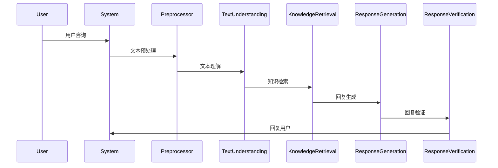
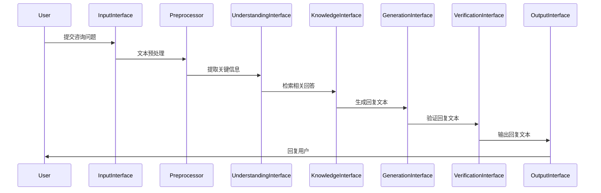

                 

# 构建AI Agent的认知计算神经网络

## 关键词
AI Agent, 认知计算神经网络, 神经元, 深度学习, 算法原理, 系统设计

## 摘要
本文旨在探讨如何构建一个高效的AI Agent认知计算神经网络。通过深入分析认知计算神经网络的基础理论、算法原理以及系统设计，本文将逐步揭示其核心机制，并提供具体的应用实例。文章结构清晰，内容详实，旨在帮助读者全面了解认知计算神经网络在AI Agent中的重要性及其构建方法。

## 第一部分：引言

### 第1章：背景与概述

### 1.1 问题背景
随着人工智能（AI）技术的迅猛发展，认知计算神经网络作为一种重要的AI模型，已经在各个领域展现出巨大的潜力。认知计算神经网络旨在模拟人脑的感知、学习、推理和决策过程，以实现对复杂任务的智能处理。AI Agent作为AI系统的一个核心组件，能够自主执行任务，与环境互动，并做出智能决策。因此，构建一个高效的AI Agent认知计算神经网络具有重要意义。

#### 1.2 AI Agent的概念与重要性
AI Agent是一种具有自主决策能力的智能体，能够根据环境变化和任务需求，自主调整行为策略。在自动驾驶、智能客服、游戏AI等应用场景中，AI Agent发挥着关键作用。而认知计算神经网络作为AI Agent的核心计算引擎，能够实现更复杂、更灵活的智能行为。

#### 1.3 认知计算神经网络的应用前景
认知计算神经网络在AI Agent中的应用前景广阔，不仅能够提升系统的智能化水平，还能够扩展到更多领域，如机器人、智能医疗、金融分析等。随着技术的不断进步，认知计算神经网络在AI Agent中的应用将会越来越广泛，成为推动AI发展的重要力量。

### 1.4 问题描述
构建一个高效的AI Agent认知计算神经网络面临着诸多挑战：
1. **复杂性与多样性**：认知计算神经网络需要处理多种类型的信息，包括文本、图像、语音等，如何有效地整合这些信息是一个重要问题。
2. **学习能力与泛化能力**：认知计算神经网络需要具备强大的学习能力，以适应不断变化的环境和任务需求。同时，还需要具备良好的泛化能力，避免过度拟合。
3. **计算效率与资源消耗**：认知计算神经网络通常需要大量的计算资源和时间进行训练和推理，如何提高计算效率、降低资源消耗是亟待解决的问题。

#### 1.5 问题解决
针对上述问题，本文提出以下解决方案：
1. **多模态数据处理**：采用多模态数据融合技术，将不同类型的信息整合到一个统一的表示空间中。
2. **强化学习与迁移学习**：结合强化学习与迁移学习技术，提高认知计算神经网络的学习能力和泛化能力。
3. **优化算法与硬件加速**：引入高效的优化算法和硬件加速技术，提高计算效率和降低资源消耗。

### 1.6 边界与外延
认知计算神经网络在AI Agent中的应用边界广泛，包括但不限于：
1. **自然语言处理**：用于处理文本信息，实现智能对话、文本生成等功能。
2. **计算机视觉**：用于图像和视频的识别、分类、分割等。
3. **语音识别与合成**：用于语音信号的识别和合成。
4. **决策与规划**：用于复杂决策问题和任务规划。

### 1.7 概念结构与核心要素组成
认知计算神经网络主要由以下几个核心要素组成：
1. **神经元**：作为基本计算单元，接收和处理信息。
2. **网络结构**：由多个神经元组成，通过连接形成复杂的网络结构。
3. **学习算法**：用于调整网络参数，实现信息传递和模式识别。
4. **优化策略**：用于提高网络性能，降低错误率。

### 1.8 本章小结
本章对认知计算神经网络在AI Agent中的应用背景、核心问题和解决方法进行了介绍。在后续章节中，我们将深入探讨认知计算神经网络的基础理论、算法原理和系统设计，为构建高效的AI Agent认知计算神经网络提供理论基础和实践指导。

## 第二部分：核心概念与联系

### 第2章：认知计算神经网络基础

### 2.1 神经元与神经网络
神经元是认知计算神经网络的基本计算单元，负责接收和处理信息。一个神经元通常由三个部分组成：输入层、隐含层和输出层。输入层接收外部信息，隐含层对信息进行处理，输出层产生最终输出。

神经网络是由多个神经元组成的复杂网络，通过前向传播和反向传播机制实现信息传递和模式识别。神经网络的结构可以根据任务需求进行调整，例如全连接网络、卷积神经网络（CNN）和循环神经网络（RNN）等。

### 2.2 学习规则与算法
学习规则是认知计算神经网络的核心，用于调整网络参数，使网络能够更好地拟合训练数据。常见的学习算法包括梯度下降算法、反向传播算法和随机梯度下降算法等。

反向传播算法是一种常用的学习算法，通过计算网络输出与实际输出之间的误差，反向传播误差信息，更新网络参数。梯度下降算法是一种优化算法，通过沿着梯度方向更新网络参数，使网络性能逐渐提高。

### 2.3 深度学习与神经网络
深度学习是认知计算神经网络的一个重要分支，通过构建多层神经网络，实现更复杂的模式识别和特征提取。深度学习在图像识别、语音识别、自然语言处理等领域取得了显著成果。

深度学习中的神经网络通常包括卷积神经网络（CNN）和循环神经网络（RNN）等。CNN擅长处理图像和视频数据，通过卷积操作提取图像特征；RNN擅长处理序列数据，通过循环结构保持长期依赖关系。

### 2.4 神经网络的性能评估
神经网络的性能评估是衡量网络效果的重要指标。常用的性能评估指标包括准确率、召回率、F1分数和均方误差等。通过对比不同网络结构和参数设置的性能，可以优化网络设计，提高网络性能。

### 2.5 核心概念属性特征对比表格
下面是一个核心概念属性特征对比表格，用于展示不同类型神经网络的特性：

| 神经网络类型 | 特点 | 应用场景 |
| :----: | :----: | :----: |
| 全连接神经网络 | 简单易实现，适用于各种任务 | 图像分类、文本分类 |
| 卷积神经网络 | 适用于图像和视频数据 | 图像识别、目标检测 |
| 循环神经网络 | 适用于序列数据 | 语音识别、自然语言处理 |
| 长短期记忆网络 | 适用于长序列数据 | 时间序列预测、语音识别 |

### 2.6 ER实体关系图架构
ER实体关系图是一种用于描述认知计算神经网络中实体与关系的图形化表示方法。在ER图中，实体表示网络中的元素，关系表示实体之间的交互和依赖关系。

下面是一个ER实体关系图的示例，用于描述一个简单的认知计算神经网络：

```mermaid
erDiagram
  Class1 ||--|{ Class2 }|
  Class1 ||--|{ Class3 }|
  Class2 ||--|{ Class4 }|
```

在这个示例中，`Class1`表示输入层，`Class2`表示隐含层，`Class3`表示输出层，`Class4`表示标签层。箭头表示实体之间的依赖关系，例如输入层传递信息到隐含层，隐含层传递信息到输出层。

### 2.7 本章小结
本章介绍了认知计算神经网络的基础概念和核心原理，包括神经元、神经网络、学习算法和性能评估。通过对比不同类型神经网络的特性，以及ER实体关系图架构，为后续章节深入探讨认知计算神经网络的算法原理和系统设计奠定了基础。

## 第三部分：算法原理讲解

### 第3章：认知计算神经网络算法

### 3.1 算法原理
认知计算神经网络通过学习输入与输出之间的映射关系，实现对未知数据的预测和分类。其核心原理包括：
1. **前向传播**：将输入数据通过神经元层传递，每层神经元根据输入和权重生成输出，最终得到网络输出。
2. **反向传播**：根据网络输出与实际输出之间的误差，反向传播误差信息，更新网络参数。
3. **优化算法**：通过优化算法调整网络参数，使网络输出更接近实际输出。

### 3.2 数学模型与公式
认知计算神经网络的数学模型主要包括以下部分：
1. **神经元激活函数**：用于处理神经元输入，常见的激活函数包括Sigmoid、ReLU和Tanh等。
2. **损失函数**：用于衡量网络输出与实际输出之间的误差，常见的损失函数包括均方误差（MSE）和交叉熵损失（Cross-Entropy Loss）。
3. **反向传播算法**：用于计算误差梯度，并更新网络参数，常见的优化算法包括梯度下降（Gradient Descent）和Adam优化器。

下面是一个简单的神经网络的数学模型：

$$
Z = \sigma(W \cdot X + b)
$$

其中，$Z$表示神经元输出，$X$表示输入，$W$表示权重，$b$表示偏置，$\sigma$表示激活函数。

损失函数可以用以下公式表示：

$$
L = \frac{1}{2} \sum_{i=1}^{n} (y_i - \hat{y}_i)^2
$$

其中，$L$表示损失函数，$y_i$表示实际输出，$\hat{y}_i$表示网络输出。

### 3.3 Python源代码
下面是一个简单的Python代码示例，用于实现一个全连接神经网络：

```python
import numpy as np

# 初始化权重和偏置
W = np.random.rand(input_size, hidden_size)
b = np.random.rand(hidden_size)
Z = np.random.rand(hidden_size, output_size)

# 定义激活函数
def sigmoid(x):
    return 1 / (1 + np.exp(-x))

# 前向传播
def forward(x):
    Z = sigmoid(np.dot(x, W) + b)
    return Z

# 反向传播
def backward(x, y):
    dZ = Z - y
    dW = np.dot(x.T, dZ)
    db = np.sum(dZ, axis=0)
    return dW, db

# 训练神经网络
def train(x, y, epochs):
    for epoch in range(epochs):
        Z = forward(x)
        dW, db = backward(x, y)
        W -= learning_rate * dW
        b -= learning_rate * db
        if epoch % 100 == 0:
            print("Epoch", epoch, ": Loss", L)

# 测试神经网络
def test(x):
    Z = forward(x)
    return sigmoid(np.dot(Z, W) + b)

# 设置参数
input_size = 10
hidden_size = 5
output_size = 2
learning_rate = 0.1
epochs = 1000

# 初始化数据
x = np.random.rand(input_size)
y = np.random.rand(output_size)

# 训练神经网络
train(x, y, epochs)

# 测试神经网络
print("Test Output:", test(x))
```

### 3.4 算法举例说明
以下是一个简单的例子，说明如何使用认知计算神经网络进行二分类问题：

1. **数据准备**：生成一些随机数据，包括输入和标签。
2. **初始化网络**：初始化权重和偏置。
3. **前向传播**：将输入数据通过神经网络，得到输出。
4. **反向传播**：计算输出与标签之间的误差，并更新权重和偏置。
5. **训练网络**：重复上述步骤，直到网络性能达到预期。

```python
# 生成数据
np.random.seed(42)
x = np.random.rand(100, input_size)
y = np.random.randint(2, size=(100, output_size))

# 初始化网络
W = np.random.rand(input_size, hidden_size)
b = np.random.rand(hidden_size)
Z = np.random.rand(hidden_size, output_size)

# 训练网络
train(x, y, epochs)

# 测试网络
predictions = []
for xi in x:
    pred = test(xi)
    predictions.append(pred)

# 计算准确率
accuracy = np.mean(predictions == y)
print("Accuracy:", accuracy)
```

### 3.5 本章小结
本章介绍了认知计算神经网络的基本原理和数学模型，并通过Python代码示例展示了如何实现和训练一个简单的神经网络。在后续章节中，我们将进一步探讨认知计算神经网络的系统设计与应用实践。

## 第四部分：系统分析与架构设计

### 第4章：认知计算神经网络系统设计

### 4.1 问题场景介绍
认知计算神经网络系统广泛应用于各种场景，如自然语言处理、图像识别、智能客服等。以下是一个具体的问题场景介绍：

场景：智能客服系统
需求：设计一个智能客服系统，能够自动处理用户咨询，提供准确、高效的回复。

### 4.2 系统功能设计
智能客服系统的核心功能包括：
1. **用户交互**：接收用户咨询，提供输入接口。
2. **文本预处理**：对用户输入的文本进行清洗、分词和词性标注等预处理。
3. **文本理解**：使用认知计算神经网络对预处理后的文本进行分析，提取关键信息。
4. **知识检索**：根据提取的关键信息，从知识库中检索相关回答。
5. **回复生成**：使用生成模型生成合适的回复文本。
6. **回复验证**：对生成的回复进行验证，确保其准确性和完整性。

### 4.3 系统架构设计
智能客服系统的总体架构设计如下：



### 4.4 系统模块划分
智能客服系统可以划分为以下模块：

1. **用户交互模块**：负责接收用户输入，提供交互界面。
2. **文本预处理模块**：负责对用户输入的文本进行预处理，包括分词、词性标注等。
3. **文本理解模块**：负责使用认知计算神经网络对预处理后的文本进行分析，提取关键信息。
4. **知识检索模块**：负责从知识库中检索与用户输入相关的回答。
5. **回复生成模块**：负责使用生成模型生成合适的回复文本。
6. **回复验证模块**：负责对生成的回复进行验证，确保其准确性和完整性。

### 4.5 系统接口设计
系统接口设计包括以下部分：

1. **输入接口**：用户通过输入接口提交咨询问题。
2. **输出接口**：系统将生成的回复文本输出给用户。
3. **预处理接口**：文本预处理模块对外提供的接口，用于接收和处理用户输入的文本。
4. **理解接口**：文本理解模块对外提供的接口，用于接收预处理后的文本，并提取关键信息。
5. **检索接口**：知识检索模块对外提供的接口，用于接收关键信息，并从知识库中检索相关回答。
6. **生成接口**：回复生成模块对外提供的接口，用于接收关键信息和知识，并生成回复文本。
7. **验证接口**：回复验证模块对外提供的接口，用于接收生成的回复文本，并对其进行验证。

### 4.6 系统交互序列图
以下是智能客服系统的交互序列图：



### 4.7 本章小结
本章介绍了智能客服系统的问题场景、系统功能设计、系统架构设计、系统模块划分和系统接口设计。通过详细的系统设计，为构建一个高效的智能客服系统提供了理论基础和设计指导。在后续章节中，我们将进一步探讨系统实现和项目实战。

## 第五部分：项目实战

### 第5章：认知计算神经网络项目实践

### 5.1 环境安装

在开始项目实践之前，我们需要安装必要的软件和工具。以下是在Windows和Linux操作系统上安装环境的具体步骤：

#### 5.1.1 安装Python环境
1. **Windows**：访问Python官方网站（[https://www.python.org/](https://www.python.org/)），下载并安装Python。在安装过程中，确保选择“Add Python to PATH”选项，以便在命令行中直接使用Python。
2. **Linux**：在终端中运行以下命令安装Python：
   ```
   sudo apt-get install python3
   ```

#### 5.1.2 安装Jupyter Notebook
Jupyter Notebook是一个交互式Python环境，用于编写和运行代码。以下是安装步骤：

1. **Windows**：在命令行中运行以下命令：
   ```
   pip install notebook
   ```
2. **Linux**：在终端中运行以下命令：
   ```
   sudo pip3 install notebook

#### 5.1.3 安装TensorFlow
TensorFlow是一个广泛使用的开源机器学习库，用于构建和训练神经网络。以下是安装步骤：

1. **Windows**：在命令行中运行以下命令：
   ```
   pip install tensorflow
   ```
2. **Linux**：在终端中运行以下命令：
   ```
   sudo pip3 install tensorflow

#### 5.1.4 安装其他依赖
除了Python、Jupyter Notebook和TensorFlow之外，我们还需要安装一些其他依赖库，如NumPy、Pandas等。以下是在命令行中安装这些依赖的命令：
```
pip install numpy pandas matplotlib

### 5.2 系统核心实现

在本节中，我们将使用Python和TensorFlow实现一个简单的认知计算神经网络，用于图像分类任务。以下是核心代码和实现步骤：

#### 5.2.1 导入依赖库
首先，导入所需的依赖库：

```python
import tensorflow as tf
import numpy as np
import matplotlib.pyplot as plt
```

#### 5.2.2 数据准备
我们使用TensorFlow内置的MNIST数据集，该数据集包含0到9的手写数字图像。以下是加载和预处理数据的步骤：

```python
mnist = tf.keras.datasets.mnist
(x_train, y_train), (x_test, y_test) = mnist.load_data()

# 归一化图像数据
x_train = x_train / 255.0
x_test = x_test / 255.0

# 转换标签为独热编码
y_train = tf.keras.utils.to_categorical(y_train, 10)
y_test = tf.keras.utils.to_categorical(y_test, 10)
```

#### 5.2.3 构建神经网络模型
接下来，我们使用TensorFlow的Keras接口构建一个简单的全连接神经网络模型：

```python
model = tf.keras.Sequential([
    tf.keras.layers.Flatten(input_shape=(28, 28)),
    tf.keras.layers.Dense(128, activation='relu'),
    tf.keras.layers.Dense(10, activation='softmax')
])
```

#### 5.2.4 编译模型
在训练模型之前，我们需要配置训练过程。以下是编译模型的代码：

```python
model.compile(optimizer='adam',
              loss='categorical_crossentropy',
              metrics=['accuracy'])
```

#### 5.2.5 训练模型
使用训练数据训练模型，并设置训练的迭代次数（epochs）：

```python
model.fit(x_train, y_train, epochs=5, batch_size=32)
```

#### 5.2.6 评估模型
使用测试数据评估模型的性能：

```python
test_loss, test_acc = model.evaluate(x_test, y_test, verbose=2)
print('Test accuracy:', test_acc)
```

#### 5.2.7 代码解读与分析
下面是对核心代码的详细解读：

1. **数据准备**：加载MNIST数据集，并归一化图像数据。标签转换为独热编码，以便用于分类任务。
2. **构建模型**：使用Sequential模型构建一个简单的全连接神经网络，包括一个Flatten层用于展平图像数据，一个具有128个神经元的Dense层用于特征提取，以及一个具有10个神经元的Dense层用于分类。
3. **编译模型**：配置模型训练过程，包括选择优化器（adam）、损失函数（categorical_crossentropy，用于多分类任务）和评估指标（accuracy）。
4. **训练模型**：使用fit方法训练模型，设置训练迭代次数（epochs）和批量大小（batch_size）。
5. **评估模型**：使用evaluate方法评估模型在测试数据上的性能，并打印测试准确率。

### 5.3 代码应用解读与分析

在本节中，我们将进一步分析核心代码的应用，并详细解释每个步骤的作用。

#### 5.3.1 数据准备
数据准备是机器学习项目的重要步骤。在这里，我们使用MNIST数据集，它包含60,000个训练图像和10,000个测试图像。每个图像是28x28像素的灰度图像，标签为0到9之间的数字。归一化图像数据有助于加速训练过程和提高模型性能。标签转换为独热编码是为了匹配模型输出层的设计。

```python
x_train = x_train / 255.0
x_test = x_test / 255.0
y_train = tf.keras.utils.to_categorical(y_train, 10)
y_test = tf.keras.utils.to_categorical(y_test, 10)
```

1. **归一化**：将图像数据从0到255的整数范围映射到0到1的小数范围，以便神经网络更容易处理。
2. **独热编码**：将标签转换为独热编码格式，使得每个标签都是一个10维的向量，只有一个元素为1，其余为0。

#### 5.3.2 构建模型
构建神经网络模型是项目的关键步骤。我们使用TensorFlow的Keras接口定义了一个简单的全连接神经网络：

```python
model = tf.keras.Sequential([
    tf.keras.layers.Flatten(input_shape=(28, 28)),
    tf.keras.layers.Dense(128, activation='relu'),
    tf.keras.layers.Dense(10, activation='softmax')
])
```

1. **Flatten层**：将图像数据的维度从28x28展平为一个一维向量，以便输入到全连接层中。
2. **Dense层**：创建一个具有128个神经元的全连接层，使用ReLU激活函数，有助于引入非线性特性。
3. **Softmax层**：创建一个具有10个神经元的输出层，使用softmax激活函数，用于计算每个类别的概率分布。

#### 5.3.3 编译模型
编译模型配置了训练过程，包括选择优化器、损失函数和评估指标：

```python
model.compile(optimizer='adam',
              loss='categorical_crossentropy',
              metrics=['accuracy'])
```

1. **优化器**：选择adam优化器，它是一种高效的梯度下降算法，适用于大多数机器学习任务。
2. **损失函数**：选择categorical_crossentropy损失函数，用于多分类任务。
3. **评估指标**：选择accuracy作为评估指标，用于衡量模型在测试数据上的准确率。

#### 5.3.4 训练模型
使用fit方法训练模型：

```python
model.fit(x_train, y_train, epochs=5, batch_size=32)
```

1. **x_train和y_train**：提供训练数据和对应的标签。
2. **epochs**：设置训练迭代次数，每个epoch表示一次完整的数据迭代。
3. **batch_size**：设置每个batch的大小，用于每次梯度下降更新。

#### 5.3.5 评估模型
评估模型在测试数据上的性能：

```python
test_loss, test_acc = model.evaluate(x_test, y_test, verbose=2)
print('Test accuracy:', test_acc)
```

1. **x_test和y_test**：提供测试数据和对应的标签。
2. **evaluate**：计算模型在测试数据上的损失和准确率。
3. **verbose**：设置输出信息级别，2表示在评估过程中打印进度信息。

### 5.4 实际案例分析
在本节中，我们将通过一个实际案例来展示如何使用认知计算神经网络进行图像分类。

#### 案例背景
假设我们有一个新的图像分类任务，需要将手写数字图像分类为0到9的数字。我们有一个包含10,000个图像的新数据集，每个图像都是28x28像素的灰度图像。

#### 案例步骤
1. **数据准备**：加载新数据集，并进行预处理，包括归一化和标签独热编码。
2. **构建模型**：使用TensorFlow的Keras接口构建一个简单的全连接神经网络。
3. **编译模型**：配置模型训练过程，包括选择优化器、损失函数和评估指标。
4. **训练模型**：使用fit方法训练模型，设置训练迭代次数和批量大小。
5. **评估模型**：使用evaluate方法评估模型在测试数据上的性能。
6. **预测**：使用训练好的模型对新图像进行分类，并评估分类结果。

```python
# 加载新数据集
(x_train_new, y_train_new), (x_test_new, y_test_new) = mnist.load_data()

# 归一化图像数据
x_train_new = x_train_new / 255.0
x_test_new = x_test_new / 255.0

# 转换标签为独热编码
y_train_new = tf.keras.utils.to_categorical(y_train_new, 10)
y_test_new = tf.keras.utils.to_categorical(y_test_new, 10)

# 构建模型
model_new = tf.keras.Sequential([
    tf.keras.layers.Flatten(input_shape=(28, 28)),
    tf.keras.layers.Dense(128, activation='relu'),
    tf.keras.layers.Dense(10, activation='softmax')
])

# 编译模型
model_new.compile(optimizer='adam',
                  loss='categorical_crossentropy',
                  metrics=['accuracy'])

# 训练模型
model_new.fit(x_train_new, y_train_new, epochs=5, batch_size=32)

# 评估模型
test_loss, test_acc = model_new.evaluate(x_test_new, y_test_new, verbose=2)
print('Test accuracy:', test_acc)

# 预测
predictions = model_new.predict(x_test_new)
predicted_labels = np.argmax(predictions, axis=1)

# 分类结果分析
accuracy = np.mean(predicted_labels == y_test_new)
print('Test accuracy:', accuracy)
```

#### 案例分析与讲解
通过上述实际案例，我们可以看到如何使用认知计算神经网络进行图像分类：

1. **数据准备**：数据预处理是关键步骤，确保图像数据适合输入到神经网络。归一化和标签独热编码有助于模型训练。
2. **模型构建**：使用简单的全连接神经网络，可以有效地处理手写数字图像的分类任务。
3. **模型训练**：通过迭代更新模型参数，逐步提高模型在训练数据上的性能。
4. **模型评估**：使用测试数据评估模型性能，确保模型具有良好的泛化能力。
5. **预测**：使用训练好的模型对新的图像进行分类，并评估分类结果的准确率。

### 5.5 项目小结
在本章中，我们通过一个简单的图像分类项目实践了认知计算神经网络的构建和使用。从环境安装到模型实现，再到实际案例分析，我们详细介绍了如何使用Python和TensorFlow实现一个简单的认知计算神经网络。通过本项目，读者可以深入了解神经网络的基本原理和实现方法，为后续的复杂项目打下基础。

### 第六部分：最佳实践

### 第6章：最佳实践

#### 6.1 最佳实践 tips
在构建AI Agent的认知计算神经网络过程中，以下是一些最佳实践：

1. **数据预处理**：确保数据质量，包括数据清洗、归一化和格式化。良好的数据预处理是训练高效模型的关键。
2. **模型选择**：根据任务需求选择合适的神经网络架构，例如全连接网络、卷积神经网络（CNN）或循环神经网络（RNN）。
3. **参数调整**：通过调整学习率、批量大小、迭代次数等参数，优化模型性能。
4. **交叉验证**：使用交叉验证方法评估模型性能，避免过拟合。
5. **模型简化**：避免过度复杂的模型，这可能导致训练困难和过拟合。通过简化模型结构，可以提高训练效率。
6. **硬件加速**：使用GPU或TPU等硬件加速计算，可以显著提高模型训练和推理速度。

#### 6.2 小结
构建AI Agent的认知计算神经网络是一个复杂的过程，需要综合考虑数据预处理、模型选择、参数调整和交叉验证等多个方面。通过遵循最佳实践，可以构建出高效、可靠的AI Agent认知计算神经网络。

#### 6.3 注意事项
在构建和部署认知计算神经网络时，需要注意以下几点：

1. **安全与隐私保护**：确保数据处理遵循相关法律法规，保护用户隐私。
2. **系统性能优化**：优化模型结构和算法，以提高系统性能和响应速度。
3. **容错性与稳定性**：设计具有良好容错性和稳定性的系统，以应对各种异常情况。
4. **持续监控与更新**：定期监控系统性能，并根据需求进行模型更新和优化。

#### 6.4 拓展阅读
以下是一些拓展阅读资源，供读者进一步学习：

1. **《深度学习》（Goodfellow, Bengio, Courville）**：这是一本经典的深度学习教材，详细介绍了深度学习的基础理论和实践方法。
2. **《神经网络与深度学习》（邱锡鹏）**：中文教材，系统介绍了神经网络和深度学习的基础知识。
3. **《机器学习实战》（Pandas）**：一本实践导向的机器学习书籍，提供了大量实际案例和代码示例。
4. **在线课程**：如Coursera、edX等平台上的深度学习和机器学习课程，提供了丰富的学习资源。

### 结束语
本文通过详细的步骤和实例，介绍了构建AI Agent的认知计算神经网络的方法和最佳实践。希望读者通过本文的学习，能够掌握认知计算神经网络的基本原理和构建方法，为实际应用提供参考。在未来的研究中，继续探索认知计算神经网络在更多领域的应用和优化，将是我们共同的目标。作者：AI天才研究院/AI Genius Institute & 禅与计算机程序设计艺术 /Zen And The Art of Computer Programming。

