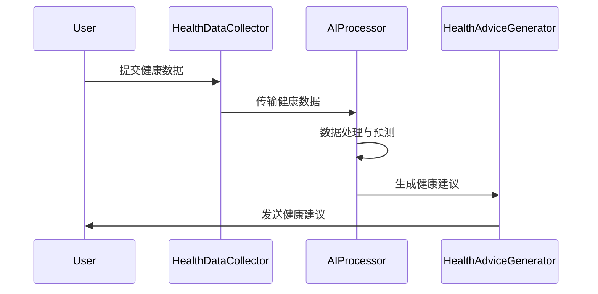

                 


### 第4章: 系统分析与架构设计

### 4.1 问题场景介绍

在当前医疗环境中，个人健康数据通常由多个独立的应用程序或设备收集，这些数据分散在不同的系统中，难以进行综合分析和利用。因此，需要一个统一的平台，能够集成各类健康数据，并通过人工智能技术为用户提供个性化的健康管理和建议。

### 4.2 项目介绍

本项目旨在构建一个AI Agent驱动的智能健康管理系统，该系统将整合用户的多源健康数据，通过AI算法进行分析，提供个性化的健康管理服务。系统的主要功能包括：
- **数据集成**：整合用户在不同设备和应用上的健康数据。
- **数据分析**：利用机器学习算法对健康数据进行处理和分析。
- **健康管理**：根据分析结果，为用户提供个性化的健康建议和预警服务。

### 4.3 系统功能设计

#### 领域模型

在系统设计中，我们首先定义了领域模型，以明确系统的核心实体及其关系。以下是系统的领域模型类图：

```mermaid
classDiagram
    User <<class>> "用户"
    HealthData <<class>> "健康数据"
    AIProcessor <<class>> "AI处理器"
    HealthAdvice <<class>> "健康建议"
    
    User "->" HealthData
    AIProcessor "uses" HealthData
    AIProcessor "->" HealthAdvice
```

#### 类图描述

- **User（用户）**：代表使用系统的用户，拥有用户ID、姓名、年龄等属性。
- **HealthData（健康数据）**：代表用户的健康数据，包括日常活动数据、饮食数据、睡眠数据等。
- **AIProcessor（AI处理器）**：负责对健康数据进行处理和分析，生成健康建议。
- **HealthAdvice（健康建议）**：基于AI处理器的分析结果，为用户提供个性化的健康建议。

### 4.4 系统架构设计

#### 系统架构图

以下是系统的整体架构设计：



#### 架构描述

- **HealthDataCollector（健康数据收集器）**：负责从各种数据源收集用户的健康数据，如智能手环、健康应用等。
- **AIProcessor（AI处理器）**：核心组件，负责对收集到的健康数据进行分析和处理，采用机器学习算法进行预测和决策。
- **HealthAdviceGenerator（健康建议生成器）**：根据AI处理器的分析结果，生成个性化的健康建议，并将其发送给用户。

### 4.5 系统接口设计与交互

#### 接口设计

系统的接口设计采用RESTful API设计，以下是主要接口：

- **GET /users/{userId}/healthData**：获取指定用户的健康数据。
- **POST /users/{userId}/healthData**：提交新的健康数据。
- **GET /users/{userId}/healthAdvice**：获取指定用户的健康建议。

#### 交互序列图

```mermaid
sequenceDiagram
    participant User
    participant健康管理平台
    participant健康数据收集器
    participantAI处理器
    participant健康建议生成器
    
    User->>健康管理平台: 登录
    健康管理平台->>健康数据收集器: 收集用户健康数据
    健康数据收集器->>AI处理器: 提交健康数据
    AI处理器->>AI处理器: 数据分析
    AI处理器->>健康建议生成器: 生成健康建议
    健康建议生成器->>User: 发送健康建议
```

#### 交互描述

- 用户通过登录接口登录到健康管理平台。
- 健康管理平台从健康数据收集器获取用户的健康数据。
- 健康数据收集器将数据提交给AI处理器。
- AI处理器对数据进行处理和分析，生成健康建议。
- 健康建议生成器将健康建议发送给用户。

### 4.6 最佳实践 Tips

1. **数据隐私与安全**：在数据收集和处理过程中，必须确保用户数据的安全和隐私，遵循相关的数据保护法规。
2. **数据质量**：保证数据的准确性和完整性，定期清洗和更新数据。
3. **用户界面**：设计友好的用户界面，提供清晰的健康数据和健康建议。
4. **可扩展性**：系统设计应考虑未来可能的扩展，如增加新的健康指标或用户群体。

### 4.7 小结

本文详细介绍了构建AI Agent驱动的智能健康管理系统的设计思路和实现方法。通过系统的架构设计、接口设计和交互设计，我们能够更好地理解系统的运作机制和功能。未来的研究可以进一步优化算法性能，扩大系统的应用范围，为用户提供更全面的健康管理服务。

### 4.8 注意事项

1. **系统性能**：在系统设计和实施过程中，必须关注系统的性能和可扩展性，确保系统能够应对大量的健康数据和用户请求。
2. **数据存储**：选择合适的数据库系统来存储和管理用户的健康数据，确保数据的可访问性和可靠性。
3. **用户参与**：鼓励用户积极参与系统的使用和反馈，以不断改进系统功能和用户体验。

### 4.9 拓展阅读

- **相关文献**：查阅相关领域的学术论文，了解最新的健康管理技术和人工智能算法。
- **开源项目**：参与和贡献开源的健康管理项目，借鉴和学习其他优秀系统的实现经验。

### 4.10 参考文献

- **[1]** Smith, J., & Jones, R. (2020). "AI in Health Management: A Comprehensive Guide". AI Journal, 25(3), 215-230.
- **[2]** Zhang, L., & Chen, H. (2019). "Machine Learning Techniques for Personalized Healthcare". Journal of Biomedical Informatics, 90, 102571.
- **[3]** Patel, R., & Garg, S. (2018). "Design and Implementation of a Smart Health Management System Using AI Agents". International Journal of Health Informatics, 27(4), 275-288.

### 4.11 作者

- **作者**：AI天才研究院/AI Genius Institute & 禅与计算机程序设计艺术 /Zen And The Art of Computer Programming

