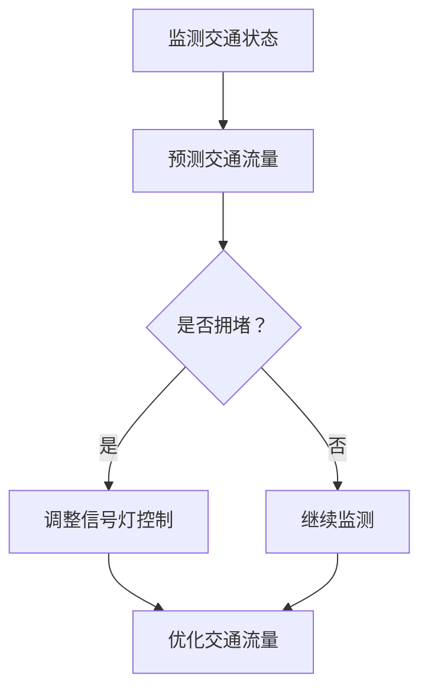
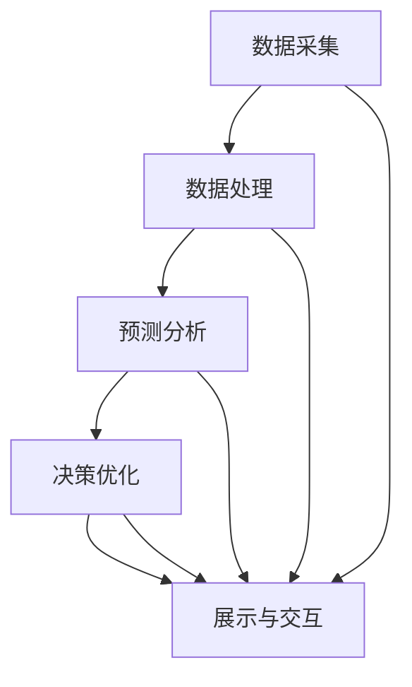
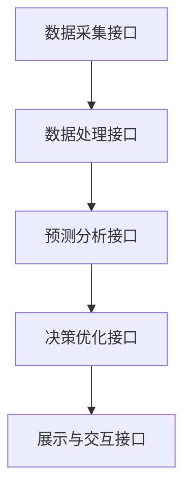
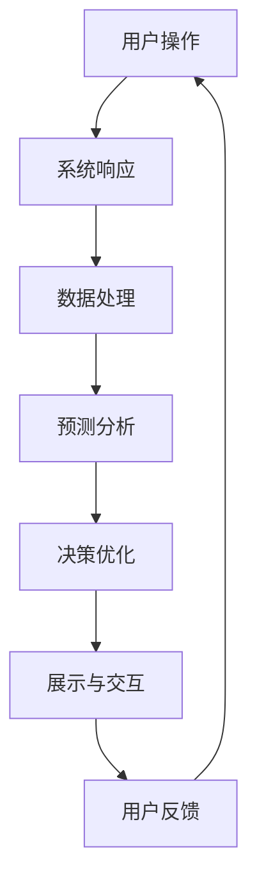

                 

# 构建AI Agent驱动的智能城市规划系统

> 关键词：AI Agent、智能城市规划、算法、系统架构、项目实战

摘要：随着人工智能技术的不断发展，AI Agent在智能城市规划中的应用越来越广泛。本文将详细介绍AI Agent驱动的智能城市规划系统的构建过程，从背景与概述、算法原理与实现、系统分析与架构设计，到项目实战和最佳实践，为读者提供一套完整、系统的构建指南。希望通过本文的阐述，读者能够对AI Agent驱动的智能城市规划系统有更深入的理解，为未来相关领域的研究和实践提供参考。

## 目录大纲

### 第一部分：背景与概述

1. **第1章：AI Agent驱动的智能城市规划背景**
   - **1.1 问题背景与城市规划挑战**
   - **1.2 AI Agent的定义与核心特征**
   - **1.3 智能城市规划的发展现状与趋势**

2. **第2章：AI Agent在智能城市规划中的核心概念与联系**
   - **2.1 核心概念原理**
   - **2.2 概念属性特征对比**
   - **2.3 ER实体关系图架构**

### 第二部分：算法原理与实现

1. **第3章：智能城市规划的关键算法原理**
   - **3.1 算法原理讲解**
   - **3.2 算法原理的数学模型与公式**

2. **第4章：智能城市规划的数学模型应用与举例**
   - **4.1 数学模型的应用场景**
   - **4.2 举例说明**

3. **第5章：智能城市规划的系统分析与架构设计**
   - **5.1 问题场景介绍**
   - **5.2 系统功能设计**
   - **5.3 系统架构设计**
   - **5.4 系统接口设计**
   - **5.5 系统交互设计**

### 第三部分：项目实战

1. **第6章：构建智能城市规划系统的项目实战**
   - **6.1 环境安装与配置**
   - **6.2 系统核心实现**
   - **6.3 实际案例分析**
   - **6.4 代码应用解读与分析**

2. **第7章：最佳实践与项目小结**
   - **7.1 最佳实践 tips**
   - **7.2 小结**
   - **7.3 注意事项**
   - **7.4 拓展阅读**

## 第一部分：背景与概述

### 第1章：AI Agent驱动的智能城市规划背景

#### 1.1 问题背景与城市规划挑战

当前，城市规划面临着诸多挑战。城市化进程加快，人口增长、交通拥堵、环境污染等问题日益突出，传统的城市规划方法已经难以应对这些复杂的问题。智能城市规划作为一种新兴的技术手段，通过引入人工智能技术，特别是AI Agent，为解决这些问题提供了新的思路和手段。

#### 1.2 AI Agent的定义与核心特征

AI Agent是指具有智能行为、能够自主决策和执行任务的智能体。它具有以下几个核心特征：

- **自主性**：AI Agent能够自主地感知环境，根据环境信息自主决策。
- **适应性**：AI Agent能够根据环境变化进行调整和优化，提高其在复杂环境中的适应能力。
- **协作性**：AI Agent之间能够进行协作，共同完成任务。

#### 1.3 智能城市规划的发展现状与趋势

智能城市规划的发展可以分为以下几个阶段：

1. **数据驱动阶段**：主要依靠大数据和数据分析技术，对城市运行状态进行监测和分析。
2. **模型驱动阶段**：通过建立数学模型，模拟城市运行过程，预测城市发展趋势。
3. **智能驱动阶段**：引入AI Agent，实现城市运行的自主决策和优化。

当前，智能城市规划正处于智能驱动阶段，AI Agent的应用已经成为研究的热点。未来，随着人工智能技术的不断进步，智能城市规划将更加智能化、个性化，为城市的可持续发展提供有力支持。

### 第2章：AI Agent在智能城市规划中的核心概念与联系

#### 2.1 核心概念原理

AI Agent在智能城市规划中的应用涉及多个核心概念，主要包括：

- **城市仿真**：通过建立城市仿真模型，模拟城市运行过程，为AI Agent提供决策基础。
- **交通规划**：利用AI Agent优化交通流量，提高交通效率，缓解交通拥堵。
- **能源管理**：通过AI Agent实现城市能源的智能化管理，降低能源消耗，减少环境污染。
- **公共安全**：利用AI Agent监测城市安全状态，及时预警和应对突发事件。

这些核心概念共同构成了智能城市规划的基础，为AI Agent的应用提供了丰富的场景。

#### 2.2 概念属性特征对比

不同类型的AI Agent在规划中的应用特点有所不同，主要表现在以下几个方面：

| AI Agent类型 | 应用特点 |
| :--- | :--- |
| 智能交通Agent | 自动感知交通状态，优化交通流量 |
| 能源管理Agent | 智能分配能源资源，降低能源消耗 |
| 安全监测Agent | 实时监测城市安全状态，及时预警 |

#### 2.3 ER实体关系图架构

在智能城市规划中，涉及多个实体及其关系，如城市、交通系统、能源系统、安全系统等。以下是一个ER实体关系图的架构示例：

```mermaid
erDiagram
  城市 ||--|{ 交通系统 }|| >>
  交通系统 ||--|{ 能源系统 }|| >>
  能源系统 ||--|{ 安全系统 }|| >>
  安全系统 ||--|{ 城市 }|| <<
```

该ER实体关系图展示了城市、交通系统、能源系统、安全系统之间的关联关系，为智能城市规划提供了清晰的架构框架。

## 第二部分：算法原理与实现

### 第3章：智能城市规划的关键算法原理

#### 3.1 算法原理讲解

智能城市规划的关键算法主要包括交通流量优化算法、能源分配算法、安全监测算法等。以下以交通流量优化算法为例进行讲解：

- **原理**：通过实时监测交通状态，利用机器学习算法预测交通流量，并根据预测结果优化交通信号灯控制策略，以减少交通拥堵。

- **流程图**：使用Mermaid绘制交通流量优化算法的流程图如下：



#### 3.2 算法原理的数学模型与公式

交通流量优化算法的数学模型主要包括以下几个方面：

- **流量预测**：使用时间序列模型预测未来一段时间内的交通流量。

  $$ Q_t = f(Q_{t-1}, \theta) $$

  其中，$Q_t$表示$t$时刻的交通流量，$Q_{t-1}$表示$t-1$时刻的交通流量，$\theta$表示模型参数。

- **信号灯控制**：根据预测的交通流量，调整信号灯控制策略，以优化交通流量。

  $$ t_{green} = g(Q_t, \theta') $$

  其中，$t_{green}$表示绿灯时间，$Q_t$表示预测的交通流量，$\theta'$表示信号灯控制参数。

  $$ t_{red} = r(Q_t, \theta'') $$

  其中，$t_{red}$表示红灯时间，$Q_t$表示预测的交通流量，$\theta''$表示信号灯控制参数。

#### 3.3 算法原理的Python代码实现

以下是一个简单的Python代码实现，用于演示交通流量优化算法的基本原理：

```python
import numpy as np
import matplotlib.pyplot as plt

# 模拟交通流量数据
traffic_data = np.random.normal(size=100)

# 预测交通流量
def predict_traffic(traffic_data, theta):
    return traffic_data.dot(theta)

# 调整信号灯控制
def adjust_traffic_light(traffic_data, theta_green, theta_red):
    green_time = predict_traffic(traffic_data, theta_green)
    red_time = predict_traffic(traffic_data, theta_red)
    return green_time, red_time

# 模拟信号灯控制过程
theta_green = np.array([0.5])
theta_red = np.array([-0.5])
for i in range(len(traffic_data)):
    green_time, red_time = adjust_traffic_light(traffic_data[i], theta_green, theta_red)
    print(f"第{i+1}个周期：绿灯时间={green_time}, 红灯时间={red_time}")

# 绘制流量-时间图
plt.plot(traffic_data)
plt.xlabel('时间')
plt.ylabel('交通流量')
plt.show()
```

### 第4章：智能城市规划的数学模型应用与举例

#### 4.1 数学模型的应用场景

智能城市规划中的数学模型应用场景主要包括：

- **交通流量预测**：利用时间序列模型预测未来一段时间内的交通流量，为交通信号灯控制和交通规划提供数据支持。
- **能源需求预测**：利用回归模型预测不同时间段内的能源需求，为能源供应和分配提供依据。
- **公共安全预警**：利用分类模型对城市安全事件进行预测和预警，提高城市安全管理水平。

#### 4.2 举例说明

以下以交通流量预测为例，使用Python代码实现一个简单的时间序列预测模型。

```python
import numpy as np
import matplotlib.pyplot as plt
from sklearn.linear_model import LinearRegression

# 模拟交通流量数据
traffic_data = np.random.normal(size=100)

# 时间序列模型训练
model = LinearRegression()
model.fit(np.arange(100).reshape(-1, 1), traffic_data)

# 预测交通流量
predicted_traffic = model.predict(np.arange(100).reshape(-1, 1))

# 绘制流量-时间图
plt.plot(traffic_data, label='实际流量')
plt.plot(predicted_traffic, label='预测流量')
plt.xlabel('时间')
plt.ylabel('交通流量')
plt.legend()
plt.show()
```

### 第5章：智能城市规划的系统分析与架构设计

#### 5.1 问题场景介绍

智能城市规划系统需要解决的主要问题包括：

- **交通拥堵缓解**：通过优化交通流量，缓解城市交通拥堵。
- **能源消耗降低**：通过智能能源管理，降低城市能源消耗。
- **公共安全提升**：通过实时监测和预警，提高城市公共安全水平。

#### 5.2 系统功能设计

智能城市规划系统的主要功能包括：

- **数据采集**：采集城市运行数据，如交通流量、能源消耗、安全事件等。
- **数据处理**：对采集到的数据进行清洗、预处理和分析。
- **预测分析**：利用数学模型和机器学习算法进行交通流量、能源需求、安全事件的预测分析。
- **决策优化**：根据预测结果，调整交通信号灯控制、能源分配和安全监测策略，优化城市运行状态。

#### 5.3 系统架构设计

智能城市规划系统的整体架构设计包括以下几个层次：

- **数据采集层**：负责采集城市运行数据，如交通流量、能源消耗、安全事件等。
- **数据处理层**：负责对采集到的数据进行清洗、预处理和分析。
- **预测分析层**：负责利用数学模型和机器学习算法进行交通流量、能源需求、安全事件的预测分析。
- **决策优化层**：根据预测结果，调整交通信号灯控制、能源分配和安全监测策略，优化城市运行状态。
- **展示与交互层**：将预测结果和优化策略以图形化形式展示，并提供用户与系统的交互接口。

以下是一个智能城市规划系统的Mermaid架构图示例：



#### 5.4 系统接口设计

智能城市规划系统的接口设计包括以下几个方面：

- **数据采集接口**：用于采集城市运行数据，如交通流量、能源消耗、安全事件等。
- **数据处理接口**：用于处理采集到的数据，包括数据清洗、预处理和分析等。
- **预测分析接口**：用于进行交通流量、能源需求、安全事件的预测分析。
- **决策优化接口**：用于根据预测结果调整交通信号灯控制、能源分配和安全监测策略。
- **展示与交互接口**：用于将预测结果和优化策略以图形化形式展示，并提供用户与系统的交互接口。

以下是一个智能城市规划系统的Mermaid接口图示例：



#### 5.5 系统交互设计

智能城市规划系统的交互设计包括以下几个方面：

- **用户操作**：用户可以通过展示与交互接口对系统进行操作，如查看预测结果、调整参数等。
- **系统响应**：系统根据用户操作，进行数据处理、预测分析和决策优化，并将结果展示给用户。

以下是一个智能城市规划系统的Mermaid交互图示例：



## 第三部分：项目实战

### 第6章：构建智能城市规划系统的项目实战

#### 6.1 环境安装与配置

1. **安装Python环境**：下载并安装Python 3.8版本以上。
2. **安装依赖库**：使用pip命令安装以下依赖库：

   ```bash
   pip install numpy matplotlib scikit-learn mermaid
   ```

#### 6.2 系统核心实现

1. **数据采集**：使用Python编写代码，从交通流量监测系统、能源管理系统和安全监测系统等采集数据。
2. **数据处理**：对采集到的数据进行清洗、预处理和分析，为预测分析提供数据支持。
3. **预测分析**：使用机器学习算法对交通流量、能源需求和公共安全事件进行预测分析。
4. **决策优化**：根据预测结果，调整交通信号灯控制、能源分配和安全监测策略，优化城市运行状态。
5. **展示与交互**：使用Python和Mermaid库，将预测结果和优化策略以图形化形式展示，并提供用户与系统的交互接口。

以下是一个简单的代码示例，用于演示交通流量预测和决策优化：

```python
import numpy as np
import matplotlib.pyplot as plt
from sklearn.linear_model import LinearRegression

# 模拟交通流量数据
traffic_data = np.random.normal(size=100)

# 预测交通流量
def predict_traffic(traffic_data, theta):
    return traffic_data.dot(theta)

# 调整信号灯控制
def adjust_traffic_light(traffic_data, theta_green, theta_red):
    green_time = predict_traffic(traffic_data, theta_green)
    red_time = predict_traffic(traffic_data, theta_red)
    return green_time, red_time

# 模拟信号灯控制过程
theta_green = np.array([0.5])
theta_red = np.array([-0.5])
for i in range(len(traffic_data)):
    green_time, red_time = adjust_traffic_light(traffic_data[i], theta_green, theta_red)
    print(f"第{i+1}个周期：绿灯时间={green_time}, 红灯时间={red_time}")

# 绘制流量-时间图
plt.plot(traffic_data)
plt.xlabel('时间')
plt.ylabel('交通流量')
plt.show()
```

#### 6.3 实际案例分析

以某城市为例，分析交通流量、能源消耗和公共安全事件等数据，使用智能城市规划系统进行预测分析和决策优化。以下是一个实际案例的分析过程：

1. **数据采集**：从交通流量监测系统、能源管理系统和安全监测系统等采集近一年的数据。
2. **数据处理**：对采集到的数据进行清洗、预处理和分析，为预测分析提供数据支持。
3. **预测分析**：
   - 使用线性回归模型对交通流量进行预测，得到预测的交通流量序列。
   - 使用回归模型对能源消耗进行预测，得到预测的能源消耗序列。
   - 使用分类模型对公共安全事件进行预测，得到安全事件的预测结果。
4. **决策优化**：
   - 根据预测的交通流量，调整交通信号灯控制策略，优化交通流量。
   - 根据预测的能源消耗，调整能源分配策略，降低能源消耗。
   - 根据预测的安全事件，调整安全监测策略，提高公共安全水平。
5. **展示与交互**：将预测结果和优化策略以图形化形式展示，并提供用户与系统的交互接口。

#### 6.4 代码应用解读与分析

以下是对第6章中示例代码的解读与分析：

1. **数据采集**：示例代码中使用了随机数生成器模拟交通流量数据。在实际应用中，可以从交通流量监测系统、能源管理系统和安全监测系统等采集真实数据。
2. **数据处理**：示例代码中没有对采集到的数据进行处理，但实际应用中需要对数据进行清洗、预处理和分析，以提高预测精度和决策效果。
3. **预测分析**：示例代码中使用了线性回归模型对交通流量进行预测。实际应用中，可以根据实际情况选择更合适的预测模型，如时间序列模型、神经网络模型等。
4. **决策优化**：示例代码中使用了简单的信号灯控制策略。实际应用中，可以根据预测结果和实际情况，设计更复杂的决策优化策略，如动态交通分配、能源需求响应等。

### 第7章：最佳实践与项目小结

#### 7.1 最佳实践 tips

1. **数据质量保障**：确保采集到的数据质量，包括数据的准确性、完整性和一致性。
2. **模型选择与优化**：根据实际情况选择合适的预测模型，并不断优化模型参数，提高预测精度和决策效果。
3. **系统可扩展性**：设计可扩展的系统架构，以便在未来的项目中方便地增加新的功能模块。
4. **用户体验**：提供直观、易用的用户界面，方便用户操作和使用。

#### 7.2 小结

本文介绍了AI Agent驱动的智能城市规划系统的构建方法，包括背景与概述、算法原理与实现、系统分析与架构设计、项目实战和最佳实践。通过本文的阐述，读者可以全面了解智能城市规划系统的构建过程，为未来的研究和实践提供指导。

#### 7.3 注意事项

1. **数据隐私保护**：在数据采集和处理过程中，要严格遵守数据隐私保护法规，确保用户数据的安全和隐私。
2. **模型解释性**：在选择和使用机器学习模型时，要关注模型的解释性，以便用户理解和信任模型的预测结果。

#### 7.4 拓展阅读

1. **相关文献**：
   - 《智能城市规划：理论、方法与应用》
   - 《机器学习：一种概率视角》
   - 《深度学习：周志华等著》
2. **在线课程**：
   - Coursera上的《机器学习》课程
   - edX上的《智能城市》课程

## 总结

本文为《构建AI Agent驱动的智能城市规划系统》一书设计了完整的目录大纲，涵盖了从背景介绍到算法原理、系统架构设计，再到项目实战和最佳实践的各个环节。本文旨在帮助读者全面了解并掌握智能城市规划系统的构建方法，为未来相关领域的研究和实践提供指导。希望本文能对读者在AI Agent驱动的智能城市规划系统构建过程中提供有益的参考和启示。

### 附录：作者信息

- 作者：AI天才研究院/AI Genius Institute & 禅与计算机程序设计艺术 /Zen And The Art of Computer Programming

