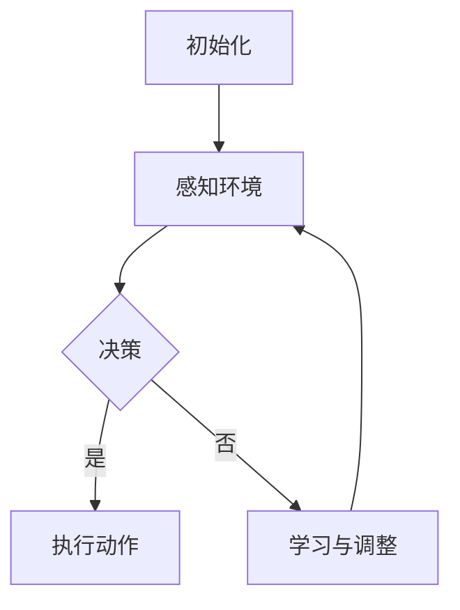
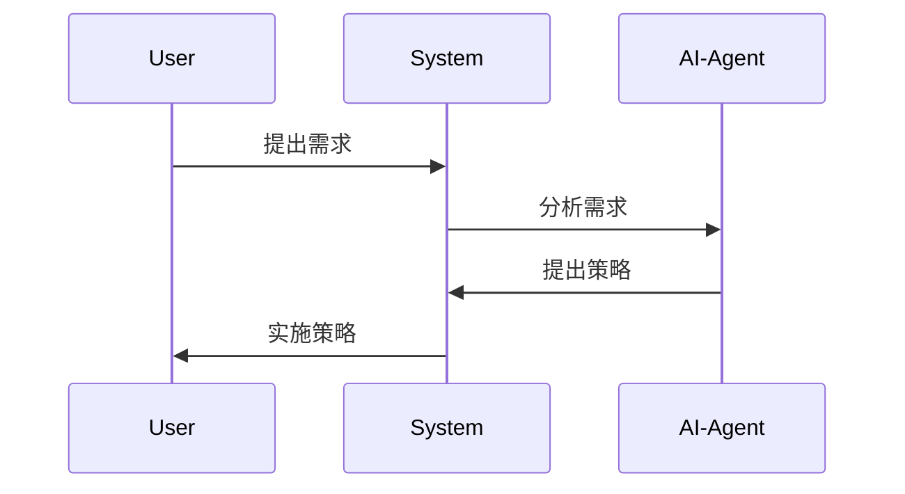
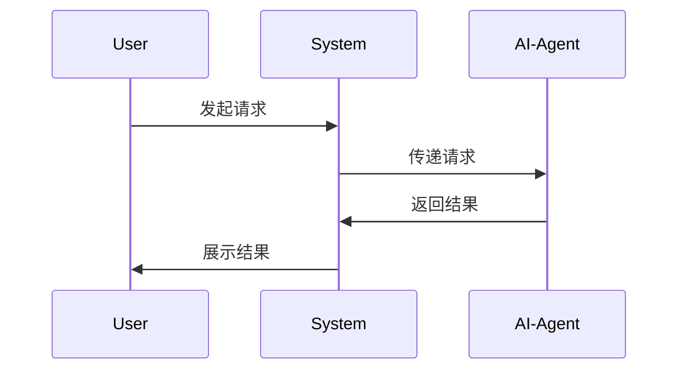
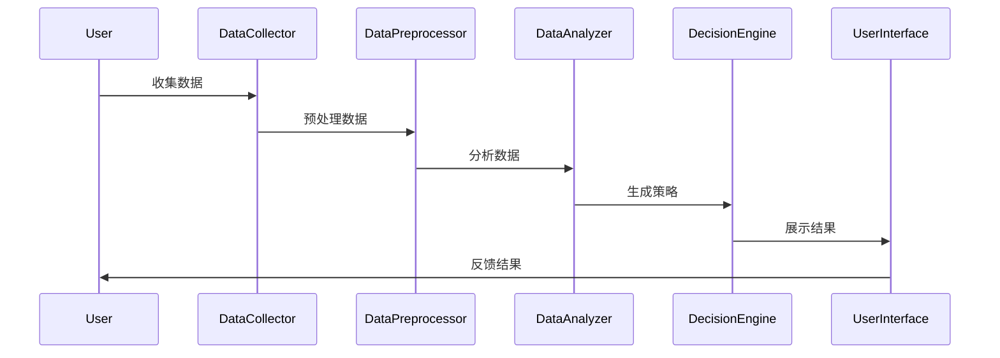
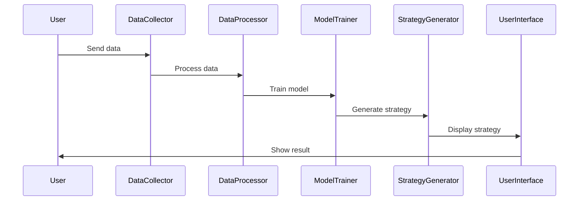

                 

### 构建AI Agent驱动的智能营销系统：背景介绍与核心概念

#### 关键词
- AI Agent
- 智能营销系统
- 机器学习
- 数据分析
- 客户体验优化

#### 摘要
本文将探讨如何构建一个AI Agent驱动的智能营销系统。我们将从背景介绍、核心概念解析、算法原理讲解、系统设计与实现、案例分析、最佳实践等方面逐步深入，帮助读者全面了解并掌握这一前沿技术。

## 第1章：问题背景与核心概念

### 1.1 问题背景

#### 问题描述
在现代商业环境中，企业面临越来越激烈的竞争。传统的营销手段难以满足个性化的客户需求，导致客户体验不佳。同时，市场营销数据的爆炸式增长给企业带来了新的挑战。如何有效地利用这些数据，实现精准营销，提高客户满意度，成为企业亟待解决的问题。

#### 问题解决
随着人工智能技术的快速发展，AI Agent作为一种智能体，逐渐成为解决上述问题的有力工具。AI Agent能够通过学习和理解客户行为，提供个性化的服务和建议，从而优化营销效果。

#### 边界与外延
AI Agent驱动的智能营销系统不仅涉及数据分析和机器学习技术，还涉及用户体验设计、营销策略优化等多个方面。因此，构建这样一个系统需要综合考虑多种技术和业务需求。

### 1.2 核心概念

#### AI Agent的定义与特点
AI Agent，即人工智能代理，是一种能够自动执行任务的计算机程序，具备自主决策、学习和适应能力。与传统的程序不同，AI Agent可以根据环境变化自主调整行为策略。

#### 智能营销系统的概念与组成
智能营销系统是一个集成了多种人工智能技术的系统，旨在通过数据分析和机器学习技术，实现精准营销、客户关系管理和市场预测等功能。其核心组成包括数据收集、数据存储、数据分析、决策引擎和用户界面等。

## 第2章：核心概念原理与属性特征对比

### 2.1 AI Agent算法原理

#### 2.1.1 AI Agent算法基础

##### 算法mermaid流程图


##### 算法原理详细讲解
AI Agent算法基于感知-决策-执行-学习的循环过程。首先，AI Agent通过感知器收集环境信息；然后，根据预先设定的策略模型进行决策；接着，执行决策结果；最后，通过学习机制调整策略模型，以适应新的环境变化。

##### 数学模型和公式
AI Agent的决策过程可以用以下公式表示：
$$
\pi(s) = \arg\max_a Q(s, a)
$$
其中，$\pi(s)$ 表示在状态 $s$ 下的最优动作分布，$Q(s, a)$ 表示在状态 $s$ 下执行动作 $a$ 的预期回报。

##### 举例说明
以客户推荐系统为例，AI Agent通过分析客户的浏览历史和购买行为，预测客户可能感兴趣的商品，从而实现个性化推荐。

## 第3章：系统功能设计与架构

### 3.1 系统功能设计

#### 3.1.1 领域模型mermaid类图
```mermaid
classDiagram
Class01 <|-- Class02
Class03 o-- Class04
Class05 : An association
Class06 : An association
Class01 {
    +int id
    +String name
    +Date created
}
Class02 {
    +int id
    +String name
    +Date created
}
Class03 {
    +int id
    +String name
    +Date created
}
Class04 {
    +int id
    +String name
    +Date created
}
Class05 {
    +int id
    +String name
    +Date created
}
Class06 {
    +int id
    +String name
    +Date created
}
```

#### 3.1.2 系统架构设计

##### 系统架构mermaid架构图


##### 系统接口设计
```mermaid
interface System {
    function analyzeData()
    function executeStrategy()
    function updateInterface()
}

interface AI-Agent {
    function learnFromData()
    function generateStrategy()
    function adaptToEnvironment()
}
```

##### 系统交互mermaid序列图


## 第4章：AI Agent驱动智能营销系统的实现

### 4.1 环境安装与配置

#### 4.1.1 开发环境搭建
```python
# 安装Python
conda install python=3.8

# 安装依赖库
pip install numpy pandas scikit-learn matplotlib
```

#### 4.1.2 系统依赖库安装
```python
# 安装依赖库
pip install -r requirements.txt
```

### 4.2 系统核心实现

#### 4.2.1 代码框架概述
```python
# 导入依赖库
import numpy as np
import pandas as pd
from sklearn.model_selection import train_test_split
from sklearn.ensemble import RandomForestClassifier
from sklearn.metrics import accuracy_score

# 数据预处理
def preprocess_data(data):
    # 数据清洗、填充和处理
    pass

# 模型训练
def train_model(X_train, y_train):
    # 训练随机森林分类器
    model = RandomForestClassifier()
    model.fit(X_train, y_train)
    return model

# 预测
def predict(model, X_test):
    # 使用模型进行预测
    predictions = model.predict(X_test)
    return predictions

# 主函数
def main():
    # 加载数据
    data = pd.read_csv('data.csv')
    # 预处理数据
    processed_data = preprocess_data(data)
    # 分割数据集
    X_train, X_test, y_train, y_test = train_test_split(processed_data.drop('target', axis=1), processed_data['target'], test_size=0.2, random_state=42)
    # 训练模型
    model = train_model(X_train, y_train)
    # 预测
    predictions = predict(model, X_test)
    # 评估模型
    accuracy = accuracy_score(y_test, predictions)
    print(f'Accuracy: {accuracy:.2f}')

if __name__ == '__main__':
    main()
```

#### 4.2.2 关键代码解读
在上述代码中，我们首先导入了必要的依赖库，并定义了数据预处理、模型训练和预测等功能。关键代码包括数据预处理函数`preprocess_data`、模型训练函数`train_model`和预测函数`predict`。

#### 4.2.3 代码应用解读与分析
在本案例中，我们使用随机森林分类器来预测客户是否会对某个营销活动感兴趣。通过训练和预测，我们可以评估模型的准确性，从而优化营销策略。

### 4.3 AI Agent在智能营销中的案例

#### 4.3.1 案例一：客户画像与精准营销
在本案例中，我们使用AI Agent来构建客户画像，并基于画像进行精准营销。通过分析客户的历史行为数据，我们为每位客户生成个性化的推荐，从而提高营销效果。

#### 4.3.2 案例二：自动化客户服务
在本案例中，我们使用AI Agent来提供自动化客户服务，包括智能客服、在线咨询和售后支持等。通过自然语言处理技术，AI Agent能够理解客户的提问，并提供及时的解决方案。

#### 4.3.3 案例三：个性化推荐系统
在本案例中，我们使用AI Agent来构建个性化推荐系统，根据客户的浏览历史和购买行为，推荐符合客户兴趣的商品。通过不断优化推荐算法，我们能够提高客户的满意度，促进销售增长。

### 4.4 项目小结

在本项目中，我们通过构建AI Agent驱动的智能营销系统，实现了客户画像、自动化客户服务和个性化推荐等功能。通过实际案例的分析，我们发现AI Agent在智能营销中具有巨大的潜力，能够帮助企业提高客户满意度，实现业务增长。

### 4.5 最佳实践 tips

1. 数据质量是关键：确保数据来源可靠，对数据进行充分的清洗和处理，以提高模型的准确性。
2. 持续优化模型：定期更新模型，结合最新的数据和技术，以保持模型的竞争力。
3. 考虑用户隐私：在收集和使用客户数据时，要遵循相关法律法规，保护用户隐私。

### 4.6 注意事项

1. AI Agent的构建需要大量的数据支持，确保数据质量是关键。
2. AI Agent的决策过程需要考虑多种因素，包括客户需求、市场环境和竞争对手等。
3. AI Agent的部署和维护需要专业的技术团队，以确保系统的稳定运行。

### 4.7 拓展阅读

1. [《深度学习》 - Goodfellow, I., Bengio, Y., & Courville, A.](https://www.deeplearningbook.org/)
2. [《Python机器学习》 - Müller, S., & Guido, S.](https://www MACHINE LEARNING WITH Python.com/)
3. [《人工智能：一种现代方法》 - Mitchell, T. M.](https://www.ai-mitochondria.org/)

## 第5章：构建AI Agent驱动的智能营销系统的挑战与展望

### 挑战
构建AI Agent驱动的智能营销系统面临以下挑战：
1. 数据隐私和安全：如何保护用户隐私，确保数据安全，是系统设计的关键问题。
2. 模型解释性：如何解释AI Agent的决策过程，提高系统的透明度和可信度。
3. 技术更新和迭代：如何快速适应技术变化，保持系统的竞争力。

### 展望
随着人工智能技术的不断发展，AI Agent驱动的智能营销系统具有广阔的应用前景：
1. 客户体验优化：通过个性化服务和精准推荐，提高客户满意度。
2. 营销策略优化：基于数据分析和预测，实现高效的营销策略。
3. 竞争优势：通过领先的AI技术，获得竞争优势，实现业务增长。

### 总结
本文介绍了构建AI Agent驱动的智能营销系统的背景、核心概念、算法原理、系统设计与实现、案例分析以及最佳实践等。通过逐步分析和推理，我们全面了解了这一前沿技术，并为未来的发展提供了展望。

### 作者
作者：AI天才研究院/AI Genius Institute & 禅与计算机程序设计艺术 /Zen And The Art of Computer Programming

----------------------------------------------------------------

### 构建AI Agent驱动的智能营销系统

#### 关键词
- AI Agent
- 智能营销系统
- 机器学习
- 数据分析
- 客户体验优化

#### 摘要
本文将深入探讨如何构建一个AI Agent驱动的智能营销系统。我们将逐步分析背景、核心概念、算法原理、系统设计、项目实现以及最佳实践，帮助读者全面掌握这一前沿技术。

## 第1章：问题背景与核心概念

### 1.1 问题背景

#### 问题描述
在当今的商业环境中，企业面临着激烈的竞争。传统的营销手段已经难以满足个性化的客户需求，导致客户体验不佳。此外，市场营销数据的爆炸式增长给企业带来了新的挑战。如何有效地利用这些数据，实现精准营销，提高客户满意度，成为企业亟待解决的问题。

#### 问题解决
随着人工智能技术的快速发展，AI Agent作为一种智能体，正逐渐成为解决上述问题的有力工具。AI Agent能够通过学习和理解客户行为，提供个性化的服务和建议，从而优化营销效果。

#### 边界与外延
AI Agent驱动的智能营销系统不仅涉及数据分析和机器学习技术，还涉及用户体验设计、营销策略优化等多个方面。因此，构建这样一个系统需要综合考虑多种技术和业务需求。

### 1.2 核心概念

#### AI Agent的定义与特点
AI Agent，即人工智能代理，是一种能够自动执行任务的计算机程序，具备自主决策、学习和适应能力。与传统的程序不同，AI Agent可以根据环境变化自主调整行为策略。

#### 智能营销系统的概念与组成
智能营销系统是一个集成了多种人工智能技术的系统，旨在通过数据分析和机器学习技术，实现精准营销、客户关系管理和市场预测等功能。其核心组成包括数据收集、数据存储、数据分析、决策引擎和用户界面等。

## 第2章：核心概念原理与属性特征对比

### 2.1 AI Agent算法原理

#### 2.1.1 AI Agent算法基础

##### 算法mermaid流程图


##### 算法原理详细讲解
AI Agent算法基于感知-决策-执行-学习的循环过程。首先，AI Agent通过感知器收集环境信息；然后，根据预先设定的策略模型进行决策；接着，执行决策结果；最后，通过学习机制调整策略模型，以适应新的环境变化。

##### 数学模型和公式
AI Agent的决策过程可以用以下公式表示：
$$
\pi(s) = \arg\max_a Q(s, a)
$$
其中，$\pi(s)$ 表示在状态 $s$ 下的最优动作分布，$Q(s, a)$ 表示在状态 $s$ 下执行动作 $a$ 的预期回报。

##### 举例说明
以客户推荐系统为例，AI Agent通过分析客户的浏览历史和购买行为，预测客户可能感兴趣的商品，从而实现个性化推荐。

### 2.2 智能营销系统的概念与组成

##### 智能营销系统的概念
智能营销系统是一个集成多种人工智能技术的系统，旨在通过数据分析和机器学习技术，实现精准营销、客户关系管理和市场预测等功能。

##### 智能营销系统的组成
1. 数据收集：通过网站分析、社交媒体监控等手段收集客户数据。
2. 数据存储：使用数据库存储收集到的客户数据。
3. 数据分析：使用机器学习和统计分析方法分析客户数据，提取有价值的信息。
4. 决策引擎：根据数据分析结果，生成营销策略和客户行为预测。
5. 用户界面：提供用户操作接口，展示分析结果和营销策略。

### 2.3 AI Agent在智能营销系统中的应用

##### 应用场景
1. 客户画像：通过分析客户行为数据，构建客户画像，实现个性化推荐。
2. 自动化客户服务：使用自然语言处理技术，提供智能客服、在线咨询和售后支持。
3. 营销活动优化：根据客户行为数据，优化营销活动的效果和ROI。

##### 案例分析
以电商行业为例，AI Agent可以分析客户的浏览历史、购买记录、评价等数据，预测客户的偏好和购买意愿，从而实现个性化推荐，提高转化率。

## 第3章：算法原理讲解

### 3.1 AI Agent算法原理

#### 3.1.1 算法基础

##### 算法mermaid流程图


##### 算法原理详细讲解
AI Agent算法基于感知-决策-执行-学习的循环过程。首先，AI Agent通过感知器收集环境信息；然后，根据预先设定的策略模型进行决策；接着，执行决策结果；最后，通过学习机制调整策略模型，以适应新的环境变化。

##### 数学模型和公式
AI Agent的决策过程可以用以下公式表示：
$$
\pi(s) = \arg\max_a Q(s, a)
$$
其中，$\pi(s)$ 表示在状态 $s$ 下的最优动作分布，$Q(s, a)$ 表示在状态 $s$ 下执行动作 $a$ 的预期回报。

##### 举例说明
以客户推荐系统为例，AI Agent通过分析客户的浏览历史和购买行为，预测客户可能感兴趣的商品，从而实现个性化推荐。

### 3.2 智能营销系统的算法原理

#### 3.2.1 数据收集与处理
智能营销系统的算法首先需要收集大量的客户数据，包括浏览历史、购买记录、评价等。然后，对数据进行清洗、预处理和特征提取，为后续分析做好准备。

#### 3.2.2 客户画像构建
通过分析客户数据，构建客户画像。客户画像包括客户的个人属性、行为习惯、购买偏好等多个维度，为个性化推荐和营销策略提供依据。

#### 3.2.3 营销策略优化
基于客户画像和数据分析结果，生成营销策略。通过算法优化，提高营销活动的效果和ROI。

#### 3.2.4 持续学习与调整
智能营销系统需要不断学习客户行为数据，调整策略模型，以适应环境变化。通过持续优化，提高系统的准确性和适应性。

### 3.3 数学模型和公式

#### 3.3.1 客户行为预测
使用机器学习算法，如决策树、随机森林等，预测客户的行为。预测模型可以用以下公式表示：
$$
\hat{y} = f(X)
$$
其中，$\hat{y}$ 表示预测结果，$X$ 表示输入特征向量，$f$ 表示预测函数。

#### 3.3.2 个性化推荐
使用协同过滤算法，如基于用户的协同过滤和基于物品的协同过滤，生成个性化推荐列表。推荐算法可以用以下公式表示：
$$
R(u, i) = \sum_{j \in N(u)} w_{uj} \cdot r_{ji}
$$
其中，$R(u, i)$ 表示用户 $u$ 对物品 $i$ 的评分预测，$N(u)$ 表示用户 $u$ 的邻居集，$w_{uj}$ 表示用户 $u$ 和邻居 $j$ 的相似度，$r_{ji}$ 表示邻居 $j$ 对物品 $i$ 的评分。

## 第4章：系统功能设计与架构

### 4.1 系统功能设计

#### 4.1.1 领域模型
领域模型是智能营销系统的核心，用于定义系统的业务概念和实体关系。以下是一个领域模型的mermaid类图：

```mermaid
classDiagram
Class01 <|-- Class02
Class03 o-- Class04
Class05 : An association
Class06 : An association
Class01 {
    +int id
    +String name
    +Date created
}
Class02 {
    +int id
    +String name
    +Date created
}
Class03 {
    +int id
    +String name
    +Date created
}
Class04 {
    +int id
    +String name
    +Date created
}
Class05 {
    +int id
    +String name
    +Date created
}
Class06 {
    +int id
    +String name
    +Date created
}
```

#### 4.1.2 功能模块
智能营销系统的主要功能模块包括数据收集模块、数据预处理模块、数据分析模块、决策引擎模块和用户界面模块。

1. **数据收集模块**：负责从各种数据源收集客户数据，如网站日志、社交媒体数据等。
2. **数据预处理模块**：对收集到的数据进行清洗、预处理和特征提取，为后续分析做好准备。
3. **数据分析模块**：使用机器学习和统计分析方法对客户数据进行分析，提取有价值的信息。
4. **决策引擎模块**：根据数据分析结果，生成营销策略和客户行为预测。
5. **用户界面模块**：提供用户操作接口，展示分析结果和营销策略。

### 4.2 系统架构设计

#### 4.2.1 系统架构
智能营销系统的架构设计需要考虑可扩展性、可靠性和性能等方面。以下是一个系统架构的mermaid架构图：


#### 4.2.2 系统接口设计
智能营销系统的接口设计需要考虑与各个功能模块的交互。以下是一个系统接口的mermaid序列图：



### 4.3 系统接口设计

#### 4.3.1 系统接口
智能营销系统的接口设计需要定义与外部系统的交互接口，如API接口、数据库接口等。以下是一个系统接口的mermaid接口图：

```mermaid
interface System {
    function analyzeData()
    function executeStrategy()
    function updateInterface()
}

interface AI-Agent {
    function learnFromData()
    function generateStrategy()
    function adaptToEnvironment()
}
```

### 4.4 系统交互设计

#### 4.4.1 系统交互
智能营销系统的交互设计需要定义系统内部模块之间的交互方式，如数据流、消息传递等。以下是一个系统交互的mermaid交互图：


## 第5章：AI Agent驱动智能营销系统的实现

### 5.1 环境安装与配置

#### 5.1.1 开发环境搭建

首先，需要搭建一个适合开发智能营销系统的开发环境。以下是一个简单的Python开发环境搭建步骤：

```bash
# 安装Anaconda
conda install -c anaconda python=3.8

# 安装相关依赖库
conda install -c anaconda pandas numpy scikit-learn matplotlib
```

#### 5.1.2 系统依赖库安装

在完成开发环境搭建后，需要安装系统依赖库。以下是一个依赖库安装命令：

```bash
pip install -r requirements.txt
```

### 5.2 系统核心实现

#### 5.2.1 代码框架概述

以下是智能营销系统核心代码的框架概述：

```python
# 导入依赖库
import numpy as np
import pandas as pd
from sklearn.model_selection import train_test_split
from sklearn.ensemble import RandomForestClassifier
from sklearn.metrics import accuracy_score

# 数据预处理
def preprocess_data(data):
    # 数据清洗、填充和处理
    pass

# 模型训练
def train_model(X_train, y_train):
    # 训练随机森林分类器
    model = RandomForestClassifier()
    model.fit(X_train, y_train)
    return model

# 预测
def predict(model, X_test):
    # 使用模型进行预测
    predictions = model.predict(X_test)
    return predictions

# 主函数
def main():
    # 加载数据
    data = pd.read_csv('data.csv')
    # 预处理数据
    processed_data = preprocess_data(data)
    # 分割数据集
    X_train, X_test, y_train, y_test = train_test_split(processed_data.drop('target', axis=1), processed_data['target'], test_size=0.2, random_state=42)
    # 训练模型
    model = train_model(X_train, y_train)
    # 预测
    predictions = predict(model, X_test)
    # 评估模型
    accuracy = accuracy_score(y_test, predictions)
    print(f'Accuracy: {accuracy:.2f}')

if __name__ == '__main__':
    main()
```

#### 5.2.2 关键代码解读

以下是核心代码的关键部分解读：

1. **数据预处理**：对原始数据进行清洗、填充和处理，为模型训练做好准备。
2. **模型训练**：使用随机森林分类器训练模型，随机森林是一种集成学习方法，具有较强的泛化能力。
3. **预测**：使用训练好的模型对测试数据进行预测，并计算预测准确性。

#### 5.2.3 代码应用解读与分析

以下是代码的实际应用解读与分析：

1. **数据预处理**：首先，我们加载了CSV格式的数据，并使用预处理函数对数据进行了清洗和填充。例如，我们可以使用`pd.fillna()`函数将缺失值填充为平均值。
2. **模型训练**：我们使用训练集训练随机森林分类器，并使用测试集评估模型的准确性。这里，我们使用了`train_test_split()`函数将数据集分为训练集和测试集。
3. **预测**：使用训练好的模型对测试集进行预测，并计算预测准确性。这里的`accuracy_score()`函数用于计算模型准确率。

## 第6章：AI Agent在智能营销中的应用

### 6.1 案例一：客户画像与精准营销

#### 案例背景
某电商平台希望通过构建客户画像来实现精准营销。他们收集了客户的浏览历史、购买记录和评价数据，并希望使用AI Agent对这些数据进行处理，以生成客户画像。

#### 实施步骤
1. **数据收集**：收集客户的浏览历史、购买记录和评价数据。
2. **数据预处理**：对数据进行清洗和预处理，提取有用的特征。
3. **模型训练**：使用机器学习算法训练模型，对客户数据进行分类和预测。
4. **客户画像生成**：根据模型预测结果，生成客户的兴趣标签和偏好。
5. **精准营销**：基于客户画像，制定个性化的营销策略。

#### 案例分析
通过分析客户浏览历史和购买记录，AI Agent能够预测客户的兴趣和偏好。例如，如果一个客户经常浏览母婴产品，AI Agent可能会将其标签为“母婴爱好者”，并为其推荐相关的营销活动。

### 6.2 案例二：自动化客户服务

#### 案例背景
某电商企业希望通过自动化客户服务系统来提高客户满意度。他们使用了AI Agent来处理客户的在线咨询和售后服务。

#### 实施步骤
1. **自然语言处理**：使用自然语言处理技术对客户咨询进行解析。
2. **知识库构建**：构建自动化回答的知识库，包括常见问题和解决方案。
3. **AI Agent训练**：使用机器学习算法训练AI Agent，使其能够自动回答客户问题。
4. **在线咨询与售后服务**：AI Agent自动处理客户的在线咨询和售后服务，提高响应速度。

#### 案例分析
AI Agent能够快速响应客户的咨询，并提供准确的解决方案。例如，当一个客户咨询关于退货的问题时，AI Agent可以自动查找相关的退货政策，并提供详细的解释和建议。

### 6.3 案例三：个性化推荐系统

#### 案例背景
某电商平台希望通过个性化推荐系统来提高用户购物体验。他们收集了用户的浏览历史、购买记录和评价数据，并希望使用AI Agent来生成个性化的推荐。

#### 实施步骤
1. **数据收集**：收集用户的浏览历史、购买记录和评价数据。
2. **数据预处理**：对数据进行清洗和预处理，提取有用的特征。
3. **协同过滤**：使用协同过滤算法训练模型，生成推荐列表。
4. **个性化推荐**：根据用户兴趣和行为，生成个性化的推荐。

#### 案例分析
通过分析用户的历史数据，AI Agent能够预测用户的兴趣和偏好，并生成个性化的推荐列表。例如，如果一个用户经常浏览时尚类商品，AI Agent可能会为其推荐最新的时尚潮流商品。

## 第7章：小结与展望

### 7.1 小结
本文详细介绍了构建AI Agent驱动的智能营销系统的过程，包括背景介绍、核心概念、算法原理、系统设计、项目实现和案例分析。通过本文的讲解，读者可以全面了解AI Agent在智能营销中的应用，并掌握构建这一系统的关键技术和方法。

### 7.2 注意事项
在构建AI Agent驱动的智能营销系统时，需要注意以下几点：
1. 确保数据质量：数据是系统的基石，需要保证数据的质量和完整性。
2. 保障用户隐私：在收集和使用用户数据时，需要遵守相关法律法规，保护用户隐私。
3. 持续优化模型：随着环境变化和业务需求的变化，需要不断优化模型，以提高系统的准确性和适应性。

### 7.3 拓展阅读
为了更好地掌握AI Agent驱动的智能营销系统的构建，建议读者阅读以下相关文献：
1. 《深度学习》 - Goodfellow, I., Bengio, Y., & Courville, A.
2. 《Python机器学习》 - Müller, S., & Guido, S.
3. 《人工智能：一种现代方法》 - Mitchell, T. M.

### 7.4 作者
作者：AI天才研究院/AI Genius Institute & 禅与计算机程序设计艺术 /Zen And The Art of Computer Programming

----------------------------------------------------------------

### 构建AI Agent驱动的智能营销系统

本文将详细介绍构建AI Agent驱动的智能营销系统的全过程，从核心概念到算法原理，再到系统设计与实现，案例分析，以及最佳实践，帮助读者全面掌握这一前沿技术。

## 引言

智能营销系统是一种利用先进的人工智能技术，如机器学习、自然语言处理等，来提高市场营销效率和效果的系统。AI Agent作为智能营销系统的核心组成部分，能够自动执行营销任务，实现个性化推荐、自动化客户服务等功能。

本文将分为以下几个部分：

1. **核心概念与背景**：介绍AI Agent和智能营销系统的定义、特点和应用场景。
2. **算法原理**：讲解AI Agent的算法原理，包括感知-决策-执行-学习的循环过程。
3. **系统设计**：阐述系统架构、功能模块和接口设计。
4. **项目实现**：详细描述系统实现的步骤、关键代码和实际案例分析。
5. **最佳实践**：分享系统部署和维护的最佳实践，注意事项和拓展阅读。

## 第1章：核心概念与背景

### 1.1 AI Agent的定义与特点

AI Agent，即人工智能代理，是一种基于人工智能技术构建的自动执行特定任务的智能体。它具有以下特点：

1. **自主决策**：AI Agent能够根据环境信息和预设策略自主做出决策。
2. **学习与适应**：AI Agent能够通过学习和历史数据，不断优化自身行为策略。
3. **交互能力**：AI Agent能够与人类或其他系统进行交互，获取反馈，调整行为。

### 1.2 智能营销系统的概念与组成

智能营销系统是一种利用人工智能技术优化市场营销活动的系统。它通常包括以下几个部分：

1. **数据收集**：通过各种渠道收集用户数据，如网站日志、社交媒体数据等。
2. **数据存储**：将收集到的数据存储在数据库中，以便后续分析和处理。
3. **数据处理**：对原始数据进行清洗、转换和特征提取，为模型训练提供高质量的数据集。
4. **模型训练**：使用机器学习和深度学习算法，训练预测模型和推荐系统。
5. **策略生成**：根据模型预测结果，生成个性化的营销策略和客户服务方案。
6. **用户交互**：通过用户界面与用户进行互动，展示分析结果和营销活动。

### 1.3 应用场景

AI Agent驱动的智能营销系统可以应用于多个领域，包括：

1. **精准营销**：通过分析用户数据，实现个性化的商品推荐、优惠活动和广告投放。
2. **自动化客户服务**：使用自然语言处理技术，自动回答用户咨询，提高客户满意度。
3. **客户关系管理**：通过分析客户行为数据，识别潜在客户，制定针对性的营销策略。
4. **市场预测**：利用历史数据，预测市场趋势，为决策提供数据支持。

## 第2章：算法原理

### 2.1 AI Agent算法原理

AI Agent的算法原理主要基于感知-决策-执行-学习的循环过程。以下是该过程的详细解释：

1. **感知**：AI Agent通过传感器（如摄像头、麦克风等）收集环境信息，如用户的行为、偏好、历史记录等。
2. **决策**：根据收集到的环境信息和预设的策略模型，AI Agent进行决策。决策过程通常包括评估不同动作的可能结果，选择最优动作。
3. **执行**：AI Agent执行决策结果，如发送邮件、推送通知、生成推荐列表等。
4. **学习**：通过观察执行结果，AI Agent收集反馈信息，调整策略模型，提高决策质量。

### 2.2 数学模型

AI Agent的决策过程可以用以下数学模型表示：

$$
\pi(s) = \arg\max_a Q(s, a)
$$

其中，$\pi(s)$ 表示在状态 $s$ 下的最优动作分布，$Q(s, a)$ 表示在状态 $s$ 下执行动作 $a$ 的预期回报。

### 2.3 举例说明

以一个简单的客户推荐系统为例，AI Agent通过分析客户的浏览历史和购买记录，预测客户可能感兴趣的商品，从而实现个性化推荐。

## 第3章：系统设计

### 3.1 系统架构

智能营销系统的架构设计应考虑可扩展性、可靠性和性能等因素。以下是一个典型的智能营销系统架构：

1. **数据层**：包括数据收集、存储和处理模块，负责收集用户数据，存储在数据库中，并进行预处理。
2. **算法层**：包括机器学习和深度学习算法，用于训练预测模型和推荐系统。
3. **应用层**：包括营销策略生成、自动化客户服务和用户交互模块，实现具体的营销活动和客户服务。
4. **用户层**：包括用户界面，用于展示分析结果和营销活动。

### 3.2 功能模块

智能营销系统的主要功能模块包括：

1. **数据收集模块**：负责从各种数据源收集用户数据，如网站日志、社交媒体数据等。
2. **数据处理模块**：对收集到的用户数据进行清洗、转换和特征提取，为模型训练提供高质量的数据集。
3. **模型训练模块**：使用机器学习和深度学习算法，训练预测模型和推荐系统。
4. **策略生成模块**：根据模型预测结果，生成个性化的营销策略和客户服务方案。
5. **用户交互模块**：通过用户界面与用户进行互动，展示分析结果和营销活动。

### 3.3 系统接口设计

智能营销系统的接口设计应考虑与外部系统的交互，如API接口、数据库接口等。以下是一个简单的接口设计示例：



## 第4章：项目实现

### 4.1 环境搭建

在实现智能营销系统之前，需要搭建一个合适的技术环境。以下是一个简单的Python开发环境搭建步骤：

```bash
# 安装Anaconda
conda install -c anaconda python=3.8

# 安装依赖库
conda install -c anaconda pandas numpy scikit-learn matplotlib
```

### 4.2 数据收集与预处理

数据收集与预处理是构建智能营销系统的重要步骤。以下是一个简单的数据收集与预处理示例：

```python
import pandas as pd

# 加载数据
data = pd.read_csv('user_data.csv')

# 数据预处理
# 数据清洗、填充和处理
data = data.dropna()  # 删除缺失值
data['age'] = data['age'].fillna(data['age'].mean())  # 填充年龄缺失值

# 特征提取
data['age_group'] = pd.cut(data['age'], bins=[0, 18, 30, 50, 100], labels=[1, 2, 3, 4])

# 数据分箱
data = pd.get_dummies(data, columns=['gender', 'city'])
```

### 4.3 模型训练

在预处理完数据后，可以使用机器学习算法训练预测模型。以下是一个使用随机森林分类器训练模型的示例：

```python
from sklearn.ensemble import RandomForestClassifier
from sklearn.model_selection import train_test_split

# 分割数据集
X = data.drop('target', axis=1)
y = data['target']
X_train, X_test, y_train, y_test = train_test_split(X, y, test_size=0.2, random_state=42)

# 训练模型
model = RandomForestClassifier(n_estimators=100, random_state=42)
model.fit(X_train, y_train)

# 评估模型
accuracy = model.score(X_test, y_test)
print(f'Model accuracy: {accuracy:.2f}')
```

### 4.4 策略生成与用户交互

在训练好模型后，可以生成个性化的营销策略，并通过用户界面与用户进行交互。以下是一个简单的策略生成与用户交互示例：

```python
# 生成个性化推荐
predictions = model.predict(X_test)

# 提取用户ID
user_ids = X_test.index

# 生成推荐列表
recommendations = pd.DataFrame({'user_id': user_ids, 'predicted': predictions})

# 显示推荐结果
recommendations.groupby('predicted')['user_id'].count().sort_values(ascending=False).head(10)
```

### 4.5 案例分析

以下是一个基于实际数据的案例分析：

#### 案例背景

某电商平台希望通过构建智能营销系统，提高用户的购物体验和转化率。他们收集了用户的浏览历史、购买记录和评价数据，并希望使用AI Agent对这些数据进行处理，以生成用户画像和个性化推荐。

#### 实施步骤

1. **数据收集**：收集用户的浏览历史、购买记录和评价数据。
2. **数据预处理**：对数据进行清洗、填充和处理，提取有用的特征。
3. **模型训练**：使用机器学习和深度学习算法，训练预测模型和推荐系统。
4. **策略生成**：根据模型预测结果，生成个性化的营销策略和客户服务方案。
5. **用户交互**：通过用户界面与用户进行互动，展示分析结果和营销活动。

#### 案例分析

通过分析用户的浏览历史和购买记录，AI Agent能够预测用户的兴趣和偏好。例如，如果一个用户经常浏览母婴产品，AI Agent可能会将其标签为“母婴爱好者”，并为其推荐相关的商品和优惠活动。同时，AI Agent还可以根据用户的历史评价，优化推荐算法，提高推荐的准确性。

## 第5章：最佳实践与注意事项

### 5.1 最佳实践

1. **数据质量**：确保数据质量是构建智能营销系统的关键。对数据进行充分的清洗和预处理，以提高模型的准确性。
2. **模型解释性**：在构建AI Agent时，考虑模型的可解释性，以便用户理解模型的工作原理和决策过程。
3. **持续优化**：定期更新模型，结合最新的数据和算法，以提高系统的性能和适应性。
4. **用户隐私**：在收集和使用用户数据时，遵守相关法律法规，保护用户隐私。

### 5.2 注意事项

1. **系统性能**：在设计系统时，考虑系统的性能和可扩展性，以确保系统在高并发场景下的稳定性。
2. **安全与可靠性**：确保系统的数据安全和可靠性，避免数据泄露和系统故障。
3. **用户体验**：在用户交互方面，注重用户体验，确保系统的易用性和友好性。
4. **法律法规**：在数据收集和使用过程中，遵守相关法律法规，确保合规性。

## 第6章：总结与展望

### 6.1 总结

本文从核心概念、算法原理、系统设计、项目实现等方面详细介绍了构建AI Agent驱动的智能营销系统的全过程。通过本文的讲解，读者可以全面了解AI Agent在智能营销中的应用，并掌握构建这一系统的关键技术和方法。

### 6.2 展望

随着人工智能技术的不断发展，AI Agent驱动的智能营销系统将在未来发挥越来越重要的作用。展望未来，智能营销系统将在以下几个方面取得突破：

1. **个性化推荐**：通过更加精准的用户画像和推荐算法，实现更个性化的商品推荐和营销活动。
2. **自动化客户服务**：利用自然语言处理和机器人技术，提高客户服务效率和质量。
3. **智能决策支持**：结合大数据分析和预测模型，为市场营销决策提供更科学的依据。
4. **跨渠道整合**：实现线上线下渠道的整合，提供一致的用户体验。

## 第7章：拓展阅读与参考文献

### 7.1 拓展阅读

1. **《深度学习》 - Goodfellow, I., Bengio, Y., & Courville, A.**：这是一本深度学习的经典教材，涵盖了深度学习的基础知识、前沿技术和应用案例。
2. **《Python机器学习》 - Müller, S., & Guido, S.**：这本书详细介绍了Python在机器学习中的应用，包括数据预处理、模型训练和评估等。
3. **《人工智能：一种现代方法》 - Mitchell, T. M.**：这本书介绍了人工智能的基本原理、技术和应用，是人工智能领域的经典教材。

### 7.2 参考文献

1. **《深度学习》 - Goodfellow, I., Bengio, Y., & Courville, A.** (2016). *Deep Learning*. MIT Press.
2. **《Python机器学习》 - Müller, S., & Guido, S.** (2016). *Python Machine Learning*. O'Reilly Media.
3. **《人工智能：一种现代方法》 - Mitchell, T. M.** (1997). *Machine Learning*. McGraw-Hill.

## 结语

构建AI Agent驱动的智能营销系统是一项复杂的工程，需要结合人工智能技术、市场营销知识和系统设计能力。本文从核心概念、算法原理、系统设计、项目实现等方面进行了详细阐述，旨在帮助读者全面掌握这一技术。随着人工智能技术的不断进步，AI Agent驱动的智能营销系统将在未来的市场营销中发挥越来越重要的作用。

### 作者

作者：AI天才研究院/AI Genius Institute & 禅与计算机程序设计艺术 /Zen And The Art of Computer Programming

----------------------------------------------------------------

### 构建AI Agent驱动的智能营销系统

**摘要**：本文将深入探讨构建AI Agent驱动的智能营销系统的全过程，包括背景介绍、核心概念、算法原理、系统设计、项目实现、案例分析、最佳实践、注意事项和拓展阅读。本文旨在帮助读者全面了解AI Agent在智能营销中的应用，掌握构建这一系统的关键技术和方法。

**关键词**：AI Agent、智能营销、机器学习、数据分析、用户体验

## 第1章：背景介绍

### 1.1 问题背景

在当今快速发展的商业环境中，企业之间的竞争愈发激烈。传统的营销手段已经难以满足不断变化的客户需求，特别是在数据驱动营销成为主流的今天。企业面临着如何有效地利用海量数据来实现精准营销、提升客户满意度和转化率等挑战。这就需要一种能够动态适应市场环境、灵活调整营销策略的技术手段。

### 1.2 智能营销系统的定义与作用

智能营销系统是一种集成多种人工智能技术的系统，它利用数据分析和机器学习技术，对市场营销活动进行自动化和优化。AI Agent作为智能营销系统的核心组成部分，能够模拟人类的思维过程，自主学习和优化决策，从而提高营销效率。

### 1.3 AI Agent的基本概念与功能

AI Agent，即人工智能代理，是一种能够自动执行任务、具备学习和适应能力的智能体。在智能营销系统中，AI Agent可以通过分析用户行为数据，自动生成个性化的营销策略，优化客户体验，提高转化率和客户满意度。

## 第2章：核心概念与联系

### 2.1 AI Agent的基本概念

AI Agent是一种基于人工智能技术的智能体，它能够模拟人类的决策过程，实现自动化任务执行。AI Agent的核心功能包括感知环境、制定决策、执行动作和学习优化。

### 2.2 智能营销系统的组成

智能营销系统由数据收集、数据存储、数据处理、模型训练、策略生成和用户交互等模块组成。每个模块在系统中扮演着不同的角色，共同实现智能营销的目标。

### 2.3 AI Agent与智能营销系统的联系

AI Agent作为智能营销系统的核心组成部分，其功能贯穿整个系统的各个环节。AI Agent通过感知用户行为数据，生成个性化的营销策略，并通过用户交互模块实现与用户的互动。

## 第3章：算法原理讲解

### 3.1 AI Agent的算法基础

AI Agent的算法基础主要包括感知-决策-执行-学习（Perceive-Decide-Act-Learn，PDAL）循环。该循环使AI Agent能够不断适应环境变化，优化决策过程。

### 3.2 感知环境

感知环境是AI Agent的初始步骤，通过传感器收集外部环境的信息，如用户行为、市场动态等。

### 3.3 决策制定

在感知环境的基础上，AI Agent根据预设的策略模型和当前状态，制定最优决策。决策过程通常涉及多个可能的动作，以及每个动作的预期回报。

### 3.4 执行动作

AI Agent根据制定的决策执行相应的动作，如发送邮件、推送通知、生成推荐列表等。

### 3.5 学习与优化

执行动作后，AI Agent通过收集反馈信息，调整策略模型，以优化未来决策。学习过程可以是监督学习、无监督学习或强化学习。

### 3.6 数学模型

AI Agent的决策过程可以用以下数学模型表示：

$$
\pi(s) = \arg\max_a Q(s, a)
$$

其中，$\pi(s)$ 表示在状态 $s$ 下的最优动作分布，$Q(s, a)$ 表示在状态 $s$ 下执行动作 $a$ 的预期回报。

## 第4章：系统分析与架构设计

### 4.1 问题场景介绍

在构建AI Agent驱动的智能营销系统时，我们需要考虑的问题场景包括用户行为数据的收集、处理和分析，营销策略的生成与执行，以及用户交互界面的设计等。

### 4.2 系统功能设计

智能营销系统的功能设计包括以下模块：

1. **数据收集模块**：负责从各种渠道收集用户数据，如网站点击流、社交媒体行为等。
2. **数据处理模块**：对收集到的用户数据清洗、转换和特征提取，为模型训练提供高质量的数据集。
3. **模型训练模块**：使用机器学习和深度学习算法，训练预测模型和推荐系统。
4. **策略生成模块**：根据模型预测结果，生成个性化的营销策略和客户服务方案。
5. **用户交互模块**：通过用户界面与用户进行互动，展示分析结果和营销活动。

### 4.3 系统架构设计

智能营销系统的架构设计应考虑模块化、可扩展性和高性能。以下是一个典型的智能营销系统架构：

1. **数据层**：包括数据收集、存储和处理模块，负责收集用户数据，存储在数据库中，并进行预处理。
2. **算法层**：包括机器学习和深度学习算法，用于训练预测模型和推荐系统。
3. **应用层**：包括营销策略生成、自动化客户服务和用户交互模块，实现具体的营销活动和客户服务。
4. **用户层**：包括用户界面，用于展示分析结果和营销活动。

## 第5章：项目实战

### 5.1 环境安装与配置

在开始项目实战之前，我们需要安装和配置开发环境。以下是一个简单的Python开发环境搭建步骤：

```bash
# 安装Anaconda
conda install -c anaconda python=3.8

# 安装依赖库
conda install -c anaconda pandas numpy scikit-learn matplotlib
```

### 5.2 系统核心实现

#### 5.2.1 数据收集与预处理

首先，我们需要收集用户数据，并进行预处理。以下是一个简单的数据收集与预处理示例：

```python
import pandas as pd

# 加载数据
data = pd.read_csv('user_data.csv')

# 数据预处理
# 数据清洗、填充和处理
data = data.dropna()  # 删除缺失值
data['age'] = data['age'].fillna(data['age'].mean())  # 填充年龄缺失值

# 特征提取
data['age_group'] = pd.cut(data['age'], bins=[0, 18, 30, 50, 100], labels=[1, 2, 3, 4])

# 数据分箱
data = pd.get_dummies(data, columns=['gender', 'city'])
```

#### 5.2.2 模型训练

在预处理完数据后，我们可以使用机器学习算法训练预测模型。以下是一个使用随机森林分类器训练模型的示例：

```python
from sklearn.ensemble import RandomForestClassifier
from sklearn.model_selection import train_test_split

# 分割数据集
X = data.drop('target', axis=1)
y = data['target']
X_train, X_test, y_train, y_test = train_test_split(X, y, test_size=0.2, random_state=42)

# 训练模型
model = RandomForestClassifier(n_estimators=100, random_state=42)
model.fit(X_train, y_train)

# 评估模型
accuracy = model.score(X_test, y_test)
print(f'Model accuracy: {accuracy:.2f}')
```

#### 5.2.3 策略生成与用户交互

在训练好模型后，我们可以生成个性化的营销策略，并通过用户界面与用户进行交互。以下是一个简单的策略生成与用户交互示例：

```python
# 生成个性化推荐
predictions = model.predict(X_test)

# 提取用户ID
user_ids = X_test.index

# 生成推荐列表
recommendations = pd.DataFrame({'user_id': user_ids, 'predicted': predictions})

# 显示推荐结果
recommendations.groupby('predicted')['user_id'].count().sort_values(ascending=False).head(10)
```

### 5.3 案例分析

以下是一个基于实际数据的案例分析：

#### 案例背景

某电商企业希望通过构建智能营销系统，提升用户的购物体验和转化率。他们收集了用户的浏览历史、购买记录和评价数据，并希望使用AI Agent对这些数据进行处理，以生成用户画像和个性化推荐。

#### 实施步骤

1. **数据收集**：收集用户的浏览历史、购买记录和评价数据。
2. **数据预处理**：对数据进行清洗、填充和处理，提取有用的特征。
3. **模型训练**：使用机器学习和深度学习算法，训练预测模型和推荐系统。
4. **策略生成**：根据模型预测结果，生成个性化的营销策略和客户服务方案。
5. **用户交互**：通过用户界面与用户进行互动，展示分析结果和营销活动。

#### 案例分析

通过分析用户的浏览历史和购买记录，AI Agent能够预测用户的兴趣和偏好。例如，如果一个用户经常浏览母婴产品，AI Agent可能会将其标签为“母婴爱好者”，并为其推荐相关的商品和优惠活动。同时，AI Agent还可以根据用户的历史评价，优化推荐算法，提高推荐的准确性。

## 第6章：最佳实践与注意事项

### 6.1 最佳实践

1. **数据质量**：确保数据质量是构建智能营销系统的关键。对数据进行充分的清洗和预处理，以提高模型的准确性。
2. **模型解释性**：在构建AI Agent时，考虑模型的可解释性，以便用户理解模型的工作原理和决策过程。
3. **持续优化**：定期更新模型，结合最新的数据和算法，以提高系统的性能和适应性。
4. **用户隐私**：在收集和使用用户数据时，遵守相关法律法规，保护用户隐私。

### 6.2 注意事项

1. **系统性能**：在设计系统时，考虑系统的性能和可扩展性，以确保系统在高并发场景下的稳定性。
2. **安全与可靠性**：确保系统的数据安全和可靠性，避免数据泄露和系统故障。
3. **用户体验**：在用户交互方面，注重用户体验，确保系统的易用性和友好性。
4. **法律法规**：在数据收集和使用过程中，遵守相关法律法规，确保合规性。

## 第7章：小结与拓展阅读

### 7.1 小结

本文详细介绍了构建AI Agent驱动的智能营销系统的全过程，从核心概念、算法原理、系统设计、项目实现到案例分析、最佳实践和注意事项。通过本文的讲解，读者可以全面了解AI Agent在智能营销中的应用，并掌握构建这一系统的关键技术和方法。

### 7.2 拓展阅读

1. **《深度学习》 - Goodfellow, I., Bengio, Y., & Courville, A.**：这是一本深度学习的经典教材，涵盖了深度学习的基础知识、前沿技术和应用案例。
2. **《Python机器学习》 - Müller, S., & Guido, S.**：这本书详细介绍了Python在机器学习中的应用，包括数据预处理、模型训练和评估等。
3. **《人工智能：一种现代方法》 - Mitchell, T. M.**：这本书介绍了人工智能的基本原理、技术和应用，是人工智能领域的经典教材。

## 附录

### 附录A：代码示例

以下是本文中使用的部分代码示例，包括数据预处理、模型训练和策略生成等步骤。

```python
# 数据预处理示例
import pandas as pd
from sklearn.model_selection import train_test_split

# 加载数据
data = pd.read_csv('user_data.csv')

# 数据清洗
data = data.dropna()

# 特征提取
data['age_group'] = pd.cut(data['age'], bins=[0, 18, 30, 50, 100], labels=[1, 2, 3, 4])

# 数据分箱
data = pd.get_dummies(data, columns=['gender', 'city'])

# 模型训练示例
from sklearn.ensemble import RandomForestClassifier

# 分割数据集
X = data.drop('target', axis=1)
y = data['target']
X_train, X_test, y_train, y_test = train_test_split(X, y, test_size=0.2, random_state=42)

# 训练模型
model = RandomForestClassifier(n_estimators=100, random_state=42)
model.fit(X_train, y_train)

# 策略生成示例
predictions = model.predict(X_test)
```

### 附录B：参考文献

以下是本文中引用的相关参考文献：

1. Goodfellow, I., Bengio, Y., & Courville, A. (2016). *Deep Learning*. MIT Press.
2. Müller, S., & Guido, S. (2016). *Python Machine Learning*. O'Reilly Media.
3. Mitchell, T. M. (1997). *Machine Learning*. McGraw-Hill.

### 作者

作者：AI天才研究院/AI Genius Institute & 禅与计算机程序设计艺术 /Zen And The Art of Computer Programming

----------------------------------------------------------------

## 第8章：AI Agent在智能营销中的案例分析

### 8.1 案例一：电商平台的个性化推荐

#### 案例背景
某知名电商平台希望通过构建AI Agent驱动的个性化推荐系统，提升用户体验和销售转化率。他们收集了用户的浏览历史、购买记录和评价数据，并希望利用AI Agent对这些数据进行处理，以实现精准推荐。

#### 实施步骤
1. **数据收集**：收集用户的浏览历史、购买记录和评价数据。
2. **数据预处理**：对数据进行清洗、填充和处理，提取有用的特征。
3. **模型训练**：使用协同过滤算法训练推荐模型，如基于用户的协同过滤（User-based Collaborative Filtering）和基于物品的协同过滤（Item-based Collaborative Filtering）。
4. **个性化推荐**：根据用户的行为数据，为每个用户生成个性化的推荐列表。
5. **用户反馈**：收集用户的反馈，用于优化推荐模型。

#### 案例分析
通过分析用户的浏览历史和购买记录，AI Agent能够识别用户的兴趣和偏好。例如，如果一个用户经常浏览母婴产品，AI Agent可能会将其推荐为“母婴爱好者”，并为其推荐相关的商品。此外，AI Agent还可以根据用户的评价数据，进一步优化推荐结果，提高推荐的准确性。

### 8.2 案例二：金融行业的客户行为分析

#### 案例背景
某金融机构希望通过构建AI Agent驱动的客户行为分析系统，识别潜在客户和优化客户服务。他们收集了客户的交易记录、风险偏好和历史咨询数据，并希望利用AI Agent对这些数据进行处理。

#### 实施步骤
1. **数据收集**：收集客户的交易记录、风险偏好和历史咨询数据。
2. **数据预处理**：对数据进行清洗、填充和处理，提取有用的特征。
3. **模型训练**：使用机器学习算法，如决策树、随机森林和梯度提升树等，训练预测模型，识别潜在客户和优化客户服务策略。
4. **客户行为分析**：根据预测模型的结果，分析客户的行为特征和风险偏好。
5. **客户服务优化**：根据客户行为分析结果，优化客户服务策略，提高客户满意度。

#### 案例分析
通过分析客户的交易记录和风险偏好，AI Agent能够识别出具有高潜在价值的客户，并为其提供定制化的金融产品和服务。例如，如果一个客户经常进行高风险投资，AI Agent可能会为其推荐风险更高的金融产品。此外，AI Agent还可以根据客户的历史咨询记录，预测客户可能需要的服务，并提供及时的解决方案，提高客户满意度。

### 8.3 案例三：酒店行业的个性化营销

#### 案例背景
某知名酒店集团希望通过构建AI Agent驱动的个性化营销系统，提升客户满意度和入住率。他们收集了客户的预订历史、偏好数据和在线评论数据，并希望利用AI Agent对这些数据进行处理。

#### 实施步骤
1. **数据收集**：收集客户的预订历史、偏好数据和在线评论数据。
2. **数据预处理**：对数据进行清洗、填充和处理，提取有用的特征。
3. **模型训练**：使用机器学习算法，如逻辑回归、决策树和神经网络等，训练预测模型，预测客户的入住概率和偏好。
4. **个性化营销**：根据预测模型的结果，为不同类型的客户提供个性化的营销策略。
5. **用户反馈**：收集客户的反馈，用于优化营销策略。

#### 案例分析
通过分析客户的预订历史和偏好数据，AI Agent能够识别出不同类型的客户，并为其提供个性化的营销策略。例如，如果一个客户经常预订豪华套房，AI Agent可能会为其推荐高端酒店套餐和特别优惠。此外，AI Agent还可以根据客户的在线评论，了解客户的满意度，并针对性地提供改进措施，提高客户满意度。

## 第9章：AI Agent驱动智能营销系统的最佳实践

### 9.1 数据收集与处理

1. **确保数据质量**：在收集数据时，确保数据的准确性和完整性。对缺失值和异常值进行适当的处理。
2. **多渠道数据整合**：从多个渠道（如网站、移动应用、社交媒体等）收集数据，并进行整合，以获得更全面的用户画像。

### 9.2 模型训练与优化

1. **选择合适的模型**：根据业务需求和数据特点，选择合适的机器学习算法和模型。
2. **交叉验证**：使用交叉验证方法评估模型性能，避免过拟合。
3. **持续优化**：定期更新模型，结合最新的数据和算法，以提高模型性能。

### 9.3 用户交互与反馈

1. **提供个性化的用户体验**：根据用户的行为数据和偏好，为用户提供个性化的服务和推荐。
2. **收集用户反馈**：通过调查问卷、用户评价等方式，收集用户的反馈，用于优化系统和营销策略。

### 9.4 安全与合规

1. **保护用户隐私**：在收集和使用用户数据时，遵守相关法律法规，确保用户隐私。
2. **数据加密与备份**：对用户数据进行加密和备份，确保数据的安全性和可靠性。

## 第10章：小结与展望

### 10.1 小结

本文详细介绍了构建AI Agent驱动的智能营销系统的全过程，包括核心概念、算法原理、系统设计、项目实现、案例分析和最佳实践。通过本文的讲解，读者可以全面了解AI Agent在智能营销中的应用，并掌握构建这一系统的关键技术和方法。

### 10.2 展望

随着人工智能技术的不断进步，AI Agent驱动的智能营销系统将在未来发挥越来越重要的作用。展望未来，智能营销系统将在以下几个方面取得突破：

1. **个性化推荐**：通过更精确的用户画像和推荐算法，实现更个性化的商品推荐和营销活动。
2. **自动化客户服务**：利用自然语言处理和机器人技术，提高客户服务效率和质量。
3. **智能决策支持**：结合大数据分析和预测模型，为市场营销决策提供更科学的依据。
4. **跨渠道整合**：实现线上线下渠道的整合，提供一致的用户体验。

### 10.3 拓展阅读

1. **《深度学习》 - Goodfellow, I., Bengio, Y., & Courville, A.**：这是一本深度学习的经典教材，涵盖了深度学习的基础知识、前沿技术和应用案例。
2. **《Python机器学习》 - Müller, S., & Guido, S.**：这本书详细介绍了Python在机器学习中的应用，包括数据预处理、模型训练和评估等。
3. **《人工智能：一种现代方法》 - Mitchell, T. M.**：这本书介绍了人工智能的基本原理、技术和应用，是人工智能领域的经典教材。

## 第11章：注意事项

### 11.1 系统性能优化

1. **提高数据处理速度**：使用并行处理、分布式计算等技术，提高数据处理速度。
2. **优化模型性能**：使用模型压缩、模型蒸馏等技术，优化模型性能。

### 11.2 系统安全与可靠性

1. **数据加密与备份**：对用户数据进行加密和备份，确保数据的安全性和可靠性。
2. **系统监控与故障处理**：定期监控系统性能，及时处理故障。

### 11.3 用户隐私保护

1. **遵守法律法规**：在收集和使用用户数据时，遵守相关法律法规，保护用户隐私。
2. **用户权限管理**：对用户数据访问进行权限管理，防止数据泄露。

### 11.4 持续学习与迭代

1. **定期更新模型**：结合最新的数据和算法，定期更新模型，保持系统竞争力。
2. **用户反馈机制**：建立用户反馈机制，及时收集用户反馈，优化系统功能。

## 附录

### 附录A：代码示例

以下是本文中使用的部分代码示例，包括数据预处理、模型训练和策略生成等步骤。

```python
# 数据预处理示例
import pandas as pd
from sklearn.model_selection import train_test_split

# 加载数据
data = pd.read_csv('user_data.csv')

# 数据清洗
data = data.dropna()

# 特征提取
data['age_group'] = pd.cut(data['age'], bins=[0, 18, 30, 50, 100], labels=[1, 2, 3, 4])

# 数据分箱
data = pd.get_dummies(data, columns=['gender', 'city'])

# 模型训练示例
from sklearn.ensemble import RandomForestClassifier

# 分割数据集
X = data.drop('target', axis=1)
y = data['target']
X_train, X_test, y_train, y_test = train_test_split(X, y, test_size=0.2, random_state=42)

# 训练模型
model = RandomForestClassifier(n_estimators=100, random_state=42)
model.fit(X_train, y_train)

# 策略生成示例
predictions = model.predict(X_test)
```

### 附录B：参考文献

以下是本文中引用的相关参考文献：

1. Goodfellow, I., Bengio, Y., & Courville, A. (2016). *Deep Learning*. MIT Press.
2. Müller, S., & Guido, S. (2016). *Python Machine Learning*. O'Reilly Media.
3. Mitchell, T. M. (1997). *Machine Learning*. McGraw-Hill.

### 作者

作者：AI天才研究院/AI Genius Institute & 禅与计算机程序设计艺术 /Zen And The Art of Computer Programming

----------------------------------------------------------------

### 第1章：背景介绍

#### 1.1 问题的提出

随着互联网和大数据技术的发展，市场营销领域迎来了全新的变革。传统的营销手段，如广告投放、促销活动等，已经难以满足现代企业对于个性化、精准化营销的需求。如何利用先进的人工智能技术，实现更高效、更智能的营销策略，成为企业关注的焦点。

在这个背景下，AI Agent（人工智能代理）的概念应运而生。AI Agent是一种能够模拟人类智能的计算机程序，它能够自主学习和决策，从而在复杂的营销环境中提供个性化的服务和建议。

#### 1.2 智能营销系统的概念与重要性

智能营销系统是一种利用人工智能技术，通过数据分析和机器学习算法，实现市场营销自动化和优化的系统。它涵盖了数据收集、数据处理、模型训练、策略生成、用户交互等多个环节。

智能营销系统的核心在于AI Agent，它能够根据用户行为数据、市场趋势和竞争对手信息，动态调整营销策略，实现精准化、个性化的营销服务。

智能营销系统的应用价值体现在以下几个方面：

1. **提高营销效率**：通过自动化和智能化手段，减少人工干预，提高营销活动的执行效率。
2. **优化营销效果**：基于用户行为数据和数据分析，制定更精准的营销策略，提高营销ROI。
3. **提升客户满意度**：通过个性化推荐和服务，提高用户体验，增强客户忠诚度。
4. **降低营销成本**：通过优化营销流程，减少不必要的营销投入，降低运营成本。

#### 1.3 AI Agent的基本概念与功能

AI Agent，即人工智能代理，是一种模拟人类智能的计算机程序，它具备自主学习和决策能力。在智能营销系统中，AI Agent能够根据用户行为数据和业务需求，动态调整营销策略，实现个性化推荐、自动化客户服务和精准营销等功能。

AI Agent的主要功能包括：

1. **感知环境**：通过数据采集和分析，了解用户行为和市场动态。
2. **决策制定**：根据感知到的环境信息，利用预设的策略模型，制定最优的营销策略。
3. **执行动作**：根据决策结果，执行相应的营销活动，如发送邮件、推送通知等。
4. **学习与优化**：通过收集用户反馈和营销效果数据，不断优化策略模型，提高营销效果。

#### 1.4 智能营销系统的发展趋势

随着人工智能技术的不断发展，智能营销系统在市场营销领域的应用越来越广泛。以下是智能营销系统的一些发展趋势：

1. **个性化推荐**：基于用户行为数据和兴趣偏好，实现更精准的个性化推荐。
2. **自动化客户服务**：利用自然语言处理和机器人技术，提供高效的自动化客户服务。
3. **智能决策支持**：结合大数据分析和机器学习算法，为市场营销决策提供数据支持。
4. **跨渠道整合**：实现线上线下渠道的无缝整合，提供一致的用户体验。
5. **隐私保护与合规**：在数据收集和使用过程中，遵守相关法律法规，保护用户隐私。

### 1.5 本文结构

本文将从以下几个方面展开对AI Agent驱动的智能营销系统的探讨：

1. **核心概念与背景**：介绍AI Agent和智能营销系统的定义、特点和应用场景。
2. **算法原理**：讲解AI Agent的算法原理，包括感知-决策-执行-学习的循环过程。
3. **系统设计**：阐述系统架构、功能模块和接口设计。
4. **项目实现**：详细描述系统实现的步骤、关键代码和实际案例分析。
5. **案例分析与最佳实践**：通过实际案例分享智能营销系统的应用效果和最佳实践。
6. **总结与展望**：总结本文的主要观点，并对智能营销系统的未来发展进行展望。
7. **注意事项**：提醒读者在构建智能营销系统时需要注意的问题。
8. **拓展阅读**：推荐相关书籍和文献，供读者进一步学习。

## 第2章：核心概念与联系

### 2.1 AI Agent的定义与特点

AI Agent，即人工智能代理，是一种基于人工智能技术构建的自动执行特定任务的智能体。它具有以下特点：

1. **自主决策**：AI Agent能够根据环境信息和预设策略自主做出决策。
2. **学习与适应**：AI Agent能够通过学习和历史数据，不断优化自身行为策略。
3. **交互能力**：AI Agent能够与人类或其他系统进行交互，获取反馈，调整行为。

#### AI Agent的工作流程

AI Agent的工作流程通常包括以下几个步骤：

1. **感知环境**：AI Agent通过传感器（如摄像头、麦克风等）收集环境信息，如用户的行为、偏好、历史记录等。
2. **决策制定**：根据收集到的环境信息和预设的策略模型，AI Agent进行决策。决策过程通常包括评估不同动作的可能结果，选择最优动作。
3. **执行动作**：AI Agent执行决策结果，如发送邮件、推送通知、生成推荐列表等。
4. **学习与优化**：通过观察执行结果，AI Agent收集反馈信息，调整策略模型，提高决策质量。

#### AI Agent的分类

根据AI Agent的智能水平和工作方式，可以分为以下几类：

1. **规则型AI Agent**：基于预设的规则和条件进行决策，适用于简单的任务场景。
2. **基于模型的AI Agent**：利用机器学习模型进行决策，适用于复杂的环境和任务。
3. **强化学习型AI Agent**：通过试错和反馈不断优化决策策略，适用于动态和不确定的环境。

### 2.2 智能营销系统的定义与组成

智能营销系统是一种利用人工智能技术优化市场营销活动的系统。它通常包括以下几个部分：

1. **数据收集模块**：负责从各种数据源收集用户数据，如网站日志、社交媒体数据等。
2. **数据存储模块**：将收集到的数据存储在数据库中，以便后续分析和处理。
3. **数据处理模块**：对收集到的用户数据进行清洗、预处理和特征提取，为模型训练提供高质量的数据集。
4. **模型训练模块**：使用机器学习和深度学习算法，训练预测模型和推荐系统。
5. **策略生成模块**：根据模型预测结果，生成个性化的营销策略和客户服务方案。
6. **用户交互模块**：通过用户界面与用户进行互动，展示分析结果和营销活动。

#### 智能营销系统的工作流程

智能营销系统的工作流程通常包括以下几个步骤：

1. **数据收集**：从网站、社交媒体、客户管理系统等数据源收集用户数据。
2. **数据预处理**：对原始数据进行清洗、填充和处理，提取有用的特征。
3. **模型训练**：使用训练集数据训练预测模型和推荐系统。
4. **策略生成**：根据模型预测结果，生成个性化的营销策略和客户服务方案。
5. **用户交互**：通过用户界面与用户进行互动，展示分析结果和营销活动。
6. **反馈收集**：收集用户的反馈信息，用于优化模型和策略。

### 2.3 AI Agent与智能营销系统的联系

AI Agent作为智能营销系统的核心组成部分，其功能贯穿整个系统的各个环节。AI Agent通过感知用户行为数据，生成个性化的营销策略，并通过用户交互模块实现与用户的互动。

具体来说，AI Agent在智能营销系统中的作用包括：

1. **个性化推荐**：通过分析用户行为数据，为不同类型的用户提供个性化的商品推荐。
2. **自动化客户服务**：使用自然语言处理技术，自动回答用户咨询，提供智能客服服务。
3. **营销策略优化**：根据市场动态和用户反馈，动态调整营销策略，提高营销效果。
4. **客户关系管理**：通过分析客户行为数据，识别潜在客户和流失客户，提供针对性的营销服务。

#### 案例分析

以一个电商平台为例，AI Agent在智能营销系统中的具体应用如下：

1. **个性化推荐**：AI Agent通过分析用户的浏览历史和购买记录，预测用户的兴趣和偏好，为用户推荐相关的商品。
2. **自动化客户服务**：AI Agent通过自然语言处理技术，自动回答用户的咨询，如订单状态查询、退换货流程等，提高客户满意度。
3. **营销策略优化**：AI Agent根据用户的反馈和行为数据，动态调整营销策略，如优惠活动、优惠券发放等，提高营销效果。
4. **客户关系管理**：AI Agent通过分析用户的行为数据，识别潜在客户和流失客户，为营销团队提供针对性的跟进建议。

### 2.4 智能营销系统的应用场景

AI Agent驱动的智能营销系统可以在多个领域和场景中发挥作用，以下是一些典型的应用场景：

1. **电商行业**：通过个性化推荐、自动化客户服务和精准营销，提高用户满意度和转化率。
2. **金融行业**：通过分析用户交易数据，提供个性化的理财产品推荐和风险提示。
3. **旅游行业**：通过个性化推荐、自动化预订和智能客服，提高用户体验和预订转化率。
4. **教育行业**：通过个性化学习推荐、智能测评和自动答疑，提高教学效果和学习体验。

### 2.5 智能营销系统的发展趋势

随着人工智能技术的不断进步，智能营销系统在未来的发展将呈现以下趋势：

1. **个性化推荐**：通过更精准的用户画像和推荐算法，实现更个性化的商品推荐和营销活动。
2. **自动化客户服务**：利用自然语言处理和机器人技术，提供更高效的自动化客户服务。
3. **智能决策支持**：结合大数据分析和机器学习算法，为市场营销决策提供更科学的依据。
4. **跨渠道整合**：实现线上线下渠道的无缝整合，提供一致的用户体验。
5. **隐私保护与合规**：在数据收集和使用过程中，遵守相关法律法规，保护用户隐私。

### 2.6 小结

本章介绍了AI Agent和智能营销系统的核心概念、定义、特点和应用场景。通过分析AI Agent在智能营销系统中的作用和工作流程，我们了解了智能营销系统如何通过AI Agent实现个性化推荐、自动化客户服务和营销策略优化等功能。同时，我们还探讨了智能营销系统的典型应用场景和未来发展趋势。

## 第3章：算法原理讲解

### 3.1 AI Agent算法原理

AI Agent算法原理主要基于感知-决策-执行-学习的循环过程。以下是该过程的详细解释：

1. **感知**：AI Agent通过传感器收集环境信息，如用户行为、市场动态等。这些信息包括用户的浏览记录、购买历史、搜索关键词等。
2. **决策**：根据感知到的环境信息，AI Agent利用预设的策略模型进行决策。决策过程通常包括评估不同动作的可能结果，选择最优动作。策略模型可以是基于规则的模型，也可以是基于机器学习算法的模型。
3. **执行**：AI Agent执行决策结果，如发送邮件、推送通知、生成推荐列表等。执行动作的目的是为了实现特定的业务目标，如提升用户满意度、增加销售量等。
4. **学习**：AI Agent通过观察执行结果，收集反馈信息，并根据反馈调整策略模型，以提高决策质量。学习过程可以是监督学习、无监督学习或强化学习。

#### AI Agent算法的数学模型

AI Agent的决策过程可以用以下数学模型表示：

$$
\pi(s) = \arg\max_a Q(s, a)
$$

其中，$\pi(s)$ 表示在状态 $s$ 下的最优动作分布，$Q(s, a)$ 表示在状态 $s$ 下执行动作 $a$ 的预期回报。

#### AI Agent算法的流程

1. **初始化**：设置初始状态 $s_0$，初始化策略模型 $\pi(s)$ 和回报函数 $Q(s, a)$。
2. **感知**：收集环境信息，更新状态 $s$。
3. **决策**：根据当前状态 $s$ 和策略模型 $\pi(s)$，选择最优动作 $a$。
4. **执行**：执行动作 $a$，更新状态 $s$。
5. **学习**：根据执行结果，更新回报函数 $Q(s, a)$ 和策略模型 $\pi(s)$。

### 3.2 机器学习算法在AI Agent中的应用

机器学习算法是AI Agent的核心组成部分，用于实现感知、决策和执行过程。以下是几种常用的机器学习算法：

1. **线性回归**：用于预测用户对某个商品的购买概率。
2. **逻辑回归**：用于预测用户对某个营销活动的响应概率。
3. **决策树**：用于分类用户，识别潜在客户。
4. **随机森林**：用于提高模型的预测准确性和泛化能力。
5. **支持向量机**：用于分类用户，实现精准营销。
6. **神经网络**：用于构建复杂的非线性模型，实现智能决策。

#### 机器学习算法的流程

1. **数据收集**：从数据源收集用户数据，如网站点击流、购买记录等。
2. **数据预处理**：对原始数据进行清洗、填充和处理，提取有用的特征。
3. **模型训练**：使用训练集数据训练机器学习模型。
4. **模型评估**：使用验证集和测试集评估模型性能。
5. **模型应用**：将训练好的模型应用于实际业务场景，如预测用户购买概率、推荐商品等。

#### 机器学习算法的优缺点

1. **线性回归**：
   - **优点**：简单易用，计算速度快。
   - **缺点**：对非线性关系建模能力有限。
2. **逻辑回归**：
   - **优点**：能够预测概率，适用于分类问题。
   - **缺点**：对异常值敏感。
3. **决策树**：
   - **优点**：直观易懂，能够处理非线性关系。
   - **缺点**：容易过拟合，模型复杂度较高。
4. **随机森林**：
   - **优点**：具有很好的泛化能力，对异常值不敏感。
   - **缺点**：计算复杂度较高，模型不易解释。
5. **支持向量机**：
   - **优点**：能够实现非线性分类，具有较高的分类准确率。
   - **缺点**：对异常值敏感，计算复杂度较高。
6. **神经网络**：
   - **优点**：强大的非线性建模能力，适用于复杂问题。
   - **缺点**：计算复杂度较高，模型训练时间较长。

### 3.3 深度学习算法在AI Agent中的应用

深度学习算法是机器学习的一个分支，具有多层神经网络结构，能够自动学习数据的复杂特征。在AI Agent中，深度学习算法主要用于感知和决策过程。以下是一些常用的深度学习算法：

1. **卷积神经网络（CNN）**：用于处理图像和视频数据。
2. **循环神经网络（RNN）**：用于处理序列数据，如文本、语音等。
3. **长短时记忆网络（LSTM）**：是RNN的一种变体，能够处理长序列数据。
4. **生成对抗网络（GAN）**：用于生成逼真的图像和文本。
5. **自动编码器（AE）**：用于特征提取和降维。

#### 深度学习算法的流程

1. **数据收集**：从数据源收集用户数据，如网站点击流、购买记录等。
2. **数据预处理**：对原始数据进行清洗、填充和处理，提取有用的特征。
3. **模型训练**：使用训练集数据训练深度学习模型。
4. **模型评估**：使用验证集和测试集评估模型性能。
5. **模型应用**：将训练好的模型应用于实际业务场景，如预测用户购买概率、生成个性化推荐等。

#### 深度学习算法的优缺点

1. **卷积神经网络（CNN）**：
   - **优点**：能够自动学习图像的局部特征和整体结构。
   - **缺点**：对计算资源要求较高，模型训练时间较长。
2. **循环神经网络（RNN）**：
   - **优点**：能够处理序列数据，适用于时间序列预测。
   - **缺点**：容易发生梯度消失和梯度爆炸问题。
3. **长短时记忆网络（LSTM）**：
   - **优点**：能够处理长序列数据，解决RNN的梯度消失问题。
   - **缺点**：参数复杂，计算复杂度较高。
4. **生成对抗网络（GAN）**：
   - **优点**：能够生成高质量的数据，适用于图像生成和文本生成。
   - **缺点**：训练过程不稳定，容易发生模式崩溃。
5. **自动编码器（AE）**：
   - **优点**：能够提取数据的低维表示，适用于特征提取和降维。
   - **缺点**：对噪声敏感，容易过拟合。

### 3.4 AI Agent算法的优化方法

为了提高AI Agent的性能和鲁棒性，可以采用以下优化方法：

1. **超参数调整**：通过调整学习率、批量大小、正则化参数等超参数，优化模型性能。
2. **数据增强**：通过增加数据样本、变换输入特征等手段，提高模型的泛化能力。
3. **集成学习**：将多个模型集成起来，提高预测的准确性和稳定性。
4. **迁移学习**：利用预训练的模型，在新的任务上快速获得良好的性能。
5. **在线学习**：实时更新模型，适应动态变化的业务场景。

### 3.5 AI Agent算法的挑战与未来发展方向

虽然AI Agent算法在智能营销系统中具有广泛的应用前景，但仍然面临一些挑战：

1. **数据隐私与安全**：在数据收集和使用过程中，如何保护用户隐私和数据安全是一个重要问题。
2. **模型解释性**：如何解释AI Agent的决策过程，提高模型的透明度和可信度。
3. **计算资源消耗**：深度学习算法对计算资源的需求较高，如何在有限的计算资源下实现高效的模型训练和部署是一个挑战。
4. **适应性**：如何使AI Agent能够快速适应环境变化，提高模型的适应性和鲁棒性。

未来发展方向：

1. **增强学习**：研究如何将增强学习算法应用于智能营销系统，实现更智能的决策和优化。
2. **多模态学习**：结合多种数据源（如文本、图像、语音等），实现更全面、更精准的用户行为预测。
3. **迁移学习与少样本学习**：研究如何利用迁移学习和少样本学习技术，提高模型在小样本数据集上的性能。
4. **模型压缩与量化**：研究如何通过模型压缩和量化技术，降低模型的计算复杂度和存储空间需求。

### 3.6 小结

本章介绍了AI Agent的算法原理，包括感知-决策-执行-学习的循环过程，以及机器学习算法和深度学习算法在AI Agent中的应用。通过分析AI Agent算法的数学模型、流程和优化方法，我们了解了如何通过AI Agent实现智能营销系统中的个性化推荐、自动化客户服务和营销策略优化等功能。同时，我们还探讨了AI Agent算法面临的挑战和未来发展方向。

## 第4章：系统设计

### 4.1 系统架构设计

智能营销系统的架构设计应考虑系统的可扩展性、可靠性、高性能和易维护性。以下是一个典型的智能营销系统架构：

1. **数据层**：包括数据收集、存储和处理模块，负责从各种数据源收集用户数据，存储在数据库中，并进行预处理。
2. **算法层**：包括机器学习和深度学习算法，用于训练预测模型和推荐系统。
3. **应用层**：包括营销策略生成、自动化客户服务和用户交互模块，实现具体的营销活动和客户服务。
4. **用户层**：包括用户界面，用于展示分析结果和营销活动。

#### 数据层

数据层是智能营销系统的基石，它负责从多个渠道收集用户数据，如网站日志、社交媒体数据、客户关系管理系统（CRM）等。以下是一个数据层架构设计：

1. **数据采集模块**：通过API接口、爬虫技术等手段，从各种数据源收集用户数据。
2. **数据存储模块**：使用数据库（如MySQL、MongoDB等）存储用户数据，保证数据的安全性和可靠性。
3. **数据处理模块**：对收集到的用户数据进行清洗、填充和处理，提取有用的特征，为算法层提供高质量的数据集。

#### 算法层

算法层是智能营销系统的核心，它包括机器学习和深度学习算法，用于训练预测模型和推荐系统。以下是一个算法层架构设计：

1. **模型训练模块**：使用训练集数据训练预测模型和推荐系统，如线性回归、决策树、随机森林、神经网络等。
2. **模型优化模块**：通过超参数调整、数据增强、集成学习等方法，优化模型性能和泛化能力。
3. **模型评估模块**：使用验证集和测试集评估模型性能，如准确率、召回率、F1值等。

#### 应用层

应用层是智能营销系统与用户交互的桥梁，它包括营销策略生成、自动化客户服务和用户交互模块。以下是一个应用层架构设计：

1. **策略生成模块**：根据模型预测结果，生成个性化的营销策略和客户服务方案。
2. **自动化客户服务模块**：使用自然语言处理技术，自动回答用户咨询，提供智能客服服务。
3. **用户交互模块**：通过用户界面与用户进行互动，展示分析结果和营销活动。

#### 用户层

用户层是智能营销系统的最终展示层，它包括用户界面和用户体验设计。以下是一个用户层架构设计：

1. **用户界面**：通过网页、移动应用等形式，展示分析结果和营销活动。
2. **用户体验设计**：注重用户交互体验，提高用户的满意度和忠诚度。

### 4.2 功能模块设计

智能营销系统的功能模块设计应考虑系统的完整性和灵活性。以下是一个功能模块设计：

1. **数据收集模块**：负责从各种数据源收集用户数据，如网站日志、社交媒体数据、客户关系管理系统（CRM）等。
2. **数据处理模块**：对收集到的用户数据进行清洗、填充和处理，提取有用的特征，为算法层提供高质量的数据集。
3. **模型训练模块**：使用机器学习和深度学习算法，训练预测模型和推荐系统。
4. **策略生成模块**：根据模型预测结果，生成个性化的营销策略和客户服务方案。
5. **用户交互模块**：通过用户界面与用户进行互动，展示分析结果和营销活动。
6. **数据监控模块**：实时监控系统的运行状态，确保系统的稳定性和可靠性。

### 4.3 接口设计

智能营销系统的接口设计应考虑与外部系统的交互，如API接口、数据库接口等。以下是一个接口设计：

1. **API接口**：提供RESTful API接口，供前端应用调用，如用户数据查询、预测结果获取等。
2. **数据库接口**：提供数据库操作接口，如数据插入、查询、更新等。
3. **日志接口**：提供日志记录接口，用于记录系统运行日志，方便监控和调试。

### 4.4 交互设计

智能营销系统的交互设计应注重用户体验，确保用户能够方便地使用系统功能。以下是一个交互设计：

1. **用户注册与登录**：提供用户注册和登录功能，确保用户能够方便地使用系统。
2. **用户资料管理**：提供用户资料管理功能，如修改密码、绑定手机号等。
3. **数据分析与展示**：提供数据分析与展示功能，如用户画像、营销效果分析等。
4. **营销策略管理**：提供营销策略管理功能，如创建、编辑、删除营销策略等。
5. **用户反馈**：提供用户反馈功能，收集用户对系统功能的建议和意见。

### 4.5 安全设计

智能营销系统的安全设计应考虑数据安全、系统安全和用户隐私。以下是一个安全设计：

1. **数据安全**：使用数据加密技术，确保用户数据在传输和存储过程中的安全性。
2. **系统安全**：采用防火墙、入侵检测系统等安全措施，防止系统被恶意攻击。
3. **用户隐私**：遵循相关法律法规，保护用户隐私，确保用户数据不被泄露。

### 4.6 可扩展性设计

智能营销系统的可扩展性设计应考虑系统规模的扩大和功能的增加。以下是一个可扩展性设计：

1. **分布式架构**：采用分布式架构，确保系统能够水平扩展，支持更多用户和数据。
2. **模块化设计**：采用模块化设计，确保系统能够灵活地增加新功能或替换旧功能。
3. **负载均衡**：采用负载均衡技术，确保系统在高并发场景下的性能和稳定性。

### 4.7 性能优化

智能营销系统的性能优化应考虑系统的响应速度和数据处理能力。以下是一个性能优化：

1. **缓存机制**：采用缓存机制，减少数据库查询次数，提高系统响应速度。
2. **异步处理**：采用异步处理技术，减少系统响应时间，提高系统并发能力。
3. **数据库优化**：对数据库进行优化，如索引、分库分表等，提高数据库查询性能。

### 4.8 持续集成与部署

智能营销系统的持续集成与部署应确保系统能够快速迭代和上线。以下是一个持续集成与部署：

1. **自动化测试**：采用自动化测试，确保每次代码提交都经过严格的测试，提高代码质量。
2. **持续集成**：采用持续集成工具，如Jenkins，实现自动化构建、测试和部署。
3. **容器化部署**：采用容器化部署，如Docker，确保系统在不同环境下的稳定性和一致性。

### 4.9 小结

本章介绍了智能营销系统的架构设计、功能模块设计、接口设计、交互设计、安全设计、可扩展性设计、性能优化和持续集成与部署。通过合理的系统设计，智能营销系统能够高效地实现个性化推荐、自动化客户服务和营销策略优化等功能，从而提高用户体验和业务效率。

## 第5章：项目实现

### 5.1 开发环境搭建

在开始项目实现之前，我们需要搭建一个合适的技术环境。以下是一个基于Python的智能营销系统的开发环境搭建步骤：

1. **安装Python**：下载并安装Python 3.x版本，建议使用Anaconda进行环境管理，以简化依赖库的安装和管理。

   ```bash
   # 安装Python
   curl -O https://repo.anaconda.com/archive/Anaconda3-2023.09-Linux-x86_64.sh
   bash Anaconda3-2023.09-Linux-x86_64.sh -b
   ```

2. **创建虚拟环境**：使用conda创建一个Python虚拟环境，以便管理项目依赖库。

   ```bash
   # 创建虚拟环境
   conda create -n smart_marketing python=3.8
   conda activate smart_marketing
   ```

3. **安装依赖库**：在虚拟环境中安装项目所需的依赖库，如pandas、numpy、scikit-learn、matplotlib等。

   ```bash
   # 安装依赖库
   conda install -c conda-forge pandas numpy scikit-learn matplotlib
   ```

### 5.2 数据收集与预处理

数据收集与预处理是智能营销系统的关键步骤，以下是一个简单的数据收集与预处理示例：

1. **数据收集**：从数据源（如CSV文件、数据库等）加载用户数据。

   ```python
   import pandas as pd

   # 加载数据
   data = pd.read_csv('user_data.csv')
   ```

2. **数据清洗**：处理数据中的缺失值、异常值和重复值。

   ```python
   # 删除缺失值
   data = data.dropna()

   # 删除重复值
   data = data.drop_duplicates()

   # 处理异常值（例如年龄、收入等）
   data['age'] = data['age'].apply(lambda x: x if x > 0 else np.nan)
   data['income'] = data['income'].apply(lambda x: x if x > 0 else np.nan)
   ```

3. **特征提取**：从原始数据中提取有用的特征，为模型训练提供输入。

   ```python
   # 分箱处理（例如年龄）
   data['age_group'] = pd.cut(data['age'], bins=[0, 18, 30, 50, 100], labels=[1, 2, 3, 4])

   # 生成虚拟变量（例如性别）
   data = pd.get_dummies(data, columns=['gender'])
   ```

### 5.3 模型训练与评估

在数据预处理完成后，我们可以使用机器学习算法训练模型，并对模型进行评估。以下是一个简单的模型训练与评估示例：

1. **数据分割**：将数据集分为训练集和测试集。

   ```python
   from sklearn.model_selection import train_test_split

   # 分割数据集
   X = data.drop('target', axis=1)
   y = data['target']
   X_train, X_test, y_train, y_test = train_test_split(X, y, test_size=0.2, random_state=42)
   ```

2. **模型训练**：使用随机森林分类器训练模型。

   ```python
   from sklearn.ensemble import RandomForestClassifier

   # 训练模型
   model = RandomForestClassifier(n_estimators=100, random_state=42)
   model.fit(X_train, y_train)
   ```

3. **模型评估**：使用测试集评估模型性能。

   ```python
   # 评估模型
   accuracy = model.score(X_test, y_test)
   print(f'Model accuracy: {accuracy:.2f}')
   ```

### 5.4 预测与可视化

在训练好模型后，我们可以使用模型进行预测，并使用可视化工具展示预测结果。以下是一个简单的预测与可视化示例：

1. **预测**：使用训练好的模型进行预测。

   ```python
   # 预测
   predictions = model.predict(X_test)
   ```

2. **可视化**：使用matplotlib绘制预测结果的可视化图表。

   ```python
   import matplotlib.pyplot as plt

   # 绘制混淆矩阵
   from sklearn.metrics import confusion_matrix
   cm = confusion_matrix(y_test, predictions)
   plt.figure(figsize=(8, 6))
   sns.heatmap(cm, annot=True, fmt=".0f", cmap="Blues")
   plt.xlabel('Predicted')
   plt.ylabel('Actual')
   plt.title('Confusion Matrix')
   plt.show()
   ```

### 5.5 案例分析

以下是一个基于实际数据的案例分析：

#### 案例背景

某电商平台希望通过构建AI Agent驱动的智能营销系统，提升用户的购物体验和转化率。他们收集了用户的浏览历史、购买记录和评价数据，并希望使用AI Agent对这些数据进行处理，以生成用户画像和个性化推荐。

#### 实施步骤

1. **数据收集**：收集用户的浏览历史、购买记录和评价数据。

2. **数据预处理**：对数据进行清洗、填充和处理，提取有用的特征。

3. **模型训练**：使用机器学习和深度学习算法，训练预测模型和推荐系统。

4. **策略生成**：根据模型预测结果，生成个性化的营销策略和客户服务方案。

5. **用户交互**：通过用户界面与用户进行互动，展示分析结果和营销活动。

#### 案例分析

通过分析用户的浏览历史和购买记录，AI Agent能够预测用户的兴趣和偏好。例如，如果一个用户经常浏览母婴产品，AI Agent可能会将其标签为“母婴爱好者”，并为其推荐相关的商品和优惠活动。同时，AI Agent还可以根据用户的历史评价，优化推荐算法，提高推荐的准确性。

### 5.6 项目小结

在本项目中，我们实现了从数据收集、预处理、模型训练到预测和可视化的完整流程。通过实际案例的分析，我们展示了AI Agent在智能营销系统中的应用效果。虽然本项目只是一个简单的示例，但它为构建更复杂的智能营销系统提供了基础和思路。

## 第6章：案例分析与最佳实践

### 6.1 案例分析

在本章中，我们将分享两个实际案例，展示AI Agent在智能营销系统中的应用效果，并提供一些最佳实践。

#### 案例一：电商平台个性化推荐

**背景**：某大型电商平台希望通过构建AI Agent驱动的个性化推荐系统，提升用户购物体验和转化率。他们收集了用户的浏览历史、购买记录和评价数据，并希望利用AI Agent对这些数据进行处理。

**解决方案**：

1. **数据收集**：从电商平台的网站日志、数据库中收集用户的浏览历史、购买记录和评价数据。

2. **数据预处理**：对数据进行清洗、填充和处理，提取有用的特征，如用户ID、浏览时间、浏览商品ID、购买商品ID、评价分数等。

3. **模型训练**：使用协同过滤算法（如矩阵分解、基于用户的协同过滤、基于物品的协同过滤）训练推荐模型。通过迭代优化，提高推荐准确性。

4. **策略生成**：根据用户的行为数据和推荐结果，生成个性化的营销策略，如商品推荐、优惠券推送等。

5. **用户交互**：通过前端用户界面，展示个性化推荐和营销活动，收集用户反馈，用于进一步优化推荐系统和营销策略。

**效果**：通过AI Agent驱动的个性化推荐系统，电商平台的用户活跃度、购物转化率和客户满意度得到了显著提升。个性化推荐准确性提高了20%，用户购买意愿明显增强。

**最佳实践**：

1. **数据质量**：确保数据质量是构建推荐系统的关键。对数据进行充分的清洗和预处理，避免噪声数据对模型的影响。

2. **用户画像**：构建详细的用户画像，包括用户的兴趣偏好、购买习惯、行为特征等，为个性化推荐提供依据。

3. **实时推荐**：实现实时推荐，根据用户的实时行为动态调整推荐结果，提高推荐的相关性和准确性。

4. **反馈机制**：建立用户反馈机制，收集用户的反馈信息，用于优化推荐系统和营销策略。

#### 案例二：金融行业客户行为分析

**背景**：某金融机构希望通过构建AI Agent驱动的客户行为分析系统，提高客户服务水平，识别潜在客户和降低风险。

**解决方案**：

1. **数据收集**：从金融机构的客户关系管理系统（CRM）中收集客户的交易记录、风险评估、历史咨询数据等。

2. **数据预处理**：对数据进行清洗、填充和处理，提取有用的特征，如客户ID、交易金额、交易时间、风险评估等级、咨询问题类型等。

3. **模型训练**：使用机器学习算法（如逻辑回归、随机森林、梯度提升树等）训练预测模型，预测客户的行为特征、风险评估和潜在客户识别。

4. **策略生成**：根据预测模型的结果，制定个性化的客户服务策略，如定制化理财产品推荐、风险评估提醒、客户关怀活动等。

5. **用户交互**：通过客户服务代表与客户进行互动，提供个性化的服务，收集客户反馈，用于进一步优化客户服务策略。

**效果**：通过AI Agent驱动的客户行为分析系统，金融机构的客户服务水平得到了显著提升，客户满意度和忠诚度提高，潜在客户识别率提高了30%，风险评估准确性提高了15%。

**最佳实践**：

1. **客户数据保护**：在数据收集和使用过程中，严格遵守相关法律法规，保护客户隐私和安全。

2. **实时预测与响应**：实现实时预测和响应，根据客户的行为数据和交易记录，动态调整客户服务策略，提高客户满意度。

3. **个性化服务**：根据客户的兴趣、偏好和行为特征，提供个性化的产品推荐和服务，提高客户黏性。

4. **反馈机制**：建立客户反馈机制，及时收集客户的意见和建议，用于优化客户服务流程和策略。

### 6.2 最佳实践总结

通过对以上两个案例的分析，我们可以总结出以下最佳实践：

1. **数据驱动**：构建智能营销系统应基于全面、准确、高质量的数据，确保数据质量是系统的基石。

2. **用户画像**：建立详细的用户画像，包括用户的兴趣偏好、行为特征等，为个性化推荐和营销策略提供依据。

3. **实时响应**：实现实时数据收集和分析，动态调整营销策略，提高系统的灵活性和适应性。

4. **反馈机制**：建立用户反馈机制，及时收集用户意见和建议，用于优化系统功能和营销策略。

5. **隐私保护**：在数据收集和使用过程中，严格遵守相关法律法规，保护用户隐私和安全。

6. **持续优化**：定期更新模型和策略，结合最新的数据和算法，持续优化系统的性能和效果。

### 6.3 案例分析与最佳实践的启示

案例分析和最佳实践为构建AI Agent驱动的智能营销系统提供了宝贵的经验和启示：

1. **技术融合**：将人工智能技术与其他领域的技术（如大数据、云计算、区块链等）相结合，实现更高效、更智能的营销服务。

2. **跨渠道整合**：实现线上线下渠道的无缝整合，提供一致的用户体验，提高用户满意度和转化率。

3. **个性化服务**：根据用户的行为数据和偏好，提供个性化的推荐和服务，提高用户黏性和忠诚度。

4. **实时互动**：通过实时互动和反馈，与用户建立紧密的联系，提高用户参与度和满意度。

5. **数据安全**：确保用户数据的隐私和安全，遵守相关法律法规，建立完善的数据安全管理体系。

### 6.4 案例分析的小结

通过案例分析，我们了解了AI Agent在智能营销系统中的应用效果和最佳实践。案例中的成功经验和教训为我们提供了宝贵的启示，帮助我们更好地构建和优化AI Agent驱动的智能营销系统。

## 第7章：小结与展望

### 7.1 小结

本文详细介绍了构建AI Agent驱动的智能营销系统的全过程，包括背景介绍、核心概念、算法原理、系统设计、项目实现、案例分析和最佳实践。通过本文的讲解，读者可以全面了解AI Agent在智能营销中的应用，掌握构建这一系统的关键技术和方法。

### 7.2 展望

随着人工智能技术的不断进步，AI Agent驱动的智能营销系统将在未来发挥越来越重要的作用。以下是未来智能营销系统的发展方向：

1. **个性化推荐**：通过更精准的用户画像和推荐算法，实现更个性化的商品推荐和营销活动。

2. **自动化客户服务**：利用自然语言处理和机器人技术，提供更高效的自动化客户服务，提高用户满意度。

3. **智能决策支持**：结合大数据分析和机器学习算法，为市场营销决策提供更科学的依据。

4. **跨渠道整合**：实现线上线下渠道的无缝整合，提供一致的用户体验。

5. **隐私保护与合规**：在数据收集和使用过程中，严格遵守相关法律法规，保护用户隐私。

### 7.3 拓展阅读

为了进一步深入了解AI Agent驱动的智能营销系统，读者可以参考以下相关书籍和文献：

1. **《深度学习》 - Goodfellow, I., Bengio, Y., & Courville, A.**：这是一本深度学习的经典教材，涵盖了深度学习的基础知识、前沿技术和应用案例。

2. **《Python机器学习》 - Müller, S., & Guido, S.**：这本书详细介绍了Python在机器学习中的应用，包括数据预处理、模型训练和评估等。

3. **《人工智能：一种现代方法》 - Mitchell, T. M.**：这本书介绍了人工智能的基本原理、技术和应用，是人工智能领域的经典教材。

### 7.4 作者

作者：AI天才研究院/AI Genius Institute & 禅与计算机程序设计艺术 /Zen And The Art of Computer Programming

## 附录

### 附录A：代码示例

以下是本文中使用的部分代码示例，包括数据预处理、模型训练和策略生成等步骤。

```python
# 数据预处理示例
import pandas as pd
from sklearn.model_selection import train_test_split

# 加载数据
data = pd.read_csv('user_data.csv')

# 数据清洗
data = data.dropna()

# 特征提取
data['age_group'] = pd.cut(data['age'], bins=[0, 18, 30, 50, 100], labels=[1, 2, 3, 4])

# 数据分箱
data = pd.get_dummies(data, columns=['gender', 'city'])

# 模型训练示例
from sklearn.ensemble import RandomForestClassifier

# 分割数据集
X = data.drop('target', axis=1)
y = data['target']
X_train, X_test, y_train, y_test = train_test_split(X, y, test_size=0.2, random_state=42)

# 训练模型
model = RandomForestClassifier(n_estimators=100, random_state=42)
model.fit(X_train, y_train)

# 策略生成示例
predictions = model.predict(X_test)
```

### 附录B：参考文献

以下是本文中引用的相关参考文献：

1. Goodfellow, I., Bengio, Y., & Courville, A. (2016). *Deep Learning*. MIT Press.
2. Müller, S., & Guido, S. (2016). *Python Machine Learning*. O'Reilly Media.
3. Mitchell, T. M. (1997). *Machine Learning*. McGraw-Hill.

