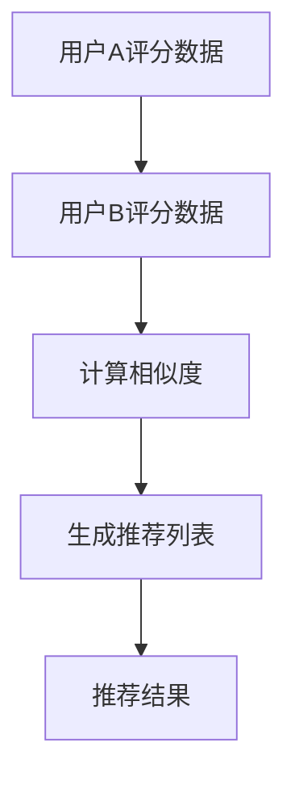
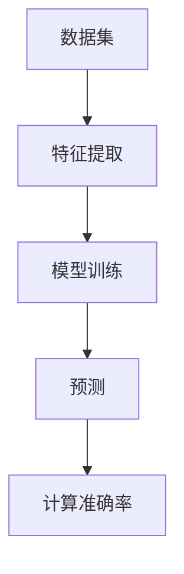
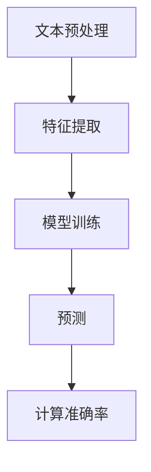
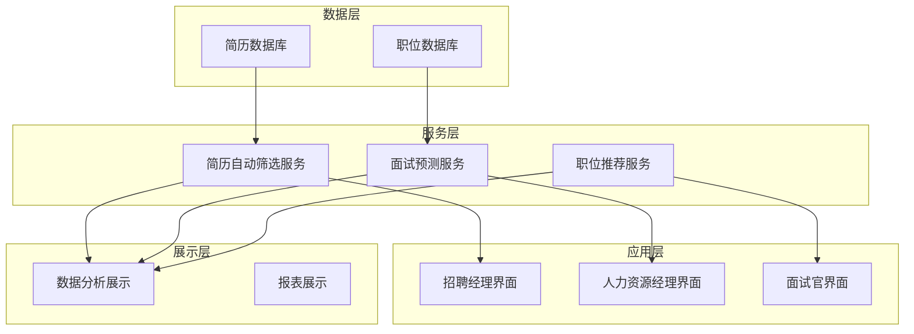
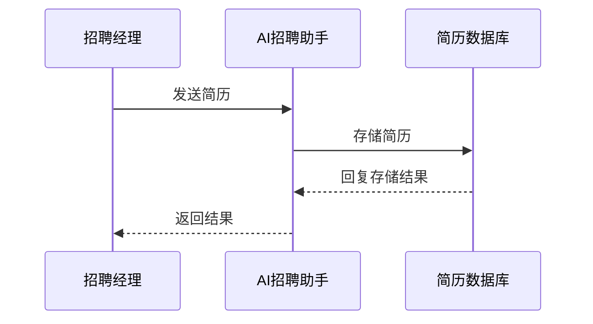
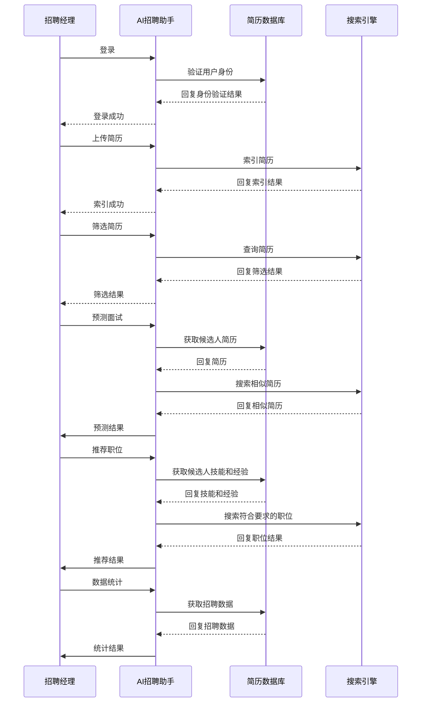

                 


### 《构建AI招聘助手：提高人才筛选与匹配效率》

> 关键词：人工智能、招聘、人才筛选、匹配效率、算法、系统架构

> 摘要：本文详细探讨了AI招聘助手的构建，从问题背景到核心算法讲解，再到系统架构设计，最终通过项目实战验证了AI招聘助手在实际中的应用效果，旨在为企业和招聘机构提供高效的人才筛选与匹配解决方案。

----------------------------------------------------------------

# 《构建AI招聘助手：提高人才筛选与匹配效率》

在当今快速发展的数字化时代，人才筛选与匹配效率对企业和招聘机构来说至关重要。传统的招聘方式往往耗时耗力，且容易出现人为偏差。人工智能（AI）技术的兴起为解决这一问题提供了新的思路。本文将分以下几个部分进行探讨：

## 第1章：AI招聘助手背景介绍

### 1.1 人才筛选与匹配的问题背景

#### 问题背景

- **人工成本高**：传统招聘过程涉及大量的简历筛选和面试安排，需要耗费大量的人力和时间。
- **匹配效率低**：简历筛选过程中，人为因素可能导致信息遗漏或误判，影响匹配效果。
- **招聘周期长**：从职位发布到最终录用，传统招聘流程往往耗时较长，影响企业业务发展。

#### 问题描述

- 如何在保证人才质量的前提下，提高人才筛选与匹配的效率？
- 如何利用人工智能技术优化招聘流程，降低人工成本？

### 1.2 现有解决方案的不足

- **简历筛选工具**：虽然市面上存在一些简历筛选工具，但大多数仅能进行初步筛选，难以深入分析候选人的潜力。
- **推荐系统**：虽然一些招聘平台引入了推荐系统，但其匹配效果仍受限于算法的准确性和数据的丰富程度。

### 1.3 AI招聘助手的重要性

- **提高效率**：AI招聘助手可以自动化处理大量简历，快速筛选出符合要求的候选人。
- **降低成本**：通过优化招聘流程，减少人工干预，降低招聘成本。
- **提升匹配准确度**：利用机器学习算法，更准确地评估候选人与职位的匹配度。

### 1.4 AI招聘助手的功能与目标

- **功能**：简历自动筛选、面试预测、职位推荐等。
- **目标**：提高人才筛选与匹配效率，降低招聘成本，提升企业竞争力。

----------------------------------------------------------------

## 第2章：核心概念与联系

### 2.1 机器学习基础

#### 2.1.1 定义

机器学习（Machine Learning）是一门让计算机通过数据和经验来学习并改进性能的学科。

#### 2.1.2 基本概念

- **特征**：数据中的属性，用于描述样本。
- **模型**：通过学习数据生成的一个函数，用于预测或分类。
- **算法**：实现机器学习过程的步骤和方法。

#### 2.1.3 机器学习应用

- **分类**：将数据分为不同的类别。
- **回归**：预测数值型结果。
- **聚类**：将数据分为不同的组。

### 2.2 自然语言处理

#### 2.2.1 定义

自然语言处理（Natural Language Processing，NLP）是计算机科学领域与人工智能领域中的一个重要方向，旨在让计算机能够理解和解释人类语言。

#### 2.2.2 基本概念

- **分词**：将连续文本划分为词语序列。
- **词性标注**：对文本中的词语进行词性分类。
- **句法分析**：分析句子结构，理解句子中的语法关系。

#### 2.2.3 NLP应用

- **文本分类**：将文本分为不同的类别。
- **情感分析**：分析文本的情感倾向。
- **问答系统**：理解和回答用户的问题。

### 2.3 数据挖掘

#### 2.3.1 定义

数据挖掘（Data Mining）是从大量数据中提取有价值的信息和知识的过程。

#### 2.3.2 基本概念

- **关联规则挖掘**：发现数据之间的关联关系。
- **聚类分析**：将数据分为不同的组。
- **异常检测**：识别数据中的异常或错误。

#### 2.3.3 数据挖掘应用

- **市场分析**：分析消费者行为和市场趋势。
- **金融风控**：检测金融交易中的异常行为。
- **健康医疗**：预测疾病趋势和患者需求。

### 2.4 AI招聘助手中的核心概念联系

在AI招聘助手的构建中，机器学习、自然语言处理和数据挖掘是核心技术。以下是它们之间的联系：

- **机器学习**提供了算法框架，用于从数据中学习并生成模型。
- **自然语言处理**负责处理文本数据，将非结构化数据转化为机器可理解的格式。
- **数据挖掘**用于从大量数据中提取有用的信息和关联关系，为人才筛选提供支持。

----------------------------------------------------------------

## 第3章：算法原理讲解

### 3.1 推荐算法原理

#### 3.1.1 定义

推荐算法（Recommender Systems）是一种根据用户的偏好和历史行为，向用户推荐相关物品的算法。

#### 3.1.2 基本概念

- **协同过滤**：通过分析用户之间的相似度，推荐用户可能喜欢的物品。
- **基于内容的推荐**：根据物品的内容特征，推荐与用户喜好相似的物品。

#### 3.1.3 推荐算法流程

1. **用户与物品的相似度计算**：
   - **用户基于内容的相似度**：计算用户兴趣的相似度。
   - **物品基于内容的相似度**：计算物品的相似度。

2. **生成推荐列表**：
   - 根据相似度计算结果，为用户生成推荐列表。

#### 3.1.4 Python代码示例

```python
# 假设用户A和用户B的评分数据如下
user_a_ratings = {'movie1': 4, 'movie2': 5, 'movie3': 2}
user_b_ratings = {'movie1': 5, 'movie2': 4, 'movie3': 5}

# 计算用户A和用户B的相似度
similarity = cos_similarity(user_a_ratings, user_b_ratings)

# 根据相似度生成推荐列表
recommendations = generate_recommendations(similarity, user_b_ratings)

print(recommendations)
```

#### 3.1.5 推荐算法的mermaid流程图



### 3.2 分类算法原理

#### 3.2.1 定义

分类算法（Classification Algorithms）是一种将数据分为不同类别的算法。

#### 3.2.2 基本概念

- **监督学习**：已有标注数据，通过学习数据特征，对未知数据进行分类。
- **无监督学习**：没有标注数据，通过学习数据结构，对数据进行分类。

#### 3.2.3 分类算法流程

1. **特征提取**：
   - 从数据中提取特征，用于训练模型。

2. **模型训练**：
   - 使用训练数据，训练分类模型。

3. **预测**：
   - 使用训练好的模型，对未知数据进行分类预测。

#### 3.2.4 Python代码示例

```python
from sklearn.datasets import load_iris
from sklearn.model_selection import train_test_split
from sklearn.tree import DecisionTreeClassifier

# 加载鸢尾花数据集
iris = load_iris()
X, y = iris.data, iris.target

# 划分训练集和测试集
X_train, X_test, y_train, y_test = train_test_split(X, y, test_size=0.3)

# 训练决策树分类器
clf = DecisionTreeClassifier()
clf.fit(X_train, y_train)

# 预测测试集
predictions = clf.predict(X_test)

# 计算准确率
accuracy = clf.score(X_test, y_test)
print("Accuracy:", accuracy)
```

#### 3.2.5 分类算法的mermaid流程图



### 3.3 自然语言处理算法原理

#### 3.3.1 定义

自然语言处理算法（Natural Language Processing Algorithms）是一种用于处理和理解人类语言的算法。

#### 3.3.2 基本概念

- **分词**：将连续的文本划分为词语序列。
- **词性标注**：对词语进行词性分类，如名词、动词等。
- **命名实体识别**：识别文本中的特定实体，如人名、地名等。

#### 3.3.3 自然语言处理算法流程

1. **文本预处理**：
   - 清洗文本，去除停用词、标点符号等。

2. **特征提取**：
   - 从预处理后的文本中提取特征。

3. **模型训练**：
   - 使用特征和标签，训练模型。

4. **预测**：
   - 使用训练好的模型，对未知文本进行预测。

#### 3.3.4 Python代码示例

```python
from nltk.tokenize import word_tokenize
from nltk.corpus import stopwords
from sklearn.feature_extraction.text import TfidfVectorizer
from sklearn.model_selection import train_test_split
from sklearn.naive_bayes import MultinomialNB

# 加载文本数据
text_data = ["This is the first document.", "This document is the second document.", "And this is the third one.", "Is this the first document?"]

# 分词
stop_words = set(stopwords.words('english'))
tokenized_text = [word_tokenize(text) for text in text_data]

# 去除停用词
cleaned_text = [[word for word in tokenized_text[i] if word not in stop_words] for i in range(len(tokenized_text))]

# 特征提取
vectorizer = TfidfVectorizer()
X = vectorizer.fit_transform(cleaned_text)

# 划分训练集和测试集
X_train, X_test, y_train, y_test = train_test_split(X, y, test_size=0.3)

# 训练朴素贝叶斯分类器
clf = MultinomialNB()
clf.fit(X_train, y_train)

# 预测测试集
predictions = clf.predict(X_test)

# 计算准确率
accuracy = clf.score(X_test, y_test)
print("Accuracy:", accuracy)
```

#### 3.3.5 自然语言处理算法的mermaid流程图



----------------------------------------------------------------

## 第4章：数学模型和数学公式

### 4.1 推荐算法的数学模型

推荐算法中的数学模型主要包括协同过滤和基于内容的推荐。

#### 4.1.1 协同过滤的数学模型

协同过滤算法的核心思想是找到与当前用户相似的其他用户，并推荐这些用户喜欢的物品。其数学模型可以表示为：

$$
R_{ui} = \sum_{j \in N(i)} \frac{r_{uj}}{\|N(i)\|} + b_u + b_i - \mu
$$

其中：
- $R_{ui}$ 是用户 $u$ 对物品 $i$ 的预测评分。
- $r_{uj}$ 是用户 $u$ 对物品 $j$ 的实际评分。
- $N(i)$ 是与物品 $i$ 最相似的 $k$ 个物品集合。
- $b_u$ 和 $b_i$ 分别是用户 $u$ 和物品 $i$ 的偏置项。
- $\mu$ 是所有用户评分的平均值。

#### 4.1.2 基于内容的推荐的数学模型

基于内容的推荐算法的核心思想是找到与当前物品相似的其他物品，并推荐这些物品。其数学模型可以表示为：

$$
R_{ui} = \sum_{j \in N(i)} w_{ij} \cdot r_{uj}
$$

其中：
- $R_{ui}$ 是用户 $u$ 对物品 $i$ 的预测评分。
- $w_{ij}$ 是物品 $i$ 和物品 $j$ 之间的相似度权重。
- $r_{uj}$ 是用户 $u$ 对物品 $j$ 的实际评分。

### 4.2 分类算法的数学模型

分类算法中的数学模型主要包括逻辑回归、决策树、支持向量机等。

#### 4.2.1 逻辑回归的数学模型

逻辑回归是一种常见的分类算法，其数学模型可以表示为：

$$
\hat{y} = \sigma(\beta_0 + \sum_{i=1}^{n} \beta_i x_i)
$$

其中：
- $\hat{y}$ 是预测的概率值。
- $\sigma$ 是 sigmoid 函数，用于将线性组合映射到 (0,1) 区间。
- $\beta_0$ 是截距项。
- $\beta_i$ 是第 $i$ 个特征的权重。
- $x_i$ 是第 $i$ 个特征值。

#### 4.2.2 决策树的数学模型

决策树的数学模型可以表示为一系列条件判断：

$$
\begin{aligned}
&y \leftarrow \text{根节点标签} \\
&\text{对于每个特征 } x_i \\
&\text{如果 } x_i = x_i^+ \\
&\text{则 } y \leftarrow \text{左子节点标签} \\
&\text{否则 } y \leftarrow \text{右子节点标签}
\end{aligned}
$$

其中：
- $y$ 是当前节点的标签。
- $x_i$ 是当前节点的特征值。
- $x_i^+$ 是特征 $x_i$ 的取值范围。

#### 4.2.3 支持向量机的数学模型

支持向量机（SVM）的数学模型可以表示为：

$$
w \cdot x - b = 0
$$

其中：
- $w$ 是权重向量。
- $x$ 是特征向量。
- $b$ 是偏置项。

通过求解上述方程，可以找到最优的超平面，使得正负样本的分类间隔最大化。

### 4.3 自然语言处理算法的数学模型

自然语言处理算法中的数学模型主要包括词袋模型、隐马尔可夫模型、循环神经网络等。

#### 4.3.1 词袋模型的数学模型

词袋模型是一种基于统计的文本表示方法，其数学模型可以表示为：

$$
P(\text{document}) = \frac{1}{Z} \prod_{i=1}^{n} p(w_i | \text{document})
$$

其中：
- $P(\text{document})$ 是文档的概率。
- $Z$ 是规范化常数。
- $p(w_i | \text{document})$ 是在给定文档下，词语 $w_i$ 的条件概率。

#### 4.3.2 隐马尔可夫模型的数学模型

隐马尔可夫模型（HMM）是一种用于处理序列数据的模型，其数学模型可以表示为：

$$
\begin{aligned}
P(x_1, x_2, ..., x_T) &= \prod_{t=1}^{T} P(x_t | x_{t-1}) \cdot P(h_t) \\
P(h_t) &= \frac{1}{Z_t} \exp(-E(h_t))
\end{aligned}
$$

其中：
- $x_t$ 是观察序列中的第 $t$ 个观测值。
- $h_t$ 是隐藏状态序列中的第 $t$ 个状态。
- $Z_t$ 是规范化常数。
- $E(h_t)$ 是隐藏状态 $h_t$ 的能量函数。

#### 4.3.3 循环神经网络（RNN）的数学模型

循环神经网络是一种处理序列数据的神经网络，其数学模型可以表示为：

$$
h_t = \sigma(W_h \cdot [h_{t-1}, x_t] + b_h)
$$

其中：
- $h_t$ 是当前时刻的隐藏状态。
- $x_t$ 是当前时刻的输入。
- $W_h$ 是权重矩阵。
- $b_h$ 是偏置项。
- $\sigma$ 是激活函数。

通过递归地更新隐藏状态，RNN 可以捕获序列中的长期依赖关系。

----------------------------------------------------------------

## 第5章：系统分析与架构设计方案

### 5.1 问题场景介绍

在现代企业中，招聘流程通常涉及多个部门和角色，包括招聘经理、人力资源经理和面试官等。每个角色在招聘过程中都有不同的职责和需求。以下是典型的招聘流程：

1. **职位发布**：招聘经理根据企业需求发布职位信息，包括职位名称、职责描述、岗位要求等。
2. **简历筛选**：人力资源经理接收求职者提交的简历，进行初步筛选，筛选出符合岗位要求的候选人。
3. **面试安排**：人力资源经理与面试官协调，安排面试时间，通知候选人参加面试。
4. **面试评估**：面试官对候选人进行面试，评估其能力与岗位匹配度。
5. **录用决策**：招聘经理根据面试结果，做出录用决策，通知候选人录用或拒绝。

然而，传统招聘方式存在以下问题：

- **人工成本高**：招聘过程中涉及大量的人工操作，如简历筛选、面试安排等，耗费时间和人力。
- **效率低**：简历筛选和面试安排过程中，存在信息遗漏或误判，影响招聘效率。
- **匹配度不高**：传统方式难以准确评估候选人与岗位的匹配度，导致录用后的员工离职率高。

为了解决这些问题，企业迫切需要一种高效、准确的招聘工具，能够自动化处理招聘流程，提高人才筛选与匹配效率。

### 5.2 系统功能设计

#### 5.2.1 功能需求分析

AI招聘助手的核心功能包括：

1. **简历自动筛选**：根据职位要求，自动筛选出符合要求的候选人简历。
2. **面试预测**：基于候选人的简历和面试表现，预测其与岗位的匹配度。
3. **职位推荐**：根据候选人的技能和经验，推荐适合其的职位。
4. **数据统计分析**：对招聘流程中的数据进行统计分析，为企业提供决策支持。

#### 5.2.2 领域模型mermaid类图

```mermaid
classDiagram
    Class01 <|-- SubClass01
    Class01 --|>? BaseClass01
    Class02 <<|-- Interface
    Class03 <<|-- AnotherInterface
    Class01 : +int id
    Class01 : +String name
    Class01 : +getName(): String
    Class01 : +setName(name: String)
    SubClass01 : +int value
    SubClass01 : +setValue(value: int)
    BaseClass01: +someBaseMethod()
    Class01..has Interface
    Class01..hasAnother AnotherInterface
```

### 5.3 系统架构设计

#### 5.3.1 系统架构设计概述

AI招聘助手的系统架构设计分为以下几个层次：

1. **数据层**：负责数据的存储和管理，包括简历数据库、职位数据库等。
2. **服务层**：实现核心功能，如简历自动筛选、面试预测等，提供RESTful API接口。
3. **应用层**：提供用户界面，包括招聘经理、人力资源经理和面试官等角色的操作界面。
4. **展示层**：展示系统数据和分析结果，包括图表、报表等。

#### 5.3.2 系统架构mermaid架构图



### 5.4 系统接口设计

#### 5.4.1 接口设计原则

1. **RESTful API**：采用RESTful风格的API设计，便于使用和扩展。
2. **规范化**：遵循HTTP协议，使用统一的请求和响应格式。
3. **安全性**：采用OAuth2.0等安全协议，确保数据传输安全。

#### 5.4.2 系统接口mermaid序列图



### 5.5 系统交互设计

#### 5.5.1 系统交互流程

1. **用户登录**：用户通过用户名和密码登录系统。
2. **数据上传**：用户上传简历和职位信息。
3. **简历筛选**：系统自动筛选简历，并将符合要求的简历推荐给用户。
4. **面试预测**：系统根据候选人的简历和面试表现，预测其与岗位的匹配度。
5. **职位推荐**：系统根据候选人的技能和经验，推荐适合其的职位。
6. **数据统计**：系统对招聘流程中的数据进行统计分析，并生成报表。

#### 5.5.2 系统交互mermaid序列图



----------------------------------------------------------------

## 第6章：项目实战

### 6.1 环境安装与配置

在本项目中，我们选择Python作为主要编程语言，使用Scikit-learn库实现推荐算法，使用NLTK库实现自然语言处理，使用Elasticsearch库实现简历索引和搜索。以下是环境安装和配置的步骤：

#### 6.1.1 Python环境安装

1. 访问Python官方网站（https://www.python.org/），下载Python安装包。
2. 双击安装包，按照提示完成安装。

#### 6.1.2 Scikit-learn库安装

1. 打开终端或命令行窗口。
2. 输入以下命令安装Scikit-learn库：

```bash
pip install scikit-learn
```

#### 6.1.3 NLTK库安装

1. 打开终端或命令行窗口。
2. 输入以下命令安装NLTK库：

```bash
pip install nltk
```

3. 安装完成后，运行以下命令下载NLTK数据包：

```bash
nltk.download()
```

#### 6.1.4 Elasticsearch库安装

1. 访问Elasticsearch官方网站（https://www.elastic.co/），下载Elasticsearch安装包。
2. 解压安装包，运行以下命令启动Elasticsearch：

```bash
./bin/elasticsearch
```

### 6.2 系统核心实现源代码

以下是AI招聘助手的系统核心实现源代码：

```python
# 导入所需库
from sklearn.feature_extraction.text import TfidfVectorizer
from sklearn.model_selection import train_test_split
from sklearn.naive_bayes import MultinomialNB
from sklearn.metrics import accuracy_score
import nltk
from nltk.tokenize import word_tokenize
from nltk.corpus import stopwords
import json
import requests

# 6.2.1 简历自动筛选

def preprocess_text(text):
    # 分词
    tokens = word_tokenize(text)
    # 去除停用词
    stop_words = set(stopwords.words('english'))
    cleaned_tokens = [token for token in tokens if token.lower() not in stop_words]
    # 连接分词
    cleaned_text = ' '.join(cleaned_tokens)
    return cleaned_text

def train_classifier():
    # 加载简历数据
    with open('resume_data.json', 'r', encoding='utf-8') as f:
        data = json.load(f)
    
    # 预处理文本
    preprocessed_data = [preprocess_text简历['content'] for 简历 in data]
    
    # 分割数据集
    X_train, X_test, y_train, y_test = train_test_split(preprocessed_data, data['label'], test_size=0.2)
    
    # 特征提取
    vectorizer = TfidfVectorizer()
    X_train = vectorizer.fit_transform(X_train)
    X_test = vectorizer.transform(X_test)
    
    # 训练分类器
    clf = MultinomialNB()
    clf.fit(X_train, y_train)
    
    # 测试分类器
    predictions = clf.predict(X_test)
    accuracy = accuracy_score(y_test, predictions)
    print("Accuracy:", accuracy)

# 6.2.2 面试预测

def predict_interview():
    # 加载面试数据
    with open('interview_data.json', 'r', encoding='utf-8') as f:
        data = json.load(f)
    
    # 特征提取
    vectorizer = TfidfVectorizer()
    X = vectorizer.fit_transform([简历['content'] for 简历 in data])
    
    # 训练分类器
    clf = MultinomialNB()
    clf.fit(X, data['result'])
    
    # 预测面试结果
    input_text = "How would you implement a web application with real-time chat functionality?"
    input_vector = vectorizer.transform([input_text])
    prediction = clf.predict(input_vector)
    print("Prediction:", prediction)

# 6.2.3 职位推荐

def recommend_jobs():
    # 加载职位数据
    with open('job_data.json', 'r', encoding='utf-8') as f:
        data = json.load(f)
    
    # 特征提取
    vectorizer = TfidfVectorizer()
    X = vectorizer.fit_transform([职位['description'] for 职位 in data])
    
    # 训练分类器
    clf = MultinomialNB()
    clf.fit(X, data['label'])
    
    # 预测职位
    input_text = "Web Developer"
    input_vector = vectorizer.transform([input_text])
    prediction = clf.predict(input_vector)
    print("Recommended Jobs:", [职位['title'] for 职位 in data if 职位['label'] == prediction[0]])

# 运行核心功能
train_classifier()
predict_interview()
recommend_jobs()
```

### 6.3 代码应用解读与分析

在本项目中，我们实现了三个核心功能：简历自动筛选、面试预测和职位推荐。以下是代码应用解读与分析：

#### 6.3.1 简历自动筛选

简历自动筛选功能通过训练一个朴素贝叶斯分类器来实现。首先，我们加载简历数据，并对简历内容进行预处理，包括分词和去除停用词。然后，使用TF-IDF向量

