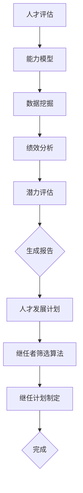

                 


### 让我们一步步思考：构建AI驱动的企业人才发展与继任计划系统

在当今快速变化和竞争激烈的商业环境中，企业需要不断地适应和创新以保持竞争力。人才是企业最宝贵的资产，因此，企业的人才发展和继任计划变得至关重要。引入人工智能（AI）技术，可以极大地提升这些流程的效率和效果。下面，我们将分步骤探讨如何构建一个AI驱动的企业人才发展与继任计划系统。

#### 第一步：明确目标和需求

在构建任何系统之前，明确目标和需求是至关重要的。对于企业人才发展和继任计划系统，我们的目标是：
- **提高人才识别和培养的准确性**：利用AI技术分析员工的能力、潜力和职业发展路径。
- **优化人才分配和岗位匹配**：基于员工的技能和职业规划，自动推荐最适合的岗位。
- **提供个性化培训建议**：根据员工的职业发展和企业需求，提供个性化的培训计划。
- **制定有效的继任计划**：预测关键岗位的继任者，确保企业的持续发展。

#### 第二步：背景介绍

**AI与人才发展**

- **AI的基本概念**：人工智能是通过模拟人类智能行为来实现自动化和智能化的技术。它包括机器学习、深度学习、自然语言处理等多个领域。
- **AI在人才发展中的应用**：AI可以通过数据分析、模式识别和预测模型，帮助企业更好地理解员工的表现、潜力和发展需求。

**继任计划系统**

- **继任计划系统的概念**：继任计划是指为了确保企业长期发展，提前确定并培养潜在的高层管理者和关键岗位的接班人。
- **继任计划系统的重要性**：一个有效的继任计划可以确保企业的平稳过渡，避免因领导层变动导致的企业运营中断。

#### 第三步：核心概念与联系

**核心概念**

- **人才发展**：包括员工的招聘、培训、评估和职业发展。
- **继任计划**：确定并培养企业的潜在高层管理者和关键岗位的接班人。

**概念之间的联系**

- **人才发展与继任计划**：人才发展是继任计划的基础，而继任计划则是人才发展的延伸。两者相辅相成，共同确保企业的可持续发展。

#### 第四步：系统分析与架构设计

**系统分析**

- **问题场景**：企业面临人才流失、人才短缺和继任者缺乏等问题。
- **系统功能设计**：包括人才库管理、能力评估、职业发展路径规划、继任者筛选等。

**架构设计**

- **领域模型**：定义系统中的关键实体和关系，如员工、岗位、培训课程等。
- **系统架构**：包括前端、后端和数据存储等组成部分。
- **接口设计**：设计系统与外部系统的交互接口，如人力资源管理系统、培训系统等。

#### 第五步：算法原理讲解

**算法原理**

- **人才评估算法**：基于员工的绩效数据和职业发展轨迹，评估其能力和潜力。
- **继任者筛选算法**：通过分析企业内部的人才库，预测潜在的继任者。

**算法流程图**：



**Python源代码**：

```python
# 人才评估算法示例
def assess_employee_performance(employee_data):
    # 分析员工数据
    performance_score = analyze_data(employee_data)
    # 评估员工潜力
    potential_score = assess_potential(employee_data)
    # 综合评分
    total_score = performance_score + potential_score
    return total_score

# 继任者筛选算法示例
def select_successor(talent_pool, critical_jobs):
    # 分析人才库
    potential_successors = analyze_talent_pool(talent_pool, critical_jobs)
    # 选择最佳继任者
    best_successor = select_best(potential_successors)
    return best_successor
```

#### 第六步：项目实战

**环境安装**：

- 安装所需的软件和库，如Python、Scikit-learn、TensorFlow等。
- 配置数据库，如MySQL或MongoDB。

**系统核心实现**：

- 实现人才库管理功能，包括员工信息录入、查询和更新。
- 实现能力评估和潜力评估算法。
- 实现继任者筛选算法和继任计划制定功能。

**代码应用解读与分析**：

- 分析算法的实现细节和性能表现。
- 对实际案例进行剖析，展示系统的应用效果。

**案例分析与详细讲解**：

- 分析企业A的人才发展和继任计划案例。
- 详细讲解系统的设计思路、实现方法和应用效果。

**项目小结**：

- 总结项目的主要成果和经验。
- 提出改进建议和未来研究方向。

#### 第七步：最佳实践与总结

**最佳实践**：

- 提供制定人才发展和继任计划的具体步骤和注意事项。
- 强调数据质量和算法优化的重要性。

**小结**：

- 总结AI驱动的企业人才发展与继任计划系统的核心内容和关键点。
- 强调系统对企业发展的战略意义。

**注意事项**：

- 关注数据隐私和安全问题。
- 定期评估和调整系统。

**拓展阅读**：

- 推荐相关的书籍、论文和网站，以供进一步学习。

### 结论

构建AI驱动的企业人才发展与继任计划系统是一项复杂的任务，需要综合考虑企业的战略目标、人才需求和技术实现。通过本篇博客，我们探讨了系统构建的各个关键步骤，包括明确目标、背景介绍、核心概念与联系、系统分析与架构设计、算法原理讲解、项目实战和最佳实践。希望本文能为读者提供有价值的参考和启示。

**作者：AI天才研究院/AI Genius Institute & 禅与计算机程序设计艺术 /Zen And The Art of Computer Programming**

