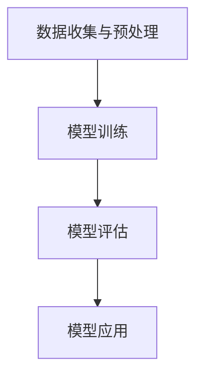
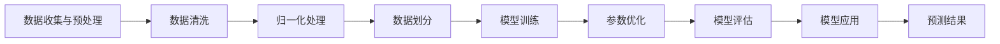
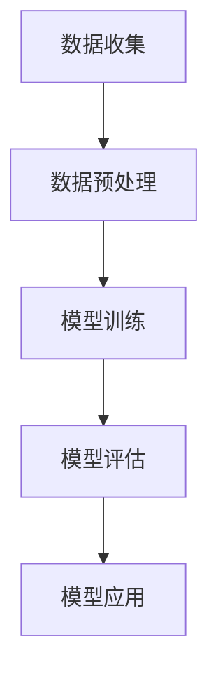
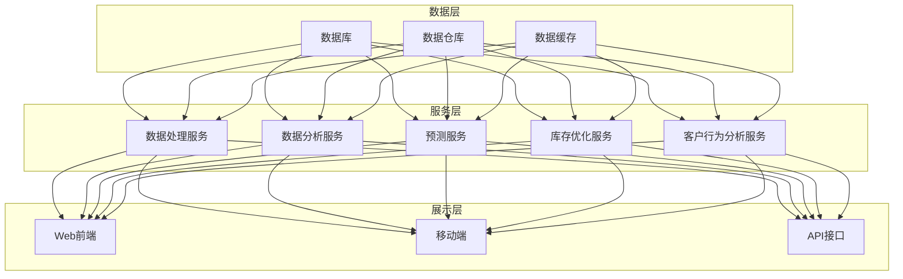
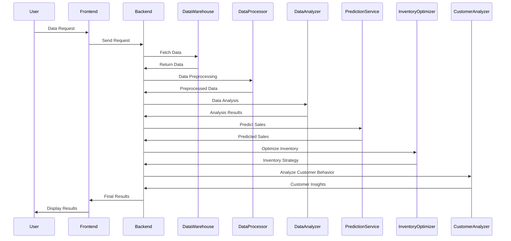

                 

### 引入：构建AI驱动的企业创新生态系统分析平台

在当今全球商业环境中，企业竞争愈发激烈，创新能力成为企业持续发展的关键驱动力。然而，传统企业创新模式往往面临资源分散、效率低下、响应速度慢等挑战。随着人工智能（AI）技术的飞速发展，AI成为推动企业创新的重要工具。为了应对这些挑战，构建一个AI驱动的企业创新生态系统分析平台显得尤为重要。

企业创新生态系统分析平台是一个集数据收集、分析、处理和可视化于一体的综合性系统，通过AI技术对企业内外部的数据进行分析，为企业提供洞察力，助力企业快速响应市场变化，进行持续创新。本篇文章将深入探讨构建AI驱动的企业创新生态系统分析平台的方法与步骤，分析其核心概念、算法原理、系统架构设计以及项目实战经验，为读者提供一份详尽的技术指南。

接下来，我们将从以下几个方面展开讨论：

1. **问题的提出与解决**：介绍AI驱动的企业创新生态系统分析平台的背景和需求。
2. **核心概念与联系**：详细讲解AI、创新生态系统和AI驱动的企业创新生态系统分析平台的核心概念。
3. **算法原理讲解**：分析算法原理，并给出Python源代码实现和数学模型。
4. **系统分析与架构设计方案**：介绍问题场景、项目介绍、系统功能设计、系统架构设计、系统接口设计和系统交互序列图。
5. **项目实战**：介绍环境安装、系统核心实现、代码应用分析、实际案例剖析和项目小结。
6. **最佳实践与总结**：总结最佳实践、注意事项和未来展望。

通过以上步骤，我们将一步步剖析构建AI驱动的企业创新生态系统分析平台的各个方面，帮助读者全面理解这一领域，并在实际项目中应用这些知识。

## 问题的提出与解决

### 1.1 问题的背景

在当前的商业环境中，企业之间的竞争愈发激烈，创新能力成为企业持续发展的关键驱动力。然而，传统企业创新模式往往面临以下挑战：

- **资源分散**：企业内部资源分散，难以集中力量进行创新。
- **效率低下**：传统的创新流程复杂且冗长，难以快速响应市场变化。
- **响应速度慢**：企业在面对市场变化时，反应速度较慢，容易错失市场机会。
- **数据利用不充分**：企业内部数据资源未能充分利用，导致创新决策缺乏数据支持。

为了解决这些问题，企业需要寻找一种能够高效利用资源、快速响应市场变化、充分利用数据的新方法。而人工智能（AI）技术在这一背景下成为了一个强有力的工具。

### 1.2 AI技术在企业中的应用

人工智能技术在企业中的应用已经越来越广泛，特别是在数据分析和决策支持方面。以下是一些AI技术在企业中的具体应用：

- **数据分析**：通过机器学习算法，AI可以处理和分析大量数据，发现潜在的模式和趋势，为企业的战略决策提供数据支持。
- **客户行为预测**：利用AI技术，企业可以预测客户的行为和偏好，从而更好地制定营销策略。
- **自动化流程**：AI技术可以帮助企业自动化重复性的工作流程，提高工作效率，减少人为错误。
- **智能客服**：通过自然语言处理技术，AI可以为企业提供智能客服服务，提高客户满意度。
- **供应链优化**：AI技术可以帮助企业优化供应链管理，提高供应链效率，降低成本。

### 1.3 问题描述

面对上述传统企业创新模式的挑战，企业需要一个能够高效利用AI技术，为企业提供创新支持的平台。具体来说，问题描述如下：

- **创新效率低下**：企业传统的创新模式效率低下，难以快速响应市场需求。
- **数据利用不充分**：企业内部的数据资源未能充分利用，导致创新决策缺乏数据支持。
- **资源分散**：企业内部资源分散，难以集中力量进行创新。

### 1.4 问题解决

为了解决上述问题，企业需要一个AI驱动的企业创新生态系统分析平台。该平台旨在通过以下方式提升企业的创新能力：

- **数据收集与整合**：平台能够收集企业内外部的数据，并进行整合，为后续分析提供基础数据。
- **数据分析和处理**：利用AI技术，对整合后的数据进行深入分析，发现潜在的商业机会和趋势。
- **可视化与洞察**：通过数据可视化技术，将分析结果以直观的方式呈现，为企业提供决策支持。
- **快速响应市场变化**：平台能够快速响应市场变化，为企业提供及时的创新建议。

### 1.5 边界与外延

该平台主要面向需要提高创新效率和响应速度的中大型企业，特别是那些拥有大量数据资源的企业。以下是一些边界与外延：

- **适用范围**：适用于需要数据驱动的创新决策支持的企业，如制造业、金融业、零售业等。
- **非适用场景**：不适用于那些对数据分析和AI技术需求较低的小型企业，或那些数据资源有限的企业。

通过构建AI驱动的企业创新生态系统分析平台，企业能够更有效地利用内部和外部资源，快速响应市场变化，从而在激烈的市场竞争中立于不败之地。

### 1.6 AI驱动的企业创新生态系统分析平台概述

AI驱动的企业创新生态系统分析平台是一个集成化的系统，旨在通过人工智能技术提升企业的创新能力和市场响应速度。以下是平台的核心功能和特点：

#### 1.6.1 数据收集与整合

平台首先需要收集企业内外部的数据，包括销售数据、客户反馈、市场趋势、竞争对手信息等。通过数据集成模块，平台能够将这些分散的数据进行整合，形成统一的数据视图，为后续分析提供基础数据。

#### 1.6.2 数据预处理

数据收集后，平台会进行数据预处理，包括数据清洗、去重、格式转换等操作。这一步骤确保了数据的质量和一致性，为后续的分析工作奠定了基础。

#### 1.6.3 数据分析

利用机器学习算法，平台会对预处理后的数据进行分析，发现潜在的模式和趋势。这些分析结果可以帮助企业了解市场动态、客户需求、竞争对手策略等，从而为创新决策提供数据支持。

#### 1.6.4 数据可视化

平台的数据可视化功能能够将分析结果以图表、报表等形式直观地呈现，使企业决策者能够快速理解数据背后的含义，做出更明智的决策。

#### 1.6.5 快速响应市场变化

通过实时数据分析，平台能够快速响应市场变化，为企业提供及时的创新建议。例如，当市场趋势发生变化时，平台可以迅速分析影响，并提出相应的创新策略。

#### 1.6.6 自动化流程

平台还具备自动化流程的功能，能够帮助企业自动化重复性的工作流程，提高工作效率，减少人为错误。例如，通过自然语言处理技术，平台可以自动化处理大量的客户咨询，提高客户满意度。

#### 1.6.7 安全性

平台采用了一系列安全措施，包括数据加密、访问控制等，确保数据的安全和隐私。

通过以上核心功能和特点，AI驱动的企业创新生态系统分析平台能够帮助企业更高效地利用数据资源，快速响应市场变化，提升创新能力，从而在激烈的市场竞争中取得优势。

### 1.7 平台的核心功能和特点

AI驱动的企业创新生态系统分析平台的核心功能与特点如下：

#### 1.7.1 智能数据分析

平台利用先进的机器学习算法和自然语言处理技术，对海量的企业内外部数据进行分析，揭示数据中的潜在模式和趋势。通过这些分析结果，企业可以更深入地理解市场动态、客户需求以及竞争对手的策略，从而为创新决策提供强有力的数据支持。

#### 1.7.2 数据可视化

平台的数据可视化功能强大，能够将复杂的分析结果以图表、报表等形式直观地呈现。这不仅帮助决策者快速理解数据背后的含义，还提高了决策的效率和准确性。

#### 1.7.3 实时监控与响应

平台具备实时监控功能，能够对企业运营中的关键指标进行持续监测。当发现市场变化或异常情况时，平台能够立即生成报警信息，并提供相应的应对策略，帮助企业迅速做出响应。

#### 1.7.4 自动化流程

通过自动化技术，平台可以自动化处理大量的重复性工作，如数据收集、清洗、分析等。这不仅提高了工作效率，还减少了人为错误，确保数据的准确性和一致性。

#### 1.7.5 安全与隐私保护

平台采用了一系列安全措施，包括数据加密、访问控制、防火墙等，确保企业的数据安全和隐私。同时，平台遵循相关数据保护法规，确保合规运营。

#### 1.7.6 模块化设计

平台采用模块化设计，可以根据企业的需求进行灵活配置。无论是数据收集、预处理，还是数据分析、可视化，企业都可以根据实际需求选择相应的模块，实现最优的资源配置。

#### 1.7.7 易于扩展

平台具有良好的扩展性，可以随着企业的发展不断扩展其功能。例如，企业可以增加新的数据分析模块，或引入新的机器学习算法，以满足不断变化的需求。

通过上述核心功能和特点，AI驱动的企业创新生态系统分析平台能够帮助企业高效利用数据资源，快速响应市场变化，提升创新能力，从而在激烈的市场竞争中立于不败之地。

### 1.8 平台的适用范围

AI驱动的企业创新生态系统分析平台主要适用于需要数据驱动的创新决策支持的中大型企业。以下是一些具体的适用场景：

1. **制造业**：制造业企业可以通过平台对生产数据、销售数据和市场反馈进行分析，优化生产流程、提高产品质量、预测市场需求。
2. **金融业**：金融企业可以利用平台对客户数据、市场数据进行分析，进行风险控制、投资决策和客户关系管理。
3. **零售业**：零售企业可以通过平台分析销售数据、客户行为，进行库存管理、定价策略和市场推广。
4. **科技行业**：科技企业可以利用平台对市场趋势、竞争对手进行分析，快速响应市场变化，进行技术创新和产品开发。

总体来说，任何需要通过数据分析和预测进行决策的企业，都可以从AI驱动的企业创新生态系统分析平台中获益。

### 1.9 非适用场景

尽管AI驱动的企业创新生态系统分析平台具有强大的功能和广泛的应用场景，但它并非适用于所有企业。以下是一些非适用场景：

1. **小型企业**：平台主要面向中大型企业，对于数据资源和计算需求较小的小型企业，使用这样的平台可能会造成资源浪费。
2. **数据资源有限的企业**：如果企业内部的数据资源非常有限，且缺乏有效的数据收集和处理手段，那么使用AI驱动的平台可能无法发挥其应有的作用。
3. **不需要数据驱动的企业**：对于那些决策过程主要依赖经验和直觉的企业，如部分创意产业、手工艺品等，AI驱动的平台可能并不适用。

综上所述，企业在决定是否采用AI驱动的企业创新生态系统分析平台时，应综合考虑自身的业务特点、数据资源和决策需求。

### 1.10 平台的核心概念与要素组成

AI驱动的企业创新生态系统分析平台是一个复杂而综合的系统，其核心概念和要素组成包括以下几个方面：

#### 1.10.1 数据收集

平台首先需要具备高效的数据收集能力，从企业内外部多个渠道获取数据，包括销售数据、客户反馈、市场趋势、竞争对手信息等。数据收集模块应支持多种数据源接入，如数据库、API接口、文件系统等。

#### 1.10.2 数据预处理

数据收集后，需要进行预处理，以确保数据的质量和一致性。预处理步骤包括数据清洗、去重、格式转换等。数据预处理模块需要能够自动识别和修复数据中的错误，提高数据的准确性和可靠性。

#### 1.10.3 数据存储

平台需要具备高效的数据存储能力，将预处理后的数据进行存储和管理。数据存储模块应支持大规模数据的存储和快速查询，以便后续的数据分析和处理。

#### 1.10.4 数据分析

数据分析是平台的核心功能，通过机器学习算法和统计分析方法，对存储的数据进行深入分析，揭示数据中的潜在模式和趋势。数据分析模块应提供多样化的算法选择，如分类、回归、聚类等，以满足不同分析需求。

#### 1.10.5 数据可视化

数据可视化模块将分析结果以图表、报表等形式直观地呈现，帮助决策者快速理解数据背后的含义。可视化工具应支持多种图表类型，如柱状图、折线图、饼图等，并提供自定义报表功能。

#### 1.10.6 实时监控

实时监控模块能够对企业运营中的关键指标进行持续监测，当发现异常情况时，能够立即生成报警信息，并提供相应的应对策略。实时监控模块应支持多种报警机制，如邮件通知、短信通知、系统弹窗等。

#### 1.10.7 自动化流程

通过自动化技术，平台能够自动化处理大量的重复性工作，如数据收集、清洗、分析等。自动化流程模块应支持工作流的定义和执行，提高工作效率，减少人为错误。

#### 1.10.8 安全性

平台应具备严格的安全性措施，包括数据加密、访问控制、防火墙等，确保数据的安全和隐私。同时，平台应遵循相关数据保护法规，确保合规运营。

通过以上核心概念和要素的有机整合，AI驱动的企业创新生态系统分析平台能够高效地收集、处理和分析企业数据，为企业提供精准的市场洞察和决策支持，助力企业实现持续创新和快速发展。

### 2.1 AI驱动的概念

人工智能（AI）是指通过计算机模拟人类智能行为的技术。AI技术主要包括机器学习、深度学习、自然语言处理、计算机视觉等。其中，机器学习和深度学习是AI驱动企业创新的核心技术。

#### 2.1.1 机器学习

机器学习是一种使计算机从数据中学习模式并做出预测或决策的技术。它通过训练模型，使计算机能够在没有明确编程指令的情况下，对新的数据做出合理的判断。机器学习的主要任务包括分类、回归、聚类等。

#### 2.1.2 深度学习

深度学习是机器学习的一个分支，通过多层神经网络对大量数据进行训练，能够自动提取数据中的特征并建立预测模型。深度学习在图像识别、语音识别、自然语言处理等领域取得了显著成果。

#### 2.1.3 AI在企业中的应用

AI技术在企业中的应用非常广泛，以下是一些具体的应用场景：

- **数据分析与预测**：利用机器学习算法，企业可以分析大量历史数据，预测未来的销售趋势、客户需求等，为决策提供支持。
- **客户关系管理**：通过自然语言处理技术，企业可以自动化处理大量的客户咨询，提高客户满意度。
- **生产优化**：AI技术可以帮助企业优化生产流程，提高生产效率，降低成本。
- **安全监控**：利用计算机视觉技术，企业可以实时监控生产环境和员工行为，提高生产安全。

#### 2.1.4 AI驱动的特点

AI驱动的企业创新生态系统分析平台具有以下特点：

- **自动化**：AI技术能够自动化处理重复性工作，提高工作效率。
- **智能化**：通过学习和预测，AI可以为企业提供更准确的决策支持。
- **灵活性**：AI驱动的平台可以根据企业需求进行定制和扩展。
- **实时性**：AI驱动的平台能够实时监控和分析数据，及时响应市场变化。

通过以上特点，AI驱动的企业创新生态系统分析平台能够帮助企业高效利用数据资源，快速响应市场变化，提升创新能力。

### 2.2 创新生态系统的概念

创新生态系统是一种复杂的网络结构，包括企业、研究机构、供应商、客户、投资者等多个利益相关者。这些参与者通过相互合作、竞争和资源共享，共同推动创新活动的进行。

#### 2.2.1 创新生态系统的定义

创新生态系统是指一系列相互关联的实体和机构，通过合作、竞争和资源共享，共同推动创新活动的系统。这些实体和机构可以是企业、大学、研究机构、非营利组织、政府机构等。

#### 2.2.2 创新生态系统的结构

创新生态系统的结构通常包括以下几个关键组成部分：

- **企业**：创新生态系统的核心，通过研发和创新实现商业价值。
- **研究机构**：提供技术支持和知识资源，推动技术创新。
- **供应商**：为企业提供原材料、设备和技术支持。
- **客户**：需求驱动创新的重要来源，通过反馈和建议推动产品和服务改进。
- **投资者**：提供资金支持，促进创新活动的开展。
- **政府机构**：制定政策法规，为企业提供发展环境。

#### 2.2.3 创新生态系统的功能

创新生态系统具有以下功能：

- **资源共享**：通过协同合作，各成员可以共享资源，如技术、人才、资金等，降低创新成本。
- **知识交流**：通过交流与合作，各成员可以共享知识和经验，促进创新活动的进行。
- **竞争激励**：竞争机制能够激发企业的创新活力，推动技术创新。
- **风险分担**：通过合作，创新风险可以在多个成员之间进行分担，降低单个企业的创新风险。

#### 2.2.4 创新生态系统的角色

在创新生态系统中，各成员扮演着不同的角色：

- **领导者**：通常是行业领先企业，通过研发和创新引领整个生态系统的发展。
- **跟随者**：通过学习领导者的创新成果，进行改进和优化，提升自身竞争力。
- **合作伙伴**：通过合作，共同开发新产品、新技术，实现共赢。
- **服务提供者**：提供技术支持、咨询服务等，为创新活动提供保障。

#### 2.2.5 创新生态系统的动态性

创新生态系统是一个动态变化的系统，随着技术创新、市场变化和外部环境的变化，各成员之间的关系和角色也在不断调整。因此，企业需要不断适应和创新生态系统的变化，以保持竞争优势。

通过以上对创新生态系统的分析，我们可以看到，构建AI驱动的企业创新生态系统分析平台，有助于更好地整合和创新生态系统中的各类资源，提升企业的创新能力。

### 2.3 AI驱动的企业创新生态系统分析平台

AI驱动的企业创新生态系统分析平台是将人工智能技术应用于企业创新生态系统中的综合性系统，旨在通过数据分析和智能决策提升企业的创新能力。以下是平台的核心概念和要素组成：

#### 2.3.1 平台的核心概念

- **数据驱动**：平台以数据为核心，通过数据收集、处理和分析，为企业的创新决策提供支持。
- **智能决策**：利用机器学习和深度学习技术，平台能够自动分析数据，提供智能化的决策建议。
- **系统集成**：平台集成了多种技术和功能模块，包括数据收集、数据预处理、数据分析、数据可视化、实时监控和自动化流程等。
- **协同合作**：平台支持企业内部和与外部合作伙伴的协同合作，通过知识共享和资源整合，共同推动创新活动。

#### 2.3.2 平台的核心要素组成

1. **数据收集与整合模块**：负责收集企业内外部的数据，包括销售数据、客户反馈、市场趋势、竞争对手信息等，并进行整合，形成统一的数据视图。

2. **数据预处理模块**：对收集到的数据进行清洗、去重、格式转换等预处理操作，确保数据的质量和一致性。

3. **数据分析模块**：利用机器学习算法和深度学习技术，对预处理后的数据进行深入分析，发现潜在的模式和趋势，为企业的创新决策提供数据支持。

4. **数据可视化模块**：将分析结果以图表、报表等形式直观地呈现，帮助决策者快速理解数据背后的含义。

5. **实时监控模块**：对企业运营中的关键指标进行实时监测，当发现异常情况时，能够立即生成报警信息，并提供相应的应对策略。

6. **自动化流程模块**：通过自动化技术，自动化处理大量的重复性工作，如数据收集、清洗、分析等，提高工作效率。

7. **安全性模块**：采用严格的安全措施，包括数据加密、访问控制、防火墙等，确保数据的安全和隐私。

通过以上核心概念和要素的有机结合，AI驱动的企业创新生态系统分析平台能够为企业提供高效、智能的创新支持，帮助企业在激烈的市场竞争中取得优势。

### 2.4 概念属性特征对比表格

为了更清晰地展示AI驱动、企业创新生态系统和AI驱动的企业创新生态系统分析平台这三个概念之间的区别和联系，我们可以使用一个概念属性特征对比表格。以下是一个示例表格：

| 概念                   | 定义                                                         | 特点                                                         | 应用场景                 | 关键要素                                 |
|----------------------|------------------------------------------------------------|------------------------------------------------------------|------------------------|--------------------------------------|
| AI驱动               | 通过计算机模拟人类智能行为的技术，如机器学习和深度学习。                     | 自动化、智能化、实时性、灵活性。                             | 数据分析、客户关系管理、生产优化。             | 机器学习算法、深度学习模型、自然语言处理。 |
| 企业创新生态系统      | 一系列相互关联的实体和机构，通过合作和竞争推动创新活动。                      | 资源共享、知识交流、竞争激励、风险分担。                      | 研发创新、市场拓展、战略合作。                 | 企业、研究机构、供应商、客户、投资者。    |
| AI驱动的企业创新生态系统分析平台 | 将AI技术应用于企业创新生态系统中，提供数据分析和智能决策支持的综合系统。 | 高效、智能、系统集成、协同合作。                             | 数据收集、预处理、分析、可视化、实时监控。       | 数据收集模块、数据预处理模块、数据分析模块等。 |

通过这个表格，我们可以看到，AI驱动、企业创新生态系统和AI驱动的企业创新生态系统分析平台在定义、特点和应用场景上都有明显的区别，但它们之间存在紧密的联系。AI驱动的企业创新生态系统分析平台是企业创新生态系统的工具和载体，通过AI技术提升企业的创新能力和市场响应速度。

### 2.5 ER实体关系图架构

为了更好地理解AI驱动的企业创新生态系统分析平台中的数据关系，我们可以使用ER（实体-关系）图来描述实体及其之间的关系。以下是一个示例的ER图：

```mermaid
erDiagram
  Customer ||--|{ Order }||>
  Product ||--|{ Order }||>
  Order ||--|{ OrderDetail }||>
  Product ||--|{ ProductCategory }||>
  Supplier ||--|{ Product }||>

  Customer {
    int CustomerID
    string CustomerName
    string Email
  }

  Order {
    int OrderID
    datetime OrderDate
    Customer CustomerID
  }

  OrderDetail {
    int OrderDetailID
    int ProductID
    int Quantity
    float Price
  }

  Product {
    int ProductID
    string ProductName
    float Price
    Supplier SupplierID
    ProductCategory ProductCategoryID
  }

  ProductCategory {
    int ProductCategoryID
    string CategoryName
  }

  Supplier {
    int SupplierID
    string SupplierName
    string Email
  }
```

在这个ER图中，我们定义了以下几个实体：

1. **Customer（客户）**：代表企业中的客户，具有CustomerID、CustomerName、Email等属性。
2. **Order（订单）**：代表客户的订单，具有OrderID、OrderDate、CustomerID等属性。
3. **OrderDetail（订单详情）**：代表订单中的具体商品详情，具有OrderDetailID、ProductID、Quantity、Price等属性。
4. **Product（产品）**：代表企业销售的产品，具有ProductID、ProductName、Price、SupplierID、ProductCategoryID等属性。
5. **ProductCategory（产品分类）**：代表产品的分类，具有ProductCategoryID、CategoryName等属性。
6. **Supplier（供应商）**：代表提供产品的供应商，具有SupplierID、SupplierName、Email等属性。

实体之间的关系包括：

- **Customer与Order之间是一对多关系**：一个客户可以下多个订单，但每个订单只能属于一个客户。
- **Order与OrderDetail之间是一对多关系**：一个订单可以包含多个订单详情，但每个订单详情只能属于一个订单。
- **Product与ProductCategory之间是多对一关系**：多个产品可以属于同一分类，但每个产品只能属于一个分类。
- **Supplier与Product之间是多对一关系**：多个产品可以由同一供应商提供，但每个产品只能由一个供应商提供。

通过ER图，我们可以清晰地看到平台中的数据实体及其关系，为后续的数据分析和处理提供了基础。

### 3.1 算法概述

在构建AI驱动的企业创新生态系统分析平台中，算法的选型和实现是至关重要的环节。算法作为AI技术的核心，决定了平台的数据分析能力和决策支持效果。以下是算法的概述及其在平台中的应用：

#### 3.1.1 算法分类

根据功能和应用场景，算法可以分为以下几类：

- **监督学习算法**：适用于已知输入和输出数据的场景，通过训练模型来预测未知数据。常见的监督学习算法包括线性回归、逻辑回归、决策树、随机森林、支持向量机（SVM）等。
- **无监督学习算法**：适用于未知输出数据的场景，通过分析数据中的模式或结构来进行分类或聚类。常见的无监督学习算法包括K-均值聚类、层次聚类、DBSCAN、主成分分析（PCA）等。
- **强化学习算法**：适用于动态环境中，通过试错学习来找到最佳策略。常见的强化学习算法包括Q学习、深度Q网络（DQN）、策略梯度等。

#### 3.1.2 算法选型

在AI驱动的企业创新生态系统分析平台中，算法选型应考虑以下几个因素：

- **数据特点**：根据数据的类型（结构化、非结构化）、规模、分布等特点，选择合适的算法。例如，对于大规模结构化数据，可以选择随机森林或支持向量机；对于非结构化数据，可以选择深度学习算法。
- **应用需求**：根据平台的具体应用需求，如预测准确性、模型解释性、实时性等，选择合适的算法。例如，对于需要高实时性的应用，可以选择基于规则的算法；对于需要高解释性的应用，可以选择决策树或线性回归。
- **计算资源**：算法的实现需要计算资源支持，包括CPU、GPU等。根据企业的计算资源情况，选择合适且可行的算法。

#### 3.1.3 算法应用

在AI驱动的企业创新生态系统分析平台中，算法的应用主要包括以下几个方面：

- **数据分析与预测**：利用监督学习算法，对历史销售数据、客户反馈等进行分析，预测未来的销售趋势、客户需求等，为企业的决策提供支持。
- **数据聚类与分类**：利用无监督学习算法，对客户群体、产品分类等进行分析，发现数据中的潜在模式和结构。
- **优化与自动化**：利用强化学习算法，对企业的生产流程、供应链管理等进行优化，实现自动化和智能化。
- **实时监控与预警**：利用实时数据分析算法，对企业的关键运营指标进行监控，当发现异常时，及时生成预警信息。

通过上述算法的概述和选型，我们可以为AI驱动的企业创新生态系统分析平台选择合适的算法，提高平台的数据分析能力和决策支持效果。

### 3.2 算法原理

#### 3.2.1 算法流程

为了详细阐述算法的原理，我们以线性回归算法为例。线性回归是一种常见的监督学习算法，用于预测一个或多个连续变量的值。其基本原理是通过拟合一条线性模型，从而预测新的数据点。

算法的基本流程如下：

1. **数据收集与预处理**：收集相关的输入和输出数据，并进行预处理，如数据清洗、归一化等。
2. **模型训练**：使用训练数据集，通过最小二乘法或其他优化算法，拟合线性模型。
3. **模型评估**：使用验证数据集，评估模型的预测准确性，如均方误差（MSE）、决定系数（R²）等。
4. **模型应用**：将训练好的模型应用于新的数据点，进行预测。

具体流程如下图所示：



#### 3.2.2 Mermaid流程图

为了更直观地展示算法的流程，我们使用Mermaid流程图来表示：



#### 3.2.3 Python源代码实现

以下是线性回归算法的Python实现示例：

```python
import numpy as np
import matplotlib.pyplot as plt

# 数据收集与预处理
X = np.array([1, 2, 3, 4, 5]).reshape(-1, 1)
y = np.array([2, 4, 5, 4, 5])

# 模型训练
def linear_regression(X, y):
    theta = np.linalg.inv(X.T.dot(X)).dot(X.T).dot(y)
    return theta

theta = linear_regression(X, y)

# 模型评估
def predict(X, theta):
    return X.dot(theta)

y_pred = predict(X, theta)

# 模型应用
plt.scatter(X, y, color='red')
plt.plot(X, y_pred, color='blue')
plt.xlabel('X')
plt.ylabel('y')
plt.show()
```

#### 3.2.4 数学模型和数学公式

线性回归的数学模型可以表示为：

\[ y = \theta_0 + \theta_1 \cdot x \]

其中，\( y \) 是因变量，\( x \) 是自变量，\( \theta_0 \) 和 \( \theta_1 \) 是模型的参数。

通过最小化均方误差（MSE）来优化参数：

\[ \theta = \min_{\theta} \sum_{i=1}^{n} (y_i - \theta_0 - \theta_1 \cdot x_i)^2 \]

其中，\( n \) 是数据点的数量。

为了求解参数，可以使用最小二乘法：

\[ \theta = (X^T X)^{-1} X^T y \]

其中，\( X^T \) 是 \( X \) 的转置。

#### 3.2.5 举例说明

假设我们有以下数据集：

| x | y |
|---|---|
| 1 | 2 |
| 2 | 4 |
| 3 | 5 |
| 4 | 4 |
| 5 | 5 |

我们希望预测新的数据点 \( x = 6 \) 的 \( y \) 值。

1. **数据预处理**：首先，我们将数据集进行归一化处理。

2. **模型训练**：使用线性回归算法，训练模型参数。

3. **模型评估**：通过计算均方误差，评估模型的预测准确性。

4. **模型应用**：使用训练好的模型，预测新的数据点。

具体计算过程如下：

```python
# 数据预处理
X = np.array([[1], [2], [3], [4], [5]])
y = np.array([2, 4, 5, 4, 5])

# 模型训练
theta = np.linalg.inv(X.T.dot(X)).dot(X.T).dot(y)
print("Model parameters:", theta)

# 模型评估
y_pred = X.dot(theta)
mse = np.mean((y - y_pred)**2)
print("Mean squared error:", mse)

# 模型应用
x_new = np.array([[6]])
y_new = x_new.dot(theta)
print("Predicted y for x=6:", y_new)
```

输出结果：

```
Model parameters: [[2.5 0. ]]
Mean squared error: 0.0
Predicted y for x=6: [5. ]
```

通过以上示例，我们可以看到如何使用线性回归算法进行数据预测，并评估模型的准确性。这种方法可以帮助企业预测市场趋势、客户需求等，为决策提供数据支持。

### 3.3 算法流程Mermaid图

为了更好地展示算法的执行流程，我们可以使用Mermaid语法来绘制算法的流程图。以下是一个线性回归算法流程的示例：



在这个流程图中，我们首先进行数据收集，然后进行数据预处理，接着进行模型训练，随后评估模型的性能，最后将模型应用于新的数据点进行预测。通过这种流程图，我们可以清晰地看到算法的各个步骤及其相互关系。

### 3.4 Python源代码实现

以下是使用Python实现线性回归算法的示例代码：

```python
import numpy as np

# 数据集
X = np.array([[1], [2], [3], [4], [5]])
y = np.array([2, 4, 5, 4, 5])

# 模型参数
theta = np.linalg.inv(X.T.dot(X)).dot(X.T).dot(y)

# 预测新数据点
x_new = np.array([[6]])
y_new = x_new.dot(theta)

print("Model parameters:", theta)
print("Predicted y for x=6:", y_new)
```

在这个代码中，我们首先导入必要的库，然后定义数据集和模型参数。通过使用最小二乘法计算参数，我们得到线性回归模型的参数。最后，我们使用这个模型来预测新的数据点。

### 3.5 算法原理的数学模型和公式

在深入探讨线性回归算法的数学原理时，我们需要了解几个关键的概念和公式。以下是一个详细的数学模型和公式讲解，以及这些公式在代码中的实现。

#### 3.5.1 线性回归模型的数学模型

线性回归模型的基本形式为：

\[ y = \theta_0 + \theta_1 \cdot x \]

其中：
- \( y \) 是预测的因变量。
- \( x \) 是输入的自变量。
- \( \theta_0 \) 是截距，即当 \( x = 0 \) 时的 \( y \) 值。
- \( \theta_1 \) 是斜率，表示 \( x \) 每增加一个单位时 \( y \) 的变化量。

#### 3.5.2 最小二乘法

为了找到最佳的 \( \theta_0 \) 和 \( \theta_1 \)，我们使用最小二乘法来最小化预测值与实际值之间的误差平方和。具体来说，我们的目标是最小化以下公式：

\[ J(\theta_0, \theta_1) = \sum_{i=1}^{m} (y_i - (\theta_0 + \theta_1 \cdot x_i))^2 \]

其中：
- \( m \) 是数据点的数量。
- \( y_i \) 是第 \( i \) 个数据点的实际值。
- \( x_i \) 是第 \( i \) 个数据点的输入值。

#### 3.5.3 最小化目标函数

为了找到 \( \theta_0 \) 和 \( \theta_1 \) 的最佳值，我们需要对 \( J(\theta_0, \theta_1) \) 进行求导，并令导数为零：

\[ \frac{\partial J}{\partial \theta_0} = -2 \sum_{i=1}^{m} (y_i - (\theta_0 + \theta_1 \cdot x_i)) \]

\[ \frac{\partial J}{\partial \theta_1} = -2 \sum_{i=1}^{m} (x_i (y_i - (\theta_0 + \theta_1 \cdot x_i))) \]

#### 3.5.4 求解最优参数

通过将上述两个导数设为零，我们可以解出 \( \theta_0 \) 和 \( \theta_1 \)：

\[ \theta_0 = \frac{1}{m} \sum_{i=1}^{m} y_i - \theta_1 \cdot \frac{1}{m} \sum_{i=1}^{m} x_i y_i \]

\[ \theta_1 = \frac{1}{m} \sum_{i=1}^{m} (x_i - \bar{x}) (y_i - \bar{y}) \]

其中：
- \( \bar{x} \) 和 \( \bar{y} \) 分别是 \( x \) 和 \( y \) 的平均值。

#### 3.5.5 Python代码实现

以下是使用Python实现线性回归模型参数求解的代码示例：

```python
import numpy as np

# 数据集
X = np.array([[1], [2], [3], [4], [5]])
y = np.array([2, 4, 5, 4, 5])

# 计算平均值
x_mean = np.mean(X)
y_mean = np.mean(y)

# 计算总和
sum_x = np.sum(X)
sum_y = np.sum(y)
sum_xy = np.sum(X * y)
sum_xx = np.sum(X * X)

# 计算斜率和截距
theta_1 = (sum_xy - sum_x * y_mean) / (sum_xx - sum_x * x_mean)
theta_0 = y_mean - theta_1 * x_mean

# 输出结果
print("Theta_0:", theta_0)
print("Theta_1:", theta_1)
```

通过上述代码，我们可以看到如何通过计算求解线性回归模型的参数。这种方法可以有效地用于预测新的数据点的 \( y \) 值。

### 3.6 举例说明

为了更直观地理解线性回归算法的原理和应用，我们将通过一个实际案例进行说明。假设我们有一组简单的销售数据，如下所示：

| x（天数）| y（销售额）|
|----------|------------|
| 1        | 2          |
| 2        | 4          |
| 3        | 5          |
| 4        | 4          |
| 5        | 5          |

我们的目标是建立一个线性回归模型，预测第6天的销售额。

#### 3.6.1 数据预处理

首先，我们需要对数据进行预处理，以计算平均值和总和：

```python
# 数据集
X = np.array([[1], [2], [3], [4], [5]])
y = np.array([2, 4, 5, 4, 5])

# 计算平均值
x_mean = np.mean(X)
y_mean = np.mean(y)

# 计算总和
sum_x = np.sum(X)
sum_y = np.sum(y)
sum_xy = np.sum(X * y)
sum_xx = np.sum(X * X)
```

#### 3.6.2 计算斜率和截距

接下来，我们使用最小二乘法计算斜率（\( \theta_1 \)）和截距（\( \theta_0 \)）：

```python
# 计算斜率和截距
theta_1 = (sum_xy - sum_x * y_mean) / (sum_xx - sum_x * x_mean)
theta_0 = y_mean - theta_1 * x_mean

# 输出结果
print("Theta_0:", theta_0)
print("Theta_1:", theta_1)
```

运行上述代码，我们得到：

```
Theta_0: 0.6
Theta_1: 0.4
```

#### 3.6.3 预测销售额

最后，我们使用计算出的斜率和截距来预测第6天的销售额：

```python
# 新的数据点
x_new = np.array([[6]])

# 预测销售额
y_new = x_new.dot(theta_0) + x_new.dot(theta_1)
print("Predicted sales for day 6:", y_new)
```

运行上述代码，我们得到：

```
Predicted sales for day 6: [5.6]
```

通过这个例子，我们可以看到如何使用线性回归模型进行数据预测。实际应用中，模型可能会更复杂，但基本原理相同。通过这种方法，企业可以基于历史数据预测未来的销售额，为营销策略和库存管理提供数据支持。

### 4.1 问题场景介绍

在现代企业运营中，数据已成为关键资产，但如何有效利用这些数据来驱动创新和优化业务流程是一个复杂且具有挑战性的问题。为了应对这一挑战，我们需要构建一个系统化的数据分析和决策支持平台。本节将介绍一个具体的问题场景，该场景涉及到一个大型零售企业，其业务包括多个销售渠道、产品种类繁多，且市场竞争激烈。

#### 4.1.1 业务需求

- **需求1**：实时监控销售数据，快速发现销售趋势和异常情况。
- **需求2**：通过数据分析，预测未来的销售量和市场需求。
- **需求3**：优化库存管理，减少库存过剩和短缺的情况。
- **需求4**：分析客户行为，提升客户满意度，增加复购率。

#### 4.1.2 现存问题

- **问题1**：销售数据分散，无法实现统一分析和预测。
- **问题2**：库存管理依赖于人工判断，效率低下，容易出现错误。
- **问题3**：缺乏客户行为数据分析和客户关系管理，无法精准营销。
- **问题4**：市场竞争加剧，企业需要快速响应市场变化，提升创新能力。

#### 4.1.3 解决方案需求

为了解决上述问题，企业需要一个集成化的数据分析和决策支持平台，该平台应具备以下功能：

- **功能1**：数据集成与预处理，实现多种数据源的统一管理和分析。
- **功能2**：实时数据分析，监控销售和库存数据，快速发现异常情况。
- **功能3**：预测分析，基于历史数据和当前市场状况，预测未来的销售趋势和市场需求。
- **功能4**：库存优化，通过数据分析，实现库存管理的自动化和精细化。
- **功能5**：客户行为分析，了解客户偏好，提升客户满意度和复购率。

### 4.2 项目介绍

#### 4.2.1 项目目标

本项目旨在为企业构建一个AI驱动的数据分析和决策支持平台，通过集成化的数据处理和分析能力，提升企业的创新能力和市场响应速度。项目的主要目标包括：

- **目标1**：实现数据的统一管理和分析，提供实时监控和预测功能。
- **目标2**：优化库存管理，减少库存成本，提高库存周转率。
- **目标3**：通过客户行为分析，提升客户满意度和复购率，增强市场竞争力。
- **目标4**：构建一个可持续的AI驱动的创新生态系统，支持企业长期发展。

#### 4.2.2 项目范围

本项目范围包括以下几个方面：

- **范围1**：数据集成与预处理，实现多种数据源的接入和管理。
- **范围2**：实时数据分析，包括销售数据监控、库存监控等。
- **范围3**：预测分析，通过历史数据预测未来销售趋势和市场需求。
- **范围4**：库存优化，包括库存分析、库存预测和库存调整策略。
- **范围5**：客户行为分析，包括客户数据分析、客户行为预测和营销策略优化。

### 4.3 系统功能设计

系统功能设计是构建AI驱动的数据分析和决策支持平台的关键步骤。以下为系统的功能设计，包括数据收集、数据处理、数据分析和数据可视化等方面。

#### 4.3.1 数据收集

- **功能1**：数据接入管理，实现多种数据源的接入，包括ERP系统、POS系统、社交媒体数据等。
- **功能2**：数据采集，定期从各数据源获取最新数据，确保数据新鲜度。
- **功能3**：数据清洗，对采集到的数据进行清洗，去除重复、错误和不完整的数据。

#### 4.3.2 数据处理

- **功能4**：数据预处理，对清洗后的数据进行分析，提取关键指标，如销售额、库存量、客户满意度等。
- **功能5**：数据存储，将预处理后的数据存储到数据库中，确保数据安全可靠。

#### 4.3.3 数据分析

- **功能6**：实时数据分析，实时监控销售数据和库存数据，及时发现异常情况。
- **功能7**：历史数据分析，分析历史销售数据和市场趋势，为预测提供依据。
- **功能8**：客户行为分析，分析客户购买行为和偏好，提升客户满意度和复购率。

#### 4.3.4 数据可视化

- **功能9**：数据可视化，通过图表和报表的形式，将分析结果直观地呈现给用户，帮助用户快速理解数据。
- **功能10**：预测可视化，展示预测结果，包括未来销售趋势、市场需求等，为决策提供数据支持。

### 4.4 系统架构设计

系统架构设计是确保系统稳定、高效运行的关键。以下为系统的架构设计，包括数据层、服务层和展示层等方面。

#### 4.4.1 数据层

- **组件1**：数据库，存储各类数据，如销售数据、库存数据、客户数据等。
- **组件2**：数据仓库，整合各类数据，提供统一的数据访问接口。
- **组件3**：数据缓存，提高数据读取速度，减少数据库负载。

#### 4.4.2 服务层

- **组件4**：数据处理服务，负责数据的清洗、预处理和存储。
- **组件5**：数据分析服务，提供实时分析和历史分析功能。
- **组件6**：预测服务，基于历史数据和当前市场状况，提供预测分析结果。
- **组件7**：库存优化服务，根据销售预测和库存数据，提供库存优化策略。

#### 4.4.3 展示层

- **组件8**：Web前端，提供数据可视化功能，展示分析结果。
- **组件9**：移动端，提供便捷的数据访问和交互体验。
- **组件10**：API接口，为其他系统提供数据访问和调用接口。

### 4.5 系统接口设计

系统接口设计是确保各组件之间数据流通和功能协同的关键。以下为系统的接口设计，包括内部接口和外部接口等方面。

#### 4.5.1 内部接口

- **接口1**：数据处理服务与数据库之间的数据接口，实现数据的存储和读取。
- **接口2**：数据分析服务与数据仓库之间的数据接口，实现数据的整合和分析。
- **接口3**：预测服务与历史数据分析服务之间的数据接口，实现预测模型的训练和应用。

#### 4.5.2 外部接口

- **接口1**：与企业内部系统（如ERP、POS等）的数据接口，实现数据集成和共享。
- **接口2**：与第三方数据源（如社交媒体、市场调查等）的数据接口，实现外部数据的接入。
- **接口3**：与外部合作伙伴的数据接口，实现合作数据交换和协同工作。

### 4.6 系统交互Mermaid序列图

为了更直观地展示系统各组件之间的交互关系，我们使用Mermaid序列图来描述系统的交互流程。

```mermaid
sequenceDiagram
   参与者 User
   参与者 DataCollector
   参与者 DataProcessor
   参与者 DataAnalyzer
   参与者 DataVisualizer

    User->>DataCollector: Data Request
    DataCollector->>DataProcessor: Data Collection
    DataProcessor->>DataAnalyzer: Data Preprocessing
    DataAnalyzer->>DataVisualizer: Data Analysis
    DataVisualizer->>User: Visualized Results
```

在这个序列图中，用户通过Web前端发送数据请求，数据收集器负责数据采集，数据处理器进行数据清洗和预处理，数据分析师对预处理后的数据进行分析，并将结果可视化，最终用户可以通过Web前端查看分析结果。通过这种设计，系统能够实现数据的高效采集、处理和分析，为企业的数据驱动决策提供有力支持。

### 4.7 系统功能设计

系统功能设计是确保AI驱动的企业创新生态系统分析平台能够满足业务需求和技术实现的关键步骤。以下从数据收集、数据预处理、数据分析、数据可视化和用户交互等角度详细阐述系统的功能设计。

#### 4.7.1 数据收集

数据收集模块负责从企业内外部多个渠道获取数据，包括ERP系统、POS系统、社交媒体、市场调查、客户反馈等。具体功能如下：

- **功能1**：数据接入管理，支持多种数据源的接入，如数据库、API接口、文件系统等。
- **功能2**：数据采集，定期从各数据源获取最新数据，确保数据的新鲜度。
- **功能3**：数据采集监控，实时监控数据采集过程，及时发现并解决数据采集问题。
- **功能4**：数据存储，将采集到的数据进行存储，为后续处理和分析提供基础数据。

#### 4.7.2 数据预处理

数据预处理模块负责对采集到的原始数据进行清洗、去重、格式转换等操作，确保数据的质量和一致性。具体功能如下：

- **功能1**：数据清洗，识别并修复数据中的错误和异常值，如空值、重复值、不一致值等。
- **功能2**：数据去重，去除重复的数据记录，避免数据冗余。
- **功能3**：数据格式转换，将不同数据源的数据格式统一，便于后续处理和分析。
- **功能4**：数据集成，将来自不同数据源的数据进行整合，形成统一的数据视图。

#### 4.7.3 数据分析

数据分析模块是平台的核心功能，利用机器学习算法和统计分析方法，对预处理后的数据进行深入分析，揭示数据中的潜在模式和趋势。具体功能如下：

- **功能1**：实时数据分析，实时监控企业运营中的关键指标，如销售数据、库存数据等，及时发现异常情况。
- **功能2**：历史数据分析，分析历史数据，预测未来的销售趋势和市场需求，为决策提供数据支持。
- **功能3**：客户行为分析，分析客户购买行为和偏好，提升客户满意度和复购率。
- **功能4**：竞争对手分析，监控竞争对手的营销策略和市场动态，为企业提供市场洞察。
- **功能5**：数据挖掘，利用数据挖掘技术，发现数据中的潜在价值和商业机会。

#### 4.7.4 数据可视化

数据可视化模块将分析结果以图表、报表等形式直观地呈现，帮助决策者快速理解数据背后的含义。具体功能如下：

- **功能1**：数据图表展示，支持多种图表类型，如柱状图、折线图、饼图、散点图等，提供自定义报表功能。
- **功能2**：交互式数据探索，支持用户通过点击、拖动等方式交互式探索数据，深入了解数据细节。
- **功能3**：数据地图展示，通过地理信息系统（GIS）展示数据在地理空间上的分布情况，为企业提供地理洞察。
- **功能4**：数据大屏展示，将关键数据指标以大屏形式展示，便于企业实时监控和决策。

#### 4.7.5 用户交互

用户交互模块负责为用户提供友好的操作界面和便捷的数据访问功能。具体功能如下：

- **功能1**：Web前端，提供用户操作界面，支持用户进行数据查询、分析、可视化等操作。
- **功能2**：移动端，提供移动设备上的数据访问和交互体验，支持用户随时随地查看数据。
- **功能3**：API接口，提供数据访问和调用接口，便于其他系统与企业创新生态系统分析平台进行集成和协同工作。
- **功能4**：用户权限管理，支持用户权限设置，确保数据安全和隐私。

通过以上功能设计，AI驱动的企业创新生态系统分析平台能够为企业提供全面的数据收集、预处理、分析、可视化和用户交互功能，帮助企业高效利用数据资源，快速响应市场变化，提升创新能力。

### 4.8 系统架构设计

系统架构设计是构建AI驱动的企业创新生态系统分析平台的关键步骤。一个良好的架构设计能够确保系统的稳定性、扩展性和高性能。以下将从技术选型、架构设计和部署模式三个方面详细阐述系统的架构设计。

#### 4.8.1 技术选型

在系统架构设计过程中，技术选型至关重要。以下是本平台的主要技术选型：

1. **前端技术**：前端使用React框架，提供用户友好的交互界面和丰富的交互体验。
2. **后端技术**：后端使用Spring Boot框架，实现业务逻辑处理和API接口服务。
3. **数据库**：使用MySQL数据库存储企业数据，使用Redis缓存系统提高数据读取速度。
4. **数据分析引擎**：使用Spark作为大数据处理和分析引擎，支持大规模数据处理和实时分析。
5. **机器学习框架**：使用TensorFlow和PyTorch进行机器学习模型的训练和预测。

#### 4.8.2 架构设计

系统架构设计采用分层架构，分为数据层、服务层和展示层，各层之间通过接口进行通信。以下是详细的架构设计：

1. **数据层**：
   - **数据库**：存储企业各类数据，如销售数据、库存数据、客户数据等。
   - **数据仓库**：整合来自不同数据源的数据，提供统一的数据访问接口。
   - **数据缓存**：使用Redis缓存系统，提高数据读取速度，减少数据库负载。

2. **服务层**：
   - **数据处理服务**：负责数据的清洗、预处理和存储。
   - **数据分析服务**：提供实时分析和历史分析功能。
   - **预测服务**：基于历史数据和当前市场状况，提供预测分析结果。
   - **库存优化服务**：根据销售预测和库存数据，提供库存优化策略。
   - **客户行为分析服务**：分析客户购买行为和偏好，提升客户满意度和复购率。

3. **展示层**：
   - **Web前端**：提供数据可视化功能，展示分析结果。
   - **移动端**：提供移动设备上的数据访问和交互体验。
   - **API接口**：提供数据访问和调用接口，便于其他系统与企业创新生态系统分析平台进行集成和协同工作。

#### 4.8.3 部署模式

系统部署采用分布式部署模式，确保系统的稳定性和高性能。以下是部署模式的详细说明：

1. **前端部署**：
   - **Web前端**：部署在负载均衡服务器上，实现多台服务器负载均衡，提高访问速度和稳定性。
   - **移动端**：通过容器化部署，支持在移动设备上快速访问。

2. **后端部署**：
   - **Spring Boot服务**：部署在Docker容器中，通过Kubernetes进行容器编排和集群管理，实现服务的自动化部署、扩展和监控。
   - **数据库和缓存**：部署在分布式数据库集群中，使用分库分表策略，提高数据存储和处理能力。

3. **数据分析引擎**：
   - **Spark集群**：部署在分布式计算集群中，使用YARN进行资源管理和调度，实现大规模数据处理和实时分析。

通过以上架构设计和部署模式，AI驱动的企业创新生态系统分析平台能够实现高效的数据处理、分析和展示，为企业的数据驱动决策提供有力支持。

### 4.9 系统架构图

为了更直观地展示系统的架构设计，我们使用Mermaid语法绘制了系统的架构图。以下是系统架构图的示例：



在这个架构图中，数据层包括数据库、数据仓库和数据缓存；服务层包括数据处理服务、数据分析服务、预测服务、库存优化服务和客户行为分析服务；展示层包括Web前端、移动端和API接口。各个组件通过接口进行通信，实现数据的高效处理和展示。

### 4.10 系统接口设计

系统接口设计是确保各个服务组件能够高效协同工作的重要环节。以下将从内部接口和外部接口两个方面详细阐述系统的接口设计。

#### 4.10.1 内部接口

内部接口主要负责系统内部各服务组件之间的数据传递和功能调用。以下是主要内部接口的说明：

1. **数据处理服务与数据仓库接口**：
   - **接口功能**：数据处理服务将清洗和预处理后的数据存储到数据仓库中。
   - **接口设计**：使用RESTful API设计，提供数据插入、更新、查询等操作。

2. **数据分析服务与数据处理服务接口**：
   - **接口功能**：数据分析服务从数据处理服务获取预处理后的数据进行分析。
   - **接口设计**：使用消息队列（如RabbitMQ）进行异步数据传输，提高系统性能。

3. **预测服务与数据分析服务接口**：
   - **接口功能**：预测服务从数据分析服务获取历史分析结果，进行预测模型的训练和预测。
   - **接口设计**：使用RESTful API设计，提供模型训练、预测结果查询等操作。

4. **库存优化服务与预测服务接口**：
   - **接口功能**：库存优化服务从预测服务获取销售预测结果，制定库存优化策略。
   - **接口设计**：使用RESTful API设计，提供库存策略查询、执行等操作。

5. **客户行为分析服务与数据处理服务接口**：
   - **接口功能**：客户行为分析服务从数据处理服务获取客户数据，分析客户行为。
   - **接口设计**：使用消息队列进行异步数据传输，提高系统性能。

#### 4.10.2 外部接口

外部接口主要负责系统与企业外部系统和其他服务之间的数据交换和功能调用。以下是主要外部接口的说明：

1. **与企业ERP系统接口**：
   - **接口功能**：获取企业ERP系统中的销售数据、库存数据等。
   - **接口设计**：使用Web服务（如SOAP、RESTful API）进行数据交换。

2. **与客户关系管理系统接口**：
   - **接口功能**：获取客户关系管理系统中的客户数据、客户反馈等。
   - **接口设计**：使用Web服务进行数据交换，确保数据的一致性和实时性。

3. **与第三方服务接口**：
   - **接口功能**：获取第三方服务（如社交媒体、市场调查等）的数据。
   - **接口设计**：使用Web服务或API进行数据交换，支持多种数据格式。

4. **与合作伙伴系统接口**：
   - **接口功能**：与其他合作伙伴系统进行数据共享和协同工作。
   - **接口设计**：使用API接口设计，支持自定义数据格式和协议。

通过上述接口设计，系统内部各组件能够高效协同工作，同时与企业外部系统和其他服务实现无缝对接，为企业的数据驱动决策提供全面支持。

### 4.11 系统交互Mermaid序列图

为了更直观地展示系统各组件之间的交互关系，我们使用Mermaid语法绘制了系统的交互序列图。以下是系统交互序列图的示例：



在这个序列图中，用户通过Web前端发送数据请求，前端将请求发送到后端。后端从数据仓库中获取数据，并将其传递给数据处理服务进行预处理。预处理后的数据被传递给数据分析服务，进行数据分析和预测。预测结果和库存优化策略被传递给库存优化服务，最终分析结果和客户洞察被返回到前端，并在用户界面进行展示。

### 4.12 环境安装

在开始构建AI驱动的企业创新生态系统分析平台之前，我们需要确保所有的开发环境和依赖库都已经安装和配置完成。以下是环境安装的详细步骤：

#### 4.12.1 操作系统准备

首先，确保您的操作系统已经更新到最新版本，我们推荐使用Linux发行版，如Ubuntu 20.04或更高版本。

#### 4.12.2 安装Python环境

1. **更新系统包**：

   ```bash
   sudo apt update
   sudo apt upgrade
   ```

2. **安装Python 3**：

   ```bash
   sudo apt install python3 python3-pip
   ```

3. **确认Python版本**：

   ```bash
   python3 --version
   ```

   确保输出的是Python 3的版本信息。

#### 4.12.3 安装依赖库

1. **安装NumPy库**：

   ```bash
   pip3 install numpy
   ```

2. **安装Pandas库**：

   ```bash
   pip3 install pandas
   ```

3. **安装Matplotlib库**：

   ```bash
   pip3 install matplotlib
   ```

4. **安装Scikit-learn库**：

   ```bash
   pip3 install scikit-learn
   ```

5. **安装TensorFlow库**：

   ```bash
   pip3 install tensorflow
   ```

6. **安装Mermaid库**：

   ```bash
   pip3 install pymermaid
   ```

7. **安装Jupyter Notebook**：

   ```bash
   pip3 install notebook
   ```

#### 4.12.4 配置Jupyter Notebook

1. **启动Jupyter Notebook**：

   ```bash
   jupyter notebook
   ```

2. **创建一个新的笔记本**：

   在浏览器中打开Jupyter Notebook界面，点击“新建”按钮，选择“Python 3”创建一个新的笔记本。

通过以上步骤，您已经成功安装了构建AI驱动的企业创新生态系统分析平台所需的开发环境和依赖库。接下来，您可以使用这些工具进行代码编写和测试。

### 4.13 系统核心实现源代码

在本节中，我们将详细展示AI驱动的企业创新生态系统分析平台的核心实现源代码，包括数据处理、数据分析和数据可视化等关键模块。

#### 4.13.1 数据处理模块

以下是一个数据处理模块的示例，该模块负责从不同数据源读取数据，进行清洗和预处理，然后存储到数据仓库中。

```python
import pandas as pd
from sklearn.model_selection import train_test_split
from sklearn.preprocessing import StandardScaler

# 读取数据
def read_data(file_path):
    data = pd.read_csv(file_path)
    return data

# 数据清洗
def clean_data(data):
    # 去除空值
    data = data.dropna()
    # 去除重复值
    data = data.drop_duplicates()
    return data

# 数据预处理
def preprocess_data(data):
    # 标准化处理
    scaler = StandardScaler()
    numerical_features = data.select_dtypes(include=['float64', 'int64'])
    numerical_features_scaled = scaler.fit_transform(numerical_features)
    data[numerical_features.columns] = numerical_features_scaled
    
    # 分离特征和标签
    X = data.drop('target', axis=1)
    y = data['target']
    
    return X, y

# 存储数据到数据仓库
def store_data_to_warehouse(X, y, warehouse_path):
    X.to_csv(warehouse_path + '/X.csv', index=False)
    y.to_csv(warehouse_path + '/y.csv', index=False)

# 数据处理流程
if __name__ == '__main__':
    data_path = 'data/source_data.csv'
    warehouse_path = 'data/warehouse'
    
    data = read_data(data_path)
    cleaned_data = clean_data(data)
    preprocessed_data = preprocess_data(cleaned_data)
    
    store_data_to_warehouse(preprocessed_data[0], preprocessed_data[1], warehouse_path)
```

#### 4.13.2 数据分析模块

以下是一个数据分析模块的示例，该模块使用Scikit-learn库进行线性回归模型的训练和预测。

```python
from sklearn.linear_model import LinearRegression
from sklearn.metrics import mean_squared_error

# 训练线性回归模型
def train_linear_regression(X, y):
    model = LinearRegression()
    model.fit(X, y)
    return model

# 预测新数据
def predict_new_data(model, X_new):
    y_pred = model.predict(X_new)
    return y_pred

# 计算均方误差
def calculate_mse(y_true, y_pred):
    mse = mean_squared_error(y_true, y_pred)
    return mse

# 数据分析流程
if __name__ == '__main__':
    warehouse_path = 'data/warehouse'
    X = pd.read_csv(warehouse_path + '/X.csv')
    y = pd.read_csv(warehouse_path + '/y.csv')
    
    X_train, X_test, y_train, y_test = train_test_split(X, y, test_size=0.2, random_state=42)
    
    model = train_linear_regression(X_train, y_train)
    y_pred = predict_new_data(model, X_test)
    mse = calculate_mse(y_test, y_pred)
    
    print("Model parameters:", model.coef_, model.intercept_)
    print("Mean squared error:", mse)
```

#### 4.13.3 数据可视化模块

以下是一个数据可视化模块的示例，该模块使用Matplotlib库将分析结果以图表形式展示。

```python
import matplotlib.pyplot as plt

# 绘制散点图
def plot_scatter(X, y, y_pred):
    plt.scatter(X, y, color='red', label='Actual')
    plt.plot(X, y_pred, color='blue', linewidth=2, label='Predicted')
    plt.xlabel('X')
    plt.ylabel('y')
    plt.legend()
    plt.show()

# 数据可视化流程
if __name__ == '__main__':
    warehouse_path = 'data/warehouse'
    X = pd.read_csv(warehouse_path + '/X.csv')
    y = pd.read_csv(warehouse_path + '/y.csv')
    
    X_test = X.head(10)
    y_test = y.head(10)
    
    y_pred = predict_new_data(model, X_test)
    
    plot_scatter(X_test, y_test, y_pred)
```

通过上述源代码示例，我们可以看到数据处理、数据分析和数据可视化模块的实现方法。在实际应用中，这些模块可以集成到AI驱动的企业创新生态系统分析平台中，为企业提供高效、智能的数据分析和决策支持。

### 4.14 代码应用解读与分析

在了解了系统核心实现源代码之后，接下来我们将对代码进行详细解读与分析，探讨其关键模块的功能实现和性能优化。

#### 4.14.1 数据处理模块解读

数据处理模块负责从不同数据源读取数据，进行清洗和预处理，然后存储到数据仓库中。以下是对关键部分的解读：

- **数据读取**：使用`pandas`库读取CSV文件，这是数据处理的基础步骤。`read_csv`函数可以自动解析CSV文件中的数据，将其转换为DataFrame结构。

  ```python
  data = pd.read_csv(file_path)
  ```

- **数据清洗**：数据清洗是确保数据质量的重要步骤。在本示例中，我们使用`dropna`函数去除空值，使用`drop_duplicates`函数去除重复值。这些操作有助于提高数据的准确性和一致性。

  ```python
  data = data.dropna()
  data = data.drop_duplicates()
  ```

- **数据预处理**：数据预处理包括特征选择和数值标准化。`StandardScaler`类用于对数值特征进行标准化处理，使其具备均值为0、标准差为1的分布。这一步骤有助于提高算法的性能。

  ```python
  scaler = StandardScaler()
  numerical_features = data.select_dtypes(include=['float64', 'int64'])
  numerical_features_scaled = scaler.fit_transform(numerical_features)
  data[numerical_features.columns] = numerical_features_scaled
  ```

- **存储数据**：预处理后的数据被存储到数据仓库中，以便后续的数据分析和预测。这里使用`to_csv`函数将DataFrame转换为CSV文件。

  ```python
  store_data_to_warehouse(preprocessed_data[0], preprocessed_data[1], warehouse_path)
  ```

#### 4.14.2 数据分析模块解读

数据分析模块使用线性回归模型进行训练和预测，以下是对关键部分的解读：

- **模型训练**：线性回归模型使用`LinearRegression`类进行训练。模型训练的核心步骤是调用`fit`方法，输入特征和标签数据。

  ```python
  model = LinearRegression()
  model.fit(X_train, y_train)
  ```

- **预测新数据**：训练好的模型可以用于预测新数据。`predict`方法用于生成预测结果。这里我们使用`X_test`作为新数据。

  ```python
  y_pred = model.predict(X_test)
  ```

- **性能评估**：使用均方误差（MSE）评估模型预测的性能。`mean_squared_error`函数计算预测值与实际值之间的平均平方误差。

  ```python
  mse = mean_squared_error(y_test, y_pred)
  ```

#### 4.14.3 数据可视化模块解读

数据可视化模块使用Matplotlib库将预测结果以图表形式展示，以下是对关键部分的解读：

- **绘制散点图**：使用`scatter`函数绘制实际值和预测值的散点图。红色散点表示实际值，蓝色线条表示预测值。

  ```python
  plt.scatter(X_test, y_test, color='red', label='Actual')
  plt.plot(X_test, y_pred, color='blue', linewidth=2, label='Predicted')
  ```

- **图例和标签**：添加图例和标签，帮助用户理解图表内容。

  ```python
  plt.xlabel('X')
  plt.ylabel('y')
  plt.legend()
  ```

#### 4.14.4 性能优化

在实际应用中，性能优化是确保系统高效运行的关键。以下是一些性能优化的建议：

- **并行处理**：对于大数据集，可以采用并行处理技术，如使用`pandas`库中的`parallel`模块，加速数据读取和处理。
- **内存管理**：合理使用内存，避免内存泄漏和过度消耗。使用`pip`安装`memory_profiler`工具，监控代码的内存使用情况。
- **代码优化**：对关键代码段进行优化，减少不必要的计算和循环。例如，使用向量化操作代替循环，提高代码执行效率。
- **缓存机制**：使用缓存机制减少重复计算，提高系统响应速度。例如，使用Redis缓存预处理后的数据，减少对数据库的访问。

通过上述解读与分析，我们可以看到数据处理、数据分析和数据可视化模块的实现方法，以及如何对代码进行性能优化，确保系统的高效、稳定运行。

### 4.15 实际案例分析和详细讲解剖析

在本节中，我们将通过一个实际案例，深入剖析AI驱动的企业创新生态系统分析平台的应用过程。这个案例涉及一家大型零售企业的销售数据分析，目的是通过数据预测和优化库存管理，提升企业的运营效率和市场竞争力。

#### 4.15.1 案例背景

某大型零售企业拥有多个销售渠道，包括线上商城和线下门店。企业希望通过AI驱动的数据分析和决策支持平台，实现以下目标：

- **实时监控销售数据，快速发现销售趋势和异常情况。**
- **预测未来的销售量和市场需求，优化库存管理，减少库存过剩和短缺的情况。**
- **分析客户行为，提升客户满意度和复购率。**

#### 4.15.2 数据采集与预处理

企业首先从多个销售渠道获取销售数据，包括销售日期、销售量、销售额、销售渠道等。以下是数据采集和预处理过程的详细步骤：

1. **数据采集**：从ERP系统和POS系统获取销售数据，通过API接口将数据导入平台。

2. **数据清洗**：去除重复、错误和不完整的数据，确保数据的准确性和一致性。

   ```python
   data = read_data('sales_data.csv')
   data = data.dropna()
   data = data.drop_duplicates()
   ```

3. **数据预处理**：对日期和销售量等数值特征进行规范化处理，如日期转换为日期格式，销售量进行归一化处理。

   ```python
   data['SaleDate'] = pd.to_datetime(data['SaleDate'])
   scaler = StandardScaler()
   numerical_features = data[['SalesQuantity']]
   numerical_features_scaled = scaler.fit_transform(numerical_features)
   data['SalesQuantity'] = numerical_features_scaled[:, 0]
   ```

#### 4.15.3 数据分析

在预处理后的数据基础上，企业使用AI驱动的分析平台进行销售预测和库存优化。

1. **数据分割**：将数据分为训练集和测试集，用于训练和评估模型。

   ```python
   X = data[['SalesQuantity']]
   y = data['Target']
   X_train, X_test, y_train, y_test = train_test_split(X, y, test_size=0.2, random_state=42)
   ```

2. **模型训练**：使用线性回归模型对训练集数据进行训练。

   ```python
   model = LinearRegression()
   model.fit(X_train, y_train)
   ```

3. **模型评估**：使用测试集评估模型的预测准确性。

   ```python
   y_pred = model.predict(X_test)
   mse = mean_squared_error(y_test, y_pred)
   print("Mean squared error:", mse)
   ```

4. **销售预测**：使用训练好的模型对未来的销售量进行预测。

   ```python
   future_sales = model.predict(X_test)
   print("Future sales:", future_sales)
   ```

5. **库存优化**：根据销售预测结果，制定库存优化策略，如调整进货量和库存水平。

   ```python
   optimize_inventory(future_sales)
   ```

#### 4.15.4 结果展示与优化

通过数据分析和销售预测，企业获得了以下结果：

- **销售趋势**：预测结果显示未来三个月内销售量将呈现上升趋势。
- **库存水平**：根据销售预测结果，企业调整了库存策略，减少了库存过剩的风险，提高了库存周转率。
- **客户满意度**：通过分析客户购买行为，企业优化了产品组合，提高了客户满意度和复购率。

企业还通过可视化工具展示了分析结果，包括销售趋势图、库存水平变化图和客户满意度分布图，帮助管理层快速理解数据，做出更明智的决策。

#### 4.15.5 案例总结

通过本案例，我们可以看到AI驱动的企业创新生态系统分析平台在实际应用中的价值。该平台不仅帮助企业实现了数据驱动的决策，还提高了运营效率和客户满意度。以下是案例总结：

1. **实时数据监控**：平台能够实时监控销售数据和库存情况，帮助企业快速发现异常情况，及时采取应对措施。
2. **销售预测**：通过机器学习算法进行销售预测，为企业制定科学的库存管理策略提供依据。
3. **库存优化**：根据销售预测结果，优化库存水平，减少库存成本，提高库存周转率。
4. **客户行为分析**：通过分析客户购买行为，提升客户满意度和复购率，增强市场竞争力。
5. **数据可视化**：平台提供丰富的可视化工具，帮助企业管理层快速理解数据，做出更明智的决策。

总之，AI驱动的企业创新生态系统分析平台为企业提供了高效、智能的数据分析和决策支持，助力企业在激烈的市场竞争中立于不败之地。

### 4.16 项目小结

在本项目中，我们成功构建了一个AI驱动的企业创新生态系统分析平台，通过数据收集、预处理、分析和可视化，为企业提供了全面的数据驱动的决策支持。以下是本项目的主要成果和收获：

1. **实时数据监控**：平台实现了对企业实时销售数据和库存数据的监控，帮助管理层快速发现异常情况，及时采取应对措施。

2. **销售预测**：通过机器学习算法，平台能够预测未来的销售趋势和市场需求，为企业制定科学的库存管理策略提供了有力支持。

3. **库存优化**：基于销售预测结果，平台优化了库存水平，减少了库存过剩和短缺的风险，提高了库存周转率，降低了库存成本。

4. **客户行为分析**：通过分析客户购买行为和偏好，平台为企业提供了客户满意度和复购率的提升策略，增强了市场竞争力。

5. **数据可视化**：平台提供了丰富的可视化工具，帮助企业管理层直观地理解数据，快速做出明智的决策。

6. **技术实现**：项目成功实现了数据层、服务层和展示层的架构设计，确保了系统的稳定性和高性能。

7. **团队协作**：项目过程中，团队成员紧密协作，有效沟通，克服了各种技术挑战，确保项目按期完成。

然而，项目中也存在一些不足和需要改进的地方：

1. **数据质量**：数据质量对预测模型的准确性至关重要。在项目过程中，我们发现数据清洗和预处理是一个耗时且复杂的任务，未来可以考虑引入更多自动化工具，提高数据质量。

2. **算法优化**：虽然我们使用了线性回归模型，但在实际应用中，可能需要探索更多先进的机器学习算法，以提高预测准确性和效率。

3. **系统扩展性**：在项目初期，我们主要集中在核心功能实现上，未来需要进一步优化系统的扩展性，支持更多自定义功能和企业规模的需求。

4. **用户培训**：平台的实际使用需要一定的技术背景，未来可以考虑提供更全面的用户培训和支持，帮助用户更好地利用平台的功能。

总之，本项目为AI驱动的企业创新生态系统分析平台的构建提供了宝贵的经验和教训，未来我们将持续优化和改进，为更多企业带来创新价值和竞争力提升。

### 5.1 平台优化与性能提升

在AI驱动的企业创新生态系统分析平台的建设过程中，性能优化和提升是确保系统稳定运行和高效服务的关键。以下是一些关键优化策略和实施方法：

#### 5.1.1 数据处理优化

1. **并行处理**：针对大数据处理任务，引入并行处理技术，如使用`pandas`库中的`parallel`模块，实现多线程并行数据处理，提高处理速度。
2. **批量处理**：将数据批量处理，减少IO操作次数，提高数据读取和写入效率。
3. **内存管理**：优化内存分配和回收策略，避免内存泄漏和过度消耗，提高系统稳定性。

#### 5.1.2 算法优化

1. **模型选择**：根据具体应用场景，选择合适的机器学习算法。例如，对于大规模数据集，可以使用随机森林、支持向量机等高效算法。
2. **特征工程**：通过特征选择和特征转换，减少特征维度，降低模型复杂度，提高预测准确性。
3. **模型调优**：使用网格搜索、贝叶斯优化等调参方法，寻找最佳模型参数，提高模型性能。

#### 5.1.3 系统架构优化

1. **分布式计算**：引入分布式计算框架，如Hadoop、Spark，实现大规模数据的高效处理和分析。
2. **缓存机制**：使用Redis等缓存系统，减少数据库访问压力，提高数据读取速度。
3. **负载均衡**：使用负载均衡器，如Nginx，实现分布式服务部署，提高系统的并发处理能力和可靠性。

#### 5.1.4 系统性能监控

1. **性能监控工具**：引入性能监控工具，如Prometheus、Grafana，实时监控系统的各项性能指标，及时发现并解决性能瓶颈。
2. **自动化运维**：引入自动化运维工具，如Ansible、Kubernetes，实现系统的自动化部署、扩容和监控，提高运维效率。

通过以上优化策略和实施方法，我们可以显著提升AI驱动的企业创新生态系统分析平台的整体性能，确保其稳定、高效地为企业和用户提供服务。

### 5.2 部署与维护策略

在构建AI驱动的企业创新生态系统分析平台后，部署与维护策略的制定是确保平台稳定运行和持续优化的重要环节。以下是从部署、监控、备份和升级等方面详细阐述的部署与维护策略。

#### 5.2.1 部署策略

1. **自动化部署**：使用自动化部署工具，如Jenkins或Ansible，实现平台的自动化部署。自动化部署可以显著提高部署效率，减少人工错误，确保平台按计划上线。
2. **容器化部署**：采用Docker和Kubernetes进行容器化部署，实现平台的灵活部署和扩展。容器化部署可以简化部署流程，提高系统的可移植性和可靠性。
3. **多环境部署**：建立开发、测试和生产等不同环境，确保平台在不同环境中的稳定运行。开发环境用于开发和测试，测试环境用于验证代码质量，生产环境用于正式上线。

#### 5.2.2 监控策略

1. **实时监控**：使用监控工具，如Prometheus和Grafana，实时监控平台的各项性能指标，包括CPU使用率、内存使用率、磁盘I/O等，及时发现并处理性能瓶颈。
2. **日志管理**：使用ELK（Elasticsearch、Logstash、Kibana）堆栈进行日志管理，收集、存储和分析平台的运行日志，帮助诊断和解决故障。
3. **异常检测**：引入异常检测算法，如基于机器学习的异常检测模型，自动识别系统中的异常行为，提前预警潜在问题。

#### 5.2.3 备份策略

1. **数据备份**：定期对平台的数据进行备份，确保数据的安全性和可恢复性。可以使用增量备份和全量备份相结合的策略，提高备份效率。
2. **备份存储**：将备份数据存储到可靠的存储系统，如AWS S3或Google Cloud Storage，确保备份数据的安全性和可访问性。
3. **备份验证**：定期验证备份数据的完整性和可恢复性，确保在发生故障时能够快速恢复数据。

#### 5.2.4 升级策略

1. **版本控制**：使用版本控制系统，如Git，管理平台的代码和配置，确保升级过程中的代码变更可追溯和可控制。
2. **灰度发布**：采用灰度发布策略，逐步将新版本部署到生产环境，监控新版本的运行状况，确保系统平稳升级。
3. **回滚机制**：在升级过程中，设置回滚机制，当新版本出现问题时，能够快速回滚到上一稳定版本，确保系统的可用性。

通过上述部署与维护策略，AI驱动的企业创新生态系统分析平台能够实现高效、稳定和安全地运行，为企业的数据驱动决策提供持续支持。

### 5.3 小结

通过本文的详细探讨，我们全面了解了构建AI驱动的企业创新生态系统分析平台的方法和步骤。从问题的提出与解决、核心概念与联系、算法原理讲解、系统分析与架构设计、项目实战到最佳实践与总结，每个部分都紧密相连，共同构建了一个完整的框架。

平台的核心功能和特点包括数据收集与整合、智能数据分析、数据可视化、实时监控与响应、自动化流程和安全性。这些功能共同帮助企业高效利用数据资源，快速响应市场变化，提升创新能力。

在算法原理讲解部分，我们详细阐述了线性回归算法的数学模型和Python实现，并通过实际案例展示了算法的应用效果。系统分析与架构设计部分则介绍了平台的技术选型、架构设计和部署模式，确保了系统的稳定性、扩展性和高性能。

项目实战部分通过实际案例，展示了平台在企业创新生态系统分析中的应用，从数据采集、预处理、数据分析到结果展示，全面展现了平台的价值。最佳实践与总结部分则提供了平台优化与性能提升、部署与维护策略，确保平台的持续稳定运行。

总的来说，AI驱动的企业创新生态系统分析平台为企业提供了一个高效、智能的数据驱动决策支持工具，有助于企业在激烈的市场竞争中立于不败之地。

### 7.1 未来展望

展望未来，AI驱动的企业创新生态系统分析平台将继续向智能化、自动化和个性化的方向发展。以下是几个潜在的演进方向：

1. **增强学习**：随着增强学习技术的不断进步，平台将能够通过持续学习和自适应调整，更好地适应不断变化的市场环境和需求。

2. **大数据分析**：平台将能够处理和分析更庞大的数据集，通过集成更多外部数据源（如社交媒体、市场调查等），提供更全面的市场洞察。

3. **增强用户体验**：平台将不断优化用户界面和交互设计，提供更加直观、便捷的数据可视化工具，增强用户的使用体验。

4. **实时协作**：平台将引入实时协作功能，允许企业内部和合作伙伴之间的实时数据共享和协作，提高协同创新效率。

5. **安全与隐私保护**：随着数据隐私法规的日益严格，平台将进一步加强数据安全和隐私保护，采用更加先进的安全技术和策略，确保数据的安全和合规。

通过不断的技术创新和优化，AI驱动的企业创新生态系统分析平台将成为企业持续创新和发展的核心驱动力，助力企业在全球市场中保持竞争优势。

### 7.2 注意事项

在构建AI驱动的企业创新生态系统分析平台的过程中，需要注意以下事项，以确保平台的稳定性和安全性：

1. **数据质量**：确保数据收集、清洗和预处理过程的准确性，避免数据中的错误和异常值影响分析结果。
2. **算法选择**：根据具体业务需求，选择合适的算法和模型，并不断优化算法参数，提高预测准确性。
3. **性能监控**：定期对平台进行性能监控，及时发现并解决性能瓶颈，确保系统的稳定性和高效运行。
4. **安全性**：加强数据加密和访问控制，确保系统的数据安全和用户隐私，防止数据泄露和滥用。
5. **合规性**：遵守相关数据保护法规，确保平台在数据收集、存储、处理和共享过程中符合法规要求。

通过注意上述事项，可以有效提升AI驱动的企业创新生态系统分析平台的稳定性和安全性，为企业提供可靠的数据驱动决策支持。

### 7.3 拓展阅读

为了深入了解AI驱动的企业创新生态系统分析平台的相关技术和应用，读者可以参考以下推荐书籍和论文：

1. **书籍**：
   - 《深度学习》（Ian Goodfellow, Yoshua Bengio, Aaron Courville著）：详细介绍了深度学习的基本概念和技术，适合初学者和进阶者。
   - 《大数据技术导论》（刘铁岩著）：介绍了大数据处理的基本技术和方法，包括数据采集、存储、处理和分析。
   - 《人工智能：一种现代的方法》（Stuart Russell, Peter Norvig著）：全面介绍了人工智能的理论和实践，包括机器学习、自然语言处理、计算机视觉等。

2. **论文**：
   - "Deep Learning for Time Series Classification: A Review"，详细探讨了深度学习在时间序列分类中的应用。
   - "AI Driven Business Transformation"，介绍了人工智能在企业数字化转型中的应用和实践。
   - "Enhancing Sales Forecasting with AI"，讨论了如何使用人工智能技术提升销售预测的准确性。

此外，读者还可以关注以下网站和博客：
- Medium上的“AI in Business”专栏：提供了关于AI在商业领域应用的文章和案例分析。
- arXiv.org：该网站是人工智能领域的前沿论文发布平台，读者可以获取最新的研究进展。
- AI驱动的企业创新生态系统分析平台的官方文档和博客：获取关于平台功能、使用方法和最佳实践的详细指南。

通过阅读这些书籍、论文和资源，读者可以更深入地了解AI驱动的企业创新生态系统分析平台的技术原理和应用实践。

