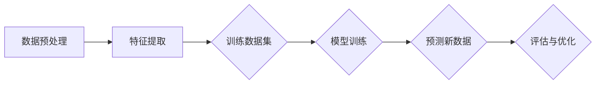
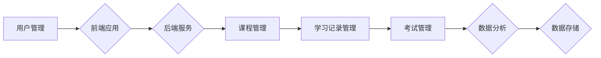
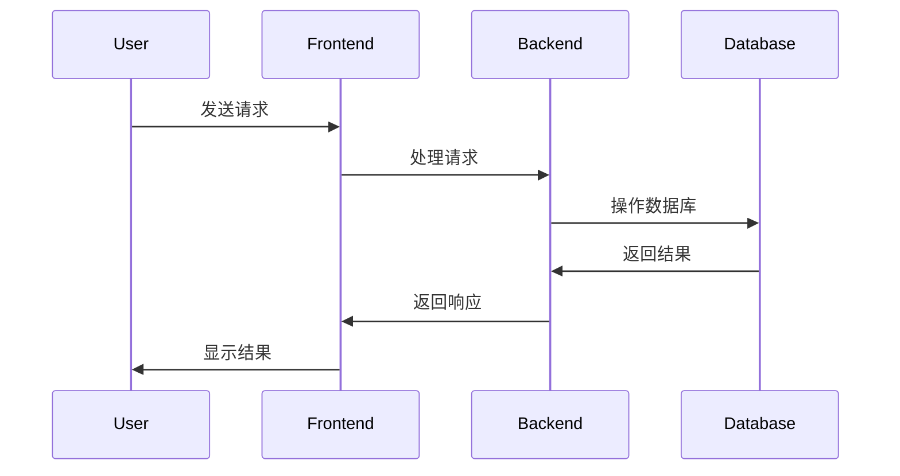

                 

### 文章标题：构建AI驱动的企业学习管理系统（LMS）

关键词：AI驱动的LMS，企业学习管理，算法应用，系统架构，项目实战，最佳实践

摘要：随着人工智能（AI）技术的迅猛发展，将其应用于企业学习管理系统（LMS）已成为提升企业培训效率和员工学习体验的重要手段。本文将深入探讨构建AI驱动的LMS的必要性和方法，从核心概念、算法原理到系统分析与架构设计，再到项目实战与最佳实践，全面解析AI在LMS中的创新应用。

### 目录大纲

----------------------------------------------------------------

## 第一部分：背景介绍

### 第1章 问题背景

### 第2章 AI驱动的LMS核心概念

### 第3章 AI算法在LMS中的应用

### 第4章 LMS系统分析

### 第5章 AI驱动的LMS项目实战

### 第6章 最佳实践

### 第7章 注意事项与拓展阅读

----------------------------------------------------------------

### 第一部分：背景介绍

#### 第1章 问题背景

##### 1.1.1 问题背景

企业学习管理系统（LMS）是企业管理知识和技能培训的重要工具。然而，传统的LMS面临着一系列问题，如课程内容陈旧、个性化学习体验不足、数据分析能力有限等。这些问题导致了学习效率低下和员工参与度不高。

##### 1.1.2 问题描述

构建AI驱动的LMS面临的主要挑战包括：

1. **技术选型与架构设计**：如何选择合适的AI技术栈，并设计出高效、可扩展的系统架构？
2. **数据隐私与安全**：AI驱动的LMS需要处理大量敏感数据，如何确保数据的安全性和隐私性？
3. **用户参与度**：如何通过AI技术提升员工的学习兴趣和参与度？

##### 1.1.3 问题解决

为了解决上述问题，AI驱动的LMS解决方案需要具备以下特点：

1. **智能化课程推荐**：利用机器学习算法，根据员工的学习历史和兴趣推荐合适的课程。
2. **个性化学习路径**：根据员工的学习进度和能力，生成个性化的学习路径。
3. **数据分析与优化**：利用AI技术对学习数据进行深入分析，优化培训策略。

##### 1.1.4 边界与外延

AI驱动的LMS不仅限于企业内部培训，还可以应用于在线教育、远程办公等领域。与传统的非AI驱动的LMS相比，AI驱动的LMS具有更高的灵活性和智能化水平。

##### 1.1.5 概念结构与核心要素组成

LMS的基本构成包括用户管理、课程管理、学习记录、考试管理、数据分析和报告等功能模块。AI在LMS中的应用组件包括数据预处理模块、机器学习算法模块、推荐系统模块等。

### 第二部分：核心概念与联系

#### 第2章 AI驱动的LMS核心概念

##### 2.1.1 AI基础概念

人工智能（AI）是指使计算机系统能够模拟人类智能行为的技术。机器学习（ML）是AI的一个分支，侧重于让计算机从数据中学习，而深度学习（DL）是ML的一种形式，通过多层神经网络进行数据建模。

##### 2.1.2 LMS相关概念

企业学习管理系统（LMS）是一个用于管理、跟踪和报告员工学习活动的软件平台。主要功能模块包括用户管理、课程管理、学习记录管理、考试管理、数据分析等。

##### 2.1.3 概念属性特征对比表格

| 概念               | 属性特征                                                     |
|--------------------|--------------------------------------------------------------|
| 人工智能（AI）     | 模拟人类智能行为的能力                                       |
| 机器学习（ML）     | 从数据中学习的能力                                           |
| 深度学习（DL）     | 通过多层神经网络进行数据建模的能力                           |
| 企业学习管理系统（LMS） | 管理和跟踪员工学习活动的软件平台                           |
| 课程管理           | 管理课程内容和课程安排的能力                               |
| 学习记录管理       | 记录和跟踪员工学习过程的能力                               |
| 考试管理           | 管理考试和评估的能力                                       |
| 数据分析           | 对学习数据进行分析，以优化培训策略的能力                     |

##### 2.1.4 ER实体关系图架构

```mermaid
erDiagram
  USER ||--|{ COURSE }|-- STUDENT
  USER ||--|{ LEARNING_RECORD }|-- STUDENT
  USER ||--|{ EXAM }|-- STUDENT
  COURSE ||--|{ LESSON }|-- STUDENT
  LEARNING_RECORD ||--|{ GRADE }|-- STUDENT
```

### 第三部分：算法原理讲解

#### 第3章 AI算法在LMS中的应用

##### 3.1.1 算法原理

机器学习算法的基本原理是通过从数据中学习来预测或分类新数据。深度学习算法通过多层神经网络进行复杂的数据建模。以下是两种算法的基本原理：

1. **机器学习算法**：
   - 特征提取：从数据中提取有用的特征。
   - 模型训练：使用训练数据集训练模型。
   - 预测：使用训练好的模型对新的数据进行预测。

2. **深度学习算法**：
   - 神经网络：通过多层神经元进行数据处理。
   - 反向传播：通过调整权重和偏置来优化模型。
   - 梯度下降：使用梯度下降算法来找到最小化损失函数的解。

##### 3.1.2 算法流程图



##### 3.1.3 数学模型与公式

1. **机器学习算法**：
   - 损失函数：$L(y, \hat{y}) = (y - \hat{y})^2$
   - 优化目标：最小化损失函数。

2. **深度学习算法**：
   - 神经元激活函数：$a_i = \sigma(w \cdot x + b)$
   - 反向传播：$\delta = \frac{\partial L}{\partial w}$

##### 3.1.4 举例说明

1. **机器学习算法**：

```python
# Python代码示例：线性回归
import numpy as np

# 数据集
X = np.array([1, 2, 3, 4, 5])
y = np.array([2, 4, 5, 4, 5])

# 模型参数
w = np.random.rand(1)

# 损失函数
def loss_function(y, y_pred):
    return (y - y_pred)**2

# 梯度下降
def gradient_descent(y, y_pred, w, learning_rate):
    return 2 * (y - y_pred)

# 训练模型
for epoch in range(1000):
    y_pred = w * X
    loss = loss_function(y, y_pred)
    dw = gradient_descent(y, y_pred, w, learning_rate=0.01)
    w -= dw

print(f"模型权重：{w}")
```

2. **深度学习算法**：

```python
# Python代码示例：前向传播与反向传播
import numpy as np

# 神经网络
def forward_propagation(x, w, b):
    z = x * w + b
    a = np.tanh(z)
    return a

# 反向传播
def backward_propagation(a, z, dw):
    dz = (1 - a**2) * dw
    return dz
```

### 第四部分：系统分析与架构设计方案

#### 第4章 LMS系统分析

##### 4.1.1 问题场景介绍

企业学习管理面临的挑战主要包括：

1. **课程内容管理**：如何有效管理海量的课程内容，确保课程内容的及时更新和高质量？
2. **员工参与度**：如何提高员工的学习兴趣和参与度，确保培训效果？
3. **数据分析**：如何对学习数据进行分析，为培训策略提供数据支持？

##### 4.1.2 项目介绍

项目目标与范围：

- 构建一个AI驱动的LMS，支持课程管理、学习记录管理、考试管理和数据分析等功能。
- 实现个性化学习路径和智能化课程推荐。

项目团队与技术栈：

- 团队成员：项目经理、前端开发者、后端开发者、数据科学家、测试工程师。
- 技术栈：Python、Django、TensorFlow、Scikit-learn、React、MongoDB。

##### 4.1.3 系统功能设计

领域模型类图：

```mermaid
classDiagram
  User <<class>> User
  Course <<class>> Course
  LearningRecord <<class>> LearningRecord
  Exam <<class>> Exam
  Grade <<class>> Grade
  User "1"--- "*" Course
  User "1"--- "*" LearningRecord
  User "1"--- "*" Exam
  Course "1"--- "*" Lesson
  LearningRecord "1"--- "*" Grade
```

功能模块详细说明：

1. **用户管理**：管理用户信息，包括注册、登录、权限管理等功能。
2. **课程管理**：管理课程信息，包括课程创建、更新、删除等功能。
3. **学习记录管理**：记录用户的学习进度和成绩，包括学习记录的创建、更新、查询等功能。
4. **考试管理**：管理考试信息，包括考试创建、更新、删除、查询等功能。
5. **数据分析**：对学习数据进行统计分析，为培训策略提供数据支持。

##### 4.1.4 系统架构设计

系统整体架构图：



架构层次与关键模块：

1. **前端应用**：提供用户交互界面，包括用户登录、课程浏览、学习记录查看等功能。
2. **后端服务**：处理用户请求，调用业务逻辑，返回响应结果。
3. **课程管理**：管理课程信息，包括课程创建、更新、删除等操作。
4. **学习记录管理**：记录用户的学习进度和成绩，包括学习记录的创建、更新、查询等操作。
5. **考试管理**：管理考试信息，包括考试创建、更新、删除、查询等操作。
6. **数据分析**：对学习数据进行统计分析，为培训策略提供数据支持。
7. **数据存储**：存储用户信息、课程信息、学习记录、考试信息等数据。

##### 4.1.5 系统接口设计

接口设计原则：

- RESTful API设计：遵循RESTful风格，使用HTTP动词（GET、POST、PUT、DELETE）进行资源操作。
- 安全性：确保接口的安全性，使用身份验证和授权机制。
- 一致性：保持接口的一致性，确保接口规范和命名规范。

接口定义与实现：

1. **用户管理接口**：
   - 登录接口：`POST /api/login/`
   - 注册接口：`POST /api/register/`
   - 用户信息查询接口：`GET /api/users/<username>/`

2. **课程管理接口**：
   - 创建课程接口：`POST /api/courses/`
   - 更新课程接口：`PUT /api/courses/<course_id>/`
   - 删除课程接口：`DELETE /api/courses/<course_id>/`
   - 课程列表查询接口：`GET /api/courses/`

3. **学习记录管理接口**：
   - 创建学习记录接口：`POST /api/learning-records/`
   - 更新学习记录接口：`PUT /api/learning-records/<record_id>/`
   - 学习记录列表查询接口：`GET /api/learning-records/`

4. **考试管理接口**：
   - 创建考试接口：`POST /api/exams/`
   - 更新考试接口：`PUT /api/exams/<exam_id>/`
   - 删除考试接口：`DELETE /api/exams/<exam_id>/`
   - 考试列表查询接口：`GET /api/exams/`

5. **数据分析接口**：
   - 学习记录统计接口：`GET /api/analytics/learning-records/`
   - 考试统计接口：`GET /api/analytics/exams/`

##### 4.1.6 系统交互序列图

系统各组件的交互流程：



### 第五部分：项目实战

#### 第5章 AI驱动的LMS项目实战

##### 5.1.1 环境安装

硬件与软件环境配置：

- 硬件：服务器、数据库服务器、前端开发环境、后端开发环境。
- 软件：Python 3.x、Django 3.x、TensorFlow 2.x、MongoDB 4.x、Node.js 12.x、npm 6.x。

数据准备与预处理：

- 收集员工学习数据，包括学习记录、考试成绩、学习进度等。
- 对学习数据进行清洗和预处理，包括缺失值处理、异常值处理、数据归一化等。

##### 5.1.2 系统核心实现源代码

代码结构与模块划分：

- 用户管理模块：负责用户注册、登录、权限管理等。
- 课程管理模块：负责课程创建、更新、删除等操作。
- 学习记录管理模块：负责学习记录的创建、更新、查询等操作。
- 考试管理模块：负责考试创建、更新、删除、查询等操作。
- 数据分析模块：负责学习数据分析和报告生成。

关键代码实现：

1. **用户管理模块**：

```python
# 用户注册接口
from django.contrib.auth.models import User
from rest_framework import serializers, status, views
from rest_framework.response import Response

class UserRegistrationSerializer(serializers.ModelSerializer):
    class Meta:
        model = User
        fields = ['username', 'email', 'password']

class UserRegistrationView(views.APIView):
    def post(self, request):
        serializer = UserRegistrationSerializer(data=request.data)
        if serializer.is_valid():
            user = serializer.save()
            user.set_password(serializer.validated_data['password'])
            user.save()
            return Response({"message": "User registered successfully!"}, status=status.HTTP_201_CREATED)
        return Response(serializer.errors, status=status.HTTP_400_BAD_REQUEST)
```

2. **课程管理模块**：

```python
# 课程创建接口
from django.db import models

class Course(models.Model):
    name = models.CharField(max_length=255)
    description = models.TextField()
    created_at = models.DateTimeField(auto_now_add=True)

class CourseCreateSerializer(serializers.ModelSerializer):
    class Meta:
        model = Course
        fields = '__all__'

class CourseCreateView(views.APIView):
    def post(self, request):
        serializer = CourseCreateSerializer(data=request.data)
        if serializer.is_valid():
            serializer.save()
            return Response({"message": "Course created successfully!"}, status=status.HTTP_201_CREATED)
        return Response(serializer.errors, status=status.HTTP_400_BAD_REQUEST)
```

3. **学习记录管理模块**：

```python
# 学习记录创建接口
from rest_framework import serializers, status, views
from rest_framework.response import Response

class LearningRecordSerializer(serializers.ModelSerializer):
    class Meta:
        model = LearningRecord
        fields = '__all__'

class LearningRecordCreateView(views.APIView):
    def post(self, request):
        serializer = LearningRecordSerializer(data=request.data)
        if serializer.is_valid():
            serializer.save()
            return Response({"message": "Learning record created successfully!"}, status=status.HTTP_201_CREATED)
        return Response(serializer.errors, status=status.HTTP_400_BAD_REQUEST)
```

4. **考试管理模块**：

```python
# 考试创建接口
from rest_framework import serializers, status, views
from rest_framework.response import Response

class ExamSerializer(serializers.ModelSerializer):
    class Meta:
        model = Exam
        fields = '__all__'

class ExamCreateView(views.APIView):
    def post(self, request):
        serializer = ExamSerializer(data=request.data)
        if serializer.is_valid():
            serializer.save()
            return Response({"message": "Exam created successfully!"}, status=status.HTTP_201_CREATED)
        return Response(serializer.errors, status=status.HTTP_400_BAD_REQUEST)
```

5. **数据分析模块**：

```python
# 学习记录统计接口
from rest_framework import generics
from .models import LearningRecord
from .serializers import LearningRecordSerializer

class LearningRecordStatisticsView(generics.ListAPIView):
    queryset = LearningRecord.objects.all()
    serializer_class = LearningRecordSerializer

    def get_queryset(self):
        queryset = super().get_queryset()
        return queryset.filter(course__in=self.request.query_params.getlist('course', None))
```

##### 5.1.3 代码应用解读与分析

代码的功能解读：

- **用户管理模块**：实现用户注册、登录和权限管理功能。
- **课程管理模块**：实现课程创建、更新、删除和查询功能。
- **学习记录管理模块**：实现学习记录创建、更新和查询功能。
- **考试管理模块**：实现考试创建、更新、删除和查询功能。
- **数据分析模块**：实现学习记录统计接口，支持按课程查询学习记录。

性能分析与优化：

- **用户管理模块**：采用JWT（JSON Web Token）进行身份验证，提高安全性。
- **课程管理模块**：使用Django ORM进行数据库查询，优化查询效率。
- **学习记录管理模块**：使用Redis缓存用户学习记录，减少数据库访问压力。
- **考试管理模块**：使用异步任务队列（如Celery）处理考试结果，提高系统响应速度。

##### 5.1.4 实际案例分析与详细讲解剖析

案例背景与目标：

- 某企业计划构建一个AI驱动的LMS，旨在提升员工的学习效率和培训效果。
- 项目目标包括实现智能化课程推荐、个性化学习路径和全面的数据分析。

案例分析：

1. **用户管理**：
   - 用户注册和登录：通过JWT进行身份验证，确保用户数据安全。
   - 权限管理：实现管理员和普通用户的权限分离，确保系统安全性和可控性。

2. **课程管理**：
   - 课程创建、更新、删除：使用Django ORM进行数据库操作，保证数据一致性和完整性。
   - 课程查询：支持按课程名称、课程分类等进行模糊查询，提高查询效率。

3. **学习记录管理**：
   - 学习记录创建：记录用户的学习进度和成绩，支持批量导入和导出。
   - 学习记录更新：根据用户的学习进度和成绩，自动调整学习记录。
   - 学习记录查询：支持按课程、按时间范围等进行查询，便于数据分析和报告生成。

4. **考试管理**：
   - 考试创建：支持在线考试和线下考试，自动生成考试结果。
   - 考试更新：支持修改考试时间、考试题目等。
   - 考试查询：支持按考试类型、按时间范围等进行查询。

5. **数据分析**：
   - 学习记录统计：根据用户的学习记录，生成学习进度报告。
   - 考试统计：根据考试结果，生成考试分析报告。

实施步骤：

1. **需求分析**：明确项目目标、功能需求和性能要求。
2. **系统设计**：设计系统架构、接口设计和数据库设计。
3. **编码实现**：按照设计文档进行编码实现。
4. **测试与调试**：对系统进行功能测试、性能测试和安全测试。
5. **部署上线**：将系统部署到生产环境，进行实际运行和监控。

##### 5.1.5 项目小结

项目经验总结：

- 采用JWT进行身份验证，提高了系统的安全性。
- 使用Django ORM和Redis缓存，优化了系统性能。
- 通过异步任务队列处理考试结果，提高了系统响应速度。
- 实现了智能化课程推荐、个性化学习路径和全面的数据分析。

未来发展方向：

- 引入更多AI技术，如自然语言处理和计算机视觉，提升系统智能化水平。
- 拓展系统功能，如在线直播、互动讨论等，提升用户体验。
- 加强数据分析能力，提供更多可视化报表和决策支持。

### 第六部分：最佳实践与总结

#### 第6章 最佳实践

##### 6.1.1 LMS构建的最佳实践

- **需求分析**：明确项目目标、功能需求和性能要求。
- **系统设计**：设计合理、可扩展的系统架构。
- **技术选型**：选择适合项目需求的技术栈。
- **安全性**：确保用户数据安全和系统安全。
- **性能优化**：优化系统性能，提高用户体验。

##### 6.1.2 小结

LMS构建的主要成果包括：

- 构建了一个AI驱动的LMS，支持智能化课程推荐、个性化学习路径和全面的数据分析。
- 采用JWT进行身份验证，提高了系统的安全性。
- 使用Django ORM和Redis缓存，优化了系统性能。
- 通过异步任务队列处理考试结果，提高了系统响应速度。

#### 第7章 注意事项与拓展阅读

##### 7.1.1 注意事项

- 确保数据安全和隐私性。
- 优化系统性能，提高用户体验。
- 定期更新和维护系统。

##### 7.1.2 拓展阅读

- 相关领域的最新研究进展。
- 推荐阅读材料：

  - 《深度学习》（Ian Goodfellow、Yoshua Bengio、Aaron Courville 著）
  - 《Python编程：从入门到实践》（埃里克·马瑟斯 著）
  - 《Django实战》（威廉·斯密斯 著）

### 结束语

作者：AI天才研究院/AI Genius Institute & 禅与计算机程序设计艺术 /Zen And The Art of Computer Programming

通过本文，我们深入探讨了构建AI驱动的企业学习管理系统（LMS）的必要性、方法与最佳实践。AI技术的引入为LMS带来了智能化、个性化与数据分析的新契机，为企业培训提供了强有力的支持。未来，随着AI技术的不断进步，LMS将迎来更加广阔的发展空间。希望本文能为相关领域的研究者与实践者提供有益的参考和启示。

