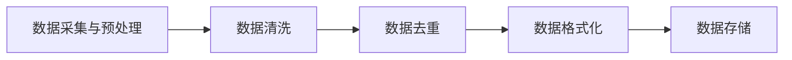
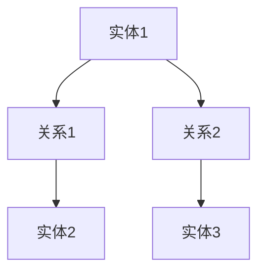
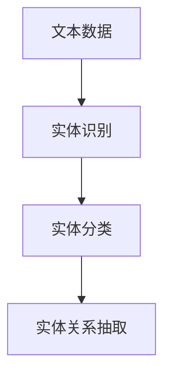
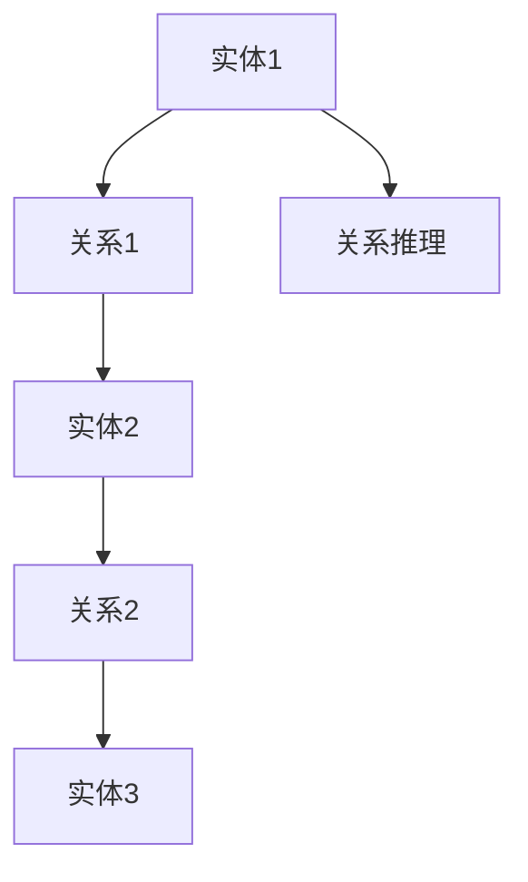
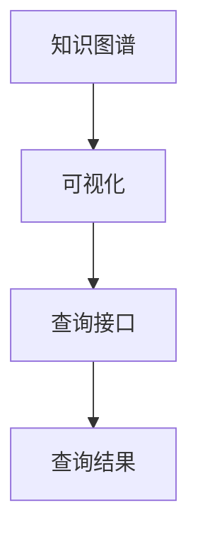
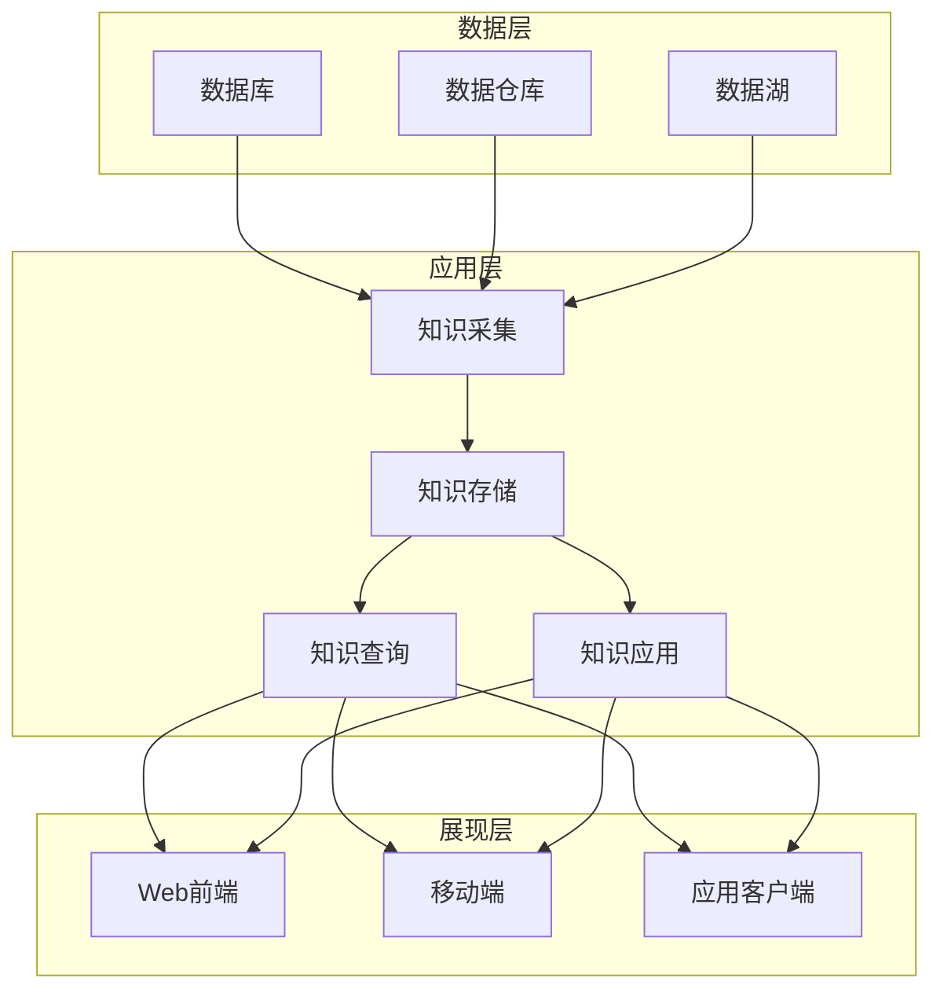

                 

## 构建AI驱动的企业知识管理系统：智能知识图谱

### 关键词：AI，知识图谱，企业知识管理，智能系统，数据管理，算法实现，系统架构，项目实战

### 摘要：

随着信息技术的快速发展，企业面临着如何有效管理和利用海量知识资源的问题。本文深入探讨如何构建AI驱动的企业知识管理系统，通过智能知识图谱技术实现知识的自动化提取、组织和应用。本文分为五个部分，分别介绍了背景介绍、核心概念与联系、系统分析与架构设计、项目实战以及最佳实践与拓展。通过系统化的分析，本文旨在为读者提供一套可行的企业知识管理解决方案，助力企业实现知识驱动的创新发展。

### 目录大纲

---

# 构建AI驱动的企业知识管理系统：智能知识图谱

> 关键词：AI，知识图谱，企业知识管理，智能系统，数据管理，算法实现，系统架构，项目实战

> 摘要：本文深入探讨如何构建AI驱动的企业知识管理系统，通过智能知识图谱技术实现知识的自动化提取、组织和应用。分为五个部分，详细介绍了背景介绍、核心概念与联系、系统分析与架构设计、项目实战以及最佳实践与拓展。

## 第一部分：背景介绍

### 1.1 问题的背景

在当今信息化、数据化的商业环境中，企业面临着日益复杂的信息管理和知识管理挑战。传统的信息管理系统往往只能处理结构化数据，而对于非结构化数据（如文本、图像、音频等）的处理能力有限。此外，企业内部的隐性知识和专业知识难以有效地存储、共享和利用。

#### 问题描述

- **如何有效地整合和利用企业内部外的各种数据资源？**
- **如何构建一个智能化的知识管理系统，实现知识的自动化提取、组织和应用？**
- **如何通过AI技术提升企业知识管理的效率和效果？**

#### 问题解决

通过引入AI和知识图谱技术，构建一个智能化的企业知识管理系统，实现以下目标：

- **自动化知识抽取与关系构建**
- **智能化知识查询与推荐**
- **知识图谱驱动的业务决策支持**

#### 边界与外延

- **知识管理系统的范围**：涵盖企业内部知识库、外部知识资源整合、以及跨部门的知识协同。
- **应用领域**：包括客户关系管理、产品研发、市场营销、人力资源管理等多个领域。
- **AI技术在知识管理中的作用**：利用机器学习、自然语言处理、数据挖掘等技术，提升知识管理的智能化水平。

### 1.2 AI与知识图谱的概念

#### AI的定义与特点

AI（人工智能）是计算机科学的一个分支，旨在通过模拟、延伸和扩展人类的智能，实现机器的智能行为。AI具有以下特点：

- **自主性**：AI系统能够在给定条件下自主地完成任务。
- **学习性**：AI系统具备从数据中学习并不断优化的能力。
- **适应性**：AI系统能够根据环境变化调整自身行为。

#### 知识图谱的定义与特点

知识图谱是一种结构化的语义知识库，通过实体、属性和关系的描述，实现对现实世界复杂关系的理解和建模。知识图谱具有以下特点：

- **语义化**：知识图谱能够将原始数据转化为具有语义信息的结构化数据。
- **关联性**：知识图谱通过实体和关系构建出一个关联网络，实现对知识的深度挖掘和利用。
- **动态性**：知识图谱能够根据新数据不断更新和优化。

#### AI与知识图谱的关系

AI与知识图谱的结合，能够实现以下价值：

- **知识自动化**：利用AI技术，自动从非结构化数据中提取知识，构建知识图谱。
- **智能查询**：通过知识图谱，实现智能化查询和知识推荐。
- **决策支持**：利用知识图谱，为企业提供基于数据的决策支持。

### 1.3 企业知识管理的核心要素

企业知识管理涉及到多个核心概念和要素，包括知识管理、知识提取、知识存储、知识共享和知识应用等。

#### 核心概念原理

- **知识管理**：通过系统的方法和工具，对企业内外部知识进行有效管理，实现知识的积累、传播和利用。
- **知识提取**：从非结构化数据中自动提取有价值的信息，构建结构化的知识。
- **知识存储**：将提取到的知识存储在数据库或知识库中，便于后续查询和应用。
- **知识共享**：通过知识共享平台，实现企业内部知识的交流和协作。
- **知识应用**：将知识应用到实际业务场景中，提升企业效率和竞争力。

#### 概念属性特征对比表格

| 概念          | 定义                                                         | 特征                                               |
|---------------|--------------------------------------------------------------|----------------------------------------------------|
| 知识管理      | 对企业内外部知识的系统化管理和应用。                         | 目标性、全面性、系统性、动态性                     |
| 知识提取      | 从非结构化数据中自动提取有价值的信息。                       | 自动化、高效性、准确性                           |
| 知识存储      | 将提取到的知识存储在数据库或知识库中。                       | 安全性、可靠性、可扩展性                         |
| 知识共享      | 通过知识共享平台，实现企业内部知识的交流和协作。             | 交互性、便捷性、灵活性                           |
| 知识应用      | 将知识应用到实际业务场景中，提升企业效率和竞争力。           | 针对性、实用性、创新性                           |

#### ER实体关系图架构

知识管理系统的ER（实体关系）图架构能够清晰地描述知识管理中各个实体之间的关系。

- **实体**：知识、用户、组织、知识库、知识应用等。
- **关系**：拥有、创建、使用、共享、关联等。

```mermaid
erDiagram
Knowledge ||--|{ User }|-- KnowledgeBase
User ||--|{ Organization }| Organization
KnowledgeBase ||--|{ Knowledge }| Knowledge
KnowledgeBase ||--|{ Knowledge }| KnowledgeApplication
User ||--|{ KnowledgeApplication }| KnowledgeApplication
```

## 第二部分：核心概念与联系

### 2.1 AI驱动的知识图谱构建

#### 算法原理讲解

知识图谱的构建通常包括以下步骤：

1. **数据采集与预处理**：从多种数据源（如文本、数据库、API等）收集数据，并进行清洗、去重和格式化处理。
2. **实体识别与分类**：利用自然语言处理技术，对文本数据进行实体识别，并对其进行分类。
3. **关系抽取与建模**：通过文本挖掘和知识库匹配等方法，抽取实体之间的关系，并构建出知识图谱的骨架。
4. **图谱优化与扩展**：根据实际需求，对知识图谱进行优化和扩展，提高其覆盖面和准确性。

以下是构建知识图谱的基本算法原理：

#### 1. 数据采集与预处理



#### 2. 实体识别与分类

```python
# 实体识别与分类代码示例
from nltk.tokenize import word_tokenize

text = "华为是一家领先的全球通信技术解决方案提供商，其产品广泛应用于全球各地。"
tokens = word_tokenize(text)

# 基于词频统计进行分类
word_freq = {}
for token in tokens:
    if token not in word_freq:
        word_freq[token] = 0
    word_freq[token] += 1

# 定义分类规则
def classify_word(word):
    if word in ["华为", "全球", "通信", "技术"]:
        return "技术领域"
    elif word in ["提供", "应用", "广泛", "各地"]:
        return "业务领域"
    else:
        return "其他领域"

# 分类
for token in word_freq:
    print(f"{token}: {classify_word(token)}")
```

#### 3. 关系抽取与建模



#### 4. 图谱优化与扩展

```python
# 优化与扩展示例代码
# 加载现有知识图谱
knowledge_graph = load_knowledge_graph()

# 添加新实体和关系
knowledge_graph.add_entity("新实体1")
knowledge_graph.add_relation("新关系1", ["新实体1", "实体2"])
knowledge_graph.add_relation("新关系2", ["实体3", "新实体1"])

# 保存更新后的知识图谱
save_knowledge_graph(knowledge_graph)
```

### 知识图谱的应用场景

知识图谱在多个场景中具有广泛的应用，以下是几个典型的应用场景：

#### 1. 文本挖掘与实体抽取



#### 2. 关系抽取与知识推理



#### 3. 知识图谱可视化与查询



### AI驱动的企业知识管理系统

#### 企业知识管理的需求分析

企业知识管理系统的需求包括：

- **知识整合**：整合企业内部和外部的知识资源，实现知识的一站式管理。
- **知识共享**：建立知识共享平台，促进企业内部的知识交流和协作。
- **知识应用**：将知识应用到业务场景中，提升企业决策效率和竞争力。

#### 知识图谱在企业中的应用

知识图谱在企业中的应用包括：

- **客户关系管理**：通过知识图谱，实现客户信息的深度挖掘和关联分析。
- **产品研发**：利用知识图谱，加速产品创新和研发流程。
- **市场营销**：通过知识图谱，实现精准营销和客户细分。
- **人力资源管理**：利用知识图谱，优化人才招聘、培训和绩效评估。

#### AI技术在知识管理中的作用

AI技术在知识管理中的作用包括：

- **知识自动化提取**：利用自然语言处理、图像识别等技术，自动从非结构化数据中提取知识。
- **智能查询与推荐**：通过知识图谱和机器学习算法，实现智能查询和知识推荐。
- **业务决策支持**：利用知识图谱，为企业提供基于数据的决策支持。

## 第三部分：系统分析与架构设计

### 3.1 系统需求分析

#### 问题场景介绍

某大型企业需要构建一个智能化知识管理系统，以提升企业内部知识的整合、共享和应用效率。系统需求包括：

- **知识整合**：整合企业内部各种数据源，实现知识的一站式管理。
- **知识共享**：建立企业内部知识共享平台，促进知识交流和协作。
- **知识应用**：将知识应用到业务场景中，提升企业决策效率和竞争力。

#### 项目介绍

项目名称：企业智能化知识管理系统
项目周期：6个月
项目目标：实现企业内部知识的自动化提取、存储、共享和应用，提升企业整体知识管理能力。

#### 系统功能设计

系统功能设计包括以下几个方面：

- **知识采集**：从企业内部各种数据源（如文档、数据库、API等）收集数据，并进行预处理。
- **知识存储**：将预处理后的数据存储在知识库中，便于后续查询和应用。
- **知识共享**：建立知识共享平台，实现企业内部知识的交流和协作。
- **知识查询**：提供智能查询功能，方便用户快速找到所需知识。
- **知识应用**：将知识应用到实际业务场景中，提升企业决策效率和竞争力。

#### 领域模型Mermaid类图

```mermaid
classDiagram
    Class01 <|-- Class02
    Class03 <.. Class04
    Class05 <= Class06
    Class07 .. Class08
    Class09 --> Class10
```

### 3.2 系统架构设计

系统架构设计主要包括以下几个方面：

- **数据层**：负责数据的采集、存储和管理，包括数据库、数据仓库和数据湖等。
- **应用层**：实现知识管理的核心功能，包括知识采集、知识存储、知识共享、知识查询和知识应用等。
- **展现层**：提供用户交互界面，包括Web前端、移动端和应用客户端等。

#### 系统架构Mermaid架构图



#### 系统接口设计

系统接口设计主要包括以下几个方面：

- **数据接口**：用于数据的采集、存储和查询，包括API、Webhook等。
- **功能接口**：用于知识管理的核心功能调用，包括知识采集、知识存储、知识查询和知识应用等。

#### 系统交互Mermaid序列图

```mermaid
sequenceDiagram
    participant 用户 as 用户
    participant 系统作为 系统A
    participant 数据库 as 数据库B

    用户->>系统A: 发送查询请求
    系统
```


## 第四部分：项目实战

### 4.1 实战案例一：企业内部知识库构建

#### 案例背景

某大型企业需要构建一个企业内部知识库，以实现知识的整合、共享和应用。企业内部拥有丰富的文档资料、数据库资源和业务数据，需要通过智能知识图谱技术，将这些数据整合到一个统一的平台中。

#### 系统实现

1. **数据采集**：通过API接口和Web爬虫等技术，从企业内部的各种数据源（如文档库、数据库、业务系统等）收集数据。
2. **数据预处理**：对收集到的数据进行清洗、去重和格式化处理，确保数据质量。
3. **知识抽取**：利用自然语言处理技术，对文本数据进行实体识别和关系抽取，构建出知识图谱的骨架。
4. **知识存储**：将抽取到的知识存储在知识库中，便于后续查询和应用。
5. **知识查询与推荐**：通过知识图谱和机器学习算法，实现智能查询和知识推荐。

#### 代码应用解读与分析

以下是一个简单的知识图谱构建示例，用于说明知识抽取和存储的过程：

```python
from py2neo import Graph
from nltk.tokenize import word_tokenize

# 连接Neo4j数据库
graph = Graph("bolt://localhost:7687", auth=("neo4j", "password"))

# 文本数据预处理
text = "华为是一家领先的全球通信技术解决方案提供商，其产品广泛应用于全球各地。"
tokens = word_tokenize(text)

# 实体识别与分类
word_freq = {}
for token in tokens:
    if token not in word_freq:
        word_freq[token] = 0
    word_freq[token] += 1

# 定义分类规则
def classify_word(word):
    if word in ["华为", "全球", "通信", "技术"]:
        return "技术领域"
    elif word in ["提供", "应用", "广泛", "各地"]:
        return "业务领域"
    else:
        return "其他领域"

# 分类
for token in word_freq:
    print(f"{token}: {classify_word(token)}")

# 构建知识图谱
for token, category in word_freq.items():
    if category == "技术领域":
        graph.run("""
            MERGE (a:Entity {name: $token})
            MERGE (b:Category {name: $category})
            MERGE (a)-[:BELONGS_TO]->(b)
        """, token=token, category=category)

# 查询知识图谱
results = graph.run("""
    MATCH (a:Entity)-[:BELONGS_TO]->(b:Category)
    WHERE a.name = '华为'
    RETURN a, b
""")

for result in results:
    print(f"Entity: {result['a']['name']}, Category: {result['b']['name']}")
```

#### 案例分析与总结

通过上述案例，我们可以看到企业内部知识库的构建过程，包括数据采集、预处理、知识抽取、存储和查询等步骤。知识图谱技术的引入，使得企业内部知识实现了结构化、关联化和智能化管理，为企业提供了强大的知识驱动能力。

### 4.2 实战案例二：客户关系管理优化

#### 案例背景

某大型企业需要优化客户关系管理，以提升客户满意度和忠诚度。企业希望利用智能知识图谱技术，对客户数据进行深度挖掘和分析，实现精准营销和个性化服务。

#### 系统实现

1. **客户数据采集**：通过API接口和Web爬虫等技术，从企业内部的CRM系统、营销系统等收集客户数据。
2. **数据预处理**：对收集到的数据进行清洗、去重和格式化处理，确保数据质量。
3. **客户画像构建**：利用自然语言处理和机器学习技术，对客户数据进行实体识别、属性抽取和关系建模，构建出客户画像。
4. **客户关系分析**：通过知识图谱和图挖掘算法，分析客户之间的关系，发现潜在商机和风险。
5. **营销策略优化**：根据客户画像和关系分析结果，制定精准的营销策略，提升营销效果。

#### 代码应用解读与分析

以下是一个简单的客户画像构建示例，用于说明客户数据预处理和知识图谱构建的过程：

```python
import pandas as pd
from sklearn.feature_extraction.text import TfidfVectorizer
from sklearn.cluster import KMeans

# 加载客户数据
data = pd.read_csv("customer_data.csv")

# 数据预处理
data["description"] = data["description"].fillna("").astype(str)
data["description"] = data["description"].str.lower()

# 文本特征提取
vectorizer = TfidfVectorizer(max_features=1000)
X = vectorizer.fit_transform(data["description"])

# 客户画像构建
kmeans = KMeans(n_clusters=5, random_state=0).fit(X)
data["cluster"] = kmeans.labels_

# 构建知识图谱
for index, row in data.iterrows():
    graph.run("""
        MERGE (a:Customer {id: $id, cluster: $cluster})
        SET a.description = $description
    """, id=row["id"], cluster=row["cluster"], description=row["description"])

# 查询知识图谱
results = graph.run("""
    MATCH (a:Customer)
    RETURN a
""")

for result in results:
    print(f"ID: {result['a']['id']}, Cluster: {result['a']['cluster']}")
```

#### 案例分析与总结

通过上述案例，我们可以看到客户关系管理优化的实现过程，包括客户数据采集、预处理、客户画像构建、客户关系分析和营销策略优化等步骤。知识图谱技术的引入，使得客户数据实现了结构化、关联化和智能化管理，为企业提供了强大的数据驱动能力，有助于实现精准营销和个性化服务。

### 4.3 实战案例三：产品知识图谱构建

#### 案例背景

某大型企业需要构建一个产品知识图谱，以提升产品研发和管理效率。企业拥有丰富的产品文档、技术标准和业务数据，需要通过智能知识图谱技术，将这些数据整合到一个统一的平台中。

#### 系统实现

1. **产品数据采集**：通过API接口和Web爬虫等技术，从企业内部的产品文档库、技术标准库等收集产品数据。
2. **数据预处理**：对收集到的数据进行清洗、去重和格式化处理，确保数据质量。
3. **知识抽取**：利用自然语言处理技术，对文本数据进行实体识别和关系抽取，构建出产品知识图谱的骨架。
4. **知识存储**：将抽取到的知识存储在知识库中，便于后续查询和应用。
5. **知识查询与推荐**：通过知识图谱和机器学习算法，实现智能查询和知识推荐。

#### 代码应用解读与分析

以下是一个简单的产品知识图谱构建示例，用于说明知识抽取和存储的过程：

```python
from py2neo import Graph
from nltk.tokenize import word_tokenize

# 连接Neo4j数据库
graph = Graph("bolt://localhost:7687", auth=("neo4j", "password"))

# 文本数据预处理
text = "产品A是一种新型的通信技术解决方案，具有高性能、低功耗等特点。"
tokens = word_tokenize(text)

# 实体识别与分类
word_freq = {}
for token in tokens:
    if token not in word_freq:
        word_freq[token] = 0
    word_freq[token] += 1

# 定义分类规则
def classify_word(word):
    if word in ["产品A", "通信技术", "高性能", "低功耗"]:
        return "技术属性"
    elif word in ["新型", "解决方案"]:
        return "产品类型"
    else:
        return "其他属性"

# 分类
for token in word_freq:
    print(f"{token}: {classify_word(token)}")

# 构建知识图谱
for token, category in word_freq.items():
    if category == "技术属性":
        graph.run("""
            MERGE (a:ProductProperty {name: $token})
            MERGE (b:Category {name: $category})
            MERGE (a)-[:BELONGS_TO]->(b)
        """, token=token, category=category)

# 查询知识图谱
results = graph.run("""
    MATCH (a:ProductProperty)-[:BELONGS_TO]->(b:Category)
    WHERE a.name = '产品A'
    RETURN a, b
""")

for result in results:
    print(f"Property: {result['a']['name']}, Category: {result['b']['name']}")
```

#### 案例分析与总结

通过上述案例，我们可以看到产品知识图谱的构建过程，包括数据采集、预处理、知识抽取、存储和查询等步骤。知识图谱技术的引入，使得产品数据实现了结构化、关联化和智能化管理，为企业提供了强大的知识驱动能力，有助于提升产品研发和管理效率。

## 第五部分：最佳实践与拓展

### 5.1 最佳实践

在构建AI驱动的企业知识管理系统的过程中，以下是一些最佳实践：

- **数据质量保障**：确保数据采集、清洗和预处理的质量，避免数据错误和丢失。
- **知识图谱结构优化**：根据业务需求，优化知识图谱的结构和关系，提高查询效率。
- **算法模型迭代**：持续迭代和优化算法模型，提升知识抽取和推理的准确性。
- **用户参与**：鼓励用户参与知识管理，提高知识共享和应用的积极性。

### 5.2 小结

本文介绍了如何构建AI驱动的企业知识管理系统，通过智能知识图谱技术实现知识的自动化提取、组织和应用。通过系统化的分析，我们了解了企业知识管理的核心概念、系统架构设计和项目实战，为读者提供了一套可行的企业知识管理解决方案。未来，随着AI和知识图谱技术的不断发展，企业知识管理系统将更加智能化、高效化，为企业带来更大的价值。

### 5.3 注意事项

在实施企业知识管理系统时，需要注意以下几点：

- **数据安全与隐私保护**：确保数据安全和用户隐私，遵循相关法律法规。
- **系统性能优化**：针对大数据和高并发场景，优化系统性能和响应速度。
- **用户培训与支持**：提供用户培训和技术支持，确保系统的高效使用。

### 5.4 拓展阅读

- **相关书籍**：《人工智能：一种现代的方法》、《知识图谱：原理、方法和应用》
- **论文**：《基于知识图谱的智能问答系统研究》、《企业知识管理系统的设计与实现》
- **学术会议**：《国际知识管理会议（IKM）》、《国际人工智能与机器学习会议（AICML）》
- **论坛**：《人工智能技术论坛》、《知识图谱技术与应用论坛》

---

# 作者

作者：AI天才研究院/AI Genius Institute & 禅与计算机程序设计艺术 /Zen And The Art of Computer Programming

---

## 后记

本文为读者提供了一个关于构建AI驱动的企业知识管理系统的全面指南。通过深入剖析核心概念、系统架构和项目实战，我们希望能够为企业和开发者提供有价值的参考。在未来的发展中，AI和知识图谱技术将继续为知识管理带来新的变革，助力企业实现智慧转型。希望本文能够激发读者对于AI和知识图谱技术的兴趣，共同探索更广阔的知识管理领域。

