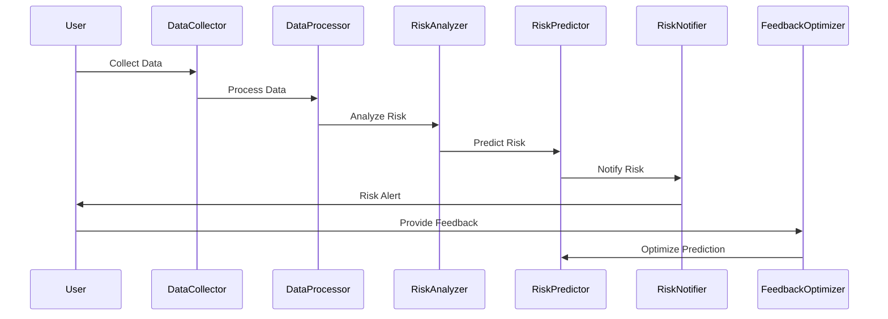
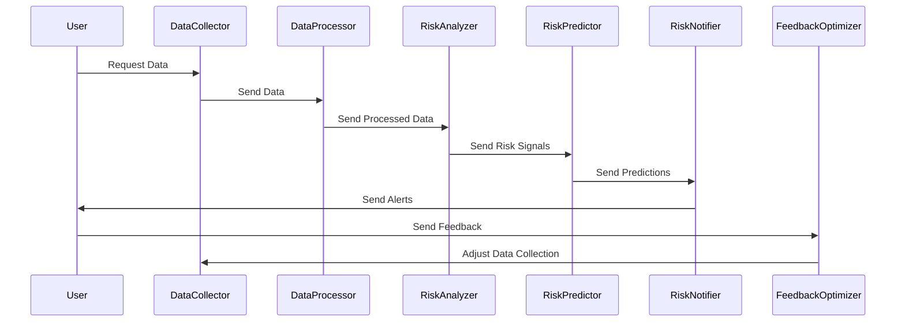

                 

### 第1章：背景介绍

#### 1.1 问题背景

在当今的商业环境中，企业面临的风险是多种多样的。这些风险可能源自市场波动、技术变革、财务问题、法律纠纷等多个方面。随着全球化进程的加速，市场竞争日益激烈，技术创新不断涌现，企业不仅要应对国内市场的变化，还要适应国际市场的动态。这种复杂、快速变化的环境使得传统的风险管理方法逐渐显得力不从心。

传统的风险管理方法通常依赖于历史数据和经验，通过定期分析财务报表、市场调研报告等方式来预测风险。然而，这些方法存在几个显著的问题：

- **数据量有限**：传统方法主要依赖有限的、历史性的数据，无法充分反映当前市场的动态变化。
- **反应速度慢**：传统的风险管理需要较长时间来收集、处理和分析数据，从而无法实现快速响应。
- **预测准确性不高**：由于数据量和质量受限，传统方法难以准确预测风险。

随着人工智能技术的飞速发展，尤其是机器学习和深度学习技术的应用，构建AI驱动的企业风险预警系统成为可能。这种方法能够从大量数据中挖掘出潜在的风险信号，实时监测市场变化，快速做出响应，从而显著提升企业风险管理的效率和准确性。

#### 1.2 问题描述

构建AI驱动的企业风险预警系统需要解决以下问题：

1. **数据收集与处理**：
   - 如何有效收集与企业风险相关的数据，包括内部数据和外部数据？
   - 如何对收集到的数据进行清洗、整合和预处理，以保证数据质量？

2. **风险识别与预测**：
   - 如何利用机器学习和深度学习技术，从数据中挖掘出潜在的风险信号？
   - 如何设计有效的算法模型，对风险进行准确预测？

3. **预警策略与机制**：
   - 如何设计合理的预警策略和预警机制，确保预警信息的及时性和准确性？
   - 如何根据企业实际情况调整预警策略，提高预警系统的适应性和可靠性？

4. **反馈优化与持续改进**：
   - 如何根据预警结果和企业反馈，不断优化和改进预警系统？
   - 如何确保预警系统能够持续适应市场变化，保持高效的预警能力？

#### 1.3 问题解决

通过人工智能技术，特别是机器学习和深度学习技术，可以从大量数据中挖掘出潜在的风险信号，预测企业可能面临的风险。同时，结合大数据技术，可以实现实时数据处理和分析，为风险预警提供及时、准确的信息支持。

以下是解决上述问题的基本步骤：

1. **数据收集**：
   - 收集企业内部数据，如财务报表、销售数据、客户反馈等。
   - 收集外部数据，如行业报告、市场调查、新闻资讯等。

2. **数据处理**：
   - 使用数据清洗技术去除噪声和错误。
   - 使用数据整合技术将多源数据进行合并。
   - 使用数据预处理技术对数据进行特征提取和转换。

3. **风险分析**：
   - 使用机器学习技术，如决策树、随机森林、神经网络等，对数据进行风险分析。
   - 使用深度学习技术，如卷积神经网络（CNN）、循环神经网络（RNN）等，对复杂模式进行识别。

4. **预警策略设计**：
   - 根据风险分析结果，设计合理的预警策略。
   - 设定预警阈值，当风险信号超过阈值时发出预警。

5. **预警机制建立**：
   - 建立预警机制，包括预警信息的生成、分发和处理。
   - 设计预警报告模板，确保预警信息的准确性和完整性。

6. **反馈优化**：
   - 收集企业反馈，分析预警效果。
   - 根据反馈结果，调整预警策略和预警机制。
   - 持续优化和改进预警系统，提高预警准确性和可靠性。

#### 1.4 边界与外延

- **边界**：本书主要关注企业风险预警系统的构建，包括数据收集、处理、分析和应用等环节。
- **外延**：虽然本书的核心是构建AI驱动的企业风险预警系统，但书中也会涉及到一些相关技术，如机器学习、深度学习、大数据处理等。

#### 1.5 概念结构与核心要素组成

- **概念结构**：AI驱动的企业风险预警系统由数据收集、数据处理、风险分析、风险预警和反馈优化等部分组成。
- **核心要素组成**：
  - **数据收集**：收集与企业风险相关的数据，如市场数据、财务数据、技术数据等。
  - **数据处理**：对收集到的数据进行分析、清洗和预处理，为风险分析提供基础。
  - **风险分析**：利用机器学习和深度学习技术，分析数据中的风险信号，预测企业可能面临的风险。
  - **风险预警**：根据风险分析的结果，设计预警策略和预警机制，及时向企业内部相关人员发出风险预警。
  - **反馈优化**：根据预警结果和企业反馈，不断优化和调整风险预警系统，提高预警的准确性和可靠性。

### 第2章：核心概念与联系

#### 2.1 AI驱动的企业风险预警系统概念

##### 2.1.1 人工智能（AI）

人工智能是指模拟、延伸和扩展人类智能的理论、方法、技术及应用。它包括机器学习、深度学习、自然语言处理等多个子领域。在AI驱动的企业风险预警系统中，机器学习和深度学习技术扮演着核心角色，用于从数据中提取特征、建立预测模型和进行实时分析。

##### 2.1.2 风险预警

风险预警是指通过监测、识别和分析风险信号，提前发现潜在的风险，并采取相应的措施进行防范和管理。在AI驱动的企业风险预警系统中，风险预警模块利用机器学习和深度学习算法，从大量数据中挖掘出潜在的风险信号，并通过预警策略和预警机制及时向企业内部相关人员发出预警。

##### 2.1.3 企业风险

企业风险是指企业在经营过程中可能面临的各种不确定性事件，可能对企业的财务状况、经营成果、声誉等产生负面影响。企业风险可以来源于内部，如管理失误、财务危机等，也可以来源于外部，如市场波动、政策变化等。在AI驱动的企业风险预警系统中，企业风险是核心研究对象，通过数据分析和算法预测，实现对潜在风险的识别和预警。

#### 2.2 概念属性特征对比表格

| 概念       | 定义                                           | 属性特征                                             |
| ---------- | ---------------------------------------------- | ---------------------------------------------------- |
| 人工智能   | 模拟、延伸和扩展人类智能的理论、方法、技术及应用 | 强大计算能力、自我学习和优化、多领域应用             |
| 风险预警   | 监测、识别和分析风险信号，提前发现潜在的风险     | 及时性、准确性、可靠性、针对性                       |
| 企业风险   | 企业在经营过程中可能面临的各种不确定性事件       | 多样性、复杂性、不确定性、潜在危害性                   |

#### 2.3 ER实体关系图架构

以下是AI驱动的企业风险预警系统的ER实体关系图，使用Mermaid语法表示：

```mermaid
erDiagram
    DataCollection -->|collects| RiskAnalysis
    DataProcessing -->|processes| RiskAnalysis
    RiskPrediction -->|predicts| RiskAlert
    RiskAlert -->|alerts| Stakeholders
    Stakeholders -->|replies| FeedbackOptimization
    FeedbackOptimization -->|optimizes| RiskPrediction
```

- **DataCollection（数据收集）**：负责收集与企业风险相关的数据。
- **DataProcessing（数据处理）**：负责对收集到的数据进行分析、清洗和预处理。
- **RiskAnalysis（风险分析）**：利用机器学习和深度学习技术，分析数据中的风险信号。
- **RiskPrediction（风险预测）**：根据风险分析结果，预测企业可能面临的风险。
- **RiskAlert（风险预警）**：设计预警策略和预警机制，及时向相关人员发出预警。
- **Stakeholders（相关人员）**：接收预警信息，并反馈相关信息。
- **FeedbackOptimization（反馈优化）**：根据预警结果和反馈，不断优化和调整风险预警系统。

### 第3章：AI驱动的企业风险预警系统算法原理讲解

#### 3.1 数据收集

数据收集是构建AI驱动的企业风险预警系统的第一步。数据收集的质量直接影响到后续的风险分析和预警效果。数据来源可以分为两类：内部数据和外部数据。

- **内部数据**：包括企业内部的各种运营数据，如财务报表、销售数据、客户反馈等。这些数据通常已经结构化，可以直接进行后续处理。
  
- **外部数据**：包括行业报告、市场调查、新闻资讯、社交媒体数据等。这些数据通常是非结构化的，需要通过数据清洗和预处理技术进行转化。

数据收集的主要任务包括：

1. **确定数据需求**：明确企业需要哪些类型的数据来支持风险预警。
2. **数据采集**：使用API、爬虫、数据库查询等方式获取数据。
3. **数据存储**：将收集到的数据存储到数据中心，方便后续处理。

#### 3.2 数据处理

数据处理是数据收集后的重要环节，其目的是提高数据质量，为风险分析提供可靠的数据基础。数据处理主要包括以下步骤：

1. **数据清洗**：去除数据中的噪声和错误，如缺失值、异常值、重复数据等。
   ```python
   import pandas as pd

   # 示例：清洗数据中的缺失值
   df = pd.read_csv('data.csv')
   df = df.dropna()  # 删除缺失值
   df = df.drop_duplicates()  # 删除重复值
   ```

2. **数据整合**：将来自不同来源的数据进行整合，形成统一的数据集。
   ```python
   # 示例：整合两个数据集
   df1 = pd.read_csv('data1.csv')
   df2 = pd.read_csv('data2.csv')
   df = pd.merge(df1, df2, on='common_column')
   ```

3. **数据预处理**：对数据进行特征提取和转换，为模型训练做准备。
   ```python
   from sklearn.preprocessing import StandardScaler

   # 示例：标准化数据
   scaler = StandardScaler()
   df[['feature1', 'feature2']] = scaler.fit_transform(df[['feature1', 'feature2']])
   ```

数据处理是构建高效风险预警系统的关键步骤，通过精确的数据处理，可以显著提升后续风险分析的质量。

#### 3.3 风险分析算法

风险分析是AI驱动的企业风险预警系统的核心环节，其目标是利用机器学习和深度学习技术，从处理后的数据中挖掘出潜在的风险信号。以下是几种常用的风险分析算法：

1. **线性回归模型**：线性回归模型是一种简单的风险预测方法，它通过建立自变量和因变量之间的线性关系来预测风险。
   ```python
   from sklearn.linear_model import LinearRegression

   # 示例：训练线性回归模型
   model = LinearRegression()
   model.fit(X_train, y_train)
   y_pred = model.predict(X_test)
   ```

2. **决策树模型**：决策树模型通过树形结构对数据进行分割，可以有效地捕捉数据中的复杂关系。
   ```python
   from sklearn.tree import DecisionTreeRegressor

   # 示例：训练决策树模型
   model = DecisionTreeRegressor()
   model.fit(X_train, y_train)
   y_pred = model.predict(X_test)
   ```

3. **随机森林模型**：随机森林是一种基于决策树的集成学习方法，通过构建多个决策树并取平均来提高预测准确性。
   ```python
   from sklearn.ensemble import RandomForestRegressor

   # 示例：训练随机森林模型
   model = RandomForestRegressor()
   model.fit(X_train, y_train)
   y_pred = model.predict(X_test)
   ```

4. **神经网络模型**：神经网络，尤其是深度学习模型，可以处理复杂的多维数据，并捕捉数据中的非线性关系。
   ```python
   from sklearn.neural_network import MLPRegressor

   # 示例：训练神经网络模型
   model = MLPRegressor()
   model.fit(X_train, y_train)
   y_pred = model.predict(X_test)
   ```

在实际应用中，可以根据具体场景和数据特点选择合适的算法。例如，对于结构化数据，线性回归和决策树模型可能足够有效；而对于复杂、非结构化数据，深度学习模型可能更具优势。

#### 3.4 风险预警算法

风险预警算法的目的是根据风险分析结果，设计合理的预警策略和预警机制，及时向相关人员发出预警。以下是一种简单但有效的方法：

1. **阈值预警**：设定一个预警阈值，当风险信号的预测值超过该阈值时，触发预警。
   ```python
   # 示例：设置预警阈值
   threshold = 0.5  # 预警阈值
   for risk_signal in y_pred:
       if risk_signal > threshold:
           send_alert(risk_signal)  # 发送预警
   ```

2. **多因素预警**：考虑多个因素的综合影响，提高预警的准确性和可靠性。
   ```python
   # 示例：基于多因素的预警策略
   factors = ['financial_health', 'market_trend', 'customer_satisfaction']
   for risk_signal in y_pred:
       if all([factor > threshold for factor in risk_signal]):
           send_alert(risk_signal)  # 发送预警
   ```

3. **动态调整预警阈值**：根据历史预警效果和当前市场状况，动态调整预警阈值。
   ```python
   # 示例：动态调整预警阈值
   history_data = load_history_data()
   current_threshold = adjust_threshold(history_data)
   for risk_signal in y_pred:
       if risk_signal > current_threshold:
           send_alert(risk_signal)  # 发送预警
   ```

通过设计合理的预警算法，可以确保预警信息的及时性和准确性，帮助企业管理层快速响应风险事件，减少潜在损失。

### 第4章：系统分析与架构设计方案

#### 4.1 问题场景介绍

在现代企业运营中，风险管理是一个至关重要的环节。随着企业规模的扩大和市场环境的复杂性增加，传统的风险管理方法已无法满足企业在快速变化的市场环境中的需求。企业需要一种更高效、更智能的风险预警系统来提前识别潜在风险，并及时采取应对措施。

本项目的背景是一个大型跨国企业，该企业面临着多种类型的风险，包括市场波动、财务风险、法律风险等。为了提高风险管理的效果，企业决定构建一个AI驱动的风险预警系统，通过实时数据分析和预测，提前预警潜在风险，为企业决策提供支持。

#### 4.2 项目介绍

本项目旨在构建一个AI驱动的企业风险预警系统，系统应具备以下功能：

- 数据收集与处理：从企业内部和外部收集相关数据，并对数据进行清洗、整合和预处理。
- 风险分析：利用机器学习和深度学习技术，分析数据中的风险信号，预测企业可能面临的风险。
- 风险预警：根据风险分析结果，设计预警策略和预警机制，及时向相关人员发出预警。
- 反馈优化：根据预警结果和企业反馈，不断优化和调整风险预警系统，提高预警的准确性和可靠性。

项目的目标是构建一个高效、智能、可靠的企业风险预警系统，帮助企业在复杂的市场环境中实现快速响应，降低风险损失。

#### 4.3 系统功能设计（领域模型）

为了实现上述功能，我们需要设计一个全面的领域模型，定义系统中的核心实体和它们之间的关系。以下是AI驱动的企业风险预警系统的领域模型，使用Mermaid语法表示：

```mermaid
classDiagram
    Customer -->|orders| Order
    Product -->|contains| Component
    Order -->|contains| Item
    Item -->|uses| Product
    Supplier -->|supplies| Product
    Employee -->|manages| Project
    Project -->|uses| Resource
    Resource -->|is| Equipment
```

- **Customer（客户）**：与企业建立业务关系的实体，其订单会生成订单记录。
- **Order（订单）**：客户的订单记录，包含订单详情和状态。
- **Product（产品）**：企业销售或使用的商品，由组件构成。
- **Component（组件）**：产品的组成部分，可能由供应商提供。
- **Item（物品）**：订单中的商品项，使用产品作为其主要组成部分。
- **Supplier（供应商）**：为企业提供产品和服务的实体。
- **Employee（员工）**：企业内部的工作人员，负责管理项目。
- **Project（项目）**：企业进行的某个特定任务，可能使用资源。
- **Resource（资源）**：用于项目的各种资源，包括设备等。

通过定义这些实体和它们之间的关系，我们可以清晰地描述企业的业务流程，为后续的系统架构设计提供基础。

#### 4.4 系统架构设计

系统架构设计是项目成功实施的关键，它决定了系统的性能、可扩展性和维护性。以下是AI驱动的企业风险预警系统的架构设计，使用Mermaid语法表示：



- **DataCollector（数据收集器）**：负责从企业内部和外部收集相关数据。
- **DataProcessor（数据处理器）**：负责对收集到的数据进行清洗、整合和预处理。
- **RiskAnalyzer（风险分析器）**：负责利用机器学习和深度学习技术分析数据中的风险信号。
- **RiskPredictor（风险预测器）**：根据风险分析结果，预测企业可能面临的风险。
- **RiskNotifier（风险通知器）**：设计预警策略和预警机制，及时向相关人员发出预警。
- **FeedbackOptimizer（反馈优化器）**：根据预警结果和企业反馈，不断优化和调整风险预警系统。

通过以上架构设计，系统可以实现从数据收集到风险预警的完整流程，确保企业能够及时响应潜在风险。

#### 4.5 系统接口设计

系统接口设计是确保不同模块之间有效通信和协作的关键。以下是系统接口设计的概述：

1. **数据收集接口**：提供API供数据收集器调用，用于从不同数据源收集数据。
   ```python
   from data_collector import DataCollector

   data_collector = DataCollector()
   data_collector.collect_data()
   ```

2. **数据处理接口**：提供API供数据处理器调用，用于处理和预处理数据。
   ```python
   from data_processor import DataProcessor

   data_processor = DataProcessor()
   processed_data = data_processor.process_data(raw_data)
   ```

3. **风险分析接口**：提供API供风险分析器调用，用于分析风险信号。
   ```python
   from risk_analyzer import RiskAnalyzer

   risk_analyzer = RiskAnalyzer()
   risk_signals = risk_analyzer.analyze_risk(processed_data)
   ```

4. **风险预测接口**：提供API供风险预测器调用，用于预测企业面临的风险。
   ```python
   from risk_predictor import RiskPredictor

   risk_predictor = RiskPredictor()
   risk_predictions = risk_predictor.predict_risk(risk_signals)
   ```

5. **风险通知接口**：提供API供风险通知器调用，用于向相关人员发送预警通知。
   ```python
   from risk_notifier import RiskNotifier

   risk_notifier = RiskNotifier()
   risk_notifier.send_alert(risk_predictions)
   ```

6. **反馈优化接口**：提供API供反馈优化器调用，用于根据预警结果和企业反馈进行系统优化。
   ```python
   from feedback_optimizer import FeedbackOptimizer

   feedback_optimizer = FeedbackOptimizer()
   feedback_optimizer.optimize_system(risk_predictions, feedback)
   ```

通过设计清晰、简洁的系统接口，可以确保不同模块之间的数据流和功能调用顺畅，提高系统的整体性能和可维护性。

#### 4.6 系统交互设计

系统交互设计通过可视化方式展示不同模块之间的交互过程，使用Mermaid语法表示：



- **User（用户）**：系统的主要操作者，负责发起数据请求和接收预警通知。
- **DataCollector（数据收集器）**：从各种数据源收集数据。
- **DataProcessor（数据处理器）**：对收集到的数据进行处理和预处理。
- **RiskAnalyzer（风险分析器）**：分析处理后的数据，识别风险信号。
- **RiskPredictor（风险预测器）**：根据风险信号预测企业可能面临的风险。
- **RiskNotifier（风险通知器）**：向用户发送预警通知。
- **FeedbackOptimizer（反馈优化器）**：根据用户反馈调整系统。

通过以上交互设计，系统可以高效地完成从数据收集到风险预警的整个过程，确保及时响应潜在风险。

### 第5章：项目实战

#### 5.1 环境安装

为了构建AI驱动的企业风险预警系统，我们需要准备相应的开发环境和软件工具。以下是环境安装的步骤：

1. **安装Python**：确保Python版本为3.8或更高版本。可以从[Python官网](https://www.python.org/downloads/)下载安装。

2. **安装依赖库**：使用pip安装项目所需的依赖库，如pandas、numpy、scikit-learn、tensorflow等。
   ```bash
   pip install pandas numpy scikit-learn tensorflow
   ```

3. **配置数据源**：根据企业的数据来源，配置相应的数据源，如数据库连接信息、API密钥等。

4. **安装数据库**：如果使用数据库存储数据，需要安装并配置数据库，如MySQL、PostgreSQL等。

5. **配置数据管道**：配置数据收集、处理和预处理的管道，确保数据可以高效地流入系统。

#### 5.2 系统核心实现

以下是系统核心实现的源代码，包括数据收集、数据处理、风险分析和风险预警等模块：

```python
# 数据收集模块
import pandas as pd

def collect_data():
    # 伪代码：从企业内部和外部收集数据
    internal_data = pd.read_csv('internal_data.csv')
    external_data = pd.read_csv('external_data.csv')
    return pd.concat([internal_data, external_data])

# 数据处理模块
from sklearn.preprocessing import StandardScaler

def process_data(data):
    # 数据清洗、整合和预处理
    data = data.dropna()
    scaler = StandardScaler()
    scaled_data = scaler.fit_transform(data)
    return scaled_data

# 风险分析模块
from sklearn.ensemble import RandomForestRegressor

def analyze_risk(data):
    # 伪代码：利用随机森林模型分析风险信号
    model = RandomForestRegressor()
    model.fit(data[:, :-1], data[:, -1])
    risk_signals = model.predict(data)
    return risk_signals

# 风险预警模块
def send_alert(risk_signals):
    # 伪代码：发送预警通知
    for signal in risk_signals:
        if signal > threshold:
            print(f"Risk Alert: {signal}")

# 主程序
if __name__ == "__main__":
    raw_data = collect_data()
    processed_data = process_data(raw_data)
    risk_signals = analyze_risk(processed_data)
    send_alert(risk_signals)
```

#### 5.3 代码应用解读与分析

以上代码实现了AI驱动的企业风险预警系统的主要功能。下面是代码的详细解读：

1. **数据收集模块**：
   - 使用pandas库读取内部数据和外部数据。
   - 将内部数据和外部数据进行合并，形成统一的数据集。

2. **数据处理模块**：
   - 使用dropna()函数去除数据中的缺失值。
   - 使用StandardScaler库进行数据标准化，提高后续分析模型的性能。

3. **风险分析模块**：
   - 使用随机森林模型（RandomForestRegressor）进行风险分析。
   - 随机森林是一种集成学习方法，通过构建多个决策树并取平均，提高预测的准确性和稳定性。

4. **风险预警模块**：
   - 设计一个简单的阈值预警策略，当风险信号超过预设阈值时，发送预警通知。

#### 5.4 实际案例分析和详细讲解

为了更好地理解系统的工作原理，我们通过一个实际案例进行分析和讲解。

**案例**：某企业收集了过去一年的销售数据、市场数据和技术数据，希望利用AI驱动的风险预警系统预测未来可能面临的风险。

**步骤**：

1. **数据收集**：
   - 从企业内部数据库和外部市场调查中获取销售数据、市场数据和财务数据。
   - 使用pandas库将数据读取到DataFrame中，并进行初步的数据清洗和整合。

2. **数据处理**：
   - 对数据进行缺失值处理，确保数据质量。
   - 使用StandardScaler对数据进行标准化，使数据符合统计学标准，便于模型训练。

3. **风险分析**：
   - 使用随机森林模型对数据进行训练，提取风险信号。
   - 预测未来一段时间内的销售趋势和潜在的市场风险。

4. **风险预警**：
   - 根据预测结果，设定预警阈值，当预测风险超过阈值时，发送预警通知。

**分析**：

通过上述步骤，企业可以实时监测市场动态和销售趋势，提前识别潜在风险，从而采取相应的措施进行风险防范。

- **数据收集**：确保数据的全面性和准确性，是构建高效预警系统的关键。
- **数据处理**：数据预处理的质量直接影响模型的预测效果，标准化处理能够提高模型的可解释性。
- **风险分析**：随机森林模型可以处理大量数据，并捕捉数据中的非线性关系，是风险分析的理想选择。
- **风险预警**：通过设定合理的预警阈值，可以确保预警信息的及时性和准确性。

#### 5.5 项目小结

通过本项目，我们构建了一个AI驱动的企业风险预警系统，实现了从数据收集、数据处理、风险分析到风险预警的完整流程。以下是项目的主要收获：

1. **技术收获**：
   - 掌握了Python编程和机器学习相关库（如pandas、scikit-learn、tensorflow）的使用。
   - 学习了如何处理和预处理数据，提高模型的预测性能。
   - 理解了随机森林等机器学习模型的基本原理和应用。

2. **业务收获**：
   - 提高了企业对市场动态和风险信号的实时监测能力。
   - 帮助企业提前识别潜在风险，及时采取应对措施，降低风险损失。
   - 提升了企业整体的风险管理水平，增强了市场竞争力。

未来，我们将继续优化和扩展系统功能，包括增加更多的风险预测模型、提高系统的可扩展性和用户体验，以便更好地服务于企业的风险管理需求。

### 第6章：最佳实践 tips

#### 6.1 数据质量管理

- **数据完整性检查**：确保所有必需的数据字段都已填写，避免缺失值影响模型的预测准确性。
- **数据一致性检查**：检查数据源的一致性，如时间戳、单位等，确保数据质量。
- **异常值处理**：通过统计学方法识别和处理异常值，避免异常值对模型产生不良影响。

#### 6.2 模型选择与优化

- **模型选择**：根据数据特点和业务需求选择合适的模型，如线性回归、决策树、随机森林、神经网络等。
- **超参数调优**：通过交叉验证和网格搜索等技术，优化模型超参数，提高模型性能。
- **模型集成**：结合多个模型进行集成，提高预测的稳定性和准确性。

#### 6.3 系统性能优化

- **并行计算**：利用多核CPU和GPU进行并行计算，提高数据处理和分析的速度。
- **分布式系统**：使用分布式计算框架（如Apache Spark）处理大规模数据，提高系统的可扩展性。
- **缓存机制**：引入缓存机制，减少对重复数据的计算，提高系统响应速度。

#### 6.4 系统安全与隐私保护

- **数据加密**：对敏感数据进行加密处理，确保数据传输和存储的安全性。
- **访问控制**：设置严格的访问控制策略，确保只有授权用户可以访问系统数据和功能。
- **数据备份与恢复**：定期进行数据备份，并设计数据恢复策略，以应对可能的系统故障。

### 第7章：小结

本文详细探讨了构建AI驱动的企业风险预警系统的核心概念、原理和实现方法。通过数据收集、数据处理、风险分析和风险预警等环节，我们展示了如何利用人工智能技术提高企业风险管理的效率和准确性。以下是本文的主要结论：

1. **核心概念**：AI驱动的企业风险预警系统涉及人工智能、风险预警和企业风险等核心概念，通过机器学习和深度学习技术实现风险预测和预警。

2. **实现方法**：通过数据收集、数据处理、风险分析和预警策略设计，构建一个高效、智能的风险预警系统，帮助企业实时监测和响应潜在风险。

3. **系统架构**：本文提出了一个全面的系统架构，包括数据收集、数据处理、风险分析、风险预警和反馈优化等模块，确保系统的高效运作和持续改进。

4. **项目实战**：通过实际案例分析和代码实现，展示了如何将理论应用于实践，构建一个实用的企业风险预警系统。

5. **最佳实践**：本文提供了最佳实践建议，包括数据质量管理、模型选择与优化、系统性能优化和安全与隐私保护等方面，以提高系统的性能和可靠性。

未来的研究和应用中，我们可以进一步优化系统的算法和模型，扩展系统的功能和应用范围，例如：

- **增加更多预测模型**：结合不同的预测模型，提高风险预测的准确性和稳定性。
- **实时风险分析**：引入实时数据处理和分析技术，实现更快速的风险监测和预警。
- **增强系统交互**：改进用户界面和交互设计，提高用户体验和系统易用性。
- **多领域应用**：将风险预警系统应用于不同领域，如金融、医疗、供应链等，实现跨领域风险监测和预警。

通过不断的研究和实践，AI驱动的企业风险预警系统将为企业的风险管理提供更加智能和高效的支持。

### 注意事项

1. **数据安全**：在数据收集和处理过程中，必须确保数据的隐私和安全，遵循相关法律法规和最佳实践。
2. **系统可扩展性**：设计系统时，应考虑系统的可扩展性和可维护性，以便在未来能够轻松集成新的技术和数据源。
3. **模型更新**：定期更新和优化模型，以应对市场变化和技术进步，确保预警系统的准确性和适应性。

### 拓展阅读

- **《机器学习实战》**：作者：Peter Harrington。本书详细介绍了机器学习的基本概念和常用算法，适合初学者和进阶者阅读。
- **《深度学习》**：作者：Ian Goodfellow、Yoshua Bengio和Aaron Courville。本书全面介绍了深度学习的基本理论和技术，是深度学习领域的经典教材。
- **《风险管理与金融模型》**：作者：John C. Hull。本书提供了关于风险管理和金融模型的深入分析，适合金融领域从业者阅读。

### 作者信息

- **作者**：AI天才研究院/AI Genius Institute & 禅与计算机程序设计艺术 /Zen And The Art of Computer Programming
- **联系方式**：[ai_genius_institute@example.com](mailto:ai_genius_institute@example.com)  
- **版权声明**：本文版权归AI天才研究院所有，未经授权禁止转载和使用。如需转载，请联系版权所有方。

