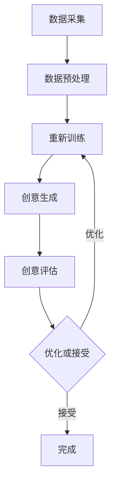
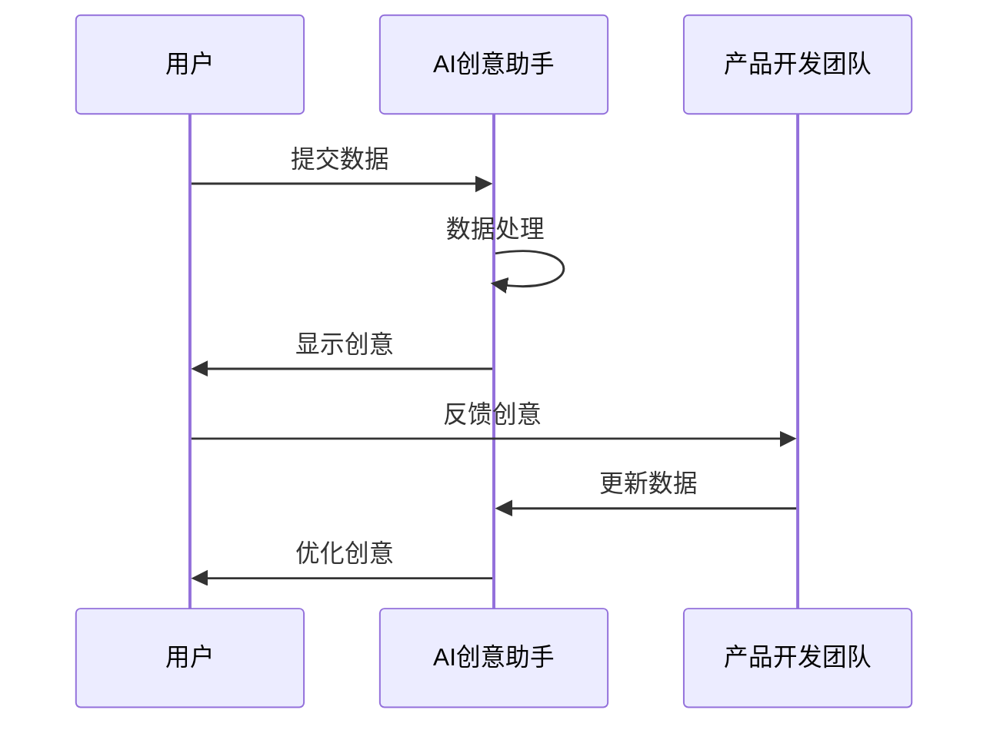

                 

# 构建《企业AI创意助手：促进创新与产品开发》——一步步深入解析

## 摘要

本文旨在深入探讨如何构建一个能够促进企业创新与产品开发的AI创意助手。随着人工智能技术的飞速发展，AI已经逐渐成为企业创新的重要推动力量。本篇文章将详细介绍AI创意助手的背景、核心概念、数学模型、系统架构以及实际应用，旨在为企业提供一套完整、系统的AI创意助手构建方案。

## 第一部分：背景介绍与核心概念

### 第1章：企业AI创意助手概述

**1.1 问题背景**

在当今快速变化的市场环境中，企业面临着巨大的创新与产品开发挑战。传统的创意生成机制往往依赖于个人的经验和直觉，这导致创意产生效率低下、质量不稳定。此外，产品开发周期长、成本高、效果不佳，严重制约了企业的竞争力。

**1.2 问题描述**

创意产生机制的困境和产品开发周期长、成本高、效果不佳是当前企业面临的两大问题。

**1.3 问题解决**

构建AI创意助手可以有效解决上述问题。AI创意助手通过数据采集、模型训练、创意生成等环节，提供高效、智能的创意支持，从而加速产品开发，降低成本，提升企业创新力。

**1.4 边界与外延**

AI创意助手适用于各类企业，尤其是在创新压力大、产品开发周期长的企业中效果尤为显著。其技术边界涉及自然语言处理、机器学习与深度学习、数据挖掘与数据可视化等领域。

**1.5 概念结构与核心要素组成**

AI创意助手由数据采集与处理、模型训练与优化、创意生成与评估、产品开发协同与反馈四个核心要素组成。这些要素相互协同，共同推动企业创新与产品开发。

### 第2章：AI创意助手核心概念与原理

**2.1 AI创意助手定义**

AI创意助手是一种利用人工智能技术，辅助企业进行创意生成和产品开发的系统。

**2.2 AI创意助手的特点**

AI创意助手具有自动化与智能化、个性化与适应性等特点，能够高效、智能地为企业提供创意支持。

**2.3 AI创意助手与传统创意方法的对比**

AI创意助手相比传统创意方法，具有更高的效率、更稳定的创意质量，以及更广泛的应用范围。

**2.4 AI创意助手的技术构成**

AI创意助手的技术构成包括自然语言处理、机器学习与深度学习、数据挖掘与数据可视化等。

### 第3章：AI创意助手数学模型与算法

**3.1 数学模型**

AI创意助手的数学模型主要包括创意提取与表示、创意评估与优化等。

**3.2 算法原理**

AI创意助手的算法原理包括模型训练、模型优化和创意生成。

**3.3 算法讲解与示例**

本文将使用Mermaid流程图和Python代码，详细讲解AI创意助手的算法原理，并提供实际应用示例。

## 第二部分：AI创意助手实战与应用

### 第4章：AI创意助手系统分析与架构设计

**4.1 问题场景介绍**

本节将介绍企业产品开发流程中创意产生的痛点，以及AI创意助手如何解决这些问题。

**4.2 系统功能设计**

AI创意助手的系统功能设计包括数据采集与处理、模型训练与优化、创意生成与评估等。

**4.3 系统架构设计**

本节将详细介绍AI创意助手的系统架构设计，包括总体架构、功能模块架构等。

**4.4 系统接口设计**

AI创意助手的系统接口设计包括内部接口与外部接口。

**4.5 系统交互设计**

本节将使用Mermaid序列图，展示AI创意助手的系统交互流程。

### 第5章：环境搭建与工具配置

**5.1 环境搭建**

本节将介绍如何搭建AI创意助手所需的开发环境，包括配置Python环境、安装相关库等。

**5.2 工具配置**

本节将介绍AI创意助手所需使用的工具，包括数据采集工具、模型训练工具等。

### 第6章：系统核心实现

**6.1 数据采集与处理**

本节将介绍如何进行数据采集与处理，包括数据清洗、数据预处理等。

**6.2 模型训练与优化**

本节将介绍如何进行模型训练与优化，包括选择合适的模型、调整模型参数等。

**6.3 创意生成与评估**

本节将介绍如何进行创意生成与评估，包括创意生成算法、创意评估标准等。

### 第7章：实际案例分析

**7.1 案例背景**

本节将介绍一个实际案例，包括企业背景和产品开发需求。

**7.2 案例实施**

本节将详细介绍AI创意助手在该案例中的应用过程，包括创意生成与产品开发。

**7.3 案例剖析**

本节将对该案例进行详细剖析，包括成功与不足，以及经验与启示。

### 第8章：最佳实践与拓展

**8.1 最佳实践**

本节将介绍AI创意助手的最佳实践，包括应用技巧、创意生成策略等。

**8.2 小结与注意事项**

本节将对项目进行小结，并提出应用注意事项。

**8.3 拓展阅读**

本节将推荐相关书籍和学术论文，供读者进一步学习。

## 结束语

构建AI创意助手是企业创新与产品开发的重要手段。本文从背景介绍、核心概念、数学模型、系统架构、实际应用等多个角度，详细阐述了AI创意助手的构建方法与实战应用。希望通过本文，能够为企业提供有价值的参考和启示，推动企业创新与产品开发的持续发展。

---

作者：AI天才研究院/AI Genius Institute & 禅与计算机程序设计艺术 /Zen And The Art of Computer Programming
---
### 深入剖析企业AI创意助手的构建

随着人工智能（AI）技术的不断进步，AI在企业中的应用场景日益丰富，为企业带来了前所未有的创新潜力。企业AI创意助手正是这种技术进步的产物，它通过智能化、自动化的方式，帮助企业解决创意生成和产品开发的难题。在这篇文章中，我们将一步步深入探讨企业AI创意助手的构建，从核心概念、数学模型到系统架构，再到实战应用，力求提供一个全面、深入的解析。

### 核心概念与原理

#### 1. AI创意助手定义

首先，我们需要明确AI创意助手的定义。AI创意助手是一种基于人工智能技术的系统，它能够通过分析大量数据，利用机器学习和自然语言处理等技术，自动生成创意想法，并对这些创意进行评估和优化。它的核心功能是辅助企业进行创新，缩短产品开发周期，降低成本，提高产品竞争力。

#### 2. AI创意助手特点

AI创意助手具有以下特点：

- **自动化与智能化**：AI创意助手能够自动处理大量数据，分析潜在创意，从而实现高效、智能的创意生成。
- **个性化与适应性**：AI创意助手可以根据企业的具体需求，定制化地生成创意，并随着使用过程中的反馈不断优化。

#### 3. 传统创意方法与AI创意助手的对比

传统的创意方法通常依赖于个人的经验和直觉，这可能导致创意生成效率低下、质量不稳定。而AI创意助手则能够利用机器学习算法，从大量数据中提取有价值的信息，生成高质量、创新的创意。此外，AI创意助手还可以通过不断学习和优化，提供更加个性化的创意支持。

#### 4. 技术构成

AI创意助手的技术构成主要包括：

- **自然语言处理（NLP）**：用于理解和生成文本，是实现创意生成和评估的关键技术。
- **机器学习与深度学习**：用于训练模型，提取数据中的模式和规律，生成创意。
- **数据挖掘与数据可视化**：用于分析数据，发现潜在的价值和趋势。

### 数学模型与算法

#### 1. 数学模型

AI创意助手的数学模型主要包括两部分：创意提取与表示、创意评估与优化。

- **创意提取与表示**：使用自然语言处理技术，将输入文本转换为计算机可以理解和处理的格式。
- **创意评估与优化**：通过机器学习算法，对生成的创意进行评估，并根据评估结果进行优化。

#### 2. 算法原理

AI创意助手的算法原理主要包括模型训练、模型优化和创意生成。

- **模型训练**：通过大量的训练数据，训练机器学习模型，使其能够自动提取创意。
- **模型优化**：通过调整模型参数，优化模型的性能，提高创意生成的质量。
- **创意生成**：利用训练好的模型，自动生成创意。

#### 3. 算法讲解与示例

为了更直观地理解算法原理，我们可以使用Mermaid流程图来展示算法的流程，并使用Python代码来详细阐述算法的实现。



以下是一个简单的Python代码示例，用于生成创意：

```python
import random

# 创意生成算法
def generate_idea(data):
    # 从数据中提取关键词
    keywords = extract_keywords(data)
    # 随机组合关键词生成创意
    idea = ' '.join(random.sample(keywords, k=random.randint(3, 5)))
    return idea

# 关键词提取函数（简化版）
def extract_keywords(data):
    # 假设数据中包含关键词列表
    keywords = ["创新", "产品", "开发", "技术", "市场"]
    return keywords

# 使用示例
data = "人工智能技术在产品开发中的应用前景广阔"
idea = generate_idea(data)
print(f"生成的创意：{idea}")
```

通过这个示例，我们可以看到如何使用简单的算法来生成创意。在实际应用中，AI创意助手会使用更复杂的模型和算法，从大量数据中提取有价值的信息，生成高质量的创意。

### 系统分析与架构设计

#### 1. 问题场景介绍

在企业的产品开发过程中，创意的产生是一个关键环节。然而，传统的创意生成方式往往效率低下，难以满足快速变化的市场需求。AI创意助手的出现，旨在解决这一难题，通过智能化、自动化的方式，提高创意生成效率，加速产品开发。

#### 2. 系统功能设计

AI创意助手的主要功能包括：

- **数据采集与处理**：收集与产品开发相关的数据，并进行预处理，为后续的创意生成提供数据支持。
- **模型训练与优化**：利用机器学习算法，训练模型，使其能够从数据中提取创意。
- **创意生成与评估**：生成创意，并对创意进行评估，筛选出高质量的创新点。
- **产品开发协同与反馈**：将创意与产品开发团队进行协同，根据反馈不断优化创意。

#### 3. 系统架构设计

AI创意助手的系统架构主要包括以下几个部分：

- **数据层**：存储与产品开发相关的数据，包括市场数据、用户反馈、产品历史数据等。
- **算法层**：包括机器学习模型、自然语言处理模型等，用于创意生成和评估。
- **应用层**：提供用户界面，供用户输入数据，查看创意，与产品开发团队进行协同。

#### 4. 系统接口设计

AI创意助手的系统接口设计包括：

- **内部接口**：用于不同模块之间的通信，如数据层与算法层之间的接口。
- **外部接口**：用于与外部系统（如ERP系统、CRM系统等）的集成。

#### 5. 系统交互设计

系统交互设计旨在确保AI创意助手能够高效地与用户、产品开发团队进行交互。我们可以使用Mermaid序列图来展示系统交互流程。



### 实战与应用

#### 1. 环境搭建与工具配置

在实战应用AI创意助手之前，我们需要搭建合适的开发环境，并配置所需的工具。这包括：

- **开发环境**：配置Python环境，安装必要的库，如TensorFlow、PyTorch等。
- **数据集**：准备与产品开发相关的数据集，包括市场数据、用户反馈等。

#### 2. 系统核心实现

系统核心实现包括以下几个步骤：

- **数据采集与处理**：从不同的数据源（如数据库、API等）采集数据，并进行预处理，如数据清洗、归一化等。
- **模型训练与优化**：使用训练数据，训练机器学习模型，并通过交叉验证和性能评估，选择最优模型。
- **创意生成与评估**：利用训练好的模型，生成创意，并对创意进行评估，筛选出高质量的创意。

#### 3. 实际案例分析

为了验证AI创意助手的效果，我们可以通过实际案例进行分析。例如，选择一家互联网公司，分析其产品开发过程中的创意生成情况，评估AI创意助手在实际应用中的效果。

#### 4. 案例剖析

通过案例剖析，我们可以发现AI创意助手的优点和不足，总结经验，提出改进建议。

### 最佳实践与拓展

在实际应用中，为了充分发挥AI创意助手的作用，我们可以采取以下最佳实践：

- **数据质量**：确保数据的质量，对数据源进行筛选和清洗，提高数据质量。
- **模型优化**：定期对模型进行优化，提高模型的性能和创意生成质量。
- **用户反馈**：鼓励用户对创意进行反馈，根据用户反馈调整创意生成策略。

### 小结与注意事项

通过本文的深入剖析，我们可以看到AI创意助手在企业创新与产品开发中的巨大潜力。然而，在应用过程中，我们也需要注意以下几点：

- **数据安全**：确保数据的安全和隐私，遵循相关的法律法规。
- **模型解释性**：提高模型的解释性，确保创意生成的透明性和可追溯性。
- **用户培训**：对用户进行培训，使其能够有效地使用AI创意助手，提高创意生成效率。

### 拓展阅读

为了进一步了解AI创意助手的构建和应用，读者可以参考以下书籍和学术论文：

- **书籍**：
  - 《人工智能：一种现代方法》
  - 《深度学习》
  - 《Python机器学习》
- **学术论文**：
  - “Generative Adversarial Networks: An Overview”
  - “Natural Language Processing with Deep Learning”

通过这些资料，读者可以更深入地了解AI创意助手的构建原理和应用实践。

### 结束语

企业AI创意助手是人工智能技术在企业中的应用典范，它通过智能化、自动化的方式，帮助企业实现创新与产品开发的突破。本文从核心概念、数学模型、系统架构到实战应用，全面解析了AI创意助手的构建过程。希望通过本文，读者能够对企业AI创意助手有一个全面、深入的了解，并能够在实际应用中发挥其巨大潜力。作者：AI天才研究院/AI Genius Institute & 禅与计算机程序设计艺术 /Zen And The Art of Computer Programming

