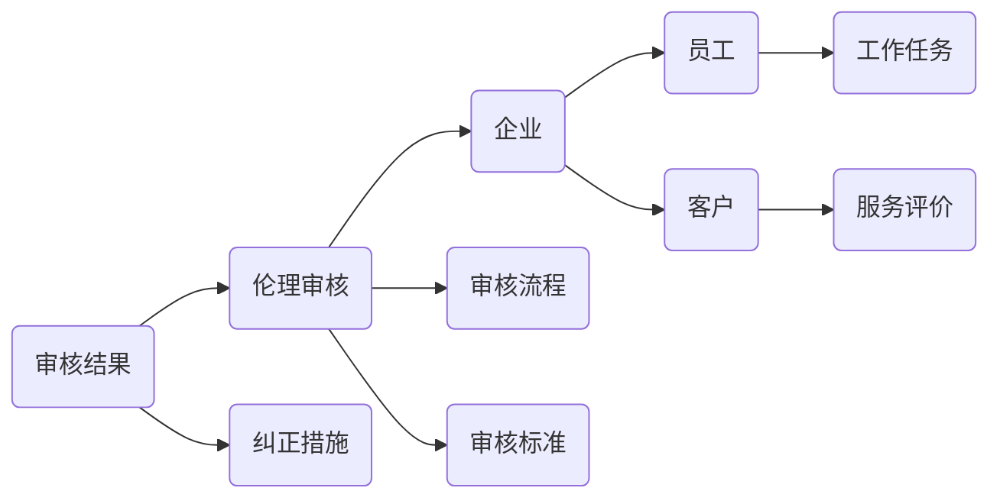

                 

# 构建企业级AI伦理审核框架：确保AI应用的公平性、透明度与可问责性

关键词：AI伦理、企业级、公平性、透明度、可问责性、AI应用

摘要：
随着人工智能（AI）技术的迅速发展，其在企业中的应用越来越广泛，但也随之带来了诸多伦理问题。如何构建一个企业级的AI伦理审核框架，确保AI应用的公平性、透明度与可问责性，已经成为企业必须面对的挑战。本文将详细探讨这一主题，通过逻辑清晰、结构紧凑的分析，帮助企业理解和实施AI伦理审核框架。

## 引言

### AI伦理的重要性

人工智能技术在商业和社会中的应用日益深入，其在决策、优化和自动化等方面的潜力不容忽视。然而，随着AI技术的普及，其带来的伦理问题也日益凸显。例如，AI系统的偏见、数据隐私泄露、自动化失业等问题，都对企业的社会责任和伦理底线提出了更高的要求。

### 企业面临的AI伦理挑战

企业在应用AI技术时，常常面临以下几个伦理挑战：

1. **公平性**：AI系统是否公平地对待所有用户，是否存在歧视现象？
2. **透明度**：AI系统的决策过程是否透明，用户是否能够理解和信任AI系统的决策？
3. **可问责性**：当AI系统出现错误时，责任如何归属？如何确保AI系统的可问责性？

### 本文目标

本文旨在探讨如何构建一个企业级的AI伦理审核框架，通过以下几个步骤实现AI应用的公平性、透明度和可问责性：

1. **理解AI伦理的核心概念**：介绍AI伦理的基本概念和核心原则。
2. **制定AI伦理审核流程**：详细解析AI伦理审核的步骤和方法。
3. **确保AI应用的公平性**：分析如何识别和消除AI系统的偏见。
4. **提升AI应用的透明度**：探讨如何增强AI系统的透明度和可解释性。
5. **实现AI应用的可问责性**：讨论如何确保AI系统的可问责性。

## 核心概念和原则

### AI伦理的基本概念

1. **公平性**：公平性是指AI系统在处理数据和做出决策时，不歧视任何群体，对所有用户都公平对待。
2. **透明度**：透明度是指AI系统的决策过程和算法逻辑对用户是可见和可解释的。
3. **可问责性**：可问责性是指当AI系统出现错误或问题时，责任能够明确归属，并能够对错误进行纠正和责任追究。

### 伦理原则

1. **公正性**：AI系统应该遵循公正性原则，确保对所有用户的公平待遇。
2. **隐私保护**：AI系统在处理用户数据时，必须严格保护用户隐私，防止数据泄露。
3. **尊重人类价值**：AI系统在设计和应用时，应尊重人类的基本价值，避免对人类造成伤害。
4. **透明度和可解释性**：AI系统应该具备透明度和可解释性，使用户能够理解系统的决策过程和算法逻辑。
5. **可问责性**：AI系统应该设计有明确的责任归属机制，确保在系统出现问题时，能够迅速找到责任人并采取措施。

### 概念属性特征对比表格

| 特征 | 公平性 | 透明度 | 可问责性 |
| --- | --- | --- | --- |
| 定义 | 指AI系统不歧视任何用户 | 指AI系统的决策过程和算法逻辑对用户可见和可解释 | 指在AI系统出现问题时，责任能够明确归属 |
| 关键要素 | 数据集的代表性、算法的公平性 | 算法的可解释性、系统日志的记录 | 责任归属机制、纠正措施 |
| 对比 | 需要识别和消除偏见 | 需要增强系统的透明度和解释性 | 需要建立明确的责任归属和纠正机制 |

### ER实体关系图架构

## AI伦理审核流程

### 审核流程的步骤

1. **识别伦理问题**：通过内部审查和外部咨询，识别企业在AI应用中可能存在的伦理问题。
2. **制定伦理准则**：基于识别的问题，制定具体的伦理准则和规范。
3. **内部审查**：由内部团队对AI应用进行伦理审查，评估其是否符合伦理准则。
4. **外部评估**：邀请独立的第三方机构对AI应用进行伦理评估，确保审查的客观性和公正性。
5. **整改和优化**：根据审核结果，对存在问题的AI应用进行整改和优化，确保其符合伦理准则。

### 审核流程中的关键角色

1. **伦理委员会**：负责制定伦理准则、审核AI应用是否符合伦理要求。
2. **AI团队**：负责开发和维护AI系统，确保系统的设计和应用符合伦理准则。
3. **数据团队**：负责数据的质量和代表性，确保AI系统在数据处理过程中不产生偏见。
4. **法律顾问**：提供法律咨询，确保AI应用符合相关法律法规。
5. **第三方评估机构**：独立对AI应用进行伦理评估，提供客观的意见和建议。

### 审核流程的要素

1. **伦理准则**：明确企业的伦理要求和期望，作为审核的基准。
2. **审核标准**：具体的审核标准和流程，确保审核的规范性和一致性。
3. **审核结果**：记录审核结果，包括是否符合伦理准则、存在的问题和改进措施。
4. **纠正措施**：针对审核中识别的问题，制定具体的纠正措施，确保问题的解决。

### 审核流程的挑战与解决方案

1. **技术挑战**：如何确保AI系统的透明度和可解释性，使其符合伦理要求。
   - 解决方案：采用可解释性AI技术，如LIME、SHAP等，提高AI系统的透明度。
2. **数据隐私**：如何在保护用户隐私的同时，进行有效的伦理审核。
   - 解决方案：采用匿名化、数据加密等技术，保护用户隐私。
3. **责任归属**：如何确保在AI系统出现问题时，责任能够明确归属。
   - 解决方案：建立明确的职责分工和责任归属机制，确保问题的解决。

## 确保AI应用的公平性

### 公平性的概念

公平性是指AI系统在处理数据和做出决策时，不歧视任何群体，对所有用户都公平对待。公平性是AI伦理的核心要素之一，关系到AI系统在社会中的可信度和接受度。

### 公平性的挑战

1. **数据偏见**：AI系统在训练过程中，可能会受到训练数据偏见的影响，导致决策不公。
2. **算法偏见**：算法的设计和实现过程中，可能存在不公正的假设和偏见。
3. **技术偏见**：某些AI技术（如人脸识别）在特定群体中表现不佳，可能导致不公平的决策。

### 公平性的识别与消除

1. **数据偏见**的识别与消除
   - 识别：通过分析训练数据集，识别可能存在的偏见和偏差。
   - 消除：通过数据清洗、数据增强等技术手段，消除数据偏见。

2. **算法偏见**的识别与消除
   - 识别：通过算法测试和评估，识别算法中的偏见和偏差。
   - 消除：通过改进算法设计、优化算法参数等技术手段，消除算法偏见。

3. **技术偏见**的识别与消除
   - 识别：通过技术评估和测试，识别技术中的偏见和偏差。
   - 消除：通过技术改进、算法优化等技术手段，消除技术偏见。

### 实践方法

1. **公平性测试**：对AI系统进行公平性测试，评估其对不同群体的公平性。
2. **偏见检测工具**：采用偏见检测工具，如AI Fairness 360、 fairlearn 等，识别和消除偏见。
3. **公平性指标**：建立公平性指标，如公平性分数、偏差度量等，量化AI系统的公平性。

## 提升AI应用的透明度

### 透明度的概念

透明度是指AI系统的决策过程和算法逻辑对用户是可见和可解释的。透明度是建立用户信任和监管合规性的关键要素。

### 透明度的挑战

1. **算法复杂性**：现代AI算法往往非常复杂，难以解释和理解。
2. **数据隐私**：透明度可能导致用户隐私泄露，增加企业的合规风险。
3. **技术门槛**：用户可能缺乏理解AI算法和决策过程的技术能力。

### 提高透明度的方法

1. **可解释性AI**：采用可解释性AI技术，如LIME、SHAP等，提高AI系统的透明度。
2. **可视化工具**：开发可视化工具，帮助用户理解AI系统的决策过程。
3. **透明度报告**：定期发布透明度报告，详细记录AI系统的训练数据、算法参数和决策过程。
4. **用户培训**：提供用户培训，帮助用户理解AI系统的决策过程和算法逻辑。

### 实践方法

1. **算法解释接口**：为AI系统添加算法解释接口，使用户可以查看决策过程的详细信息。
2. **用户反馈机制**：建立用户反馈机制，收集用户对AI系统决策的反馈，进行持续优化。
3. **透明度审计**：定期进行透明度审计，评估AI系统的透明度水平，确保其符合相关法规和标准。

## 实现AI应用的可问责性

### 可问责性的概念

可问责性是指当AI系统出现错误或问题时，责任能够明确归属，并能够对错误进行纠正和责任追究。可问责性是确保AI系统可靠性和安全性的关键要素。

### 可问责性的挑战

1. **责任归属**：在AI系统中，责任归属可能涉及到多个方面，如数据提供者、算法开发者、系统运营者等。
2. **纠正措施**：如何及时纠正AI系统的错误，并采取有效的补救措施。
3. **责任追究**：如何对AI系统的错误进行责任追究，确保责任人不逃避责任。

### 实现可问责性的方法

1. **责任划分**：明确各个角色在AI系统中的职责，确保责任归属明确。
2. **错误检测和纠正机制**：建立错误检测和纠正机制，及时发现和纠正AI系统的错误。
3. **责任追究机制**：建立责任追究机制，对AI系统的错误进行责任追究，确保责任人承担责任。

### 实践方法

1. **责任分配协议**：与各方签订责任分配协议，明确各自的责任范围。
2. **错误日志记录**：详细记录AI系统的错误日志，包括错误发生的时间、原因和影响。
3. **责任追究流程**：制定责任追究流程，确保在AI系统出现错误时，能够迅速采取行动。

## 案例分析

### 案例一：招聘歧视问题

某企业在招聘过程中使用AI系统进行筛选，但系统在处理简历时，对特定性别和种族的简历存在偏见，导致这些群体的求职者被不公平对待。

**分析**：

1. **问题识别**：通过内部审查和外部评估，发现AI系统存在性别和种族歧视。
2. **原因分析**：分析发现，歧视现象主要源于训练数据集的偏见和算法设计的缺陷。
3. **解决措施**：对数据集进行清洗和增强，消除偏见；改进算法设计，提高公平性。

**结论**：通过整改和优化，AI系统的公平性显著提高，招聘歧视问题得到有效解决。

### 案例二：金融风险管理

某金融机构使用AI系统进行风险管理，但系统在处理贷款申请时，对特定群体的贷款审批存在不公平现象。

**分析**：

1. **问题识别**：通过数据分析，发现AI系统对特定群体的贷款审批通过率较低。
2. **原因分析**：分析发现，系统对贷款申请数据的处理存在偏见，导致特定群体的贷款申请被拒绝。
3. **解决措施**：对算法进行优化，消除偏见；增加数据集的多样性，提高系统的公平性。

**结论**：通过优化和改进，AI系统的公平性得到提升，贷款审批过程更加公正。

## 结论

### 核心观点回顾

1. **AI伦理的重要性**：AI技术的发展带来了诸多伦理挑战，企业必须认真对待AI伦理问题。
2. **构建伦理审核框架**：通过构建企业级的AI伦理审核框架，确保AI应用的公平性、透明度和可问责性。
3. **公平性、透明度和可问责性的实现**：通过识别和消除偏见、提高透明度、实现可问责性，确保AI系统的伦理合规性。

### 最佳实践

1. **定期审查**：定期进行AI伦理审核，确保AI系统的持续合规性。
2. **用户参与**：鼓励用户参与AI系统的测试和评估，提高系统的公平性和透明度。
3. **持续改进**：根据审核结果和用户反馈，持续改进AI系统的设计和应用。

### 注意事项

1. **数据隐私**：在提升透明度的同时，要注意保护用户隐私，避免数据泄露。
2. **责任归属**：明确各个角色的责任，确保在AI系统出现问题时，能够迅速找到责任人。

### 拓展阅读

1. **相关法律法规**：《通用数据保护条例》（GDPR）、《加州消费者隐私法》（CCPA）等。
2. **学术研究**：相关领域的研究论文和报告，如《AI伦理：原则、框架与实践》。

### 作者信息

**作者：AI天才研究院/AI Genius Institute & 禅与计算机程序设计艺术 /Zen And The Art of Computer Programming**

