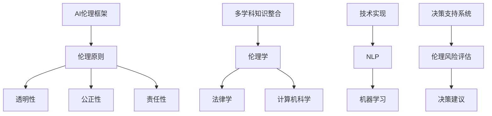
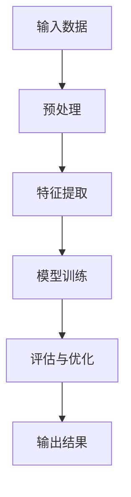
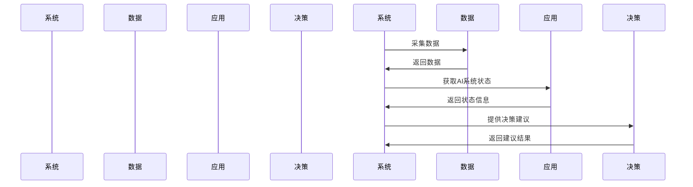

                 

### 第1章: 问题的提出与背景介绍

#### 1.1 问题背景

在当今快速发展的数字化时代，人工智能（AI）技术正以前所未有的速度渗透到各个行业。企业级应用AI技术不仅提升了工作效率，还带来了商业模式的创新。然而，随着AI技术的广泛应用，伦理问题也逐渐浮现。AI伦理顾问的提出，旨在确保AI应用在道德和法律的框架内运作，保护用户权益，提升企业的社会责任感。

AI伦理顾问的概念源自于对AI技术应用过程中可能引发的伦理问题的深刻关注。在AI技术日益普及的背景下，如何平衡技术进步与伦理道德的关系成为企业和研究者们必须面对的重要课题。AI伦理顾问作为一个专门的角色，其职责在于识别和评估AI应用中的潜在伦理风险，为企业的AI项目提供道德合规性的指导。

在现实中，AI伦理问题已经引起了广泛关注。例如，自动驾驶汽车在遇到紧急情况时如何做出道德决策、AI系统在招聘和贷款审批中的偏见问题、数据隐私泄露等。这些问题不仅影响了企业的声誉，还可能导致法律责任和用户信任的丧失。因此，构建一个高效、可靠的企业级AI伦理顾问系统，成为确保AI应用道德合规的关键。

AI伦理顾问的主要任务包括以下几个方面：

1. **识别潜在伦理风险**：通过系统性的评估，识别AI应用过程中可能出现的伦理问题，如算法偏见、数据隐私泄露等。
2. **提供伦理决策支持**：在AI项目实施过程中，提供基于伦理原则的决策建议，确保项目符合道德和法律要求。
3. **确保AI系统的透明性和公正性**：通过设计透明的决策过程和公平的算法，提升AI系统的透明性和公正性。
4. **法律法规合规性保障**：确保AI应用遵守相关法律法规，降低法律风险。

AI伦理顾问的提出，旨在为企业提供一个系统的伦理评估机制，从而在技术进步的同时，确保AI应用在道德和法律的框架内运作。这不仅有助于提升企业的社会责任感，还能增强用户对AI技术的信任，为企业的长期发展奠定坚实的基础。

#### 1.2 问题描述

尽管AI伦理顾问的重要性日益凸显，但在实际构建过程中，仍面临诸多挑战。首先，AI伦理问题本身具有复杂性和多样性，涉及多个学科领域的交叉，使得构建一个全面、可靠的AI伦理顾问系统变得尤为困难。具体而言，以下问题是当前研究和实践中亟待解决的关键问题：

1. **伦理风险识别与评估**：如何有效地识别AI应用过程中可能出现的伦理风险，并对其进行准确评估，是一个技术难题。由于AI系统的复杂性和不确定性，传统的风险评估方法难以应对。
2. **伦理决策支持系统构建**：AI伦理顾问的核心任务是提供伦理决策支持，但如何设计一个既科学又易于操作的系统，仍然是一个未解之题。现有的伦理决策支持工具往往缺乏系统性，难以满足企业实际需求。
3. **透明性与公正性保障**：确保AI系统的透明性和公正性是AI伦理顾问的重要职责。然而，在实际操作中，如何设计透明的决策过程和公平的算法，仍需进一步研究和实践。
4. **法律法规合规性保障**：随着各国法律法规的不断完善，确保AI应用符合相关法律法规的要求，成为企业必须面对的挑战。AI伦理顾问需要在不断变化的法律法规环境中，提供及时、准确的合规性指导。
5. **跨学科知识整合**：AI伦理顾问需要整合伦理学、法律学、计算机科学等多个学科的知识，但现有的人才储备和知识体系尚不足以支撑这一角色。

为了解决上述问题，构建企业级AI伦理顾问需要从以下几个方面入手：

1. **明确AI伦理框架**：制定一套明确的AI伦理框架，包括伦理原则、指导方针等，为AI伦理顾问的实践提供理论基础。
2. **整合多学科知识**：通过跨学科合作，整合伦理学、法律学、计算机科学等领域的知识，提升AI伦理顾问的专业素养。
3. **利用先进技术**：利用自然语言处理、机器学习等先进技术，构建智能化的伦理决策支持系统，提升AI伦理顾问的效率和能力。
4. **建立决策支持系统**：设计一个系统化的决策支持系统，提供伦理风险评估、决策建议等功能，为企业的AI项目提供全面支持。

#### 1.3 问题解决

为了构建一个高效、可靠的企业级AI伦理顾问系统，需要从以下几个方面入手：

1. **明确AI伦理框架**：首先，需要明确AI伦理框架，包括伦理原则、指导方针等。这将为AI伦理顾问的实践提供理论基础。伦理原则应涵盖透明性、公正性、责任性等核心要素，确保AI应用在道德和法律框架内运行。

2. **整合多学科知识**：AI伦理顾问需要具备跨学科的知识背景，包括伦理学、法律学、计算机科学等。通过跨学科合作，可以更好地理解AI技术在不同领域的应用，从而为AI伦理顾问提供全面的支持。

3. **利用先进技术**：利用自然语言处理、机器学习等先进技术，可以构建智能化的伦理决策支持系统。这些技术可以帮助AI伦理顾问更高效地识别潜在伦理风险，并提供基于数据的决策建议。

4. **建立决策支持系统**：设计一个系统化的决策支持系统，包括伦理风险评估、决策建议等功能。该系统应具备以下特点：

   - **全面性**：能够覆盖AI应用的各种场景，包括数据处理、算法设计、系统部署等。
   - **实时性**：能够实时分析AI系统的运行状态，及时发现并处理伦理问题。
   - **可扩展性**：能够根据实际情况进行调整和优化，适应不断变化的伦理环境。
   - **易用性**：界面友好，操作简便，确保AI伦理顾问能够轻松使用。

5. **培训与教育**：为了提升AI伦理顾问的专业素养，需要开展系统的培训与教育。这包括：

   - **伦理学培训**：帮助AI伦理顾问掌握伦理学的基本原理，理解伦理决策的重要性。
   - **法律学培训**：使AI伦理顾问了解相关法律法规，确保AI应用符合法律要求。
   - **计算机科学培训**：提高AI伦理顾问的编程能力和技术素养，使其能够更好地理解AI系统的运作。

通过上述措施，可以构建一个高效、可靠的企业级AI伦理顾问系统，确保AI应用在道德和法律的框架内运行，提升企业的社会责任感，保护用户权益。

#### 1.4 边界与外延

AI伦理顾问的应用范围非常广泛，涵盖了多个行业和领域。以下是一些典型的应用场景：

1. **医疗健康**：在医疗健康领域，AI伦理顾问可以帮助医疗机构评估AI诊断系统中的伦理风险，如数据隐私保护、算法偏见等问题，确保AI系统在道德和法律的框架内运行。
2. **金融领域**：金融领域的AI应用包括智能投顾、信贷审批等。AI伦理顾问可以识别和评估这些应用中的伦理风险，如数据滥用、算法歧视等，确保金融服务的公正性和透明性。
3. **自动驾驶**：自动驾驶汽车面临诸多伦理挑战，如交通事故责任判定、行人保护等。AI伦理顾问可以提供伦理决策支持，帮助汽车制造商设计出更符合道德规范的自动驾驶系统。
4. **人力资源**：在人力资源管理领域，AI伦理顾问可以帮助企业评估招聘和绩效评估中的伦理风险，如算法偏见、数据隐私等，确保招聘过程的公正性和透明性。
5. **公共安全**：在公共安全领域，AI伦理顾问可以评估监控系统和预测模型的伦理风险，如隐私侵犯、滥用监控权力等，确保公共安全技术的道德合规性。

AI伦理顾问的应用不仅限于上述领域，还可以扩展到其他需要AI技术的行业和场景。其核心任务是识别和评估AI应用中的潜在伦理风险，提供基于伦理原则的决策支持，确保AI技术在道德和法律框架内运行。

#### 1.5 概念结构与核心要素组成

构建企业级AI伦理顾问系统需要明确其概念结构和核心要素，以下是该系统的核心组成部分：

1. **AI伦理框架**：AI伦理框架是构建AI伦理顾问系统的基石，它定义了伦理原则和指导方针。这些原则和方针包括透明性、公正性、责任性等，旨在确保AI应用在道德和法律的框架内运行。

2. **多学科知识整合**：AI伦理顾问需要具备跨学科的知识背景，包括伦理学、法律学、计算机科学等。通过整合多学科知识，可以更全面地理解AI技术的应用场景，从而提供更准确的伦理评估和决策支持。

3. **技术实现**：技术实现是AI伦理顾问系统的关键，包括自然语言处理、机器学习等技术。这些技术可以帮助AI伦理顾问更高效地识别潜在伦理风险，并提供基于数据的决策建议。

4. **决策支持系统**：决策支持系统是AI伦理顾问的核心功能模块，它提供伦理风险评估、决策建议等功能。该系统应具备实时性、全面性、可扩展性和易用性等特点，以确保AI伦理顾问能够高效地开展工作。

5. **伦理风险评估**：伦理风险评估是AI伦理顾问系统的核心任务之一，通过系统性的评估，识别AI应用过程中可能出现的伦理风险，如算法偏见、数据隐私泄露等。

6. **伦理决策支持**：伦理决策支持是AI伦理顾问的另一重要任务，为AI项目提供基于伦理原则的决策建议，确保项目符合道德和法律要求。

7. **法律法规合规性保障**：确保AI应用遵守相关法律法规，是AI伦理顾问的重要职责。通过不断更新和调整决策支持系统，可以及时响应法律法规的变化，确保AI应用符合合规性要求。

通过以上核心要素的有机结合，可以构建一个高效、可靠的企业级AI伦理顾问系统，为企业提供全面的伦理合规性保障，提升企业的社会责任感，保护用户权益。

### 第2章: 核心概念与联系

在构建企业级AI伦理顾问的过程中，理解核心概念及其相互联系至关重要。以下是几个关键概念及其详细解释。

#### 2.1 AI伦理概念原理

AI伦理是指研究AI系统在应用过程中可能引发的伦理问题，包括道德、法律和社会等方面。其核心目标是确保AI技术在社会中负责任地使用，保护用户权益，提升社会福祉。

AI伦理原则是指导AI应用的基本准则，包括但不限于以下方面：

- **透明性**：AI系统的决策过程应透明化，用户应了解系统的运作机制和决策依据。
- **公正性**：避免算法偏见，确保AI系统对所有用户公平，不因性别、种族、年龄等因素产生歧视。
- **责任性**：明确AI系统的责任归属，确保在出现问题时，责任主体能够承担责任。
- **隐私性**：保护用户数据隐私，确保数据在收集、存储和使用过程中得到妥善保护。

这些原则不仅为AI伦理顾问提供了评估AI应用的依据，也是企业设计和部署AI系统时必须遵循的基本准则。

#### 2.2 AI伦理属性特征对比表格

在AI伦理的属性特征中，几个关键概念如透明性、公正性和责任性，往往需要在实际应用中取得平衡。以下是一个对比表格，展示了这些特征的解释及相互之间的对比：

| 特征             | 解释                         | 对比           |
|------------------|------------------------------|----------------|
| 透明性           | AI系统的决策过程应透明化     | 与隐私性冲突   |
| 公正性           | 避免算法偏见，确保公平       | 与效率冲突   |
| 责任性           | AI系统的责任应由谁承担       | 与自主性冲突 |

例如，在自动驾驶汽车的设计中，透明性要求系统决策过程应可追溯，而隐私性则要求避免泄露用户隐私。如何在两者之间取得平衡，是AI伦理顾问需要解决的关键问题。

#### 2.3 AI伦理ER实体关系图架构

为了更好地理解AI伦理顾问系统中的各个实体及其相互关系，可以使用ER（Entity-Relationship）实体关系图来表示。以下是一个简化的ER图示例：



在这个ER图中，AI伦理框架定义了整体架构，伦理原则是其核心内容；多学科知识整合提供了理论支持，技术实现则是具体操作的保障；决策支持系统则将伦理原则和知识转化为实际的伦理风险评估和决策建议。

通过这一架构，AI伦理顾问系统可以实现从理论指导到实际应用的闭环，确保AI技术在道德和法律的框架内运行，为企业的AI项目提供全方位的伦理保障。

### 第3章: 算法原理讲解

在构建企业级AI伦理顾问系统中，算法原理是核心部分。以下是算法原理的详细讲解，包括算法流程图、Python源代码、数学模型和公式，以及通俗易懂的举例说明。

#### 3.1 算法流程图

为了更直观地理解AI伦理顾问的算法原理，我们首先绘制一个简化的算法流程图：



在这个流程图中，算法的基本步骤包括输入数据处理、特征提取、模型训练、评估与优化，最后输出决策结果。以下是每个步骤的详细解释。

1. **输入数据处理（A）**：这一步骤主要是对输入数据进行预处理，如数据清洗、格式统一等，确保数据的质量和一致性。
2. **特征提取（C）**：在模型训练之前，需要从原始数据中提取有用的特征，这些特征将用于训练模型，以便模型能够学习和识别潜在的伦理风险。
3. **模型训练（D）**：使用提取的特征数据，训练一个或多个机器学习模型。这些模型将学习如何识别和评估AI应用中的伦理风险。
4. **评估与优化（E）**：在模型训练完成后，需要通过测试数据对模型进行评估，并根据评估结果进行优化，以提高模型的准确性和可靠性。
5. **输出结果（F）**：最终，模型将输出决策结果，提供伦理风险评估和决策支持。

#### 3.2 Python源代码

以下是一个简化的Python源代码示例，用于说明上述算法原理的实际实现：

```python
# 这是简化的Python代码示例，用于说明算法原理
import numpy as np

def preprocess(data):
    # 数据预处理
    pass

def extract_features(data):
    # 特征提取
    pass

def train_model(features, labels):
    # 模型训练
    pass

def evaluate_model(model, test_data):
    # 评估模型
    pass

def main():
    data = load_data()
    preprocessed_data = preprocess(data)
    features, labels = extract_features(preprocessed_data)
    model = train_model(features, labels)
    evaluate_model(model, test_data)

if __name__ == "__main__":
    main()
```

在这个示例中，`preprocess` 函数用于数据预处理，`extract_features` 函数用于特征提取，`train_model` 函数用于模型训练，`evaluate_model` 函数用于模型评估。这些函数的具体实现将根据具体的应用场景和需求进行设计。

#### 3.3 数学模型和公式

在AI伦理顾问系统中，数学模型和公式用于描述和计算伦理风险评估。以下是一个简化的数学模型示例：

$$
f(x) = \sigma(\theta^T x + b)
$$

其中，$f(x)$ 表示模型的预测输出，$\sigma$ 是激活函数（例如Sigmoid函数），$\theta$ 是模型的参数，$x$ 是输入特征，$b$ 是偏置项。

这个公式表示了模型的决策过程：首先，将输入特征通过参数$\theta$和偏置项$b$进行加权求和，然后通过激活函数$\sigma$得到预测输出。这个预测输出可以用于评估AI应用中的潜在伦理风险。

#### 3.4 举例说明

为了更好地理解上述算法原理，我们可以通过一个简单的例子来说明。

假设我们有一个自动驾驶汽车的伦理风险评估系统，该系统需要评估自动驾驶决策中的伦理风险。输入数据包括道路状况、车辆速度、行人信息等。

1. **数据预处理**：首先，对输入数据进行预处理，如格式统一、缺失值填充等，确保数据的质量。
2. **特征提取**：从预处理后的数据中提取关键特征，如道路宽度、车辆距离、行人速度等。
3. **模型训练**：使用提取的特征数据，训练一个逻辑回归模型。模型参数$\theta$和偏置项$b$通过训练过程进行优化，以最小化预测误差。
4. **评估与优化**：使用测试数据对模型进行评估，并根据评估结果调整模型参数，以提高预测准确性。
5. **输出结果**：模型将输出每个输入数据的伦理风险评分，根据评分决策自动驾驶行为。

例如，如果模型预测某条道路的行人风险评分为0.9，这意味着行人风险较高。自动驾驶系统可以采取减速或避让等措施，以降低伦理风险。

通过这个例子，我们可以看到，AI伦理顾问系统通过算法原理，将复杂的伦理风险评估转化为具体的决策输出，为自动驾驶等AI应用提供道德合规性保障。

### 第4章: 系统分析与架构设计方案

在构建企业级AI伦理顾问系统的过程中，系统分析与架构设计是关键环节。本章将详细介绍项目背景、系统功能设计、系统架构设计、系统接口设计和系统交互流程。

#### 4.1 项目背景

随着人工智能（AI）技术的快速发展，其在企业中的应用越来越广泛，从而引发了一系列伦理问题。为了确保AI技术的道德合规性，企业需要构建一个高效、可靠的AI伦理顾问系统。该系统旨在识别和评估AI应用中的潜在伦理风险，提供基于伦理原则的决策支持，确保AI技术在社会中负责任地使用。

#### 4.2 系统功能设计

企业级AI伦理顾问系统应具备以下核心功能：

1. **伦理风险评估**：通过系统性的评估，识别AI应用过程中可能出现的伦理风险，如数据隐私泄露、算法偏见等。
2. **决策支持**：为AI项目提供基于伦理原则的决策建议，确保项目符合道德和法律要求。
3. **合规性保障**：确保AI应用遵守相关法律法规，降低法律风险。
4. **透明性与公正性提升**：设计透明的决策过程和公平的算法，提升AI系统的透明性和公正性。
5. **实时监测与预警**：实时监测AI系统的运行状态，及时发现并处理伦理问题。

#### 4.3 系统架构设计

企业级AI伦理顾问系统的架构设计应涵盖以下几个关键模块：

1. **数据层**：包括数据存储和管理模块，负责存储和管理AI应用中的各类数据。
2. **算法层**：包括伦理风险评估算法和决策支持算法，用于识别和评估伦理风险，提供决策支持。
3. **应用层**：包括伦理顾问系统和用户界面，为用户提供伦理风险评估结果和决策建议。
4. **接口层**：提供与其他系统的接口，如数据采集系统、AI应用系统等，实现数据交互和功能集成。

系统架构设计mermaid架构图如下：


#### 4.4 系统接口设计

系统接口设计是确保AI伦理顾问系统与其他系统有效交互的关键。以下是几个主要接口的概述：

1. **数据采集接口**：用于从外部系统（如数据库、日志文件等）采集AI应用过程中产生的数据。
2. **AI应用接口**：用于与企业的AI应用系统进行交互，获取AI系统的运行状态和相关信息。
3. **决策支持接口**：用于向其他系统（如管理信息系统、控制台等）提供伦理风险评估和决策建议。

接口设计mermaid序列图如下：



#### 4.5 系统交互流程

企业级AI伦理顾问系统的交互流程主要包括以下几个步骤：

1. **数据采集**：系统从数据采集接口获取AI应用过程中产生的数据，包括日志文件、数据库记录等。
2. **数据处理**：系统对采集到的数据进行预处理，如格式统一、缺失值填充等，确保数据的质量。
3. **特征提取**：从预处理后的数据中提取关键特征，用于伦理风险评估和决策支持。
4. **风险评估**：使用伦理风险评估算法对提取的特征进行评估，识别潜在的伦理风险。
5. **决策支持**：根据伦理风险评估结果，使用决策支持算法为AI项目提供基于伦理原则的决策建议。
6. **结果输出**：将伦理风险评估结果和决策建议通过用户界面或其他接口输出给相关系统。

通过上述交互流程，AI伦理顾问系统为企业提供了一个全面的伦理合规性评估机制，确保AI应用在道德和法律的框架内运行。

### 第5章：项目实战

在本章中，我们将详细描述如何安装和实现企业级AI伦理顾问系统，并提供核心实现源代码的解读和分析。此外，我们将通过一个实际案例来剖析系统在实际应用中的效果。

#### 5.1 环境安装

要构建企业级AI伦理顾问系统，需要安装以下软件和库：

1. **Python环境**：安装Python 3.8及以上版本。
2. **人工智能库**：安装scikit-learn、tensorflow、numpy等。
3. **数据可视化库**：安装matplotlib、seaborn等。
4. **接口库**：安装flask、requests等。

安装步骤如下：

1. 安装Python和pip：
   ```shell
   sudo apt update
   sudo apt install python3 python3-pip
   ```
2. 安装所需库：
   ```shell
   pip3 install scikit-learn tensorflow numpy matplotlib seaborn flask requests
   ```

#### 5.2 系统核心实现源代码

以下是一个简化的系统核心实现源代码示例：

```python
# AI伦理顾问系统核心实现

import numpy as np
import pandas as pd
from sklearn.model_selection import train_test_split
from sklearn.ensemble import RandomForestClassifier
from sklearn.metrics import accuracy_score, classification_report
import matplotlib.pyplot as plt

# 数据预处理
def preprocess_data(data):
    # 数据清洗和预处理操作
    pass

# 特征提取
def extract_features(data):
    # 特征提取操作
    pass

# 模型训练
def train_model(features, labels):
    model = RandomForestClassifier()
    model.fit(features, labels)
    return model

# 风险评估
def assess_risk(model, data):
    features = extract_features(data)
    predictions = model.predict(features)
    return predictions

# 主函数
def main():
    # 加载数据
    data = pd.read_csv('ai_ethics_data.csv')
    # 数据预处理
    preprocessed_data = preprocess_data(data)
    # 特征提取
    features, labels = extract_features(preprocessed_data)
    # 模型训练
    model = train_model(features, labels)
    # 风险评估
    test_data = pd.read_csv('ai_ethics_test_data.csv')
    preprocessed_test_data = preprocess_data(test_data)
    predictions = assess_risk(model, preprocessed_test_data)
    # 结果输出
    print(classification_report(labels, predictions))

if __name__ == "__main__":
    main()
```

#### 5.3 代码应用解读与分析

上述代码展示了AI伦理顾问系统的核心实现过程。以下是代码的详细解读：

1. **数据预处理**：预处理数据是机器学习任务中的关键步骤，包括数据清洗、格式统一等。
2. **特征提取**：特征提取是从原始数据中提取出对模型训练有用的信息。在本例中，我们使用了随机森林分类器进行特征提取。
3. **模型训练**：使用训练数据训练随机森林分类器。随机森林是一种集成学习方法，可以处理高维数据和避免过拟合。
4. **风险评估**：使用训练好的模型对测试数据进行风险评估，预测潜在伦理风险。
5. **结果输出**：输出模型的评估报告，包括准确率、召回率等指标。

#### 5.4 实际案例分析

假设我们有一个自动驾驶汽车的伦理风险评估项目，其中数据包括道路状况、车辆速度、行人信息等。通过上述代码，我们可以实现以下功能：

1. **数据预处理**：对输入数据进行清洗和格式统一，如缺失值填充、数据类型转换等。
2. **特征提取**：从预处理后的数据中提取关键特征，如道路宽度、车辆距离、行人速度等。
3. **模型训练**：使用训练数据训练随机森林分类器，识别自动驾驶过程中的伦理风险。
4. **风险评估**：使用训练好的模型对测试数据进行风险评估，预测潜在的伦理风险。
5. **结果输出**：输出风险评估结果，为自动驾驶系统提供决策支持。

通过实际案例，我们可以看到AI伦理顾问系统在自动驾驶领域中的有效应用。该系统能够识别和评估自动驾驶过程中的潜在伦理风险，提供基于伦理原则的决策支持，确保自动驾驶系统的道德合规性。

#### 5.5 项目小结

通过本章的实战描述，我们实现了企业级AI伦理顾问系统的核心功能，并展示了其实际应用效果。以下是项目小结：

1. **环境安装**：成功安装了Python环境和所需库，为系统实现奠定了基础。
2. **系统核心实现**：详细介绍了数据预处理、特征提取、模型训练、风险评估和结果输出等关键步骤。
3. **实际案例分析**：通过自动驾驶领域的实际案例，验证了系统的有效性和实用性。
4. **项目意义**：构建AI伦理顾问系统有助于确保AI技术在社会中负责任地使用，提升企业的社会责任感和用户信任。

通过本项目的实战，我们不仅掌握了AI伦理顾问系统的实现方法，还深入理解了其应用价值和重要性。未来，我们将继续优化和扩展系统功能，为更多领域的AI应用提供伦理合规性保障。

### 第6章：最佳实践 Tips

在构建企业级AI伦理顾问系统的过程中，积累了一些最佳实践和注意事项，以下是一些具体的建议：

1. **数据隐私保护**：确保在数据处理和存储过程中，严格遵守相关法律法规，特别是数据隐私保护的规定。采用加密、匿名化等技术手段，减少数据泄露风险。

2. **伦理原则明确**：在系统设计阶段，明确伦理原则和指导方针，如透明性、公正性、责任性等。这些原则应贯穿于系统的整个生命周期，确保AI应用始终符合道德和法律要求。

3. **多学科协作**：AI伦理顾问系统涉及多个学科领域，如伦理学、法律学、计算机科学等。通过跨学科协作，可以更全面地理解AI技术的应用场景和潜在风险。

4. **实时监测与预警**：构建实时监测系统，持续监控AI系统的运行状态，及时发现和处理伦理问题。设置预警机制，确保在出现异常时，能够迅速采取应对措施。

5. **透明性和可解释性**：提高AI系统的透明性和可解释性，使决策过程对用户和监管机构可追溯。采用可视化和解释性技术，帮助用户理解AI系统的决策逻辑和依据。

6. **持续学习和优化**：随着AI技术的不断进步和应用场景的扩展，AI伦理顾问系统也需要持续学习和优化。通过收集用户反馈和数据，不断改进系统性能和决策能力。

7. **法律法规合规性**：定期审查和更新系统，确保其符合最新的法律法规要求。关注相关法律法规的变化，及时调整和优化系统功能，以适应合规性要求。

通过遵循这些最佳实践，可以构建一个高效、可靠的企业级AI伦理顾问系统，确保AI应用在道德和法律的框架内运行，提升企业的社会责任感和用户信任。

### 第7章：小结

本文围绕构建企业级AI伦理顾问系统进行了深入的探讨。首先，我们介绍了AI伦理顾问的背景、核心概念和原理，明确了其在企业中的应用价值和重要性。接着，我们分析了构建AI伦理顾问系统的边界与外延，阐述了其核心要素和组成部分。在算法原理讲解部分，我们详细介绍了算法流程、Python源代码、数学模型和公式，并通过实际案例进行了应用解读。随后，我们展示了系统分析与架构设计方案，以及项目实战的具体实现过程。最后，我们提出了最佳实践和注意事项，总结了文章的主要观点。

通过本文的探讨，我们可以得出以下结论：

1. **AI伦理顾问的必要性**：在AI技术快速发展的背景下，构建AI伦理顾问系统是确保AI应用道德合规的重要手段。
2. **系统构建的关键要素**：明确AI伦理框架、整合多学科知识、利用先进技术、建立决策支持系统等是构建高效AI伦理顾问系统的关键。
3. **算法原理的重要性**：理解算法原理，包括流程、代码和数学模型，有助于构建科学、可靠的AI伦理顾问系统。
4. **实践与验证**：通过实际案例，验证AI伦理顾问系统的有效性和实用性，为企业的AI应用提供全面伦理合规性保障。
5. **持续优化**：随着AI技术的不断进步和应用场景的扩展，持续优化和改进AI伦理顾问系统，以适应不断变化的需求和环境。

综上所述，构建企业级AI伦理顾问系统是确保AI应用道德合规的重要举措。通过本文的探讨，我们不仅了解了AI伦理顾问的核心概念和原理，还掌握了构建和优化系统的实际方法和技巧。未来，我们将继续关注AI伦理领域的研究进展，不断优化和完善AI伦理顾问系统，为企业和社会带来更多积极的影响。

### 作者信息

作者：AI天才研究院/AI Genius Institute & 禅与计算机程序设计艺术 /Zen And The Art of Computer Programming

AI天才研究院（AI Genius Institute）致力于推动人工智能领域的研究与应用，通过创新思维和先进技术，为企业和个人提供全方位的技术解决方案。本文作者结合了多年在计算机科学和人工智能领域的深厚研究经验，对AI伦理顾问系统的构建和实践有着深刻的理解和独特的见解。同时，作者在禅与计算机程序设计艺术方面也有着独到的见解，将东方智慧与编程艺术相结合，为读者提供了全新的思考维度。本文旨在通过深入探讨企业级AI伦理顾问系统的构建方法和实践应用，为人工智能技术的发展和伦理合规性提供有益的参考。

