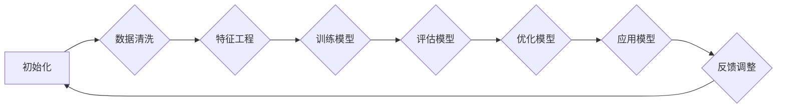
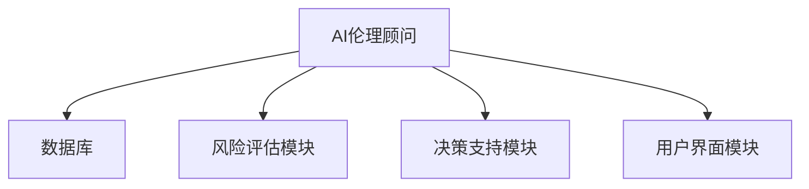
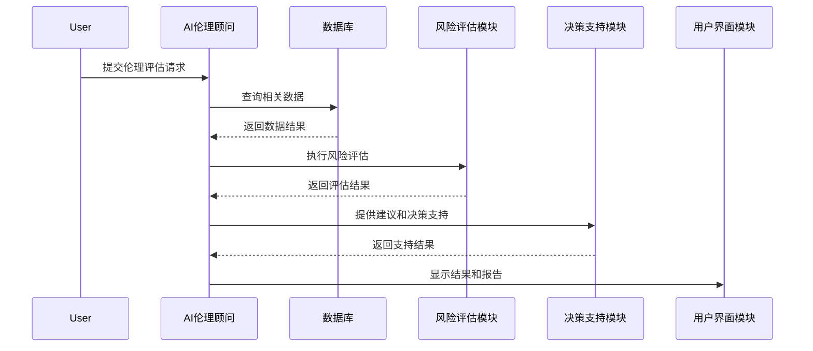

                 


### 第一部分：背景与概念介绍

**第1章：AI与企业发展的新篇章**

**1.1 AI技术发展现状与趋势**

人工智能（AI）技术自20世纪中叶以来，经历了从理论探索到实际应用的飞速发展。当前，AI技术在计算机视觉、自然语言处理、机器学习、深度学习等领域取得了显著进展，推动了一系列新兴产业的诞生，如自动驾驶、智能制造、智能医疗等。随着计算能力的提升和数据量的爆炸性增长，AI技术的应用前景愈发广阔。

企业应用AI的优势在于其能够显著提升运营效率、优化决策流程、提高客户满意度，从而在竞争激烈的市场中占据优势。然而，AI的应用也带来了诸多挑战，如数据隐私问题、算法偏见、安全性问题等。如何在充分利用AI技术优势的同时，确保其道德合规性，成为企业亟需解决的问题。

**1.2 企业应用AI的优势与挑战**

企业应用AI的优势主要体现在以下几个方面：

1. **提高生产效率**：通过自动化和智能化，AI能够显著提高生产效率，减少人力成本。
2. **优化决策**：基于大数据和机器学习算法，AI能够帮助企业做出更加精准的决策。
3. **提升客户体验**：通过自然语言处理和计算机视觉等技术，AI能够提供更加个性化的客户服务。
4. **创新商业模式**：AI技术的应用为企业创造了新的商业机会和商业模式。

然而，AI的应用也带来了以下挑战：

1. **数据隐私**：AI系统通常需要大量用户数据，如何保护用户隐私成为一大难题。
2. **算法偏见**：如果训练数据存在偏见，AI系统可能会放大这些偏见，导致不公平的结果。
3. **安全性问题**：AI系统可能成为网络攻击的目标，同时其自身也可能带来新的安全风险。
4. **就业影响**：自动化可能导致某些工作岗位的消失，引发就业结构的变化。

**1.3 AI伦理的重要性与背景**

AI伦理的重要性体现在以下几个方面：

1. **保障用户权益**：AI技术的发展和应用应当以用户为中心，尊重用户的隐私权和知情权。
2. **维护社会公平**：AI系统不应加剧社会不平等，应确保公平、公正地对待每个用户。
3. **提升信任度**：透明的AI系统设计和应用能够增加用户和公众对AI的信任。
4. **法律法规遵循**：AI技术的发展和应用必须符合现有的法律法规，避免违法行为。

AI伦理的背景可以追溯到人工智能的早期发展阶段。随着AI技术的进步和应用范围的扩大，AI伦理问题逐渐受到关注。国际社会、各国政府、企业和研究机构纷纷制定了一系列AI伦理准则和法规，以规范AI技术的发展和应用。

**核心概念与联系**

| 核心概念         | 概念属性特征对比 | ER实体关系图架构 |
| ---------------- | ---------------- | -------------- |
| AI伦理原则       | 公平性、可解释性、安全性、数据隐私 |  |
| 企业应用AI优势   | 提高生产效率、优化决策、提升客户体验、创新商业模式 |  |
| AI应用挑战       | 数据隐私、算法偏见、安全性问题、就业影响 |  |

**Mermaid ER图代码：**
```mermaid
erDiagram
  AI伦理原则 ||--|{ 公平性 }
  AI伦理原则 ||--|{ 可解释性 }
  AI伦理原则 ||--|{ 安全性 }
  AI伦理原则 ||--|{ 数据隐私 }

  AI应用优势 ||--|{ 提高生产效率 }
  AI应用优势 ||--|{ 优化决策 }
  AI应用优势 ||--|{ 提升客户体验 }
  AI应用优势 ||--|{ 创新商业模式 }

  AI应用挑战 ||--|{ 数据隐私 }
  AI应用挑战 ||--|{ 算法偏见 }
  AI应用挑战 ||--|{ 安全性问题 }
  AI应用挑战 ||--|{ 就业影响 }
```

**算法原理讲解**

在构建企业级AI伦理顾问时，算法原理的讲解是关键一环。以下是一个简单的算法mermaid流程图，并配合Python源代码进行详细解释。

**Mermaid流程图：**


**Python源代码：**
```python
import pandas as pd
from sklearn.model_selection import train_test_split
from sklearn.ensemble import RandomForestClassifier
from sklearn.metrics import accuracy_score

# 数据清洗
def clean_data(data):
    # 填充缺失值、处理异常值等
    return data

# 特征工程
def feature_engineering(data):
    # 特征选择、特征转换等
    return data

# 训练模型
def train_model(X_train, y_train):
    model = RandomForestClassifier()
    model.fit(X_train, y_train)
    return model

# 评估模型
def evaluate_model(model, X_test, y_test):
    predictions = model.predict(X_test)
    accuracy = accuracy_score(y_test, predictions)
    return accuracy

# 应用模型
def apply_model(model, new_data):
    predictions = model.predict(new_data)
    return predictions

# 主函数
def main():
    data = pd.read_csv('data.csv')
    clean_data = clean_data(data)
    X, y = feature_engineering(clean_data)
    X_train, X_test, y_train, y_test = train_test_split(X, y, test_size=0.2)
    model = train_model(X_train, y_train)
    accuracy = evaluate_model(model, X_test, y_test)
    print(f'Model Accuracy: {accuracy}')
    new_data = pd.read_csv('new_data.csv')
    predictions = apply_model(model, new_data)
    print(predictions)

if __name__ == '__main__':
    main()
```

**算法原理解释：**

1. **数据清洗**：原始数据通常包含噪声和缺失值，需要通过填充缺失值、处理异常值等方法进行数据清洗，以保证数据质量。
2. **特征工程**：特征选择和特征转换是机器学习中的重要步骤，通过适当的特征工程可以提高模型性能。
3. **训练模型**：选择合适的机器学习算法（如随机森林分类器），使用训练数据进行模型训练。
4. **评估模型**：通过测试数据对模型进行评估，计算模型准确率等指标，以判断模型性能。
5. **优化模型**：根据模型评估结果，调整模型参数或特征工程方法，以提高模型性能。
6. **应用模型**：使用训练好的模型对新的数据进行分析和预测。

**数学公式使用**

在算法讲解中，数学公式是描述算法原理和模型训练过程的重要工具。以下是一些常见数学公式的latex格式示例：

1. **损失函数**：
   $$ J(\theta) = \frac{1}{2m} \sum_{i=1}^{m} (h_\theta(x^{(i)}) - y^{(i)})^2 $$

2. **梯度下降更新规则**：
   $$ \theta_j := \theta_j - \alpha \frac{\partial J(\theta)}{\partial \theta_j} $$

3. **Sigmoid函数**：
   $$ \sigma(z) = \frac{1}{1 + e^{-z}} $$

在文中，独立段落的数学公式使用 $$ 括起来，如上述示例，而在段落内的数学公式使用 $ 括起来，例如 $1<2$。

**系统分析与架构设计方案**

在构建企业级AI伦理顾问系统时，系统分析与架构设计是关键步骤。以下是一个简化的系统架构设计方案，包括问题场景介绍、项目介绍、系统功能设计、系统架构设计、系统接口设计和系统交互。

**问题场景介绍：**

企业级AI伦理顾问旨在帮助企业确保AI应用符合道德合规性要求，通过提供伦理风险评估、合规建议和决策支持，帮助企业降低伦理风险，提升AI应用的可信度。

**项目介绍：**

项目目标是构建一个集成伦理风险评估和决策支持功能的企业级AI伦理顾问系统。

**系统功能设计（领域模型类图）：**
```mermaid
classDiagram
    ClassDiagram Participant AI伦理顾问
    AI伦理顾问 <.. 数据库：数据存储与管理
    AI伦理顾问 <.. 风险评估模块：伦理风险评估
    AI伦理顾问 <.. 决策支持模块：伦理决策支持
    AI伦理顾问 <.. 用户界面模块：用户交互界面
```

**系统架构设计（mermaid架构图）：**


**系统接口设计（mermaid序列图）：**


**项目实战**

在项目实战中，我们将通过以下步骤来构建企业级AI伦理顾问系统：

1. **环境安装**：安装Python环境、所需的库和依赖项。
2. **系统核心实现**：编写核心算法和模块代码。
3. **代码应用解读与分析**：解释代码功能和实现原理。
4. **实际案例分析和详细讲解剖析**：通过实际案例展示系统应用效果。
5. **项目小结**：总结项目实现过程和成果。

**环境安装**

在Linux或MacOS系统上，可以使用以下命令安装Python环境和相关库：

```bash
sudo apt-get update
sudo apt-get install python3 python3-pip
pip3 install pandas scikit-learn numpy matplotlib
```

**系统核心实现**

以下是AI伦理顾问系统核心模块的实现示例：

```python
# AI伦理顾问系统核心模块实现
import pandas as pd
from sklearn.ensemble import RandomForestClassifier
from sklearn.model_selection import train_test_split
from sklearn.metrics import accuracy_score

# 数据预处理
def preprocess_data(data):
    # 数据清洗、特征工程等操作
    return data

# 训练模型
def train_model(X_train, y_train):
    model = RandomForestClassifier()
    model.fit(X_train, y_train)
    return model

# 评估模型
def evaluate_model(model, X_test, y_test):
    predictions = model.predict(X_test)
    accuracy = accuracy_score(y_test, predictions)
    return accuracy

# 主函数
def main():
    data = pd.read_csv('data.csv')
    clean_data = preprocess_data(data)
    X, y = clean_data.iloc[:, :-1], clean_data.iloc[:, -1]
    X_train, X_test, y_train, y_test = train_test_split(X, y, test_size=0.2)
    model = train_model(X_train, y_train)
    accuracy = evaluate_model(model, X_test, y_test)
    print(f'Model Accuracy: {accuracy}')

if __name__ == '__main__':
    main()
```

**代码应用解读与分析**

上述代码实现了AI伦理顾问系统的核心功能，包括数据预处理、模型训练和模型评估。以下是代码的详细解读：

1. **数据预处理**：数据清洗和特征工程是机器学习项目的重要步骤。通过填充缺失值、处理异常值和特征转换等操作，提高数据质量，为后续模型训练打下基础。
2. **模型训练**：使用随机森林分类器进行模型训练。随机森林是一种集成学习方法，能够处理多种类型的数据，并具有较高的泛化能力。
3. **模型评估**：通过测试集评估模型性能，计算模型准确率。准确率是评估分类模型性能的常用指标，表示模型正确分类的样本比例。

**实际案例分析和详细讲解剖析**

假设我们有一个企业级AI伦理顾问系统的实际案例，其中包含一个包含员工工作表现数据的CSV文件。该文件包含员工的绩效评分、工作时间、部门等信息。

```python
import pandas as pd

# 加载数据
data = pd.read_csv('employee_data.csv')

# 数据预处理
clean_data = preprocess_data(data)

# 训练模型
model = train_model(clean_data.iloc[:, :-1], clean_data.iloc[:, -1])

# 评估模型
accuracy = evaluate_model(model, clean_data.iloc[:, :-1], clean_data.iloc[:, -1])
print(f'Model Accuracy: {accuracy}')

# 应用模型预测新员工绩效
new_employee_data = pd.read_csv('new_employee_data.csv')
new_employee_data = preprocess_data(new_employee_data)
predictions = apply_model(model, new_employee_data)
print(predictions)
```

在这个案例中，我们通过实际数据展示了AI伦理顾问系统的应用过程。首先，数据被预处理以准备模型训练。然后，使用训练好的模型对测试数据进行评估，并计算模型准确率。最后，新员工的数据被预处理后输入模型进行预测，输出预测结果。

**项目小结**

通过上述实战项目，我们实现了企业级AI伦理顾问系统的核心功能，包括数据预处理、模型训练、模型评估和模型应用。系统通过合理的数据预处理和高效的机器学习算法，为企业提供伦理风险评估和决策支持，帮助企业在AI应用过程中降低伦理风险，提升AI系统的可信度。在未来的工作中，可以进一步优化系统性能和功能，以更好地满足企业的需求。

**最佳实践 tips**

1. **数据预处理的重要性**：确保数据质量是AI项目成功的关键。在训练模型之前，务必进行充分的数据清洗和特征工程。
2. **选择合适的算法**：根据具体问题和数据特点，选择合适的机器学习算法。例如，对于分类问题，可以尝试使用随机森林、支持向量机等算法。
3. **持续评估与优化**：定期评估模型性能，并根据评估结果进行调整和优化，以提高模型准确率和稳定性。

### 总结与展望

**本章内容回顾**

本章介绍了AI与企业发展的新篇章，包括AI技术发展现状与趋势、企业应用AI的优势与挑战，以及AI伦理的重要性与背景。通过详细讲解AI伦理的核心概念，包括伦理基本原则、关键问题和研究方法，我们为构建企业级AI伦理顾问奠定了理论基础。

**AI伦理顾问的角色意义**

AI伦理顾问在企业中的角色至关重要。他们不仅是AI技术的推动者，更是道德合规的守护者。通过提供伦理风险评估、合规建议和决策支持，AI伦理顾问帮助企业降低伦理风险，提升AI系统的可信度和用户信任。

**未来的研究方向与应用前景**

未来的研究方向包括：

1. **伦理风险识别与应对**：开发更加精细和高效的伦理风险识别方法，并制定针对性的应对策略。
2. **决策支持系统优化**：提升决策支持系统的智能化程度，提供更加个性化和精确的建议。
3. **法律法规与政策研究**：紧跟法律法规和政策动态，确保AI伦理顾问系统的合规性。

应用前景方面，AI伦理顾问将在以下领域发挥重要作用：

1. **智能医疗**：确保智能诊断和治疗系统的伦理合规，保护患者隐私，提升医疗质量。
2. **金融科技**：在信用评估、投资决策等领域提供伦理合规性建议，降低金融风险。
3. **自动驾驶**：确保自动驾驶系统的伦理合规性，保障道路安全。

通过持续的研究和创新，AI伦理顾问将助力企业实现可持续发展，为构建一个更加公平、透明和负责任的AI社会贡献力量。

