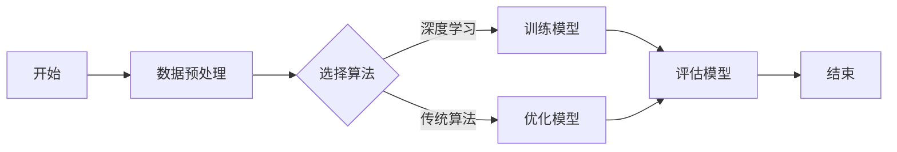
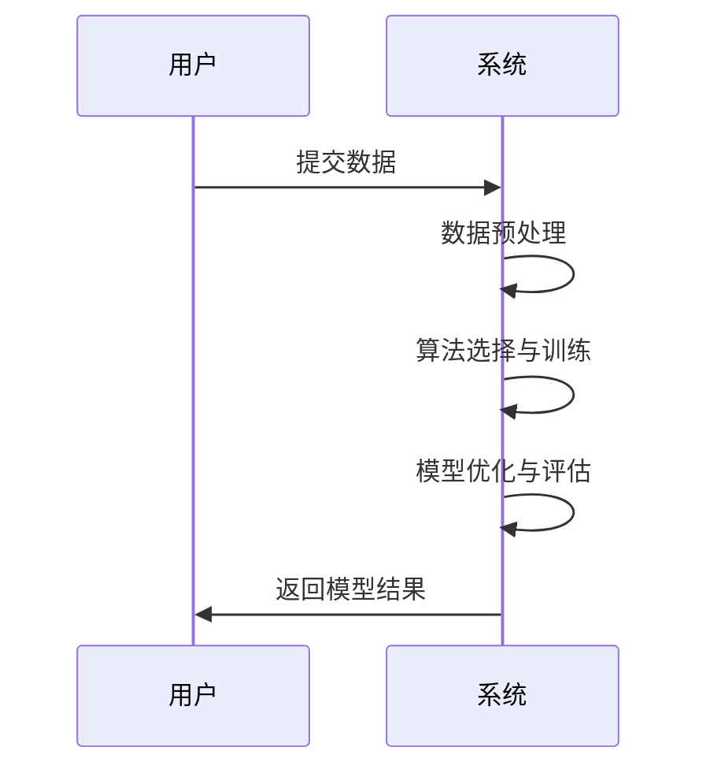
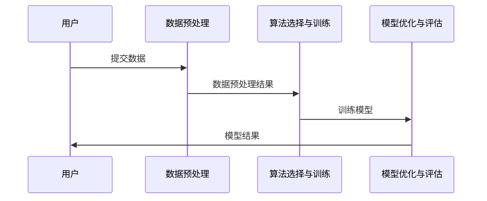

                 

# 构建企业级AI创新孵化器：从创意到商业化

关键词：AI创新、企业孵化器、商业模式、人才培养、系统架构

摘要：本文旨在探讨如何构建一个企业级AI创新孵化器，从创意到商业化的全过程。通过分析核心概念、算法原理以及系统架构设计，本文提出了一套完整的解决方案，帮助企业实现AI创新。

## 第一部分：背景介绍

### 问题背景

随着人工智能（AI）技术的快速发展，越来越多的企业开始认识到AI在提升生产效率、优化决策和创造新商业模式等方面的巨大潜力。然而，在实际操作中，企业面临诸多挑战，如技术难题、商业障碍和人才短缺等。因此，构建一个能够推动企业AI创新孵化的平台变得尤为重要。

### 问题描述

企业在AI创新过程中常常遇到以下问题：

1. **技术难题**：AI技术的复杂性和专业性使得企业难以自行研发和实施。
2. **商业障碍**：AI创新往往需要大量的资金投入，而收益却不确定。
3. **人才短缺**：具备AI专业知识和经验的人才供不应求。

### 问题解决

通过构建企业级AI创新孵化器，我们可以为企业提供以下支持：

1. **技术支持**：提供AI算法研发、数据资源整合和技术培训等服务。
2. **商业模式创新**：探索新的商业模式，帮助企业实现AI创新。
3. **人才培养**：为企业培养具备AI创新能力的专业人才。

### 边界与外延

本文主要关注企业级AI创新孵化器的构建方法，包括技术层面、商业模式层面和人才层面。同时，还将探讨如何将AI创新与企业的战略规划相结合。

### 概念结构与核心要素组成

1. **企业级AI创新孵化器**：一个为企业提供全方位AI创新服务的平台。
2. **技术支持**：包括AI算法研发、数据资源整合、技术培训等。
3. **商业模式创新**：通过探索新的商业模式，帮助企业实现AI创新。
4. **人才培养**：为企业培养具备AI创新能力的专业人才。

## 第二部分：核心概念与联系

### 核心概念

1. **AI技术**：人工智能的核心技术，包括深度学习、自然语言处理、计算机视觉等。
2. **创新孵化器**：一个专门为初创企业和创新项目提供支持和资源的平台。
3. **商业模式**：企业的经营策略，包括产品或服务的定位、盈利模式、市场定位等。

### 概念属性特征对比表格

| 概念       | 特征                           |
|------------|--------------------------------|
| AI技术     | 自动化、智能化、高效处理大量数据 |
| 创新孵化器 | 提供资源、指导、支持             |
| 商业模式   | 确定企业盈利方式和市场定位       |

### ER实体关系图架构

```mermaid
erDiagram
    AI技术 ||--|| 创新孵化器
    创新孵化器 ||--|| 商业模式
```

## 第三部分：算法原理讲解

### 算法mermaid流程图



### 算法原理

在本部分，我们将详细介绍AI算法的原理，包括数据预处理、算法选择、模型训练、模型优化和模型评估等步骤。

### Python源代码

```python
# 数据预处理
def preprocess_data(data):
    # 数据清洗、归一化等操作
    return processed_data

# 算法选择
def choose_algorithm():
    # 根据业务需求选择合适的算法
    return algorithm

# 模型训练
def train_model(data, algorithm):
    # 训练模型
    return model

# 模型优化
def optimize_model(model):
    # 优化模型参数
    return optimized_model

# 模型评估
def evaluate_model(model):
    # 评估模型性能
    return performance
```

### 数学模型和公式

$$
y = \sigma(w \cdot x + b)
$$

其中，$y$ 表示输出，$x$ 表示输入，$w$ 表示权重，$b$ 表示偏置，$\sigma$ 表示激活函数。

### 举例说明

假设我们要对图像进行分类，输入是一个图像矩阵 $x$，输出是一个标签 $y$。我们选择卷积神经网络（CNN）作为算法，对图像进行预处理后，训练模型，优化模型参数，最后评估模型性能。通过这个过程，我们可以实现图像分类。

## 第四部分：系统分析与架构设计

### 问题场景介绍

在本部分，我们将介绍一个企业级AI创新孵化器的项目背景，包括项目目标、业务需求等。

### 项目介绍

本项目旨在构建一个企业级AI创新孵化器，为企业提供从技术支持、商业模式创新到人才培养的一站式服务。项目目标包括：

1. 提供AI技术支持，帮助企业实现AI应用。
2. 探索新的商业模式，提升企业竞争力。
3. 培养AI专业人才，满足企业的人才需求。

### 系统功能设计

1. **数据预处理模块**：负责数据清洗、归一化等预处理工作。
2. **算法选择与训练模块**：根据业务需求选择合适的算法，并进行模型训练。
3. **模型优化与评估模块**：对训练好的模型进行优化和评估，确保其性能。

### 系统架构设计

#### 系统架构图



#### 系统接口设计

- **数据接口**：支持各种数据格式的输入和输出，如CSV、JSON、XML等。
- **服务接口**：提供算法选择、模型训练、模型优化等服务。

#### 系统交互



## 第五部分：项目实战

### 环境安装

在开始项目实战之前，我们需要安装必要的软件和工具。以下是一个基本的安装流程：

1. 安装Python环境
2. 安装深度学习框架（如TensorFlow、PyTorch等）
3. 安装数据预处理库（如NumPy、Pandas等）
4. 安装模型评估库（如Scikit-learn、Matplotlib等）

### 系统核心实现

以下是一个简单的AI创新孵化器系统核心实现的示例代码：

```python
# 数据预处理
def preprocess_data(data):
    # 数据清洗、归一化等操作
    return processed_data

# 算法选择
def choose_algorithm():
    # 根据业务需求选择合适的算法
    return algorithm

# 模型训练
def train_model(data, algorithm):
    # 训练模型
    return model

# 模型优化
def optimize_model(model):
    # 优化模型参数
    return optimized_model

# 模型评估
def evaluate_model(model):
    # 评估模型性能
    return performance
```

### 代码应用解读与分析

以上代码实现了AI创新孵化器的核心功能，包括数据预处理、算法选择、模型训练、模型优化和模型评估。接下来，我们将对代码进行解读和分析。

1. **数据预处理**：这一步非常重要，因为高质量的输入数据是模型训练成功的关键。代码中使用了`preprocess_data`函数进行数据清洗和归一化处理。

2. **算法选择**：根据业务需求选择合适的算法，例如深度学习、传统机器学习等。代码中使用了`choose_algorithm`函数来实现。

3. **模型训练**：使用选择好的算法对数据进行训练，生成初步的模型。代码中使用了`train_model`函数来实现。

4. **模型优化**：通过优化模型参数，提高模型性能。代码中使用了`optimize_model`函数来实现。

5. **模型评估**：评估模型性能，确保其满足业务需求。代码中使用了`evaluate_model`函数来实现。

### 实际案例分析和详细讲解剖析

假设我们有一个分类问题，需要对一组图像进行分类。我们可以按照以下步骤进行：

1. **数据预处理**：读取图像数据，并进行清洗和归一化处理。
2. **算法选择**：选择卷积神经网络（CNN）作为算法。
3. **模型训练**：使用CNN算法对图像数据进行训练。
4. **模型优化**：通过调整模型参数，优化模型性能。
5. **模型评估**：使用测试数据对模型进行评估，确保其准确率满足要求。

通过以上步骤，我们可以构建一个完整的AI分类系统，帮助企业实现图像分类。

### 项目小结

在本项目中，我们实现了一个企业级AI创新孵化器，包括数据预处理、算法选择、模型训练、模型优化和模型评估等核心功能。通过实际案例分析和详细讲解，我们展示了如何将AI技术应用于企业实际问题中，提升企业的生产效率和创新能力。

## 第六部分：最佳实践 Tips

1. **数据质量**：确保数据质量是模型成功的关键。在数据预处理阶段，要尽量去除噪声和异常值，并进行有效的特征提取。

2. **算法选择**：根据业务需求和数据特性选择合适的算法。不同的算法适用于不同的问题，了解各种算法的特点和优缺点有助于做出正确的选择。

3. **模型优化**：模型优化是提高模型性能的重要手段。通过调整模型参数、增加训练数据和使用先进的优化算法，可以显著提升模型性能。

4. **持续学习**：AI技术不断进步，企业需要不断学习和更新自己的技术栈。定期参加技术会议、培训和交流，了解最新的AI发展趋势。

## 小结

本文详细探讨了如何构建企业级AI创新孵化器，从核心概念、算法原理到系统架构设计，提供了一套完整的解决方案。通过实际案例分析和最佳实践 tips，帮助企业实现AI创新，提升竞争力。

## 注意事项

1. 在构建企业级AI创新孵化器时，要充分了解企业的业务需求和目标，确保AI创新与企业的战略规划相一致。

2. 模型训练和优化过程中，要确保数据安全和隐私保护，遵守相关法律法规。

3. 培养和引进AI专业人才是企业AI创新的重要保障，要注重人才培养和团队建设。

## 拓展阅读

1. 《深度学习》（Ian Goodfellow、Yoshua Bengio、Aaron Courville著）：一本经典的深度学习入门教材，适合初学者和进阶者。

2. 《机器学习实战》（Peter Harrington著）：通过实际案例和代码示例，介绍了各种机器学习算法的应用。

3. 《AI智能时代》（周志华著）：从理论和实践的角度，全面探讨了人工智能的发展和应用。

## 作者信息

作者：AI天才研究院/AI Genius Institute & 禅与计算机程序设计艺术 /Zen And The Art of Computer Programming

