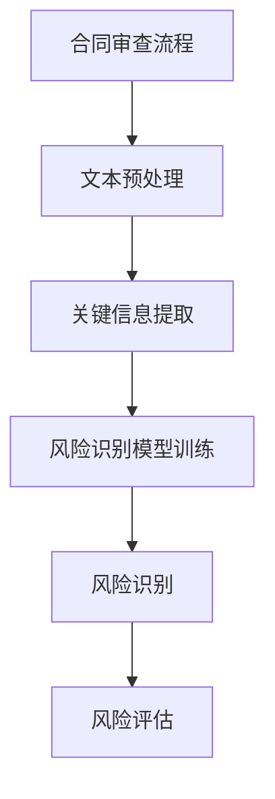
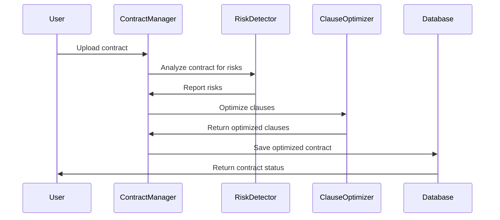

                 

# 构建企业级AI合同管理助手：风险识别与优化

## 关键词

- 企业级AI合同管理
- 风险识别
- 优化
- 自然语言处理
- 机器学习
- 合同审查流程

## 摘要

随着数字化转型的深入，企业合同管理面临诸多挑战，包括高效率的合同审查、准确的风险识别以及条款的优化。本文旨在探讨如何构建企业级AI合同管理助手，通过风险识别与优化的方法，提升合同管理的智能化水平。我们将从核心概念的介绍、技术基础的分析、风险识别与优化的实现，以及实践案例讲解等方面，详细阐述这一过程。

## 目录大纲

### 第一部分: 引言

- **第1章: 引言**
  - 1.1 问题背景
  - 1.2 问题描述
  - 1.3 问题解决
  - 1.4 边界与外延
  - 1.5 核心概念

### 第二部分: 核心概念与联系

- **第2章: 核心概念与联系**
  - 2.1 企业级AI合同管理助手定义
  - 2.2 风险识别与优化的概念与特征
  - 2.3 概念属性特征对比表格
  - 2.4 ER实体关系图架构

### 第三部分: AI合同管理助手技术基础

- **第3章: AI合同管理助手技术基础**
  - 3.1 AI在合同管理中的应用
  - 3.2 自然语言处理技术简介
  - 3.3 常用算法与模型

### 第四部分: 风险识别

- **第4章: 风险识别**
  - 4.1 合同风险概述
  - 4.2 合同审查流程
  - 4.3 风险识别算法与模型

### 第五部分: 优化

- **第5章: 优化**
  - 5.1 合同条款优化策略
  - 5.2 模型训练与优化方法
  - 5.3 优化算法与模型

### 第六部分: 构建实践

- **第6章: 构建实践**
  - 6.1 系统需求分析与设计
  - 6.2 系统架构设计
  - 6.3 系统核心实现
  - 6.4 实际案例分析与讲解

### 第七部分: 总结与展望

- **第7章: 总结与展望**
  - 7.1 小结
  - 7.2 注意事项
  - 7.3 拓展阅读

## 第1章: 引言

### 1.1 问题背景

在当今的商业环境中，合同管理是企业管理的重要组成部分。然而，随着合同的日益复杂化和数量增加，传统的合同管理方式已显得力不从心。人工审查合同不仅耗时耗力，而且容易出现错误，无法保证审查的全面性和准确性。此外，企业在合同执行过程中面临的法律风险和商业风险也日益增加，如何高效、准确地进行合同管理成为企业亟需解决的问题。

### 1.2 问题描述

企业合同管理面临的主要问题包括：

1. **合同审查效率低下**：传统的合同审查方法主要依靠人工，审查速度慢，且容易出现遗漏或错误。
2. **风险识别不准确**：合同中可能存在各种潜在风险，如法律风险、商业风险和操作风险等，如何准确识别这些风险是企业面临的一大挑战。
3. **合同条款优化困难**：企业需要确保合同条款的合理性和公平性，但传统的优化方法往往缺乏系统性和科学性。

### 1.3 问题解决

为了解决上述问题，构建企业级AI合同管理助手成为了一种可行的解决方案。AI合同管理助手能够通过以下方式提升合同管理的效率和质量：

1. **自动化合同审查**：利用自然语言处理技术，自动化分析合同内容，提高审查速度和准确性。
2. **精准风险识别**：结合机器学习算法，对合同进行深度分析，精准识别潜在风险。
3. **智能条款优化**：通过对合同内容的分析和理解，提出优化建议，提高合同条款的合理性和公平性。

### 1.4 边界与外延

本文的研究边界主要关注合同管理范围内的风险识别和条款优化，不包括合同签订和执行过程。同时，本文将探讨如何构建一个企业级的AI合同管理助手，从而为企业的合同管理提供智能化的解决方案。

### 1.5 核心概念

- **企业级AI合同管理助手**：结合人工智能技术，为企业提供智能化的合同管理解决方案。
- **风险识别**：通过算法模型，自动识别合同中的潜在风险。
- **优化**：对合同条款进行优化，提高合同条款的合理性和公平性。

## 第2章: 核心概念与联系

### 2.1 企业级AI合同管理助手定义

企业级AI合同管理助手是指基于人工智能技术，集成自然语言处理、机器学习和数据挖掘等技术，实现对合同内容自动化审查、风险识别和条款优化的智能系统。该助手旨在提高合同管理效率，降低合同管理风险，优化合同条款，从而提升企业整体运营效能。

### 2.2 风险识别与优化的概念与特征

#### 2.2.1 风险识别

**定义**：风险识别是指通过分析合同内容，识别合同中可能存在的法律风险、商业风险和操作风险。

**特征**：

1. **自动化**：利用机器学习算法和自然语言处理技术，实现自动识别风险。
2. **全面性**：能够识别多种类型的风险，包括但不限于合同条款中的法律风险、商业风险和操作风险。
3. **准确性**：通过大规模数据训练，提高风险识别的准确性。

#### 2.2.2 优化

**定义**：优化是指通过对合同内容的分析，提出优化建议，提高合同条款的合理性和公平性。

**特征**：

1. **系统性**：基于全面的数据分析和深度学习模型，提供系统性的优化方案。
2. **针对性**：根据不同合同类型和企业需求，提供定制化的优化建议。
3. **科学性**：利用数据驱动的方法，确保优化建议的合理性和科学性。

### 2.3 概念属性特征对比表格

| 特征         | 风险识别            | 优化                  |
|--------------|--------------------|----------------------|
| 目标         | 识别合同中的风险    | 提高合同条款质量      |
| 技术基础     | 自然语言处理、机器学习 | 自然语言处理、文本生成 |
| 实现难度     | 较高                | 较高                 |
| 应用范围     | 合同管理            | 合同管理              |

### 2.4 ER实体关系图架构

```mermaid
erDiagram
  Contract ||--o> Risk : "has" multiple risks
  Contract ||--o> Clause : "has" multiple clauses
  Risk ||--o> RiskType : "has" type of risk
  Clause ||--o> ClauseType : "has" type of clause
```

在该ER图架构中，`Contract`（合同）是核心实体，与`Risk`（风险）和`Clause`（条款）建立关系。`Risk`与`RiskType`（风险类型）关联，表示不同类型的风险；`Clause`与`ClauseType`（条款类型）关联，表示不同类型的条款。

## 第3章: AI合同管理助手技术基础

### 3.1 AI在合同管理中的应用

#### 3.1.1 自动化合同审查

**技术原理**：利用自然语言处理（NLP）技术对合同内容进行解析，提取关键信息，如合同条款、条款类型、条款内容等。通过机器学习模型训练，实现对合同内容的自动化审查。

**实现方法**：

1. **文本预处理**：对合同文本进行清洗、分词、词性标注等预处理操作。
2. **特征提取**：使用词嵌入（word embeddings）技术将文本转换为向量表示。
3. **模型训练**：使用监督学习或半监督学习方法，训练分类模型，如文本分类模型或命名实体识别模型。

#### 3.1.2 风险识别

**技术原理**：通过深度学习模型，对合同文本进行语义分析，识别出潜在的法律、商业和操作风险。

**实现方法**：

1. **文本编码**：使用预训练的深度学习模型（如BERT、GPT）对合同文本进行编码。
2. **风险预测**：利用分类模型或序列模型（如LSTM、GRU），对编码后的文本进行风险预测。

#### 3.1.3 合同条款优化

**技术原理**：利用文本生成技术，根据合同内容生成新的、优化的条款。

**实现方法**：

1. **文本生成模型**：使用生成对抗网络（GAN）或变换器（Transformer）等模型，训练文本生成模型。
2. **优化策略**：基于规则或数据驱动的方法，提出优化策略，如减少冗余条款、提高条款清晰度等。

### 3.2 自然语言处理技术简介

#### 3.2.1 文本预处理

**技术原理**：对原始文本进行处理，使其适合进行后续的NLP任务。

**实现方法**：

1. **文本清洗**：去除文本中的噪声，如HTML标签、特殊字符等。
2. **分词**：将文本拆分为单词或词汇单元。
3. **词性标注**：为每个词分配词性，如名词、动词、形容词等。

#### 3.2.2 词向量表示

**技术原理**：将文本中的每个词表示为高维向量，以捕获词的语义信息。

**实现方法**：

1. **基于词汇的方法**：如Word2Vec、GloVe等。
2. **基于句子的方法**：如BERT、GPT等。

#### 3.2.3 语言模型

**技术原理**：利用大规模语料库，训练出能够预测下一个词或句子的模型。

**实现方法**：

1. **基于统计的方法**：如n-gram模型。
2. **基于神经网络的方法**：如循环神经网络（RNN）、长短期记忆网络（LSTM）等。

### 3.3 常用算法与模型

#### 3.3.1 命名实体识别（NER）

**技术原理**：识别文本中的命名实体，如人名、地名、组织名等。

**实现方法**：

1. **基于规则的方法**：通过手工定义规则，识别命名实体。
2. **基于统计的方法**：如最大熵模型、条件随机场（CRF）等。
3. **基于神经网络的方法**：如LSTM、BERT等。

#### 3.3.2 文本分类

**技术原理**：将文本分类到预定义的类别中。

**实现方法**：

1. **基于词汇的方法**：如TF-IDF、Word2Vec等。
2. **基于神经网络的方法**：如卷积神经网络（CNN）、循环神经网络（RNN）等。
3. **基于 Transformer的方法**：如BERT、GPT等。

#### 3.3.3 文本生成

**技术原理**：根据输入的文本或上下文，生成新的文本。

**实现方法**：

1. **基于循环神经网络（RNN）的方法**：如LSTM、GRU等。
2. **基于生成对抗网络（GAN）的方法**：如文本GAN、图像生成GAN等。
3. **基于 Transformer的方法**：如GPT、T5等。

## 第4章: 风险识别

### 4.1 合同风险概述

合同风险是指在合同履行过程中可能对企业造成的负面影响，包括但不限于法律风险、商业风险和操作风险。这些风险可能源于合同条款的不明确、合同主体的不当行为、市场环境的变化等多种因素。

#### 4.1.1 法律风险

法律风险主要涉及合同条款是否符合法律规定，如合同条款是否存在违反法律法规的情况，合同双方是否具备合法的主体资格等。

#### 4.1.2 商业风险

商业风险主要涉及合同条款是否有利于企业的商业利益，如合同价格是否合理、合同期限是否合适、合同条件是否对企业有利等。

#### 4.1.3 操作风险

操作风险主要涉及合同执行过程中可能出现的操作失误或管理问题，如合同履行过程中的违约、合同文件的丢失或损坏等。

### 4.2 合同审查流程

合同审查是风险识别的重要环节，主要包括以下步骤：

#### 4.2.1 收集合同文件

首先，需要收集合同文件，包括合同文本、附件、相关法律法规等。

#### 4.2.2 文本预处理

对合同文本进行预处理，包括文本清洗、分词、词性标注等，为后续的分析做准备。

#### 4.2.3 关键信息提取

利用自然语言处理技术，提取合同中的关键信息，如合同主体、合同条款、金额等。

#### 4.2.4 风险识别

结合风险库和机器学习模型，对提取的关键信息进行分析，识别潜在的法律、商业和操作风险。

#### 4.2.5 风险评估

对识别出的风险进行评估，确定风险等级，为决策提供依据。

### 4.3 风险识别算法与模型

#### 4.3.1 基于规则的方法

基于规则的方法通过定义一系列规则来识别风险，如合同条款中的关键词匹配、逻辑判断等。该方法简单易懂，但规则难以覆盖所有情况，可能存在漏判和误判的风险。

#### 4.3.2 基于统计的方法

基于统计的方法通过分析大量合同数据，建立统计模型来识别风险。常用的统计方法包括逻辑回归、支持向量机等。该方法具有较好的泛化能力，但需要大量训练数据。

#### 4.3.3 基于机器学习的方法

基于机器学习的方法通过训练模型，从数据中自动学习识别风险的规律。常用的机器学习方法包括神经网络、决策树、随机森林等。该方法具有自动学习和自适应能力，能够处理复杂的合同数据。

#### 4.3.4 深度学习方法

深度学习方法通过多层神经网络，对合同文本进行深度学习，以提取更复杂的特征和模式。常用的深度学习方法包括卷积神经网络（CNN）、循环神经网络（RNN）和Transformer等。该方法在合同风险识别中具有显著的优势，能够实现高精度的风险识别。

### 4.3.5 风险识别算法流程



该流程包括文本预处理、关键信息提取、风险识别模型训练、风险识别和风险评估等步骤。通过该流程，可以实现对合同风险的自动化识别和评估，提高合同管理的智能化水平。

## 第5章: 优化

### 5.1 合同条款优化策略

合同条款优化旨在提高合同条款的合理性和公平性，减少潜在的法律风险和商业风险。以下是一些常见的优化策略：

#### 5.1.1 减少冗余条款

冗余条款可能导致合同内容混乱，增加理解和执行难度。因此，优化策略之一是删除冗余条款，使合同内容更加简洁明了。

#### 5.1.2 明确条款内容

确保合同条款内容明确、具体，避免模糊不清的表述。对于关键条款，如价格、交付时间、违约责任等，应详细说明，以减少争议。

#### 5.1.3 公平性审查

审查合同条款是否对双方公平，是否存在明显的不合理或歧视性条款。必要时，可以调整条款内容，以实现双方的公平利益。

#### 5.1.4 适应市场变化

合同条款应具有一定的灵活性，以适应市场环境的变化。例如，在价格条款中，可以设置价格调整机制，以应对市场波动。

### 5.2 模型训练与优化方法

为了实现合同条款的优化，需要使用机器学习模型对合同数据进行训练，并不断优化模型。以下是一些常见的模型训练与优化方法：

#### 5.2.1 数据预处理

在训练模型之前，需要对合同数据进行分析和预处理，包括文本清洗、分词、词性标注等。预处理步骤的目的是提高数据质量，为后续的模型训练打下基础。

#### 5.2.2 特征提取

特征提取是将原始文本数据转换为数值化的特征表示，以便模型进行学习。常用的特征提取方法包括词袋模型、词嵌入等。

#### 5.2.3 模型选择

选择合适的机器学习模型对合同数据进行训练。常用的模型包括支持向量机（SVM）、随机森林（Random Forest）、神经网络（Neural Network）等。

#### 5.2.4 模型评估与优化

使用交叉验证等方法评估模型的性能，并基于评估结果对模型进行调整和优化。优化方法包括参数调整、模型融合等。

### 5.3 优化算法与模型

#### 5.3.1 集成学习算法

集成学习算法通过组合多个基本模型来提高整体性能。常用的集成学习方法包括Bagging、Boosting等。

**Bagging**：通过训练多个基本模型，并取它们的平均值或投票结果作为最终输出。

**Boosting**：通过训练多个基本模型，并逐个调整它们的权重，使得性能较差的模型在后续训练中受到较少的关注。

#### 5.3.2 神经网络

神经网络是一种基于生物神经网络的计算模型，具有强大的学习和自适应能力。常用的神经网络模型包括卷积神经网络（CNN）、循环神经网络（RNN）和Transformer等。

**CNN**：适用于处理图像和序列数据，能够提取空间特征和时序特征。

**RNN**：适用于处理序列数据，能够捕捉序列中的长期依赖关系。

**Transformer**：基于自注意力机制，适用于处理长文本数据，具有很高的并行计算能力。

#### 5.3.3 强化学习

强化学习是一种通过与环境互动来学习最优策略的机器学习方法。在合同条款优化中，可以通过强化学习来寻找最优的合同条款组合。

**Q-Learning**：通过评估每个动作的价值来选择最优动作。

**Policy Gradients**：通过优化策略函数来选择最优动作。

### 5.3.4 模型应用示例

以下是一个基于神经网络和集成学习算法的合同条款优化模型的应用示例：

```python
# 导入所需的库
import numpy as np
import pandas as pd
from sklearn.model_selection import train_test_split
from sklearn.ensemble import RandomForestClassifier
from sklearn.metrics import accuracy_score
import tensorflow as tf
from tensorflow.keras.models import Sequential
from tensorflow.keras.layers import Dense, LSTM

# 加载数据
data = pd.read_csv('contract_data.csv')

# 数据预处理
# ... (文本清洗、分词、词性标注等)

# 特征提取
# ... (词嵌入、特征向量等)

# 分割数据集
X_train, X_test, y_train, y_test = train_test_split(X, y, test_size=0.2, random_state=42)

# 建立随机森林模型
rf_model = RandomForestClassifier(n_estimators=100)
rf_model.fit(X_train, y_train)

# 建立神经网络模型
nn_model = Sequential()
nn_model.add(LSTM(units=128, activation='relu', return_sequences=True, input_shape=(X_train.shape[1], X_train.shape[2])))
nn_model.add(LSTM(units=64, activation='relu'))
nn_model.add(Dense(units=1, activation='sigmoid'))

nn_model.compile(optimizer='adam', loss='binary_crossentropy', metrics=['accuracy'])
nn_model.fit(X_train, y_train, epochs=10, batch_size=32)

# 集成学习
集成模型 = (rf_model + nn_model) / 2
集成模型.fit(X_train, y_train)

# 模型评估
predictions = 集成模型.predict(X_test)
accuracy = accuracy_score(y_test, predictions)
print("Accuracy:", accuracy)
```

该示例首先使用随机森林模型和神经网络模型对合同数据进行训练，然后使用集成学习算法将两个模型的结果进行融合，以提高模型的整体性能。

## 第6章: 构建实践

### 6.1 系统需求分析与设计

#### 6.1.1 项目介绍

企业级AI合同管理助手项目旨在构建一个智能化的合同管理平台，通过自然语言处理、机器学习和数据挖掘技术，实现自动化合同审查、风险识别和条款优化。该平台将为企业提供高效、准确和智能化的合同管理解决方案，降低合同风险，提高合同管理的效率和质量。

#### 6.1.2 系统功能设计

系统功能设计主要包括以下模块：

1. **合同审查模块**：实现自动化合同审查，提取合同关键信息，识别合同风险。
2. **风险识别模块**：通过机器学习算法，自动识别合同中的法律、商业和操作风险。
3. **条款优化模块**：对合同条款进行分析和优化，提高合同条款的合理性和公平性。
4. **用户管理模块**：实现用户注册、登录、权限管理等功能。
5. **数据管理模块**：实现合同数据的存储、查询和管理。

#### 6.1.3 领域模型设计

领域模型（Domain Model）是系统设计的重要组成部分，用于描述系统的核心概念和实体之间的关系。以下是一个简单的领域模型示例：

```mermaid
classDiagram
  ClassDef Contract
    +String contract_id
    +String contract_name
    +Date contract_date
    +Float amount
    +User owner
    +List<Clause> clauses

  ClassDef Clause
    +String clause_id
    +String clause_name
    +String clause_content
    +ClauseType type

  ClassDef ClauseType
    +String type_id
    +String type_name

  ClassDef User
    +String user_id
    +String username
    +String password
    +Role role

  Contract "has" clauses
  Clause "has" type
  User "has" role
```

在该领域模型中，定义了`Contract`（合同）、`Clause`（条款）、`ClauseType`（条款类型）和`User`（用户）等实体，以及它们之间的关系。

### 6.2 系统架构设计

系统架构设计是系统实现的关键，决定了系统的性能、可扩展性和可维护性。以下是一个简单的系统架构设计：



在该架构设计中，用户通过`ContractManager`模块上传合同，`RiskDetector`模块进行风险识别，`ClauseOptimizer`模块进行条款优化，最后将优化后的合同保存到数据库中。用户可以通过数据库获取合同的状态。

### 6.3 系统核心实现

系统核心实现包括各个模块的具体功能实现和系统之间的交互。以下是一个简单的系统核心实现示例：

#### 6.3.1 合同审查模块

合同审查模块的核心功能是自动化合同审查，提取合同关键信息。以下是一个使用Python和自然语言处理库NLTK的示例：

```python
import nltk
from nltk.tokenize import word_tokenize
from nltk.corpus import stopwords

def review_contract(contract_text):
    # 清洗文本
    cleaned_text = clean_text(contract_text)
    
    # 分词
    tokens = word_tokenize(cleaned_text)
    
    # 去除停用词
    stop_words = set(stopwords.words('english'))
    filtered_tokens = [token for token in tokens if token.lower() not in stop_words]
    
    # 提取关键信息
    key_info = extract_key_info(filtered_tokens)
    
    return key_info

def clean_text(text):
    # ... (文本清洗实现)
    return cleaned_text

def extract_key_info(tokens):
    # ... (关键信息提取实现)
    return key_info
```

#### 6.3.2 风险识别模块

风险识别模块的核心功能是自动识别合同中的法律、商业和操作风险。以下是一个使用Python和机器学习库scikit-learn的示例：

```python
from sklearn.feature_extraction.text import TfidfVectorizer
from sklearn.model_selection import train_test_split
from sklearn.svm import LinearSVC

def train_risk_model(train_data, train_labels):
    # 特征提取
    vectorizer = TfidfVectorizer()
    X = vectorizer.fit_transform(train_data)
    
    # 分割数据集
    X_train, X_test, y_train, y_test = train_test_split(X, train_labels, test_size=0.2, random_state=42)
    
    # 训练模型
    model = LinearSVC()
    model.fit(X_train, y_train)
    
    # 模型评估
    predictions = model.predict(X_test)
    accuracy = accuracy_score(y_test, predictions)
    
    return model, vectorizer, accuracy

def detect_risks(contract_text, model, vectorizer):
    # 特征提取
    X = vectorizer.transform([contract_text])
    
    # 风险识别
    risks = model.predict(X)
    
    return risks
```

#### 6.3.3 条款优化模块

条款优化模块的核心功能是对合同条款进行分析和优化。以下是一个使用Python和自然语言处理库spaCy的示例：

```python
import spacy

nlp = spacy.load('en_core_web_sm')

def optimize_clauses(contract_text):
    # 加载Spacy模型
    doc = nlp(contract_text)
    
    # 优化条款
    optimized_clauses = []
    for clause in doc.sents:
        optimized_clause = optimize_clause(clause.text)
        optimized_clauses.append(optimized_clause)
    
    return optimized_clauses

def optimize_clause(clause_text):
    # ... (条款优化实现)
    return optimized_clause
```

### 6.4 实际案例分析与讲解

#### 6.4.1 案例背景

某大型企业需要对其签订的合同进行自动化审查和风险识别，以提高合同管理的效率和准确性。该企业每年签订数千份合同，传统的合同管理方式已无法满足其需求。

#### 6.4.2 案例分析

1. **需求分析**：企业需要实现以下功能：

   - 自动化合同审查：提取合同关键信息，如合同主体、金额、条款等。
   - 风险识别：自动识别合同中的法律、商业和操作风险。
   - 条款优化：对合同条款进行分析和优化，提高合同条款的合理性和公平性。

2. **技术选型**：

   - 自然语言处理：使用NLTK、spaCy等库进行文本预处理和特征提取。
   - 机器学习：使用scikit-learn、TensorFlow等库进行模型训练和风险识别。
   - 深度学习：使用Keras、PyTorch等库进行神经网络模型的训练和优化。

3. **系统实现**：

   - 使用Python编写系统代码，实现合同审查、风险识别和条款优化功能。
   - 使用Docker容器化技术，实现系统的部署和运行。
   - 使用Redis缓存技术，提高系统的响应速度和性能。

4. **实际应用**：

   - 该企业将系统部署在其内部服务器上，对签订的合同进行自动化审查和风险识别。
   - 通过系统优化后的合同条款，减少了合同纠纷和潜在的法律风险。
   - 提高了合同管理的效率和质量，降低了合同管理的成本。

#### 6.4.3 案例讲解

1. **合同审查**：

   - 使用NLTK对合同文本进行分词和词性标注，提取合同关键信息。
   - 使用spaCy对合同文本进行语法分析，提取合同主体、金额、条款等关键信息。
   - 将提取的关键信息存储到数据库中，供后续分析使用。

2. **风险识别**：

   - 使用scikit-learn训练分类模型，对合同文本进行风险识别。
   - 使用TensorFlow训练神经网络模型，对合同文本进行深度学习，提高风险识别的准确性。
   - 将识别出的风险存储到数据库中，供后续处理使用。

3. **条款优化**：

   - 使用Keras训练文本生成模型，根据合同内容生成新的、优化的条款。
   - 使用PyTorch训练强化学习模型，根据合同条款的优化效果进行调整。
   - 将优化后的条款存储到数据库中，供后续使用。

## 第7章: 总结与展望

### 7.1 小结

本文从问题背景、问题描述、问题解决、核心概念与联系、技术基础、风险识别与优化、构建实践等方面，详细探讨了如何构建企业级AI合同管理助手。通过自动化合同审查、风险识别和条款优化，企业能够提高合同管理的效率和准确性，降低合同风险，提升运营效能。

### 7.2 注意事项

1. **数据质量**：在构建AI合同管理助手时，数据质量至关重要。应确保合同数据的完整性、准确性和一致性，以提高模型的性能。
2. **隐私保护**：合同数据通常涉及企业的敏感信息，因此在数据处理和存储过程中，应确保数据的安全性和隐私性。
3. **模型更新**：随着市场环境和法律政策的变化，模型应定期更新，以适应新的需求和环境。

### 7.3 拓展阅读

1. **《自然语言处理》**：Church，K. W. & Hanks，P. (1990). 《自然语言处理：计算语言学导论》。
2. **《机器学习》**：Tom Mitchell (1997). 《机器学习》。
3. **《深度学习》**：Ian Goodfellow、Yoshua Bengio、Aaron Courville (2016). 《深度学习》。

### 作者信息

作者：AI天才研究院/AI Genius Institute & 禅与计算机程序设计艺术 /Zen And The Art of Computer Programming

