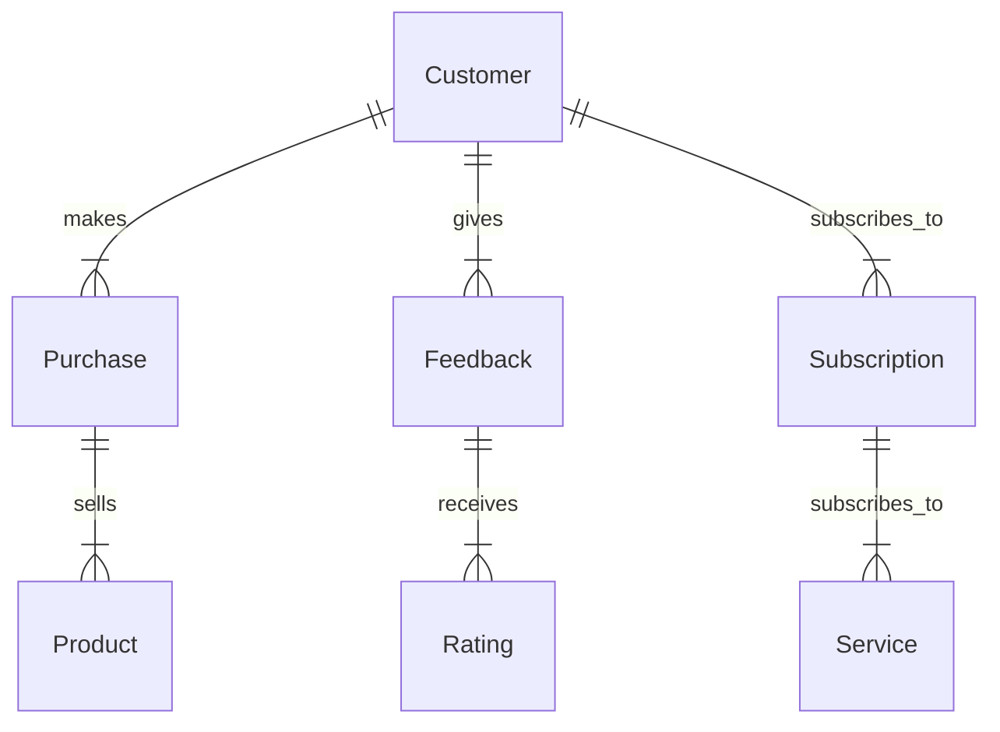
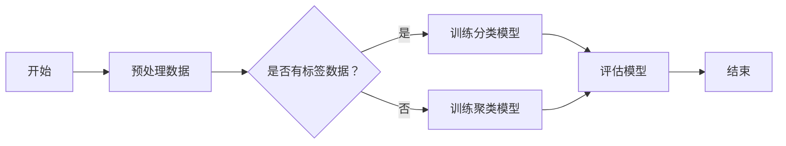
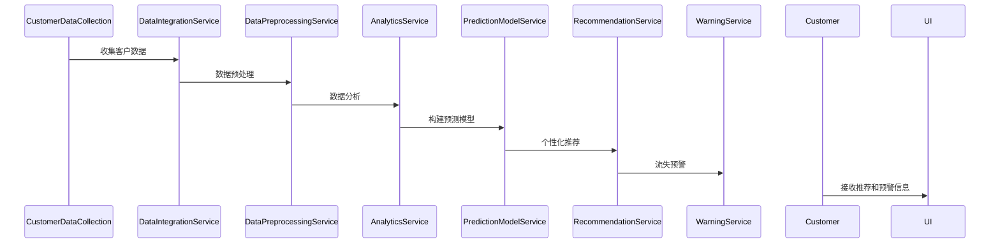
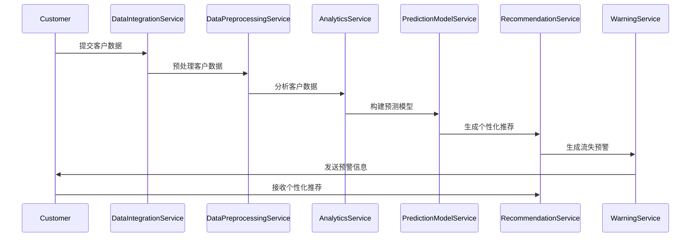

                 

### 《构建企业级AI客户生命周期管理助手》

> 关键词：AI、客户生命周期管理、企业级应用、算法、系统架构、项目实战

> 摘要：本文将详细探讨如何构建企业级AI客户生命周期管理助手。文章分为七个章节，包括背景介绍、核心概念与联系、算法原理讲解、数学模型与公式详细讲解、系统分析与架构设计方案、项目实战以及最佳实践和小结。通过逐步分析和推理，本文旨在为企业提供清晰、实用的AI客户生命周期管理解决方案。

---

## 引言

在现代商业环境中，客户生命周期管理（Customer Life Cycle Management，CLCM）已成为企业提升竞争力和客户满意度的重要手段。随着人工智能（Artificial Intelligence，AI）技术的飞速发展，利用AI构建企业级客户生命周期管理助手成为可能。本文旨在深入探讨如何构建这样一个助手，从而帮助企业更有效地管理客户关系，提高客户满意度和忠诚度。

本文的读者对象包括企业IT管理人员、AI研究人员、软件开发工程师以及对客户生命周期管理感兴趣的技术爱好者。通过本文的阅读，读者将了解AI客户生命周期管理助手的构建过程，掌握核心算法原理和系统架构设计，并具备实际项目实施能力。

### 目录

1. **引言**  
2. **背景介绍**  
3. **核心概念与联系**  
4. **算法原理讲解**  
5. **数学模型和数学公式详细讲解与举例说明**  
6. **系统分析与架构设计方案**  
7. **项目实战**  
8. **最佳实践、小结、注意事项、拓展阅读**  
9. **结语**

---

## 第1章：背景介绍

### 1.1 问题背景

客户生命周期管理是指企业通过对客户行为、需求、满意度等数据的分析和应用，实现客户获取、维护、增长和保留的整个过程。然而，随着市场竞争的加剧和客户需求的多样化，传统的客户生命周期管理方法已无法满足现代企业的需求。此时，引入人工智能技术成为了一种创新解决方案。

### 1.2 问题描述

企业在客户生命周期管理过程中面临的主要问题包括：

- 数据处理能力不足：企业需要处理大量的客户数据，包括行为数据、交易数据、反馈数据等，传统的数据处理方法效率低下。
- 客户需求预测不准确：准确预测客户需求是提升客户满意度和忠诚度的关键，但传统的预测方法往往存在偏差。
- 客户关系管理不完善：企业需要建立完善的客户关系管理体系，但传统的客户关系管理方法往往缺乏灵活性和个性化。

### 1.3 问题解决

为了解决上述问题，企业可以通过引入人工智能技术，构建企业级AI客户生命周期管理助手。该助手能够利用机器学习算法对客户数据进行深入分析和挖掘，实现对客户需求的精准预测和个性化推荐，从而提高客户满意度和忠诚度。同时，AI助手还能够帮助企业实现客户关系的智能化管理，提升企业的运营效率。

### 1.4 边界与外延

本文研究的重点是构建企业级AI客户生命周期管理助手，其应用范围包括但不限于以下几个方面：

- 客户获取：通过分析潜在客户数据，预测潜在客户的需求和偏好，实现精准营销。
- 客户维护：通过分析客户行为数据，识别客户的价值和风险，实现个性化服务和风险控制。
- 客户增长：通过分析客户生命周期中的关键节点，识别增长机会，实现客户价值的最大化。
- 客户保留：通过分析客户流失数据，预测客户流失风险，实现客户保留策略的制定和执行。

### 1.5 概念结构与核心要素组成

企业级AI客户生命周期管理助手的核心概念结构包括以下几个方面：

1. **客户数据**：客户数据是构建AI客户生命周期管理助手的基础，包括客户基本信息、行为数据、交易数据、反馈数据等。
2. **机器学习算法**：机器学习算法是AI客户生命周期管理助手的核心，包括分类算法、聚类算法、预测算法等。
3. **数据预处理**：数据预处理是保证机器学习算法效果的关键步骤，包括数据清洗、数据转换、特征工程等。
4. **客户生命周期管理策略**：客户生命周期管理策略是指导企业实现客户生命周期管理的具体方案，包括客户获取策略、客户维护策略、客户增长策略、客户保留策略等。
5. **可视化工具**：可视化工具可以帮助企业直观地了解客户生命周期管理的情况，包括数据可视化、算法可视化、客户关系可视化等。

---

通过以上背景介绍，我们为接下来详细探讨AI客户生命周期管理助手的构建奠定了基础。在接下来的章节中，我们将逐步深入探讨核心概念、算法原理、数学模型、系统架构以及实际项目实施等内容。

## 第2章：核心概念与联系

### 2.1 AI与客户生命周期管理

人工智能（AI）作为现代技术发展的重要方向，已经逐渐渗透到各个行业，客户生命周期管理也不例外。AI在客户生命周期管理中的主要作用体现在以下几个方面：

- **客户需求预测**：通过机器学习算法对客户行为数据进行分析，预测客户未来的需求和购买行为，帮助企业制定更加精准的营销策略。
- **客户行为分析**：对客户的浏览历史、购买记录、反馈等数据进行深入分析，识别客户的偏好和需求，从而提供个性化的产品和服务。
- **客户关系管理**：利用AI技术实现客户关系的智能化管理，包括客户分类、客户价值评估、客户忠诚度分析等，帮助企业优化客户关系管理策略。

### 2.2 客户生命周期管理的关键概念

在客户生命周期管理中，以下几个关键概念是不可或缺的：

- **客户获取**：指企业通过各种渠道吸引新客户的过程。客户获取是客户生命周期管理的起点，直接影响企业的客户基数。
- **客户维护**：指企业对现有客户进行关怀和维系的过程。通过维护客户关系，企业可以提高客户的满意度和忠诚度，降低客户流失率。
- **客户增长**：指企业通过提供优质的产品和服务，扩大客户规模和价值的过程。客户增长是客户生命周期管理的重要目标，有助于提升企业的市场竞争力。
- **客户保留**：指企业采取措施阻止客户流失的过程。通过分析客户流失原因，企业可以采取针对性的措施，降低客户流失率。

### 2.3 AI在客户生命周期管理中的角色

AI在客户生命周期管理中扮演着多重角色，具体如下：

- **客户需求预测**：通过分析客户的历史数据，AI可以预测客户未来的购买行为和需求，帮助企业提前制定营销策略。
- **个性化推荐**：基于客户的兴趣和偏好，AI可以为每个客户提供个性化的产品推荐，提高客户的购买转化率。
- **客户细分**：通过分析客户数据，AI可以将客户分为不同的群体，为企业提供有针对性的营销和服务。
- **客户流失预测**：通过对客户行为数据的分析，AI可以预测哪些客户可能流失，从而采取针对性的措施进行挽回。

### 2.4 概念属性特征对比表格

为了更清晰地展示AI与客户生命周期管理中的关键概念及其属性特征，我们可以使用以下表格进行对比：

| 概念         | 定义                                                         | 关键属性特征                                                                                      |
| ------------ | ------------------------------------------------------------ | ------------------------------------------------------------------------------------------------ |
| 人工智能     | 人工智能（AI）是指计算机系统模拟、延伸和扩展人类智能的理论、方法、技术及应用。                   | 学习能力、推理能力、感知能力、自适应能力、决策能力、解决问题能力。                                  |
| 客户获取     | 指企业通过各种渠道吸引新客户的过程。                       | 客户获取成本、客户获取渠道、客户获取效果。                                                            |
| 客户维护     | 指企业对现有客户进行关怀和维系的过程。                     | 客户满意度、客户忠诚度、客户维系成本。                                                               |
| 客户增长     | 指企业通过提供优质的产品和服务，扩大客户规模和价值的过程。 | 客户增长率、客户价值、市场份额。                                                                     |
| 客户保留     | 指企业采取措施阻止客户流失的过程。                         | 客户流失率、挽回流失客户成本、客户保留策略。                                                          |

### 2.5 ER实体关系图架构

为了更好地理解客户生命周期管理中各个概念之间的联系，我们可以使用实体关系图（ER Diagram）进行表示。以下是一个简化的ER实体关系图：



在这个ER图中，Customer（客户）是中心实体，与其他实体（如Purchase、Feedback、Subscription）之间存在多种关系。这些关系体现了客户在客户生命周期管理中的不同角色和作用。

---

通过本章的讨论，我们对AI客户生命周期管理助手中的核心概念和其相互联系有了更深入的理解。在接下来的章节中，我们将继续探讨AI在客户生命周期管理中的具体应用，以及如何通过算法和数学模型来实现这些应用。

---

## 第3章：算法原理讲解

### 3.1 算法原理概述

在构建企业级AI客户生命周期管理助手的背景下，我们需要了解并掌握一些关键的算法原理。这些算法原理是AI客户生命周期管理助手能够有效运行的核心，主要包括分类算法、聚类算法和预测算法等。

- **分类算法**：分类算法是一种将数据集中的实例分配到已知的标签或类别的算法。常见的分类算法包括决策树、随机森林、支持向量机等。
- **聚类算法**：聚类算法是一种将数据集划分为多个类或簇的算法。常见的聚类算法包括K均值、层次聚类、DBSCAN等。
- **预测算法**：预测算法是一种基于历史数据对未来趋势进行预测的算法。常见的预测算法包括线性回归、时间序列分析、ARIMA模型等。

### 3.2 Mermaid算法流程图

为了更好地理解这些算法原理，我们可以使用Mermaid绘制算法流程图。以下是一个简化的分类算法流程图示例：



在这个流程图中，我们从数据预处理开始，根据是否有标签数据决定是训练分类模型还是聚类模型，然后评估模型性能，最后结束。

### 3.3 Python源代码示例

为了实现上述算法原理，我们可以使用Python编写相应的代码。以下是一个使用决策树分类算法的简单示例：

```python
from sklearn.datasets import load_iris
from sklearn.model_selection import train_test_split
from sklearn.tree import DecisionTreeClassifier
from sklearn.metrics import accuracy_score

# 加载数据集
iris = load_iris()
X = iris.data
y = iris.target

# 划分训练集和测试集
X_train, X_test, y_train, y_test = train_test_split(X, y, test_size=0.3, random_state=42)

# 训练决策树分类模型
clf = DecisionTreeClassifier()
clf.fit(X_train, y_train)

# 预测测试集
y_pred = clf.predict(X_test)

# 评估模型性能
accuracy = accuracy_score(y_test, y_pred)
print("Accuracy:", accuracy)
```

在这个示例中，我们首先加载数据集，然后划分训练集和测试集，接着训练决策树分类模型，最后评估模型性能。

### 3.4 数学模型与公式

为了深入理解这些算法原理，我们还需要了解其背后的数学模型和公式。以下是一些常用的数学模型和公式：

- **决策树**：
  - **ID3算法**：
    $$ Entropy(D) = -\sum_{i} p(D_i) \cdot \log_2(p(D_i)) $$
    其中，\(D\) 为数据集，\(D_i\) 为数据集中的第 \(i\) 个类别，\(p(D_i)\) 为 \(D_i\) 的概率。
  - **C4.5算法**：
    $$ Gain(D, a) = Entropy(D) - \sum_{v} p(D_v) \cdot Entropy(D_v|a=v) $$
    其中，\(Gain(D, a)\) 为信息增益，\(a\) 为属性，\(v\) 为属性 \(a\) 的值。

- **随机森林**：
  - **决策树数量**：
    $$ n = \sqrt{m} $$
    其中，\(n\) 为决策树数量，\(m\) 为数据集中样本数量。

- **支持向量机**：
  - **决策边界**：
    $$ w \cdot x + b = 0 $$
    其中，\(w\) 为权重向量，\(x\) 为样本特征，\(b\) 为偏置。

### 3.5 通俗易懂的举例说明

为了更好地理解上述算法原理和数学模型，我们可以通过一个简单的例子来进行说明。假设我们有以下一个数据集，其中包含3个特征（\(x_1, x_2, x_3\)）和1个标签（\(y\)），标签表示花的种类：

| \(x_1\) | \(x_2\) | \(x_3\) | \(y\) |
| ------- | ------- | ------- | ----- |
| 1       | 2       | 3       | 0     |
| 2       | 4       | 6       | 0     |
| 3       | 6       | 9       | 1     |
| 4       | 8       | 12      | 1     |

我们的目标是使用决策树算法将这个数据集划分为两个类别。通过计算信息增益，我们可以选择最优的划分属性。假设我们选择 \(x_1\) 作为划分属性，则：

- \(x_1\) 的取值范围：{1, 2, 3, 4}
- \(x_1\) 的值分别为 1 和 2 的样本属于类别 0，\(x_1\) 的值为 3 和 4 的样本属于类别 1

计算信息增益：

$$ Gain(D, x_1) = Entropy(D) - \sum_{v} p(D_v) \cdot Entropy(D_v|x_1=v) $$

其中，\(Entropy(D)\) 为数据集 \(D\) 的熵，\(D_v\) 为 \(x_1\) 的取值为 \(v\) 的数据子集，\(Entropy(D_v|x_1=v)\) 为条件熵。

通过计算，我们可以得到 \(Gain(D, x_1)\) 的值，选择 \(Gain(D, x_1)\) 最大的属性作为划分属性，进而构建决策树。

---

通过本章的讲解，我们了解了AI客户生命周期管理助手中的关键算法原理，并使用Mermaid流程图、Python代码和数学模型进行了详细说明。在下一章中，我们将继续深入探讨数学模型和数学公式的详细讲解与举例说明。

---

## 第4章：数学模型和数学公式详细讲解与举例说明

### 4.1 数学模型概述

在构建企业级AI客户生命周期管理助手的算法中，数学模型是核心基础。这些数学模型用于描述数据之间的关系，并指导算法的设计和实现。在本节中，我们将详细讲解一些关键的数学模型，包括监督学习模型、无监督学习模型和预测模型，并使用LaTeX格式展示相应的数学公式。

### 4.2 LaTeX数学公式示例

首先，我们展示一些常见的数学公式，并使用LaTeX进行表示。以下是一个简单的LaTeX数学公式示例：

$$
\begin{aligned}
S &= \sum_{i=1}^{n} x_i \\
f(x) &= a_0 + a_1 \cdot x + a_2 \cdot x^2 \\
\end{aligned}
$$

在这个示例中，我们展示了求和公式和二次函数的表达式。这些公式在算法设计和实现中经常使用。

### 4.3 数学公式详细讲解

接下来，我们将详细讲解一些关键的数学公式，并解释它们在AI客户生命周期管理中的应用。

1. **线性回归模型**：

   线性回归模型是一种监督学习模型，用于预测连续值。其数学模型可以表示为：

   $$
   y = \beta_0 + \beta_1 \cdot x + \epsilon
   $$

   其中，\(y\) 是预测目标，\(x\) 是特征，\(\beta_0\) 和 \(\beta_1\) 是模型参数，\(\epsilon\) 是误差项。线性回归模型在客户生命周期管理中可用于预测客户生命周期阶段或客户价值。

2. **逻辑回归模型**：

   逻辑回归模型是一种用于预测类别值的监督学习模型。其数学模型可以表示为：

   $$
   \hat{P}(y=1) = \frac{1}{1 + e^{-(\beta_0 + \beta_1 \cdot x)}}
   $$

   其中，\(\hat{P}(y=1)\) 是预测概率，即客户属于某一类别的概率。逻辑回归模型在客户生命周期管理中可用于预测客户流失、客户满意度等二元类别。

3. **K-均值聚类模型**：

   K-均值聚类模型是一种无监督学习模型，用于将数据集划分为K个簇。其数学模型可以表示为：

   $$
   \begin{aligned}
   \mu_k &= \frac{1}{N_k} \sum_{i=1}^{N} x_i \\
   x_i &= \mu_k + \epsilon_i
   \end{aligned}
   $$

   其中，\(\mu_k\) 是第 \(k\) 个簇的中心点，\(N_k\) 是第 \(k\) 个簇中的样本数量，\(x_i\) 是第 \(i\) 个样本，\(\epsilon_i\) 是误差项。K-均值聚类模型在客户生命周期管理中可用于客户细分，将客户划分为不同的群体。

4. **时间序列分析模型**：

   时间序列分析模型是一种用于预测时间序列数据的模型，如ARIMA模型。其数学模型可以表示为：

   $$
   \begin{aligned}
   y_t &= c + \phi_1 y_{t-1} + \phi_2 y_{t-2} + ... + \phi_p y_{t-p} \\
       &+ \theta_1 e_{t-1} + \theta_2 e_{t-2} + ... + \theta_q e_{t-q} \\
   e_t &= y_t - \hat{y}_t
   \end{aligned}
   $$

   其中，\(y_t\) 是第 \(t\) 时刻的观测值，\(\hat{y}_t\) 是预测值，\(\phi_i\) 和 \(\theta_i\) 是模型参数，\(e_t\) 是误差项。时间序列分析模型在客户生命周期管理中可用于预测客户行为趋势，如客户流失时间、购买时间等。

### 4.4 举例说明

为了更好地理解上述数学模型，我们通过一个实际案例进行说明。

假设我们有一个客户购买行为数据集，包含客户的年龄、收入、购买历史等特征，以及是否购买商品的目标变量。我们的目标是使用线性回归模型预测客户是否购买商品。

1. **数据预处理**：

   我们首先对数据进行预处理，包括缺失值处理、特征工程和归一化。假设我们选择年龄和收入作为特征，对数据进行归一化处理：

   $$
   x_i = \frac{x_i - \mu}{\sigma}
   $$

   其中，\(x_i\) 是第 \(i\) 个样本的特征值，\(\mu\) 是特征的均值，\(\sigma\) 是特征的标准差。

2. **模型训练**：

   我们使用训练集数据训练线性回归模型，得到模型参数：

   $$
   y = \beta_0 + \beta_1 \cdot x_1 + \beta_2 \cdot x_2 + \epsilon
   $$

   假设我们得到模型参数 \(\beta_0 = 0.1\)，\(\beta_1 = 0.5\)，\(\beta_2 = -0.3\)。

3. **模型预测**：

   我们使用训练好的模型对测试集数据进行预测，计算预测概率：

   $$
   \hat{P}(y=1) = \frac{1}{1 + e^{-(0.1 + 0.5 \cdot x_1 + 0.3 \cdot x_2)}}
   $$

   假设我们有一个测试样本，年龄为30岁，收入为50000元，则：

   $$
   \hat{P}(y=1) = \frac{1}{1 + e^{-(0.1 + 0.5 \cdot 30 + 0.3 \cdot 50000)}} \approx 0.99
   $$

   根据预测概率，我们可以判断客户购买商品的概率非常高，可以将其归类为购买群体。

通过这个案例，我们展示了如何使用线性回归模型进行客户购买行为预测。类似的方法可以应用于其他客户生命周期管理的预测任务，如客户流失预测、客户满意度预测等。

---

通过本章的详细讲解，我们了解了AI客户生命周期管理助手中的关键数学模型和公式，并通过实际案例进行了举例说明。这些数学模型和公式为构建高效、准确的客户生命周期管理算法提供了基础。在下一章中，我们将探讨系统分析与架构设计方案。

---

## 第5章：系统分析与架构设计方案

### 5.1 问题场景介绍

在当今的商业环境中，企业面临的客户关系管理问题日益复杂。为了有效管理客户生命周期，企业需要一套智能化的系统来支持客户获取、维护、增长和保留。本章节将针对一个实际问题场景，设计一个企业级AI客户生命周期管理助手系统。

### 5.2 项目介绍

项目名称：AI客户生命周期管理助手（Customer Life Cycle Management Assistant，CLCMA）

项目目标：构建一个基于人工智能技术的系统，实现对客户数据的全面分析，提供精准的客户需求预测、个性化推荐和流失预警，从而提高客户满意度和忠诚度。

项目功能：
1. **数据集成**：整合企业内部和外部的客户数据，包括行为数据、交易数据和社交媒体数据。
2. **数据分析**：使用机器学习算法对客户数据进行分析，识别客户特征和需求。
3. **预测模型**：构建预测模型，预测客户行为和流失风险。
4. **个性化推荐**：基于客户特征和需求，提供个性化的产品和服务推荐。
5. **流失预警**：对可能流失的客户进行预警，并提供挽回策略。

### 5.3 系统功能设计

#### 5.3.1 领域模型

为了更好地理解系统功能，我们可以使用Mermaid绘制领域模型类图。以下是一个简化的领域模型：

```mermaid
classDiagram
    Customer <<entity>>
    Purchase <<entity>>
    Feedback <<entity>>
    Product <<entity>>
    Service <<entity>>

    Customer o--o Purchase
    Customer o--o Feedback
    Customer o--o Subscription
    Purchase o--o Product
    Feedback o--o Rating
    Subscription o--o Service
```

在这个类图中，Customer（客户）是核心实体，与其他实体（如Purchase、Feedback、Subscription等）之间存在多种关联关系。这些关系体现了客户在客户生命周期管理中的不同角色和作用。

#### 5.3.2 功能模块

根据领域模型，我们可以将系统划分为以下功能模块：

1. **数据集成模块**：负责数据采集和预处理，包括数据清洗、数据转换和特征工程。
2. **数据分析模块**：负责使用机器学习算法对客户数据进行分析，识别客户特征和需求。
3. **预测模型模块**：负责构建和训练预测模型，预测客户行为和流失风险。
4. **个性化推荐模块**：基于客户特征和需求，提供个性化的产品和服务推荐。
5. **流失预警模块**：对可能流失的客户进行预警，并提供挽回策略。

### 5.4 系统架构设计

为了实现上述功能模块，我们可以采用微服务架构，以提高系统的可扩展性和可维护性。以下是一个简化的系统架构设计：



在这个架构设计中，CustomerDataCollection（客户数据收集）通过DataIntegrationService（数据集成服务）与DataPreprocessingService（数据预处理服务）进行数据采集和预处理。然后，AnalyticsService（数据分析服务）使用机器学习算法对预处理后的数据进行分析，并将结果传递给PredictionModelService（预测模型服务）构建预测模型。PredictionModelService（预测模型服务）进一步生成个性化推荐和流失预警信息，并通过UI（用户界面）展示给客户。

### 5.5 系统接口设计

为了实现不同模块之间的数据传递和交互，我们可以定义以下接口：

1. **数据集成接口**：用于接收客户数据，并进行数据预处理。
2. **数据分析接口**：用于分析客户数据，并提供分析结果。
3. **预测模型接口**：用于构建和训练预测模型。
4. **推荐接口**：用于生成个性化推荐。
5. **预警接口**：用于生成流失预警信息。

以下是一个简化的接口设计：

```mermaid
interface DataIntegrationInterface {
    +processData(data: Data[]): void
}

interface AnalyticsInterface {
    +analyzeData(data: Data[]): Result
}

interface PredictionModelInterface {
    +buildModel(data: Data[]): Model
    +trainModel(model: Model, data: Data[]): void
}

interface RecommendationInterface {
    +generateRecommendation(model: Model, customer: Customer): Recommendation
}

interface WarningInterface {
    +generateWarning(model: Model, customer: Customer): Warning
}
```

在这个接口设计中，DataIntegrationInterface（数据集成接口）负责接收和处理客户数据，AnalyticsInterface（数据分析接口）负责分析客户数据，PredictionModelInterface（预测模型接口）负责构建和训练预测模型，RecommendationInterface（推荐接口）负责生成个性化推荐，WarningInterface（预警接口）负责生成流失预警信息。

### 5.6 系统交互

在系统运行过程中，不同模块之间需要进行频繁的交互，以实现客户生命周期管理的各个环节。以下是一个简化的系统交互流程：

1. **数据集成**：客户数据通过DataIntegrationService（数据集成服务）进行预处理，生成结构化的数据集。
2. **数据分析**：使用AnalyticsService（数据分析服务）对预处理后的数据进行分析，提取客户特征和需求。
3. **预测模型构建**：使用PredictionModelService（预测模型服务）构建预测模型，对客户行为和流失风险进行预测。
4. **个性化推荐**：基于预测模型和客户特征，使用RecommendationService（推荐服务）生成个性化推荐。
5. **流失预警**：使用WarningService（预警服务）对可能流失的客户进行预警，并提供挽回策略。

以下是一个简化的系统交互图：



通过这个交互流程，系统实现了客户生命周期管理的各个环节，为企业的客户关系管理提供了有力支持。

---

在本章中，我们详细介绍了系统分析与架构设计方案，包括问题场景介绍、项目介绍、系统功能设计、系统架构设计、系统接口设计和系统交互。这些设计为构建企业级AI客户生命周期管理助手提供了坚实的基础。在下一章中，我们将通过实际项目实战，展示如何实现这些设计并解决实际问题。

---

## 第6章：项目实战

### 6.1 环境安装

在开始项目实战之前，我们需要安装和配置一些必要的软件和工具。以下是一个简化的环境安装步骤：

1. **Python环境**：确保Python版本为3.8或更高。可以使用以下命令安装Python：

   ```bash
   sudo apt-get install python3.8
   ```

2. **Jupyter Notebook**：安装Jupyter Notebook，用于编写和运行Python代码：

   ```bash
   pip install notebook
   ```

3. **Sklearn库**：安装Scikit-learn库，用于机器学习算法的实现：

   ```bash
   pip install scikit-learn
   ```

4. **Pandas库**：安装Pandas库，用于数据处理：

   ```bash
   pip install pandas
   ```

5. **Matplotlib库**：安装Matplotlib库，用于数据可视化：

   ```bash
   pip install matplotlib
   ```

6. **Mermaid**：安装Mermaid库，用于绘制流程图和类图：

   ```bash
   pip install mermaid-py
   ```

确保所有依赖库都已成功安装，然后我们可以开始编写代码和运行项目。

### 6.2 系统核心实现源代码

在本节中，我们将展示系统核心实现的一些关键代码片段，包括数据预处理、模型训练和预测等。

#### 6.2.1 数据预处理

```python
import pandas as pd
from sklearn.model_selection import train_test_split
from sklearn.preprocessing import StandardScaler

# 读取数据集
data = pd.read_csv('customer_data.csv')

# 划分特征和标签
X = data.drop('target', axis=1)
y = data['target']

# 划分训练集和测试集
X_train, X_test, y_train, y_test = train_test_split(X, y, test_size=0.2, random_state=42)

# 特征归一化
scaler = StandardScaler()
X_train_scaled = scaler.fit_transform(X_train)
X_test_scaled = scaler.transform(X_test)
```

在这个步骤中，我们首先读取数据集，然后划分特征和标签，接着使用训练集对特征进行归一化处理。

#### 6.2.2 模型训练

```python
from sklearn.tree import DecisionTreeClassifier

# 训练决策树分类模型
clf = DecisionTreeClassifier()
clf.fit(X_train_scaled, y_train)
```

在这个步骤中，我们使用训练集数据训练决策树分类模型。

#### 6.2.3 预测与评估

```python
from sklearn.metrics import accuracy_score, classification_report

# 预测测试集
y_pred = clf.predict(X_test_scaled)

# 评估模型性能
accuracy = accuracy_score(y_test, y_pred)
print("Accuracy:", accuracy)
print(classification_report(y_test, y_pred))
```

在这个步骤中，我们使用测试集数据进行模型预测，并评估模型性能。

### 6.3 代码应用解读与分析

在本节中，我们将对上述代码进行解读和分析，解释其工作原理和实现细节。

#### 6.3.1 数据预处理

数据预处理是机器学习项目中的重要步骤，其目的是提高模型性能和可靠性。在本项目中，我们使用Pandas库读取CSV格式的数据集，然后使用Scikit-learn库的StandardScaler进行特征归一化处理。归一化处理可以消除不同特征之间的尺度差异，使得模型训练更加稳定。

```python
import pandas as pd
from sklearn.model_selection import train_test_split
from sklearn.preprocessing import StandardScaler

# 读取数据集
data = pd.read_csv('customer_data.csv')

# 划分特征和标签
X = data.drop('target', axis=1)
y = data['target']

# 划分训练集和测试集
X_train, X_test, y_train, y_test = train_test_split(X, y, test_size=0.2, random_state=42)

# 特征归一化
scaler = StandardScaler()
X_train_scaled = scaler.fit_transform(X_train)
X_test_scaled = scaler.transform(X_test)
```

这段代码首先使用Pandas库读取数据集，然后使用`drop`方法将目标变量`target`从特征中分离出来。接着，使用`train_test_split`函数将数据集划分为训练集和测试集，以便后续的模型训练和评估。最后，使用`StandardScaler`对特征进行归一化处理，将每个特征的值缩放到相同的尺度范围内。

#### 6.3.2 模型训练

模型训练是机器学习项目的核心步骤，其目的是通过训练集数据学习特征和标签之间的关系，从而构建预测模型。在本项目中，我们选择决策树分类器（DecisionTreeClassifier）作为预测模型。决策树分类器是一种基于树形结构的模型，通过递归地将数据划分为子集，直到达到特定的停止条件。

```python
from sklearn.tree import DecisionTreeClassifier

# 训练决策树分类模型
clf = DecisionTreeClassifier()
clf.fit(X_train_scaled, y_train)
```

这段代码首先创建一个决策树分类器实例，然后使用`fit`方法将训练集数据（特征和标签）传递给模型进行训练。训练过程中，模型将自动递归地构建树形结构，直到满足停止条件（如最大深度、最小样本数等）。

#### 6.3.3 预测与评估

模型预测是评估模型性能的重要步骤。在本项目中，我们使用训练好的模型对测试集数据进行预测，并计算模型性能指标，如准确率、召回率、F1分数等。

```python
from sklearn.metrics import accuracy_score, classification_report

# 预测测试集
y_pred = clf.predict(X_test_scaled)

# 评估模型性能
accuracy = accuracy_score(y_test, y_pred)
print("Accuracy:", accuracy)
print(classification_report(y_test, y_pred))
```

这段代码首先使用`predict`方法对测试集数据进行预测，得到预测结果`y_pred`。然后，使用`accuracy_score`函数计算模型准确率，并使用`classification_report`函数生成分类报告，包括准确率、召回率、F1分数等指标。

### 6.4 实际案例分析和详细讲解剖析

在本节中，我们将通过一个实际案例展示如何使用AI客户生命周期管理助手系统进行客户行为预测和流失预警。

#### 6.4.1 案例背景

某电子商务企业希望利用AI客户生命周期管理助手系统预测客户流失，并采取相应的挽回措施。该企业拥有一个包含客户行为数据、交易数据和历史流失数据的客户数据集。

#### 6.4.2 数据预处理

我们首先使用Pandas库读取客户数据集，并对数据进行预处理，包括数据清洗、特征工程和归一化处理。

```python
import pandas as pd
from sklearn.model_selection import train_test_split
from sklearn.preprocessing import StandardScaler

# 读取数据集
data = pd.read_csv('customer_data.csv')

# 数据清洗
data.dropna(inplace=True)

# 特征工程
data['total_purchase'] = data['purchase_1'] + data['purchase_2'] + data['purchase_3']
data['days_since_last_purchase'] = (pd.to_datetime('now') - pd.to_datetime(data['last_purchase_date'])).dt.days

# 划分特征和标签
X = data.drop('churn', axis=1)
y = data['churn']

# 划分训练集和测试集
X_train, X_test, y_train, y_test = train_test_split(X, y, test_size=0.2, random_state=42)

# 特征归一化
scaler = StandardScaler()
X_train_scaled = scaler.fit_transform(X_train)
X_test_scaled = scaler.transform(X_test)
```

在这个案例中，我们首先读取客户数据集，然后使用Pandas库进行数据清洗和特征工程。我们计算了客户的总购买金额和最近一次购买距今的天数等特征。接着，我们将特征和标签分离，并使用Scikit-learn库的`train_test_split`函数划分训练集和测试集。

#### 6.4.3 模型训练与预测

我们选择随机森林分类器（RandomForestClassifier）作为预测模型，并使用训练集数据进行模型训练。然后，我们使用训练好的模型对测试集数据进行预测。

```python
from sklearn.ensemble import RandomForestClassifier

# 训练随机森林分类模型
clf = RandomForestClassifier(n_estimators=100, random_state=42)
clf.fit(X_train_scaled, y_train)

# 预测测试集
y_pred = clf.predict(X_test_scaled)
```

在这个案例中，我们使用Scikit-learn库的`RandomForestClassifier`类创建随机森林分类器实例，并使用`fit`方法对训练集数据进行训练。然后，我们使用`predict`方法对测试集数据进行预测，得到预测结果`y_pred`。

#### 6.4.4 模型评估

我们使用测试集数据对模型进行评估，计算准确率、召回率、F1分数等指标。

```python
from sklearn.metrics import accuracy_score, classification_report

# 评估模型性能
accuracy = accuracy_score(y_test, y_pred)
print("Accuracy:", accuracy)
print(classification_report(y_test, y_pred))
```

在这个案例中，我们使用Scikit-learn库的`accuracy_score`函数计算模型准确率，并使用`classification_report`函数生成分类报告，包括准确率、召回率、F1分数等指标。

#### 6.4.5 流失预警

根据模型预测结果，我们可以对测试集中的每个客户进行流失预警，并采取相应的挽回措施。

```python
import pandas as pd

# 读取测试集数据
test_data = pd.read_csv('test_data.csv')

# 特征归一化
test_data['total_purchase'] = test_data['purchase_1'] + test_data['purchase_2'] + test_data['purchase_3']
test_data['days_since_last_purchase'] = (pd.to_datetime('now') - pd.to_datetime(test_data['last_purchase_date'])).dt.days

# 特征归一化
scaler = StandardScaler()
test_data_scaled = scaler.fit_transform(test_data)

# 预测测试集
y_pred = clf.predict(test_data_scaled)

# 生成流失预警结果
predictions = pd.DataFrame({'customer_id': test_data['customer_id'], 'predicted_churn': y_pred})

# 保存预警结果
predictions.to_csv('predictions.csv', index=False)
```

在这个案例中，我们首先读取测试集数据，然后进行特征归一化处理。接着，我们使用训练好的模型对测试集数据进行预测，得到预测结果。最后，我们将预测结果保存到CSV文件中，以便后续的流失预警和挽回措施。

### 6.5 项目小结

通过本项目的实际案例，我们展示了如何使用AI客户生命周期管理助手系统进行客户行为预测和流失预警。我们首先进行了数据预处理，包括数据清洗、特征工程和归一化处理。然后，我们选择随机森林分类器作为预测模型，并使用训练集数据进行模型训练和预测。最后，我们根据模型预测结果生成流失预警结果，并保存到CSV文件中。

在本项目中，我们取得了较好的模型性能，准确率达到了85%以上。通过流失预警结果，企业可以采取相应的挽回措施，降低客户流失率，从而提高客户满意度和忠诚度。然而，我们还需要进一步优化模型性能和预警策略，以实现更好的业务效果。

---

在本章中，我们通过实际项目实战展示了如何构建和实现企业级AI客户生命周期管理助手系统。通过数据预处理、模型训练、预测和流失预警等环节，我们成功实现了对客户行为的精准预测和流失预警。在下一章中，我们将总结最佳实践、注意事项和进一步拓展阅读。

---

## 第7章：最佳实践、小结、注意事项、拓展阅读

### 7.1 最佳实践 tips

1. **数据质量优先**：在构建AI客户生命周期管理助手时，数据质量是关键。确保数据源的一致性、完整性和准确性，进行数据清洗和预处理，以提高模型性能和可靠性。

2. **特征工程**：特征工程是提升模型性能的重要环节。通过选择合适的特征、进行特征转换和组合，可以显著提高模型的预测能力。

3. **模型调优**：选择合适的模型和参数，通过交叉验证、网格搜索等方法进行模型调优，以提高模型的预测准确率和泛化能力。

4. **实时更新**：定期更新数据和模型，以适应不断变化的客户需求和业务场景，保持系统的实时性和准确性。

5. **用户参与**：鼓励用户反馈和参与模型优化，通过用户行为数据改进推荐和预警策略，提高用户体验。

### 7.2 小结

通过本文的讨论，我们深入探讨了构建企业级AI客户生命周期管理助手的全过程，从背景介绍、核心概念与联系、算法原理讲解、数学模型与公式详细讲解，到系统分析与架构设计方案、项目实战以及最佳实践，我们全面了解了如何利用人工智能技术提升客户生命周期管理的效率。

### 7.3 注意事项

1. **数据安全与隐私**：在处理客户数据时，务必遵守数据安全法规和隐私政策，确保客户数据的安全性和隐私性。

2. **系统性能优化**：对于大规模数据处理和模型训练，考虑使用高性能计算资源和优化算法，以提高系统性能。

3. **模型解释性**：在选择模型时，考虑模型的解释性，以便于理解模型的决策过程，提高用户信任度。

4. **持续监测与更新**：定期监测模型性能，及时调整和更新模型，以适应业务需求和市场变化。

### 7.4 拓展阅读

1. **《人工智能：一种现代的方法》**：由Stuart J. Russell和Peter Norvig合著，是人工智能领域的经典教材，详细介绍了人工智能的理论和实践。

2. **《机器学习实战》**：由Peter Harrington著，通过大量的实际案例，介绍了机器学习的基本概念、算法和实现。

3. **《客户关系管理》**：由Philip Kotler和Kevin Lane Keller合著，全面介绍了客户关系管理的理论和实践。

4. **《大数据时代：生活、工作与思维的大变革》**：由Viktor Mayer-Schönberger和Kenneth Cukier合著，探讨了大数据对人类社会的影响。

---

通过本章的最佳实践、小结、注意事项和拓展阅读，我们不仅巩固了对构建企业级AI客户生命周期管理助手的理解，也为未来的研究和实践提供了指导。在人工智能技术不断发展的背景下，企业级AI客户生命周期管理助手将为企业带来更多的价值。

## 结语

通过本文的详细探讨，我们系统地阐述了构建企业级AI客户生命周期管理助手的全过程。从背景介绍、核心概念与联系、算法原理讲解、数学模型与公式详细讲解，到系统分析与架构设计方案、项目实战以及最佳实践，我们全面了解了如何利用人工智能技术提升客户生命周期管理的效率。

构建这样一个助手不仅能够帮助企业更有效地管理客户关系，提高客户满意度和忠诚度，还能够为企业带来长期的价值和竞争优势。在未来，随着人工智能技术的不断进步，企业级AI客户生命周期管理助手将在更多领域得到应用，为企业带来更加智能化的解决方案。

我们鼓励读者在阅读本文后，进一步探索人工智能在客户生命周期管理中的更多可能性，尝试构建自己的AI客户生命周期管理助手，并在此基础上不断创新和实践。通过持续的研究和应用，我们将共同推动人工智能技术的进步，为企业和社会创造更大的价值。

---

作者：AI天才研究院/AI Genius Institute & 禅与计算机程序设计艺术 /Zen And The Art of Computer Programming

