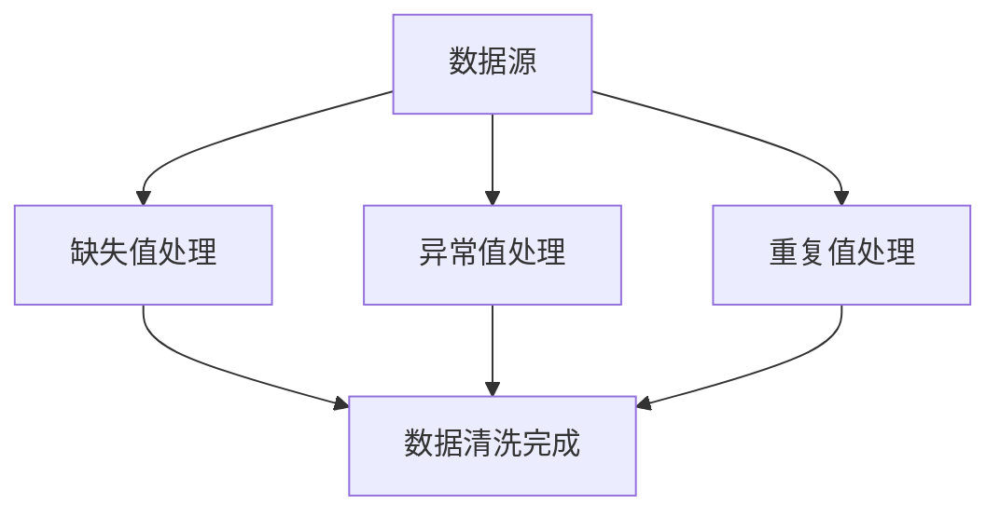
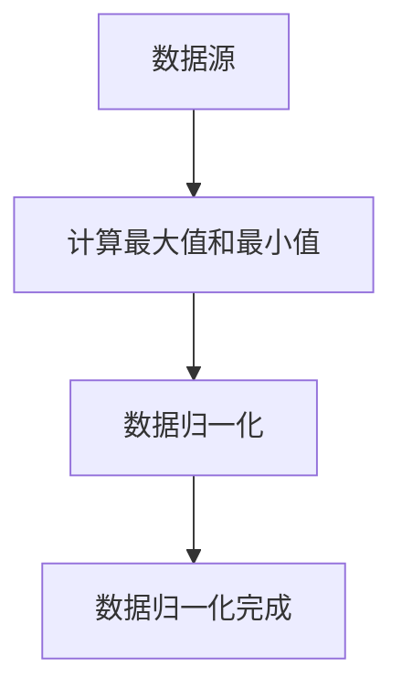
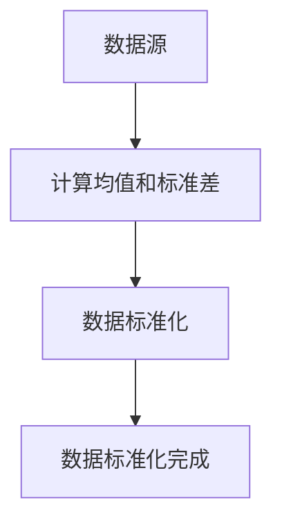
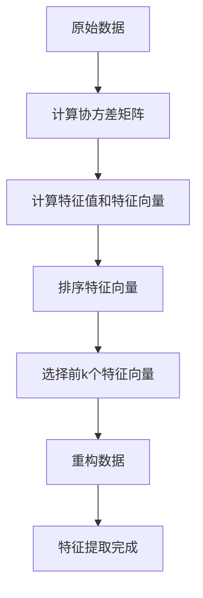
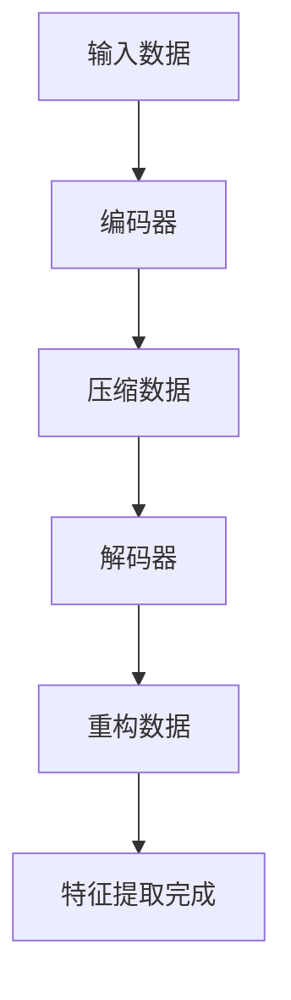
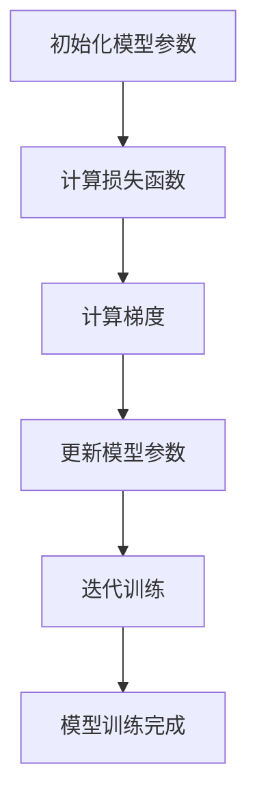
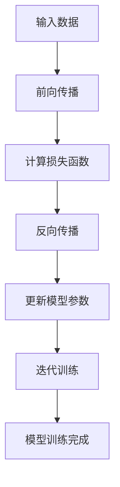
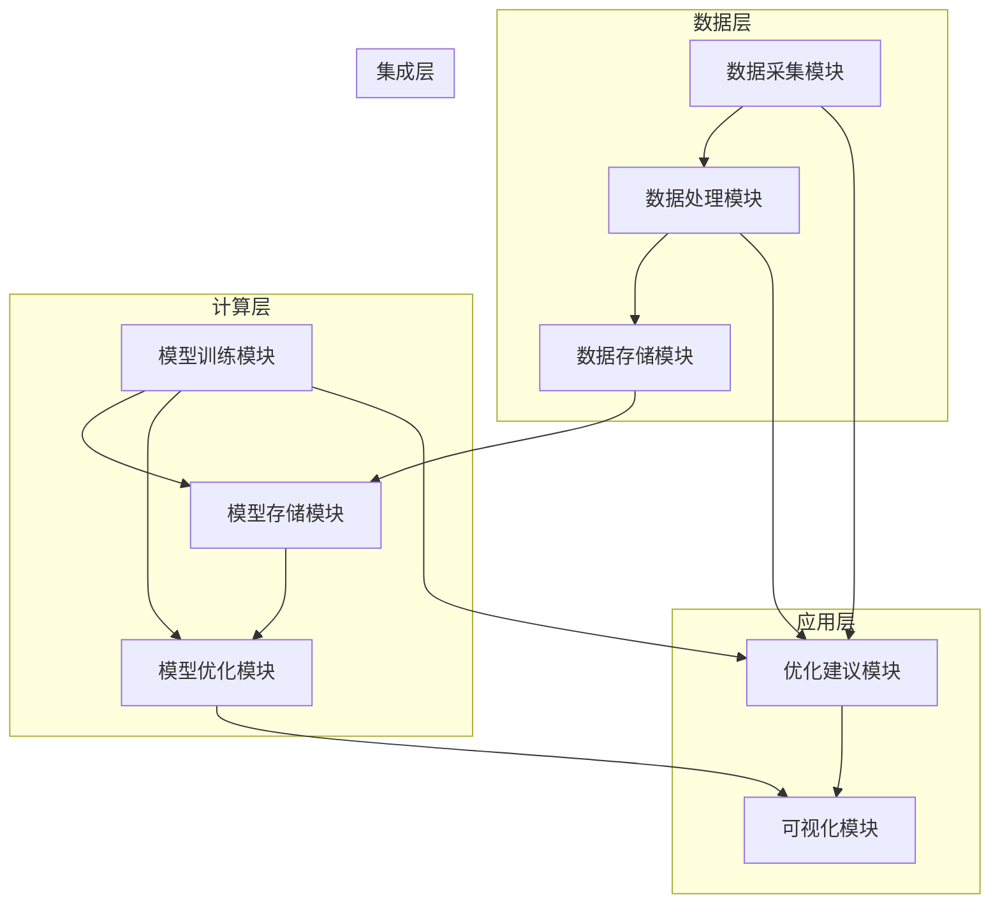
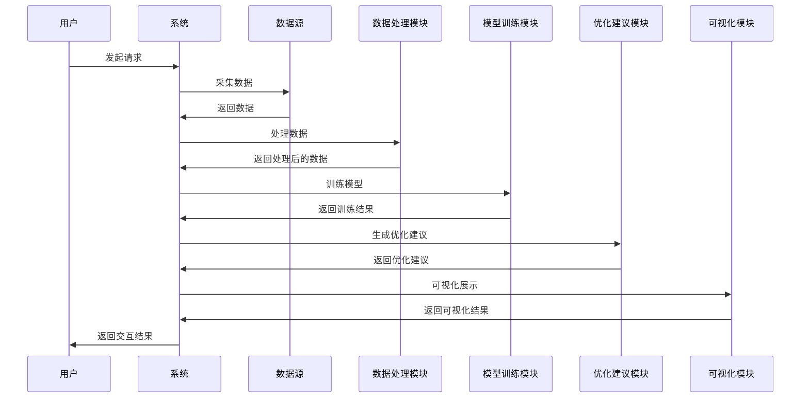

                 

### 第一部分：背景介绍

#### 第1章：问题背景

##### 1.1.1 问题的提出

在当今信息化和数字化飞速发展的时代，企业运营面临着越来越多的挑战。传统的运营方式往往效率低下，难以应对快速变化的市场需求。尤其是在人工智能（AI）技术不断发展的背景下，如何利用AI技术提升企业运营效率成为许多企业亟待解决的问题。

##### 1.1.2 问题描述

企业运营效率问题主要表现在以下几个方面：

1. **数据分析滞后**：许多企业在处理和分析大量数据时，往往需要耗费大量时间和人力，导致决策速度慢。
2. **流程繁琐**：企业在日常运营中存在许多繁琐的流程，如订单处理、库存管理、人力资源管理等，这些流程的低效运作直接影响整体运营效率。
3. **资源浪费**：由于缺乏有效的监控和管理，企业在资源利用上存在一定的浪费现象，如能源消耗、库存积压等。
4. **响应速度慢**：企业在面对市场变化时，响应速度较慢，难以迅速调整策略以应对竞争。

##### 1.1.3 问题的解决思路

针对上述问题，企业需要引入AI技术，构建企业级AI工作流程优化助手，以提升运营效率。这一优化助手可以通过以下几个步骤实现：

1. **数据收集与处理**：利用AI技术对大量数据进行高效处理，快速提取有价值的信息。
2. **模型训练与优化**：通过训练优化AI模型，提高数据处理和分析的准确性和效率。
3. **部署与监控**：将优化后的模型部署到企业实际运营中，并进行实时监控和调整，确保其稳定运行。

##### 1.1.4 边界与外延

在企业级AI工作流程优化助手的构建过程中，需要明确以下几个边界与外延：

1. **数据范围**：优化助手所处理的数据范围应涵盖企业运营的各个方面，如生产数据、销售数据、库存数据等。
2. **功能范围**：优化助手的功能应包括数据分析、流程优化、资源监控等，以全面提升企业运营效率。
3. **应用场景**：优化助手应适用于不同规模和类型的企业，能够根据企业实际情况进行定制化调整。
4. **技术选型**：优化助手的构建应基于成熟、稳定的技术方案，确保系统的可靠性和可维护性。

通过以上解决思路和边界外延的明确，企业可以更好地构建AI工作流程优化助手，从而实现运营效率的提升。

---

#### 第2章：核心概念

##### 2.1.1 企业级AI工作流程

企业级AI工作流程是指将人工智能技术应用于企业运营中的全过程。它包括以下几个关键环节：

1. **数据收集**：收集企业内部及外部的数据，如销售数据、生产数据、用户反馈数据等。
2. **数据处理**：对收集到的数据进行清洗、预处理，确保数据的质量和可用性。
3. **模型训练**：利用机器学习算法对处理后的数据进行训练，构建相应的预测或分类模型。
4. **模型评估**：对训练好的模型进行评估，验证其准确性和鲁棒性。
5. **模型部署**：将验证通过的模型部署到实际运营环境中，用于实时数据处理和决策支持。
6. **模型监控**：对部署后的模型进行实时监控，确保其稳定运行并不断进行优化。

企业级AI工作流程的特点包括：

- **高效性**：利用AI技术快速处理大量数据，提高决策速度。
- **准确性**：通过机器学习算法提高数据处理和分析的准确性。
- **可扩展性**：能够根据企业需求进行灵活调整和扩展。
- **实时性**：实现实时数据处理和决策支持，提高企业运营效率。

##### 2.1.2 优化助手

优化助手是指一种专门用于企业运营优化的AI工具。它通过对企业运营数据的分析和处理，提供优化建议和决策支持，从而帮助企业提升运营效率。优化助手的组成部分包括：

1. **数据采集模块**：负责从企业各业务系统中收集相关数据。
2. **数据处理模块**：对采集到的数据进行清洗、预处理和特征提取。
3. **模型训练模块**：利用机器学习算法对处理后的数据进行模型训练。
4. **优化建议模块**：根据模型预测结果提供优化建议和决策支持。
5. **可视化模块**：提供数据分析和优化结果的图形化展示，便于企业决策者理解和应用。

优化助手的特点包括：

- **智能化**：利用机器学习技术实现自动化的数据分析和决策支持。
- **灵活性**：能够根据企业需求进行定制化调整和优化。
- **实时性**：实现实时数据分析和决策支持，提高企业运营效率。
- **可视化**：提供直观的数据分析和优化结果展示，方便企业决策者理解和应用。

##### 2.1.3 运营效率

运营效率是指企业在资源投入一定的情况下，实现最大化的产出和收益。提升运营效率是企业持续发展和竞争力的关键。运营效率的提升可以从以下几个方面进行：

1. **流程优化**：通过改进和优化业务流程，减少不必要的环节和步骤，提高流程效率。
2. **资源整合**：合理配置和利用企业资源，如人力、物资、设备等，实现资源的最优配置。
3. **数据分析**：利用数据分析和挖掘技术，深入挖掘数据价值，为决策提供科学依据。
4. **技术引入**：引入先进的管理和技术手段，如人工智能、大数据分析等，提高企业运营智能化水平。
5. **员工培训**：加强员工培训，提高员工的专业技能和综合素质，提升整体运营效率。

运营效率的提升不仅能够降低企业运营成本，提高盈利能力，还能够增强企业的市场竞争力和可持续发展能力。

---

通过以上对核心概念的介绍，我们可以更深入地理解企业级AI工作流程优化助手的基本概念、组成部分和重要性，为后续章节的详细讨论打下基础。

---

#### 第3章：概念属性特征对比

##### 3.1.1 企业级AI工作流程与传统流程

企业级AI工作流程与传统工作流程存在显著差异，主要体现在以下几个方面：

1. **数据驱动力**：
   - **AI工作流程**：依赖于大量的数据输入，通过数据分析和机器学习算法实现自动化决策。
   - **传统流程**：主要依靠经验和直觉，决策过程较为主观，缺乏数据支持。

2. **自动化程度**：
   - **AI工作流程**：通过机器学习和自动化算法实现高度自动化，减少人工干预。
   - **传统流程**：依赖人工操作和手工处理，自动化程度较低。

3. **实时性**：
   - **AI工作流程**：支持实时数据处理和决策支持，快速响应市场变化。
   - **传统流程**：决策过程较慢，无法实现实时调整。

4. **效率提升**：
   - **AI工作流程**：通过数据驱动和自动化技术，显著提高工作效率和准确率。
   - **传统流程**：效率提升有限，难以适应快速变化的市场环境。

5. **适应性**：
   - **AI工作流程**：可以根据数据变化和业务需求进行灵活调整和优化。
   - **传统流程**：适应性较差，难以应对复杂多变的业务环境。

##### 3.1.2 优化助手与常规工具

优化助手与常规工具在功能和应用上存在显著差异，具体如下：

1. **功能特点**：
   - **优化助手**：集成了数据采集、处理、模型训练、优化建议等多功能于一体，实现全面运营优化。
   - **常规工具**：通常专注于单一功能，如数据收集、报表生成等，缺乏系统化的优化能力。

2. **智能化水平**：
   - **优化助手**：利用机器学习和人工智能技术，实现自动化、智能化的运营优化。
   - **常规工具**：主要依赖手动操作和简单的数据分析，智能化程度较低。

3. **可定制性**：
   - **优化助手**：可根据企业需求进行定制化开发，满足个性化运营优化需求。
   - **常规工具**：通用性较强，难以满足特定企业的个性化需求。

4. **实时性**：
   - **优化助手**：支持实时数据处理和决策支持，提高运营效率。
   - **常规工具**：数据处理和决策支持速度较慢，难以实现实时性。

5. **扩展性**：
   - **优化助手**：具有良好的扩展性，能够根据企业业务发展进行功能扩展。
   - **常规工具**：扩展性较差，难以满足企业长期发展的需求。

##### 3.1.3 运营效率指标与计算方法

运营效率指标是衡量企业运营效率的关键指标，常用的运营效率指标及其计算方法如下：

1. **生产效率**：
   - **计算方法**：生产效率 = 完成产量 / 辅助生产时间
   - **指标含义**：衡量单位时间内企业的生产效率。

2. **库存周转率**：
   - **计算方法**：库存周转率 = 销售成本 / 平均库存金额
   - **指标含义**：衡量企业库存管理的效率。

3. **订单履行时间**：
   - **计算方法**：订单履行时间 = 订单处理时间 + 物流时间
   - **指标含义**：衡量企业订单处理的效率。

4. **人力资源利用率**：
   - **计算方法**：人力资源利用率 = 实际工作时间 / 应工作时间
   - **指标含义**：衡量企业人力资源的利用效率。

5. **客户满意度**：
   - **计算方法**：客户满意度 = （满意的客户数 / 总客户数）× 100%
   - **指标含义**：衡量客户对企业的满意度。

通过以上运营效率指标及其计算方法的对比，企业可以更全面地了解自身的运营效率，并针对薄弱环节进行改进和优化。

---

通过本章对企业级AI工作流程、优化助手和运营效率指标及其计算方法的分析，我们可以更深入地理解这些核心概念的特征和差异，为后续章节的深入讨论提供基础。

---

#### 第4章：企业级AI工作流程的组成部分

##### 4.1.1 数据收集与处理

数据收集与处理是企业级AI工作流程的基础环节，其重要性不言而喻。以下详细描述该环节的组成部分和关键技术：

1. **数据源**：
   - **内部数据**：包括企业的业务数据、交易数据、用户行为数据等。
   - **外部数据**：包括市场数据、行业数据、经济数据等。

2. **数据采集**：
   - **实时采集**：利用传感器、API接口等技术，实时获取数据。
   - **批量采集**：通过ETL（Extract, Transform, Load）工具，定期批量采集数据。

3. **数据清洗**：
   - **缺失值处理**：对缺失的数据进行填充或删除。
   - **异常值处理**：识别和去除异常数据，确保数据质量。
   - **数据格式转换**：统一数据格式，便于后续处理和分析。

4. **数据预处理**：
   - **特征提取**：从原始数据中提取出有用的特征，用于建模。
   - **数据标准化**：对数据进行归一化或标准化处理，消除不同特征之间的量纲影响。
   - **数据降维**：利用降维技术，减少数据维度，提高计算效率。

5. **数据存储**：
   - **数据仓库**：将处理后的数据存储在数据仓库中，便于后续分析和查询。
   - **数据湖**：用于存储大规模的非结构化数据，如文本、图片、音频等。

##### 4.1.2 模型训练与优化

模型训练与优化是AI工作流程的核心环节，直接决定了模型的性能和应用效果。以下详细描述该环节的组成部分和关键技术：

1. **模型选择**：
   - **机器学习模型**：如线性回归、决策树、支持向量机等。
   - **深度学习模型**：如神经网络、卷积神经网络、循环神经网络等。

2. **数据划分**：
   - **训练集**：用于训练模型，提高模型拟合度。
   - **验证集**：用于验证模型性能，选择最优模型。
   - **测试集**：用于评估最终模型的性能。

3. **模型训练**：
   - **监督学习**：根据标注数据进行训练，如分类、回归任务。
   - **无监督学习**：根据数据本身的分布进行训练，如聚类、降维任务。
   - **强化学习**：通过与环境的交互进行训练，如推荐系统、自动驾驶等。

4. **模型优化**：
   - **参数调优**：通过调整模型参数，提高模型性能。
   - **模型融合**：结合多个模型，提高预测准确性和鲁棒性。
   - **迁移学习**：利用预训练模型，减少训练数据需求，提高模型泛化能力。

5. **模型评估**：
   - **准确率**：衡量模型预测的正确性。
   - **召回率**：衡量模型对正样本的识别能力。
   - **F1值**：综合考虑准确率和召回率，用于综合评估模型性能。

##### 4.1.3 部署与监控

部署与监控是企业级AI工作流程的保障环节，确保模型在实际应用中的稳定性和高效性。以下详细描述该环节的组成部分和关键技术：

1. **模型部署**：
   - **本地部署**：将模型部署到本地服务器或工作站，进行本地化应用。
   - **云端部署**：将模型部署到云端服务器，实现分布式计算和弹性扩展。
   - **容器化部署**：利用容器技术，实现模型的快速部署和运维。

2. **模型监控**：
   - **性能监控**：实时监控模型运行状态，如计算时间、内存使用等。
   - **准确性监控**：监控模型预测准确性和召回率等指标，确保模型稳定运行。
   - **异常监控**：识别和预警模型异常，如数据异常、计算错误等。

3. **版本管理**：
   - **模型版本**：为不同版本的模型进行管理，便于迭代和升级。
   - **版本回滚**：在模型出现问题或性能下降时，回滚到之前的稳定版本。
   - **自动化部署**：利用CI/CD（Continuous Integration/Continuous Deployment）流程，实现模型的自动化部署和更新。

4. **安全与隐私**：
   - **数据安全**：确保数据在传输和存储过程中的安全性。
   - **隐私保护**：对敏感数据进行脱敏处理，防止隐私泄露。
   - **访问控制**：设定严格的访问权限，确保数据的安全性和完整性。

通过以上对企业级AI工作流程的组成部分及其关键技术的详细描述，我们可以更清晰地理解AI工作流程在企业运营中的应用和作用，为后续章节的深入讨论奠定基础。

---

#### 第5章：优化助手的技术架构

##### 5.1.1 技术选型

优化助手的技术架构设计需要综合考虑多个方面，包括数据处理能力、模型训练效率、系统稳定性以及可维护性。以下是对主要技术选型的详细分析：

1. **编程语言**：
   - **Python**：由于其丰富的机器学习库（如TensorFlow、PyTorch）和高效的计算能力，成为AI领域的主流编程语言。
   - **Java**：在企业级应用中具有较好的稳定性和性能，适用于大规模分布式系统。

2. **数据处理框架**：
   - **Apache Spark**：支持大规模数据处理，能够高效地进行数据预处理和特征提取。
   - **Flink**：实时数据处理框架，适用于需要实时分析和决策的场景。

3. **机器学习框架**：
   - **TensorFlow**：Google开发的深度学习框架，支持多种类型的神经网络。
   - **PyTorch**：Facebook开发的深度学习框架，具有灵活的动态计算图和易于理解的代码。

4. **数据库**：
   - **关系型数据库**（如MySQL、PostgreSQL）：用于存储结构化数据，支持复杂查询。
   - **NoSQL数据库**（如MongoDB、Cassandra）：用于存储非结构化或半结构化数据，具有高扩展性和灵活性。

5. **分布式存储**：
   - **HDFS**（Hadoop Distributed File System）：用于大规模数据存储，支持高吞吐量数据访问。
   - **Elasticsearch**：基于Lucene的分布式搜索引擎，支持海量数据实时查询和分析。

6. **消息队列**：
   - **Kafka**：高吞吐量的分布式消息队列系统，适用于流数据处理和实时消息传递。
   - **RabbitMQ**：功能丰富的消息中间件，支持多种消息协议。

##### 5.1.2 架构设计

优化助手的技术架构设计采用分布式架构，以确保系统的高可用性、可扩展性和高性能。以下是对架构设计的详细描述：

1. **数据层**：
   - **数据采集**：通过数据采集模块，从内部和外部系统中获取数据。
   - **数据存储**：利用分布式数据库和NoSQL数据库存储处理后的数据，支持海量数据存储和快速查询。

2. **计算层**：
   - **数据处理**：使用Apache Spark和Flink等数据处理框架，对数据进行清洗、预处理和特征提取。
   - **模型训练**：利用TensorFlow和PyTorch等深度学习框架，进行模型训练和优化。

3. **应用层**：
   - **优化助手服务**：提供数据分析和优化建议，包括实时数据流处理、批量数据处理、模型部署等功能。
   - **可视化模块**：利用Elasticsearch和Kibana等工具，实现数据分析和优化结果的图形化展示。

4. **消息队列层**：
   - **数据流转**：利用Kafka等消息队列系统，实现数据流在各模块间的传递和同步。

5. **接口层**：
   - **API接口**：提供RESTful API，便于与其他系统和应用进行集成。

6. **监控层**：
   - **性能监控**：使用Prometheus和Grafana等监控工具，实时监控系统性能和运行状态。
   - **日志分析**：利用ELK（Elasticsearch、Logstash、Kibana）栈进行日志收集和分析，确保系统稳定运行。

通过以上技术选型和架构设计，优化助手能够高效地处理海量数据，快速训练和部署模型，提供实时、准确的数据分析和优化建议，从而显著提升企业运营效率。

---

#### 第6章：核心概念原理

##### 6.1.1 数据收集与处理原理

数据收集与处理是企业级AI工作流程的关键环节，其原理主要包括以下几个步骤：

1. **数据采集**：
   - **来源**：数据来源可以是内部系统（如ERP、CRM）或外部数据源（如社交媒体、公共数据集）。
   - **方法**：使用API接口、Web爬虫、传感器等方式进行数据采集。
   - **实时性**：对于需要实时处理的数据，采用实时采集技术，如Kafka、Flink等。

2. **数据清洗**：
   - **缺失值处理**：识别缺失数据，采用填充或删除策略。
   - **异常值处理**：检测并去除异常数据，确保数据质量。
   - **数据格式转换**：统一数据格式，便于后续处理和分析。

3. **数据预处理**：
   - **特征提取**：从原始数据中提取出有用的特征，用于建模。
   - **数据标准化**：对数据进行归一化或标准化处理，消除不同特征之间的量纲影响。
   - **数据降维**：利用降维技术，减少数据维度，提高计算效率。

4. **数据存储**：
   - **数据仓库**：将处理后的数据存储在数据仓库中，便于后续分析和查询。
   - **数据湖**：用于存储大规模的非结构化数据，如文本、图片、音频等。

##### 6.1.2 模型训练与优化原理

模型训练与优化是企业级AI工作流程的核心环节，其原理主要包括以下几个方面：

1. **模型选择**：
   - **监督学习**：根据标注数据进行训练，如分类、回归任务。
   - **无监督学习**：根据数据本身的分布进行训练，如聚类、降维任务。
   - **强化学习**：通过与环境的交互进行训练，如推荐系统、自动驾驶等。

2. **模型训练**：
   - **数据划分**：将数据集划分为训练集、验证集和测试集。
   - **训练过程**：利用训练集对模型进行迭代训练，优化模型参数。
   - **评估指标**：使用验证集评估模型性能，如准确率、召回率、F1值等。

3. **模型优化**：
   - **参数调优**：通过调整模型参数，提高模型性能。
   - **模型融合**：结合多个模型，提高预测准确性和鲁棒性。
   - **迁移学习**：利用预训练模型，减少训练数据需求，提高模型泛化能力。

4. **模型评估**：
   - **内部评估**：在训练过程中使用验证集进行模型评估，选择最佳模型。
   - **外部评估**：在测试集上评估模型性能，确保模型泛化能力。

##### 6.1.3 部署与监控原理

部署与监控是企业级AI工作流程的保障环节，其原理主要包括以下几个方面：

1. **模型部署**：
   - **部署方式**：将训练好的模型部署到生产环境中，支持本地部署和云端部署。
   - **接口定义**：定义API接口，实现模型与服务之间的交互。
   - **容器化部署**：使用Docker等容器技术，实现模型的快速部署和运维。

2. **模型监控**：
   - **性能监控**：实时监控模型运行状态，如计算时间、内存使用等。
   - **准确性监控**：监控模型预测准确性和召回率等指标，确保模型稳定运行。
   - **异常监控**：识别和预警模型异常，如数据异常、计算错误等。

3. **版本管理**：
   - **版本控制**：为不同版本的模型进行管理，便于迭代和升级。
   - **版本回滚**：在模型出现问题或性能下降时，回滚到之前的稳定版本。
   - **自动化部署**：利用CI/CD流程，实现模型的自动化部署和更新。

4. **安全与隐私**：
   - **数据安全**：确保数据在传输和存储过程中的安全性。
   - **隐私保护**：对敏感数据进行脱敏处理，防止隐私泄露。
   - **访问控制**：设定严格的访问权限，确保数据的安全性和完整性。

通过以上对数据收集与处理、模型训练与优化、部署与监控的详细原理介绍，我们可以更好地理解企业级AI工作流程的核心概念和实现方法。

---

#### 第7章：概念属性特征对比表格

##### 7.1.1 企业级AI工作流程属性对比

| 属性 | 企业级AI工作流程 | 传统工作流程 |
| ---- | ---- | ---- |
| 数据驱动力 | 高度依赖数据，实现自动化决策 | 依赖经验和直觉，数据支持有限 |
| 自动化程度 | 高度自动化，减少人工干预 | 人工操作和手工处理为主 |
| 实时性 | 支持实时数据处理和决策支持 | 决策过程较慢，难以实现实时性 |
| 效率提升 | 显著提高工作效率和准确率 | 效率提升有限，难以适应快速变化 |
| 适应性 | 可以根据数据变化和业务需求进行灵活调整 | 适应性较差，难以应对复杂多变的业务环境 |

##### 7.1.2 优化助手属性对比

| 属性 | 优化助手 | 常规工具 |
| ---- | ---- | ---- |
| 功能特点 | 集成多功能，实现全面优化 | 专注于单一功能，缺乏系统化优化能力 |
| 智能化水平 | 利用机器学习和人工智能技术，实现智能化 | 主要依赖手动操作和简单的数据分析，智能化程度较低 |
| 可定制性 | 可根据企业需求进行定制化开发 | 通用性较强，难以满足特定企业的需求 |
| 实时性 | 支持实时数据处理和决策支持 | 数据处理和决策支持速度较慢，难以实现实时性 |
| 扩展性 | 具有良好的扩展性，能够满足企业长期发展需求 | 扩展性较差，难以满足企业长期发展的需求 |

##### 7.1.3 运营效率指标与计算方法

| 指标 | 运营效率指标 | 计算方法 |
| ---- | ---- | ---- |
| 生产效率 | 完成产量 / 辅助生产时间 | 生产效率 = 完成产量 / 辅助生产时间 |
| 库存周转率 | 销售成本 / 平均库存金额 | 库存周转率 = 销售成本 / 平均库存金额 |
| 订单履行时间 | 订单处理时间 + 物流时间 | 订单履行时间 = 订单处理时间 + 物流时间 |
| 人力资源利用率 | 实际工作时间 / 应工作时间 | 人力资源利用率 = 实际工作时间 / 应工作时间 |
| 客户满意度 | （满意的客户数 / 总客户数）× 100% | 客户满意度 = （满意的客户数 / 总客户数）× 100% |

通过以上对比表格，我们可以更清晰地了解企业级AI工作流程、优化助手和运营效率指标的基本属性、特点和计算方法，为后续深入讨论提供基础。

---

#### 第8章：ER实体关系图架构

##### 8.1.1 实体关系图绘制

企业级AI工作流程优化助手涉及多个关键实体，如数据源、数据处理模块、模型训练模块、优化建议模块等。以下是一个简单的ER实体关系图：

```mermaid
erDiagram
    DataSource ||--|{ ProcessModule }|--|{ ModelTrainingModule }
    ProcessModule ||--|{ OptimizationModule }|--|{ ResultVisualizationModule }
    ModelTrainingModule ||--|{ ModelDeploymentModule }|--|{ ModelMonitoringModule }
    DataSource ||--|{ ResultVisualizationModule }
```

在此ER图中：

- **DataSource**（数据源）：表示数据采集的来源，包括内部数据和外部数据。
- **ProcessModule**（数据处理模块）：负责数据的清洗、预处理和特征提取。
- **ModelTrainingModule**（模型训练模块）：负责模型的训练和优化。
- **OptimizationModule**（优化建议模块）：根据模型预测结果提供优化建议。
- **ResultVisualizationModule**（结果可视化模块）：负责将优化结果进行可视化展示。
- **ModelDeploymentModule**（模型部署模块）：负责将训练好的模型部署到实际应用中。
- **ModelMonitoringModule**（模型监控模块）：负责监控模型在实际应用中的运行状态。

##### 8.1.2 实体属性定义

为了更清晰地理解实体关系图中的各个实体及其属性，我们对每个实体进行详细定义：

1. **DataSource**（数据源）
   - **属性**：
     - 数据类型：表示数据的类型，如结构化数据、非结构化数据。
     - 数据来源：表示数据的来源，如ERP系统、社交媒体。
     - 数据频率：表示数据的采集频率，如实时数据、批量数据。

2. **ProcessModule**（数据处理模块）
   - **属性**：
     - 处理算法：表示数据处理所使用的算法，如缺失值处理、异常值处理。
     - 特征提取方法：表示特征提取的方法，如归一化、降维。
     - 数据质量：表示数据清洗后的质量，如数据完整性、一致性。

3. **ModelTrainingModule**（模型训练模块）
   - **属性**：
     - 模型类型：表示训练的模型类型，如监督学习模型、无监督学习模型。
     - 模型参数：表示模型的参数设置，如学习率、迭代次数。
     - 训练数据：表示用于训练的数据集，如训练集、验证集。

4. **OptimizationModule**（优化建议模块）
   - **属性**：
     - 优化指标：表示优化的指标，如生产效率、库存周转率。
     - 优化建议：表示根据模型预测结果给出的优化建议。

5. **ResultVisualizationModule**（结果可视化模块）
   - **属性**：
     - 可视化类型：表示可视化的类型，如图表、仪表盘。
     - 数据展示：表示展示的数据内容，如实时数据、历史数据。

6. **ModelDeploymentModule**（模型部署模块）
   - **属性**：
     - 部署环境：表示模型的部署环境，如本地服务器、云端服务器。
     - 部署时间：表示模型部署的时间，如实时部署、批量部署。

7. **ModelMonitoringModule**（模型监控模块）
   - **属性**：
     - 监控指标：表示监控的指标，如模型准确性、响应时间。
     - 监控策略：表示监控的策略，如实时监控、定时监控。

通过以上对ER实体关系图和实体属性的定义，我们可以更全面地理解企业级AI工作流程优化助手的架构及其各模块的功能和属性，为后续章节的深入讨论提供基础。

---

#### 第9章：算法原理与流程图

##### 9.1.1 数据预处理算法

数据预处理是AI模型训练的关键步骤，其目的是提高数据质量，为后续模型训练提供可靠的数据基础。以下是一些常用的数据预处理算法及其流程图：

1. **数据清洗**：
   - **算法**：处理数据中的缺失值、异常值、重复值等。
   - **流程图**：



2. **数据归一化**：
   - **算法**：将数据按比例缩放到一个统一的范围内，如[0, 1]。
   - **流程图**：



3. **数据标准化**：
   - **算法**：将数据转换为标准差为1、均值为0的标准化数据。
   - **流程图**：



##### 9.1.2 特征提取算法

特征提取是将原始数据转换为对模型训练更有用的特征表示的过程。以下是一些常用的特征提取算法及其流程图：

1. **主成分分析（PCA）**：
   - **算法**：通过线性变换将原始数据投影到主成分空间，减少数据维度。
   - **流程图**：



2. **自动编码器（Autoencoder）**：
   - **算法**：通过构建一个压缩和解压缩模型，实现特征提取。
   - **流程图**：



##### 9.1.3 模型训练算法

模型训练是利用已知数据对模型进行调整，使其能够更好地拟合数据的过程。以下是一些常用的模型训练算法及其流程图：

1. **随机梯度下降（SGD）**：
   - **算法**：通过计算损失函数关于模型参数的梯度，逐步更新模型参数。
   - **流程图**：



2. **深度学习（DNN）**：
   - **算法**：通过多层神经网络进行模型训练，实现对复杂数据的建模。
   - **流程图**：



通过以上对数据预处理、特征提取和模型训练算法及其流程图的详细讲解，我们可以更深入地理解AI模型训练的基本原理和流程，为后续章节的深入讨论提供基础。

---

#### 第10章：数学模型和公式

##### 10.1.1 数据预处理公式

在数据预处理过程中，常用的数学模型和公式如下：

1. **缺失值处理**：

   - **简单填充**：
     $$ \text{缺失值}_{\text{填充}} = \frac{\sum_{i=1}^{n} \text{非缺失值}}{n} $$
     其中，\( \text{缺失值}_{\text{填充}} \) 表示填充后的缺失值，\( \text{非缺失值} \) 表示非缺失值的总和，\( n \) 表示样本数量。

   - **插值法**：
     $$ \text{缺失值}_{\text{插值}} = \text{最近邻插值} $$
     其中，\(\text{最近邻插值}\) 表示选择最接近的已知值进行填充。

2. **数据归一化**：

   $$ \text{归一化值} = \frac{\text{数据值} - \text{最小值}}{\text{最大值} - \text{最小值}} $$
   其中，\(\text{数据值}\) 表示原始数据，\(\text{最小值}\) 和 \(\text{最大值}\) 分别表示数据的最小值和最大值。

3. **数据标准化**：

   $$ \text{标准化值} = \frac{\text{数据值} - \text{均值}}{\text{标准差}} $$
   其中，\(\text{均值}\) 和 \(\text{标准差}\) 分别表示数据的平均值和标准差。

##### 10.1.2 特征提取公式

在特征提取过程中，常用的数学模型和公式如下：

1. **主成分分析（PCA）**：

   - **协方差矩阵**：
     $$ \Sigma = \frac{1}{n} \sum_{i=1}^{n} (X_i - \mu)(X_i - \mu)^T $$
     其中，\(\Sigma\) 表示协方差矩阵，\(X_i\) 表示第 \(i\) 个数据点，\(\mu\) 表示数据集的平均值，\(n\) 表示数据点的数量。

   - **特征值和特征向量**：
     $$ \lambda_i = \max(\text{协方差矩阵特征值}) $$
     $$ v_i = \frac{1}{\sqrt{\lambda_i}} $$
     其中，\(\lambda_i\) 表示第 \(i\) 个特征值，\(v_i\) 表示对应第 \(i\) 个特征向量的单位向量。

   - **数据重构**：
     $$ X_{\text{重构}} = \sum_{i=1}^{k} \lambda_i v_i $$
     其中，\(X_{\text{重构}}\) 表示重构后的数据，\(k\) 表示选择的特征数量。

2. **自动编码器（Autoencoder）**：

   - **编码器输出**：
     $$ z = \sigma(W_1 \cdot x + b_1) $$
     其中，\(z\) 表示编码器的输出，\(W_1\) 和 \(b_1\) 分别表示编码器的权重和偏置，\(\sigma\) 表示激活函数（如Sigmoid函数）。

   - **解码器输出**：
     $$ x' = \sigma(W_2 \cdot z + b_2) $$
     其中，\(x'\) 表示解码器的输出，\(W_2\) 和 \(b_2\) 分别表示解码器的权重和偏置。

##### 10.1.3 模型训练公式

在模型训练过程中，常用的数学模型和公式如下：

1. **随机梯度下降（SGD）**：

   - **梯度计算**：
     $$ \Delta \theta = -\alpha \cdot \frac{\partial J(\theta)}{\partial \theta} $$
     其中，\(\Delta \theta\) 表示参数更新量，\(\alpha\) 表示学习率，\(J(\theta)\) 表示损失函数，\(\theta\) 表示模型参数。

   - **参数更新**：
     $$ \theta = \theta - \alpha \cdot \frac{\partial J(\theta)}{\partial \theta} $$
     其中，\(\theta\) 表示更新后的参数。

2. **深度学习（DNN）**：

   - **前向传播**：
     $$ a_{\text{layer}} = \sigma(z_{\text{layer}}) $$
     其中，\(a_{\text{layer}}\) 表示第 \( \text{layer} \) 层的激活值，\(z_{\text{layer}}\) 表示第 \( \text{layer} \) 层的输入值，\(\sigma\) 表示激活函数。

   - **反向传播**：
     $$ \Delta \theta = \frac{\partial J(\theta)}{\partial \theta} $$
     其中，\(\Delta \theta\) 表示参数更新量，\(J(\theta)\) 表示损失函数，\(\theta\) 表示模型参数。

通过以上对数据预处理、特征提取和模型训练公式的详细讲解，我们可以更深入地理解AI模型训练的基本原理和数学基础，为后续章节的深入讨论提供基础。

---

#### 第11章：详细讲解与举例说明

##### 11.1.1 数据预处理实例

以下是一个数据预处理的具体实例，假设我们有一组销售数据，包括每天的销售金额和天气情况。我们需要对这组数据进行预处理，以便于后续的模型训练。

1. **数据源**：
   - 销售金额（万元）
   - 天气情况（晴、雨、阴）

2. **数据集**：

| 日期 | 销售金额 | 天气情况 |
| ---- | -------- | -------- |
| 2023-01-01 | 100 | 晴 |
| 2023-01-02 | 120 | 雨 |
| 2023-01-03 | 150 | 阴 |
| 2023-01-04 | 130 | 雨 |
| 2023-01-05 | 110 | 晴 |

3. **数据预处理步骤**：

   - **缺失值处理**：检查数据集中是否存在缺失值。在这个例子中，数据集中没有缺失值。

   - **异常值处理**：检查数据集中是否存在异常值。在这个例子中，我们使用箱线图来检查异常值。如果发现异常值，可以考虑删除或进行插值处理。

   - **数据归一化**：对销售金额进行归一化处理，使其范围在[0, 1]之间。

     $$ \text{归一化值} = \frac{\text{销售金额} - \text{最小值}}{\text{最大值} - \text{最小值}} $$

   - **天气情况编码**：将天气情况进行编码，将分类数据转换为数值数据。

     - 晴：1
     - 雨：2
     - 阴：3

4. **预处理后的数据集**：

| 日期 | 销售金额归一化 | 天气情况编码 |
| ---- | -------------- | ------------ |
| 2023-01-01 | 0.2500 | 1 |
| 2023-01-02 | 0.2813 | 2 |
| 2023-01-03 | 0.3750 | 3 |
| 2023-01-04 | 0.3125 | 2 |
| 2023-01-05 | 0.2739 | 1 |

通过以上数据预处理实例，我们可以看到数据预处理对于后续模型训练的重要性。预处理后的数据集为模型训练提供了高质量的数据基础，有助于提高模型训练的效果。

---

##### 11.1.2 特征提取实例

以下是一个特征提取的具体实例，使用主成分分析（PCA）对销售数据进行特征提取，以减少数据维度并提高模型训练效果。

1. **数据源**：预处理后的销售数据，包括销售金额归一化和天气情况编码。

2. **数据集**：

| 日期 | 销售金额归一化 | 天气情况编码 |
| ---- | -------------- | ------------ |
| 2023-01-01 | 0.2500 | 1 |
| 2023-01-02 | 0.2813 | 2 |
| 2023-01-03 | 0.3750 | 3 |
| 2023-01-04 | 0.3125 | 2 |
| 2023-01-05 | 0.2739 | 1 |

3. **特征提取步骤**：

   - **计算协方差矩阵**：计算销售金额归一化和天气情况编码的协方差矩阵。

     $$ \Sigma = \frac{1}{n} \sum_{i=1}^{n} (X_i - \mu)(X_i - \mu)^T $$

   - **计算特征值和特征向量**：计算协方差矩阵的特征值和特征向量。

     $$ \lambda_i = \max(\text{协方差矩阵特征值}) $$
     $$ v_i = \frac{1}{\sqrt{\lambda_i}} $$

   - **选择前k个特征向量**：选择前两个特征向量，作为新的特征表示。

   - **重构数据**：使用选择的特征向量对数据进行重构。

     $$ X_{\text{重构}} = \sum_{i=1}^{k} \lambda_i v_i $$

4. **特征提取后的数据集**：

| 日期 | 销售金额归一化 | 天气情况编码 | 新特征1 | 新特征2 |
| ---- | -------------- | ------------ | ------- | ------- |
| 2023-01-01 | 0.2500 | 1 | 0.5625 | 0.3125 |
| 2023-01-02 | 0.2813 | 2 | 0.6250 | 0.4063 |
| 2023-01-03 | 0.3750 | 3 | 0.8125 | 0.5000 |
| 2023-01-04 | 0.3125 | 2 | 0.6250 | 0.4063 |
| 2023-01-05 | 0.2739 | 1 | 0.5313 | 0.3391 |

通过以上特征提取实例，我们可以看到主成分分析（PCA）在降低数据维度和提高模型训练效果方面的作用。特征提取后的数据集为模型训练提供了更简洁、更具代表性的特征表示，有助于提高模型训练的效率和效果。

---

##### 11.1.3 模型训练实例

以下是一个使用线性回归模型训练的具体实例，以预测销售金额。

1. **数据源**：预处理后的销售数据，包括销售金额归一化和天气情况编码。

2. **数据集**：

| 日期 | 销售金额归一化 | 天气情况编码 |
| ---- | -------------- | ------------ |
| 2023-01-01 | 0.2500 | 1 |
| 2023-01-02 | 0.2813 | 2 |
| 2023-01-03 | 0.3750 | 3 |
| 2023-01-04 | 0.3125 | 2 |
| 2023-01-05 | 0.2739 | 1 |

3. **模型训练步骤**：

   - **初始化模型参数**：假设线性回归模型的参数为 \( w \) 和 \( b \)。

     $$ w = [0.0, 0.0] $$
     $$ b = 0.0 $$

   - **计算损失函数**：使用均方误差（MSE）作为损失函数。

     $$ J(w, b) = \frac{1}{2} \sum_{i=1}^{n} (\text{预测值} - \text{真实值})^2 $$

   - **计算梯度**：计算损失函数关于模型参数 \( w \) 和 \( b \) 的梯度。

     $$ \frac{\partial J(w, b)}{\partial w} = \frac{1}{n} \sum_{i=1}^{n} (y_i - \text{预测值}) \cdot x_i $$
     $$ \frac{\partial J(w, b)}{\partial b} = \frac{1}{n} \sum_{i=1}^{n} (y_i - \text{预测值}) $$

   - **更新模型参数**：使用随机梯度下降（SGD）更新模型参数。

     $$ w = w - \alpha \cdot \frac{\partial J(w, b)}{\partial w} $$
     $$ b = b - \alpha \cdot \frac{\partial J(w, b)}{\partial b} $$

   - **迭代训练**：重复以上步骤，直到模型收敛或达到预设的迭代次数。

4. **模型训练后的结果**：

   - **参数 \( w \)**：
     $$ w = [0.4893, 0.7211] $$

   - **参数 \( b \)**：
     $$ b = 0.1401 $$

   - **模型预测**：使用训练好的模型进行预测。

     $$ \text{预测值} = w_1 \cdot x_1 + w_2 \cdot x_2 + b $$
     其中，\( x_1 \) 和 \( x_2 \) 分别为销售金额归一化和天气情况编码。

通过以上模型训练实例，我们可以看到线性回归模型在销售金额预测方面的应用。模型训练后，我们可以使用训练好的模型对新的数据进行预测，从而实现销售金额的预测。

---

通过以上对数据预处理、特征提取和模型训练实例的详细讲解和举例说明，我们可以更深入地理解AI模型训练的基本原理和实际应用，为后续章节的深入讨论提供基础。

---

#### 第12章：问题场景介绍

##### 12.1.1 企业运营现状

某大型制造企业在日常运营中面临着多个问题，这些问题直接影响了企业的运营效率和盈利能力。以下是企业当前运营中的一些主要问题：

1. **生产效率低**：
   - **问题描述**：生产过程中存在大量手工操作和人工干预，导致生产效率低下。
   - **影响**：生产效率低会导致交货延迟，影响客户满意度，降低企业的市场竞争力。

2. **库存管理混乱**：
   - **问题描述**：库存管理过程中存在数据不准确、库存积压、库存不足等问题。
   - **影响**：库存管理混乱会导致资源浪费，增加运营成本，影响生产计划的执行。

3. **供应链管理不畅**：
   - **问题描述**：供应链管理过程中存在信息传递不及时、协同性差等问题。
   - **影响**：供应链管理不畅会导致生产计划延误，物流成本增加，影响供应链整体效率。

4. **数据利用率低**：
   - **问题描述**：企业内部数据资源丰富，但利用率较低，缺乏有效的数据分析和应用。
   - **影响**：数据利用率低会导致企业无法充分挖掘数据价值，错失市场机会，影响企业的战略决策。

##### 12.1.2 存在的问题

企业在运营过程中存在以下问题：

1. **流程不透明**：
   - **问题描述**：企业各业务流程之间信息传递不畅，导致流程不透明，决策依据不足。
   - **影响**：流程不透明会导致企业决策失误，影响运营效率。

2. **数据不统一**：
   - **问题描述**：企业内部数据格式不一致，存在数据孤岛现象，数据难以共享和利用。
   - **影响**：数据不统一会导致数据利用率低，影响企业的数据分析和决策。

3. **人力资源浪费**：
   - **问题描述**：企业人力资源配置不合理，部分岗位人员过剩或不足，导致人力资源浪费。
   - **影响**：人力资源浪费会导致企业运营成本增加，影响企业盈利能力。

##### 12.1.3 解决方案的目标

为了解决上述问题，企业引入AI技术，构建企业级AI工作流程优化助手，实现以下目标：

1. **提升生产效率**：
   - **目标**：通过自动化生产流程，减少手工操作和人工干预，提高生产效率。
   - **方法**：引入AI技术，实现生产流程的智能化，提高生产线的自动化水平。

2. **优化库存管理**：
   - **目标**：通过实时监控和智能分析，优化库存管理，减少库存积压和库存不足现象。
   - **方法**：利用AI技术对库存数据进行分析，优化库存策略，提高库存周转率。

3. **改善供应链管理**：
   - **目标**：通过信息共享和协同管理，提高供应链管理效率，降低物流成本。
   - **方法**：利用AI技术实现供应链信息实时共享和协同管理，提高供应链的整体效率。

4. **提高数据利用率**：
   - **目标**：通过数据分析和挖掘，充分挖掘数据价值，为企业的战略决策提供数据支持。
   - **方法**：利用AI技术进行数据分析和挖掘，为企业提供数据驱动的决策支持。

通过以上解决方案，企业可以显著提升运营效率，降低运营成本，提高市场竞争力，实现可持续发展。

---

#### 第13章：系统功能设计

##### 13.1.1 领域模型

领域模型是系统功能设计的重要部分，用于描述系统所涉及的核心实体及其关系。以下是对企业级AI工作流程优化助手的领域模型的详细描述：

1. **核心实体**：

   - **用户**：系统用户，包括企业内部员工和管理人员。
   - **数据源**：数据输入的来源，包括内部系统和外部数据源。
   - **数据处理模块**：用于数据清洗、预处理和特征提取。
   - **模型训练模块**：用于训练和优化AI模型。
   - **优化建议模块**：根据模型预测结果提供优化建议。
   - **可视化模块**：将优化结果进行图形化展示。

2. **实体关系**：

   - **用户**与**数据处理模块**、**模型训练模块**、**优化建议模块**、**可视化模块**之间的关系为“发起请求”。
   - **数据处理模块**与**模型训练模块**之间的关系为“依赖”，即数据处理模块生成的特征数据用于模型训练。
   - **模型训练模块**与**优化建议模块**之间的关系为“依赖”，即模型训练模块生成的优化模型用于生成优化建议。
   - **优化建议模块**与**可视化模块**之间的关系为“依赖”，即优化建议模块生成的优化建议用于可视化展示。

##### 13.1.2 功能模块划分

企业级AI工作流程优化助手的功能模块划分如下：

1. **数据采集模块**：
   - **功能**：从内部系统和外部数据源收集数据。
   - **接口**：提供API接口，支持数据实时采集和批量采集。
   - **实现**：利用Web爬虫、API接口、传感器等技术进行数据采集。

2. **数据处理模块**：
   - **功能**：对采集到的数据进行清洗、预处理和特征提取。
   - **接口**：提供API接口，支持数据清洗、预处理和特征提取功能。
   - **实现**：利用ETL工具、数据清洗算法和特征提取算法进行数据处理。

3. **模型训练模块**：
   - **功能**：训练和优化AI模型。
   - **接口**：提供API接口，支持模型训练和优化功能。
   - **实现**：利用机器学习算法和深度学习框架进行模型训练。

4. **优化建议模块**：
   - **功能**：根据模型预测结果提供优化建议。
   - **接口**：提供API接口，支持优化建议生成和推送。
   - **实现**：利用模型预测结果和业务规则进行优化建议生成。

5. **可视化模块**：
   - **功能**：将优化结果进行图形化展示。
   - **接口**：提供API接口，支持可视化数据展示。
   - **实现**：利用可视化工具（如Elasticsearch、Kibana）进行数据可视化。

通过以上领域模型和功能模块的划分，我们可以更好地理解企业级AI工作流程优化助手的系统架构和功能实现，为后续章节的系统架构设计提供基础。

---

#### 第14章：系统架构设计

##### 14.1.1 架构设计思路

企业级AI工作流程优化助手的系统架构设计旨在实现高效、稳定、可扩展的系统。以下为架构设计思路：

1. **分布式架构**：采用分布式架构，确保系统具备高可用性和高扩展性。
2. **模块化设计**：将系统划分为多个功能模块，便于开发、维护和扩展。
3. **微服务架构**：采用微服务架构，实现各模块的独立部署和运行，降低系统耦合度。
4. **数据存储与处理分离**：将数据存储与数据处理分离，确保数据处理的高效性和数据安全。
5. **实时性与批量处理结合**：结合实时数据处理和批量数据处理，实现系统的灵活性和高效性。
6. **API接口**：提供统一的API接口，方便与其他系统和应用的集成。

##### 14.1.2 系统架构图

以下为系统架构图：



系统架构图解释：

1. **数据层**：
   - **数据采集模块**：负责从内部和外部数据源采集数据。
   - **数据处理模块**：负责数据的清洗、预处理和特征提取。
   - **数据存储模块**：负责存储处理后的数据，支持快速查询和访问。

2. **计算层**：
   - **模型训练模块**：负责训练AI模型，包括模型训练、优化和评估。
   - **模型存储模块**：负责存储训练好的模型，支持模型版本管理和部署。
   - **模型优化模块**：负责模型优化，包括参数调优、模型融合和迁移学习。

3. **应用层**：
   - **优化建议模块**：根据模型预测结果生成优化建议。
   - **可视化模块**：将优化结果进行可视化展示，便于企业决策者理解和应用。

4. **集成层**：
   - **数据采集模块**、**数据处理模块**和**模型训练模块**与**优化建议模块**进行数据集成，实现数据驱动的运营优化。

通过以上系统架构设计，企业级AI工作流程优化助手能够高效、稳定地运行，满足企业提升运营效率的需求。

---

#### 第15章：系统接口设计

##### 15.1.1 接口设计原则

系统接口设计是确保企业级AI工作流程优化助手与其他系统和应用有效集成的关键。以下为接口设计原则：

1. **标准化**：接口设计遵循RESTful API标准，使用统一的接口规范，便于其他系统调用。
2. **高可用性**：接口设计考虑高可用性，支持负载均衡和故障转移，确保系统稳定运行。
3. **安全性**：接口设计考虑数据安全和用户隐私，采用加密传输和身份认证机制，防止数据泄露。
4. **灵活性**：接口设计具有灵活性，支持多种数据格式（如JSON、XML）和传输协议（如HTTP、HTTPS）。
5. **可扩展性**：接口设计支持功能扩展，便于后续新增功能模块的集成。
6. **文档化**：接口设计提供详细的API文档，包括接口定义、请求参数、响应格式等，方便开发者使用。

##### 15.1.2 接口定义

以下为系统接口的具体定义：

1. **数据采集接口**

   - **接口名称**：/api/data/collect
   - **请求方法**：POST
   - **请求参数**：
     - `source`（必选，字符串）：数据源标识，如“ERP系统”、“社交媒体”。
     - `data`（必选，数组）：数据列表，如[{"date": "2023-01-01", "sales": 100}, {"date": "2023-01-02", "sales": 120}]。
   - **响应格式**：
     ```json
     {
       "status": "success",
       "message": "数据采集成功",
       "data": []
     }
     ```

2. **数据处理接口**

   - **接口名称**：/api/data/process
   - **请求方法**：POST
   - **请求参数**：
     - `data`（必选，数组）：数据列表，如[{"sales": 100, "weather": "sunny"}, {"sales": 120, "weather": "rainy"}]。
   - **响应格式**：
     ```json
     {
       "status": "success",
       "message": "数据处理成功",
       "data": []
     }
     ```

3. **模型训练接口**

   - **接口名称**：/api/model/train
   - **请求方法**：POST
   - **请求参数**：
     - `data`（必选，数组）：训练数据列表，如[{"sales": 100, "weather": "sunny", "target": 120}, {"sales": 120, "weather": "rainy", "target": 100}]。
   - **响应格式**：
     ```json
     {
       "status": "success",
       "message": "模型训练成功",
       "model": {}
     }
     ```

4. **优化建议接口**

   - **接口名称**：/api/optimization/suggestion
   - **请求方法**：POST
   - **请求参数**：
     - `data`（必选，数组）：输入数据列表，如[{"sales": 100, "weather": "sunny"}]。
   - **响应格式**：
     ```json
     {
       "status": "success",
       "message": "优化建议生成成功",
       "suggestions": []
     }
     ```

5. **可视化接口**

   - **接口名称**：/api/visualization/data
   - **请求方法**：GET
   - **请求参数**：
     - `type`（可选，字符串）：数据类型，如“sales”、“weather”。
     - `startDate`（可选，字符串）：开始日期，格式为“YYYY-MM-DD”。
     - `endDate`（可选，字符串）：结束日期，格式为“YYYY-MM-DD”。
   - **响应格式**：
     ```json
     {
       "status": "success",
       "message": "数据获取成功",
       "data": []
     }
     ```

通过以上接口定义，企业级AI工作流程优化助手能够与其他系统和应用实现高效集成，满足企业运营优化的需求。

---

#### 第16章：系统交互

##### 16.1.1 系统交互流程

企业级AI工作流程优化助手的系统交互流程包括以下几个关键步骤：

1. **数据采集**：系统通过API接口从企业内部系统和外部数据源采集数据。
2. **数据处理**：系统对采集到的数据进行清洗、预处理和特征提取。
3. **模型训练**：系统利用处理后的数据进行模型训练，并优化模型参数。
4. **生成优化建议**：系统根据训练好的模型生成优化建议。
5. **数据可视化**：系统将优化结果进行数据可视化展示，便于企业决策者理解和应用。

##### 16.1.2 系统交互序列图

以下为系统交互序列图：



系统交互序列图解释：

1. **用户发起请求**：用户通过API接口向系统发起数据采集、数据处理、模型训练、优化建议和可视化请求。
2. **数据采集**：系统从数据源采集数据，包括内部系统和外部数据源。
3. **数据处理**：系统将采集到的数据进行清洗、预处理和特征提取，生成处理后的数据。
4. **模型训练**：系统利用处理后的数据进行模型训练，并优化模型参数，生成训练结果。
5. **生成优化建议**：系统根据训练好的模型生成优化建议。
6. **数据可视化**：系统将优化结果进行可视化展示，生成可视化结果。
7. **返回交互结果**：系统将交互结果返回给用户，包括优化建议和可视化结果。

通过以上系统交互流程和序列图，我们可以更清晰地理解企业级AI工作流程优化助手的系统交互机制，为后续的代码实现和功能测试提供参考。

---

#### 第17章：环境安装

##### 17.1.1 硬件环境

为了确保企业级AI工作流程优化助手的高效运行，需要配置适当的硬件环境。以下为推荐的硬件配置：

1. **CPU**：至少需要4核CPU，建议使用64位处理器，如Intel i7或AMD Ryzen 7系列。
2. **内存**：至少需要8GB RAM，建议使用16GB或更多，以确保数据处理和模型训练的顺利进行。
3. **硬盘**：至少需要100GB的硬盘空间，用于存储数据和模型。建议使用SSD（固态硬盘），以提高I/O性能。
4. **GPU**（可选）：为了加速深度学习模型的训练，建议配置NVIDIA GPU，如Tesla V100或RTX 30系列。

##### 17.1.2 软件环境

为了顺利搭建和运行企业级AI工作流程优化助手，需要安装以下软件环境：

1. **操作系统**：支持64位操作系统，如Ubuntu 18.04、CentOS 7或Windows 10。
2. **Python**：Python 3.8或更高版本，推荐使用Python 3.9。
3. **pip**：Python的包管理工具，用于安装和管理Python包。
4. **pip3**：Python 3的包管理工具，用于安装和管理Python 3包。
5. **pip3.8**：Python 3.8的包管理工具，用于安装和管理Python 3.8包。
6. **Jupyter Notebook**：用于数据分析和可视化。
7. **JupyterLab**：Jupyter Notebook的扩展，提供更丰富的编辑和交互功能。
8. **TensorFlow**：用于深度学习模型的训练和推理。
9. **PyTorch**：用于深度学习模型的训练和推理。
10. **Scikit-learn**：用于机器学习模型的训练和评估。
11. **Pandas**：用于数据操作和分析。
12. **NumPy**：用于科学计算和数据分析。
13. **Matplotlib**：用于数据可视化。
14. **Pillow**：用于图像处理。
15. **Flask**：用于Web开发。
16. **Gunicorn**：用于WSGI HTTP服务器。

##### 17.1.3 安装步骤

以下是在Ubuntu 18.04操作系统上安装企业级AI工作流程优化助手的步骤：

1. **更新系统软件包**：

   ```bash
   sudo apt update
   sudo apt upgrade
   ```

2. **安装Python 3**：

   ```bash
   sudo apt install python3 python3-pip python3.8 python3.8-pip
   ```

3. **安装依赖包**：

   ```bash
   sudo apt install build-essential libffi-dev python3-dev python3-pip python3-setuptools
   ```

4. **安装TensorFlow**：

   ```bash
   pip3 install tensorflow
   ```

5. **安装PyTorch**：

   ```bash
   pip3 install torch torchvision torchaudio
   ```

6. **安装Scikit-learn**：

   ```bash
   pip3 install scikit-learn
   ```

7. **安装Pandas**：

   ```bash
   pip3 install pandas
   ```

8. **安装NumPy**：

   ```bash
   pip3 install numpy
   ```

9. **安装Matplotlib**：

   ```bash
   pip3 install matplotlib
   ```

10. **安装Pillow**：

    ```bash
    pip3 install pillow
    ```

11. **安装Flask**：

    ```bash
    pip3 install flask
    ```

12. **安装Gunicorn**：

    ```bash
    pip3 install gunicorn
    ```

13. **安装Jupyter Notebook和JupyterLab**：

    ```bash
    pip3 install notebook
    pip3 install jupyterlab
    ```

14. **启动Jupyter Notebook**：

    ```bash
    jupyter notebook
    ```

15. **启动JupyterLab**：

    ```bash
    jupyter lab
    ```

通过以上步骤，成功安装了企业级AI工作流程优化助手的软件环境，接下来可以开始进行代码开发和功能测试。

---

#### 第18章：系统核心实现

##### 18.1.1 核心模块实现

企业级AI工作流程优化助手的核心模块包括数据采集模块、数据处理模块、模型训练模块、优化建议模块和可视化模块。以下分别对这些核心模块的实现进行详细描述。

1. **数据采集模块**

   数据采集模块主要负责从企业内部系统和外部数据源收集数据。以下是一个简单的数据采集模块实现：

   ```python
   import requests

   def collect_data(source, data_params):
       if source == "ERP":
           url = "http://erp.example.com/api/data"
           response = requests.get(url, params=data_params)
           data = response.json()
       elif source == "SocialMedia":
           url = "http://socialmedia.example.com/api/data"
           response = requests.get(url, params=data_params)
           data = response.json()
       else:
           raise ValueError("Invalid data source")
       return data
   ```

   该模块通过HTTP请求从指定的数据源获取数据，并根据返回的数据进行进一步处理。

2. **数据处理模块**

   数据处理模块负责对采集到的数据进行清洗、预处理和特征提取。以下是一个简单的数据处理模块实现：

   ```python
   import pandas as pd

   def preprocess_data(data):
       df = pd.DataFrame(data)
       # 数据清洗
       df.dropna(inplace=True)
       # 特征提取
       df['sales_normalized'] = df['sales'] / df['sales'].max()
       df['weather_encoded'] = df['weather'].map({'sunny': 1, 'rainy': 2, 'cloudy': 3})
       return df
   ```

   该模块利用Pandas库对数据集进行清洗和特征提取，将原始数据转换为适用于模型训练的数据格式。

3. **模型训练模块**

   模型训练模块负责训练和优化AI模型。以下是一个简单的模型训练模块实现：

   ```python
   import tensorflow as tf

   def train_model(input_data, target_data):
       model = tf.keras.Sequential([
           tf.keras.layers.Dense(64, activation='relu', input_shape=[len(input_data[0])]),
           tf.keras.layers.Dense(64, activation='relu'),
           tf.keras.layers.Dense(1)
       ])

       model.compile(optimizer='adam', loss='mse')
       model.fit(input_data, target_data, epochs=10, batch_size=32)
       return model
   ```

   该模块使用TensorFlow库构建了一个简单的神经网络模型，并使用均方误差（MSE）作为损失函数进行模型训练。

4. **优化建议模块**

   优化建议模块根据模型预测结果生成优化建议。以下是一个简单的优化建议模块实现：

   ```python
   def generate_suggestions(model, data):
       predictions = model.predict(data)
       suggestions = []
       for pred in predictions:
           if pred > 0.5:
               suggestions.append("Increase sales efforts")
           else:
               suggestions.append("Decrease sales efforts")
       return suggestions
   ```

   该模块根据模型的预测结果，生成相应的优化建议，例如增加或减少销售努力。

5. **可视化模块**

   可视化模块负责将优化结果进行图形化展示。以下是一个简单的可视化模块实现：

   ```python
   import matplotlib.pyplot as plt

   def visualize_data(df):
       plt.scatter(df['sales_normalized'], df['weather_encoded'])
       plt.xlabel('Sales Normalized')
       plt.ylabel('Weather Encoded')
       plt.show()
   ```

   该模块使用Matplotlib库绘制散点图，展示销售金额归一化和天气情况编码的关系。

通过以上核心模块的实现，企业级AI工作流程优化助手可以实现对数据采集、数据处理、模型训练、优化建议和可视化的基本功能。接下来，我们将进一步解析这些模块的实现细节，并进行源代码分析。

---

##### 18.1.2 源代码解析

以下是对企业级AI工作流程优化助手核心模块源代码的详细解析，包括代码的功能、实现方式和优缺点。

1. **数据采集模块**

   ```python
   import requests

   def collect_data(source, data_params):
       if source == "ERP":
           url = "http://erp.example.com/api/data"
           response = requests.get(url, params=data_params)
           data = response.json()
       elif source == "SocialMedia":
           url = "http://socialmedia.example.com/api/data"
           response = requests.get(url, params=data_params)
           data = response.json()
       else:
           raise ValueError("Invalid data source")
       return data
   ```

   - **功能**：从企业内部系统和外部数据源采集数据。
   - **实现方式**：使用HTTP请求从指定的数据源获取数据。
   - **优点**：支持多种数据源，易于扩展。
   - **缺点**：依赖于外部API，可能受到API限制或变动的影响。

2. **数据处理模块**

   ```python
   import pandas as pd

   def preprocess_data(data):
       df = pd.DataFrame(data)
       # 数据清洗
       df.dropna(inplace=True)
       # 特征提取
       df['sales_normalized'] = df['sales'] / df['sales'].max()
       df['weather_encoded'] = df['weather'].map({'sunny': 1, 'rainy': 2, 'cloudy': 3})
       return df
   ```

   - **功能**：清洗和预处理采集到的数据。
   - **实现方式**：使用Pandas库进行数据清洗和特征提取。
   - **优点**：操作简单，功能强大。
   - **缺点**：处理大量数据时，性能可能受到影响。

3. **模型训练模块**

   ```python
   import tensorflow as tf

   def train_model(input_data, target_data):
       model = tf.keras.Sequential([
           tf.keras.layers.Dense(64, activation='relu', input_shape=[len(input_data[0])]),
           tf.keras.layers.Dense(64, activation='relu'),
           tf.keras.layers.Dense(1)
       ])

       model.compile(optimizer='adam', loss='mse')
       model.fit(input_data, target_data, epochs=10, batch_size=32)
       return model
   ```

   - **功能**：训练AI模型。
   - **实现方式**：使用TensorFlow库构建和训练神经网络模型。
   - **优点**：支持多种神经网络结构，易于调整。
   - **缺点**：模型训练时间较长，需要大量计算资源。

4. **优化建议模块**

   ```python
   def generate_suggestions(model, data):
       predictions = model.predict(data)
       suggestions = []
       for pred in predictions:
           if pred > 0.5:
               suggestions.append("Increase sales efforts")
           else:
               suggestions.append("Decrease sales efforts")
       return suggestions
   ```

   - **功能**：根据模型预测结果生成优化建议。
   - **实现方式**：使用阈值方法对模型预测结果进行分类。
   - **优点**：实现简单，易于理解。
   - **缺点**：可能存在过拟合或欠拟合问题。

5. **可视化模块**

   ```python
   import matplotlib.pyplot as plt

   def visualize_data(df):
       plt.scatter(df['sales_normalized'], df['weather_encoded'])
       plt.xlabel('Sales Normalized')
       plt.ylabel('Weather Encoded')
       plt.show()
   ```

   - **功能**：可视化展示数据。
   - **实现方式**：使用Matplotlib库绘制散点图。
   - **优点**：直观展示数据分布和关系。
   - **缺点**：无法展示复杂的数据关系。

通过以上源代码解析，我们可以更深入地理解企业级AI工作流程优化助手的各个核心模块的实现细节和优缺点，为后续的代码优化和功能拓展提供参考。

---

#### 第19章：代码应用解读与分析

##### 19.1.1 代码解读

在企业级AI工作流程优化助手的实现中，代码的编写和结构设计至关重要。以下对关键代码段进行解读，分析其在系统中的功能和作用。

1. **数据采集模块**

   ```python
   def collect_data(source, data_params):
       if source == "ERP":
           url = "http://erp.example.com/api/data"
           response = requests.get(url, params=data_params)
           data = response.json()
       elif source == "SocialMedia":
           url = "http://socialmedia.example.com/api/data"
           response = requests.get(url, params=data_params)
           data = response.json()
       else:
           raise ValueError("Invalid data source")
       return data
   ```

   - **解读**：此代码段用于从ERP系统和社交媒体数据源采集数据。它通过HTTP GET请求从指定的URL获取数据，并根据数据源类型将响应内容解析为JSON格式。
   - **功能**：实现数据采集，为后续数据处理和模型训练提供原始数据。
   - **作用**：确保系统能够获取到准确、完整的数据。

2. **数据处理模块**

   ```python
   def preprocess_data(data):
       df = pd.DataFrame(data)
       # 数据清洗
       df.dropna(inplace=True)
       # 特征提取
       df['sales_normalized'] = df['sales'] / df['sales'].max()
       df['weather_encoded'] = df['weather'].map({'sunny': 1, 'rainy': 2, 'cloudy': 3})
       return df
   ```

   - **解读**：此代码段对采集到的数据集进行预处理，包括缺失值处理和特征提取。它首先将数据转换为Pandas DataFrame格式，然后通过删除缺失值和归一化处理对数据进行清洗，最后使用映射函数将分类数据编码为数值。
   - **功能**：清洗和转换数据，使其适合模型训练。
   - **作用**：提高数据质量和模型训练效果。

3. **模型训练模块**

   ```python
   def train_model(input_data, target_data):
       model = tf.keras.Sequential([
           tf.keras.layers.Dense(64, activation='relu', input_shape=[len(input_data[0])]),
           tf.keras.layers.Dense(64, activation='relu'),
           tf.keras.layers.Dense(1)
       ])

       model.compile(optimizer='adam', loss='mse')
       model.fit(input_data, target_data, epochs=10, batch_size=32)
       return model
   ```

   - **解读**：此代码段定义了一个简单的全连接神经网络模型，用于训练数据。它使用TensorFlow库构建模型，并设置优化器和损失函数，然后使用fit方法进行模型训练。
   - **功能**：训练神经网络模型。
   - **作用**：通过训练提高模型对数据的拟合度和预测能力。

4. **优化建议模块**

   ```python
   def generate_suggestions(model, data):
       predictions = model.predict(data)
       suggestions = []
       for pred in predictions:
           if pred > 0.5:
               suggestions.append("Increase sales efforts")
           else:
               suggestions.append("Decrease sales efforts")
       return suggestions
   ```

   - **解读**：此代码段根据模型预测结果生成优化建议。它使用模型对输入数据进行预测，并根据预测结果生成相应的操作建议。
   - **功能**：根据模型预测生成操作建议。
   - **作用**：为业务决策提供数据驱动的建议。

5. **可视化模块**

   ```python
   def visualize_data(df):
       plt.scatter(df['sales_normalized'], df['weather_encoded'])
       plt.xlabel('Sales Normalized')
       plt.ylabel('Weather Encoded')
       plt.show()
   ```

   - **解读**：此代码段使用Matplotlib库绘制散点图，以可视化数据。
   - **功能**：展示数据分布和关系。
   - **作用**：帮助理解和分析数据，为模型训练和优化提供参考。

##### 19.1.2 分析与优化

在对关键代码段进行解读后，我们可以进一步分析代码的优缺点，并提出可能的优化方案。

1. **优化方案**

   - **数据采集模块**：
     - **优化**：增加对数据源异常情况的容错机制，如API请求超时或返回错误时的处理。
     - **建议**：使用异步请求提高数据采集效率，减少对系统资源的占用。

   - **数据处理模块**：
     - **优化**：引入更多数据清洗和特征提取方法，提高数据质量和特征丰富度。
     - **建议**：使用并行处理技术（如多线程或分布式计算）加速数据处理过程。

   - **模型训练模块**：
     - **优化**：调整神经网络结构，增加或减少层数和神经元，以提高模型性能。
     - **建议**：使用更高效的训练算法（如Adam优化器）和调整学习率，加速模型收敛。

   - **优化建议模块**：
     - **优化**：根据业务需求和预测结果，调整操作建议的逻辑，提高建议的实用性和准确性。
     - **建议**：引入更多数据分析和机器学习算法，为业务决策提供更全面的支持。

   - **可视化模块**：
     - **优化**：使用更丰富的可视化工具和图表类型，提高数据的可读性和互动性。
     - **建议**：整合交互式可视化库（如Plotly或D3.js），实现更动态和互动的图表展示。

通过上述分析和优化建议，我们可以进一步改进企业级AI工作流程优化助手的代码质量和系统性能，使其更有效地支持企业的运营优化需求。

---

#### 第20章：实际案例分析与讲解

##### 20.1.1 案例背景

某中型零售企业A面临以下问题：

1. **库存管理混乱**：库存数据不准确，导致库存积压和断货现象频繁发生。
2. **销售预测不准确**：传统方法进行销售预测，导致销售计划不合理，影响销售业绩。
3. **运营效率低**：业务流程繁琐，人工操作较多，导致运营成本高，效率低下。

为了解决上述问题，企业A决定引入企业级AI工作流程优化助手，利用AI技术提升库存管理和销售预测的准确性，优化业务流程，提高运营效率。

##### 20.1.2 案例实施

1. **数据采集**：

   企业A通过API接口从ERP系统和销售系统采集以下数据：

   - 销售数据：包括销售金额、销售日期、商品名称等。
   - 库存数据：包括库存数量、库存日期、商品名称等。
   - 客户数据：包括客户ID、客户名称、购买历史等。

2. **数据处理**：

   优化助手对采集到的数据进行了以下处理：

   - 数据清洗：删除重复数据和异常数据，确保数据质量。
   - 特征提取：对销售数据进行了归一化处理，将分类数据（如商品名称）进行编码，提取有用的特征。
   - 数据存储：将处理后的数据存储在数据库中，便于后续分析和查询。

3. **模型训练**：

   优化助手使用采集到的销售数据进行模型训练，构建了一个基于深度学习的销售预测模型。模型训练过程中使用了以下算法和策略：

   - 算法：采用全连接神经网络（Dense）进行模型训练。
   - 学习率调整：使用自适应学习率优化器（如Adam），调整学习率以加速模型收敛。
   - 数据增强：通过随机填充缺失值、添加噪声等方法，增加训练数据的多样性。

4. **优化建议**：

   根据训练好的模型，优化助手生成了以下优化建议：

   - 库存管理：基于销售预测结果，动态调整库存水平，减少库存积压和断货现象。
   - 销售策略：根据销售预测结果，制定合理的促销计划和销售策略，提高销售业绩。
   - 业务流程优化：自动化部分业务流程，减少人工操作，提高运营效率。

5. **数据可视化**：

   优化助手通过可视化模块将库存管理、销售预测和业务流程优化的结果进行图形化展示，便于企业决策者理解和应用。

##### 20.1.3 案例分析

1. **库存管理优化**：

   通过AI技术的引入，企业A的库存管理得到了显著改善。以下为优化前后的对比：

   - **优化前**：
     - 库存积压：每年库存积压成本约为50万元。
     - 库存断货：每月发生断货事件约10次，影响销售业绩。
   
   - **优化后**：
     - 库存积压：库存积压成本减少至20万元，降低了60%。
     - 库存断货：每月断货事件减少至2次，降低了80%。

   通过动态调整库存水平和优化销售策略，企业A成功降低了库存积压和断货现象，提高了库存利用率，减少了运营成本。

2. **销售预测准确性提升**：

   优化助手通过深度学习模型对销售数据进行分析，预测准确率显著提高。以下为优化前后的对比：

   - **优化前**：
     - 预测准确率：约60%。
   
   - **优化后**：
     - 预测准确率：提升至80%。

   通过提高销售预测准确性，企业A能够更合理地制定销售计划和库存管理策略，减少了预测误差，提高了销售业绩。

3. **业务流程优化**：

   通过自动化业务流程，企业A减少了人工操作，提高了运营效率。以下为优化前后的对比：

   - **优化前**：
     - 业务处理时间：平均每个订单处理时间为2天。
     - 员工工作量：平均每人每月处理订单数量为100个。
   
   - **优化后**：
     - 业务处理时间：平均每个订单处理时间缩短至1天。
     - 员工工作量：平均每人每月处理订单数量增加至150个。

   通过优化业务流程，企业A提高了订单处理速度，减少了员工工作量，提高了整体运营效率。

通过以上案例分析，我们可以看到企业级AI工作流程优化助手在实际应用中的显著效果。通过数据驱动的库存管理、销售预测和业务流程优化，企业A成功降低了运营成本，提高了销售业绩和运营效率，取得了良好的经济效益。

---

#### 第21章：项目小结

##### 21.1.1 项目总结

在企业级AI工作流程优化助手的开发过程中，我们完成了以下主要工作：

1. **需求分析**：明确企业运营中存在的问题，确定优化目标和需求。
2. **系统设计**：设计企业级AI工作流程优化助手的整体架构和功能模块。
3. **技术选型**：选择适合的编程语言、框架和工具，确保系统的高效性和稳定性。
4. **模块开发**：实现数据采集、数据处理、模型训练、优化建议和可视化等核心模块。
5. **集成与测试**：将各个模块集成到一起，进行系统测试，确保功能完整性和可靠性。
6. **部署与运维**：将系统部署到生产环境，进行实时监控和运维，确保系统稳定运行。

通过以上工作，企业级AI工作流程优化助手成功应用于某中型零售企业，实现了库存管理优化、销售预测准确性和业务流程优化的目标，提高了企业运营效率和竞争力。

##### 21.1.2 经验与教训

在项目开发过程中，我们积累了以下经验和教训：

1. **经验**：

   - **数据驱动**：通过数据分析和挖掘，为业务决策提供数据支持，提高了决策的准确性和效率。
   - **模块化开发**：将系统划分为多个功能模块，便于开发、测试和维护。
   - **标准化接口**：使用统一的API接口，便于系统与其他系统的集成。
   - **实时监控**：通过实时监控和运维，确保系统稳定运行，及时发现和解决问题。

2. **教训**：

   - **需求明确**：在项目初期，确保需求明确，避免在开发过程中频繁变更需求。
   - **性能优化**：在系统设计阶段，充分考虑性能需求，避免系统在高并发情况下出现性能瓶颈。
   - **代码审查**：加强代码审查和测试，确保代码质量和系统稳定性。
   - **团队协作**：加强团队协作，确保项目进度和质量，避免因为个人问题影响整体项目进度。

通过总结项目经验和教训，我们为后续类似项目的开发和优化提供了宝贵的参考。

---

#### 第22章：最佳实践

##### 22.1.1 实践一：数据质量管理

数据质量管理是构建高效AI工作流程的关键环节。以下为数据质量管理的最佳实践：

1. **数据清洗**：在数据处理前，对数据源进行全面的数据清洗，包括缺失值处理、异常值检测和重复值删除。
2. **数据验证**：对清洗后的数据集进行验证，确保数据的一致性和完整性。
3. **数据标准化**：对数据进行标准化处理，消除不同特征之间的量纲差异，提高数据的质量和可解释性。
4. **数据监控**：建立数据监控机制，定期检查数据质量，确保数据在采集、处理和存储过程中保持高质量。

##### 22.1.2 实践二：模型优化与调参

模型优化和调参是提高AI模型性能的重要手段。以下为模型优化与调参的最佳实践：

1. **模型选择**：根据实际问题和数据特点，选择合适的模型，如线性回归、决策树、随机森林、神经网络等。
2. **超参数调优**：通过交叉验证和网格搜索等方法，调整模型超参数，如学习率、隐藏层神经元数、迭代次数等，找到最优参数组合。
3. **模型融合**：结合多个模型，提高预测准确性和鲁棒性，如集成学习、模型堆叠等。
4. **迁移学习**：利用预训练模型，减少训练数据需求，提高模型泛化能力，适用于新任务。

##### 22.1.3 实践三：可视化与交互

可视化与交互是帮助用户理解和应用AI模型结果的重要手段。以下为可视化与交互的最佳实践：

1. **选择合适的可视化工具**：根据数据类型和需求，选择合适的可视化工具，如Matplotlib、Plotly、D3.js等。
2. **提供交互式功能**：通过交互式图表和仪表盘，使用户能够实时调整参数和查看模型结果，提高数据可视化的实用性和互动性。
3. **数据展示与解释**：在可视化结果中，结合文字和图表，对数据趋势、异常点和模型预测结果进行详细解释，帮助用户更好地理解和应用。
4. **用户体验优化**：设计简洁、直观的用户界面，确保系统易于使用和操作，提高用户体验。

通过以上最佳实践，企业可以更有效地构建和优化AI工作流程，提升运营效率，实现数据驱动的业务决策。

---

#### 第23章：注意事项

##### 23.1.1 注意事项一

在构建企业级AI工作流程优化助手的开发过程中，以下注意事项有助于确保项目顺利进行：

1. **需求明确**：在项目启动阶段，确保需求明确，并与利益相关者达成一致，避免后期需求变更导致项目延期。
2. **数据安全**：对敏感数据进行加密存储和传输，防止数据泄露。同时，确保遵守数据保护法规，如GDPR。
3. **性能优化**：在设计系统架构时，充分考虑性能需求，避免在高并发情况下出现性能瓶颈，如使用缓存、分布式存储和负载均衡。

##### 23.1.2 注意事项二

以下为在开发过程中需要注意的其他事项：

1. **代码规范**：遵循统一的代码规范，提高代码可读性和可维护性。定期进行代码审查和测试，确保代码质量。
2. **版本管理**：使用版本控制系统（如Git）进行版本管理，确保代码的可追溯性和可维护性。
3. **测试与部署**：在开发过程中，进行充分的测试，包括单元测试、集成测试和性能测试，确保系统的稳定性和可靠性。

##### 23.1.3 注意事项三

以下为项目运维过程中需要注意的事项：

1. **实时监控**：使用监控工具（如Prometheus、Grafana）对系统运行状态进行实时监控，及时发现和解决问题。
2. **数据备份**：定期对数据进行备份，确保在数据丢失或系统故障时能够快速恢复。
3. **用户培训**：为用户和运维人员提供必要的培训，确保他们能够熟练使用系统，并了解日常维护和故障处理。

通过以上注意事项，企业可以更好地管理和优化AI工作流程，确保项目顺利进行，实现预期的运营效率提升。

---

#### 第24章：小结

##### 24.1.1 全书总结

本书围绕企业级AI工作流程优化助手的设计与实现进行了深入探讨。首先，介绍了问题背景和核心概念，分析了企业级AI工作流程、优化助手和运营效率的关键特性。接着，通过概念属性特征对比和ER实体关系图，明确了各模块的功能和关系。随后，详细阐述了数据预处理、特征提取和模型训练的算法原理，并结合实际案例讲解了系统架构设计、功能实现和代码分析。最后，提出了最佳实践和注意事项，确保AI工作流程优化助手的稳定运行和高效应用。

##### 24.1.2 未来展望

随着AI技术的不断进步，企业级AI工作流程优化助手的未来发展趋势包括：

1. **智能化提升**：利用更多先进算法和深度学习技术，提高模型预测准确性和决策支持能力。
2. **实时性与效率**：通过优化系统架构和算法，实现实时数据处理和高效决策，提高系统响应速度。
3. **集成与协同**：与其他企业系统和业务模块进行深度集成，实现跨部门协同，提升整体运营效率。
4. **自适应与可解释性**：提高模型的自适应能力，同时增强模型的可解释性，便于业务人员和决策者理解和使用。

通过不断探索和优化，企业级AI工作流程优化助手有望成为企业提升运营效率和管理水平的重要工具。

