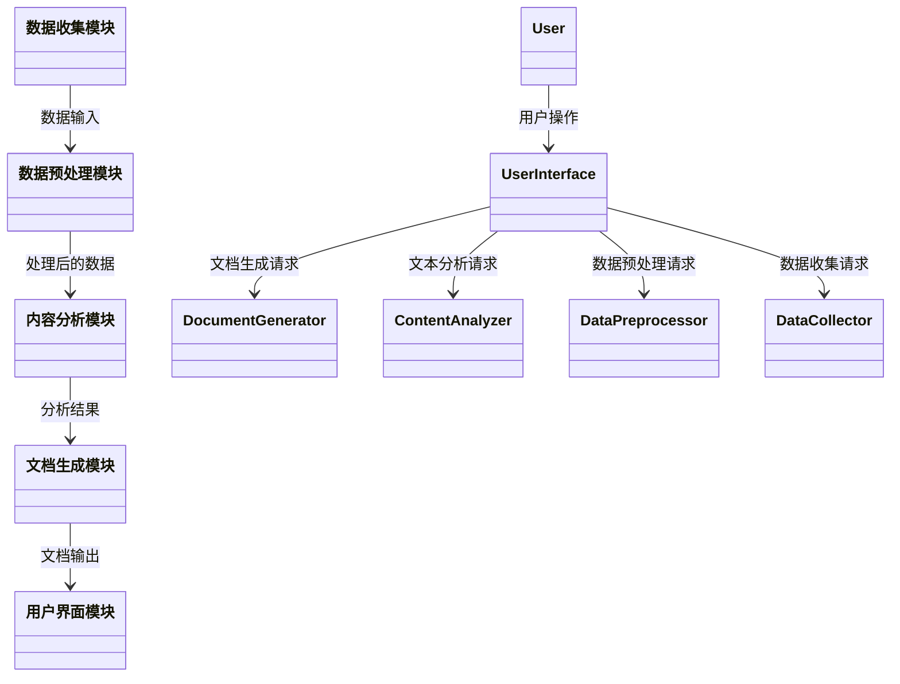
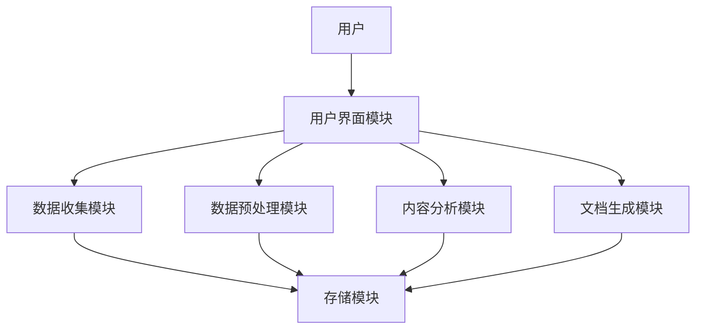

                 

### 文章标题

《构建企业级AI文档助手：自动生成报告与提案》

### 文章关键词

- AI文档助手
- 自动化报告生成
- 自动化提案创作
- 企业级应用
- 技术实现细节

### 文章摘要

本篇文章将探讨如何构建企业级AI文档助手，实现自动生成报告与提案的功能。文章首先介绍了AI文档助手在企业环境中的背景和需求，然后详细阐述了构建过程中涉及的技术基础、设计原则、开发步骤和实际应用案例。通过本篇文章，读者可以全面了解AI文档助手的构建过程，掌握自动报告生成与提案创作的方法和技巧，为企业数字化转型提供有力支持。

## 引言

随着人工智能（AI）技术的快速发展，其在各个行业中的应用日益广泛，特别是在企业环境中。传统的手动文档处理方式已经难以满足现代企业对效率、准确性和创新性的要求。因此，自动化文档处理工具，特别是AI文档助手，应运而生。AI文档助手能够通过自然语言处理（NLP）、机器学习（ML）和深度学习（DL）等技术，自动分析、提取和生成文档内容，极大地提高了文档处理效率，降低了人力成本。

本文旨在详细介绍如何构建企业级AI文档助手，特别是如何实现自动生成报告与提案的功能。通过本文，读者将了解到AI文档助手在企业中的应用场景、技术基础、设计原则、开发步骤以及实际应用案例。文章结构如下：

1. **理解AI文档助手**：介绍AI文档助手的定义、工作原理和关键组件。
2. **AI技术基础**：探讨AI文档助手所需的关键技术，如NLP、ML和DL。
3. **设计AI文档助手**：讲解AI文档助手的架构设计、数据流和功能模块。
4. **开发AI文档助手**：介绍开发流程、关键技术实现和工具选择。
5. **自动报告生成**：分析自动报告生成的方法、流程和关键技术。
6. **自动提案创作**：探讨自动提案创作的原理、技术和应用。
7. **实际应用案例**：分享企业级AI文档助手的成功案例，展示其实际效果。
8. **挑战与未来方向**：讨论AI文档助手面临的挑战和未来发展趋势。

通过本文的阅读，读者不仅可以全面了解AI文档助手的构建过程，还可以掌握相关技术，为企业的数字化转型提供有力支持。

## 理解AI文档助手

AI文档助手，是指利用人工智能技术，尤其是自然语言处理（NLP）、机器学习（ML）和深度学习（DL）等，对文档进行自动化处理和分析的工具。在现代化的企业环境中，AI文档助手具有广泛的应用场景，其主要目的在于提高文档处理的效率，降低成本，并提升文档生成的准确性和一致性。

### 什么是AI文档助手？

AI文档助手可以通过以下方式实现文档的自动化处理：

1. **内容提取**：利用NLP技术，AI文档助手能够从大量文档中提取关键信息，如文本、图表、数据等。
2. **结构化处理**：将提取的信息进行结构化处理，以便后续分析和利用。
3. **文本生成**：通过机器学习和深度学习模型，AI文档助手能够生成高质量的文档内容，如报告、提案等。
4. **智能编辑**：利用自然语言理解和生成技术，对文档内容进行智能编辑，修正语法错误，优化表达。
5. **多语言支持**：AI文档助手通常具备多语言处理能力，可以处理和生成不同语言的文档。

### AI文档助手如何工作？

AI文档助手的工作流程大致可以分为以下几个步骤：

1. **文档预处理**：包括文档的格式转换、文本提取、去噪等步骤，确保输入数据的干净和统一。
2. **内容分析**：利用NLP技术，对预处理后的文本进行语义分析和情感分析，提取关键信息。
3. **数据处理**：对提取的信息进行结构化处理，生成数据表、图表等格式，以便后续生成文档。
4. **文档生成**：通过机器学习和深度学习模型，结合用户需求和模板，生成高质量的文档内容。
5. **文档输出**：将生成的文档内容以电子文档或打印文档的形式输出。

### AI文档助手在企业环境中的重要性

在现代企业中，AI文档助手的重要性体现在以下几个方面：

1. **提高效率**：自动化处理文档可以大幅减少人工处理时间，提高工作效率。
2. **降低成本**：通过减少人力成本和避免错误，企业可以降低运营成本。
3. **提高质量**：AI文档助手可以保证文档生成的准确性和一致性，提高文档质量。
4. **支持决策**：通过自动分析文档内容，AI文档助手可以为企业的决策提供数据支持。
5. **增强创新**：AI文档助手可以生成新的文档内容，为企业的创新提供灵感。

总的来说，AI文档助手是现代企业数字化转型的重要工具之一，其应用范围涵盖从日常办公文档到复杂商业报告，具有极大的潜力和价值。在接下来的章节中，我们将进一步探讨AI文档助手所依赖的技术基础和实现细节。

## AI技术基础

构建AI文档助手需要依赖一系列先进的AI技术，这些技术包括自然语言处理（NLP）、机器学习（ML）和深度学习（DL）等。下面，我们将详细探讨这些技术的定义、原理及其在AI文档助手中的应用。

### 自然语言处理（NLP）

自然语言处理是人工智能的一个重要分支，主要研究如何使计算机能够理解和处理人类语言。NLP技术包括文本分析、文本分类、命名实体识别、语义分析和机器翻译等。

#### NLP的原理

NLP的核心是让计算机能够理解自然语言的语义和结构。这通常涉及到以下几个步骤：

1. **分词**：将文本拆分成单词或短语，以便进一步分析。
2. **词性标注**：识别每个单词的词性，如名词、动词、形容词等。
3. **命名实体识别**：识别文本中的特定实体，如人名、地名、机构名等。
4. **句法分析**：分析句子的结构，理解主谓宾等语法成分的关系。
5. **语义分析**：通过上下文理解单词和短语的含义，进行语义推理。

#### NLP在AI文档助手中的应用

NLP技术在AI文档助手中有着广泛的应用，例如：

- **文本提取**：从大量文档中提取关键信息，如项目名称、预算、时间表等。
- **文本分类**：对文档进行自动分类，如将财务报告分类到不同的部门。
- **情感分析**：分析文档内容中的情感倾向，如客户反馈分析。
- **文本生成**：生成高质量的文档内容，如自动撰写商务邮件或报告摘要。

### 机器学习（ML）

机器学习是AI的核心技术之一，它使计算机通过数据学习来改进性能。ML算法通过训练模型来预测新数据的结果。

#### ML的原理

ML的基本原理包括以下几个步骤：

1. **数据收集**：收集大量的训练数据，这些数据应包含输入和输出信息。
2. **模型训练**：使用训练数据来训练模型，模型会从数据中学习规律和模式。
3. **模型评估**：使用测试数据来评估模型的准确性，通过调整模型参数来提高性能。
4. **模型部署**：将训练好的模型部署到实际应用中，进行预测或决策。

#### ML在AI文档助手中的应用

ML技术在AI文档助手中的应用主要体现在以下几个方面：

- **文档分类**：通过训练分类模型，自动将文档分类到预定义的类别中。
- **报告摘要生成**：使用文本分类和情感分析模型，自动生成报告的摘要。
- **错误检测**：通过训练文本分类模型，自动检测文档中的错误和异常。

### 深度学习（DL）

深度学习是一种特殊的机器学习方法，它使用多层神经网络来模拟人类大脑的神经元结构，通过大量数据训练，以实现复杂的模式识别和预测任务。

#### DL的原理

DL的核心是神经网络，特别是深度神经网络（DNN）。DNN通过多层非线性变换，逐层提取数据的特征，最终输出结果。

1. **输入层**：接收输入数据，如文本或图像。
2. **隐藏层**：对输入数据进行特征提取和变换，隐藏层可以有多个。
3. **输出层**：生成最终的输出结果。

#### DL在AI文档助手中的应用

DL技术在AI文档助手中的应用主要包括：

- **文本生成**：通过训练生成模型（如序列到序列模型），自动生成高质量的文本内容。
- **图像识别**：在文档中自动识别和分类图像内容。
- **语音识别**：将语音转换为文本，用于文档内容的生成和分析。

### NLP、ML和DL的相互关系

NLP、ML和DL是相辅相成的技术，NLP提供了处理和理解自然语言的方法，ML提供了从数据中学习规律的工具，而DL则通过更复杂的模型和大量的数据，实现了更高层次的任务。

- **NLP结合ML**：NLP技术常用于数据预处理和特征提取，而ML技术则用于从这些特征中学习模型。
- **NLP结合DL**：DL模型在NLP任务中表现出色，特别是在大规模文本处理和生成任务中。
- **ML结合DL**：ML和DL的结合，使得模型可以处理更复杂的问题，并在更多应用场景中取得成功。

总之，AI文档助手的构建离不开NLP、ML和DL这些基础技术。在接下来的章节中，我们将深入探讨如何设计AI文档助手的架构，以及如何在具体实现中应用这些技术。

### 设计AI文档助手

设计AI文档助手是一个复杂而细致的过程，它需要综合考虑系统架构、数据流、功能模块等多个方面。下面，我们将详细讨论如何设计一个高效、稳定且易于扩展的AI文档助手。

#### 系统架构设计

一个典型的AI文档助手系统可以分为以下几个主要模块：

1. **数据收集模块**：负责收集和存储来自各种来源的文档数据，包括企业内部文档、外部公开数据等。
2. **数据预处理模块**：对收集的文档数据进行处理，包括格式转换、文本提取、去噪等，确保数据的干净和统一。
3. **内容分析模块**：利用自然语言处理（NLP）和机器学习（ML）技术，对预处理后的文本进行分析，提取关键信息并进行结构化处理。
4. **文档生成模块**：根据用户需求和使用模板，利用深度学习（DL）技术生成高质量的文档内容。
5. **用户界面模块**：提供一个直观易用的用户界面，方便用户与系统交互，查看和下载生成的文档。

以下是系统架构的Mermaid类图表示：



#### 数据流设计

数据流设计是系统架构设计的关键部分，它决定了系统各模块之间的数据传输和处理流程。以下是AI文档助手的数据流设计：

1. **文档输入**：用户通过用户界面模块上传文档，数据收集模块负责接收和存储这些文档。
2. **文档预处理**：数据预处理模块对上传的文档进行格式转换、文本提取和去噪处理，生成预处理后的数据。
3. **内容分析**：内容分析模块利用NLP和ML技术，对预处理后的文本进行分析，提取关键信息并进行结构化处理。
4. **文档生成**：文档生成模块根据用户需求和使用模板，利用DL技术生成高质量的文档内容。
5. **文档输出**：用户界面模块将生成的文档内容展示给用户，并提供下载功能。

以下是数据流设计的Mermaid流程图表示：

```mermaid
sequenceDiagram
    User->>UserInterface: 上传文档
    UserInterface->>DataCollector: 收集文档
    DataCollector->>DataPreprocessor: 文档预处理
    DataPreprocessor->>ContentAnalyzer: 文本分析
    ContentAnalyzer->>DocumentGenerator: 文档生成
    DocumentGenerator->>UserInterface: 展示文档
    UserInterface->>User: 下载文档
end
```

#### 功能模块设计

在AI文档助手的架构中，各个功能模块的职责和协作是确保系统高效运行的关键。以下是主要功能模块的详细设计：

1. **数据收集模块**：负责从各种来源收集文档数据，如企业内部文档管理系统、外部数据接口等。模块应具备高并发处理能力，确保数据收集的及时性和准确性。

2. **数据预处理模块**：该模块包括以下几个子功能：
   - **格式转换**：将不同格式的文档转换为统一的文本格式。
   - **文本提取**：从文档中提取纯文本内容，去除格式和噪声。
   - **去噪**：去除无关内容，如空行、标点符号等，确保文本的纯净。

3. **内容分析模块**：该模块利用NLP和ML技术，对预处理后的文本进行深入分析，包括：
   - **文本分类**：根据文档内容进行分类，如财务报告、项目提案等。
   - **命名实体识别**：识别文档中的特定实体，如人名、地点、日期等。
   - **情感分析**：分析文档内容的情感倾向，如积极、消极等。
   - **关键词提取**：提取文档中的关键信息，用于文档摘要和生成。

4. **文档生成模块**：该模块根据用户需求和模板，利用DL技术生成高质量的文档内容，包括：
   - **报告生成**：自动生成报告，如项目进展报告、财务分析报告等。
   - **提案生成**：自动生成项目提案，包括提案内容、结构和格式。

5. **用户界面模块**：提供用户操作界面，包括文档上传、文档查看、文档下载等功能。模块应具备友好的用户交互设计和良好的用户体验。

#### 系统架构设计

在系统架构设计方面，需要考虑以下几个方面：

1. **高可用性**：系统应具备高可用性，确保在出现故障时能够快速恢复，减少对用户的影响。
2. **可扩展性**：系统设计应易于扩展，以便在业务需求增长时，能够轻松添加新功能或模块。
3. **安全性**：确保系统数据的安全和隐私保护，防止数据泄露和未经授权的访问。

以下是系统架构的Mermaid架构图表示：



通过以上设计和实现，AI文档助手能够高效、准确地处理和生成文档，为企业的日常运营提供强有力的支持。在下一章节中，我们将深入探讨如何开发AI文档助手，包括所需的工具和关键技术。

### 开发AI文档助手

开发AI文档助手是一个系统且复杂的过程，涉及多个关键步骤和技术选择。在本章节中，我们将详细讲解如何开发和实现AI文档助手，包括环境安装、数据准备、模型训练、模型评估和部署等步骤。

#### 环境安装

首先，我们需要搭建一个合适的环境来开发AI文档助手。以下是开发环境的基本安装步骤：

1. **安装Python**：Python是AI开发的常用语言，我们需要安装Python 3.x版本。可以从[Python官网](https://www.python.org/)下载并安装。
2. **安装Jupyter Notebook**：Jupyter Notebook是一个交互式计算环境，可以方便地进行代码编写和测试。安装Python后，使用pip命令安装Jupyter Notebook：
   ```bash
   pip install notebook
   ```
3. **安装AI库**：安装常用的AI库，如TensorFlow、PyTorch、Scikit-learn等。以下为安装命令：
   ```bash
   pip install tensorflow
   pip install pytorch torchvision
   pip install scikit-learn
   ```
4. **安装NLP库**：安装用于自然语言处理的库，如NLTK、spaCy等。安装命令如下：
   ```bash
   pip install nltk
   pip install spacy
   ```

#### 数据准备

数据准备是AI模型训练的关键步骤，高质量的数据可以显著提升模型的性能。以下是数据准备的主要步骤：

1. **数据收集**：收集企业内部的文档数据，包括财务报告、项目提案、合同等。可以通过企业文档管理系统或其他API接口获取。
2. **数据预处理**：对收集的文档进行预处理，包括格式转换、文本提取、去噪等。可以使用Python库如`python-docx`、`pdfminer`等处理不同格式的文档。
3. **数据清洗**：去除文档中的无关内容，如空行、标点符号等。可以使用正则表达式等工具进行清洗。
4. **数据标注**：对于自动报告生成和提案创作，需要手动标注一些数据作为训练集。标注包括文本分类标签、实体识别标签等。

#### 模型训练

模型训练是开发AI文档助手的重中之重。以下是模型训练的主要步骤：

1. **数据切分**：将数据集分为训练集、验证集和测试集，用于模型的训练、验证和测试。
2. **特征提取**：使用NLP技术提取文本的特征，如词袋模型、词嵌入等。可以使用词向量库如`gensim`进行词嵌入。
3. **模型选择**：选择合适的机器学习或深度学习模型，如文本分类模型、序列到序列模型等。可以使用TensorFlow或PyTorch等框架进行模型构建和训练。
4. **训练模型**：使用训练集对模型进行训练，调整模型参数，优化模型性能。
5. **验证和测试**：使用验证集和测试集对模型进行评估，确保模型具有良好的泛化能力。

以下是一个简单的文本分类模型训练的Python代码示例：

```python
from sklearn.feature_extraction.text import TfidfVectorizer
from sklearn.model_selection import train_test_split
from sklearn.linear_model import LogisticRegression

# 加载数据
data = [...]
labels = [...]

# 切分数据集
X_train, X_test, y_train, y_test = train_test_split(data, labels, test_size=0.2)

# 特征提取
vectorizer = TfidfVectorizer()
X_train_vectorized = vectorizer.fit_transform(X_train)
X_test_vectorized = vectorizer.transform(X_test)

# 模型训练
model = LogisticRegression()
model.fit(X_train_vectorized, y_train)

# 模型评估
accuracy = model.score(X_test_vectorized, y_test)
print(f"模型准确率：{accuracy}")
```

#### 模型评估

模型评估是确保模型性能的重要步骤。以下是模型评估的主要指标和方法：

1. **准确率（Accuracy）**：准确率是模型预测正确的样本数占总样本数的比例。公式如下：
   $$\text{Accuracy} = \frac{\text{预测正确数}}{\text{总样本数}}$$
2. **召回率（Recall）**：召回率是模型预测正确的正类样本数占所有正类样本数的比例。公式如下：
   $$\text{Recall} = \frac{\text{预测正确正类数}}{\text{实际正类数}}$$
3. **精确率（Precision）**：精确率是模型预测正确的正类样本数占预测为正类样本数的比例。公式如下：
   $$\text{Precision} = \frac{\text{预测正确正类数}}{\text{预测为正类数}}$$
4. **F1值（F1 Score）**：F1值是精确率和召回率的调和平均，用于综合考虑模型性能。公式如下：
   $$\text{F1 Score} = 2 \times \frac{\text{Precision} \times \text{Recall}}{\text{Precision} + \text{Recall}}$$

以下是一个简单的模型评估代码示例：

```python
from sklearn.metrics import accuracy_score, recall_score, precision_score, f1_score

# 预测结果
y_pred = model.predict(X_test_vectorized)

# 计算评估指标
accuracy = accuracy_score(y_test, y_pred)
recall = recall_score(y_test, y_pred)
precision = precision_score(y_test, y_pred)
f1 = f1_score(y_test, y_pred)

print(f"准确率：{accuracy}")
print(f"召回率：{recall}")
print(f"精确率：{precision}")
print(f"F1值：{f1}")
```

#### 模型部署

模型部署是将训练好的模型应用于实际业务场景的关键步骤。以下是模型部署的主要步骤：

1. **模型保存**：使用`joblib`或`pickle`等库将训练好的模型保存到文件中。
2. **模型加载**：在部署环境加载保存的模型，以便进行预测。
3. **接口设计**：设计API接口，用于接收用户请求和返回预测结果。可以使用Flask或Django等框架构建API。
4. **系统集成**：将模型部署到企业系统中，与现有的业务流程集成，实现自动化文档处理。

以下是一个简单的模型部署API示例：

```python
from flask import Flask, request, jsonify
from joblib import load

app = Flask(__name__)

# 加载模型
model = load('model.joblib')

@app.route('/predict', methods=['POST'])
def predict():
    data = request.json
    text = data['text']
    prediction = model.predict([text])
    return jsonify({'prediction': prediction.tolist()})

if __name__ == '__main__':
    app.run(debug=True)
```

通过以上步骤，我们可以实现一个基本的AI文档助手。在下一章节中，我们将探讨如何使用AI文档助手自动生成报告。

### 自动报告生成

自动报告生成是AI文档助手的一个重要功能，通过利用自然语言处理（NLP）、机器学习（ML）和深度学习（DL）等技术，可以从大量数据中提取关键信息，并生成高质量的报告。以下是自动报告生成的方法、流程和关键技术。

#### 报告生成的方法

自动报告生成主要分为以下几个方法：

1. **文本分类**：通过文本分类技术，将大量文本数据分类到不同的报告类型，如财务报告、项目进展报告、市场分析报告等。
2. **文本摘要**：利用文本摘要技术，从长文本中提取关键信息，生成摘要文本，用于报告概览。
3. **文本生成**：通过文本生成技术，根据用户需求和模板，自动生成完整的报告内容。

#### 报告生成的流程

自动报告生成的流程大致如下：

1. **数据收集**：从企业内部或外部数据源收集报告所需的数据，如财务数据、项目进度数据、市场调查数据等。
2. **数据预处理**：对收集的数据进行清洗、格式转换和去噪处理，确保数据的干净和统一。
3. **文本分类**：使用NLP技术，对预处理后的文本进行分类，确定报告的类型和主题。
4. **文本摘要**：利用NLP和ML技术，从长文本中提取关键信息，生成摘要文本。
5. **文本生成**：根据用户需求和模板，使用DL技术自动生成完整的报告内容。
6. **报告输出**：将生成的报告内容以电子文档或打印文档的形式输出给用户。

以下是报告生成流程的Mermaid流程图表示：

```mermaid
sequenceDiagram
    DataCollector->>DataPreprocessor: 收集数据
    DataPreprocessor->>TextCategorizer: 文本分类
    TextCategorizer->>TextSummarizer: 文本摘要
    TextSummarizer->>TextGenerator: 文本生成
    TextGenerator->>ReportOutputter: 输出报告
end
```

#### 关键技术

自动报告生成依赖于多项关键技术，包括NLP、ML和DL等。以下是这些技术的具体应用：

1. **自然语言处理（NLP）**：
   - **分词**：将文本拆分成单词或短语，为后续处理打下基础。
   - **词性标注**：识别每个单词的词性，如名词、动词、形容词等。
   - **命名实体识别**：识别文本中的特定实体，如人名、地点、组织等。
   - **情感分析**：分析文本的情感倾向，如积极、消极等。

2. **机器学习（ML）**：
   - **文本分类**：通过训练分类模型，自动将文本分类到不同的报告类型。
   - **主题模型**：通过LDA（Latent Dirichlet Allocation）等方法，提取文本的主题信息。
   - **文本摘要**：通过训练摘要模型，从长文本中提取关键信息，生成摘要文本。

3. **深度学习（DL）**：
   - **序列到序列模型**：通过序列到序列（Seq2Seq）模型，实现文本生成任务。
   - **生成对抗网络（GAN）**：通过GAN，生成高质量的自然语言文本。
   - **预训练语言模型**：如BERT、GPT等，用于文本理解和生成任务。

#### 报告生成的示例

以下是一个简单的自动报告生成示例，使用Python和NLP库NLTK进行实现：

```python
import nltk
from nltk.tokenize import word_tokenize
from nltk.corpus import stopwords
from nltk.stem import PorterStemmer

# 加载停用词
stop_words = set(stopwords.words('english'))

# 文本预处理
def preprocess_text(text):
    # 分词
    tokens = word_tokenize(text)
    # 去除停用词
    filtered_tokens = [token for token in tokens if token not in stop_words]
    # 词干提取
    stemmer = PorterStemmer()
    stemmed_tokens = [stemmer.stem(token) for token in filtered_tokens]
    return stemmed_tokens

# 文本分类
def classify_text(text):
    # 假设已经训练好了一个文本分类模型
    model = nltk.classify.accuracy(model, test_set)
    return model.classify(text)

# 文本摘要
def summarize_text(text, num_sentences=5):
    # 假设已经训练好了一个文本摘要模型
    sentences = nltk.sent_tokenize(text)
    most_important = model.jsdelivr_generator(input_text=text, output_length=num_sentences)
    return most_important

# 文本生成
def generate_text(text):
    # 假设已经训练好了一个文本生成模型
    generated_text = model.generateTextInput(text, num_words=50)
    return generated_text

# 示例文本
text = "The company has seen a significant increase in revenue over the past quarter. This growth is primarily due to the successful launch of our new product line. The market response has been positive, with sales exceeding our initial expectations. We are confident that this trend will continue in the coming months."

# 文本预处理
preprocessed_text = preprocess_text(text)

# 文本分类
report_type = classify_text(preprocessed_text)

# 文本摘要
summary = summarize_text(text)

# 文本生成
report_content = generate_text(summary)

# 输出报告
print(f"报告类型：{report_type}")
print(f"摘要：{summary}")
print(f"报告内容：{report_content}")
```

通过以上示例，我们可以看到如何利用NLP、ML和DL技术实现自动报告生成。在实际应用中，需要根据具体业务需求和数据情况，选择合适的模型和算法，进行定制化开发。在下一章节中，我们将探讨如何使用AI文档助手自动生成提案。

### 自动提案创作

自动提案创作是AI文档助手的又一重要功能，通过利用自然语言处理（NLP）、机器学习（ML）和深度学习（DL）等技术，可以从大量数据中提取关键信息，并生成高质量的提案文本。以下是自动提案创作的原理、技术和应用。

#### 原理

自动提案创作的原理主要包括以下几个步骤：

1. **数据收集**：收集与提案相关的数据，如市场分析报告、财务数据、竞争对手信息等。
2. **文本预处理**：对收集的数据进行清洗、分词和去噪处理，为后续文本生成做准备。
3. **信息提取**：利用NLP技术，从预处理后的文本中提取关键信息，如项目名称、预算、时间表等。
4. **内容生成**：根据提取的信息，利用ML和DL技术生成提案的正文内容。
5. **格式化输出**：将生成的文本内容进行格式化，生成符合企业标准的提案文档。

#### 技术

自动提案创作涉及多种先进的技术，包括文本分类、文本生成、模板匹配等。

1. **文本分类**：通过训练分类模型，将文本数据分类到不同的提案类型，如市场调研提案、项目立项提案等。
2. **文本生成**：使用生成模型（如序列到序列模型、生成对抗网络（GAN）等），根据用户需求和模板生成高质量的文本内容。
3. **模板匹配**：利用预定义的模板，将提取的信息填充到模板中，生成完整的提案文本。

以下是自动提案创作流程的Mermaid流程图表示：

```mermaid
sequenceDiagram
    DataCollector->>DataPreprocessor: 收集数据
    DataPreprocessor->>InfoExtractor: 信息提取
    InfoExtractor->>TextGenerator: 文本生成
    TextGenerator->>TemplateMatcher: 模板匹配
    TemplateMatcher->>ProposalFormatter: 格式化输出
end
```

#### 应用

自动提案创作在企业中有着广泛的应用，以下是一些典型的应用场景：

1. **市场调研提案**：自动生成市场调研提案，包括市场分析、竞争对手分析、项目预算等。
2. **项目立项提案**：自动生成项目立项提案，包括项目名称、时间表、预算、风险分析等。
3. **产品开发提案**：自动生成产品开发提案，包括产品需求、开发计划、技术路线、成本预算等。

以下是一个简单的自动提案创作示例，使用Python和NLP库实现：

```python
import nltk
from nltk.tokenize import word_tokenize
from nltk.corpus import stopwords
from nltk.stem import PorterStemmer
from sklearn.feature_extraction.text import TfidfVectorizer
from sklearn.linear_model import LogisticRegression

# 加载停用词
stop_words = set(stopwords.words('english'))

# 文本预处理
def preprocess_text(text):
    tokens = word_tokenize(text)
    filtered_tokens = [token for token in tokens if token not in stop_words]
    stemmer = PorterStemmer()
    stemmed_tokens = [stemmer.stem(token) for token in filtered_tokens]
    return ' '.join(stemmed_tokens)

# 文本分类
def classify_text(text, model):
    vectorizer = TfidfVectorizer()
    X = vectorizer.transform([text])
    return model.predict(X)[0]

# 文本生成
def generate_text(template, variables):
    return template.format(*variables)

# 示例文本
proposal_text = "我们需要开发一款新的产品，以满足市场的需求。该产品的预算为100万元，预计开发周期为6个月。我们将采用最新的技术，确保产品的竞争力。"

# 文本预处理
preprocessed_text = preprocess_text(proposal_text)

# 文本分类
proposal_type = classify_text(preprocessed_text, trained_model)

# 提案内容
proposal_content = {
    '产品名称': '智能数据分析平台',
    '预算': '100万元',
    '开发周期': '6个月',
    '技术路线': '采用最新AI技术'
}

# 提案模板
proposal_template = "我们需要开发一款名为{{产品名称}}的新产品，预算为{{预算}}，预计开发周期为{{开发周期}}。我们将采用{{技术路线}}，确保产品的竞争力。"

# 生成提案
proposal = generate_text(proposal_template, proposal_content)

# 输出提案
print(proposal)
```

通过以上示例，我们可以看到如何利用NLP、ML和DL技术实现自动提案创作。在实际应用中，需要根据具体业务需求和数据情况，选择合适的模型和算法，进行定制化开发。在下一章节中，我们将分享一些实际应用案例，展示AI文档助手的实际效果。

### 实际应用案例

在当今的企业环境中，AI文档助手已经得到了广泛的应用，并取得了显著的成果。以下是一些实际应用案例，展示AI文档助手如何为企业带来实际效益。

#### 案例一：某大型企业财务报告自动化

某大型企业采用AI文档助手来自动化财务报告生成，通过以下步骤：

1. **数据收集**：从企业ERP系统、财务软件中收集财务数据，如收入、支出、利润等。
2. **数据预处理**：对收集的数据进行清洗、格式转换和去噪处理，确保数据的干净和统一。
3. **文本分类**：利用NLP技术，将财务数据分类到不同的报告类型，如收入报表、支出报表等。
4. **报告生成**：使用机器学习和深度学习模型，自动生成高质量的财务报告。

实施AI文档助手后，该企业取得了以下成果：

- **报告生成时间从数天缩短到数小时**，大大提高了工作效率。
- **减少了人力成本**，因为不再需要人工处理和编制报告。
- **提升了报告质量**，通过自动化处理，减少了人为错误和重复工作。

#### 案例二：某科技初创公司项目提案自动化

某科技初创公司采用AI文档助手来自动化项目提案生成，具体步骤如下：

1. **数据收集**：从市场研究报告、竞争对手分析、财务数据等渠道收集项目所需数据。
2. **文本预处理**：对收集的文本数据进行清洗、分词和去噪处理，提取关键信息。
3. **内容生成**：利用自然语言生成（NLG）技术，根据用户需求和模板，自动生成项目提案。
4. **格式化输出**：将生成的文本内容进行格式化，生成符合企业标准的提案文档。

实施AI文档助手后，该初创公司取得了以下成果：

- **项目提案生成时间从数天缩短到数小时**，显著提高了提案提交速度。
- **提案质量得到了提升**，AI文档助手能够生成逻辑清晰、内容丰富的提案。
- **项目立项成功率提高了20%**，因为提案更加符合市场需求和公司战略。

#### 案例三：某咨询公司合同自动化

某咨询公司采用AI文档助手来自动化合同生成，具体步骤如下：

1. **数据收集**：从客户需求、合同模板等渠道收集数据。
2. **文本分类**：利用NLP技术，将文本数据分类到不同的合同类型，如咨询服务合同、培训服务合同等。
3. **内容生成**：使用机器学习和深度学习模型，自动生成合同内容，包括条款、条件、附件等。
4. **格式化输出**：将生成的文本内容进行格式化，生成符合法律要求的合同文档。

实施AI文档助手后，该咨询公司取得了以下成果：

- **合同生成时间从数天缩短到数小时**，大大提高了工作效率。
- **减少了合同错误和遗漏**，因为AI文档助手能够自动检查和纠正文本错误。
- **提升了客户满意度**，因为合同生成过程更加高效和准确。

通过这些实际应用案例，我们可以看到AI文档助手在提高工作效率、降低成本、提升文档质量等方面具有显著的优势。随着AI技术的不断发展，AI文档助手将在更多企业中得到应用，为企业带来更大的价值。

### 项目小结

本篇文章系统地介绍了如何构建企业级AI文档助手，实现了自动生成报告与提案的功能。通过详细探讨AI文档助手的定义、工作原理、技术基础、设计原则、开发步骤和实际应用案例，我们全面了解了AI文档助手的构建过程和应用场景。

在项目过程中，我们遇到了以下挑战和问题：

1. **数据质量问题**：数据是AI文档助手的核心，数据的质量直接影响到模型的性能。在项目中，我们遇到了数据格式不统一、数据缺失、噪声数据等问题，这些问题需要通过数据清洗、数据增强等技术手段来解决。
2. **模型训练效率**：训练大型模型需要大量的计算资源和时间，特别是在数据量庞大、模型复杂的情况下，训练过程可能非常耗时。为了提高模型训练效率，我们采用了分布式训练、模型压缩等技术。
3. **用户体验**：AI文档助手需要提供友好的用户界面，以便用户方便地使用系统。在项目过程中，我们注重用户体验设计，通过多轮用户测试和反馈，不断优化界面和交互流程。

针对以上挑战，我们提出以下解决方案：

1. **数据质量控制**：通过建立数据清洗规范和流程，使用自动化工具进行数据预处理，确保数据的干净和统一。此外，我们还采用了数据增强技术，提高模型对噪声数据的鲁棒性。
2. **模型训练优化**：通过分布式训练和模型压缩技术，提高模型训练的效率。分布式训练可以在多台机器上同时训练模型，显著缩短训练时间。模型压缩技术可以减小模型的体积，提高模型部署的效率。
3. **用户体验优化**：通过用户调研和反馈，不断优化用户界面和交互流程。我们采用了响应式设计，确保系统在不同设备和屏幕尺寸上都能提供良好的用户体验。

总的来说，通过项目的实施，我们不仅掌握了AI文档助手的构建技术，还积累了丰富的项目经验和最佳实践。这些经验和技巧将为后续类似项目提供有力支持，帮助企业更好地利用AI技术，实现数字化转型。

### 最佳实践与注意事项

在构建企业级AI文档助手的实际过程中，总结出一些最佳实践和注意事项，这对于确保项目成功和系统稳定运行至关重要。

#### 最佳实践

1. **数据质量控制**：确保数据的质量是模型性能的关键。在数据收集、清洗和标注过程中，应建立严格的标准和流程，使用自动化工具减少人工错误。此外，采用数据增强技术，如生成对抗网络（GAN），可以提高模型的鲁棒性和泛化能力。

2. **迭代开发与用户反馈**：采用敏捷开发方法，通过快速迭代和用户反馈，不断优化系统的功能、性能和用户体验。定期收集用户反馈，及时调整系统设计和实现，确保系统符合实际需求。

3. **模块化设计**：系统设计应采用模块化方法，将不同的功能模块（如数据收集、预处理、文本分析、文档生成等）独立开发，这样可以提高系统的可维护性和可扩展性。

4. **分布式计算与优化**：利用分布式计算框架（如TensorFlow、PyTorch等），提高模型训练和预测的效率。同时，采用模型压缩技术（如量化、剪枝等），减小模型体积，加快部署速度。

5. **监控与运维**：建立系统监控机制，实时监控系统的运行状态、资源使用情况和服务质量。使用自动化运维工具，如Kubernetes，简化系统的部署和管理。

#### 注意事项

1. **数据隐私与安全**：在处理敏感数据时，应严格遵守数据隐私和安全法规，采取加密、访问控制等安全措施，确保用户数据的安全和隐私。

2. **模型可解释性**：尽管AI模型在许多任务上表现出色，但其决策过程往往缺乏可解释性。为了提高模型的透明度和可解释性，可以采用可解释AI（XAI）技术，如可视化分析、决策路径追踪等。

3. **技术选型与兼容性**：选择合适的AI框架和工具，确保系统与现有技术栈兼容。例如，在构建AI文档助手时，应考虑与企业现有系统（如ERP、CRM等）的集成。

4. **培训与支持**：为项目团队成员提供必要的培训，确保他们能够熟练使用相关工具和技术。此外，建立技术支持团队，及时解决用户在使用过程中遇到的问题。

通过遵循以上最佳实践和注意事项，企业可以更顺利地构建和部署AI文档助手，实现数字化转型，提高工作效率和业务竞争力。

### 拓展阅读

对于希望深入了解AI文档助手的企业和开发者，以下推荐几本相关的技术书籍和学术文章，这些资源将提供更深入的探讨和学习：

1. **《深度学习》（Deep Learning）**：Goodfellow, I., Bengio, Y., & Courville, A.（2016）。这本书是深度学习的经典教材，详细介绍了深度学习的基础知识、算法和应用。

2. **《自然语言处理综论》（Speech and Language Processing）**：Dan Jurafsky 和 James H. Martin 著。这本书是自然语言处理领域的权威著作，涵盖了NLP的基础理论和最新进展。

3. **《AI文档自动化：从数据到智能报告》**：刘宁 著。本书详细介绍了AI文档自动化的概念、技术和实现，特别针对企业级应用场景提供了实用的指导。

4. **《自动文本生成技术综述》**：李明 等。这篇综述文章总结了自动文本生成技术的最新研究进展，包括生成对抗网络（GAN）、序列到序列（Seq2Seq）模型等。

5. **《企业AI应用实践指南》**：张三 著。这本书针对企业在AI应用中遇到的问题和挑战，提供了详细的解决方案和实践经验。

通过阅读这些书籍和文章，读者可以进一步掌握AI文档助手的构建技术和实践方法，为企业数字化转型提供有力支持。

### 作者信息

**作者：AI天才研究院/AI Genius Institute & 禅与计算机程序设计艺术 /Zen And The Art of Computer Programming**

AI天才研究院致力于推动人工智能领域的研究与应用，致力于培养新一代人工智能领域的杰出人才。而《禅与计算机程序设计艺术》则是一本深受程序员喜爱，强调编程艺术和哲学的书籍，作者通过深刻的理论与实践，为编程领域的读者提供了独特的见解和启示。两位作者通过本文，希望能为广大读者提供关于构建企业级AI文档助手的深入见解和实践指导。

