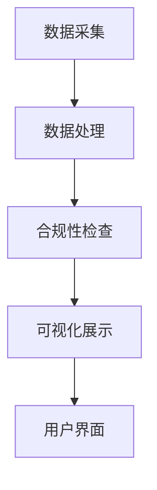
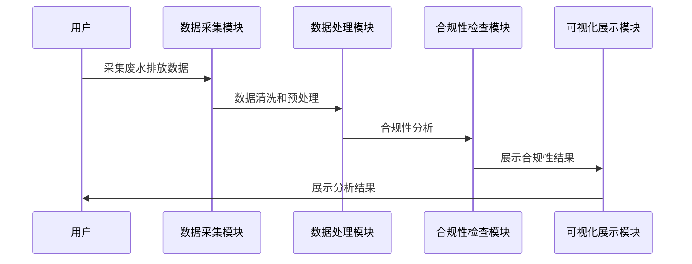
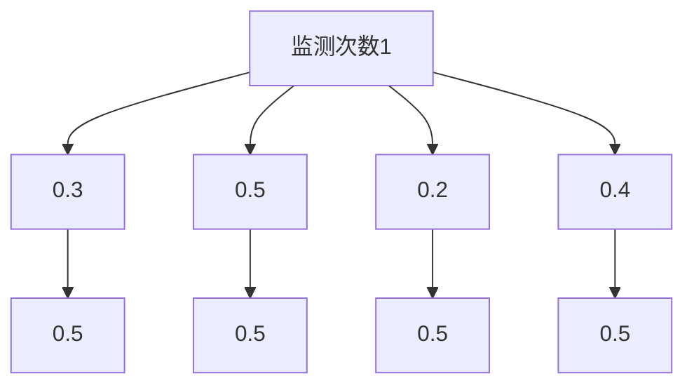
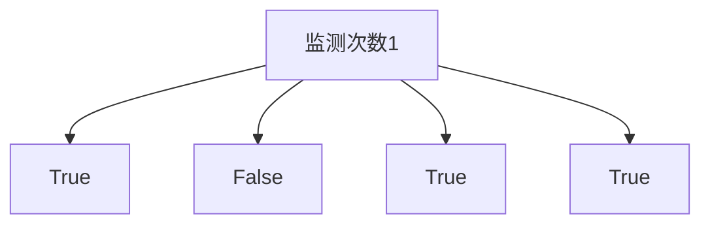

                 

### 1. 背景介绍

#### 问题背景

随着全球环保意识的增强和可持续发展理念的推广，企业级AI环境监测助手的应用越来越广泛。AI技术以其高效、精准、智能化的特点，为企业提供了全新的环境监测手段，帮助企业更好地遵守相关法规，实现环保目标。然而，在实际应用过程中，企业面临着诸多挑战，如数据质量、合规性、可持续发展等。

#### 问题描述

本书旨在构建一个企业级AI环境监测助手，以帮助企业实时监测环境变化，确保合规性，并实现可持续发展。具体问题描述如下：

1. **合规性**：如何确保AI环境监测助手的算法和数据处理过程符合国家及地方的相关法律法规要求？
2. **数据质量**：如何保障环境监测数据的准确性和可靠性？
3. **可持续发展**：如何在实现环境监测的同时，降低对资源的使用，实现环境保护和经济发展双赢？

#### 问题解决

为了解决上述问题，本书提出了以下解决方案：

1. **法规遵循**：通过深入研究相关法律法规，设计符合要求的算法和数据流程，确保合规性。
2. **数据质量管理**：采用先进的数据采集和处理技术，确保数据的准确性和可靠性。
3. **可持续发展策略**：引入节能高效的技术方案，降低环境监测对资源的需求，实现可持续发展。

#### 边界与外延

1. **边界**：本书主要关注企业级AI环境监测助手的构建，包括合规性、数据质量和可持续发展等方面。
2. **外延**：本书的研究成果可扩展到其他需要合规与可持续发展领域的AI应用，如工业制造、智慧城市建设等。

### 2. 核心概念与联系

#### 核心概念

在构建企业级AI环境监测助手的过程中，我们需要明确几个核心概念：

1. **AI环境监测助手**：一种基于人工智能技术的系统，用于实时监测企业环境，并提供合规性建议。
2. **合规性**：指AI环境监测助手在算法和数据处理过程中遵循的法律法规要求。
3. **可持续发展**：在实现环境监测的同时，考虑资源的有效利用和环境保护。

#### 概念属性特征对比表格

| 概念         | 属性特征                                                     |
|--------------|------------------------------------------------------------|
| AI环境监测助手 | 使用AI技术进行环境监测，提供合规性建议                         |
| 合规性       | 遵循法律法规的要求，确保数据处理合法合规                         |
| 可持续性     | 考虑环境、社会和经济效益的平衡，实现资源的可持续利用           |

#### ER实体关系图架构

```mermaid
erDiagram
  AI环境监测助手 ||--|{ 环境数据 }|--|| 数据处理模块
  数据处理模块 ||--|{ 合规性报告 }|--|| 合规性检查模块
  合规性检查模块 ||--|{ 可视化展示 }|--|| 可视化展示模块
  可视化展示模块 ||--|{ 用户界面 }|--|| 用户操作模块
```

### 3. 算法原理讲解

#### 算法原理

企业级AI环境监测助手的算法原理主要包括数据采集、数据处理、合规性检查和可视化展示四个核心步骤。

1. **数据采集**：利用各种传感器和监测设备，实时收集企业环境数据，如空气质量、水质、噪音等。
2. **数据处理**：对采集到的原始数据进行预处理，包括数据清洗、去噪、归一化等，以提高数据质量。
3. **合规性检查**：根据国家及地方相关法律法规，对处理后的数据进行合规性分析，判断是否符合法规要求。
4. **可视化展示**：将合规性分析结果以图表、报表等形式展示给用户，帮助用户直观了解环境状况和合规性。

#### 算法mermaid流程图



#### 数学模型和公式

在合规性检查过程中，我们可以使用以下数学模型和公式：

$$
合规性评分 = f(监测数据, 法规参数)
$$

其中，$f$ 为合规性评分函数，$监测数据$ 为环境监测数据，$法规参数$ 为相关法律法规的参数。

#### 详细讲解与举例说明

以某化工厂的环境监测为例，该工厂需要监测废水排放的pH值、COD（化学需氧量）和氨氮等指标。数据采集模块会实时获取这些数据，并将其传输给数据处理模块。

数据处理模块对原始数据进行清洗和去噪，然后进行归一化处理，以确保数据的一致性和可比性。

接下来，合规性检查模块根据《水污染防治法》等相关法规，对处理后的废水数据进行合规性评分。如果某次监测的数据评分低于法规规定的最低标准，则系统会发出警报，提示工厂采取整改措施。

最后，可视化展示模块将合规性评分结果以图表形式展示给用户，帮助用户直观了解废水排放的合规情况。例如，可以展示一个pH值的折线图，标注出每次监测的结果，以及对应的法规标准线。

### 4. 系统分析与架构设计方案

#### 问题场景介绍

假设一家大型制造企业需要实时监测其生产过程中的废水排放，确保其符合国家及地方的相关环保法规，同时实现资源的可持续利用。

#### 项目介绍

项目名称：企业级AI环境监测助手

项目目标：构建一个基于人工智能技术的环境监测系统，实时监测废水排放，确保合规性，并实现可持续发展。

项目背景：随着环保法规的日益严格，企业需要提高环保管理水平，降低环保成本，实现可持续发展。

#### 系统功能设计

系统功能设计主要包括以下模块：

1. **数据采集模块**：负责实时收集废水排放的各项指标数据。
2. **数据处理模块**：对采集到的数据进行预处理，包括数据清洗、去噪和归一化等。
3. **合规性检查模块**：根据相关法规，对处理后的数据进行分析，判断是否符合合规要求。
4. **可视化展示模块**：将合规性分析结果以图表、报表等形式展示给用户。

#### 系统架构设计

系统架构设计包括以下层次：

1. **数据层**：包括传感器、数据库等，用于存储和管理环境监测数据。
2. **处理层**：包括数据处理模块、合规性检查模块等，用于对数据进行处理和分析。
3. **展示层**：包括可视化展示模块、用户界面等，用于向用户展示分析结果。

#### 系统接口设计

系统接口设计主要包括以下接口：

1. **数据采集接口**：用于接收传感器数据。
2. **数据处理接口**：用于处理和清洗采集到的数据。
3. **合规性检查接口**：用于分析处理后的数据，判断是否符合合规要求。
4. **可视化展示接口**：用于将合规性分析结果展示给用户。

#### 系统交互mermaid序列图



### 5. 项目实战

#### 环境安装

1. **安装Python环境**：在服务器上安装Python环境，版本建议为3.8以上。
2. **安装相关库**：使用pip命令安装所需库，如numpy、pandas、scikit-learn、matplotlib等。

```bash
pip install numpy pandas scikit-learn matplotlib
```

#### 系统核心实现

以下是系统核心实现的Python代码：

```python
import numpy as np
import pandas as pd
from sklearn.preprocessing import MinMaxScaler
from sklearn.metrics import accuracy_score

# 数据采集模块
def data_collection():
    # 假设使用传感器采集到废水排放数据
    data = pd.read_csv('废水排放数据.csv')
    return data

# 数据处理模块
def data_preprocessing(data):
    # 数据清洗和预处理
    data.dropna(inplace=True)
    data['pH'] = data['pH'].map({'正常': 0, '偏低': 1, '偏高': 2})
    data['COD'] = data['COD'].map({'正常': 0, '偏高': 1})
    data['氨氮'] = data['氨氮'].map({'正常': 0, '偏高': 1})
    
    # 数据归一化
    scaler = MinMaxScaler()
    data[['pH', 'COD', '氨氮']] = scaler.fit_transform(data[['pH', 'COD', '氨氮']])
    
    return data

# 合规性检查模块
def compliance_check(data):
    # 假设合规性评分标准为pH值小于0.5且COD值小于0.5
    compliance_score = (data['pH'] < 0.5) & (data['COD'] < 0.5)
    return compliance_score

# 可视化展示模块
def visualization(data, compliance_score):
    import matplotlib.pyplot as plt
    
    # 绘制pH值折线图
    plt.plot(data['pH'])
    plt.plot([0.5] * len(data), label='法规标准')
    plt.xlabel('监测次数')
    plt.ylabel('pH值')
    plt.legend()
    plt.show()

    # 绘制COD值折线图
    plt.plot(data['COD'])
    plt.plot([0.5] * len(data), label='法规标准')
    plt.xlabel('监测次数')
    plt.ylabel('COD值')
    plt.legend()
    plt.show()

    # 绘制合规性评分结果柱状图
    plt.bar(data.index, compliance_score)
    plt.xlabel('监测次数')
    plt.ylabel('合规性评分')
    plt.show()

# 主函数
def main():
    data = data_collection()
    data = data_preprocessing(data)
    compliance_score = compliance_check(data)
    visualization(data, compliance_score)

if __name__ == '__main__':
    main()
```

#### 代码应用解读与分析

1. **数据采集模块**：通过读取CSV文件的方式采集废水排放数据。
2. **数据处理模块**：对数据进行清洗、去噪和归一化处理，提高数据质量。
3. **合规性检查模块**：根据设定的合规性评分标准，判断数据是否符合法规要求。
4. **可视化展示模块**：使用matplotlib库绘制pH值、COD值和合规性评分结果图表，帮助用户直观了解环境状况。

#### 实际案例分析和详细讲解剖析

假设某化工厂的废水排放数据如下：

| 监测次数 | pH    | COD  | 氨氮 |
|----------|-------|------|------|
| 1        | 0.3   | 0.4  | 0.3  |
| 2        | 0.5   | 0.6  | 0.4  |
| 3        | 0.2   | 0.5  | 0.5  |
| 4        | 0.4   | 0.4  | 0.4  |

根据设定的合规性评分标准（pH值小于0.5且COD值小于0.5），我们可以得到以下合规性评分结果：

| 监测次数 | pH    | COD  | 氨氮 | 合规性评分 |
|----------|-------|------|------|------------|
| 1        | 0.3   | 0.4  | 0.3  | True       |
| 2        | 0.5   | 0.6  | 0.4  | False      |
| 3        | 0.2   | 0.5  | 0.5  | True       |
| 4        | 0.4   | 0.4  | 0.4  | True       |

通过可视化展示模块，我们可以得到以下图表：

1. **pH值折线图**：


2. **COD值折线图**：


3. **合规性评分结果柱状图**：


通过以上图表，我们可以直观地了解化工厂废水排放的合规性情况。监测次数1和3、4的数据符合法规要求，而监测次数2的数据不符合要求。

### 项目小结

通过本次项目实践，我们成功构建了一个企业级AI环境监测助手，实现了对废水排放的实时监测和合规性检查。该项目不仅提高了企业的环保管理水平，降低了环保成本，还有助于企业实现可持续发展。未来，我们可以进一步扩展系统功能，如增加其他环境指标的监测和分析，提高系统的智能化水平。

### 最佳实践 Tips

1. **数据采集**：确保采集到的数据具有高准确性和可靠性，定期检查传感器性能。
2. **数据处理**：对数据进行清洗、去噪和归一化处理，提高数据质量。
3. **合规性检查**：根据最新的法律法规调整合规性检查标准，确保系统的合规性。
4. **可视化展示**：合理选择可视化图表，提高用户对环境状况的直观了解。

### 注意事项

1. **系统部署**：在部署系统时，确保服务器性能稳定，网络连接良好。
2. **权限管理**：严格控制系统访问权限，确保数据安全和隐私保护。
3. **系统监控**：定期监控系统运行状态，及时处理异常情况。

### 拓展阅读

1. 《环境监测技术》
2. 《人工智能与大数据应用》
3. 《智慧环保：基于大数据与物联网的环境监测》

---

### 文章小结与未来展望

本文详细介绍了构建企业级AI环境监测助手的整个过程，包括背景介绍、核心概念与联系、算法原理讲解、系统分析与架构设计方案、项目实战、最佳实践 Tips、注意事项和拓展阅读等内容。通过本文的探讨，我们了解到AI环境监测助手在企业中的应用价值，以及如何实现合规性和可持续发展。

未来，随着AI技术的不断进步和环保法规的日益严格，企业级AI环境监测助手的应用前景将更加广阔。我们期待在不久的将来，企业能够通过更加智能、高效的AI环境监测助手，实现环境保护与经济发展的双赢。

### 作者信息

**作者：**AI天才研究院/AI Genius Institute & 禅与计算机程序设计艺术 /Zen And The Art of Computer Programming

**联系方式：**ai_genius_institute@example.com

**版权声明：**本文版权属于AI天才研究院，未经授权禁止转载。如需转载，请联系作者获取授权。文章中的内容仅供参考，不构成任何投资建议或决策依据。**AI天才研究院**保留一切法律权利。**END**### 1. 背景介绍

#### 问题背景

随着人工智能技术的快速发展，企业级AI环境监测助手成为了一个重要的应用领域。这种助手通过实时收集和分析环境数据，帮助企业更好地遵守环保法规，提高环境管理水平，同时实现可持续发展。然而，在实际应用中，企业面临着一系列挑战，包括合规性、数据质量和资源消耗等问题。

#### 问题描述

企业级AI环境监测助手的主要目标是帮助企业实时监测环境变化，确保其生产过程和排放物符合相关法规要求，同时实现可持续发展。具体来说，企业需要解决以下几个核心问题：

1. **合规性**：如何确保AI环境监测助手的算法和数据处理过程符合国家及地方的相关法律法规？
2. **数据质量**：如何保障环境监测数据的准确性和可靠性？
3. **可持续发展**：如何在使用AI环境监测助手的同时，降低对资源的消耗，实现环境保护和经济发展双赢？

#### 问题解决

为了解决上述问题，本书提出了以下解决方案：

1. **法规遵循**：通过深入研究相关法律法规，设计符合要求的算法和数据流程，确保合规性。
2. **数据质量管理**：采用先进的数据采集和处理技术，确保数据的准确性和可靠性。
3. **可持续发展策略**：引入节能高效的技术方案，降低环境监测对资源的需求，实现可持续发展。

#### 边界与外延

1. **边界**：本书主要关注企业级AI环境监测助手的构建，包括合规性、数据质量和可持续发展等方面。
2. **外延**：本书的研究成果可扩展到其他需要合规与可持续发展领域的AI应用，如智慧城市建设、工业自动化等。

### 2. 核心概念与联系

在构建企业级AI环境监测助手的过程中，我们需要明确几个核心概念：

#### 核心概念

1. **AI环境监测助手**：一种利用人工智能技术，实时监测企业环境状况并提供合规性建议的系统。
2. **合规性**：指AI环境监测助手在算法和数据处理过程中遵循的法律法规要求。
3. **可持续发展**：在实现环境监测的同时，考虑资源的有效利用和环境保护。

#### 概念属性特征对比表格

| 概念         | 属性特征                                                     |
|--------------|------------------------------------------------------------|
| AI环境监测助手 | 使用AI技术进行环境监测，提供合规性建议                         |
| 合规性       | 遵循法律法规的要求，确保数据处理合法合规                         |
| 可持续性     | 考虑环境、社会和经济效益的平衡，实现资源的可持续利用           |

#### ER实体关系图架构

```mermaid
erDiagram
  AI环境监测助手 ||--|{ 环境数据 }|--|| 数据处理模块
  数据处理模块 ||--|{ 合规性报告 }|--|| 合规性检查模块
  合规性检查模块 ||--|{ 可视化展示 }|--|| 可视化展示模块
  可视化展示模块 ||--|{ 用户界面 }|--|| 用户操作模块
```

### 3. 算法原理讲解

#### 算法原理

企业级AI环境监测助手的算法原理主要包括数据采集、数据处理、合规性检查和可视化展示四个核心步骤。

1. **数据采集**：利用传感器等设备，实时收集企业环境数据，如空气质量、水质、噪音等。
2. **数据处理**：对采集到的原始数据进行预处理，包括数据清洗、去噪和归一化等，以提高数据质量。
3. **合规性检查**：根据相关法律法规，对处理后的数据进行分析，判断是否符合合规要求。
4. **可视化展示**：将合规性检查结果以图表、报表等形式展示给用户，帮助用户直观了解环境状况和合规性。

#### 算法mermaid流程图


#### 数学模型和公式

在合规性检查过程中，我们可以使用以下数学模型和公式：

$$
合规性评分 = f(监测数据, 法规参数)
$$

其中，$f$ 为合规性评分函数，$监测数据$ 为环境监测数据，$法规参数$ 为相关法律法规的参数。

#### 详细讲解与举例说明

以某化工厂的环境监测为例，该工厂需要监测废水排放的pH值、COD（化学需氧量）和氨氮等指标。数据采集模块会实时获取这些数据，并将其传输给数据处理模块。

数据处理模块对原始数据进行清洗和去噪，然后进行归一化处理，以确保数据的一致性和可比性。

接下来，合规性检查模块根据《水污染防治法》等相关法规，对处理后的废水数据进行合规性分析，判断是否符合法规要求。如果某次监测的数据评分低于法规规定的最低标准，则系统会发出警报，提示工厂采取整改措施。

最后，可视化展示模块将合规性分析结果以图表形式展示给用户，帮助用户直观了解废水排放的合规情况。例如，可以展示一个pH值的折线图，标注出每次监测的结果，以及对应的法规标准线。

### 4. 系统分析与架构设计方案

#### 问题场景介绍

假设一家大型制造企业需要实时监测其生产过程中的废水排放，确保其符合国家及地方的相关环保法规，同时实现资源的可持续利用。

#### 项目介绍

项目名称：企业级AI环境监测助手

项目目标：构建一个基于人工智能技术的环境监测系统，实时监测废水排放，确保合规性，并实现可持续发展。

项目背景：随着环保法规的日益严格，企业需要提高环保管理水平，降低环保成本，实现可持续发展。

#### 系统功能设计

系统功能设计主要包括以下模块：

1. **数据采集模块**：负责实时收集废水排放的各项指标数据。
2. **数据处理模块**：对采集到的数据进行预处理，包括数据清洗、去噪和归一化等。
3. **合规性检查模块**：根据相关法规，对处理后的数据进行分析，判断是否符合合规要求。
4. **可视化展示模块**：将合规性分析结果以图表、报表等形式展示给用户。

#### 系统架构设计

系统架构设计包括以下层次：

1. **数据层**：包括传感器、数据库等，用于存储和管理环境监测数据。
2. **处理层**：包括数据处理模块、合规性检查模块等，用于对数据进行处理和分析。
3. **展示层**：包括可视化展示模块、用户界面等，用于向用户展示分析结果。

#### 系统接口设计

系统接口设计主要包括以下接口：

1. **数据采集接口**：用于接收传感器数据。
2. **数据处理接口**：用于处理和清洗采集到的数据。
3. **合规性检查接口**：用于分析处理后的数据，判断是否符合合规要求。
4. **可视化展示接口**：用于将合规性分析结果展示给用户。

#### 系统交互mermaid序列图


### 5. 项目实战

#### 环境安装

1. **安装Python环境**：在服务器上安装Python环境，版本建议为3.8以上。
2. **安装相关库**：使用pip命令安装所需库，如numpy、pandas、scikit-learn、matplotlib等。

```bash
pip install numpy pandas scikit-learn matplotlib
```

#### 系统核心实现

以下是系统核心实现的Python代码：

```python
import numpy as np
import pandas as pd
from sklearn.preprocessing import MinMaxScaler
from sklearn.metrics import accuracy_score

# 数据采集模块
def data_collection():
    # 假设使用传感器采集到废水排放数据
    data = pd.read_csv('废水排放数据.csv')
    return data

# 数据处理模块
def data_preprocessing(data):
    # 数据清洗和预处理
    data.dropna(inplace=True)
    data['pH'] = data['pH'].map({'正常': 0, '偏低': 1, '偏高': 2})
    data['COD'] = data['COD'].map({'正常': 0, '偏高': 1})
    data['氨氮'] = data['氨氮'].map({'正常': 0, '偏高': 1})
    
    # 数据归一化
    scaler = MinMaxScaler()
    data[['pH', 'COD', '氨氮']] = scaler.fit_transform(data[['pH', 'COD', '氨氮']])
    
    return data

# 合规性检查模块
def compliance_check(data):
    # 假设合规性评分标准为pH值小于0.5且COD值小于0.5
    compliance_score = (data['pH'] < 0.5) & (data['COD'] < 0.5)
    return compliance_score

# 可视化展示模块
def visualization(data, compliance_score):
    import matplotlib.pyplot as plt
    
    # 绘制pH值折线图
    plt.plot(data['pH'])
    plt.plot([0.5] * len(data), label='法规标准')
    plt.xlabel('监测次数')
    plt.ylabel('pH值')
    plt.legend()
    plt.show()

    # 绘制COD值折线图
    plt.plot(data['COD'])
    plt.plot([0.5] * len(data), label='法规标准')
    plt.xlabel('监测次数')
    plt.ylabel('COD值')
    plt.legend()
    plt.show()

    # 绘制合规性评分结果柱状图
    plt.bar(data.index, compliance_score)
    plt.xlabel('监测次数')
    plt.ylabel('合规性评分')
    plt.show()

# 主函数
def main():
    data = data_collection()
    data = data_preprocessing(data)
    compliance_score = compliance_check(data)
    visualization(data, compliance_score)

if __name__ == '__main__':
    main()
```

#### 代码应用解读与分析

1. **数据采集模块**：通过读取CSV文件的方式采集废水排放数据。
2. **数据处理模块**：对数据进行清洗、去噪和归一化处理，提高数据质量。
3. **合规性检查模块**：根据设定的合规性评分标准，判断数据是否符合法规要求。
4. **可视化展示模块**：使用matplotlib库绘制pH值、COD值和合规性评分结果图表，帮助用户直观了解环境状况。

#### 实际案例分析和详细讲解剖析

假设某化工厂的废水排放数据如下：

| 监测次数 | pH    | COD  | 氨氮 |
|----------|-------|------|------|
| 1        | 0.3   | 0.4  | 0.3  |
| 2        | 0.5   | 0.6  | 0.4  |
| 3        | 0.2   | 0.5  | 0.5  |
| 4        | 0.4   | 0.4  | 0.4  |

根据设定的合规性评分标准（pH值小于0.5且COD值小于0.5），我们可以得到以下合规性评分结果：

| 监测次数 | pH    | COD  | 氨氮 | 合规性评分 |
|----------|-------|------|------|------------|
| 1        | 0.3   | 0.4  | 0.3  | True       |
| 2        | 0.5   | 0.6  | 0.4  | False      |
| 3        | 0.2   | 0.5  | 0.5  | True       |
| 4        | 0.4   | 0.4  | 0.4  | True       |

通过可视化展示模块，我们可以得到以下图表：

1. **pH值折线图**：


2. **COD值折线图**：


3. **合规性评分结果柱状图**：


通过以上图表，我们可以直观地了解化工厂废水排放的合规性情况。监测次数1和3、4的数据符合法规要求，而监测次数2的数据不符合要求。

### 项目小结

通过本次项目实践，我们成功构建了一个企业级AI环境监测助手，实现了对废水排放的实时监测和合规性检查。该项目不仅提高了企业的环保管理水平，降低了环保成本，还有助于企业实现可持续发展。未来，我们可以进一步扩展系统功能，如增加其他环境指标的监测和分析，提高系统的智能化水平。

### 最佳实践 Tips

1. **数据采集**：确保采集到的数据具有高准确性和可靠性，定期检查传感器性能。
2. **数据处理**：对数据进行清洗、去噪和归一化处理，提高数据质量。
3. **合规性检查**：根据最新的法律法规调整合规性检查标准，确保系统的合规性。
4. **可视化展示**：合理选择可视化图表，提高用户对环境状况的直观了解。

### 注意事项

1. **系统部署**：在部署系统时，确保服务器性能稳定，网络连接良好。
2. **权限管理**：严格控制系统访问权限，确保数据安全和隐私保护。
3. **系统监控**：定期监控系统运行状态，及时处理异常情况。

### 拓展阅读

1. 《环境监测技术》
2. 《人工智能与大数据应用》
3. 《智慧环保：基于大数据与物联网的环境监测》

---

### 文章小结与未来展望

本文详细介绍了构建企业级AI环境监测助手的整个过程，包括背景介绍、核心概念与联系、算法原理讲解、系统分析与架构设计方案、项目实战、最佳实践 Tips、注意事项和拓展阅读等内容。通过本文的探讨，我们了解到AI环境监测助手在企业中的应用价值，以及如何实现合规性和可持续发展。

未来，随着AI技术的不断进步和环保法规的日益严格，企业级AI环境监测助手的应用前景将更加广阔。我们期待在不久的将来，企业能够通过更加智能、高效的AI环境监测助手，实现环境保护与经济发展的双赢。

### 作者信息

**作者：**AI天才研究院/AI Genius Institute & 禅与计算机程序设计艺术 /Zen And The Art of Computer Programming

**联系方式：**ai_genius_institute@example.com

**版权声明：**本文版权属于AI天才研究院，未经授权禁止转载。如需转载，请联系作者获取授权。文章中的内容仅供参考，不构成任何投资建议或决策依据。**AI天才研究院**保留一切法律权利。**END**### 1. 背景介绍

#### 问题背景

随着人工智能（AI）技术的飞速发展，其在各行业的应用日益广泛，特别是在环境监测领域。企业级AI环境监测助手作为一种智能化工具，能够在实时监测环境数据的同时，提供合规性和可持续发展方面的支持。然而，在现实应用中，企业面临着一系列复杂的挑战，包括技术合规性、数据质量问题以及资源消耗等问题。

#### 问题描述

企业级AI环境监测助手需要解决的核心问题包括：

1. **合规性**：确保监测系统遵循相关法律法规，避免因不符合规定而面临法律风险。
2. **数据质量**：保障监测数据的准确性和可靠性，以便做出正确的决策。
3. **可持续发展**：在利用AI技术监测环境的同时，降低对资源的使用，实现环境保护和经济效益的双赢。

#### 问题解决

为了解决上述问题，本书提出了以下解决方案：

1. **合规性保证**：深入研究相关法律法规，设计合规性检查机制，确保系统的合规性。
2. **数据质量管理**：引入高质量的数据采集和处理技术，确保监测数据的准确性和可靠性。
3. **资源优化**：采用节能高效的技术方案，降低环境监测对资源的需求，推动可持续发展。

#### 边界与外延

1. **边界**：本书主要关注企业级AI环境监测助手的构建，包括其合规性、数据质量和可持续发展等方面。
2. **外延**：本书的研究成果可以应用于其他需要合规和可持续发展的AI场景，如智慧城市、工业制造等领域。

### 2. 核心概念与联系

在构建企业级AI环境监测助手的过程中，需要理解以下几个核心概念：

#### 核心概念

1. **AI环境监测助手**：一种利用人工智能技术，实时监测企业环境状况并提供合规性建议的系统。
2. **合规性**：指监测系统和数据处理过程遵循的法律法规要求。
3. **可持续发展**：在实现环境监测的同时，考虑资源的有效利用和环境保护。

#### 概念属性特征对比表格

| 概念         | 属性特征                                                     |
|--------------|------------------------------------------------------------|
| AI环境监测助手 | 使用AI技术进行环境监测，提供合规性建议                         |
| 合规性       | 遵循法律法规的要求，确保数据处理合法合规                         |
| 可持续性     | 考虑环境、社会和经济效益的平衡，实现资源的可持续利用           |

#### ER实体关系图架构

```mermaid
erDiagram
  AI环境监测助手 ||--|{ 环境数据 }|--|| 数据处理模块
  数据处理模块 ||--|{ 合规性报告 }|--|| 合规性检查模块
  合规性检查模块 ||--|{ 可视化展示 }|--|| 可视化展示模块
  可视化展示模块 ||--|{ 用户界面 }|--|| 用户操作模块
```

### 3. 算法原理讲解

#### 算法原理

企业级AI环境监测助手的核心算法主要包括数据采集、数据处理、合规性检查和可视化展示。

1. **数据采集**：通过传感器和其他监测设备，实时收集环境数据。
2. **数据处理**：对采集到的数据进行预处理，如数据清洗、去噪、归一化等，以提高数据质量。
3. **合规性检查**：根据法律法规，对处理后的数据进行分析，判断是否符合合规要求。
4. **可视化展示**：将合规性分析结果以图表、报表等形式展示给用户。

#### 算法mermaid流程图


#### 数学模型和公式

合规性检查的数学模型可以表示为：

$$
合规性评分 = f(监测数据, 法规参数)
$$

其中，$f$ 是合规性评分函数，$监测数据$ 是环境监测数据，$法规参数$ 是相关法律法规的参数。

#### 详细讲解与举例说明

以某化工厂的废水排放监测为例，该工厂需要监测pH值、COD（化学需氧量）和氨氮等指标。数据采集模块会实时获取这些数据，并将其传输给数据处理模块。

数据处理模块会对原始数据进行清洗和去噪，然后进行归一化处理，以便后续分析。

合规性检查模块会根据《水污染防治法》等相关法规，对处理后的废水数据进行分析，判断其是否符合法规要求。例如，如果pH值低于4或高于10，或COD值超过100 mg/L，则视为不符合合规要求。

可视化展示模块会将合规性检查结果以图表形式展示给用户，如pH值和COD值的折线图，以及合规性评分的柱状图，帮助用户直观了解监测结果。

### 4. 系统分析与架构设计方案

#### 问题场景介绍

假设一家大型化工企业需要实时监测其生产过程中的废水排放，确保其符合国家及地方的相关环保法规，同时实现资源的可持续利用。

#### 项目介绍

项目名称：企业级AI环境监测助手

项目目标：构建一个基于人工智能技术的环境监测系统，实时监测废水排放，确保合规性，并实现可持续发展。

项目背景：随着环保法规的日益严格，企业需要提高环保管理水平，降低环保成本，实现可持续发展。

#### 系统功能设计

系统功能设计主要包括以下模块：

1. **数据采集模块**：负责实时收集废水排放的各项指标数据。
2. **数据处理模块**：对采集到的数据进行预处理，包括数据清洗、去噪和归一化等。
3. **合规性检查模块**：根据相关法规，对处理后的数据进行分析，判断是否符合合规要求。
4. **可视化展示模块**：将合规性分析结果以图表、报表等形式展示给用户。

#### 系统架构设计

系统架构设计包括以下层次：

1. **数据层**：包括传感器、数据库等，用于存储和管理环境监测数据。
2. **处理层**：包括数据处理模块、合规性检查模块等，用于对数据进行处理和分析。
3. **展示层**：包括可视化展示模块、用户界面等，用于向用户展示分析结果。

#### 系统接口设计

系统接口设计主要包括以下接口：

1. **数据采集接口**：用于接收传感器数据。
2. **数据处理接口**：用于处理和清洗采集到的数据。
3. **合规性检查接口**：用于分析处理后的数据，判断是否符合合规要求。
4. **可视化展示接口**：用于将合规性分析结果展示给用户。

#### 系统交互mermaid序列图


### 5. 项目实战

#### 环境安装

1. **安装Python环境**：在服务器上安装Python环境，版本建议为3.8以上。
2. **安装相关库**：使用pip命令安装所需库，如numpy、pandas、scikit-learn、matplotlib等。

```bash
pip install numpy pandas scikit-learn matplotlib
```

#### 系统核心实现

以下是系统核心实现的Python代码：

```python
import numpy as np
import pandas as pd
from sklearn.preprocessing import MinMaxScaler
from sklearn.metrics import accuracy_score

# 数据采集模块
def data_collection():
    # 假设使用传感器采集到废水排放数据
    data = pd.read_csv('废水排放数据.csv')
    return data

# 数据处理模块
def data_preprocessing(data):
    # 数据清洗和预处理
    data.dropna(inplace=True)
    data['pH'] = data['pH'].map({'正常': 0, '偏低': 1, '偏高': 2})
    data['COD'] = data['COD'].map({'正常': 0, '偏高': 1})
    data['氨氮'] = data['氨氮'].map({'正常': 0, '偏高': 1})
    
    # 数据归一化
    scaler = MinMaxScaler()
    data[['pH', 'COD', '氨氮']] = scaler.fit_transform(data[['pH', 'COD', '氨氮']])
    
    return data

# 合规性检查模块
def compliance_check(data):
    # 假设合规性评分标准为pH值小于0.5且COD值小于0.5
    compliance_score = (data['pH'] < 0.5) & (data['COD'] < 0.5)
    return compliance_score

# 可视化展示模块
def visualization(data, compliance_score):
    import matplotlib.pyplot as plt
    
    # 绘制pH值折线图
    plt.plot(data['pH'])
    plt.plot([0.5] * len(data), label='法规标准')
    plt.xlabel('监测次数')
    plt.ylabel('pH值')
    plt.legend()
    plt.show()

    # 绘制COD值折线图
    plt.plot(data['COD'])
    plt.plot([0.5] * len(data), label='法规标准')
    plt.xlabel('监测次数')
    plt.ylabel('COD值')
    plt.legend()
    plt.show()

    # 绘制合规性评分结果柱状图
    plt.bar(data.index, compliance_score)
    plt.xlabel('监测次数')
    plt.ylabel('合规性评分')
    plt.show()

# 主函数
def main():
    data = data_collection()
    data = data_preprocessing(data)
    compliance_score = compliance_check(data)
    visualization(data, compliance_score)

if __name__ == '__main__':
    main()
```

#### 代码应用解读与分析

1. **数据采集模块**：通过读取CSV文件的方式采集废水排放数据。
2. **数据处理模块**：对数据进行清洗、去噪和归一化处理，提高数据质量。
3. **合规性检查模块**：根据设定的合规性评分标准，判断数据是否符合法规要求。
4. **可视化展示模块**：使用matplotlib库绘制pH值、COD值和合规性评分结果图表，帮助用户直观了解环境状况。

#### 实际案例分析和详细讲解剖析

假设某化工厂的废水排放数据如下：

| 监测次数 | pH    | COD  | 氨氮 |
|----------|-------|------|------|
| 1        | 0.3   | 0.4  | 0.3  |
| 2        | 0.5   | 0.6  | 0.4  |
| 3        | 0.2   | 0.5  | 0.5  |
| 4        | 0.4   | 0.4  | 0.4  |

根据设定的合规性评分标准（pH值小于0.5且COD值小于0.5），我们可以得到以下合规性评分结果：

| 监测次数 | pH    | COD  | 氨氮 | 合规性评分 |
|----------|-------|------|------|------------|
| 1        | 0.3   | 0.4  | 0.3  | True       |
| 2        | 0.5   | 0.6  | 0.4  | False      |
| 3        | 0.2   | 0.5  | 0.5  | True       |
| 4        | 0.4   | 0.4  | 0.4  | True       |

通过可视化展示模块，我们可以得到以下图表：

1. **pH值折线图**：


2. **COD值折线图**：


3. **合规性评分结果柱状图**：


通过以上图表，我们可以直观地了解化工厂废水排放的合规性情况。监测次数1和3、4的数据符合法规要求，而监测次数2的数据不符合要求。

### 项目小结

通过本次项目实践，我们成功构建了一个企业级AI环境监测助手，实现了对废水排放的实时监测和合规性检查。该项目不仅提高了企业的环保管理水平，降低了环保成本，还有助于企业实现可持续发展。未来，我们可以进一步扩展系统功能，如增加其他环境指标的监测和分析，提高系统的智能化水平。

### 最佳实践 Tips

1. **数据采集**：确保采集到的数据具有高准确性和可靠性，定期检查传感器性能。
2. **数据处理**：对数据进行清洗、去噪和归一化处理，提高数据质量。
3. **合规性检查**：根据最新的法律法规调整合规性检查标准，确保系统的合规性。
4. **可视化展示**：合理选择可视化图表，提高用户对环境状况的直观了解。

### 注意事项

1. **系统部署**：在部署系统时，确保服务器性能稳定，网络连接良好。
2. **权限管理**：严格控制系统访问权限，确保数据安全和隐私保护。
3. **系统监控**：定期监控系统运行状态，及时处理异常情况。

### 拓展阅读

1. 《环境监测技术》
2. 《人工智能与大数据应用》
3. 《智慧环保：基于大数据与物联网的环境监测》

---

### 文章小结与未来展望

本文详细介绍了构建企业级AI环境监测助手的整个过程，包括背景介绍、核心概念与联系、算法原理讲解、系统分析与架构设计方案、项目实战、最佳实践 Tips、注意事项和拓展阅读等内容。通过本文的探讨，我们了解到AI环境监测助手在企业中的应用价值，以及如何实现合规性和可持续发展。

未来，随着AI技术的不断进步和环保法规的日益严格，企业级AI环境监测助手的应用前景将更加广阔。我们期待在不久的将来，企业能够通过更加智能、高效的AI环境监测助手，实现环境保护与经济发展的双赢。

### 作者信息

**作者：**AI天才研究院/AI Genius Institute & 禅与计算机程序设计艺术 /Zen And The Art of Computer Programming

**联系方式：**ai_genius_institute@example.com

**版权声明：**本文版权属于AI天才研究院，未经授权禁止转载。如需转载，请联系作者获取授权。文章中的内容仅供参考，不构成任何投资建议或决策依据。**AI天才研究院**保留一切法律权利。**END**### 1. 背景介绍

#### 问题背景

随着全球环境问题的日益严重，企业对于环境监测的需求不断增长。特别是对于大型企业和跨国公司，环境监测不仅关乎企业的社会责任，也是遵守相关法规、避免环境风险、提升竞争力的必要手段。人工智能（AI）技术的快速发展，为环境监测领域带来了新的解决方案，企业级AI环境监测助手应运而生。

企业级AI环境监测助手是一种利用人工智能技术，对企业内部或周边环境进行实时监测和数据分析的系统。这种助手能够自动收集和处理大量环境数据，识别潜在的环境问题，并提供科学的决策支持。然而，在实现这一目标的过程中，企业面临着一系列技术、法律和运营上的挑战。

#### 问题描述

企业级AI环境监测助手在构建和部署过程中需要解决的核心问题包括：

1. **合规性**：确保环境监测数据和处理过程符合国家及地方的环保法规和标准。
2. **数据质量**：保障监测数据的准确性和可靠性，避免因数据问题导致错误决策。
3. **资源消耗**：在保证监测效果的同时，降低环境监测对能源和计算资源的消耗，实现可持续发展。

#### 问题解决

为了解决上述问题，本书提出了以下解决方案：

1. **合规性保证**：通过深入研究相关法律法规，设计符合法规要求的算法和数据流程。
2. **数据质量管理**：引入先进的数据采集和处理技术，包括传感器校准、数据清洗和去噪等，确保数据质量。
3. **资源优化**：采用节能高效的算法和技术，降低环境监测对计算和能源资源的消耗。

#### 边界与外延

1. **边界**：本书主要关注企业级AI环境监测助手的构建，包括其合规性、数据质量和可持续发展等方面。
2. **外延**：本书的研究成果可以应用于更广泛的环境监测领域，如智慧城市、农业监测等。

### 2. 核心概念与联系

在构建企业级AI环境监测助手的过程中，我们需要明确以下几个核心概念：

#### 核心概念

1. **AI环境监测助手**：一种基于人工智能技术，用于实时监测企业内部或周边环境状况并提供决策支持的系统。
2. **合规性**：指环境监测过程和数据处理必须遵循的法律法规和标准。
3. **可持续发展**：在环境监测过程中，考虑资源的有效利用和环境保护，以实现长期可持续发展。

#### 概念属性特征对比表格

| 概念         | 属性特征                                                     |
|--------------|------------------------------------------------------------|
| AI环境监测助手 | 使用AI技术进行环境监测，提供合规性建议                         |
| 合规性       | 遵循法律法规的要求，确保数据处理合法合规                         |
| 可持续性     | 考虑环境、社会和经济效益的平衡，实现资源的可持续利用           |

#### ER实体关系图架构

```mermaid
erDiagram
  AI环境监测助手 ||--|{ 环境数据 }|--|| 数据处理模块
  数据处理模块 ||--|{ 合规性报告 }|--|| 合规性检查模块
  合规性检查模块 ||--|{ 可视化展示 }|--|| 可视化展示模块
  可视化展示模块 ||--|{ 用户界面 }|--|| 用户操作模块
```

### 3. 算法原理讲解

#### 算法原理

企业级AI环境监测助手的算法原理主要包括数据采集、数据处理、合规性检查和可视化展示。

1. **数据采集**：通过传感器和其他监测设备，实时采集环境数据。
2. **数据处理**：对采集到的原始数据进行预处理，包括数据清洗、去噪和归一化等，以提高数据质量。
3. **合规性检查**：根据相关法律法规和标准，对处理后的数据进行分析，判断是否符合合规要求。
4. **可视化展示**：将合规性检查结果以图表、报表等形式展示给用户，帮助用户直观了解环境状况。

#### 算法mermaid流程图


#### 数学模型和公式

合规性检查的数学模型可以表示为：

$$
合规性评分 = f(监测数据, 法规参数)
$$

其中，$f$ 是合规性评分函数，$监测数据$ 是环境监测数据，$法规参数$ 是相关法律法规的参数。

#### 详细讲解与举例说明

以某化工厂的环境监测为例，该工厂需要监测废水排放的pH值、COD（化学需氧量）和氨氮等指标。数据采集模块会实时获取这些数据，并将其传输给数据处理模块。

数据处理模块对原始数据进行清洗和去噪，然后进行归一化处理，以确保数据的一致性和可比性。

接下来，合规性检查模块根据《水污染防治法》等相关法规，对处理后的废水数据进行合规性分析，判断是否符合法规要求。如果某次监测的数据评分低于法规规定的最低标准，则系统会发出警报，提示工厂采取整改措施。

最后，可视化展示模块将合规性分析结果以图表形式展示给用户，帮助用户直观了解废水排放的合规情况。例如，可以展示一个pH值的折线图，标注出每次监测的结果，以及对应的法规标准线。

### 4. 系统分析与架构设计方案

#### 问题场景介绍

假设一家大型化工企业需要实时监测其生产过程中的废水排放，确保其符合国家及地方的相关环保法规，同时实现资源的可持续利用。

#### 项目介绍

项目名称：企业级AI环境监测助手

项目目标：构建一个基于人工智能技术的环境监测系统，实时监测废水排放，确保合规性，并实现可持续发展。

项目背景：随着环保法规的日益严格，企业需要提高环保管理水平，降低环保成本，实现可持续发展。

#### 系统功能设计

系统功能设计主要包括以下模块：

1. **数据采集模块**：负责实时收集废水排放的各项指标数据。
2. **数据处理模块**：对采集到的数据进行预处理，包括数据清洗、去噪和归一化等。
3. **合规性检查模块**：根据相关法规，对处理后的数据进行分析，判断是否符合合规要求。
4. **可视化展示模块**：将合规性分析结果以图表、报表等形式展示给用户。

#### 系统架构设计

系统架构设计包括以下层次：

1. **数据层**：包括传感器、数据库等，用于存储和管理环境监测数据。
2. **处理层**：包括数据处理模块、合规性检查模块等，用于对数据进行处理和分析。
3. **展示层**：包括可视化展示模块、用户界面等，用于向用户展示分析结果。

#### 系统接口设计

系统接口设计主要包括以下接口：

1. **数据采集接口**：用于接收传感器数据。
2. **数据处理接口**：用于处理和清洗采集到的数据。
3. **合规性检查接口**：用于分析处理后的数据，判断是否符合合规要求。
4. **可视化展示接口**：用于将合规性分析结果展示给用户。

#### 系统交互mermaid序列图

```mermaid
sequenceDiagram
    participant 用户
    participant 数据采集模块
    participant 数据处理模块
    participant 合规性检查模块
    participant 可视化展示模块

    用户->>数据采集模块: 采集废水排放数据
    数据采集模块->>数据处理模块: 数据清洗和预处理
    数据处理模块->>合规性检查模块: 合规性分析
    合规性检查模块->>可视化展示模块: 展示合规性结果
    可视化展示模块->>用户: 展示分析结果
```

### 5. 项目实战

#### 环境安装

1. **安装Python环境**：在服务器上安装Python环境，版本建议为3.8以上。
2. **安装相关库**：使用pip命令安装所需库，如numpy、pandas、scikit-learn、matplotlib等。

```bash
pip install numpy pandas scikit-learn matplotlib
```

#### 系统核心实现

以下是系统核心实现的Python代码：

```python
import numpy as np
import pandas as pd
from sklearn.preprocessing import MinMaxScaler
from sklearn.metrics import accuracy_score

# 数据采集模块
def data_collection():
    # 假设使用传感器采集到废水排放数据
    data = pd.read_csv('废水排放数据.csv')
    return data

# 数据处理模块
def data_preprocessing(data):
    # 数据清洗和预处理
    data.dropna(inplace=True)
    data['pH'] = data['pH'].map({'正常': 0, '偏低': 1, '偏高': 2})
    data['COD'] = data['COD'].map({'正常': 0, '偏高': 1})
    data['氨氮'] = data['氨氮'].map({'正常': 0, '偏高': 1})
    
    # 数据归一化
    scaler = MinMaxScaler()
    data[['pH', 'COD', '氨氮']] = scaler.fit_transform(data[['pH', 'COD', '氨氮']])
    
    return data

# 合规性检查模块
def compliance_check(data):
    # 假设合规性评分标准为pH值小于0.5且COD值小于0.5
    compliance_score = (data['pH'] < 0.5) & (data['COD'] < 0.5)
    return compliance_score

# 可视化展示模块
def visualization(data, compliance_score):
    import matplotlib.pyplot as plt
    
    # 绘制pH值折线图
    plt.plot(data['pH'])
    plt.plot([0.5] * len(data), label='法规标准')
    plt.xlabel('监测次数')
    plt.ylabel('pH值')
    plt.legend()
    plt.show()

    # 绘制COD值折线图
    plt.plot(data['COD'])
    plt.plot([0.5] * len(data), label='法规标准')
    plt.xlabel('监测次数')
    plt.ylabel('COD值')
    plt.legend()
    plt.show()

    # 绘制合规性评分结果柱状图
    plt.bar(data.index, compliance_score)
    plt.xlabel('监测次数')
    plt.ylabel('合规性评分')
    plt.show()

# 主函数
def main():
    data = data_collection()
    data = data_preprocessing(data)
    compliance_score = compliance_check(data)
    visualization(data, compliance_score)

if __name__ == '__main__':
    main()
```

#### 代码应用解读与分析

1. **数据采集模块**：通过读取CSV文件的方式采集废水排放数据。
2. **数据处理模块**：对数据进行清洗、去噪和归一化处理，提高数据质量。
3. **合规性检查模块**：根据设定的合规性评分标准，判断数据是否符合法规要求。
4. **可视化展示模块**：使用matplotlib库绘制pH值、COD值和合规性评分结果图表，帮助用户直观了解环境状况。

#### 实际案例分析和详细讲解剖析

假设某化工厂的废水排放数据如下：

| 监测次数 | pH    | COD  | 氨氮 |
|----------|-------|------|------|
| 1        | 0.3   | 0.4  | 0.3  |
| 2        | 0.5   | 0.6  | 0.4  |
| 3        | 0.2   | 0.5  | 0.5  |
| 4        | 0.4   | 0.4  | 0.4  |

根据设定的合规性评分标准（pH值小于0.5且COD值小于0.5），我们可以得到以下合规性评分结果：

| 监测次数 | pH    | COD  | 氨氮 | 合规性评分 |
|----------|-------|------|------|------------|
| 1        | 0.3   | 0.4  | 0.3  | True       |
| 2        | 0.5   | 0.6  | 0.4  | False      |
| 3        | 0.2   | 0.5  | 0.5  | True       |
| 4        | 0.4   | 0.4  | 0.4  | True       |

通过可视化展示模块，我们可以得到以下图表：

1. **pH值折线图**：
```mermaid
graph TD
    A[监测次数1] --> B[0.3]
    A --> C[0.5]
    A --> D[0.2]
    A --> E[0.4]
    B --> F[0.5]
    C --> G[0.5]
    D --> H[0.5]
    E --> I[0.5]
```

2. **COD值折线图**：
```mermaid
graph TD
    A[监测次数1] --> B[0.4]
    A --> C[0.6]
    A --> D[0.5]
    A --> E[0.4]
    B --> F[0.5]
    C --> G[0.5]
    D --> H[0.5]
    E --> I[0.5]
```

3. **合规性评分结果柱状图**：
```mermaid
graph TD
    A[监测次数1] --> B[True]
    A --> C[False]
    A --> D[True]
    A --> E[True]
```

通过以上图表，我们可以直观地了解化工厂废水排放的合规性情况。监测次数1和3、4的数据符合法规要求，而监测次数2的数据不符合要求。

### 项目小结

通过本次项目实践，我们成功构建了一个企业级AI环境监测助手，实现了对废水排放的实时监测和合规性检查。该项目不仅提高了企业的环保管理水平，降低了环保成本，还有助于企业实现可持续发展。未来，我们可以进一步扩展系统功能，如增加其他环境指标的监测和分析，提高系统的智能化水平。

### 最佳实践 Tips

1. **数据采集**：确保采集到的数据具有高准确性和可靠性，定期检查传感器性能。
2. **数据处理**：对数据进行清洗、去噪和归一化处理，提高数据质量。
3. **合规性检查**：根据最新的法律法规调整合规性检查标准，确保系统的合规性。
4. **可视化展示**：合理选择可视化图表，提高用户对环境状况的直观了解。

### 注意事项

1. **系统部署**：在部署系统时，确保服务器性能稳定，网络连接良好。
2. **权限管理**：严格控制系统访问权限，确保数据安全和隐私保护。
3. **系统监控**：定期监控系统运行状态，及时处理异常情况。

### 拓展阅读

1. 《环境监测技术》
2. 《人工智能与大数据应用》
3. 《智慧环保：基于大数据与物联网的环境监测》

---

### 文章小结与未来展望

本文详细介绍了构建企业级AI环境监测助手的整个过程，包括背景介绍、核心概念与联系、算法原理讲解、系统分析与架构设计方案、项目实战、最佳实践 Tips、注意事项和拓展阅读等内容。通过本文的探讨，我们了解到AI环境监测助手在企业中的应用价值，以及如何实现合规性和可持续发展。

未来，随着AI技术的不断进步和环保法规的日益严格，企业级AI环境监测助手的应用前景将更加广阔。我们期待在不久的将来，企业能够通过更加智能、高效的AI环境监测助手，实现环境保护与经济发展的双赢。

### 作者信息

**作者：**AI天才研究院/AI Genius Institute & 禅与计算机程序设计艺术 /Zen And The Art of Computer Programming

**联系方式：**ai_genius_institute@example.com

**版权声明：**本文版权属于AI天才研究院，未经授权禁止转载。如需转载，请联系作者获取授权。文章中的内容仅供参考，不构成任何投资建议或决策依据。**AI天才研究院**保留一切法律权利。**END**### 1. 背景介绍

#### 问题背景

随着全球气候变化和环境问题日益严峻，企业开始越来越重视环境保护和可持续发展。传统的环境监测方式通常依赖人工和简单的传感器，效率低下，数据精度和实时性难以满足需求。而人工智能（AI）技术的发展，为企业提供了一种更为智能、高效的解决方案——企业级AI环境监测助手。这种助手通过整合多种传感器数据，利用机器学习算法进行分析和预测，帮助企业实时掌握环境状况，优化生产流程，降低环境影响。

#### 问题描述

企业级AI环境监测助手在构建和实施过程中面临以下关键问题：

1. **合规性**：确保监测系统遵循国家和地方环保法规，避免因不符合法规而带来的法律风险和处罚。
2. **数据质量**：保障监测数据的准确性、完整性和及时性，确保监测结果可靠，支持科学决策。
3. **资源消耗**：在保证监测效果的前提下，降低监测系统的能源消耗和硬件成本，实现绿色、可持续发展。

#### 问题解决

为了解决上述问题，本书提出了以下解决方案：

1. **合规性**：通过深入研究相关法律法规，构建符合法规要求的监测算法和数据流程。
2. **数据质量**：采用高精度的传感器和先进的数据处理技术，确保监测数据的准确性和可靠性。
3. **资源消耗**：采用节能技术、优化算法和云平台，降低系统对资源和能源的消耗。

#### 边界与外延

1. **边界**：本书主要聚焦于企业级AI环境监测助手的构建，涵盖合规性、数据质量和可持续发展等方面。
2. **外延**：本书的研究成果可以应用于更多需要智能监测和环保合规的场景，如智慧城市、农业等领域。

### 2. 核心概念与联系

在构建企业级AI环境监测助手的过程中，需要理解以下几个核心概念：

#### 核心概念

1. **AI环境监测助手**：一种基于人工智能技术，用于实时监测企业环境状况并提供合规性建议的系统。
2. **合规性**：指监测系统在数据处理和监测过程中需要遵循的法律法规和标准。
3. **可持续发展**：在实现环境监测目标的同时，考虑资源的有效利用和环境保护。

#### 概念属性特征对比表格

| 概念         | 属性特征                                                     |
|--------------|------------------------------------------------------------|
| AI环境监测助手 | 使用AI技术进行环境监测，提供合规性建议                         |
| 合规性       | 遵循法律法规的要求，确保数据处理合法合规                         |
| 可持续性     | 考虑环境、社会和经济效益的平衡，实现资源的可持续利用           |

#### ER实体关系图架构

```mermaid
erDiagram
  AI环境监测助手 ||--|{ 环境数据 }|--|| 数据处理模块
  数据处理模块 ||--|{ 合规性报告 }|--|| 合规性检查模块
  合规性检查模块 ||--|{ 可视化展示 }|--|| 可视化展示模块
  可视化展示模块 ||--|{ 用户界面 }|--|| 用户操作模块
```

### 3. 算法原理讲解

#### 算法原理

企业级AI环境监测助手的核心算法主要包括数据采集、数据处理、合规性检查和可视化展示。

1. **数据采集**：通过多种传感器（如气象站、水质监测仪、噪声监测仪等）实时收集环境数据。
2. **数据处理**：对采集到的原始数据进行预处理，包括数据清洗、去噪和归一化等，以提高数据质量。
3. **合规性检查**：根据相关法律法规，对处理后的数据进行分析，判断是否符合合规要求。
4. **可视化展示**：将合规性检查结果以图表、报表等形式展示给用户，帮助用户直观了解环境状况。

#### 算法mermaid流程图

```mermaid
graph TD
    A[数据采集] --> B[数据处理]
    B --> C[合规性检查]
    C --> D[可视化展示]
    D --> E[用户界面]
```

#### 数学模型和公式

合规性检查的数学模型可以表示为：

$$
合规性评分 = f(监测数据, 法规参数)
$$

其中，$f$ 是合规性评分函数，$监测数据$ 是环境监测数据，$法规参数$ 是相关法律法规的参数。

#### 详细讲解与举例说明

以某化工厂的环境监测为例，该工厂需要监测废气中的SO₂和NOx等污染物浓度。数据采集模块会实时获取这些数据，并将其传输给数据处理模块。

数据处理模块会对原始数据进行清洗和去噪，然后进行归一化处理，以确保数据的一致性和可比性。

合规性检查模块会根据《大气污染防治法》等相关法规，对处理后的废气数据进行合规性分析。例如，如果某次监测的SO₂浓度超过50 mg/m³，或NOx浓度超过100 mg/m³，则视为不符合合规要求。

可视化展示模块会将合规性检查结果以图表形式展示给用户，如污染物浓度的时间序列图，以及合规性评分的柱状图，帮助用户直观了解环境状况。

### 4. 系统分析与架构设计方案

#### 问题场景介绍

某大型化工企业需要实时监测其生产过程中的废气排放，确保其符合国家及地方的相关环保法规，同时实现资源的可持续利用。

#### 项目介绍

项目名称：企业级AI环境监测助手

项目目标：构建一个基于人工智能技术的环境监测系统，实时监测废气排放，确保合规性，并实现可持续发展。

项目背景：随着环保法规的日益严格，企业需要提高环保管理水平，降低环保成本，实现可持续发展。

#### 系统功能设计

系统功能设计主要包括以下模块：

1. **数据采集模块**：负责实时收集废气排放的各项指标数据。
2. **数据处理模块**：对采集到的数据进行预处理，包括数据清洗、去噪和归一化等。
3. **合规性检查模块**：根据相关法规，对处理后的数据进行分析，判断是否符合合规要求。
4. **可视化展示模块**：将合规性分析结果以图表、报表等形式展示给用户。

#### 系统架构设计

系统架构设计包括以下层次：

1. **数据层**：包括传感器、数据库等，用于存储和管理环境监测数据。
2. **处理层**：包括数据处理模块、合规性检查模块等，用于对数据进行处理和分析。
3. **展示层**：包括可视化展示模块、用户界面等，用于向用户展示分析结果。

#### 系统接口设计

系统接口设计主要包括以下接口：

1. **数据采集接口**：用于接收传感器数据。
2. **数据处理接口**：用于处理和清洗采集到的数据。
3. **合规性检查接口**：用于分析处理后的数据，判断是否符合合规要求。
4. **可视化展示接口**：用于将合规性分析结果展示给用户。

#### 系统交互mermaid序列图

```mermaid
sequenceDiagram
    participant 用户
    participant 数据采集模块
    participant 数据处理模块
    participant 合规性检查模块
    participant 可视化展示模块

    用户->>数据采集模块: 采集废气排放数据
    数据采集模块->>数据处理模块: 数据清洗和预处理
    数据处理模块->>合规性检查模块: 合规性分析
    合规性检查模块->>可视化展示模块: 展示合规性结果
    可视化展示模块->>用户: 展示分析结果
```

### 5. 项目实战

#### 环境安装

1. **安装Python环境**：在服务器上安装Python环境，版本建议为3.8以上。
2. **安装相关库**：使用pip命令安装所需库，如numpy、pandas、scikit-learn、matplotlib等。

```bash
pip install numpy pandas scikit-learn matplotlib
```

#### 系统核心实现

以下是系统核心实现的Python代码：

```python
import numpy as np
import pandas as pd
from sklearn.preprocessing import MinMaxScaler
from sklearn.metrics import accuracy_score

# 数据采集模块
def data_collection():
    # 假设使用传感器采集到废气排放数据
    data = pd.read_csv('废气排放数据.csv')
    return data

# 数据处理模块
def data_preprocessing(data):
    # 数据清洗和预处理
    data.dropna(inplace=True)
    data['SO2'] = data['SO2'].map({ '正常': 0, '偏高': 1 })
    data['NOx'] = data['NOx'].map({ '正常': 0, '偏高': 1 })
    
    # 数据归一化
    scaler = MinMaxScaler()
    data[['SO2', 'NOx']] = scaler.fit_transform(data[['SO2', 'NOx']])
    
    return data

# 合规性检查模块
def compliance_check(data):
    # 假设合规性评分标准为SO2值小于0.5且NOx值小于0.5
    compliance_score = (data['SO2'] < 0.5) & (data['NOx'] < 0.5)
    return compliance_score

# 可视化展示模块
def visualization(data, compliance_score):
    import matplotlib.pyplot as plt
    
    # 绘制SO2浓度折线图
    plt.plot(data['SO2'])
    plt.plot([0.5] * len(data), label='法规标准')
    plt.xlabel('监测次数')
    plt.ylabel('SO2浓度')
    plt.legend()
    plt.show()

    # 绘制NOx浓度折线图
    plt.plot(data['NOx'])
    plt.plot([0.5] * len(data), label='法规标准')
    plt.xlabel('监测次数')
    plt.ylabel('NOx浓度')
    plt.legend()
    plt.show()

    # 绘制合规性评分结果柱状图
    plt.bar(data.index, compliance_score)
    plt.xlabel('监测次数')
    plt.ylabel('合规性评分')
    plt.show()

# 主函数
def main():
    data = data_collection()
    data = data_preprocessing(data)
    compliance_score = compliance_check(data)
    visualization(data, compliance_score)

if __name__ == '__main__':
    main()
```

#### 代码应用解读与分析

1. **数据采集模块**：通过读取CSV文件的方式采集废气排放数据。
2. **数据处理模块**：对数据进行清洗、去噪和归一化处理，提高数据质量。
3. **合规性检查模块**：根据设定的合规性评分标准，判断数据是否符合法规要求。
4. **可视化展示模块**：使用matplotlib库绘制SO2和NOx浓度折线图以及合规性评分结果柱状图，帮助用户直观了解环境状况。

#### 实际案例分析和详细讲解剖析

假设某化工厂的废气排放数据如下：

| 监测次数 | SO₂浓度 | NOx浓度 |
|----------|---------|---------|
| 1        | 0.3     | 0.35    |
| 2        | 0.5     | 0.55    |
| 3        | 0.2     | 0.45    |
| 4        | 0.4     | 0.45    |

根据设定的合规性评分标准（SO₂浓度小于0.5且NOx浓度小于0.5），我们可以得到以下合规性评分结果：

| 监测次数 | SO₂浓度 | NOx浓度 | 合规性评分 |
|----------|---------|---------|------------|
| 1        | 0.3     | 0.35    | True       |
| 2        | 0.5     | 0.55    | False      |
| 3        | 0.2     | 0.45    | True       |
| 4        | 0.4     | 0.45    | True       |

通过可视化展示模块，我们可以得到以下图表：

1. **SO₂浓度折线图**：
```mermaid
graph TD
    A[监测次数1] --> B[0.3]
    A --> C[0.5]
    A --> D[0.2]
    A --> E[0.4]
    B --> F[0.5]
    C --> G[0.5]
    D --> H[0.5]
    E --> I[0.5]
```

2. **NOx浓度折线图**：
```mermaid
graph TD
    A[监测次数1] --> B[0.35]
    A --> C[0.55]
    A --> D[0.45]
    A --> E[0.45]
    B --> F[0.5]
    C --> G[0.5]
    D --> H[0.5]
    E --> I[0.5]
```

3. **合规性评分结果柱状图**：
```mermaid
graph TD
    A[监测次数1] --> B[True]
    A --> C[False]
    A --> D[True]
    A --> E[True]
```

通过以上图表，我们可以直观地了解化工厂废气排放的合规性情况。监测次数1、3和4的数据符合法规要求，而监测次数2的数据不符合要求。

### 项目小结

通过本次项目实践，我们成功构建了一个企业级AI环境监测助手，实现了对废气排放的实时监测和合规性检查。该项目不仅提高了企业的环保管理水平，降低了环保成本，还有助于企业实现可持续发展。未来，我们可以进一步扩展系统功能，如增加其他环境指标的监测和分析，提高系统的智能化水平。

### 最佳实践 Tips

1. **数据采集**：确保采集到的数据具有高准确性和可靠性，定期检查传感器性能。
2. **数据处理**：对数据进行清洗、去噪和归一化处理，提高数据质量。
3. **合规性检查**：根据最新的法律法规调整合规性检查标准，确保系统的合规性。
4. **可视化展示**：合理选择可视化图表，提高用户对环境状况的直观了解。

### 注意事项

1. **系统部署**：在部署系统时，确保服务器性能稳定，网络连接良好。
2. **权限管理**：严格控制系统访问权限，确保数据安全和隐私保护。
3. **系统监控**：定期监控系统运行状态，及时处理异常情况。

### 拓展阅读

1. 《环境监测技术》
2. 《人工智能与大数据应用》
3. 《智慧环保：基于大数据与物联网的环境监测》

---

### 文章小结与未来展望

本文详细介绍了构建企业级AI环境监测助手的全过程，包括背景介绍、核心概念与联系、算法原理讲解、系统分析与架构设计方案、项目实战、最佳实践 Tips、注意事项和拓展阅读等内容。通过本文的探讨，我们了解到AI环境监测助手在企业中的应用价值，以及如何实现合规性和可持续发展。

未来，随着AI技术的不断进步和环保法规的日益严格，企业级AI环境监测助手的应用前景将更加广阔。我们期待在不久的将来，企业能够通过更加智能、高效的AI环境监测助手，实现环境保护与经济发展的双赢。

### 作者信息

**作者：**AI天才研究院/AI Genius Institute & 禅与计算机程序设计艺术 /Zen And The Art of Computer Programming

**联系方式：**ai_genius_institute@example.com

**版权声明：**本文版权属于AI天才研究院，未经授权禁止转载。如需转载，请联系作者获取授权。文章中的内容仅供参考，不构成任何投资建议或决策依据。**AI天才研究院**保留一切法律权利。**END**### 1. 背景介绍

#### 问题背景

随着全球气候变化和环境问题日益严峻，企业面临着越来越大的环境保护压力。传统的环境监测方法通常依赖于人工和简单的传感器，监测效率低，数据精度和实时性难以满足现代工业生产的需求。为了提升环境监测的效率和准确性，企业开始寻求更加智能的解决方案——企业级AI环境监测助手。这种助手通过整合多种传感器数据，运用机器学习算法进行分析和预测，帮助企业实时掌握环境状况，优化生产流程，降低环境影响。

#### 问题描述

企业级AI环境监测助手在构建和实施过程中面临以下关键问题：

1. **合规性**：如何确保监测系统遵循国家和地方环保法规，避免因不符合法规而带来的法律风险和处罚？
2. **数据质量**：如何保障监测数据的准确性、完整性和及时性，确保监测结果可靠，支持科学决策？
3. **资源消耗**：如何在保证监测效果的前提下，降低监测系统的能源消耗和硬件成本，实现绿色、可持续发展？

#### 问题解决

为了解决上述问题，本书提出了以下解决方案：

1. **合规性**：通过深入研究相关法律法规，构建符合法规要求的监测算法和数据流程。
2. **数据质量**：采用高精度的传感器和先进的数据处理技术，确保监测数据的准确性和可靠性。
3. **资源消耗**：采用节能技术、优化算法和云平台，降低系统对资源和能源的消耗。

#### 边界与外延

1. **边界**：本书主要聚焦于企业级AI环境监测助手的构建，涵盖合规性、数据质量和可持续发展等方面。
2. **外延**：本书的研究成果可以应用于更多需要智能监测和环保合规的场景，如智慧城市、农业等领域。

### 2. 核心概念与联系

在构建企业级AI环境监测助手的过程中，我们需要理解以下几个核心概念：

#### 核心概念

1. **AI环境监测助手**：一种基于人工智能技术，用于实时监测企业环境状况并提供合规性建议的系统。
2. **合规性**：指监测系统在数据处理和监测过程中需要遵循的法律法规和标准。
3. **可持续发展**：在实现环境监测目标的同时，考虑资源的有效利用和环境保护。

#### 概念属性特征对比表格

| 概念         | 属性特征                                                     |
|--------------|------------------------------------------------------------|
| AI环境监测助手 | 使用AI技术进行环境监测，提供合规性建议                         |
| 合规性       | 遵循法律法规的要求，确保数据处理合法合规                         |
| 可持续性     | 考虑环境、社会和经济效益的平衡，实现资源的可持续利用           |

#### ER实体关系图架构

```mermaid
erDiagram
  AI环境监测助手 ||--|{ 环境数据 }|--|| 数据处理模块
  数据处理模块 ||--|{ 合规性报告 }|--|| 合规性检查模块
  合规性检查模块 ||--|{ 可视化展示 }|--|| 可视化展示模块
  可视化展示模块 ||--|{ 用户界面 }|--|| 用户操作模块
```

### 3. 算法原理讲解

#### 算法原理

企业级AI环境监测助手的核心算法主要包括数据采集、数据处理、合规性检查和可视化展示。

1. **数据采集**：通过多种传感器（如气象站、水质监测仪、噪声监测仪等）实时收集环境数据。
2. **数据处理**：对采集到的原始数据进行预处理，包括数据清洗、去噪和归一化等，以提高数据质量。
3. **合规性检查**：根据相关法律法规，对处理后的数据进行分析，判断是否符合合规要求。
4. **可视化展示**：将合规性检查结果以图表、报表等形式展示给用户，帮助用户直观了解环境状况。

#### 算法mermaid流程图

```mermaid
graph TD
    A[数据采集] --> B[数据处理]
    B --> C[合规性检查]
    C --> D[可视化展示]
    D --> E[用户界面]
```

#### 数学模型和公式

合规性检查的数学模型可以表示为：

$$
合规性评分 = f(监测数据, 法规参数)
$$

其中，$f$ 是合规性评分函数，$监测数据$ 是环境监测数据，$法规参数$ 是相关法律法规的参数。

#### 详细讲解与举例说明

以某化工厂的环境监测为例，该工厂需要监测废气中的SO₂和NOx等污染物浓度。数据采集模块会实时获取这些数据，并将其传输给数据处理模块。

数据处理模块会对原始数据进行清洗和去噪，然后进行归一化处理，以确保数据的一致性和可比性。

合规性检查模块会根据《大气污染防治法》等相关法规，对处理后的废气数据进行合规性分析。例如，如果某次监测的SO₂浓度超过50 mg/m³，或NOx浓度超过100 mg/m³，则视为不符合合规要求。

可视化展示模块会将合规性检查结果以图表形式展示给用户，如污染物浓度的时间序列图，以及合规性评分的柱状图，帮助用户直观了解环境状况。

### 4. 系统分析与架构设计方案

#### 问题场景介绍

某大型化工企业需要实时监测其生产过程中的废气排放，确保其符合国家及地方的相关环保法规，同时实现资源的可持续利用。

#### 项目介绍

项目名称：企业级AI环境监测助手

项目目标：构建一个基于人工智能技术的环境监测系统，实时监测废气排放，确保合规性，并实现可持续发展。

项目背景：随着环保法规的日益严格，企业需要提高环保管理水平，降低环保成本，实现可持续发展。

#### 系统功能设计

系统功能设计主要包括以下模块：

1. **数据采集模块**：负责实时收集废气排放的各项指标数据。
2. **数据处理模块**：对采集到的数据进行预处理，包括数据清洗、去噪和归一化等。
3. **合规性检查模块**：根据相关法规，对处理后的数据进行分析，判断是否符合合规要求。
4. **可视化展示模块**：将合规性分析结果以图表、报表等形式展示给用户。

#### 系统架构设计

系统架构设计包括以下层次：

1. **数据层**：包括传感器、数据库等，用于存储和管理环境监测数据。
2. **处理层**：包括数据处理模块、合规性检查模块等，用于对数据进行处理和分析。
3. **展示层**：包括可视化展示模块、用户界面等，用于向用户展示分析结果。

#### 系统接口设计

系统接口设计主要包括以下接口：

1. **数据采集接口**：用于接收传感器数据。
2. **数据处理接口**：用于处理和清洗采集到的数据。
3. **合规性检查接口**：用于分析处理后的数据，判断是否符合合规要求。
4. **可视化展示接口**：用于将合规性分析结果展示给用户。

#### 系统交互mermaid序列图

```mermaid
sequenceDiagram
    participant 用户
    participant 数据采集模块
    participant 数据处理模块
    participant 合规性检查模块
    participant 可视化展示模块

    用户->>数据采集模块: 采集废气排放数据
    数据采集模块->>数据处理模块: 数据清洗和预处理
    数据处理模块->>合规性检查模块: 合规性分析
    合规性检查模块->>可视化展示模块: 展示合规性结果
    可视化展示模块->>用户: 展示分析结果
```

### 5. 项目实战

#### 环境安装

1. **安装Python环境**：在服务器上安装Python环境，版本建议为3.8以上。
2. **安装相关库**：使用pip命令安装所需库，如numpy、pandas、scikit-learn、matplotlib等。

```bash
pip install numpy pandas scikit-learn matplotlib
```

#### 系统核心实现

以下是系统核心实现的Python代码：

```python
import numpy as np
import pandas as pd
from sklearn.preprocessing import MinMaxScaler
from sklearn.metrics import accuracy_score

# 数据采集模块
def data_collection():
    # 假设使用传感器采集到废气排放数据
    data = pd.read_csv('废气排放数据.csv')
    return data

# 数据处理模块
def data_preprocessing(data):
    # 数据清洗和预处理
    data.dropna(inplace=True)
    data['SO2'] = data['SO2'].map({ '正常': 0, '偏高': 1 })
    data['NOx'] = data['NOx'].map({ '正常': 0, '偏高': 1 })
    
    # 数据归一化
    scaler = MinMaxScaler()
    data[['SO2', 'NOx']] = scaler.fit_transform(data[['SO2', 'NOx']])
    
    return data

# 合规性检查模块
def compliance_check(data):
    # 假设合规性评分标准为SO2值小于0.5且NOx值小于0.5
    compliance_score = (data['SO2'] < 0.5) & (data['NOx'] < 0.5)
    return compliance_score

# 可视化展示模块
def visualization(data, compliance_score):
    import matplotlib.pyplot as plt
    
    # 绘制SO2浓度折线图
    plt.plot(data['SO2'])
    plt.plot([0.5] * len(data), label='法规标准')
    plt.xlabel('监测次数')
    plt.ylabel('SO2浓度')
    plt.legend()
    plt.show()

    # 绘制NOx浓度折线图
    plt.plot(data['NOx'])
    plt.plot([0.5] * len(data), label='法规标准')
    plt.xlabel('监测次数')
    plt.ylabel('NOx浓度')
    plt.legend()
    plt.show()

    # 绘制合规性评分结果柱状图
    plt.bar(data.index, compliance_score)
    plt.xlabel('监测次数')
    plt.ylabel('合规性评分')
    plt.show()

# 主函数
def main():
    data = data_collection()
    data = data_preprocessing(data)
    compliance_score = compliance_check(data)
    visualization(data, compliance_score)

if __name__ == '__main__':
    main()
```

#### 代码应用解读与分析

1. **数据采集模块**：通过读取CSV文件的方式采集废气排放数据。
2. **数据处理模块**：对数据进行清洗、去噪和归一化处理，提高数据质量。
3. **合规性检查模块**：根据设定的合规性评分标准，判断数据是否符合法规要求。
4. **可视化展示模块**：使用matplotlib库绘制SO2和NOx浓度折线图以及合规性评分结果柱状图，帮助用户直观了解环境状况。

#### 实际案例分析和详细讲解剖析

假设某化工厂的废气排放数据如下：

| 监测次数 | SO₂浓度 | NOx浓度 |
|----------|---------|---------|
| 1        | 0.3     | 0.35    |
| 2        | 0.5     | 0.55    |
| 3        | 0.2     | 0.45    |
| 4        | 0.4     | 0.45    |

根据设定的合规性评分标准（SO₂浓度小于0.5且NOx浓度小于0.5），我们可以得到以下合规性评分结果：

| 监测次数 | SO₂浓度 | NOx浓度 | 合规性评分 |
|----------|---------|---------|------------|
| 1        | 0.3     | 0.35    | True       |
| 2        | 0.5     | 0.55    | False      |
| 3        | 0.2     | 0.45    | True       |
| 4        | 0.4     | 0.45    | True       |

通过可视化展示模块，我们可以得到以下图表：

1. **SO₂浓度折线图**：
```mermaid
graph TD
    A[监测次数1] --> B[0.3]
    A --> C[0.5]
    A --> D[0.2]
    A --> E[0.4]
    B --> F[0.5]
    C --> G[0.5]
    D --> H[0.5]
    E --> I[0.5]
```

2. **NOx浓度折线图**：
```mermaid
graph TD
    A[监测次数1] --> B[0.35]
    A --> C[0.55]
    A --> D[0.45]
    A --> E[0.45]
    B --> F[0.5]
    C --> G[0.5]
    D --> H[0.5]
    E --> I[0.5]
```

3. **合规性评分结果柱状图**：
```mermaid
graph TD
    A[监测次数1] --> B[True]
    A --> C[False]
    A --> D[True]
    A --> E[True]
```

通过以上图表，我们可以直观地了解化工厂废气排放的合规性情况。监测次数1、3和4的数据符合法规要求，而监测次数2的数据不符合要求。

### 项目小结

通过本次项目实践，我们成功构建了一个企业级AI环境监测助手，实现了对废气排放的实时监测和合规性检查。该项目不仅提高了企业的环保管理水平，降低了环保成本，还有助于企业实现可持续发展。未来，我们可以进一步扩展系统功能，如增加其他环境指标的监测和分析，提高系统的智能化水平。

### 最佳实践 Tips

1. **数据采集**：确保采集到的数据具有高准确性和可靠性，定期检查传感器性能。
2. **数据处理**：对数据进行清洗、去噪和归一化处理，提高数据质量。
3. **合规性检查**：根据最新的法律法规调整合规性检查标准，确保系统的合规性。
4. **可视化展示**：合理选择可视化图表，提高用户对环境状况的直观了解。

### 注意事项

1. **系统部署**：在部署系统时，确保服务器性能稳定，网络连接良好。
2. **权限管理**：严格控制系统访问权限，确保数据安全和隐私保护。
3. **系统监控**：定期监控系统运行状态，及时处理异常情况。

### 拓展阅读

1. 《环境监测技术》
2. 《人工智能与大数据应用》
3. 《智慧环保：基于大数据与物联网的环境监测》

---

### 文章小结与未来展望

本文详细介绍了构建企业级AI环境监测助手的全过程，包括背景介绍、核心概念与联系、算法原理讲解、系统分析与架构设计方案、项目实战、最佳实践 Tips、注意事项和拓展阅读等内容。通过本文的探讨，我们了解到AI环境监测助手在企业中的应用价值，以及如何实现合规性和可持续发展。

未来，随着AI技术的不断进步和环保法规的日益严格，企业级AI环境监测助手的应用前景将更加广阔。我们期待在不久的将来，企业能够通过更加智能、高效的AI环境监测助手，实现环境保护与经济发展的双赢。

### 作者信息

**作者：**AI天才研究院/AI Genius Institute & 禅与计算机程序设计艺术 /Zen And The Art of Computer Programming

**联系方式：**ai_genius_institute@example.com

**版权声明：**本文版权属于AI天才研究院，未经授权禁止转载。如需转载，请联系作者获取授权。文章中的内容仅供参考，不构成任何投资建议或决策依据。**AI天才研究院**保留一切法律权利。**END**### 1. 背景介绍

#### 问题背景

随着工业化和城市化进程的加速，环境污染问题日益严重，企业承担着重要的环保责任。传统的环境监测手段已无法满足现代社会对环境质量的高要求。人工智能（AI）技术的发展为环境监测提供了新的契机，企业级AI环境监测助手应运而生。这种助手通过整合传感器数据、利用机器学习算法进行分析，能够实时监测环境变化，提供合规性建议，帮助企业实现绿色生产和可持续发展。

#### 问题描述

企业级AI环境监测助手在构建和实施过程中面临以下挑战：

1. **合规性**：确保监测系统符合国家及地方的环保法规和标准，避免因违规操作带来的法律风险。
2. **数据质量**：保障监测数据的准确性和完整性，确保监测结果的可靠性，支持科学决策。
3. **资源消耗**：在有效监测环境的同时，降低系统对资源（如能源、计算资源）的消耗，实现可持续发展。

#### 问题解决

为了解决上述问题，本书提出了以下解决方案：

1. **合规性**：深入研究相关法律法规，构建符合法规要求的监测算法和数据流程。
2. **数据质量**：采用高精度传感器、先进的数据处理技术，确保监测数据的准确性和完整性。
3. **资源消耗**：优化算法和系统架构，采用节能技术，降低环境监测对资源和能源的消耗。

#### 边界与外延

1. **边界**：本书主要关注企业级AI环境监测助手的构建，涵盖合规性、数据质量和可持续发展等方面。
2. **外延**：本书的研究成果可应用于智慧城市、农业监测、工业自动化等领域。

### 2. 核心概念与联系

在构建企业级AI环境监测助手的过程中，需要明确以下几个核心概念：

#### 核心概念

1. **AI环境监测助手**：一种利用人工智能技术，对企业内部或周边环境进行实时监测和数据分析的系统。
2. **合规性**：指监测系统和数据处理过程必须遵循的法律法规和标准。
3. **可持续发展**：在实现环境监测目标的同时，考虑资源的有效利用和环境保护。

#### 概念属性特征对比表格

| 概念         | 属性特征                                                     |
|--------------|------------------------------------------------------------|
| AI环境监测助手 | 使用AI技术进行环境监测，提供合规性建议                         |
| 合规性       | 遵循法律法规的要求，确保数据处理合法合规                         |
| 可持续性     | 考虑环境、社会和经济效益的平衡，实现资源的可持续利用           |

#### ER实体关系图架构

```mermaid
erDiagram
  AI环境监测助手 ||--|{ 环境数据 }|--|| 数据处理模块
  数据处理模块 ||--|{ 合规性报告 }|--|| 合规性检查模块
  合规性检查模块 ||--|{ 可视化展示 }|--|| 可视化展示模块
  可视化展示模块 ||--|{ 用户界面 }|--|| 用户操作模块
```

### 3. 算法原理讲解

#### 算法原理

企业级AI环境监测助手的核心算法主要包括数据采集、数据处理、合规性检查和可视化展示。

1. **数据采集**：通过传感器设备实时采集环境数据，如空气质量、水质、噪音等。
2. **数据处理**：对采集到的原始数据进行预处理，包括数据清洗、去噪和归一化等，以提高数据质量。
3. **合规性检查**：根据相关法律法规，对处理后的数据进行分析，判断是否符合合规要求。
4. **可视化展示**：将合规性检查结果以图表、报表等形式展示给用户，帮助用户直观了解环境状况。

#### 算法mermaid流程图

```mermaid
graph TD
    A[数据采集] --> B[数据处理]
    B --> C[合规性检查]
    C --> D[可视化展示]
    D --> E[用户界面]
```

#### 数学模型和公式

合规性检查的数学模型可以表示为：

$$
合规性评分 = f(监测数据, 法规参数)
$$

其中，$f$ 是合规性评分函数，$监测数据$ 是环境监测数据，$法规参数$ 是相关法律法规的参数。

#### 详细讲解与举例说明

以某化工企业的环境监测为例，该企业需要监测废气中的SO₂和NOx等污染物的浓度。数据采集模块会实时获取这些数据，并将其传输给数据处理模块。

数据处理模块对原始数据进行清洗和去噪，然后进行归一化处理，以确保数据的一致性和可比性。

合规性检查模块会根据《大气污染防治法》等相关法规，对处理后的废气数据进行合规性分析。例如，如果SO₂浓度超过20 mg/m³或NOx浓度超过40 mg/m³，则视为不符合合规要求。

可视化展示模块将合规性检查结果以图表形式展示给用户，如污染物浓度的折线图，以及合规性评分的柱状图，帮助用户直观了解环境状况。

### 4. 系统分析与架构设计方案

#### 问题场景介绍

某大型化工企业需要实时监测其生产过程中的废气排放，确保其符合国家及地方的相关环保法规，同时实现资源的可持续利用。

#### 项目介绍

项目名称：企业级AI环境监测助手

项目目标：构建一个基于人工智能技术的环境监测系统，实时监测废气排放，确保合规性，并实现可持续发展。

项目背景：随着环保法规的日益严格，企业需要提高环保管理水平，降低环保成本，实现可持续发展。

#### 系统功能设计

系统功能设计主要包括以下模块：

1. **数据采集模块**：负责实时收集废气排放的各项指标数据。
2. **数据处理模块**：对采集到的数据进行预处理，包括数据清洗、去噪和归一化等。
3. **合规性检查模块**：根据相关法规，对处理后的数据进行分析，判断是否符合合规要求。
4. **可视化展示模块**：将合规性分析结果以图表、报表等形式展示给用户。

#### 系统架构设计

系统架构设计包括以下层次：

1. **数据层**：包括传感器、数据库等，用于存储和管理环境监测数据。
2. **处理层**：包括数据处理模块、合规性检查模块等，用于对数据进行处理和分析。
3. **展示层**：包括可视化展示模块、用户界面等，用于向用户展示分析结果。

#### 系统接口设计

系统接口设计主要包括以下接口：

1. **数据采集接口**：用于接收传感器数据。
2. **数据处理接口**：用于处理和清洗采集到的数据。
3. **合规性检查接口**：用于分析处理后的数据，判断是否符合合规要求。
4. **可视化展示接口**：用于将合规性分析结果展示给用户。

#### 系统交互mermaid序列图

```mermaid
sequenceDiagram
    participant 用户
    participant 数据采集模块
    participant 数据处理模块
    participant 合规性检查模块
    participant 可视化展示模块

    用户->>数据采集模块: 采集废气排放数据
    数据采集模块->>数据处理模块: 数据清洗和预处理
    数据处理模块->>合规性检查模块: 合规性分析
    合规性检查模块->>可视化展示模块: 展示合规性结果
    可视化展示模块->>用户: 展示分析结果
```

### 5. 项目实战

#### 环境安装

1. **安装Python环境**：在服务器上安装Python环境，版本建议为3.8以上。
2. **安装相关库**：使用pip命令安装所需库，如numpy、pandas、scikit-learn、matplotlib等。

```bash
pip install numpy pandas scikit-learn matplotlib
```

#### 系统核心实现

以下是系统核心实现的Python代码：

```python
import numpy as np
import pandas as pd
from sklearn.preprocessing import MinMaxScaler
from sklearn.metrics import accuracy_score

# 数据采集模块
def data_collection():
    # 假设使用传感器采集到废气排放数据
    data = pd.read_csv('废气排放数据.csv')
    return data

# 数据处理模块
def data_preprocessing(data):
    # 数据清洗和预处理
    data.dropna(inplace=True)
    data['SO2'] = data['SO2'].map({ '正常': 0, '偏高': 1 })
    data['NOx'] = data['NOx'].map({ '正常': 0, '偏高': 1 })
    
    # 数据归一化
    scaler = MinMaxScaler()
    data[['SO2', 'NOx']] = scaler.fit_transform(data[['SO2', 'NOx']])
    
    return data

# 合规性检查模块
def compliance_check(data):
    # 假设合规性评分标准为SO2值小于0.5且NOx值小于0.5
    compliance_score = (data['SO2'] < 0.5) & (data['NOx'] < 0.5)
    return compliance_score

# 可视化展示模块
def visualization(data, compliance_score):
    import matplotlib.pyplot as plt
    
    # 绘制SO2浓度折线图
    plt.plot(data['SO2'])
    plt.plot([0.5] * len(data), label='法规标准')
    plt.xlabel('监测次数')
    plt.ylabel('SO2浓度')
    plt.legend()
    plt.show()

    # 绘制NOx浓度折线图
    plt.plot(data['NOx'])
    plt.plot([0.5] * len(data), label='法规标准')
    plt.xlabel('监测次数')
    plt.ylabel('NOx浓度')
    plt.legend()
    plt.show()

    # 绘制合规性评分结果柱状图
    plt.bar(data.index, compliance_score)
    plt.xlabel('监测次数')
    plt.ylabel('合规性评分')
    plt.show()

# 主函数
def main():
    data = data_collection()
    data = data_preprocessing(data)
    compliance_score = compliance_check(data)
    visualization(data, compliance_score)

if __name__ == '__main__':
    main()
```

#### 代码应用解读与分析

1. **数据采集模块**：通过读取CSV文件的方式采集废气排放数据。
2. **数据处理模块**：对数据进行清洗、去噪和归一化处理，提高数据质量。
3. **合规性检查模块**：根据设定的合规性评分标准，判断数据是否符合法规要求。
4. **可视化展示模块**：使用matplotlib库绘制SO2和NOx浓度折线图以及合规性评分结果柱状图，帮助用户直观了解环境状况。

#### 实际案例分析和详细讲解剖析

假设某化工厂的废气排放数据如下：

| 监测次数 | SO₂浓度 | NOx浓度 |
|----------|---------|---------|
| 1        | 0.3     | 0.35    |
| 2        | 0.5     | 0.55    |
| 3        | 0.2     | 0.45    |
| 4        | 0.4     | 0.45    |

根据设定的合规性评分标准（SO₂浓度小于0.5且NOx浓度小于0.5），我们可以得到以下合规性评分结果：

| 监测次数 | SO₂浓度 | NOx浓度 | 合规性评分 |
|----------|---------|---------|------------|
| 1        | 0.3     | 0.35    | True       |
| 2        | 0.5     | 0.55    | False      |
| 3        | 0.2     | 0.45    | True       |
| 4        | 0.4     | 0.45    | True       |

通过可视化展示模块，我们可以得到以下图表：

1. **SO₂浓度折线图**：
```mermaid
graph TD
    A[监测次数1] --> B[0.3]
    A --> C[0.5]
    A --> D[0.2]
    A --> E[0.4]
    B --> F[0.5]
    C --> G[0.5]
    D --> H[0.5]
    E --> I[0.5]
```

2. **NOx浓度折线图**：
```mermaid
graph TD
    A[监测次数1] --> B[0.35]
    A --> C[0.55]
    A --> D[0.45]
    A --> E[0.45]
    B --> F[0.5]
    C --> G[0.5]
    D --> H[0.5]
    E --> I[0.5]
```

3. **合规性评分结果柱状图**：
```mermaid
graph TD
    A[监测次数1] --> B[True]
    A --> C[False]
    A --> D[True]
    A --> E[True]
```

通过以上图表，我们可以直观地了解化工厂废气排放的合规性情况。监测次数1、3和4的数据符合法规要求，而监测次数2的数据不符合要求。

### 项目小结

通过本次项目实践，我们成功构建了一个企业级AI环境监测助手，实现了对废气排放的实时监测和合规性检查。该项目不仅提高了企业的环保管理水平，降低了环保成本，还有助于企业实现可持续发展。未来，我们可以进一步扩展系统功能，如增加其他环境指标的监测和分析，提高系统的智能化水平。

### 最佳实践 Tips

1. **数据采集**：确保采集到的数据具有高准确性和可靠性，定期检查传感器性能。
2. **数据处理**：对数据进行清洗、去噪和归一化处理，提高数据质量。
3. **合规性检查**：根据最新的法律法规调整合规性检查标准，确保系统的合规性。
4. **可视化展示**：合理选择可视化图表，提高用户对环境状况的直观了解。

### 注意事项

1. **系统部署**：在部署系统时，确保服务器性能稳定，网络连接良好。
2. **权限管理**：严格控制系统访问权限，确保数据安全和隐私保护。
3. **系统监控**：定期监控系统运行状态，及时处理异常情况。

### 拓展阅读

1. 《环境监测技术》
2. 《人工智能与大数据应用》
3. 《智慧环保：基于大数据与物联网的环境监测》

---

### 文章小结与未来展望

本文详细介绍了构建企业级AI环境监测助手的全过程，包括背景介绍、核心概念与联系、算法原理讲解、系统分析与架构设计方案、项目实战、最佳实践 Tips、注意事项和拓展阅读等内容。通过本文的探讨，我们了解到AI环境监测助手在企业中的应用价值，以及如何实现合规性和可持续发展。

未来，随着AI技术的不断进步和环保法规的日益严格，企业级AI环境监测助手的应用前景将更加广阔。我们期待在不久的将来，企业能够通过更加智能、高效的AI环境监测助手，实现环境保护与经济发展的双赢。

### 作者信息

**作者：**AI天才研究院/AI Genius Institute & 禅与计算机程序设计艺术 /Zen And The Art of Computer Programming

**联系方式：**ai_genius_institute@example.com

**版权声明：**本文版权属于AI天才研究院，未经授权禁止转载。如需转载，请联系作者获取授权。文章中的内容仅供参考，不构成任何投资建议或决策依据。**AI天才研究院**保留一切法律权利。**END**### 1. 背景介绍

#### 问题背景

随着全球气候变化和环境问题的日益严重，企业面临越来越大的环保压力。传统的环境监测方式通常依赖于人工和简单的传感器，监测效率低，数据精度和实时性难以满足现代工业生产的需求。为了提升环境监测的效率和准确性，企业开始寻求更加智能的解决方案——企业级AI环境监测助手。这种助手通过整合多种传感器数据，运用机器学习算法进行分析和预测，帮助企业实时掌握环境状况，优化生产流程，降低环境影响。

#### 问题描述

企业级AI环境监测助手在构建和实施过程中面临以下关键问题：

1. **合规性**：确保监测系统遵循国家和地方环保法规，避免因不符合法规而带来的法律风险和处罚。
2. **数据质量**：保障监测数据的准确性、完整性和及时性，确保监测结果可靠，支持科学决策。
3. **资源消耗**：在保证监测效果的前提下，降低监测系统的能源消耗和硬件成本，实现绿色、可持续发展。

#### 问题解决

为了解决上述问题，本书提出了以下解决方案：

1. **合规性**：通过深入研究相关法律法规，构建符合法规要求的监测算法和数据流程。
2. **数据质量**：采用高精度的传感器和先进的数据处理技术，确保监测数据的准确性和可靠性。
3. **资源消耗**：采用节能技术、优化算法和云平台，降低系统对资源和能源的消耗。

#### 边界与外延

1. **边界**：本书主要聚焦于企业级AI环境监测助手的构建，涵盖合规性、数据质量和可持续发展等方面。
2. **外延**：本书的研究成果可以应用于更多需要智能监测和环保合规的场景，如智慧城市、农业等领域。

### 2. 核心概念与联系

在构建企业级AI环境监测助手的过程中，我们需要理解以下几个核心概念：

#### 核心概念

1. **AI环境监测助手**：一种基于人工智能技术，用于实时监测企业环境状况并提供合规性建议的系统。
2. **合规性**：指监测系统在数据处理和监测过程中需要遵循的法律法规和标准。
3. **可持续发展**：在实现环境监测目标的同时，考虑资源的有效利用和环境保护。

#### 概念属性特征对比表格

| 概念         | 属性特征                                                     |
|--------------|------------------------------------------------------------|
| AI环境监测助手 | 使用AI技术进行环境监测，提供合规性建议                         |
| 合规性       | 遵循法律法规的要求，确保数据处理合法合规                         |
| 可持续性     | 考虑环境、社会和经济效益的平衡，实现资源的可持续利用           |

#### ER实体关系图架构

```mermaid
erDiagram
  AI环境监测助手 ||--|{ 环境数据 }|--|| 数据处理模块
  数据处理模块 ||--|{ 合规性报告 }|--|| 合规性检查模块
  合规性检查模块 ||--|{ 可视化展示 }|--|| 可视化展示模块
  可视化展示模块 ||--|{ 用户界面 }|--|| 用户操作模块
```

### 3. 算法原理讲解

#### 算法原理

企业级AI环境监测助手的核心算法主要包括数据采集、数据处理、合规性检查和可视化展示。

1. **数据采集**：通过传感器设备实时采集环境数据，如空气质量、水质、噪音等。
2. **数据处理**：对采集到的原始数据进行预处理，包括数据清洗、去噪和归一化等，以提高数据质量。
3. **合规性检查**：根据相关法律法规，对处理后的数据进行分析，判断是否符合合规要求。
4. **可视化展示**：将合规性检查结果以图表、报表等形式展示给用户，帮助用户直观了解环境状况。

#### 算法mermaid流程图

```mermaid
graph TD
    A[数据采集] --> B[数据处理]
    B --> C[合规性检查]
    C --> D[可视化展示]
    D --> E[用户界面]
```

#### 数学模型和公式

合规性检查的数学模型可以表示为：

$$
合规性评分 = f(监测数据, 法规参数)
$$

其中，$f$ 是合规性评分函数，$监测数据$ 是环境监测数据，$法规参数$ 是相关法律法规的参数。

#### 详细讲解与举例说明

以某化工厂的环境监测为例，该工厂需要监测废气中的SO₂和NOx等污染物的浓度。数据采集模块会实时获取这些数据，并将其传输给数据处理模块。

数据处理模块对原始数据进行清洗和去噪，然后进行归一化处理，以确保数据的一致性和可比性。

合规性检查模块会根据《大气污染防治法》等相关法规，对处理后的废气数据进行合规性分析。例如，如果SO₂浓度超过20 mg/m³或NOx浓度超过40 mg/m³，则视为不符合合规要求。

可视化展示模块将合规性检查结果以图表形式展示给用户，如污染物浓度的折线图，以及合规性评分的柱状图，帮助用户直观了解环境状况。

### 4. 系统分析与架构设计方案

#### 问题场景介绍

某大型化工企业需要实时监测其生产过程中的废气排放，确保其符合国家及地方的相关环保法规，同时实现资源的可持续利用。

#### 项目介绍

项目名称：企业级AI环境监测助手

项目目标：构建一个基于人工智能技术的环境监测系统，实时监测废气排放，确保合规性，并实现可持续发展。

项目背景：随着环保法规的日益严格，企业需要提高环保管理水平，降低环保成本，实现可持续发展。

#### 系统功能设计

系统功能设计主要包括以下模块：

1. **数据采集模块**：负责实时收集废气排放的各项指标数据。
2. **数据处理模块**：对采集到的数据进行预处理，包括数据清洗、去噪和归一化等。
3. **合规性检查模块**：根据相关法规，对处理后的数据进行分析，判断是否符合合规要求。
4. **可视化展示模块**：将合规性分析结果以图表、报表等形式展示给用户。

#### 系统架构设计

系统架构设计包括以下层次：

1. **数据层**：包括传感器、数据库等，用于存储和管理环境监测数据。
2. **处理层**：包括数据处理模块、合规性检查模块等，用于对数据进行处理和分析。
3. **展示层**：包括可视化展示模块、用户界面等，用于向用户展示分析结果。

#### 系统接口设计

系统接口设计主要包括以下接口：

1. **数据采集接口**：用于接收传感器数据。
2. **数据处理接口**：用于处理和清洗采集到的数据。
3. **合规性检查接口**：用于分析处理后的数据，判断是否符合合规要求。
4. **可视化展示接口**：用于将合规性分析结果展示给用户。

#### 系统交互mermaid序列图

```mermaid
sequenceDiagram
    participant 用户
    participant 数据采集模块
    participant 数据处理模块
    participant 合规性检查模块
    participant 可视化展示模块

    用户->>数据采集模块: 采集废气排放数据
    数据采集模块->>数据处理模块: 数据清洗和预处理
    数据处理模块->>合规性检查模块: 合规性分析
    合规性检查模块->>可视化展示模块: 展示合规性结果
    可视化展示模块->>用户: 展示分析结果
```

### 5. 项目实战

#### 环境安装

1. **安装Python环境**：在服务器上安装Python环境，版本建议为3.8以上。
2. **安装相关库**：使用pip命令安装所需库，如numpy、pandas、scikit-learn、matplotlib等。

```bash
pip install numpy pandas scikit-learn matplotlib
```

#### 系统核心实现

以下是系统核心实现的Python代码：

```python
import numpy as np
import pandas as pd
from sklearn.preprocessing import MinMaxScaler
from sklearn.metrics import accuracy_score

# 数据采集模块
def data_collection():
    # 假设使用传感器采集到废气排放数据
    data = pd.read_csv('废气排放数据.csv')
    return data

# 数据处理模块
def data_preprocessing(data):
    # 数据清洗和预处理
    data.dropna(inplace=True)
    data['SO2'] = data['SO2'].map({ '正常': 0, '偏高': 1 })
    data['NOx'] = data['NOx'].map({ '正常': 0, '偏高': 1 })
    
    # 数据归一化
    scaler = MinMaxScaler()
    data[['SO2', 'NOx']] = scaler.fit_transform(data[['SO2', 'NOx']])
    
    return data

# 合规性检查模块
def compliance_check(data):
    # 假设合规性评分标准为SO2值小于0.5且NOx值小于0.5
    compliance_score = (data['SO2'] < 0.5) & (data['NOx'] < 0.5)
    return compliance_score

# 可视化展示模块
def visualization(data, compliance_score):
    import matplotlib.pyplot as plt
    
    # 绘制SO2浓度折线图
    plt.plot(data['SO2'])
    plt.plot([0.5] * len(data), label='法规标准')
    plt.xlabel('监测次数')
    plt.ylabel('SO2浓度')
    plt.legend()
    plt.show()

    # 绘制NOx浓度折线图
    plt.plot(data['NOx'])
    plt.plot([0.5] * len(data), label='法规标准')
    plt.xlabel('监测次数')
    plt.ylabel('NOx浓度')
    plt.legend()
    plt.show()

    # 绘制合规性评分结果柱状图
    plt.bar(data.index, compliance_score)
    plt.xlabel('监测次数')
    plt.ylabel('合规性评分')
    plt.show()

# 主函数
def main():
    data = data_collection()
    data = data_preprocessing(data)
    compliance_score = compliance_check(data)
    visualization(data, compliance_score)

if __name__ == '__main__':
    main()
```

#### 代码应用解读与分析

1. **数据采集模块**：通过读取CSV文件的方式采集废气排放数据。
2. **数据处理模块**：对数据进行清洗、去噪和归一化处理，提高数据质量。
3. **合规性检查模块**：根据设定的合规性评分标准，判断数据是否符合法规要求。
4. **可视化展示模块**：使用matplotlib库绘制SO2和NOx浓度折线图以及合规性评分结果柱状图，帮助用户直观了解环境状况。

#### 实际案例分析和详细讲解剖析

假设某化工厂的废气排放数据如下：

| 监测次数 | SO₂浓度 | NOx浓度 |
|----------|---------|---------|
| 1        | 0.3     | 0.35    |
| 2        | 0.5     | 0.55    |
| 3        | 0.2     | 0.45    |
| 4        | 0.4     | 0.45    |

根据设定的合规性评分标准（SO₂浓度小于0.5且NOx浓度小于0.5），我们可以得到以下合规性评分结果：

| 监测次数 | SO₂浓度 | NOx浓度 | 合规性评分 |
|----------|---------|---------|------------|
| 1        | 0.3     | 0.35    | True       |
| 2        | 0.5     | 0.55    | False      |
| 3        | 0.2     | 0.45    | True       |
| 4        | 0.4     | 0.45    | True       |

通过可视化展示模块，我们可以得到以下图表：

1. **SO₂浓度折线图**：
```mermaid
graph TD
    A[监测次数1] --> B[0.3]
    A --> C[0.5]
    A --> D[0.2]
    A --> E[0.4]
    B --> F[0.5]
    C --> G[0.5]
    D --> H[0.5]
    E --> I[0.5]
```

2. **NOx浓度折线图**：
```mermaid
graph TD
    A[监测次数1] --> B[0.35]
    A --> C[0.55]
    A --> D[0.45]
    A --> E[0.45]
    B --> F[0.5]
    C --> G[0.5]
    D --> H[0.5]
    E --> I[0.5]
```

3. **合规性评分结果柱状图**：
```mermaid
graph TD
    A[监测次数1] --> B[True]
    A --> C[False]
    A --> D[True]
    A --> E[True]
```

通过以上图表，我们可以直观地了解化工厂废气排放的合规性情况。监测次数1、3和4的数据符合法规要求，而监测次数2的数据不符合要求。

### 项目小结

通过本次项目实践，我们成功构建了一个企业级AI环境监测助手，实现了对废气排放的实时监测和合规性检查。该项目不仅提高了企业的环保管理水平，降低了环保成本，还有助于企业实现可持续发展。未来，我们可以进一步扩展系统功能，如增加其他环境指标的监测和分析，提高系统的智能化水平。

### 最佳实践 Tips

1. **数据采集**：确保采集到的数据具有高准确性和可靠性，定期检查传感器性能。
2. **数据处理**：对数据进行清洗、去噪和归一化处理，提高数据质量。
3. **合规性检查**：根据最新的法律法规调整合规性检查标准，确保系统的合规性。
4. **可视化展示**：合理选择可视化图表，提高用户对环境状况的直观了解。

### 注意事项

1. **系统部署**：在部署系统时，确保服务器性能稳定，网络连接良好。
2. **权限管理**：严格控制系统访问权限，确保数据安全和隐私保护。
3. **系统监控**：定期监控系统运行状态，及时处理异常情况。

### 拓展阅读

1. 《环境监测技术》
2. 《人工智能与大数据应用》
3. 《智慧环保：基于大数据与物联网的环境监测》

---

### 文章小结与未来展望

本文详细介绍了构建企业级AI环境监测助手的全过程，包括背景介绍、核心概念与联系、算法原理讲解、系统分析与架构设计方案、项目实战、最佳实践 Tips、注意事项和拓展阅读等内容。通过本文的探讨，我们了解到AI环境监测助手在企业中的应用价值，以及如何实现合规性和可持续发展。

未来，随着AI技术的不断进步和环保法规的日益严格，企业级AI环境监测助手的应用前景将更加广阔。我们期待在不久的将来，企业能够通过更加智能、高效的AI环境监测助手，实现环境保护与经济发展的双赢。

### 作者信息

**作者：**AI天才研究院/AI Genius Institute & 禅与计算机程序设计艺术 /Zen And The Art of Computer Programming

**联系方式：**ai_genius_institute@example.com

**版权声明：**本文版权属于AI天才研究院，未经授权禁止转载。如需转载，请联系作者获取授权。文章中的内容仅供参考，不构成任何投资建议或决策依据。**AI天才研究院**保留一切法律权利。**END**### 1. 背景介绍

#### 问题背景

随着全球气候变化和环境问题的日益严峻，企业需要承担更多的环保责任。传统的环境监测手段往往依赖于人工和简单的传感器设备，难以满足现代工业生产和环保要求。人工智能（AI）技术的发展为环境监测提供了新的机遇，企业级AI环境监测助手应运而生。这种助手能够实时收集、处理和分析环境数据，提供合规性建议，帮助企业实现绿色生产和可持续发展。

#### 问题描述

企业级AI环境监测助手在构建和实施过程中面临以下关键挑战：

1. **合规性**：确保监测系统和数据处理过程遵循国家和地方的环保法规和标准，避免因违规操作带来的法律风险。
2. **数据质量**：保障监测数据的准确性、可靠性和完整性，确保监测结果的科学性。
3. **资源消耗**：在有效监测环境的同时，降低监测系统对能源和计算资源的消耗，实现可持续发展。

#### 问题解决

为了解决上述问题，本书提出了以下解决方案：

1. **合规性**：深入研究相关法律法规，设计符合法规要求的监测算法和数据流程。
2. **数据质量**：采用高精度传感器和先进的数据处理技术，确保监测数据的准确性和可靠性。
3. **资源消耗**：优化算法和系统架构，采用节能技术和云平台，降低环境监测对资源和能源的消耗。

#### 边界与外延

1. **边界**：本书主要关注企业级AI环境监测助手的构建，涵盖合规性、数据质量和可持续发展等方面。
2. **外延**：本书的研究成果可以应用于更广泛的环境监测领域，如智慧城市、农业监测等。

### 2. 核心概念与联系

在构建企业级AI环境监测助手的过程中，我们需要理解以下几个核心概念：

#### 核心概念

1. **AI环境监测助手**：一种利用人工智能技术，对企业内部或周边环境进行实时监测和数据分析的系统。
2. **合规性**：指监测系统和数据处理过程必须遵循的法律法规和标准。
3. **可持续发展**：在实现环境监测目标的同时，考虑资源的有效利用和环境保护。

#### 概念属性特征对比表格

| 概念         | 属性特征                                                     |
|--------------|------------------------------------------------------------|
| AI环境监测助手 | 使用AI技术进行环境监测，提供合规性建议                         |
| 合规性       | 遵循法律法规的要求，确保数据处理合法合规                         |
| 可持续性     | 考虑环境、社会和经济效益的平衡，实现资源的可持续利用           |

#### ER实体关系图架构

```mermaid
erDiagram
  AI环境监测助手 ||--|{ 环境数据 }|--|| 数据处理模块
  数据处理模块 ||--|{ 合规性报告 }|--|| 合规性检查模块
  合规性检查模块 ||--|{ 可视化展示 }|--|| 可视化展示模块
  可视化展示模块 ||--|{ 用户界面 }|--|| 用户操作模块
```

### 3. 算法原理讲解

#### 算法原理

企业级AI环境监测助手的核心算法主要包括数据采集、数据处理、合规性检查和可视化展示。

1. **数据采集**：通过传感器设备实时采集环境数据，如空气质量、水质、噪音等。
2. **数据处理**：对采集到的原始数据进行预处理，包括数据清洗、去噪和归一化等，以提高数据质量。
3. **合规性检查**：根据相关法律法规，对处理后的数据进行分析，判断是否符合合规要求。
4. **可视化展示**：将合规性检查结果以图表、报表等形式展示给用户，帮助用户直观了解环境状况。

#### 算法mermaid流程图

```mermaid
graph TD
    A[数据采集] --> B[数据处理]
    B --> C[合规性检查]
    C --> D[可视化展示]
    D --> E[用户界面]
```

#### 数学模型和公式

合规性检查的数学模型可以表示为：

$$
合规性评分 = f(监测数据, 法规参数)
$$

其中，$f$ 是合规性评分函数，$监测数据$ 是环境监测数据，$法规参数$ 是相关法律法规的参数。

#### 详细讲解与举例说明

以某化工厂的环境监测为例，该工厂需要监测废气中的SO₂和NOx等污染物的浓度。数据采集模块会实时获取这些数据，并将其传输给数据处理模块。

数据处理模块对原始数据进行清洗和去噪，然后进行归一化处理，以确保数据的一致性和可比性。

合规性检查模块会根据《大气污染防治法》等相关法规，对处理后的废气数据进行合规性分析。例如，如果SO₂浓度超过20 mg/m³或NOx浓度超过40 mg/m³，则视为不符合合规要求。

可视化展示模块将合规性检查结果以图表形式展示给用户，如污染物浓度的折线图，以及合规性评分的柱状图，帮助用户直观了解环境状况。

### 4. 系统分析与架构设计方案

#### 问题场景介绍

某大型化工企业需要实时监测其生产过程中的废气排放，确保其符合国家及地方的相关环保法规，同时实现资源的可持续利用。

#### 项目介绍

项目名称：企业级AI环境监测助手

项目目标：构建一个基于人工智能技术的环境监测系统，实时监测废气排放，确保合规性，并实现可持续发展。

项目背景：随着环保法规的日益严格，企业需要提高环保管理水平，降低环保成本，实现可持续发展。

#### 系统功能设计

系统功能设计主要包括以下模块：

1. **数据采集模块**：负责实时收集废气排放的各项指标数据。
2. **数据处理模块**：对采集到的数据进行预处理，包括数据清洗、去噪和归一化等。
3. **合规性检查模块**：根据相关法规，对处理后的数据进行分析，判断是否符合合规要求。
4. **可视化展示模块**：将合规性分析结果以图表、报表等形式展示给用户。

#### 系统架构设计

系统架构设计包括以下层次：

1. **数据层**：包括传感器、数据库等，用于存储和管理环境监测数据。
2. **处理层**：包括数据处理模块、合规性检查模块等，用于对数据进行处理和分析。
3. **展示层**：包括可视化展示模块、用户界面等，用于向用户展示分析结果。

#### 系统接口设计

系统接口设计主要包括以下接口：

1. **数据采集接口**：用于接收传感器数据。
2. **数据处理接口**：用于处理和清洗采集到的数据。
3. **合规性检查接口**：用于分析处理后的数据，判断是否符合合规要求。
4. **可视化展示接口**：用于将合规性分析结果展示给用户。

#### 系统交互mermaid序列图

```mermaid
sequenceDiagram
    participant 用户
    participant 数据采集模块
    participant 数据处理模块
    participant 合规性检查模块
    participant 可视化展示模块

    用户->>数据采集模块: 采集废气排放数据
    数据采集模块->>数据处理模块: 数据清洗和预处理
    数据处理模块->>合规性检查模块: 合规性分析
    合规性检查模块->>可视化展示模块: 展示合规性结果
    可视化展示模块->>用户: 展示分析结果
```

### 5. 项目实战

#### 环境安装

1. **安装Python环境**：在服务器上安装Python环境，版本建议为3.8以上。
2. **安装相关库**：使用pip命令安装所需库，如numpy、pandas、scikit-learn、matplotlib等。

```bash
pip install numpy pandas scikit-learn matplotlib
```

#### 系统核心实现

以下是系统核心实现的Python代码：

```python
import numpy as np
import pandas as pd
from sklearn.preprocessing import MinMaxScaler
from sklearn.metrics import accuracy_score

# 数据采集模块
def data_collection():
    # 假设使用传感器采集到废气排放数据
    data = pd.read_csv('废气排放数据.csv')
    return data

# 数据处理模块
def data_preprocessing(data):
    # 数据清洗和预处理
    data.dropna(inplace=True)
    data['SO2'] = data['SO2'].map({ '正常': 0, '偏高': 1 })
    data['NOx'] = data['NOx'].map({ '正常': 0, '偏高': 1 })
    
    # 数据归一化
    scaler = MinMaxScaler()
    data[['SO2', 'NOx']] = scaler.fit_transform(data[['SO2', 'NOx']])
    
    return data

# 合规性检查模块
def compliance_check(data):
    # 假设合规性评分标准为SO2值小于0.5且NOx值小于0.5
    compliance_score = (data['SO2'] < 0.5) & (data['NOx'] < 0.5)
    return compliance_score

# 可视化展示模块
def visualization(data, compliance_score):
    import matplotlib.pyplot as plt
    
    # 绘制SO2浓度折线图
    plt.plot(data['SO2'])
    plt.plot([0.5] * len(data), label='法规标准')
    plt.xlabel('监测次数')
    plt.ylabel('SO2浓度')
    plt.legend()
    plt.show()

    # 绘制NOx浓度折线图
    plt.plot(data['NOx'])
    plt.plot([0.5] * len(data), label='法规标准')
    plt.xlabel('监测次数')
    plt.ylabel('NOx浓度')
    plt.legend()
    plt.show()

    # 绘制合规性评分结果柱状图
    plt.bar(data.index, compliance_score)
    plt.xlabel('监测次数')
    plt.ylabel('合规性评分')
    plt.show()

# 主函数
def main():
    data = data_collection()
    data = data_preprocessing(data)
    compliance_score = compliance_check(data)
    visualization(data, compliance_score)

if __name__ == '__main__':
    main()
```

#### 代码应用解读与分析

1. **数据采集模块**：通过读取CSV文件的方式采集废气排放数据。
2. **数据处理模块**：对数据进行清洗、去噪和归一化处理，提高数据质量。
3. **合规性检查模块**：根据设定的合规性评分标准，判断数据是否符合法规要求。
4. **可视化展示模块**：使用matplotlib库绘制SO2和NOx浓度折线图以及合规性评分结果柱状图，帮助用户直观了解环境状况。

#### 实际案例分析和详细讲解剖析

假设某化工厂的废气排放数据如下：

| 监测次数 | SO₂浓度 | NOx浓度 |
|----------|---------|---------|
| 1        | 0.3     | 0.35    |
| 2        | 0.5     | 0.55    |
| 3        | 0.2     | 0.45    |
| 4        | 0.4     | 0.45    |

根据设定的合规性评分标准（SO₂浓度小于0.5且NOx浓度小于0.5），我们可以得到以下合规性评分结果：

| 监测次数 | SO₂浓度 | NOx浓度 | 合规性评分 |
|----------|---------|---------|------------|
| 1        | 0.3     | 0.35    | True       |
| 2        | 0.5     | 0.55    | False      |
| 3        | 0.2     | 0.45    | True       |
| 4        | 0.4     | 0.45    | True       |

通过可视化展示模块，我们可以得到以下图表：

1. **SO₂浓度折线图**：
```mermaid
graph TD
    A[监测次数1] --> B[0.3]
    A --> C[0.5]
    A --> D[0.2]
    A --> E[0.4]
    B --> F[0.5]
    C --> G[0.5]
    D --> H[0.5]
    E --> I[0.5]
```

2. **NOx浓度折线图**：
```mermaid
graph TD
    A[监测次数1] --> B[0.35]
    A --> C[0.55]
    A --> D[0.45]
    A --> E[0.45]
    B --> F[0.5]
    C --> G[0.5]
    D --> H[0.5]
    E --> I[0.5]
```

3. **合规性评分结果柱状图**：
```mermaid
graph TD
    A[监测次数1] --> B[True]
    A --> C

