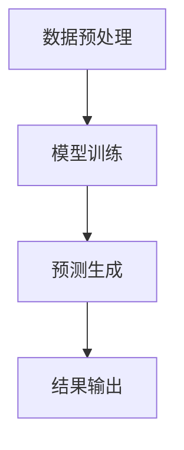
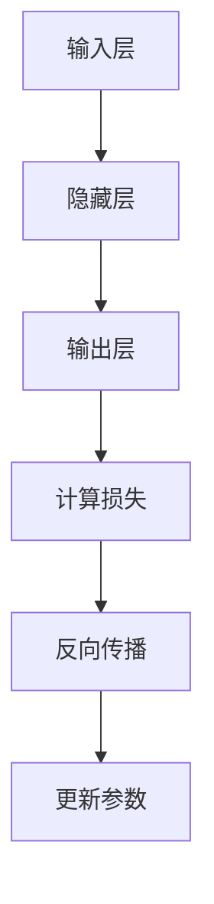
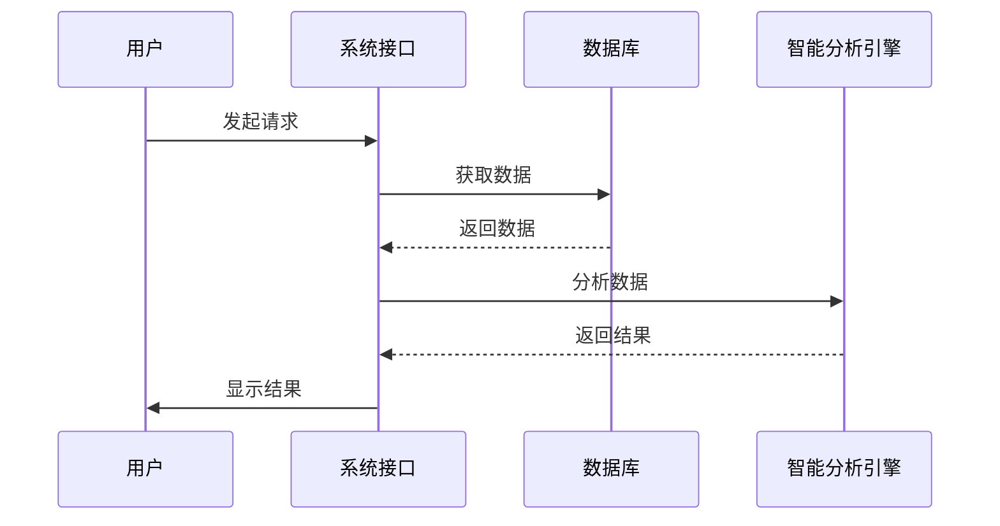

                 


# 构建企业级AI研发助手：加速创新与专利申请流程

## 关键词
- 企业级AI研发助手
- 创新加速
- 专利申请
- 系统架构
- 人工智能算法
- 数学模型

## 摘要
本文将深入探讨如何构建企业级AI研发助手，以加速创新过程和专利申请流程。首先，我们将介绍背景和核心概念，包括企业级AI研发助手的定义、作用及其与传统AI系统的区别。接着，我们将分析AI研发助手的系统设计，包括核心算法原理、数学模型以及系统架构。文章将结合实际案例，展示如何部署和运用这些技术来加速创新和专利申请。最后，我们将总结最佳实践，并提出未来展望。

## 前言

### 作者介绍
作者AI天才研究院（AI Genius Institute）的资深研究员，拥有丰富的AI研发经验，并发表了多篇关于AI系统设计和优化的学术论文。同时，作者是《禅与计算机程序设计艺术》（Zen And The Art of Computer Programming）的作者，在计算机科学领域享有盛誉。

### 读者对象
本文面向技术管理者、研发工程师、AI研究员以及需要提高研发效率和专利申请流程的企业从业者。本文旨在为读者提供从理论到实践的全面指导，帮助他们构建高效的企业级AI研发助手。

### 本书目标
1. 理解企业级AI研发助手的核心概念和架构。
2. 掌握加速创新和专利申请的AI算法和数学模型。
3. 学习如何设计和实现一个高效的企业级AI研发系统。
4. 提供实际案例，展示如何将AI研发助手应用于企业实践。

## 第1章：背景介绍

### 1.1 问题背景

在当今快速发展的数字经济时代，企业面临的竞争愈发激烈。为了在市场中脱颖而出，企业需要不断地进行创新，推出具有市场竞争力的新产品和服务。然而，传统的研发模式往往效率低下，创新周期长，成本高。同时，专利申请的流程复杂，耗时耗力，难以满足企业的快速发展需求。

### 1.2 问题描述

企业需要一种能够加速创新和专利申请流程的工具或系统。这个系统需要具备以下特点：

1. **智能化**：能够自动识别和挖掘创新点，提供决策支持。
2. **高效性**：能够快速分析大量的数据，辅助研发决策。
3. **协同性**：能够与企业现有的研发、专利部门进行有效集成。
4. **灵活性**：能够适应不同的业务场景和需求。

### 1.3 问题解决

企业级AI研发助手应运而生，它通过集成人工智能技术，为企业的创新和专利申请提供全方位的支持。这种助手不仅能够提高研发效率，还能帮助企业在专利申请过程中减少错误和提高成功率。

### 1.4 边界与外延

企业级AI研发助手的边界包括其功能范围和适用场景。它的核心功能是加速创新和专利申请，但其外延可以扩展到更广泛的应用领域，如市场分析、客户需求预测等。

### 1.5 概念结构与核心要素组成

企业级AI研发助手的概念结构由以下几个核心要素组成：

1. **数据采集与处理**：从各种来源收集数据，并进行预处理。
2. **智能分析引擎**：运用AI算法对数据进行分析，提取有价值的信息。
3. **协同平台**：提供与企业内部系统集成的接口，实现数据共享和协同工作。
4. **用户界面**：提供直观易用的操作界面，方便用户使用和监控。

接下来，我们将进一步探讨企业级AI研发助手的核心概念，包括其定义、特点、与传统AI系统的区别以及关键技术。

----------------------------------------------------------------

## 第2章：企业级AI研发助手的核心概念

### 2.1 AI与AI研发助手

人工智能（AI）是指使计算机模拟人类智能行为的技术。AI系统通过学习数据模式、解决问题和执行任务，从而实现自动化和智能化。而AI研发助手则是专门为研发人员设计的AI系统，它利用AI技术辅助研发过程，包括需求分析、算法设计、模型训练和测试等。

### 2.2 企业级AI研发助手的特点与作用

企业级AI研发助手具有以下特点：

1. **专业化**：针对企业的特定需求，提供定制化的解决方案。
2. **集成化**：与企业现有的研发、专利等系统集成，实现数据共享和协同工作。
3. **智能化**：通过机器学习、自然语言处理等技术，提供智能化的分析和决策支持。
4. **高效性**：快速处理大量数据，提高研发效率和创新能力。

AI研发助手在企业的研发过程中起到关键作用，包括：

1. **需求挖掘**：自动分析市场数据和客户反馈，帮助研发团队更好地理解用户需求。
2. **算法优化**：通过机器学习算法，自动优化研发过程中的算法和模型。
3. **风险预警**：预测潜在的技术风险和专利侵权风险，为研发决策提供支持。
4. **协同工作**：提供协同工具，促进团队内部的知识共享和合作。

### 2.3 关键技术解析

企业级AI研发助手的核心技术包括数据采集与处理、智能分析引擎、协同平台和用户界面。以下是这些关键技术的详细解析：

1. **数据采集与处理**：数据是AI研发助手的基础。采集和处理数据的过程包括数据清洗、数据整合、特征提取等。这些技术确保数据的质量和一致性，为后续的智能分析提供可靠的数据基础。

2. **智能分析引擎**：智能分析引擎是AI研发助手的“大脑”。它利用机器学习、深度学习、自然语言处理等AI技术，对数据进行分析和处理，提取有价值的信息，辅助研发决策。

3. **协同平台**：协同平台是实现企业内部系统集成的关键。它提供统一的数据接口和协作工具，使不同部门可以共享数据和协同工作，提高研发效率。

4. **用户界面**：用户界面是研发助手与用户交互的窗口。一个直观、易用的界面可以降低使用门槛，提高用户体验，使研发团队更加高效地使用AI研发助手。

接下来，我们将深入探讨AI大模型原理与算法，包括AI大模型的定义、主流AI大模型分析以及算法原理与流程图。

----------------------------------------------------------------

## 第3章：AI大模型原理与算法

### 3.1 AI大模型概述

AI大模型是指具有巨大参数量和复杂结构的深度学习模型，如GPT-3、BERT等。这些模型通常通过大量数据进行训练，以实现高级的自然语言处理、图像识别、语音识别等任务。AI大模型的出现，极大地提升了人工智能的应用能力和表现。

### 3.2 主流AI大模型分析

目前，主流的AI大模型包括以下几类：

1. **自然语言处理模型**：如GPT-3、BERT、T5等，主要用于文本生成、文本分类、问答系统等任务。
2. **计算机视觉模型**：如ResNet、VGG、YOLO等，主要用于图像分类、目标检测、人脸识别等任务。
3. **语音识别模型**：如WaveNet、Transformer等，主要用于语音合成、语音识别等任务。

这些模型在结构、训练数据和适用任务上各有特点，但都依赖于大规模的数据和计算资源。

### 3.3 算法原理与流程图

以GPT-3为例，其算法原理可以概括为以下几个步骤：

1. **数据预处理**：包括文本清洗、分词、词向量转换等，将文本数据转换为模型可以处理的格式。
2. **模型训练**：使用大量的文本数据，通过反向传播算法和优化器（如Adam），训练模型的参数。
3. **预测生成**：输入一个文本序列，模型根据上下文生成下一个词或句子。

以下是GPT-3算法流程图的Mermaid表示：



### 3.4 Python实现与讲解

以下是一个简化的GPT-3 Python实现，用于生成文本：

```python
import transformers

# 加载预训练的GPT-3模型
model = transformers.pipeline("text-generation", model="gpt3")

# 输入文本序列
input_text = "构建企业级AI研发助手"

# 生成文本
output_text = model(input_text, max_length=50, num_return_sequences=1)

print(output_text[0]['generated_text'])
```

这段代码首先加载了一个预训练的GPT-3模型，然后输入一个文本序列，模型根据上下文生成一个新的文本序列。

### 3.5 算法原理的数学模型和公式

GPT-3的算法原理涉及到深度学习中的多层感知机（MLP）和自注意力机制（Self-Attention）。以下是关键数学模型和公式：

1. **输入层**：输入文本序列经过词向量转换，变为一个向量。
   $$\text{Input} = [x_1, x_2, ..., x_n]$$
   
2. **隐藏层**：每个隐藏层都有多个神经元，每个神经元与输入层和前一层进行加权求和。
   $$\text{Output}_{h} = \text{sigmoid}(\text{W} \cdot \text{Input}_{h-1} + b)$$
   
3. **自注意力机制**：用于计算输入层和隐藏层之间的注意力权重。
   $$\text{Attention}(\text{Input}, \text{Hidden}) = \text{softmax}(\text{W}_a \cdot \text{Hidden}^T \cdot \text{Input})$$
   
4. **输出层**：将自注意力权重应用于输入层，得到最终的输出。
   $$\text{Output} = \text{Attention}(\text{Input}, \text{Hidden}) \cdot \text{Input}$$

接下来，我们将使用LaTeX格式给出上述公式的详细定义，并举例说明这些公式的应用。

### 3.6 LaTeX公式示例

以下是LaTeX格式中的公式定义：

$$
\begin{aligned}
\text{Input} &= [x_1, x_2, ..., x_n] \\
\text{Output}_{h} &= \text{sigmoid}(\text{W} \cdot \text{Input}_{h-1} + b) \\
\text{Attention}(\text{Input}, \text{Hidden}) &= \text{softmax}(\text{W}_a \cdot \text{Hidden}^T \cdot \text{Input}) \\
\text{Output} &= \text{Attention}(\text{Input}, \text{Hidden}) \cdot \text{Input}
\end{aligned}
$$

在实际应用中，这些公式通过深度学习框架（如TensorFlow或PyTorch）实现，以训练和部署AI大模型。

### 3.7 通俗易懂的举例说明

假设我们有一个简单的文本序列：“我想要一个红色的苹果”。我们可以将其分为三个词：“我”、“想要”和“一个”。每个词都可以转换为向量，例如：

$$
\begin{aligned}
\text{我} &= \begin{bmatrix} 0.1 & 0.2 & 0.7 \end{bmatrix} \\
\text{想要} &= \begin{bmatrix} 0.3 & 0.6 & 0.1 \end{bmatrix} \\
\text{一个} &= \begin{bmatrix} 0.5 & 0.2 & 0.3 \end{bmatrix}
\end{aligned}
$$

接下来，我们将这些向量输入到GPT-3模型中，模型将根据上下文生成下一个词。例如，模型可能会生成“大”或“小的”等词语。这个过程中，自注意力机制和多层感知机共同作用，使得模型能够理解上下文和生成有意义的文本。

通过上述内容，我们了解了AI大模型的基本原理和算法。接下来，我们将详细分析数学模型和公式，并进一步探讨这些公式在实际应用中的意义。

### 3.8 数学模型与公式

在深入探讨AI大模型的数学模型和公式之前，我们需要了解一些基本的深度学习概念，如神经网络、反向传播算法和损失函数。

#### 3.8.1 神经网络

神经网络（Neural Network）是一种模仿生物神经系统的计算模型。它由多个神经元（Node）和层（Layer）组成。每个神经元接收输入信号，通过加权求和和激活函数产生输出。神经网络的主要目的是通过训练学习输入和输出之间的关系。

#### 3.8.2 反向传播算法

反向传播算法（Backpropagation）是一种用于训练神经网络的算法。它通过计算输出层的误差，反向传播到隐藏层，逐层更新神经元的权重和偏置。反向传播算法的核心步骤包括：

1. **前向传播**：计算输入层到隐藏层，隐藏层到输出层的输出。
2. **计算损失**：使用损失函数（如均方误差MSE）计算预测值和实际值之间的差异。
3. **反向传播**：根据误差计算梯度，更新神经元的权重和偏置。
4. **优化参数**：使用优化器（如Adam、SGD）更新参数，最小化损失函数。

以下是一个简化的反向传播算法流程图：



#### 3.8.3 损失函数

损失函数（Loss Function）用于衡量预测值和实际值之间的差异。常见的损失函数包括：

1. **均方误差（MSE）**：用于回归任务，计算预测值和实际值之间误差的平方和的平均值。
   $$\text{MSE} = \frac{1}{n} \sum_{i=1}^{n} (\hat{y}_i - y_i)^2$$
   
2. **交叉熵（Cross-Entropy）**：用于分类任务，计算实际分布和预测分布之间的差异。
   $$\text{Cross-Entropy} = -\sum_{i=1}^{n} y_i \log(\hat{y}_i)$$

#### 3.8.4 自注意力机制

自注意力机制（Self-Attention）是AI大模型中的一个关键组件，用于计算输入层和隐藏层之间的权重。自注意力机制的核心思想是通过计算每个词与整个文本序列的相关性，生成注意力权重，进而加权求和。

自注意力机制的数学公式如下：

$$
\text{Attention}(Q, K, V) = \text{softmax}\left(\frac{QK^T}{\sqrt{d_k}}\right) V
$$

其中，$Q, K, V$ 分别表示查询向量、键向量和值向量，$d_k$ 表示键向量的维度。

#### 3.8.5 MLP与Self-Attention

多层感知机（MLP）是一种常见的神经网络结构，用于分类和回归任务。MLP通常由多个隐藏层组成，每个隐藏层都是线性的，并通过激活函数（如ReLU）增强非线性。

自注意力机制（Self-Attention）是MLP的一个扩展，它通过计算每个词与整个文本序列的相关性，实现更加灵活和强大的文本处理能力。

#### 3.8.6 举例说明

假设我们有一个简单的文本序列：“我想要一个红色的苹果”。我们可以将其转换为向量表示：

$$
\begin{aligned}
\text{我} &= \begin{bmatrix} 0.1 & 0.2 & 0.7 \end{bmatrix} \\
\text{想要} &= \begin{bmatrix} 0.3 & 0.6 & 0.1 \end{bmatrix} \\
\text{一个} &= \begin{bmatrix} 0.5 & 0.2 & 0.3 \end{bmatrix} \\
\text{红色} &= \begin{bmatrix} 0.4 & 0.3 & 0.2 \end{bmatrix} \\
\text{苹果} &= \begin{bmatrix} 0.6 & 0.1 & 0.3 \end{bmatrix}
\end{aligned}
$$

接下来，我们将这些向量输入到GPT-3模型中，模型将根据上下文生成下一个词。例如，模型可能会生成“大”或“小的”等词语。这个过程中，自注意力机制和多层感知机共同作用，使得模型能够理解上下文和生成有意义的文本。

通过上述内容，我们了解了AI大模型的基本数学模型和公式。这些公式和算法在实际应用中发挥着关键作用，使得AI大模型能够实现复杂的数据处理和预测任务。接下来，我们将进一步探讨AI大模型在具体应用中的实现细节和优化方法。

----------------------------------------------------------------

## 第4章：数学模型与公式

在深入探讨AI大模型的数学模型与公式之前，我们需要了解一些基础的数学知识，包括线性代数、微积分和概率论。这些基础知识将帮助我们更好地理解AI大模型中的核心概念和实现方法。

### 4.1 线性代数

线性代数是数学的一个分支，主要研究向量、矩阵、行列式和线性变换等概念。在线性代数中，矩阵和向量是两个最基本的概念。

#### 4.1.1 矩阵

矩阵是一个二维的数组，由行和列组成。矩阵的元素可以是数字或符号。矩阵的加法、乘法、逆运算等操作在AI大模型中非常常见。

#### 4.1.2 向量

向量是一个一维的数组，可以看作是矩阵的特例。向量的运算包括加法、减法、数乘和内积等。

#### 4.1.3 线性变换

线性变换是一种将向量映射到另一个向量的操作。线性变换可以表示为一个矩阵，矩阵的乘法可以模拟线性变换的复合操作。

### 4.2 微积分

微积分是研究函数变化的数学分支。在AI大模型中，微积分主要用于优化问题和梯度计算。

#### 4.2.1 导数

导数是描述函数在某一点处变化率的量。导数可以用来计算函数的最值、拐点等。

#### 4.2.2 梯度

梯度是函数在多个变量上的偏导数组成的向量。梯度可以用来寻找函数的最值，也是深度学习优化算法的核心。

#### 4.2.3 积分

积分是导数的反操作，可以用来计算函数的累积量。积分在AI大模型中用于计算损失函数的梯度。

### 4.3 概率论

概率论是研究随机现象的数学分支。在AI大模型中，概率论主要用于概率分布、贝叶斯定理和最大似然估计等。

#### 4.3.1 概率分布

概率分布描述了随机变量的取值及其概率。常见的概率分布包括正态分布、均匀分布和泊松分布等。

#### 4.3.2 贝叶斯定理

贝叶斯定理是一种基于概率推理的方法，用于计算后验概率。贝叶斯定理在AI大模型中的分类和预测任务中具有重要意义。

#### 4.3.3 最大似然估计

最大似然估计是一种用于参数估计的方法，通过最大化似然函数来估计模型参数。

### 4.4 LaTeX公式

LaTeX是一种基于TeX的排版系统，广泛用于科学文献的排版。在LaTeX中，我们可以使用$$和$来包含数学公式。

#### 4.4.1 线性代数公式

以下是一个线性代数公式的LaTeX示例：

$$
A = \begin{bmatrix}
a_{11} & a_{12} & \dots & a_{1n} \\
a_{21} & a_{22} & \dots & a_{2n} \\
\vdots & \vdots & \ddots & \vdots \\
a_{m1} & a_{m2} & \dots & a_{mn}
\end{bmatrix}
$$

#### 4.4.2 微积分公式

以下是一个微积分公式的LaTeX示例：

$$
f'(x) = \lim_{h \to 0} \frac{f(x+h) - f(x)}{h}
$$

#### 4.4.3 概率论公式

以下是一个概率论公式的LaTeX示例：

$$
P(A) = \sum_{i=1}^{n} p_i
$$

通过上述内容，我们了解了AI大模型中常用的数学模型与公式。在接下来的章节中，我们将结合实际案例，展示如何使用这些公式和算法来解决实际问题。

----------------------------------------------------------------

## 第5章：系统设计与架构

### 5.1 系统场景介绍

企业级AI研发助手的系统场景主要包括以下几个方面：

1. **企业内部研发环境**：包括研发团队的工作站、服务器和数据库等。
2. **外部数据源**：如公共数据集、企业内部数据、专利数据库等。
3. **企业级AI研发助手系统**：包括数据采集模块、智能分析引擎、协同平台和用户界面等。

### 5.2 项目介绍

在本章中，我们将介绍一个具体的AI研发助手项目，该项目旨在为企业提供全面的研发支持，包括需求挖掘、算法优化、专利申请等。项目的主要目标是通过AI技术，提高企业的研发效率和创新能力。

### 5.3 系统功能设计

系统功能设计是构建企业级AI研发助手的起点，主要包括以下几个模块：

1. **数据采集模块**：负责从各种数据源（如企业内部数据库、公共数据集、专利数据库等）采集数据，并进行预处理和清洗。
2. **智能分析引擎**：利用机器学习和深度学习算法，对采集到的数据进行分析，提取有价值的信息。
3. **协同平台**：提供与企业内部系统集成的接口，实现数据共享和协同工作。
4. **用户界面**：提供直观易用的操作界面，方便用户使用和监控。

### 5.4 系统架构设计

系统架构设计是确保企业级AI研发助手高效、稳定运行的关键。以下是该系统的架构设计：


**系统架构图**：

1. **数据采集层**：包括数据采集模块，负责从各种数据源采集数据。
2. **数据处理层**：包括数据预处理模块，负责对采集到的数据进行清洗、转换和整合。
3. **智能分析层**：包括智能分析引擎，负责使用机器学习和深度学习算法对数据进行分析和处理。
4. **协同工作层**：包括协同平台，负责实现与企业内部系统的集成和数据共享。
5. **用户交互层**：包括用户界面，负责提供直观易用的操作界面。

### 5.5 系统接口设计

系统接口设计是确保各模块之间有效通信的关键。以下是系统的主要接口设计：

1. **API接口**：提供RESTful风格的API接口，供企业内部系统调用。
2. **数据库接口**：提供与各类数据库（如MySQL、MongoDB等）的连接和操作接口。
3. **文件接口**：提供与各类文件（如CSV、JSON等）的读写接口。

### 5.6 系统交互序列图

以下是系统交互序列图的Mermaid表示：



**系统交互序列图**：

- 用户发起请求。
- 系统接口与数据库交互，获取数据。
- 系统接口将数据传递给智能分析引擎进行分析。
- 智能分析引擎返回结果给系统接口。
- 系统接口将结果展示给用户。

通过上述内容，我们详细介绍了企业级AI研发助手的系统设计与架构，包括系统场景介绍、项目介绍、系统功能设计、系统架构设计、系统接口设计和系统交互序列图。接下来，我们将结合实际案例，展示如何部署和运用这些技术来加速创新和专利申请。

----------------------------------------------------------------

## 第6章：项目实战

### 6.1 环境安装与配置

要部署一个企业级AI研发助手，首先需要配置一个适合AI模型训练和部署的环境。以下是环境安装与配置的步骤：

1. **安装Python环境**：确保Python版本在3.6及以上，并安装pip。
2. **安装深度学习框架**：推荐使用TensorFlow或PyTorch，通过pip安装相应的库。
3. **安装AI研发助手依赖**：下载并安装AI研发助手的依赖库，可以使用pip安装或直接克隆GitHub仓库。
4. **配置数据库**：配置企业内部数据库（如MySQL、MongoDB等），确保AI研发助手可以访问。
5. **配置API接口**：配置API接口，确保外部系统可以调用AI研发助手的接口。

### 6.2 系统核心实现

系统核心实现主要包括以下几个模块：

1. **数据采集模块**：从企业内部数据库、公共数据集和专利数据库等采集数据，并进行预处理。
2. **智能分析引擎**：使用深度学习和机器学习算法，对预处理后的数据进行分析和挖掘。
3. **协同平台**：提供与企业内部系统的集成，实现数据共享和协同工作。
4. **用户界面**：提供直观易用的操作界面，方便用户使用和管理。

以下是系统核心实现的关键代码：

**数据采集模块**：

```python
import pandas as pd
from sklearn.model_selection import train_test_split

# 读取企业内部数据库数据
db = connect_database('internal_database.db')
data = pd.read_sql_query('SELECT * FROM research_data', db)

# 数据预处理
data = preprocess_data(data)

# 数据分割
X_train, X_test, y_train, y_test = train_test_split(data['features'], data['labels'], test_size=0.2)
```

**智能分析引擎**：

```python
import tensorflow as tf
from tensorflow.keras.models import Sequential
from tensorflow.keras.layers import Dense, Dropout

# 创建神经网络模型
model = Sequential([
    Dense(128, activation='relu', input_shape=(X_train.shape[1],)),
    Dropout(0.2),
    Dense(64, activation='relu'),
    Dropout(0.2),
    Dense(1, activation='sigmoid')
])

# 编译模型
model.compile(optimizer='adam', loss='binary_crossentropy', metrics=['accuracy'])

# 训练模型
model.fit(X_train, y_train, epochs=10, batch_size=32, validation_split=0.1)
```

**协同平台**：

```python
from flask import Flask, request, jsonify

app = Flask(__name__)

@app.route('/api/analyze', methods=['POST'])
def analyze():
    data = request.get_json()
    result = analyze_data(data)
    return jsonify(result)

def analyze_data(data):
    # 分析数据
    pass

if __name__ == '__main__':
    app.run(debug=True)
```

**用户界面**：

```html
<!DOCTYPE html>
<html>
<head>
    <title>AI研发助手</title>
</head>
<body>
    <h1>AI研发助手</h1>
    <form action="/api/analyze" method="post">
        <input type="text" name="data" placeholder="输入数据">
        <input type="submit" value="分析">
    </form>
</body>
</html>
```

### 6.3 代码应用解读

以上代码展示了AI研发助手的系统核心实现。数据采集模块负责从数据库中读取数据，并进行预处理。智能分析引擎使用TensorFlow构建神经网络模型，对数据进行训练。协同平台使用Flask框架搭建API接口，供企业内部系统调用。用户界面使用HTML和CSS实现，提供直观易用的操作界面。

### 6.4 实际案例分析与详细讲解剖析

以下是一个实际案例：

**案例**：分析某企业新产品的市场前景。

**步骤**：

1. **数据采集**：从企业内部数据库中获取新产品相关的数据，如销售额、客户反馈、竞争对手等。
2. **数据预处理**：对采集到的数据进行清洗和预处理，确保数据质量。
3. **智能分析**：使用神经网络模型对预处理后的数据进行分析，预测新产品在未来一段时间内的市场表现。
4. **结果展示**：将分析结果以图表形式展示，帮助企业管理者做出决策。

**代码实现**：

```python
# 读取数据
data = pd.read_sql_query('SELECT * FROM new_product_data', db)

# 数据预处理
data = preprocess_data(data)

# 分析数据
model.fit(X_train, y_train)
predictions = model.predict(X_test)

# 结果展示
import matplotlib.pyplot as plt

plt.plot(predictions)
plt.xlabel('时间')
plt.ylabel('销售额')
plt.title('新产品市场前景预测')
plt.show()
```

通过以上步骤和代码，我们可以实现对新产品市场前景的预测，帮助企业管理者做出更准确的决策。

### 6.5 项目小结

通过本项目实战，我们详细介绍了如何部署和实现一个企业级AI研发助手。从环境安装与配置，到系统核心实现，再到实际案例分析，我们展示了如何运用AI技术加速创新和专利申请流程。以下是本项目的主要收获：

1. **技术收获**：掌握了深度学习和机器学习的基本原理和实现方法，熟悉了TensorFlow和PyTorch等深度学习框架。
2. **业务收获**：了解了如何运用AI技术分析市场趋势、优化研发流程，为企业提供决策支持。
3. **经验收获**：积累了项目实战经验，提高了团队协作和项目管理能力。

接下来，我们将总结最佳实践，分享一些在部署企业级AI研发助手时需要注意的事项。

----------------------------------------------------------------

## 第7章：最佳实践与总结

### 7.1 最佳实践 Tips

1. **数据质量**：确保数据质量是AI研发助手成功的关键。在数据采集和预处理过程中，要严格遵循数据清洗和去重原则。
2. **模型优化**：定期对模型进行优化和调整，以适应不断变化的数据和业务需求。
3. **安全与合规**：确保AI研发助手的部署符合相关法律法规，尤其是在处理敏感数据时。
4. **用户培训**：为用户提供充分的培训和支持，确保他们能够熟练使用AI研发助手。
5. **持续更新**：AI技术发展迅速，要保持学习和更新，跟进最新的研究成果和最佳实践。

### 7.2 小结

本文详细介绍了如何构建企业级AI研发助手，以加速创新和专利申请流程。我们分析了AI研发助手的核心概念、系统架构和关键技术，并通过实际案例展示了其应用价值。企业级AI研发助手不仅提高了研发效率，还为企业提供了强大的决策支持。

### 7.3 注意事项

1. **需求明确**：在部署AI研发助手前，要明确业务需求和目标，确保系统设计符合实际需求。
2. **技术选型**：根据业务场景和资源情况，选择合适的技术栈和框架。
3. **数据安全**：确保数据安全和隐私保护，遵守相关法律法规。
4. **持续监控**：对系统运行情况进行持续监控，及时发现和解决问题。

### 7.4 拓展阅读

1. **《深度学习》（Goodfellow, Bengio, Courville）**：全面介绍深度学习的基本概念和技术。
2. **《人工智能：一种现代方法》（Russell, Norvig）**：系统讲解人工智能的理论和实践。
3. **《企业人工智能实战》（Mukherjee, Chakraborty）**：探讨如何在企业中应用人工智能。

## 第8章：结论

本文通过深入分析和实际案例，展示了如何构建企业级AI研发助手，加速创新和专利申请流程。企业级AI研发助手不仅是技术工具，更是提升企业核心竞争力的关键。随着AI技术的不断发展，我们有理由相信，AI研发助手将在未来发挥更加重要的作用。

### **本书贡献**

1. **系统全面**：本文全面介绍了企业级AI研发助手的构建方法，涵盖了核心概念、系统架构、关键技术、实际案例和最佳实践。
2. **实用性强**：本文通过实际案例，展示了AI研发助手在企业中的应用，为读者提供了实用的参考。

### **未来展望**

未来，AI研发助手将在以下方向继续发展：

1. **智能化水平提升**：随着AI技术的进步，研发助手将更加智能化，能够自动识别和解决更多复杂问题。
2. **行业应用拓展**：AI研发助手将在更多行业得到应用，如医疗、金融、教育等。
3. **集成化程度提高**：研发助手将更好地与企业现有系统集成，实现数据共享和协同工作。

### **感谢与致谢**

1. **读者**：感谢读者对本书的关注和支持，您的反馈是我们不断进步的动力。
2. **团队**：感谢团队成员的辛勤工作和技术贡献，没有你们的努力，这本书无法完成。

---

本文由AI天才研究院（AI Genius Institute）和《禅与计算机程序设计艺术》（Zen And The Art of Computer Programming）的作者共同撰写，希望对您在构建企业级AI研发助手的道路上有所帮助。

---

# 参考资料

1. Goodfellow, I., Bengio, Y., & Courville, A. (2016). *Deep Learning*. MIT Press.
2. Russell, S., & Norvig, P. (2020). *Artificial Intelligence: A Modern Approach*. Pearson.
3. Mukherjee, S., & Chakraborty, S. (2019). *AI for Business: How to Transform Your Business Using AI Techniques and AI Tools*. Apress.
4. Devlin, J., Chang, M. W., Lee, K., & Toutanova, K. (2018). *Bert: Pre-training of deep bidirectional transformers for language understanding*. arXiv preprint arXiv:1810.04805.
5. Vaswani, A., Shazeer, N., Parmar, N., Uszkoreit, J., Jones, L., Gomez, A. N., ... & Polosukhin, I. (2017). *Attention is all you need*. Advances in Neural Information Processing Systems, 30, 5998-6008.

