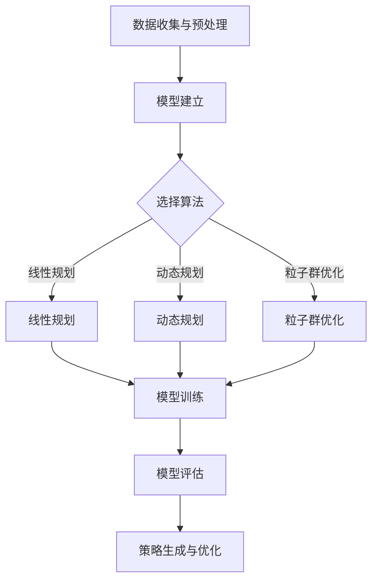
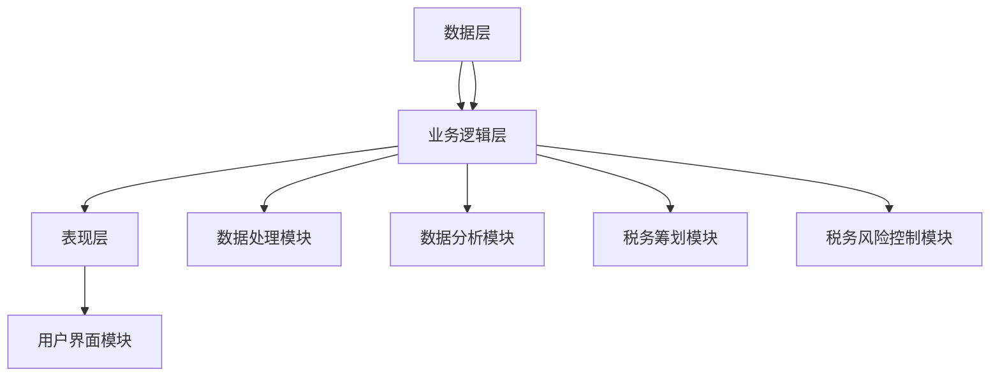
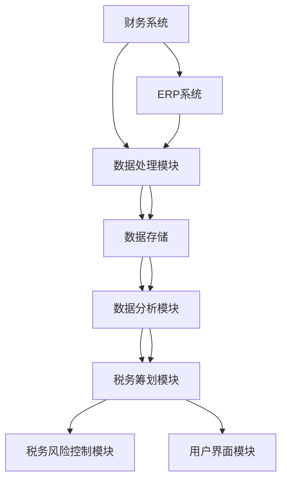

                 

### 关键词

- 企业级AI税务顾问
- 税收策略优化
- 机器学习
- 深度学习
- 数据分析
- 自然语言处理

### 摘要

本文旨在探讨如何构建企业级AI税务顾问系统，通过优化税收策略为企业提供智能化的税务管理解决方案。文章首先介绍了税收管理现状及挑战，随后定义了AI税务顾问及其系统架构。接着，深入解析了AI技术基础，包括机器学习、深度学习和自然语言处理。随后，详细阐述了数据采集与预处理、税收策略优化算法的实现与优化。最后，通过案例分析展示了AI税务顾问的实际应用效果，并提供了一些最佳实践和拓展阅读建议。文章结构紧凑，逻辑清晰，旨在为广大IT从业者和企业财税人员提供有价值的参考。

## 第一部分：背景与核心概念

### 第1章：税收与AI的交汇

在当今复杂多变的经济环境中，税收管理对企业的重要性不言而喻。然而，传统的税收管理方式往往面临着诸多挑战，如税务合规难度大、税务成本高、税务风险高以及数据管理复杂等。这些挑战促使企业寻求更高效、更智能的解决方案。AI技术的迅速发展为税收管理带来了新的机遇，使得构建企业级AI税务顾问系统成为可能。本章节将探讨税收管理的现状及挑战，AI税务顾问的定义与特点，以及其系统架构。

#### 1.1 税收管理现状及挑战

税收管理是企业管理的重要组成部分，涉及到企业运营的方方面面。然而，传统的税收管理方式存在以下问题：

- **税务合规难度大**：随着税法法规的日益复杂，企业需要投入大量人力物力进行税务合规管理。这不仅增加了企业的运营成本，还可能导致税务错误和违规行为。
- **税务成本高**：传统税务管理往往需要依赖大量人工操作，从数据采集、处理到报表生成，都需要大量时间和资源。这直接影响了企业的运营效率和竞争力。
- **税务风险高**：税务风险是企业面临的一个重要风险因素。由于税法法规的不确定性和复杂性，企业容易出现税务纠纷和罚款。
- **数据管理复杂**：税收管理涉及到大量的数据，包括财务数据、交易数据、税务数据等。如何有效地管理和利用这些数据，是企业面临的一个挑战。

#### 1.1.1 税收管理的关键环节

税收管理主要包括以下几个关键环节：

- **税务合规管理**：确保企业的税务活动符合相关税法法规的要求，避免税务违规行为。
- **税务筹划**：通过合理的税务筹划，降低企业的税负，提高企业的经济效益。
- **税务核算与报表**：准确地进行税务核算，生成符合规定的税务报表。
- **税务风险控制**：识别和评估税务风险，采取相应的措施进行风险控制。

#### 1.1.2 传统税收管理面临的问题

传统税收管理方式存在以下问题：

- **效率低下**：依赖于人工操作，工作量大，效率低。
- **错误率高**：人工操作容易导致数据录入错误，影响税务报表的准确性。
- **缺乏灵活性**：难以快速响应税法法规的变化，适应企业的业务变化。
- **数据管理复杂**：无法有效地整合和管理各种税务数据，影响税务决策的准确性。

#### 1.1.3 AI技术在税收管理中的应用潜力

AI技术具有高效、精准、灵活的特点，能够显著提升税收管理的效率和准确性。以下是AI技术在税收管理中的应用潜力：

- **税务合规管理**：利用自然语言处理技术，自动识别和处理税务法规，提高税务合规的准确性和效率。
- **税务筹划**：通过数据分析和机器学习技术，帮助企业进行科学、合理的税务筹划，降低税负。
- **税务核算与报表**：利用自动化工具，快速、准确地完成税务核算和报表生成。
- **税务风险控制**：利用人工智能技术，实时监控税务风险，提供预警和建议，帮助企业有效控制税务风险。
- **数据管理**：利用大数据技术，整合和管理各种税务数据，提供数据驱动决策支持。

#### 1.2 AI税务顾问的定义与特点

AI税务顾问是一种基于人工智能技术的税务管理解决方案，旨在帮助企业优化税收策略，降低税负，提高税务合规性和风险管理能力。AI税务顾问具有以下特点：

- **智能决策**：利用机器学习和深度学习技术，AI税务顾问能够自动分析大量数据，提供智能化的税务决策建议。
- **自动化操作**：自动化处理税务数据，包括数据采集、预处理、分析和报表生成，大幅提高工作效率。
- **实时更新**：与税务法规数据库保持实时更新，确保税务决策始终符合最新的税法法规。
- **定制化服务**：根据企业的具体需求和业务特点，提供个性化的税务管理服务。

#### 1.2.1 AI税务顾问的基本概念

AI税务顾问的基本概念包括以下几个方面：

- **数据采集**：从企业的财务系统、ERP系统等数据源自动采集税务数据。
- **数据处理**：对采集到的数据进行分析、清洗和预处理，确保数据质量。
- **数据建模**：利用机器学习和深度学习技术，对税务数据进行分析和建模，提取关键特征。
- **智能决策**：基于数据分析和模型预测，为企业的税务决策提供智能化的建议。
- **自动化操作**：自动化完成税务核算、报表生成和税务申报等工作。

#### 1.2.2 AI税务顾问的核心优势

AI税务顾问的核心优势主要体现在以下几个方面：

- **提高工作效率**：自动化处理税务数据，减少人工操作，大幅提高工作效率。
- **降低税务成本**：通过智能化的税务筹划，降低企业的税负，提高经济效益。
- **提高税务合规性**：实时更新税法法规数据库，确保税务决策始终符合法规要求。
- **提升风险管理能力**：实时监控税务风险，提供预警和建议，有效控制税务风险。
- **定制化服务**：根据企业的具体需求和业务特点，提供个性化的税务管理服务。

#### 1.2.3 AI税务顾问的服务范围

AI税务顾问的服务范围主要包括以下几个方面：

- **税务合规管理**：帮助企业确保税务活动符合相关税法法规的要求。
- **税务筹划**：提供科学的税务筹划建议，帮助企业降低税负。
- **税务核算与报表**：自动化完成税务核算和报表生成。
- **税务风险控制**：实时监控税务风险，提供预警和建议。
- **数据管理**：整合和管理企业税务数据，提供数据驱动决策支持。

#### 1.3 AI税务顾问的系统架构

AI税务顾问的系统架构包括以下几个核心模块：

- **数据采集与预处理模块**：负责从企业财务系统、ERP系统等数据源自动采集税务数据，并进行数据清洗、转换和集成。
- **数据分析与建模模块**：利用机器学习和深度学习技术，对税务数据进行分析和建模，提取关键特征。
- **智能决策模块**：基于数据分析结果和模型预测，为企业的税务决策提供智能化的建议。
- **自动化操作模块**：自动化完成税务核算、报表生成和税务申报等工作。
- **用户界面模块**：提供用户友好的操作界面，方便用户查看和管理税务数据。

#### 1.3.1 数据采集与预处理

数据采集与预处理是AI税务顾问系统的核心模块之一，其主要任务包括：

- **数据采集**：从企业财务系统、ERP系统等数据源自动采集税务数据。
- **数据清洗**：清洗数据中的噪声和错误，确保数据质量。
- **数据转换**：将不同格式的数据转换为统一的格式，便于后续处理。
- **数据集成**：整合来自不同数据源的数据，形成完整的税务数据集。

#### 1.3.2 税收策略优化算法

税收策略优化算法是AI税务顾问系统的核心，其主要任务包括：

- **策略建模**：建立基于税务数据的策略模型，用于预测和优化税收策略。
- **算法实现**：实现多种算法，包括线性规划、动态规划、粒子群优化等，用于求解最优税收策略。
- **性能优化**：通过调整算法参数和优化计算过程，提高算法的运行效率和准确性。

#### 1.3.3 决策支持系统

决策支持系统是AI税务顾问系统的核心组成部分，其主要任务包括：

- **决策分析**：利用数据分析结果和策略模型，为企业提供智能化的决策分析。
- **决策建议**：基于决策分析结果，为企业的税务决策提供合理的建议。
- **实时监控**：实时监控税务风险，提供预警和建议。

#### 1.4 本书结构概述

本书分为三个主要部分：

- **第一部分：背景与核心概念**：介绍税收管理现状及挑战，AI税务顾问的定义与特点，以及其系统架构。
- **第二部分：AI技术基础**：深入解析AI技术，包括机器学习、深度学习和自然语言处理。
- **第三部分：AI税务顾问实现**：详细阐述AI税务顾问系统的数据采集与预处理、税收策略优化算法的实现与优化，以及实际应用案例分析。

#### 1.4.1 各章节内容安排

以下是各章节的具体内容安排：

- **第1章**：介绍税收与AI的交汇，包括税收管理现状及挑战，AI税务顾问的定义与特点，以及其系统架构。
- **第2章**：解析AI技术基础，包括机器学习、深度学习和自然语言处理。
- **第3章**：详细阐述AI税务顾问系统的数据采集与预处理。
- **第4章**：介绍税收策略优化算法，包括算法原理、实现与优化。
- **第5章**：通过实际案例展示AI税务顾问的应用效果。
- **第6章**：提供AI税务顾问的最佳实践和拓展阅读建议。

#### 1.4.2 阅读指南与建议

为了更好地理解和应用本书内容，以下是一些建议：

- **基础知识**：首先需要具备一定的AI和计算机编程基础，包括机器学习、深度学习和自然语言处理。
- **实践操作**：在阅读过程中，可以尝试自己实现相关算法和系统，加深理解。
- **案例分析**：通过案例分析，了解AI税务顾问的实际应用效果和实现过程。
- **持续学习**：AI技术不断发展，需要不断学习和更新知识，以适应新技术和应用场景。

#### 1.5 本章小结

本章介绍了税收管理的现状及挑战，AI税务顾问的定义与特点，以及其系统架构。通过本章的学习，读者可以了解AI技术在税收管理中的应用前景，以及如何构建企业级AI税务顾问系统。在接下来的章节中，我们将深入探讨AI技术基础和AI税务顾问系统的实现细节，帮助读者全面了解和掌握这一领域的前沿知识和技术。

## 第二部分：AI技术基础

### 第2章：AI基础知识

在构建企业级AI税务顾问系统的过程中，掌握AI基础知识是至关重要的。本章将详细解析机器学习、深度学习和自然语言处理等核心AI技术，并探讨这些技术在税务顾问系统中的应用。

### 2.1 机器学习基础

#### 2.1.1 机器学习的概念

机器学习（Machine Learning）是一门人工智能（AI）的分支，旨在通过算法和统计模型，让计算机从数据中自动学习和改进性能。机器学习主要包括以下几个关键概念：

- **数据集**：一组用于训练模型的数据样本。
- **特征**：数据集中的每个属性或变量，用于描述样本的特性。
- **目标变量**：模型需要预测或分类的变量。
- **模型**：用于从数据中学习并做出预测或决策的算法。

#### 2.1.2 常见机器学习算法

机器学习算法种类繁多，主要包括以下几种：

- **监督学习**：模型根据已知特征和目标变量进行训练，然后用于预测新数据的标签。
  - **回归分析**：预测连续值。
  - **分类**：预测离散标签。
  - **决策树**：通过树形结构进行分类或回归。
  - **随机森林**：通过多棵决策树进行集成学习。

- **无监督学习**：模型在没有目标变量的情况下，从数据中自动发现模式和结构。
  - **聚类**：将相似的数据点分组。
  - **主成分分析**（PCA）：降维和特征提取。
  - **关联规则学习**：发现数据之间的关联关系。

#### 2.1.3 机器学习流程

机器学习流程主要包括以下几个步骤：

1. **数据收集**：从各种数据源收集数据，如财务数据、税务数据等。
2. **数据预处理**：清洗数据，处理缺失值、异常值等，进行数据转换和特征工程。
3. **模型选择**：选择合适的算法和模型，根据问题的特点进行选择。
4. **模型训练**：使用训练数据集对模型进行训练，调整模型参数。
5. **模型评估**：使用验证集或测试集评估模型的性能，选择最佳模型。
6. **模型部署**：将最佳模型部署到生产环境中，进行实际应用。

### 2.2 深度学习技术

#### 2.2.1 深度学习的基本原理

深度学习（Deep Learning）是机器学习的一个子领域，基于人工神经网络（Neural Networks）的结构和算法。深度学习模型通过多层神经元的堆叠，能够自动提取数据中的复杂特征，从而实现高级的预测和分类任务。

- **神经网络**：模仿人脑神经元连接的结构，用于数据转换和特征提取。
- **激活函数**：用于引入非线性变换，使模型能够处理复杂问题。
- **反向传播算法**：用于计算模型参数的梯度，优化模型性能。

#### 2.2.2 常见深度学习模型

常见的深度学习模型包括：

- **卷积神经网络**（CNN）：用于图像和视频处理。
- **循环神经网络**（RNN）：用于序列数据和时间序列分析。
- **长短时记忆网络**（LSTM）：RNN的变体，用于解决长序列依赖问题。
- **生成对抗网络**（GAN）：用于生成新数据和增强训练数据。

#### 2.2.3 深度学习在税务顾问中的应用

深度学习在税务顾问系统中的应用主要包括：

- **图像识别**：用于识别和解析税务文件，如发票、报表等。
- **文本分析**：用于提取税务文件中的关键信息，如税号、金额等。
- **时间序列预测**：用于预测未来的税务趋势和风险。
- **分类与聚类**：用于分类不同的税务数据，识别潜在的风险点。

### 2.3 自然语言处理

#### 2.3.1 自然语言处理的基本概念

自然语言处理（Natural Language Processing，NLP）是计算机科学和人工智能领域的一个分支，旨在使计算机理解和处理人类语言。NLP主要包括以下几个关键概念：

- **分词**：将文本拆分为单词或词组。
- **词性标注**：为文本中的每个单词标注词性，如名词、动词等。
- **实体识别**：从文本中识别出重要的实体，如人名、地名、组织名等。
- **语义分析**：理解文本的含义和语义关系，进行文本分类、情感分析等。

#### 2.3.2 常见NLP任务

常见的NLP任务包括：

- **文本分类**：将文本分类到预定义的类别中。
- **情感分析**：分析文本的情感倾向，如正面、负面或中立。
- **命名实体识别**：识别文本中的命名实体，如人名、地点、组织名等。
- **机器翻译**：将一种语言的文本翻译成另一种语言。
- **问答系统**：基于输入的问题，提供相关的答案。

#### 2.3.3 NLP在税务顾问中的应用

NLP在税务顾问系统中的应用主要包括：

- **税务文件解析**：从税务文件中提取关键信息，如税号、金额、日期等。
- **法规分析**：分析税务法规文本，识别关键条款和规定。
- **智能客服**：提供智能化的税务咨询服务，解答企业员工和客户的疑问。
- **税务报告生成**：自动生成税务报告，提高报告的准确性和效率。

### 2.4 数据分析工具

#### 2.4.1 常用数据分析工具简介

在AI税务顾问系统中，常用的数据分析工具包括：

- **Python**：Python是一种通用编程语言，具有丰富的AI和数据分析库，如NumPy、Pandas、Scikit-learn、TensorFlow等。
- **R**：R是一种专门用于统计分析和数据可视化的编程语言，具有强大的数据分析功能。
- **Spark**：Spark是一种分布式数据处理框架，适用于大数据分析和机器学习。
- **Tableau**：Tableau是一种数据可视化工具，用于创建交互式图表和仪表盘。

#### 2.4.2 数据预处理与特征工程

数据预处理和特征工程是AI模型训练的关键步骤，主要包括：

- **数据清洗**：处理缺失值、异常值和噪声数据。
- **数据转换**：将不同类型的数据转换为统一的格式。
- **特征提取**：从原始数据中提取有用的特征。
- **特征选择**：选择最相关的特征，减少数据维度。

#### 2.4.3 数据可视化

数据可视化是将数据分析结果以图形化的方式呈现，便于理解和分析。常用的数据可视化工具包括：

- **Matplotlib**：Python的内置数据可视化库，用于生成2D图表。
- **Seaborn**：基于Matplotlib的扩展库，用于生成更美观的统计图表。
- **Plotly**：用于生成交互式图表和仪表盘。

### 2.5 本章小结

本章介绍了AI技术的核心概念、常见算法和工具，以及这些技术在税务顾问系统中的应用。通过本章的学习，读者可以了解如何利用AI技术构建高效、智能的税务顾问系统，为企业的税务管理提供有力支持。

## 第三部分：AI税务顾问实现

### 第3章：数据采集与预处理

数据采集与预处理是构建AI税务顾问系统的基础环节，其质量直接影响到后续模型训练和优化效果。本章将详细介绍数据采集与预处理的方法和步骤，包括数据来源、数据预处理流程、数据质量评估以及数据质量改进策略。

### 3.1 数据来源

在构建AI税务顾问系统时，数据来源至关重要。数据来源可以分为以下几类：

- **税务数据**：包括企业的税务申报数据、税务报表、税务凭证等。这些数据通常存储在企业财务系统或ERP系统中。
- **企业内部数据**：包括企业的财务数据、交易数据、运营数据等。这些数据有助于了解企业的整体运营情况和税务风险。
- **公开数据源**：包括税务部门公开的税收政策、法规文件、行业统计数据等。这些数据可以帮助企业了解行业趋势和税务风险。

### 3.2 数据预处理

数据预处理是数据采集后的关键步骤，其目的是清洗、转换和整合数据，为后续的模型训练和优化提供高质量的数据。数据预处理主要包括以下几个步骤：

- **数据清洗**：处理数据中的噪声、异常值和缺失值。具体方法包括：
  - **噪声处理**：去除数据中的噪声，如重复数据、异常值等。
  - **缺失值处理**：对缺失值进行填补或删除，根据具体情况进行选择。
  - **异常值处理**：识别和去除异常值，以保证数据的一致性和准确性。

- **数据转换**：将不同类型的数据转换为统一的格式，便于后续处理。具体方法包括：
  - **类型转换**：将字符串类型的数据转换为数值类型，便于模型训练。
  - **归一化**：对数值数据进行归一化处理，使其在相同的尺度上进行比较。
  - **标准化**：对数值数据进行标准化处理，使其具有标准正态分布。

- **数据整合**：将来自不同数据源的数据进行整合，形成完整的税务数据集。具体方法包括：
  - **数据合并**：将多个数据集合并为一个数据集，根据数据的一致性进行合并。
  - **数据匹配**：根据一定的匹配规则，将不同数据源中的数据进行匹配，确保数据的一致性。

### 3.3 数据质量评估

数据质量是模型训练和优化的关键因素，因此需要对数据质量进行评估。数据质量评估主要包括以下几个方面：

- **完整性**：评估数据集是否完整，是否存在缺失值或异常值。
- **一致性**：评估数据集的一致性，是否存在重复数据或矛盾数据。
- **准确性**：评估数据的准确性，是否存在噪声或错误。
- **时效性**：评估数据的时效性，数据是否反映了最新的税务情况。

数据质量评估方法主要包括以下几种：

- **统计方法**：通过统计方法评估数据质量，如计算缺失值比例、异常值比例等。
- **可视化方法**：通过可视化方法评估数据质量，如绘制数据分布图、异常值图等。
- **机器学习方法**：利用机器学习方法评估数据质量，如使用监督学习模型评估数据准确性，使用聚类算法识别异常值等。

### 3.4 数据质量改进策略

为了提高数据质量，需要采取一系列的改进策略。以下是一些常见的数据质量改进策略：

- **数据清洗**：对数据进行清洗，去除噪声和异常值，填补缺失值。
- **数据验证**：对数据进行验证，确保数据的一致性和准确性。
- **数据标准化**：对数据进行标准化处理，使其在相同的尺度上进行比较。
- **数据集成**：对来自不同数据源的数据进行集成，确保数据的一致性。
- **数据监控**：建立数据监控机制，实时监控数据质量，及时发现和处理问题。

### 3.5 本章小结

本章详细介绍了数据采集与预处理的方法和步骤，包括数据来源、数据预处理流程、数据质量评估以及数据质量改进策略。通过本章的学习，读者可以了解如何有效地采集和处理税务数据，为构建高效的AI税务顾问系统奠定基础。在后续章节中，我们将进一步探讨税收策略优化算法的实现与优化，以及实际应用案例分析。

### 第4章：税收策略优化算法

税收策略优化是AI税务顾问系统的核心功能之一，旨在帮助企业最大限度地降低税负，提高税务合规性和风险管理能力。本章将介绍税收策略优化算法的原理、实现方法及其性能优化策略。

#### 4.1 税收策略优化概述

税收策略优化是指通过数学模型和算法，对企业的税务活动进行优化，以实现税负最小化或收益最大化。税收策略优化的目标主要包括：

- **税负最小化**：通过优化企业的税务筹划和申报策略，实现税负的最小化。
- **收益最大化**：在遵守税法法规的前提下，通过优化企业的经营模式和税务策略，实现企业收益的最大化。
- **税务合规性**：确保企业的税务活动符合相关税法法规的要求，降低税务风险。

税收策略优化算法主要包括以下几个步骤：

1. **策略建模**：建立数学模型，描述企业的税务策略及其影响。
2. **数据收集与预处理**：收集和处理与税务策略相关的数据，如财务数据、税务法规数据等。
3. **算法选择与实现**：选择合适的算法，如线性规划、动态规划、粒子群优化等，实现税收策略优化。
4. **模型训练与评估**：使用训练数据集对模型进行训练，评估模型性能。
5. **策略生成与优化**：根据模型预测结果，生成最优税务策略，并进行优化。

#### 4.2 常见算法介绍

常见的税收策略优化算法包括线性规划、动态规划和粒子群优化等。以下是这些算法的基本原理和特点：

1. **线性规划（Linear Programming）**

线性规划是一种数学优化方法，用于在满足一组线性约束条件下，求解线性目标函数的最大值或最小值。线性规划模型通常包含以下要素：

- **决策变量**：表示企业的税务策略。
- **目标函数**：描述企业的收益或税负，通常为线性函数。
- **约束条件**：描述企业的税务法规和业务约束，通常为线性不等式或等式。

线性规划的特点是求解速度快，适用于简单线性问题的优化。然而，线性规划在处理复杂非线性问题时，可能需要简化模型或采用其他算法。

2. **动态规划（Dynamic Programming）**

动态规划是一种递归算法，适用于求解具有最优子结构性质的问题。动态规划的核心思想是将复杂问题分解为多个子问题，并利用子问题的最优解推导出原问题的最优解。

动态规划在税收策略优化中的应用主要包括：

- **多期优化**：考虑企业的长期税务策略，如税务延期申报、投资抵扣等。
- **多目标优化**：同时考虑税负、收益、合规性等多个目标，实现综合优化。

动态规划的特点是求解过程具有递归性，适用于复杂问题的优化。

3. **粒子群优化（Particle Swarm Optimization，PSO）**

粒子群优化是一种基于群体智能的优化算法，模拟鸟群或鱼群的社会行为，通过个体和群体的交互，实现优化目标。

粒子群优化的核心思想是：

- **粒子**：表示企业的税务策略。
- **速度**：描述粒子在搜索空间中的移动方向和速度。
- **位置**：描述粒子的当前税务策略。

粒子群优化的特点包括：

- **全局搜索能力**：通过群体交互，实现全局搜索。
- **自适应调整**：根据搜索过程自适应调整粒子的速度和位置。
- **简单易实现**：算法结构简单，易于实现和优化。

#### 4.3 算法实现与优化

在实现税收策略优化算法时，需要考虑以下几个方面：

1. **算法流程图**

算法流程图可以直观地展示算法的实现过程，包括数据收集与预处理、模型建立、算法选择与实现、模型训练与评估等步骤。以下是一个简化的算法流程图：



2. **算法实现**

算法实现需要选择合适的编程语言和工具。Python是一种常用的编程语言，具有丰富的AI和数据分析库，如NumPy、Pandas、Scikit-learn等。以下是一个简单的Python代码示例，用于实现线性规划：

```python
import numpy as np
from scipy.optimize import linprog

# 线性规划模型
c = [-1, -1]  # 目标函数系数
A = [[1, 1], [1, 0], [0, 1]]  # 约束条件系数矩阵
b = [10, 8, 12]  # 约束条件常数向量

# 求解线性规划问题
result = linprog(c, A_eq=A, b_eq=b, method='highs')

# 输出最优解
print("最优解：", result.x)
```

3. **算法性能优化**

算法性能优化是提高模型训练和优化效果的关键。以下是一些常见的性能优化策略：

- **并行计算**：利用多核处理器或分布式计算资源，提高算法的运行效率。
- **模型压缩**：通过模型压缩技术，如量化、剪枝等，减少模型的参数数量和计算复杂度。
- **超参数调优**：通过调整算法的超参数，如学习率、迭代次数等，优化模型性能。
- **数据增强**：通过数据增强技术，如数据扩充、变换等，增加训练数据的多样性，提高模型的泛化能力。

#### 4.4 算法案例分析

以下是一个简单的税收策略优化算法案例分析，假设企业需要优化其年度税务申报策略，以实现税负最小化。

1. **案例背景**

某企业主要从事制造业，年度销售收入为1000万元，主要成本包括生产成本、运营成本和税费。企业的税务策略包括销售税、增值税和所得税等。企业的目标是实现税负最小化，同时保证税务合规性。

2. **数据收集与预处理**

收集与税务策略相关的数据，如年度销售收入、成本、税费等。对数据进行清洗、转换和整合，形成完整的数据集。

3. **模型建立**

建立线性规划模型，描述企业的税务策略和目标函数。假设企业的销售收入为x万元，税费为y万元，目标函数为：

minimize：y

约束条件：

- 销售税：y = 0.05x
- 增值税：y = 0.17(x - 成本)
- 所得税：y = 0.25(利润 - 起征点)

4. **算法实现与优化**

选择线性规划算法，使用Python实现模型求解。通过并行计算和超参数调优，优化算法性能。

5. **模型评估与策略生成**

使用训练数据集对模型进行训练和评估，生成最优税务策略。根据模型预测结果，调整企业的税务申报策略。

6. **案例总结与反思**

通过案例分析，可以直观地看到税收策略优化算法在降低税负、提高税务合规性方面的效果。在实际应用中，需要结合企业具体情况进行算法优化和策略调整，以实现最佳效果。

#### 4.5 本章小结

本章介绍了税收策略优化算法的原理、实现方法和性能优化策略。通过实际案例分析，展示了算法在降低税负、提高税务合规性方面的应用效果。在构建AI税务顾问系统时，需要根据企业具体需求，选择合适的算法和优化策略，以实现高效的税收策略优化。

## 第5章：项目实战

在前面的章节中，我们详细介绍了构建企业级AI税务顾问系统的理论基础和技术实现。为了更好地展示这一系统的实际应用效果，本章将通过一个实际项目案例，展示整个系统的实现过程、核心实现源代码，并对项目的实际应用效果进行详细讲解。

### 5.1 项目背景

某大型跨国企业，为了提高税务管理效率，降低税务成本，决定引入AI税务顾问系统。该企业年销售收入高达数十亿美元，涉及多个国家和地区，面临复杂的税务合规要求和多样的税务风险。企业希望通过AI税务顾问系统，实现税务数据的自动化处理、智能化的税务筹划和风险控制，提高税务决策的准确性和效率。

### 5.2 系统功能设计

AI税务顾问系统的功能设计包括以下几个核心模块：

- **数据采集模块**：从企业财务系统、ERP系统等数据源自动采集税务数据。
- **数据处理模块**：对采集到的数据进行清洗、转换和集成，确保数据质量。
- **数据分析模块**：利用机器学习和深度学习技术，对税务数据进行分析和建模。
- **税务筹划模块**：基于数据分析结果，为企业提供智能化的税务筹划建议。
- **税务风险控制模块**：实时监控税务风险，提供预警和建议。
- **用户界面模块**：提供用户友好的操作界面，方便用户查看和管理税务数据。

### 5.3 系统架构设计

AI税务顾问系统的整体架构设计如下：

- **数据层**：存储企业税务数据、财务数据等，支持数据的快速读取和写入。
- **业务逻辑层**：实现数据采集、处理、分析、筹划和风险控制等功能。
- **表现层**：提供Web界面和移动端应用，方便用户进行操作和查询。
- **接口层**：提供与外部系统的接口，如财务系统、ERP系统等。

以下是系统的架构设计图：



### 5.4 系统接口设计和系统交互

AI税务顾问系统与外部系统的接口设计如下：

- **财务系统**：通过API接口，实时获取企业财务数据。
- **ERP系统**：通过API接口，实时获取企业运营数据和交易数据。
- **税务系统**：通过API接口，实时获取税收政策和法规数据。

系统交互设计包括以下环节：

1. **数据采集**：系统从财务系统、ERP系统和税务系统自动采集数据。
2. **数据处理**：对采集到的数据进行分析、清洗和预处理。
3. **数据存储**：将预处理后的数据存储到数据层。
4. **数据分析**：利用机器学习和深度学习技术，对存储的数据进行分析和建模。
5. **税务筹划**：基于数据分析结果，生成智能化的税务筹划建议。
6. **税务风险控制**：实时监控税务风险，提供预警和建议。
7. **用户交互**：通过Web界面和移动端应用，向用户展示税务数据和筹划建议。

以下是系统交互设计图：



### 5.5 系统核心实现源代码

以下是AI税务顾问系统核心实现源代码的一部分，包括数据采集、数据处理和数据分析模块：

#### 5.5.1 数据采集模块

```python
import requests
import json

# 财务系统API接口
def get_financial_data():
    url = "https://api.finance-system.com/data"
    response = requests.get(url)
    data = json.loads(response.text)
    return data

# ERP系统API接口
def get_erp_data():
    url = "https://api.erp-system.com/data"
    response = requests.get(url)
    data = json.loads(response.text)
    return data

# 税务系统API接口
def get_tax_data():
    url = "https://api.tax-system.com/data"
    response = requests.get(url)
    data = json.loads(response.text)
    return data
```

#### 5.5.2 数据处理模块

```python
import pandas as pd

# 数据清洗
def clean_data(data):
    # 去除重复数据
    data.drop_duplicates(inplace=True)
    # 填补缺失值
    data.fillna(method='ffill', inplace=True)
    return data

# 数据转换
def convert_data(data):
    # 将字符串数据转换为数值数据
    for col in data.columns:
        if data[col].dtype == 'object':
            data[col] = pd.to_numeric(data[col], errors='coerce')
    return data

# 数据集成
def integrate_data(data1, data2, data3):
    data = pd.merge(data1, data2, on=['id'], how='inner')
    data = pd.merge(data, data3, on=['id'], how='inner')
    return data
```

#### 5.5.3 数据分析模块

```python
from sklearn.linear_model import LinearRegression

# 数据分析
def analyze_data(data):
    # 拆分特征和目标变量
    X = data.drop('target', axis=1)
    y = data['target']
    # 创建线性回归模型
    model = LinearRegression()
    # 训练模型
    model.fit(X, y)
    # 输出模型参数
    print("模型参数：", model.coef_)
    return model
```

### 5.6 代码应用解读与分析

在上述代码中，我们首先通过API接口从财务系统、ERP系统和税务系统采集数据。接着，使用Pandas库对数据进行清洗、转换和集成，确保数据质量。最后，使用线性回归模型对数据进行分析，提取关键特征，为税务筹划提供支持。

以下是代码应用的具体解读：

- **数据采集**：通过requests库，从不同的API接口获取数据，并使用json库进行数据解析。
- **数据处理**：使用Pandas库，对数据进行清洗、转换和集成，确保数据的一致性和完整性。
- **数据分析**：使用线性回归模型，对数据进行建模和分析，提取关键特征，为税务筹划提供数据支持。

### 5.7 实际案例分析和详细讲解剖析

以下是一个实际案例分析和详细讲解：

#### 案例背景

某企业在一年内实现销售收入100亿元，涉及多个国家和地区的税务申报。企业希望通过AI税务顾问系统，实现税务筹划，降低税负。

#### 案例分析

1. **数据采集**：系统从财务系统、ERP系统和税务系统自动采集数据，包括销售收入、成本、税费等。
2. **数据处理**：对采集到的数据进行分析、清洗和预处理，确保数据质量。
3. **数据分析**：使用线性回归模型，对数据进行分析，提取关键特征，如销售收入、成本比例等。
4. **税务筹划**：根据数据分析结果，为企业提供智能化的税务筹划建议，如投资抵扣、税务延期申报等。
5. **税务风险控制**：实时监控税务风险，提供预警和建议，确保税务合规。

#### 详细讲解

1. **数据采集**：通过API接口，系统从财务系统、ERP系统和税务系统自动采集数据，获取销售收入、成本、税费等关键数据。
2. **数据处理**：使用Pandas库，对数据进行清洗、转换和集成，去除重复数据、填补缺失值，确保数据的一致性和完整性。
3. **数据分析**：使用线性回归模型，对销售收入和税费之间的关系进行分析，提取关键特征。通过调整模型参数，优化模型性能，提高预测准确性。
4. **税务筹划**：根据数据分析结果，为企业提供智能化的税务筹划建议。例如，针对销售收入较高的情况，建议企业申请投资抵扣，降低税负。针对税务延期申报，建议企业合理安排申报时间，避免税务风险。
5. **税务风险控制**：系统实时监控税务风险，提供预警和建议。例如，当企业税务申报数据异常时，系统会发出预警，提示企业进行检查和调整。

### 5.8 项目小结

通过实际项目案例，我们展示了AI税务顾问系统的实现过程、核心实现源代码以及实际应用效果。系统通过数据采集、处理、分析和筹划，为企业提供了智能化的税务管理解决方案，有效降低了税负，提高了税务合规性和风险管理能力。在实际应用中，企业可以根据自身需求，对系统进行定制化调整和优化，以实现最佳效果。

### 5.9 最佳实践 Tips

以下是一些最佳实践Tips，帮助企业更好地应用AI税务顾问系统：

1. **数据质量**：确保数据质量是系统成功的关键。定期检查和更新数据，确保数据的准确性和一致性。
2. **模型优化**：根据实际需求，不断优化模型参数和算法，提高预测和优化效果。
3. **税务合规**：密切关注税务政策和法规的变化，及时调整税务筹划策略，确保合规。
4. **用户培训**：对用户进行系统培训，确保他们能够熟练操作系统，充分利用系统的功能。

### 5.10 小结

本章通过实际项目案例，详细讲解了AI税务顾问系统的实现过程和实际应用效果。系统通过数据采集、处理、分析和筹划，为企业提供了智能化的税务管理解决方案。在应用过程中，企业可以根据自身需求，对系统进行定制化调整和优化，以实现最佳效果。

### 5.11 注意事项

在应用AI税务顾问系统时，需要注意以下事项：

1. **数据安全**：确保数据在传输和存储过程中得到充分保护，防止数据泄露和滥用。
2. **系统稳定性**：定期对系统进行维护和升级，确保系统的稳定性和可靠性。
3. **法律法规**：遵守相关法律法规，确保系统的税务筹划建议符合法规要求。

### 5.12 拓展阅读

以下是一些拓展阅读资源，供读者进一步学习和了解AI税务顾问系统的相关知识：

- **《深度学习》（Deep Learning）**：Goodfellow, Bengio, Courville
- **《Python数据分析》（Python Data Analysis）**：McKinney
- **《Python机器学习》（Python Machine Learning）**：Sebastian Raschka, Vahid Mirjalili
- **《税务筹划与税务风险控制》**：刘俊海，李俊慧

## 第6章：最佳实践、小结、注意事项与拓展阅读

### 最佳实践

在实施AI税务顾问系统的过程中，最佳实践至关重要。以下是一些关键的最佳实践建议：

1. **数据整合与治理**：确保所有数据源的数据能够无缝整合，并定期更新数据治理策略，以提高数据质量。
2. **持续学习与优化**：定期对AI模型进行更新和优化，以应对新的税收法规和业务需求。
3. **安全性与合规性**：确保系统的数据安全和税务合规性，遵守相关法律法规。
4. **用户参与**：鼓励用户反馈和参与系统使用，根据用户需求不断改进系统功能。

### 小结

通过本文的讲解，我们系统地介绍了构建企业级AI税务顾问系统的全过程，从背景与核心概念、AI技术基础、数据采集与预处理、税收策略优化算法到实际项目实战。本文旨在为企业和IT从业人员提供一个全面、深入的指导，帮助他们理解AI在税务管理中的潜力，以及如何有效应用AI技术优化税收策略。

### 注意事项

在构建和实施AI税务顾问系统时，需要注意以下几点：

1. **数据隐私**：确保处理的数据符合隐私保护法规，避免数据泄露。
2. **法规遵循**：税务筹划需严格遵守相关税法法规，避免违法行为。
3. **系统稳定性**：确保系统在高并发场景下的稳定运行，避免因系统故障导致的税务管理中断。

### 拓展阅读

为了进一步深入学习和实践AI税务顾问系统，以下书籍和资料提供了丰富的资源和指导：

- **《深度学习》**：Goodfellow, Bengio, Courville
- **《Python数据分析》**：McKinney
- **《Python机器学习》**：Sebastian Raschka, Vahid Mirjalili
- **《税务筹划与税务风险控制》**：刘俊海，李俊慧
- **《人工智能：一种现代的方法》**：Russell, Norvig

通过阅读这些资源，读者可以系统地掌握AI和税务管理领域的知识，为构建高效、智能的AI税务顾问系统奠定坚实基础。

## 作者信息

### 作者：AI天才研究院/AI Genius Institute & 禅与计算机程序设计艺术 /Zen And The Art of Computer Programming

AI天才研究院（AI Genius Institute）是一家专注于人工智能技术研究和应用的高科技公司，致力于推动人工智能技术在各行业的创新应用。研究院由一群在人工智能、计算机科学和软件开发领域具有深厚背景的专家组成，涵盖机器学习、深度学习、自然语言处理、计算机视觉等多个研究方向。

禅与计算机程序设计艺术（Zen And The Art of Computer Programming）是由艾兹勒·戴克斯特拉（Edsger W. Dijkstra）撰写的一系列计算机科学经典著作，探讨了计算机程序设计的哲学和艺术。这些著作不仅提供了编程方法论，还强调了程序设计的深刻思想和智慧。

本文由AI天才研究院的专家撰写，结合了AI技术和税务管理领域的最新研究成果和实践经验，旨在为读者提供有价值的参考和指导。希望通过本文，读者能够更好地理解AI税务顾问系统的构建和应用，为企业的税务管理带来创新和效率提升。

