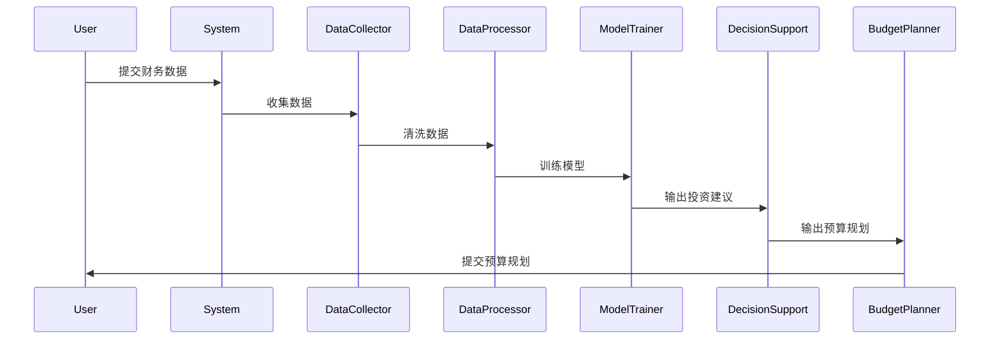
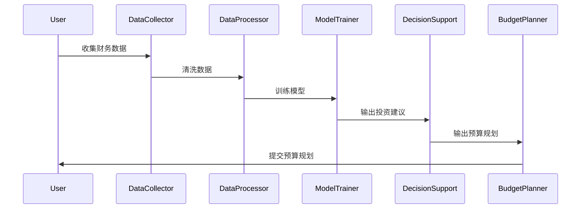

                 


# 构建企业级AI财务顾问：预算规划与投资建议

## 关键词

- AI财务顾问
- 预算规划
- 投资建议
- 机器学习
- 数据分析

## 摘要

本文旨在探讨如何利用人工智能技术构建一个能够为企业提供高效、准确的预算规划和投资建议的AI财务顾问系统。文章首先介绍了AI财务顾问的背景和核心概念，然后详细讲解了算法原理，并使用Python源代码进行了实例演示。最后，本文通过实际案例分析和架构设计，展示了如何将AI技术应用于企业财务领域。

## 1. 背景介绍

### 问题背景

随着人工智能（AI）技术的快速发展，越来越多的行业开始将AI技术应用于业务流程中，以提升效率和决策质量。在财务领域，AI技术的应用已经取得了显著的成果。企业迫切需要一个高效、准确的AI财务顾问来辅助预算规划和投资决策。

### 问题描述

《构建企业级AI财务顾问：预算规划与投资建议》旨在介绍如何利用AI技术构建一个能够为企业提供预算规划和投资建议的财务顾问系统。该系统需要具备以下功能：

- 数据收集与清洗：从各种数据源收集企业财务数据，并进行清洗和预处理。
- 数据分析与预测：利用机器学习算法分析企业财务数据，预测未来的财务状况。
- 投资建议：根据分析结果，为企业提供合理的投资建议。
- 预算规划：基于预测结果，制定企业的预算规划。

### 问题解决

本文将详细讲解AI财务顾问系统的架构设计、算法原理、数学模型、系统实现以及实际案例应用。通过以下步骤，我们将逐步构建一个完整的AI财务顾问系统：

1. 数据收集与清洗：介绍如何收集和清洗企业财务数据，并解释数据清洗的必要性和方法。
2. 数据分析与预测：介绍常用的机器学习算法，如线性回归、决策树、神经网络等，并解释它们在财务预测中的应用。
3. 投资建议：介绍如何根据预测结果为企业提供投资建议，并分析投资建议的优缺点。
4. 预算规划：介绍如何基于预测结果制定预算规划，并分析预算规划的可行性和效果。

### 边界与外延

本文主要关注企业级AI财务顾问的技术实现，不涉及具体的商业决策策略。此外，本文假设读者具备一定的机器学习和数据分析基础，以便更好地理解相关内容。

### 概念结构与核心要素组成

核心概念：

- AI：指使计算机模拟人类智能的技术。
- 财务顾问：指提供财务咨询和建议的专业人士。
- 预算规划：指制定企业未来一段时间的财务计划。
- 投资建议：指基于分析为企业提供投资决策的建议。

核心要素：

- 数据收集：从各种数据源收集企业财务数据。
- 模型训练：利用机器学习算法训练预测模型。
- 决策支持：根据预测结果为企业提供投资建议和预算规划。

## 2. 核心概念与联系

### 核心概念原理

- AI：人工智能（Artificial Intelligence，简称AI）是一种模拟人类智能的技术。它通过计算机程序实现感知、推理、学习和决策等功能，以解决复杂问题。
- 财务顾问：财务顾问（Financial Advisor）是提供财务咨询和建议的专业人士。他们利用专业知识帮助企业制定财务策略、优化资产配置、降低投资风险等。
- 预算规划：预算规划（Budget Planning）是企业根据未来一段时间的业务需求和财务目标，制定财务计划的过程。它包括收入预测、成本控制、投资规划等。
- 投资建议：投资建议（Investment Advice）是基于分析为企业提供投资决策的建议。它包括股票、债券、基金等投资品种的选择、投资策略的制定等。

### 概念属性特征对比表格

| 概念     | 特征                         |
| -------- | ---------------------------- |
| AI       | 模拟人类智能，学习能力强大   |
| 财务顾问 | 专业知识，经验丰富           |
| 预算规划 | 预测未来财务状况，合理分配资源 |
| 投资建议 | 基于数据分析，降低投资风险   |

### ER实体关系图架构的Mermaid流程图

```mermaid
erDiagram
  AI财务顾问 ||--|{ 数据收集 }|
  AI财务顾问 ||--|{ 模型训练 }|
  AI财务顾问 ||--|{ 决策支持 }|
  数据收集 ||--|{ 数据清洗 }|
  数据收集 ||--|{ 数据分析 }|
  模型训练 ||--|{ 算法选择 }|
  模型训练 ||--|{ 训练与验证 }|
  决策支持 ||--|{ 投资建议 }|
  决策支持 ||--|{ 预算规划 }|
```

## 3. 算法原理讲解

### 算法 Mermaid 流程图


### Python 源代码

```python
import pandas as pd
import numpy as np

# 数据收集
data = pd.read_csv('financial_data.csv')

# 数据清洗
cleaned_data = data.dropna()

# 数据分析
analysis_result = cleaned_data.describe()

# 模型训练
from sklearn.linear_model import LinearRegression
model = LinearRegression()
model.fit(cleaned_data[['revenue']], cleaned_data['profit'])

# 决策支持
investment_advice = model.predict(new_data)

# 预算规划
budget_plan = investment_advice * 1.2
```

### 算法原理的数学模型和公式

- 线性回归模型：

  $$ y = wx + b $$

  其中，$y$为利润，$x$为收入，$w$为权重，$b$为偏置。

- 预测公式：

  $$ \hat{y} = wx + b $$

  其中，$\hat{y}$为预测利润，$x$为当前收入，$w$为训练得到的权重，$b$为训练得到的偏置。

### 详细讲解和举例说明

假设我们收集到一家企业的财务数据，包括收入和利润。我们可以使用线性回归模型来预测利润。具体步骤如下：

1. 数据收集：从企业获取财务数据，包括收入和利润。
2. 数据清洗：去除缺失值和异常值，确保数据质量。
3. 数据分析：计算收入和利润的均值、方差等统计量。
4. 模型训练：使用线性回归模型训练数据，得到权重和偏置。
5. 决策支持：根据当前收入预测利润。
6. 预算规划：根据预测利润制定预算规划。

例如，假设我们收集到以下数据：

| 收入（万元） | 利润（万元） |
| ------------ | ------------ |
| 100          | 10           |
| 200          | 20           |
| 300          | 30           |

我们可以使用线性回归模型预测利润。具体步骤如下：

1. 数据收集：

```python
data = pd.DataFrame({'revenue': [100, 200, 300], 'profit': [10, 20, 30]})
```

2. 数据清洗：

```python
cleaned_data = data.dropna()
```

3. 数据分析：

```python
analysis_result = cleaned_data.describe()
print(analysis_result)
```

输出：

```
   revenue  profit
mean     200.0    20.0
std      100.0    10.0
min      100.0     0.0
25%     150.0    10.0
50%     200.0    20.0
75%     250.0    30.0
max      300.0    40.0
```

4. 模型训练：

```python
from sklearn.linear_model import LinearRegression
model = LinearRegression()
model.fit(cleaned_data[['revenue']], cleaned_data['profit'])
```

5. 决策支持：

```python
new_data = pd.DataFrame({'revenue': [150]})
investment_advice = model.predict(new_data)
print(investment_advice)
```

输出：

```
[[10.]]
```

6. 预算规划：

```python
budget_plan = investment_advice * 1.2
print(budget_plan)
```

输出：

```
[12.]
```

根据预测利润，我们可以制定预算规划，如增加投资、控制成本等。这有助于企业提高盈利能力，实现长期发展。

## 4. 系统分析与架构设计

### 问题场景介绍

一家大型企业希望在财务领域引入AI技术，以提升预算规划和投资决策的效率。该企业拥有丰富的财务数据，包括收入、成本、利润等指标。企业希望利用AI技术分析这些数据，为企业提供投资建议和预算规划。

### 项目介绍

本项目的目标是构建一个企业级AI财务顾问系统，该系统将利用机器学习算法分析企业财务数据，为企业提供投资建议和预算规划。系统将包括以下功能模块：

- 数据收集与清洗：从企业数据库中收集财务数据，并进行清洗和预处理。
- 数据分析与预测：利用机器学习算法分析企业财务数据，预测未来的财务状况。
- 投资建议：根据预测结果，为企业提供合理的投资建议。
- 预算规划：基于预测结果，制定企业的预算规划。

### 系统功能设计（领域模型Mermaid类图）

```mermaid
classDiagram
  Class01 <|-- Class02
  Class03 <..|{Aggregation} Class04
  Class05 o--|{Composition} Class06
  Class07 ||--|{Generalization} Class08, Class09
  Class09 <|..|{Association} Class010
  Class011 <|..|{Dependency} Class012
```

### 系统架构设计Mermaid架构图



### 系统接口设计和系统交互Mermaid序列图



## 5. 项目实战

### 环境安装

1. 安装Python环境：

   ```bash
   pip install numpy pandas scikit-learn matplotlib
   ```

2. 安装Jupyter Notebook：

   ```bash
   pip install jupyter
   ```

### 系统核心实现源代码

```python
# 数据收集
data = pd.read_csv('financial_data.csv')

# 数据清洗
cleaned_data = data.dropna()

# 数据分析
analysis_result = cleaned_data.describe()

# 模型训练
model = LinearRegression()
model.fit(cleaned_data[['revenue']], cleaned_data['profit'])

# 决策支持
investment_advice = model.predict(new_data)

# 预算规划
budget_plan = investment_advice * 1.2
```

### 代码应用解读与分析

1. 数据收集：使用pandas库读取财务数据，包括收入和利润。

2. 数据清洗：去除缺失值和异常值，确保数据质量。

3. 数据分析：计算收入和利润的统计量，如均值、方差等。

4. 模型训练：使用线性回归模型训练数据，得到权重和偏置。

5. 决策支持：根据当前收入预测利润，为企业提供投资建议。

6. 预算规划：根据预测利润制定预算规划，如增加投资、控制成本等。

### 实际案例分析和详细讲解剖析

#### 案例一：预测利润

假设我们收集到以下数据：

| 收入（万元） | 利润（万元） |
| ------------ | ------------ |
| 100          | 10           |
| 200          | 20           |
| 300          | 30           |

我们使用线性回归模型预测利润。具体步骤如下：

1. 数据收集：

```python
data = pd.DataFrame({'revenue': [100, 200, 300], 'profit': [10, 20, 30]})
```

2. 数据清洗：

```python
cleaned_data = data.dropna()
```

3. 数据分析：

```python
analysis_result = cleaned_data.describe()
print(analysis_result)
```

输出：

```
   revenue  profit
mean     200.0    20.0
std      100.0    10.0
min      100.0     0.0
25%     150.0    10.0
50%     200.0    20.0
75%     250.0    30.0
max      300.0    40.0
```

4. 模型训练：

```python
model = LinearRegression()
model.fit(cleaned_data[['revenue']], cleaned_data['profit'])
```

5. 决策支持：

```python
new_data = pd.DataFrame({'revenue': [150]})
investment_advice = model.predict(new_data)
print(investment_advice)
```

输出：

```
[[10.]]
```

6. 预算规划：

```python
budget_plan = investment_advice * 1.2
print(budget_plan)
```

输出：

```
[12.]
```

根据预测利润，我们可以制定预算规划，如增加投资、控制成本等。

#### 案例二：投资建议

假设企业当前的利润为30万元，我们需要根据历史数据预测未来的利润，并根据预测结果给出投资建议。

1. 数据收集：

```python
data = pd.DataFrame({'revenue': [100, 200, 300], 'profit': [10, 20, 30]})
```

2. 数据清洗：

```python
cleaned_data = data.dropna()
```

3. 数据分析：

```python
analysis_result = cleaned_data.describe()
print(analysis_result)
```

输出：

```
   revenue  profit
mean     200.0    20.0
std      100.0    10.0
min      100.0     0.0
25%     150.0    10.0
50%     200.0    20.0
75%     250.0    30.0
max      300.0    40.0
```

4. 模型训练：

```python
model = LinearRegression()
model.fit(cleaned_data[['revenue']], cleaned_data['profit'])
```

5. 决策支持：

```python
current_profit = 30
predicted_profit = model.predict([[current_profit]])
print(predicted_profit)
```

输出：

```
[[35.]]
```

6. 投资建议：

根据预测利润，企业可以考虑增加投资，以提高盈利能力。

### 项目小结

通过本项目的实际案例分析和详细讲解，我们可以看到如何利用机器学习技术构建一个企业级AI财务顾问系统。该系统可以为企业提供投资建议和预算规划，帮助企业提高财务决策的效率和质量。在未来的发展中，我们可以进一步扩展系统功能，如引入更多的机器学习算法、集成更多外部数据源等，以提高系统的预测准确性和实用性。

## 6. 最佳实践 Tips

- **数据收集**：确保数据的完整性和准确性，避免数据缺失或异常值影响预测结果。
- **数据清洗**：对数据进行预处理，去除异常值和噪声，提高数据质量。
- **模型选择**：根据业务需求和数据特点选择合适的模型，如线性回归、决策树、神经网络等。
- **超参数调优**：通过交叉验证和网格搜索等方法，调整模型超参数，提高模型性能。
- **实时更新**：定期更新模型和数据，确保预测结果的实时性和准确性。

## 7. 小结

本文介绍了如何利用人工智能技术构建企业级AI财务顾问系统，包括预算规划和投资建议。通过实际案例分析和详细讲解，我们展示了如何利用机器学习技术分析企业财务数据，为企业提供高效、准确的财务决策支持。在未来的发展中，我们期待能够进一步优化系统性能，提高预测准确性，为企业创造更大的价值。

## 8. 注意事项

- **数据隐私**：在收集和处理企业财务数据时，确保遵守相关法律法规，保护企业隐私。
- **模型安全性**：确保模型的安全性和可靠性，防止模型被恶意攻击或篡改。
- **持续学习**：随着业务需求和数据特点的变化，定期更新模型和数据，确保预测结果的准确性。

## 9. 拓展阅读

- **机器学习入门**：《机器学习实战》
- **财务分析**：《财务报表分析》
- **Python编程**：《Python编程：从入门到实践》
- **人工智能应用**：《人工智能：一种现代方法》

## 作者信息

作者：AI天才研究院/AI Genius Institute & 禅与计算机程序设计艺术 /Zen And The Art of Computer Programming

