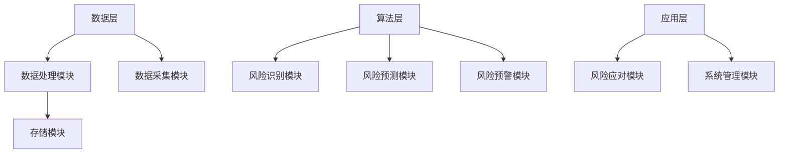
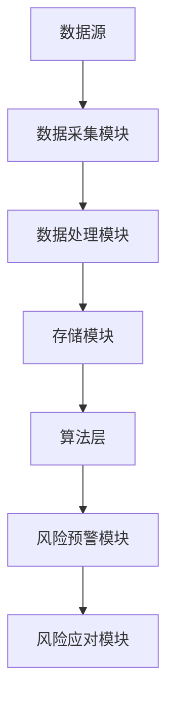
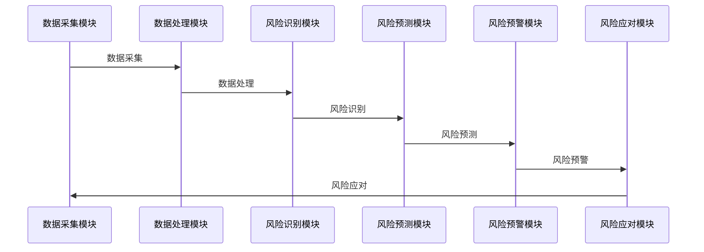

                 

# 构建企业级AI风控助手：实时监控与风险预警

关键词：企业级AI风控、实时监控、风险预警、技术架构、实战案例

摘要：随着人工智能技术在企业中的广泛应用，AI风控助手成为企业风险管理的重要工具。本文将探讨企业级AI风控助手的构建方法，包括实时监控与风险预警的技术原理、系统设计与实现，并通过实战案例进行详细剖析，帮助企业提升风险管理能力。

### 第一部分：背景介绍

## 第1章：问题背景与核心概念

### 1.1 问题背景

#### 1.1.1 人工智能在企业的应用现状

人工智能（AI）作为当今科技领域的重要发展方向，已逐步渗透到企业各个业务环节。从智能制造、智能客服到智能金融，AI技术为企业带来了显著的效率提升和成本优化。然而，随着AI应用规模的扩大，企业面临着日益复杂的风险管理挑战。

#### 1.1.2 风险管理的挑战与需求

企业风险主要来源于市场环境、运营管理、技术安全等多个方面。传统风险管理方法依赖于人工监控和经验判断，存在响应迟缓、覆盖不全等问题。随着企业对实时性、精准性要求不断提高，传统方法已难以满足需求。因此，构建基于AI的企业级风控助手成为必然选择。

#### 1.1.3 AI风控技术的兴起与发展

AI风控技术通过数据分析和模型预测，实现对风险的实时监控和预警。近年来，随着大数据、云计算和深度学习等技术的发展，AI风控逐渐从理论研究走向实际应用，成为企业提升风险管理能力的有力工具。

### 1.2 核心概念

#### 1.2.1 AI风控的定义

AI风控是指利用人工智能技术对企业的运营、财务、合规等方面进行风险评估和管理。其主要目标是实时识别潜在风险，预测风险趋势，为决策提供支持。

#### 1.2.2 实时监控与风险预警

实时监控是指通过技术手段，对企业运营过程中的关键指标进行持续跟踪和监控。风险预警则是在实时监控的基础上，结合风险预测模型，提前发现和预警潜在风险。

#### 1.2.3 企业级AI风控的特点

企业级AI风控具有以下特点：

1. **高度集成**：将多个业务模块的数据整合，形成统一的风险管理平台。
2. **实时性**：实现对企业运营数据的实时监控和分析，快速响应风险事件。
3. **精准性**：利用大数据和机器学习技术，提高风险识别和预测的准确性。
4. **智能化**：通过自主学习，不断优化风险预测模型，提高风控效果。

### 1.3 边界与外延

#### 1.3.1 AI风控的范畴

AI风控主要涵盖以下几个方面：

1. **信用风险**：对客户信用状况进行评估和监控。
2. **市场风险**：对市场波动和宏观经济环境进行预测和应对。
3. **运营风险**：对内部业务流程和管理漏洞进行识别和改进。
4. **合规风险**：对法律法规和行业标准进行合规性检查。

#### 1.3.2 企业级应用的特殊性

企业级应用具有数据量大、业务复杂、风险多样化等特点，对AI风控系统的性能和稳定性要求较高。此外，企业级应用还需要充分考虑数据隐私和安全性等问题。

#### 1.3.3 与传统风控技术的区别

与传统风控技术相比，AI风控具有以下优势：

1. **实时性**：传统方法通常需要定期分析，而AI风控可以实现实时监控和预警。
2. **精准性**：通过大数据和机器学习技术，AI风控能够更准确地识别和预测风险。
3. **智能化**：AI风控系统可以自主学习，不断优化风控效果。

### 1.4 概念结构与核心要素

#### 1.4.1 AI风控的技术架构

AI风控技术架构主要包括数据采集、数据处理、风险评估和风险预警等模块。数据采集模块负责收集企业内外部的数据；数据处理模块对数据进行清洗、转换和存储；风险评估模块利用数据分析和模型预测，实现对风险的识别和评估；风险预警模块则根据风险评估结果，触发预警信号。

#### 1.4.2 风险监控的关键要素

风险监控的关键要素包括：

1. **数据源**：风险监控的数据来源是企业内部和外部数据。
2. **指标体系**：建立一套完整的风险指标体系，用于衡量不同类型的风险。
3. **监控算法**：选择合适的监控算法，实现对风险指标的实时分析。
4. **报警机制**：当风险指标超过阈值时，触发报警机制，通知相关人员进行处理。

#### 1.4.3 风险预警机制

风险预警机制主要包括：

1. **预警策略**：根据风险类型和程度，制定相应的预警策略。
2. **预警算法**：选择合适的预警算法，实现对风险的预测和预警。
3. **预警信号**：当风险预警触发时，生成相应的预警信号，通知相关人员。
4. **响应机制**：制定风险应对策略，快速响应风险事件。

## 第2章：AI风控的核心原理与联系

### 2.1 核心原理

#### 2.1.1 数据驱动风险识别

数据驱动风险识别是AI风控的核心原理之一。通过对企业内外部数据的收集和分析，识别出潜在的风险因素。数据驱动风险识别主要包括以下几个步骤：

1. **数据采集**：收集企业内部和外部数据，包括财务数据、市场数据、运营数据等。
2. **数据处理**：对数据进行清洗、转换和存储，确保数据质量。
3. **特征提取**：从数据中提取关键特征，用于构建风险模型。
4. **风险模型构建**：利用机器学习算法，构建风险识别模型。
5. **风险预测**：通过模型预测，识别出潜在的风险。

#### 2.1.2 模型驱动的风险预测

模型驱动的风险预测是AI风控的另一个核心原理。通过建立风险预测模型，对未来的风险趋势进行预测。模型驱动的风险预测主要包括以下几个步骤：

1. **数据预处理**：对数据进行清洗、转换和标准化，确保数据质量。
2. **模型选择**：选择合适的机器学习模型，如决策树、随机森林、神经网络等。
3. **模型训练**：利用历史数据训练模型，优化模型参数。
4. **模型评估**：通过交叉验证等方法，评估模型性能。
5. **风险预测**：利用训练好的模型，对未来风险进行预测。

#### 2.1.3 基于规则的实时监控

基于规则的实时监控是AI风控的另一个重要组成部分。通过制定一系列规则，实现对风险指标的实时监控和报警。基于规则的实时监控主要包括以下几个步骤：

1. **规则制定**：根据业务需求和风险特征，制定相应的监控规则。
2. **规则匹配**：将实时采集到的数据与规则进行匹配，判断是否触发报警。
3. **报警处理**：当规则匹配成功时，触发报警信号，通知相关人员。
4. **规则优化**：根据报警效果和业务需求，不断优化规则。

### 2.2 概念属性特征对比

#### 2.2.1 数据驱动与模型驱动的比较

| 对比项 | 数据驱动 | 模型驱动 |
| --- | --- | --- |
| 原理 | 通过数据分析和特征提取，识别风险因素 | 通过建立预测模型，预测未来风险 |
| 数据依赖 | 需要大量历史数据 | 需要足够的历史数据和未来数据 |
| 可解释性 | 较高 | 较低 |
| 适用场景 | 风险识别 | 风险预测 |

#### 2.2.2 基于规则与基于机器学习的监控

| 对比项 | 基于规则 | 基于机器学习 |
| --- | --- | --- |
| 原理 | 通过预定义的规则进行监控 | 通过学习和建模进行监控 |
| 可解释性 | 高 | 较低 |
| 灵活性 | 较低 | 较高 |
| 适用场景 | 需要明确监控条件的场景 | 需要复杂监控和自适应调整的场景 |

### 2.3 ER实体关系图架构

#### 2.3.1 实体关系图的基本概念

实体关系图（Entity-Relationship Diagram，ER图）是一种用于描述数据库中实体及其关系的图形表示方法。它包括以下基本概念：

1. **实体**：具有共同特征的对象集合，如客户、订单等。
2. **属性**：实体的特征，如客户的姓名、年龄等。
3. **关系**：实体之间的关联，如客户下单、订单包含商品等。

#### 2.3.2 AI风控系统中的实体与关系

在AI风控系统中，常见的实体包括：

1. **客户**：客户的信用评分、交易记录等。
2. **交易**：交易的行为、金额、时间等。
3. **风险因素**：市场波动、政策变化等。

常见的关系包括：

1. **客户-交易**：一个客户可以有多个交易，一个交易属于一个客户。
2. **交易-风险因素**：一个交易可能会受到多个风险因素的影响，一个风险因素可以影响多个交易。

以下是AI风控系统的ER图（使用Mermaid语法）：

```mermaid
erDiagram
  客户 ||--|{ 交易 }|-->: 有多个交易
  交易 ||--|{ 风险因素 }|-->: 受到多个风险因素影响
```

### 第二部分：实时监控与风险预警技术

## 第3章：实时监控技术原理与应用

### 3.1 实时监控的定义与重要性

#### 3.1.1 实时监控的基本概念

实时监控（Real-time Monitoring）是指通过技术手段，对系统、网络、应用等关键组件进行持续跟踪和监控，及时发现和预警潜在问题和故障。实时监控的核心目标是确保系统的稳定运行，降低风险。

#### 3.1.2 实时监控在企业风控中的价值

在企业风控中，实时监控具有以下价值：

1. **风险预防**：实时监控可以帮助企业提前发现潜在风险，避免风险事件的发生。
2. **快速响应**：实时监控可以快速识别问题，触发预警信号，缩短问题解决时间。
3. **数据积累**：实时监控可以积累大量历史数据，为后续风险分析和优化提供依据。
4. **合规要求**：对于一些行业，实时监控是合规要求的一部分，如金融行业的交易监控。

### 3.2 实时监控的技术架构

实时监控的技术架构通常包括以下几个模块：

#### 3.2.1 数据采集模块

数据采集模块负责从各种数据源（如服务器、网络设备、应用程序等）收集数据。常见的数据采集方式包括：

1. **日志收集**：通过日志文件收集系统运行数据。
2. **网络流量监控**：通过网络流量监控工具收集网络数据。
3. **性能指标监控**：通过性能指标收集工具收集系统性能数据。

#### 3.2.2 数据处理模块

数据处理模块负责对采集到的数据进行处理，包括数据清洗、转换和存储。数据处理模块的关键技术包括：

1. **数据清洗**：去除重复数据、异常数据等，确保数据质量。
2. **数据转换**：将不同格式的数据转换为统一格式，便于后续处理。
3. **数据存储**：将处理后的数据存储到数据库或数据仓库中，供后续分析和查询。

#### 3.2.3 风险评估模块

风险评估模块负责对处理后的数据进行风险评估，识别潜在风险。风险评估模块的关键技术包括：

1. **规则引擎**：根据预定义的规则，对数据进行判断，识别风险。
2. **机器学习**：利用机器学习算法，对数据进行分析，识别潜在风险。
3. **专家系统**：利用专家知识库，对数据进行判断，识别风险。

#### 3.2.4 风险预警模块

风险预警模块负责根据风险评估结果，触发预警信号，通知相关人员。风险预警模块的关键技术包括：

1. **预警策略**：根据风险类型和程度，制定相应的预警策略。
2. **预警算法**：选择合适的预警算法，实现对风险的预测和预警。
3. **预警信号**：当风险预警触发时，生成相应的预警信号，通知相关人员。

### 3.3 实时监控的关键算法

#### 3.3.1 实时数据分析算法

实时数据分析算法负责对实时采集到的数据进行分析，识别潜在风险。常见的实时数据分析算法包括：

1. **时间序列分析**：对时间序列数据进行统计分析，识别异常点。
2. **聚类分析**：将数据划分为不同的簇，识别异常数据。
3. **异常检测**：利用统计方法或机器学习算法，识别异常数据。

#### 3.3.2 实时风险预测算法

实时风险预测算法负责根据历史数据和实时数据，预测未来风险。常见的实时风险预测算法包括：

1. **回归分析**：利用历史数据建立回归模型，预测未来风险。
2. **时间序列预测**：利用时间序列分析方法，预测未来风险。
3. **神经网络**：利用神经网络模型，预测未来风险。

#### 3.3.3 实时报警算法

实时报警算法负责根据风险评估结果，触发预警信号。常见的实时报警算法包括：

1. **阈值报警**：根据预设的阈值，判断是否触发报警。
2. **规则报警**：根据预定义的规则，判断是否触发报警。
3. **机器学习报警**：利用机器学习算法，判断是否触发报警。

### 3.4 实时监控案例分析

#### 3.4.1 案例背景与目标

某金融机构希望构建一套实时监控和风险预警系统，实现对交易过程的实时监控和风险预警，确保交易安全。

#### 3.4.2 技术选型与实现

该金融机构选择了以下技术：

1. **数据采集模块**：采用Prometheus进行日志收集和性能指标监控。
2. **数据处理模块**：采用Kafka进行数据传输和处理，使用Flink进行实时数据处理。
3. **风险评估模块**：采用规则引擎和机器学习算法进行风险评估。
4. **风险预警模块**：采用Prometheus报警机制和邮件通知。

技术实现流程如下：

1. **数据采集**：通过Prometheus采集交易日志和性能指标。
2. **数据处理**：通过Kafka将数据传输到Flink，进行实时数据处理。
3. **风险评估**：通过规则引擎和机器学习算法对数据进行风险评估。
4. **风险预警**：当风险触发时，通过Prometheus报警机制和邮件通知相关人员。

#### 3.4.3 结果与评估

通过该实时监控和风险预警系统的构建，该金融机构实现了以下成果：

1. **交易监控**：实时监控交易过程，确保交易安全。
2. **风险预警**：及时识别潜在风险，触发预警信号。
3. **数据积累**：积累大量历史数据，为后续风险分析和优化提供依据。

评估结果显示，该系统在提高交易安全性和降低风险损失方面取得了显著成效。

## 第4章：风险预警机制设计与实现

### 4.1 风险预警的定义与目标

#### 4.1.1 风险预警的基本概念

风险预警（Risk Warning）是指通过对企业运营过程中的风险进行识别、评估和预测，提前发现和预警潜在风险，为决策提供支持。风险预警的目标是：

1. **预防风险**：通过提前识别和预警，预防风险事件的发生。
2. **降低损失**：在风险事件发生后，及时采取应对措施，降低损失。
3. **提高决策效率**：为管理层提供准确、及时的风险信息，提高决策效率。

#### 4.1.2 风险预警的目标与作用

风险预警的目标包括：

1. **识别风险**：通过数据分析和模型预测，识别潜在的风险因素。
2. **评估风险**：对识别出的风险因素进行评估，确定风险的严重程度。
3. **预警风险**：根据风险评估结果，提前预警潜在风险。
4. **响应风险**：在风险事件发生后，快速采取应对措施，降低损失。

风险预警在企业管理中的作用：

1. **决策支持**：为管理层提供准确、及时的风险信息，辅助决策。
2. **风险管理**：帮助企业建立完善的风险管理体系，提高风险管理能力。
3. **预防风险**：提前识别和预警潜在风险，预防风险事件的发生。
4. **降低损失**：在风险事件发生后，及时采取应对措施，降低损失。

### 4.2 风险预警机制的设计原则

设计风险预警机制时，需要遵循以下原则：

#### 4.2.1 全方位监控

风险预警机制应覆盖企业运营的各个方面，包括财务、运营、合规等，确保全方位监控风险。

#### 4.2.2 及时性

风险预警机制应具备及时性，能够在风险事件发生前及时发现并预警，缩短响应时间。

#### 4.2.3 准确性

风险预警机制应具有较高的准确性，能够准确识别和评估风险，避免误报和漏报。

#### 4.2.4 可扩展性

风险预警机制应具备可扩展性，能够根据业务发展和需求变化，灵活调整和优化。

#### 4.2.5 易用性

风险预警机制应具备易用性，便于操作和维护，提高使用效率。

### 4.3 风险预警机制的核心组件

风险预警机制的核心组件包括：

#### 4.3.1 风险指标体系

风险指标体系是风险预警的基础，包括财务指标、运营指标、合规指标等。风险指标应具有可量化、可比较、可监控的特点。

#### 4.3.2 风险阈值设置

风险阈值设置是风险预警的核心，根据风险指标和业务需求，设定合理的风险阈值，用于判断是否触发预警。

#### 4.3.3 风险预警算法

风险预警算法负责对风险指标进行实时分析和预测，判断是否触发预警。常见的风险预警算法包括规则算法、机器学习算法等。

#### 4.3.4 预警信号生成

预警信号生成是风险预警的最后一环，根据风险预警算法的结果，生成相应的预警信号，通知相关人员。

### 4.4 风险预警机制的实现

风险预警机制的实现包括以下几个步骤：

#### 4.4.1 数据预处理

数据预处理是风险预警的基础，包括数据采集、数据清洗、数据转换等。数据预处理的关键是确保数据质量，避免因数据问题导致预警不准确。

#### 4.4.2 风险评估与预警

风险评估与预警是风险预警机制的核心，根据风险指标和风险阈值，实时分析风险，判断是否触发预警。

1. **规则评估**：根据预定义的规则，对风险指标进行判断，判断是否触发预警。
2. **机器学习评估**：利用机器学习算法，对风险指标进行预测，判断是否触发预警。

#### 4.4.3 风险应对策略

在风险预警触发后，需要制定相应的风险应对策略，包括：

1. **风险隔离**：将受影响的业务进行隔离，避免风险蔓延。
2. **问题修复**：根据预警信息，快速定位问题，进行修复。
3. **应急响应**：启动应急预案，进行应急响应。
4. **后续监控**：在风险事件处理后，对风险进行后续监控，确保问题解决。

### 4.5 风险预警案例分析

#### 4.5.1 案例背景与目标

某电子商务平台希望通过构建风险预警机制，实现对平台运营过程中的风险进行实时监控和预警，确保平台稳定运行。

#### 4.5.2 风险预警机制的设计与实现

该电子商务平台设计了以下风险预警机制：

1. **风险指标体系**：包括订单量、订单取消率、用户满意度等。
2. **风险阈值设置**：根据业务需求和历史数据，设定合理的风险阈值。
3. **风险预警算法**：采用机器学习算法，对风险指标进行预测和评估。
4. **预警信号生成**：根据风险预警算法的结果，生成预警信号，通知相关人员。

技术实现流程如下：

1. **数据采集**：通过日志收集器和数据采集器，实时采集订单数据、用户数据等。
2. **数据预处理**：对采集到的数据进行清洗、转换和存储。
3. **风险评估**：利用机器学习算法，对风险指标进行预测和评估。
4. **预警信号生成**：根据风险评估结果，生成预警信号，通过邮件、短信等方式通知相关人员。

#### 4.5.3 结果与评估

通过该风险预警机制的构建，该电子商务平台实现了以下成果：

1. **实时监控**：实现了对订单量、订单取消率、用户满意度等关键指标的实时监控。
2. **风险预警**：及时发现和预警潜在风险，确保平台稳定运行。
3. **决策支持**：为管理层提供了准确、及时的风险信息，提高了决策效率。

评估结果显示，该风险预警机制在提高平台运营稳定性和降低风险损失方面取得了显著成效。

### 第三部分：企业级AI风控助手构建实战

## 第5章：环境搭建与工具配置

### 5.1 环境搭建

#### 5.1.1 硬件环境

为了构建企业级AI风控助手，需要搭建以下硬件环境：

1. **服务器**：服务器用于存储数据和运行应用程序，建议选择高性能、高可靠性的服务器。
2. **存储设备**：存储设备用于存储海量数据，建议选择分布式存储系统，如Hadoop、Cassandra等。
3. **网络设备**：网络设备用于搭建内部网络，确保数据传输的稳定性。

#### 5.1.2 软件环境

软件环境包括以下部分：

1. **操作系统**：建议选择Linux操作系统，如CentOS、Ubuntu等。
2. **编程语言**：选择Python作为主要编程语言，因为Python具有丰富的AI和数据处理库。
3. **开发工具**：使用Jupyter Notebook或PyCharm等开发工具进行代码编写和调试。

#### 5.1.3 网络配置

网络配置包括以下部分：

1. **内部网络**：搭建内部网络，实现服务器和存储设备之间的数据传输。
2. **外部网络**：配置防火墙和VPN，确保外部网络的安全访问。

### 5.2 工具配置

#### 5.2.1 数据处理工具

数据处理工具包括以下部分：

1. **Pandas**：用于数据清洗、转换和分析。
2. **NumPy**：用于数值计算和数据处理。
3. **Scikit-learn**：用于机器学习算法的实现和评估。

#### 5.2.2 机器学习框架

机器学习框架包括以下部分：

1. **TensorFlow**：用于构建和训练深度学习模型。
2. **PyTorch**：用于构建和训练深度学习模型。
3. **XGBoost**：用于构建和训练机器学习模型。

#### 5.2.3 实时监控工具

实时监控工具包括以下部分：

1. **Prometheus**：用于数据采集和监控。
2. **Grafana**：用于数据可视化。
3. **Kafka**：用于实时数据传输。

## 第6章：系统设计与实现

### 6.1 系统功能设计

#### 6.1.1 功能需求分析

企业级AI风控助手的系统功能需求包括以下部分：

1. **数据采集**：实时采集企业内部和外部数据，如订单数据、用户数据、市场数据等。
2. **数据处理**：对采集到的数据进行清洗、转换和存储。
3. **风险识别**：利用机器学习算法，对数据进行风险识别。
4. **风险预测**：利用机器学习算法，对风险进行预测。
5. **风险预警**：根据风险预测结果，生成预警信号。
6. **风险应对**：根据预警信号，制定相应的风险应对策略。

#### 6.1.2 领域模型设计

领域模型设计包括以下部分：

1. **实体**：包括订单、用户、风险等实体。
2. **属性**：实体的属性，如订单的金额、用户的年龄等。
3. **关系**：实体之间的关系，如订单与用户之间的关系。

以下是一个简单的领域模型（使用Mermaid语法）：

```mermaid
classDiagram
  Order <<entity>>
  User <<entity>>
  Risk <<entity>>

  Order "1"-->"1" User: 用户下单
  User "1"-->"1" Risk: 用户面临风险
```

#### 6.1.3 功能模块划分

根据功能需求分析，企业级AI风控助手可以分为以下功能模块：

1. **数据采集模块**：负责实时采集企业内部和外部数据。
2. **数据处理模块**：负责数据清洗、转换和存储。
3. **风险识别模块**：负责利用机器学习算法进行风险识别。
4. **风险预测模块**：负责利用机器学习算法进行风险预测。
5. **风险预警模块**：负责根据风险预测结果生成预警信号。
6. **风险应对模块**：负责根据预警信号制定相应的风险应对策略。

### 6.2 系统架构设计

企业级AI风控助手的系统架构设计包括以下部分：

#### 6.2.1 系统架构概述

系统架构设计分为以下几个层次：

1. **数据层**：包括数据采集、数据处理和存储。
2. **算法层**：包括风险识别、风险预测和风险预警。
3. **应用层**：包括风险应对和系统管理。

以下是一个简单的系统架构图（使用Mermaid语法）：



#### 6.2.2 数据流设计

数据流设计描述了数据在系统中的流动过程。以下是一个简单的数据流图（使用Mermaid语法）：



#### 6.2.3 系统模块间交互

系统模块间交互描述了各个模块之间的交互过程。以下是一个简单的交互图（使用Mermaid语法）：



### 6.3 系统接口设计与实现

#### 6.3.1 接口设计原则

接口设计应遵循以下原则：

1. **简洁性**：接口设计应简洁明了，避免过多的参数和复杂逻辑。
2. **一致性**：接口设计应保持一致性，便于后续维护和扩展。
3. **安全性**：接口设计应考虑安全性，防止数据泄露和恶意攻击。
4. **可扩展性**：接口设计应具备可扩展性，便于后续功能扩展和升级。

#### 6.3.2 接口实现方法

接口实现方法包括以下部分：

1. **RESTful API**：使用RESTful API设计接口，便于数据交互和调用。
2. **数据格式**：使用JSON或XML等数据格式进行数据传输。
3. **安全认证**：使用OAuth2.0等安全认证机制，确保接口安全性。

以下是一个简单的接口示例（使用Python Flask框架）：

```python
from flask import Flask, request, jsonify

app = Flask(__name__)

@app.route('/api/data', methods=['GET'])
def get_data():
    data = request.args.get('data')
    # 数据处理逻辑
    result = process_data(data)
    return jsonify(result)

if __name__ == '__main__':
    app.run()
```

#### 6.3.3 接口测试与优化

接口测试与优化包括以下部分：

1. **功能测试**：测试接口的功能是否按照预期执行。
2. **性能测试**：测试接口的性能和响应时间。
3. **安全测试**：测试接口的安全性，防止恶意攻击和数据泄露。
4. **优化**：根据测试结果，对接口进行优化，提高性能和安全性。

### 6.4 系统交互设计

#### 6.4.1 系统交互概述

系统交互设计描述了系统各个模块之间的交互过程，包括数据传输、消息队列、事件驱动等。

#### 6.4.2 交互流程设计

以下是一个简单的交互流程设计（使用Mermaid语法）：


### 第7章：系统测试与优化

#### 7.1 系统测试

系统测试是确保企业级AI风控助手稳定、可靠运行的重要环节。系统测试包括以下部分：

1. **功能测试**：测试各个功能模块是否按照预期执行。
2. **性能测试**：测试系统在高负载、大并发情况下的性能和稳定性。
3. **安全测试**：测试系统在面临恶意攻击和数据泄露时的安全性能。
4. **兼容性测试**：测试系统在不同操作系统、浏览器等环境下的兼容性。

#### 7.2 系统优化

系统优化是提升企业级AI风控助手性能和稳定性的关键。系统优化包括以下部分：

1. **代码优化**：优化代码结构、算法效率等，提高系统性能。
2. **数据库优化**：优化数据库查询性能、存储结构等，提高数据读写速度。
3. **缓存机制**：引入缓存机制，减少数据库查询次数，提高系统响应速度。
4. **分布式架构**：采用分布式架构，提高系统可扩展性和容错性。

#### 7.3 系统部署

系统部署是将企业级AI风控助手部署到生产环境的过程。系统部署包括以下部分：

1. **环境准备**：准备服务器、存储设备、网络设备等硬件环境。
2. **软件安装**：安装操作系统、开发工具、数据库等软件环境。
3. **数据迁移**：将开发环境的数据迁移到生产环境。
4. **系统配置**：配置系统参数、安全策略等。
5. **上线测试**：对部署后的系统进行测试，确保正常运行。

### 第8章：项目小结与拓展

#### 8.1 项目小结

通过本项目的实施，我们成功构建了一款企业级AI风控助手，实现了实时监控和风险预警功能。项目成果包括：

1. **数据采集**：实现了对企业内部和外部数据的实时采集。
2. **数据处理**：实现了数据的清洗、转换和存储。
3. **风险识别**：利用机器学习算法，实现了对风险的实时识别。
4. **风险预测**：利用机器学习算法，实现了对风险的实时预测。
5. **风险预警**：根据风险预测结果，实现了实时预警。
6. **风险应对**：根据预警信号，制定了相应的风险应对策略。

#### 8.2 拓展阅读

1. 《深度学习》
2. 《机器学习实战》
3. 《Python数据科学手册》
4. 《企业级大数据处理技术》

作者：AI天才研究院/AI Genius Institute & 禅与计算机程序设计艺术 /Zen And The Art of Computer Programming

