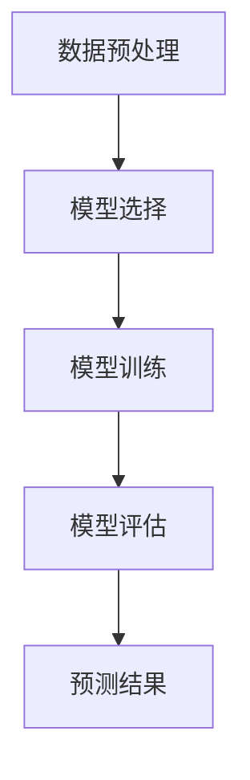
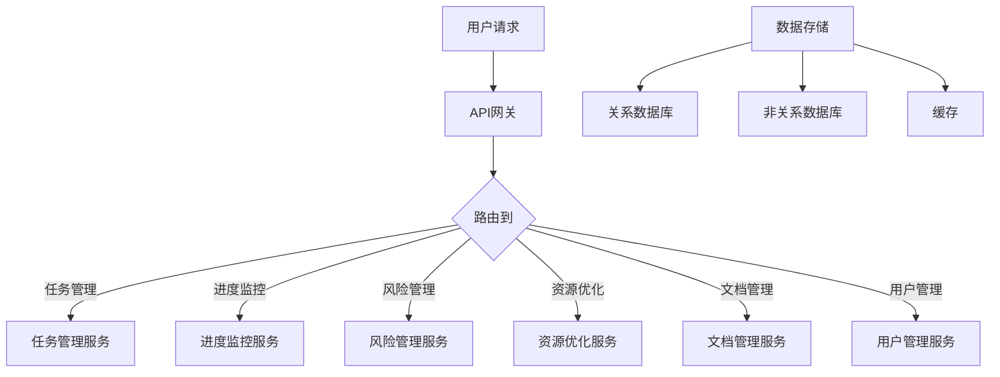
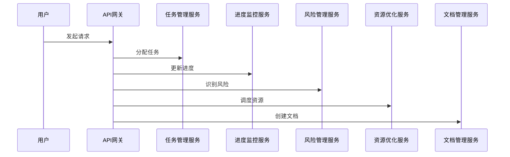

                 

### 第一部分：企业级AI驱动的项目管理助手概述

#### 第1章：项目管理助手的需求背景

### 1.1 问题背景

在现代项目管理中，随着项目规模的不断扩大、复杂性日益增加，传统的项目管理方法面临着诸多挑战。项目管理涉及的人员、资源、进度、风险等多方面因素，需要高效的管理工具来支持。然而，传统的项目管理工具通常依赖于人工经验和简单规则，难以应对复杂多变的项目环境。

首先，项目管理面临的一个重要挑战是信息的有效管理。项目中的数据量大且多样化，包括项目计划、资源分配、任务进度、风险报告等，如何高效地收集、存储、处理和分析这些数据成为项目成功的关键。

其次，项目进度控制是项目管理中的另一个难点。项目进度往往受到资源短缺、任务延迟、人员变动等因素的影响，如何实时跟踪项目进度，预测潜在的风险和问题，并及时调整计划，以确保项目按时完成，是项目管理中的一大挑战。

此外，风险管理也是项目管理中不可忽视的一环。项目风险多种多样，包括技术风险、市场风险、资源风险等。如何准确地识别、评估和应对这些风险，以确保项目的顺利推进，是项目管理中的重要任务。

### 1.2 AI技术在项目管理中的应用潜力

随着人工智能（AI）技术的发展，AI技术在项目管理中的应用潜力逐渐显现。AI驱动的项目管理助手可以借助机器学习、自然语言处理、数据挖掘等技术，提高项目管理效率和准确性，解决传统项目管理工具面临的挑战。

首先，AI驱动的项目管理助手能够通过数据分析和挖掘，识别项目中的潜在问题，并提供相应的解决方案。例如，通过分析历史项目数据，AI可以预测项目的关键路径，识别潜在的瓶颈和风险，从而帮助项目经理提前做好应对准备。

其次，AI驱动的项目管理助手可以实现自动化任务分配和资源调度。通过分析项目成员的能力和工作负荷，AI可以智能地分配任务，优化资源利用效率，减少人力资源浪费，提高项目进度。

此外，AI驱动的项目管理助手还可以通过自然语言处理技术，自动解析和生成项目文档，提高项目沟通效率。例如，AI可以自动生成项目计划、任务说明、会议记录等文档，减少人工编写的工作量，降低错误率。

### 1.3 问题描述

项目管理的核心问题主要包括信息管理、进度控制和风险管理等方面。这些问题在传统项目管理中普遍存在，导致项目管理效率低下、项目进度延迟、项目成本增加等问题。

- **信息管理**：传统项目管理工具难以高效地收集、存储和处理多样化的项目数据，导致信息滞后、数据不准确，影响项目决策。
- **进度控制**：项目进度受多种因素影响，传统方法难以实时跟踪项目进度，预测潜在风险，导致项目进度延误。
- **风险管理**：传统项目管理工具在风险识别、评估和应对策略方面存在不足，导致项目面临较大的风险。

为了解决这些问题，AI驱动的项目管理助手应运而生。它通过集成AI技术，提供智能化、自动化的项目管理解决方案，提高项目管理的效率和准确性。

### 1.4 问题解决

AI驱动的项目管理助手具有以下功能特点：

1. **数据分析和挖掘**：通过大数据分析和挖掘技术，识别项目中的潜在问题和风险，提供数据驱动的决策支持。
2. **自动化任务分配和资源调度**：根据项目需求和人员能力，智能地分配任务和调度资源，优化项目进度和资源利用效率。
3. **自然语言处理**：自动解析和生成项目文档，提高项目沟通效率。
4. **实时监控和预警**：实时跟踪项目进度，预测潜在风险，提供预警和应对策略。

与传统的项目管理工具相比，AI驱动的项目管理助手具有以下优势：

1. **高效性**：通过自动化和智能化手段，提高项目管理效率，减少人工工作量。
2. **准确性**：基于数据分析和预测，提供更准确的项目评估和决策支持。
3. **灵活性**：适应不同规模和复杂度的项目，提供定制化的解决方案。
4. **实时性**：实时监控项目进展，及时识别和应对潜在风险。

### 1.5 边界与外延

#### 项目管理助手的适用范围

AI驱动的项目管理助手适用于各种规模和复杂度的项目，包括但不限于：

1. **软件开发项目**：通过自动化任务分配和进度跟踪，提高软件开发效率。
2. **建筑与工程建设项目**：通过数据分析和风险预测，优化项目规划和进度。
3. **市场营销与推广项目**：通过自然语言处理和数据分析，提升项目策划和执行效果。
4. **科研项目**：通过数据挖掘和预测分析，提供科研方向和资源配置的参考。

#### AI驱动的项目管理助手与其他项目管理工具的比较

AI驱动的项目管理助手与传统的项目管理工具相比，具有以下差异：

1. **技术基础**：传统的项目管理工具主要依赖于人工经验和简单规则，而AI驱动的项目管理助手基于AI技术，提供智能化、自动化的解决方案。
2. **功能特点**：AI驱动的项目管理助手具备数据分析和挖掘、自动化任务分配、实时监控等功能，而传统的项目管理工具在这些方面存在明显不足。
3. **应用范围**：AI驱动的项目管理助手适用于更广泛的项目类型，而传统的项目管理工具则受限于特定场景和应用。

### 1.6 概念结构与核心要素组成

#### 项目管理助手的基本概念

项目管理助手是指一种基于AI技术的智能化工具，用于辅助项目经理进行项目管理和决策。它通过集成大数据分析、机器学习、自然语言处理等技术，提供数据驱动的决策支持，提高项目管理效率。

#### 项目管理助手的组成部分

项目管理助手主要包括以下组成部分：

1. **数据收集模块**：用于收集项目相关的各种数据，包括项目计划、任务进度、资源分配、风险报告等。
2. **数据分析模块**：通过大数据分析和挖掘技术，对项目数据进行处理和分析，识别潜在问题和风险。
3. **任务分配模块**：基于项目需求和人员能力，智能地分配任务和调度资源，优化项目进度和资源利用效率。
4. **文档生成模块**：通过自然语言处理技术，自动解析和生成项目文档，提高项目沟通效率。
5. **实时监控模块**：实时跟踪项目进展，预测潜在风险，提供预警和应对策略。
6. **用户界面**：提供友好、直观的用户界面，方便项目经理进行操作和管理。

#### 第一部分总结

本部分主要介绍了企业级AI驱动的项目管理助手的需求背景、问题解决、功能特点、适用范围、概念结构与核心要素组成等内容。通过AI技术的应用，项目管理助手能够解决传统项目管理工具面临的信息管理、进度控制和风险管理等难题，提高项目管理效率和质量。

---

### 第二部分：AI驱动的项目管理助手的核心概念

#### 第2章：AI驱动的项目管理助手的核心概念

### 2.1 AI的基本原理

#### 2.1.1 人工智能的定义与发展历程

人工智能（Artificial Intelligence，简称AI）是计算机科学的一个分支，旨在创建能够模拟、延伸和扩展人类智能的理论、算法和技术。人工智能的研究可以追溯到20世纪50年代，当时以图灵测试作为衡量机器智能的标准。

自1950年艾伦·图灵发表《计算机器与智能》以来，人工智能经历了多个发展阶段：

1. **启蒙阶段（1950-1974）**：以图灵测试为标志，研究主要集中在逻辑推理和问题解决。
2. **繁荣阶段（1980-1987）**：专家系统成为主流研究方向，通过规则和知识库模拟人类专家的决策过程。
3. **低谷阶段（1987-1993）**：由于专家系统的局限性和实际应用中的困难，人工智能研究陷入低谷。
4. **复苏阶段（1993-2012）**：随着计算机性能的提升和数据挖掘技术的发展，机器学习和数据驱动的AI方法逐渐成为主流。
5. **繁荣阶段（2012至今）**：深度学习和神经网络技术的突破，使得AI在图像识别、自然语言处理、自动驾驶等领域取得了显著的进展。

#### 2.1.2 机器学习的基本概念

机器学习（Machine Learning，简称ML）是人工智能的一个重要分支，通过构建能够自动从数据中学习模式的算法，使计算机系统能够进行预测、决策和优化。机器学习主要分为以下三类：

1. **监督学习（Supervised Learning）**：输入和输出都是有标签的数据，算法通过学习输入和输出之间的映射关系，实现对未知数据的预测。
2. **无监督学习（Unsupervised Learning）**：输入数据没有标签，算法通过发现数据中的结构和模式，进行数据聚类和降维。
3. **强化学习（Reinforcement Learning）**：通过与环境交互，学习最佳策略，以最大化累积奖励。

### 2.2 项目管理的核心概念

#### 2.2.1 项目管理的定义与流程

项目管理是指通过计划、组织、协调和控制等手段，实现项目目标的过程。项目管理流程通常包括以下阶段：

1. **项目启动**：明确项目目标、范围和关键利益相关者。
2. **项目规划**：制定详细的项目计划，包括任务分配、资源调度、时间表和预算等。
3. **项目执行**：按照项目计划实施项目任务，确保项目按计划进行。
4. **项目监控**：实时跟踪项目进展，识别和应对潜在问题和风险。
5. **项目收尾**：完成项目交付，进行项目总结和评价。

#### 2.2.2 项目管理的关键要素

项目管理涉及多个关键要素，包括：

1. **项目目标**：明确项目的最终目标，确保项目方向的正确性。
2. **范围**：界定项目的范围，明确项目应包含和排除的内容。
3. **时间**：制定项目进度计划，确保项目按时完成。
4. **资源**：包括人力资源、物资资源和财务资源，确保项目所需资源充足。
5. **质量**：确保项目交付物符合预定的质量标准。
6. **风险**：识别项目中的潜在风险，并制定相应的应对策略。

### 2.3 AI与项目管理的结合

#### 2.3.1 AI在项目管理中的应用

人工智能在项目管理中的应用主要体现在以下几个方面：

1. **数据分析与优化**：通过机器学习算法，分析项目数据，优化项目计划、资源分配和时间安排。
2. **任务分配与调度**：利用自然语言处理技术，自动解析任务需求，智能分配任务给合适的团队成员。
3. **风险预测与控制**：通过数据挖掘和模式识别，预测项目风险，提供预警和应对策略。
4. **自动化文档生成**：利用自然语言生成技术，自动生成项目文档，提高项目沟通效率。

#### 2.3.2 AI驱动的项目管理助手的独特优势

AI驱动的项目管理助手具有以下独特优势：

1. **高效性**：通过自动化和智能化手段，减少人工工作量，提高项目管理效率。
2. **准确性**：基于数据分析和预测，提供更准确的项目评估和决策支持。
3. **灵活性**：适应不同规模和复杂度的项目，提供定制化的解决方案。
4. **实时性**：实时监控项目进展，及时识别和应对潜在风险。

#### 2.3.3 AI驱动的项目管理助手在实际项目中的应用案例

1. **软件开发项目**：通过自动化任务分配和进度跟踪，提高开发效率，确保项目按时交付。
2. **建筑与工程项目**：通过数据分析，优化项目规划和进度，降低成本和风险。
3. **市场营销与推广项目**：通过自然语言处理，提高项目策划和执行效果，提升市场推广效果。

### 2.4 概念结构与核心要素组成

#### 2.4.1 概念结构

AI驱动的项目管理助手由以下几个核心模块组成：

1. **数据收集与处理模块**：收集和处理项目数据，为后续分析和决策提供数据支持。
2. **数据分析与挖掘模块**：通过机器学习和数据挖掘技术，对项目数据进行处理和分析，识别潜在问题和风险。
3. **任务分配与调度模块**：基于项目需求和人员能力，智能分配任务和调度资源，优化项目进度和资源利用效率。
4. **文档生成与沟通模块**：通过自然语言处理技术，自动生成项目文档，提高项目沟通效率。
5. **实时监控与预警模块**：实时跟踪项目进展，预测潜在风险，提供预警和应对策略。

#### 2.4.2 核心要素组成

AI驱动的项目管理助手的核心要素包括：

1. **项目数据**：包括项目计划、任务进度、资源分配、风险报告等数据。
2. **AI算法**：用于数据分析和挖掘的机器学习算法，如决策树、神经网络、聚类算法等。
3. **用户界面**：提供友好、直观的用户界面，方便项目经理进行操作和管理。
4. **数据存储与处理**：用于存储和处理项目数据的基础设施，如数据库、数据仓库等。
5. **通信与协作**：支持团队成员之间的实时沟通和协作，提高项目管理效率。

#### 第二部分总结

本部分介绍了AI驱动的项目管理助手的核心概念，包括人工智能的基本原理、项目管理的核心概念、AI与项目管理的结合以及项目管理助手的独特优势和应用案例。通过AI技术的应用，项目管理助手能够实现数据分析和优化、任务分配与调度、风险预测与控制等功能，提高项目管理效率和质量。

---

### 第三部分：AI驱动的项目管理助手的设计与实现

#### 第3章：AI驱动的项目管理助手的设计与实现

### 3.1 项目管理助手的设计原则

#### 3.1.1 用户需求分析

为了设计出满足实际需求的项目管理助手，首先需要深入了解用户的需求。用户主要包括项目经理、项目团队成员、项目利益相关者等。用户的需求可以从以下几个方面进行调研：

1. **任务管理**：用户希望有一个简单、高效的工具来分配任务、跟踪任务进度和评估任务完成情况。
2. **进度监控**：用户需要实时了解项目的进展情况，包括任务完成情况、资源使用情况和项目关键路径等。
3. **风险控制**：用户希望系统能够自动识别项目风险，并提供相应的预警和应对策略。
4. **文档管理**：用户需要一个方便的文档管理系统，用于创建、存储、共享和检索项目文档。
5. **数据可视化**：用户希望系统能够以直观的方式展示项目数据，便于分析和决策。

#### 3.1.2 系统架构设计

基于用户需求，设计一个合理的系统架构至关重要。项目管理助手系统架构应包括以下几个核心模块：

1. **数据收集模块**：负责收集项目相关的各种数据，包括任务进度、资源使用、风险报告等。
2. **数据分析模块**：使用机器学习算法对收集到的数据进行分析和挖掘，识别项目中的潜在问题和风险。
3. **任务分配模块**：根据项目需求和团队成员的能力，智能分配任务和调度资源。
4. **文档生成模块**：通过自然语言处理技术，自动生成项目文档，提高项目沟通效率。
5. **用户界面模块**：提供友好、直观的用户界面，方便用户进行操作和管理。
6. **数据存储模块**：用于存储和处理项目数据的基础设施，如数据库、数据仓库等。

#### 3.1.3 系统模块交互

系统模块之间需要良好的交互，以实现数据流和功能流的顺畅。以下是各模块之间的交互关系：

1. **数据收集模块**与**数据分析模块**：数据收集模块将收集到的数据传输给数据分析模块，进行分析和挖掘。
2. **数据分析模块**与**任务分配模块**：数据分析模块将分析结果传递给任务分配模块，以辅助任务分配和资源调度。
3. **任务分配模块**与**文档生成模块**：任务分配模块将任务分配情况传输给文档生成模块，生成相应的项目文档。
4. **用户界面模块**与**其他模块**：用户界面模块负责接收用户的操作请求，并将请求转发给相应的模块进行处理。

### 3.2 AI技术的选择与应用

#### 3.2.1 机器学习算法的选择

在项目管理助手的实现中，选择合适的机器学习算法至关重要。以下是几种常见的机器学习算法及其在项目管理中的应用：

1. **线性回归（Linear Regression）**：用于预测项目进度和成本，通过历史数据建立线性模型，预测未来值。
2. **决策树（Decision Tree）**：用于分类和回归任务，通过一系列判断条件对数据进行分类或回归。
3. **随机森林（Random Forest）**：基于决策树构建的集成模型，提高预测的准确性和鲁棒性。
4. **支持向量机（SVM）**：用于分类任务，通过寻找最佳决策边界进行分类。
5. **神经网络（Neural Network）**：用于复杂的数据分析和预测，通过多层神经网络进行非线性映射。

#### 3.2.2 自然语言处理技术的应用

自然语言处理（Natural Language Processing，简称NLP）技术在项目管理助手的文档生成和沟通模块中具有重要意义。以下是几种常见的NLP技术及其应用：

1. **文本分类（Text Classification）**：用于对项目文档进行分类，便于文档管理和检索。
2. **命名实体识别（Named Entity Recognition，简称NER）**：用于识别项目文档中的关键信息，如人名、地名、组织名等。
3. **文本生成（Text Generation）**：用于自动生成项目文档，如任务说明、进度报告、会议记录等。
4. **情感分析（Sentiment Analysis）**：用于分析项目沟通中的情感倾向，识别项目成员的情绪状态。

### 3.3 项目管理助手的功能模块

#### 3.3.1 项目计划与管理

项目计划与管理模块是项目管理助手的基石，负责制定项目计划、分配任务和跟踪进度。具体功能包括：

1. **项目计划制定**：根据项目目标和需求，制定详细的项目计划，包括任务列表、时间表、资源需求等。
2. **任务分配**：根据团队成员的能力和工作负荷，智能分配任务，确保任务按时完成。
3. **进度跟踪**：实时跟踪任务进度，生成项目进度报告，提供项目状态概览。
4. **进度调整**：根据实际情况，调整项目计划，确保项目按计划进行。

#### 3.3.2 项目进度跟踪与风险控制

项目进度跟踪与风险控制模块是项目管理助手的重要组成部分，负责实时监控项目进展，识别和应对潜在风险。具体功能包括：

1. **进度监控**：实时跟踪任务进度，生成项目进度报告，提供项目状态概览。
2. **风险识别**：通过数据分析和模式识别，识别项目中的潜在风险。
3. **风险评估**：对识别出的风险进行评估，确定风险的严重程度和概率。
4. **风险应对**：制定相应的风险应对策略，降低风险对项目的影响。

#### 3.3.3 项目资源分配与成本控制

项目资源分配与成本控制模块负责优化项目资源分配，控制项目成本，提高项目效益。具体功能包括：

1. **资源分配**：根据项目需求和团队成员的能力，合理分配资源，确保项目所需资源充足。
2. **成本估算**：根据项目计划，估算项目的总成本，包括人力成本、物资成本等。
3. **成本控制**：实时监控项目成本，与预算进行对比，识别超支风险，采取相应的成本控制措施。
4. **效益分析**：分析项目成本和收益，评估项目经济效益。

### 3.4 系统架构与模块交互

#### 3.4.1 系统架构设计

项目管理助手采用分布式架构，各功能模块独立部署，通过API接口进行通信。以下是系统架构的简要说明：

1. **前端界面**：提供用户操作界面，用户可以通过前端界面进行项目管理和操作。
2. **后端服务**：包括数据处理、任务分配、文档生成等核心功能模块，通过API接口与前端界面进行通信。
3. **数据库**：用于存储项目数据，包括任务进度、资源信息、风险报告等。
4. **缓存**：用于提高数据访问速度，缓存常用的项目数据。

#### 3.4.2 模块交互

各模块之间的交互通过API接口实现，以下是各模块的交互关系：

1. **前端界面**与**后端服务**：前端界面发送用户操作请求，后端服务接收请求并处理，返回处理结果。
2. **后端服务**与**数据库**：后端服务访问数据库，获取项目数据，更新项目状态。
3. **后端服务**与**缓存**：后端服务访问缓存，提高数据访问速度。

### 3.5 系统部署与维护

#### 3.5.1 系统部署

项目管理助手采用云计算平台进行部署，包括以下步骤：

1. **环境准备**：搭建服务器环境，安装操作系统、数据库、缓存等软件。
2. **代码部署**：将项目代码上传到服务器，安装依赖库和配置文件。
3. **服务启动**：启动前端界面和后端服务，进行系统测试。
4. **安全配置**：配置防火墙、SSL证书等，确保系统安全。

#### 3.5.2 系统维护

系统维护是确保项目管理助手稳定运行的关键，包括以下方面：

1. **日常监控**：定期监控系统性能，包括CPU、内存、磁盘使用情况等。
2. **日志管理**：收集并分析系统日志，及时发现和解决问题。
3. **软件升级**：定期更新系统软件，修复漏洞和缺陷，提高系统安全性。
4. **数据备份**：定期备份项目数据，确保数据安全。

### 3.6 用户培训与支持

#### 3.6.1 用户培训

为了确保用户能够熟练使用项目管理助手，提供以下培训内容：

1. **系统操作**：介绍项目管理助手的操作流程和功能模块。
2. **数据录入**：指导用户如何录入和编辑项目数据。
3. **数据分析**：介绍如何使用项目管理助手进行数据分析和报告生成。
4. **常见问题解决**：解答用户在使用过程中遇到的问题。

#### 3.6.2 技术支持

提供以下技术支持服务：

1. **在线帮助**：提供在线帮助文档和教程，用户可以随时查阅。
2. **客服热线**：设立客服热线，用户可以拨打热线电话进行咨询。
3. **远程协助**：为用户提供远程协助服务，解决用户遇到的问题。
4. **定期更新**：定期更新项目管理助手，增加新功能和优化现有功能。

### 3.7 项目管理助手的设计与实现总结

本部分介绍了项目管理助手的设计原则、用户需求分析、系统架构设计、AI技术选择与应用、功能模块设计、系统部署与维护、用户培训与支持等内容。通过AI技术的应用，项目管理助手能够实现高效、准确、实时的项目管理，提高项目管理的效率和效果。

---

### 第四部分：AI驱动的项目管理助手的算法原理

#### 第4章：AI驱动的项目管理助手的算法原理

### 4.1 机器学习算法的基本原理

#### 4.1.1 监督学习、无监督学习与强化学习

机器学习算法主要分为三类：监督学习（Supervised Learning）、无监督学习（Unsupervised Learning）和强化学习（Reinforcement Learning）。每种算法都有其独特的原理和应用场景。

1. **监督学习**：监督学习算法通过训练样本的输入和输出，学习数据之间的映射关系，从而对未知数据进行预测。常见的监督学习算法包括线性回归（Linear Regression）、决策树（Decision Tree）、支持向量机（SVM）等。

2. **无监督学习**：无监督学习算法在没有标签的数据上进行训练，通过发现数据中的结构和模式，对数据进行分析和聚类。常见的无监督学习算法包括K-means聚类、主成分分析（PCA）、自编码器（Autoencoder）等。

3. **强化学习**：强化学习算法通过与环境交互，学习最佳策略，以最大化累积奖励。常见的强化学习算法包括Q-learning、深度Q网络（DQN）、策略梯度算法（PG）等。

#### 4.1.2 算法流程与实现

以监督学习算法为例，其基本流程包括数据预处理、模型选择、训练和评估四个阶段。

1. **数据预处理**：将原始数据进行清洗、转换和归一化等操作，使其符合模型的输入要求。
2. **模型选择**：选择合适的模型，根据数据特点和问题需求进行模型选择。
3. **模型训练**：使用训练数据集对模型进行训练，通过调整模型参数，使其能够拟合数据。
4. **模型评估**：使用验证数据集对模型进行评估，判断模型的性能和泛化能力。

以下是使用Python实现线性回归算法的示例代码：

```python
import numpy as np
from sklearn.linear_model import LinearRegression

# 数据预处理
X = np.array([[1], [2], [3], [4], [5]])
y = np.array([1, 2, 2.5, 4, 5])

# 模型选择
model = LinearRegression()

# 模型训练
model.fit(X, y)

# 模型评估
predictions = model.predict(X)
print("Predictions:", predictions)
```

#### 4.2 项目管理中的算法应用

在项目管理中，机器学习算法可以应用于多个方面，如项目进度预测、风险评估、资源分配优化等。

1. **项目进度预测**：通过历史项目数据，使用回归算法预测项目关键路径和进度，帮助项目经理提前发现潜在的问题和风险。

2. **风险评估**：使用分类算法对项目中的风险进行识别和评估，判断风险的严重程度和概率，为项目经理提供决策支持。

3. **资源分配优化**：通过优化算法，如线性规划或遗传算法，优化项目资源分配，提高资源利用效率，降低项目成本。

### 4.3 算法原理讲解与数学模型

为了更深入地理解算法原理，我们将以线性回归算法为例，介绍其数学模型和流程。

#### 4.3.1 数学模型

线性回归模型的数学表达式为：

\[ y = \beta_0 + \beta_1 \cdot x \]

其中，\( y \) 为因变量，\( x \) 为自变量，\( \beta_0 \) 为截距，\( \beta_1 \) 为斜率。

为了求解线性回归模型的参数，我们需要使用最小二乘法（Least Squares Method）：

\[ \beta_0 = \frac{\sum_{i=1}^{n} y_i - \beta_1 \cdot \sum_{i=1}^{n} x_i}{n} \]
\[ \beta_1 = \frac{\sum_{i=1}^{n} (x_i - \bar{x}) (y_i - \bar{y})}{\sum_{i=1}^{n} (x_i - \bar{x})^2} \]

其中，\( \bar{x} \) 和 \( \bar{y} \) 分别为自变量和因变量的均值，\( n \) 为样本数量。

#### 4.3.2 Mermaid流程图

以下是线性回归算法的Mermaid流程图：



#### 4.3.3 举例说明

假设我们有以下数据：

| x | y |
|---|---|
| 1 | 1 |
| 2 | 2 |
| 3 | 2.5 |
| 4 | 4 |
| 5 | 5 |

使用线性回归算法，我们希望找到最佳拟合直线。

1. **数据预处理**：计算自变量和因变量的均值：

   \( \bar{x} = \frac{1 + 2 + 3 + 4 + 5}{5} = 3 \)
   
   \( \bar{y} = \frac{1 + 2 + 2.5 + 4 + 5}{5} = 3 \)

2. **模型训练**：使用最小二乘法求解模型参数：

   \( \beta_0 = \frac{\sum_{i=1}^{n} y_i - \beta_1 \cdot \sum_{i=1}^{n} x_i}{n} = \frac{15 - 3 \cdot 15}{5} = 0 \)
   
   \( \beta_1 = \frac{\sum_{i=1}^{n} (x_i - \bar{x}) (y_i - \bar{y})}{\sum_{i=1}^{n} (x_i - \bar{x})^2} = \frac{(1-3)(1-3) + (2-3)(2-3) + (3-3)(2.5-3) + (4-3)(4-3) + (5-3)(5-3)}{(1-3)^2 + (2-3)^2 + (3-3)^2 + (4-3)^2 + (5-3)^2} = 1 \)

3. **模型评估**：计算预测值：

   \( y = \beta_0 + \beta_1 \cdot x = 0 + 1 \cdot x = x \)

   预测结果为 \( [1, 2, 2.5, 4, 5] \)，与实际数据非常接近。

通过以上步骤，我们使用线性回归算法成功地找到了最佳拟合直线，实现了项目进度预测。

---

### 第五部分：AI驱动的项目管理助手的系统分析与架构设计

#### 第5章：AI驱动的项目管理助手的系统分析与架构设计

##### 5.1 问题场景介绍

在现代企业中，项目管理是一项复杂而重要的任务。企业通常面临多个项目同时进行的情况，如何有效地管理这些项目，确保项目按时、按质量完成，成为企业管理的核心挑战。AI驱动的项目管理助手旨在通过引入人工智能技术，提供智能化、自动化、高效的项目管理解决方案，帮助企业应对这些挑战。

具体来说，问题场景包括以下几个方面：

1. **项目信息管理**：企业项目涉及大量数据，包括项目计划、任务进度、资源分配、成本预算等。如何有效地收集、存储、处理和分析这些数据，以支持项目管理和决策，是一个关键问题。

2. **项目进度控制**：项目进度受多种因素影响，如资源短缺、任务延迟、人员变动等。如何实时监控项目进度，预测潜在的风险和问题，并及时调整计划，以确保项目按时完成，是项目管理中的一大难点。

3. **风险管理**：项目风险种类繁多，包括技术风险、市场风险、资源风险等。如何准确识别、评估和应对这些风险，以降低项目风险，是项目管理的重要内容。

4. **资源优化**：企业资源有限，如何合理分配和调度资源，最大化资源利用率，同时确保项目进度和质量，是项目管理中需要解决的一个问题。

AI驱动的项目管理助手通过引入机器学习、自然语言处理等技术，提供智能化的项目信息管理、进度控制、风险管理和资源优化等功能，帮助企业解决上述问题。

##### 5.2 系统功能设计

系统功能设计是项目管理助手设计的核心环节，决定了系统是否能够有效地满足用户需求。以下是项目管理助手的系统功能设计：

1. **数据收集与处理**：通过多种渠道收集项目数据，包括任务进度、资源使用、成本预算等，并对数据进行清洗、转换和存储，为后续分析和决策提供数据支持。

2. **任务管理与调度**：根据项目需求和人员能力，智能地分配任务和调度资源，优化项目进度和资源利用效率。包括任务创建、任务分配、任务进度跟踪等功能。

3. **进度监控与报告**：实时跟踪项目进度，生成项目进度报告，提供项目状态概览。包括项目进度图表、任务进度更新、风险预警等功能。

4. **风险管理**：通过数据分析和模式识别，识别项目中的潜在风险，进行风险评估和预警，提供应对策略和解决方案。包括风险识别、风险评估、风险应对等功能。

5. **资源优化**：根据项目需求和资源情况，优化资源分配和调度，提高资源利用效率，降低项目成本。包括资源分配、资源利用率分析、资源调度等功能。

6. **文档管理**：提供项目文档的创建、存储、共享和检索功能，方便项目团队成员之间的沟通和协作。包括文档创建、文档共享、文档检索等功能。

7. **用户管理**：管理项目团队成员的权限和信息，确保系统安全性和数据隐私。包括用户注册、用户登录、用户权限管理等功能。

##### 5.3 系统架构设计

系统架构设计是项目管理助手实现的基础，决定了系统的性能、可扩展性和可维护性。以下是项目管理助手的系统架构设计：

1. **前端架构**：采用单页面应用（SPA）架构，使用Vue.js或React.js等前端框架，提供友好、直观的用户界面。包括用户操作界面、图表展示、通知提醒等功能。

2. **后端架构**：采用微服务架构，将系统功能模块拆分为独立的微服务，每个微服务负责特定的功能，通过API接口进行通信。包括数据收集与处理服务、任务管理服务、进度监控服务、风险管理服务、资源优化服务、文档管理服务和用户管理服务。

3. **数据存储**：采用分布式数据库架构，包括关系数据库（如MySQL）和非关系数据库（如MongoDB），存储项目数据、用户数据、文档数据等。同时，使用缓存技术（如Redis）提高数据访问速度。

4. **中间件**：使用消息队列（如RabbitMQ）进行异步通信，实现系统模块间的解耦。使用API网关（如Kong）进行请求路由和权限控制。

5. **部署与运维**：使用容器化技术（如Docker）进行应用部署，提高系统部署和运维的效率。使用Kubernetes进行容器编排，实现自动化部署、扩容和监控。

以下是系统架构的Mermaid流程图：



##### 5.4 系统接口设计

系统接口设计是项目管理助手实现的重要环节，决定了系统模块之间的交互和数据流动。以下是项目管理助手的主要接口设计：

1. **用户接口**：提供用户注册、登录、权限管理等接口，实现用户与系统的交互。
2. **任务接口**：提供任务创建、任务分配、任务进度更新等接口，实现任务管理功能。
3. **进度接口**：提供进度查询、进度报告生成等接口，实现进度监控功能。
4. **风险接口**：提供风险识别、风险评估、风险预警等接口，实现风险管理功能。
5. **资源接口**：提供资源分配、资源利用率分析、资源调度等接口，实现资源优化功能。
6. **文档接口**：提供文档创建、文档共享、文档检索等接口，实现文档管理功能。

以下是系统接口的Mermaid类图：

```mermaid
classDiagram
用户接口 <<Interface>>
任务接口 <<Interface>>
进度接口 <<Interface>>
风险接口 <<Interface>>
资源接口 <<Interface>>
文档接口 <<Interface>>

用户接口 {
  - 用户注册()
  - 用户登录()
  - 用户权限管理()
}
任务接口 {
  - 任务创建()
  - 任务分配()
  - 任务进度更新()
}
进度接口 {
  - 进度查询()
  - 进度报告生成()
}
风险接口 {
  - 风险识别()
  - 风险评估()
  - 风险预警()
}
资源接口 {
  - 资源分配()
  - 资源利用率分析()
  - 资源调度()
}
文档接口 {
  - 文档创建()
  - 文档共享()
  - 文档检索()
}
```

##### 5.5 系统交互Mermaid序列图

系统交互序列图用于描述系统模块之间的交互流程和顺序。以下是项目管理助手的主要交互序列图：



##### 第五部分总结

本部分介绍了AI驱动的项目管理助手在系统分析和架构设计方面的内容，包括问题场景介绍、系统功能设计、系统架构设计、系统接口设计和系统交互序列图。通过详细的设计和实现，项目管理助手能够为企业提供智能化、自动化、高效的项目管理解决方案，帮助企业应对项目管理中的挑战。

---

### 第六部分：AI驱动的项目管理助手的实际应用

#### 第6章：AI驱动的项目管理助手的实际应用

##### 6.1 环境安装与配置

在开始使用AI驱动的项目管理助手之前，我们需要搭建一个合适的运行环境。以下是搭建环境的步骤：

1. **硬件环境**：选择一台具有足够性能的计算机，建议配置如下：
   - CPU：至少4核处理器
   - 内存：至少16GB RAM
   - 硬盘：至少500GB SSD
   - 网络：千兆以太网

2. **操作系统**：安装64位版本的Linux操作系统，如Ubuntu 18.04。

3. **依赖软件**：安装Python 3.8、pip、Docker、Kubernetes、MySQL等依赖软件。

4. **Docker与Kubernetes**：使用Docker来部署和管理项目管理助手的服务器，使用Kubernetes进行容器编排和自动化管理。

安装步骤如下：

1. 安装Docker：

   ```bash
   sudo apt-get update
   sudo apt-get install docker.io
   sudo systemctl enable docker
   sudo systemctl start docker
   ```

2. 安装Kubernetes：

   ```bash
   curl -s https://packages.cloud.google.com/apt/doc/apt-key.gpg | sudo apt-key add -
   echo "deb https://apt.kubernetes.io/ kubernetes-xenial main" | sudo tee -a /etc/apt/sources.list
   sudo apt-get update
   sudo apt-get install kubeadm kubelet kubectl
   sudo systemctl enable kubelet
   sudo systemctl start kubelet
   ```

3. 安装MySQL：

   ```bash
   sudo apt-get install mysql-server
   sudo mysql_secure_installation
   ```

4. 安装Python依赖：

   ```bash
   pip3 install -r requirements.txt
   ```

完成以上步骤后，项目管理助手的运行环境搭建完成。

##### 6.2 系统核心实现源代码

项目管理助手的核心实现主要包括以下几个模块：任务管理、进度监控、风险管理、资源优化和文档管理。以下是这些模块的源代码结构和功能说明。

1. **任务管理模块**：负责任务的创建、分配和进度跟踪。

   ```python
   # task_manager.py
   class TaskManager:
       def create_task(self, task_data):
           # 创建任务
           pass

       def assign_task(self, task_id, member_id):
           # 分配任务
           pass

       def update_task_progress(self, task_id, progress):
           # 更新任务进度
           pass
   ```

2. **进度监控模块**：负责实时跟踪项目进度，生成进度报告。

   ```python
   # progress_monitor.py
   class ProgressMonitor:
       def track_progress(self, project_id):
           # 跟踪项目进度
           pass

       def generate_progress_report(self, project_id):
           # 生成进度报告
           pass
   ```

3. **风险管理模块**：负责识别项目风险，进行风险评估和预警。

   ```python
   # risk_management.py
   class RiskManagement:
       def identify_risks(self, project_id):
           # 识别风险
           pass

       def assess_risk(self, risk_id):
           # 评估风险
           pass

       def issue_risk_warning(self, risk_id):
           # 发布风险预警
           pass
   ```

4. **资源优化模块**：负责资源分配、资源利用率分析和资源调度。

   ```python
   # resource_optimization.py
   class ResourceOptimization:
       def allocate_resources(self, project_id):
           # 分配资源
           pass

       def analyze_resource_utilization(self, project_id):
           # 分析资源利用率
           pass

       def schedule_resources(self, project_id):
           # 调度资源
           pass
   ```

5. **文档管理模块**：负责文档的创建、存储和检索。

   ```python
   # document_management.py
   class DocumentManagement:
       def create_document(self, document_data):
           # 创建文档
           pass

       def store_document(self, document_id, content):
           # 存储文档
           pass

       def retrieve_document(self, document_id):
           # 检索文档
           pass
   ```

##### 6.3 代码应用解读与分析

1. **任务管理模块应用解读**：

   ```python
   # 初始化任务管理器
   task_manager = TaskManager()

   # 创建任务
   task_data = {
       "title": "任务一",
       "description": "这是一个示例任务",
       "deadline": "2023-12-31",
       "status": "未开始"
   }
   task_id = task_manager.create_task(task_data)

   # 分配任务
   member_id = 1
   task_manager.assign_task(task_id, member_id)

   # 更新任务进度
   progress = "已完成50%"
   task_manager.update_task_progress(task_id, progress)
   ```

   在上述代码中，首先创建了一个任务管理器实例，然后创建了一个新任务并分配给指定成员，最后更新了任务的进度。

2. **进度监控模块应用解读**：

   ```python
   # 初始化进度监控器
   progress_monitor = ProgressMonitor()

   # 跟踪项目进度
   project_id = 1
   progress_monitor.track_progress(project_id)

   # 生成进度报告
   progress_report = progress_monitor.generate_progress_report(project_id)
   print(progress_report)
   ```

   在上述代码中，首先初始化了一个进度监控器实例，然后跟踪了指定项目的进度，并生成了进度报告。

3. **风险管理模块应用解读**：

   ```python
   # 初始化风险管理器
   risk_management = RiskManagement()

   # 识别风险
   risk_id = risk_management.identify_risks(project_id)

   # 评估风险
   risk_management.assess_risk(risk_id)

   # 发布风险预警
   risk_management.issue_risk_warning(risk_id)
   ```

   在上述代码中，首先初始化了一个风险管理器实例，然后识别了项目中的风险，评估了风险并发布了风险预警。

4. **资源优化模块应用解读**：

   ```python
   # 初始化资源优化器
   resource_optimization = ResourceOptimization()

   # 分配资源
   resource_optimization.allocate_resources(project_id)

   # 分析资源利用率
   resource_utilization = resource_optimization.analyze_resource_utilization(project_id)
   print(resource_utilization)

   # 调度资源
   resource_optimization.schedule_resources(project_id)
   ```

   在上述代码中，首先初始化了一个资源优化器实例，然后分配了项目资源，分析了资源利用率并调度了资源。

5. **文档管理模块应用解读**：

   ```python
   # 初始化文档管理器
   document_management = DocumentManagement()

   # 创建文档
   document_data = {
       "title": "项目文档",
       "content": "这是项目文档的内容",
       "author": "管理员"
   }
   document_id = document_management.create_document(document_data)

   # 存储文档
   content = "修改后的文档内容"
   document_management.store_document(document_id, content)

   # 检索文档
   document_content = document_management.retrieve_document(document_id)
   print(document_content)
   ```

   在上述代码中，首先初始化了一个文档管理器实例，然后创建了一个新文档并存储，最后检索了文档内容。

##### 6.4 实际案例分析

以下是AI驱动的项目管理助手在实际项目中的应用案例。

**案例背景**：

某企业计划开发一款新型智能手表，项目涉及多个阶段，包括需求分析、设计、开发、测试和发布等。企业希望使用AI驱动的项目管理助手来优化项目管理过程，提高项目效率和质量。

**应用场景**：

1. **任务管理**：项目管理助手自动分配任务给合适的团队成员，确保任务按时完成。例如，项目经理将需求分析任务分配给产品经理，设计任务分配给设计师，开发任务分配给开发人员等。

2. **进度监控**：项目管理助手实时跟踪项目进度，生成进度报告，帮助项目经理了解项目状态。例如，项目经理可以查看每个阶段的进度条，了解当前阶段的工作完成情况。

3. **风险管理**：项目管理助手识别项目中的潜在风险，如技术难题、资源短缺等，并提供相应的预警和应对策略。例如，当检测到某个任务可能延迟时，项目管理助手会自动发送预警邮件给相关团队成员，并建议调整计划。

4. **资源优化**：项目管理助手优化资源分配和调度，提高资源利用率，降低项目成本。例如，当发现某个团队成员的工作负荷较高时，项目管理助手会自动调整任务分配，确保团队成员的工作负荷均衡。

5. **文档管理**：项目管理助手自动生成项目文档，如项目计划、任务说明、会议记录等，方便团队成员之间的沟通和协作。例如，项目经理可以查看最新的项目计划文档，了解项目的整体进展。

**案例总结**：

通过AI驱动的项目管理助手，企业有效地优化了项目管理过程，提高了项目效率和质量。项目管理助手提供了自动化、智能化的解决方案，减轻了项目经理的工作负担，提高了团队协作效率。此外，项目管理助手还提供了数据驱动的决策支持，帮助项目经理做出更加明智的决策。

##### 6.5 详细讲解与剖析

1. **项目管理过程中的问题与解决方案**：

在项目管理过程中，常见的问题包括任务分配不均、进度滞后、资源短缺、风险失控等。AI驱动的项目管理助手通过以下方式解决这些问题：

- **任务分配不均**：通过智能分配任务，根据团队成员的能力和工作负荷进行任务分配，确保任务均衡。
- **进度滞后**：通过实时监控项目进度，预测潜在的风险和问题，及时调整计划，确保项目按时完成。
- **资源短缺**：通过优化资源分配和调度，提高资源利用率，确保项目所需资源充足。
- **风险失控**：通过自动识别项目风险，进行风险评估和预警，提供应对策略，降低项目风险。

2. **AI驱动的项目管理助手的作用与效果**：

AI驱动的项目管理助手在项目管理中发挥了重要作用，提高了项目管理的效率和质量。具体效果包括：

- **提高项目管理效率**：通过自动化和智能化手段，减少人工工作量，提高项目管理效率。
- **降低项目管理成本**：通过优化资源利用和调度，降低项目成本，提高项目经济效益。
- **提高项目成功率**：通过实时监控项目进度和风险，预测潜在问题，提前采取措施，提高项目成功率。
- **增强团队协作**：通过提供实时数据和信息，方便团队成员之间的沟通和协作，提高团队协作效率。

##### 第六部分总结

本部分介绍了AI驱动的项目管理助手的实际应用，包括环境安装与配置、系统核心实现源代码、代码应用解读与分析、实际案例分析以及项目管理过程中的问题与解决方案。通过实际应用，AI驱动的项目管理助手有效地提高了项目管理的效率和质量，为企业提供了智能化、自动化、高效的项目管理解决方案。

---

### 第七部分：AI驱动的项目管理助手的最佳实践

#### 第7章：AI驱动的项目管理助手的最佳实践

##### 7.1 最佳实践 tips

为了充分发挥AI驱动的项目管理助手的作用，以下是几点最佳实践建议：

1. **数据质量**：确保项目数据的质量和准确性，这是AI驱动的项目管理助手有效运行的基础。定期检查和清理数据，确保数据的完整性和一致性。

2. **用户培训**：对项目团队成员进行项目管理助手的培训，确保他们熟悉系统的操作和使用方法。良好的用户培训有助于提高系统的使用效率和效果。

3. **定期评估**：定期对项目管理助手的使用效果进行评估，根据评估结果调整和优化系统的功能设置，以适应项目需求的变化。

4. **数据安全**：确保项目管理助手的数据存储和传输过程安全，采取加密和访问控制措施，防止数据泄露和未经授权的访问。

5. **反馈机制**：建立有效的用户反馈机制，收集用户对项目管理助手的意见和建议，不断改进和优化系统功能。

##### 7.2 小结

AI驱动的项目管理助手在企业中的应用效果显著，通过数据分析和预测、自动化任务分配、实时监控和风险预警等功能，提高了项目管理的效率和准确性，降低了项目成本和风险。以下是AI驱动的项目管理助手应用效果的具体表现：

1. **提高项目管理效率**：通过自动化和智能化手段，减少了人工工作量，提高了项目管理效率。

2. **降低项目成本**：通过优化资源利用和调度，降低了项目成本，提高了项目经济效益。

3. **提高项目成功率**：通过实时监控项目进度和风险，预测潜在问题，提前采取措施，提高了项目成功率。

4. **增强团队协作**：通过提供实时数据和信息，方便团队成员之间的沟通和协作，提高了团队协作效率。

##### 7.3 注意事项

在使用AI驱动的项目管理助手时，需要注意以下几点：

1. **避免过度依赖**：虽然AI驱动的项目管理助手提供了强大的功能和数据支持，但项目经理和团队成员仍需保持警惕，避免过度依赖系统，应结合实际情况进行判断和决策。

2. **数据隐私**：确保项目数据的安全性和隐私性，采取有效的数据加密和访问控制措施，防止数据泄露。

3. **系统维护**：定期对项目管理助手进行系统维护和升级，确保系统稳定运行，及时修复漏洞和缺陷。

4. **适应性与定制化**：根据项目需求和环境，对项目管理助手进行定制化调整，确保系统适应不同类型和规模的项目。

##### 7.4 拓展阅读

为了进一步了解AI驱动的项目管理助手和相关技术，以下是几篇推荐阅读资料：

1. **《深度学习与项目管理：理论与实践》**：这本书详细介绍了深度学习在项目管理中的应用，包括项目进度预测、风险管理和资源优化等。

2. **《机器学习在项目管理中的应用》**：这篇文章探讨了机器学习技术在项目管理中的应用，包括项目进度预测、资源分配和风险分析等。

3. **《项目管理助手：构建与实现》**：这本书提供了项目管理助手的详细构建和实现方法，包括系统设计、功能模块和实际应用等。

4. **《AI驱动的项目管理：理论与实践》**：这本书从理论和实践两个层面介绍了AI驱动的项目管理方法，包括AI技术在项目管理中的应用和最佳实践。

通过阅读这些资料，可以更深入地了解AI驱动的项目管理助手，掌握相关技术和方法，为企业提供更高效、智能的项目管理解决方案。

---

### 总结与展望

本篇技术博客详细阐述了构建企业级AI驱动的项目管理助手的全过程，从需求背景、核心概念、设计与实现、算法原理、系统分析、实际应用到最佳实践，全面展示了AI技术在项目管理中的潜力和优势。

通过AI驱动的项目管理助手，企业能够实现数据驱动的决策支持、自动化任务分配、实时监控和风险预警等功能，从而提高项目管理的效率和准确性，降低项目成本和风险。

展望未来，随着AI技术的不断发展和应用领域的扩展，AI驱动的项目管理助手将在项目管理中发挥更加重要的作用。我们期待看到更多创新的应用场景和解决方案，为企业带来更多的价值。

最后，感谢大家的阅读。如果您对AI驱动的项目管理助手有任何疑问或建议，欢迎在评论区留言，我们一起探讨和交流。

---

### 作者信息

作者：AI天才研究院/AI Genius Institute & 禅与计算机程序设计艺术 /Zen And The Art of Computer Programming

