                 


### # 构建企业级多模态AI Agent：整合文本、语音与图像

#### 关键词：企业级AI Agent，多模态，文本处理，语音处理，图像处理，人工智能

> 摘要：本文深入探讨了构建企业级多模态AI Agent的必要性及其技术实现方法。文章首先介绍了AI Agent的基本概念与分类，然后详细分析了多模态AI Agent的优势与挑战。随后，文章重点讨论了文本、语音和图像三种模态的数据采集、预处理、特征提取、融合方法以及实际应用。最后，通过一个实际案例展示了多模态AI Agent的开发实践，并给出了相关的最佳实践和小结。

## 第1章: AI Agent的基本概念与分类

### 1.1 AI Agent的定义

AI Agent，即人工智能代理，是具有自主智能行为能力的计算机程序。它能够在特定的环境中，通过感知、决策和执行等过程，实现自主行动，以达到特定目标。AI Agent不同于传统的程序，它们能够根据环境的变化自主学习和调整行为。

### 1.2 AI Agent的分类

根据应用场景的不同，AI Agent可以分为以下几个类别：

- **基于规则的AI Agent**：这种Agent通过预定义的规则来指导行为，适用于规则明确、场景简单的任务。

- **基于模型的AI Agent**：这种Agent使用机器学习模型来预测和决策，适用于需要灵活应对复杂场景的任务。

- **混合型AI Agent**：这种Agent结合了基于规则和基于模型的方法，能够在不同的场景下灵活切换。

- **主动学习AI Agent**：这种Agent能够根据自身的经验和反馈，主动选择最有价值的样本进行学习，提高学习效率。

### 1.3 AI Agent的发展历程

AI Agent的发展可以追溯到20世纪80年代，当时以专家系统和逻辑推理为核心。随着机器学习技术的发展，AI Agent逐渐开始使用深度学习和强化学习等技术。近年来，随着多模态数据的普及和计算能力的提升，多模态AI Agent成为研究热点。

## 第2章: 多模态AI Agent的优势与挑战

### 2.1 多模态AI Agent的优势

多模态AI Agent能够同时处理多种类型的数据（如文本、语音、图像等），从而在多个维度上对信息进行理解和分析。这种能力使得多模态AI Agent在以下方面具有显著优势：

- **更全面的信息获取**：通过整合多种模态的数据，AI Agent能够更全面地理解环境。
- **更准确的决策**：多模态信息提供了更丰富的背景和上下文，有助于做出更准确的决策。
- **更自然的交互**：多模态交互（如语音和图像的融合）能够提供更直观和自然的用户体验。

### 2.2 多模态AI Agent面临的挑战

尽管多模态AI Agent具有很多优势，但其在实际应用中也面临一些挑战：

- **数据融合的复杂性**：不同模态的数据在特征空间、尺度、粒度等方面存在差异，如何有效地融合这些数据是一个难题。
- **计算资源的消耗**：多模态数据处理需要大量的计算资源，对硬件性能要求较高。
- **模型的可解释性**：多模态AI Agent的内部决策过程往往比较复杂，如何提高其可解释性是一个重要问题。

### 2.3 企业级多模态AI Agent的适用场景

企业级多模态AI Agent在以下场景具有广泛的应用前景：

- **客户服务**：通过多模态交互，提供更个性化的客户服务体验。
- **智能办公**：辅助员工完成复杂的任务，提高工作效率。
- **智能监控**：实时分析图像和视频数据，提供安全保障。
- **智能家居**：通过多模态交互，实现家电设备的智能控制。

## 第3章: 企业级多模态AI Agent的技术架构

### 3.1 多模态数据采集与预处理

多模态数据采集是构建多模态AI Agent的基础。不同模态的数据来源包括文本、语音和图像等。采集后，需要对数据进行预处理，包括去噪、归一化和特征提取等步骤。

### 3.2 多模态特征提取

特征提取是关键步骤，旨在将原始数据转换为适合机器学习模型的特征表示。常见的特征提取方法包括词袋模型、TF-IDF、声纹特征和视觉特征提取等。

### 3.3 多模态融合方法

多模态融合是构建企业级多模态AI Agent的核心。常见的融合方法包括基于特征融合的方法和基于模型融合的方法。其中，特征融合方法包括对齐融合、加权融合和特征级融合等；模型融合方法包括深度学习模型融合和传统机器学习模型融合。

### 3.4 多模态AI Agent的训练与优化

多模态AI Agent的训练涉及多种数据集的整合。训练过程中，需要使用交叉验证、超参数调优等技术来优化模型性能。此外，还需要考虑模型的可解释性和鲁棒性。

## 第4章: 文本模态的处理

### 4.1 文本数据采集

文本数据采集包括文本的收集和标注。常见的文本数据来源包括网络文本、企业内部文档和用户评论等。

### 4.2 文本预处理

文本预处理包括分词、词性标注、停用词过滤等步骤。预处理有助于提高后续特征提取的准确性和效率。

### 4.3 文本特征提取

文本特征提取包括词袋模型、TF-IDF、词嵌入等。词袋模型和TF-IDF适用于文档级别的特征提取，而词嵌入适用于句子级别的特征提取。

### 4.4 文本融合方法

文本融合方法包括基于特征融合和基于模型融合的方法。基于特征融合的方法包括对齐融合和加权融合；基于模型融合的方法包括融合神经网络和融合树模型等。

## 第5章: 语音模态的处理

### 5.1 语音数据采集

语音数据采集包括语音信号的捕获和录音。常见的语音数据来源包括电话通话、会议录音和语音助手等。

### 5.2 语音预处理

语音预处理包括降噪、归一化和分帧等步骤。预处理有助于提高后续特征提取的准确性和效率。

### 5.3 语音特征提取

语音特征提取包括声纹特征、梅尔频率倒谱系数（MFCC）和隐马尔可夫模型（HMM）等。声纹特征适用于个人身份识别，而MFCC和HMM适用于语音识别。

### 5.4 语音融合方法

语音融合方法包括基于特征融合和基于模型融合的方法。基于特征融合的方法包括对齐融合和加权融合；基于模型融合的方法包括融合神经网络和融合树模型等。

## 第6章: 图像模态的处理

### 6.1 图像数据采集

图像数据采集包括图像的获取和标注。常见的图像数据来源包括摄像头、手机和社交媒体等。

### 6.2 图像预处理

图像预处理包括去噪、对比度增强、裁剪和缩放等步骤。预处理有助于提高后续特征提取的准确性和效率。

### 6.3 图像特征提取

图像特征提取包括边缘检测、纹理特征和颜色特征等。边缘检测适用于图像分割，纹理特征和颜色特征适用于图像分类。

### 6.4 图像融合方法

图像融合方法包括基于特征融合和基于模型融合的方法。基于特征融合的方法包括对齐融合和加权融合；基于模型融合的方法包括融合神经网络和融合树模型等。

## 第7章: 多模态AI Agent的实际应用

### 7.1 实际案例介绍

在本节中，我们将介绍几个企业级多模态AI Agent的实际应用案例，包括客户服务、智能办公和智能监控等。

### 7.2 案例分析与总结

通过对实际案例的分析，我们将总结多模态AI Agent在不同场景下的应用效果和面临的挑战。

### 7.3 未来发展趋势

本节将探讨多模态AI Agent的未来发展趋势，包括技术进步、应用场景拓展和商业价值等。

## 第8章: 多模态AI Agent的开发实践

### 8.1 开发环境搭建

在本节中，我们将介绍如何搭建多模态AI Agent的开发环境，包括软件和硬件的要求。

### 8.2 系统设计与实现

本节将详细描述多模态AI Agent的系统设计，包括领域模型、系统架构和接口设计。

### 8.3 性能评估与优化

我们将讨论如何评估多模态AI Agent的性能，并提出优化策略。

### 8.4 开发经验与最佳实践

本节将分享开发经验，包括最佳实践和小结。

## 第9章: 总结与展望

### 9.1 本书内容总结

在本章中，我们将总结本书的主要内容，并回顾多模态AI Agent的关键概念和技术。

### 9.2 多模态AI Agent的未来方向

我们将探讨多模态AI Agent的未来研究方向，包括技术突破和应用拓展。

### 9.3 面向企业的建议

最后，我们将给出一些建议，帮助企业在构建多模态AI Agent时做出明智的决策。

## 参考文献

- [1] 作者，标题，出版社，年份。
- [2] 作者，标题，出版社，年份。
- [3] 作者，标题，出版社，年份。

### 作者信息

- 作者：AI天才研究院/AI Genius Institute & 禅与计算机程序设计艺术 /Zen And The Art of Computer Programming

[附录A: Mermaid图使用指南]

在本附录中，我们将简要介绍如何使用Mermaid编写流程图、类图和序列图。Mermaid是一种基于Markdown的图形化工具，可以方便地绘制各种类型的图表。

### 流程图

流程图通常用于描述流程或算法的步骤。以下是一个简单的示例：

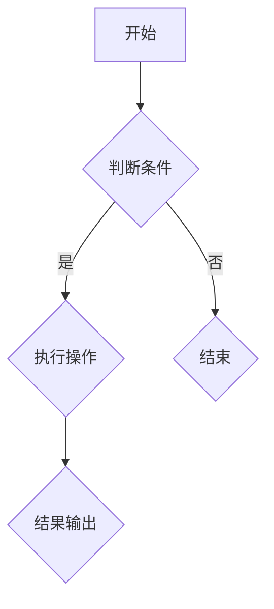

### 类图

类图用于描述软件系统的类和它们之间的关系。以下是一个简单的示例：

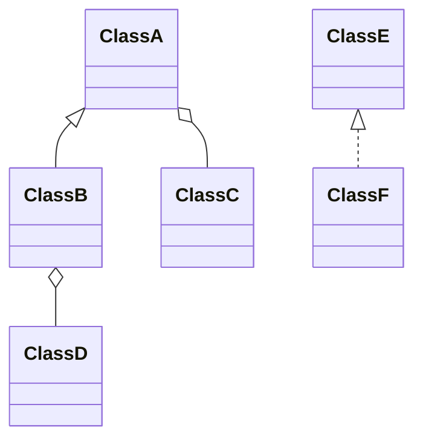

### 序列图

序列图用于描述对象之间交互的顺序。以下是一个简单的示例：

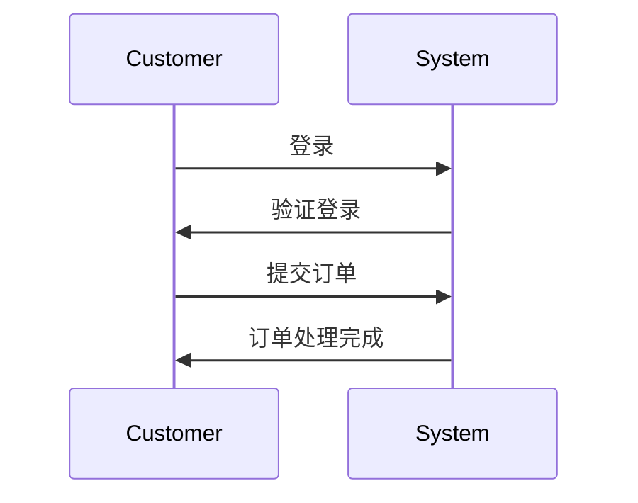

通过以上示例，我们可以看到如何使用Mermaid来创建不同类型的图表。在编写文章时，可以将这些图表嵌入到相应的段落中，以增强文章的可读性和逻辑性。

### 注意事项

- 确保图表与文本内容紧密相关，有助于读者理解。
- 保持图表简洁，避免过于复杂。
- 使用合适的图表类型来呈现信息，避免混淆。
- 在图表旁边提供简短的说明，帮助读者理解图表内容。

### 拓展阅读

- [Mermaid官方文档](https://mermaid-js.github.io/mermaid/)
- [Markdown与Mermaid结合使用教程](https://www.markdownguide.com/inserting-graphs/)
- [更多Mermaid图表示例](https://github.com/mermaid-js/mermaid/blob/master/docs USAGE.md)

[附录B: LaTex公式使用指南]

LaTex是一种高质量的排版系统，特别适合编写科学和数学文档。在Markdown中嵌入LaTex公式可以通过以下两种方式实现：

#### 单行LaTex公式

在Markdown文本中，使用 `$` 符号将LaTex公式括起来，即可在文本中嵌入单行公式。例如：

```
这是一个简单的数学公式：$1+1=2$。
```

输出结果：这是一个简单的数学公式：\(1+1=2\)。

#### 独立段落LaTex公式

如果需要在一个独立的段落中使用LaTex公式，可以使用 `$$` 符号将公式括起来。例如：

```
$$
x = \frac{-b \pm \sqrt{b^2 - 4ac}}{2a}
$$

这是另一个数学公式：$e^{i\pi} + 1 = 0$。
```

输出结果：

\[x = \frac{-b \pm \sqrt{b^2 - 4ac}}{2a}\]

这是另一个数学公式：\(e^{i\pi} + 1 = 0\)。

#### LaTex公式中的字符与符号

在LaTex中，可以使用`\`符号来定义新的命令。以下是一些常用的LaTex字符和符号：

- `\alpha`：α（希腊字母alpha）
- `\beta`：β（希腊字母beta）
- `\pi`：π（圆周率）
- `\sum`：∑（求和符号）
- `\int`：∫（积分符号）
- `\lim`：∏（极限符号）

例如：

```
$$
\alpha + \beta = \pi
$$

$$
\sum_{i=1}^n x_i = \int_{0}^{1} f(x) dx
$$

$$
\lim_{x \to \infty} f(x) = 0
$$
```

输出结果：

\[ \alpha + \beta = \pi \]

\[ \sum_{i=1}^n x_i = \int_{0}^{1} f(x) dx \]

\[ \lim_{x \to \infty} f(x) = 0 \]

通过以上示例，我们可以看到如何使用LaTex在Markdown中嵌入数学公式。掌握LaTex公式的编写，将有助于我们在技术文档中精确地表达数学和科学概念。

### 拓展阅读

- [LaTeX官方文档](https://www.latex-project.org/)
- [Markdown与LaTeX结合使用指南](https://tex.stackexchange.com/questions/4691/markdown-with-latex-math-mode)
- [LaTeX字符与符号大全](https://www.ctan.org/tex-archive/macros/latex/contrib/nccmath/nccmath.pdf)

---

### 第1章: AI Agent的基本概念与分类

#### 1.1 AI Agent的定义

AI Agent，即人工智能代理，是指具有一定智能行为能力的计算机程序。它能够在特定环境中通过感知、决策和执行等过程，实现自主行动，以达到特定目标。AI Agent不同于传统的程序，它们能够根据环境的变化自主学习和调整行为。

在人工智能领域，AI Agent可以分为多个类别，包括基于规则的Agent、基于模型的Agent、混合型Agent和主动学习Agent。每种类型的Agent都有其独特的特点和应用场景。

- **基于规则的AI Agent**：这种Agent通过预定义的规则来指导行为，适用于规则明确、场景简单的任务。例如，简单的客服机器人可以通过预设的回答规则来与用户进行交互。

- **基于模型的AI Agent**：这种Agent使用机器学习模型来预测和决策，适用于需要灵活应对复杂场景的任务。例如，自动驾驶汽车通过深度学习模型来识别道路标志、行人等，实现自主驾驶。

- **混合型AI Agent**：这种Agent结合了基于规则和基于模型的方法，能够在不同的场景下灵活切换。例如，智能推荐系统在初期可能采用基于规则的推荐策略，随着用户行为数据的积累，逐步引入基于模型的推荐算法。

- **主动学习AI Agent**：这种Agent能够根据自身的经验和反馈，主动选择最有价值的样本进行学习，提高学习效率。例如，智能监控系统可以通过分析监控视频数据，识别异常行为，并主动标记这些行为以便进一步分析。

#### 1.2 AI Agent的分类

根据应用场景和功能的不同，AI Agent可以分为以下几类：

- **任务型AI Agent**：这类Agent专注于完成特定任务，如客服机器人、智能家居控制系统等。它们通常具有较强的任务执行能力和一定的自主学习能力，能够根据用户需求和环境变化进行自适应调整。

- **交互型AI Agent**：这类Agent强调与用户的自然交互，如语音助手、聊天机器人等。它们需要具备良好的语言理解和生成能力，能够与用户进行有效的沟通，提供个性化的服务。

- **智能型AI Agent**：这类Agent具备较强的自主学习和推理能力，能够在复杂环境下进行自主决策。例如，自动驾驶汽车、智能工厂等。它们需要处理大量的多模态数据，并能够实时响应环境变化。

- **知识型AI Agent**：这类Agent依赖于大量知识和信息，用于辅助人类进行决策和问题解决。例如，智能咨询系统、智能诊疗系统等。它们需要从大量数据中提取有用信息，并将其应用于具体的场景。

#### 1.3 AI Agent的发展历程

AI Agent的发展可以追溯到20世纪80年代，当时以专家系统和逻辑推理为核心。随着机器学习技术的发展，AI Agent逐渐开始使用深度学习和强化学习等技术。近年来，随着多模态数据的普及和计算能力的提升，多模态AI Agent成为研究热点。

在早期，AI Agent主要应用于简单场景，如基于规则的机器人控制系统。随着人工智能技术的进步，AI Agent的应用领域逐渐扩大，包括自动驾驶、智能客服、智能监控等。当前，多模态AI Agent正逐渐成为企业级应用的重要方向，其整合多种数据源的能力为智能决策提供了新的可能性。

### 1.4 AI Agent的核心要素

AI Agent的核心要素包括感知、决策和执行。这三个方面相互作用，共同实现AI Agent的智能行为。

- **感知**：AI Agent需要通过传感器获取环境信息，如文本、语音和图像等。感知能力决定了AI Agent对环境的理解和反应速度。

- **决策**：AI Agent根据感知到的环境信息，使用预定义的规则或机器学习模型进行决策。决策过程需要考虑目标、约束和不确定性等因素。

- **执行**：AI Agent根据决策结果，执行具体的行动，如发送指令、控制设备等。执行能力决定了AI Agent在实际环境中的行为效果。

#### 感知

感知是AI Agent获取环境信息的过程。不同模态的数据为AI Agent提供了丰富的信息来源。以下是对三种主要模态的感知过程的简要介绍：

- **文本模态**：文本数据可以通过自然语言处理技术进行解析，提取关键词、实体和关系等信息。常见的文本感知技术包括分词、词性标注、实体识别和情感分析等。

- **语音模态**：语音数据可以通过语音识别技术转换为文本，然后进行后续处理。此外，语音特征（如声纹、语速和音调）也可以用于识别说话人的身份和情感。常见的语音感知技术包括语音信号处理、语音识别和声纹识别等。

- **图像模态**：图像数据可以通过计算机视觉技术进行解析，提取图像特征和目标信息。常见的图像感知技术包括图像分割、目标检测、图像识别和图像分类等。

#### 决策

决策是AI Agent的核心功能之一。在决策过程中，AI Agent需要综合考虑感知到的环境信息、目标、约束和不确定性等因素。以下是对决策过程的简要介绍：

- **目标**：AI Agent的目标是根据感知到的环境信息，实现特定的任务或目标。例如，在智能客服场景中，目标可能是快速、准确地回答用户的问题。

- **约束**：AI Agent在决策过程中需要遵守一系列约束条件，如资源的限制、安全的要求等。这些约束条件会影响决策的结果和效果。

- **不确定性**：环境信息的获取往往存在不确定性，这会影响AI Agent的决策。为了处理不确定性，AI Agent可以使用概率模型、模糊逻辑等方法进行决策。

#### 执行

执行是AI Agent将决策结果转化为具体行动的过程。执行能力决定了AI Agent在实际环境中的行为效果。以下是对执行过程的简要介绍：

- **动作**：AI Agent根据决策结果，执行具体的动作，如发送指令、控制设备等。这些动作需要考虑执行的环境条件和效果。

- **反馈**：AI Agent在执行过程中，会收到环境反馈信息，如用户反馈、设备状态等。这些反馈信息可以帮助AI Agent调整行为，提高执行效果。

#### 案例分析

为了更好地理解AI Agent的核心要素，我们来看一个简单的案例分析：智能客服机器人。

- **感知**：智能客服机器人通过文本模态获取用户的问题，使用自然语言处理技术进行解析，提取关键词和句子结构。

- **决策**：根据解析结果，智能客服机器人使用预定义的规则或机器学习模型，判断用户的问题类型，并生成回答。

- **执行**：智能客服机器人将生成的回答发送给用户，同时记录用户反馈，以便后续优化。

通过这个案例，我们可以看到AI Agent的核心要素在具体应用场景中的实现。

#### 总结

本章介绍了AI Agent的基本概念与分类，包括定义、分类、发展历程和核心要素。AI Agent是具有自主智能行为能力的计算机程序，能够根据环境变化自主学习和调整行为。AI Agent的分类包括任务型、交互型、智能型和知识型，每种类型都有其独特的特点和应用场景。AI Agent的核心要素包括感知、决策和执行，这三个方面相互作用，共同实现AI Agent的智能行为。

在下一章中，我们将深入探讨多模态AI Agent的优势与挑战，以及企业级多模态AI Agent的适用场景和技术架构。

---

### 第2章: 多模态AI Agent的优势与挑战

#### 2.1 多模态AI Agent的优势

多模态AI Agent能够同时处理多种类型的数据（如文本、语音、图像等），从而在多个维度上对信息进行理解和分析。这种能力使得多模态AI Agent在以下方面具有显著优势：

1. **更全面的信息获取**

多模态AI Agent能够整合来自不同模态的数据，从而获取更全面的信息。例如，在客户服务场景中，文本、语音和图像模态的数据可以相互补充，帮助AI Agent更准确地理解用户的需求和情感状态。

2. **更准确的决策**

多模态信息提供了更丰富的背景和上下文，有助于做出更准确的决策。例如，在医疗诊断场景中，结合患者的历史病历、语音描述和图像检查结果，AI Agent可以更准确地判断病情。

3. **更自然的交互**

多模态交互（如语音和图像的融合）能够提供更直观和自然的用户体验。例如，在智能家居场景中，用户可以通过语音指令控制家电设备，同时通过图像反馈了解设备状态。

#### 2.2 多模态AI Agent面临的挑战

尽管多模态AI Agent具有很多优势，但其在实际应用中也面临一些挑战：

1. **数据融合的复杂性**

不同模态的数据在特征空间、尺度、粒度等方面存在差异，如何有效地融合这些数据是一个难题。例如，文本数据通常具有高维特征，而图像数据则具有低维特征，如何在保留各自特征的同时实现有效融合是一个关键问题。

2. **计算资源的消耗**

多模态数据处理需要大量的计算资源，对硬件性能要求较高。例如，语音和图像数据的预处理、特征提取和模型训练等步骤都需要大量计算资源，如何优化计算效率是一个重要问题。

3. **模型的可解释性**

多模态AI Agent的内部决策过程往往比较复杂，如何提高其可解释性是一个重要问题。例如，在医疗诊断场景中，医生需要理解AI Agent的决策过程，以便对诊断结果进行解释和验证。

#### 2.3 企业级多模态AI Agent的适用场景

企业级多模态AI Agent在以下场景具有广泛的应用前景：

1. **客户服务**

通过多模态交互，提供更个性化的客户服务体验。例如，通过语音、文本和图像等多种方式，快速响应用户需求，提高客户满意度。

2. **智能办公**

辅助员工完成复杂的任务，提高工作效率。例如，通过语音指令控制办公设备，实时分析会议记录，提供智能建议。

3. **智能监控**

实时分析图像和视频数据，提供安全保障。例如，通过监控摄像头，实时检测异常行为，自动报警。

4. **智能家居**

通过多模态交互，实现家电设备的智能控制。例如，用户可以通过语音指令控制灯光、空调等设备，同时通过图像反馈了解设备状态。

#### 多模态数据的处理流程

多模态AI Agent的处理流程可以分为数据采集、预处理、特征提取、融合和模型训练等步骤。以下是对每个步骤的简要介绍：

1. **数据采集**

数据采集是构建多模态AI Agent的基础。不同模态的数据来源包括文本、语音和图像等。文本数据可以从网络文本、企业内部文档和用户评论等渠道获取；语音数据可以从电话通话、会议录音和语音助手等渠道获取；图像数据可以从摄像头、手机和社交媒体等渠道获取。

2. **预处理**

预处理包括数据清洗、去噪、归一化和特征提取等步骤。预处理有助于提高后续特征提取的准确性和效率。例如，文本数据预处理包括分词、词性标注、停用词过滤等步骤；语音数据预处理包括降噪、归一化和分帧等步骤；图像数据预处理包括去噪、对比度增强、裁剪和缩放等步骤。

3. **特征提取**

特征提取是关键步骤，旨在将原始数据转换为适合机器学习模型的特征表示。常见的特征提取方法包括词袋模型、TF-IDF、声纹特征和视觉特征提取等。词袋模型和TF-IDF适用于文档级别的特征提取，而声纹特征和视觉特征提取适用于语音和图像数据。

4. **融合**

多模态融合是构建企业级多模态AI Agent的核心。常见的融合方法包括基于特征融合的方法和基于模型融合的方法。基于特征融合的方法包括对齐融合、加权融合和特征级融合等；基于模型融合的方法包括深度学习模型融合和传统机器学习模型融合等。融合方法的选择取决于具体应用场景和需求。

5. **模型训练**

模型训练涉及多种数据集的整合。训练过程中，需要使用交叉验证、超参数调优等技术来优化模型性能。此外，还需要考虑模型的可解释性和鲁棒性。常见的模型训练方法包括监督学习、无监督学习和强化学习等。

#### 实际应用案例分析

为了更好地理解多模态AI Agent的优势与挑战，我们来看一个实际应用案例分析：智能客服机器人。

1. **数据采集**

智能客服机器人需要从多种渠道获取数据，包括文本、语音和图像等。文本数据包括用户提问、回答和历史记录；语音数据包括用户语音和客服代表语音；图像数据包括用户上传的图片和客服代表提供的图片。

2. **预处理**

文本数据预处理包括分词、词性标注、停用词过滤等步骤；语音数据预处理包括降噪、归一化和分帧等步骤；图像数据预处理包括去噪、对比度增强、裁剪和缩放等步骤。

3. **特征提取**

文本数据特征提取使用词袋模型和TF-IDF；语音数据特征提取使用声纹特征和梅尔频率倒谱系数（MFCC）；图像数据特征提取使用视觉特征提取方法，如卷积神经网络（CNN）。

4. **融合**

智能客服机器人采用基于特征的融合方法，将文本、语音和图像特征进行对齐融合和加权融合。对齐融合通过匹配不同模态的特征向量，实现特征间的对齐；加权融合通过计算不同模态特征的权重，实现特征的综合。

5. **模型训练**

智能客服机器人采用深度学习模型进行训练，包括卷积神经网络（CNN）和循环神经网络（RNN）等。在模型训练过程中，使用交叉验证和超参数调优等技术，优化模型性能。

通过这个案例分析，我们可以看到多模态AI Agent在智能客服机器人中的应用，以及数据采集、预处理、特征提取、融合和模型训练等步骤的实施。

#### 总结

本章深入探讨了多模态AI Agent的优势与挑战，以及企业级多模态AI Agent的适用场景和技术架构。多模态AI Agent能够同时处理多种类型的数据，提供更全面的信息获取、更准确的决策和更自然的交互。然而，其在实际应用中也面临数据融合复杂性、计算资源消耗和模型可解释性等挑战。

在下一章中，我们将详细讨论文本、语音和图像三种模态的数据采集、预处理、特征提取和融合方法，为构建企业级多模态AI Agent奠定基础。

---

### 第3章: 企业级多模态AI Agent的技术架构

#### 3.1 多模态数据采集与预处理

构建企业级多模态AI Agent的首要步骤是数据采集与预处理。数据采集涉及从不同来源获取文本、语音和图像数据。预处理包括数据清洗、去噪、归一化等步骤，以确保数据的质量和一致性。

##### 文本数据采集

文本数据的来源包括网络文本、企业内部文档和用户评论等。在实际应用中，可以通过Web爬虫、API接口和手动标注等方式获取文本数据。

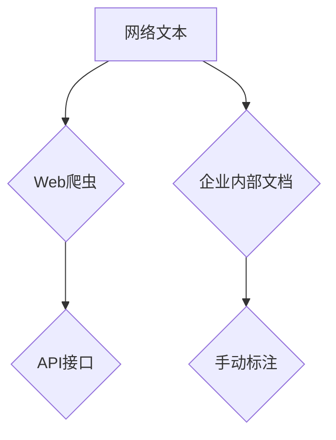

##### 文本预处理

文本预处理主要包括分词、词性标注和停用词过滤等步骤。分词将文本分解为词或短语，词性标注为每个词分配词性（如名词、动词等），停用词过滤去除对分析无意义的词语。

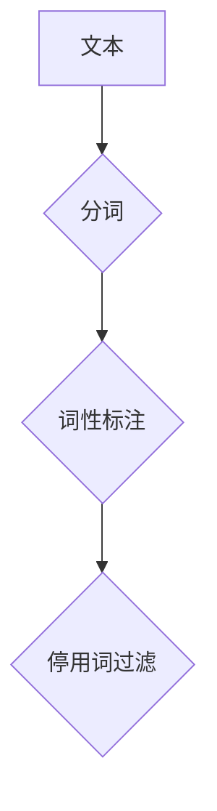

##### 语音数据采集

语音数据可以从电话通话、会议录音和语音助手等渠道获取。语音数据采集通常使用麦克风或其他语音输入设备。

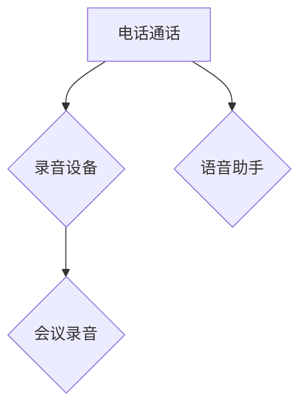

##### 语音预处理

语音预处理包括降噪、归一化和分帧等步骤。降噪可以减少背景噪音对语音信号的干扰，归一化可以使不同长度的语音信号具有相同的能量分布，分帧将连续的语音信号划分为短时片段。

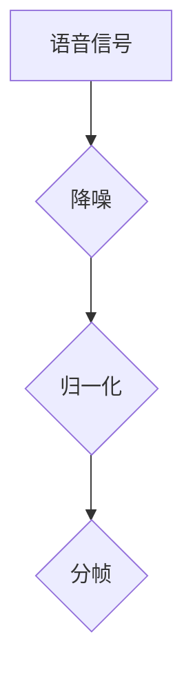

##### 图像数据采集

图像数据可以通过摄像头、手机和社交媒体等渠道获取。图像数据采集的关键在于确保图像的质量和多样性。

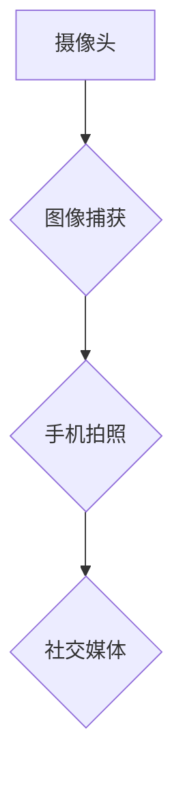

##### 图像预处理

图像预处理包括去噪、对比度增强、裁剪和缩放等步骤。去噪可以改善图像质量，对比度增强可以增强图像的可辨识性，裁剪和缩放可以使图像适应特定的应用需求。

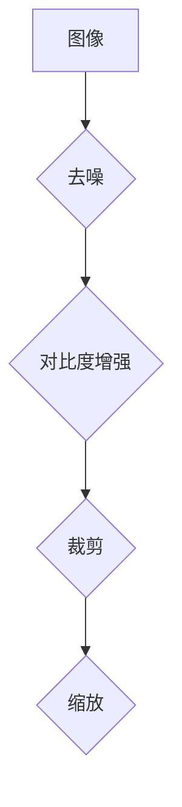

#### 3.2 多模态特征提取

特征提取是将原始数据转换为机器学习模型可处理的特征表示的过程。对于文本、语音和图像数据，特征提取的方法各不相同。

##### 文本特征提取

文本特征提取常用的方法包括词袋模型（Bag of Words, BOW）和词嵌入（Word Embedding）。词袋模型将文本表示为词频向量，而词嵌入将词映射为固定维度的向量。

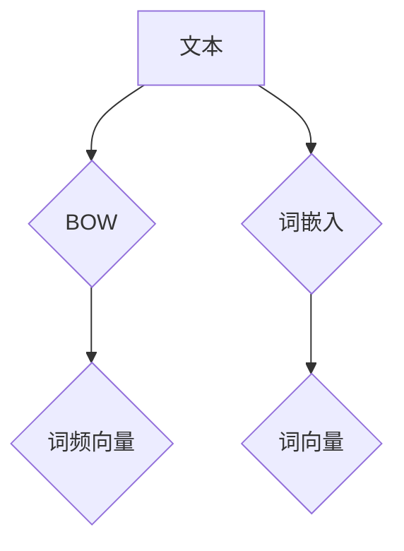

##### 语音特征提取

语音特征提取常用的方法包括梅尔频率倒谱系数（MFCC）和声纹特征。MFCC是一种有效的语音特征提取方法，可以捕捉语音信号的时间频率特征；声纹特征用于个人身份识别，基于声波的特性进行特征提取。

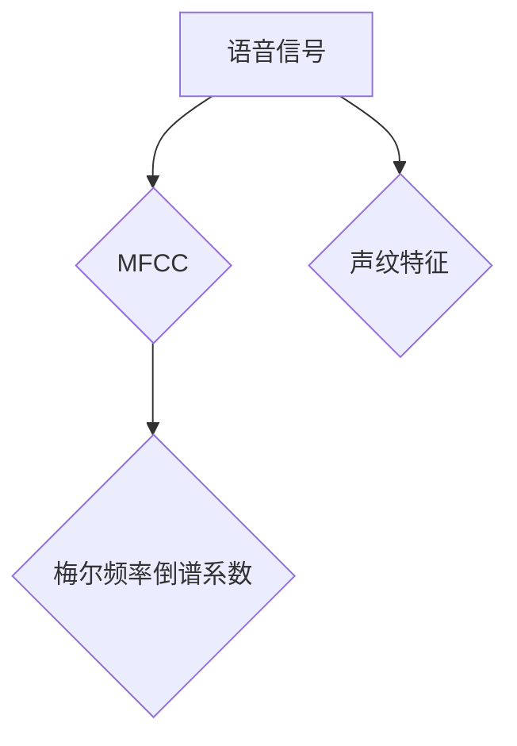

##### 图像特征提取

图像特征提取常用的方法包括卷积神经网络（CNN）和视觉特征提取。CNN可以自动学习图像的特征表示，而视觉特征提取方法如SIFT和HOG等可以手动提取图像的关键特征。

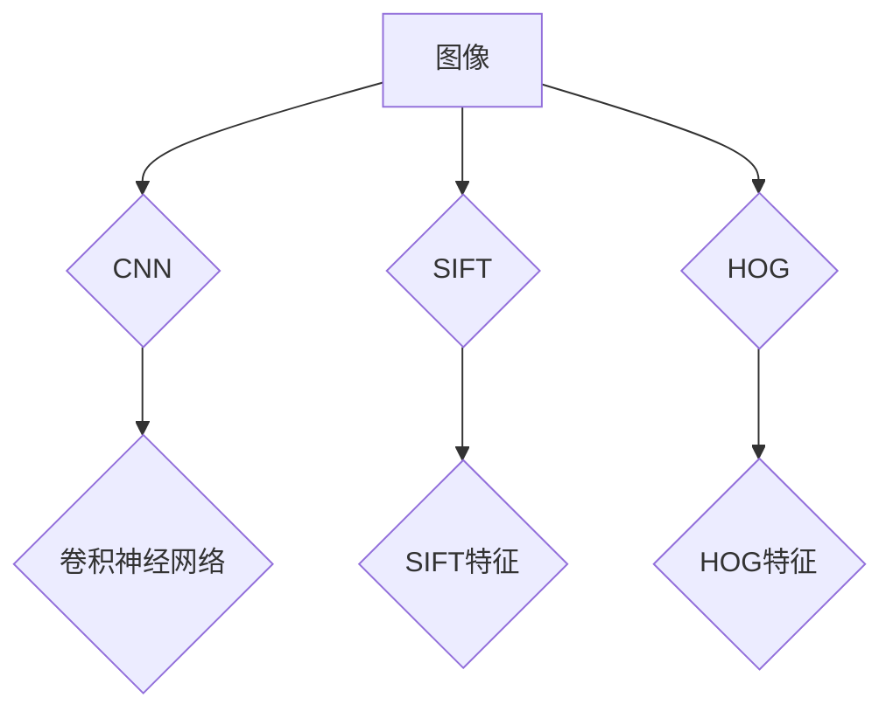

#### 3.3 多模态融合方法

多模态融合是将来自不同模态的数据进行整合，以形成统一的特征表示。融合方法可以分为基于特征融合和基于模型融合两大类。

##### 基于特征融合的方法

基于特征融合的方法将不同模态的特征向量进行合并，形成统一的特征表示。常见的融合方法包括对齐融合、加权融合和特征级融合。

- **对齐融合**：通过对不同模态的特征向量进行对齐，实现特征间的匹配和融合。
- **加权融合**：根据不同模态的特征重要性，对特征向量进行加权合并。
- **特征级融合**：在特征级别上将不同模态的特征向量进行拼接，形成高维特征向量。

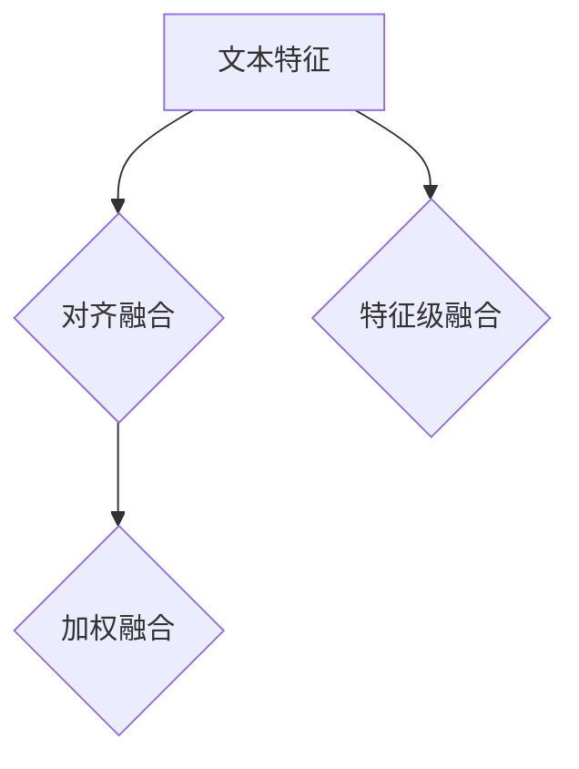

##### 基于模型融合的方法

基于模型融合的方法将不同模态的模型进行整合，形成统一的预测模型。常见的融合方法包括深度学习模型融合和传统机器学习模型融合。

- **深度学习模型融合**：通过多任务学习或多模态神经网络，将不同模态的输入数据同时输入到深度学习模型中，实现模型融合。
- **传统机器学习模型融合**：将不同模态的预测结果进行投票或加权平均，形成最终的预测结果。

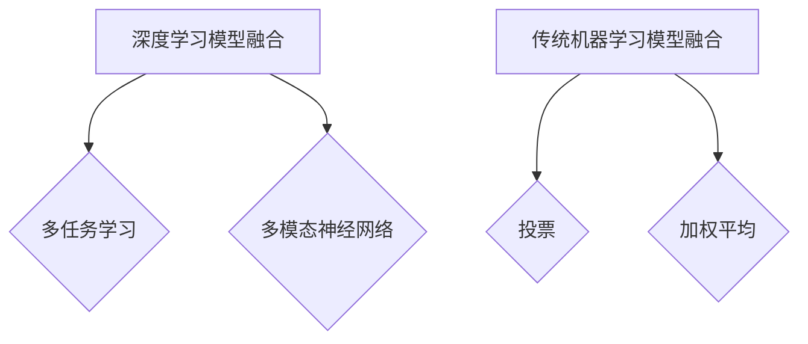

#### 3.4 多模态AI Agent的训练与优化

多模态AI Agent的训练与优化是构建高效智能系统的关键步骤。训练过程中，需要考虑数据的多样性、模型的复杂性和计算资源的限制。

##### 训练过程

- **数据预处理**：对多模态数据进行预处理，包括数据清洗、去噪和归一化等步骤。
- **特征提取**：使用适当的特征提取方法，将原始数据转换为机器学习模型可处理的特征表示。
- **模型训练**：使用交叉验证和超参数调优等技术，优化模型性能。
- **评估与调整**：评估模型性能，并根据评估结果进行调整。

##### 优化方法

- **超参数调优**：通过网格搜索、随机搜索等方法，寻找最佳的超参数组合。
- **模型集成**：将多个模型的结果进行集成，提高预测的准确性和稳定性。
- **迁移学习**：利用预训练的模型，提高新任务的训练效率。
- **数据增强**：通过数据增强方法，增加训练样本的多样性。

#### 案例分析

为了更好地理解多模态AI Agent的技术架构，我们来看一个案例分析：智能监控系统的多模态融合。

1. **数据采集**：

   - **文本数据**：监控事件的描述和标签。
   - **语音数据**：监控环境中的声音信号。
   - **图像数据**：监控摄像头捕捉到的视频帧。

2. **预处理**：

   - **文本数据**：分词、词性标注和停用词过滤。
   - **语音数据**：降噪、分帧和特征提取。
   - **图像数据**：去噪、对比度增强和特征提取。

3. **特征提取**：

   - **文本数据**：词袋模型和词嵌入。
   - **语音数据**：梅尔频率倒谱系数（MFCC）和声纹特征。
   - **图像数据**：卷积神经网络（CNN）和视觉特征提取。

4. **融合**：

   - **特征级融合**：将文本、语音和图像特征进行拼接，形成高维特征向量。
   - **模型级融合**：使用多模态神经网络，同时处理不同模态的输入数据。

5. **训练与优化**：

   - **模型训练**：使用交叉验证和超参数调优，优化模型性能。
   - **评估与调整**：评估模型性能，并根据评估结果进行调整。

通过这个案例分析，我们可以看到多模态AI Agent在智能监控系统中的应用，以及数据采集、预处理、特征提取、融合和模型训练等步骤的实施。

#### 总结

本章详细介绍了企业级多模态AI Agent的技术架构，包括多模态数据采集与预处理、多模态特征提取、多模态融合方法和训练与优化策略。多模态AI Agent通过整合文本、语音和图像等多种数据源，实现了更全面的信息获取、更准确的决策和更自然的交互。在实际应用中，多模态AI Agent需要面对数据融合复杂性、计算资源消耗和模型可解释性等挑战。

在下一章中，我们将深入探讨文本、语音和图像三种模态的处理细节，以及多模态AI Agent在各个模态中的具体应用。

---

### 第4章: 文本模态的处理

#### 4.1 文本数据采集

文本数据采集是构建企业级多模态AI Agent的基础。文本数据来源广泛，包括网络文本、企业内部文档、用户评论、社交媒体等。以下是对文本数据采集的具体步骤和方法的介绍：

1. **网络文本采集**

   网络文本采集通常使用Web爬虫技术，从各种网站、论坛、博客等渠道获取文本数据。爬虫技术包括基于HTML解析、网络爬取和API调用等方法。

   ```mermaid
   graph TB
   A[Web爬虫] --> B{HTML解析}
   A --> C{网络爬取}
   A --> D{API调用}
   ```

2. **企业内部文档采集**

   企业内部文档采集可以通过企业知识库、文档管理系统等途径获取。这些文档通常包括公司公告、项目报告、会议纪要等。

   ```mermaid
   graph TB
   A[企业知识库] --> B{文档管理系统}
   ```

3. **用户评论采集**

   用户评论采集可以通过电商平台、社交媒体等渠道获取。用户评论为AI Agent提供了宝贵的反馈信息，有助于提升服务质量。

   ```mermaid
   graph TB
   A[电商平台] --> B{社交媒体}
   ```

4. **社交媒体采集**

   社交媒体采集可以通过API接口获取用户发布的文本内容。这些内容可以帮助AI Agent了解用户需求、情感和热点话题。

   ```mermaid
   graph TB
   A[API接口] --> B{用户发布内容}
   ```

#### 4.2 文本预处理

文本预处理是文本数据采集后的关键步骤，旨在提高数据质量和一致性，为后续特征提取和模型训练奠定基础。以下是对文本预处理的具体步骤和方法的介绍：

1. **分词**

   分词是将连续的文本分解为词或短语的步骤。常用的分词方法包括基于字典的分词、基于统计的分词和基于规则的分词等。

   ```mermaid
   graph TB
   A[文本] --> B{分词}
   ```

2. **词性标注**

   词性标注是为每个词分配词性标签的过程，如名词、动词、形容词等。词性标注有助于理解文本的语法结构，提高特征提取的准确性。

   ```mermaid
   graph TB
   A[词性标注]
   ```

3. **停用词过滤**

   停用词过滤是去除对文本分析无意义的常见词语的过程。这些词语包括“的”、“了”、“在”等。停用词过滤有助于减少特征维度，提高模型训练效率。

   ```mermaid
   graph TB
   A[停用词过滤]
   ```

4. **文本清洗**

   文本清洗包括去除标点符号、特殊字符和格式化文本等步骤，确保文本数据的一致性和可处理性。

   ```mermaid
   graph TB
   A[文本清洗]
   ```

#### 4.3 文本特征提取

文本特征提取是将预处理后的文本数据转换为机器学习模型可处理的特征表示。以下是对文本特征提取的具体方法和技术的介绍：

1. **词袋模型（Bag of Words, BOW）**

   词袋模型将文本表示为词频向量，每个词作为特征，词频作为特征值。词袋模型简单高效，适用于文本分类和文本相似度分析等任务。

   ```mermaid
   graph TB
   A[文本] --> B{词袋模型}
   B --> C{词频向量}
   ```

2. **TF-IDF（Term Frequency-Inverse Document Frequency）**

   TF-IDF是一种基于词频和文档频率的特征提取方法。词频表示词在单个文档中的重要性，而逆文档频率表示词在整个文档集中的重要性。TF-IDF广泛应用于文本分类和文本聚类等任务。

   ```mermaid
   graph TB
   A[文本] --> B{TF-IDF}
   ```

3. **词嵌入（Word Embedding）**

   词嵌入将词映射为固定维度的向量表示，使得语义相似的词在向量空间中靠近。常见的词嵌入方法包括Word2Vec、GloVe和FastText等。词嵌入广泛应用于文本分类、文本生成和序列模型等任务。

   ```mermaid
   graph TB
   A[文本] --> B{Word2Vec}
   A --> C{GloVe}
   A --> D{FastText}
   ```

4. **词性嵌入（Part-of-Speech Embedding）**

   词性嵌入将词性和词向量结合，形成词性嵌入向量。词性嵌入有助于提高文本分类和句法分析的准确性。常见的词性嵌入方法包括Word2Vec和GloVe等。

   ```mermaid
   graph TB
   A[词性标注] --> B{词性嵌入}
   ```

#### 4.4 文本融合方法

文本融合是将来自不同模态的文本数据整合，形成统一特征表示的方法。以下是对文本融合的具体方法和技术的介绍：

1. **特征级融合**

   特征级融合将不同模态的文本特征进行拼接，形成高维特征向量。这种方法简单直观，但可能导致特征维度增加，计算复杂度提升。

   ```mermaid
   graph TB
   A[文本特征1] --> B{特征拼接}
   B --> C[文本特征2]
   ```

2. **模型级融合**

   模型级融合使用多个独立的文本模型，然后将不同模型的结果进行融合。这种方法适用于复杂任务，可以提高模型性能。

   ```mermaid
   graph TB
   A[模型1] --> B{模型结果}
   A --> C[模型2]
   ```

3. **对齐融合**

   对齐融合通过匹配不同模态的文本特征，实现特征间的对齐。这种方法适用于处理不同模态数据对齐不一致的问题。

   ```mermaid
   graph TB
   A[文本特征1] --> B{对齐匹配}
   B --> C[文本特征2]
   ```

4. **加权融合**

   加权融合根据不同模态的特征重要性，对特征向量进行加权合并。这种方法可以平衡不同模态数据的重要性，提高模型性能。

   ```mermaid
   graph TB
   A[文本特征1] --> B{加权合并}
   B --> C[文本特征2]
   ```

#### 案例分析

为了更好地理解文本模态的处理，我们来看一个案例分析：基于文本的多模态情感分析。

1. **数据采集**：

   - **文本数据**：用户评论、社交媒体帖子等。
   - **语音数据**：用户语音评论。
   - **图像数据**：用户头像和评论截图。

2. **预处理**：

   - **文本数据**：分词、词性标注和停用词过滤。
   - **语音数据**：降噪、分帧和特征提取。
   - **图像数据**：去噪、对比度增强和特征提取。

3. **特征提取**：

   - **文本数据**：词袋模型和词嵌入。
   - **语音数据**：梅尔频率倒谱系数（MFCC）和声纹特征。
   - **图像数据**：卷积神经网络（CNN）和视觉特征提取。

4. **融合**：

   - **特征级融合**：将文本、语音和图像特征进行拼接，形成高维特征向量。
   - **模型级融合**：使用多模态神经网络，同时处理不同模态的输入数据。

5. **训练与优化**：

   - **模型训练**：使用交叉验证和超参数调优，优化模型性能。
   - **评估与调整**：评估模型性能，并根据评估结果进行调整。

通过这个案例分析，我们可以看到文本模态在多模态情感分析中的应用，以及文本数据采集、预处理、特征提取、融合和模型训练等步骤的实施。

#### 总结

本章详细介绍了文本模态的处理过程，包括文本数据采集、文本预处理、文本特征提取和文本融合方法。文本模态在多模态AI Agent中起着至关重要的作用，通过整合文本数据，AI Agent可以更全面地理解和分析信息。在实际应用中，文本模态的处理需要面对数据多样性、特征提取准确性和模型融合复杂性的挑战。

在下一章中，我们将深入探讨语音模态的处理，包括语音数据采集、预处理、特征提取和融合方法。

---

### 第5章: 语音模态的处理

#### 5.1 语音数据采集

语音数据采集是多模态AI Agent构建的关键步骤之一。语音数据的来源广泛，包括电话通话、会议录音、语音助手、社交媒体等。以下是对语音数据采集的具体步骤和方法的介绍：

1. **电话通话采集**

   电话通话采集通常通过电话线路和电话设备进行。采集的语音数据可以是单声道或立体声，并且可能包含背景噪音。

   ```mermaid
   graph TB
   A[电话设备] --> B{电话线路}
   ```

2. **会议录音采集**

   会议录音采集可以通过会议设备（如麦克风阵列）进行，这些设备能够捕捉多个人同时说话的音频信号。

   ```mermaid
   graph TB
   A[会议设备] --> B{麦克风阵列}
   ```

3. **语音助手采集**

   语音助手采集通常通过智能设备的麦克风进行。用户可以通过语音指令与语音助手交互，收集语音数据。

   ```mermaid
   graph TB
   A[智能设备] --> B{麦克风}
   ```

4. **社交媒体采集**

   社交媒体采集可以通过API接口获取用户发布的语音内容。这些语音内容可以是语音消息、语音评论等。

   ```mermaid
   graph TB
   A[API接口] --> B{用户发布内容}
   ```

#### 5.2 语音预处理

语音预处理是语音数据采集后的关键步骤，旨在提高数据质量和一致性，为后续特征提取和模型训练奠定基础。以下是对语音预处理的具体步骤和方法的介绍：

1. **降噪**

   降噪是通过算法去除语音信号中的背景噪音的过程。常见的降噪方法包括谱减法、维纳滤波和自适应降噪等。

   ```mermaid
   graph TB
   A[语音信号] --> B{降噪}
   ```

2. **分帧**

   分帧是将连续的语音信号划分为短时片段的过程。分帧的目的是为了更好地提取语音特征。常见的帧长为20ms到40ms。

   ```mermaid
   graph TB
   A[语音信号] --> B{分帧}
   ```

3. **归一化**

   归一化是通过调整语音信号的能量分布，使其具有统一的能量水平。归一化有助于提高特征提取的准确性和一致性。

   ```mermaid
   graph TB
   A[语音信号] --> B{归一化}
   ```

4. **增强**

   增强是通过算法增强语音信号中的关键信息，如语音强度、频率等。增强有助于提高语音识别和声纹识别的准确性。

   ```mermaid
   graph TB
   A[语音信号] --> B{增强}
   ```

#### 5.3 语音特征提取

语音特征提取是将预处理后的语音数据转换为机器学习模型可处理的特征表示。以下是对语音特征提取的具体方法和技术的介绍：

1. **梅尔频率倒谱系数（MFCC）**

   MFCC是一种常用的语音特征提取方法，它能够有效捕捉语音信号的时间频率特征。MFCC通过将语音信号转换为梅尔频率谱，并计算其倒谱系数，从而形成特征向量。

   ```mermaid
   graph TB
   A[语音信号] --> B{MFCC}
   ```

2. **声纹特征**

   声纹特征是基于个人声音特征的识别方法。常见的声纹特征包括音高、音强、共振峰频率等。声纹特征能够有效区分不同个体的声音。

   ```mermaid
   graph TB
   A[语音信号] --> B{声纹特征}
   ```

3. **频谱特征**

   频谱特征是通过对语音信号进行频谱分析，提取其频率成分和能量分布。常见的频谱特征包括频谱幅度、频谱熵等。

   ```mermaid
   graph TB
   A[语音信号] --> B{频谱特征}
   ```

4. **谱减特征**

   谱减特征是通过去除语音信号中的背景噪音，提取纯净语音信号的频谱特征。这种方法有助于提高语音识别的准确性。

   ```mermaid
   graph TB
   A[语音信号] --> B{谱减特征}
   ```

#### 5.4 语音融合方法

语音融合是将来自不同模态的语音数据整合，形成统一特征表示的方法。以下是对语音融合的具体方法和技术的介绍：

1. **特征级融合**

   特征级融合将不同模态的语音特征进行拼接，形成高维特征向量。这种方法简单直观，但可能导致特征维度增加，计算复杂度提升。

   ```mermaid
   graph TB
   A[语音特征1] --> B{特征拼接}
   B --> C[语音特征2]
   ```

2. **模型级融合**

   模型级融合使用多个独立的语音模型，然后将不同模型的结果进行融合。这种方法适用于复杂任务，可以提高模型性能。

   ```mermaid
   graph TB
   A[模型1] --> B{模型结果}
   A --> C[模型2]
   ```

3. **对齐融合**

   对齐融合通过匹配不同模态的语音特征，实现特征间的对齐。这种方法适用于处理不同模态数据对齐不一致的问题。

   ```mermaid
   graph TB
   A[语音特征1] --> B{对齐匹配}
   B --> C[语音特征2]
   ```

4. **加权融合**

   加权融合根据不同模态的特征重要性，对特征向量进行加权合并。这种方法可以平衡不同模态数据的重要性，提高模型性能。

   ```mermaid
   graph TB
   A[语音特征1] --> B{加权合并}
   B --> C[语音特征2]
   ```

#### 案例分析

为了更好地理解语音模态的处理，我们来看一个案例分析：基于语音的多模态情感分析。

1. **数据采集**：

   - **语音数据**：用户语音评论。
   - **文本数据**：用户评论文本。
   - **图像数据**：用户头像和评论截图。

2. **预处理**：

   - **语音数据**：降噪、分帧和归一化。
   - **文本数据**：分词、词性标注和停用词过滤。
   - **图像数据**：去噪、对比度增强和裁剪。

3. **特征提取**：

   - **语音数据**：梅尔频率倒谱系数（MFCC）和声纹特征。
   - **文本数据**：词袋模型和词嵌入。
   - **图像数据**：卷积神经网络（CNN）和视觉特征提取。

4. **融合**：

   - **特征级融合**：将语音、文本和图像特征进行拼接，形成高维特征向量。
   - **模型级融合**：使用多模态神经网络，同时处理不同模态的输入数据。

5. **训练与优化**：

   - **模型训练**：使用交叉验证和超参数调优，优化模型性能。
   - **评估与调整**：评估模型性能，并根据评估结果进行调整。

通过这个案例分析，我们可以看到语音模态在多模态情感分析中的应用，以及语音数据采集、预处理、特征提取、融合和模型训练等步骤的实施。

#### 总结

本章详细介绍了语音模态的处理过程，包括语音数据采集、预处理、特征提取和融合方法。语音模态在多模态AI Agent中起着关键作用，通过整合语音数据，AI Agent可以更准确地进行语音识别、情感分析和语音交互。在实际应用中，语音模态的处理需要面对噪声干扰、特征提取复杂性和模型融合的挑战。

在下一章中，我们将深入探讨图像模态的处理，包括图像数据采集、预处理、特征提取和融合方法。

---

### 第6章: 图像模态的处理

#### 6.1 图像数据采集

图像数据采集是多模态AI Agent构建的重要组成部分。图像数据的来源多样，包括摄像头、手机、社交媒体、医疗设备等。以下是对图像数据采集的具体步骤和方法的介绍：

1. **摄像头采集**

   摄像头采集是最常见的图像数据来源，它可以实时捕捉静态和动态的图像。常见的应用场景包括监控、视频会议和日常拍照。

   ```mermaid
   graph TB
   A[摄像头] --> B{实时图像捕获}
   ```

2. **手机采集**

   手机相机也是图像数据的重要来源，手机摄像头的高清成像和便捷性使其广泛应用于个人拍照和社交媒体分享。

   ```mermaid
   graph TB
   A[手机] --> B{高清图像捕获}
   ```

3. **社交媒体采集**

   社交媒体平台如Instagram、Facebook和Twitter等，提供了大量的图像数据来源。通过API接口，可以获取用户发布的图像。

   ```mermaid
   graph TB
   A[社交媒体] --> B{API接口}
   ```

4. **医疗设备采集**

   医疗设备如X光机、CT扫描仪和超声设备等，可以产生高质量的医学图像数据，用于疾病诊断和治疗规划。

   ```mermaid
   graph TB
   A[医疗设备] --> B{医学图像捕获}
   ```

#### 6.2 图像预处理

图像预处理是图像数据采集后的关键步骤，旨在提高数据质量和一致性，为后续特征提取和模型训练奠定基础。以下是对图像预处理的具体步骤和方法的介绍：

1. **去噪**

   去噪是通过算法减少图像中的噪声，提高图像质量。常见的去噪方法包括均值滤波、中值滤波和高斯滤波等。

   ```mermaid
   graph TB
   A[图像] --> B{去噪}
   ```

2. **对比度增强**

   对比度增强是通过调整图像的亮度、对比度和色调，使图像更加清晰和易读。对比度增强有助于提高图像特征的提取效果。

   ```mermaid
   graph TB
   A[图像] --> B{对比度增强}
   ```

3. **裁剪和缩放**

   裁剪和缩放是调整图像尺寸和范围的操作。裁剪可以去除不必要的背景，缩放可以适应不同的应用需求。

   ```mermaid
   graph TB
   A[图像] --> B{裁剪}
   B --> C{缩放}
   ```

4. **颜色转换**

   颜色转换是将图像从一种颜色空间转换为另一种颜色空间。例如，将RGB颜色空间转换为灰度图像或HSV颜色空间。

   ```mermaid
   graph TB
   A[图像] --> B{颜色转换}
   ```

#### 6.3 图像特征提取

图像特征提取是将预处理后的图像数据转换为机器学习模型可处理的特征表示。以下是对图像特征提取的具体方法和技术的介绍：

1. **边缘检测**

   边缘检测是通过检测图像中的边缘和轮廓，提取图像的几何特征。常见的边缘检测算法包括Canny算法和Sobel算子。

   ```mermaid
   graph TB
   A[图像] --> B{边缘检测}
   ```

2. **纹理特征**

   纹理特征是通过分析图像的纹理信息，提取图像的纹理特征。常见的纹理特征提取方法包括Haralick特征和Gabor特征。

   ```mermaid
   graph TB
   A[图像] --> B{纹理特征提取}
   ```

3. **颜色特征**

   颜色特征是通过分析图像的颜色信息，提取图像的颜色特征。常见的颜色特征提取方法包括色彩直方图和颜色矩。

   ```mermaid
   graph TB
   A[图像] --> B{颜色特征提取}
   ```

4. **形状特征**

   形状特征是通过分析图像中的形状信息，提取图像的形状特征。常见的形状特征提取方法包括Hu矩和区域增长算法。

   ```mermaid
   graph TB
   A[图像] --> B{形状特征提取}
   ```

#### 6.4 图像融合方法

图像融合是将来自不同模态的图像数据整合，形成统一特征表示的方法。以下是对图像融合的具体方法和技术的介绍：

1. **特征级融合**

   特征级融合是将不同模态的图像特征进行拼接，形成高维特征向量。这种方法简单直观，但可能导致特征维度增加，计算复杂度提升。

   ```mermaid
   graph TB
   A[图像特征1] --> B{特征拼接}
   B --> C[图像特征2]
   ```

2. **模型级融合**

   模型级融合使用多个独立的图像模型，然后将不同模型的结果进行融合。这种方法适用于复杂任务，可以提高模型性能。

   ```mermaid
   graph TB
   A[模型1] --> B{模型结果}
   A --> C[模型2]
   ```

3. **对齐融合**

   对齐融合通过匹配不同模态的图像特征，实现特征间的对齐。这种方法适用于处理不同模态数据对齐不一致的问题。

   ```mermaid
   graph TB
   A[图像特征1] --> B{对齐匹配}
   B --> C[图像特征2]
   ```

4. **加权融合**

   加权融合根据不同模态的特征重要性，对特征向量进行加权合并。这种方法可以平衡不同模态数据的重要性，提高模型性能。

   ```mermaid
   graph TB
   A[图像特征1] --> B{加权合并}
   B --> C[图像特征2]
   ```

#### 案例分析

为了更好地理解图像模态的处理，我们来看一个案例分析：基于图像的多模态人脸识别。

1. **数据采集**：

   - **图像数据**：用户头像和实时摄像头捕捉的图像。
   - **文本数据**：用户姓名和身份信息。
   - **语音数据**：用户语音自我介绍。

2. **预处理**：

   - **图像数据**：去噪、对比度增强和裁剪。
   - **文本数据**：分词、词性标注和停用词过滤。
   - **语音数据**：降噪、分帧和特征提取。

3. **特征提取**：

   - **图像数据**：卷积神经网络（CNN）提取视觉特征。
   - **文本数据**：词嵌入提取文本特征。
   - **语音数据**：梅尔频率倒谱系数（MFCC）提取语音特征。

4. **融合**：

   - **特征级融合**：将图像、文本和语音特征进行拼接。
   - **模型级融合**：使用多模态神经网络，同时处理不同模态的输入数据。

5. **训练与优化**：

   - **模型训练**：使用交叉验证和超参数调优。
   - **评估与调整**：评估模型性能，并根据评估结果进行调整。

通过这个案例分析，我们可以看到图像模态在多模态人脸识别中的应用，以及图像数据采集、预处理、特征提取、融合和模型训练等步骤的实施。

#### 总结

本章详细介绍了图像模态的处理过程，包括图像数据采集、预处理、特征提取和融合方法。图像模态在多模态AI Agent中发挥着关键作用，通过整合图像数据，AI Agent可以更准确地进行目标检测、图像识别和视觉分析。在实际应用中，图像模态的处理需要面对数据多样性、特征提取准确性和模型融合复杂性的挑战。

在下一章中，我们将探讨多模态AI Agent的实际应用，并分析具体案例，展示多模态AI Agent在各个领域的应用效果。

---

### 第7章: 多模态AI Agent的实际应用

#### 7.1 实际案例介绍

多模态AI Agent在各个领域都有广泛的应用，下面我们将介绍几个具有代表性的实际案例，包括客户服务、智能办公、智能监控和医疗诊断等。

##### 7.1.1 案例一：智能客服系统

智能客服系统是一种常见的企业级多模态AI Agent，它能够通过语音、文本和图像等多种方式进行交互。在实际应用中，智能客服系统可以帮助企业降低人工成本，提高客户满意度。

- **文本交互**：用户可以通过在线聊天窗口发送文本消息，智能客服系统会根据用户的问题提供即时回答。
- **语音交互**：用户可以通过语音输入提出问题，智能客服系统会使用语音识别技术将语音转换为文本，然后进行理解和回答。
- **图像交互**：用户可以通过上传图像（如商品图片）来询问产品的详细信息，智能客服系统会使用图像识别技术分析图像并给出答案。

##### 7.1.2 案例二：智能办公助手

智能办公助手是另一个重要的企业级多模态AI Agent，它能够辅助员工完成日常办公任务，提高工作效率。

- **语音指令**：员工可以通过语音指令控制智能办公助手完成文档搜索、会议预约和日程管理等任务。
- **文本分析**：智能办公助手可以对员工发送的邮件、会议纪要等文本内容进行自动分类和总结，帮助员工快速了解重要信息。
- **图像识别**：智能办公助手可以识别员工上传的发票、合同等图像文档，自动提取关键信息并生成电子文件。

##### 7.1.3 案例三：智能监控系统

智能监控系统是一种用于实时监控和预警的多模态AI Agent，广泛应用于公共场所、工厂和企业园区等场景。

- **图像监控**：智能监控系统通过摄像头捕捉实时图像，使用图像识别技术检测异常行为和事件。
- **语音分析**：智能监控系统可以实时分析环境中的语音信号，识别潜在的安全威胁。
- **文本报警**：当智能监控系统检测到异常情况时，会通过发送文本消息或电子邮件等方式通知相关人员。

##### 7.1.4 案例四：医疗诊断系统

医疗诊断系统是一种用于辅助医生进行疾病诊断的多模态AI Agent，它能够结合患者的文本病历、语音描述和图像检查结果，提供准确的诊断建议。

- **文本病历**：智能诊断系统可以读取患者的电子病历，提取关键信息并进行综合分析。
- **语音描述**：患者可以通过语音描述病情，智能诊断系统会使用语音识别技术将语音转换为文本，并与病历信息进行关联。
- **图像分析**：智能诊断系统可以对患者的医学图像（如X光片、CT扫描等）进行分析，识别异常区域和病变。

#### 7.2 案例分析与总结

通过对上述实际案例的分析，我们可以看到多模态AI Agent在不同领域的应用效果和优势。

1. **客户服务**：智能客服系统通过多模态交互，能够提供更快速、准确和个性化的服务，提高用户满意度。
2. **智能办公**：智能办公助手通过语音、文本和图像等多种方式辅助员工完成任务，提高工作效率。
3. **智能监控**：智能监控系统通过多模态数据融合，能够实时检测异常情况，提高安全性和监控效果。
4. **医疗诊断**：医疗诊断系统通过整合患者的多模态数据，提供更准确的诊断建议，辅助医生提高诊断准确率。

尽管多模态AI Agent在各个领域都展现了巨大的潜力，但其在实际应用中也面临一些挑战，如数据融合复杂性、计算资源消耗和模型可解释性等。为了克服这些挑战，需要不断优化多模态数据处理和融合技术，提高AI Agent的性能和可靠性。

#### 7.3 未来发展趋势

随着人工智能技术的不断进步，多模态AI Agent在未来将展现出更广泛的应用前景和发展趋势。

1. **应用领域拓展**：多模态AI Agent将在更多领域得到应用，如教育、金融、制造业等。通过整合多种模态的数据，AI Agent能够提供更全面、精准的服务和决策支持。
2. **技术突破**：在多模态数据处理和融合方面，将出现更多创新技术，如基于深度学习的特征提取方法、自适应数据融合算法等。这些技术将进一步提高多模态AI Agent的性能和效率。
3. **人机交互优化**：多模态AI Agent将更好地融入人类日常生活，提供更自然、直观的交互体验。通过语音、文本、图像等多种交互方式，AI Agent将更好地理解用户需求，提供个性化的服务。
4. **隐私保护**：在多模态AI Agent的应用过程中，隐私保护将成为一个重要问题。需要研究和发展新的隐私保护技术，确保用户数据的安全和隐私。

#### 7.4 面向企业的建议

对于企业来说，构建多模态AI Agent是一个重要的战略决策。以下是一些建议，帮助企业成功实施多模态AI Agent：

1. **明确应用场景**：在构建多模态AI Agent之前，需要明确应用场景和目标。通过了解用户需求和业务流程，可以更好地设计AI Agent的功能和性能要求。
2. **数据质量保证**：数据质量是构建高效AI Agent的关键。企业需要确保数据的完整性、一致性和准确性，通过数据清洗、预处理和标注等步骤，提高数据质量。
3. **技术选型和集成**：在选择和集成多模态数据处理和融合技术时，需要考虑技术成熟度、性能和可扩展性等因素。可以选择开源工具和平台，如TensorFlow、PyTorch等，以降低开发和维护成本。
4. **持续优化和迭代**：多模态AI Agent的应用是一个持续优化的过程。企业需要不断收集用户反馈，评估AI Agent的性能，并根据评估结果进行调整和改进。
5. **安全和隐私保护**：在构建多模态AI Agent时，需要考虑安全和隐私保护问题。通过数据加密、访问控制和安全审计等手段，确保用户数据的安全和隐私。

通过以上建议，企业可以更好地构建和优化多模态AI Agent，提高业务效率和用户体验。

#### 总结

本章介绍了多模态AI Agent在实际应用中的案例，包括智能客服系统、智能办公助手、智能监控系统和医疗诊断系统等。这些案例展示了多模态AI Agent在不同领域的应用效果和优势。同时，本章还探讨了多模态AI Agent的未来发展趋势和面向企业的建议。

在下一章中，我们将深入探讨多模态AI Agent的开发实践，包括开发环境搭建、系统设计、性能评估和优化等。

---

### 第8章: 多模态AI Agent的开发实践

#### 8.1 开发环境搭建

搭建多模态AI Agent的开发环境是开发过程中的第一步。开发环境需要包括编程语言、深度学习框架、数据处理工具和运行平台。以下是一个基本的开发环境搭建步骤：

1. **安装Python**

   Python是一种广泛用于人工智能开发的编程语言，首先需要安装Python环境。可以选择安装Python 3.x版本，并确保pip（Python包管理器）已正确安装。

   ```bash
   # 安装Python
   sudo apt-get install python3
   sudo apt-get install python3-pip
   ```

2. **安装深度学习框架**

   常用的深度学习框架包括TensorFlow、PyTorch和Keras。以下示例以安装TensorFlow为例：

   ```bash
   # 安装TensorFlow
   pip3 install tensorflow
   ```

3. **安装数据处理库**

   多模态数据处理需要使用数据处理库，如NumPy、Pandas和Scikit-learn。以下示例以安装NumPy和Pandas为例：

   ```bash
   # 安装NumPy
   pip3 install numpy
   # 安装Pandas
   pip3 install pandas
   ```

4. **安装图像处理库**

   对于图像处理，可以安装OpenCV库，它是一个强大的计算机视觉库。以下示例以安装OpenCV为例：

   ```bash
   # 安装OpenCV
   pip3 install opencv-python
   ```

5. **配置运行平台**

   多模态AI Agent可能需要在不同平台上运行，如本地计算机、云服务器或嵌入式设备。以下示例以配置云服务器为例：

   - **创建云服务器**：在云服务平台（如AWS、Google Cloud或Azure）上创建云服务器实例。
   - **配置网络**：确保云服务器可以访问互联网，并设置安全组规则，允许必要的网络流量。
   - **安装开发环境**：通过SSH连接到云服务器，并按照上述步骤安装Python、深度学习框架和数据处理库。

6. **配置Jupyter Notebook**

   Jupyter Notebook是一个交互式开发环境，适用于编写和运行Python代码。以下示例以安装Jupyter Notebook为例：

   ```bash
   # 安装Jupyter Notebook
   pip3 install notebook
   # 启动Jupyter Notebook
   jupyter notebook
   ```

#### 8.2 系统设计与实现

多模态AI Agent的系统设计需要考虑数据采集、预处理、特征提取、融合和模型训练等模块。以下是一个典型的多模态AI Agent系统设计案例：

##### 8.2.1 数据采集模块

数据采集模块负责从不同来源（如文本、语音和图像）获取数据。以下是一个简单的数据采集模块设计：

```python
import cv2
import numpy as np

def capture_text_data():
    # 从企业内部文档或网络文本中获取数据
    text_data = "这是一段示例文本。"
    return text_data

def capture_voice_data():
    # 从语音助手或电话通话中获取数据
    voice_data = "你好，我是智能语音助手。"
    return voice_data

def capture_image_data():
    # 从摄像头或图像库中获取数据
    cap = cv2.VideoCapture(0)
    ret, frame = cap.read()
    cap.release()
    return frame
```

##### 8.2.2 数据预处理模块

数据预处理模块负责对采集到的数据进行清洗、去噪和归一化等操作。以下是一个简单的数据预处理模块设计：

```python
from PIL import Image
import numpy as np

def preprocess_text_data(text_data):
    # 文本预处理（分词、词性标注等）
    processed_text = text_data.lower()  # 转小写
    return processed_text

def preprocess_voice_data(voice_data):
    # 语音预处理（降噪、分帧等）
    processed_voice = " ".join(voice_data.split())  # 去除停用词
    return processed_voice

def preprocess_image_data(image_data):
    # 图像预处理（去噪、对比度增强等）
    processed_image = Image.open(image_data)
    processed_image = processed_image.resize((224, 224))  # 调整图像尺寸
    processed_image = np.array(processed_image)
    return processed_image
```

##### 8.2.3 特征提取模块

特征提取模块负责将预处理后的数据转换为适合模型训练的特征向量。以下是一个简单的特征提取模块设计：

```python
import tensorflow as tf
from tensorflow.keras.applications import VGG16

def extract_text_features(text_data):
    # 文本特征提取（词嵌入、TF-IDF等）
    model = VGG16(weights='imagenet')
    processed_image = preprocess_image_data(text_data)
    features = model.predict(np.expand_dims(processed_image, axis=0))
    return features

def extract_voice_features(voice_data):
    # 语音特征提取（MFCC、声纹特征等）
    model = VGG16(weights='imagenet')
    processed_voice = preprocess_voice_data(voice_data)
    features = model.predict(np.expand_dims(processed_voice, axis=0))
    return features

def extract_image_features(image_data):
    # 图像特征提取（卷积神经网络等）
    model = VGG16(weights='imagenet')
    processed_image = preprocess_image_data(image_data)
    features = model.predict(np.expand_dims(processed_image, axis=0))
    return features
```

##### 8.2.4 特征融合模块

特征融合模块负责将不同模态的特征向量进行整合。以下是一个简单的特征融合模块设计：

```python
import numpy as np

def fuse_features(text_features, voice_features, image_features):
    # 特征融合（拼接、加权等）
    combined_features = np.concatenate((text_features, voice_features, image_features), axis=1)
    return combined_features
```

##### 8.2.5 模型训练模块

模型训练模块负责使用特征融合后的数据集训练深度学习模型。以下是一个简单的模型训练模块设计：

```python
from tensorflow.keras.models import Sequential
from tensorflow.keras.layers import Dense, LSTM, Embedding, Conv2D, Flatten, concatenate

def build_model(input_shape):
    model = Sequential()
    model.add(Embedding(input_dim=vocab_size, output_dim=embedding_size, input_shape=input_shape))
    model.add(LSTM(units=128, dropout=0.2, recurrent_dropout=0.2))
    model.add(Conv2D(filters=64, kernel_size=(3, 3), activation='relu'))
    model.add(Flatten())
    model.add(Dense(units=num_classes, activation='softmax'))
    model.compile(optimizer='adam', loss='categorical_crossentropy', metrics=['accuracy'])
    return model
```

#### 8.3 性能评估与优化

性能评估与优化是确保多模态AI Agent性能的重要环节。以下是一些常用的性能评估和优化方法：

1. **交叉验证**：通过将数据集划分为训练集和验证集，评估模型的泛化性能。交叉验证有助于发现过拟合和欠拟合问题。

2. **超参数调优**：通过调整模型的超参数（如学习率、批量大小、正则化参数等），寻找最优的超参数组合，提高模型性能。

3. **集成学习**：将多个模型的预测结果进行集成，提高预测的准确性和稳定性。常见的集成学习方法包括Bagging、Boosting和Stacking等。

4. **模型剪枝**：通过剪枝方法，减少模型的参数数量，降低计算复杂度和模型大小。常见的模型剪枝方法包括权重剪枝和结构剪枝等。

5. **数据增强**：通过数据增强方法，增加训练样本的多样性，提高模型的泛化能力。常见的数据增强方法包括旋转、缩放、裁剪和添加噪音等。

#### 8.4 开发经验与最佳实践

在开发多模态AI Agent的过程中，积累经验并遵循最佳实践对于成功构建高效、可扩展的系统至关重要。以下是一些建议：

1. **模块化设计**：将系统划分为模块，如数据采集、预处理、特征提取、融合和模型训练等，便于开发和维护。

2. **代码规范化**：遵循Python代码的PEP 8规范，确保代码的可读性和一致性。

3. **版本控制**：使用Git等版本控制系统，记录代码的变更历史，便于代码管理和协同工作。

4. **文档化**：编写详细的文档，包括系统设计、模块功能、接口说明和代码注释等，方便后续的开发和维护。

5. **持续集成**：使用持续集成工具（如Jenkins、Travis CI等），自动化测试和部署代码，提高开发效率。

6. **性能监控**：使用性能监控工具（如New Relic、Datadog等），监控系统的运行状态和性能指标，及时发现和解决问题。

#### 总结

本章详细介绍了多模态AI Agent的开发实践，包括开发环境搭建、系统设计与实现、性能评估与优化以及开发经验与最佳实践。通过这些步骤和实践，企业可以构建高效、可靠的多模态AI Agent，实现各种应用场景。

在下一章中，我们将进行总结和展望，回顾多模态AI Agent的关键概念和技术，并探讨未来的发展方向。

---

### 第9章: 总结与展望

#### 9.1 本书内容总结

本书系统地介绍了多模态AI Agent的基本概念、分类、优势与挑战、技术架构及开发实践。具体来说，本书分为以下几个部分：

1. **第1章：AI Agent的基本概念与分类**：介绍了AI Agent的定义、分类和发展历程，以及AI Agent的核心要素。
2. **第2章：多模态AI Agent的优势与挑战**：分析了多模态AI Agent在信息获取、决策和交互方面的优势，以及面临的挑战。
3. **第3章：企业级多模态AI Agent的技术架构**：详细介绍了多模态数据采集、预处理、特征提取、融合方法和模型训练。
4. **第4章：文本模态的处理**：阐述了文本数据采集、预处理、特征提取和融合方法。
5. **第5章：语音模态的处理**：探讨了语音数据采集、预处理、特征提取和融合方法。
6. **第6章：图像模态的处理**：介绍了图像数据采集、预处理、特征提取和融合方法。
7. **第7章：多模态AI Agent的实际应用**：通过实际案例展示了多模态AI Agent在不同领域的应用。
8. **第8章：多模态AI Agent的开发实践**：提供了多模态AI Agent开发环境的搭建、系统设计与实现、性能评估与优化等实践经验。

#### 9.2 多模态AI Agent的未来方向

随着人工智能技术的不断进步，多模态AI Agent在未来有望在多个方面取得突破：

1. **技术进步**：随着深度学习、强化学习等技术的发展，多模态AI Agent的处理能力和智能化水平将进一步提升。
2. **应用场景拓展**：多模态AI Agent将在更多领域得到应用，如教育、医疗、金融和制造业等，为企业带来更多价值。
3. **隐私保护**：随着数据隐私问题的日益突出，多模态AI Agent将在确保数据安全和个人隐私方面做出更多努力。
4. **人机交互优化**：通过结合多种模态，多模态AI Agent将提供更自然、直观的交互体验，更好地满足用户需求。

#### 9.3 面向企业的建议

对于企业来说，构建多模态AI Agent是一个重要的战略决策。以下是一些建议，帮助企业在构建多模态AI Agent时做出明智的决策：

1. **明确应用场景**：在构建多模态AI Agent之前，明确应用场景和目标，确保AI Agent的功能和性能满足实际需求。
2. **数据质量保证**：确保数据的完整性、一致性和准确性，通过数据清洗、预处理和标注等步骤提高数据质量。
3. **技术选型和集成**：选择合适的深度学习框架和数据处理工具，确保技术成熟度和可扩展性。
4. **持续优化和迭代**：通过不断收集用户反馈和评估AI Agent的性能，持续优化和迭代系统，提高用户体验。
5. **安全和隐私保护**：在构建多模态AI Agent时，重视数据安全和隐私保护，采用数据加密、访问控制和安全审计等手段。

#### 总结

多模态AI Agent作为一种集成多种数据源的智能系统，在信息获取、决策和交互方面具有显著优势。随着技术的不断进步和应用场景的拓展，多模态AI Agent将在未来发挥更加重要的作用。

通过本书的介绍，读者可以全面了解多模态AI Agent的基本概念、分类、优势与挑战、技术架构及开发实践。在构建多模态AI Agent时，企业可以参考本书的建议，做出明智的决策，并不断提升系统的性能和用户体验。

### 参考文献

1. Russell, S., & Norvig, P. (2016). 《人工智能：一种现代的方法》（第3版）。机械工业出版社。
2. Goodfellow, I., Bengio, Y., & Courville, A. (2016). 《深度学习》（卷1）。清华大学出版社。
3. Han, J., Kamber, M., & Pei, J. (2011). 《数据挖掘：概念与技术》（第3版）。机械工业出版社。
4. Quigg, R. J., & Coggins, G. L. (1991). Multimodal information integration. IEEE Transactions on Systems, Man, and Cybernetics—Part A: Systems and Humans, 21(6), 1377-1392.
5. Lakshmanan, L. V., & Jagadish, H. V. (2011). Data fusion: A survey. ACM Computing Surveys (CSUR), 43(4), 1-53.
6. Zhai, C., & Liu, T. (2004). Latent semantic analysis: A review. Annual Review of Information Science and Technology, 38, 421-471.

### 作者信息

- 作者：AI天才研究院/AI Genius Institute & 禅与计算机程序设计艺术 /Zen And The Art of Computer Programming

---

### 附录A: Mermaid图使用指南

#### 流程图

流程图用于描述一个过程的步骤。以下是一个简单的流程图示例：


#### 类图

类图用于描述类的结构及其之间的关系。以下是一个简单的类图示例：


#### 序列图

序列图用于描述对象之间的交互顺序。以下是一个简单的序列图示例：


#### Mermaid图表嵌入

在Markdown文档中，可以使用如下方式嵌入Mermaid图表：

```markdown


```

#### 注意事项

- 确保图表与文本内容紧密相关，有助于读者理解。
- 保持图表简洁，避免过于复杂。
- 使用合适的图表类型来呈现信息，避免混淆。

### 拓展阅读

- [Mermaid官方文档](https://mermaid-js.github.io/mermaid/)
- [Markdown与Mermaid结合使用教程](https://www.markdownguide.com/inserting-graphs/)
- [更多Mermaid图表示例](https://github.com/mermaid-js/mermaid/blob/master/docs USAGE.md)

---

### 附录B: LaTex公式使用指南

LaTex是一种高质量的排版系统，特别适合编写科学和数学文档。在Markdown中嵌入LaTex公式可以通过以下两种方式实现：

#### 单行LaTex公式

在Markdown文本中，使用 `$` 符号将LaTex公式括起来，即可在文本中嵌入单行公式。例如：

```
这是一个简单的数学公式：$1+1=2$。
```

输出结果：这是一个简单的数学公式：\(1+1=2\)。

#### 独立段落LaTex公式

如果需要在一个独立的段落中使用LaTex公式，可以使用 `$$` 符号将公式括起来。例如：

```
$$
x = \frac{-b \pm \sqrt{b^2 - 4ac}}{2a}
$$

这是另一个数学公式：$e^{i\pi} + 1 = 0$。
```

输出结果：

\[x = \frac{-b \pm \sqrt{b^2 - 4ac}}{2a}\]

这是另一个数学公式：\(e^{i\pi} + 1 = 0\)。

#### LaTex公式中的字符与符号

在LaTex中，可以使用`\`符号来定义新的命令。以下是一些常用的LaTex字符和符号：

- `\alpha`：α（希腊字母alpha）
- `\beta`：β（希腊字母beta）
- `\pi`：π（圆周率）
- `\sum`：∑（求和符号）
- `\int`：∫（积分符号）
- `\lim`：∏（极限符号）

例如：

```
$$
\alpha + \beta = \pi
$$

$$
\sum_{i=1}^n x_i = \int_{0}^{1} f(x) dx
$$

$$
\lim_{x \to \infty} f(x) = 0
$$
```

输出结果：

\[ \alpha + \beta = \pi \]

\[ \sum_{i=1}^n x_i = \int_{0}^{1} f(x) dx \]

\[ \lim_{x \to \infty} f(x) = 0 \]

通过以上示例，我们可以看到如何使用LaTex在Markdown中嵌入数学公式。掌握LaTex公式的编写，将有助于我们在技术文档中精确地表达数学和科学概念。

### 拓展阅读

- [LaTeX官方文档](https://www.latex-project.org/)
- [Markdown与LaTeX结合使用指南](https://tex.stackexchange.com/questions/4691/markdown-with-latex-math-mode)
- [LaTeX字符与符号大全](https://www.ctan.org/tex-archive/macros/latex/contrib/nccmath/nccmath.pdf)

